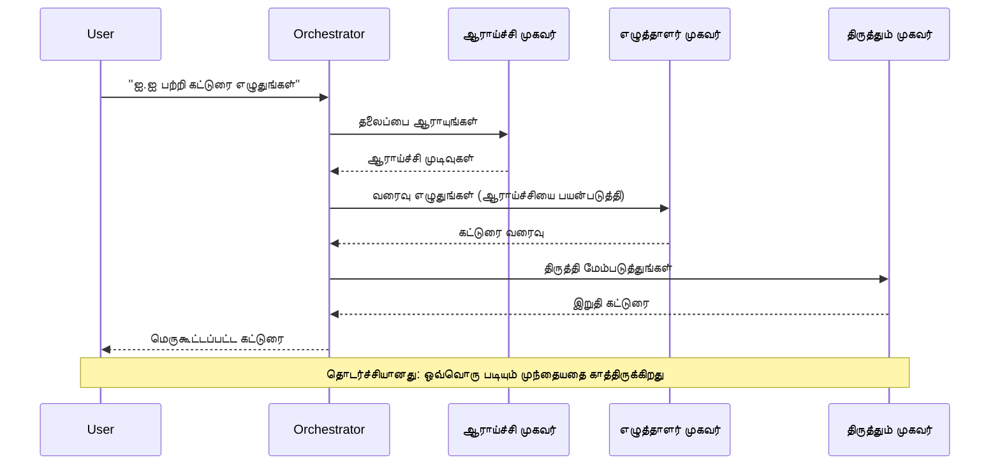
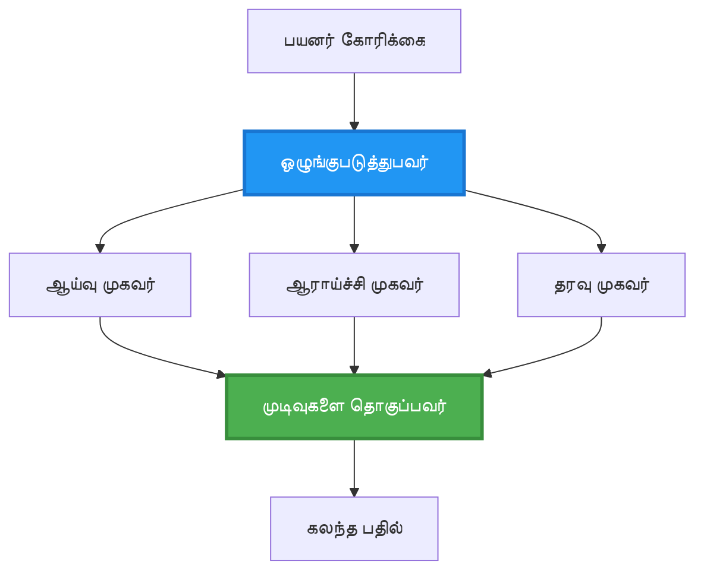
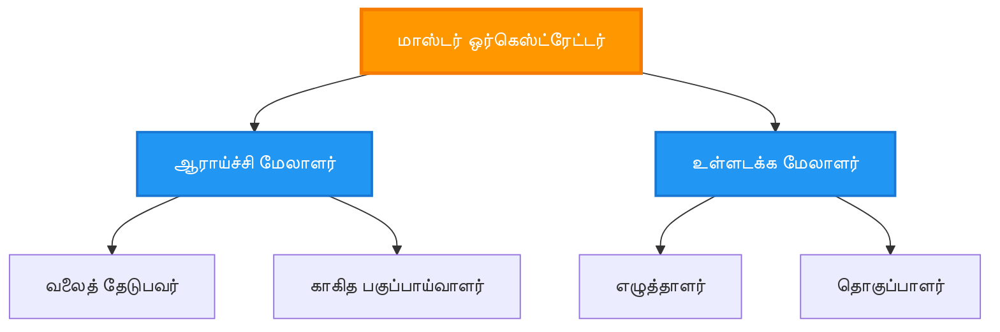
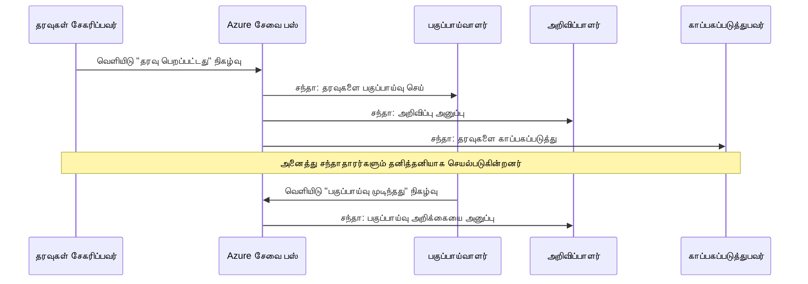
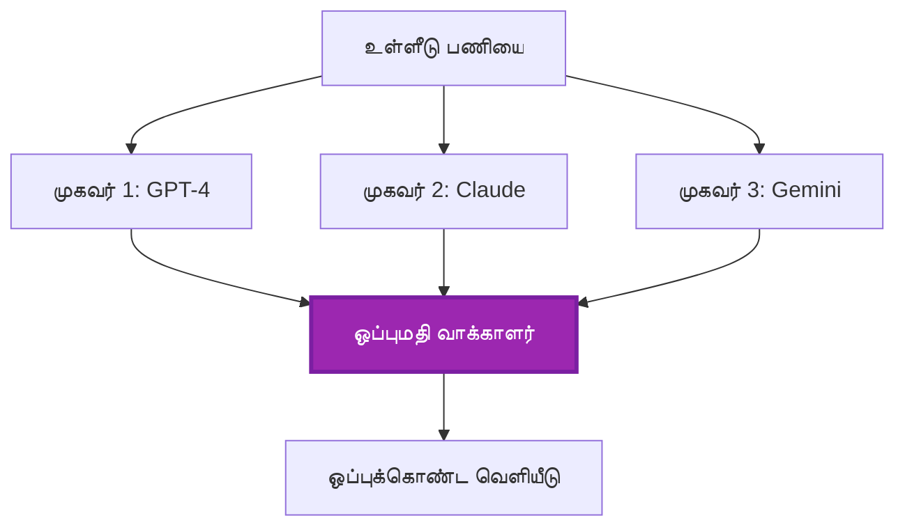
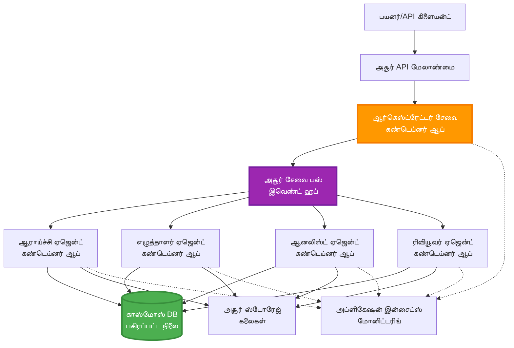

# பல முகவர் ஒருங்கிணைப்பு முறை

⏱️ **மதிப்பிடப்பட்ட நேரம்**: 60-75 நிமிடங்கள் | 💰 **மதிப்பிடப்பட்ட செலவு**: ~$100-300/மாதம் | ⭐ **சிக்கலானது**: மேம்பட்டது

**📚 கற்றல் பாதை:**
- ← முந்தையது: [திறன் திட்டமிடல்](capacity-planning.md) - வள அளவீடு மற்றும் விரிவாக்க உத்திகள்
- 🎯 **நீங்கள் இங்கே**: பல முகவர் ஒருங்கிணைப்பு முறை (ஒழுங்கமைப்பு, தொடர்பு, நிலை மேலாண்மை)
- → அடுத்தது: [SKU தேர்வு](sku-selection.md) - சரியான Azure சேவைகளைத் தேர்ந்தெடுப்பது
- 🏠 [பாடநெறி முகப்பு](../../README.md)

---

## நீங்கள் என்ன கற்றுக்கொள்வீர்கள்

இந்த பாடத்தை முடிப்பதன் மூலம், நீங்கள்:
- **பல முகவர் கட்டமைப்பு** முறைகளைப் புரிந்துகொள்வீர்கள் மற்றும் அவற்றைப் பயன்படுத்த வேண்டிய நேரத்தை அறிந்து கொள்வீர்கள்
- **ஒழுங்கமைப்பு முறைகளை** (மையப்படுத்தப்பட்ட, மையமற்ற, அடுக்குமுறை) செயல்படுத்துங்கள்
- **முகவர் தொடர்பு** உத்திகளை வடிவமைக்கவும் (ஒத்திசைவு, அசிங்க்ரோனஸ், நிகழ்வு சார்ந்த)
- **பகிரப்பட்ட நிலையை** விநியோகிக்கப்பட்ட முகவர்களுக்கிடையே நிர்வகிக்கவும்
- AZD உடன் **பல முகவர் அமைப்புகளை** Azure-ல் பிரசுரிக்கவும்
- உண்மையான AI சூழல்களுக்கு **ஒருங்கிணைப்பு முறைகளை** பயன்படுத்தவும்
- விநியோகிக்கப்பட்ட முகவர் அமைப்புகளை கண்காணிக்கவும் மற்றும் பிழைகளை சரிசெய்யவும்

## பல முகவர் ஒருங்கிணைப்பு ஏன் முக்கியம்

### பரிணாமம்: ஒற்றை முகவரிலிருந்து பல முகவருக்கு

**ஒற்றை முகவர் (எளிமையானது):**
```
User → Agent → Response
```
- ✅ புரிந்து கொள்ளவும் செயல்படுத்தவும் எளிது
- ✅ எளிய பணிகளுக்கு வேகமானது
- ❌ ஒற்றை மாதிரியின் திறன்களால் மட்டுப்படுத்தப்பட்டது
- ❌ சிக்கலான பணிகளை இணைபயன்படுத்த முடியாது
- ❌ சிறப்பு இல்லை

**பல முகவர் அமைப்பு (மேம்பட்டது):**
```
           ┌─────────────┐
           │ Orchestrator│
           └──────┬──────┘
        ┌─────────┼─────────┐
        │         │         │
    ┌───▼──┐  ┌──▼───┐  ┌──▼────┐
    │Agent1│  │Agent2│  │Agent3 │
    │(Plan)│  │(Code)│  │(Review)│
    └──────┘  └──────┘  └───────┘
```
- ✅ குறிப்பிட்ட பணிகளுக்கு சிறப்பு பெற்ற முகவர்கள்
- ✅ வேகத்திற்காக இணை செயல்பாடு
- ✅ தொகுதி மற்றும் பராமரிக்கக்கூடியது
- ✅ சிக்கலான பணிச்சூழல்களில் சிறந்தது
- ⚠️ ஒருங்கிணைப்பு தர்க்கம் தேவை

**உருவகம்**: ஒற்றை முகவர் என்பது அனைத்து பணிகளையும் ஒரே நபர் செய்வது போன்றது. பல முகவர் என்பது ஒவ்வொரு உறுப்பினரும் (ஆராய்ச்சியாளர், குறியீட்டாளர், மதிப்பீட்டாளர், எழுத்தாளர்) தனித்திறன்களைக் கொண்ட குழுவாக வேலை செய்வது போன்றது.

---

## முக்கிய ஒருங்கிணைப்பு முறைகள்

### முறை 1: தொடர்ச்சியான ஒருங்கிணைப்பு (செயல்முறை பொறுப்பு)

**எப்போது பயன்படுத்த வேண்டும்**: பணிகள் குறிப்பிட்ட வரிசையில் முடிக்க வேண்டும், ஒவ்வொரு முகவரும் முந்தைய வெளியீட்டின் அடிப்படையில் செயல்பட வேண்டும்.


**நன்மைகள்:**
- ✅ தெளிவான தரவுப் பாய்ச்சி
- ✅ பிழைகளை சரிசெய்ய எளிது
- ✅ எதிர்பார்க்கக்கூடிய செயல்பாட்டு வரிசை

**முடுக்கங்கள்:**
- ❌ மெதுவாக (இணை செயல்பாடு இல்லை)
- ❌ ஒரு தோல்வி முழு சங்கிலியைத் தடுக்கிறது
- ❌ பரஸ்பர சார்ந்த பணிகளை கையாள முடியாது

**உதாரண பயன்பாடுகள்:**
- உள்ளடக்க உருவாக்க குழாய் (ஆராய்ச்சி → எழுதுதல் → திருத்துதல் → வெளியிடுதல்)
- குறியீடு உருவாக்கம் (திட்டமிடல் → செயல்படுத்துதல் → சோதனை → பிரசுரம்)
- அறிக்கை உருவாக்கம் (தரவு சேகரிப்பு → பகுப்பாய்வு → காட்சிப்படுத்தல் → சுருக்கம்)

---

### முறை 2: இணை ஒருங்கிணைப்பு (Fan-Out/Fan-In)

**எப்போது பயன்படுத்த வேண்டும்**: சுயாதீன பணிகள் ஒரே நேரத்தில் இயங்க முடியும், முடிவுகள் இறுதியில் இணைக்கப்பட வேண்டும்.


**நன்மைகள்:**
- ✅ வேகமானது (இணை செயல்பாடு)
- ✅ பிழைத் தாங்கும் (பகுதி முடிவுகள் ஏற்றுக்கொள்ளத்தக்கவை)
- ✅ குவியலாக பரவுகிறது

**முடுக்கங்கள்:**
- ⚠️ முடிவுகள் வரிசைமுறையில் வராது
- ⚠️ தொகுப்பு தர்க்கம் தேவை
- ⚠️ சிக்கலான நிலை மேலாண்மை

**உதாரண பயன்பாடுகள்:**
- பல மூல தரவுகளை சேகரித்தல் (APIகள் + தரவுத்தொகுப்புகள் + வலைத் தேடல்)
- போட்டி பகுப்பாய்வு (பல மாதிரிகள் தீர்வுகளை உருவாக்குகின்றன, சிறந்தது தேர்ந்தெடுக்கப்படுகிறது)
- மொழிபெயர்ப்பு சேவைகள் (பல மொழிகளில் ஒரே நேரத்தில் மொழிபெயர்க்கவும்)

---

### முறை 3: அடுக்குமுறை ஒருங்கிணைப்பு (மேலாளர்-தொழிலாளி)

**எப்போது பயன்படுத்த வேண்டும்**: துணை பணிகளுடன் கூடிய சிக்கலான பணிச்சூழல்கள், ஒப்படைப்பு தேவை.


**நன்மைகள்:**
- ✅ சிக்கலான பணிச்சூழல்களை கையாளுகிறது
- ✅ தொகுதி மற்றும் பராமரிக்கக்கூடியது
- ✅ தெளிவான பொறுப்புத் எல்லைகள்

**முடுக்கங்கள்:**
- ⚠️ மேலும் சிக்கலான கட்டமைப்பு
- ⚠️ அதிக தாமதம் (பல ஒருங்கிணைப்பு அடுக்குகள்)
- ⚠️ நுண்ணிய ஒழுங்கமைப்பு தேவை

**உதாரண பயன்பாடுகள்:**
- நிறுவன ஆவண செயலாக்கம் (வகைப்படுத்துதல் → வழிமாற்று → செயலாக்கம் → காப்பகப்படுத்துதல்)
- பல நிலை தரவுப் குழாய்கள் (உட்கொள்க → சுத்தம் செய் → மாற்று → பகுப்பாய்வு செய் → அறிக்கை)
- சிக்கலான தானியக்க பணிச்சூழல்கள் (திட்டமிடல் → வள ஒதுக்கீடு → செயல்பாடு → கண்காணிப்பு)

---

### முறை 4: நிகழ்வு சார்ந்த ஒருங்கிணைப்பு (Publish-Subscribe)

**எப்போது பயன்படுத்த வேண்டும்**: முகவர்கள் நிகழ்வுகளுக்கு பதிலளிக்க வேண்டும், தளர்வான இணைப்பு விரும்பப்படுகிறது.


**நன்மைகள்:**
- ✅ முகவர்களுக்கிடையே தளர்வான இணைப்பு
- ✅ புதிய முகவர்களைச் சேர்க்க எளிது (வெறும் சந்தா)
- ✅ அசிங்க்ரோனஸ் செயலாக்கம்
- ✅ தாங்கும் (செய்தி நிலைத்தன்மை)

**முடுக்கங்கள்:**
- ⚠️ இறுதியில் நிலைத்தன்மை
- ⚠️ சிக்கலான பிழை சரிசெய்தல்
- ⚠️ செய்தி வரிசைமுறை சவால்கள்

**உதாரண பயன்பாடுகள்:**
- நேரடி கண்காணிப்பு அமைப்புகள் (எச்சரிக்கைகள், டாஷ்போர்டுகள், பதிவுகள்)
- பல சேனல் அறிவிப்புகள் (மின்னஞ்சல், SMS, push, Slack)
- தரவுப் செயலாக்க குழாய்கள் (அதே தரவின் பல நுகர்வோர்)

---

### முறை 5: ஒப்புதல் அடிப்படையிலான ஒருங்கிணைப்பு (Voting/Quorum)

**எப்போது பயன்படுத்த வேண்டும்**: தொடர்வதற்கு முன் பல முகவர்களிடமிருந்து ஒப்புதல் தேவை.


**நன்மைகள்:**
- ✅ அதிக துல்லியம் (பல கருத்துக்கள்)
- ✅ பிழைத் தாங்கும் (சிறுபான்மை தோல்விகள் ஏற்றுக்கொள்ளத்தக்கவை)
- ✅ தர உறுதிப்பாடு உள்ளடக்கப்பட்டுள்ளது

**முடுக்கங்கள்:**
- ❌ செலவானது (பல மாதிரி அழைப்புகள்)
- ❌ மெதுவாக (அனைத்து முகவர்களுக்காக காத்திருக்கிறது)
- ⚠️ மோதல் தீர்வு தேவை

**உதாரண பயன்பாடுகள்:**
- உள்ளடக்க மிதமாக்கல் (பல மாதிரிகள் உள்ளடக்கத்தை மதிப்பீடு செய்கின்றன)
- குறியீடு மதிப்பீடு (பல லிண்டர்கள்/பகுப்பாய்வாளர்கள்)
- மருத்துவ நோயறிதல் (பல AI மாதிரிகள், நிபுணர் சரிபார்ப்பு)

---

## கட்டமைப்பு கண்ணோட்டம்

### முழுமையான பல முகவர் அமைப்பு Azure-ல்


**முக்கிய கூறுகள்:**

| கூறு | நோக்கம் | Azure சேவை |
|-----------|---------|---------------|
| **API Gateway** | நுழைவு புள்ளி, விகித வரையறை, அங்கீகாரம் | API Management |
| **Orchestrator** | முகவர் பணிச்சூழல்களை ஒருங்கிணைக்கிறது | Container Apps |
| **Message Queue** | அசிங்க்ரோனஸ் தொடர்பு | Service Bus / Event Hubs |
| **Agents** | சிறப்பு பெற்ற AI தொழிலாளர்கள் | Container Apps / Functions |
| **State Store** | பகிரப்பட்ட நிலை, பணிகளை கண்காணித்தல் | Cosmos DB |
| **Artifact Storage** | ஆவணங்கள், முடிவுகள், பதிவுகள் | Blob Storage |
| **Monitoring** | விநியோகிக்கப்பட்ட கண்காணிப்பு, பதிவுகள் | Application Insights |

---

## முன் தேவைகள்

### தேவையான கருவிகள்

```bash
# Azure Developer CLI ஐ சரிபார்க்கவும்
azd version
# ✅ எதிர்பார்க்கப்பட்டது: azd பதிப்பு 1.0.0 அல்லது அதற்கு மேல்

# Azure CLI ஐ சரிபார்க்கவும்
az --version
# ✅ எதிர்பார்க்கப்பட்டது: azure-cli 2.50.0 அல்லது அதற்கு மேல்

# Docker ஐ சரிபார்க்கவும் (உள்ளூர் சோதனைக்காக)
docker --version
# ✅ எதிர்பார்க்கப்பட்டது: Docker பதிப்பு 20.10 அல்லது அதற்கு மேல்
```

### Azure தேவைகள்

- செயலில் உள்ள Azure சந்தா
- உருவாக்க அனுமதிகள்:
  - Container Apps
  - Service Bus namespaces
  - Cosmos DB accounts
  - Storage accounts
  - Application Insights

### அறிவு முன் தேவைகள்

நீங்கள் முடித்திருக்க வேண்டும்:
- [கட்டமைப்பு மேலாண்மை](../getting-started/configuration.md)
- [அங்கீகாரம் & பாதுகாப்பு](../getting-started/authsecurity.md)
- [மைக்ரோசேவைகள் உதாரணம்](../../../../examples/microservices)

---

## செயல்படுத்தல் வழிகாட்டி

### திட்ட அமைப்பு

```
multi-agent-system/
├── azure.yaml                    # AZD configuration
├── infra/
│   ├── main.bicep               # Main infrastructure
│   ├── core/
│   │   ├── servicebus.bicep     # Message queue
│   │   ├── cosmos.bicep         # State store
│   │   ├── storage.bicep        # Artifact storage
│   │   └── monitoring.bicep     # Application Insights
│   └── app/
│       ├── orchestrator.bicep   # Orchestrator service
│       └── agent.bicep          # Agent template
└── src/
    ├── orchestrator/            # Orchestration logic
    │   ├── app.py
    │   ├── workflows.py
    │   └── Dockerfile
    ├── agents/
    │   ├── research/            # Research agent
    │   ├── writer/              # Writer agent
    │   ├── analyst/             # Analyst agent
    │   └── reviewer/            # Reviewer agent
    └── shared/
        ├── state_manager.py     # Shared state logic
        └── message_handler.py   # Message handling
```

---

## பாடம் 1: தொடர்ச்சியான ஒருங்கிணைப்பு முறை

### செயல்படுத்தல்: உள்ளடக்க உருவாக்க குழாய்

ஆராய்ச்சி → எழுதுதல் → திருத்துதல் → வெளியிடுதல் என்ற தொடர்ச்சியான குழாயை உருவாக்குவோம்

### 1. AZD கட்டமைப்பு

**கோப்பு: `azure.yaml`**

```yaml
name: content-pipeline
metadata:
  template: multi-agent-sequential@1.0.0

services:
  orchestrator:
    project: ./src/orchestrator
    language: python
    host: containerapp
  
  research-agent:
    project: ./src/agents/research
    language: python
    host: containerapp
  
  writer-agent:
    project: ./src/agents/writer
    language: python
    host: containerapp
  
  editor-agent:
    project: ./src/agents/editor
    language: python
    host: containerapp
```

### 2. உள்கட்டமைப்பு: ஒருங்கிணைப்புக்கான Service Bus

**கோப்பு: `infra/core/servicebus.bicep`**

```bicep
param name string
param location string
param tags object = {}

resource serviceBusNamespace 'Microsoft.ServiceBus/namespaces@2022-10-01-preview' = {
  name: name
  location: location
  tags: tags
  sku: {
    name: 'Standard'
    tier: 'Standard'
  }
  properties: {
    minimumTlsVersion: '1.2'
  }
}

// Queue for orchestrator → research agent
resource researchQueue 'Microsoft.ServiceBus/namespaces/queues@2022-10-01-preview' = {
  parent: serviceBusNamespace
  name: 'research-tasks'
  properties: {
    maxDeliveryCount: 3
    lockDuration: 'PT5M'
    deadLetteringOnMessageExpiration: true
  }
}

// Queue for research agent → writer agent
resource writerQueue 'Microsoft.ServiceBus/namespaces/queues@2022-10-01-preview' = {
  parent: serviceBusNamespace
  name: 'writer-tasks'
  properties: {
    maxDeliveryCount: 3
    lockDuration: 'PT5M'
  }
}

// Queue for writer agent → editor agent
resource editorQueue 'Microsoft.ServiceBus/namespaces/queues@2022-10-01-preview' = {
  parent: serviceBusNamespace
  name: 'editor-tasks'
  properties: {
    maxDeliveryCount: 3
    lockDuration: 'PT5M'
  }
}

output namespace string = serviceBusNamespace.name
output connectionString string = listKeys('${serviceBusNamespace.id}/AuthorizationRules/RootManageSharedAccessKey', serviceBusNamespace.apiVersion).primaryConnectionString
```

### 3. பகிரப்பட்ட நிலை மேலாளர்

**கோப்பு: `src/shared/state_manager.py`**

```python
from azure.cosmos import CosmosClient, PartitionKey
from datetime import datetime
import os

class StateManager:
    """Manages shared state across agents using Cosmos DB"""
    
    def __init__(self):
        endpoint = os.environ['COSMOS_ENDPOINT']
        key = os.environ['COSMOS_KEY']
        
        self.client = CosmosClient(endpoint, key)
        self.database = self.client.get_database_client('agent-state')
        self.container = self.database.get_container_client('tasks')
    
    def create_task(self, task_id: str, task_type: str, input_data: dict):
        """Create a new task"""
        task = {
            'id': task_id,
            'type': task_type,
            'status': 'pending',
            'input': input_data,
            'created_at': datetime.utcnow().isoformat(),
            'steps': []
        }
        self.container.create_item(task)
        return task
    
    def update_task_step(self, task_id: str, step_name: str, result: dict):
        """Update task with completed step"""
        task = self.container.read_item(task_id, partition_key=task_id)
        
        task['steps'].append({
            'name': step_name,
            'completed_at': datetime.utcnow().isoformat(),
            'result': result
        })
        
        self.container.replace_item(task_id, task)
        return task
    
    def complete_task(self, task_id: str, final_result: dict):
        """Mark task as complete"""
        task = self.container.read_item(task_id, partition_key=task_id)
        task['status'] = 'completed'
        task['result'] = final_result
        task['completed_at'] = datetime.utcnow().isoformat()
        self.container.replace_item(task_id, task)
        return task
    
    def get_task(self, task_id: str):
        """Retrieve task state"""
        return self.container.read_item(task_id, partition_key=task_id)
```

### 4. ஒழுங்கமைப்பு சேவை

**கோப்பு: `src/orchestrator/app.py`**

```python
from flask import Flask, request, jsonify
from azure.servicebus import ServiceBusClient, ServiceBusMessage
import json
import uuid
import os
from shared.state_manager import StateManager

app = Flask(__name__)
state_manager = StateManager()

# சேவை பஸ் இணைப்பு
servicebus_connection_str = os.environ['SERVICEBUS_CONNECTION_STRING']
servicebus_client = ServiceBusClient.from_connection_string(servicebus_connection_str)

@app.route('/health', methods=['GET'])
def health():
    return jsonify({'status': 'healthy', 'service': 'orchestrator'})

@app.route('/create-content', methods=['POST'])
def create_content():
    """
    Sequential workflow: Research → Write → Edit → Publish
    """
    data = request.json
    topic = data.get('topic')
    
    if not topic:
        return jsonify({'error': 'Topic required'}), 400
    
    # மாநிலக் கடையில் பணியை உருவாக்கவும்
    task_id = str(uuid.uuid4())
    task = state_manager.create_task(
        task_id=task_id,
        task_type='content_creation',
        input_data={'topic': topic}
    )
    
    # ஆராய்ச்சி முகவருக்கு செய்தியை அனுப்பவும் (முதல் படி)
    sender = servicebus_client.get_queue_sender('research-tasks')
    message = ServiceBusMessage(
        body=json.dumps({
            'task_id': task_id,
            'topic': topic,
            'next_queue': 'writer-tasks'  # முடிவுகளை எங்கு அனுப்ப வேண்டும்
        }),
        content_type='application/json'
    )
    
    with sender:
        sender.send_messages(message)
    
    return jsonify({
        'task_id': task_id,
        'status': 'started',
        'workflow': 'sequential',
        'steps': ['research', 'write', 'edit', 'publish'],
        'message': 'Content creation pipeline initiated'
    }), 202

@app.route('/task/<task_id>', methods=['GET'])
def get_task_status(task_id):
    """Check task status"""
    try:
        task = state_manager.get_task(task_id)
        return jsonify(task)
    except Exception as e:
        return jsonify({'error': str(e)}), 404

if __name__ == '__main__':
    app.run(host='0.0.0.0', port=8080)
```

### 5. ஆராய்ச்சி முகவர்

**கோப்பு: `src/agents/research/app.py`**

```python
from azure.servicebus import ServiceBusClient, ServiceBusMessage
from openai import AzureOpenAI
import json
import os
import time
from shared.state_manager import StateManager

# கிளையன்டுகளை தொடங்கவும்
state_manager = StateManager()
servicebus_client = ServiceBusClient.from_connection_string(
    os.environ['SERVICEBUS_CONNECTION_STRING']
)

openai_client = AzureOpenAI(
    api_key=os.environ['AZURE_OPENAI_API_KEY'],
    api_version="2024-02-01",
    azure_endpoint=os.environ['AZURE_OPENAI_ENDPOINT']
)

def process_research_task(message_data):
    """Process research request and pass to writer"""
    task_id = message_data['task_id']
    topic = message_data['topic']
    next_queue = message_data['next_queue']
    
    print(f"🔬 Researching: {topic}")
    
    # ஆராய்ச்சிக்காக Azure OpenAI ஐ அழைக்கவும்
    response = openai_client.chat.completions.create(
        model="gpt-4",
        messages=[
            {"role": "system", "content": "You are a research assistant. Provide comprehensive research on the given topic."},
            {"role": "user", "content": f"Research this topic thoroughly: {topic}"}
        ],
        max_tokens=1500
    )
    
    research_results = response.choices[0].message.content
    
    # நிலையை புதுப்பிக்கவும்
    state_manager.update_task_step(
        task_id=task_id,
        step_name='research',
        result={'research': research_results}
    )
    
    # அடுத்த முகவருக்கு (எழுத்தாளர்) அனுப்பவும்
    sender = servicebus_client.get_queue_sender(next_queue)
    message = ServiceBusMessage(
        body=json.dumps({
            'task_id': task_id,
            'topic': topic,
            'research': research_results,
            'next_queue': 'editor-tasks'
        }),
        content_type='application/json'
    )
    
    with sender:
        sender.send_messages(message)
    
    print(f"✅ Research complete for task {task_id}")

def main():
    """Listen to research queue"""
    receiver = servicebus_client.get_queue_receiver('research-tasks')
    
    print("🔬 Research Agent started, listening for tasks...")
    
    with receiver:
        while True:
            messages = receiver.receive_messages(max_wait_time=5)
            for message in messages:
                try:
                    message_data = json.loads(str(message))
                    process_research_task(message_data)
                    receiver.complete_message(message)
                except Exception as e:
                    print(f"❌ Error processing message: {e}")
                    receiver.abandon_message(message)

if __name__ == '__main__':
    main()
```

### 6. எழுத்தாளர் முகவர்

**கோப்பு: `src/agents/writer/app.py`**

```python
from azure.servicebus import ServiceBusClient, ServiceBusMessage
from openai import AzureOpenAI
import json
import os
from shared.state_manager import StateManager

state_manager = StateManager()
servicebus_client = ServiceBusClient.from_connection_string(
    os.environ['SERVICEBUS_CONNECTION_STRING']
)

openai_client = AzureOpenAI(
    api_key=os.environ['AZURE_OPENAI_API_KEY'],
    api_version="2024-02-01",
    azure_endpoint=os.environ['AZURE_OPENAI_ENDPOINT']
)

def process_writing_task(message_data):
    """Write article based on research"""
    task_id = message_data['task_id']
    topic = message_data['topic']
    research = message_data['research']
    next_queue = message_data['next_queue']
    
    print(f"✍️ Writing article: {topic}")
    
    # Azure OpenAI ஐ அழைத்து கட்டுரை எழுதவும்
    response = openai_client.chat.completions.create(
        model="gpt-4",
        messages=[
            {"role": "system", "content": "You are a professional writer. Write engaging, well-structured articles."},
            {"role": "user", "content": f"Based on this research:\n\n{research}\n\nWrite a comprehensive article about: {topic}"}
        ],
        max_tokens=2000
    )
    
    article_draft = response.choices[0].message.content
    
    # நிலையை புதுப்பிக்கவும்
    state_manager.update_task_step(
        task_id=task_id,
        step_name='writing',
        result={'draft': article_draft}
    )
    
    # ஆசிரியருக்கு அனுப்பவும்
    sender = servicebus_client.get_queue_sender(next_queue)
    message = ServiceBusMessage(
        body=json.dumps({
            'task_id': task_id,
            'topic': topic,
            'draft': article_draft
        }),
        content_type='application/json'
    )
    
    with sender:
        sender.send_messages(message)
    
    print(f"✅ Article draft complete for task {task_id}")

def main():
    """Listen to writer queue"""
    receiver = servicebus_client.get_queue_receiver('writer-tasks')
    
    print("✍️ Writer Agent started, listening for tasks...")
    
    with receiver:
        while True:
            messages = receiver.receive_messages(max_wait_time=5)
            for message in messages:
                try:
                    message_data = json.loads(str(message))
                    process_writing_task(message_data)
                    receiver.complete_message(message)
                except Exception as e:
                    print(f"❌ Error: {e}")
                    receiver.abandon_message(message)

if __name__ == '__main__':
    main()
```

### 7. திருத்துநர் முகவர்

**கோப்பு: `src/agents/editor/app.py`**

```python
from azure.servicebus import ServiceBusClient
from openai import AzureOpenAI
import json
import os
from shared.state_manager import StateManager

state_manager = StateManager()
servicebus_client = ServiceBusClient.from_connection_string(
    os.environ['SERVICEBUS_CONNECTION_STRING']
)

openai_client = AzureOpenAI(
    api_key=os.environ['AZURE_OPENAI_API_KEY'],
    api_version="2024-02-01",
    azure_endpoint=os.environ['AZURE_OPENAI_ENDPOINT']
)

def process_editing_task(message_data):
    """Edit and finalize article"""
    task_id = message_data['task_id']
    topic = message_data['topic']
    draft = message_data['draft']
    
    print(f"📝 Editing article: {topic}")
    
    # Azure OpenAI ஐ அழைக்கவும் திருத்தவும்
    response = openai_client.chat.completions.create(
        model="gpt-4",
        messages=[
            {"role": "system", "content": "You are an expert editor. Improve grammar, clarity, and structure."},
            {"role": "user", "content": f"Edit and improve this article:\n\n{draft}"}
        ],
        max_tokens=2000
    )
    
    final_article = response.choices[0].message.content
    
    # பணியை முடிந்ததாக குறிக்கவும்
    state_manager.complete_task(
        task_id=task_id,
        final_result={
            'topic': topic,
            'final_article': final_article,
            'word_count': len(final_article.split())
        }
    )
    
    print(f"✅ Article finalized for task {task_id}")

def main():
    """Listen to editor queue"""
    receiver = servicebus_client.get_queue_receiver('editor-tasks')
    
    print("📝 Editor Agent started, listening for tasks...")
    
    with receiver:
        while True:
            messages = receiver.receive_messages(max_wait_time=5)
            for message in messages:
                try:
                    message_data = json.loads(str(message))
                    process_editing_task(message_data)
                    receiver.complete_message(message)
                except Exception as e:
                    print(f"❌ Error: {e}")
                    receiver.abandon_message(message)

if __name__ == '__main__':
    main()
```

### 8. பிரசுரம் மற்றும் சோதனை

```bash
# தொடங்கவும் மற்றும் பிரசுரிக்கவும்
azd init
azd up

# ஒர்கெஸ்ட்ரேட்டர் URL ஐ பெறவும்
ORCHESTRATOR_URL=$(azd env get-values | grep ORCHESTRATOR_URL | cut -d '=' -f2 | tr -d '"')

# உள்ளடக்கத்தை உருவாக்கவும்
curl -X POST $ORCHESTRATOR_URL/create-content \
  -H "Content-Type: application/json" \
  -d '{"topic": "The Future of AI in Healthcare"}'
```

**✅ எதிர்பார்க்கப்படும் வெளியீடு:**
```json
{
  "task_id": "a1b2c3d4-e5f6-7890-abcd-ef1234567890",
  "status": "started",
  "workflow": "sequential",
  "steps": ["research", "write", "edit", "publish"],
  "message": "Content creation pipeline initiated"
}
```

**பணியின் முன்னேற்றத்தைச் சரிபார்க்கவும்:**
```bash
TASK_ID="a1b2c3d4-e5f6-7890-abcd-ef1234567890"
curl $ORCHESTRATOR_URL/task/$TASK_ID
```

**✅ எதிர்பார்க்கப்படும் வெளியீடு (முடிக்கப்பட்டது):**
```json
{
  "id": "a1b2c3d4-e5f6-7890-abcd-ef1234567890",
  "type": "content_creation",
  "status": "completed",
  "steps": [
    {
      "name": "research",
      "completed_at": "2025-11-19T10:30:00Z",
      "result": {"research": "..."}
    },
    {
      "name": "writing",
      "completed_at": "2025-11-19T10:32:00Z",
      "result": {"draft": "..."}
    }
  ],
  "result": {
    "topic": "The Future of AI in Healthcare",
    "final_article": "...",
    "word_count": 1500
  }
}
```

---

## பாடம் 2: இணை ஒருங்கிணைப்பு முறை

### செயல்படுத்தல்: பல மூல ஆராய்ச்சி தொகுப்பாளர்

பல மூலங்களில் இருந்து ஒரே நேரத்தில் தகவல்களை சேகரிக்கும் இணை அமைப்பை உருவாக்குவோம்.

### இணை ஒழுங்கமைப்பாளர்

**கோப்பு: `src/orchestrator/parallel_workflow.py`**

```python
from flask import Flask, request, jsonify
from azure.servicebus import ServiceBusClient, ServiceBusMessage
import json
import uuid
import os
from shared.state_manager import StateManager

app = Flask(__name__)
state_manager = StateManager()

servicebus_client = ServiceBusClient.from_connection_string(
    os.environ['SERVICEBUS_CONNECTION_STRING']
)

@app.route('/research-parallel', methods=['POST'])
def research_parallel():
    """
    Parallel workflow: Multiple agents work simultaneously
    """
    data = request.json
    query = data.get('query')
    
    task_id = str(uuid.uuid4())
    task = state_manager.create_task(
        task_id=task_id,
        task_type='parallel_research',
        input_data={
            'query': query,
            'agents': ['web', 'academic', 'news', 'social']
        }
    )
    
    # பங்கு வெளியேற்றம்: அனைத்து முகவர்களுக்கும் ஒரே நேரத்தில் அனுப்பவும்
    agents = [
        ('web-research-queue', 'web'),
        ('academic-research-queue', 'academic'),
        ('news-research-queue', 'news'),
        ('social-research-queue', 'social')
    ]
    
    for queue_name, agent_type in agents:
        sender = servicebus_client.get_queue_sender(queue_name)
        message = ServiceBusMessage(
            body=json.dumps({
                'task_id': task_id,
                'query': query,
                'agent_type': agent_type,
                'result_queue': 'aggregation-queue'
            }),
            content_type='application/json'
        )
        
        with sender:
            sender.send_messages(message)
    
    return jsonify({
        'task_id': task_id,
        'status': 'started',
        'workflow': 'parallel',
        'agents_dispatched': 4,
        'message': 'Parallel research initiated'
    }), 202

if __name__ == '__main__':
    app.run(host='0.0.0.0', port=8080)
```

### தொகுப்பு தர்க்கம்

**கோப்பு: `src/agents/aggregator/app.py`**

```python
from azure.servicebus import ServiceBusClient
import json
import os
from collections import defaultdict
from shared.state_manager import StateManager

state_manager = StateManager()
servicebus_client = ServiceBusClient.from_connection_string(
    os.environ['SERVICEBUS_CONNECTION_STRING']
)

# ஒவ்வொரு பணிக்கான முடிவுகளை கண்காணிக்கவும்
task_results = defaultdict(list)
expected_agents = 4  # வலை, கல்வி, செய்திகள், சமூக

def process_result(message_data):
    """Aggregate results from parallel agents"""
    task_id = message_data['task_id']
    agent_type = message_data['agent_type']
    result = message_data['result']
    
    # முடிவுகளை சேமிக்கவும்
    task_results[task_id].append({
        'agent': agent_type,
        'data': result
    })
    
    print(f"📊 Received result from {agent_type} agent ({len(task_results[task_id])}/{expected_agents})")
    
    # அனைத்து முகவர்களும் முடித்ததா என்பதை சரிபார்க்கவும் (fan-in)
    if len(task_results[task_id]) == expected_agents:
        print(f"✅ All agents completed for task {task_id}. Aggregating...")
        
        # முடிவுகளை இணைக்கவும்
        aggregated = {
            'query': message_data['query'],
            'sources': task_results[task_id],
            'summary': generate_summary(task_results[task_id])
        }
        
        # முடிந்தது என்று குறிக்கவும்
        state_manager.complete_task(task_id, aggregated)
        
        # சுத்தம் செய்யவும்
        del task_results[task_id]
        
        print(f"✅ Aggregation complete for task {task_id}")

def generate_summary(results):
    """Generate summary from all sources"""
    summaries = [r['data'].get('summary', '') for r in results]
    return '\n\n'.join(summaries)

def main():
    """Listen to aggregation queue"""
    receiver = servicebus_client.get_queue_receiver('aggregation-queue')
    
    print("📊 Aggregator started, listening for results...")
    
    with receiver:
        while True:
            messages = receiver.receive_messages(max_wait_time=5)
            for message in messages:
                try:
                    message_data = json.loads(str(message))
                    process_result(message_data)
                    receiver.complete_message(message)
                except Exception as e:
                    print(f"❌ Error: {e}")
                    receiver.abandon_message(message)

if __name__ == '__main__':
    main()
```

**இணை முறையின் நன்மைகள்:**
- ⚡ **4x வேகமானது** (முகவர்கள் ஒரே நேரத்தில் இயங்குகின்றனர்)
- 🔄 **பிழைத் தாங்கும்** (பகுதி முடிவுகள் ஏற்றுக்கொள்ளத்தக்கவை)
- 📈 **குவியலாக பரவுகிறது** (முகவர்களை எளிதாகச் சேர்க்கவும்)

---

## நடைமுறை பயிற்சிகள்

### பயிற்சி 1: நேரம் முடிவைச் சேர்க்கவும் ⭐⭐ (மிதமானது)

**நோக்கம்**: தொகுப்பாளர் மெதுவாக செயல்படும் முகவர்களுக்காக நிரந்தரமாக காத்திருக்காமல் நேரம் முடிவைச் செயல்படுத்தவும்.

**அடிகள்**:

1. **தொகுப்பாளருக்கு நேரம் முடிவு கண்காணிப்பைச் சேர்க்கவும்:**

```python
from datetime import datetime, timedelta

task_timeouts = {}  # task_id -> காலாவதி நேரம்

def process_result(message_data):
    task_id = message_data['task_id']
    
    # முதல் முடிவில் நேரத்தை அமைக்கவும்
    if task_id not in task_timeouts:
        task_timeouts[task_id] = datetime.utcnow() + timedelta(seconds=30)
    
    task_results[task_id].append({
        'agent': message_data['agent_type'],
        'data': message_data['result']
    })
    
    # முடிந்தது அல்லது நேரம் முடிந்தது என்பதை சரிபார்க்கவும்
    if len(task_results[task_id]) == expected_agents or \
       datetime.utcnow() > task_timeouts[task_id]:
        
        print(f"📊 Aggregating with {len(task_results[task_id])}/{expected_agents} results")
        
        aggregated = {
            'query': message_data['query'],
            'sources': task_results[task_id],
            'completed_agents': len(task_results[task_id]),
            'timed_out': len(task_results[task_id]) < expected_agents
        }
        
        state_manager.complete_task(task_id, aggregated)
        
        # சுத்தம் செய்யவும்
        del task_results[task_id]
        del task_timeouts[task_id]
```

2. **கற்பனை தாமதங்களுடன் சோதிக்கவும்:**

```python
# ஒரு முகவரில் மெதுவான செயலாக்கத்தை ஒத்திகை செய்ய தாமதத்தைச் சேர்க்கவும்
import time
time.sleep(35)  # 30 வினாடி நேரத்தை மீறுகிறது
```

3. **பிரசுரம் செய்து சரிபார்க்கவும்:**

```bash
azd deploy aggregator

# பணியை சமர்ப்பிக்கவும்
curl -X POST $ORCHESTRATOR_URL/research-parallel \
  -H "Content-Type: application/json" \
  -d '{"query": "AI safety research"}'

# 30 விநாடிகள் கழித்து முடிவுகளை சரிபார்க்கவும்
curl $ORCHESTRATOR_URL/task/$TASK_ID
```

**✅ வெற்றியின் அளவுகோல்கள்:**
- ✅ முகவர்கள் முடிக்காவிட்டாலும் 30 வினாடிகளில் பணி முடிகிறது
- ✅ பதில் பகுதி முடிவுகளை குறிக்கிறது (`"timed_out": true`)
- ✅ கிடைக்கக்கூடிய முடிவுகள் திரும்புகின்றன (4 முகவர்களில் 3)

**நேரம்**: 20-25 நிமிடங்கள்

---

### பயிற்சி 2: மீண்டும் முயற்சி தர்க்கம் செயல்படுத்தவும் ⭐⭐⭐ (மேம்பட்டது)

**நோக்கம்**: தோல்வியடைந்த முகவர் பணிகளை முழுமையாக முயற்சிக்குமுன் தானாகவே மீண்டும் முயற்சிக்கவும்.

**அடிகள்**:

1. **ஒழுங்கமைப்பாளருக்கு மீண்டும் முயற்சி கண்காணிப்பைச் சேர்க்கவும்:**

```python
from dataclasses import dataclass
from typing import Dict

@dataclass
class RetryConfig:
    max_retries: int = 3
    backoff_seconds: int = 5

retry_counts: Dict[str, int] = {}  # செய்தி_அடையாளம் -> மீண்டும் முயற்சி எண்ணிக்கை

def send_with_retry(queue_name: str, message_data: dict, retry_config: RetryConfig):
    """Send message with retry metadata"""
    message_id = message_data.get('message_id', str(uuid.uuid4()))
    message_data['message_id'] = message_id
    message_data['retry_count'] = retry_counts.get(message_id, 0)
    message_data['max_retries'] = retry_config.max_retries
    
    sender = servicebus_client.get_queue_sender(queue_name)
    message = ServiceBusMessage(
        body=json.dumps(message_data),
        content_type='application/json',
        message_id=message_id
    )
    
    with sender:
        sender.send_messages(message)
```

2. **முகவர்களுக்கு மீண்டும் முயற்சி கையாளியைச் சேர்க்கவும்:**

```python
def process_with_retry(message, receiver, process_func):
    """Process message with automatic retry on failure"""
    try:
        message_data = json.loads(str(message))
        
        # செய்தியை செயல்படுத்து
        process_func(message_data)
        
        # வெற்றி - முடிந்தது
        receiver.complete_message(message)
        
    except Exception as e:
        message_id = message.message_id
        retry_count = message_data.get('retry_count', 0)
        max_retries = message_data.get('max_retries', 3)
        
        if retry_count < max_retries:
            # மீண்டும் முயற்சி: கைவிடவும் மற்றும் எண்ணிக்கை அதிகரிக்கப்பட்டு மீண்டும் வரிசைப்படுத்தவும்
            print(f"⚠️ Retry {retry_count + 1}/{max_retries} for message {message_id}")
            
            message_data['retry_count'] = retry_count + 1
            
            # ஒரே வரிசைக்கு தாமதத்துடன் திருப்பி அனுப்பவும்
            time.sleep(5 * (retry_count + 1))  # பெருக்கமான பின்வாங்கல்
            send_with_retry(queue_name, message_data, RetryConfig())
            
            receiver.complete_message(message)  # முதன்மையை நீக்கவும்
        else:
            # அதிகபட்ச மீண்டும் முயற்சிகள் மீறப்பட்டது - இறந்த கடித வரிசைக்கு நகர்த்தவும்
            print(f"❌ Max retries exceeded for message {message_id}")
            receiver.dead_letter_message(
                message,
                reason="MaxRetriesExceeded",
                error_description=str(e)
            )
```

3. **மரண எழுத்து வரிசையை கண்காணிக்கவும்:**

```python
def monitor_dead_letters():
    """Check dead letter queue for failed messages"""
    receiver = servicebus_client.get_queue_receiver(
        'research-queue',
        sub_queue='deadletter'
    )
    
    with receiver:
        messages = receiver.receive_messages(max_wait_time=5)
        for message in messages:
            print(f"☠️ Dead letter: {message.message_id}")
            print(f"Reason: {message.dead_letter_reason}")
            print(f"Description: {message.dead_letter_error_description}")
```

**✅ வெற்றியின் அளவுகோல்கள்:**
- ✅ தோல்வியடைந்த பணிகள் தானாகவே மீண்டும் முயற்சிக்கின்றன (3 முறை வரை)
- ✅ மீண்டும் முயற்சிகளுக்கு இடையில் அதிகரிக்கும் இடைவெளி (5s, 10s, 15s)
- ✅ அதிகபட்ச முயற்சிகளுக்குப் பிறகு, செய்திகள் மரண எழுத்து வரிசைக்கு செல்கின்றன
- ✅ மரண எழுத்து வரிசை கண்காணிக்கப்படலாம் மற்றும் மீண்டும் இயக்கப்படலாம்

**நேரம்**: 30-40 நிமிடங்கள்

---

### பயிற்சி 3: சுற்று முறையை செயல்படுத்தவும் ⭐⭐⭐ (மேம்பட்டது)

**நோக்கம்**: தோல்வியடைந்த முகவர்களுக்கு கோரிக்கைகளை நிறுத்துவதன் மூலம் பரவலான தோல்விகளைத் தடுக்கவும்.

**அடிகள்**:

1. **சுற்று முறையின் வகுப்பை உருவாக்கவும்:**

```python
from enum import Enum
from datetime import datetime, timedelta

class CircuitState(Enum):
    CLOSED = "closed"      # சாதாரண செயல்பாடு
    OPEN = "open"          # தோல்வி, கோரிக்கைகளை நிராகரிக்கவும்
    HALF_OPEN = "half_open"  # மீட்கப்பட்டதா என சோதனை செய்க

class CircuitBreaker:
    def __init__(self, failure_threshold=5, timeout_seconds=60):
        self.failure_threshold = failure_threshold
        self.timeout_seconds = timeout_seconds
        self.failure_count = 0
        self.last_failure_time = None
        self.state = CircuitState.CLOSED
    
    def call(self, func):
        """Execute function with circuit breaker protection"""
        if self.state == CircuitState.OPEN:
            # நேரம் முடிந்ததா என சரிபார்க்கவும்
            if datetime.utcnow() - self.last_failure_time > timedelta(seconds=self.timeout_seconds):
                self.state = CircuitState.HALF_OPEN
                print("🔄 Circuit breaker: HALF_OPEN (testing)")
            else:
                raise Exception(f"Circuit breaker OPEN for agent. Try again in {self.timeout_seconds}s")
        
        try:
            result = func()
            
            # வெற்றி
            if self.state == CircuitState.HALF_OPEN:
                self.state = CircuitState.CLOSED
                self.failure_count = 0
                print("✅ Circuit breaker: CLOSED (recovered)")
            
            return result
            
        except Exception as e:
            self.failure_count += 1
            self.last_failure_time = datetime.utcnow()
            
            if self.failure_count >= self.failure_threshold:
                self.state = CircuitState.OPEN
                print(f"🔴 Circuit breaker: OPEN (too many failures)")
            
            raise e
```

2. **முகவர் அழைப்புகளுக்கு பயன்படுத்தவும்:**

```python
# ஒர்கெஸ்ட்ரேட்டரில்
agent_circuits = {
    'web': CircuitBreaker(failure_threshold=5, timeout_seconds=60),
    'academic': CircuitBreaker(failure_threshold=5, timeout_seconds=60),
    'news': CircuitBreaker(failure_threshold=5, timeout_seconds=60),
    'social': CircuitBreaker(failure_threshold=5, timeout_seconds=60)
}

def send_to_agent(agent_type, message_data):
    """Send with circuit breaker protection"""
    circuit = agent_circuits[agent_type]
    
    try:
        circuit.call(lambda: send_message(agent_type, message_data))
    except Exception as e:
        print(f"⚠️ Skipping {agent_type} agent: {e}")
        # மற்ற ஏஜென்ட்களுடன் தொடரவும்
```

3. **சுற்று முறையைச் சோதிக்கவும்:**

```bash
# மீண்டும் மீண்டும் தோல்விகளை சிமுலேட் செய்யவும் (ஒரு முகவரியை நிறுத்தவும்)
az containerapp stop --name web-research-agent --resource-group rg-agents

# பல கோரிக்கைகளை அனுப்பவும்
for i in {1..10}; do
  curl -X POST $ORCHESTRATOR_URL/research-parallel \
    -H "Content-Type: application/json" \
    -d '{"query": "test query '$i'"}'
  sleep 2
done

# பதிவுகளை சரிபார்க்கவும் - 5 தோல்விகளுக்குப் பிறகு சுற்று திறக்கப்பட்டதை காண வேண்டும்
azd logs orchestrator --tail 50
```

**✅ வெற்றியின் அளவுகோல்கள்:**
- ✅ 5 தோல்விகளுக்குப் பிறகு, சுற்று திறக்கிறது (கோரிக்கைகளை நிராகரிக்கிறது)
- ✅ 60 வினாடிகளுக்குப் பிறகு, சுற்று பாதி திறக்கிறது (மீட்பு சோதிக்கிறது)
- ✅ மற்ற முகவர்கள் சாதாரணமாக வேலை செய்கின்றனர்
- ✅ முகவர் மீட்கும்போது சுற்று தானாகவே மூடுகிறது

**நேரம்**: 40-50 நிமிடங்கள்

---

## கண்காணிப்பு மற்றும் பிழை சரிசெய்தல்

### Application Insights உடன் விநியோகிக்கப்பட்ட கண்காணிப்பு

**கோப்பு: `src/shared/tracing.py`**

```python
from opencensus.ext.azure.log_exporter import AzureLogHandler
from opencensus.ext.azure.trace_exporter import AzureExporter
from opencensus.trace import config_integration
from opencensus.trace.tracer import Tracer
from opencensus.trace.samplers import AlwaysOnSampler
import logging
import os

# கண்காணிப்பை அமைக்கவும்
config_integration.trace_integrations(['requests', 'logging'])

connection_string = os.environ.get('APPLICATIONINSIGHTS_CONNECTION_STRING')

# டிரேசரை உருவாக்கவும்
tracer = Tracer(
    exporter=AzureExporter(connection_string=connection_string),
    sampler=AlwaysOnSampler()
)

# பதிவு செய்யலை அமைக்கவும்
logger = logging.getLogger(__name__)
logger.addHandler(AzureLogHandler(connection_string=connection_string))
logger.setLevel(logging.INFO)

def trace_agent_call(agent_name, task_id, operation):
    """Trace agent operations"""
    with tracer.span(name=f'{agent_name}.{operation}') as span:
        span.add_attribute('agent', agent_name)
        span.add_attribute('task_id', task_id)
        span.add_attribute('operation', operation)
        
        try:
            result = operation()
            span.add_attribute('status', 'success')
            return result
        except Exception as e:
            span.add_attribute('status', 'error')
            span.add_attribute('error', str(e))
            raise
```

### Application Insights கேள்விகள்

**பல முகவர் பணிச்சூழல்களை கண்காணிக்கவும்:**

```kusto
// Trace complete workflow for a task
traces
| where customDimensions.task_id == "a1b2c3d4-..."
| project timestamp, message, customDimensions.agent, customDimensions.operation
| order by timestamp asc
```

**முகவர் செயல்திறன் ஒப்பீடு:**

```kusto
// Compare agent execution times
dependencies
| where name contains "agent"
| summarize 
    avg_duration = avg(duration),
    p95_duration = percentile(duration, 95),
    count = count()
  by agent = tostring(customDimensions.agent)
| order by avg_duration desc
```

**தோல்வி பகுப்பாய்வு:**

```kusto
// Find which agents fail most
exceptions
| where customDimensions.agent != ""
| summarize 
    failure_count = count(),
    unique_errors = dcount(outerMessage)
  by agent = tostring(customDimensions.agent)
| order by failure_count desc
```

---

## செலவு பகுப்பாய்வு

### பல முகவர் அமைப்பு செலவுகள் (மாதாந்திர மதிப்பீடுகள்)

| கூறு | கட்டமைப்பு | செலவு |
|-----------|--------------|------|
| **Orchestrator** | 1 Container App (1 vCPU, 2GB) | $30-50 |
| **4 Agents** | 4 Container Apps (0.5 vCPU, 1GB each) | $60-120 |
| **Service Bus** | Standard tier, 10M messages | $10-20 |
| **Cosmos DB** | Serverless, 5GB storage, 1M RUs | $25-50 |
| **Blob Storage** | 10GB storage, 100K operations
## பிழைத்திருத்த வழிகாட்டி

### பிரச்சினை: செய்திகள் வரிசையில் சிக்கியுள்ளன

**அறிகுறிகள்:**
- செய்திகள் வரிசையில் சேர்ந்து கொண்டே இருக்கின்றன
- முகவர்கள் செயல்படவில்லை
- பணியின் நிலை "pending" ஆகவே உள்ளது

**கணிப்புகள்:**
```bash
# வரிசையின் ஆழத்தை சரிபார்க்கவும்
az servicebus queue show \
  --namespace-name mybus \
  --name research-tasks \
  --query "countDetails"

# முகவரின் ஆரோக்கியத்தை சரிபார்க்கவும்
azd logs research-agent --tail 50
```

**தீர்வுகள்:**

1. **முகவர் பிரதிகளை அதிகரிக்கவும்:**
   ```bash
   az containerapp update \
     --name research-agent \
     --min-replicas 3 \
     --max-replicas 10
   ```

2. **Dead letter வரிசையை சரிபார்க்கவும்:**
   ```bash
   az servicebus queue show \
     --namespace-name mybus \
     --name research-tasks \
     --query "countDetails.deadLetterMessageCount"
   ```

---

### பிரச்சினை: பணி நேரம் முடிவடையாமல்/முடிவடையவில்லை

**அறிகுறிகள்:**
- பணியின் நிலை "in_progress" ஆகவே உள்ளது
- சில முகவர்கள் முடிக்கின்றனர், மற்றவர்கள் முடியவில்லை
- எந்த பிழை செய்திகளும் இல்லை

**கணிப்புகள்:**
```bash
# பணியின் நிலையை சரிபார்க்கவும்
curl $ORCHESTRATOR_URL/task/$TASK_ID

# பயன்பாட்டு உள்ளீடுகளை சரிபார்க்கவும்
# கேள்வியை இயக்கவும்: traces | where customDimensions.task_id == "..."
```

**தீர்வுகள்:**

1. **Aggregator-ல் timeout செயல்படுத்தவும் (Exercise 1)**

2. **முகவர் தோல்விகளை சரிபார்க்கவும்:**
   ```bash
   azd logs --follow | grep "ERROR\|FAIL"
   ```

3. **அனைத்து முகவர்களும் இயங்குகிறதா என்பதை உறுதிசெய்யவும்:**
   ```bash
   az containerapp list \
     --resource-group rg-agents \
     --query "[].{name:name, status:properties.runningStatus}"
   ```

---

## மேலும் அறிக

### அதிகாரப்பூர்வ ஆவணங்கள்
- [Azure Service Bus](https://learn.microsoft.com/azure/service-bus-messaging/service-bus-messaging-overview)
- [Cosmos DB](https://learn.microsoft.com/azure/cosmos-db/introduction)
- [Container Apps DAPR](https://learn.microsoft.com/azure/container-apps/dapr-overview)
- [Multi-Agent Design Patterns](https://learn.microsoft.com/azure/architecture/guide/ai/multi-agent-systems)

### இந்த பாடத்தில் அடுத்த படிகள்
- ← முந்தையது: [திறன் திட்டமிடல்](capacity-planning.md)
- → அடுத்தது: [SKU தேர்வு](sku-selection.md)
- 🏠 [பாடம் முகப்பு](../../README.md)

### தொடர்புடைய உதாரணங்கள்
- [Microservices Example](../../../../examples/microservices) - சேவை தொடர்பு முறைமைகள்
- [Azure OpenAI Example](../../../../examples/azure-openai-chat) - AI ஒருங்கிணைப்பு

---

## சுருக்கம்

**நீங்கள் கற்றுக்கொண்டது:**
- ✅ ஐந்து ஒருங்கிணைப்பு முறைமைகள் (தொடர்ச்சி, இணை, மேலாண்மை, நிகழ்வு சார்ந்த, ஒப்புதல்)
- ✅ Azure-ல் பல முகவர் கட்டமைப்பு (Service Bus, Cosmos DB, Container Apps)
- ✅ பகிரப்பட்ட முகவர்களுக்கிடையே நிலை மேலாண்மை
- ✅ Timeout கையாளுதல், மீண்டும் முயற்சிகள், மற்றும் circuit breakers
- ✅ பகிரப்பட்ட அமைப்புகளை கண்காணித்தல் மற்றும் பிழைத்திருத்தம்
- ✅ செலவுக் குறைப்புத் திட்டங்கள்

**முக்கிய குறிப்புகள்:**
1. **சரியான முறைமையை தேர்வு செய்யவும்** - ஒழுங்கமைக்கப்பட்ட பணிகளுக்கு தொடர்ச்சி, வேகத்திற்காக இணை, நெகிழ்வுத்தன்மைக்காக நிகழ்வு சார்ந்தது
2. **நிலையை கவனமாக மேலாண்மை செய்யவும்** - பகிரப்பட்ட நிலைக்கு Cosmos DB அல்லது இதற்கு இணையானதைப் பயன்படுத்தவும்
3. **தோல்விகளை நன்கு கையாளவும்** - Timeouts, மீண்டும் முயற்சிகள், circuit breakers, dead letter வரிசைகள்
4. **அனைத்தையும் கண்காணிக்கவும்** - பகிரப்பட்ட tracing பிழைத்திருத்தத்திற்கு முக்கியம்
5. **செலவுகளை மேம்படுத்தவும்** - பூஜ்யத்திற்கு அளவிடவும், serverless பயன்படுத்தவும், caching செயல்படுத்தவும்

**அடுத்த படிகள்:**
1. நடைமுறை பயிற்சிகளை முடிக்கவும்
2. உங்கள் பயன்பாட்டிற்கான பல முகவர் அமைப்பை உருவாக்கவும்
3. செயல்திறன் மற்றும் செலவுகளை மேம்படுத்த [SKU தேர்வு](sku-selection.md) படிக்கவும்

---

<!-- CO-OP TRANSLATOR DISCLAIMER START -->
**குறிப்பு**:  
இந்த ஆவணம் AI மொழிபெயர்ப்பு சேவை [Co-op Translator](https://github.com/Azure/co-op-translator) பயன்படுத்தி மொழிபெயர்க்கப்பட்டுள்ளது. நாங்கள் துல்லியத்திற்காக முயற்சிக்கிறோம், ஆனால் தானியங்கி மொழிபெயர்ப்புகளில் பிழைகள் அல்லது தவறுகள் இருக்கக்கூடும் என்பதை கவனத்தில் கொள்ளவும். அதன் தாய்மொழியில் உள்ள மூல ஆவணம் அதிகாரப்பூர்வ ஆதாரமாக கருதப்பட வேண்டும். முக்கியமான தகவல்களுக்கு, தொழில்முறை மனித மொழிபெயர்ப்பு பரிந்துரைக்கப்படுகிறது. இந்த மொழிபெயர்ப்பைப் பயன்படுத்துவதால் ஏற்படும் எந்த தவறான புரிதல்கள் அல்லது தவறான விளக்கங்களுக்கு நாங்கள் பொறுப்பல்ல.
<!-- CO-OP TRANSLATOR DISCLAIMER END -->