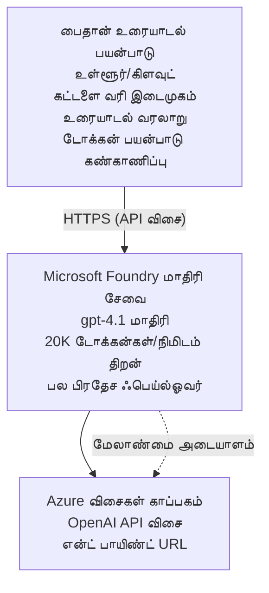

# Microsoft Foundry Models உரையாடல் பயன்பாடு

**Learning Path:** இடைநிலை ⭐⭐ | **Time:** 35-45 minutes | **Cost:** $50-200/month

Azure Developer CLI (azd) பயன்படுத்தி வழங்கப்பட்ட ஒரு முழுமையான Microsoft Foundry Models உரையாடல் பயன்பாடு. இந்த உதாரணம் gpt-4.1 மாடல் அமைப்பை வெளியிடுதல், பாதுகாப்பான API அணுகலை, மற்றும் ஒரு எளிய உரையாடல் இடைமுகத்தை காட்டுகிறது.

## 🎯 நீங்கள் எதை கற்பீர்கள்

- gpt-4.1 மாடலைப் பயன்படுத்தி Microsoft Foundry Models சேவையை வெளியிடுவது
- Key Vault மூலம் OpenAI API கீகளை பாதுகாப்பாக சேமிப்பது
- Python கொண்டு ஒரு எளிய உரையாடல் இடைமுகம் உருவாக்குதல்
- டோக்கன் பயன்பாடையும் செலவுகளையும் கண்காணித்தல்
- விகித வரம்புகள் மற்றும் பிழை கையாளுதல்களை செயல்படுத்தல்

## 📦 இதில் எது சேர்க்கப்பட்டுள்ளது

✅ **Microsoft Foundry Models Service** - gpt-4.1 மாடல் வெளியீடு  
✅ **Python Chat App** - எளிய கட்டளை வரி உரையாடல் இடைமுகம்  
✅ **Key Vault Integration** - பாதுகாப்பான API கீ சேமிப்பு  
✅ **ARM Templates** - முழுமையான இன்ஃபிராஸ்ட்ரக்சர் as code  
✅ **Cost Monitoring** - டோக்கன் பயன்பாடு கண்காணிப்பு  
✅ **Rate Limiting** - கோட்டா முடிவடைவைத் தடுக்குதல்  

## Architecture



## Prerequisites

### தேவையானவை

- **Azure Developer CLI (azd)** - [நிறுவல் வழிகாட்டி](https://learn.microsoft.com/azure/developer/azure-developer-cli/install-azd)
- **Azure subscription** OpenAI அணுகலுடன் - [அணுகலை கோரவும்](https://aka.ms/oai/access)
- **Python 3.9+** - [Python ஐ நிறுவுக](https://www.python.org/downloads/)

### முன் தேவைகளை சரிபார்க்கவும்

```bash
# azd பதிப்பை சரிபார்க்கவும் (1.5.0 அல்லது அதற்கு மேல் தேவை)
azd version

# Azure உள்நுழைவை சரிபார்க்கவும்
azd auth login

# Python பதிப்பை சரிபார்க்கவும்
python --version  # அல்லது python3 --version

# OpenAI அணுகலைச் சரிபார்க்கவும் (Azure போர்டலில் சரிபார்க்கவும்)
az cognitiveservices account list-skus \
  --kind OpenAI \
  --location eastus
```

> **⚠️ முக்கியம்:** Microsoft Foundry Models பயன்பாட்டிற்கு அனுமதி தேவையாக உள்ளது. நீங்கள் விண்ணப்பிக்கவில்லை என்றால், [aka.ms/oai/access](https://aka.ms/oai/access) பார்க்கவும். அனுமதி பொதுவாக 1-2 தொழில்துறை நாட்கள் எடுத்துக்கொள்ளும்.

## ⏱️ வெளியீட்டு காலவரிசை

| Phase | Duration | What Happens |
|-------|----------|--------------|
| Prerequisites check | 2-3 minutes | OpenAI குவோட்டா கிடைக்கும் என்பதை சரிபார்க்கவும் |
| Deploy infrastructure | 8-12 minutes | OpenAI, Key Vault மற்றும் மாடல் வெளியீட்டை உருவாக்குதல் |
| Configure application | 2-3 minutes | சூழல் மற்றும் சார்புகளை அமைத்தல் |
| **Total** | **12-18 minutes** | gpt-4.1 உடன் உரையாடத் தயாராக உள்ளது |

**குறிப்பு:** முதல் முறையாக OpenAI வெளியீடு மாடல் வழங்கலால் நீண்ட நேரம் ஆகக்கூடும்.

## விரைவு தொடக்கம்

```bash
# உதாரணத்திற்கு செல்லவும்
cd examples/azure-openai-chat

# சூழலை ஆரம்பிக்கவும்
azd env new myopenai

# எல்லாவற்றையும் (அடிப்படை அமைப்புகள் + கட்டமைப்புகள்) நிறுவவும்
azd up
# உங்களுக்கு கீழ்காணும் படியாக கேட்கப்படும்:
# 1. Azure சந்தாவைத் தேர்ந்தெடுக்கவும்
# 2. OpenAI கிடைக்கும் இடத்தைத் தேர்ந்தெடுக்கவும் (உதாரணம்: eastus, eastus2, westus)
# 3. நிறுவலுக்கு 12–18 நிமிடங்கள் காத்திருங்கள்

# Python சார்புகளை நிறுவவும்
pip install -r requirements.txt

# அரட்டையை தொடங்குங்கள்!
python chat.py
```

**எதிர்பார்க்கப்படும் வெளியீடு:**
```
🤖 Microsoft Foundry Models Chat Application
Connected to: gpt-4.1 (eastus)
Type your message (or 'quit' to exit)

You: Hello! Tell me about Microsoft Foundry Models.
Assistant: Microsoft Foundry Models Service provides REST API access to OpenAI's powerful language models including gpt-4.1, GPT-3.5-Turbo, and Embeddings...

[Tokens used: 145 | Estimated cost: $0.0044]
```

## ✅ வெளியீட்டை சரிபார்க்கவும்

### படி 1: Azure வளங்களை சரிபார்க்கவும்

```bash
# நியமிக்கப்பட்ட வளங்களைப் பார்க்கவும்
azd show

# எதிர்பார்க்கப்படும் வெளியீடு காட்டுகிறது:
# - OpenAI சேவை: (வளத்தின் பெயர்)
# - கீ வால்ட்: (வளத்தின் பெயர்)
# - டெப்ளாய்மெண்ட்: gpt-4.1
# - இடம்: eastus (அல்லது நீங்கள் தேர்ந்தெடுத்த மண்டலம்)
```

### படி 2: OpenAI API ஐ சோதிக்கவும்

```bash
# OpenAI எண்ட்பாயின்ட் மற்றும் கீ பெறுக
OPENAI_ENDPOINT=$(azd env get-value AZURE_OPENAI_ENDPOINT)
OPENAI_KEY=$(azd env get-value AZURE_OPENAI_API_KEY)

# API அழைப்பை சோதிக்கவும்
curl "$OPENAI_ENDPOINT/openai/deployments/gpt-4.1/chat/completions?api-version=2024-08-01-preview" \
  -H "Content-Type: application/json" \
  -H "api-key: $OPENAI_KEY" \
  -d '{
    "messages": [{"role": "user", "content": "Say hello!"}],
    "max_tokens": 50
  }'
```

**எதிர்பார்க்கப்படும் பதில்:**
```json
{
  "choices": [
    {
      "message": {
        "role": "assistant",
        "content": "Hello! How can I assist you today?"
      }
    }
  ],
  "usage": {
    "prompt_tokens": 8,
    "completion_tokens": 9,
    "total_tokens": 17
  }
}
```

### படி 3: Key Vault அணுகலைச் சரிபார்க்கவும்

```bash
# Key Vault இல் உள்ள ரகசியங்களை பட்டியலிடு
KV_NAME=$(azd env get-value AZURE_KEY_VAULT_NAME)

az keyvault secret list \
  --vault-name $KV_NAME \
  --query "[].name" \
  --output table
```

**எதிர்பார்க்கப்படும் ரகசியங்கள்:**
- `openai-api-key`
- `openai-endpoint`

**வெற்றி அளவுகோல்கள்:**
- ✅ gpt-4.1 உடன் OpenAI சேவை நிறுவப்பட்டது
- ✅ API அழைப்பு செல்லுபடியாகும் முடிவை தருகிறது
- ✅ ரகசியங்கள் Key Vault இல் சேமிக்கப்பட்டுள்ளன
- ✅ டோக்கன் பயன்பாடுக் கண்காணிப்பு சரியாக செயல்படுகிறது

## திட்ட அமைப்பு

```
azure-openai-chat/
├── README.md                   ✅ This guide
├── azure.yaml                  ✅ AZD configuration
├── infra/                      ✅ Infrastructure as Code
│   ├── main.bicep             ✅ Main Bicep template
│   ├── main.parameters.json   ✅ Parameters
│   └── openai.bicep           ✅ OpenAI resource definition
├── src/                        ✅ Application code
│   ├── chat.py                ✅ Chat interface
│   ├── config.py              ✅ Configuration loader
│   └── requirements.txt       ✅ Python dependencies
└── .gitignore                  ✅ Git ignore rules
```

## பயன்பாட்டு அம்சங்கள்

### உரையாடல் இடைமுகம் (`chat.py`)

உரையாடல் பயன்பாட்டில் அடங்கும்:

- **Conversation History** - செய்திகள் இடையே சூழ்நிலையை பராமரிக்கிறது
- **Token Counting** - பயன்பாட்டை கணக்கிட்டு செலவுகளை மதிப்பிடுகிறது
- **Error Handling** - விகித வரம்புகள் மற்றும் API பிழைகளை நெகிழ்வாக கையாளுதல்
- **Cost Estimation** - ஒவ்வொரு செய்திக்கும் நேரடி செலவைக் கணக்கிடுதல்
- **Streaming Support** - விருப்பமான ஸ்ட்ரீமிங் பதில்கள்

### கட்டளைகள்

உரையாடும்போது, நீங்கள் பயன்படுத்தக்கூடியவை:
- `quit` or `exit` - அமர்வை முடிக்கவும்
- `clear` - பேச்சு வரலாற்றை அழிக்கவும்
- `tokens` - மொத்த டோக்கன் பயன்பாட்டை காட்டு
- `cost` - கணிக்கப்பட்ட மொத்த செலவை காட்டு

### கட்டமைப்பு (`config.py`)

சூழல் மாறில்களில் இருந்து கட்டமைப்புகளை ஏற்றுகிறது:
```python
AZURE_OPENAI_ENDPOINT  # Key Vault-இலிருந்து
AZURE_OPENAI_API_KEY   # Key Vault-இலிருந்து
AZURE_OPENAI_MODEL     # இயல்புநிலை: gpt-4.1
AZURE_OPENAI_MAX_TOKENS # இயல்புநிலை: 800
```

## பயன்பாட்டு உதாரணங்கள்

### அடிப்படை உரையாடல்

```bash
python chat.py
```

### தனிப்பயன் மாடலுடன் உரையாடல்

```bash
export AZURE_OPENAI_MODEL=gpt-35-turbo
python chat.py
```

### ஸ்ட்ரீமிங்குடன் உரையாடல்

```bash
python chat.py --stream
```

### எடுத்துக்காட்டு உரையாடல்

```
You: Explain Microsoft Foundry Models Service in 3 sentences.
Assistant: Microsoft Foundry Models Service is Microsoft Azure's cloud platform offering 
that provides access to OpenAI's powerful language models. It enables developers 
to integrate capabilities like gpt-4.1 into their applications with enterprise-grade 
security and compliance. The service includes features for content filtering, 
abuse monitoring, and responsible AI practices.

[Tokens used: 89 | Estimated cost: $0.0027]

You: What models are available?
Assistant: Microsoft Foundry Models Service offers several model families including gpt-4.1 
(most capable), GPT-3.5-Turbo (faster and cost-effective), and Embeddings models 
for vector search. Each model has different capabilities, pricing, and token limits.

[Tokens used: 67 | Estimated cost: $0.0020]

Total session: 156 tokens | $0.0047
```

## செலவு மேலாண்மை

### டோக்கன் விலை (gpt-4.1)

| மாடல் | உள்ளீடு (தோறும் 1K டோக்கனுக்கு) | வெளியீடு (தோறும் 1K டோக்கனுக்கு) |
|-------|-------------------------------|----------------------------------|
| gpt-4.1 | $0.03 | $0.06 |
| GPT-3.5-Turbo | $0.0015 | $0.002 |

### மாதாந்திர மதிப்பீடு செலவுகள்

பயன்பாட்டு நெறிகளின்படி:

| பயன்பாட்டு நிலை | Messages/நாள் | Tokens/நாள் | மாதாந்திர செலவு |
|-------------|--------------|------------|--------------|
| **இலகு** | 20 messages | 3,000 tokens | $3-5 |
| **மிதமான** | 100 messages | 15,000 tokens | $15-25 |
| **கடுமையான** | 500 messages | 75,000 tokens | $75-125 |

**அடிப்படை இன்ஃபிராஸ்ட்ரக்சர் செலவு:** $1-2/month (Key Vault + minimal compute)

### செலவு குறைப்பு குறிப்புகள்

```bash
# 1. எளிய பணிகளுக்கு GPT-3.5-Turbo ஐ பயன்படுத்தவும் (20 மடங்கு மலிவாக)
export AZURE_OPENAI_MODEL=gpt-35-turbo

# 2. சுருங்கமான பதில்களுக்கு அதிகபட்ச டோக்கன் எண்ணிக்கையை குறைக்கவும்
export AZURE_OPENAI_MAX_TOKENS=400

# 3. டோக்கன் பயன்பாட்டை கண்காணிக்கவும்
python chat.py --show-tokens

# 4. பட்ஜெட் எச்சரிக்கைகளை அமைக்கவும்
az consumption budget create \
  --budget-name "openai-budget" \
  --amount 50 \
  --time-grain Monthly
```

## கண்காணிப்பு

### டோக்கன் பயன்பாட்டை நோக்கு

```bash
# Azure போர்டலில்:
# OpenAI வளம் → அளவுகோல்கள் → "டோக்கன் பரிவர்த்தனை" தேர்ந்தெடுக்கவும்

# அல்லது Azure CLI மூலம்:
az monitor metrics list \
  --resource $(azd env get-value AZURE_OPENAI_RESOURCE_ID) \
  --metric "TokenTransaction" \
  --start-time $(date -u -d '1 hour ago' '+%Y-%m-%dT%H:%M:%S') \
  --interval PT1M
```

### API பதிவுகளை நோக்கு

```bash
# ஆய்வு பதிவுகளை தொடர்ச்சியாக அனுப்பு
az monitor diagnostic-settings create \
  --resource $(azd env get-value AZURE_OPENAI_RESOURCE_ID) \
  --name openai-logs \
  --logs '[{"category": "Audit", "enabled": true}]' \
  --workspace $(azd env get-value LOG_ANALYTICS_WORKSPACE_ID)

# கோரிக்கைக் பதிவுகள்
az monitor log-analytics query \
  --workspace $(azd env get-value LOG_ANALYTICS_WORKSPACE_ID) \
  --analytics-query "AzureDiagnostics | where Category == 'Audit' | top 10 by TimeGenerated"
```

## பிழை தீர்வு

### பிரச்சனை: "Access Denied" பிழை

**அறிகுறிகள்:** API அழைப்பின் போது 403 Forbidden

**தீர்வுகள்:**
```bash
# 1. OpenAI அணுகல் அனுமதிக்கப்பட்டதா என்பதைச் சரிபார்க்கவும்
az cognitiveservices account show \
  --name $(azd env get-value AZURE_OPENAI_NAME) \
  --resource-group $(azd env get-value AZURE_RESOURCE_GROUP)

# 2. API விசை சரியானதா என்பதைச் சரிபார்க்கவும்
azd env get-value AZURE_OPENAI_API_KEY

# 3. என்ட்பாயிண்ட் URL வடிவம் சரியானதா என்பதைச் சரிபார்க்கவும்
azd env get-value AZURE_OPENAI_ENDPOINT
# இப்படியாக இருக்க வேண்டும்: https://[name].openai.azure.com/
```

### பிரச்சனை: "Rate Limit Exceeded"

**அறிகுறிகள்:** 429 Too Many Requests

**தீர்வுகள்:**
```bash
# 1. தற்போதைய கொட்டாவைச் சரிபார்
az cognitiveservices account deployment show \
  --name $(azd env get-value AZURE_OPENAI_NAME) \
  --resource-group $(azd env get-value AZURE_RESOURCE_GROUP) \
  --deployment-name gpt-4.1

# 2. தேவையானால் கொட்டா உயர்வைப் கோரவும்
# Azure போர்டலுக்கு செல்ல → OpenAI வளத்தைத் திறக்க → Quotas → Request Increase

# 3. மறுமுறை முயற்சி நெறிமுறையை அமல்படுத்தவும் (ஏற்கனவே chat.py-இல் உள்ளது)
# விண்ணப்பம் தானாகவே exponential backoff உடன் மீண்டும் முயற்சி செய்கிறது
```

### பிரச்சனை: "Model Not Found"

**அறிகுறிகள்:** வெளியீட்டிற்கு 404 பிழை

**தீர்வுகள்:**
```bash
# 1. பதிவேற்றப்பட்ட அமைப்புகளை பட்டியலிடுக
az cognitiveservices account deployment list \
  --name $(azd env get-value AZURE_OPENAI_NAME) \
  --resource-group $(azd env get-value AZURE_RESOURCE_GROUP)

# 2. சுற்றுச்சூழலில் மாடல் பெயரை சரிபார்க்கவும்
echo $AZURE_OPENAI_MODEL

# 3. சரியான பதிவேற்றப் பெயருக்கு புதுப்பிக்கவும்
export AZURE_OPENAI_MODEL=gpt-4.1  # அல்லது gpt-35-turbo
```

### பிரச்சனை: உயர்ந்த தாமதம்

**அறிகுறிகள்:** பதில் நேரம் மெதுவாக (>5 விநாடிகள்)

**தீர்வுகள்:**
```bash
# 1. பிராந்திய இடைதாமதத்தை சரிபார்க்கவும்
# பயனர்களுக்கு அருகிலுள்ள பிராந்தியத்தில் அமல்படுத்தவும்

# 2. விரைவான பதில்களுக்காக max_tokens ஐ குறைக்கவும்
export AZURE_OPENAI_MAX_TOKENS=400

# 3. சிறந்த பயனர் அனுபவத்திற்காக ஸ்ட்ரீமிங்கைப் பயன்படுத்தவும்
python chat.py --stream
```

## பாதுகாப்பு சிறந்த நடைமுறைகள்

### 1. API கீகளை பாதுகாக்கவும்

```bash
# மூலக் கட்டுப்பாட்டில் கீகளை ஒருபோதும் சேர்க்காதீர்கள்
# Key Vault பயன்படுத்தவும் (ஏற்கனவே அமைக்கப்பட்டுள்ளது)

# கீகளை வழமையாக மாற்றவும்
az cognitiveservices account keys regenerate \
  --name $(azd env get-value AZURE_OPENAI_NAME) \
  --resource-group $(azd env get-value AZURE_RESOURCE_GROUP) \
  --key-name key1
```

### 2. உள்ளடக்க வடிகட்டலை செயல்படுத்தவும்

```python
# Microsoft Foundry மாதிரிகள் உள்ளமைக்கப்பட்ட உள்ளடக்க வடிகட்டலை கொண்டுள்ளன
# Azure போர்டலில் கட்டமைக்க:
# OpenAI வளம் → உள்ளடக்க வடிகட்டிகள் → தனிப்பயன் வடிகட்டியை உருவாக்கவும்

# வகைகள்: வெறுப்பு, பாலியல், வன்முறை, சுய சேதம்
# நிலைகள்: குறைவு, நடுத்தரம், கடுமையான வடிகை
```

### 3. மேனேஜ் செய்யப்பட்ட அடையாளத்தைப் பயன்படுத்தவும் (உற்பத்தி)

```bash
# உற்பத்தி வெளியீடுகளுக்காக, நிர்வகிக்கப்பட்ட அடையாளத்தை பயன்படுத்தவும்
# API விசைகளுக்குப் பதிலாக (Azure இல் பயன்பாட்டை ஹோஸ்ட் செய்வது அவசியம்)

# infra/openai.bicep கோப்பில் இதனை சேர்க்கவும்:
# identity: { type: 'SystemAssigned' }
```

## மேம்பாடு

### உள்ளூர் இயக்கம்

```bash
# தேவையான சார்புகளை நிறுவவும்
pip install -r src/requirements.txt

# சுற்றுச்சூழல் மாறிகளை அமைக்கவும்
export AZURE_OPENAI_ENDPOINT="https://[name].openai.azure.com/"
export AZURE_OPENAI_API_KEY="your-api-key"
export AZURE_OPENAI_MODEL="gpt-4.1"

# பயன்பாட்டை இயக்கவும்
python src/chat.py
```

### சோதனைகள் இயக்கவும்

```bash
# சோதனை நடத்த தேவையான சார்புகளை நிறுவுக
pip install pytest pytest-cov

# சோதனைகளை இயக்குக
pytest tests/ -v

# கவரேஜ் உடன்
pytest tests/ --cov=src --cov-report=html
```

### மாடல் வெளியீட்டை புதுப்பிக்கவும்

```bash
# வேறு மாதிரி பதிப்பை வெளியிடவும்
az cognitiveservices account deployment create \
  --name $(azd env get-value AZURE_OPENAI_NAME) \
  --resource-group $(azd env get-value AZURE_RESOURCE_GROUP) \
  --deployment-name gpt-35-turbo \
  --model-name gpt-35-turbo \
  --model-version "0613" \
  --model-format OpenAI \
  --sku-capacity 20 \
  --sku-name "Standard"
```

## சுத்தப்படுத்தல்

```bash
# அனைத்து Azure வளங்களையும் நீக்கு
azd down --force --purge

# இவை நீக்கப்படும்:
# - OpenAI சேவை
# - Key Vault (90-நாள் மென்மையான நீக்கத்துடன்)
# - வளக் குழு
# - அனைத்து பதிவேற்றங்களும் மற்றும் அமைப்புகளும்
```

## அடுத்த படிகள்

### இந்த உதாரணத்தை விரிவாக்குங்கள்

1. **வலை இடைமுகத்தை சேர்க்கவும்** - React/Vue முன்னணி உருவாக்குதல்
   ```bash
   # azure.yaml-இல் முன் பகுதி சேவையைச் சேர்க்கவும்
   # Azure Static Web Apps-க்கு வெளியிடவும்
   ```

2. **RAG ஐ செயல்படுத்தவும்** - Azure AI Search உடன் ஆவணத் தேடலைச் சேர்க்கவும்
   ```python
   # Azure AI Search ஐ ஒருங்கிணைக்கவும்
   # ஆவணங்களை பதிவேற்றவும் மற்றும் வெக்டர் இன்டெக்ஸ் உருவாக்கவும்
   ```

3. **Function Calling ஐ சேர்க்கவும்** - கருவிகளை பயன்பாட்டுக்குள் இயக்குக
   ```python
   # chat.py-இல் செயல்பாடுகளை வரையறுக்கவும்
   # gpt-4.1-இன் மூலம் வெளிப்புற APIகளை அழைக்க அனுமதி கொடுக்கவும்
   ```

4. **பல்வேறு மாடல்களுக்கு ஆதரவு** - பல மாடல்களை வெளியிடுதல்
   ```bash
   # gpt-35-turbo மற்றும் embeddings மாதிரிகளைச் சேர்க்கவும்
   # மாதிரி வழிசெலுத்தல் லாஜிக்கை செயல்படுத்தவும்
   ```

### தொடர்புடைய உதாரணங்கள்

- **[சில்லறை பல-ஏஜென்ட்](../retail-scenario.md)** - மேம்பட்ட பல-ஏஜென்ட் கட்டமைப்பு
- **[தரவுத்தள செயலி](../../../../examples/database-app)** - நிலைத்த சேமிப்பைச் சேர்க்கவும்
- **[கண்டெய்னர் செயலிகள்](../../../../examples/container-app)** - கொண்டெய்னர்மான சேவையாக வெளியிடுக

### கற்றல் ஆதாரங்கள்

- 📚 [AZD For Beginners Course](../../README.md) - முக்கிய பாடநெறி முகப்பு
- 📚 [Microsoft Foundry Models Documentation](https://learn.microsoft.com/azure/ai-services/openai/) - அதிகாரப்பூர்வ ஆவணங்கள்
- 📚 [OpenAI API Reference](https://platform.openai.com/docs/api-reference) - API விவரங்கள்
- 📚 [Responsible AI](https://www.microsoft.com/ai/responsible-ai) - சிறந்த நடைமுறைகள்

## கூடுதல் ஆதாரங்கள்

### ஆவணங்கள்
- **[Microsoft Foundry Models Service](https://learn.microsoft.com/azure/ai-services/openai/)** - முழுமையான வழிகாட்டு
- **[gpt-4.1 Models](https://learn.microsoft.com/azure/ai-services/openai/concepts/models)** - மாடல் திறன்கள்
- **[Content Filtering](https://learn.microsoft.com/azure/ai-services/openai/concepts/content-filter)** - பாதுகாப்பு அம்சங்கள்
- **[Azure Developer CLI](https://learn.microsoft.com/azure/developer/azure-developer-cli/)** - azd குறிப்பு

### பயிற்சிக் கையேடுகள்
- **[OpenAI Quickstart](https://learn.microsoft.com/azure/ai-services/openai/quickstart)** - முதல் வெளியீடு
- **[Chat Completions](https://learn.microsoft.com/azure/ai-services/openai/how-to/chatgpt)** - உரையாடல் செயலிகள் உருவாக்குதல்
- **[Function Calling](https://learn.microsoft.com/azure/ai-services/openai/how-to/function-calling)** - மேம்பட்ட அம்சங்கள்

### கருவிகள்
- **[Microsoft Foundry Models Studio](https://oai.azure.com/)** - இணைய அடிப்படையிலான செயல்மையகம்
- **[Prompt Engineering Guide](https://platform.openai.com/docs/guides/prompt-engineering)** - சிறந்த பிராம்ப்ட்கள் எழுதுதல்
- **[Token Calculator](https://platform.openai.com/tokenizer)** - டோக்கன் பயன்பாட்டை கணக்கிடுதல்

### சமுதாயம்
- **[Azure AI Discord](https://discord.gg/azure)** - சமூகத்திடமிருந்து உதவி பெறுங்கள்
- **[GitHub Discussions](https://github.com/Azure-Samples/openai/discussions)** - கேள்வி-பதில் மன்றம்
- **[Azure Blog](https://azure.microsoft.com/blog/tag/azure-openai-service/)** - சமீபத் தகவல்கள்

---

**🎉 வெற்றி!** நீங்கள் Microsoft Foundry Models ஐ வெளியிட்டு ஒரு செயல்படக்கூடிய உரையாடல் பயன்பாட்டை உருவாக்கி முடித்தீர்கள். gpt-4.1 இன் திறன்களை ஆராய தொடங்கி, வெவ்வேறு பிராம்ப்ட் மற்றும் பயன்பாட்டு வழிகளை பரிசோதிக்கவும்.

**கேள்விகள்?** [ஒரு issue திறக்கவும்](https://github.com/microsoft/AZD-for-beginners/issues) அல்லது [அடிக்கடி கேட்கப்படும் கேள்விகள்](../../resources/faq.md) ஐப் பார்க்கவும்

**செலவு அறிவிப்பு:** சோதனை முடிந்தபின் தொடரும் கட்டணங்களை தவிர்க்க `azd down` ஐ இயக்க மறவாதீர்கள் (~$50-100/month செயலில் இருக்கும் பயனிற்காக).

---

<!-- CO-OP TRANSLATOR DISCLAIMER START -->
**மறுப்பு**:
இந்த ஆவணம் AI மொழிபெயர்ப்பு சேவை [Co-op Translator](https://github.com/Azure/co-op-translator) பயன்படுத்தி மொழிபெயர்க்கப்பட்டுள்ளது. நாங்கள் துல்லியத்திற்காக முயற்சி செய்துள்ளோம், ஆனால் தானாக செய்யப்படும் மொழிபெயர்ப்புகளில் பிழைகள் அல்லது தவறுகள் இருக்கலாம் என்பதை கவனத்தில் கொள்ளவும். அசல் ஆவணம் அதன் தாய்மொழியில் அதிகாரப்பூர்வ ஆதாரமாக கருதப்பட வேண்டும். முக்கியமான தகவல்களுக்கு, தொழில்நுட்பமான மனித மொழிபெயர்ப்பு பரிந்துரைக்கப்படுகிறது. இந்த மொழிபெயர்ப்பைப் பயன்படுத்துவதால் ஏற்படும் எந்த தவறான புரிதல்கள் அல்லது தவறான விளக்கத்திற்கும் நாங்கள் பொறுப்பில்வில்லை.
<!-- CO-OP TRANSLATOR DISCLAIMER END -->