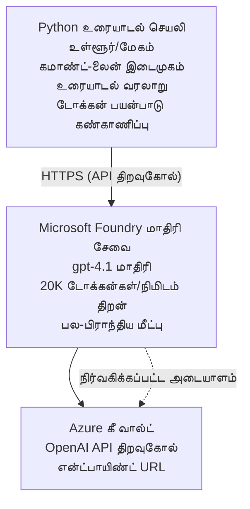

# Microsoft Foundry Models Chat பயன்பாடு

**கற்றல் பாதை:** இடைநிலை ⭐⭐ | **நேரம்:** 35-45 நிமிடம் | **செலவு:** $50-200/மாதம்

Azure Developer CLI (azd) பயன்படுத்தி despleoy செய்யப்பட்ட முழுமையான Microsoft Foundry Models chat பயன்பாடு. இந்த எடுத்துக்காட்டு gpt-4.1 புதுக்கருவியை இணைத்தல், பாதுகாப்பான API அணுகலை மற்றும் ஒரு எளிய chat இடைமுகத்தை காண்பிக்கிறது.

## 🎯 நீங்கள் என்ன கற்று கொள்வீர்கள்

- gpt-4.1 மாடலுடன் Microsoft Foundry Models சேவையை despleoy செய்வது
- Key Vault மூலம் OpenAI API திறவுகோல்களை பாதுகாப்பாக சேமிப்பது
- Python மூலம் ஒரு எளிய chat இடைமுகத்தை உருவாக்குவது
- டோக்கன் பயன்பாடு மற்றும் செலவுகளை கண்காணித்தல்
- விகித வரம்பு விதித்தல் மற்றும் பிழை கையாளல் செயல்படுத்தல்

## 📦 இதில் என்ன உள்ளது

✅ **Microsoft Foundry Models சேவை** - gpt-4.1 மாடல் despleoy  
✅ **Python Chat App** - எளிய கட்டளை வரி chat இடைமுகம்  
✅ **Key Vault ஒருங்கிணைப்பு** - API திறவுகோல் பாதுகாப்பு  
✅ **ARM Templates** - முழுமையான கட்டமைப்பு கோடாக (infrastructure as code)  
✅ **செலவு கண்காணிப்பு** - டோக்கன் பயன்பாட்டை கண்காணித்தல்  
✅ **விகித வரம்பு** - காட்டெடுப்பு முடிவடையாமல் தடுப்பு  

## கட்டமைப்பு


## முன் நிபந்தனைகள்

### தேவையானவை

- **Azure Developer CLI (azd)** - [Install guide](https://learn.microsoft.com/azure/developer/azure-developer-cli/install-azd)
- **OpenAI அணுகல் உடைய Azure subscription** - [Request access](https://aka.ms/oai/access)
- **Python 3.9+** - [Install Python](https://www.python.org/downloads/)

### முன்னிருப்பு சரிபார்க்கவும்

```bash
# azd பதிப்பை சரிபார்க்கவும் (1.5.0 அல்லது அதற்கு மேற்பட்டது தேவை)
azd version

# Azure உள்நுழைவை சரிபார்க்கவும்
azd auth login

# Python பதிப்பை சரிபார்க்கவும்
python --version  # அல்லது python3 --version

# OpenAI அணுகலை சரிபார்க்கவும் (Azure போர்டலில் சரிபார்க்கவும்)
az cognitiveservices account list-skus \
  --kind OpenAI \
  --location eastus
```

> **⚠️ முக்கியம்:** Microsoft Foundry Models பிற applications அங்கீகாரம் தேவை. நீங்கள் விண்ணப்பிக்கவில்லை என்றால், [aka.ms/oai/access](https://aka.ms/oai/access) சென்று விண்ணப்பிக்கவும். அங்கீகாரம் பொதுவாக 1-2 பணியாளர் நாட்கள் ஆகும்.

## ⏱️ despleoy நேர அட்டவணை

| கட்டம் | காலம் | என்ன நடக்கிறது |
|-------|----------|--------------|
| முன்னிருப்பு சரிபார்த்தல் | 2-3 நிமிடம் | OpenAI குறிச்சொல் (quota) கிடைக்கிறதா என்பதை சரிபார்க்கவும் |
| கட்டமைப்பை despleoy செய்தல் | 8-12 நிமிடம் | OpenAI, Key Vault, மாடல் despleoy உருவாக்கப்படுகிறது |
| பயன்பாட்டை அமைத்தல் | 2-3 நிமிடம் | சூழல் மற்றும் சார்ந்தபொருட்களை அமைத்தல் |
| **மொத்தம்** | **12-18 நிமிடம்** | gpt-4.1 உடன் chat செய்ய தயாராகிறது |

**குறிப்பு:** முதன்முறை OpenAI despleoy செய்யும்போது மாடல் provisioning காரணமாக நேரம் அதிகமாக இருக்கலாம்.

## விரைவு துவக்கம்

```bash
# உதாரணத்திற்கு செல்லவும்
cd examples/azure-openai-chat

# சூழலை ஆரம்பிக்கவும்
azd env new myopenai

# அனைத்தையும் அமைக்கவும் (அடித்தளம் + கட்டமைப்பு)
azd up
# உங்களிடம் கேட்கப்படும்:
# 1. Azure சந்தாவை தேர்ந்தெடுக்கவும்
# 2. OpenAI கிடைக்கும் இடத்தை தேர்ந்தெடுக்கவும் (உதாரணமாக: eastus, eastus2, westus)
# 3. நிறுவுவதற்காக 12-18 நிமிடங்கள் காத்திருங்கள்

# Python தேவைப்படும் நூலகங்களை நிறுவவும்
pip install -r requirements.txt

# உரையாடத் தொடங்குங்கள்!
python chat.py
```

**எதிர்பார்க்கப்படும் வெளியீடு:**
```
🤖 Microsoft Foundry Models Chat Application
Connected to: gpt-4.1 (eastus)
Type your message (or 'quit' to exit)

You: Hello! Tell me about Microsoft Foundry Models.
Assistant: Microsoft Foundry Models Service provides REST API access to OpenAI's powerful language models including gpt-4.1, GPT-3.5-Turbo, and Embeddings...

[Tokens used: 145 | Estimated cost: $0.0044]
```

## ✅ despleoy சரிபார்க்கவும்

### படி 1: Azure வளங்களை சரிபார்க்கவும்

```bash
# நிர்மாணிக்கப்பட்ட வளங்களைப் பார்க்கவும்
azd show

# எதிர்பார்க்கப்படும் வெளியீடு காட்டுகிறது:
# - OpenAI சேவை: (வளத்தின் பெயர்)
# - கீ வால்ட்: (வளத்தின் பெயர்)
# - பணியிடல்: gpt-4.1
# - இடம்: eastus (அல்லது நீங்கள் தேர்ந்தெடுத்த பிராந்தியம்)
```

### படி 2: OpenAI API ஐ சோதிக்கவும்

```bash
# OpenAI எண்ட்பாயிண்ட் மற்றும் API விசையை பெற
OPENAI_ENDPOINT=$(azd env get-value AZURE_OPENAI_ENDPOINT)
OPENAI_KEY=$(azd env get-value AZURE_OPENAI_API_KEY)

# API அழைப்பை சோதிக்க
curl "$OPENAI_ENDPOINT/openai/deployments/gpt-4.1/chat/completions?api-version=2024-08-01-preview" \
  -H "Content-Type: application/json" \
  -H "api-key: $OPENAI_KEY" \
  -d '{
    "messages": [{"role": "user", "content": "Say hello!"}],
    "max_tokens": 50
  }'
```

**எதிர்பார்க்கப்படும் பதில்:**
```json
{
  "choices": [
    {
      "message": {
        "role": "assistant",
        "content": "Hello! How can I assist you today?"
      }
    }
  ],
  "usage": {
    "prompt_tokens": 8,
    "completion_tokens": 9,
    "total_tokens": 17
  }
}
```

### படி 3: Key Vault அணுகலை சரிபார்க்கவும்

```bash
# Key Vault-இல் உள்ள ரகசியங்களை பட்டியலிடு
KV_NAME=$(azd env get-value AZURE_KEY_VAULT_NAME)

az keyvault secret list \
  --vault-name $KV_NAME \
  --query "[].name" \
  --output table
```

**எதிர்பார்க்கப்படும் ரகசியங்கள்:**
- `openai-api-key`
- `openai-endpoint`

**வெற்றிக் критерியாவுகள்:**
- ✅ OpenAI சேவை gpt-4.1 உடன் despleoy செய்யப்பட்டது
- ✅ API அழைப்பு செல்லுபடியான completion ஐ 반환ிக்கின்றது
- ✅ ரகசியங்கள் Key Vault இல் சேமிக்கப்பட்டுள்ளன
- ✅ டோக்கன் பயன்பாட்டுத் கணக்கீடு வேலை செய்கிறது

## திட்ட அமைப்பு

```
azure-openai-chat/
├── README.md                   ✅ This guide
├── azure.yaml                  ✅ AZD configuration
├── infra/                      ✅ Infrastructure as Code
│   ├── main.bicep             ✅ Main Bicep template
│   ├── main.parameters.json   ✅ Parameters
│   └── openai.bicep           ✅ OpenAI resource definition
├── src/                        ✅ Application code
│   ├── chat.py                ✅ Chat interface
│   ├── config.py              ✅ Configuration loader
│   └── requirements.txt       ✅ Python dependencies
└── .gitignore                  ✅ Git ignore rules
```

## பயன்பாட்டு அம்சங்கள்

### Chat இடைமுகம் (`chat.py`)

chat பயன்பாட்டில் உள்ளவை:

- **பேச்சு வரலாறு** - செய்திகளின் இடையே context களை பராமரிக்கிறது
- **டோக்கன் எண்ணிக்கை** - பயன்பாட்டை கண்காணித்து செலவுகளை மதிப்பிடுகிறது
- **பிழை கையாளல்** - விகித வரம்புகள் மற்றும் API பிழைகளை மென்மையாக கையாள்டல்
- **செலவு மதிப்பீடு** - ஒவ்வொரு செய்திக்கும் நேரடி செலவு கணக்கீடு
- **ஸ்ட்ரீமிங் ஆதரவு** - விருப்பமான ஸ்ட்ரீமிங் பதில்கள்

### கட்டளைகள்

chat செய்யும்போது, நீங்கள் பயன்படுத்த முடியும்:
- `quit` அல்லது `exit` - அமர்வை முடிக்கவும்
- `clear` - பேச்சு வரலாரை அழிக்கவும்
- `tokens` - மொத்த டோக்கன் பயன்பாட்டை காண்பிக்கவும்
- `cost` - மொத்த மதிப்பிடப்பட்ட செலவை காண்பிக்கவும்

### கட்டமைப்பு (`config.py`)

சூழல் மாறிலிகள் மூலம் கட்டமைப்புகளை ஏற்றுகிறது:
```python
AZURE_OPENAI_ENDPOINT  # Key Vault-இலிருந்து
AZURE_OPENAI_API_KEY   # Key Vault-இலிருந்து
AZURE_OPENAI_MODEL     # இயல்புநிலை: gpt-4.1
AZURE_OPENAI_MAX_TOKENS # இயல்புநிலை: 800
```

## பயன்பாட்டு உதாரணங்கள்

### அடிப்படை Chat

```bash
python chat.py
```

### தனிப்பயன் மாடலுடன் Chat

```bash
export AZURE_OPENAI_MODEL=gpt-35-turbo
python chat.py
```

### ஸ்ட்ரீமிங்குடன் Chat

```bash
python chat.py --stream
```

### எடுத்துக்காட்டு உரையாடல்

```
You: Explain Microsoft Foundry Models Service in 3 sentences.
Assistant: Microsoft Foundry Models Service is Microsoft Azure's cloud platform offering 
that provides access to OpenAI's powerful language models. It enables developers 
to integrate capabilities like gpt-4.1 into their applications with enterprise-grade 
security and compliance. The service includes features for content filtering, 
abuse monitoring, and responsible AI practices.

[Tokens used: 89 | Estimated cost: $0.0027]

You: What models are available?
Assistant: Microsoft Foundry Models Service offers several model families including gpt-4.1 
(most capable), GPT-3.5-Turbo (faster and cost-effective), and Embeddings models 
for vector search. Each model has different capabilities, pricing, and token limits.

[Tokens used: 67 | Estimated cost: $0.0020]

Total session: 156 tokens | $0.0047
```

## செலவு மேலாண்மை

### டோக்கன் விலை (gpt-4.1)

| மாடல் | உள்ளீடு (প্রதிப் 1K டோக்கன்கள்) | வெளியீடு (প্রதிப் 1K டோக்கன்கள்) |
|-------|----------------------|------------------------|
| gpt-4.1 | $0.03 | $0.06 |
| GPT-3.5-Turbo | $0.0015 | $0.002 |

### மதிப்பிடப்பட்ட மாதாந்திர செலவுகள்

பயன்பாட்டு முறைமைகளின் அடிப்படையில்:

| பயன்பாட்டு நிலை | செய்திகள்/நாள் | டோக்கன்கள்/நாள் | மாதாந்திர செலவு |
|-------------|--------------|------------|--------------|
| **சிறிது** | 20 messages | 3,000 tokens | $3-5 |
| **சீர்மானமான** | 100 messages | 15,000 tokens | $15-25 |
| **கடுமையான** | 500 messages | 75,000 tokens | $75-125 |

**அடிப்படை கட்டமைப்பு செலவு:** $1-2/மாதம் (Key Vault + குறைந்த compute)

### செலவு சிற்பப்படுத்தல் குறிப்புகள்

```bash
# 1. எளிய பணிகளுக்கு GPT-3.5-Turbo ஐப் பயன்படுத்தவும் (20 மடங்கு மலிவாக)
export AZURE_OPENAI_MODEL=gpt-35-turbo

# 2. குறுகிய பதில்களுக்கு அதிகபட்ச டோக்கன் எண்ணிக்கையை குறைக்கவும்
export AZURE_OPENAI_MAX_TOKENS=400

# 3. டோக்கன் பயன்பாட்டை கண்காணிக்கவும்
python chat.py --show-tokens

# 4. பட்ஜெட் எச்சரிக்கைகள் அமைக்கவும்
az consumption budget create \
  --budget-name "openai-budget" \
  --amount 50 \
  --time-grain Monthly
```

## கண்காணிப்பு

### டோக்கன் பயன்பாட்டை காண்க

```bash
# Azure போர்டலில்:
# OpenAI வளம் → அளவுகோல்கள் → "டோக்கன் பரிவர்த்தனை" தேர்ந்தெடுக்கவும்

# அல்லது Azure CLI மூலம்:
az monitor metrics list \
  --resource $(azd env get-value AZURE_OPENAI_RESOURCE_ID) \
  --metric "TokenTransaction" \
  --start-time $(date -u -d '1 hour ago' '+%Y-%m-%dT%H:%M:%S') \
  --interval PT1M
```

### API பதிவுகளை காண்க

```bash
# ஆய்வு பதிவுகளை தொடர்ச்சியாக வழங்குதல்
az monitor diagnostic-settings create \
  --resource $(azd env get-value AZURE_OPENAI_RESOURCE_ID) \
  --name openai-logs \
  --logs '[{"category": "Audit", "enabled": true}]' \
  --workspace $(azd env get-value LOG_ANALYTICS_WORKSPACE_ID)

# விசாரணை பதிவுகள்
az monitor log-analytics query \
  --workspace $(azd env get-value LOG_ANALYTICS_WORKSPACE_ID) \
  --analytics-query "AzureDiagnostics | where Category == 'Audit' | top 10 by TimeGenerated"
```

## பிழைதிருத்தம்

### பிரச்சனை: "Access Denied" பிழை

**அறிகுறிகள்:** API அழைக்கும் போது 403 Forbidden

**தீர்வுகள்:**
```bash
# 1. OpenAI அணுகல் அனுமதிக்கப்பட்டுள்ளது என்பதை சரிபார்க்கவும்
az cognitiveservices account show \
  --name $(azd env get-value AZURE_OPENAI_NAME) \
  --resource-group $(azd env get-value AZURE_RESOURCE_GROUP)

# 2. API விசை சரியானதா என்பதை சரிபார்க்கவும்
azd env get-value AZURE_OPENAI_API_KEY

# 3. endpoint URL வடிவம் சரியாக உள்ளது என்பதை சரிபார்க்கவும்
azd env get-value AZURE_OPENAI_ENDPOINT
# இப்படியாக இருக்க வேண்டும்: https://[name].openai.azure.com/
```

### பிரச்சனை: "Rate Limit Exceeded"

**அறிகுறிகள்:** 429 Too Many Requests

**தீர்வுகள்:**
```bash
# 1. தற்போதைய ஒதுக்கீட்டை சரிபார்க்கவும்
az cognitiveservices account deployment show \
  --name $(azd env get-value AZURE_OPENAI_NAME) \
  --resource-group $(azd env get-value AZURE_RESOURCE_GROUP) \
  --deployment-name gpt-4.1

# 2. ஒதுக்கீட்டை அதிகரிக்க கோரவும் (தேவையானால்)
# Azure போர்டல் செல்லவும் → OpenAI வளம் → ஒதுக்கீடுகள் → அதிகரிக்க கோருங்கள்

# 3. மீண்டும் முயற்சி செய்யும் முறை நடைமுறைப்படுத்தவும் (இது ஏற்கனவே chat.py இல் உள்ளது)
# பயன்பாடு மடங்கு அதிகரிக்கும் தாமதத்துடன் தானாகவே மீண்டும் முயற்சிக்கிறது.
```

### பிரச்சனை: "Model Not Found"

**அறிகுறிகள்:** deployment க்கு 404 பிழை

**தீர்வுகள்:**
```bash
# 1. கிடைக்கும் டிப்ளாய்மெண்டுகளை பட்டியலிடவும்
az cognitiveservices account deployment list \
  --name $(azd env get-value AZURE_OPENAI_NAME) \
  --resource-group $(azd env get-value AZURE_RESOURCE_GROUP)

# 2. சூழலில் மாடல் பெயரை சரிபார்க்கவும்
echo $AZURE_OPENAI_MODEL

# 3. சரியான டிப்ளாய்மெண்ட் பெயருக்கு புதுப்பிக்கவும்
export AZURE_OPENAI_MODEL=gpt-4.1  # அல்லது gpt-35-turbo
```

### பிரச்சனை: உயர் தாமதம்

**அறிகுறிகள்:** பதில் நேரம் மெதுவாக (>5 seconds)

**தீர்வுகள்:**
```bash
# 1. பிராந்திய தாமதத்தை சரிபார்க்கவும்
# பயனர்களுக்கு அருகிலுள்ள பிராந்தியத்தில் நிரலை அமல்படுத்தவும்

# 2. வேகமான பதிலுக்காக max_tokens ஐ குறைக்கவும்
export AZURE_OPENAI_MAX_TOKENS=400

# 3. சிறந்த பயனர் அனுபவத்திற்காக ஸ்ட்ரீமிங்கை பயன்படுத்தவும்
python chat.py --stream
```

## பாதுகாப்பு சிறந்த நடைமுறைகள்

### 1. API விசைகள் பாதுகாப்பு

```bash
# சாவிகளை ஒருபோதும் மூலக் கட்டுப்பாட்டில் சேர்க்காதீர்கள்
# Key Vault ஐ பயன்படுத்தவும் (ஏற்கெனவே அமைக்கப்பட்டுள்ளது)

# சாவிகளை নিয়মமாக மாற்றுங்கள்
az cognitiveservices account keys regenerate \
  --name $(azd env get-value AZURE_OPENAI_NAME) \
  --resource-group $(azd env get-value AZURE_RESOURCE_GROUP) \
  --key-name key1
```

### 2. உள்ளடக்கம் வடிகட்டி செயல்முறை செயல்படுத்தவும்

```python
# Microsoft Foundry Models கட்டமைக்கப்பட்ட உள்ளடக்க வடிகட்டலை கொண்டுள்ளது
# Azure போர்டலில் அமைக்க:
# OpenAI வளம் → உள்ளடக்க வடிகட்டிகள் → தனிப்பயன் வடிகட்டியை உருவாக்கு

# வகைகள்: வெறுப்பு, பாலியல், வன்மை, சுய சேதம்
# மட்டங்கள்: குறைந்த, நடுத்தர, உயர்ந்த வடிகட்டல்
```

### 3. மேலாண்மை அடையாளம் பயன்படுத்தவும் (உற்பத்தி)

```bash
# உற்பத்தி டெப்ளாய்மெண்டுகளுக்கு, நிர்வகிக்கப்பட்ட அடையாளத்தைப் பயன்படுத்தவும்
# API விசைகளின் பதிலாக (விண்ணப்பம் Azure-ல் ஹோஸ்ட் செய்யப்பட வேண்டும்)

# infra/openai.bicep-ஐ இதை உள்ளடக்க하도록 புதுப்பிக்க:
# identity: { type: 'SystemAssigned' }
```

## வளர்ச்சி

### உள்ளூரில் இயக்கவும்

```bash
# தேவையான சார்புகளை நிறுவவும்
pip install -r src/requirements.txt

# சூழல் மாறிலிகளை அமைக்கவும்
export AZURE_OPENAI_ENDPOINT="https://[name].openai.azure.com/"
export AZURE_OPENAI_API_KEY="your-api-key"
export AZURE_OPENAI_MODEL="gpt-4.1"

# விண்ணப்பத்தை இயக்கவும்
python src/chat.py
```

### சோதனைகள் இயக்கவும்

```bash
# சோதனை சார்புகளை நிறுவவும்
pip install pytest pytest-cov

# சோதனைகளை இயக்கவும்
pytest tests/ -v

# கவரேஜ் உடன்
pytest tests/ --cov=src --cov-report=html
```

### மாடல் despleoy புதுப்பிக்கவும்

```bash
# வித்தியாசமான மாடல் பதிப்பை வெளியிடவும்
az cognitiveservices account deployment create \
  --name $(azd env get-value AZURE_OPENAI_NAME) \
  --resource-group $(azd env get-value AZURE_RESOURCE_GROUP) \
  --deployment-name gpt-35-turbo \
  --model-name gpt-35-turbo \
  --model-version "0613" \
  --model-format OpenAI \
  --sku-capacity 20 \
  --sku-name "Standard"
```

## சுத்தப்படுத்துதல்

```bash
# அனைத்து Azure வளங்களையும் நீக்கவும்
azd down --force --purge

# இது அகற்றும்:
# - OpenAI சேவை
# - Key Vault (90-நாள் மென்மையான நீக்கத்துடன்)
# - வளக் குழு
# - அனைத்து அமர்த்தல்கள் மற்றும் கட்டமைப்புகளும்
```

## அடுத்த படிகள்

### இந்த எடுத்துக்காட்டை விரிவாக்கவும்

1. **வெப் இடைமுகம் சேர்க்கவும்** - React/Vue frontend உருவாக்கவும்
   ```bash
   # azure.yaml-இல் frontend சேவையைச் சேர்க்கவும்
   # Azure Static Web Apps-க்கு வெளியிடவும்
   ```

2. **RAG செயல்படுத்தவும்** - Azure AI Search உடன் ஆவண தேடலைச் சேர்க்கவும்
   ```python
   # Azure Cognitive Search ஐ ஒருங்கிணைக்கவும்
   # ஆவணங்களை பதிவேற்றவும் மற்றும் வெக்டர் குறியீட்டை உருவாக்கவும்
   ```

3. **Function Calling சேர்க்கவும்** - கருவி பயன்படுத்தலை இயலுமைப்படுத்தவும்
   ```python
   # chat.py-இல் செயல்பாடுகளை வரையறுக்கவும்
   # gpt-4.1-க்கு வெளிப்புற APIகளை அழைக்க அனுமதிக்கவும்
   ```

4. **பல-மாடல் ஆதரவு** - பல மாடல்களை despleoy செய்யவும்
   ```bash
   # gpt-35-turbo மற்றும் embeddings மாதிரிகளை சேர்க்கவும்
   # மாதிரி ரூட்டிங் தர்க்கத்தை செயல்படுத்தவும்
   ```

### தொடர்புடைய எடுத்துக்காட்டுகள்

- **[Retail Multi-Agent](../retail-scenario.md)** - உயர்ந்த multi-agent கட்டமைப்பு
- **[Database App](../../../../examples/database-app)** - நிலையான சேமிப்பை சேர்க்கவும்
- **[Container Apps](../../../../examples/container-app)** - container ஆக சேவை despleoy செய்யவும்

### கற்றல் வளங்கள்

- 📚 [AZD For Beginners Course](../../README.md) - முக்கிய பாடநெறி முகப்பு
- 📚 [Microsoft Foundry Models Documentation](https://learn.microsoft.com/azure/ai-services/openai/) - அதிகாரப்பூர்வ ஆவணங்கள்
- 📚 [OpenAI API Reference](https://platform.openai.com/docs/api-reference) - API விவரங்கள்
- 📚 [Responsible AI](https://www.microsoft.com/ai/responsible-ai) - சிறந்த நடைமுறைகள்

## கூடுதல் வளங்கள்

### ஆவணங்கள்
- **[Microsoft Foundry Models Service](https://learn.microsoft.com/azure/ai-services/openai/)** - முழுமையான கையேடு
- **[gpt-4.1 Models](https://learn.microsoft.com/azure/ai-services/openai/concepts/models)** - மாடல் திறன்கள்
- **[Content Filtering](https://learn.microsoft.com/azure/ai-services/openai/concepts/content-filter)** - பாதுகாப்பு அம்சங்கள்
- **[Azure Developer CLI](https://learn.microsoft.com/azure/developer/azure-developer-cli/)** - azd குறிப்புகள்

### பாடநெறிகள்
- **[OpenAI Quickstart](https://learn.microsoft.com/azure/ai-services/openai/quickstart)** - முதல் despleoy
- **[Chat Completions](https://learn.microsoft.com/azure/ai-services/openai/how-to/chatgpt)** - chat பயன்பாடுகளை உருவாக்குவது
- **[Function Calling](https://learn.microsoft.com/azure/ai-services/openai/how-to/function-calling)** - உயர்ந்த அம்சங்கள்

### கருவிகள்
- **[Microsoft Foundry Models Studio](https://oai.azure.com/)** - வலை அடிப்படையிலான விளையாட்டு மண்டலம்
- **[Prompt Engineering Guide](https://platform.openai.com/docs/guides/prompt-engineering)** - நல்ல prompts எழுதுதல்
- **[Token Calculator](https://platform.openai.com/tokenizer)** - டோக்கன் பயன்பாட்டை மதிப்பிடுதல்

### சமூகம்
- **[Azure AI Discord](https://discord.gg/azure)** - சமூகத்திலிருந்து உதவி பெறுங்கள்
- **[GitHub Discussions](https://github.com/Azure-Samples/openai/discussions)** - கேள்வி & பதில் அரங்கம்
- **[Azure Blog](https://azure.microsoft.com/blog/tag/azure-openai-service/)** - சமீபத்திய புதுப்பிப்புகள்

---

**🎉 வெற்றி!** நீங்கள் Microsoft Foundry Models ஐ despleoy செய்து ஒரு வேலை செய்யும் chat பயன்பாட்டை கட்டியுள்ளீர்கள். gpt-4.1 இன் திறன்களை கண்டறிந்து பல prompts மற்றும் பயன்பாட்டு நிலைகளில் பரிசோதிக்கத் தொடங்குங்கள்.

**கேள்விகள்?** [ஒரு issue திறக்கவும்](https://github.com/microsoft/AZD-for-beginners/issues) அல்லது [அடிக்கடி கேட்கப்படும் கேள்விகள்](../../resources/faq.md) ஐப் பார்க்கவும்

**செலவு எச்சரிக்கை:** சோதனை முடிந்தபின் தொடரும் கட்டணங்களை தவிர்க்க `azd down` இயக்குவதை மறக்க வேண்டாம் (~$50-100/மாதம் செயலில் உள்ள பயன்பாட்டுக்காக).

---

<!-- CO-OP TRANSLATOR DISCLAIMER START -->
மறுப்பு:
இந்த ஆவணம் செயற்கை நுண்ணறிவு (AI) மொழிபெயர்ப்பு சேவை [Co-op Translator](https://github.com/Azure/co-op-translator) மூலம் மொழிபெயர்க்கப்பட்டுள்ளது. நாங்கள் துல்லியத்திற்காக முயற்சித்தாலும், தானாக மெய்ப்பொருத்தமாக நடைபெறும் மொழிபெயர்ப்புகளில் தவறுகள் அல்லது துல்லியமின்மைகள் இருக்கக்கூடும் என்பதை தயவுசெய்து கவனிக்கவும். தொடக்க மொழியில் உள்ள மூல ஆவணத்தை அதிகாரபூர்வ ஆதாரமாக கருதவேண்டும். முக்கியமான தகவல்களுக்கு, தொழில் நுட்பமான மனித மொழிபெயர்ப்பை பரிந்துரைக்கிறோம். இம்மொழிபெயர்ப்பைப் பயன்படுத்துவதால் ஏற்பட்ட எந்த தவறான புரிதல்களுக்கும் அல்லது தவறான விளக்கங்களுக்கும் நாங்கள் பொறுப்பேற்கமாட்டோம்.
<!-- CO-OP TRANSLATOR DISCLAIMER END -->