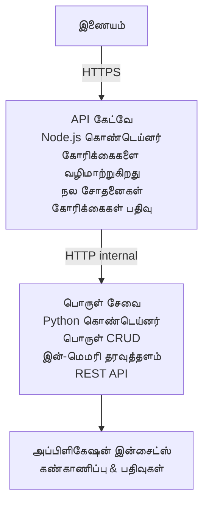

# மைக்ரோசேர்வுகள் கட்டமைப்பு - Container App உதாரணம்

⏱️ **கணிக்கப்பட்ட நேரம்**: 25-35 minutes | 💰 **கணிக்கப்பட்ட செலவு**: ~$50-100/month | ⭐ **சிக்கல்தன்மை**: மேம்பட்டது

Azure Container Apps-க்கு AZD CLI மூலம் இடமாற்றப்பட்ட ஒரு **எளிய ஆனால் செயலாற்றக்கூடிய** மைக்ரோசேர்வுகள் கட்டமைப்பு. இந்த உதாரணம் சேவை-இலிருந்து-சேவைக்கு தொடர்பு, கன்டெய்னர் ஒர்ச்சஸ்ட்ரேஷன் மற்றும் கண்காணிப்பை நடைமுறை 2-சேவை அமைப்பில் காணագրுகிறது.

> **📚 கற்றல் அணுகுமுறை**: இந்த உதாரணம் ஒரு குறைந்தபட்ச 2-சேவை கட்டமைப்பில் (API Gateway + Backend Service) தொடங்கி, நீங்கள் அதை நிச்சயமாக நிபுணத்துவம் பெற deploy செய்து கற்றுக் கொள்ள முடியும். இந்த அடிப்படைத் திறன்களை கற்றுக்கொண்டவுடன், முழு மைக்ரோசேர்வுகள் சூழ்நிலைக்கு விரிவாக்கம் செய்வது குறித்து வழிகாட்டுதல்களை வழங்குகிறோம்.

## நீங்கள் என்ன கற்றுக்கொள்ளுவீர்கள்

இந்த உதாரணத்தை முடித்தவுடன், நீங்கள்:
- Azure Container Apps-க்கு பல கன்டெய்னர்களை deploy செய்வது
- உள்ளக நெட்வொர்க்கினை உபயோகித்து சேவை-இலிருந்து-சேவைக்கு தொடர்பை அமல்படுத்துவது
- சூழல் சார்ந்த auto-scaling மற்றும் ஹெல்த் செக்குகளை அமைத்தல்
- Application Insights மூலம் விநியோஜிக்கப்பட்ட பயன்பாடுகளை கண்காணித்தல்
- மைக்ரோசெர்விசஸ் deployment மாதிரிகள் மற்றும் சிறந்த பழக்கங்களை புரிந்து கொள்வது
- எளிமையான கட்டமைப்பிலிருந்து சிக்கலான கட்டமைப்புகளுக்குப் பரிணாம வளர்ச்சியை கற்றுக்கொள்ளுதல்

## கட்டமைப்பு

### கட்டம் 1: நாம் அமைக்க இருப்பது (இந்த உதாரணத்தில் அடங்கியுள்ளது)


**ஏன் எளிதாகத் தொடங்க வேண்டும்?**
- ✅ விரைவாக deploy செய்து புரிந்துகொள்ளலாம் (25-35 நிமிடங்கள்)
- ✅ சிக்கலில்லாமல் முக்கிய மைக்ரோசேர்வுகள் மாதிரிகளை கற்றுக்கொள்ளலாம்
- ✅ மாற்றம் செய்து பரிசோதிக்கக்கூடிய செயல்படும் கோடு
- ✅ கற்றலுக்கான குறைந்தச் செலவு (~$50-100/month 대비 $300-1400/month)
- ✅ தரவுத்தளங்கள் மற்றும் மெசேஜ் கூய்ஸ் சேர்ப்பதற்கு முன் நம்பிக்கையை உருவாக்குதல்

**உதாரணம்**: இது ஓட்டுவதைக் கற்பது போல் நினைத்துக் கொள்ளுங்கள். நீங்கள் ஒரு காலியான பார்க்கிங் மைதானத்துடன் (2 சேவைகள்) தொடங்கி அடிப்படைப் பொறுப்புகளை கற்கிறீர்கள், பின்னர் நகரப் போக்குவரத்து (5+ சேவைகள் தரவுத்தளங்களுடன்) நோக்கி முன்னேறுகிறீர்கள்.

### கட்டம் 2: எதிர்கால விரிவாக்கம் (குறிப்பு கட்டமைப்பு)

ஒரு 2-சேவை கட்டமைப்பில் நன்கு தேர்ச்சி அடைந்தவுடன், நீங்கள் இதனை விரிவாக்கலாம்:

```
Full Architecture (Not Included - For Reference)
├── API Gateway (✅ Included)
├── Product Service (✅ Included)
├── Order Service (🔜 Add next)
├── User Service (🔜 Add next)
├── Notification Service (🔜 Add last)
├── Azure Service Bus (🔜 For async communication)
├── Cosmos DB (🔜 For product persistence)
├── Azure SQL (🔜 For order management)
└── Azure Storage (🔜 For file storage)
```

முயற்சிகளுக்கான படி படி வழிமுறைகளைத் தெரிந்துகொள்ள "Expansion Guide" பகுதியைப் பாருங்கள்.

## அடங்கிய குறிப்புகள்

✅ **சேவை கண்டுபிடித்தல்**: கன்டெய்னர்களுக்கிடையில் தானாக DNS அடிப்படையிலான கண்டுபிடித்தல்  
✅ **லோட் பாலன்சிங்**: நகல்களின் மீது உள்ளிலே லோட் பாலன்சிங்  
✅ **ஆட்டோ-ஸ்கேலிங்**: HTTP கோரிக்கைகளின் அடிப்படையில் சேவையானது தனித்துவமாக ஸ்கேலிங் செய்கிறது  
✅ **ஹெல்த் கண்காணித்தல்**: இரு சேவைகளுக்கும் liveness மற்றும் readiness probes  
✅ **விநியோஜிக்கப்பட்ட பதிவு**: Application Insights மூலம் மையமாக்கப்பட்ட பதிவு  
✅ **உள்ளக நெட்வொர்க்கிங்**: பாதுகாப்பான சேவை-இலிருந்து-சேவை தொடர்பு  
✅ **கன்டெய்னர் ஒர்ச்சஸ்ட்ரேஷன்**: தானாக deployment மற்றும் ஸ்கேலிங்  
✅ **ஜீரோ-டவுன்டைம் அப்டேட்ஸ்**: ரிவிஷன் மேலாண்மையுடன் rolling updates  

## தேவையான முன் தேவை

### தேவையான கருவிகள்

தொடங்குவதற்கு முன், உங்கள் கணினியில் பின்வரும் கருவிகள் நிறுவப்பட்டிருப்பதை சரிபார்க்கவும்:

1. **[Azure Developer CLI (azd)](https://learn.microsoft.com/azure/developer/azure-developer-cli/install-azd)** (version 1.0.0 or higher)
   ```bash
   azd version
   # எதிர்பார்க்கப்படும் வெளியீடு: azd பதிப்பு 1.0.0 அல்லது அதற்கும் மேல்
   ```

2. **[Azure CLI](https://learn.microsoft.com/cli/azure/install-azure-cli)** (version 2.50.0 or higher)
   ```bash
   az --version
   # எதிர்பார்க்கப்படும் வெளியீடு: azure-cli 2.50.0 அல்லது அதற்கு மேல்
   ```

3. **[Docker](https://www.docker.com/get-started)** (உள்ளாடை தாக்குதல்/ஸ்தல அளவீட்டிற்கு - விருப்பம்)
   ```bash
   docker --version
   # எதிர்பார்க்கப்படும் வெளியீடு: Docker பதிப்பு 20.10 அல்லது அதற்கு மேலானது
   ```

### Azure தேவைகள்

- ஒரு செயல்பாட்டிலான **Azure subscription** ([create a free account](https://azure.microsoft.com/free/))
- உங்கள் subscription-இல் resources உருவாக்க அனுமதிகள்
- subscription அல்லது resource group-இல் **Contributor** உரிமை

### அறிவு முன் தேவைகள்

இது ஒரு **மேம்பட்ட நிலை** உதாரணம். நீங்கள் வேண்டும்:
- [Simple Flask API example](../../../../../examples/container-app/simple-flask-api) முடித்திருக்க வேண்டும் 
- மைக்ரோசேர்வுகள் கட்டமைப்பின் அடிப்படை புரிதல்
- REST APIs மற்றும் HTTP பற்றிய பரிச்சயம்
- கன்டெய்னர் கருத்துக்களின் புரிதல்

**Container Apps-க்கு புதியவரா?** அடிப்படைகளை கற்றுக்கொள்ள முதலில் [Simple Flask API example](../../../../../examples/container-app/simple-flask-api) பார்க்கவும்.

## வேகமான துவக்கம் (படி படியாக)

### படி 1: கிளோன் செய்து நகருங்கள்

```bash
git clone https://github.com/microsoft/AZD-for-beginners.git
cd AZD-for-beginners/examples/container-app/microservices
```

**✓ வெற்றிச் சரிபார்ப்பு**: நீங்கள் `azure.yaml`-ஐ காண்கிறீர்கள் என்பதை உறுதி செய்யவும்:
```bash
ls
# எதிர்பார்க்கப்படும்: README.md, azure.yaml, infra/, src/
```

### படி 2: Azure உடன் அங்கீகாரம் செய்வது

```bash
azd auth login
```

இது உங்கள் உலாவியை திறந்து Azure அங்கீகாரத்திற்காக அமைக்கிறது. உங்கள் Azure நற்சான்றுகளைப் பயன்படுத்தி உள்நுழையவும்.

**✓ வெற்றிச் சரிபார்ப்பு**: நீங்கள் இதை காண்பீர்கள்:
```
Logged in to Azure.
```

### படி 3: சுற்றுப்புறத்தை துவங்கல்

```bash
azd init
```

**உங்களுக்கு தோன்றக்கூடிய கேள்விகள்**:
- **Environment name**: ஒரு சுருக்கமான பெயரை உள்ளிடவும் (உதாரணம்: `microservices-dev`)
- **Azure subscription**: உங்கள் subscription-ஐ தேர்வு செய்யவும்
- **Azure location**: ஒரு பிராந்தியம் தேர்வு செய்யவும் (உதாரணம்: `eastus`, `westeurope`)

**✓ வெற்றிச் சரிபார்ப்பு**: நீங்கள் இதை காண்பீர்கள்:
```
SUCCESS: New project initialized!
```

### படி 4: உட்பட கட்டமைப்பு மற்றும் சேவைகளை deploy செய்தல்

```bash
azd up
```

**என்ன நடக்கும்** (8-12 நிமிடங்கள் ஆகும்):
1. Container Apps environment உருவாக்கப்படுகிறது
2. கண்காணிப்பிற்கான Application Insights உருவாக்கப்படுகிறது
3. API Gateway கன்டெய்னர் கட்டப்படுகிறது (Node.js)
4. Product Service கன்டெய்னர் கட்டப்படுகிறது (Python)
5. இரு கன்டெய்னர்களும் Azure-க்கு deploy செய்யப்படுகின்றன
6. நெட்வொர்க்கிங் மற்றும் ஹெல்த் செக்குகள் உருவாக்கப்படுகின்றன
7. கண்காணிப்பு மற்றும் பதிவு அமைப்புகள் செலுத்தப்படுகின்றன

**✓ வெற்றிச் சரிபார்ப்பு**: நீங்கள் இதை காண்பீர்கள்:
```
SUCCESS: Your application was deployed to Azure in X minutes Y seconds.
Endpoint: https://api-gateway-<unique-id>.azurecontainerapps.io
```

**⏱️ நேரம்**: 8-12 நிமிடங்கள்

### படி 5: Deployment-ஐ சோதனை செய்யுங்கள்

```bash
# கேட்வே எண்ட்பாயிண்டைப் பெறவும்
GATEWAY_URL=$(azd env get-values | grep API_GATEWAY_URL | cut -d '=' -f2 | tr -d '"')

# API கேட்வேயின் நலத்தை சோதிக்கவும்
curl $GATEWAY_URL/health

# எதிர்பார்க்கப்படும் வெளியீடு:
# {"நிலை":"ஆரோக்கியம்","சேவை":"API கேட்வே","காலக்குறிப்பு":"2025-11-19T10:30:00Z"}
```

**ഗேட் வழியாக product சேவையை சோதிக்கவும்**:
```bash
# பொருட்களை பட்டியலிடு
curl $GATEWAY_URL/api/products

# எதிர்பார்க்கப்படும் வெளியீடு:
# [
#   {"id":1,"name":"Laptop","price":999.99,"stock":50},
#   {"id":2,"name":"Mouse","price":29.99,"stock":200},
#   {"id":3,"name":"Keyboard","price":79.99,"stock":150}
# ]
```

**✓ வெற்றிச் சரிபார்ப்பு**: இரு endpoints-லும் பிழைகள் இல்லாமல் JSON தரவை 반환ிக்க வேண்டும்.

---

**🎉 வாழ்த்துகள்!** நீங்கள் Azure-க்கு ஒரு மைக்ரோசேர்வுகள் கட்டமைப்பைப் deploy செய்துள்ளீர்கள்!

## திட்ட அமைப்பு

அனைத்து செயலாக்க கோப்புகளும் உட்பட—இது முழுமையான, செயல்படும் உதாரணம்:

```
microservices/
│
├── README.md                         # This file
├── azure.yaml                        # AZD configuration
├── .gitignore                        # Git ignore patterns
│
├── infra/                           # Infrastructure as Code (Bicep)
│   ├── main.bicep                   # Main orchestration
│   ├── abbreviations.json           # Naming conventions
│   ├── core/                        # Shared infrastructure
│   │   ├── container-apps-environment.bicep  # Container environment + registry
│   │   └── monitor.bicep            # Application Insights + Log Analytics
│   └── app/                         # Service definitions
│       ├── api-gateway.bicep        # API Gateway container app
│       └── product-service.bicep    # Product Service container app
│
└── src/                             # Application source code
    ├── api-gateway/                 # Node.js API Gateway
    │   ├── app.js                   # Express server with routing
    │   ├── package.json             # Node dependencies
    │   └── Dockerfile               # Container definition
    └── product-service/             # Python Product Service
        ├── main.py                  # Flask API with product data
        ├── requirements.txt         # Python dependencies
        └── Dockerfile               # Container definition
```

**ஒவ்வொரு கூறும் என்ன செய்கிறது:**

**Infrastructure (infra/)**:
- `main.bicep`: அனைத்து Azure resources மற்றும் அவற்றின் சார்புகளை ஒருங்கிணைக்கிறது
- `core/container-apps-environment.bicep`: Container Apps environment மற்றும் Azure Container Registry உருவாக்குகிறது
- `core/monitor.bicep`: விநியோஜிக்கப்பட்ட பதிவு மற்றும் கண்காணிப்பிற்காக Application Insights அமைக்கிறது
- `app/*.bicep`: தனித்தனி container app வரவுகளுடன் ஸ்கேலிங் மற்றும் ஹெல்த் செக்குகள்

**API Gateway (src/api-gateway/)**:
- பொதுப் பயனாளர்களுக்கான சேவை, பின்னணி சேவைகளுக்கு கோரிக்கைகளை மாறிப்பயன் செய்கிறது
- பதிவு, பிழை கையாள்வு மற்றும் கோரிக்கை முன்னோக்கிச் செலுத்தலை செயல்படுத்துகிறது
- சேவை-இலிருந்து-சேவை HTTP தொடர்பை காண்பிக்கிறது

**Product Service (src/product-service/)**:
- சிக்கலின்மையை குறைப்பதற்காக நினைவகத்தில் பொருள் பட்டியலை நிர்வகிக்கும் உள்ளக சேவை
- REST API மற்றும் ஹெல்த் செக்குகள்
- பின்னணி மைக்ரோசேர்வுகள் மாதிரியின் எடுத்துக்காட்டு

## சேவைகள் கண்ணோட்டம்

### API Gateway (Node.js/Express)

**போர்ட்**: 8080  
**அணுகல்**: பொதுப் (புறமான இன்ப்ரஸ்)  
**பொறுப்பு**: வரும் கோரிக்கைகளை சரியான பின்னணி சேவைகளுக்குக் கட்டமைப்பு வழங்குதல்  

**எண்ட்பாயின்ட்கள்**:
- `GET /` - சேவை தகவல்
- `GET /health` - ஹெல்த் செக் எண்ட்பாயிண்ட்
- `GET /api/products` - product சேவைக்கு முன்னோக்கிச் செலுத்தல் (அனைத்தையும் பட்டியலிடுதல்)
- `GET /api/products/:id` - product சேவைக்கு முன்னோக்கிச் செலுத்தல் (ID மூலம் பெறுதல்)

**முக்கிய அம்சங்கள்**:
- axios மூலம் கோரிக்கை வழிமுறை
- மையகிரியான பதிவு
- பிழை கையாளுதல் மற்றும் timeout மேலாண்மை
- சுற்றுப்புறமாறிகள் மூலம் சேவை கண்டுபிடித்தல்
- Application Insights ஒருங்கிணைப்பு

**கோடு முக்கியத் துண்டு** (`src/api-gateway/app.js`):
```javascript
// உள்ளக சேவை தொடர்பு
app.get('/api/products', async (req, res) => {
  const response = await axios.get(`${PRODUCT_SERVICE_URL}/products`);
  res.json(response.data);
});
```

### Product Service (Python/Flask)

**போர்ட்**: 8000  
**அணுகல்**: உள்ளக மட்டுமே (புற அணுகல் இல்லை)  
**பொறுப்பு**: நினைவகத்தில் தரவுகளை வைத்துள்ள பொருள் பட்டியலை நிர்வகிக்கின்றது  

**எண்ட்பாயின்ட்கள்**:
- `GET /` - சேவை தகவல்
- `GET /health` - ஹெல்த் செக் எண்ட்பாயிண்ட்
- `GET /products` - அனைத்து பொருட்களையும் பட்டியலிடுதல்
- `GET /products/<id>` - ID மூலம் பொருளைப் பெறுதல்

**முக்கிய அம்சங்கள்**:
- Flask மூலம் RESTful API
- நினைவகத் தரவுத்தளப் பகுதி (எளிமை कारणம், தரவுத்தளம் தேவையில்லை)
- probes மூலம் ஹெல்த் கண்காணித்தல்
- கட்டமைக்கப்பட்ட பதிவு
- Application Insights ஒருங்கிணைப்பு

**தரவு மாதிரி**:
```python
{
  "id": 1,
  "name": "Laptop",
  "description": "High-performance laptop",
  "price": 999.99,
  "stock": 50
}
```

**ஏன் உள்ளக மட்டுமே?**
Product சேவை பொதுமக்களுக்கு வெளிச்சமிடப்படவில்லை. அனைத்து கோரிக்கைகளும் API Gateway-ன் மூலம் செல்ல வேண்டும், இது உங்களுக்கு:
- பாதுகாப்பு: கட்டுப்படுத்தப்பட்ட அணுகல் புள்ளி
- நெகிழ்வுத்தன்மை: பின்னணியை மாற்றினாலும் кліயன்ட்களுக்கு பாதிப்பு ஏற்படாது
- கண்காணிப்பு: மைய பாணியில் கோரிக்கை பதிவுகள்

## சேவை தொடர்பைப் புரிந்து கொள்வது

### சேவைகள் ஒருவருடன் ஒருவர் எப்படி பேசுகின்றன

இந்த உதாரணத்தில், API Gateway Product Service-க்கு **உள்ளக HTTP அழைப்புகள்** மூலம் தொடர்பு கொள்ளிறது:

```javascript
// API கேட்வே (src/api-gateway/app.js)
const PRODUCT_SERVICE_URL = process.env.PRODUCT_SERVICE_URL;

// உள்ளக HTTP கோரிக்கை செய்யவும்
const response = await axios.get(`${PRODUCT_SERVICE_URL}/products`);
```

**முக்கிய குறிப்புகள்**:

1. **DNS-அடிப்படையிலான கண்டுபிடித்தல்**: Container Apps தானாக உள்ளக சேவைகளுக்காக DNS வழங்குகிறது
   - Product Service FQDN: `product-service.internal.<environment>.azurecontainerapps.io`
   - சுலபப்படுத்தி: `http://product-service` (Container Apps இதனை தீர்மானிக்கிறது)

2. **பொது வெளிச்சமிடல் இல்லை**: Bicep-இல் Product Service-க்கு `external: false` உள்ளது
   - Container Apps சூழலில் மட்டுமே அணுகக்கூடியது
   - இணையத்திலிருந்து அணுக முடியாது

3. **சுற்றுப்புற மாறிகள்**: சேவை URL-கள் deployment நேரத்தில் ஊட்டப்படுகின்றன
   - Bicep உள்ளக FQDN-ஐ gateway-க்கு அனுப்புகிறது
   - பயன்பாட்டு கோடில் எவ்விதம் hardcodedURLs இல்லை

**உதாரணம்**: இதை அலுவலக அறைகளாகப் பார்த்து கொள்ளுங்கள். API Gateway என்பது வரவேற்பு மேசை (பொதுமக்களுக்கு எதிர்பார்க்கப்படும்), Product Service என்பது ஒரு அலுவலக அறை (உள்ளக மட்டுமே). வரவேற்பு மூலம் மட்டுமே அலுவலகத்தை அணுக முடியும்.

## Deployment விருப்பங்கள்

### முழு deployment ( பரிந்துரைக்கப்படுகிறது )

```bash
# அடித்தள அமைப்பையும் மற்றும் இரு சேவைகளையும் நிலைநிறுத்தவும்
azd up
```

இது deploy செய்கிறது:
1. Container Apps environment
2. Application Insights
3. Container Registry
4. API Gateway கன்டெய்னர்
5. Product Service கன்டெய்னர்

**நேரம்**: 8-12 நிமிடங்கள்

### தனித்தனியான சேவையை deploy செய்தல்

```bash
# முதல் azd up இயக்கத்திற்குப் பிறகு ஒரு சேவையை மட்டும் வெளியிடவும்
azd deploy api-gateway

# அல்லது தயாரிப்பு சேவையை வெளியிடவும்
azd deploy product-service
```

**பயன்பாட்டு நிலை**: ஒரே சேவையில் கோடை புதுப்பித்து அதே சேவையை மட்டும் மீட்டெடுக்க விரும்பும் போது.

### கட்டமைப்பை புதுப்பிக்கவும்

```bash
# விரிவாக்க அளவுருக்களை மாற்றவும்
azd env set GATEWAY_MAX_REPLICAS 30

# புதிய கட்டமைப்புடன் மீண்டும் நிறுவவும்
azd up
```

## கட்டமைப்பு

### ஸ்கேலிங் கட்டமைப்பு

இரு சேவைகளும் தங்களது Bicep கோப்புகளில் HTTP அடிப்படையிலான ஆட்டோஸ்கேலிங்குடன் உள்ளன:

**API Gateway**:
- குறைந்தபட்ச நகல்கள்: 2 (கிடைக்கும் நிலைத்தன்மைக்காக எப்போதும் குறைந்தது 2)
- அதிகபட்ச நகல்கள்: 20
- ஸ்கேல் துவக்கக் காரணம்: ஒவ்வொரு நகலுக்கும் 50 ஒரேநேர கோரிக்கைகள்

**Product Service**:
- குறைந்தபட்ச நகல்கள்: 1 ( தேவையானால் zero வரைய வரை ஸ்கேல்அப செய்ய முடியும்)
- அதிகபட்ச நகல்கள்: 10
- ஸ்கேல் துவக்கக் காரணம்: ஒவ்வொரு நகலுக்கும் 100 ஒரேநேர கோரிக்கைகள்

**ஸ்கேலிங்கை தனிப்பயன் செய்யவும்** (in `infra/app/*.bicep`):
```bicep
scale: {
  minReplicas: 1
  maxReplicas: 10
  rules: [
    {
      name: 'http-scale-rule'
      http: {
        metadata: {
          concurrentRequests: '100'  // Adjust this
        }
      }
    }
  ]
}
```

### வள ஒதுக்கீடு

**API Gateway**:
- CPU: 1.0 vCPU
- Memory: 2 GiB
- காரணம்: அனைத்து வெளியேறும் போக்குவரத்தை கையாளுகிறது

**Product Service**:
- CPU: 0.5 vCPU
- Memory: 1 GiB
- காரணம்: நினைவகத்தில் எளிதான செயல்பாடுகள்

### ஹெல்த் செக்குகள்

இரு சேவைகளும் liveness மற்றும் readiness probes உடன் சேர்க்கப்படுகின்றன:

```bicep
probes: [
  {
    type: 'Liveness'
    httpGet: {
      path: '/health'
      port: 8080
    }
    initialDelaySeconds: 10
    periodSeconds: 30
  }
  {
    type: 'Readiness'
    httpGet: {
      path: '/health'
      port: 8080
    }
    initialDelaySeconds: 5
    periodSeconds: 10
  }
]
```

**இதன் பொருள் என்ன?**
- **Liveness**: ஹெல்த் செக் தோல்வியடைந்தால், Container Apps கன்டெய்னரை மீண்டும் தொடக்குகிறது
- **Readiness**: தயாராக இல்லாவிட்டால், Container Apps அந்த நகலுக்கு போக்குவரத்தை நிைத்துவிடும்


## கண்காணிப்பு மற்றும் பரிசோதனை

### சேவை பதிவுகளை காண்க

```bash
# azd monitor பயன்படுத்தி பதிவுகளைப் பார்க்கவும்
azd monitor --logs

# அல்லது குறிப்பிட்ட Container Apps க்காக Azure CLI ஐப் பயன்படுத்தவும்:
# API Gateway இலிருந்து பதிவுகளை ஸ்ட்ரீம் செய்யவும்
az containerapp logs show --name api-gateway --resource-group $RG_NAME --follow

# சமீபத்திய product சேவை பதிவுகளைப் பார்க்கவும்
az containerapp logs show --name product-service --resource-group $RG_NAME --tail 100
```

**எதிர்பார்க்கப்படும் வெளியீடு**:
```
[api-gateway] API Gateway listening on port 8080
[api-gateway] Product Service URL: http://product-service
[api-gateway] GET /api/products 200 - 45ms
[product-service] Retrieved 5 products
```

### Application Insights கேள்விகள்

Azure போர்டலைலில் Application Insights-ஐ அணுகி, பின்னர் இந்தக் கேள்விகளை ஓட்டவும்:

**மெல்லிய கோரிக்கைகளை கண்டுபிடி**:
```kusto
requests
| where timestamp > ago(1h)
| where duration > 1000  // Requests taking >1 second
| summarize count() by name, cloud_RoleName
| order by count_ desc
```

**சேவை-இலிருந்து-சேவைக்கு அழைப்புகளை தடம் காண்க**:
```kusto
dependencies
| where timestamp > ago(1h)
| where type == "Http"
| project timestamp, name, target, duration, success
| order by timestamp desc
```

**சேவையின் தவறுகளின் விகிதம்**:
```kusto
exceptions
| where timestamp > ago(24h)
| summarize errorCount = count() by cloud_RoleName, type
| order by errorCount desc
```

**காலத்தின் அடிப்படையில் கோரிக்கை அளவு**:
```kusto
requests
| where timestamp > ago(1h)
| summarize requestCount = count() by bin(timestamp, 5m), cloud_RoleName
| render timechart
```

### கண்காணிப்பு டாஷ்போர்டை அணுகுதல்

```bash
# Application Insights விவரங்களை பெற
azd env get-values | grep APPLICATIONINSIGHTS

# Azure போர்டல் கண்காணிப்பை திற
az monitor app-insights component show \
  --app $(azd env get-values | grep APPLICATIONINSIGHTS_CONNECTION_STRING | cut -d '=' -f2) \
  --resource-group $(azd env get-values | grep AZURE_RESOURCE_GROUP | cut -d '=' -f2) \
  --query "appId" -o tsv
```

### நேரடி மீட்ரிக்ஸ்

1. Azure போர்டலில் Application Insights-க்கு செல்லவும்
2. "Live Metrics" கிளிக் செய்யவும்
3. நேரடி கோரிக்கைகள், தோல்விகள் மற்றும் செயல்திறன் காண்க
4. இதை சோதிக்க ஓட்டு: `curl $(azd env get-values | grep API_GATEWAY_URL | cut -d '=' -f2 | tr -d '"')/api/products`

## நடைமுறை பயிற்சிகள்

[குறிப்பு: விரிவான படி படியாக பயிற்சிகள் மற்றும் deployment சோதனை, தரவு மாற்றம், ஆட்டோஸ்கேலிங் சோதனைகள், பிழை கையாளுதல் மற்றும் மூன்றாவது சேவையைச் சேர்ப்பது உட்பட முழு பயிற்சிகள் "Practical Exercises" பகுதியில் மேலே காணப்படுகின்றன.]

## செலவு பகுப்பாய்வு

### இந்த 2-சேவை உதாரணத்துக்கான மாதாந்திரக் கணிப்புகள்

| Resource | Configuration | Estimated Cost |
|----------|--------------|----------------|
| API Gateway | 2-20 replicas, 1 vCPU, 2GB RAM | $30-150 |
| Product Service | 1-10 replicas, 0.5 vCPU, 1GB RAM | $15-75 |
| Container Registry | Basic tier | $5 |
| Application Insights | 1-2 GB/month | $5-10 |
| Log Analytics | 1 GB/month | $3 |
| **மொத்தம்** | | **$58-243/month** |

**பயன்பாட்டின் அடிப்படையிலான செலவு பகுப்பு**:
- **இளஞ்சால போக்குவரத்து** (சோதனை/கற்றல்): ~$60/month
- **நடுத்தரப் போக்குவரத்து** (சின்ன production): ~$120/month
- **உயர் போக்குவரத்து** (பிஸியாக இருக்கும் காலங்கள்): ~$240/month

### செலவு குறைப்புக்கான குறிப்புகள்

1. **வளர்ச்சிக்காக Scale to Zero**:
   ```bicep
   scale: {
     minReplicas: 0  // Save $30-40/month when not in use
     maxReplicas: 10
   }
   ```

2. **Cosmos DB-க்கு Consumption Plan பயன்பாடு** (சேர்க்கும் போது):
   - நீங்கள் உங்கள் பயன்பாட்டுக்கே பொருந்துகிறதை மட்டுமே செலுத்துங்கள்
   - குறைந்தபட்ச கட்டணம் இல்லை

3. **Application Insights-க்கு Sampling அமைக்கவும்**:
   ```javascript
   appInsights.defaultClient.config.samplingPercentage = 50; // கோரிக்கைகளின் 50%-ஐ மாதிரியாக எடு
   ```

4. **தேவை இல்லாத பொழுதில் அழிக்கவும்**:
   ```bash
   azd down
   ```

### இலவச தளம் விருப்பங்கள்

கற்றலும் சோதனைகளுக்கும், பின்வற்றவை பரிசீலிக்கவும்:
- Use Azure free credits (first 30 days)
- பிரதிகளை குறைந்த அளவுக்கு வைத்திருக்கவும்
- சோதனைக்கு பிறகு அழிக்கவும் (தொடர்ந்த கட்டணங்கள் இல்லை)

---

## சுத்திகரிப்பு

To avoid ongoing charges, delete all resources:

```bash
azd down --force --purge
```

**உறுதிச் கோரிக்கை**:
```
? Total resources to delete: 6, are you sure you want to continue? (y/N)
```

உறுதிசெய்ய `y` என்பதனை தட்டச்சு செய்க.

**என்ன அழிக்கப்படுகிறது**:
- Container Apps Environment
- Both Container Apps (gateway & product service)
- Container Registry
- Application Insights
- Log Analytics Workspace
- Resource Group

**✓ சுத்திகரிப்பை சரிபார்க்கவும்**:
```bash
az group list --query "[?starts_with(name,'rg-microservices')]" --output table
```

வெறுமையாக திரும்ப வேண்டும்.

---

## விரிவாக்கக் கையேடு: 2 சேவைகளிலிருந்து 5+ சேவைகள் வரை

Once you've mastered this 2-service architecture, here's how to expand:

### நிலை 1: தரவுத்தள நிலைத்தன்மையைச் சேர்க்கவும் (அடுத்த கட்டம்)

**Product Service க்கு Cosmos DB ஐச் சேர்க்கவும்**:

1. `infra/core/cosmos.bicep` ஐ உருவாக்கவும்:
   ```bicep
   resource cosmosAccount 'Microsoft.DocumentDB/databaseAccounts@2023-04-15' = {
     name: name
     location: location
     kind: 'GlobalDocumentDB'
     properties: {
       databaseAccountOfferType: 'Standard'
       locations: [{ locationName: location, failoverPriority: 0 }]
     }
   }
   ```

2. product service ஐ in-memory தரவின் பதிலாக Cosmos DB பயன்படுத்த하도록 புதுப்பிக்கவும்

3. கூடுதல் மதிப்பீட்ட செலவு: ~$25/மாதம் (serverless)

### நிலை 2: மூன்றாவது சேவையைச் சேர்க்கவும் (Order Management)

**Order Service உருவாக்கவும்**:

1. புதிய கோப்புறை: `src/order-service/` (Python/Node.js/C#)
2. புதிய Bicep: `infra/app/order-service.bicep`
3. API Gateway ஐ `/api/orders` க்கு வழிசெய்யவும்
4. ஆர்டர் நிலைத்தன்மைக்காக Azure SQL Database ஐச் சேர்க்கவும்

**கட்டமைப்பு ஆகிறது**:
```
API Gateway → Product Service (Cosmos DB)
           → Order Service (Azure SQL)
```

### நிலை 3: அசிங்க் தொடர்பைச் சேர்க்கவும் (Service Bus)

**நிகழ்வு சார்ந்த கட்டமைப்பை செயல்படுத்தவும்**:

1. Azure Service Bus ஐ சேர்க்கவும்: `infra/core/servicebus.bicep`
2. Product Service "ProductCreated" நிகழ்வுகளை வெளியிடும்
3. Order Service ப்ரொடக்ட் நிகழ்வுகளை subscribe செய்கிறது
4. நிகழ்வுகளை செயலாக்க Notification Service ஐச் சேர்க்கவும்

**முறை**: Request/Response (HTTP) + Event-Driven (Service Bus)

### நிலை 4: பயனர் அங்கீகாரத்தைச் சேர்க்கவும்

**User Service ஐ செயல்படுத்தவும்**:

1. `src/user-service/` ஐ உருவாக்கவும் (Go/Node.js)
2. Azure AD B2C அல்லது custom JWT அங்கீகாரம் சேர்க்கவும்
3. API Gateway டோகன்களை சரிபார்க்கும்
4. சேவைகள் பயனர் அனுமதிகளை சரிபார்க்கும்

### நிலை 5: உற்பத்தி தயார்மை

**இந்த கூறுகளைச் சேர்க்கவும்**:
- Azure Front Door (global load balancing)
- Azure Key Vault (secret management)
- Azure Monitor Workbooks (custom dashboards)
- CI/CD Pipeline (GitHub Actions)
- Blue-Green Deployments
- Managed Identity for all services

**முழு உற்பத்தி கட்டமைப்பு செலவு**: ~$300-1,400/மாதம்

---

## மேலும் அறிக

### தொடர்புடைய ஆவணங்கள்
- [Azure Container Apps Documentation](https://learn.microsoft.com/azure/container-apps/)
- [மைக்ரோசர்வீசுகள் கட்டமைப்புக் கையேடு](https://learn.microsoft.com/azure/architecture/guide/architecture-styles/microservices)
- [விநியோகிக்கப்பட்ட டிரேசிங் க்கான Application Insights](https://learn.microsoft.com/azure/azure-monitor/app/distributed-tracing)
- [Azure Developer CLI Documentation](https://learn.microsoft.com/azure/developer/azure-developer-cli/)

### இந்த பாடநெறியில் அடுத்து என்ன செய்யுவது
- ← Previous: [Simple Flask API](../../../../../examples/container-app/simple-flask-api) - தொடக்க நிலை ஒற்றை-கண்டெய்னர் உதாரணம்
- → Next: [AI Integration Guide](../../../../../examples/docs/ai-foundry) - AI திறன்களைச் சேர்க்கவும்
- 🏠 [Course Home](../../README.md)

### ஒப்பீடு: எப்போது என்ன பயன்படுத்தலாம்

**ஒரே கண்டெய்னர் செயலி** (Simple Flask API உதாரணம்):
- ✅ எளிய பயன்பாடுகள்
- ✅ ஒருங்கிணைந்த கட்டமைப்பு
- ✅ விரைவில் துவக்க இயலும்
- ❌ பரிமாண திறன் வரம்பு
- **செலவு**: ~$15-50/மாதம்

**மைக்ரோசர்வீசுகள்** (இந்த உதாரணம்):
- ✅ சிக்கலான பயன்பாடுகள்
- ✅ சேவைக்கு தனித்துவமாக அளவை மாற்றக்கூடும்
- ✅ குழு சுயாதீனம் (வித்தியாச சேவைகள், வித்தியாசக் குழுக்கள்)
- ❌ மேலாண்மைக்கு அதிக சிக்கல்
- **செலவு**: ~$60-250/மாதம்

**Kubernetes (AKS)**:
- ✅ அதிகபட்ச கட்டுப்பாடு மற்றும் நெகிழ்வுத்தன்மை
- ✅ பல மேகங்களில் இயக்கக்கூடிய திறன்
- ✅ முன்னேற்றப்பட்ட நெட்வொர்க்கிங்
- ❌ Kubernetes நுண்ணறிவு தேவை
- **செலவு**: ~$150-500/மாதம் குறைந்தபட்சம்

**பரிந்துரை**: Container Apps (இந்த உதாரணம்) கொண்டு துவங்குங்கள், Kubernetes-க்கு சம்பந்தபட்ட அம்சங்கள் தேவை படின் மட்டுமே AKS க்கு நகருங்கள்.

---

## அடிக்கடி கேட்கப்படும் கேள்விகள்

**Q: 5+ சேவைகளுக்கு பதிலாக ஏன் வெறும் 2 சேவைகள்?**  
A: கல்வி முன்னேற்றம். அடிப்படைகளை (சேவை தொடர்பு, கண்காணிப்பு, அளவீடு) ஒரு எளிய உதாரணத்துடன் முதலில் கற்றுக்கொள். இங்கு கற்றுக்கொள்ளும் முறைமைகள் 100-சேவை கட்டமைப்புகளுக்கும் பொருந்தும்.

**Q: நான் மேலும் சேவைகளை தனியாகச் சேர்க்கலாமா?**  
A: ஆம்! மேலே கொடுக்கப்பட்ட விரிவாக்கக் கையேட்டைக் பின்பற்றுங்கள். ஒவ்வொரு புதிய சேவையும் அதே மாதிரியை பின்பற்றும்: src கோப்புறை உருவாக்கு, Bicep கோப்பு உருவாக்கு, azure.yaml ஐப் புதுப்பித்து deploy செய்.

**Q: இது உற்பத்திக்கு தயாரா?**  
A: இது வலுவான அடித்தளம். உற்பத்திக்காக, managed identity, Key Vault, நிலைத்த தரவுத்தளங்கள், CI/CD குழாய்கோட், கண்காணிப்பு எச்சரிக்கைகள், மற்றும் காப்பு பலன்கள் போன்றவற்றைச் சேர்க்கவும்.

**Q: Dapr அல்லது பிற சேவை மெஷ் ஏன் பயன்படுத்தக்கூடாது?**  
A: கற்றலுக்காக எளிமையாக வைத்துள்ளோம். Container Apps இயல்பான நெட்வொர்க்கிங் புரிந்துகொண்ட பின்னர், மேம்பட்ட நிலைகளுக்கு Dapr ஐ மேல் படிவமாகச் சேர்க்கலாம்.

**Q: நான் உள்ளகமாக எப்படி பிழைத் திருத்தம் செய்வேன்?**  
A: சேவைகளை உள்ளகமாக Docker கொண்டு இயக்கவும்:
```bash
cd src/api-gateway
docker build -t local-gateway .
docker run -p 8080:8080 -e PRODUCT_SERVICE_URL=http://localhost:8000 local-gateway
```

**Q: நான் வேறுபட்ட நிரலாக்க மொழிகளைப் பயன்படுத்தலாமா?**  
A: ஆம்! இந்த உதாரணம் Node.js (gateway) + Python (product service) ஐ көрсетுகிறது. கண்டெய்னர்களில் இயங்கக்கூடிய எந்த மொழியையும் கலக்கலாம்.

**Q: எனக்கு Azure கிரெடிட்ஸ் இல்லாவிட்டால் என்ன?**  
A: புதிய கணக்குகளுக்கு முதல் 30 நாட்கள் Azure இலவச நிலையைப் பயன்படுத்தவும் அல்லது குறுகிய சோதனை காலத்திற்கே நிறுவி உடனடியாக அழிக்கவும்.

---

> **🎓 கற்றல் பாதை சுருக்கம்**: நீங்கள் தானாக அளவை மாற்றும், உள்ளக நெட்வொர்க்கிங், மையப்படுத்தப்பட்ட கண்காணிப்பு மற்றும் உற்பத்தி-தயாரான மாதிரிகளுடன் ஒரு பலசேவை கட்டமைப்பை நிறுவுவது பற்றி கற்றுக்கொண்டீர்கள். இந்த அடித்தளம் சிக்கலான பரவலான அமைப்புகள் மற்றும் நிறுவன மைக்ரோசர்வீஸ் கட்டமைப்புகளுக்குத் தகுதியாக இருக்கத் தயாராகும்.

**📚 பாடநெறி வழிசெலுத்தல்:**
- ← Previous: [Simple Flask API](../../../../../examples/container-app/simple-flask-api)
- → Next: [Database Integration Example](../../../../../examples/database-app)
- 🏠 [Course Home](../../../README.md)
- 📖 [Container Apps சிறந்த நடைமுறைகள்](../../../docs/chapter-04-infrastructure/deployment-guide.md)

---

<!-- CO-OP TRANSLATOR DISCLAIMER START -->
அறிவிப்பு:

இந்த ஆவணம் AI மொழிபெயர்ப்பு சேவையான Co-op Translator (https://github.com/Azure/co-op-translator) மூலம் மொழிபெயர்க்கப்பட்டுள்ளது. நாங்கள் துல்லியத்திற்காக முயற்சித்தாலும், தானியங்கி மொழிபெயர்ப்புகளில் பிழைகள் அல்லது தவறான தகவல்கள் இருக்கக்கூடும் என்பதை கவனத்தில் கொள்ளவும். அசல் ஆவணம் அதன் மூல மொழியில் உள்ள பதிப்பே அதிகாரப்பூர்வ ஆதாரமாக கருதப்பட வேண்டும். முக்கியமான தகவல்களுக்கு, தொழில்முறை மனித மொழிபெயர்ப்பு பரிந்துரைக்கப்படுகிறது. இந்த மொழிபெயர்ப்பின் பயன்பாட்டினால் ஏற்படும் எந்தவொரு தவறான புரிதலுக்காகவும் நாங்கள் பொறுப்பேற்கமாட்டோம்.
<!-- CO-OP TRANSLATOR DISCLAIMER END -->