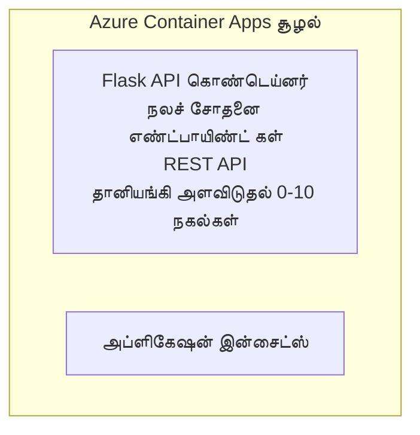

# எளிய Flask API - கண்டெய்னர் அப் உதாரணம்

**கற்றல் பாதை:** ஆரம்பநிலையினர் ⭐ | **நேரம்:** 25-35 நிமிடங்கள் | **செலவு:** $0-15/மாதம்

Azure Developer CLI (azd) பயன்படுத்தி Azure Container Apps-ல் நிறுவப்பட்ட ஒரு முழுமையான செயல்படும் Python Flask REST API. இந்த உதாரணம் கண்டெய்னர் கையளிப்பு, தானியங்கி அளவை மற்றும் கண்காணிப்பு அடிப்படைகளை காட்டுகிறது.

## 🎯 நீங்கள் என்ன கற்றுக்கொள்வீர்கள்

- கண்டெய்னர் செய்யப்பட்ட Python பயன்பாட்டை Azure-க்கு நியமிக்கவும்
- scale-to-zero உடன் தானியங்கி அளவீட்டை அமைக்கவும்
- ஆரோக்கிய சோதனைகள் மற்றும் தயார்தன்மை சோதனைகளை செயல்படுத்தவும்
- பயன்பாட்டின் லாக்கள் மற்றும் மேட்ரிக்‌ஸ்களை கண்காணிக்கவும்
- விரைவு நிறுவலுக்கு Azure Developer CLI ஐ பயன்படுத்தவும்

## 📦 உள்ளடக்கப்பட்டவை

✅ **Flask Application** - CRUD செயல்பாடுகளுடன் முழுமையான REST API (`src/app.py`)  
✅ **Dockerfile** - தயாரிப்பு-தகுதி கண்டெய்னர் கட்டமைப்பு  
✅ **Bicep Infrastructure** - Container Apps சூழல் மற்றும் API நியமனம்  
✅ **AZD Configuration** - ஒரு கட்டளையால் நிறுவல் அமைப்பு  
✅ **Health Probes** - Liveness மற்றும் readiness சோதனைகள் கான்பிகர் செய்யப்பட்டவை  
✅ **Auto-scaling** - HTTP பாரத்தில் அடிப்படையில் 0-10 பிரதிகள்  

## Architecture


## தேவையானவை

### தேவையானவை
- **Azure Developer CLI (azd)** - [நிறுவல் வழிகாட்டு](https://learn.microsoft.com/azure/developer/azure-developer-cli/install-azd)
- **Azure subscription** - [இலவச கணக்கு](https://azure.microsoft.com/free/)
- **Docker Desktop** - [Install Docker](https://www.docker.com/products/docker-desktop/) (உள்ளூர் சோதனைக்காக)

### தேவைகளைக் சரிபார்க்கவும்

```bash
# azd பதிப்பை சரிபார்க்கவும் (1.5.0 அல்லது அதற்கு மேல் தேவை)
azd version

# Azure உள்நுழைவை சரிபார்க்கவும்
azd auth login

# Docker ஐ சரிபார்க்கவும் (விருப்பமானது, உள்ளூர் சோதனைக்காக)
docker --version
```

## ⏱️ நிறுவல் காலவரிசை

| Phase | Duration | What Happens |
|-------|----------|--------------||
| Environment setup | 30 seconds | Create azd environment |
| Build container | 2-3 minutes | Docker build Flask app |
| Provision infrastructure | 3-5 minutes | Create Container Apps, registry, monitoring |
| Deploy application | 2-3 minutes | Push image and deploy to Container Apps |
| **Total** | **8-12 minutes** | Complete deployment ready |

## விரைவு தொடக்கம்

```bash
# உதாரணத்திற்கு செல்லவும்
cd examples/container-app/simple-flask-api

# சூழ்நிலையை ஆரம்பிக்கவும் (தனித்த பெயரைத் தேர்ந்தெடுக்கவும்)
azd env new myflaskapi

# எல்லாவற்றையும் நிறுவவும் (அடிப்படை அமைப்பு + பயன்பாடு)
azd up
# உங்களிடம் கேட்கப்படும்:
# 1. Azure சந்தாவை தேர்ந்தெடுக்கவும்
# 2. இடத்தைத் தேர்வுசெய்யவும் (உதாரணம்: eastus2)
# 3. நிறுவுவதற்கு 8-12 நிமிடங்கள் காத்திருக்கவும்

# உங்கள் API முடிவுப் புள்ளியைப் பெறவும்
azd env get-values

# API ஐ சோதிக்கவும்
curl $(azd env get-value API_ENDPOINT)/health
```

**எதிர்பார்க்கப்படும் வெளியீடு:**
```json
{
  "status": "healthy",
  "timestamp": "2025-11-19T10:30:00Z",
  "service": "simple-flask-api",
  "version": "1.0.0"
}
```

## ✅ நிறுவலை சரிபார்க்கவும்

### படி 1: நிறுவல் நிலையை சரிபார்க்கவும்

```bash
# பதிவேற்றப்பட்ட சேவைகளைப் பார்க்கவும்
azd show

# எதிர்பார்க்கப்படும் வெளியீடு காட்டுகிறது:
# - சேவை: api
# - ен்ட்பாயிண்ட்: https://ca-api-[env].xxx.azurecontainerapps.io
# - நிலை: இயங்குகிறது
```

### படி 2: API முடிச்சுகளை சோதிக்கவும்

```bash
# API இறுதிப் புள்ளியைப் பெற
API_URL=$(azd env get-value API_ENDPOINT)

# சேவையின் நிலையைச் சோதிக்க
curl $API_URL/health

# மூல முடிவுப் புள்ளியைச் சோதிக்க
curl $API_URL/

# ஒரு உருப்படியை உருவாக்கு
curl -X POST $API_URL/api/items \
  -H "Content-Type: application/json" \
  -d '{"name": "Test Item", "description": "My first item"}'

# அனைத்து உருப்படிகளையும் பெறு
curl $API_URL/api/items
```

**வெற்றி நிபந்தனைகள்:**
- ✅ ஆரோக்கிய எண்ட்பாயின்ட் HTTP 200 திருப்புகிறது
- ✅ ரூட் எண்ட்பாயின்ட் API தகவல்களை காட்டுகிறது
- ✅ POST ஒரு உருப்படியை உருவாக்கி HTTP 201 திருப்புகிறது
- ✅ GET உருவாக்கப்பட்ட உருப்படிகளை திருப்புகிறது

### படி 3: பதிவுகளைப் பார்க்கவும்

```bash
# azd monitor ஐப் பயன்படுத்தி நேரடி பதிவுகளை தொடர்ச்சியாக காணவும்
azd monitor --logs

# அல்லது Azure CLI ஐ பயன்படுத்தவும்:
az containerapp logs show --name api --resource-group $RG_NAME --follow

# நீங்கள் பின்வருவதை காண வேண்டும்:
# - Gunicorn தொடக்கச் செய்திகள்
# - HTTP கோரிக்கை பதிவுகள்
# - பயன்பாட்டு தகவல் பதிவுகள்
```

## திட்ட கட்டமைப்பு

```
simple-flask-api/
├── azure.yaml              # AZD configuration
├── infra/
│   ├── main.bicep         # Main infrastructure
│   ├── main.parameters.json
│   └── app/
│       ├── container-env.bicep
│       └── api.bicep
└── src/
    ├── app.py             # Flask application
    ├── requirements.txt
    └── Dockerfile
```

## API எண்ட்பாயின்ட்கள்

| Endpoint | Method | Description |
|----------|--------|-------------|
| `/health` | GET | Health check |
| `/api/items` | GET | List all items |
| `/api/items` | POST | Create new item |
| `/api/items/{id}` | GET | Get specific item |
| `/api/items/{id}` | PUT | Update item |
| `/api/items/{id}` | DELETE | Delete item |

## அமைப்புகள்

### சூழல் மாறிலிகள்

```bash
# தனிப்பயன் கட்டமைப்பை அமைக்க
azd env set PORT 8000
azd env set LOG_LEVEL info
azd env set MAX_REPLICAS 20
```

### அளவீடு அமைப்பு

API HTTP போக்குவரத்தினை அடிப்படையாக கொண்டு தானாக அளவிடுகிறது:
- **Min Replicas**: 0 (இடைவிலிக்கு வந்தால் பூஜ்ஜியமாக மாறும்)
- **Max Replicas**: 10
- **Concurrent Requests per Replica**: 50

## மேம்பாடு

### உள்ளூரில் இயக்குவது

```bash
# தேவையான சார்புகளை நிறுவவும்
cd src
pip install -r requirements.txt

# பயன்பாட்டை இயக்கவும்
python app.py

# உள்ளூரில் சோதனை செய்யவும்
curl http://localhost:8000/health
```

### கண்டெய்னரை கட்டவும் மற்றும் சோதனை செய்யவும்

```bash
# Docker படிமத்தை உருவாக்கு
docker build -t flask-api:local ./src

# கண்டெய்னரை உள்ளூரில் இயக்கு
docker run -p 8000:8000 flask-api:local

# கண்டெய்னரை சோதனை செய்
curl http://localhost:8000/health
```

## நிறுவல்

### முழு நிறுவல்

```bash
# அடிப்படைத் தளம் மற்றும் செயலியை நிறுவவும்
azd up
```

### குறியீட்டிற்கேற்ப நிறுவல்

```bash
# அடித்தள அமைப்பு மாற்றமின்றி செயலி குறியீட்டையே மட்டும் நிறுவவும்
azd deploy api
```

### உள்ளமைவை புதுப்பிக்கவும்

```bash
# சுற்றுச்சூழல் மாறிலிகளை புதுப்பிக்கவும்
azd env set API_KEY "new-api-key"

# புதிய கட்டமைப்புடன் மீண்டும் நிறுவவும்
azd deploy api
```

## கண்காணித்தல்

### பதிவுகளைப் பார்க்கவும்

```bash
# azd monitor பயன்படுத்தி நேரடி பதிவுகளை ஸ்ட்ரீம் செய்யவும்
azd monitor --logs

# அல்லது Container Apps க்கான Azure CLI-ஐ பயன்படுத்தவும்:
az containerapp logs show --name api --resource-group $RG_NAME --follow

# கடைசி 100 வரிகளைப் பார்க்கவும்
az containerapp logs show --name api --resource-group $RG_NAME --tail 100
```

### மீட்ரிக்‌ஸ்களை கண்காணிக்கவும்

```bash
# Azure Monitor டாஷ்போர்டை திறக்க
azd monitor --overview

# குறிப்பிட்ட அளவுகோல்களை பார்க்க
az monitor metrics list \
  --resource $(azd show --output json | jq -r '.services.api.resourceId') \
  --metric "Requests,ResponseTime"
```

## சோதனை

### ஆரோக்கிய சோதனை

```bash
curl $(azd show --output json | jq -r '.services.api.endpoint')/health
```

எதிர்பார்க்கப்படும் பதில்:
```json
{
  "status": "healthy",
  "timestamp": "2025-11-19T10:30:00Z"
}
```

### உருப்படி உருவாக்கவும்

```bash
curl -X POST $(azd show --output json | jq -r '.services.api.endpoint')/api/items \
  -H "Content-Type: application/json" \
  -d '{"name": "Test Item", "description": "A test item"}'
```

### அனைத்து உருப்படிகளையும் பெறவும்

```bash
curl $(azd show --output json | jq -r '.services.api.endpoint')/api/items
```

## செலவு சிறப்பிப்பு

இந்த நிறுவல் scale-to-zero ஐ பயன்படுத்துகிறது, ஆகையால் API கோரிக்கைகள் செயலாகும்போது மட்டுமே நீங்கள் கட்டணமளிக்க வேண்டும்:

- **ஐடில் செலவு**: ~$0/மாதம் (பூஜ்ஜியத்திற்கு மாறும்)
- **செயல்பாட்டு செலவு**: ~$0.000024/வினாடி ஒவ்வொரு பிரதிக்கும்
- **எதிர்பார்க்கப்படும் மாதச் செலவு** (இலகு பயன்பாடு): $5-15

### செலவுகளை மேலும் குறைக்க

```bash
# வளர்ச்சிக்காக அதிகபட்ச பிரதிகளை குறைக்கவும்
azd env set MAX_REPLICAS 3

# குறைந்த செயலற்ற நேர வரம்பை பயன்படுத்தவும்
azd env set SCALE_TO_ZERO_TIMEOUT 300  # 5 நிமிடங்கள்
```

## பிழைத்திருத்தம்

### கண்டெய்னர் துவங்கவில்லை

```bash
# Azure CLI பயன்படுத்தி கொண்டெய்னர் பதிவுகளை சரிபார்க்கவும்
az containerapp logs show --name api --resource-group $RG_NAME --tail 100

# Docker இமேஜ் உள்ளூரில் உருவாக்கப்படுகிறதா என்பதை சரிபார்க்கவும்
docker build -t test ./src
```

### API கிடைக்கவில்லை

```bash
# ingress வெளியகமானதா என்பதை சரிபார்க்கவும்
az containerapp show --name api --resource-group rg-simple-flask-api \
  --query properties.configuration.ingress.external
```

### அதிக பதில் நேரம்

```bash
# CPU/மெமரி பயன்பாட்டை சரிபார்க்கவும்
az monitor metrics list \
  --resource $(azd show --output json | jq -r '.services.api.resourceId') \
  --metric "CPUPercentage,MemoryPercentage"

# தேவையானால் வளங்களை அதிகரிக்கவும்
az containerapp update --name api --resource-group rg-simple-flask-api \
  --cpu 1.0 --memory 2Gi
```

## சுத்தம் செய்தல்

```bash
# அனைத்து வளங்களையும் நீக்கவும்
azd down --force --purge
```

## அடுத்த படிகள்

### இந்த உதாரணத்தை விரிவாக்கவும்

1. **தரவுத்தளத்தை சேர்க்கவும்** - Azure Cosmos DB அல்லது SQL Database ஐ ஒருங்கிணைக்கவும்
   ```bash
   # infra/main.bicep கோப்பில் Cosmos DB தொகுதியை சேர்க்க
   # app.py-ஐ தரவுத்தள இணைப்புடன் புதுப்பிக்க
   ```

2. **ஆதாரமிடலைச் சேர்க்கவும்** - Azure AD அல்லது API கீகளை நடைமுறைப்படுத்தவும்
   ```python
   # app.py இற்கு அங்கீகார மிடில்‌வேர் சேர்க்கவும்
   from functools import wraps
   ```

3. **CI/CD அமைக்கவும்** - GitHub Actions வேலை प्रवाहம்
   ```yaml
   # Create .github/workflows/deploy.yml
   name: Deploy to Azure
   on: [push]
   ```

4. **Managed Identity சேர்க்கவும்** - Azure சேவைகளுக்கு பாதுகாப்பான அணுகலை அமைக்கவும்
   ```bicep
   # Update infra/app/api.bicep
   identity: { type: 'SystemAssigned' }
   ```

### தொடர்புடைய உதாரணங்கள்

- **[தரவுத்தள செயலி](../../../../../examples/database-app)** - SQL Database உடன் முழுமையான உதாரணம்
- **[மைக்ரோசேவைகள்](../../../../../examples/container-app/microservices)** - பல-சேவை கட்டமைப்பு
- **[Container Apps Master Guide](../README.md)** - அனைத்து கண்டெய்னர் முறைபாடுகள்

### கற்றல் வளங்கள்

- 📚 [AZD தொடங்கியவர்களுக்கு பாடநெறி](../../../README.md) - முக்கிய பாடநெறி முகப்பு
- 📚 [Container Apps Patterns](../README.md) - மேலும் வெளியீட்டு மாதிரிகள்
- 📚 [AZD Templates Gallery](https://azure.github.io/awesome-azd/) - சமூக டெம்ப்ளேட்கள்

## கூடுதல் வளங்கள்

### ஆவணங்கள்
- **[Flask ஆவணம்](https://flask.palletsprojects.com/)** - Flask கட்டமைப்பு கையேடு
- **[Azure Container Apps](https://learn.microsoft.com/azure/container-apps/)** - அதிகாரப்பூர்வ Azure ஆவணங்கள்
- **[Azure Developer CLI](https://learn.microsoft.com/azure/developer/azure-developer-cli/)** - azd கட்டளை குறிப்புரை

### பயிற்சிகள்
- **[Container Apps Quickstart](https://learn.microsoft.com/azure/container-apps/quickstart-portal)** - உங்கள் முதல் செயலியை வெளியிடவும்
- **[Python on Azure](https://learn.microsoft.com/azure/developer/python/)** - Python வளர்ச்சி வழிகாட்டு
- **[Bicep Language](https://learn.microsoft.com/azure/azure-resource-manager/bicep/)** - குறியீட்டுப்போல அமைப்புகள்

### கருவிகள்
- **[Azure Portal](https://portal.azure.com)** - வளங்களை காட்சியளித்து நிர்வகிக்கவும்
- **[VS Code Azure Extension](https://marketplace.visualstudio.com/items?itemName=ms-azuretools.vscode-azurecontainerapps)** - IDE ஒருங்கிணைப்பு

---

**🎉 வாழ்த்துகள்!** நீங்கள் தானியங்கி அளவீடுச் செயல்பாடு மற்றும் கண்காணிப்புடன் Azure Container Apps-க்கு உற்பத்தி-தயாராக உள்ள Flask API ஒன்றை நிறுவி விட்டீர்கள்.

**கேள்விகள்?** [ஒரு issue திறக்கவும்](https://github.com/microsoft/AZD-for-beginners/issues) அல்லது [FAQ](../../../resources/faq.md) ஐ சரிபார்க்கவும்

---

<!-- CO-OP TRANSLATOR DISCLAIMER START -->
மறுப்புரை:
இந்த ஆவணம் AI மொழிபெயர்ப்பு சேவை [Co-op Translator](https://github.com/Azure/co-op-translator) மூலம் மொழிபெயர்க்கப்பட்டது. நாங்கள் துல்லியத்தை உறுதிசெய்ய முயற்சித்தாலும், தானாகச் செய்த மொழிபெயர்ப்புகளில் பிழைகள் அல்லது தவறுகள் இருக்க வாய்ப்புள்ளது என்பதை தயவுசெய்து கவனிக்கவும். அசலில் உள்ள ஆவணம் அதன் சொந்த மொழியில் அதிகாரப்பூர்வ ஆதாரமாக கருதப்பட வேண்டும். முக்கியமான தகவல்களுக்கு, தொழில்முறை மனித மொழிபெயர்ப்பை பயன்படுத்த பரிந்துரைக்கப்படுகிறது. இந்த மொழிபெயர்ப்பைப் பயன்படுத்துவதால் உண்டாகும் எந்த தவறான புரிதல்களுக்கும் அல்லது தவறான விளக்கங்களுக்கும் நாங்கள் பொறுப்பேற்கமாட்டோம்.
<!-- CO-OP TRANSLATOR DISCLAIMER END -->