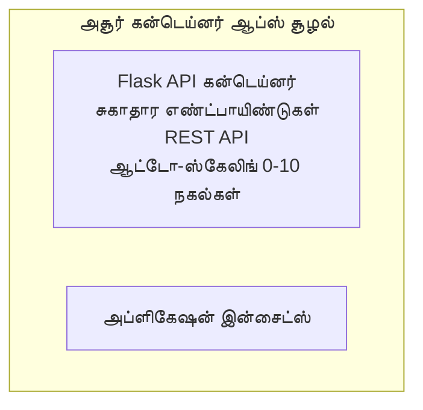

# எளிய Flask API - Container App எடுத்துக்காட்டு

**கற்றல் பாதை:** ஆரம்ப நிலை ⭐ | **நேரம்:** 25-35 நிமிடங்கள் | **செலவு:** $0-15/மாதம்

ஒரு முழுமையான, செயலில் இருக்கும் Python Flask REST API जिसे Azure Container Apps இல் Azure Developer CLI (azd) பயன்படுத்தி அமல்படுத்தப்பட்டுள்ளது. இந்த எடுத்துக்காரம் கண்டெய்னர் பரவல், தானாக ஸ்கேலிங், மற்றும் கண்காணிப்பு அடிப்படைகளை காட்டுகிறது.

## 🎯 நீங்கள் கற்றுக்கொள்ளும் விஷயங்கள்

- Container ஆகிய Python பயன்பாட்டை Azure இல்அமல்படுத்துவது
- scale-to-zero உடன் தானாக ஸ்கேலிங் கட்டமைப்பதை அமைத்தல்
- ஹெல்த் புரோப்கள் மற்றும் ரெடினஸ் Checks বাস্তবப்படுத்தல்
- பயன்பாட்டுப் பதிவுகள் மற்றும் அளவுகோல்களை கண்காணித்தல்
- அதிவேக வெளியீட்டிற்காக Azure Developer CLI ஐ பயன்படுத்துதல்

## 📦 உள்ளடக்கப்பட்டவை

✅ **Flask பயன்பாடு** - CRUD செயல்களை கொண்ட முழுமையான REST API (`src/app.py`)  
✅ **Dockerfile** - தயாரிப்பு-தகுதிக்கு ஏற்ப கொண்டெய்னர் கட்டமைப்பு  
✅ **Bicep Infrastructure** - Container Apps சுற்றுச்சூழலும் API வெளியீட்டும்  
✅ **AZD Configuration** - ஒரே கமாண்டால் வெளியீட்டு அமைப்பு  
✅ **Health Probes** - Liveness மற்றும் readiness சரிபார்ப்புகள் அமைக்கப்பட்டுள்ளன  
✅ **Auto-scaling** - HTTP ஏற்றத்தைப் பொருத்து 0-10 பிரதிகள்  

## Architecture



## Prerequisites

### தேவையானவை
- **Azure Developer CLI (azd)** - [நிறுவல் வழிகாட்டி](https://learn.microsoft.com/azure/developer/azure-developer-cli/install-azd)
- **Azure subscription** - [இலவச கணக்கு](https://azure.microsoft.com/free/)
- **Docker Desktop** - [Docker நிறுவுதல்](https://www.docker.com/products/docker-desktop/) (உள்ளூர் சோதனைக்கு)

### முன் தேவைகளை சரிபார்க்க

```bash
# azd பதிப்பை சரிபார்க்கவும் (1.5.0 அல்லது அதற்கு மேல் தேவை)
azd version

# Azure உள்நுழைவை சரிபார்க்கவும்
azd auth login

# Docker-ஐ சரிபார்க்கவும் (விருப்பமானது, உள்ளூர் சோதனைக்காக)
docker --version
```

## ⏱️ வெளியீட்டு நேர அட்டவணை

| Phase | Duration | What Happens |
|-------|----------|--------------||
| Environment setup | 30 seconds | Create azd environment |
| Build container | 2-3 minutes | Docker build Flask app |
| Provision infrastructure | 3-5 minutes | Create Container Apps, registry, monitoring |
| Deploy application | 2-3 minutes | Push image and deploy to Container Apps |
| **Total** | **8-12 minutes** | Complete deployment ready |

## Quick Start

```bash
# உதாரணத்திற்கு செல்லவும்
cd examples/container-app/simple-flask-api

# சூழலை துவக்கவும் (தனித்துவமான பெயரை தேர்வு செய்யவும்)
azd env new myflaskapi

# எல்லாவற்றையும் நிறுவவும் (அடித்தள அமைப்பு + பயன்பாடு)
azd up
# உங்களிடம் கேட்கப்படும்:
# 1. Azure சந்தாவை தேர்ந்தெடுக்கவும்
# 2. இடத்தை தேர்ந்தெடுக்கவும் (உதாரணமாக: eastus2)
# 3. நிறுவுதலுக்காக 8-12 நிமிடங்கள் காத்திருக்கவும்

# உங்கள் API எண்ட்பாயிண்டை பெறவும்
azd env get-values

# API ஐ சோதிக்கவும்
curl $(azd env get-value API_ENDPOINT)/health
```

**எதிர்பார்க்கப்படும் விளைவு:**
```json
{
  "status": "healthy",
  "timestamp": "2025-11-19T10:30:00Z",
  "service": "simple-flask-api",
  "version": "1.0.0"
}
```

## ✅ வெளியீட்டை சரிபார்க்க

### படி 1: வெளியீட்டு நிலையை சரிபார்க்க

```bash
# பதிவேற்றப்பட்ட சேவைகளைப் பார்க்கவும்
azd show

# எதிர்பார்க்கப்படும் வெளியீடு காட்டுகிறது:
# - சேவை: api
# - என்ட்பாயிண்ட்: https://ca-api-[env].xxx.azurecontainerapps.io
# - நிலை: செயலில் உள்ளது
```

### படி 2: API Endpoints ஐ சோதிக்க

```bash
# API எண்ட்பாயிண்ட் பெறுக
API_URL=$(azd env get-value API_ENDPOINT)

# சேவையின் நிலையைச் சோதிக்க
curl $API_URL/health

# மூல எண்ட்பாயிண்டைப் பரிசோதிக்க
curl $API_URL/

# ஒரு உருப்படியை உருவாக்குக
curl -X POST $API_URL/api/items \
  -H "Content-Type: application/json" \
  -d '{"name": "Test Item", "description": "My first item"}'

# எல்லா உருப்படிகளையும் பெறுக
curl $API_URL/api/items
```

**வெற்றி அளவுகோல்கள்:**
- ✅ Health endpoint HTTP 200 ஐத் திருப்புகிறது
- ✅ Root endpoint API தகவலைக் காட்டுகிறது
- ✅ POST ஒரு உருப்படியை உருவாக்கி HTTP 201 ஐத் திருப்புகிறது
- ✅ GET உருவாக்கப்பட்ட உருப்படிகளைத் திருப்புகிறது

### படி 3: பதிவுகளைப் பார்க்க

```bash
# azd monitor ஐப் பயன்படுத்தி நேரடி பதிவுகளை ஸ்ட்ரீம் செய்யவும்
azd monitor --logs

# அல்லது Azure CLI ஐப் பயன்படுத்தவும்:
az containerapp logs show --name api --resource-group $RG_NAME --follow

# நீங்கள் காணலாம்:
# - Gunicorn துவக்க செய்திகள்
# - HTTP கோரிக்கை பதிவுகள்
# - பயன்பாட்டு தகவல் பதிவுகள்
```

## திட்ட அமைப்பு

```
simple-flask-api/
├── azure.yaml              # AZD configuration
├── infra/
│   ├── main.bicep         # Main infrastructure
│   ├── main.parameters.json
│   └── app/
│       ├── container-env.bicep
│       └── api.bicep
└── src/
    ├── app.py             # Flask application
    ├── requirements.txt
    └── Dockerfile
```

## API Endpoints

| Endpoint | Method | Description |
|----------|--------|-------------|
| `/health` | GET | ஆரோக்கியச் சோதனை |
| `/api/items` | GET | அனைத்து உருப்படிகளையும் பட்டியலிடுகிறது |
| `/api/items` | POST | புதிய உருப்படியை உருவாக்குகிறது |
| `/api/items/{id}` | GET | குறிப்பிட்ட உருப்படியைப் பெறுகிறது |
| `/api/items/{id}` | PUT | உருப்படியை புதுப்பிக்கிறது |
| `/api/items/{id}` | DELETE | உருப்படியை நீக்குகிறது |

## Configuration

### Environment Variables

```bash
# தனிப்பயன் கட்டமைப்பை அமைக்கவும்
azd env set PORT 8000
azd env set LOG_LEVEL info
azd env set MAX_REPLICAS 20
```

### Scaling Configuration

API HTTP போக்குவரத்தை அடிப்படையாகக் கொண்டு தானாகவே ஸ்கேலிங் செய்யப்படும்:
- **Min Replicas**: 0 (ஈடுபடாதபோது பூஜ்ஜியமாக ஸ்கேல் செய்யப்படும்)
- **Max Replicas**: 10
- **ஒரே பிரதிக்கான ஒருங்கிணைந்த கோரிக்கைகள்**: 50

## Development

### Run Locally

```bash
# தேவையான சார்புகளை நிறுவவும்
cd src
pip install -r requirements.txt

# பயன்பாட்டை இயக்கவும்
python app.py

# உள்ளூர் முறையில் சோதனை செய்யவும்
curl http://localhost:8000/health
```

### Build and Test Container

```bash
# Docker இமேஜை உருவாக்கு
docker build -t flask-api:local ./src

# கொண்டெய்னரை உள்ளூர் கணினியில் இயக்கு
docker run -p 8000:8000 flask-api:local

# கொண்டெய்னரை சோதனை செய்
curl http://localhost:8000/health
```

## Deployment

### Full Deployment

```bash
# அடித்தள அமைப்பையும் பயன்பாட்டையும் நிலைநாட்டவும்
azd up
```

### Code-Only Deployment

```bash
# இன்ஃப்ராஸ்ட்ரக்சர் மாற்றமின்றி பயன்பாட்டு குறியீட்டையே மட்டும் வெளியிடவும்
azd deploy api
```

### Update Configuration

```bash
# சுற்றுச்சூழல் மாறிலிகளை புதுப்பிக்கவும்
azd env set API_KEY "new-api-key"

# புதிய உள்ளமைப்புடன் மீண்டும் வெளியிடவும்
azd deploy api
```

## Monitoring

### View Logs

```bash
# azd monitor ஐப் பயன்படுத்தி நேரடி பதிவுகளை ஸ்ட்ரீம் செய்யவும்
azd monitor --logs

# அல்லது Container Apps க்கான Azure CLI ஐப் பயன்படுத்தவும்:
az containerapp logs show --name api --resource-group $RG_NAME --follow

# கடைசி 100 வரிகளைப் பார்க்கவும்
az containerapp logs show --name api --resource-group $RG_NAME --tail 100
```

### Monitor Metrics

```bash
# Azure Monitor டாஷ்போர்டை திறக்க
azd monitor --overview

# குறிப்பிட்ட அளவுருக்களை பார்க்க
az monitor metrics list \
  --resource $(azd show --output json | jq -r '.services.api.resourceId') \
  --metric "Requests,ResponseTime"
```

## Testing

### Health Check

```bash
curl $(azd show --output json | jq -r '.services.api.endpoint')/health
```

எதிர்பார்க்கப்படும் பதில்:
```json
{
  "status": "healthy",
  "timestamp": "2025-11-19T10:30:00Z"
}
```

### Create Item

```bash
curl -X POST $(azd show --output json | jq -r '.services.api.endpoint')/api/items \
  -H "Content-Type: application/json" \
  -d '{"name": "Test Item", "description": "A test item"}'
```

### Get All Items

```bash
curl $(azd show --output json | jq -r '.services.api.endpoint')/api/items
```

## Cost Optimization

இந்த வெளியீடு scale-to-zero ஐப் பயன்படுத்துகிறது, ஆகவே API கோரிக்கைகளை செயலாக்கும் போது மட்டும் கட்டணம் செலுத்தவேண்டும்:

- **Idle cost**: ~$0/மாதம் (பூஜ்ஜியமாக ஸ்கேலாகும்)
- **Active cost**: ~$0.000024/வினாடி ஒரு பிரதிக்கு
- **எதிர்பார்க்கப்படும் மாதசெலவு** (இளஞ்சரிவு பயன்பாடு): $5-15

### மேலும் செலவைக் குறைக்க

```bash
# dev க்கான அதிகபட்ச ரெப்ளிகாக்களை குறைக்கவும்
azd env set MAX_REPLICAS 3

# குறுகிய இடைவெளி நேரத்தைப் பயன்படுத்தவும்
azd env set SCALE_TO_ZERO_TIMEOUT 300  # 5 நிமிடங்கள்
```

## Troubleshooting

### Container Won't Start

```bash
# Azure CLI ஐ பயன்படுத்தி கன்டெய்னர் பதிவுகளை சரிபார்க்கவும்
az containerapp logs show --name api --resource-group $RG_NAME --tail 100

# Docker இமேஜ் உள்ளூர் கணினியில் சரியாக கட்டப்படுகிறது என்பதை சரிபார்க்கவும்
docker build -t test ./src
```

### API Not Accessible

```bash
# ingress வெளிப்புறமா என்பதை சரிபார்க்கவும்
az containerapp show --name api --resource-group rg-simple-flask-api \
  --query properties.configuration.ingress.external
```

### High Response Times

```bash
# CPU/நினைவகம் பயன்பாட்டை சரிபார்க்கவும்
az monitor metrics list \
  --resource $(azd show --output json | jq -r '.services.api.resourceId') \
  --metric "CPUPercentage,MemoryPercentage"

# தேவையெனில் வளங்களை அதிகரிக்கவும்
az containerapp update --name api --resource-group rg-simple-flask-api \
  --cpu 1.0 --memory 2Gi
```

## Clean Up

```bash
# எல்லா வளங்களையும் நீக்கவும்
azd down --force --purge
```

## Next Steps

### இந்த எடுத்துக்காட்டை விரிவாக்கவும்

1. **Add Database** - Azure Cosmos DB அல்லது SQL Database ஐ ஒருங்கிணைக்கவும்
   ```bash
   # infra/main.bicep இல் Cosmos DB மொடியூலைச் சேர்க்க
   # app.py ஐ தரவுத்தள இணைப்புடன் புதுப்பிக்க
   ```

2. **Add Authentication** - Microsoft Entra ID அல்லது API கீகளை செயல்படுத்தவும்
   ```python
   # app.py-க்கு அங்கீகார மிடில்வேர் சேர்க்கவும்
   from functools import wraps
   ```

3. **Set Up CI/CD** - GitHub Actions workflow அமைக்கவும்
   ```yaml
   # Create .github/workflows/deploy.yml
   name: Deploy to Azure
   on: [push]
   ```

4. **Add Managed Identity** - Azure சேவைகளுக்கு பாதுகாப்பான அணுகலை வழங்க Managed Identity ஐ சேர்க்கவும்
   ```bicep
   # Update infra/app/api.bicep
   identity: { type: 'SystemAssigned' }
   ```

### தொடர்புடைய எடுத்துக்காட்டுகள்

- **[தரவுத்தள பயன்பாடு](../../../../../examples/database-app)** - SQL Database உடன் முழுமையான எடுத்துக்காட்டு
- **[மைக்ரோசெர்விசுகள்](../../../../../examples/container-app/microservices)** - பல-சேவை கட்டமைப்பு
- **[Container Apps Master Guide](../README.md)** - அனைத்து கண்டெய்னர் மாதிரிகள்

### கற்பதற்கான வளங்கள்

- 📚 [AZD For Beginners Course](../../../README.md) - பாடநெறியின் மைய முகப்பு
- 📚 [Container Apps Patterns](../README.md) - மேலும் வெளியீட்டு மாதிரிகள்
- 📚 [AZD Templates Gallery](https://azure.github.io/awesome-azd/) - சமூக மாதிரிகள்

## கூடுதல் வளங்கள்

### ஆவணங்கள்
- **[Flask Documentation](https://flask.palletsprojects.com/)** - Flask கட்டமைப்பு வழிகாட்டி
- **[Azure Container Apps](https://learn.microsoft.com/azure/container-apps/)** - Azure அதிகாரப்பூர்வ ஆவணங்கள்
- **[Azure Developer CLI](https://learn.microsoft.com/azure/developer/azure-developer-cli/)** - azd கட்டளை குறிப்பு

### பயிற்சிகள்
- **[Container Apps Quickstart](https://learn.microsoft.com/azure/container-apps/quickstart-portal)** - உங்கள் முதல் பயன்பாட்டை வெளியீடு செய்வது
- **[Python on Azure](https://learn.microsoft.com/azure/developer/python/)** - Python மேம்பாட்டு வழிகாட்டி
- **[Bicep Language](https://learn.microsoft.com/azure/azure-resource-manager/bicep/)** - Infrastructure as code

### கருவிகள்
- **[Azure Portal](https://portal.azure.com)** - வளங்களை காண்பீடு மூலம் நிர்வகிக்க
- **[VS Code Azure Extension](https://marketplace.visualstudio.com/items?itemName=ms-azuretools.vscode-azurecontainerapps)** - IDE இணைப்பு

---

**🎉 வாழ்த்துகள்!** நீங்கள் auto-scaling மற்றும் கண்காணிப்புடன் தயாரிப்பு-தகுதியான Flask API ஒன்றை Azure Container Apps இல் வெளியீடு செய்துள்ளீர்கள்.

**கேள்விகள்?** [ஒரு issue திறக்கவும்](https://github.com/microsoft/AZD-for-beginners/issues) அல்லது [அடிக்கடி கேட்கப்படும் கேள்விகள்](../../../resources/faq.md) பார்க்கவும்

---

<!-- CO-OP TRANSLATOR DISCLAIMER START -->
**மறுப்பு**:
இந்த ஆவணம் AI மொழிபெயர்ப்பு சேவை [Co-op Translator](https://github.com/Azure/co-op-translator) பயன்படுத்தி மொழிபெயர்க்கப்பட்டுள்ளது. நாங்கள் துல்லியத்திற்காக முயற்சி செய்துள்ளோம், ஆனால் தானாக செய்யப்படும் மொழிபெயர்ப்புகளில் பிழைகள் அல்லது தவறுகள் இருக்கலாம் என்பதை கவனத்தில் கொள்ளவும். அசல் ஆவணம் அதன் தாய்மொழியில் அதிகாரப்பூர்வ ஆதாரமாக கருதப்பட வேண்டும். முக்கியமான தகவல்களுக்கு, தொழில்நுட்பமான மனித மொழிபெயர்ப்பு பரிந்துரைக்கப்படுகிறது. இந்த மொழிபெயர்ப்பைப் பயன்படுத்துவதால் ஏற்படும் எந்த தவறான புரிதல்கள் அல்லது தவறான விளக்கத்திற்கும் நாங்கள் பொறுப்பில்வில்லை.
<!-- CO-OP TRANSLATOR DISCLAIMER END -->