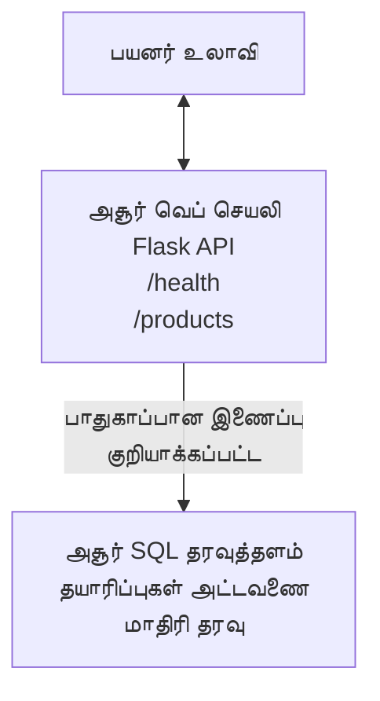

# AZD மூலம் Microsoft SQL தரவுத்தளமும் வலை செயலியையும் பதிவேற்றுதல்

⏱️ **மதிப்பிடப்பட்ட நேரம்**: 20-30 நிமிடங்கள் | 💰 **மதிப்பிடப்பட்ட செலவு**: ~$15-25/மாதம் | ⭐ **சிக்கல்தன்மை**: இடைநிலை

இந்த **முழு, இயங்கும் உதாரணம்** demonstrates how to use the [Azure Developer CLI (azd)](https://learn.microsoft.com/azure/developer/azure-developer-cli/) to deploy a Python Flask web application with a Microsoft SQL Database to Azure. All code is included and tested—no external dependencies required.

## நீங்கள் என்ன கற்றுக்கொள்ளவீர்கள்

By completing this example, you will:
- கோடாகக் கட்டமைப்பைப் பயன்படுத்தி பல-தர பயன்பாட்டை (வலை செயலி + தரவுத்தளம்) பதிவேற்றுதல்
- ரகசியங்களை ஹார்ட்கோட் செய்யாமல் பாதுகாப்பான தரவுத்தள இணைப்புகளை கட்டமைக்கவும்
- Application Insights மூலம் பயன்பாட்டு நிலையத்தை கண்காணிப்பு
- AZD CLI மூலம் Azure வளங்களை திறமையாக நிர்வகித்தல்
- பாதுகாப்பு, செலவுத்திறன் மற்றும் கண்காணிப்புக்கான Azure சிறந்த நடைமுறைகளை பின்பற்றுதல்

## நிகழ்வின் கண்ணோட்டம்
- **Web App**: தரவுத்தள இணைப்புடன் Python Flask REST API
- **Database**: மாதிரி தகவல்களுடன் Azure SQL Database
- **Infrastructure**: Bicep (மொடியூலர், மீண்டும் பயன்படுத்தக்கூடிய டெம்ப்ளேடுகள்) மூலம் வழங்கப்பட்டது
- **Deployment**: `azd` கட்டளைகளால் முழுமையாக தானியங்கி
- **Monitoring**: பதிவு மற்றும் டெலிமெட்ரிக்கான Application Insights

## முன் நிபந்தனைகள்

### தேவையான கருவிகள்

தொடங்குவதற்கு முன், கீழ்க்காணும் கருவிகள் நிறுவப்பட்டுள்ளதா என்பதை சரிபார்க்கவும்:

1. **[Azure CLI](https://learn.microsoft.com/cli/azure/install-azure-cli)** (பதிப்பு 2.50.0 அல்லது அதற்கு மேற்பட்டது)
   ```sh
   az --version
   # எதிர்பார்க்கப்படும் வெளியீடு: azure-cli 2.50.0 அல்லது அதற்கு மேல்
   ```

2. **[Azure Developer CLI (azd)](https://learn.microsoft.com/azure/developer/azure-developer-cli/install-azd)** (பதிப்பு 1.0.0 அல்லது அதற்கு மேற்பட்டது)
   ```sh
   azd version
   # எதிர்பார்க்கப்படும் வெளியீடு: azd பதிப்பு 1.0.0 அல்லது அதற்கு மேல்
   ```

3. **[Python 3.8+](https://www.python.org/downloads/)** (உள்ளூர் மேம்பாட்டுக்காக)
   ```sh
   python --version
   # எதிர்பார்க்கப்படும் வெளியீடு: Python 3.8 அல்லது அதற்கு மேற்பட்டது
   ```

4. **[Docker](https://www.docker.com/get-started)** (விருப்பமாக, உள்ளூர் கன்டெய்னரைப் பயன்படுத்தி மேம்பாட்டுக்காக)
   ```sh
   docker --version
   # எதிர்பார்க்கப்படும் வெளியீடு: Docker பதிப்பு 20.10 அல்லது அதற்கு மேல்
   ```

### Azure தேவைகள்

- An active **Azure subscription** ([create a free account](https://azure.microsoft.com/free/))
- உங்கள் சந்தாவில் வளங்களை உருவாக்க அனுமதிகள்
- **Owner** அல்லது **Contributor** பங்கு சந்தா அல்லது resource group இல்

### அறிவு முன் நிபந்தனைகள்

இது ஒரு **இடைநிலை** அளவிலான உதாரணம். நீங்கள் பின்வற்றவற்றுடன் பரிச்சயமாக இருக்க வேண்டும்:
- அடிப்படை கமாண்ட்-லைன் செயல்கள்
- முக்கிய மேகக் கொள்கைகள் (வளங்கள், வள குழுக்கள்)
- வலை பயன்பாடுகள் மற்றும் தரவுத்தளங்கள் பற்றிய அடிப்படை புரிதல்

**AZD-க்கு புதியவரா?** முதலில் [Getting Started guide](../../docs/chapter-01-foundation/azd-basics.md) ஐப் படியுங்கள்.

## கட்டமைப்பு

This example deploys a two-tier architecture with a web application and SQL database:


**Resource Deployment:**
- **Resource Group**: அனைத்து வளங்களுக்கும் குழு
- **App Service Plan**: Linux அடிப்படையிலான ஹோஸ்டிங் (செலவுத் திறனறுக்க B1 தரம்)
- **Web App**: Python 3.11 ரன்டைம் உடன் Flask பயன்பாடு
- **SQL Server**: TLS 1.2 குறைந்தபட்சம் கொண்ட நிர்வகிக்கப்பட்ட தரவுத்தள சர்வர்
- **SQL Database**: அடிப்படை தரம் (2GB, மேம்பாடு/சோதனைக்குப் பொருத்தமானது)
- **Application Insights**: கண்காணிப்பும் பதிவு செய்வதும்
- **Log Analytics Workspace**: மையமாக்கப்பட்ட பதிவு சேமிப்பு

**Analogy**: இதை ஒரு உணவகமாகக் கருதுங்கள் (வலை செயலி) மற்றும் ஒரு நடந்து செல்லும் ஃப்ரீஜர் (தரவுத்தளம்). வாடிக்கையாளர்கள் பட்டியலிலும் இருந்து ஆர்டர் செய்கிறார்கள் (API முடிவுப் புள்ளிகள்), மற்றும் சமையலறை (Flask செயலி) ஃப்ரீஜரிலிருந்து பொருட்களை (தரவு) எடுத்து செய்கிறது. உணவக மேலாளர் (Application Insights) நடக்கும் அனைத்தையும் கண்காணிக்கிறார்.

## கோப்பு அமைப்பு

All files are included in this example—no external dependencies required:

```
examples/database-app/
│
├── README.md                    # This file
├── azure.yaml                   # AZD configuration file
├── .env.sample                  # Sample environment variables
├── .gitignore                   # Git ignore patterns
│
├── infra/                       # Infrastructure as Code (Bicep)
│   ├── main.bicep              # Main orchestration template
│   ├── abbreviations.json      # Azure naming conventions
│   └── resources/              # Modular resource templates
│       ├── sql-server.bicep    # SQL Server configuration
│       ├── sql-database.bicep  # Database configuration
│       ├── app-service-plan.bicep  # Hosting plan
│       ├── app-insights.bicep  # Monitoring setup
│       └── web-app.bicep       # Web application
│
└── src/
    └── web/                    # Application source code
        ├── app.py              # Flask REST API
        ├── requirements.txt    # Python dependencies
        └── Dockerfile          # Container definition
```

**ஒவ்வொரு கோப்பும் என்ன செய்கிறது:**
- **azure.yaml**: AZD எதை எங்கு பதிய வேண்டும் என்பதைக் குறிப்பிடுகிறது
- **infra/main.bicep**: அனைத்து Azure வளங்களையும் ஒருசேர ஒழுங்குபடுத்துகிறது
- **infra/resources/*.bicep**: தனித்தனியான வள வரையறைகள் (மீண்டும் பயன்பாட்டுக்காக மொடியூலர்)
- **src/web/app.py**: தரவுத்தள லாஜிக்குடன் Flask பயன்பாடு
- **requirements.txt**: Python package சார்புகள்
- **Dockerfile**: பதவைக்கான கன்டெய்னரை உருவாக்கும் வழிமுறைகள்

## விரைவு துவக்கம் (படி படியாக)

### படி 1: கிளோன் செய்து செல்லவும்

```sh
git clone https://github.com/microsoft/AZD-for-beginners.git
cd AZD-for-beginners/examples/database-app
```

**✓ வெற்றியின் சரிபார்ப்பு**: நீங்கள் `azure.yaml` மற்றும் `infra/` அடைவைப் பார்க்கிறீர்களா என்பதை உறுதிசெய்யவும்:
```sh
ls
# எதிர்பார்க்கப்பட்டது: README.md, azure.yaml, infra/, src/
```

### படி 2: Azure உடன் அங்கீகாரம் பெறுதல்

```sh
azd auth login
```

இது உங்கள் பிரவுசரை Azure அங்கீகாரத்திற்காக திறக்கும். உங்கள் Azure அங்கீகார விவரங்களால் உள்நுழைக.

**✓ வெற்றியின் சரிபார்ப்பு**: நீங்கள் இதை பார்க்க வேண்டும்:
```
Logged in to Azure.
```

### படி 3: சுற்றுச்சூழலைத் துவக்குதல்

```sh
azd init
```

**என்ன நடக்கிறது**: AZD உங்கள் பதிவேற்றத்திற்காக ஒரு உள்ளூர் கட்டமைப்பை உருவாக்குகிறது.

**நீங்கள் காணும் கேள்விகள்**:
- **Environment name**: ஒரு குறுகிய பெயரை உள்ளிடவும் (எ.கா., `dev`, `myapp`)
- **Azure subscription**: பட்டியலில் இருந்து உங்கள் சந்தாவை தேர்வு செய்யவும்
- **Azure location**: ஒரு மண்டலத்தைத் தேர்வு செய்க (எ.கா., `eastus`, `westeurope`)

**✓ வெற்றியின் சரிபார்ப்பு**: நீங்கள் இதை பார்க்க வேண்டும்:
```
SUCCESS: New project initialized!
```

### படி 4: Azure வளங்களை வழங்குதல்

```sh
azd provision
```

**என்ன நடக்கும்**: AZD அனைத்து உட்படிவமைப்புகளையும் நிறுவுகிறது (5-8 நிமிடங்கள் எடுக்கும்):
1. வள குழுவை உருவாக்குகிறது
2. SQL சர்வர் மற்றும் தரவுத்தளத்தை உருவாக்குகிறது
3. App Service திட்டத்தை உருவாக்குகிறது
4. Web App ஐ உருவாக்குகிறது
5. Application Insights ஐ உருவாக்குகிறது
6. நெட்வொர்க்கிங் மற்றும் பாதுகாப்பை கட்டமைக்கிறது

**உங்களிடம் கேட்கப்படும்**:
- **SQL admin username**: ஒரு username ஐ உள்ளிடவும் (எ.கா., `sqladmin`)
- **SQL admin password**: ஒரு பலமான கடவுச்சொல்லை உள்ளிடவும் (இதை சேமிக்கவும்!)

**✓ வெற்றியின் சரிபார்ப்பு**: நீங்கள் இதை பார்க்க வேண்டும்:
```
SUCCESS: Your application was provisioned in Azure in X minutes Y seconds.
You can view the resources created under the resource group rg-<env-name> in Azure Portal:
https://portal.azure.com/#@/resource/subscriptions/.../resourceGroups/rg-<env-name>
```

**⏱️ நேரம்**: 5-8 நிமிடங்கள்

### படி 5: பயன்பாட்டை பதிவேற்றுதல்

```sh
azd deploy
```

**என்ன நடக்கும்**: AZD உங்கள் Flask பயன்பாட்டை கட்டமைத்து பதிவேற்றுகிறது:
1. Python பயன்பாட்டை பாக்கேஜ் செய்கிறது
2. Docker கன்டெய்னரை கட்டுகிறது
3. Azure Web App க்கு புஷ் செய்கிறது
4. மாதிரி தரவுடன் தரவுத்தளத்தை துவங்கி 초기ப்படுத்துகிறது
5. பயன்பாட்டைத் துவக்குகிறது

**✓ வெற்றியின் சரிபார்ப்பு**: நீங்கள் இதை பார்க்க வேண்டும்:
```
SUCCESS: Your application was deployed to Azure in X minutes Y seconds.
You can view the resources created under the resource group rg-<env-name> in Azure Portal:
https://portal.azure.com/#@/resource/subscriptions/.../resourceGroups/rg-<env-name>
```

**⏱️ நேரம்**: 3-5 நிமிடங்கள்

### படி 6: பயன்பாட்டை உலாவி பார்க்கவும்

```sh
azd browse
```

இது உங்கள் பதிவேற்றப்பட்ட வலை செயலியை உலாவியில் `https://app-<unique-id>.azurewebsites.net` என்ற முகவரியில் திறக்கும்

**✓ வெற்றியின் சரிபார்ப்பு**: நீங்கள் JSON வெளியீட்டை காணலாம்:
```json
{
  "message": "Welcome to the Database App API",
  "endpoints": {
    "/": "This help message",
    "/health": "Health check endpoint",
    "/products": "List all products",
    "/products/<id>": "Get product by ID"
  }
}
```

### படி 7: API முடிவுப் புள்ளிகளை சோதிக்கவும்

**Health Check** (தரவுத்தள இணைப்பை சரிபார்க்க):
```sh
curl https://app-<your-id>.azurewebsites.net/health
```

**எதிர்பார்க்கப்படும் பதில்**:
```json
{
  "status": "healthy",
  "database": "connected"
}
```

**List Products** (மாதிரி தரவுகள்):
```sh
curl https://app-<your-id>.azurewebsites.net/products
```

**எதிர்பார்க்கப்படும் பதில்**:
```json
[
  {
    "id": 1,
    "name": "Laptop",
    "description": "High-performance laptop",
    "price": 1299.99,
    "created_at": "2025-11-19T10:30:00"
  },
  ...
]
```

**Get Single Product**:
```sh
curl https://app-<your-id>.azurewebsites.net/products/1
```

**✓ வெற்றி சரிபார்ப்பு**: அனைத்து முடிவுப் புள்ளிகளும் பிழைகள் இல்லாமல் JSON தரவை திரும்ப வழங்குகின்றன.

---

**🎉 வாழ்த்துக்கள்!** நீங்கள் AZD பயன்படுத்தி ஒரு வலை பயன்பாட்டையும் தரவுத்தளத்தையும் Azure இல் வெற்றிகரமாக பதிவேற்றியுள்ளீர்கள்.

## கட்டமைப்பின் ஆழமான ஆய்வு

### சுற்றுச்சூழல் மாறில்கள்

ரகசியங்கள் Azure App Service கட்டமைப்பின் மூலம் பாதுகாப்பாக கையாளப்படுகின்றன—**மூலக் குறியீட்டில் எப்போதும் ஹார்ட்கோட் செய்யக்கூடாது**.

**AZD மூலம் தானாக கட்டமைக்கப்படும்**:
- `SQL_CONNECTION_STRING`: கடவுச்சொற்கள் குறியாக்கம் செய்யப்பட்ட தரவுத்தள இணைப்பு
- `APPLICATIONINSIGHTS_CONNECTION_STRING`: கண்காணிப்பு டெலிமெட்ரி என்ட்பாயிண்ட்
- `SCM_DO_BUILD_DURING_DEPLOYMENT`: தானாக சார்புகளை நிறுவுவதற்கு அனுமதிக்கிறது

**ரகசியங்கள் எங்கே சேமிக்கப்படுகின்றன**:
1. `azd provision` செயலின் போது, நீங்கள் பாதுகாப்பான கேள்விகளின் வாயிலாக SQL சான்றுகளை வழங்குவீர்கள்
2. AZD இவை உங்கள் உள்ளூரான `.azure/<env-name>/.env` கோப்பில் சேமிக்கிறது (git-ignored)
3. AZD அவற்றை Azure App Service கட்டமைப்பில் சேர்க்கிறது (சேமிக்கப்பட்டிருக்கும் போது குறியாக்கம் செய்யப்பட்டவை)
4. பயன்பாடு இயக்க நேரத்தில் அவற்றை `os.getenv()` மூலம் படிக்கிறது

### உள்ளூர் மேம்பாடு

உள்ளூர் சோதனைக்காக, மாதிரியில் இருந்து `.env` கோப்பை உருவாக்கவும்:

```sh
cp .env.sample .env
# உங்கள் உள்ளூர் தரவுத்தள இணைப்புடன் .env கோப்பை திருத்தவும்
```

**உள்ளூர் மேம்பாட்டு வேலைநடுவழி**:
```sh
# தேவையான சார்புகளை நிறுவவும்
cd src/web
pip install -r requirements.txt

# சூழல் மாறிலிகளை அமைக்கவும்
export SQL_CONNECTION_STRING="your-local-connection-string"

# பயன்பாட்டை இயக்கவும்
python app.py
```

**உள்ளூரில் சோதிக்கவும்**:
```sh
curl http://localhost:8000/health
# எதிர்பார்க்கப்பட்டது: {"நிலை": "ஆரோக்கியமான", "தரவுத்தளம்": "இணைக்கப்பட்டது"}
```

### கோடாக உள்ளமைப்பு

எல்லா Azure வளங்களும் **Bicep டெம்ப்ளேடுகள்** (`infra/` அடைவு) இல் வரையறுக்கப்பட்டுள்ளன:

- **மொடியூலர் வடிவமைப்பு**: மீண்டும் பயன்படுத்தக்கூடிய வகையில் ஒவ்வொரு வள வகைக்கும் தனித்த கோப்பு உள்ளது
- **பாராமீட்டரை கொண்டவை**: SKUs, மண்டலங்கள், பெயரிடும் பழக்கவழக்கங்களை தனிப்பயனாக்குங்கள்
- **மிகச்சிறந்த நடைமுறைகள்**: Azure பெயரிடு தரநிலைகள் மற்றும் பாதுகாப்பு இயல்புகளைப் பின்பற்றுகிறது
- **பதிப்பு கட்டுப்பாடு**: கட்டமைப்பு மாற்றங்கள் Git இல் பதிவுசெய்யப்படுகின்றன

**தனிப்பயனாக்கும் உதாரணம்**:
தரவுத்தள தரத்தை மாற்ற, `infra/resources/sql-database.bicep` ஐத் தொகுக்கவும்:
```bicep
sku: {
  name: 'Standard'  // Changed from 'Basic'
  tier: 'Standard'
  capacity: 10
}
```

## பாதுகாப்பு சிறந்த நடைமுறைகள்

இந்த உதாரணம் Azure பாதுகாப்பு சிறந்த நடைமுறைகளை பின்பற்றுகிறது:

### 1. **மூலக் குறியீட்டில் ரகசியங்கள் இல்லை**
- ✅ சான்றுகள் Azure App Service கட்டமைப்பில் சேமிக்கப்படுகின்றன (குறியாக்கம் செய்யப்பட்டவை)
- ✅ `.env` கோப்புகள் `.gitignore` மூலம் Git இல் இருந்து விலக்கப்பட்டுள்ளன
- ✅ வழங்கும் பொழுது பாதுகாப்பான பாராமீட்டர்களாக ரகசியங்கள் அனுப்பப்படுகின்றன

### 2. **குறியாக்கப்பட்ட இணைப்புகள்**
- ✅ SQL சர்வருக்கு குறைந்தபட்சம் TLS 1.2
- ✅ Web App க்கான HTTPS மட்டுமே கட்டாயமாக்கப்பட்டது
- ✅ தரவுத்தள இணைப்புகள் குறியாக்கப்பட்ட சேனல்களைப் பயன்படுத்துகின்றன

### 3. **நெட்வொர்க் பாதுகாப்பு**
- ✅ SQL சர்வர் ஃபயர்வால் Azure சேவைகள் மட்டுமே அனுமதிக்கும் படி கட்டமைக்கப்பட்டுள்ளது
- ✅ பொது நெட்வொர்க் அணுகலைக் கட்டுப்படுத்தப்பட்டுள்ளது (Private Endpoints மூலம் மேலும் கடுமையாக எடுக்கக்கூடும்)
- ✅ Web App இல் FTPS முடக்கப்பட்டுள்ளது

### 4. **அங்கீகாரம் மற்றும் அனுமதி**
- ⚠️ **தற்போது**: SQL authentication (username/password)
- ✅ **உற்பத்தி பரிந்துரை**: கடவுச்சொல் இல்லாத அங்கீகாரத்திற்காக Azure Managed Identity ஐப் பயன்படுத்தவும்

**Managed Identity க்கு மேம்படுத்த என்ன செய்ய வேண்டும்** (உற்பத்திக்காக):
1. Web App இல் managed identity ஐ இயக்கவும்
2. அந்த identityக்கு SQL அனுமதிகள் வழங்கவும்
3. managed identity பயன்படுத்த connection string ஐப் புதுப்பிக்கவும்
4. கடவுச்சொல்லைப் பயன்படுத்தும் அங்கீகாரத்தை அகற்றவும்

### 5. **ஆடிட்டிங்கும் ஒழுங்குமுறை பின்பற்றலும்**
- ✅ Application Insights அனைத்து கோரிக்கைகளையும் மற்றும் பிழைகளையும் பதிவுசெய்கிறது
- ✅ SQL Database ஆடிட்டிங் இயக்கு (ஒழுங்குமுறைக்காக கட்டமைக்க முடியும்)
- ✅ அனைத்து வளங்களுக்கும் நிர்வாகத்திற்காக tags இடப்பட்டுள்ளது

**உற்பத்திக்கு முன் பாதுகாப்பு சரிபார்ப்பு பட்டியல்**:
- [ ] SQL க்காக Azure Defender ஐ இயக்கவும்
- [ ] SQL Database க்காக Private Endpoints ஐ கட்டமைக்கவும்
- [ ] Web Application Firewall (WAF) ஐ இயக்கவும்
- [ ] ரகசியங்கள் சுழற்சிக்காக Azure Key Vault ஐ செயல்படுத்தவும்
- [ ] Azure AD அங்கீகாரத்தை கட்டமைக்கவும்
- [ ] அனைத்து வளங்களுக்கும் கண்காணிப்பு பதிவு(டயக்னொஸ்டிக்)ஐ இயக்கவும்

## செலவு உத்தமீकरणம்

**மாதாந்திர மதிப்பிடப்பட்ட செலவுகள்** (நவம்பர் 2025 நிலவரப்படி):

| வளம் | SKU/தரம் | மதிப்பிடப்பட்ட செலவு |
|----------|----------|----------------|
| App Service திட்டம் | B1 (அடிப்படை) | ~$13/மாதம் |
| SQL Database | அடிப்படை (2GB) | ~$5/மாதம் |
| Application Insights | Pay-as-you-go | ~$2/மாதம் (குறைந்த போக்குவரத்து) |
| **மொத்தம்** | | **~$20/மாதம்** |

**💡 செலவு சேமிப்பு குறிப்புகள்**:

1. **கற்றலுக்காக இலவச தரத்தைப் பயன்படுத்தவும்**:
   - App Service: F1 tier (இலவசம், கட்டுப்படுத்தப்பட்ட மணி)
   - SQL Database: Azure SQL Database serverless ஐப் பயன்படுத்தவும்
   - Application Insights: 5GB/மாதம் இலவசமான உள்ளீடு

2. **பயன்பாடு இல்லாதபோது வளங்களை நிறுத்தவும்**:
   ```sh
   # வலை செயலியை நிறுத்தவும் (தரவுத்தளம் இன்னும் கட்டணம் வசூலிக்கும்)
   az webapp stop --name <app-name> --resource-group <rg-name>
   
   # தேவையான போது மீண்டும் தொடங்கவும்
   az webapp start --name <app-name> --resource-group <rg-name>
   ```

3. **சோதனை முடிந்தவுடன் எல்லாவற்றையும் நீக்குங்கள்**:
   ```sh
   azd down
   ```
   இது அனைத்து வளங்களையும் நீக்குகிறது மற்றும் சார்ஜுகளை நிறுத்துகிறது.

4. **Development vs. Production SKUs**:
   - **Development**: அடிப்படை தரம் (இந்த உதாரணத்தில் பயன்படுத்தப்பட்டது)
   - **Production**: Standard/Premium தரம் உடன் redundancy

**செலவு கண்காணிப்பு**:
- செலவுகளை [Azure Cost Management](https://portal.azure.com/#view/Microsoft_Azure_CostManagement) இல் பார்க்கவும்
- அதிர்ச்சிகளைத் தவிர்க்க செலவுச் சபானங்களை அமைக்கவும்
- கண்காணிப்புக்காக அனைத்து வளங்களையும் `azd-env-name` என்ற tag மூலம் குறிக்கவும்

**இலவச தர மாற்று**:
கற்றலுக்காக, நீங்கள் `infra/resources/app-service-plan.bicep` ஐ மாற்றலாம்:
```bicep
sku: {
  name: 'F1'  // Free tier
  tier: 'Free'
}
```
**குறிப்பு**: இலவச தரத்திற்கு வரம்புகள் உள்ளன (60 min/day CPU, எப்போதும்-ஆன் இல்லை).

## கண்காணிப்பு & பார்வையியல்

### Application Insights ஒருங்கிணைப்பு

இந்த உதாரணம் முழுமையான கண்காணிப்புக்காக **Application Insights** ஐச் சேர்க்கிறது:

**என்ன கண்காணிக்கப்படுகிறது**:
- ✅ HTTP கோரிக்கைகள் (தாமதம், நிலை குறியீடுகள், முடிவுப்புள்ளிகள்)
- ✅ பயன்பாட்டு பிழைகள் மற்றும் விதிவிலக்குகள்
- ✅ Flask பயன்பாட்டிலிருந்து தனிப்பயன் பதிவேடு
- ✅ தரவுத்தள இணைப்பு நிலைமை
- ✅ செயல்திறன் அளவுகோல்கள் (CPU, நினைவு)

**Application Insights க்கு அணுகுதல்**:
1. [Azure Portal](https://portal.azure.com) ஐத் திறக்கவும்
2. உங்கள் resource group (`rg-<env-name>`) க்கு செல்லவும்
3. Application Insights வளத்தை (`appi-<unique-id>`) கிளிக் செய்யவும்

**பயனுள்ள விசாரணைகள்** (Application Insights → Logs):

**அனைத்து கோரிக்கைகளையும் பார்க்கவும்**:
```kusto
requests
| where timestamp > ago(1h)
| order by timestamp desc
| project timestamp, name, url, resultCode, duration
```

**பிழைகளை கண்டுபிடிக்கவும்**:
```kusto
exceptions
| where timestamp > ago(24h)
| order by timestamp desc
| project timestamp, type, outerMessage, operation_Name
```

**ஆரோக்கிய புள்ளியைச் சரிபார்க்கவும்**:
```kusto
requests
| where name contains "health"
| summarize count() by resultCode, bin(timestamp, 1h)
```

### SQL Database ஆடிட்டிங்

**SQL Database ஆடிட்டிங் இயக்கு** கீழ்க்காணும் விஷயங்களை கண்காணிக்க:
- தரவுத்தள அணுகல் தொடர்
- நுழைவு முயற்சிகள் தோல்வி
- Schema மாற்றங்கள்
- தரவு அணுகல் (ஒழுங்குமுறைக்காக)

**ஆடிட் பதிவுகளை அணுகவும்**:
1. Azure Portal → SQL Database → Auditing
2. Log Analytics workspace இல் பதிவுகளைப் பார்க்கவும்

### நேரடி (ரியல்-டைம்) கண்காணிப்பு

**நேரடி அளவுகோல்களைப் பார்க்கவும்**:
1. Application Insights → Live Metrics
2. கோரிக்கைகள், தோல்விகள் மற்றும் செயல்திறனை நேரடியாகப் பார்க்கவும்

**அறிவிப்புகளை அமைக்கவும்**:
முக்கிய நிகழ்வுகளுக்கு அறிவிப்புகளை உருவாக்கவும்:
- 5 நிமிடங்களில் HTTP 500 பிழைகள் > 5
- தரவுத்தள இணைப்பு தோல்விகள்
- உயர்ந்த பதில் நேரங்கள் (>2 வினாடிகள்)

**அறிவிப்பு உருவாக்குவதற்கான உதாரணம்**:
```sh
az monitor metrics alert create \
  --name "High-Response-Time" \
  --resource-group <rg-name> \
  --scopes <app-insights-resource-id> \
  --condition "avg requests/duration > 2000" \
  --description "Alert when response time exceeds 2 seconds"
```

## பிழை நீக்குதல்
### பொதுவான பிரச்சனைகள் மற்றும் தீர்வுகள்

#### 1. `azd provision` "இடம் கிடைக்கவில்லை" என்னும் பிழையுடன் தோல்வியடைகிறது

**அறிகுறி**:
```
Error: The subscription is not registered for the resource type 'components' in the location 'centralus'.
```

**தீர்வு**:
வேறு Azure மண்டலத்தை தேர்வு செய்யவும் அல்லது resource provider-ஐ பதிவு செய்யவும்:
```sh
az provider register --namespace Microsoft.Insights
```

#### 2. SQL இணைப்பு deployment-காலத்தில் தோல்வியடைகிறது

**அறிகுறி**:
```
pyodbc.OperationalError: ('08001', '[08001] [Microsoft][ODBC Driver 18 for SQL Server]TCP Provider...')
```

**தீர்வு**:
- SQL Server firewall Azure சேவைகளை அனுமதிக்கிறதா என்பதை சரிபார்க்கவும் (தானாக கட்டமைக்கப்படுகிறது)
- `azd provision` நடத்தியபோது SQL நிர்வாக கடவுச்சொல் சரியாக உள்ளதா என்பதை சரிபார்க்கவும்
- SQL Server முழுமையாக provision செய்யப்பட்டுள்ளதா என்பதை உறுதிசெய்யவும் (2-3 நிமிடங்கள் ஆகலாம்)

**இணைப்பை உறுதிப்படுத்தவும்**:
```sh
# Azure போர்டலில் இருந்து, SQL தரவுத்தளம் → கேள்வி திருத்திக்கு செல்லவும்
# உங்கள் அங்கீகாரச் சான்றுகளுடன் இணைக்க முயற்சிக்கவும்
```

#### 3. வலை செயலி "Application Error" காட்டுகிறது

**அறிகுறி**:
உலாவி பொது பிழை பக்கத்தை காட்டுகிறது.

**தீர்வு**:
அப்ளிகேஷன் பதிவுகளைச் சரிபார்க்கவும்:
```sh
# சமீபத்திய பதிவுகளைப் பார்க்கவும்
az webapp log tail --name <app-name> --resource-group <rg-name>
```

**பொதுவான காரணங்கள்**:
- சுற்றுச்சூழல் மாறிலிகள் காணவில்லை (App Service → Configuration ஐ சரிபார்க்கவும்)
- Python பேக்கேஜ் நிறுவல் தோல்வியடைந்தது (deployment பதிவுகளை சரிபார்க்கவும்)
- தரவுத்தள துவக்கத்தில் பிழை (SQL இணைப்பைச் சரிபார்க்கவும்)

#### 4. `azd deploy` "Build Error" காரணமாக தோல்வியடைகிறது

**அறிகுறி**:
```
Error: Failed to build project
```

**தீர்வு**:
- `requirements.txt` இல் எந்தவொரு சின்டாக்ஸ் பிழைகளும் இல்லாததையும் உறுதிசெய்யவும்
- `infra/resources/web-app.bicep` இல் Python 3.11 குறிப்பிடப்பட்டுள்ளதா என்பதைச் சரிபார்க்கவும்
- Dockerfile-இல் சரியான base image உள்ளதா என உறுதிசெய்க

**உள்ளூர் டிபக்**:
```sh
cd src/web
docker build -t test-app .
docker run -p 8000:8000 test-app
```

#### 5. AZD கட்டளைகளை இயக்கும்போது "Unauthorized" வரும்

**அறிகுறி**:
```
ERROR: (Unauthorized) The client '<id>' with object id '<id>' does not have authorization
```

**தீர்வு**:
Azure உடன் மீண்டும் சான்றளிக்கவும்:
```sh
# AZD பணிவழிகளுக்கு அவசியம்
azd auth login

# நீங்கள் நேரடியாக Azure CLI கட்டளைகளையும் பயன்படுத்தினால் அது விருப்பமானது
az login
```

சப்ஸ்கிரிப்ஷனில் நீங்கள் சரியான அனுமதிகளை (Contributor role) கொண்டுள்ளீர்களா என்பதை உறுதிசெய்துகொள்ளவும்.

#### 6. உயர் தரவுத்தள கட்டணங்கள்

**அறிகுறி**:
எதிர்பாராத Azure கட்டணங்கள்.

**தீர்வு**:
- சோதனை முடிந்தபின் `azd down` இயக்க மறந்துள்ளீர்களா என்பதை சரிபார்க்கவும்
- SQL Database Basic டியர் பயன்படுத்தப்படுகிறதா என்பதை உறுதிசெய்க (Premium இல்லை)
- Azure Cost Management-இல் செலவுகளைப்பிரி விவரிக்கவும்
- செலவுத் தெரிவிப்புகள் அமைக்கவும்

### உதவி பெறுவது

**அனைத்து AZD சுற்றுச்சூழல் மாறிலிகளையும் பார்க்கவும்**:
```sh
azd env get-values
```

**வழங்கல் நிலையைச் சரிபார்க்கவும்**:
```sh
az webapp show --name <app-name> --resource-group <rg-name> --query state
```

**அப்ளிகேஷன் பதிவுகளை அணுகவும்**:
```sh
az webapp log download --name <app-name> --resource-group <rg-name> --log-file app-logs.zip
```

**மேலும் உதவி வேண்டுமா?**
- [AZD பிழைத் தீர்வு வழிகாட்டி](../../docs/chapter-07-troubleshooting/common-issues.md)
- [Azure App Service பிழைத் தீர்வு](https://learn.microsoft.com/azure/app-service/troubleshoot-diagnostic-logs)
- [Azure SQL பிழைத் தீர்வு](https://learn.microsoft.com/azure/azure-sql/database/troubleshoot-common-errors-issues)

## நடைமுறை பயிற்சிகள்

### பயிற்சி 1: உங்கள் deployment-ஐ உறுதிசெய்க (தொடக்கத்தரப்பு)

**நோக்கம்**: அனைத்து வளங்களும் வழங்கப்பட்டுள்ளதா மற்றும் பயன்பாடு செயல்படுகிறதா என்பதை உறுதிசெய்வது.

**படிகள்**:
1. உங்கள் resource group-இல் உள்ள அனைத்து வளங்களையும் பட்டியலிடுக:
   ```sh
   az resource list --resource-group rg-<env-name> --output table
   ```
   **Expected**: 6-7 resources (Web App, SQL Server, SQL Database, App Service Plan, Application Insights, Log Analytics)

2. அனைத்து API endpoints-களையும் சோதிக்கவும்:
   ```sh
   curl https://app-<your-id>.azurewebsites.net/
   curl https://app-<your-id>.azurewebsites.net/health
   curl https://app-<your-id>.azurewebsites.net/products
   curl https://app-<your-id>.azurewebsites.net/products/1
   ```
   **Expected**: All return valid JSON without errors

3. Application Insights-ஐ சரிபார்க்கவும்:
   - Azure Portal-இல் Application Insights க்கு செல்லவும்
   - "Live Metrics" சென்று பாருங்கள்
   - உங்கள் вэப் செயலியில் உலாவியை புதுப்பிக்கவும்
   **Expected**: ரியல்-டைம் கோரிக்கைகள் தோன்றும்

**வெற்றி критерியாவாக**: 6-7 வளங்களும் உள்ளது, அனைத்து endpoints-களும் தரவு திருப்புகின்றன, Live Metrics செயற்பாட்டைக் காட்டுகிறது.

---

### பயிற்சி 2: புதிய API Endpoint ஒன்றை சேர்க்கவும் (இடைநிலை)

**நோக்கம்**: Flask பயன்பாட்டில் ஒரு புதிய endpoint-ஐ நீட்டிக்கவும்.

**துவக்கக் குறியீடு**: தற்போதைய endpoints `src/web/app.py` இல்

**படிகள்**:
1. `src/web/app.py` ஐ திருத்தி `get_product()` செயல்பாட்டுக்குப் பின் புதிய endpoint ஒன்றைச் சேர்க்கவும்:
   ```python
   @app.route('/products/search/<keyword>')
   def search_products(keyword):
       """Search products by name or description."""
       try:
           conn = get_db_connection()
           cursor = conn.cursor()
           cursor.execute(
               "SELECT id, name, description, price, created_at FROM products WHERE name LIKE ? OR description LIKE ?",
               (f'%{keyword}%', f'%{keyword}%')
           )
           
           products = []
           for row in cursor.fetchall():
               products.append({
                   'id': row[0],
                   'name': row[1],
                   'description': row[2],
                   'price': float(row[3]) if row[3] else None,
                   'created_at': row[4].isoformat() if row[4] else None
               })
           
           cursor.close()
           conn.close()
           
           logger.info(f"Search for '{keyword}' returned {len(products)} results")
           return jsonify(products), 200
           
       except Exception as e:
           logger.error(f"Error searching products: {str(e)}")
           return jsonify({'error': str(e)}), 500
   ```

2. புதுப்பிக்கப்பட்ட பயன்பாட்டை deploy செய்யவும்:
   ```sh
   azd deploy
   ```

3. புதிய endpoint-ஐ சோதிக்கவும்:
   ```sh
   curl https://app-<your-id>.azurewebsites.net/products/search/laptop
   ```
   **Expected**: "laptop" உடன் பொருந்தும் பொருட்களை திருப்பி தர வேண்டும்

**வெற்றி критерியாவாக**: புதிய endpoint வேலை செய்கிறது, வடிகட்டப்பட்ட முடிவுகளை திருப்புகிறது, Application Insights பதிவுகளில் தெரிகிறது.

---

### பயிற்சி 3: கண்காணிப்பு மற்றும் அலெர்டுகளை சேர்க்கவும் (அதிகக் காமகால)

**நோக்கம்**: அலெர்டுக்களுடன் முன்கூட்டியே கண்காணிப்பை அமைக்கவும்.

**படிகள்**:
1. HTTP 500 பிழைகள் үшін அலெர்ட் ஒன்றை உருவாக்கவும்:
   ```sh
   # Application Insights வளத்தின் ID ஐப் பெற
   AI_ID=$(az monitor app-insights component show \
     --app appi-<your-id> \
     --resource-group rg-<env-name> \
     --query id -o tsv)
   
   # அறிவிப்பை உருவாக்கு
   az monitor metrics alert create \
     --name "High-Error-Rate" \
     --resource-group rg-<env-name> \
     --scopes $AI_ID \
     --condition "count requests/failed > 5" \
     --window-size 5m \
     --evaluation-frequency 1m \
     --description "Alert when >5 failed requests in 5 minutes"
   ```

2. பிழைகளை ஏற்படுத்துவதன் மூலம் அலெர்டை trigger செய்யவும்:
   ```sh
   # இல்லாத பொருளை கோருதல்
   for i in {1..10}; do curl https://app-<your-id>.azurewebsites.net/products/999; done
   ```

3. அலெர்ட் எழுந்ததா என்பதைச் சரிபார்க்கவும்:
   - Azure Portal → Alerts → Alert Rules
   - உங்கள் மின்னஞ்சலைச் (கட்டமைக்கப்பட்டிருந்தால்) சரிபார்க்கவும்

**வெற்றி критерியாவாக**: அலெர்ட் விதி உருவாக்கப்பட்டுள்ளது, பிழைகள் ஏற்படும்போது 트ிகர் ஆகிறது, அறிவிப்புகள் பெறப்பட்டுள்ளன.

---

### பயிற்சி 4: தரவுத்தள ஸ்கீமா மாற்றங்கள் (அதிக நiples)

**நோக்கம்**: புதிய அட்டவணையை சேர்க்கவும் மற்றும் பயன்பாட்டை அதை பயன்படுத்துமாறு மாற்றவும்.

**படிகள்**:
1. Azure Portal Query Editor மூலம் SQL Database-ஐ இணைப்பு செய்க

2. புதிய `categories` அட்டவணையை உருவாக்கவும்:
   ```sql
   CREATE TABLE categories (
       id INT PRIMARY KEY IDENTITY(1,1),
       name NVARCHAR(50) NOT NULL,
       description NVARCHAR(200)
   );
   
   INSERT INTO categories (name, description) VALUES
   ('Electronics', 'Electronic devices and accessories'),
   ('Office Supplies', 'Office equipment and supplies');
   
   -- Add category to products table
   ALTER TABLE products ADD category_id INT;
   UPDATE products SET category_id = 1; -- Set all to Electronics
   ```

3. பதில்களில் பகுப்பு தகவலைக் சேர்க்க `src/web/app.py`-ஐ புதுப்பிக்கவும்

4. Deploy செய்து சோதிக்கவும்

**வெற்றி критерியாவாக**: புதிய அட்டவணை உள்ளது, பொருட்கள் பகுப்பு தகவலை காட்டுகின்றன, பயன்பாடு இன்னும் வேலை செய்கிறது.

---

### பயிற்சி 5: கேசிங்களை நடைமுறைப்படுத்துக (நிபுணர்)

**நோக்கம்**: செயல்திறனை மேம்படுத்த Azure Redis Cache ஐச் சேர்க்கவும்.

**படிகள்**:
1. `infra/main.bicep` இற்கு Redis Cache ஐ சேர்க்கவும்
2. பொருள் கேள்விகளை cache செய்ய `src/web/app.py`-ஐ புதுப்பிக்கவும்
3. Application Insights மூலம் செயல்திறன் மேம்பாட்டைப் பலன்களை அளவிடவும்
4. கேசிங் முன்/பின் பதில்களின் நேரத்தை ஒப்பு பார்க்கவும்

**வெற்றி критерியாவாக**: Redis வழங்கப்பட்டுள்ளது, கேசிங் வேலை செய்கிறது, பதில்களின் நேரம் >50% மேம்பட்டது.

**குறிப்பு**: [Azure Cache for Redis documentation](https://learn.microsoft.com/azure/azure-cache-for-redis/) ஐ ஆரம்பிக்கவும்.

---

## சுத்திகரிப்பு

முன்னேற்றச் செலவுகளைத் தவிர்க்க, முடிந்ததும் அனைத்து வளங்களையும் அழிக்கவும்:

```sh
azd down
```

**உறுதிசெய்தல் கேள்வி**:
```
? Total resources to delete: 7, are you sure you want to continue? (y/N)
```

உறுதிசெய்வதற்கு `y` என்று தட்டவும்.

**✓ வெற்றி சரிபார்ப்பு**: 
- அனைத்து வளங்களும் Azure Portal-இல் இருந்து அழிக்கப்பட்டுள்ளன
- தொடரும் கட்டணங்கள் எதுவும் இல்லை
- உள்ளூரில் `.azure/<env-name>` கோப்புறை நீக்கலாம்

**மற	options** (இन्ःபிராஸ்ட்ரக்சரை வைத்துக்கொண்டு, தரவுகளை நீக்க):
```sh
# வள குழுவை மட்டும் நீக்கவும் (AZD கட்டமைப்பை வைத்திருக்கவும்)
az group delete --name rg-<env-name> --yes
```
## மேலும் அறிய

### தொடர்புடைய ஆவணங்கள்
- [Azure Developer CLI Documentation](https://learn.microsoft.com/azure/developer/azure-developer-cli/)
- [Azure SQL Database Documentation](https://learn.microsoft.com/azure/azure-sql/database/)
- [Azure App Service Documentation](https://learn.microsoft.com/azure/app-service/)
- [Application Insights Documentation](https://learn.microsoft.com/azure/azure-monitor/app/app-insights-overview)
- [Bicep Language Reference](https://learn.microsoft.com/azure/azure-resource-manager/bicep/)

### இந்த பாடத்தில் அடுத்த படிகள்
- **[Container Apps Example](../../../../examples/container-app)**: Azure Container Apps உடன் микроசேவைகளை deploy செய்யவும்
- **[AI Integration Guide](../../../../docs/ai-foundry)**: உங்கள் பயன்பாட்டிற்கு AI செயல்திறன்களை சேர்க்கவும்
- **[Deployment Best Practices](../../docs/chapter-04-infrastructure/deployment-guide.md)**: உற்பத்தி deployment கருக்கோள்கள்

### முன்னேறிய தலைப்புகள்
- **Managed Identity**: கடவுச்சொற்களை நீக்கி Azure AD authentication பயன்படுத்து
- **Private Endpoints**: ஒரு வIRTUAL நெட்வொர்க்கில் தரவுத்தள இணைப்புகளை பாதுகாப்பு செய்யுங்கள்
- **CI/CD Integration**: GitHub Actions அல்லது Azure DevOps மூலம் deployments-ஐ தானியக்கப்படுத்துங்கள்
- **Multi-Environment**: dev, staging, production சூழல்கள் அமைக்கவும்
- **Database Migrations**: ஸ்கீமா பதிப்பு நிர்வாகத்திற்கு Alembic அல்லது Entity Framework பயன்படுத்து

### மற்ற அணுகுமுறைகளுடன் ஒப்பீடு

**AZD vs. ARM Templates**:
- ✅ AZD: ஊடக நிலை மேலாள்மை, எளிதான கட்டளைகள்
- ⚠️ ARM: அதிக விவரம், நுணுக்க கட்டுப்பாடு

**AZD vs. Terraform**:
- ✅ AZD: Azure-உதவியான, Azure சேவைகளுடன் ஒருங்கிணைந்தது
- ⚠️ Terraform: பல மேக ஆதரவு, பெரிய οικοσிஸ்டம்

**AZD vs. Azure Portal**:
- ✅ AZD: மீண்டும் இயங்கக்கூடியது, version-control செய்யக்கூடியது, தானியக்கப்படுத்தக்கூடியது
- ⚠️ Portal: கைமுறையான கிளிக்குகள், மீட்டமைக்க கஷ்டம்

**AZD-ஐ நினைத்தால்**: Azure க்கான Docker Compose — சிக்கலான deployments-க்கு எளிதாக்கப்பட்ட கட்டமைப்பு.

---

## அடிக்கடி கேட்கப்படும் கேள்விகள்

**Q: நான் வேறொரு நிரல்மொழியைப் பயன்படுத்தலாமா?**  
A: ஆம்! `src/web/`-ஐ Node.js, C#, Go அல்லது எந்த மொழியையும் கொண்டு மாற்றலாம். `azure.yaml` மற்றும் Bicep-ஐ அதனுபடி புதுப்பிக்கவும்.

**Q: நான் மேலும் தரவுத்தளங்களைச் சேர்க்க எப்படி?**  
A: `infra/main.bicep` இல் மற்றொரு SQL Database மொடியூலைச் சேர்க்கவும் அல்லது Azure Database சேவைகளில் PostgreSQL/MySQL பயன்படுத்தவும்.

**Q: இதை production-க்கு பயன்படுத்தலாமா?**  
A: இது ஆரம்பப்புள்ளியாகும். உற்பத்திக்காக, Managed Identity, Private Endpoints, redundancy, backup strategy, WAF மற்றும் மேம்பட்ட கண்காணிப்புகள் ஆகியவற்றைச் சேர்க்கவும்.

**Q: நான் code deployment க்கு பதிலாக containers பயன்படுத்த விரும்பினால்?**  
A: Docker கொண்டுள்ள [Container Apps Example](../../../../examples/container-app) ஐப் பாருங்கள், அது முழுமையாக Docker containers-ஐப் பயன்படுத்துகிறது.

**Q: நான் லோகலில் இருந்து தரவுத்தளத்துடன் எவ்வாறு இணைப்பது?**  
A: உங்கள் IP-ஐ SQL Server firewall-இலில் சேர்க்கவும்:
```sh
az sql server firewall-rule create \
  --resource-group rg-<env-name> \
  --server sql-<unique-id> \
  --name AllowMyIP \
  --start-ip-address <your-ip> \
  --end-ip-address <your-ip>
```

**Q: புதிய தரவுத்தளத்தை உருவாக்காமல் ஏற்கனவே உள்ள ஒரு தரவுத்தளத்தைப் பயன்படுத்தலாமா?**  
A: ஆம், `infra/main.bicep`-ஐ மாற்றி ஏற்கனவே உள்ள SQL Server-ஐ குறிப்பிட்டு connection string அளவுருக்களை புதுப்பிக்கவும்.

---

> **குறிப்பு:** AZD பயன்படுத்தி தரவுத்தளத்துடன் ஒரு வெப் செயலியை deploy செய்வதற்கான சிறந்த நடைமுறைகளை இந்த உதாரணம் காட்டுகிறது. இது வேலை செய்கின்ற குறியீடு, விரிவான ஆவணங்கள் மற்றும் பயிற்சிகளை உள்ளடக்கியது. உற்பத்தி deployments-க்கு, உங்கள் நிறுவனத்தின் பாதுகாப்பு, அளவீடு, ஒழுங்குபடுத்தல் மற்றும் செலவு தேவைகளை பரிசீலிக்கவும்.

**📚 பாடநெறி நடைமுறை இயக்கம்:**
- ← முந்தைய: [Container Apps Example](../../../../examples/container-app)
- → அடுத்தது: [AI Integration Guide](../../../../docs/ai-foundry)
- 🏠 [பாடநெறி முகப்பு](../../README.md)

---

<!-- CO-OP TRANSLATOR DISCLAIMER START -->
**மறுப்பு அறிவிப்பு**:
இந்த ஆவணம் AI மொழிபெயர்ப்பு சேவையான [Co-op Translator](https://github.com/Azure/co-op-translator) மூலம் மொழி மாற்றப்பட்டது. நாங்கள் துல்லியத்திற்காக முயற்சித்தாலும், தானியக்க மொழிபெயர்ப்புகளில் பிழைகள் அல்லது தவறான தகவல்கள் இருக்கக்கூடியதாக இருப்பதை தயவுசெய்து கவனத்தில் கொள்ளுங்கள். அசல் ஆவணம் அதன் சொந்த மொழியில் அதிகாரப்பூர்வ ஆதாரமாக கருதப்பட வேண்டும். முக்கியமான தகவல்களுக்கு, தொழில்முறை மனித மொழிபெயர்ப்பை பரிந்துரைக்கிறோம். இந்த மொழிபெயர்ப்பைப் பயன்படுத்துவதனால் ஏற்பட்ட எந்த தவறான புரிதல்களுக்கும் அல்லது தவறான விளக்கங்களுக்கும் நாங்கள் பொறுப்புள்ளவர்கள் அல்ல.
<!-- CO-OP TRANSLATOR DISCLAIMER END -->