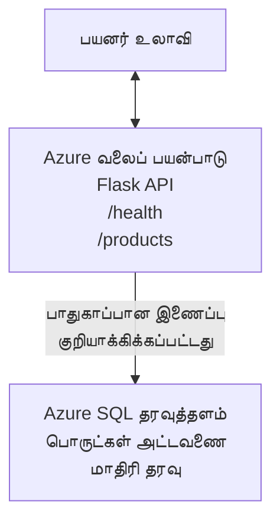

# Deploying a Microsoft SQL Database and Web App with AZD

⏱️ **Estimated Time**: 20-30 minutes | 💰 **Estimated Cost**: ~$15-25/month | ⭐ **Complexity**: Intermediate

This **complete, working example** demonstrates how to use the [Azure Developer CLI (azd)](https://learn.microsoft.com/azure/developer/azure-developer-cli/) to deploy a Python Flask web application with a Microsoft SQL Database to Azure. All code is included and tested—no external dependencies required.

## What You'll Learn

By completing this example, you will:
- Deploy a multi-tier application (web app + database) using infrastructure-as-code
- Configure secure database connections without hardcoding secrets
- Monitor application health with Application Insights
- Manage Azure resources efficiently with AZD CLI
- Follow Azure best practices for security, cost optimization, and observability

## Scenario Overview
- **Web App**: Python Flask REST API with database connectivity
- **Database**: Azure SQL Database with sample data
- **Infrastructure**: Provisioned using Bicep (modular, reusable templates)
- **Deployment**: Fully automated with `azd` commands
- **Monitoring**: Application Insights for logs and telemetry

## Prerequisites

### Required Tools

Before starting, verify you have these tools installed:

1. **[Azure CLI](https://learn.microsoft.com/cli/azure/install-azure-cli)** (version 2.50.0 or higher)
   ```sh
   az --version
   # எதிர்பார்க்கப்படும் வெளியீடு: azure-cli 2.50.0 அல்லது அதற்கு மேல்
   ```

2. **[Azure Developer CLI (azd)](https://learn.microsoft.com/azure/developer/azure-developer-cli/install-azd)** (version 1.0.0 or higher)
   ```sh
   azd version
   # எதிர்பார்க்கப்படும் வெளியீடு: azd பதிப்பு 1.0.0 அல்லது அதற்கு மேல்
   ```

3. **[Python 3.8+](https://www.python.org/downloads/)** (for local development)
   ```sh
   python --version
   # எதிர்பார்க்கப்படும் வெளியீடு: Python 3.8 அல்லது அதற்கும் மேல்
   ```

4. **[Docker](https://www.docker.com/get-started)** (optional, for local containerized development)
   ```sh
   docker --version
   # எதிர்பார்க்கப்படும் வெளியீடு: Docker பதிப்பு 20.10 அல்லது அதற்கு மேலே
   ```

### Azure Requirements

- An active **Azure subscription** ([create a free account](https://azure.microsoft.com/free/))
- Permissions to create resources in your subscription
- **Owner** or **Contributor** role on the subscription or resource group

### Knowledge Prerequisites

This is an **intermediate-level** example. You should be familiar with:
- Basic command-line operations
- Fundamental cloud concepts (resources, resource groups)
- Basic understanding of web applications and databases

**New to AZD?** Start with the [Getting Started guide](../../docs/chapter-01-foundation/azd-basics.md) first.

## Architecture

This example deploys a two-tier architecture with a web application and SQL database:


**Resource Deployment:**
- **Resource Group**: Container for all resources
- **App Service Plan**: Linux-based hosting (B1 tier for cost efficiency)
- **Web App**: Python 3.11 runtime with Flask application
- **SQL Server**: Managed database server with TLS 1.2 minimum
- **SQL Database**: Basic tier (2GB, suitable for development/testing)
- **Application Insights**: Monitoring and logging
- **Log Analytics Workspace**: Centralized log storage

**Analogy**: Think of this like a restaurant (web app) with a walk-in freezer (database). Customers order from the menu (API endpoints), and the kitchen (Flask app) retrieves ingredients (data) from the freezer. The restaurant manager (Application Insights) tracks everything that happens.

## Folder Structure

All files are included in this example—no external dependencies required:

```
examples/database-app/
│
├── README.md                    # This file
├── azure.yaml                   # AZD configuration file
├── .env.sample                  # Sample environment variables
├── .gitignore                   # Git ignore patterns
│
├── infra/                       # Infrastructure as Code (Bicep)
│   ├── main.bicep              # Main orchestration template
│   ├── abbreviations.json      # Azure naming conventions
│   └── resources/              # Modular resource templates
│       ├── sql-server.bicep    # SQL Server configuration
│       ├── sql-database.bicep  # Database configuration
│       ├── app-service-plan.bicep  # Hosting plan
│       ├── app-insights.bicep  # Monitoring setup
│       └── web-app.bicep       # Web application
│
└── src/
    └── web/                    # Application source code
        ├── app.py              # Flask REST API
        ├── requirements.txt    # Python dependencies
        └── Dockerfile          # Container definition
```

**What Each File Does:**
- **azure.yaml**: Tells AZD what to deploy and where
- **infra/main.bicep**: Orchestrates all Azure resources
- **infra/resources/*.bicep**: Individual resource definitions (modular for reuse)
- **src/web/app.py**: Flask application with database logic
- **requirements.txt**: Python package dependencies
- **Dockerfile**: Containerization instructions for deployment

## Quickstart (Step-by-Step)

### Step 1: Clone and Navigate

```sh
git clone https://github.com/microsoft/AZD-for-beginners.git
cd AZD-for-beginners/examples/database-app
```

**✓ Success Check**: Verify you see `azure.yaml` and `infra/` folder:
```sh
ls
# எதிர்பார்க்கப்படுகிறது: README.md, azure.yaml, infra/, src/
```

### Step 2: Authenticate with Azure

```sh
azd auth login
```

This opens your browser for Azure authentication. Sign in with your Azure credentials.

**✓ Success Check**: You should see:
```
Logged in to Azure.
```

### Step 3: Initialize the Environment

```sh
azd init
```

**What happens**: AZD creates a local configuration for your deployment.

**Prompts you'll see**:
- **Environment name**: Enter a short name (e.g., `dev`, `myapp`)
- **Azure subscription**: Select your subscription from the list
- **Azure location**: Choose a region (e.g., `eastus`, `westeurope`)

**✓ Success Check**: You should see:
```
SUCCESS: New project initialized!
```

### Step 4: Provision Azure Resources

```sh
azd provision
```

**What happens**: AZD deploys all infrastructure (takes 5-8 minutes):
1. Creates resource group
2. Creates SQL Server and Database
3. Creates App Service Plan
4. Creates Web App
5. Creates Application Insights
6. Configures networking and security

**You'll be prompted for**:
- **SQL admin username**: Enter a username (e.g., `sqladmin`)
- **SQL admin password**: Enter a strong password (save this!)

**✓ Success Check**: You should see:
```
SUCCESS: Your application was provisioned in Azure in X minutes Y seconds.
You can view the resources created under the resource group rg-<env-name> in Azure Portal:
https://portal.azure.com/#@/resource/subscriptions/.../resourceGroups/rg-<env-name>
```

**⏱️ Time**: 5-8 minutes

### Step 5: Deploy the Application

```sh
azd deploy
```

**What happens**: AZD builds and deploys your Flask application:
1. Packages the Python application
2. Builds the Docker container
3. Pushes to Azure Web App
4. Initializes the database with sample data
5. Starts the application

**✓ Success Check**: You should see:
```
SUCCESS: Your application was deployed to Azure in X minutes Y seconds.
You can view the resources created under the resource group rg-<env-name> in Azure Portal:
https://portal.azure.com/#@/resource/subscriptions/.../resourceGroups/rg-<env-name>
```

**⏱️ Time**: 3-5 minutes

### Step 6: Browse the Application

```sh
azd browse
```

This opens your deployed web app in the browser at `https://app-<unique-id>.azurewebsites.net`

**✓ Success Check**: You should see JSON output:
```json
{
  "message": "Welcome to the Database App API",
  "endpoints": {
    "/": "This help message",
    "/health": "Health check endpoint",
    "/products": "List all products",
    "/products/<id>": "Get product by ID"
  }
}
```

### Step 7: Test the API Endpoints

**Health Check** (verify database connection):
```sh
curl https://app-<your-id>.azurewebsites.net/health
```

**Expected Response**:
```json
{
  "status": "healthy",
  "database": "connected"
}
```

**List Products** (sample data):
```sh
curl https://app-<your-id>.azurewebsites.net/products
```

**Expected Response**:
```json
[
  {
    "id": 1,
    "name": "Laptop",
    "description": "High-performance laptop",
    "price": 1299.99,
    "created_at": "2025-11-19T10:30:00"
  },
  ...
]
```

**Get Single Product**:
```sh
curl https://app-<your-id>.azurewebsites.net/products/1
```

**✓ Success Check**: All endpoints return JSON data without errors.

---

**🎉 Congratulations!** You've successfully deployed a web application with a database to Azure using AZD.

## Configuration Deep-Dive

### Environment Variables

Secrets are managed securely via Azure App Service configuration—**never hardcoded in source code**.

**Configured Automatically by AZD**:
- `SQL_CONNECTION_STRING`: Database connection with encrypted credentials
- `APPLICATIONINSIGHTS_CONNECTION_STRING`: Monitoring telemetry endpoint
- `SCM_DO_BUILD_DURING_DEPLOYMENT`: Enables automatic dependency installation

**Where Secrets Are Stored**:
1. During `azd provision`, you provide SQL credentials via secure prompts
2. AZD stores these in your local `.azure/<env-name>/.env` file (git-ignored)
3. AZD injects them into Azure App Service configuration (encrypted at rest)
4. Application reads them via `os.getenv()` at runtime

### Local Development

For local testing, create a `.env` file from the sample:

```sh
cp .env.sample .env
# .env கோப்பை உங்கள் உள்ளூர் தரவுத்தள இணைப்புடன் திருத்தவும்
```

**Local Development Workflow**:
```sh
# தேவையான சார்புகளை நிறுவவும்
cd src/web
pip install -r requirements.txt

# சூழல் மாறிகளை அமைக்கவும்
export SQL_CONNECTION_STRING="your-local-connection-string"

# பயன்பாட்டை இயக்கவும்
python app.py
```

**Test locally**:
```sh
curl http://localhost:8000/health
# எதிர்பார்க்கப்படுகிறது: {"status": "healthy", "database": "connected"}
```

### Infrastructure as Code

All Azure resources are defined in **Bicep templates** (`infra/` folder):

- **Modular Design**: Each resource type has its own file for reusability
- **Parameterized**: Customize SKUs, regions, naming conventions
- **Best Practices**: Follows Azure naming standards and security defaults
- **Version Controlled**: Infrastructure changes are tracked in Git

**Customization Example**:
To change the database tier, edit `infra/resources/sql-database.bicep`:
```bicep
sku: {
  name: 'Standard'  // Changed from 'Basic'
  tier: 'Standard'
  capacity: 10
}
```

## Security Best Practices

This example follows Azure security best practices:

### 1. **No Secrets in Source Code**
- ✅ Credentials stored in Azure App Service configuration (encrypted)
- ✅ `.env` files excluded from Git via `.gitignore`
- ✅ Secrets passed via secure parameters during provisioning

### 2. **Encrypted Connections**
- ✅ TLS 1.2 minimum for SQL Server
- ✅ HTTPS-only enforced for Web App
- ✅ Database connections use encrypted channels

### 3. **Network Security**
- ✅ SQL Server firewall configured to allow Azure services only
- ✅ Public network access restricted (can be further locked down with Private Endpoints)
- ✅ FTPS disabled on Web App

### 4. **Authentication & Authorization**
- ⚠️ **Current**: SQL authentication (username/password)
- ✅ **Production Recommendation**: Use Azure Managed Identity for passwordless authentication

**To Upgrade to Managed Identity** (for production):
1. Enable managed identity on Web App
2. Grant identity SQL permissions
3. Update connection string to use managed identity
4. Remove password-based authentication

### 5. **Auditing & Compliance**
- ✅ Application Insights logs all requests and errors
- ✅ SQL Database auditing enabled (can be configured for compliance)
- ✅ All resources tagged for governance

**Security Checklist Before Production**:
- [ ] Enable Azure Defender for SQL
- [ ] Configure Private Endpoints for SQL Database
- [ ] Enable Web Application Firewall (WAF)
- [ ] Implement Azure Key Vault for secret rotation
- [ ] Configure Azure AD authentication
- [ ] Enable diagnostic logging for all resources

## Cost Optimization

**Estimated Monthly Costs** (as of November 2025):

| Resource | SKU/Tier | Estimated Cost |
|----------|----------|----------------|
| App Service Plan | B1 (Basic) | ~$13/month |
| SQL Database | Basic (2GB) | ~$5/month |
| Application Insights | Pay-as-you-go | ~$2/month (low traffic) |
| **Total** | | **~$20/month** |

**💡 Cost-Saving Tips**:

1. **Use Free Tier for Learning**:
   - App Service: F1 tier (free, limited hours)
   - SQL Database: Use Azure SQL Database serverless
   - Application Insights: 5GB/month free ingestion

2. **Stop Resources When Not in Use**:
   ```sh
   # வெப் செயலியை நிறுத்தவும் (தரவுத்தளம் இன்னும் கட்டணத்தை வசூலிக்கிறது)
   az webapp stop --name <app-name> --resource-group <rg-name>
   
   # தேவையான போது மீண்டும் துவக்கவும்
   az webapp start --name <app-name> --resource-group <rg-name>
   ```

3. **Delete Everything After Testing**:
   ```sh
   azd down
   ```
   This removes ALL resources and stops charges.

4. **Development vs. Production SKUs**:
   - **Development**: Basic tier (used in this example)
   - **Production**: Standard/Premium tier with redundancy

**Cost Monitoring**:
- View costs in [Azure Cost Management](https://portal.azure.com/#view/Microsoft_Azure_CostManagement)
- Set up cost alerts to avoid surprises
- Tag all resources with `azd-env-name` for tracking

**Free Tier Alternative**:
For learning purposes, you can modify `infra/resources/app-service-plan.bicep`:
```bicep
sku: {
  name: 'F1'  // Free tier
  tier: 'Free'
}
```
**Note**: Free tier has limitations (60 min/day CPU, no always-on).

## Monitoring & Observability

### Application Insights Integration

This example includes **Application Insights** for comprehensive monitoring:

**What's Monitored**:
- ✅ HTTP requests (latency, status codes, endpoints)
- ✅ Application errors and exceptions
- ✅ Custom logging from Flask app
- ✅ Database connection health
- ✅ Performance metrics (CPU, memory)

**Access Application Insights**:
1. Open [Azure Portal](https://portal.azure.com)
2. Navigate to your resource group (`rg-<env-name>`)
3. Click on Application Insights resource (`appi-<unique-id>`)

**Useful Queries** (Application Insights → Logs):

**View All Requests**:
```kusto
requests
| where timestamp > ago(1h)
| order by timestamp desc
| project timestamp, name, url, resultCode, duration
```

**Find Errors**:
```kusto
exceptions
| where timestamp > ago(24h)
| order by timestamp desc
| project timestamp, type, outerMessage, operation_Name
```

**Check Health Endpoint**:
```kusto
requests
| where name contains "health"
| summarize count() by resultCode, bin(timestamp, 1h)
```

### SQL Database Auditing

**SQL Database auditing is enabled** to track:
- Database access patterns
- Failed login attempts
- Schema changes
- Data access (for compliance)

**Access Audit Logs**:
1. Azure Portal → SQL Database → Auditing
2. View logs in Log Analytics workspace

### Real-Time Monitoring

**View Live Metrics**:
1. Application Insights → Live Metrics
2. See requests, failures, and performance in real-time

**Set Up Alerts**:
Create alerts for critical events:
- HTTP 500 errors > 5 in 5 minutes
- Database connection failures
- High response times (>2 seconds)

**Example Alert Creation**:
```sh
az monitor metrics alert create \
  --name "High-Response-Time" \
  --resource-group <rg-name> \
  --scopes <app-insights-resource-id> \
  --condition "avg requests/duration > 2000" \
  --description "Alert when response time exceeds 2 seconds"
```

## Troubleshooting
### பொதுவான பிரச்சனைகள் மற்றும் தீர்வுகள்

#### 1. `azd provision` "Location not available" என்ற குறியீட்டுடன் தோல்வி அடைகிறது

**அறிகுறி**:
```
Error: The subscription is not registered for the resource type 'components' in the location 'centralus'.
```

**தீர்வு**:
மற்ற Azure பிராந்தியத்தைத் தேர்வு செய்யவும் அல்லது resource provider-ஐ பதிவு செய்யவும்:
```sh
az provider register --namespace Microsoft.Insights
```

#### 2. பதிவேற்றத்தின் போது SQL இணைப்பு தோல்வி

**அறிகுறி**:
```
pyodbc.OperationalError: ('08001', '[08001] [Microsoft][ODBC Driver 18 for SQL Server]TCP Provider...')
```

**தீர்வு**:
- SQL Server ன் firewall Azure சேவைகளை அனுமதிக்கிறதா என்பதை சரிபார்க்கவும் (தானாக கட்டமைக்கப்படும்)
- `azd provision` 실행 დროს SQL நிர்வாக கடவுச்சொல் சரியாக உள்ளீட்டாகிவிட்டதா என்று சரிபார்க்கவும்
- SQL Server முழுமையாக provision ஆனதா என்பதை உறுதிசெய்க (2-3 நிமிடம் சும்மா ஆகலாம்)

**இணைப்பை சரிபார்க்கவும்**:
```sh
# Azure போர்டலிலிருந்து, SQL தரவுத்தளம் → வினவல் தொகுப்பிக்கு செல்லவும்
# உங்கள் நுழைவு விபரங்களுடன் இணைக்க முயற்சிக்கவும்
```

#### 3. Web App "Application Error" காட்டுகிறது

**அறிகுறி**:
உலாவி பொது பிழை பக்கத்தை காட்டுகிறது.

**தீர்வு**:
அப்ளிகேஷன் பதிவுகளைச் சரிபார்க்கவும்:
```sh
# சமீபத்திய பதிவுகளைப் பார்க்கவும்
az webapp log tail --name <app-name> --resource-group <rg-name>
```

**தகவலான காரணங்கள்**:
- சுற்றுப்புற மாறிலிகள் காணாமல் போனவை (App Service → Configuration ஐச் சரிபார்க்கவும்)
- Python package நிறுவல் தோல்வியடைந்தது (deployment பதிவுகளைச் சரிபார்க்கவும்)
- தரவுத்தளம் ஆரம்பப்படும்போது பிழை (SQL இணைப்பைச் சரிபார்க்கவும்)

#### 4. `azd deploy` "Build Error" என்ற காரணத்துடன் தோல்வி

**அறிகுறி**:
```
Error: Failed to build project
```

**தீர்வு**:
- `requirements.txt` இல் எந்தவொரு_Syntax_ பிழைகளும் இல்லையென்பதை உறுதிசெய்க
- `infra/resources/web-app.bicep` இல் Python 3.11 குறிப்பிடப்பட்டிருக்கிறதா என்பதை சரிபார்க்கவும்
- Dockerfile இல் சரியான base image உள்ளதா என்பதை உறுதிசெய்க

**உதவிக்காக உள்ளூரில் டீபக் செய்யவும்**:
```sh
cd src/web
docker build -t test-app .
docker run -p 8000:8000 test-app
```

#### 5. AZD கட்டளைகளை விரைவில் இயக்கும்போது "Unauthorized"

**அறிகுறி**:
```
ERROR: (Unauthorized) The client '<id>' with object id '<id>' does not have authorization
```

**தீர்வு**:
Azure உடன் மீண்டும் authentication செய்யவும்:
```sh
azd auth login
az login
```

சப்ஸ்கிரிப்ஷனில் உங்களுக்கு சரியான அனுமதிகள் (Contributor role) உள்ளதா என்பதை சரிபார்க்கவும்.

#### 6. தரவுத்தள கட்டணங்கள் அதிகம்

**அறிகுறி**:
எதிர்பாராத Azure கட்டணம்.

**தீர்வு**:
- சோதித்தபின் `azd down` இயக்க மறந்துவிட்டீர்களா என்பதைப் பரிசீாரிக்கவும்
- SQL Database Basic tier பயன்படுத்துகிறதா என்பதை உறுதிசெய்க (Premium அல்ல)
- Azure Cost Management இல் செலவுகளை மதிப்பாய்வு செய்யவும்
- செலவு தொடர்பான எச்சரிக்கைகள் அமைக்கவும்

### உதவி பெறுதல்

**எல்லா AZD சுற்றுபுற மாறிலிகளையும் பார்க்கவும்**:
```sh
azd env get-values
```

**Deployment நிலையைச் சரிபார்க்கவும்**:
```sh
az webapp show --name <app-name> --resource-group <rg-name> --query state
```

**அப்ளிகேஷன் பதிவுகளை அணுகவும்**:
```sh
az webapp log download --name <app-name> --resource-group <rg-name> --log-file app-logs.zip
```

**மேலும் உதவி வேண்டுமா?**
- [AZD பிரச்சனை தீர்க்கும் வழிகாட்டி](../../docs/chapter-07-troubleshooting/common-issues.md)
- [Azure App Service பிரச்சனை தீர்க்குதல்](https://learn.microsoft.com/azure/app-service/troubleshoot-diagnostic-logs)
- [Azure SQL பிரச்சனை தீர்க்குதல்](https://learn.microsoft.com/azure/azure-sql/database/troubleshoot-common-errors-issues)

## நடைமுறை பயிற்சிகள்

### பயிற்சி 1: உங்கள் பதிவேற்றத்தை உறுதிசெய்க (ஆரம்பநிலையினர்)

**நோக்கம்**: அனைத்து வளங்களும் deployed செய்யப்பட்டுள்ளன மற்றும் அப்ளிகேஷன் வேலை செய்கிறது என்பதை உறுதிசெய்வது.

**படிகள்**:
1. உங்கள் resource group இல் உள்ள அனைத்து வளங்களையும் பட்டியலிடவும்:
   ```sh
   az resource list --resource-group rg-<env-name> --output table
   ```
   ** எதிர்பார்ப்பு **: 6-7 வளங்கள் (Web App, SQL Server, SQL Database, App Service Plan, Application Insights, Log Analytics)

2. அனைத்து API endpoints ஐப் பரிசோதிக்கவும்:
   ```sh
   curl https://app-<your-id>.azurewebsites.net/
   curl https://app-<your-id>.azurewebsites.net/health
   curl https://app-<your-id>.azurewebsites.net/products
   curl https://app-<your-id>.azurewebsites.net/products/1
   ```
   ** எதிர்பார்ப்பு **: எல்லாம் தவறீறாமல் செல்லுபடி JSON ஐ திரும்பளிக்க வேண்டும்

3. Application Insights ஐச் சரிசெய்க:
   - Azure Portal இல் Application Insights செல்லவும்
   - "Live Metrics" ஐ திறக்கவும்
   - வலை செயலியில் உலாவியை புதுப்பிக்கவும்
   **எதிர்பார்ப்பு**: கோரிக்கைகள் நேரடி முறையில் தோன்றுவதை பார்க்க வேண்டும்

**வெற்றி கோட்பாடு**: அனைத்து 6-7 வளங்களும் உள்ளன, அனைத்து endpoints தரவினை திரும்பளிக்கின்றன, Live Metrics செயல்பாட்டை காட்டுகிறது.

---

### பயிற்சி 2: புதிய API Endpoint ஐ சேர்க்கவும் (இடைநிலை)

**நோக்கம்**: Flask அப்ளிகேஷனில் புதிய ஒரு endpoint ஐ நீட்டிப்பது.

**ஆரம்பக் குறியீடு**: தற்போதைய endpoints `src/web/app.py` இல் உள்ளன

**படிகள்**:
1. `src/web/app.py` ஐ திருத்தி `get_product()` செயல்பாட்டுக்குப் பிறகு புதிய endpoint ஐ சேர்க்கவும்:
   ```python
   @app.route('/products/search/<keyword>')
   def search_products(keyword):
       """Search products by name or description."""
       try:
           conn = get_db_connection()
           cursor = conn.cursor()
           cursor.execute(
               "SELECT id, name, description, price, created_at FROM products WHERE name LIKE ? OR description LIKE ?",
               (f'%{keyword}%', f'%{keyword}%')
           )
           
           products = []
           for row in cursor.fetchall():
               products.append({
                   'id': row[0],
                   'name': row[1],
                   'description': row[2],
                   'price': float(row[3]) if row[3] else None,
                   'created_at': row[4].isoformat() if row[4] else None
               })
           
           cursor.close()
           conn.close()
           
           logger.info(f"Search for '{keyword}' returned {len(products)} results")
           return jsonify(products), 200
           
       except Exception as e:
           logger.error(f"Error searching products: {str(e)}")
           return jsonify({'error': str(e)}), 500
   ```

2. புதுப்பிக்கப்பட்ட அப்ளிகேஷனை deploy செய்யவும்:
   ```sh
   azd deploy
   ```

3. புதிய endpoint ஐச் சோதிக்கவும்:
   ```sh
   curl https://app-<your-id>.azurewebsites.net/products/search/laptop
   ```
   **எதிர்பார்ப்பு**: "laptop" உடன் பொருந்தும் products ஐ திருப்பும்

**வெற்றி கோட்பாடு**: புதிய endpoint வேலை செய்கிறது, வடிகட்டப்பட்ட முடிவுகளை திரும்பளிக்கிறது, Application Insights பதிவுகளில் தோற்றம் காணப்படுகிறது.

---

### பயிற்சி 3: கண்காணிப்பு மற்றும் எச்சரிக்கைகள் சேர்க்கவும் (மேம்பட்ட)

**நோக்கம்**: முன்கூட்டியே கண்காணிப்பு மற்றும் எச்சரிக்கை அமைப்புகளை அமைத்தல்.

**படிகள்**:
1. HTTP 500 பிழைகளுக்காக ஒரு எச்சரிக்கை உருவாக்கவும்:
   ```sh
   # Application Insights வளத்தின் ID ஐப் பெறவும்
   AI_ID=$(az monitor app-insights component show \
     --app appi-<your-id> \
     --resource-group rg-<env-name> \
     --query id -o tsv)
   
   # எச்சரிக்கை உருவாக்கவும்
   az monitor metrics alert create \
     --name "High-Error-Rate" \
     --resource-group rg-<env-name> \
     --scopes $AI_ID \
     --condition "count requests/failed > 5" \
     --window-size 5m \
     --evaluation-frequency 1m \
     --description "Alert when >5 failed requests in 5 minutes"
   ```

2. பிழைகளை ஏற்படுத்தி எச்சரிக்கையை தூண்டவும்:
   ```sh
   # ஒரு இல்லாத தயாரிப்பை கோருதல்
   for i in {1..10}; do curl https://app-<your-id>.azurewebsites.net/products/999; done
   ```

3. எச்சரிக்கை நிகழ்ந்ததா என்பதை சரிபார்க்கவும்:
   - Azure Portal → Alerts → Alert Rules
   - உங்கள் மின்னஞ்சலைச் (அமைக்கப்பட்டிருந்தால்) சரிபார்க்கவும்

**வெற்றி கோட்பாடு**: எச்சரிக்கை விதி உருவாக்கப்பட்டது, பிழைகளை அடையாளம் கண்டு தூண்டுகிறது, அறிவிப்புகள் பெறப்படுகின்றன.

---

### பயிற்சி 4: தரவுத்தள ஸ்கீமா மாற்றங்கள் (மேம்பட்ட)

**நோக்கம்**: புதிய ஒரு அட்டவணையைக் சேர்த்து அப்ளிகேஷன் அதை பயன்படுத்தவும் மாற்றம் செய்யல்.

**படிகள்**:
1. Azure Portal Query Editor மூலம் SQL Database ஐ அணுகுக

2. புதிய `categories` அட்டவணையை உருவாக்குக:
   ```sql
   CREATE TABLE categories (
       id INT PRIMARY KEY IDENTITY(1,1),
       name NVARCHAR(50) NOT NULL,
       description NVARCHAR(200)
   );
   
   INSERT INTO categories (name, description) VALUES
   ('Electronics', 'Electronic devices and accessories'),
   ('Office Supplies', 'Office equipment and supplies');
   
   -- Add category to products table
   ALTER TABLE products ADD category_id INT;
   UPDATE products SET category_id = 1; -- Set all to Electronics
   ```

3. பதிப்பில் `src/web/app.py` ஐ category தகவலைக் கொண்டு பதில்களில் சேர்க்கவும்

4. Deploy செய்து சோதிக்கவும்

**வெற்றி கோட்பாடு**: புதிய அட்டவணை உருவாகியுள்ளது, பொருட்கள் category தகவலைக் காட்டுகின்றன, அப்ளிகேஷன் இயலும்.

---

### பயிற்சி 5: கேசிங் (Caching)實現செய்க (திறமையான)

**நோக்கம்**: செயல்திறனை மேம்படுத்த Azure Redis Cache ஐ சேர்க்கவும்.

**படிகள்**:
1. `infra/main.bicep` இல் Redis Cache ஐ சேர்க்கவும்
2. `src/web/app.py` ஐ புதுப்பித்து product தேடல்களை cache செய்யவும்
3. Application Insights மூலம் செயல்திறன் மேம்பாட்டைக் கணக்கிடவும்
4. கேசிங் முன்/பின் பதிலளிப்பு நேரங்களை ஒப்பிடவும்

**வெற்றி கோட்பாடு**: Redis deploy செய்யப்பட்டு கேசிங் வேலை செய்கிறது, பதிலளிப்பு நேரங்கள் >50% க்கு மேம்பட்டுள்ளன.

**உதவிகுறிப்பு**: தொடங்க [Azure Cache for Redis documentation](https://learn.microsoft.com/azure/azure-cache-for-redis/) ஐப் பார்க்கவும்.

---

## சுத்தப்படுத்துதல்

தொடர்ந்த கட்டணங்களைத் தவிர்க்க, முடிந்தபின் அனைத்து வளங்களையும் நீக்கவும்:

```sh
azd down
```

**உறுதிப்படுத்தும் கேட்பு**:
```
? Total resources to delete: 7, are you sure you want to continue? (y/N)
```

உறுதிப்படுத்த `y` என்பதை உள்ளிடவும்.

**✓ வெற்றி சரிபார்ப்பு**: 
- அனைத்து வளங்களும் Azure Portal இல் இருந்து நீக்கப்பட்டுள்ளன
- தொடர்ந்த கட்டணங்கள் இல்லை
- உள்ளூர் `.azure/<env-name>` கோப்புறை நீக்கலாம்

**வैकल्पிகம்** (இணையஉடலமைவை வைத்திருக்க, தரவை நீக்குக):
```sh
# வளக் குழுவையே மட்டும் அழிக்கவும் (AZD கட்டமைப்பை வைத்திருக்கவும்)
az group delete --name rg-<env-name> --yes
```
## மேலும் கற்றுக்கொள்ளுங்கள்

### தொடர்புடைய ஆவணங்கள்
- [Azure Developer CLI ஆவணங்கள்](https://learn.microsoft.com/azure/developer/azure-developer-cli/)
- [Azure SQL Database ஆவணங்கள்](https://learn.microsoft.com/azure/azure-sql/database/)
- [Azure App Service ஆவணங்கள்](https://learn.microsoft.com/azure/app-service/)
- [Application Insights ஆவணங்கள்](https://learn.microsoft.com/azure/azure-monitor/app/app-insights-overview)
- [Bicep மொழி குறிப்பு](https://learn.microsoft.com/azure/azure-resource-manager/bicep/)

### இந்தப் பாடத்தின் அடுத்த படிகள்
- **[Container Apps Example](../../../../examples/container-app)**: Azure Container Apps ஐ பயன்படுத்தி மைக்ரோசர்வீஸ்களை deploy செய்க
- **[AI Integration Guide](../../../../docs/ai-foundry)**: உங்கள் செயலியில் AI திறன்களை சேர்க்கவும்
- **[Deployment Best Practices](../../docs/chapter-04-infrastructure/deployment-guide.md)**: உற்பத்தி பதிவேற்ற மாதிரிகள்

### மேம்பட்ட தலைப்புகள்
- **Managed Identity**: கடவுச்சொற்களை அகற்றி Azure AD அங்கீகாரத்தைப் பயன்படுத்துங்கள்
- **Private Endpoints**: ஒரு வகை virtual network உள்ளே தரவுத்தள இணைப்புகளை பாதுகாக்கவும்
- **CI/CD Integration**: GitHub Actions அல்லது Azure DevOps உடன் deployments ஐ தானியக்கப்படுத்தவும்
- **Multi-Environment**: dev, staging மற்றும் production சூழல்களை அமைக்கவும்
- **Database Migrations**: ஸ்கீமா பதிப்பு நிர்வாகத்திற்கு Alembic அல்லது Entity Framework பயன்படுத்தவும்

### பிற அணுகுமுறைகளுடன் ஒப்பிடுதல்

**AZD vs. ARM Templates**:
- ✅ AZD: மேல் மட்டப் பரிமாணம், எளிமையான கட்டளைகள்
- ⚠️ ARM: அதிக விவரங்கள், நுணுக்கமான கட்டுப்பாடு

**AZD vs. Terraform**:
- ✅ AZD: Azure-உட்பட்டது, Azure சேவைகளுடன் இன்டிக்ரேட்டட்
- ⚠️ Terraform: பல-மேகம் ஆதரவு, பெரிய அமைப்புத்தளம்

**AZD vs. Azure Portal**:
- ✅ AZD: மீண்டும் செய்யக்கூடியது, version-control அடிப்படையில், தானியக்கமாய்ச் செயல்படும்
- ⚠️ Portal: கைமுறை கிளிக்குகள், மறுபடியும் உருவாக்க கடினம்

**AZD-வை நினைத்தால்**: Azure க்கான Docker Compose — சிக்கலான deployments க்கு எளிமைப்படுத்திய கட்டமைப்பு.

---

## அடிக்கடி கேட்கப்படும் கேள்விகள்

**Q: நான் வேறு программமிங் மொழியை பயன்படுத்தலாமா?**  
A: ஓர் ஆம்! `src/web/` ஐ Node.js, C#, Go, அல்லது எந்த மொழியிலும் மாற்றவும். `azure.yaml` மற்றும் Bicep ஐ அதன்படி புதுப்பிக்கவும்.

**Q: நான் மேலும் தரவுத்தளங்களை எப்படி சேர்க்கலாம்?**  
A: `infra/main.bicep` இல் மற்றொரு SQL Database module ஐ சேர்க்கவும் அல்லது Azure Database சேவைகளிலிருந்து PostgreSQL/MySQL ஐ பயன்படுத்தவும்.

**Q: இதை உற்பத்திக்கு பயன்படுத்தலாமா?**  
A: இது ஒரு தொடக்கப் புள்ளி. உற்பத்திக்காக, managed identity, private endpoints, redundancy, backup 전략ம், WAF, மற்றும் மேம்பட்ட கண்காணிப்புகளைச் சேர்க்கவும்.

**Q: கோடில் பதிப்பிறக்கத்திற்கு பதிலாக கொண்டெய்நர்களைப் பயன்படுத்த விரும்பினால் என்ன?**  
A: முழுவதும் Docker கொண்டெய்நர்கள் பயன்படுத்தும் [Container Apps Example](../../../../examples/container-app) ஐப் பாருங்கள்.

**Q: என் உள்ளூர்மிஷன் இருந்து தரவுத்தளத்துடன் எப்படி இணைக்கலாம்?**  
A: SQL Server firewall இற்கு உங்கள் IP ஐச் சேர்க்கவும்:
```sh
az sql server firewall-rule create \
  --resource-group rg-<env-name> \
  --server sql-<unique-id> \
  --name AllowMyIP \
  --start-ip-address <your-ip> \
  --end-ip-address <your-ip>
```

**Q: புதியதை உருவாக்காமல் இருக்க υπάρதான தரவுத்தளத்தை பயன்படுத்தலாமா?**  
A: ஆம், `infra/main.bicep` ஐ மாற்றி ஏற்கனவே உள்ள SQL Server ஐ குறிப்பிடவும் மற்றும் connection string அளவுருக்களை புதுப்பிக்கவும்.

---

> **குறிப்பு:** இந்த எடுத்துக்காட்டு AZD பயன்படுத்தி ஒரு வலை செயலியை தரவுத்தளத்துடன் deploy செய்வதற்கான சிறந்த நடைமுறைகளை காட்டுகிறது. இது வேலை செய்கிற குறியீடு, முழுமையான ஆவணங்கள் மற்றும் கற்பித்தலை வலியுறுத்தும் நடைமுறைப் பயிற்சிகளைப் 포함 செய்கிறது. உற்பத்தி deployments க்காக, உங்கள் நிறுவனத்தின் பாதுகாப்பு, scale, ஒழுங்குபடுத்தல் மற்றும் செலவு தேவைகளை மீள்பாருங்கள்.

**📚 பாடநெவிகேஷன்:**
- ← முந்தையது: [Container Apps Example](../../../../examples/container-app)
- → அடுத்தது: [AI Integration Guide](../../../../docs/ai-foundry)
- 🏠 [பாட கோடு முகப்பு](../../README.md)

---

<!-- CO-OP TRANSLATOR DISCLAIMER START -->
மறுப்பு அறிவிப்பு:
இந்த ஆவணம் AI மொழிபெயர்ப்பு சேவை [Co-op Translator](https://github.com/Azure/co-op-translator) மூலம் மொழிபெயர்க்கப்பட்டுள்ளது. நாங்கள் துல்லியத்திற்காக முயலும் போதிலும், தானியக்க மொழிபெயர்ப்புகளில் பிழைகள் அல்லது துல்லியமின்மை இருக்கக்கூடாது என்பதைக் கவனத்தில் கொள்ளவும். மூல ஆவணம் அதன் சொந்த மொழியே அதிகாரப்பூர்வமான ஆதாரமாக கருதப்பட வேண்டும். முக்கியமான தகவல்களுக்கு, தொழில்முறை மனித மொழிபெயர்ப்பை பரிந்துரைக்கிறோம். இந்த மொழிபெயர்ப்பைப் பயன்படுத்தியதினால் ஏற்பட்ட எந்த புரிதல் குறைபாடுகளுக்கும் அல்லது தவறான விளக்கங்களுக்கும் நாங்கள் பொறுப்பேற்கமாட்டோம்.
<!-- CO-OP TRANSLATOR DISCLAIMER END -->