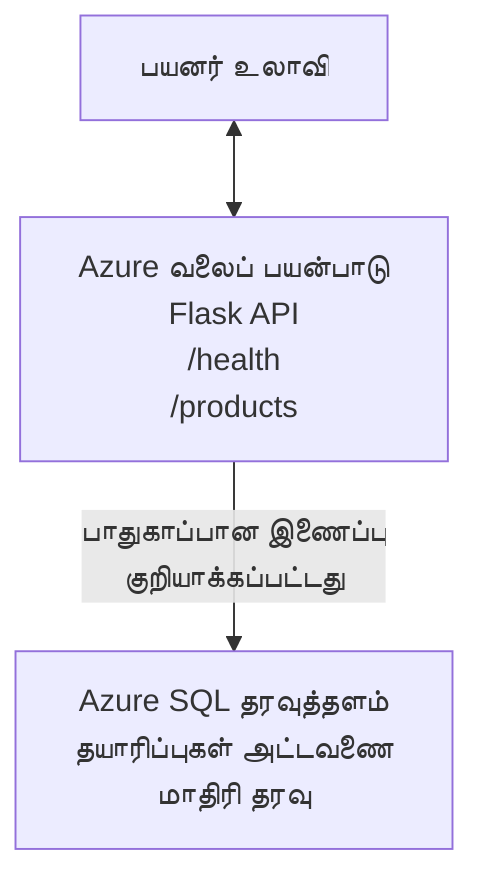

# Deploying a Microsoft SQL Database and Web App with AZD

⏱️ **Estimated Time**: 20-30 minutes | 💰 **Estimated Cost**: ~$15-25/month | ⭐ **Complexity**: Intermediate

This **complete, working example** demonstrates how to use the [Azure Developer CLI (azd)](https://learn.microsoft.com/azure/developer/azure-developer-cli/) to deploy a Python Flask web application with a Microsoft SQL Database to Azure. All code is included and tested—no external dependencies required.

## What You'll Learn

By completing this example, you will:
- Deploy a multi-tier application (web app + database) using infrastructure-as-code
- Configure secure database connections without hardcoding secrets
- Monitor application health with Application Insights
- Manage Azure resources efficiently with AZD CLI
- Follow Azure best practices for security, cost optimization, and observability

## Scenario Overview
- **Web App**: Python Flask REST API with database connectivity
- **Database**: Azure SQL Database with sample data
- **Infrastructure**: Provisioned using Bicep (modular, reusable templates)
- **Deployment**: Fully automated with `azd` commands
- **Monitoring**: Application Insights for logs and telemetry

## Prerequisites

### Required Tools

Before starting, verify you have these tools installed:

1. **[Azure CLI](https://learn.microsoft.com/cli/azure/install-azure-cli)** (version 2.50.0 or higher)
   ```sh
   az --version
   # எதிர்பார்க்கப்படும் வெளியீடு: azure-cli 2.50.0 அல்லது அதற்கு மேற்பட்ட பதிப்பு
   ```

2. **[Azure Developer CLI (azd)](https://learn.microsoft.com/azure/developer/azure-developer-cli/install-azd)** (version 1.0.0 or higher)
   ```sh
   azd version
   # எதிர்பார்க்கப்படும் வெளியீடு: azd பதிப்பு 1.0.0 அல்லது அதற்கு மேல்
   ```

3. **[Python 3.8+](https://www.python.org/downloads/)** (for local development)
   ```sh
   python --version
   # எதிர்பார்க்கப்படும் வெளியீடு: Python 3.8 அல்லது அதற்கு மேல்
   ```

4. **[Docker](https://www.docker.com/get-started)** (optional, for local containerized development)
   ```sh
   docker --version
   # எதிர்பார்க்கப்படும் வெளியீடு: Docker பதிப்பு 20.10 அல்லது அதற்கு மேற்பட்டது
   ```

### Azure Requirements

- An active **Azure subscription** ([create a free account](https://azure.microsoft.com/free/))
- Permissions to create resources in your subscription
- **Owner** or **Contributor** role on the subscription or resource group

### Knowledge Prerequisites

This is an **intermediate-level** example. You should be familiar with:
- Basic command-line operations
- Fundamental cloud concepts (resources, resource groups)
- Basic understanding of web applications and databases

**New to AZD?** Start with the [Getting Started guide](../../docs/chapter-01-foundation/azd-basics.md) first.

## Architecture

This example deploys a two-tier architecture with a web application and SQL database:



**Resource Deployment:**
- **Resource Group**: Container for all resources
- **App Service Plan**: Linux-based hosting (B1 tier for cost efficiency)
- **Web App**: Python 3.11 runtime with Flask application
- **SQL Server**: Managed database server with TLS 1.2 minimum
- **SQL Database**: Basic tier (2GB, suitable for development/testing)
- **Application Insights**: Monitoring and logging
- **Log Analytics Workspace**: Centralized log storage

**Analogy**: Think of this like a restaurant (web app) with a walk-in freezer (database). Customers order from the menu (API endpoints), and the kitchen (Flask app) retrieves ingredients (data) from the freezer. The restaurant manager (Application Insights) tracks everything that happens.

## Folder Structure

All files are included in this example—no external dependencies required:

```
examples/database-app/
│
├── README.md                    # This file
├── azure.yaml                   # AZD configuration file
├── .env.sample                  # Sample environment variables
├── .gitignore                   # Git ignore patterns
│
├── infra/                       # Infrastructure as Code (Bicep)
│   ├── main.bicep              # Main orchestration template
│   ├── abbreviations.json      # Azure naming conventions
│   └── resources/              # Modular resource templates
│       ├── sql-server.bicep    # SQL Server configuration
│       ├── sql-database.bicep  # Database configuration
│       ├── app-service-plan.bicep  # Hosting plan
│       ├── app-insights.bicep  # Monitoring setup
│       └── web-app.bicep       # Web application
│
└── src/
    └── web/                    # Application source code
        ├── app.py              # Flask REST API
        ├── requirements.txt    # Python dependencies
        └── Dockerfile          # Container definition
```

**What Each File Does:**
- **azure.yaml**: Tells AZD what to deploy and where
- **infra/main.bicep**: Orchestrates all Azure resources
- **infra/resources/*.bicep**: Individual resource definitions (modular for reuse)
- **src/web/app.py**: Flask application with database logic
- **requirements.txt**: Python package dependencies
- **Dockerfile**: Containerization instructions for deployment

## Quickstart (Step-by-Step)

### Step 1: Clone and Navigate

```sh
git clone https://github.com/microsoft/AZD-for-beginners.git
cd AZD-for-beginners/examples/database-app
```

**✓ Success Check**: Verify you see `azure.yaml` and `infra/` folder:
```sh
ls
# எதிர்பார்க்கப்பட்டது: README.md, azure.yaml, infra/, src/
```

### Step 2: Authenticate with Azure

```sh
azd auth login
```

This opens your browser for Azure authentication. Sign in with your Azure credentials.

**✓ Success Check**: You should see:
```
Logged in to Azure.
```

### Step 3: Initialize the Environment

```sh
azd init
```

**What happens**: AZD creates a local configuration for your deployment.

**Prompts you'll see**:
- **Environment name**: Enter a short name (e.g., `dev`, `myapp`)
- **Azure subscription**: Select your subscription from the list
- **Azure location**: Choose a region (e.g., `eastus`, `westeurope`)

**✓ Success Check**: You should see:
```
SUCCESS: New project initialized!
```

### Step 4: Provision Azure Resources

```sh
azd provision
```

**What happens**: AZD deploys all infrastructure (takes 5-8 minutes):
1. Creates resource group
2. Creates SQL Server and Database
3. Creates App Service Plan
4. Creates Web App
5. Creates Application Insights
6. Configures networking and security

**You'll be prompted for**:
- **SQL admin username**: Enter a username (e.g., `sqladmin`)
- **SQL admin password**: Enter a strong password (save this!)

**✓ Success Check**: You should see:
```
SUCCESS: Your application was provisioned in Azure in X minutes Y seconds.
You can view the resources created under the resource group rg-<env-name> in Azure Portal:
https://portal.azure.com/#@/resource/subscriptions/.../resourceGroups/rg-<env-name>
```

**⏱️ Time**: 5-8 minutes

### Step 5: Deploy the Application

```sh
azd deploy
```

**What happens**: AZD builds and deploys your Flask application:
1. Packages the Python application
2. Builds the Docker container
3. Pushes to Azure Web App
4. Initializes the database with sample data
5. Starts the application

**✓ Success Check**: You should see:
```
SUCCESS: Your application was deployed to Azure in X minutes Y seconds.
You can view the resources created under the resource group rg-<env-name> in Azure Portal:
https://portal.azure.com/#@/resource/subscriptions/.../resourceGroups/rg-<env-name>
```

**⏱️ Time**: 3-5 minutes

### Step 6: Browse the Application

```sh
azd browse
```

This opens your deployed web app in the browser at `https://app-<unique-id>.azurewebsites.net`

**✓ Success Check**: You should see JSON output:
```json
{
  "message": "Welcome to the Database App API",
  "endpoints": {
    "/": "This help message",
    "/health": "Health check endpoint",
    "/products": "List all products",
    "/products/<id>": "Get product by ID"
  }
}
```

### Step 7: Test the API Endpoints

**Health Check** (verify database connection):
```sh
curl https://app-<your-id>.azurewebsites.net/health
```

**Expected Response**:
```json
{
  "status": "healthy",
  "database": "connected"
}
```

**List Products** (sample data):
```sh
curl https://app-<your-id>.azurewebsites.net/products
```

**Expected Response**:
```json
[
  {
    "id": 1,
    "name": "Laptop",
    "description": "High-performance laptop",
    "price": 1299.99,
    "created_at": "2025-11-19T10:30:00"
  },
  ...
]
```

**Get Single Product**:
```sh
curl https://app-<your-id>.azurewebsites.net/products/1
```

**✓ Success Check**: All endpoints return JSON data without errors.

---

**🎉 வாழ்த்துக்கள்!** You've successfully deployed a web application with a database to Azure using AZD.

## Configuration Deep-Dive

### Environment Variables

Secrets are managed securely via Azure App Service configuration—**never hardcoded in source code**.

**Configured Automatically by AZD**:
- `SQL_CONNECTION_STRING`: Database connection with encrypted credentials
- `APPLICATIONINSIGHTS_CONNECTION_STRING`: Monitoring telemetry endpoint
- `SCM_DO_BUILD_DURING_DEPLOYMENT`: Enables automatic dependency installation

**Where Secrets Are Stored**:
1. During `azd provision`, you provide SQL credentials via secure prompts
2. AZD stores these in your local `.azure/<env-name>/.env` file (git-ignored)
3. AZD injects them into Azure App Service configuration (encrypted at rest)
4. Application reads them via `os.getenv()` at runtime

### Local Development

For local testing, create a `.env` file from the sample:

```sh
cp .env.sample .env
# உங்கள் உள்ளூர் தரவுத்தள இணைப்புடன் .env கோப்பை தொகுக்கவும்
```

**Local Development Workflow**:
```sh
# தேவையான சார்புகளை நிறுவவும்
cd src/web
pip install -r requirements.txt

# சுற்றுச்சூழல் மாறிலிகளை அமைக்கவும்
export SQL_CONNECTION_STRING="your-local-connection-string"

# விண்ணப்பத்தை இயக்கவும்
python app.py
```

**Test locally**:
```sh
curl http://localhost:8000/health
# எதிர்பார்க்கப்பட்டது: {"நிலை": "நலம்", "தரவுத்தளம்": "இணைக்கப்பட்டுள்ளது"}
```

### Infrastructure as Code

All Azure resources are defined in **Bicep templates** (`infra/` folder):

- **Modular Design**: Each resource type has its own file for reusability
- **Parameterized**: Customize SKUs, regions, naming conventions
- **Best Practices**: Follows Azure naming standards and security defaults
- **Version Controlled**: Infrastructure changes are tracked in Git

**Customization Example**:
To change the database tier, edit `infra/resources/sql-database.bicep`:
```bicep
sku: {
  name: 'Standard'  // Changed from 'Basic'
  tier: 'Standard'
  capacity: 10
}
```

## Security Best Practices

This example follows Azure security best practices:

### 1. **No Secrets in Source Code**
- ✅ Credentials stored in Azure App Service configuration (encrypted)
- ✅ `.env` files excluded from Git via `.gitignore`
- ✅ Secrets passed via secure parameters during provisioning

### 2. **Encrypted Connections**
- ✅ TLS 1.2 minimum for SQL Server
- ✅ HTTPS-only enforced for Web App
- ✅ Database connections use encrypted channels

### 3. **Network Security**
- ✅ SQL Server firewall configured to allow Azure services only
- ✅ Public network access restricted (can be further locked down with Private Endpoints)
- ✅ FTPS disabled on Web App

### 4. **Authentication & Authorization**
- ⚠️ **Current**: SQL authentication (username/password)
- ✅ **Production Recommendation**: Use Azure Managed Identity for passwordless authentication

**To Upgrade to Managed Identity** (for production):
1. Enable managed identity on Web App
2. Grant identity SQL permissions
3. Update connection string to use managed identity
4. Remove password-based authentication

### 5. **Auditing & Compliance**
- ✅ Application Insights logs all requests and errors
- ✅ SQL Database auditing enabled (can be configured for compliance)
- ✅ All resources tagged for governance

**Security Checklist Before Production**:
- [ ] Enable Azure Defender for SQL
- [ ] Configure Private Endpoints for SQL Database
- [ ] Enable Web Application Firewall (WAF)
- [ ] Implement Azure Key Vault for secret rotation
- [ ] Configure Microsoft Entra ID authentication
- [ ] Enable diagnostic logging for all resources

## Cost Optimization

**Estimated Monthly Costs** (as of November 2025):

| Resource | SKU/Tier | Estimated Cost |
|----------|----------|----------------|
| App Service Plan | B1 (Basic) | ~$13/month |
| SQL Database | Basic (2GB) | ~$5/month |
| Application Insights | Pay-as-you-go | ~$2/month (low traffic) |
| **Total** | | **~$20/month** |

**💡 செலவு மிச்சமான குறிப்புகள்**:

1. **பகுப்புக்கு இலவச வர்க்கத்தை பயன்படுத்தவும்**:
   - App Service: F1 tier (free, limited hours)
   - SQL Database: Use Azure SQL Database serverless
   - Application Insights: 5GB/month free ingestion

2. **பயன்பாடு இல்லாத போது வளங்களை நிறுத்தவும்**:
   ```sh
   # வலை பயன்பாட்டை நிறுத்தவும் (தரவுத்தளம் இன்னும் கட்டணம் வசூலிக்கப்படும்)
   az webapp stop --name <app-name> --resource-group <rg-name>
   
   # 필요ப்படும்போது மீண்டும் துவக்கவும்
   az webapp start --name <app-name> --resource-group <rg-name>
   ```

3. **சோதனை முடிந்ததும் எல்லாவற்றையும் நீக்கவும்**:
   ```sh
   azd down
   ```
   This removes ALL resources and stops charges.

4. **Development vs. Production SKUs**:
   - **Development**: Basic tier (used in this example)
   - **Production**: Standard/Premium tier with redundancy

**Cost Monitoring**:
- View costs in [Azure Cost Management](https://portal.azure.com/#view/Microsoft_Azure_CostManagement)
- Set up cost alerts to avoid surprises
- Tag all resources with `azd-env-name` for tracking

**Free Tier Alternative**:
For learning purposes, you can modify `infra/resources/app-service-plan.bicep`:
```bicep
sku: {
  name: 'F1'  // Free tier
  tier: 'Free'
}
```
**குறிப்பு**: Free tier has limitations (60 min/day CPU, no always-on).

## Monitoring & Observability

### Application Insights Integration

This example includes **Application Insights** for comprehensive monitoring:

**What's Monitored**:
- ✅ HTTP requests (latency, status codes, endpoints)
- ✅ Application errors and exceptions
- ✅ Custom logging from Flask app
- ✅ Database connection health
- ✅ Performance metrics (CPU, memory)

**Access Application Insights**:
1. Open [Azure Portal](https://portal.azure.com)
2. Navigate to your resource group (`rg-<env-name>`)
3. Click on Application Insights resource (`appi-<unique-id>`)

**Useful Queries** (Application Insights → Logs):

**View All Requests**:
```kusto
requests
| where timestamp > ago(1h)
| order by timestamp desc
| project timestamp, name, url, resultCode, duration
```

**Find Errors**:
```kusto
exceptions
| where timestamp > ago(24h)
| order by timestamp desc
| project timestamp, type, outerMessage, operation_Name
```

**Check Health Endpoint**:
```kusto
requests
| where name contains "health"
| summarize count() by resultCode, bin(timestamp, 1h)
```

### SQL Database Auditing

**SQL Database auditing is enabled** to track:
- Database access patterns
- Failed login attempts
- Schema changes
- Data access (for compliance)

**Access Audit Logs**:
1. Azure Portal → SQL Database → Auditing
2. View logs in Log Analytics workspace

### Real-Time Monitoring

**View Live Metrics**:
1. Application Insights → Live Metrics
2. See requests, failures, and performance in real-time

**Set Up Alerts**:
Create alerts for critical events:
- HTTP 500 errors > 5 in 5 minutes
- Database connection failures
- High response times (>2 seconds)

**Example Alert Creation**:
```sh
az monitor metrics alert create \
  --name "High-Response-Time" \
  --resource-group <rg-name> \
  --scopes <app-insights-resource-id> \
  --condition "avg requests/duration > 2000" \
  --description "Alert when response time exceeds 2 seconds"
```

## Troubleshooting
### பொதுவான பிரச்சினைகளும் தீர்வுகளும்

#### 1. `azd provision` "Location not available" என்றுகொண்டு தோல்வி அடைவு

**லक्षणம்**:
```
Error: The subscription is not registered for the resource type 'components' in the location 'centralus'.
```

**தீர்வு**:
வேறு Azure பகுதியைத் தேர்ந்தெடுக்கவும் அல்லது ரிசோர்ஸ் வழங்குநரை பதிவு செய்யவும்:
```sh
az provider register --namespace Microsoft.Insights
```

#### 2. டெபிளாய்மென்டின் போது SQL இணைப்பு தோல்வி

**லક્ષણம்**:
```
pyodbc.OperationalError: ('08001', '[08001] [Microsoft][ODBC Driver 18 for SQL Server]TCP Provider...')
```

**தீர்வு**:
- SQL Server firewall Azure சேவைகள் பயன்பாட்டை அனுமதிக்கிறதா என்று சரிபார்க்கவும் (தானாகக் கட்டமைக்கப்படுகிறது)
- `azd provision` செய்பாட்டின்போது SQL நிர்வாகப்பாஸ்வேர்டு சரியாக உள்ளதா என்பதைக் கண்டறியவும்
- SQL Server முழுவதும் provision செய்யப்பட்டுள்ளதாக உறுதிசெய்க (2-3 நிமிடங்கள் ஆகும்)

**இணைப்பை சரிபார்க்கவும்**:
```sh
# Azure போர்டலில் இருந்து SQL தரவுத்தளம் → கேள்வி தொகுப்பி (Query editor) என்பதற்குச் செல்லவும்
# உங்கள் அங்கீகார விவரங்களைக் கொண்டு இணைக்க முயற்சிக்கவும்
```

#### 3. Web App "Application Error" ஐ காட்டுகிறது

**லक्षणம்**:
உலாவி பொது பிழை பக்கத்தை காட்டுகிறது.

**தீர்வு**:
அப்ளிகேஷன் பதிவுகளைச் சரிபார்க்கவும்:
```sh
# சமீபத்திய பதிவுகளைப் பார்க்கவும்
az webapp log tail --name <app-name> --resource-group <rg-name>
```

**பொதுவான காரணங்கள்**:
- சூழல் மாறிகள் காணாமல் போனவை (App Service → Configuration ஐச் சரிபார்க்கவும்)
- Python தொகுப்பு நிறுவல் தோல்வியடைந்தது (deployment பதிவுகளைச் சரிபார்க்கவும்)
- தரவுத்தள ஆரம்பப்பு பிழை (SQL இணைப்பைச் சரிபார்க்கவும்)

#### 4. `azd deploy` "Build Error" என்றால் தோல்வி

**லक्षणம்**:
```
Error: Failed to build project
```

**தீர்வு**:
- `requirements.txt` இல் எவரு எழுத்து சின்டாக்ஸ் தவறுகள் இல்லையென்றதை உறுதிசெய்க
- `infra/resources/web-app.bicep` இல் Python 3.11 குறிப்பிடப்பட்டுள்ளதா எனச் சரிபார்க்கவும்
- Dockerfile இல் சரியான base image உள்ளதா என்பதை சரிபார்க்கவும்

**உள்ளூரில் பிழைத் திருத்தம்**:
```sh
cd src/web
docker build -t test-app .
docker run -p 8000:8000 test-app
```

#### 5. AZD கட்டளைகள் இயக்கும் போது "Unauthorized"

**லક્ષણம்**:
```
ERROR: (Unauthorized) The client '<id>' with object id '<id>' does not have authorization
```

**தீர்வு**:
Azure உடன் மீண்டும் சரிபார்த்து உள்நுழையவும்:
```sh
# AZD பணிச்செயல்முறைகளுக்கு அவசியம்
azd auth login

# நீங்கள் நேரடியாக Azure CLI கட்டளைகளையும் பயன்படுத்தினால் விருப்பமானது
az login
```

சப்ஸ்கிரிப்ஷனில் (Contributor பங்கு) சரியான அனுமதிகள் உங்களிடம் உள்ளதா என்பதை உறுதிசெய்க.

#### 6. உயர் தரவுத்தளச் செலவுகள்

**லક્ષણம்**:
எதிர்பாராத Azure பில்.

**தீர்வு**:
- டெஸ்டிங்குக்குப் பின் `azd down` ஓட்ட மறந்திருக்கிறீர்களா என்பதைச் சரிபார்க்கவும்
- SQL Database Basic tier ஐப் பயன்படுத்துகிறதா என்பதைச் சரிபார்க்கவும் (Premium அல்ல)
- Azure Cost Management இல் செலவுகளை மதிப்பாய்வு செய்யவும்
- செலவு எச்சரிக்கைகளை அமைக்கவும்

### உதவி பெறுதல்

**அனைத்து AZD சுற்றுச்சூழல் மாறிகளையும் காண்க**:
```sh
azd env get-values
```

**Deployment நிலையைச் சரிபார்க்கவும்**:
```sh
az webapp show --name <app-name> --resource-group <rg-name> --query state
```

**அப்ளிகேஷன் பதிவுகளை அணுகவும்**:
```sh
az webapp log download --name <app-name> --resource-group <rg-name> --log-file app-logs.zip
```

**மேலும் உதவி வேண்டுமா?**
- [AZD பிழை தீர்க்கும் வழிகாட்டி](../../docs/chapter-07-troubleshooting/common-issues.md)
- [Azure App Service பிழை தீர்வு](https://learn.microsoft.com/azure/app-service/troubleshoot-diagnostic-logs)
- [Azure SQL பிழை தீர்வு](https://learn.microsoft.com/azure/azure-sql/database/troubleshoot-common-errors-issues)

## நடைமுறை பயிற்சிகள்

### பயிற்சி 1: உங்கள் Deployment ஐச் சரிபார்க்கவும் (தொடக்க நிலை)

**நோக்கம்**: அனைத்து வளங்களும் வெளியிடப்பட்டுள்ளதா மற்றும் பயன்பாடு செயல்படுகிறதா என்பதை உறுதிசெய்தல்.

**படிகள்**:
1. உங்கள் resource group இல் அனைத்து வளங்களையும் பட்டியலிடுக:
   ```sh
   az resource list --resource-group rg-<env-name> --output table
   ```
   **எதிர்பார்க்கப்படும்**: 6-7 வளங்கள் (Web App, SQL Server, SQL Database, App Service Plan, Application Insights, Log Analytics)

2. அனைத்து API endpoints ஐ சோதிக்கவும்:
   ```sh
   curl https://app-<your-id>.azurewebsites.net/
   curl https://app-<your-id>.azurewebsites.net/health
   curl https://app-<your-id>.azurewebsites.net/products
   curl https://app-<your-id>.azurewebsites.net/products/1
   ```
   **எதிர்பார்க்கப்படும்**: அனைத்தும் தவறுகள் இல்லாமல் செல்லுபடியாகும் JSON ஐ திருப்பும்

3. Application Insights ஐச் சரிபார்க்கவும்:
   - Azure Portal இல் Application Insights இற்கு செல்லவும்
   - "Live Metrics" க்கு செல்லவும்
   - வலை செயலியில் உலாவியை ரீஃப்ரெஷ் செய்க
   **எதிர்பார்க்கப்படும்**: நேரடியாக கோரிக்கைகள் தோன்றுவதைக் காணலாம்

**வெற்றி அளவுகோல்கள்**: எல்லா 6-7 வளங்களும் உள்ளன, அனைத்து endpoints களும் தரவை திருப்புகின்றன, Live Metrics செயல்பாட்டைக் காட்டுகிறது.

---

### பயிற்சி 2: புதிய API endpoint ஒன்றைச் சேர்க்கவும் (இடையில்)

**நோக்கம்**: Flask பயன்பாட்டில் புதிய endpoint ஒன்றை விரிவாக்குதல்.

**துவக்கக் கோடு**: தற்போதைய endpoints `src/web/app.py` உள்ளன

**படிகள்**:
1. `src/web/app.py` ஐத் திருத்தி `get_product()` செயல்பாட்டுக்குப் பிறகு புதிய endpoint ஒன்றைச் சேர்:
   ```python
   @app.route('/products/search/<keyword>')
   def search_products(keyword):
       """Search products by name or description."""
       try:
           conn = get_db_connection()
           cursor = conn.cursor()
           cursor.execute(
               "SELECT id, name, description, price, created_at FROM products WHERE name LIKE ? OR description LIKE ?",
               (f'%{keyword}%', f'%{keyword}%')
           )
           
           products = []
           for row in cursor.fetchall():
               products.append({
                   'id': row[0],
                   'name': row[1],
                   'description': row[2],
                   'price': float(row[3]) if row[3] else None,
                   'created_at': row[4].isoformat() if row[4] else None
               })
           
           cursor.close()
           conn.close()
           
           logger.info(f"Search for '{keyword}' returned {len(products)} results")
           return jsonify(products), 200
           
       except Exception as e:
           logger.error(f"Error searching products: {str(e)}")
           return jsonify({'error': str(e)}), 500
   ```

2. புதுப்பிக்கப்பட்ட பயன்பாட்டை deploy செய்க:
   ```sh
   azd deploy
   ```

3. புதிய endpoint ஐ சோதிக்கவும்:
   ```sh
   curl https://app-<your-id>.azurewebsites.net/products/search/laptop
   ```
   **எதிர்பார்க்கப்படும்**: "laptop" உடன் பொருத்தமான பொருட்களைத் தருவது

**வெற்றி அளவுகோல்கள்**: புதிய endpoint செயல்படுகிறது, சொருகிய முடிவுகளைத் திருப்புகிறது, Application Insights பதிவுகளில் தோன்றுகிறது.

---

### பயிற்சி 3: கண்காணிப்பு மற்றும் எச்சரிப்புகளைச் சேர்க்கவும் (அதிவிருத்தி)

**நோக்கம்**: எச்சரிப்புகளுடன் முன்கூட்டியே கண்காணிப்பை அமைக்குதல்.

**படிகள்**:
1. HTTP 500 பிழைகளுக்காக ஒரு எச்சரிப்பு உருவாக்கவும்:
   ```sh
   # Application Insights வளத்தின் ID-ஐப் பெறவும்
   AI_ID=$(az monitor app-insights component show \
     --app appi-<your-id> \
     --resource-group rg-<env-name> \
     --query id -o tsv)
   
   # எச்சரிக்கை உருவாக்கவும்
   az monitor metrics alert create \
     --name "High-Error-Rate" \
     --resource-group rg-<env-name> \
     --scopes $AI_ID \
     --condition "count requests/failed > 5" \
     --window-size 5m \
     --evaluation-frequency 1m \
     --description "Alert when >5 failed requests in 5 minutes"
   ```

2. பிழைகளை உண்டாக்கி எச்சரிப்பைத் துடைக்கவும்:
   ```sh
   # இல்லாத பொருளை கோருதல்
   for i in {1..10}; do curl https://app-<your-id>.azurewebsites.net/products/999; done
   ```

3. எச்சரிப்பு இயங்கினாரா என்பதைச் சரிபார்க்கவும்:
   - Azure Portal → Alerts → Alert Rules
   - உங்கள் மின்னஞ்சலை (கட்டமைக்கப்பட்டிருந்தால்) சரிபார்க்கவும்

**வெற்றி அளவுகோல்கள்**: எச்சரிப்பு விதி உருவாக்கப்பட்டுள்ளது, பிழைகளுக்கு 트ிரிகர் ஆகிறது, அறிவிப்புகள் பெறப்படுகின்றன.

---

### பயிற்சி 4: தரவுத்தள ஸ்கீமா மாற்றங்கள் (அதிவிருத்தி)

**நோக்கம்**: புதிய அட்டவணையைச் சேர்க்கவும் மற்றும் பயன்பாட்டை அது பயன்படுத்தத் திருத்து.

**படிகள்**:
1. Azure Portal Query Editor மூலமாக SQL Database ஐ இணைக்கவும்

2. புதிய `categories` அட்டவணையை உருவாக்கவும்:
   ```sql
   CREATE TABLE categories (
       id INT PRIMARY KEY IDENTITY(1,1),
       name NVARCHAR(50) NOT NULL,
       description NVARCHAR(200)
   );
   
   INSERT INTO categories (name, description) VALUES
   ('Electronics', 'Electronic devices and accessories'),
   ('Office Supplies', 'Office equipment and supplies');
   
   -- Add category to products table
   ALTER TABLE products ADD category_id INT;
   UPDATE products SET category_id = 1; -- Set all to Electronics
   ```

3. `src/web/app.py` ஐ புதுப்பித்து பதில்களில் வகை (category) தகவலைச் சேர்க்கவும்

4. Deploy செய்து சோதிக்கவும்

**வெற்றி அளவுகோல்கள்**: புதிய அட்டவணை உள்ளது, பொருட்கள் வகை தகவலைக் காட்டுகின்றன, பயன்பாடு இன்னும் வேலை செய்கிறது.

---

### பயிற்சி 5: கேஷிங்கை அமல்படுத்து (திறமையாளர்)

**நோக்கம்**: செயல்திறனை மேம்படுத்த Azure Redis Cache ஐச் சேர்க்கவும்.

**படிகள்**:
1. Redis Cache ஐ `infra/main.bicep` இல் சேர்க்கவும்
2. `src/web/app.py` ஐ புதுப்பித்து பொருள் கேள்விகளை கேஷ் செய்யவும்
3. Application Insights மூலம் செயல்திறன் மேம்பாட்டை அளவிடவும்
4. கேஷிங்குக்கு முன்பும் பின்னரும் பதில்திறனான நேரத்தை ஒப்பிடவும்

**வெற்றி அளவுகோல்கள்**: Redis deploy செய்யப்பட்டுள்ளது, கேஷிங் செயல்படுகிறது, பதில் நேரங்கள் >50% க்கு மேல் மேம்பட்டுள்ளன.

**குறிப்பு**: [Azure Cache for Redis documentation](https://learn.microsoft.com/azure/azure-cache-for-redis/) இலிருந்து தொடங்கி படிக்கவும்.

---

## சுத்தப்படுத்தல்

சேவைகள் செயலிழப்பைத் தவிர்க்கும்படி, முடிந்தவுடன் அனைத்து வளங்களையும் நீக்கு:

```sh
azd down
```

**உறுதிப்படுத்தல் கேள்வி**:
```
? Total resources to delete: 7, are you sure you want to continue? (y/N)
```

`y` என தட்டச்சு செய்து உறுதிசெய்க.

**✓ வெற்றி சோதனை**: 
- Azure Portal இல் அனைத்து வளங்களும் நீக்கப்பட்டுள்ளன
- தொடர்ந்த செலவுகள் இல்லை
- உள்ளூர் `.azure/<env-name>` கோப்புறை நீக்கலாம்

**மாற்று வழி** (இन्फ்ராஸ்ட்ரக்சரை வைக்கவும், தரவை நீக்கவும்):
```sh
# வளக் குழுவை மட்டும் நீக்கவும் (AZD கட்டமைப்பை வைத்திருக்கவும்)
az group delete --name rg-<env-name> --yes
```
## மேலும் கற்றுக்கொள்ள

### தொடர்புடைய ஆவணங்கள்
- [Azure Developer CLI Documentation](https://learn.microsoft.com/azure/developer/azure-developer-cli/)
- [Azure SQL Database Documentation](https://learn.microsoft.com/azure/azure-sql/database/)
- [Azure App Service Documentation](https://learn.microsoft.com/azure/app-service/)
- [Application Insights Documentation](https://learn.microsoft.com/azure/azure-monitor/app/app-insights-overview)
- [Bicep Language Reference](https://learn.microsoft.com/azure/azure-resource-manager/bicep/)

### இந்த பாடத்தொடரில் அடுத்த படிகள்
- **[Container Apps Example](../../../../examples/container-app)**: Azure Container Apps உடன் மைக்ரோசர்வீசுகளை deploy செய்க
- **[AI Integration Guide](../../../../docs/ai-foundry)**: உங்கள் செயலிக்கு AI திறன்களை சேர்க்கவும்
- **[Deployment Best Practices](../../docs/chapter-04-infrastructure/deployment-guide.md)**: தயாரிப்பு (production) இடத்திற்கான deployment மாதிரிகள்

### மேம்பட்ட தலைப்புகள்
- **Managed Identity**: கடவுச்சொற்களை அகற்றவும் மற்றும் Microsoft Entra ID அங்கீகாரத்தைப் பயன்படுத்தவும்
- **Private Endpoints**: வைர்ச்சுவல் நெட்வொர்க்கில் தரவுத்தள இணைப்புகளை பாதுகாப்பாக வைத்தல்
- **CI/CD Integration**: GitHub Actions அல்லது Azure DevOps மூலம் deployments ஐ தானாக்கம் செய்க
- **Multi-Environment**: dev, staging மற்றும் production சூழல்களை அமைக்கவும்
- **Database Migrations**: ஸ்கீமா வெர்ஷனிங் க்காக Alembic அல்லது Entity Framework பயன்படுத்தவும்

### பிற அணிகளோடு ஒப்புமை

**AZD vs. ARM Templates**:
- ✅ AZD: உயர்-நிலை சுருக்கம், எளிய கட்டளைகள்
- ⚠️ ARM: அதிக எழுத்து, விரிவான கட்டுப்பாடு

**AZD vs. Terraform**:
- ✅ AZD: Azure-இன் உட்புலம், Azure சேவைகளுடன் ஒருங்கிணைந்தது
- ⚠️ Terraform: பல கிளவுட் ஆதரவு, பெரிய சூழல்

**AZD vs. Azure Portal**:
- ✅ AZD: மறுபடி இயங்கக்கூடிய, பதிப்பீட்டு கட்டுப்பாட்டில், தானாச்செய்யக்கூடியது
- ⚠️ Portal: கைப்பிடி கிளிக்குகள், மீண்டும் உருவாக்க கடினம்

**AZD ஐ நினைவில் வையுங்கள்**: Azure-க்கான Docker Compose — சிக்கலான deployments க்கு எளிமைப்படுத்திய கட்டமைப்பு.

---

## அடிக்கடி கேட்கப்படும் கேள்விகள்

**Q: நான் வேறு ஒரு நிரல்மொழியை பயன்படுத்தலாமா?**  
A: ஆம்! `src/web/` ஐ Node.js, C#, Go அல்லது எந்த மொழியாகவும் மாற்றுங்கள். `azure.yaml` மற்றும் Bicep ஐ entsprechend புதுப்பிக்கவும்.

**Q: நான் மேலும் தரவுத்தளங்கள் எப்படி சேர்க்கலாம்?**  
A: `infra/main.bicep` இல் மற்றொரு SQL Database மொடியூலைச் சேர்க்கவும் அல்லது Azure Database சேவைகளில் PostgreSQL/MySQL ஐ பயன்படுத்தவும்.

**Q: இதை தயாரிப்பிற்கு (production) பயன்படுத்தலாமா?**  
A: இது ஒரு துவக்கக் கட்டமைப்பாகும். தயாரிப்பிற்கு: managed identity, private endpoints, redundancy, backup stratagy, WAF மற்றும் விரிவான கண்காணிப்பைச் சேர்க்கவும்.

**Q: கோடு டெபிளாய்மென்டுக்குப் பதிலாக கண்டெய்னர்கள் பயன்படுத்த கூடுமா?**  
A: ஆம். [Container Apps Example](../../../../examples/container-app) ஐப் பார்க்கவும் — அதில் Docker containers முழுவதும் பயன்படுத்தப்படுகின்றன.

**Q: என் உள்ளூர் இயந்திரத்தில் இருந்து தரவுத்தளத்துடன் எப்படி இணைக்கலாம்?**  
A: உங்கள் IP ஐ SQL Server firewall இல் சேர்க்கவும்:
```sh
az sql server firewall-rule create \
  --resource-group rg-<env-name> \
  --server sql-<unique-id> \
  --name AllowMyIP \
  --start-ip-address <your-ip> \
  --end-ip-address <your-ip>
```

**Q: புதிய ஒன்று உருவாக்காமல் ஏற்கனவே உள்ள தரவுத்தளத்தைப் பயன்படுத்தலாமா?**  
A: ஆம், `infra/main.bicep` ஐ மாற்றி ஏற்கனவே உள்ள SQL Server ஐ குறிக்கவும் மற்றும் connection string பராமீட்டர்களை புதுப்பிக்கவும்.

---

> **குறிப்பு:** இந்த எடுத்துக்காட்டு AZD ஐப் பயன்படுத்தி ஒரு வலை செயலியை தரவுத்தளத்துடன் deploy செய்வதில் சிறந்த நடைமுறைகளை காட்டுகிறது. இதில் செயல்படும் கோடு, விரிவான ஆவணங்கள் மற்றும் கற்றலுக்கு நடைமுறை பயிற்சிகள் அடங்கையுள்ளது. தயாரிப்பு deployment களுக்கு, உங்கள் நிறுவனத்தின் பாதுகாப்பு, அளவீடு, ஒழுங்குமுறை மற்றும் செலவு தேவைகளை மதிப்பாய்வு செய்யுங்கள்.

**📚 பாடத்தொடர் வழிசெலுத்தல்:**
- ← முந்தைய: [Container Apps Example](../../../../examples/container-app)
- → அடுத்து: [AI Integration Guide](../../../../docs/ai-foundry)
- 🏠 [Course Home](../../README.md)

---

<!-- CO-OP TRANSLATOR DISCLAIMER START -->
**மறுப்பு**:
இந்த ஆவணம் AI மொழிபெயர்ப்பு சேவை [Co-op Translator](https://github.com/Azure/co-op-translator) பயன்படுத்தி மொழிபெயர்க்கப்பட்டுள்ளது. நாங்கள் துல்லியத்திற்காக முயற்சி செய்துள்ளோம், ஆனால் தானாக செய்யப்படும் மொழிபெயர்ப்புகளில் பிழைகள் அல்லது தவறுகள் இருக்கலாம் என்பதை கவனத்தில் கொள்ளவும். அசல் ஆவணம் அதன் தாய்மொழியில் அதிகாரப்பூர்வ ஆதாரமாக கருதப்பட வேண்டும். முக்கியமான தகவல்களுக்கு, தொழில்நுட்பமான மனித மொழிபெயர்ப்பு பரிந்துரைக்கப்படுகிறது. இந்த மொழிபெயர்ப்பைப் பயன்படுத்துவதால் ஏற்படும் எந்த தவறான புரிதல்கள் அல்லது தவறான விளக்கத்திற்கும் நாங்கள் பொறுப்பில்வில்லை.
<!-- CO-OP TRANSLATOR DISCLAIMER END -->