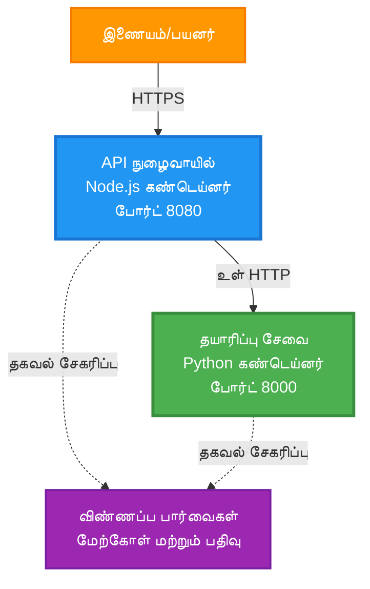
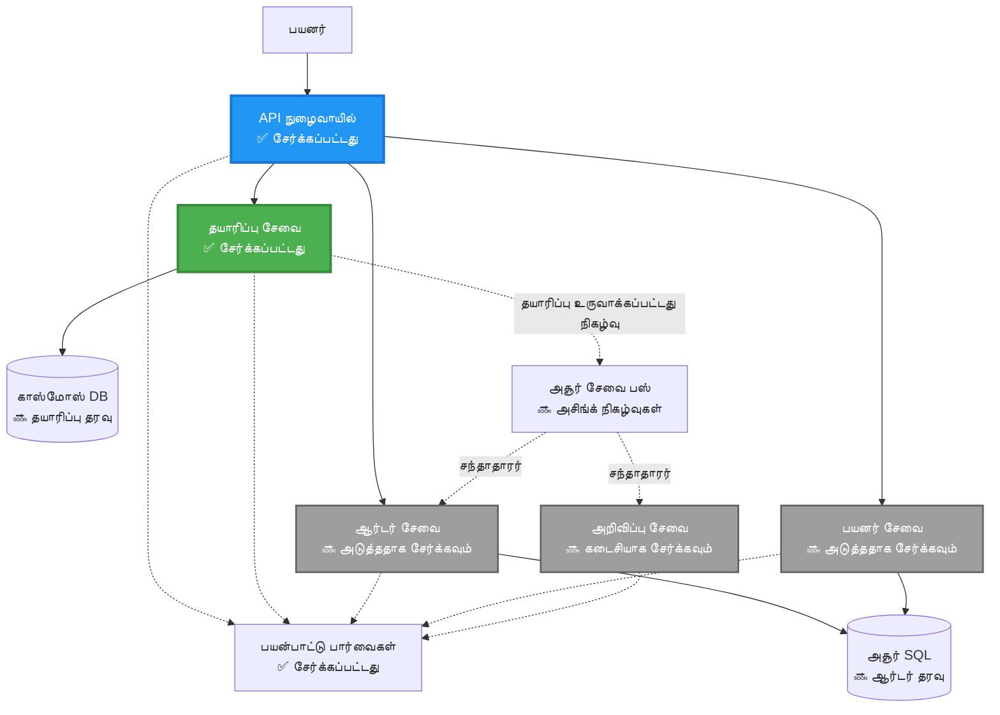

<!--
CO_OP_TRANSLATOR_METADATA:
{
  "original_hash": "eb3a4803a1e80a7f2e64f6bf63738c0f",
  "translation_date": "2025-11-24T14:42:57+00:00",
  "source_file": "examples/microservices/README.md",
  "language_code": "ta"
}
-->
# மைக்ரோசர்வீசஸ் கட்டமைப்பு - கண்டெய்னர் பயன்பாட்டு உதாரணம்

⏱️ **மதிப்பிடப்பட்ட நேரம்**: 25-35 நிமிடங்கள் | 💰 **மதிப்பிடப்பட்ட செலவு**: ~$50-100/மாதம் | ⭐ **சிக்கல்தன்மை**: மேம்பட்டது

**📚 கற்றல் பாதை:**
- ← முந்தையது: [எளிய Flask API](../../../../examples/container-app/simple-flask-api) - ஒற்றை கண்டெய்னர் அடிப்படைகள்
- 🎯 **நீங்கள் இங்கே இருக்கிறீர்கள்**: மைக்ரோசர்வீசஸ் கட்டமைப்பு (2-சேவை அடித்தளம்)
- → அடுத்தது: [AI ஒருங்கிணைப்பு](../../../../docs/ai-foundry) - உங்கள் சேவைகளுக்கு நுண்ணறிவு சேர்க்கவும்
- 🏠 [பாடநெறி முகப்பு](../../README.md)

---

AZD CLI-ஐப் பயன்படுத்தி Azure Container Apps-க்கு **எளிமையான ஆனால் செயல்படும்** மைக்ரோசர்வீசஸ் கட்டமைப்பு. இந்த உதாரணம் சேவை-மற்றும்-சேவை தொடர்பு, கண்டெய்னர் ஒருங்கிணைப்பு மற்றும் கண்காணிப்பை ஒரு நடைமுறை 2-சேவை அமைப்புடன் விளக்குகிறது.

> **📚 கற்றல் அணுகுமுறை**: இந்த உதாரணம் குறைந்தபட்ச 2-சேவை கட்டமைப்புடன் (API Gateway + Backend Service) தொடங்குகிறது, இதை நீங்கள் நிஜமாகவே பிரயோகித்து கற்றுக்கொள்ளலாம். இந்த அடித்தளத்தை கற்றுக்கொண்ட பிறகு, முழு மைக்ரோசர்வீசஸ் சூழலை விரிவாக்குவதற்கான வழிகாட்டுதலையும் வழங்குகிறோம்.

## நீங்கள் என்ன கற்றுக்கொள்வீர்கள்

இந்த உதாரணத்தை முடிப்பதன் மூலம், நீங்கள்:
- பல கண்டெய்னர்களை Azure Container Apps-க்கு பிரயோகிக்கவும்
- உள்நாட்டு நெட்வொர்க்கிங் மூலம் சேவை-மற்றும்-சேவை தொடர்பை செயல்படுத்தவும்
- சூழல் அடிப்படையிலான அளவீடு மற்றும் ஆரோக்கிய சோதனைகளை அமைக்கவும்
- Application Insights மூலம் விநியோகிக்கப்பட்ட பயன்பாடுகளை கண்காணிக்கவும்
- மைக்ரோசர்வீசஸ் பிரயோக முறைமைகள் மற்றும் சிறந்த நடைமுறைகளைப் புரிந்துகொள்ளவும்
- எளிய கட்டமைப்பிலிருந்து சிக்கலான கட்டமைப்புகளுக்கு முன்னேற கற்றுக்கொள்ளவும்

## கட்டமைப்பு

### கட்டம் 1: நாம் உருவாக்குவது என்ன (இந்த உதாரணத்தில் சேர்க்கப்பட்டுள்ளது)


**கூறுகளின் விவரங்கள்:**

| கூறு | நோக்கம் | அணுகல் | வளங்கள் |
|-----------|---------|--------|-----------|
| **API Gateway** | பின்புற சேவைகளுக்கு வெளிப்புற கோரிக்கைகளை வழிமாற்றுகிறது | பொது (HTTPS) | 1 vCPU, 2GB RAM, 2-20 பிரதிகள் |
| **Product Service** | உள்நாட்டு தரவுடன் தயாரிப்பு பட்டியலை நிர்வகிக்கிறது | உள்நாட்டு மட்டும் | 0.5 vCPU, 1GB RAM, 1-10 பிரதிகள் |
| **Application Insights** | மையகலான பதிவு மற்றும் விநியோகிக்கப்பட்ட கண்காணிப்பு | Azure Portal | 1-2 GB/மாதம் தரவின் உட்புகுத்தல் |

**ஏன் எளிமையாக தொடங்க வேண்டும்?**
- ✅ விரைவாக பிரயோகித்து புரிந்துகொள்ளவும் (25-35 நிமிடங்கள்)
- ✅ சிக்கலின்றி மைக்ரோசர்வீசஸ் முறைமைகளை கற்றுக்கொள்ளவும்
- ✅ நீங்கள் மாற்றி பரிசோதிக்கக்கூடிய செயல்படும் குறியீடு
- ✅ கற்றலுக்கான குறைந்த செலவு (~$50-100/மாதம் vs $300-1400/மாதம்)
- ✅ தரவுத்தொகுப்புகள் மற்றும் செய்தி வரிசைகளைச் சேர்க்கும் முன் நம்பிக்கையை உருவாக்கவும்

**உதாரணம்**: இதை ஓட்டம் கற்றுக்கொள்வதற்கு ஒப்பிடலாம். நீங்கள் ஒரு காலியான கார் நிறுத்துமிடத்தில் (2 சேவைகள்) தொடங்குகிறீர்கள், அடிப்படைகளை கற்றுக்கொள்கிறீர்கள், பின்னர் நகர போக்குவரத்திற்கு (5+ சேவைகள் தரவுத்தொகுப்புகளுடன்) முன்னேறுகிறீர்கள்.

### கட்டம் 2: எதிர்கால விரிவாக்கம் (குறிப்பு கட்டமைப்பு)

2-சேவை கட்டமைப்பை நீங்கள் கற்றுக்கொண்ட பிறகு, நீங்கள் விரிவாக்கலாம்:


"விரிவாக்க வழிகாட்டி" பகுதியை முடிவில் படிக்கவும்.

## சேர்க்கப்பட்ட அம்சங்கள்

✅ **சேவை கண்டுபிடிப்பு**: DNS அடிப்படையிலான தானியங்கி கண்டுபிடிப்பு  
✅ **சுமை சமநிலை**: பிரதிகள் முழுவதும் உள்ளமைக்கப்பட்ட சுமை சமநிலை  
✅ **தானியங்கி அளவீடு**: HTTP கோரிக்கைகளின் அடிப்படையில் சேவைக்கு தனித்தனியாக அளவீடு  
✅ **ஆரோக்கிய கண்காணிப்பு**: இரு சேவைகளுக்கும் Liveness மற்றும் Readiness சோதனைகள்  
✅ **விநியோகிக்கப்பட்ட பதிவு**: Application Insights மூலம் மையகலான பதிவு  
✅ **உள்நாட்டு நெட்வொர்க்கிங்**: பாதுகாப்பான சேவை-மற்றும்-சேவை தொடர்பு  
✅ **கண்டெய்னர் ஒருங்கிணைப்பு**: தானியங்கி பிரயோகம் மற்றும் அளவீடு  
✅ **பூஜ்ஜிய-நேர இடைநிறுத்த புதுப்பிப்புகள்**: திருப்பி திருத்தப்பட்ட புதுப்பிப்புகள்  

## முன் தேவைகள்

### தேவையான கருவிகள்

தொடங்குவதற்கு முன், இந்த கருவிகள் நிறுவப்பட்டுள்ளதா என்பதை சரிபார்க்கவும்:

1. **[Azure Developer CLI (azd)](https://learn.microsoft.com/azure/developer/azure-developer-cli/install-azd)** (பதிப்பு 1.0.0 அல்லது அதற்கு மேல்)
   ```bash
   azd version
   # எதிர்பார்க்கப்படும் வெளியீடு: azd பதிப்பு 1.0.0 அல்லது அதற்கு மேல்
   ```

2. **[Azure CLI](https://learn.microsoft.com/cli/azure/install-azure-cli)** (பதிப்பு 2.50.0 அல்லது அதற்கு மேல்)
   ```bash
   az --version
   # எதிர்பார்க்கப்படும் வெளியீடு: azure-cli 2.50.0 அல்லது அதற்கு மேல்
   ```

3. **[Docker](https://www.docker.com/get-started)** (உள்நாட்டு மேம்பாடு/சோதனைக்கு - விருப்பம்)
   ```bash
   docker --version
   # எதிர்பார்க்கப்படும் வெளியீடு: Docker பதிப்பு 20.10 அல்லது அதற்கு மேல்
   ```

### உங்கள் அமைப்பை சரிபார்க்கவும்

இந்த கட்டளைகளை இயக்கி நீங்கள் தயாராக உள்ளீர்களா என்பதை உறுதிப்படுத்தவும்:

```bash
# Azure Developer CLI ஐ சரிபார்க்கவும்
azd version
# ✅ எதிர்பார்க்கப்பட்டது: azd பதிப்பு 1.0.0 அல்லது அதற்கு மேல்

# Azure CLI ஐ சரிபார்க்கவும்
az --version
# ✅ எதிர்பார்க்கப்பட்டது: azure-cli 2.50.0 அல்லது அதற்கு மேல்

# Docker ஐ சரிபார்க்கவும் (விருப்பம்)
docker --version
# ✅ எதிர்பார்க்கப்பட்டது: Docker பதிப்பு 20.10 அல்லது அதற்கு மேல்
```

**வெற்றி அளவுகோல்**: அனைத்து கட்டளைகளும் குறைந்தபட்ச அல்லது அதற்கு மேல் பதிப்பை திருப்ப வேண்டும்.

### Azure தேவைகள்

- ஒரு செயல்படும் **Azure சந்தா** ([இலவச கணக்கை உருவாக்கவும்](https://azure.microsoft.com/free/))
- உங்கள் சந்தாவில் வளங்களை உருவாக்க அனுமதிகள்
- **Contributor** பங்கு சந்தா அல்லது வளக் குழுவில்

### அறிவு முன் தேவைகள்

இது ஒரு **மேம்பட்ட நிலை** உதாரணம். நீங்கள்:
- [எளிய Flask API உதாரணத்தை](../../../../examples/container-app/simple-flask-api) முடித்திருக்க வேண்டும்
- மைக்ரோசர்வீசஸ் கட்டமைப்பின் அடிப்படைகளைப் புரிந்துகொள்ள வேண்டும்
- REST APIs மற்றும் HTTP பற்றிய பரிச்சயத்தைப் பெற்றிருக்க வேண்டும்
- கண்டெய்னர் கருத்துக்களைப் புரிந்துகொள்ள வேண்டும்

**Container Apps-க்கு புதியவரா?** அடிப்படைகளை கற்றுக்கொள்ள முதலில் [எளிய Flask API உதாரணத்தை](../../../../examples/container-app/simple-flask-api) தொடங்கவும்.

## விரைவான தொடக்கம் (படி-படியாக)

### படி 1: கிளோன் செய்து செல்லவும்

```bash
git clone https://github.com/microsoft/AZD-for-beginners.git
cd AZD-for-beginners/examples/microservices
```

**✓ வெற்றி சரிபார்ப்பு**: `azure.yaml` காண்பதை உறுதிப்படுத்தவும்:
```bash
ls
# எதிர்பார்க்கப்பட்டது: README.md, azure.yaml, infra/, src/
```

### படி 2: Azure உடன் அங்கீகரிக்கவும்

```bash
azd auth login
```

இது Azure அங்கீகாரத்திற்காக உங்கள் உலாவியைத் திறக்கும். உங்கள் Azure சான்றுகளைப் பயன்படுத்தி உள்நுழைக.

**✓ வெற்றி சரிபார்ப்பு**: நீங்கள் காண வேண்டும்:
```
Logged in to Azure.
```

### படி 3: சூழலை ஆரம்பிக்கவும்

```bash
azd init
```

**நீங்கள் காணும் கேள்விகள்**:
- **சூழல் பெயர்**: ஒரு குறுகிய பெயரை உள்ளிடவும் (எ.கா., `microservices-dev`)
- **Azure சந்தா**: உங்கள் சந்தாவைத் தேர்ந்தெடுக்கவும்
- **Azure இடம்**: ஒரு பிராந்தியத்தைத் தேர்ந்தெடுக்கவும் (எ.கா., `eastus`, `westeurope`)

**✓ வெற்றி சரிபார்ப்பு**: நீங்கள் காண வேண்டும்:
```
SUCCESS: New project initialized!
```

### படி 4: உள்கட்டமைப்பு மற்றும் சேவைகளை பிரயோகிக்கவும்

```bash
azd up
```

**என்ன நடக்கிறது** (8-12 நிமிடங்கள் ஆகும்):

```mermaid
graph LR
    A[azd up] --> B[வனரசு குழுவை உருவாக்கவும்]
    B --> C[கண்டெய்னர் பதிவேடுகளை பிரயோகிக்கவும்]
    C --> D[பதிவேடம் பகுப்பாய்வு பிரயோகிக்கவும்]
    D --> E[அப்பிளிக்கேஷன் உள்ளுணர்வு பிரயோகிக்கவும்]
    E --> F[கண்டெய்னர் சூழலை உருவாக்கவும்]
    F --> G[API கேட்வே படத்தை உருவாக்கவும்]
    F --> H[தயாரிப்பு சேவை படத்தை உருவாக்கவும்]
    G --> I[பதிவேடத்திற்கு தள்ளவும்]
    H --> I
    I --> J[API கேட்வே பிரயோகிக்கவும்]
    I --> K[தயாரிப்பு சேவை பிரயோகிக்கவும்]
    J --> L[இன்கிரஸ் மற்றும் ஆரோக்கிய சோதனைகளை அமைக்கவும்]
    K --> L
    L --> M[பிரயோகம் முடிந்தது ✓]
    
    style A fill:#2196F3,stroke:#1976D2,stroke-width:3px,color:#fff
    style M fill:#4CAF50,stroke:#388E3C,stroke-width:3px,color:#fff
```


**✓ வெற்றி சரிபார்ப்பு**: நீங்கள் காண வேண்டும்:
```
SUCCESS: Your application was deployed to Azure in X minutes Y seconds.
Endpoint: https://api-gateway-<unique-id>.azurecontainerapps.io
```

**⏱️ நேரம்**: 8-12 நிமிடங்கள்

### படி 5: பிரயோகத்தை சோதிக்கவும்

```bash
# கேட்வே முடுக்கம் பெறவும்
GATEWAY_URL=$(azd env get-values | grep API_GATEWAY_URL | cut -d '=' -f2 | tr -d '"')

# API கேட்வே ஆரோக்கியத்தை சோதிக்கவும்
curl $GATEWAY_URL/health
```

**✅ எதிர்பார்க்கப்படும் வெளியீடு:**
```json
{
  "status": "healthy",
  "service": "api-gateway",
  "timestamp": "2025-11-19T10:30:00Z"
}
```

**தயாரிப்பு சேவையை நுழைவாயிலின் மூலம் சோதிக்கவும்**:
```bash
# தயாரிப்புகளை பட்டியலிடு
curl $GATEWAY_URL/api/products
```

**✅ எதிர்பார்க்கப்படும் வெளியீடு:**
```json
[
  {"id":1,"name":"Laptop","price":999.99,"stock":50},
  {"id":2,"name":"Mouse","price":29.99,"stock":200},
  {"id":3,"name":"Keyboard","price":79.99,"stock":150}
]
```

**✓ வெற்றி சரிபார்ப்பு**: இரு முடிவுகளும் பிழையின்றி JSON தரவுகளை திருப்ப வேண்டும்.

---

**🎉 வாழ்த்துக்கள்!** நீங்கள் Azure-க்கு ஒரு மைக்ரோசர்வீசஸ் கட்டமைப்பை பிரயோகித்துவிட்டீர்கள்!
3. இரு சேவைகளையும் மீண்டும் வெளியிடவும்:

```bash
azd deploy product-service
azd deploy api-gateway
```

4. புதிய எண்ட்பாயிண்டை சோதிக்கவும்:

```bash
GATEWAY_URL=$(azd env get-values | grep API_GATEWAY_URL | cut -d '=' -f2 | tr -d '"')

# புதிய தயாரிப்பை உருவாக்கவும்
curl -X POST $GATEWAY_URL/api/products \
  -H "Content-Type: application/json" \
  -d '{"name":"USB Cable","price":9.99,"stock":500}'
```

**✅ எதிர்பார்க்கப்படும் வெளியீடு:**
```json
{"id":6,"name":"USB Cable","description":"","price":9.99,"stock":500}
```

5. பட்டியலில் தோன்றுகிறதா என்பதை உறுதிப்படுத்தவும்:

```bash
curl $GATEWAY_URL/api/products
# இப்போது புதிய USB கேபிள் உட்பட 6 தயாரிப்புகளை காட்ட வேண்டும்
```

**வெற்றியின் அளவுகோல்**:
- ✅ POST கோரிக்கை HTTP 201 ஐ திருப்புகிறது
- ✅ புதிய தயாரிப்பு GET /api/products பட்டியலில் தோன்றுகிறது
- ✅ தயாரிப்புக்கு தானாக அதிகரிக்கும் ஐடி உள்ளது

**நேரம்**: 10-15 நிமிடங்கள்

---

### பயிற்சி 2: Autoscaling விதிகளை மாற்றவும் ⭐⭐ (மிதமான)

**நோக்கம்**: Product Service அதிகமாக அளவிடும் விதமாக மாற்றவும்

**தொடக்க புள்ளி**: `infra/app/product-service.bicep`

**படிகள்**:

1. `infra/app/product-service.bicep` ஐ திறந்து, `scale` பிளாக்கை (சுமார் வரி 95) கண்டறியவும்

2. இதிலிருந்து மாற்றவும்:
```bicep
scale: {
  minReplicas: 1
  maxReplicas: 10
  rules: [
    {
      name: 'http-scale-rule'
      http: {
        metadata: {
          concurrentRequests: '100'  // OLD
        }
      }
    }
  ]
}
```

இதற்கு:
```bicep
scale: {
  minReplicas: 2  // Always have 2 running
  maxReplicas: 20  // Allow more scaling
  rules: [
    {
      name: 'http-scale-rule'
      http: {
        metadata: {
          concurrentRequests: '20'  // Scale at lower threshold
        }
      }
    }
  ]
}
```

3. உள்கட்டமைப்பை மீண்டும் வெளியிடவும்:

```bash
azd up
```

4. புதிய அளவீட்டு கட்டமைப்பை உறுதிப்படுத்தவும்:

```bash
az containerapp show \
  --name $(azd env get-values | grep PRODUCT_SERVICE | head -1 | cut -d '/' -f5) \
  --resource-group $(azd env get-values | grep AZURE_RESOURCE_GROUP | cut -d '=' -f2 | tr -d '"') \
  --query "properties.template.scale" -o json
```

**✅ எதிர்பார்க்கப்படும் வெளியீடு:**
```json
{
  "minReplicas": 2,
  "maxReplicas": 20,
  "rules": [...]
}
```

5. சுமையுடன் autoscaling ஐ சோதிக்கவும்:

```bash
# ஒரே நேரத்தில் கோரிக்கைகளை உருவாக்கவும்
for i in {1..500}; do curl $GATEWAY_URL/api/products & done

# அளவீடு நிகழ்வுகளை கவனிக்கவும்
azd logs product-service --follow
# தேடுங்கள்: கண்டெய்னர் ஆப்ஸ் அளவீட்டு நிகழ்வுகள்
```

**வெற்றியின் அளவுகோல்**:
- ✅ Product Service குறைந்தது 2 பிரதிகளை எப்போதும் இயக்குகிறது
- ✅ சுமையின்போது, 2 பிரதிகளுக்கு மேல் அளவிடுகிறது
- ✅ Azure Portal புதிய அளவீட்டு விதிகளை காட்டுகிறது

**நேரம்**: 15-20 நிமிடங்கள்

---

### பயிற்சி 3: தனிப்பயன் கண்காணிப்பு கேள்வியைச் சேர்க்கவும் ⭐⭐ (மிதமான)

**நோக்கம்**: தயாரிப்பு API செயல்திறனை கண்காணிக்க தனிப்பயன் Application Insights கேள்வியை உருவாக்கவும்

**படிகள்**:

1. Azure Portal இல் Application Insights ஐ தேடவும்:
   - Azure Portal க்கு செல்லவும்
   - உங்கள் resource group (rg-microservices-*) ஐ கண்டறியவும்
   - Application Insights resource ஐ கிளிக் செய்யவும்

2. இடது மெனுவில் "Logs" ஐ கிளிக் செய்யவும்

3. இந்த கேள்வியை உருவாக்கவும்:

```kusto
requests
| where timestamp > ago(1h)
| where name contains "products"
| summarize 
    RequestCount = count(),
    AvgDuration = avg(duration),
    P95Duration = percentile(duration, 95),
    SuccessRate = 100.0 * countif(success == true) / count()
  by bin(timestamp, 5m)
| render timechart
```

4. கேள்வியை இயக்க "Run" ஐ கிளிக் செய்யவும்

5. கேள்வியை சேமிக்கவும்:
   - "Save" ஐ கிளிக் செய்யவும்
   - பெயர்: "Product API Performance"
   - வகை: "Performance"

6. சோதனை போக்குவரத்தை உருவாக்கவும்:

```bash
for i in {1..100}; do curl $GATEWAY_URL/api/products; sleep 1; done
```

7. தரவைப் பார்க்க கேள்வியை புதுப்பிக்கவும்

**✅ எதிர்பார்க்கப்படும் வெளியீடு:**
- நேரத்தின் மீது கோரிக்கைகளின் எண்ணிக்கை காட்டும் வரைபடம்
- சராசரி காலம் < 500ms
- வெற்றியின் விகிதம் = 100%
- 5 நிமிட நேர இடைவெளிகள்

**வெற்றியின் அளவுகோல்**:
- ✅ கேள்வி 100+ கோரிக்கைகளை காட்டுகிறது
- ✅ வெற்றியின் விகிதம் 100%
- ✅ சராசரி காலம் < 500ms
- ✅ வரைபடம் 5 நிமிட நேர இடைவெளிகளை காட்டுகிறது

**கற்றல் முடிவு**: தனிப்பயன் கேள்விகளுடன் சேவையின் செயல்திறனை கண்காணிக்க எப்படி என்பதைப் புரிந்துகொள்ளவும்

**நேரம்**: 10-15 நிமிடங்கள்

---

### பயிற்சி 4: Retry Logic ஐ செயல்படுத்தவும் ⭐⭐⭐ (மேம்பட்டது)

**நோக்கம்**: Product Service தற்காலிகமாக கிடைக்காதபோது API Gateway இல் retry logic ஐச் சேர்க்கவும்

**தொடக்க புள்ளி**: `src/api-gateway/app.js`

**படிகள்**:

1. Retry library ஐ நிறுவவும்:

```bash
cd src/api-gateway
npm install axios-retry --save
cd ../..
```

2. `src/api-gateway/app.js` ஐ புதுப்பிக்கவும் (axios import பின் சேர்க்கவும்):

```javascript
const axiosRetry = require('axios-retry');

// மீண்டும் முயற்சிக்கும் தற்கொள்கையை அமைக்கவும்
axiosRetry(axios, {
  retries: 3,
  retryDelay: (retryCount) => {
    return retryCount * 1000; // 1ச, 2ச, 3ச
  },
  retryCondition: (error) => {
    // நெட்வொர்க் பிழைகள் அல்லது 5xx பதில்களில் மீண்டும் முயற்சிக்கவும்
    return axiosRetry.isNetworkOrIdempotentRequestError(error) ||
           (error.response && error.response.status >= 500);
  }
});

console.log('Retry logic configured: 3 retries with exponential backoff');
```

3. API Gateway ஐ மீண்டும் வெளியிடவும்:

```bash
azd deploy api-gateway
```

4. சேவை தோல்வியை உருவாக்கி retry நடத்தை சோதிக்கவும்:

```bash
# தயாரிப்பு சேவையை 0 ஆக அளவிடுங்கள் (தோல்வியை ஒத்திகை செய்யவும்)
az containerapp update \
  --name $(azd env get-values | grep PRODUCT_SERVICE | head -1 | cut -d '/' -f5) \
  --resource-group $(azd env get-values | grep AZURE_RESOURCE_GROUP | cut -d '=' -f2 | tr -d '"') \
  --min-replicas 0 \
  --max-replicas 0

# தயாரிப்புகளை அணுக முயற்சிக்கவும் (3 முறை மீண்டும் முயற்சிக்கும்)
time curl -v $GATEWAY_URL/api/products
# கவனிக்கவும்: பதில் ~6 விநாடிகள் ஆகும் (1s + 2s + 3s மீண்டும் முயற்சிகள்)

# தயாரிப்பு சேவையை மீட்டெடுக்கவும்
az containerapp update \
  --name $(azd env get-values | grep PRODUCT_SERVICE | head -1 | cut -d '/' -f5) \
  --resource-group $(azd env get-values | grep AZURE_RESOURCE_GROUP | cut -d '=' -f2 | tr -d '"') \
  --min-replicas 1 \
  --max-replicas 10
```

5. Retry பதிவுகளைப் பார்க்கவும்:

```bash
azd logs api-gateway --tail 50
# மீண்டும் முயற்சி செய்த செய்திகளைத் தேடுங்கள்
```

**✅ எதிர்பார்க்கப்படும் நடத்தை:**
- கோரிக்கைகள் தோல்விக்கு முன் 3 முறை retry செய்கின்றன
- ஒவ்வொரு retry க்கும் அதிக நேரம் காத்திருக்கிறது (1s, 2s, 3s)
- சேவை மீண்டும் தொடங்கிய பிறகு வெற்றிகரமான கோரிக்கைகள்
- Retry முயற்சிகளை காட்டும் பதிவுகள்

**வெற்றியின் அளவுகோல்**:
- ✅ கோரிக்கைகள் தோல்விக்கு முன் 3 முறை retry செய்கின்றன
- ✅ ஒவ்வொரு retry க்கும் அதிக நேரம் காத்திருக்கிறது (exponential backoff)
- ✅ சேவை மீண்டும் தொடங்கிய பிறகு வெற்றிகரமான கோரிக்கைகள்
- ✅ Retry முயற்சிகளை காட்டும் பதிவுகள்

**கற்றல் முடிவு**: மைக்ரோசர்வீசுகளில் resilience patterns (circuit breakers, retries, timeouts) ஐப் புரிந்துகொள்ளவும்

**நேரம்**: 20-25 நிமிடங்கள்

---

## அறிவு சோதனை

இந்த உதாரணத்தை முடித்த பிறகு, உங்கள் புரிதலை உறுதிப்படுத்தவும்:

### 1. சேவை தொடர்பு ✓

உங்கள் அறிவைச் சோதிக்கவும்:
- [ ] API Gateway Product Service ஐ எப்படி கண்டறிகிறது என்பதை விளக்க முடியுமா? (DNS அடிப்படையிலான சேவை கண்டறிதல்)
- [ ] Product Service செயலிழந்தால் என்ன நடக்கும்? (Gateway 503 பிழையை திருப்புகிறது)
- [ ] மூன்றாவது சேவையை எப்படி சேர்ப்பீர்கள்? (புதிய Bicep கோப்பு உருவாக்கவும், main.bicep இல் சேர்க்கவும், src கோப்புறையை உருவாக்கவும்)

**கைமுறையாக உறுதிப்படுத்தல்**:
```bash
# சேவை தோல்வியை ஒத்திகை செய்க
az containerapp update --name <product-service-name> --min-replicas 0 --max-replicas 0
curl $GATEWAY_URL/api/products
# ✅ எதிர்பார்ப்பு: 503 சேவை கிடைக்கவில்லை

# சேவையை மீட்டெடுக்கவும்
az containerapp update --name <product-service-name> --min-replicas 1 --max-replicas 10
```

### 2. கண்காணிப்பு & பார்வையிடுதல் ✓

உங்கள் அறிவைச் சோதிக்கவும்:
- [ ] விநியோகிக்கப்பட்ட பதிவுகளை எங்கு காணலாம்? (Azure Portal இல் Application Insights)
- [ ] மெதுவான கோரிக்கைகளை எப்படி கண்காணிப்பீர்கள்? (Kusto query: `requests | where duration > 1000`)
- [ ] பிழையை ஏற்படுத்திய சேவையை நீங்கள் அடையாளம் காண முடியுமா? (பதிவுகளில் `cloud_RoleName` புலத்தைச் சரிபார்க்கவும்)

**கைமுறையாக உறுதிப்படுத்தல்**:
```bash
# மெதுவான கோரிக்கை சிமுலேஷனை உருவாக்கவும்
curl "$GATEWAY_URL/api/products?delay=2000"

# மெதுவான கோரிக்கைகளுக்காக Application Insights ஐ கேள்வி கேட்கவும்
# Azure Portal → Application Insights → Logs க்கு செல்லவும்
# இயக்கவும்: requests | where duration > 1000 | project timestamp, name, duration, cloud_RoleName
```

### 3. அளவீடு & செயல்திறன் ✓

உங்கள் அறிவைச் சோதிக்கவும்:
- [ ] Autoscaling ஐ என்ன தூண்டுகிறது? (HTTP concurrent request விதிகள்: gateway க்கு 50, product க்கு 100)
- [ ] தற்போது எத்தனை பிரதிகள் இயங்குகின்றன? (`az containerapp revision list` ஐப் பயன்படுத்தி சரிபார்க்கவும்)
- [ ] Product Service ஐ 5 பிரதிகளுக்கு அளவிட எப்படி செய்வீர்கள்? (Bicep இல் minReplicas ஐப் புதுப்பிக்கவும்)

**கைமுறையாக உறுதிப்படுத்தல்**:
```bash
# ஆட்டோஸ்கேலிங்கை சோதிக்க சுமையை உருவாக்கவும்
for i in {1..1000}; do curl $GATEWAY_URL/api/products & done

# பிரதிகள் அதிகரிப்பதை கவனிக்கவும்
azd logs api-gateway --follow
# ✅ எதிர்பார்ப்பு: பதிவுகளில் ஸ்கேலிங் நிகழ்வுகளை காணவும்
```

**வெற்றியின் அளவுகோல்**: நீங்கள் அனைத்து கேள்விகளுக்கும் பதிலளிக்க முடியும் மற்றும் கைமுறையாக கட்டளைகளுடன் உறுதிப்படுத்த முடியும்.

---

## செலவு பகுப்பாய்வு

### மதிப்பிடப்பட்ட மாதாந்திர செலவுகள் (இந்த 2-சேவை உதாரணத்திற்கு)

| வளம் | கட்டமைப்பு | மதிப்பிடப்பட்ட செலவு |
|----------|--------------|----------------|
| API Gateway | 2-20 பிரதிகள், 1 vCPU, 2GB RAM | $30-150 |
| Product Service | 1-10 பிரதிகள், 0.5 vCPU, 1GB RAM | $15-75 |
| Container Registry | அடிப்படை நிலை | $5 |
| Application Insights | 1-2 GB/மாதம் | $5-10 |
| Log Analytics | 1 GB/மாதம் | $3 |
| **மொத்தம்** | | **$58-243/மாதம்** |

### பயன்பாட்டின் அடிப்படையில் செலவுகள்

**இலகு போக்குவரத்து** (சோதனை/கற்றல்): ~$60/மாதம்
- API Gateway: 2 பிரதிகள் × 24/7 = $30
- Product Service: 1 பிரதிகள் × 24/7 = $15
- கண்காணிப்பு + Registry = $13

**மிதமான போக்குவரத்து** (சிறிய உற்பத்தி): ~$120/மாதம்
- API Gateway: 5 சராசரி பிரதிகள் = $75
- Product Service: 3 சராசரி பிரதிகள் = $45
- கண்காணிப்பு + Registry = $13

**அதிக போக்குவரத்து** (பிஸியான காலங்கள்): ~$240/மாதம்
- API Gateway: 15 சராசரி பிரதிகள் = $225
- Product Service: 8 சராசரி பிரதிகள் = $120
- கண்காணிப்பு + Registry = $13

### செலவு குறைப்புக்கான குறிப்புகள்

1. **வளர்ச்சிக்காக Zero க்கு அளவிடவும்**:
   ```bicep
   scale: {
     minReplicas: 0  // Save $30-40/month when not in use
     maxReplicas: 10
   }
   ```

2. **Cosmos DB க்கு Consumption Plan ஐப் பயன்படுத்தவும்** (நீங்கள் அதைச் சேர்க்கும்போது):
   - நீங்கள் பயன்படுத்துவதற்கே செலுத்துங்கள்
   - குறைந்தபட்ச கட்டணம் இல்லை

3. **Application Insights Sampling ஐ அமைக்கவும்**:
   ```javascript
   appInsights.defaultClient.config.samplingPercentage = 50; // கோரிக்கைகளில் 50% மாதிரி
   ```

4. **தேவை இல்லாதபோது சுத்தம் செய்யவும்**:
   ```bash
   azd down --force --purge
   ```

### இலவச நிலை விருப்பங்கள்

கற்றல்/சோதனைக்காக, பின்வருவனவற்றை பரிசீலிக்கவும்:
- ✅ Azure இலவச credits ஐப் பயன்படுத்தவும் ($200 முதல் 30 நாட்களுக்கு புதிய கணக்குகளுடன்)
- ✅ குறைந்த பிரதிகளுக்கு ஒதுக்கவும் (சுமார் 50% செலவுகளைச் சேமிக்கிறது)
- ✅ சோதனைக்குப் பிறகு நீக்கவும் (தொடர்ச்சியான கட்டணங்கள் இல்லை)
- ✅ கற்றல் அமர்வுகளுக்கு இடையில் Zero க்கு அளவிடவும்

**உதாரணம்**: இந்த உதாரணத்தை 2 மணி நேரம்/நாள் × 30 நாட்கள் இயக்குவது = ~$5/மாதம் $60/மாதத்திற்கு பதிலாக

---

## சிக்கல் தீர்க்கும் விரைவான குறிப்புகள்

### சிக்கல்: `azd up` "Subscription not found" என தோல்வியடைகிறது

**தீர்வு**:
```bash
# வெளிப்படையான சந்தாவுடன் மீண்டும் உள்நுழைக
az account set --subscription <your-subscription-id>
azd env set AZURE_SUBSCRIPTION_ID <your-subscription-id>
azd up
```

### சிக்கல்: API Gateway 503 "Product service unavailable" ஐ திருப்புகிறது

**கண்டறிதல்**:
```bash
# தயாரிப்பு சேவை பதிவுகளை சரிபார்க்கவும்
azd logs product-service --tail 50

# தயாரிப்பு சேவை ஆரோக்கியத்தை சரிபார்க்கவும்
az containerapp show \
  --name $(azd env get-values | grep PRODUCT_SERVICE | head -1 | cut -d '/' -f5) \
  --resource-group $(azd env get-values | grep AZURE_RESOURCE_GROUP | cut -d '=' -f2 | tr -d '"') \
  --query "properties.runningStatus"
```

**சாதாரண காரணங்கள்**:
1. Product service தொடங்கவில்லை (Python பிழைகளுக்கான பதிவுகளைச் சரிபார்க்கவும்)
2. Health check தோல்வியடைகிறது (`/health` endpoint வேலை செய்கிறது என்பதை உறுதிப்படுத்தவும்)
3. Container image build தோல்வியடைந்தது (image க்கான registry ஐச் சரிபார்க்கவும்)

### சிக்கல்: Autoscaling வேலை செய்யவில்லை

**கண்டறிதல்**:
```bash
# தற்போதைய பிரதியின் எண்ணிக்கையை சரிபார்க்கவும்
az containerapp revision list \
  --name $(azd env get-values | grep API_GATEWAY | head -1 | cut -d '/' -f5) \
  --resource-group $(azd env get-values | grep AZURE_RESOURCE_GROUP | cut -d '=' -f2 | tr -d '"') \
  --query "[].properties.replicas"

# சோதிக்க சுமையை உருவாக்கவும்
for i in {1..1000}; do curl $GATEWAY_URL/api/products & done

# அளவீட்டு நிகழ்வுகளை கவனிக்கவும்
azd logs api-gateway --follow | grep -i scale
```

**சாதாரண காரணங்கள்**:
1. அளவீட்டு விதியை தூண்ட சுமை போதுமானதாக இல்லை (50 concurrent requests க்கு மேல் தேவை)
2. அதிகபட்ச பிரதிகள் ஏற்கனவே அடைந்துவிட்டன (Bicep கட்டமைப்பைச் சரிபார்க்கவும்)
3. Bicep இல் அளவீட்டு விதி தவறாக அமைக்கப்பட்டுள்ளது (concurrentRequests மதிப்பைச் சரிபார்க்கவும்)

### சிக்கல்: Application Insights பதிவுகளை காட்டவில்லை

**கண்டறிதல்**:
```bash
# இணைப்பு சரம் அமைக்கப்பட்டுள்ளதா என்பதை சரிபார்க்கவும்
azd env get-values | grep APPLICATIONINSIGHTS

# சேவைகள் தொலைநிலையியல் அனுப்புகிறதா என்பதை சரிபார்க்கவும்
az monitor app-insights component show \
  --app $(azd env get-values | grep APPLICATIONINSIGHTS_NAME | cut -d '=' -f2 | tr -d '"') \
  --resource-group $(azd env get-values | grep AZURE_RESOURCE_GROUP | cut -d '=' -f2 | tr -d '"') \
  --query "properties.InstrumentationKey"
```

**சாதாரண காரணங்கள்**:
1. Container க்கு connection string அனுப்பப்படவில்லை (சுற்றுச்சூழல் மாறிகளைச் சரிபார்க்கவும்)
2. Application Insights SDK அமைக்கப்படவில்லை (code இல் imports ஐச் சரிபார்க்கவும்)
3. Firewall telemetry ஐத் தடை செய்கிறது (அதிக அரிதாக, network விதிகளைச் சரிபார்க்கவும்)

### சிக்கல்: Docker build உள்ளூரில் தோல்வியடைகிறது

**கண்டறிதல்**:
```bash
# API Gateway கட்டமைப்பை சோதிக்கவும்
cd src/api-gateway
docker build -t test-gateway .

# Product Service கட்டமைப்பை சோதிக்கவும்
cd ../product-service
docker build -t test-product .
```

**சாதாரண காரணங்கள்**:
1. package.json/requirements.txt இல் dependencies இல்லை
2. Dockerfile syntax பிழைகள்
3. dependencies ஐப் பதிவிறக்க network சிக்கல்கள்

**இன்னும் சிக்கலா?** [சாதாரண சிக்கல்கள் வழிகாட்டி](../../docs/troubleshooting/common-issues.md) அல்லது [Azure Container Apps Troubleshooting](https://learn.microsoft.com/azure/container-apps/troubleshooting) ஐப் பார்க்கவும்

---

## சுத்தம் செய்யவும்

தொடர்ச்சியான கட்டணங்களைத் தவிர்க்க, அனைத்து வளங்களையும் நீக்கவும்:

```bash
azd down --force --purge
```

**உறுதிப்படுத்தல் கேள்வி**:
```
? Total resources to delete: 6, are you sure you want to continue? (y/N)
```

`y` என تایப்பி உறுதிப்படுத்தவும்.

**என்ன நீக்கப்படும்**:
- Container Apps சூழல்
- இரு Container Apps (gateway & product service)
- Container Registry
- Application Insights
- Log Analytics Workspace
- Resource Group

**✓ சுத்தம் உறுதிப்படுத்தவும்**:
```bash
az group list --query "[?starts_with(name,'rg-microservices')]" --output table
```

காலியாக திருப்ப வேண்டும்.

---

## விரிவாக்க வழிகாட்டி: 2 சேவைகளிலிருந்து 5+ சேவைகள்

இந்த 2-சேவை கட்டமைப்பை நீங்கள் கற்றுக்கொண்ட பிறகு, விரிவாக்கம் செய்ய எப்படி என்பதைப் பார்க்கவும்:

### கட்டம் 1: தரவுத்தொகுப்பு நிலைத்தன்மையைச் சேர்க்கவும் (அடுத்த படி)

**Product Service க்கு Cosmos DB ஐச் சேர்க்கவும்**:

1. `infra/core/cosmos.bicep` ஐ உருவாக்கவும்:
   ```bicep
   resource cosmosAccount 'Microsoft.DocumentDB/databaseAccounts@2023-04-15' = {
     name: name
     location: location
     kind: 'GlobalDocumentDB'
     properties: {
       databaseAccountOfferType: 'Standard'
       consistencyPolicy: { defaultConsistencyLevel: 'Session' }
       locations: [{ locationName: location, failoverPriority: 0 }]
     }
   }
   ```

2. Product Service ஐ in-memory தரவின் பதிலாக Azure Cosmos DB Python SDK ஐப் பயன்படுத்த புதுப்பிக்கவும்

3. கூடுதல் மதிப்பிடப்பட்ட செலவு: ~$25/மாதம் (serverless)

### கட்டம் 2: மூன்றாவது சேவையைச் சேர்க்கவும் (Order Management)

**Order Service ஐ உருவாக்கவும்**:

1. புதிய கோப்புறை: `src/order-service/` (Python/Node.js/C#)
2. புதிய Bicep: `infra/app/order-service.bicep`
3. API Gateway ஐ `/api/orders` க்கு வழிமாற்ற புதுப்பிக்கவும்
4. Order persistence க்கு Azure SQL Database ஐச் சேர்க்கவும்

**கட்டமைப்பு ஆகிறது**:
```
API Gateway → Product Service (Cosmos DB)
           → Order Service (Azure SQL)
```

### கட்டம் 3: அசிங்க தொடர்பு (Service Bus) ஐச் சேர்க்கவும்

**Event-Driven Architecture ஐ செயல்படுத்தவும்**:

1. Azure Service Bus ஐச் சேர்க்கவும்: `infra/core/servicebus.bicep`
2. Product Service "ProductCreated" நிகழ்வுகளை வெளியிடுகிறது
3. Order Service தயாரிப்பு நிகழ்வுகளை சந்திக்கிறது
4. நிகழ்வுகளை செயல்படுத்த Notification Service ஐச் சேர்க்கவும்

**முறை**: Request/Response (HTTP) + Event-Driven (Service Bus)

### கட்டம் 4: பயனர் அங்கீகாரத்தைச் சேர்க்கவும்

**User Service ஐ செயல்படுத்தவும்**:

1. `src/user-service/` ஐ உருவாக்கவும் (Go/Node.js)
2. Azure AD B2C அல்லது custom JWT authentication ஐச் சேர்க்கவும்
3. API Gateway tokens ஐச் சரிபார்க்கிறது வழிமாற்றத்திற்கு முன்
4. சேவைகள் பயனர் அனுமதிகளைச் சரிபார்க்கின்றன

### கட்டம் 5: உற்பத்தி தயார்நிலை

**இந்த கூறுகளைச் சேர்க்கவும்**:
- ✅ Azure Front Door (உலகளாவிய load balancing)
- ✅ Azure Key Vault (இரகசிய மேலாண்மை)
- ✅ Azure Monitor Workbooks (தனிப்பயன் டாஷ்போர்டுகள்)
- ✅ CI/CD Pipeline (GitHub Actions)
- ✅ Blue-Green Deployments
- ✅ அனைத்து சேவைகளுக்கும் Managed Identity

**முழு உற்பத்தி கட்டமைப்பு செலவு**: ~$300-1,400/மாதம்

---

## மேலும் அறிக

### தொடர்புடைய ஆவணங்கள்
- [Azure Container Apps Documentation](https://learn.microsoft.com/azure/container-apps/)
- [Microservices Architecture Guide](https://learn.microsoft.com/azure/architecture/guide/architecture-styles/microservices)
- [Application Insights for Distributed Tracing](https://learn.microsoft.com/azure/azure-monitor/app/distributed-tracing)
- [Azure Developer CLI Documentation](https://learn.microsoft.com/azure/developer/azure-developer-cli/)

### இந்த பாடத்தில் அடுத்த படிகள்
- ← முந்தையது: [Simple Flask API](../../../../examples/container-app/simple-flask-api) - தொடக்க நிலை ஒற்றை-கண்டெய்னர் உதாரணம்
- → அடுத்தது: [AI Integration Guide](../../../../docs/ai-foundry) - AI திறன்களைச் சேர்க்கவும்
- 🏠 [பாடம் முகப்பு](../../README.md)

### ஒப்பீடு: எப்போது எதைப் பயன்படுத்த வேண்டும்

| அம்சம் | ஒற்றை கண்டெய்னர் | மைக்ரோசர்வீசுகள் (இது) | Kubernetes (AKS) |
|---------|-----------------|---------------------|------------------|
| **பயன்பாட்டு வழக்கு** | எளிய பயன்பாடுகள் | சிக்கலான பயன்பாடுகள் | நிறுவன பயன்பாடுகள் |
| **அளவீட்டு திறன்** | ஒற்றை சேவை | சேவை-தனிப்பட்ட அளவீடு | அதிகபட்ச சிக்கலானது |
| **சிக்கல்
| **சிறந்தது** | MVPக்கள், மாதிரிகள் | உற்பத்தி பயன்பாடுகள் | மல்டி-கிளவுட், மேம்பட்ட நெட்வொர்கிங் |

**பரிந்துரை**: Container Apps-இல் தொடங்குங்கள் (இந்த உதாரணம்), Kubernetes-சிறப்பு அம்சங்கள் தேவைப்பட்டால் மட்டுமே AKS-க்கு மாறுங்கள்.

---

## அடிக்கடி கேட்கப்படும் கேள்விகள்

**Q: ஏன் 5+ சேவைகள் இல்லாமல் 2 சேவைகள் மட்டும்?**  
A: கல்வி முன்னேற்றம். சிக்கல்களைச் சேர்ப்பதற்கு முன் ஒரு எளிய உதாரணத்துடன் அடிப்படைகளை (சேவை தொடர்பு, கண்காணிப்பு, அளவீடு) கற்றுக்கொள்ளுங்கள். இங்கு நீங்கள் கற்றுக்கொள்ளும் முறை 100-சேவை கட்டமைப்புகளுக்கு பொருந்தும்.

**Q: நான் மேலும் சேவைகளைச் சேர்க்க முடியுமா?**  
A: கண்டிப்பாக! மேலே உள்ள விரிவாக்க வழிகாட்டுதலைப் பின்பற்றுங்கள். ஒவ்வொரு புதிய சேவையும் ஒரே முறையைப் பின்பற்றுகிறது: src கோப்புறை உருவாக்கவும், Bicep கோப்பு உருவாக்கவும், azure.yaml புதுப்பிக்கவும், deploy செய்யவும்.

**Q: இது உற்பத்திக்கு தயாரா?**  
A: இது ஒரு வலுவான அடித்தளமாகும். உற்பத்திக்காக, மேலதிகமாக சேர்க்கவும்: நிர்வகிக்கப்பட்ட அடையாளம், Key Vault, நிலையான தரவுத்தொகுப்புகள், CI/CD குழாய், கண்காணிப்பு எச்சரிக்கைகள், மற்றும் காப்புப்பகுதி திட்டம்.

**Q: ஏன் Dapr அல்லது பிற சேவை மெஷ் பயன்படுத்தவில்லை?**  
A: கற்றுக்கொள்வதற்காக எளிமையாக வைத்திருக்கவும். Container Apps நெட்வொர்கிங் அடிப்படைகளைப் புரிந்துகொண்ட பிறகு, மேம்பட்ட சூழல்களுக்கு (நிலை மேலாண்மை, pub/sub, பைண்டிங்ஸ்) Dapr-ஐ சேர்க்கலாம்.

**Q: நான் உள்ளூரில் எப்படி பிழைதிருத்தம் செய்யலாம்?**  
A: Docker மூலம் சேவைகளை உள்ளூரில் இயக்கவும்:  
```bash
cd src/api-gateway
docker build -t local-gateway .
docker run -p 8080:8080 -e PRODUCT_SERVICE_URL=http://localhost:8000 local-gateway
```
  
**Q: நான் வேறு நிரலாக்க மொழிகளைப் பயன்படுத்த முடியுமா?**  
A: ஆம்! இந்த உதாரணம் Node.js (gateway) + Python (product service) காட்டுகிறது. C#, Go, Java, Ruby, PHP போன்ற எந்த மொழிகளையும் கலக்கலாம், அவை containers-இல் இயங்கினால்.

**Q: Azure credits இல்லாமல் என்ன செய்யலாம்?**  
A: Azure இலவச நிலையைப் பயன்படுத்தவும் (புதிய கணக்குகளுக்கு முதல் 30 நாட்கள் $200 credits கிடைக்கும்) அல்லது குறுகிய சோதனை காலங்களுக்கு deploy செய்து உடனடியாக நீக்கவும். இந்த உதாரணம் ~$2/நாள் செலவாகும்.

**Q: இது Azure Kubernetes Service (AKS)-இல் இருந்து எப்படி வேறுபடுகிறது?**  
A: Container Apps எளிமையானது (Kubernetes அறிவு தேவையில்லை) ஆனால் குறைவான சுதந்திரம். AKS முழு Kubernetes கட்டுப்பாட்டை வழங்குகிறது ஆனால் அதிக நிபுணத்துவம் தேவை. Container Apps-இல் தொடங்குங்கள், தேவைப்பட்டால் AKS-க்கு முன்னேறுங்கள்.

**Q: இதை ஏற்கனவே உள்ள Azure சேவைகளுடன் பயன்படுத்த முடியுமா?**  
A: ஆம்! நீங்கள் ஏற்கனவே உள்ள தரவுத்தொகுப்புகள், சேமிப்பு கணக்குகள், Service Bus போன்றவற்றுடன் இணைக்கலாம். புதியவை உருவாக்குவதற்கு பதிலாக ஏற்கனவே உள்ள வளங்களை குறிப்பிட Bicep கோப்புகளை புதுப்பிக்கவும்.

---

> **🎓 கற்றல் பாதை சுருக்கம்**: நீங்கள் தானியக்க அளவீடு, உள் நெட்வொர்கிங், மையகண்காணிப்பு, மற்றும் உற்பத்தி-தயார்முறை வடிவங்களுடன் ஒரு பல-சேவை கட்டமைப்பை deploy செய்ய கற்றுக்கொண்டீர்கள். இந்த அடித்தளம் சிக்கலான பகிர்ந்த கட்டமைப்புகள் மற்றும் நிறுவன மைக்ரோசேவை கட்டமைப்புகளுக்கு உங்களைத் தயாரிக்கிறது.

**📚 பாடநெறி வழிசெலுத்தல்:**
- ← முந்தையது: [Simple Flask API](../../../../examples/container-app/simple-flask-api)
- → அடுத்தது: [Database Integration Example](../../../../database-app)
- 🏠 [பாடநெறி முகப்பு](../../README.md)
- 📖 [Container Apps சிறந்த நடைமுறைகள்](../../docs/deployment/deployment-guide.md)

---

**✨ வாழ்த்துக்கள்!** நீங்கள் மைக்ரோசேவைகள் உதாரணத்தை முடித்துவிட்டீர்கள். Azure Container Apps-இல் பகிர்ந்த பயன்பாடுகளை உருவாக்க, deploy செய்ய, மற்றும் கண்காணிக்க எப்படி என்பதை நீங்கள் புரிந்துகொண்டீர்கள். AI திறன்களைச் சேர்க்க தயாரா? [AI Integration Guide](../../../../docs/ai-foundry) பார்க்கவும்!

---

<!-- CO-OP TRANSLATOR DISCLAIMER START -->
**குறிப்பு**:  
இந்த ஆவணம் AI மொழிபெயர்ப்பு சேவை [Co-op Translator](https://github.com/Azure/co-op-translator) பயன்படுத்தி மொழிபெயர்க்கப்பட்டுள்ளது. நாங்கள் துல்லியத்திற்காக முயற்சிக்கிறோம், ஆனால் தானியங்கி மொழிபெயர்ப்புகளில் பிழைகள் அல்லது தவறுகள் இருக்கக்கூடும் என்பதை கவனத்தில் கொள்ளவும். அதன் தாய்மொழியில் உள்ள மூல ஆவணம் அதிகாரப்பூர்வ ஆதாரமாக கருதப்பட வேண்டும். முக்கியமான தகவல்களுக்கு, தொழில்முறை மனித மொழிபெயர்ப்பு பரிந்துரைக்கப்படுகிறது. இந்த மொழிபெயர்ப்பைப் பயன்படுத்துவதால் ஏற்படும் எந்த தவறான புரிதல்கள் அல்லது தவறான விளக்கங்களுக்கு நாங்கள் பொறுப்பல்ல.
<!-- CO-OP TRANSLATOR DISCLAIMER END -->