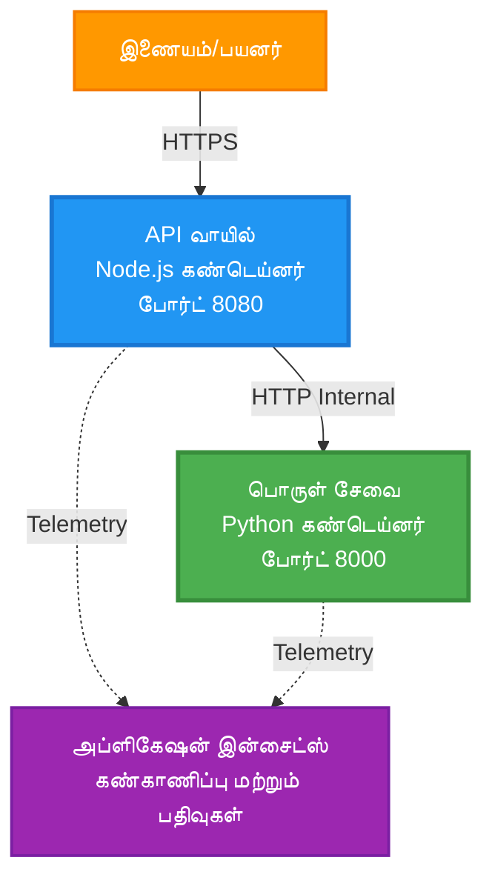
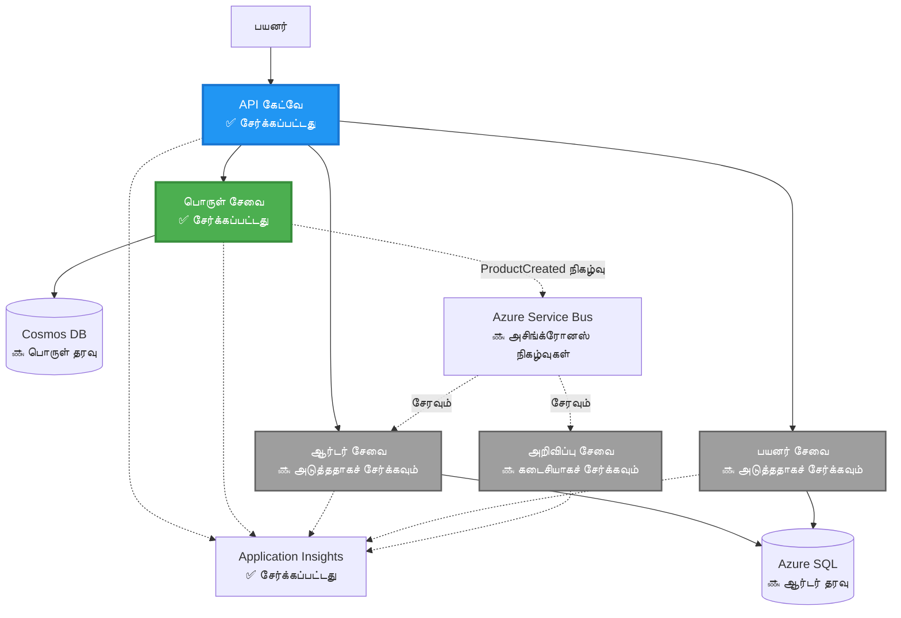
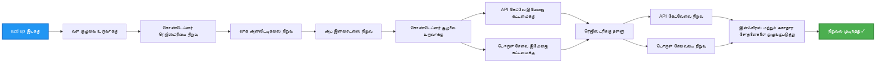
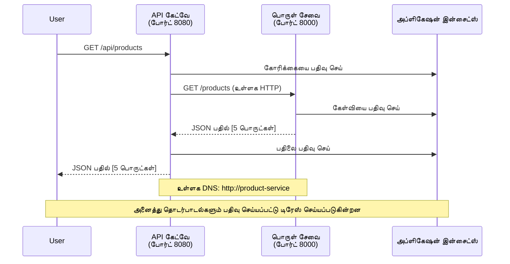

# மைக்ரோசெர்வீசுகள் கட்டமைப்பு - Container App உதாரணம்

⏱️ **கணிக்கப்பட்ட நேரம்**: 25-35 நிமிடம் | 💰 **கணிக்கப்பட்ட செலவு**: ~$50-100/மாதம் | ⭐ **கடினம்**: முன்னேறியவை

**📚 கற்றறிவு பாதை:**
- ← Previous: [எளிய Flask API](../../../../examples/container-app/simple-flask-api) - ஒற்றை கன்டெய்னர் அடிப்படைகள்
- 🎯 **நீங்கள் இங்கிருக்கிறீர்கள்**: மைக்ரோசெர்வீசுகள் கட்டமைப்பு (2-சேவைகள் அடித்தளம்)
- → Next: [AI Integration](../../../../docs/ai-foundry) - உங்கள் சேவைகளுக்கு நுண்ணறிவை சேர்க்கவும்
- 🏠 [Course Home](../../README.md)

---

இது AZD CLI-ஐ பயன்படுத்தி Azure Container Apps-ல் நியமிக்கப்பட்ட ஒரு **எளிய ஆனால் செயல்படும்** மைக்ரோசெர்வீசுகள் கட்டமைப்பு உதாரணம். இந்த உதாரணம் சேவை-மீது-சேவை தொடர்பு, கன்டெய்னர் ஒர்கஸ்ட்ரேஷன், மற்றும் கண்காணிப்பை ஒரு நடைமுறை 2-சேவை அமைப்புடன் காண்க்கிறது.

> **📚 கற்றல் அணுகுமுறை**: இந்த உதாரணம் முதலில் ஒரு குறைந்தபட்ச 2-சேவை கட்டமைப்புடன் (API Gateway + Backend Service) தொடங்குகிறது, அதை நீங்கள் உண்மையில் மாற்றி அமைத்து கற்றுக்கொள்ளலாம். இந்த அடித்தளத்தை முதலில் ஆக்கம் செய்த பிறகு, முழு மைக்ரோசெர்வீசுகள் சூழலுக்குப் புரட்சிப்படுத்துவதற்கான வழிமுறைகள் வழங்கப்படுகின்றன.

## நீங்கள் என்ன கற்றுக்கொள்ளப்போகிறீர்கள்

இந்த உதாரணத்தை முடித்தால், நீங்கள்:
- பல கன்டெய்னர்களை Azure Container Apps க்கு பதிவேற்றலாம்
- உள் நெட்வொர்க்கிங் கொண்டு சேவை-மீது-சேவை தொடர்பை செயல்படுத்தலாம்
- சூழல் சார்ந்த ஸ்கேலிங் மற்றும் ஹெல்த் சோதனைகளை அமைக்கலாம்
- Application Insights மூலம் விநியோகிக்கப்பட்ட பயன்பாடுகளை கண்காணிக்கலாம்
- மைக்ரோசெர்வீசுகள் despleayment முறைமைகள் மற்றும் சிறந்த நடைமுறைகளை புரிந்துகொள்வீர்கள்
- எளிமையிலிருந்து சிக்கலான கட்டமைப்புகளுக்கு மெல்ல மாறுவதைக் கற்றுக்கொள்வீர்கள்

## கட்டமைப்பு

### நிலை 1: நாம் என்ன கட்டுகிறோம் (இந்த உதாரணத்தில் சேர்க்கப்பட்டது)


```mermaid
graph TB
    Internet[இணையம்/பயனர்]
    Gateway[API வாயில்<br/>Node.js கண்டெய்னர்<br/>போர்ட் 8080]
    Product[பொருள் சேவை<br/>Python கண்டெய்னர்<br/>போர்ட் 8000]
    AppInsights[அப்ளிகேஷன் இன்சைட்ஸ்<br/>கண்காணிப்பு மற்றும் பதிவுகள்]
    
    Internet -->|HTTPS| Gateway
    Gateway -->|HTTP Internal| Product
    Gateway -.->|Telemetry| AppInsights
    Product -.->|Telemetry| AppInsights
    
    style Gateway fill:#2196F3,stroke:#1976D2,stroke-width:3px,color:#fff
    style Product fill:#4CAF50,stroke:#388E3C,stroke-width:3px,color:#fff
    style Internet fill:#FF9800,stroke:#F57C00,stroke-width:2px,color:#fff
    style AppInsights fill:#9C27B0,stroke:#7B1FA2,stroke-width:2px,color:#fff
```
**கூறுகளின் விவரங்கள்:**

| Component | Purpose | Access | Resources |
|-----------|---------|--------|-----------|
| **API Gateway** | பின்தள சேவைகளுக்கு வெளியே இருந்து வரும் கோரிக்கைகளை வழிமாற்றுகிறது | Public (HTTPS) | 1 vCPU, 2GB RAM, 2-20 replicas |
| **Product Service** | நினைவகத்தில் தரவுடன் தரவுப் பட்டியலை நிர்வகிக்கிறது | Internal only | 0.5 vCPU, 1GB RAM, 1-10 replicas |
| **Application Insights** | மையமட்டமான லாகிங் மற்றும் விநியோகிக்கப்பட்ட டிரேசிங் | Azure Portal | 1-2 GB/month data ingestion |

**ஏன் எளிதில் தொடங்குவது?**
- ✅ விரைவில் deploy செய்து புரிந்து கொள்ளலாம் (25-35 நிமிடம்)
- ✅ முக்கிய மைக்ரோசெர்வீஸ் முறைமைகளை சிக்கலின்றி கற்றுக்கொள்ளலாம்
- ✅ நீங்கள் மாற்றி அறிவதற்கு இயலும் செயல்படுகிற குறியீடு
- ✅ கற்றலுக்கான குறைந்த செலவு (~$50-100/மாதம் vs $300-1400/மாதம்)
- ✅ தரவுத்தளங்கள் மற்றும் செய்தி வரிசைகள் சேர்க்கும் முன் நம்பிக்கை கிடைக்கும்

**உயிரியல் ஒப்புமை**: இது ஓட்டப்பயிற்சியை கற்றுக்கொள்வதைப் போன்றது. நீங்கள் ஒரு வெறுமையான பார்கிங் லாட்டில் (2 சேவைகள்) தொடங்குவீர்கள், அடிப்படைகளை கற்றுக் கொள்ளுவீர்கள், பின்னர் நகர போக்கிலே (5+ சேவைகள் மற்றும் தரவுத்தளங்கள்) சென்றுபோகலாம்.

### நிலை 2: எதிர்கால விரிவாக்கம் (குறிப்பு கட்டமைப்பு)

இரு-சேவை கட்டமைப்பை நீங்கள் கைவைத்து விட்டபின், நீங்கள் இதனை விரிவாக்கக்கூடுகிறது:


```mermaid
graph TB
    User[பயனர்]
    Gateway[API கேட்வே<br/>✅ சேர்க்கப்பட்டது]
    Product[பொருள் சேவை<br/>✅ சேர்க்கப்பட்டது]
    Order[ஆர்டர் சேவை<br/>🔜 அடுத்ததாகச் சேர்க்கவும்]
    UserSvc[பயனர் சேவை<br/>🔜 அடுத்ததாகச் சேர்க்கவும்]
    Notify[அறிவிப்பு சேவை<br/>🔜 கடைசியாகச் சேர்க்கவும்]
    
    CosmosDB[(Cosmos DB<br/>🔜 பொருள் தரவு)]
    AzureSQL[(Azure SQL<br/>🔜 ஆர்டர் தரவு)]
    ServiceBus[Azure Service Bus<br/>🔜 அசிங்க்ரோனஸ் நிகழ்வுகள்]
    AppInsights[Application Insights<br/>✅ சேர்க்கப்பட்டது]
    
    User --> Gateway
    Gateway --> Product
    Gateway --> Order
    Gateway --> UserSvc
    
    Product --> CosmosDB
    Order --> AzureSQL
    UserSvc --> AzureSQL
    
    Product -.->|ProductCreated நிகழ்வு| ServiceBus
    ServiceBus -.->|சேரவும்| Notify
    ServiceBus -.->|சேரவும்| Order
    
    Gateway -.-> AppInsights
    Product -.-> AppInsights
    Order -.-> AppInsights
    UserSvc -.-> AppInsights
    Notify -.-> AppInsights
    
    style Product fill:#4CAF50,stroke:#388E3C,stroke-width:3px,color:#fff
    style Gateway fill:#2196F3,stroke:#1976D2,stroke-width:3px,color:#fff
    style Order fill:#9E9E9E,stroke:#616161,stroke-width:2px,color:#fff
    style UserSvc fill:#9E9E9E,stroke:#616161,stroke-width:2px,color:#fff
    style Notify fill:#9E9E9E,stroke:#616161,stroke-width:2px,color:#fff
```
கடைசியில் "Expansion Guide" பிரிவில் படி படியாக வழங்கப்பட்ட வழிமுறைகளை பார்க்கவும்.

## சேர்ந்துள்ள அம்சங்கள்

✅ **சேவை கண்டறிதல்**: கன்டெய்னர்களுக்கு இடையில் தானாக DNS-அடிப்படையிலான கண்டறிதல்  
✅ **லோட் பாலன்சிங்**: ரெப்ப்ளிகாக்களுக்கு இடையே உள்ளீடு மையம் கொண்டுள்ளது  
✅ **தானியங்கி ஸ்கேலிங்**: HTTP கோரிக்கைகளின் அடிப்படையில் சேவைவாரியான தனித்துவமான ஸ்கேலிங்  
✅ **ஹெல்த் கண்காணிப்பு**: இரு சேவைக்கும் liveness மற்றும் readiness probes  
✅ **விநியோகிக்கப்பட்ட லாகிங்**: Application Insights உடன் மையமட்டமான பதிவு  
✅ **உள் நெட்வொர்க்கிங்**: பாதுகாப்பான சேவை-மீது-சேவை தொடர்பு  
✅ **கன்டெய்னர் ஒர்கஸ்ட்ரேஷன்**: தானியங்கி deploy மற்றும் ஸ்கேலிங்  
✅ **சுழறல் இல்லா அப்டேடுகள்**: ரோலிங் அப்டேடுகள் மற்றும் ரிவிஷன் மேலாண்மை  

## தேவையானவை

### தேவையான கருவிகள்

தொடங்குவதற்கு முன், இந்த கருவிகள் உங்கள் கணினியில் இருக்கிறதா என்பதை உறுதிசெய்யுங்கள்:

1. **[Azure Developer CLI (azd)](https://learn.microsoft.com/azure/developer/azure-developer-cli/install-azd)** (பதிப்பு 1.0.0 அல்லது அதற்கு மேற்பட்டது)
   ```bash
   azd version
   # எதிர்பார்க்கப்படும் வெளியீடு: azd பதிப்பு 1.0.0 அல்லது அதற்கு மேல்
   ```

2. **[Azure CLI](https://learn.microsoft.com/cli/azure/install-azure-cli)** (பதிப்பு 2.50.0 அல்லது அதற்கு மேற்பட்டது)
   ```bash
   az --version
   # எதிர்பார்க்கப்படும் வெளியீடு: azure-cli 2.50.0 அல்லது அதற்கு மேல்
   ```

3. **[Docker](https://www.docker.com/get-started)** (உள்ளூர் மேம்பாடு/சோதனைக்காக - விருப்பமானது)
   ```bash
   docker --version
   # எதிர்பார்க்கப்படும் வெளியீடு: Docker பதிப்பு 20.10 அல்லது அதற்கு மேல்
   ```

### உங்கள் அமைப்பை சரிபார்க்கவும்

தயவுசெய்து கீழ்க்காணும் கட்டளைகளை இயக்கி நீங்கள் தயாராக உள்ளீர்கள் என்பதை உறுதிசெய்யுங்கள்:

```bash
# Azure Developer CLI ஐ சரிபார்க்கவும்
azd version
# ✅ எதிர்பார்க்கப்படும்: azd பதிப்பு 1.0.0 அல்லது அதற்கு மேல்

# Azure CLI ஐ சரிபார்க்கவும்
az --version
# ✅ எதிர்பார்க்கப்படும்: azure-cli 2.50.0 அல்லது அதற்கு மேல்

# Docker ஐ சரிபார்க்கவும் (விருப்பமான)
docker --version
# ✅ எதிர்பார்க்கப்படும்: Docker பதிப்பு 20.10 அல்லது அதற்கு மேல்
```

**வெற்றி மাপক критерியம்**: அனைத்து கட்டளைகளும் குறைந்தபட்ச பதிப்பு எண்ணிக்கைகள் அல்லது அதற்கு மேற்பட்டவைத் திருப்ப வேண்டும்.

### Azure தேவைகள்

- ஒரு செயலில் உள்ள **Azure subscription** ([create a free account](https://azure.microsoft.com/free/))
- உங்கள் subscription-இல் வளங்களை உருவாக்க அனுமதிகள்
- subscription அல்லது resource group-இல் **Contributor** பங்கு

### அறிவுத் தேவைகள்

இது **முன்னேறிய நிலை** உதாரணம். நீங்கள்:
- [Simple Flask API example](../../../../examples/container-app/simple-flask-api) முடித்திருக்க வேண்டும்
- மைக்ரோசெர்வீசுகள் கட்டமைப்பின் அடிப்படை புரிதல்
- REST APIs மற்றும் HTTP பற்றி அடிப்படை அறிவு
- கன்டெய்னர் கருத்துக்களின் புரிதல்

**Container Apps-க்கு புதியவரா?** முதலில் [Simple Flask API example](../../../../examples/container-app/simple-flask-api) உடன் தொடங்கி அடிப்படைகளை கற்றுக் கொள்ளவும்.

## விரைவான தொடக்கம் (படி படியாக)

### படி 1: கிளோன் செய்து செல்லவும்

```bash
git clone https://github.com/microsoft/AZD-for-beginners.git
cd AZD-for-beginners/examples/microservices
```

**✓ வெற்றி சரிபார்ப்பு**: `azure.yaml` ஐ நீங்கள் காணுகிறீர்கள் என்று உறுதிசெய்யவும்:
```bash
ls
# எதிர்பார்க்கப்பட்டது: README.md, azure.yaml, infra/, src/
```

### படி 2: Azure-ம் உடன் அங்கீகரிக்கவும்

```bash
azd auth login
```

இது உங்கள் உலாவியை Azure அங்கீகாரம் செய்வதற்காக திறக்கும். உங்கள் Azure ஆதாரச் சான்றிதழ்களுடன் உள்நுழையவும்.

**✓ வெற்றி சரிபார்ப்பு**: நீங்கள் இதை காண வேண்டியது:
```
Logged in to Azure.
```

### படி 3: சூழலை ஆரம்பிக்கவும்

```bash
azd init
```

**நீங்கள் காணும் ஊக்கங்கள்**:
- **Environment name**: ஒரு குறுகிய பெயரை உள்ளிடவும் (எ.g., `microservices-dev`)
- **Azure subscription**: உங்கள் subscription-ஐ தேர்ந்தெடுக்கவும்
- **Azure location**: ஒரு பிரதேசத்தை தேர்ந்தெடுக்கவும் (எ.g., `eastus`, `westeurope`)

**✓ வெற்றி சரிபார்ப்பு**: நீங்கள் இதை காண வேண்டும்:
```
SUCCESS: New project initialized!
```

### படி 4: சூழல் மற்றும் சேவைகளை deploy செய்யவும்

```bash
azd up
```

**என்ன நடக்கிறது** (8-12 நிமிடம் எடுக்கும்):


```mermaid
graph LR
    A[azd up இயக்கு] --> B[வள குழுவை உருவாக்கு]
    B --> C[கொண்டெய்னர் ரெஜிஸ்ட்ரியை நிறுவு]
    C --> D[லாக் அனலிட்டிக்ஸை நிறுவு]
    D --> E[அப் இன்சைட்ஸை நிறுவு]
    E --> F[கொண்டெய்னர் சூழலை உருவாக்கு]
    F --> G[API கேட்வே இமேஜை கட்டமைக்கு]
    F --> H[பொருள் சேவை இமேஜை கட்டமைக்கு]
    G --> I[ரெஜிஸ்ட்ரிக்கு தள்ளு]
    H --> I
    I --> J[API கேட்வேவை நிறுவு]
    I --> K[பொருள் சேவையை நிறுவு]
    J --> L[இன்ஃகிரஸ் மற்றும் சுகாதார சோதனைகளை ஒழுங்குபடுத்து]
    K --> L
    L --> M[நிறுவல் முடிந்தது ✓]
    
    style A fill:#2196F3,stroke:#1976D2,stroke-width:3px,color:#fff
    style M fill:#4CAF50,stroke:#388E3C,stroke-width:3px,color:#fff
```
**✓ வெற்றி சரிபார்ப்பு**: நீங்கள் இதை காண வேண்டும்:
```
SUCCESS: Your application was deployed to Azure in X minutes Y seconds.
Endpoint: https://api-gateway-<unique-id>.azurecontainerapps.io
```

**⏱️ நேரம்**: 8-12 நிமிடம்

### படி 5: Deployment-ஐ சோதிக்கவும்

```bash
# கேட்வே என்ட்பாயிண்டை பெற
GATEWAY_URL=$(azd env get-values | grep API_GATEWAY_URL | cut -d '=' -f2 | tr -d '"')

# API கேட்வேவின் நிலையை சோதிக்க
curl $GATEWAY_URL/health
```

**✅ எதிர்பார்க்கப்படும் வெளியீடு:**
```json
{
  "status": "healthy",
  "service": "api-gateway",
  "timestamp": "2025-11-19T10:30:00Z"
}
```

**புரொடக்ட் சேவையை கேட்வே வாயிலாக சோதித்தல்**:
```bash
# பொருட்களை பட்டியலிடு
curl $GATEWAY_URL/api/products
```

**✅ எதிர்பார்க்கப்படும் வெளியீடு:**
```json
[
  {"id":1,"name":"Laptop","price":999.99,"stock":50},
  {"id":2,"name":"Mouse","price":29.99,"stock":200},
  {"id":3,"name":"Keyboard","price":79.99,"stock":150}
]
```

**✓ வெற்றி சரிபார்ப்பு**: இரு endpoints-லும் பிழையின்றி JSON தரவைக் களம்வருத்த வேண்டும்.

---

**🎉 வாழ்த்துக்கள்!** நீங்கள் Azure-க்கு ஒரு மைக்ரோசெர்வீசுகள் கட்டமைப்பை deploy செய்து முடிந்துவிட்டீர்கள்!

## திட்ட அமைப்பு

அனைத்து அமல்படுத்தும் கோப்புகளும் சேர்க்கப்பட்டுள்ளன— இது ஒரு முழுமையான, செயற்பாடான உதாரணம்:

```
microservices/
│
├── README.md                         # This file
├── azure.yaml                        # AZD configuration
├── .gitignore                        # Git ignore patterns
│
├── infra/                           # Infrastructure as Code (Bicep)
│   ├── main.bicep                   # Main orchestration
│   ├── abbreviations.json           # Naming conventions
│   ├── core/                        # Shared infrastructure
│   │   ├── container-apps-environment.bicep  # Container environment + registry
│   │   └── monitor.bicep            # Application Insights + Log Analytics
│   └── app/                         # Service definitions
│       ├── api-gateway.bicep        # API Gateway container app
│       └── product-service.bicep    # Product Service container app
│
└── src/                             # Application source code
    ├── api-gateway/                 # Node.js API Gateway
    │   ├── app.js                   # Express server with routing
    │   ├── package.json             # Node dependencies
    │   └── Dockerfile               # Container definition
    └── product-service/             # Python Product Service
        ├── main.py                  # Flask API with product data
        ├── requirements.txt         # Python dependencies
        └── Dockerfile               # Container definition
```

**ஒவ்வொரு கூறும் என்ன செய்கிறது:**

**Infrastructure (infra/)**:
- `main.bicep`: அனைத்து Azure வளங்களையும் அவற்றின் சார்புகளை ஒருங்கிணைக்கிறது
- `core/container-apps-environment.bicep`: Container Apps சூழல் மற்றும் Azure Container Registry உருவாக்குகிறது
- `core/monitor.bicep`: விநியோகிக்கப்பட்ட லாகிங்கிற்காக Application Insights அமைக்கிறது
- `app/*.bicep`: தனித்தனி container app வரையறைகள் ஸ்கேலிங் மற்றும் ஹெல்த் சோதனைகளுடன்

**API Gateway (src/api-gateway/)**:
- பொது-முகப்புக்கான சேவை, பின்தள சேவைகளுக்கு கோரிக்கைகளை வழிமாற்றுகிறது
- பதிவு, பிழை கையாளுதல், மற்றும் கோரிக்கை முன்னேற்றத்தை நடைமுறைப்படுத்துகிறது
- சேவை-மீது-சேவை HTTP தொடர்பை எடுத்துக்காட்டுகிறது

**Product Service (src/product-service/)**:
- எளிமைக்காக நினைவகத்தில் பொருட் பட்டியல் கொண்ட உள் சேவை
- REST API உடன் ஹெல்த் சோதனைகள்
- பின்தள மைக்ரோசெர்வீஸ் மாதிரியின் உதாரணம்

## சேவைகள் அறிமுகம்

### API Gateway (Node.js/Express)

**போர்ட்**: 8080  
**அணுகல்**: பொது (வெளிப்புற ingress)  
**நோக்கம்**: வரும் கோரிக்கைகளை சரியான பின்தள சேவைகளுக்கு வழிமாற்றுதல்  

**என்ட்பாயின்டுகள்**:
- `GET /` - சேவை தகவல்
- `GET /health` - ஹெல்த் சோதனை என்ன்ட்
- `GET /api/products` - product service-க்கு முன்னேற்றம் (எல்லாவற்றையும் பட்டியலிட)
- `GET /api/products/:id` - product service-க்கு முன்னேற்றி(ஐடி மூலம் பெற)

**முக்கிய அம்சங்கள்**:
- axios உடன் கோரிக்கை வழிமாற்றல்
- மையமடைந்த பதிவு
- பிழை கையாளுதல் மற்றும் timeout மேலாண்மை
- சூழல் மாறிலிகளின் மூலம் சேவை கண்டறிதல்
- Application Insights ஒருங்கிணைவு

**Code Highlight** (`src/api-gateway/app.js`):
```javascript
// உள்ளக சேவை தொடர்பு
app.get('/api/products', async (req, res) => {
  const response = await axios.get(`${PRODUCT_SERVICE_URL}/products`, {
    timeout: 5000
  });
  res.json(response.data);
});
```

### Product Service (Python/Flask)

**போர்ட்**: 8000  
**அணுகல்**: உள்ளகத்திற்கே மட்டும் (வெளிப்புற ingress இல்லை)  
**நோக்கம்**: நினைவகத்தில் உள்ள தரவுடன் பொருட் பட்டியலை நிர்வகித்தல்  

**என்ட்பாயின்டுகள்**:
- `GET /` - சேவை தகவல்
- `GET /health` - ஹெல்த் சோதனை என்ன்ட்
- `GET /products` - அனைத்து பொருட்களை பட்டியலிட
- `GET /products/<id>` - ஐடியின் அடிப்படையில் பொருளை பெற

**முக்கிய அம்சங்கள்**:
- Flask உடன் RESTful API
- நினைவகப் பொருட் கடை (எளிமை, தரவுத்தளம் தேவையில்லை)
- ஹெல்த் மானிட்டரிங் probes உடன்
- அமைக்கப்பட்ட பதிவு (Structured logging)
- Application Insights ஒருங்கிணைவு

**தரவு மாதிரி**:
```python
{
  "id": 1,
  "name": "Laptop",
  "description": "High-performance laptop",
  "price": 999.99,
  "stock": 50
}
```

**ஏன் உள்ளகத்திற்கே மட்டுமே?**
Product சேவை பொதுவாக வெளிப்படுத்தப்படவில்லை. அனைத்து கோரிக்கைகளும் API Gateway வழியாகவே செல்ல வேண்டும், இது வழங்குகிறது:
- பாதுகாப்பு: கட்டுப்படுத்தப்பட்ட அணுகல் புள்ளி
- இளமைக்கு மாறுதல்: பின்தளத்தை மாற்றினாலும் கிளையண்டிற்கு பாதிப்பு இல்லை
- கண்காணிப்பு: மையமட்டமான கோரிக்கை பதிவு

## சேவை தொடர்பைப் புரிதல்

### சேவைகள் எப்படி ஒன்றுடன் ஒன்று பேசுகின்றன


```mermaid
sequenceDiagram
    participant User
    participant Gateway as API கேட்வே<br/>(போர்ட் 8080)
    participant Product as பொருள் சேவை<br/>(போர்ட் 8000)
    participant AI as அப்ளிகேஷன் இன்சைட்ஸ்
    
    User->>Gateway: GET /api/products
    Gateway->>AI: கோரிக்கையை பதிவு செய்
    Gateway->>Product: GET /products (உள்ளக HTTP)
    Product->>AI: கேள்வியை பதிவு செய்
    Product-->>Gateway: JSON பதில் [5 பொருட்கள்]
    Gateway->>AI: பதிலை பதிவு செய்
    Gateway-->>User: JSON பதில் [5 பொருட்கள்]
    
    Note over Gateway,Product: உள்ளக DNS: http://product-service
    Note over User,AI: அனைத்து தொடர்பாடல்களும் பதிவு செய்யப்பட்டு டிரேஸ் செய்யப்படுகின்றன
```
இந்த உதாரணத்தில், API Gateway, Product Service-ஐ **உள் HTTP அழைப்புகள்** மூலம் தொடர்புகொள்கிறது:

```javascript
// API நுழைவாயில் (src/api-gateway/app.js)
const PRODUCT_SERVICE_URL = process.env.PRODUCT_SERVICE_URL;

// உள்ளக HTTP கோரிக்கையைச் செய்யவும்
const response = await axios.get(`${PRODUCT_SERVICE_URL}/products`);
```

**முக்கிய புள்ளிகள்**:

1. **DNS-அடிப்படையிலான கண்டறிதல்**: Container Apps தன்னிச்சையாக உள் சேவைகளுக்கு DNS வழங்குகிறது
   - Product Service FQDN: `product-service.internal.<environment>.azurecontainerapps.io`
   - எளிமைப்படுத்தப்பட்டால்: `http://product-service` (Container Apps அதை தீர்மானிக்கிறது)

2. **பொதுவாக வெளிப்படையில்லை**: Product Service-க்கு Bicep-இல் `external: false` உள்ளது
   - Container Apps சூழலுக்குள் மட்டுமே அணுகக்கூடும்
   - இணையதளத்திலிருந்து அணுக இயலாது

3. **சூழல் மாறிலிகள்**: சேவை URL-கள் deployment நேரத்தில் செருகப்படுகின்றன
   - Bicep gateway-க்கு உள் FQDN-ஐ தருகிறது
   - பயன்பாட்டுக் குறியீட்டில் ஹார்ட்கோடட் செய்யப்பட்ட URL-க்கள் இல்லை

**உயிரியல் ஒப்புமை**: இதை அலுவலக அறைகள் போல நினைத்துக்கொள்ளுங்கள். API Gateway என்பது வரவேற்பறை (பொதுவிற்கு திறந்தது) மற்றும் Product Service என்பது ஒரு அலுவலக அறை (உள் மட்டுமே). பார்வையாளர்கள் எந்த அலுவலகத்தையும் அணுக வரவேற்பறையைத் தாண்டியே செல்ல முடியாது.

## Deployment விருப்பங்கள்

### முழு Deployment (பரிந்துரைக்கப்படுகிறது)

```bash
# அடித்தள கட்டமைப்பையும் இரு சேவைகளையும் அமைத்து இயக்கவும்
azd up
```

இது deploy செய்கிறது:
1. Container Apps சூழல்
2. Application Insights
3. Container Registry
4. API Gateway கன்டெய்னர்
5. Product Service கன்டெய்னர்

**நேரம்**: 8-12 நிமிடம்

### தனித்தனி சேவையை deploy செய்யவும்

```bash
# ஒரு சேவையை மட்டுமே பணியமர்த்தவும் (ஆரம்ப azd up பிறகு)
azd deploy api-gateway

# அல்லது product சேவையைப் பணியமர்த்தவும்
azd deploy product-service
```

**பயன்பாட்டு நிலை**: ஒரு சேவையில் நீங்கள் குறியீட்டை புதுப்பித்து அதை மட்டும் மீண்டும் deploy செய்ய வேண்டிய போது.

### கட்டமைப்பை புதுப்பிக்கவும்

```bash
# அளவீட்டு அளவுருக்களை மாற்றவும்
azd env set GATEWAY_MAX_REPLICAS 30

# புதிய கட்டமைப்புடன் மீண்டும் நிறுவவும்
azd up
```

## கட்டமைப்பு

### ஸ்கேலிங் கட்டமைப்பு

இரு சேவைகளும் அவற்றின் Bicep கோப்புகளில் HTTP-அடிப்படையிலான தானியங்கி ஸ்கேலிங் கொண்டு அமைக்கப்பட்டுள்ளன:

**API Gateway**:
- குறைந்தபட்ச ரெப்ப்ளிகாக்கள்: 2 (அளவீட்டிற்காக எப்பொழுதும் குறைந்தபட்சம் 2)
- அதிகபட்ச ரெப்ப்ளிகாக்கள்: 20
- ஸ்கேல் டிரிகர்: ஒரு ரெப்ப்ளிகாவிற்கு 50 ஒரே நேரத்தில் கோரிக்கைகள்

**Product Service**:
- குறைந்தபட்ச ரெப்ப்ளிகாக்கள்: 1 (தேவைக்கேற்ப zero வரை ஸ்கேலாகலாம்)
- அதிகபட்ச ரெப்ப்ளிகாக்கள்: 10
- ஸ்கேல் டிரிகர்: ஒரு ரெப்ப்ளிகாவிற்கு 100 ஒரே நேரத்தில் கோரிக்கைகள்

**ஸ்கேலிங் தனிப்பயனாக்கம்** (in `infra/app/*.bicep`):
```bicep
scale: {
  minReplicas: 1
  maxReplicas: 10
  rules: [
    {
      name: 'http-scale-rule'
      http: {
        metadata: {
          concurrentRequests: '100'  // Adjust this
        }
      }
    }
  ]
}
```

### வள ஒதுக்கீடு

**API Gateway**:
- CPU: 1.0 vCPU
- Memory: 2 GiB
- காரணம்: எல்லா வெளிப்புற 트ாஃர்ஃபைப் கையாள்கிறது

**Product Service**:
- CPU: 0.5 vCPU
- Memory: 1 GiB
- காரணம்: எளிய நினைவக செயல்பாடுகள்

### ஹெல்த் சோதனைகள்

இரு சேவைகளிலும் liveness மற்றும் readiness probes உடன் சேர்க்கப்பட்டுள்ளன:

```bicep
probes: [
  {
    type: 'Liveness'
    httpGet: {
      path: '/health'
      port: 8080
    }
    initialDelaySeconds: 10
    periodSeconds: 30
  }
  {
    type: 'Readiness'
    httpGet: {
      path: '/health'
      port: 8080
    }
    initialDelaySeconds: 5
    periodSeconds: 10
  }
]
```

**இது என்ன பொருள்**:
- **Liveness**: ஹெல்த் சோதனை தோல்வி அடைந்தால், Container Apps கன்டெய்னரை மீண்டும் தொடக்குகிறது
- **Readiness**: தயார் இல்லையெனில், Container Apps அந்த ரெப்ப்ளிகாவுக்கு போக்குவரத்து அனுப்புதல் நிறுத்துகிறது

## கண்காணிப்பு மற்றும் கவனித்தல்

### சேவை லாக்களை பார்வையிடு

```bash
# azd monitor பயன்படுத்தி பதிவுகளைப் பார்க்கவும்
azd monitor --logs

# அல்லது குறிப்பிட்ட Container Apps க்காக Azure CLI ஐப் பயன்படுத்தவும்:
# API Gateway-இருந்து பதிவுகளை தொடர்ச்சியாகப் பெறவும்
az containerapp logs show --name api-gateway --resource-group $RG_NAME --follow

# சமீபத்திய தயாரிப்பு சேவை பதிவுகளைப் பார்க்கவும்
az containerapp logs show --name product-service --resource-group $RG_NAME --tail 100
```

**எதிர்பார்க்கப்படும் வெளியீடு**:
```
[api-gateway] API Gateway listening on port 8080
[api-gateway] Product Service URL: http://product-service
[api-gateway] GET /api/products 200 - 45ms
[product-service] Retrieved 5 products
```

### Application Insights கேள்விகள்

Azure Portal-இல் Application Insights-ஐ அணுகி, பின்னர் இந்தக் கேள்விகளை இயக்கவும்:

**மெல்லியான கோரிக்கைகளை கண்டுபிடிக்கவும்**:
```kusto
requests
| where timestamp > ago(1h)
| where duration > 1000  // Requests taking >1 second
| summarize count() by name, cloud_RoleName
| order by count_ desc
```

**சேவை-மீது-சேவை அழைப்புகளை கண்காணிக்கவும்**:
```kusto
dependencies
| where timestamp > ago(1h)
| where type == "Http"
| project timestamp, name, target, duration, success
| order by timestamp desc
```

**சேவையின்படி பிழை விகிதம்**:
```kusto
exceptions
| where timestamp > ago(24h)
| summarize errorCount = count() by cloud_RoleName, type
| order by errorCount desc
```

**கோரிக்கை அளவு காலத்தின் மீது**:
```kusto
requests
| where timestamp > ago(1h)
| summarize requestCount = count() by bin(timestamp, 5m), cloud_RoleName
| render timechart
```

### கண்காணிப்பு டாஷ்போர்டை அணுகுதல்

```bash
# Application Insights விவரங்களைப் பெறவும்
azd env get-values | grep APPLICATIONINSIGHTS

# Azure போர்டல் கண்காணிப்பை திறக்கவும்
az monitor app-insights component show \
  --app $(azd env get-values | grep APPLICATIONINSIGHTS_CONNECTION_STRING | cut -d '=' -f2) \
  --resource-group $(azd env get-values | grep AZURE_RESOURCE_GROUP | cut -d '=' -f2) \
  --query "appId" -o tsv
```

### நேரடி மெட்ரிக்ஸ்

1. Azure Portal-இல் Application Insights-க்கு செல்லவும்
2. "Live Metrics" கிளிக் செய்க
3. நேரடி கோரிக்கைகள், தோல்விகள் மற்றும் செயல்பாடுகளை காண்க
4. சோதனை செய்ய: `curl $(azd env get-values | grep API_GATEWAY_URL | cut -d '=' -f2 | tr -d '"')/api/products` இயக்கவும்

## நடைமுறை பயிற்சிகள்

### பயிற்சி 1: புதிய ஒரு Product endpoint சேர்க்கவும் ⭐ (சுலபம்)

**கோல்**: புதிய தயாரிப்புகளை உருவாக்க ஒரு POST endpoint சேர்க்கவும்

**தொடக்க புள்ளி**: `src/product-service/main.py`

**படிகள்**:

1. இந்த endpoint-ஐ `get_product` செயல்பாட்டிற்குப் பிறகு `main.py`-இல் சேர்க்கவும்:

```python
@app.route('/products', methods=['POST'])
def create_product():
    """Create a new product"""
    data = request.get_json()
    
    # தேவையான புலங்களை சரிபார்க்கவும்
    if not data or 'name' not in data or 'price' not in data:
        return jsonify({'error': 'Missing required fields: name, price'}), 400
    
    new_id = max(p['id'] for p in products) + 1
    new_product = {
        'id': new_id,
        'name': data['name'],
        'description': data.get('description', ''),
        'price': float(data['price']),
        'stock': int(data.get('stock', 0))
    }
    products.append(new_product)
    logger.info(f"Created product {new_id}")
    return jsonify(new_product), 201
```

2. API Gateway-க்கு POST மார்க்கை (`src/api-gateway/app.js`) சேர்க்கவும்:

```javascript
// GET /api/products வழிக்குப் பிறகு இதைச் சேர்க்கவும்
app.post('/api/products', async (req, res) => {
  try {
    console.log(`Forwarding POST request to ${PRODUCT_SERVICE_URL}/products`);
    const response = await axios.post(`${PRODUCT_SERVICE_URL}/products`, req.body, {
      timeout: 5000
    });
    res.status(201).json(response.data);
  } catch (error) {
    console.error('Error calling product service:', error.message);
    res.status(503).json({
      error: 'Product service unavailable',
      message: error.message
    });
  }
});
```

3. இரு சேவைகளையும் மீண்டும் வெளியிடவும்:

```bash
azd deploy product-service
azd deploy api-gateway
```

4. புதிய endpoint ஐ சோதிக்கவும்:

```bash
GATEWAY_URL=$(azd env get-values | grep API_GATEWAY_URL | cut -d '=' -f2 | tr -d '"')

# புதிய தயாரிப்பை உருவாக்கவும்
curl -X POST $GATEWAY_URL/api/products \
  -H "Content-Type: application/json" \
  -d '{"name":"USB Cable","price":9.99,"stock":500}'
```

**✅ எதிர்பார்க்கப்படும் வெளியீடு:**
```json
{"id":6,"name":"USB Cable","description":"","price":9.99,"stock":500}
```

5. அது பட்டியலில் தோன்றுகிறது என்பதை சரிபார்க்கவும்:

```bash
curl $GATEWAY_URL/api/products
# இப்போது புதிய USB கேபிள் உட்பட 6 பொருட்களை காண்பிக்க வேண்டும்
```

**வெற்றி மானக்கோப்பு**:
- ✅ POST கோரிக்கை HTTP 201 உடன் பதிலளிக்கிறது
- ✅ புதிய தயாரிப்பு GET /api/products பட்டியலில் தோன்றுகிறது
- ✅ தயாரிப்பிற்கு தானாக அதிகரிக்கும் ID உள்ளது

**நேரம்**: 10-15 நிமிடங்கள்

---

### பயிற்சி 2: Autoscaling விதிகளை மாற்றுதல் ⭐⭐ (இடைநிலை)

**நோக்கம்**: Product சேவையை மிகவும் தீர்மானமாக scale ஆகும் வகையில் மாற்றுதல்

**தொடக்கப் புள்ளி**: `infra/app/product-service.bicep`

**படிகள்**:

1. `infra/app/product-service.bicep` திறந்து `scale` தொகுதியை கண்டு பிடிக்கவும் (சுமார் வரி 95 அருகில்)

2. இதையிலிருந்து மாற்றவும்:
```bicep
scale: {
  minReplicas: 1
  maxReplicas: 10
  rules: [
    {
      name: 'http-scale-rule'
      http: {
        metadata: {
          concurrentRequests: '100'  // OLD
        }
      }
    }
  ]
}
```

இருக்க:
```bicep
scale: {
  minReplicas: 2  // Always have 2 running
  maxReplicas: 20  // Allow more scaling
  rules: [
    {
      name: 'http-scale-rule'
      http: {
        metadata: {
          concurrentRequests: '20'  // Scale at lower threshold
        }
      }
    }
  ]
}
```

3. கட்டமைப்பை மீண்டும் deploy செய்யவும்:

```bash
azd up
```

4. புதிய scaling கட்டமைப்பை சரிபார்க்கவும்:

```bash
az containerapp show \
  --name $(azd env get-values | grep PRODUCT_SERVICE | head -1 | cut -d '/' -f5) \
  --resource-group $(azd env get-values | grep AZURE_RESOURCE_GROUP | cut -d '=' -f2 | tr -d '"') \
  --query "properties.template.scale" -o json
```

**✅ எதிர்பார்க்கப்படும் வெளியீடு:**
```json
{
  "minReplicas": 2,
  "maxReplicas": 20,
  "rules": [...]
}
```

5. சுமையுடன் autoscaling ஐ சோதிக்கவும்:

```bash
# ஒரே நேரத்தில் பல கோரிக்கைகள் உருவாக்கவும்
for i in {1..500}; do curl $GATEWAY_URL/api/products & done

# Azure CLI-ஐ பயன்படுத்தி ஸ்கேலிங் நடைபெறுவதை கவனிக்கவும்
az containerapp logs show --name product-service --resource-group $RG_NAME --follow
# தேடுங்கள்: Container Apps ஸ்கேலிங் நிகழ்வுகள்
```

**வெற்றி மானக்கோப்பு**:
- ✅ Product சேவை குறைந்தது 2 பிரதிகளாக எப்போதும் இயக்கத்தில் உள்ளது
- ✅ சுமை அதிகரிக்கும் போது 2 க்கும் மேற்பட்ட பிரதிகளுக்கு scale ஆகிறது
- ✅ Azure போர்டல் புதிய scaling விதிகளை காட்டுகிறது

**நேரம்**: 15-20 நிமிடங்கள்

---

### பயிற்சி 3: தனிப்பயன் கண்காணிப்பு கேள்வியை சேர்க்கவும் ⭐⭐ (இடைநிலை)

**நோக்கம்**: தயாரிப்பு API செயல்திறனை கண்காணிக்க Application Insights இல் ஒரு தனிப்பயன் கேள்வி உருவாக்குதல்

**படிகள்**:

1. Azure போர்டலில் Application Insights க்கு செல்லவும்:
   - Azure Portal க்கு செல்லவும்
   - உங்கள் resource group ஐ (rg-microservices-*) கண்டுபிடிக்கவும்
   - Application Insights resource ஐ கிளிக் செய்யவும்

2. இடது மெனுவில் "Logs" ஐ கிளிக் செய்யவும்

3. இந்தக் கேள்வியை உருவாக்கவும்:

```kusto
requests
| where timestamp > ago(1h)
| where name contains "products"
| summarize 
    RequestCount = count(),
    AvgDuration = avg(duration),
    P95Duration = percentile(duration, 95),
    SuccessRate = 100.0 * countif(success == true) / count()
  by bin(timestamp, 5m)
| render timechart
```

4. கேள்வியை இயக்க "Run" ஐ கிளிக் செய்யவும்

5. கேள்வியை சேமிக்கவும்:
   - "Save" ஐ கிளிக் செய்க
   - Name: "Product API Performance"
   - Category: "Performance"

6. வேறுபடுத்தான சோதனை போக்குவரத்தை உருவாக்கவும்:

```bash
for i in {1..100}; do curl $GATEWAY_URL/api/products; sleep 1; done
```

7. தரவை காண query ஐ புதுப்பிக்கவும்

**✅ எதிர்பார்க்கப்படும் வெளியீடு:**
- காலந்தொடர்பில் கோரிக்கை எண்ணிக்கைகள் காட்டும் வரைபடம்
- சராசரி காலம் < 500ms
- வெற்றித் தகுதி = 100%
- நேர வில்லைகள் 5 நிமிடங்கள்

**வெற்றி மானக்கோப்பு**:
- ✅ கேள்வி 100+ கோரிக்கைகளை காட்டுவது
- ✅ வெற்றித் தகுதி 100% உள்ளது
- ✅ சராசரி காலம் < 500ms
- ✅ வரைபடம் 5 நிமிடம் கால வில்லைகளை காண்பிக்கிறது

**கற்றல் முடிவு**: தனிப்பயன் கேள்விகளுடன் சேவை செயல்திறனை எப்படி கண்காணிக்க வேண்டும் என்பதை புரிந்துகொள்வீர்கள்

**நேரம்**: 10-15 நிமிடங்கள்

---

### பயிற்சி 4: மறுஉயிர்ப்புக் காட்சி (Retry) நடைமுறைமையை நடைமுறைப்படுத்தவும் ⭐⭐⭐ (மேம்பட்ட)

**நோக்கம்**: Product சேவை தற்காலிகமாக கிடைக்காதபோது API Gateway க்கு retry குழந்தை வினையைச் சேர்க்கவும்

**தொடக்கப் புள்ளி**: `src/api-gateway/app.js`

**படிகள்**:

1. retry நூலகத்தை நிறுவவும்:

```bash
cd src/api-gateway
npm install axios-retry --save
cd ../..
```

2. `src/api-gateway/app.js` ஐ புதுப்பிக்கவும் (axios importக்கு பிறகு சேர்க்கவும்):

```javascript
const axiosRetry = require('axios-retry');

// மீண்டும் முயற்சி செய்யும் தர்க்கத்தை அமைக்க
axiosRetry(axios, {
  retries: 3,
  retryDelay: (retryCount) => {
    return retryCount * 1000; // 1 வினாடி, 2 வினாடிகள், 3 வினாடிகள்
  },
  retryCondition: (error) => {
    // நெட்வொர்க் பிழைகள் அல்லது 5xx பதில்கள் ஏற்பட்டால் மீண்டும் முயற்சி செய்க
    return axiosRetry.isNetworkOrIdempotentRequestError(error) ||
           (error.response && error.response.status >= 500);
  }
});

console.log('Retry logic configured: 3 retries with exponential backoff');
```

3. API Gateway ஐ மீண்டும் deploy செய்யவும்:

```bash
azd deploy api-gateway
```

4. சேவை தோல்வியை நகலெடுத்துக்கொண்டு retry நடத்தை சோதிக்கவும்:

```bash
# பொருள் சேவையை 0 ஆக மாற்று (தோல்வியை நகல்படுத்து)
az containerapp update \
  --name $(azd env get-values | grep PRODUCT_SERVICE | head -1 | cut -d '/' -f5) \
  --resource-group $(azd env get-values | grep AZURE_RESOURCE_GROUP | cut -d '=' -f2 | tr -d '"') \
  --min-replicas 0 \
  --max-replicas 0

# பொருட்களை அணுக முயற்சி செய் (3 முறை மீண்டும் முயற்சி செய்யப்படும்)
time curl -v $GATEWAY_URL/api/products
# கவனிக்க: பதில் சுமார் 6 வினாடிகள் எடுக்கும் (1 வினாடி + 2 வினாடிகள் + 3 வினாடிகள் மீண்டும் முயற்சிகள்)

# பொருள் சேவையை மீட்டமை
az containerapp update \
  --name $(azd env get-values | grep PRODUCT_SERVICE | head -1 | cut -d '/' -f5) \
  --resource-group $(azd env get-values | grep AZURE_RESOURCE_GROUP | cut -d '=' -f2 | tr -d '"') \
  --min-replicas 1 \
  --max-replicas 10
```

5. retry লগ்களை பார்க்கவும்:

```bash
az containerapp logs show --name api-gateway --resource-group $RG_NAME --tail 50
# தேடவும்: மீண்டும் முயற்சி செய்திகளை
```

**✅ எதிர்பார்க்கப்படும் நடத்தை:**
- கோரிக்கைகள் தோல்விக்கு முந்தைய 3 முறைகள் வரை மீண்டும் முயற்சிக்கின்றன
- ஒவ்வொரு retryக்கும் நீண்டகாலம் காத்திருக்கும் (1s, 2s, 3s)
- சேவை மீண்டும் துவங்கியபின்னர் வெற்றிகரமான கோரிக்கைகள்
- logs retry முயற்சிகளை காண்பிக்கின்றன

**வெற்றி மானக்கோப்பு**:
- ✅ கோரிக்கைகள் தோல்விக்கு முந்தைய 3 முறைகள் வரை மீண்டும் முயற்சி செய்கின்றன
- ✅ ஒவ்வொரு retryக்கும் நீளமான காத்திருப்பு (exponential backoff)
- ✅ சேவை மீண்டும் துவங்கியபின் வெற்றிகரமான கோரிக்கைகள்
- ✅ logs retry முயற்சிகளை காட்டுகின்றன

**கற்றல் முடிவு**: மைக்ரோசேவைகளில் பொறுப்புணர்வு மாதிரிகள் (circuit breakers, retries, timeouts) பற்றி புரிதல்

**நேரம்**: 20-25 நிமிடங்கள்

---

## அறிவு சோதனைப் புள்ளி

இக் கட்டுப்பாட்டை முடித்தபின்பு உங்கள் புரிதலைக் சரிபார்க்கவும்:

### 1. சேவை தொடர்பு ✓

உங்கள் அறிவை சோதிக்கவும்:
- [ ] API Gateway எப்படி Product சேவையை கண்டறிகிறது என்பதை விளக்கியதாயிற் செய்கிறீர்களா? (DNS-அடிப்படையிலான சேவை கண்டறிதல்)
- [ ] Product சேவை இறங்கியிருந்தால் என்ன ஆகும்? (Gateway 503 பிழையை கூறும்)
- [ ] மூன்றாவது சேவையைக் எப்படி சேர்ப்பீர்கள்? (புதிய Bicep கோப்பு உருவாக்கவும், main.bicepக்கு சேர்க்கவும், src கோப்புறையை உருவாக்கவும்)

**கைமுறையைச் சரிபார்ப்பு:**
```bash
# சேவை தோல்வியை நகலெடு
az containerapp update --name <product-service-name> --min-replicas 0 --max-replicas 0
curl $GATEWAY_URL/api/products
# ✅ எதிர்பார்க்கப்படும்: 503 சேவை கிடைக்கவில்லை

# சேவையை மீட்டமை
az containerapp update --name <product-service-name> --min-replicas 1 --max-replicas 10
```

### 2. கண்காணிப்பு & பார்வையிடுதல் ✓

உங்கள் அறிவை சோதிக்கவும்:
- [ ] பொதுவாக பகிர்ந்துவரப்பட்ட பதிவுகளை (distributed logs) எங்கே காண்கிறீர்கள்? (Azure Portal உள்ள Application Insights)
- [ ] மெதுவாக இருக்கும் கோரிக்கைகளை எப்படி பின்தொடர்கிறீர்கள்? (Kusto query: `requests | where duration > 1000`)
- [ ] எந்த சேவை பிழையை ஏற்படுத்தியது என்பதை நீங்கள் அடையாளப்படுத்த முடியுமா? (logs இல் `cloud_RoleName` புலத்தை சரிபார்க்கவும்)

**கைமுறையைச் சரிபார்ப்பு:**
```bash
# மந்தமான கோரிக்கை சிமுலேஷனை உருவாக்கவும்
curl "$GATEWAY_URL/api/products?delay=2000"

# Application Insights-இல் மந்தமான கோரிக்கைகளை வினவவும்
# Azure போர்டல் → Application Insights → பதிவுகள் செல்லவும்
# இயக்கவும்: requests | where duration > 1000 | project timestamp, name, duration, cloud_RoleName
```

### 3. அளவிடல் & செயல்திறன் ✓

உங்கள் அறிவை சோதிக்கவும்:
- [ ] autoscaling ஐ என்ன தூண்டும்? (HTTP ஒரே நேரத்தில் வரும் கோரிக்கை விதிகள்: gateway க்கு 50, product க்கு 100)
- [ ] இப்போது எத்தனை பிரதிகள் இயக்கத்தில் உள்ளன? (`az containerapp revision list` கொண்டு சரிபார்க்கவும்)
- [ ] Product சேவையை 5 பிரதிகளுக்காக எப்படி ஸ்கேலிங் செய்வீர்கள்? (Bicep இல் minReplicas ஐ புதுப்பிக்கவும்)

**கைமுறையைச் சரிபார்ப்பு:**
```bash
# ஆட்டோஸ்கேலிங்கை சோதிக்க சுமையை உருவாக்கவும்
for i in {1..1000}; do curl $GATEWAY_URL/api/products & done

# Azure CLI பயன்படுத்தி நகல்கள் அதிகரிப்பதை கண்காணிக்கவும்
az containerapp logs show --name api-gateway --resource-group $RG_NAME --follow
# ✅ எதிர்பார்க்கப்படுகிறது: பதிவுகளில் ஸ்கேலிங் நிகழ்வுகளை காணலாம்
```

**வெற்றி மானக்கோப்பு**: நீங்கள் அனைத்து கேள்விகளுக்கும் பதிலளிக்க முடியும் மற்றும் கைமுறைக் கட்டளைகளை கொண்டு சரிபார்க்க முடியும்.

---

## செலவுக் கணக்கீடு

### மாதாந்திர மதிப்பிடப்பட்ட செலவுகள் (இந்த 2-சேவை உதாரணத்திற்கு)

| Resource | Configuration | Estimated Cost |
|----------|--------------|----------------|
| API Gateway | 2-20 replicas, 1 vCPU, 2GB RAM | $30-150 |
| Product Service | 1-10 replicas, 0.5 vCPU, 1GB RAM | $15-75 |
| Container Registry | Basic tier | $5 |
| Application Insights | 1-2 GB/month | $5-10 |
| Log Analytics | 1 GB/month | $3 |
| **Total** | | **$58-243/month** |

### பயன்பாட்டின் அடிப்படையில் செலவுப் பகுப்பாய்வு

**எளிய போக்குவரத்து** (சோதனை/கற்றல்): ~ $60/மாதம்
- API Gateway: 2 பிரதிகள் × 24/7 = $30
- Product Service: 1 பிரதிகள் × 24/7 = $15
- கண்காணிப்பு + Registry = $13

**மிதமான போக்குவரத்து** (சிறிய production): ~ $120/மாதம்
- API Gateway: சராசரியாக 5 பிரதிகள் = $75
- Product Service: சராசரியாக 3 பிரதிகள் = $45
- கண்காணிப்பு + Registry = $13

**அதிக போக்குவரத்து** (பிஸி காலங்கள்): ~ $240/மாதம்
- API Gateway: சராசரியாக 15 பிரதிகள் = $225
- Product Service: சராசரியாக 8 பிரதிகள் = $120
- கண்காளிப்பு + Registry = $13

### செலவு குறைத்தல் குறிப்புகள்

1. வளர்ச்சிக்காக Scale to Zero பயன் படுத்தவும்:
   ```bicep
   scale: {
     minReplicas: 0  // Save $30-40/month when not in use
     maxReplicas: 10
   }
   ```

2. Cosmos DB க்கான Consumption திட்டத்தை பயன்படுத்துங்கள் (நீங்கள் அதை சேர்க்கும் போது):
   - நீங்கள் பயன்படுத்தும் அளவுக்கு மட்டுமே செலுத்தும்
   - குறைந்தபட்ச கட்டணம் இல்லை

3. Application Insights Sampling ஐ அமைக்கவும்:
   ```javascript
   appInsights.defaultClient.config.samplingPercentage = 50; // கோரிக்கைகளின் 50%-ஐ மாதிரியாக எடு
   ```

4. தேவையில்லாதபோது resources ஐ அழிக்கவும்:
   ```bash
   azd down --force --purge
   ```

### இலவச தரங்களின் விருப்பங்கள்

கற்றல்/சோதனைக்காக, கருதவும்:
- ✅ புதிய கணக்குகளுக்கு Azure இலவச கிரெடிட் ($200 முதல் 30 நாட்கள்)
- ✅ குறைந்தபட்ச பிரதிகளை வைத்திருங்கள் (சில செலவுகளை ~50% சேமிக்கும்)
- ✅ சோதனைக்குப் பிறகு அழித்து வைக்கவும் (ஒன்றாக தொடர்ந்த செலவுகள் இல்லாது)
- ✅ கற்றல் அமர்வுகளில் இடையிலாக scale to zero செய்க

**உதாரணம்**: இந்த உதாரணத்தை தினமும் 2 மணி/நாள் × 30 நாட்கள் இயக்குவது = ~ $5/மாதம் என்பது $60/மாதம் என்பதற்கு பதிலாக

---

## பிரச்சனை தீர்க்கும் விரைவு குறிப்புரை

### பிரச்சனை: `azd up` "Subscription not found" என்று தோல்வி

**தீர்வு**:
```bash
# மீண்டும் குறிப்பிட்ட சந்தாவுடன் உள்நுழைக
az account set --subscription <your-subscription-id>
azd env set AZURE_SUBSCRIPTION_ID <your-subscription-id>
azd up
```

### பிரச்சனை: API Gateway 503 "Product service unavailable" திரும்புகிறது

**காரணப் பகுப்பாய்வு**:
```bash
# Azure CLI ஐப் பயன்படுத்தி தயாரிப்பு சேவை பதிவுகளை சரிபார்க்கவும்
az containerapp logs show --name product-service --resource-group $RG_NAME --tail 50

# தயாரிப்பு சேவை ஆரோக்கிய நிலையைச் சரிபார்க்கவும்
az containerapp show \
  --name $(azd env get-values | grep PRODUCT_SERVICE | head -1 | cut -d '/' -f5) \
  --resource-group $(azd env get-values | grep AZURE_RESOURCE_GROUP | cut -d '=' -f2 | tr -d '"') \
  --query "properties.runningStatus"
```

**பொதுவான காரணங்கள்**:
1. Product சேவை துவங்கவில்லை (Python பிழைகளுக்கான logs உள்ளனவா என்று சோதிக்கவும்)
2. Health check தோற்றமில்லை ( `/health` endpoint சரியாக வேலை செய்கிறதா என்பதை சரிபார்க்கவும்)
3. Container image உருவாக்கம் தோல்வியடைந்தது (registry யில் image ஐ பரிசோதிக்கவும்)

### பிரச்சனை: Autoscaling சரியாக வேலை செய்யவில்லை

**பின்தொடர்**:
```bash
# தற்போதைய பிரதிகளின் எண்ணிக்கையைச் சரிபார்க்கவும்
az containerapp revision list \
  --name $(azd env get-values | grep API_GATEWAY | head -1 | cut -d '/' -f5) \
  --resource-group $(azd env get-values | grep AZURE_RESOURCE_GROUP | cut -d '=' -f2 | tr -d '"') \
  --query "[].properties.replicas"

# சோதனைக்கு சுமையை உருவாக்கவும்
for i in {1..1000}; do curl $GATEWAY_URL/api/products & done

# Azure CLI-ஐப் பயன்படுத்தி ஸ்கேலிங் நிகழ்வுகளை கண்காணிக்கவும்
az containerapp logs show --name api-gateway --resource-group $RG_NAME --follow | grep -i scale
```

**பொதுவான காரணங்கள்**:
1. scale ruleஐத் தூண்ட ரீதியாக போக்குவரத்து போதும் இல்லை (50 ஒரே நேர கோரிக்கைகள் > தேவை)
2. அதிகபட்ச பிரதிகள் (max replicas) ஏற்கனவே அடைந்துவிட்டன (Bicep கட்டமைப்பை சரிபார்க்கவும்)
3. Bicep இல் scale rule தவறாக கட்டமைக்கப்பட்டுள்ளது (concurrentRequests மதிப்பை சரிபார்க்கவும்)

### பிரச்சனை: Application Insights logs காணப்படவில்லை

**பின்தொடர்**:
```bash
# இணைப்பு ஸ்திரம் (connection string) அமைக்கப்பட்டுள்ளதா என்பதை உறுதிப்படுத்தவும்
azd env get-values | grep APPLICATIONINSIGHTS

# சேவைகள் டெலிமெட்ரி (telemetry) அனுப்புகின்றனவா என்பதை சரிபார்க்கவும்
az monitor app-insights component show \
  --app $(azd env get-values | grep APPLICATIONINSIGHTS_NAME | cut -d '=' -f2 | tr -d '"') \
  --resource-group $(azd env get-values | grep AZURE_RESOURCE_GROUP | cut -d '=' -f2 | tr -d '"') \
  --query "properties.InstrumentationKey"
```

**பொதுவான காரணங்கள்**:
1. Connection string container க்கு பரிமாறப்படவில்லை (environment variables சரிபார்க்கவும்)
2. Application Insights SDK சரியாக உள்ளமைக்கப்படவில்லை (code இல் imports சரிபார்க்கவும்)
3. நெட்வொர்க் தடைமங்கள் telemetry ஐ தடை செய்கிறார்கள் (அரிசி, அரிதாக)

### பிரச்சனை: Docker கட்டுமானம் உள்ளூர் முறையில் தோல்வி

**பின்தொடர்**:
```bash
# API கேட்வே உருவாக்கத்தை சோதிக்க
cd src/api-gateway
docker build -t test-gateway .

# தயாரிப்பு சேவை உருவாக்கத்தை சோதிக்க
cd ../product-service
docker build -t test-product .
```

**பொதுவான காரணங்கள்**:
1. package.json/requirements.txt இல் பாம்ப்யான निर्भरதிறங்கள் இல்லாமை
2. Dockerfile தொகுத்தல் பிழைகள்
3. निर्भरதிறங்கள் பதிவிறக்க நேர நெட்வொர்க் பிரச்சனைகள்

**இன்னும் சிக்கலா?** [Common Issues Guide](../../docs/chapter-07-troubleshooting/common-issues.md) அல்லது [Azure Container Apps Troubleshooting](https://learn.microsoft.com/azure/container-apps/troubleshooting) ஐ பார்க்கவும்

---

## சுத்தம் செய்தல்

தொடர்ந்து செலவுகள் வராமல் இருக்க அனைத்து வளங்களையும் அழிக்கவும்:

```bash
azd down --force --purge
```

**உறுதி கோரிக்கை**:
```
? Total resources to delete: 6, are you sure you want to continue? (y/N)
```

Type `y` to confirm.

**என்ன அழிக்க படுகிறது**:
- Container Apps Environment
- இரு Container Apps (gateway & product service)
- Container Registry
- Application Insights
- Log Analytics Workspace
- Resource Group

**✓ சுத்தம் செய்யப்பட்டதை சரிபார்க்கவும்**:
```bash
az group list --query "[?starts_with(name,'rg-microservices')]" --output table
```

பதிலாக வெற்று காணப்பட வேண்டும்.

---

## விரிவாக்க வழிகாட்டு: 2 சேவையிலிருந்து 5+ சேவைகளுக்கு

ஒருமுறை நீங்கள் இந்த 2-சேவை கட்டமைப்பை கையாளக்கூடியவாறு தயாராகினால், இங்கே எப்படி விரிவாக்கம் செய்வது:

### பருவம் 1: தரவுத்தள நிலைத்தன்மை சேர்க்க (அடுத்த படி)

**Product சேவைக்காக Cosmos DB சேர்க்கவும்**:

1. `infra/core/cosmos.bicep` உருவாக்கவும்:
   ```bicep
   resource cosmosAccount 'Microsoft.DocumentDB/databaseAccounts@2023-04-15' = {
     name: name
     location: location
     kind: 'GlobalDocumentDB'
     properties: {
       databaseAccountOfferType: 'Standard'
       consistencyPolicy: { defaultConsistencyLevel: 'Session' }
       locations: [{ locationName: location, failoverPriority: 0 }]
     }
   }
   ```

2. Product சேவையை in-memory தரவுகளுக்கு பதிலாக Azure Cosmos DB Python SDK பயன்படுத்த하도록 புதுப்பிக்கவும்

3. கூடுதல் மதிப்பிடப்பட்ட செலவு: ~ $25/மாதம் (serverless)

### பருவம் 2: மூன்றாவது சேவை சேர்க்க (Order Management)

**Order சேவையை உருவாக்கவும்**:

1. புதிய கோப்புறை: `src/order-service/` (Python/Node.js/C#)
2. புதிய Bicep: `infra/app/order-service.bicep`
3. API Gateway ஐ `/api/orders` சேவைக்கு வழிமாற்றவும்
4. Order நிலைத்தன்மைக்காக Azure SQL Database ஐ சேர்க்கவும்

**கட்டமைப்பு ஆகும்**:
```
API Gateway → Product Service (Cosmos DB)
           → Order Service (Azure SQL)
```

### பருவம் 3: அசிங்க் தொடர்பு சேர்க்க (Service Bus)

**เหตุการณ์ இயக்கவியல் கட்டமைப்பை நடைமுறைப்படுத்தவும்**:

1. Azure Service Bus சேர்க்கவும்: `infra/core/servicebus.bicep`
2. Product சேவை "ProductCreated" நிகழ்வுகளை பிரசுரிக்கிறது
3. Order சேவை product நிகழ்வுகளை subscribe செய்கிறது
4. நிகழ்வுகளை செயலாக்க Notification சேவையைச் சேர்க்கவும்

**வடிவமைப்பு**: Request/Response (HTTP) + Event-Driven (Service Bus)

### பருவம் 4: பயனர் அங்கீகாரம் சேர்க்க

**User சேவையை நடைமுறைப்படுத்தவும்**:

1. `src/user-service/` உருவாக்கவும் (Go/Node.js)
2. Azure AD B2C அல்லது தனிப்பயன் JWT அங்கீகாரம் சேர்க்கவும்
3. API Gateway வழிமாற்றுவதற்கு முன் token களை சரிபார்க்கும்
4. சேவைகள் பயனர் அனுமதிகளை சரிபார்க்கும்

### பருவம் 5: Production தயாரிப்பு

**இந்த கூறுகளைச் சேர்க்கவும்**:
- ✅ Azure Front Door (குளோபல் லோட் பிலன்சிங்)
- ✅ Azure Key Vault (guptamayin நிர்வாகம்)
- ✅ Azure Monitor Workbooks (தனிப்பயன் டாஷ்போர்டுகள்)
- ✅ CI/CD Pipeline (GitHub Actions)
- ✅ Blue-Green Deployments
- ✅ அனைத்து சேவைகளுக்கும் Managed Identity

**முழு Production கட்டமைப்பு செலவு**: ~ $300-1,400/மாதம்

---

## மேலும் கற்றுக்கொள்ள

### சம்பந்தப்பட்ட ஆவணங்கள்
- [Azure Container Apps Documentation](https://learn.microsoft.com/azure/container-apps/)
- [Microservices Architecture Guide](https://learn.microsoft.com/azure/architecture/guide/architecture-styles/microservices)
- [Application Insights for Distributed Tracing](https://learn.microsoft.com/azure/azure-monitor/app/distributed-tracing)
- [Azure Developer CLI Documentation](https://learn.microsoft.com/azure/developer/azure-developer-cli/)

### இந்த பாடத்தில் அடுத்த படிகள்
- ← முந்தையது: [Simple Flask API](../../../../examples/container-app/simple-flask-api) - தொடக்க நிலை ஒரு தனி கொண்டெய்னர் உதாரணம்
- → அடுத்தது: [AI Integration Guide](../../../../docs/ai-foundry) - AI திறன்களை சேர்க்கவும்
- 🏠 [Course Home](../../README.md)

### ஒப்பீடு: எந்ததை எப்போது பயன்படுத்துவது

| Feature | Single Container | Microservices (This) | Kubernetes (AKS) |
|---------|-----------------|---------------------|------------------|
| **Use Case** | எளிய செயலிகள் | சிக்கலான செயலிகள் | நிறுவன பயன்பாடுகள் |
| **Scalability** | ஒரே சேவை அளவீடு | சேவை அடிப்படையில் scale | மிகுந்த நெகிழ்வுத்தன்மை |
| **Complexity** | குறைவு | மிடியம் | உயர்ந்தது |
| **Team Size** | 1-3 developers | 3-10 developers | 10+ developers |
| **Cost** | ~$15-50/month | ~$60-250/month | ~$150-500/month |
| **Deployment Time** | 5-10 minutes | 8-12 minutes | 15-30 minutes |
| **Best For** | MVPக்கள், முன்மாதிரிகள் | உற்பத்தி பயன்பாடுகள் | பல்கிளவுட்கள், மேம்பட்ட நெட்வொர்க்கிங் |

**Recommendation**: Container Apps (இந்த உதாரணம்)இல் தொடங்கவும், Kubernetes-சார் அம்சங்கள் தேவையெனில் மட்டும் AKSக்கு நகரவும்.

---

## அடிக்கடி கேட்கப்படும் கேள்விகள்

**Q: ஏன் 5+ சேவைகளுக்கு பதிலாக மட்டும் 2 சேவைகள்?**  
A: கல்வி முன்னேற்றம். சிக்கல்களை சேர்க்கும்முன் ஒரு எளிய உதாரணத்தின் மூலம் அடிப்படைகளை (சேவை தொடர்பு, கண்காணிப்பு, அளவு மாறுதல்)_master_ செய்யுங்கள். இங்கு நீங்கள் கற்றுக்கொள்வதுபோன்ற மாதிரிகள் 100-சேவை கட்டமைப்புகளுக்கும் பொருந்தும்.

**Q: நான் தனியாக இன்னும் சேவைகள் சேர்க்கலாமா?**  
A: நிச்சயமாக! மேலே உள்ள விரிவாக்க வழிகாட்டலைப் பின்பற்றுங்கள். ஒவ்வொரு புதிய சேவையும் அதே மாதிரியைப் பின்பற்றும்: src கோப்புறையை உருவாக்கவும், Bicep கோப்பை உருவாக்கவும், azure.yaml ஐப் புதுப்பித்து, deploy செய்யவும்.

**Q: இது உற்பத்திக்கு தயாரா?**  
A: இது ஒரு வலுவான அடிப்படை. உற்பத்திக்காக சேர்க்க வேண்டியது: Managed Identity, Key Vault, நிலையான தரவுத்தளங்கள், CI/CD குழாய், கண்காணிப்பு அறிவிப்புகள் மற்றும் காப்பு கொள்முறை.

**Q: ஏன் Dapr அல்லது பிற சேவை மெஷை பயன்படுத்த வேண்டியதில்லை?**  
A: கற்றலுக்கு எளிதாக வைத்துக்கொள்ளவும். உள்ள_native_ Container Apps நெட்வொர்க்கிங் புரிந்துகொண்ட பிறகு, state management, pub/sub, bindings போன்ற மேம்பட்ட senario க்களுக்கு Dapr ஐ உலர்த்தலாம்.

**Q: நான் உள்ளகமாக எவ்வாறு டிபக் செய்வேன்?**  
A: Docker உடன் சேவைகளை உள்ளகமாக இயக்கவும்:  
```bash
cd src/api-gateway
docker build -t local-gateway .
docker run -p 8080:8080 -e PRODUCT_SERVICE_URL=http://localhost:8000 local-gateway
```

**Q: நான் வெவ்வேறு நிரல்மொழிகளை பயன்படுத்தலாமா?**  
A: ஆம்! இந்த உதாரணம் Node.js (gateway) + Python (product service) ஐக் காட்டுகிறது. நீங்கள் கன்டெய்னர்களில் இயங்கும் எந்த மொழிகளையும் கலக்கலாம்: C#, Go, Java, Ruby, PHP, மற்றும் பிற.

**Q: Azure கிரெடிட் இருக்கவில்லை என்றால்?**  
A: Azure இலவச அடுக்கை பயன்படுத்தவும் (புதிய கணக்குகளுக்கு முதலில் 30 நாட்களுக்கு $200 கிரெடிட்கள் கிடைக்கும்) அல்லது குறுகிய சோதனைக்காக நிறுவி உடனடியாக நீக்குங்கள். இந்த உதாரணம் சுமார் $2/நாளைக்கு செலவாகும்.

**Q: இது Azure Kubernetes Service (AKS)-ஐவிட எப்படி வேறுபடுகிறது?**  
A: Container Apps எளிதாக உள்ளது (Kubernetes அறிவு தேவையில்லை) ஆனால் அதனைவிட פחות த.flexible. AKS உங்களுக்கு முழு Kubernetes கட்டுப்பாட்டை வழங்கும் ஆனால் அதிக நிபுணத்துவம் தேவைப்படும். Container Apps இல் தொடங்கி தேவையானால் AKSக்கு நகருங்கள்.

**Q: இதை ஏற்கனவே உள்ள Azure சேவைகளுடன் பயன்படுத்தலாமா?**  
A: ஆம்! நீங்கள் உள்ள தரவுத்தளங்கள், storage accounts, Service Bus போன்றவற்றுடன் இணைக்கலாம். புதியவை உருவாக்குவதற்கு பதிலாக உள்ள வளங்களை குறிப்பது க்காக Bicep கோப்புகளை புதுப்பிக்கவும்.

---

> **🎓 Learning Path Summary**: நீங்கள் தானியங்கி அளவீடு, உள்ளக நெட்வொர்க்கிங், மையமாக்கப்பட்ட கண்காணிப்பு மற்றும் உற்பத்தி-தயாரான நடைமுறைகளுடன் பல்சேவை கட்டமைப்பை deploy செய்வதை கற்றுக்கொண்டீர்கள். இந்த அடித்தளம் சிக்கலான பகிர்ந்தளிக்கப்பட்ட அமைப்புகள் மற்றும் நிறுவன மைக்ரோசேவைகள் கட்டமைப்புகளுக்குக் உங்களை தயாராகச் செய்கிறது.

**📚 Course Navigation:**
- ← முந்தைய: [எளிய Flask API](../../../../examples/container-app/simple-flask-api)
- → அடுத்து: [தரவுத்தளம் ஒருங்கிணைப்பு உதாரணம்](../../../../database-app)
- 🏠 [பாடநெறி முகப்பு](../../README.md)
- 📖 [Container Apps சிறந்த நடைமுறைகள்](../../docs/chapter-04-infrastructure/deployment-guide.md)

---

**✨ வாழ்த்துக்கள்!** நீங்கள் மைக்ரோசேவைகள் உதாரணத்தை முடித்துவிட்டீர்கள். இப்போது நீங்கள் Azure Container Apps மீது பகிரப்பட்ட பயன்பாடுகளை உருவாக்க, deploy செய்ய மற்றும் கண்காணிக்க எப்படி என்பதைக் கற்றுக் கொண்டீர்கள். AI திறன்களைச் சேர்க்க தயாரா? [AI ஒருங்கிணைவு வழிகாட்டு](../../../../docs/ai-foundry) ஐப் பாருங்கள்!

---

<!-- CO-OP TRANSLATOR DISCLAIMER START -->
மறுப்பு அறிவிப்பு:
இந்த ஆவணம் AI மொழிபெயர்ப்பு சேவை Co-op Translator (https://github.com/Azure/co-op-translator) மூலம் மொழிபெயர்க்கப்பட்டுள்ளது. நாங்கள் துல்லியத்திற்காக முயற்சித்தாலும், தானியங்கு மொழிபெயர்ப்புகளில் பிழைகள் அல்லது தவறான தகவல்கள் இருக்கலாம் என்பதைக் கவனத்தில் கொள்ளவும். மூல ஆவணம் அதன் தாய்மொழியில் அதிகாரப்பூர்வமானதாக கருதப்பட வேண்டும். முக்கிய தகவல்களுக்கு, தொழில்முறை மனித மொழிபெயர்ப்பை பரிந்துரைக்கிறோம். இந்த மொழிபெயர்ப்பின் பயன்பாட்டால் ஏற்படும் எந்தவொரு தவறான புரிதலுக்கும் அல்லது தவறான விளக்கங்களுக்கும் நாம் பொறுப்பேற்கமாட்டோம்.
<!-- CO-OP TRANSLATOR DISCLAIMER END -->