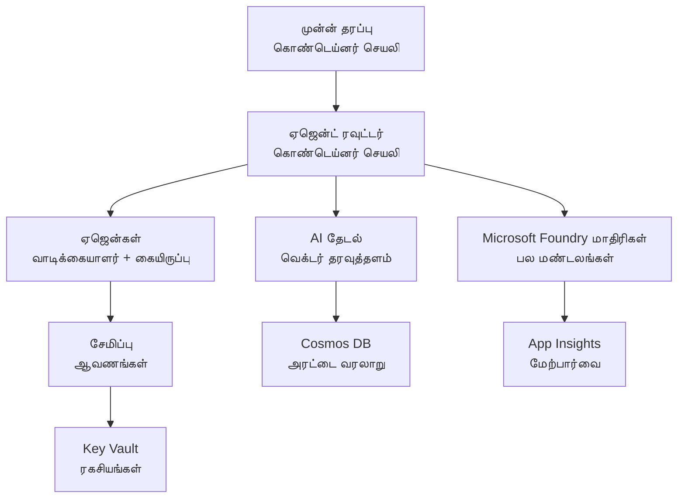

# Retail Multi-Agent Solution - Infrastructure Template

**அத்தியாயம் 5: உற்பத்தி பதிவேற்றத் தொகுப்பு**
- **📚 பாடநூல் முகப்பு**: [AZD For Beginners](../../README.md)
- **📖 தொடர்புடைய அத்தியாயம்**: [அத்தியாயம் 5: பன்முக்கிய ஏஜென்ட் AI தீர்வுகள்](../../README.md#-chapter-5-multi-agent-ai-solutions-advanced)
- **📝 காட்சி காரிய வழிகாட்டு**: [முழுமையான கட்டமைப்பு](../retail-scenario.md)
- **🎯 விரைவு பதிவேற்றம்**: [ஒரே-கிளிக் பதிவேற்றம்](../../../../examples/retail-multiagent-arm-template)

> **⚠️ INFRASTRUCTURE TEMPLATE ONLY**  
> இந்த ARM டெம்ப்ளேட் பல-ஏஜென்ட் குறியமைப்பிற்கு தேவையான **Azure வளங்களை** பதிவேற்றுகிறது.  
>  
> **என்னவை பதிவேற்றப்படுகின்றன (15-25 நிமிடங்கள்):**
> - ✅ Microsoft Foundry Models (gpt-4.1, gpt-4.1-mini, embeddings across 3 regions)
> - ✅ AI Search சேவை (காலியானது, குறியீட்டுப்படுத்தலுக்கு தயாராக உள்ளது)
> - ✅ Container Apps (தற்காலிக இமேஜ்கள், உங்கள் குறியீட்டிற்கு தயாராக உள்ளது)
> - ✅ Storage, Cosmos DB, Key Vault, Application Insights
>  
> **என்ன வழங்கப்படவில்லை (விவசாயம் தேவை):**
> - ❌ ஏஜென்ட் செயலாக்கக் குறியீடு (Customer Agent, Inventory Agent)
> - ❌ நடையில் மாற்றல் மற்றும் API எண்ட்பாயின்டுகள்
> - ❌ முன்னணிப் பேச்சு UI
> - ❌ Search குறியீட்டு ஸ்கீம்கள் மற்றும் தரவு குழாய்கள்
> - ❌ **எண்ணிக்கையான வளர்ச்சி நேரம்: 80-120 மணிநேரம்**
>  
> **இந்த டெம்ப்ளேட்டை பயன்படுத்த வேண்டியவர்கள்:**
> - ✅ பன்முக ஏஜென்ட் திட்டத்திற்கான Azure கட்டமைப்பை வழங்க விரும்புகிறீர்கள்
> - ✅ ஏஜென்ட் செயலாக்கத்தை தனியாக உருவாக்க திட்டமிட்டுள்ளீர்கள்
> - ✅ உற்பத்தி-தயார் கட்டமைப்பு அடிப்படை தேவைப்படுகிறது
>  
> **பயன்படுத்த வேண்டாம் என்றால்:**
> - ❌ உடனடி செயல்படும் பன்முக-ஏஜென்ட் டெமோ எதிர்பார்க்கிறீர்கள்
> - ❌ முழுமையான செயலி குறியீட்டு உதாரணங்களைத் தேடுகிறீர்கள்

## கண்ணோட்டம்

இந்த அடைவு பன்முக வாடிக்கையாளர் ஆதரவு அமைப்பிற்கு தேவையான அடிப்படை Azure Resource Manager (ARM) டெம்ப்ளேட்டை வழங்குகிறது. டெம்ப்ளேட் அனைத்து தேவையான Azure சேவைகளையும் வேண்டியவாறு அமைக்கப்பட்டு, இணைக்கப்பட்டவையாக வழங்குகிறது, உங்கள் செயலி வளர்ச்சிக்கு தயாராக உள்ளது.

**பதிவேற்றத்திற்குப் பின்னர், உங்களுக்கு இருக்கும்:** உற்பத்தி-தயார் Azure கட்டமைப்பு  
**கணினியை முழுமையாகச் செய்வதற்கு, நீங்கள் தேவையுடையவை:** ஏஜென்ட் குறியீடு, முன் பகுதியில் UI, மற்றும் தரவு கட்டமைப்பு (பாருங்கள் [Architecture Guide](../retail-scenario.md))

## 🎯 என்னவை பதிவேற்றப்படுகின்றன

### முக்கிய கட்டமைப்பு (பதிவேற்றத்தின் பின் நிலை)

✅ **Microsoft Foundry Models சேவைகள்** (API அழைப்புகளுக்கு தயாராக)
  - முதன்மை பிராந்தியம்: gpt-4.1 உருவாக்கம் (20K TPM திறன்)
  - இரண்டாம் பிராந்தியம்: gpt-4.1-mini உருவாக்கம் (10K TPM திறன்)
  - மூன்றாம் பிராந்தியம்: உரை எம்பெடிங் மாதிரி (30K TPM திறன்)
  - மதிப்பீட்டு பிராந்தியம்: gpt-4.1 grader மாதிரி (15K TPM திறன்)
  - **நிலை:** முற்றிலும் செயல்பாடானது - உடனடி API அழைப்புகள் செய்ய முடியும்

✅ **Azure AI Search** (காலியானது - கட்டமைக்க தயாராக)
  - வெக்டர் தேடல் திறன்கள் செயல்படுத்தப்பட்டன
  - ஸ்டாண்டர்டு டியர் 1 பகுதி, 1 பிரதிபலிப்பு
  - **நிலை:** சேவை இயங்குகிறது, ஆனால் குறியீடு உருவாக்குவதற்கு தேவை
  - **செயல் தேவை:** உங்கள் ஸ்கீமுடன் தேடல் குறியீட்டை உருவாக்கவும்

✅ **Azure Storage Account** (காலியானது - பதிவேற்றங்களுக்கு தயார்)
  - Blob கட்டளையாளர்: `documents`, `uploads`
  - பாதுகாப்பான கட்டமைப்பு (HTTPS மட்டும், பொதுக் அணுகல் இல்லை)
  - **நிலை:** கோப்புகளை பெற தயாராக உள்ளது
  - **செயல் தேவை:** உங்கள் பொருள் தரவுகளை மற்றும் ஆவணங்களை பதிவேற்றவும்

⚠️ **Container Apps சுற்றுச்சூழல்** (தற்காலிக இமேஜ்கள் பதிவேற்றப்பட்டன)
  - ஏஜென்ட் ராட்டர் செயலி (nginx default image)
  - முன் பகுதியில் செயலி (nginx default image)
  - தானாக அளவிடல் அமைக்கப்பட்டது (0-10 உட்பட இடரிகள்)
  - **நிலை:** தற்காலிக கொண்டெய்னர்கள் இயங்கி வருகின்றன
  - **செயல் தேவை:** உங்கள் ஏஜென்ட் செயலிகளை உருவாக்கி பதிவேற்றவும்

✅ **Azure Cosmos DB** (காலியானது - தரவிற்கு தயார்)
  - தரவுத்தளம் மற்றும் கன்டெய்னர் முன்-கட்டமைக்கப்பட்டன
  - குறைந்த தாமத செயல்பாடுகளுக்கு உகந்ததாக ஒப்டிமைஸ் செய்யப்பட்டன
  - TTL இயக்கப்பட்டுள்ளது தானாக சுத்தம் செய்ய
  - **நிலை:** அரட்டைய குறும்படம் சேமிக்க தயாராக உள்ளது

✅ **Azure Key Vault** (விருப்பம் - ரகசியங்களுக்கு தயாராக)
  - மென்மையான நீக்கு செயல்படுத்தப்பட்டது
  - மேலாண்மைக் அடையாளங்களுக்கான RBAC கட்டமைக்கப்பட்டது
  - **நிலை:** API விசைகள் மற்றும் இணைப்பு கயாணங்களை சேமிக்க தயாராக உள்ளது

✅ **Application Insights** (விருப்பம் - கண்காணிப்பு செயலில்)
  - Log Analytics வேலைநிரலுடன் இணைக்கப்பட்டது
  - தனிப்பயன் அளவைகள் மற்றும் எச்சரிக்கைகள் அமைக்கப்பட்டன
  - **நிலை:** உங்கள் செயலிகளிலிருந்து டெலிமெட்ரியை பெற தயாராக உள்ளது

✅ **Document Intelligence** (API அழைப்புகளுக்கு தயாராக)
  - S0 டியர் உற்பத்தி பணிகளுக்கு
  - **நிலை:** பதிவேற்றப்பட்ட ஆவணங்களை செயலாக்க தயாராக உள்ளது

✅ **Bing Search API** (API அழைப்புகளுக்கு தயாராக)
  - S1 டியர் நேரடி தேடல்களுக்கு
  - **நிலை:** வலை தேடல் கேள்விகளுக்கு தயாராக உள்ளது

### பதிவேற்ற முறைமைகள்

| Mode | OpenAI Capacity | Container Instances | Search Tier | Storage Redundancy | Best For |
|------|-----------------|---------------------|-------------|-------------------|----------|
| **Minimal** | 10K-20K TPM | 0-2 replicas | Basic | LRS (Local) | Dev/test, learning, proof-of-concept |
| **Standard** | 30K-60K TPM | 2-5 replicas | Standard | ZRS (Zone) | Production, moderate traffic (<10K users) |
| **Premium** | 80K-150K TPM | 5-10 replicas, zone-redundant | Premium | GRS (Geo) | Enterprise, high traffic (>10K users), 99.99% SLA |

**செலவு தாக்கம்:**
- **Minimal → Standard:** ~4x செலவுப் பெருக்கம் ($100-370/mo → $420-1,450/mo)
- **Standard → Premium:** ~3x செலவுப் பெருக்கம் ($420-1,450/mo → $1,150-3,500/mo)
- **தெரிவுசெய்யும் அடிப்படை:** எதிர்பார்க்கப்படும் ஏற்றம், SLA தேவைகள், பட்ஜெட் கட்டுப்பாடுகள்

**திறன் திட்டமிடல்:**
- **TPM (Tokens Per Minute):** அனைத்து மாதிரி பதிவேற்றங்களின் மொத்தம்
- **Container Instances:** தானாக அளவிடும் வரம்பு ( குறைந்த-அதிக இடரிகள் )
- **Search Tier:** கேள்வி செயல்திறன் மற்றும் குறியீட்டு அளவு வரம்புகளை பாதிக்கிறது

## 📋 முன்-தேவைகள்

### தேவையான கருவிகள்
1. **Azure CLI** (பதிப்பு 2.50.0 அல்லது மேல்)
   ```bash
   az --version  # பதிப்பை சரிபார்க்கவும்
   az login      # அங்கீகரிக்கவும்
   ```

2. **செயலில் இருக்கும் Azure சந்தா** Owner அல்லது Contributor அணுகலுடன்
   ```bash
   az account show  # சப்ஸ்கிரிப்ஷனை சரிபார்க்கவும்
   ```

### தேவையான Azure ஒதுக்கீடுகள்

பதிவேற்றத்திற்கு முன், உங்கள் குறிக்கோள் பிராந்தியங்களில் போதுமான ஒதுக்கீடுகள் உள்ளதா என்பதை சரிபார்க்கவும்:

```bash
# உங்கள் பிராந்தியத்தில் Microsoft Foundry Models கிடைக்கிறதா என்பதை சரிபார்க்கவும்
az cognitiveservices account list-skus \
  --kind OpenAI \
  --location eastus2

# OpenAI குவோட்டாவை சரிபார்க்கவும் (gpt-4.1 உதாரணமாக)
az cognitiveservices usage list \
  --location eastus2 \
  --query "[?name.value=='OpenAI.Standard.gpt-4.1']"

# Container Apps குவோட்டாவை சரிபார்க்கவும்
az provider show \
  --namespace Microsoft.App \
  --query "resourceTypes[?resourceType=='managedEnvironments'].locations"
```

**குறைந்தபட்ச தேவையான ஒதுக்கீடுகள்:**
- **Microsoft Foundry Models:** பிராந்தியங்களாக 3-4 மாதிரி பதிவேற்றங்கள்
  - gpt-4.1: 20K TPM (Tokens Per Minute)
  - gpt-4.1-mini: 10K TPM
  - text-embedding-ada-002: 30K TPM
  - **குறிப்பு:** gpt-4.1 சில பிராந்தியங்களில் வெயிட் லிஸ்டில் இருக்கலாம் - பார்க்க [model availability](https://learn.microsoft.com/azure/ai-services/openai/concepts/models)
- **Container Apps:** மேலாண்மையிடப்பட்ட சுற்றுச்சூழல் + 2-10 கொண்டெய்னர் இடரிகள்
- **AI Search:** ஸ்டாண்டர்டு டியர் (வெக்டர் தேடலுக்கு Basic போதாது)
- **Cosmos DB:** ஸ்டாண்டர்டுProvisioned throughput

**ஒதுக்கீடு போதாது என்றால்:**
1. Azure போர்டலை → Quotas → Request increase சென்று கோரிக்கை விடுங்கள்
2. அல்லது Azure CLI பயன்படுத்தவும்:
   ```bash
   az support tickets create \
     --ticket-name "OpenAI-Quota-Increase" \
     --severity "minimal" \
     --description "Request quota increase for Microsoft Foundry Models gpt-4.1 in eastus2"
   ```
3. கிடைக்கும் பிராந்தியங்களை மாற்ற அணுகுங்கள்

## 🚀 விரைவு பதிவேற்றம்

### விருப்பம் 1: Azure CLI பயன்படுத்தி

```bash
# டெம்ப்ளேட் கோப்புகளை கிளோன் செய்யவும் அல்லது பதிவிறக்கம் செய்யவும்
git clone <repository-url>
cd examples/retail-multiagent-arm-template

# டெப்ளாய்மெண்ட் ஸ்கிரிப்டை இயக்கக்கூடியதாக மாற்றவும்
chmod +x deploy.sh

# இயல்புநிலை அமைப்புகளுடன் நிறுவவும்
./deploy.sh -g myResourceGroup

# உற்பத்திக்காக பிரீமியம் அம்சங்களுடன் நிறுவவும்
./deploy.sh -g myProdRG -e prod -m premium -l eastus2
```

### விருப்பம் 2: Azure போர்டல் பயன்படுத்தி

[](https://portal.azure.com/#create/Microsoft.Template/uri/https%3A%2F%2Fraw.githubusercontent.com%2Fmicrosoft%2Fazd-for-beginners%2Fmain%2Fexamples%2Fretail-multiagent-arm-template%2Fazuredeploy.json)

### விருப்பம் 3: Azure CLI ஐ நேரடியாக பயன்படுத்தி

```bash
# வளக் குழுவை உருவாக்கவும்
az group create --name myResourceGroup --location eastus2

# டெம்ப்ளேட்டை அமல்படுத்தவும்
az deployment group create \
  --resource-group myResourceGroup \
  --template-file azuredeploy.json \
  --parameters azuredeploy.parameters.json
```

## ⏱️ பதிவேற்ற நேரக்குவியல்

### எதிர்பார்க்க வேண்டியது

| Phase | Duration | What Happens |
|-------|----------|--------------||
| **Template Validation** | 30-60 seconds | Azure validates ARM template syntax and parameters |
| **Resource Group Setup** | 10-20 seconds | Creates resource group (if needed) |
| **OpenAI Provisioning** | 5-8 minutes | Creates 3-4 OpenAI accounts and deploys models |
| **Container Apps** | 3-5 minutes | Creates environment and deploys placeholder containers |
| **Search & Storage** | 2-4 minutes | Provisions AI Search service and storage accounts |
| **Cosmos DB** | 2-3 minutes | Creates database and configures containers |
| **Monitoring Setup** | 2-3 minutes | Sets up Application Insights and Log Analytics |
| **RBAC Configuration** | 1-2 minutes | Configures managed identities and permissions |
| **Total Deployment** | **15-25 minutes** | Complete infrastructure ready |

**பதிவேற்றத்துக்குப் பிறகு:**
- ✅ **கட்டமைப்பு தயாராக உள்ளது:** அனைத்து Azure சேவைகளும் Provision செய்யப்பட்டு இயங்குகின்றன
- ⏱️ **செயலி உருவாக்கம்:** 80-120 மணிநேரம் (உங்கள் பொறுப்பு)
- ⏱️ **குறியீடு கட்டமைப்பு:** 15-30 நிமிடங்கள் (உங்கள் ஸ்கீமுடன் தேவையுள்ளது)
- ⏱️ **தரவு பதிவேற்றம்:** தரவுக் அளவை பொறுத்து மாறுபடும்
- ⏱️ **சோதனை & சரிபார்ப்பு:** 2-4 மணி

---

## ✅ பதிவேற்ற வெற்றி சோதனை

### படி 1: வள ஒதுக்கீடு சரிபார்க்கவும் (2 நிமிடங்கள்)

```bash
# அனைத்து வளங்களும் வெற்றிகரமாக நிறுவப்பட்டுள்ளதா என்பதை சரிபார்க்கவும்
az resource list \
  --resource-group myResourceGroup \
  --query "[?provisioningState!='Succeeded'].{Name:name, Status:provisioningState, Type:type}" \
  --output table
```

**எதிர்பார்ப்பு:** காலியான அட்டவணை (அனைத்து வளங்களும் "Succeeded" நிலையை காட்டும்)

### படி 2: Microsoft Foundry Models பதிவேற்றங்களை சரிபார்க்கவும் (3 நிமிடங்கள்)

```bash
# அனைத்து OpenAI கணக்குகளை பட்டியலிடு
az cognitiveservices account list \
  --resource-group myResourceGroup \
  --query "[?kind=='OpenAI'].{Name:name, Location:location, Status:properties.provisioningState}" \
  --output table

# முதன்மை பிராந்தியத்திற்கான மாடல் ஒதுக்கீடுகளைச் சரிபார்க்கவும்
OPENAI_NAME=$(az cognitiveservices account list \
  --resource-group myResourceGroup \
  --query "[?kind=='OpenAI'] | [0].name" -o tsv)

az cognitiveservices account deployment list \
  --name $OPENAI_NAME \
  --resource-group myResourceGroup \
  --output table
```

**எதிர்பார்ப்பு:** 
- 3-4 OpenAI கணக்குகள் (முதன்மை, இரண்டாம், மூன்றாம், மதிப்பீட்டுப் பிராந்தியங்கள்)
- 1-2 மாதிரி பதிவேற்றங்கள் ஒரு கணக்கிற்கு (gpt-4.1, gpt-4.1-mini, text-embedding-ada-002)

### படி 3: கட்டமைப்பு எண்ட்பாயின்டுகளை சோதிக்கவும் (5 நிமிடங்கள்)

```bash
# கண்டெய்னர் பயன்பாட்டு URL-களைப் பெறுக
az containerapp list \
  --resource-group myResourceGroup \
  --query "[].{Name:name, URL:properties.configuration.ingress.fqdn, Status:properties.runningStatus}" \
  --output table

# ரூட்டர் எண்ட்பாயிண்டை சோதிக்கவும் (தற்காலிக படம் பதிலளிக்கும்)
ROUTER_URL=$(az containerapp show \
  --name retail-router \
  --resource-group myResourceGroup \
  --query "properties.configuration.ingress.fqdn" -o tsv)

echo "Testing: https://$ROUTER_URL"
curl -I https://$ROUTER_URL || echo "Container running (placeholder image - expected)"
```

**எதிர்பார்ப்பு:** 
- Container Apps "Running" நிலையை காட்டுகின்றன
- தற்காலிக nginx HTTP 200 அல்லது 404 உடன் பதிலளிக்கிறது (இன்னும் செயலி குறியீடு இல்லை)

### படி 4: Microsoft Foundry Models API அணுகலை சரிபார்க்கவும் (3 நிமிடங்கள்)

```bash
# OpenAI எண்ட்பாயிண்ட் மற்றும் கீயை பெறவும்
OPENAI_ENDPOINT=$(az cognitiveservices account show \
  --name $OPENAI_NAME \
  --resource-group myResourceGroup \
  --query "properties.endpoint" -o tsv)

OPENAI_KEY=$(az cognitiveservices account keys list \
  --name $OPENAI_NAME \
  --resource-group myResourceGroup \
  --query "key1" -o tsv)

# gpt-4.1 அமர்த்தலை சோதிக்கவும்
curl "${OPENAI_ENDPOINT}openai/deployments/gpt-4.1/chat/completions?api-version=2024-08-01-preview" \
  -H "Content-Type: application/json" \
  -H "api-key: $OPENAI_KEY" \
  -d '{
    "messages": [{"role": "user", "content": "Say hello"}],
    "max_tokens": 10
  }'
```

**எதிர்பார்ப்பு:** JSON பதில் சாட் சமাপ্তி இணைப்பு உடன் (OpenAI செயல்படுகிறது என்பதை உறுதிசெய்கிறது)

### என்ன செயல்படுகிறது மற்றும் என்ன செயல்படவில்லை

**✅ பதிவேற்றத்திற்கு பிறகு செயல்படும்:**
- Microsoft Foundry Models மாதிரிகள் பதிவேற்றப்பட்டு API அழைப்புகளை ஏற்றுக்கொள்ளுகின்றன
- AI Search சேவை இயங்குகிறது (காலியானது, இன்னும் குறியீடுகள் இல்லை)
- Container Apps இயங்குகின்றன (தற்காலிக nginx இமேஜ்கள்)
- Storage கணக்குகள் அணுகக்கூடியவை மற்றும் பதிவேற்றங்களுக்கு தயாராக உள்ளன
- Cosmos DB தரவு செயல்பாடுகளுக்கு தயாராக உள்ளது
- Application Insights கட்டமைப்பு டெலிமெட்ரியை சேகரிக்கிறது
- Key Vault ரகசிய சேமிப்பிற்கு தயாராக உள்ளது

**❌ இன்னும் செயல்படவில்லை (வளர்ச்சி தேவை):**
- ஏஜென்ட் எண்ட்பாயின்டுகள் (செயலி குறியீடு இன்னும் இல்லாதது)
- சாட் செயல்பாடு (முன் + பின்னணி அமலாக்கம் தேவை)
- தேடல் வினாக்கள் (இன்னும் தேடல் குறியீடு உருவாக்கப்படவில்லை)
- ஆவண செயலாக்க குழாய் (தரவு பதிவேற்றம் இல்லாததால்)
- தனிப்பயன் டெலிமெட்ரி (செயலி இன்ஸ்ட்ருமேண்டேஷன் தேவை)

**அடுத்த படிகள்:** உங்கள் செயலியை உருவாக்கி பதிவேற்றுவதற்கு [Post-Deployment Configuration](../../../../examples/retail-multiagent-arm-template) பார்க்கவும்

---

## ⚙️ கட்டமைப்பு விருப்பங்கள்

### டெம்ப்ளேட் அளவுருக்கள்

| Parameter | Type | Default | Description |
|-----------|------|---------|-------------|
| `projectName` | string | "retail" | அனைத்து வள பெயர்களுக்கும் முன்னொட்டு |
| `location` | string | Resource group location | முதன்மையான பதிவேற்ற பிராந்தியம் |
| `secondaryLocation` | string | "westus2" | பல-பிராந்திய பதிவேற்றத்திற்கான இரண்டாம் பிராந்தியம் |
| `tertiaryLocation` | string | "francecentral" | எம்பெடிங் மாதிரிக்கான பிராந்தியம் |
| `environmentName` | string | "dev" | சுற்றுச்சூழல்( dev/staging/prod ) குறிக்கிறது |
| `deploymentMode` | string | "standard" | பதிவேற்ற கட்டமைப்பு (minimal/standard/premium) |
| `enableMultiRegion` | bool | true | பல-பிராந்திய பதிவேற்றத்தை செயல்படுத்தவும் |
| `enableMonitoring` | bool | true | Application Insights மற்றும் பதிவு செயலாக்கத்தை செயல்படுத்தவும் |
| `enableSecurity` | bool | true | Key Vault மற்றும் அதிகபட்ச பாதுகாப்பை செயல்படுத்தவும் |

### அளவுருக்களை தனிப்பயன் செய்தல்

மாற்ற எடுக்க `azuredeploy.parameters.json`:

```json
{
  "$schema": "https://schema.management.azure.com/schemas/2019-04-01/deploymentParameters.json#",
  "contentVersion": "1.0.0.0",
  "parameters": {
    "projectName": {
      "value": "mycompany"
    },
    "environmentName": {
      "value": "prod"
    },
    "deploymentMode": {
      "value": "premium"
    },
    "location": {
      "value": "eastus2"
    }
  }
}
```

## 🏗️ கட்டமைப்பு கண்ணோட்டம்


## 📖 பதிவேற்ற ஸ்கிரிப்ட் பயன்பாடு

`deploy.sh` ஸ்கிரிப்ட் ஒரு இடைநிலை பதிவேற்ற அனுபவத்தை வழங்குகிறது:

```bash
# உதவியை காட்டு
./deploy.sh --help

# அடிப்படை செயல்படுத்தல்
./deploy.sh -g myResourceGroup

# தனிப்பயன் அமைப்புகளுடன் மேம்பட்ட செயல்படுத்தல்
./deploy.sh \
  -g myProductionRG \
  -p companyname \
  -e prod \
  -m premium \
  -l eastus2

# பல பிராந்தியங்கள் இல்லாமல் வளர்ச்சி செயல்படுத்தல்
./deploy.sh \
  -g myDevRG \
  -e dev \
  -m minimal \
  --no-multi-region \
  --no-security
```

### ஸ்கிரிப்ட் அம்சங்கள்

- ✅ **முன்-தேவைகள் சோதனை** (Azure CLI, லாகின் நிலை, டெம்ப்ளேட் கோப்புகள்)
- ✅ **வள குழும மேலாண்மை** (இல்லையெனில் உருவாக்குகிறது)
- ✅ **டெம்ப்ளேட் சரிபார்ப்பு** பதிவேற்றத்திற்கு முன்
- ✅ **முன்னேற்ற கண்காணிப்பு** வண்ணப்படுத்தப்பட்ட வெளியீட்டுடன்
- ✅ **பதிவேற்ற வெளியீடுகள்** காட்சி
- ✅ **பதிவேற்றத்திற்கு பிறகு வழிகாட்டுதல்**

## 📊 பதிவேற்ற கண்காணிப்பு

### பதிவேற்ற நிலையைச் சரிபார்க்கவும்

```bash
# நிறுவல்களை பட்டியலிடு
az deployment group list --resource-group myResourceGroup --output table

# நிறுவலின் விவரங்களைப் பெறு
az deployment group show \
  --resource-group myResourceGroup \
  --name retail-deployment-YYYYMMDD-HHMMSS

# நிறுவலின் முன்னேற்றத்தை பின்தொடரு
az deployment group create \
  --resource-group myResourceGroup \
  --template-file azuredeploy.json \
  --parameters azuredeploy.parameters.json \
  --verbose
```

### பதிவேற்ற வெளியீடுகள்

வெற்றிகரமாக பதிவேற்றப்பட்ட பிறகு, பின்வரும் வெளியீடுகள் கிடைக்கும்:

- **முன் பகுதி URL**: வலை இடைமுகத்திற்கான பொது எண்ட்பாயிண்ட்
- **ரூட்டர் URL**: ஏஜென்ட் ராட்டருக்கான API எண்ட்பாயிண்ட்
- **OpenAI Endpoints**: முதன்மை மற்றும் இரண்டாம் OpenAI சேவை எண்ட்பாயிண்டுகள்
- **Search Service**: Azure AI Search சேவை எண்ட்பாயிண்ட்
- **Storage Account**: ஆவணங்களுக்கு பயன்படும் storage கணக்கின் பெயர்
- **Key Vault**: Key Vault-இன் பெயர் (தெரிந்திருந்தால்)
- **Application Insights**: கண்காணிப்பு சேவையின் பெயர் (தெரிந்திருந்தால்)

## 🔧 பதிவேற்றத்திற்கு பிறகு: அடுத்த படிகள்
> **📝 முக்கியம்:** அடிப்படை அமைப்பு அமல்படுத்தப்பட்டுள்ளது, ஆனால் நீங்கள் பயன்பாட்டு குறியீட்டை உருவாக்கி மற்றும் வெளியிட வேண்டியது அவசியம்.

### கட்டம் 1: ஏஜென்ட் பயன்பாடுகள் உருவாக்குதல் (உங்கள் பொறுப்பு)

The ARM template creates **empty Container Apps** with placeholder nginx images. You must:

**தேவையான மேம்பாடு:**
1. **Agent Implementation** (30-40 மணி நேரம்)
   - gpt-4.1 ஒருங்கிணைப்புடன் வாடிக்கையாளர் சேவை ஏஜென்ட்
   - gpt-4.1-mini ஒருங்கிணைப்புடன் இன்வெண்டரி ஏஜென்ட்
   - ஏஜென்ட் வழிமாற்று லாஜிக்

2. **Frontend Development** (20-30 மணி நேரம்)
   - Chat இடைமுக UI (React/Vue/Angular)
   - கோப்பு பதிவேற்ற செயல்பாடு
   - பதில் காட்சிப்படுத்தல் மற்றும் வடிவமைத்தல்

3. **Backend Services** (12-16 மணி நேரம்)
   - FastAPI அல்லது Express router
   - அங்கீகார மிடில்வேர்
   - டெலிமெட்ரி ஒருங்கிணைப்பு

See: [கட்டமைப்பு வழிகாட்டி](../retail-scenario.md) for detailed implementation patterns and code examples

### Phase 2: Configure AI Search Index (15-30 minutes)

Create a search index matching your data model:

```bash
# தேடல் சேவை விவரங்களைப் பெறவும்
SEARCH_NAME=$(az search service list \
  --resource-group myResourceGroup \
  --query "[0].name" -o tsv)

SEARCH_KEY=$(az search admin-key show \
  --service-name $SEARCH_NAME \
  --resource-group myResourceGroup \
  --query "primaryKey" -o tsv)

# உங்கள் ஸ்கீமாவுடன் இன்டெக்ஸை உருவாக்கவும் (உதாரணம்)
curl -X POST "https://${SEARCH_NAME}.search.windows.net/indexes?api-version=2023-11-01" \
  -H "Content-Type: application/json" \
  -H "api-key: ${SEARCH_KEY}" \
  -d '{
    "name": "products",
    "fields": [
      {"name": "id", "type": "Edm.String", "key": true},
      {"name": "title", "type": "Edm.String", "searchable": true},
      {"name": "content", "type": "Edm.String", "searchable": true},
      {"name": "category", "type": "Edm.String", "filterable": true},
      {"name": "content_vector", "type": "Collection(Edm.Single)", 
       "searchable": true, "dimensions": 1536, "vectorSearchProfile": "default"}
    ],
    "vectorSearch": {
      "algorithms": [{"name": "default", "kind": "hnsw"}],
      "profiles": [{"name": "default", "algorithm": "default"}]
    }
  }'
```

**வளங்கள்:**
- [AI தேடல் இன்டெக்ஸ் ஸ்கீமா வடிவமைப்பு](https://learn.microsoft.com/azure/search/search-what-is-an-index)
- [வெக்டர் தேடல் கட்டமைப்பு](https://learn.microsoft.com/azure/search/vector-search-how-to-create-index)

### Phase 3: Upload Your Data (Time varies)

Once you have product data and documents:

```bash
# சேமிப்பு கணக்கு விவரங்களைப் பெறவும்
STORAGE_NAME=$(az storage account list \
  --resource-group myResourceGroup \
  --query "[0].name" -o tsv)

STORAGE_KEY=$(az storage account keys list \
  --account-name $STORAGE_NAME \
  --resource-group myResourceGroup \
  --query "[0].value" -o tsv)

# உங்கள் ஆவணங்களை பதிவேற்றவும்
az storage blob upload-batch \
  --destination documents \
  --source /path/to/your/product/docs \
  --account-name $STORAGE_NAME \
  --account-key $STORAGE_KEY

# உதாரணம்: ஒரு கோப்பை பதிவேற்றவும்
az storage blob upload \
  --container-name documents \
  --name "product-manual.pdf" \
  --file /path/to/product-manual.pdf \
  --account-name $STORAGE_NAME \
  --account-key $STORAGE_KEY
```

### Phase 4: Build and Deploy Your Applications (8-12 hours)

Once you've developed your agent code:

```bash
# 1. Azure Container Registry உருவாக்கவும் (தேவைப்பட்டால்)
az acr create \
  --name myregistry \
  --resource-group myResourceGroup \
  --sku Basic

# 2. ஏஜெண்ட் ரூட்டர் படிமத்தை உருவாக்கி மற்றும் புஷ் செய்யவும்
docker build -t myregistry.azurecr.io/agent-router:v1 /path/to/your/router/code
az acr login --name myregistry
docker push myregistry.azurecr.io/agent-router:v1

# 3. ஃப்ரன்டெண்ட் படிமத்தை உருவாக்கி மற்றும் புஷ் செய்யவும்
docker build -t myregistry.azurecr.io/frontend:v1 /path/to/your/frontend/code
docker push myregistry.azurecr.io/frontend:v1

# 4. உங்கள் படிமங்களுடன் Container Apps-ஐ புதுப்பிக்கவும்
az containerapp update \
  --name retail-router \
  --resource-group myResourceGroup \
  --image myregistry.azurecr.io/agent-router:v1

az containerapp update \
  --name retail-frontend \
  --resource-group myResourceGroup \
  --image myregistry.azurecr.io/frontend:v1

# 5. சுற்றுச்சூழல் மாறிலிகளை கட்டமைக்கவும்
az containerapp update \
  --name retail-router \
  --resource-group myResourceGroup \
  --set-env-vars \
    OPENAI_ENDPOINT=secretref:openai-endpoint \
    OPENAI_KEY=secretref:openai-key \
    SEARCH_ENDPOINT=secretref:search-endpoint \
    SEARCH_KEY=secretref:search-key
```

### Phase 5: Test Your Application (2-4 hours)

```bash
# உங்கள் பயன்பாட்டின் URL ஐப் பெறவும்
ROUTER_URL=$(az containerapp show \
  --name retail-router \
  --resource-group myResourceGroup \
  --query "properties.configuration.ingress.fqdn" -o tsv)

# ஏஜெண்ட் எண்ட்பாயிண்டை சோதிக்கவும் (உங்கள் குறியீடு வெளியிடப்பட்டபோது)
curl -X POST "https://${ROUTER_URL}/chat" \
  -H "Content-Type: application/json" \
  -d '{
    "message": "Hello, I need help with my order",
    "agent": "customer"
  }'

# பயன்பாட்டின் பதிவுகளை சரிபார்க்கவும்
az containerapp logs show \
  --name retail-router \
  --resource-group myResourceGroup \
  --follow
```

### Implementation Resources

**Architecture & Design:**
- 📖 [Complete Architecture Guide](../retail-scenario.md) - விரிவான அமல்படுத்தல் மாதிரிகள் மற்றும் குறியீட்டு உதாரணங்கள்
- 📖 [Multi-Agent Design Patterns](https://learn.microsoft.com/azure/architecture/ai-ml/guide/multi-agent-systems)

**Code Examples:**
- 🔗 [Microsoft Foundry Models Chat Sample](https://github.com/Azure-Samples/azure-search-openai-demo) - RAG மாதிரி
- 🔗 [Semantic Kernel](https://github.com/microsoft/semantic-kernel) - ஏஜென்ட் கட்டமைப்பு (C#)
- 🔗 [LangChain Azure](https://github.com/langchain-ai/langchain) - ஏஜென்ட் ஒருங்கட்டமைப்பு (Python)
- 🔗 [AutoGen](https://github.com/microsoft/autogen) - பல-ஏஜென்ட் உரையாடல்கள்

**Estimated Total Effort:**
- Infrastructure deployment: 15-25 minutes (✅ Complete)
- Application development: 80-120 மணி நேரம் (🔨 உங்கள் பணி)
- Testing and optimization: 15-25 மணி நேரம் (🔨 உங்கள் பணி)

## 🛠️ Troubleshooting

### Common Issues

#### 1. Microsoft Foundry Models Quota Exceeded

```bash
# தற்போதைய குவோட்டா பயன்பாட்டை சரிபார்க்கவும்
az cognitiveservices usage list --location eastus2

# குவோட்டாவை அதிகரிக்க கோரவும்
az support tickets create \
  --ticket-name "OpenAI-Quota-Increase" \
  --severity "minimal" \
  --description "Request quota increase for Microsoft Foundry Models in region X"
```

#### 2. Container Apps Deployment Failed

```bash
# கண்டெய்னர் செயலியின் பதிவுகளை சரிபார்க்கவும்
az containerapp logs show \
  --name retail-router \
  --resource-group myResourceGroup \
  --follow

# கண்டெய்னர் செயலியை மீண்டும் துவக்கவும்
az containerapp revision restart \
  --name retail-router \
  --resource-group myResourceGroup
```

#### 3. Search Service Initialization

```bash
# தேடல் சேவையின் நிலையை சரிபார்க்கவும்
az search service show \
  --name <search-service-name> \
  --resource-group myResourceGroup

# தேடல் சேவையின் இணைப்பை சோதிக்கவும்
curl -X GET "https://<search-service-name>.search.windows.net/indexes?api-version=2023-11-01" \
  -H "api-key: <search-admin-key>"
```

### Deployment Validation

```bash
# எல்லா வளங்களும் உருவாக்கப்பட்டுள்ளதா என்பதைச் சரிபார்க்கவும்
az resource list \
  --resource-group myResourceGroup \
  --output table

# வளங்களின் நலனைக் சோதிக்கவும்
az resource list \
  --resource-group myResourceGroup \
  --query "[?provisioningState!='Succeeded'].{Name:name, Status:provisioningState, Type:type}" \
  --output table
```

## 🔐 Security Considerations

### Key Management
- எல்லா ரகசியங்களும் Azure Key Vault-இல் சேமிக்கப்படுகின்றன (செயலில் இருந்தால்)
- Container apps அங்கீகாரத்திற்காக managed identity பயன்படுத்துகின்றன
- சேமிப்பு கணக்குகளுக்கு பாதுகாப்பான இயல்புகள் உள்ளன (HTTPS மட்டும், பொது blob அணுகல் இல்லை)

### Network Security
- Container apps சாத்தியமான இடங்களில் உள்ளக நெட்வொர்க்கை பயன்படுத்துகின்றன
- தேடல் சேவை private endpoints விருப்பத்துடன் கட்டமைக்கப்பட்டுள்ளது
- Cosmos DB குறைந்தபட்ச அவசியமான அனுமதிகளுடன் கட்டமைக்கப்பட்டுள்ளது

### RBAC Configuration
```bash
# கையாளப்படும் அடையாளத்திற்கான தேவையான பங்குகளை ஒதுக்கவும்
az role assignment create \
  --assignee <container-app-managed-identity> \
  --role "Cognitive Services OpenAI User" \
  --scope <openai-resource-id>
```

## 💰 Cost Optimization

### Cost Estimates (Monthly, USD)

| Mode | OpenAI | Container Apps | Search | Storage | Total Est. |
|------|--------|----------------|--------|---------|------------|
| Minimal | $50-200 | $20-50 | $25-100 | $5-20 | $100-370 |
| Standard | $200-800 | $100-300 | $100-300 | $20-50 | $420-1450 |
| Premium | $500-2000 | $300-800 | $300-600 | $50-100 | $1150-3500 |

### Cost Monitoring

```bash
# பட்ஜெட் எச்சரிக்கைகளை அமைக்கவும்
az consumption budget create \
  --account-name <subscription-id> \
  --budget-name "retail-budget" \
  --amount 500 \
  --time-grain Monthly \
  --start-date 2024-01-01 \
  --end-date 2024-12-31
```

## 🔄 Updates and Maintenance

### Template Updates
- ARM template கோப்புகளை பதிப்பு கட்டுப்பாட்டில் வைக்கவும்
- மாற்றங்களை முதலில் development சூழலில் சோதிக்கவும்
- புதுப்பிப்புகளுக்கான incremental deployment முறை பயன்படுத்தவும்

### Resource Updates
```bash
# புதிய அளவுருக்களுடன் புதுப்பிக்கவும்
az deployment group create \
  --resource-group myResourceGroup \
  --template-file azuredeploy.json \
  --parameters azuredeploy.parameters.json \
  --mode Incremental
```

### Backup and Recovery
- Cosmos DB தானாக பின்நகல் இயலுமைப்படுத்தப்பட்டுள்ளது
- Key Vault soft delete இயலுமைப்படுத்தப்பட்டுள்ளது
- Container app பதிப்புகள் ரோல்பேக்குக்காக பராமரிக்கப்படுகின்றன

## 📞 Support

- **Template Issues**: [GitHub Issues](https://github.com/microsoft/azd-for-beginners/issues)
- **Azure Support**: [Azure Support Portal](https://portal.azure.com/#blade/Microsoft_Azure_Support/HelpAndSupportBlade)
- **Community**: [Azure AI Discord](https://discord.gg/microsoft-azure)

---

**⚡ உங்கள் பல-ஏஜென்ட் தீர்வை வெளியிடத் தயாரா?**

தொடங்கவும்: `./deploy.sh -g myResourceGroup`

---

<!-- CO-OP TRANSLATOR DISCLAIMER START -->
நிராகரிப்பு அறிக்கை:
இக்கோப்பு AI மொழிபெயர்ப்பு சேவையான [Co-op Translator](https://github.com/Azure/co-op-translator) மூலம் மொழிபெயர்க்கப்பட்டுள்ளது. நாம் துல்லியத்திற்காக முயற்சித்தாலும், தானாக உருவாக்கப்பட்ட மொழிபெயர்ப்புகளில் பிழைகள் அல்லது தவறான பொருள் விளைவுகள் இருக்கக்கூடும் என்பதை தயவுசெய்து கருத்தில் கொள்ளுங்கள். மூல ஆவணம் அதன் சொந்த மொழியிலேயே அதிகாரப் பெறும் ஆதாரமாகக் கருதப்பட வேண்டும். முக்கியமான தகவல்களுக்கு தொழில்முறை மனித மொழிபெயர்ப்பாளர் மூலம் மொழிபெயர்ப்பு செய்வது பரிந்துரைக்கப்படுகிறது. இந்த மொழிபெயர்ப்பைப் பயன்படுத்துவதனால் ஏற்படும் எந்த தவறான புரிதல்களுக்கோ அல்லது பொருள் தவறுகளுக்கோ நாங்கள் பொறுப்பேற்கமாட்டோம்.
<!-- CO-OP TRANSLATOR DISCLAIMER END -->