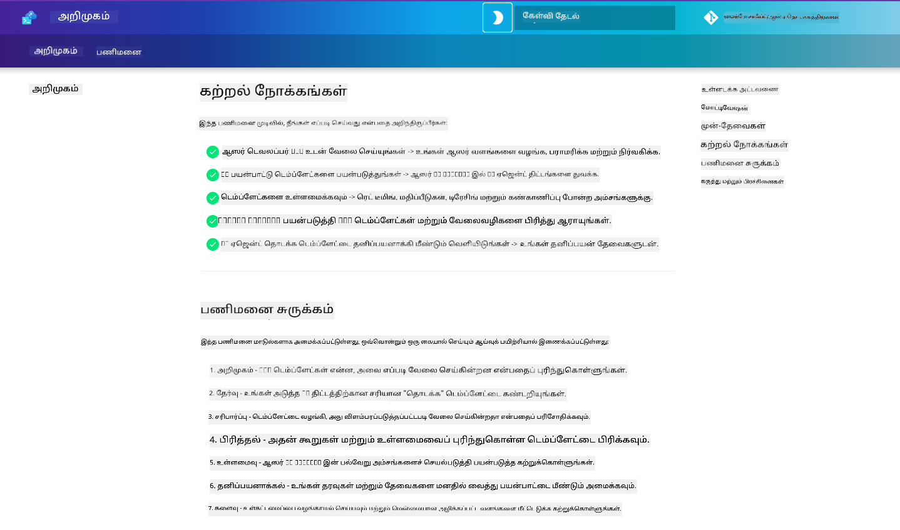

<!--
CO_OP_TRANSLATOR_METADATA:
{
  "original_hash": "9cc966416ab431c38b2ab863884b196c",
  "translation_date": "2025-10-11T15:41:28+00:00",
  "source_file": "workshop/README.md",
  "language_code": "ta"
}
-->
# AZD for AI Developers Workshop

Azure Developer CLI (AZD) மற்றும் AI பயன்பாடுகளை வெளியிடுவதற்கான கையேடு செயல்முறை பயிற்சிக்கு வரவேற்கிறோம். இந்த பயிற்சி AZD டெம்ப்ளேட்களை 3 படிகளில் கற்றுக்கொள்ள உதவுகிறது:

1. **கண்டறிதல்** - உங்களுக்கு சரியான டெம்ப்ளேட்டை தேர்வு செய்யுங்கள்.
1. **வெளியிடுதல்** - வெளியிட்டு, அது செயல்படுகிறதா என்பதை உறுதிப்படுத்துங்கள்.
1. **தனிப்பயனாக்கம்** - உங்கள் தேவைகளுக்கு ஏற்ப மாற்றங்கள் செய்யுங்கள்!

இந்த பயிற்சியின் போது, உங்கள் முழுமையான மேம்பாட்டு பயணத்தை எளிமைப்படுத்த உதவும் முக்கியமான டெவலப்பர் கருவிகள் மற்றும் பணியாளர்களை அறிமுகப்படுத்தப்படும்.

<br/>

## உலாவி அடிப்படையிலான கையேடு

பயிற்சி பாடங்கள் Markdown வடிவில் உள்ளன. நீங்கள் அவற்றை நேரடியாக GitHub-ல் தேடலாம் - அல்லது கீழே உள்ள ஸ்கிரீன்ஷாட்டில் காட்டப்பட்டுள்ளபடி உலாவி அடிப்படையிலான முன்னோட்டத்தை தொடங்கலாம்.



இந்த விருப்பத்தை பயன்படுத்த - ரெப்போசிடரியை உங்கள் ப்ரொஃபைலுக்கு fork செய்யுங்கள், பின்னர் GitHub Codespaces-ஐ தொடங்குங்கள். VS Code டெர்மினல் செயல்படும்போது, இந்த கட்டளையை தட்டச்சு செய்யுங்கள்:

```bash title="" linenums="0"
mkdocs serve > /dev/null 2>&1 &
```

சில விநாடிகளில், ஒரு பாப்அப் டயலாக் தோன்றும். `Open in browser` விருப்பத்தை தேர்வு செய்யுங்கள். உலாவி அடிப்படையிலான கையேடு புதிய உலாவி டேபில் திறக்கப்படும். இந்த முன்னோட்டத்தின் சில நன்மைகள்:

1. **உள்ளடக்க தேடல்** - முக்கிய வார்த்தைகள் அல்லது பாடங்களை விரைவாக தேடுங்கள்.
1. **நகலெடுக்க ஐகான்** - codeblocks மீது மிதக்கும்போது இந்த விருப்பத்தை காணலாம்.
1. **தீம் மாற்றம்** - இருண்ட மற்றும் வெளிச்ச தீம்களை மாற்றுங்கள்.
1. **உதவி பெறுங்கள்** - அடிக்குறிப்பில் உள்ள Discord ஐகானை கிளிக் செய்து இணைக!

<br/>

## பயிற்சி கையேடு

**கால அளவு:** 3-4 மணி நேரம்  
**நிலை:** தொடக்க நிலை முதல் நடுநிலை  
**முன்னோட்டம்:** Azure, AI கருத்துக்கள், VS Code மற்றும் கட்டளைகள் பற்றிய அடிப்படை அறிவு.

இது ஒரு செயல்முறை பயிற்சி, நீங்கள் செயலில் கற்றுக்கொள்வீர்கள். பயிற்சிகளை முடித்த பிறகு, AZD For Beginners பாடத்திட்டத்தை மீண்டும் பார்வையிட பரிந்துரைக்கிறோம், இது பாதுகாப்பு மற்றும் உற்பத்தி சிறந்த நடைமுறைகளை மேலும் கற்றுக்கொள்ள உதவும்.

| நேரம் | மாடுல் | நோக்கம் |
|:---|:---|:---|
| 15 நிமிடங்கள் | [அறிமுகம்](docs/instructions/0-Introduction.md) | நோக்கங்களை புரிந்துகொள்ளவும் |
| 30 நிமிடங்கள் | [AI டெம்ப்ளேட் தேர்வு](docs/instructions/1-Select-AI-Template.md) | விருப்பங்களை ஆராய்ந்து தொடக்கத்தை தேர்வு செய்யுங்கள் | 
| 30 நிமிடங்கள் | [AI டெம்ப்ளேட் சரிபார்க்கவும்](docs/instructions/2-Validate-AI-Template.md) | Azure-க்கு இயல்பான தீர்வை வெளியிடுங்கள் |
| 30 நிமிடங்கள் | [AI டெம்ப்ளேட் பகுப்பாய்வு](docs/instructions/3-Deconstruct-AI-Template.md) | அமைப்பு மற்றும் கட்டமைப்பை ஆராயுங்கள் |
| 30 நிமிடங்கள் | [AI டெம்ப்ளேட் அமைத்தல்](docs/instructions/4-Configure-AI-Template.md) | கிடைக்கும் அம்சங்களை செயல்படுத்தி முயற்சிக்கவும் |
| 30 நிமிடங்கள் | [AI டெம்ப்ளேட் தனிப்பயனாக்கம்](docs/instructions/5-Customize-AI-Template.md) | உங்கள் தேவைகளுக்கு ஏற்ப டெம்ப்ளேட்டை மாற்றுங்கள் |
| 30 நிமிடங்கள் | [கட்டமைப்பை அகற்றுதல்](docs/instructions/6-Teardown-Infrastructure.md) | வளங்களை சுத்தம் செய்து வெளியிடுங்கள் |
| 15 நிமிடங்கள் | [முடிவு மற்றும் அடுத்த படிகள்](docs/instructions/7-Wrap-up.md) | கற்றல் வளங்கள், பயிற்சி சவால் |

<br/>

## நீங்கள் என்ன கற்றுக்கொள்வீர்கள்

AZD டெம்ப்ளேட்டை Azure AI Foundry-ல் முழுமையான மேம்பாட்டிற்கான பல திறன்கள் மற்றும் கருவிகளை ஆராய்வதற்கான கற்றல் சாண்ட்பாக்ஸ் எனக் கருதுங்கள். இந்த பயிற்சியின் முடிவில், இந்த சூழலில் பல கருவிகள் மற்றும் கருத்துக்களை பற்றிய உள்ளுணர்வு உங்களுக்கு இருக்கும்.

| கருத்து | நோக்கம் |
|:---|:---|
| **Azure Developer CLI** | கருவி கட்டளைகள் மற்றும் பணியாளர்களை புரிந்துகொள்ளுங்கள் |
| **AZD டெம்ப்ளேட்கள்**| திட்ட அமைப்பு மற்றும் கட்டமைப்பை புரிந்துகொள்ளுங்கள் |
| **Azure AI Agent**| Azure AI Foundry திட்டத்தை வழங்கவும் மற்றும் வெளியிடவும் |
| **Azure AI Search**| முகவர்களுடன் சூழல் பொறியியல் செயல்படுத்துங்கள் |
| **காண்பித்தல்**| டிரேசிங், கண்காணிப்பு மற்றும் மதிப்பீடுகளை ஆராயுங்கள் |
| **Red Teaming**| எதிர்மறை சோதனை மற்றும் தடுப்புகளை ஆராயுங்கள் |

<br/>

## பயிற்சி அமைப்பு

இந்த பயிற்சி டெம்ப்ளேட் கண்டறிதல், வெளியிடுதல், பகுப்பாய்வு மற்றும் தனிப்பயனாக்கம் ஆகியவற்றின் பயணத்தை உங்களை அழைத்துச் செல்ல அமைக்கப்பட்டுள்ளது - அதிகாரப்பூர்வ [Getting Started with AI Agents](https://github.com/Azure-Samples/get-started-with-ai-agents) தொடக்க டெம்ப்ளேட்டை அடிப்படையாகக் கொண்டு.

### [மாடுல் 1: AI டெம்ப்ளேட் தேர்வு](docs/instructions/1-Select-AI-Template.md) (30 நிமிடங்கள்)

- AI டெம்ப்ளேட்கள் என்ன?
- AI டெம்ப்ளேட்களை எங்கு கண்டுபிடிக்கலாம்?
- AI முகவர்களை உருவாக்க தொடங்க எப்படி?
- **Lab**: GitHub Codespaces உடன் விரைவான தொடக்கம்

### [மாடுல் 2: AI டெம்ப்ளேட் சரிபார்க்கவும்](docs/instructions/2-Validate-AI-Template.md) (30 நிமிடங்கள்)

- AI டெம்ப்ளேட் கட்டமைப்பு என்ன?
- AZD மேம்பாட்டு பணியாளர் என்ன?
- AZD மேம்பாட்டில் உதவி பெற எப்படி?
- **Lab**: AI முகவர்களின் டெம்ப்ளேட்டை வெளியிடவும் மற்றும் சரிபார்க்கவும்

### [மாடுல் 3: AI டெம்ப்ளேட் பகுப்பாய்வு](docs/instructions/3-Deconstruct-AI-Template.md) (30 நிமிடங்கள்)

- உங்கள் சூழலை `.azure/`-ல் ஆராயுங்கள் 
- உங்கள் வள அமைப்பை `infra/`-ல் ஆராயுங்கள் 
- உங்கள் AZD கட்டமைப்பை `azure.yaml`s-ல் ஆராயுங்கள்
- **Lab**: சூழல் மாறிகளை மாற்றி மீண்டும் வெளியிடுங்கள்

### [மாடுல் 4: AI டெம்ப்ளேட் அமைத்தல்](docs/instructions/4-Configure-AI-Template.md) (30 நிமிடங்கள்)
- ஆராயுங்கள்: Retrieval Augmented Generation
- ஆராயுங்கள்: முகவர் மதிப்பீடு மற்றும் Red Teaming
- ஆராயுங்கள்: டிரேசிங் மற்றும் கண்காணிப்பு
- **Lab**: AI முகவர் + காண்பித்தல் ஆராயுங்கள் 

### [மாடுல் 5: AI டெம்ப்ளேட் தனிப்பயனாக்கம்](docs/instructions/5-Customize-AI-Template.md) (30 நிமிடங்கள்)
- வரையறுக்கவும்: PRD மற்றும் சூழல் தேவைகள்
- அமைக்கவும்: AZD-க்கு சூழல் மாறிகள்
- செயல்படுத்தவும்: கூடுதல் பணிகளுக்கான Lifecycle Hooks
- **Lab**: என் சூழலுக்கான டெம்ப்ளேட்டை தனிப்பயனாக்குங்கள்

### [மாடுல் 6: கட்டமைப்பை அகற்றுதல்](docs/instructions/6-Teardown-Infrastructure.md) (30 நிமிடங்கள்)
- மீள்பார்வை: AZD டெம்ப்ளேட்கள் என்ன?
- மீள்பார்வை: Azure Developer CLI-ஐ ஏன் பயன்படுத்த வேண்டும்?
- அடுத்த படிகள்: வேறு ஒரு டெம்ப்ளேட்டை முயற்சிக்கவும்!
- **Lab**: கட்டமைப்பை அகற்றவும் மற்றும் சுத்தம் செய்யுங்கள்

<br/>

## பயிற்சி சவால்

மேலும் சவால் செய்ய விரும்புகிறீர்களா? இங்கே சில திட்ட பரிந்துரைகள் உள்ளன - அல்லது உங்கள் கருத்துகளை எங்களுடன் பகிருங்கள்!!

| திட்டம் | விளக்கம் |
|:---|:---|
|1. **ஒரு சிக்கலான AI டெம்ப்ளேட்டை பகுப்பாய்வு செய்யுங்கள்** | நாங்கள் குறிப்பிட்ட பணியாளர் மற்றும் கருவிகளை பயன்படுத்தி வேறு AI தீர்வு டெம்ப்ளேட்டை வெளியிடவும், சரிபார்க்கவும், மற்றும் தனிப்பயனாக்கவும். _நீங்கள் என்ன கற்றுக்கொண்டீர்கள்?_|
|2. **உங்கள் சூழலுடன் தனிப்பயனாக்குங்கள்**  | வேறு ஒரு சூழலுக்கான PRD (Product Requirements Document) எழுத முயற்சிக்கவும். பின்னர் GitHub Copilot-ஐ உங்கள் டெம்ப்ளேட் ரெப்போவில் Agent Model-ல் பயன்படுத்தி - தனிப்பயனாக்கல் பணியாளர் உருவாக்குமாறு கேளுங்கள். _நீங்கள் என்ன கற்றுக்கொண்டீர்கள்? இந்த பரிந்துரைகளை எப்படி மேம்படுத்தலாம்?_|
| | |

## கருத்து உள்ளதா?

1. இந்த ரெப்போவில் ஒரு issue-ஐ பதிவு செய்யுங்கள் - `Workshop` எனக் குறிக்கவும்.
1. Azure AI Foundry Discord-ஐ இணைக - உங்கள் சக மாணவர்களுடன் தொடர்பு கொள்ளுங்கள்!

| | | 
|:---|:---|
| **📚 பாடநெறி முகப்பு**| [AZD For Beginners](../README.md)|
| **📖 ஆவணங்கள்** | [AI டெம்ப்ளேட்களுடன் தொடங்குங்கள்](https://learn.microsoft.com/en-us/azure/ai-foundry/how-to/develop/ai-template-get-started)|
| **🛠️AI டெம்ப்ளேட்கள்** | [Azure AI Foundry Templates](https://ai.azure.com/templates) |
|**🚀 அடுத்த படிகள்** | [சவாலை எடுத்துக்கொள்ளுங்கள்](../../../workshop) |
| | |

<br/>

---

**முந்தையது:** [AI Troubleshooting Guide](../docs/troubleshooting/ai-troubleshooting.md) | **அடுத்தது:** [Lab 1: AZD அடிப்படைகள்](../../../workshop/lab-1-azd-basics) தொடங்குங்கள்

**AZD உடன் AI பயன்பாடுகளை உருவாக்கத் தயாரா?**

[Lab 1: AZD அடிப்படைகள் தொடங்குங்கள் →](./lab-1-azd-basics/README.md)

---

**குறிப்பு**:  
இந்த ஆவணம் [Co-op Translator](https://github.com/Azure/co-op-translator) என்ற AI மொழிபெயர்ப்பு சேவையை பயன்படுத்தி மொழிபெயர்க்கப்பட்டுள்ளது. நாங்கள் துல்லியத்திற்காக முயற்சிக்கின்றோம், ஆனால் தானியங்கி மொழிபெயர்ப்புகளில் பிழைகள் அல்லது தவறான தகவல்கள் இருக்கக்கூடும் என்பதை கவனத்தில் கொள்ளவும். அதன் தாய்மொழியில் உள்ள மூல ஆவணம் அதிகாரப்பூர்வ ஆதாரமாக கருதப்பட வேண்டும். முக்கியமான தகவல்களுக்கு, தொழில்முறை மனித மொழிபெயர்ப்பு பரிந்துரைக்கப்படுகிறது. இந்த மொழிபெயர்ப்பைப் பயன்படுத்துவதால் ஏற்படும் எந்த தவறான புரிதல்கள் அல்லது தவறான விளக்கங்களுக்கு நாங்கள் பொறுப்பல்ல.