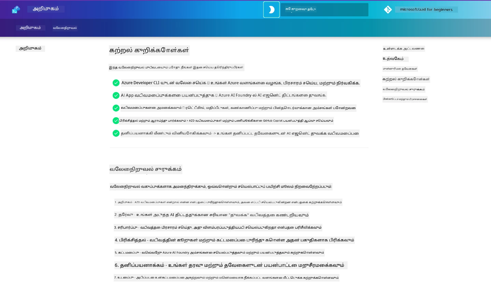

<div align="center">
  <div style="background: linear-gradient(135deg, #0078d4, #106ebe); border-radius: 10px; padding: 20px; margin: 20px 0; box-shadow: 0 4px 15px rgba(0, 120, 212, 0.3); border: 2px solid #005a9e;">
    <h2 style="color: white; margin: 0; font-size: 24px; text-shadow: 1px 1px 2px rgba(0,0,0,0.3);">
      🎯 AZD for AI Developers Workshop
    </h2>
    <p style="color: white; margin: 10px 0 0 0; font-size: 16px; text-shadow: 1px 1px 2px rgba(0,0,0,0.3);">
      <strong>Azure Developer CLI-ஐப் பயன்படுத்தி AI பயன்பாடுகளை உருவாக்கும் கையேடுHands-on பயிற்சி.</strong><br>
      AZD டெம்ப்ளேட்கள் மற்றும் AI வெளியீட்டு பணியெழுத்துக்களை ஆளுநர் செய்வதற்கான 7 மாட்யூல்களை முடிக்கவும்.
    </p>
    <div style="margin-top: 15px;">
      <span style="background: rgba(255,255,255,0.2); padding: 5px 10px; border-radius: 15px; color: white; font-size: 14px;">
        📅 சமீபத்திய புதுப்பிப்பு: பிப்ரவரி 2026
      </span>
    </div>
  </div>
</div>

# AZD for AI Developers Workshop

Azure Developer CLI (AZD) ஐப் பற்றி கற்றுக்கொள்ளும் இந்த செயலில் ஈடுபடும் பயிற்சிக்கு வருகை. இந்த பயிற்சி AZD டெம்ப்ளேட்களை 3 படிகள் மூலம் நடைமுறை அறிவாக கற்றுக் கொடுக்க உதவுகிறது:

1. **Discovery** - உங்களுக்கு பொருத்தமான டெம்ப்ளேட்டை கண்டுபிடிக்கவும்.
1. **Deployment** - வெளியிடி அதை செயற்படுகிறதா என்று உறுதிசெய்க
1. **Customization** - மாற்றம் செய்து உங்கள் தேவைக்கு ஏற்ப திருத்தி மீண்டும் முயற்சி செய்யுங்கள்!

இந்த பயிற்சி முழுவதும், முக்கிய டெவலப்பர் கருவிகள் மற்றும் பணியெழுத்துக்களையும் அறிமுகப்படுத்துவோம், உங்கள் முன் முதல் முடிந்த வரை உள்ள மேம்பாட்டு பயணத்தை எளிதாக்க உதவும்.

<br/>

## Browser-Based Guide

பயிற்சி பாடங்கள் Markdown இல் உள்ளன. நீங்கள் அவற்றை நேரடியாக GitHub-இல் வழிசெலுத்தலாம் - அல்லது கீழே உள்ள ஸ்க்ரீன்ஷாட்டில் காட்டப்படுள்ள போல ஒரு உலாவி அடிப்படையிலான முன்னோட்டத்தை துவங்கலாம்.



இந்த விருப்பத்தை பயன்படுத்த - கோத் உருப்படியை உங்கள் ப்ரொஃபைலுக்கு fork செய்து, GitHub Codespaces-ஐ துவங்கவும். VS Code டெர்மினல் செயல்படும்போது, இந்த கட்டளையை تایப் செய்யவும்:

```bash title="" linenums="0"
mkdocs serve > /dev/null 2>&1 &
```

ஒரு சில விநாடிகளுக்குள், ஒரு pop-up உரையாடல் தோன்றும். `Open in browser` என்ற விருப்பத்தை தேர்ந்தெடுக்கவும். இணைய அடிப்படையிலான கையேடு ஒரு புதிய உலாவி தாவலில் திறக்கப்படும். இந்த முன்னோட்டத்தின் சில நன்மைகள்:

1. **உள்ளகத் தேடல்** - விரைவில் சொல்லற்தொடர்கள் அல்லது பாடங்களை கண்டுபிடிக்கவும்.
1. **நகல் ஐகான்** - குறியீடு தொகுதிகளில் மீது ஊடுருவி இந்த விருப்பத்தை காணலாம்
1. **தீம் மாறுதல்** - இருண்ட மற்றும் ஒளிர் தீம்களுக்கு இடையே மாறுங்கள்
1. **உதவி பெறவும்** - காலடி பகுதியில் உள்ள Discord ஐகானை கிளிக் செய்து இணையுங்கள்!

<br/>

## Workshop Overview

**காலம்:** 3-4 hours  
**தரம்:** தொடக்கநிலையிலிருந்து இடைநிலைக்까지  
**முன்னேற்பாடு:** Azure, AI கருத்துக்கள், VS Code மற்றும் கட்டளை வரிசை கருவிகள் பற்றிய பரிச்சயம்.

இது செயலில் ஈடுபடும் பயிற்சி; செய்கிறதன் மூலம் நீங்கள் கற்றுக்கொள்வீர்கள். பயிற்சி பயிற்சிகள் முடிந்தவுடன், உங்கள் பயிற்சிப் பயணத்தை பாதுகாப்பு மற்றும் விளைவுத்திறன் சிறந்த நடைமுறைகள் நோக்கி தொடர AZD For Beginners பாடநெறியை மீள் ஆய்வு செய்வதை நாங்கள் பரிந்துரைக்கிறோம்.

| நேரம்| மாட்யூல்  | நோக்கம் |
|:---|:---|:---|
| 15 mins | [அறிமுகம்](docs/instructions/0-Introduction.md) | சூழலை அமைத்து, குறிக்கோள்களை புரிந்துகொள்ளுங்கள் |
| 30 mins | [AI டெம்ப்ளேட் தேர்வு](docs/instructions/1-Select-AI-Template.md) | விருப்பங்களை ஆராய்ந்து தொடக்கத்தை தேர்ந்தெடுக்கவும் | 
| 30 mins | [AI டெம்ப்ளேட் சரிபார்த்து வெளியிடல்](docs/instructions/2-Validate-AI-Template.md) | இயல்புநிலை தீர்வை Azure இல் வெளியிடவும் |
| 30 mins | [AI டெம்ப்ளேட்டை பிரித்தறிதல்](docs/instructions/3-Deconstruct-AI-Template.md) | கட்டமைப்பு மற்றும் உள்ளமைப்புகளை ஆராய்க |
| 30 mins | [AI டெம்ப்ளேட்டை கட்டமைக்கவும்](docs/instructions/4-Configure-AI-Template.md) | கிடைக்கும் அம்சங்களை இயக்கு மற்றும் முயற்சி செய்யுங்கள் |
| 30 mins | [AI டெம்ப்ளேட்டை தனிப்பயனாக்குதல்](docs/instructions/5-Customize-AI-Template.md) | உங்கள் தேவைக்கு ஏற்ப டெம்ப்ளேட்டை ஒத்துப்போடுங்கள் |
| 30 mins | [அடகஇந்த அமைப்பை நீக்குதல்](docs/instructions/6-Teardown-Infrastructure.md) | வளங்களை சுத்தம் செய்து விடுவிக்கவும் |
| 15 mins | [சுருக்கம் & அடுத்த படிகள்](docs/instructions/7-Wrap-up.md) | கற்பதற்கான வளங்கள், பயிற்சி சவால் |

<br/>

## What You'll Learn

AZD டெம்ப்ளேட்டை Microsoft Foundry-இல் முதலிலிருந்து இறுதி வரை மேம்பாட்டு திறன்களை ஆராய ஒரு கற்றல் sandbox-ஆக நினைத்துக் கொள்ளுங்கள். இந்த பயிற்சி முடிவிற்குள், நீங்கள் இந்த சூழலில் பல கருவிகள் மற்றும் கருத்துக்களை உணர்வூட்டத்தன்மையோடு புரிந்துகொள்வீர்கள்.

| கருத்து  | நோக்கம் |
|:---|:---|
| **Azure Developer CLI** | கருவியின் கட்டளைகள் மற்றும் பணியெழுத்து நடைமுறைகளை புரிந்துகொள்ளுதல் |
| **AZD Templates**| திட்டத்தின் கட்டமைப்பு மற்றும் உள்ளமைவை புரிந்துகொள்ளுதல் |
| **Azure AI Agent**| Microsoft Foundry திட்டத்தை உருவாக்கி வெளியிடுதல்  |
| **Azure AI Search**| எஜன்ட்களுடன் சூழல் பொறியியல் செயல்படுத்துதல் |
| **Observability**| வழித்தட கண்காணிப்பு, மானிடரிங் மற்றும் மதிப்பீடுகளை ஆராய்தல் |
| **Red Teaming**| எதிர்த்தரப்பு சோதனைகள் மற்றும் தடுப்பு நடைமுறைகளை ஆராய்தல் |

<br/>

## Workshop Structure

பயிற்சி டெம்ப்ளேட் கண்டறிதலை துவங்கி, வெளியீடு, பிரித்தறிதல் மற்றும் தனிப்பயனாக்கம் வரை ஒரு பயணமாக அமைக்கப்பட்டுள்ளது - அதிகாரப்பூர்வமான [AI ஏஜன்ட்களுடன் துவங்குதல்](https://github.com/Azure-Samples/get-started-with-ai-agents) ஸ்டார்டர் டெம்ப்ளேட்டை அடிப்படையாகக் கொண்டு.

### [மாட்யூல் 1: AI டெம்ப்ளேட் தேர்வு](docs/instructions/1-Select-AI-Template.md) (30 mins)

- AI டெம்ப்ளேட்ஸ் என்பவை என்ன?
- AI டெம்ப்ளேட்களை எங்கு காணலாம்?
- AI ஏஜன்ட்களை உருவாக்க எவ்வாறு துவங்க வேண்டும்?
- **பயிற்சி:** GitHub Codespaces உடன் விரைவு துவக்கம்

### [மாட்யூல் 2: AI டெம்ப்ளேட் சரிபார்த்தல்](docs/instructions/2-Validate-AI-Template.md) (30 mins)

- AI டெம்ப்ளேட் கட்டமைப்பு என்ன?
- AZD மேம்பாட்டு பணியெழுத்து என்ன?
- AZD மேம்பாட்டில் உதவி எங்கு கிடைக்கிறது?
- **பயிற்சி:** AI ஏஜன்ட்கள் டெம்ப்ளேட்டை வெளியிட்டு சரிபார்க்கவும்

### [மாட்யூல் 3: AI டெம்ப்ளேட்டை பிரித்தறிதல்](docs/instructions/3-Deconstruct-AI-Template.md) (30 mins)

- உங்கள் சூழலை `.azure/` இல் ஆராய்க 
- உங்கள் வள அமைப்பை `infra/` இல் ஆராய்க 
- உங்கள் AZD கட்டமைப்பை `azure.yaml`s இல் ஆராய்க
- **பயிற்சி:** சுற்றுப்புற மாறிலிகள் மாற்றம் செய்து மீண்டும் வெளியிடுதல்

### [மாட்யூல் 4: AI டெம்ப்ளேட்டை கட்டமைக்கவும்](docs/instructions/4-Configure-AI-Template.md) (30 mins)
- ஆய்வு: Retrieval Augmented Generation
- ஆய்வு: Agent Evaluation & Red Teaming
- ஆய்வு: Tracing & Monitoring
- **பயிற்சி:** AI ஏஜன்ட் + Observability ஐ ஆராய்தல்

### [மாட்யூல் 5: AI டெம்ப்ளேட்டை தனிப்பயனாக்குதல்](docs/instructions/5-Customize-AI-Template.md) (30 mins)
- வரையறு: PRD உடன் நிகழ்வு தேவைகள்
- கட்டமைக்கவும்: AZD இற்கான சூழல் மாறிலிகள்
- அமல்படுத்தவும்: கூடுதல் பணிகளுக்கான Lifecycle Hooks
- **பயிற்சி:** என் сценарிக்கு (scenario) ஏற்ப டெம்ப்ளேட்டை தனிப்பயனாக்குதல்

### [மாட்யூல் 6: அடகஇந்த அமைப்பை நீக்குதல்](docs/instructions/6-Teardown-Infrastructure.md) (30 mins)
- மீள்பார்வை: AZD டெம்ப்ளேட்கள் என்றால் என்ன?
- மீள்பார்வை: ஏன் Azure Developer CLI பயன்படுத்த வேண்டும்?
- அடுத்த படிகள்: வேறு ஒரு டெம்ப்ளேட்டை முயற்சி செய்!
- **பயிற்சி:** வளங்களை நீக்கி சுத்தம் செய்யுதல்

<br/>

## Workshop Challenge

மேலும் சவால் எடுக்க விரும்புகிறீர்களா? இங்கே சில திட்ட பரிந்துரைகள் - அல்லது உங்கள் எண்ணங்களை எங்களுடன் பகிருங்கள்!!

| Project | Description |
|:---|:---|
|1. **ஒரு சிக்கலான AI டெம்ப்ளேட்டை பிரித்தறிதல்** | நாங்கள் குறிப்பிட்ட பணியெழுத்துகளையும் கருவிகளையும் பயன்படுத்தி, வேறு ஒரு AI தீர்வு டெம்ப்ளேட்டை நீங்கள் வெளியிட்டு, சரிபார்த்து, தனிப்பயனாக்க முடியுமா என்பதை பாருங்கள். _நீங்கள் என்ன கற்றுக்கொண்டீர்கள்?_|
|2. **உங்கள் நிகழ்வுக்கு ஏற்ப தனிப்பயனாக்குதல்**  | வேறு ஒரு senario-க்கான PRD (Product Requirements Document) ஐ எழுத முயற்சிக்கவும். பின்னர் உங்கள் டெம்ப்ளேட் ரெப்போவில் GitHub Copilot-ஐ Agent Model இல் பயன்படுத்தி, அது உங்கள் үшін ஒரு தனிப்பயனாக்கும் பணியெழுத்தை உருவாக்குமாறு கேளுங்கள். _நீங்கள் என்ன கற்றுக்கொண்டீர்கள்? இந்த பரிந்துரைகளை எப்படி மேம்படுத்தலாம்?_|
| | |

## கருத்துக்கள் உள்ளதா?

1. இந்த ரெப்போவில் ஒரு issue பதிவிடுங்கள் - வசதிக்காக அதை `Workshop` என tag செய்யுங்கள்.
1. Microsoft Foundry Discord-ல் சேர்ந்துகொண்டு உங்கள் சகபாடர்களுடன் இணைக்கவும்!


| | | 
|:---|:---|
| **📚 பாடநெறி முகப்பு**| [AZD For Beginners](../README.md)|
| **📖 ஆவணங்கள்** | [AI டெம்ப்ளேட்டுகளுடன் துவக்கம்](https://learn.microsoft.com/en-us/azure/ai-foundry/how-to/develop/ai-template-get-started)|
| **🛠️ AI டெம்ப்ளேடுகள்** | [Microsoft Foundry Templates](https://ai.azure.com/templates) |
|**🚀 அடுத்த படிகள்** | [பயிற்சியை தொடங்கு](../../../workshop) |
| | |

<br/>

---

**Navigation:** [Main Course](../README.md) | [அறிமுகம்](docs/instructions/0-Introduction.md) | [மாட்யூல் 1: AI டெம்ப்ளேட் தேர்வு](docs/instructions/1-Select-AI-Template.md)

**AZD உடன் AI பயன்பாடுகளை உருவாக்கத் தொடங்க தயார் உள்ளீர்களா?**

[பயிற்சியை தொடங்கு: அறிமுகம் →](docs/instructions/0-Introduction.md)

---

<!-- CO-OP TRANSLATOR DISCLAIMER START -->
மறுப்பு அறிவிப்பு:
இந்த ஆவணம் AI மொழிபெயர்ப்பு சேவையான Co-op Translator (https://github.com/Azure/co-op-translator) மூலம் மொழிபெயர்க்கப்பட்டது. நாங்கள் துல்லியத்திற்காக முயற்சித்தாலும், தானாக செய்யப்பட்ட மொழிபெயர்ப்புகளில் பிழைகள் அல்லது தவறுகள் இருக்க வாய்ப்பு உள்ளது என்பதைத் தயவுசெய்து கவனியுங்கள். அசல் ஆவணம் அதன் சொந்த மொழியில் அதிகாரப்பூர்வ மூலமாக கருதப்பட வேண்டும். மிக முக்கியமான தகவல்களுக்கு, தொழில்முறை மனித மொழிபெயர்ப்பு பரிந்துரைக்கப்படுகிறது. இந்த மொழிபெயர்ப்பைப் பயன்படுத்துவதால் ஏற்படும் எந்தவொரு தவறுபாடு அல்லது தவறான விளக்கங்களுக்காகவும் நாங்கள் பொறுப்பேற்கமாட்டோம்.
<!-- CO-OP TRANSLATOR DISCLAIMER END -->