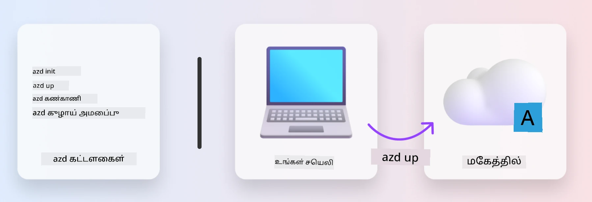
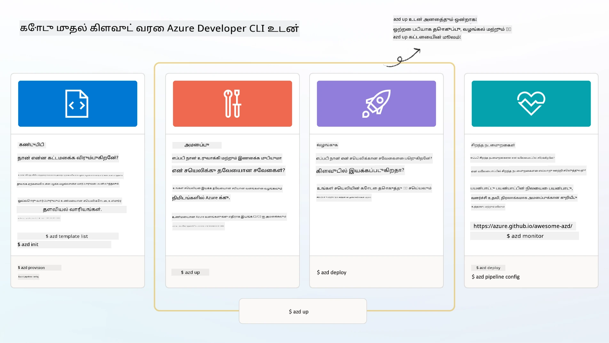

# 1. ஒரு டெம்ப்ளேட்டை தேர்ந்தெடுக்கவும்

!!! tip "இந்த தொகுதியின் முடிவில் நீங்கள் செய்யக்கூடியவை"

    - [ ] AZD டெம்ப்ளேட்டுகள் என்ன என்பதை விளக்கவும்
    - [ ] AZD டெம்ப்ளேட்டுகளை கண்டறிந்து, AI க்காக பயன்படுத்தவும்
    - [ ] AI ஏஜென்ட் டெம்ப்ளேட்டை தொடங்கவும்
    - [ ] **பயிற்சி 1:** GitHub Codespaces உடன் AZD குவிக்ஸ்டார்ட்

---

## 1. ஒரு கட்டுமான உவமை

ஒரு நவீன நிறுவனத்திற்கேற்ப AI பயன்பாட்டை _தொடக்கத்திலிருந்து_ உருவாக்குவது கடினமானதாக இருக்கலாம். இது உங்கள் புதிய வீட்டை செங்கற்களால் கட்டுவது போலவே இருக்கும். ஆம், அதைச் செய்ய முடியும்! ஆனால், இது விரும்பிய முடிவை அடைவதற்கான மிகச் சிறந்த வழி அல்ல!

அதற்கு பதிலாக, நாம் பொதுவாக ஒரு _வடிவமைப்பு வரைபடத்துடன்_ தொடங்குகிறோம், அதை நம் தனிப்பட்ட தேவைகளுக்கு ஏற்ப மாற்றுவதற்காக ஒரு கட்டிடக் கலைஞருடன் பணியாற்றுகிறோம். புத்திசாலித்தனமான பயன்பாடுகளை உருவாக்கும் போது இதுவே சரியான அணுகுமுறையாகும். முதலில், உங்கள் பிரச்சினை இடத்திற்கு பொருத்தமான ஒரு நல்ல வடிவமைப்பு கட்டமைப்பைத் தேடுங்கள். பின்னர், ஒரு தீர்வு கட்டமைப்பாளருடன் பணியாற்றி, உங்கள் குறிப்பிட்ட சூழ்நிலைக்கு ஏற்ப அதை தனிப்பயனாக்கவும்.

ஆனால், இந்த வடிவமைப்பு வரைபடங்களை எங்கு கண்டுபிடிக்கலாம்? மேலும், இந்த வரைபடங்களை தனிப்பயனாக்கி, தானாகவே பயன்படுத்த கற்றுக்கொடுக்க விரும்பும் ஒரு கட்டமைப்பாளரை எவ்வாறு கண்டுபிடிப்பது? இந்த பணிமனையில், இந்த கேள்விகளுக்கு பதிலளிக்க, உங்களுக்கு மூன்று தொழில்நுட்பங்களை அறிமுகப்படுத்துகிறோம்:

1. [Azure Developer CLI](https://aka.ms/azd) - உள்ளூர் மேம்பாட்டிலிருந்து (build) மேகத்தில் வெளியீடு (ship) செல்லும் வளர்ச்சியாளர் பாதையை வேகமாக்கும் ஒரு திறந்த மூல கருவி.
1. [Azure AI Foundry Templates](https://ai.azure.com/templates) - AI தீர்வு கட்டமைப்பை வெளியிட மாதிரி குறியீடு, உள்கட்டமைப்பு மற்றும் கட்டமைப்பு கோப்புகளை கொண்ட தரநிலையான திறந்த மூல களஞ்சியங்கள்.
1. [GitHub Copilot Agent Mode](https://code.visualstudio.com/docs/copilot/chat/chat-agent-mode) - Azure அறிவில் அடிப்படையாகக் கொண்ட ஒரு குறியீட்டு ஏஜென்ட், இது குறியீட்டு அடிப்படையை வழிநடத்தவும், மாற்றங்களை செய்யவும் இயற்கை மொழியைப் பயன்படுத்தி வழிகாட்டவும் உதவுகிறது.

இந்த கருவிகளைப் பயன்படுத்தி, சரியான டெம்ப்ளேட்டை _கண்டறியவும்_, அது செயல்படுகிறதா என்பதை உறுதிப்படுத்த _வெளியிடவும்_, உங்கள் குறிப்பிட்ட சூழ்நிலைகளுக்கு _தனிப்பயனாக்கவும்_ முடியும். இப்போது இவை எப்படி செயல்படுகிறது என்பதைப் பார்ப்போம்.

---

## 2. Azure Developer CLI

[Azure Developer CLI](https://learn.microsoft.com/en-us/azure/developer/azure-developer-cli/) (அல்லது `azd`) என்பது ஒரு திறந்த மூல கட்டளை வரி கருவி ஆகும், இது உங்கள் குறியீடு முதல் மேக வெளியீடு வரை பயணத்தை வேகமாக்குகிறது. இது உங்கள் IDE (மேம்பாடு) மற்றும் CI/CD (devops) சூழல்களில் ஒரே மாதிரியான கட்டளைகளுடன் செயல்படுகிறது.

`azd` உடன், உங்கள் வெளியீட்டு பயணம் எளிமையாக இருக்கலாம்:

- `azd init` - ஏற்கனவே உள்ள AZD டெம்ப்ளேட்டிலிருந்து புதிய AI திட்டத்தைத் தொடங்குகிறது.
- `azd up` - உள்கட்டமைப்பை உருவாக்கி, உங்கள் பயன்பாட்டை ஒரே கட்டத்தில் வெளியிடுகிறது.
- `azd monitor` - வெளியிடப்பட்ட பயன்பாட்டிற்கான நேரடி கண்காணிப்பு மற்றும் பிழைதிருத்தங்களைப் பெறுங்கள்.
- `azd pipeline config` - Azure க்கு வெளியீட்டை தானியங்கி செய்ய CI/CD குழாய்களை அமைக்கவும்.

**🎯 | பயிற்சி**: <br/> உங்கள் GitHub Codespaces சூழலில் `azd` கட்டளை வரி கருவியை ஆராயுங்கள். இந்த கட்டளையைத் தட்டச்சு செய்வதன் மூலம் கருவி என்ன செய்ய முடியும் என்பதைப் பாருங்கள்:

```bash title="" linenums="0"
azd help
```



---

## 3. AZD டெம்ப்ளேட்

`azd` இதைச் செய்ய, அது எந்த உள்கட்டமைப்பை உருவாக்க வேண்டும், எந்த கட்டமைப்பு அமைப்புகளை அமல்படுத்த வேண்டும், மற்றும் எந்த பயன்பாட்டை வெளியிட வேண்டும் என்பதைத் தெரிந்துகொள்ள வேண்டும். இதுவே [AZD டெம்ப்ளேட்டுகள்](https://learn.microsoft.com/en-us/azure/developer/azure-developer-cli/azd-templates?tabs=csharp) முக்கியமானது.

AZD டெம்ப்ளேட்டுகள் திறந்த மூல களஞ்சியங்கள் ஆகும், அவை மாதிரி குறியீடு, உள்கட்டமைப்பு மற்றும் தீர்வு கட்டமைப்பை வெளியிட தேவையான கட்டமைப்பு கோப்புகளை இணைக்கின்றன.  
_உள்கட்டமைப்பு-குறியீடு_ (IaC) அணுகுமுறையைப் பயன்படுத்துவதன் மூலம், அவை டெம்ப்ளேட் வளங்களின் வரையறைகள் மற்றும் கட்டமைப்பு அமைப்புகளை பதிப்பு கட்டுப்பாட்டில் வைத்திருக்க அனுமதிக்கின்றன (பயன்பாட்டு மூலக் குறியீட்டைப் போலவே) - அந்த திட்டத்தின் பயனர்களுக்கு இடையே மீண்டும் பயன்படுத்தக்கூடிய மற்றும் ஒரே மாதிரியான பணியாற்றும் முறைகளை உருவாக்குகின்றன.

உங்கள் சூழலுக்கான AZD டெம்ப்ளேட்டை உருவாக்கும்போது அல்லது மீண்டும் பயன்படுத்தும்போது, இந்த கேள்விகளை பரிசீலிக்கவும்:

1. நீங்கள் என்ன உருவாக்குகிறீர்கள்? → அந்த சூழலுக்கான தொடக்கக் குறியீடு கொண்ட டெம்ப்ளேட் உள்ளதா?
1. உங்கள் தீர்வு எப்படி கட்டமைக்கப்பட்டுள்ளது? → தேவையான வளங்களைக் கொண்ட டெம்ப்ளேட் உள்ளதா?
1. உங்கள் தீர்வு எப்படி வெளியிடப்படுகிறது? → `azd deploy` உடன் முன்/பின் செயலாக்க ஹுக்குகளை நினைவில் கொள்ளுங்கள்!
1. அதை மேலும் எவ்வாறு மேம்படுத்தலாம்? → உள்ளமைக்கப்பட்ட கண்காணிப்பு மற்றும் தானியக்க குழாய்களை நினைவில் கொள்ளுங்கள்!

**🎯 | பயிற்சி**: <br/> 
[Awesome AZD](https://azure.github.io/awesome-azd/) கேலரியை பார்வையிடவும், தற்போது கிடைக்கும் 250+ டெம்ப்ளேட்டுகளை ஆராய்வதற்கு வடிகட்டிகளைப் பயன்படுத்தவும். உங்கள் சூழல் தேவைகளுக்கு பொருந்தக்கூடிய ஒன்றை கண்டுபிடிக்க முயற்சிக்கவும்.



---

## 4. AI பயன்பாட்டு டெம்ப்ளேட்டுகள்

---

**குறிப்பு**:  
இந்த ஆவணம் [Co-op Translator](https://github.com/Azure/co-op-translator) என்ற AI மொழிபெயர்ப்பு சேவையைப் பயன்படுத்தி மொழிபெயர்க்கப்பட்டுள்ளது. நாங்கள் துல்லியத்திற்காக முயற்சிக்கின்றோம், ஆனால் தானியங்கி மொழிபெயர்ப்புகளில் பிழைகள் அல்லது தவறுகள் இருக்கக்கூடும் என்பதை தயவுசெய்து கவனத்தில் கொள்ளுங்கள். அதன் தாய்மொழியில் உள்ள மூல ஆவணம் அதிகாரப்பூர்வ ஆதாரமாக கருதப்பட வேண்டும். முக்கியமான தகவல்களுக்கு, தொழில்முறை மனித மொழிபெயர்ப்பு பரிந்துரைக்கப்படுகிறது. இந்த மொழிபெயர்ப்பைப் பயன்படுத்துவதால் ஏற்படும் எந்த தவறான புரிதல்கள் அல்லது தவறான விளக்கங்களுக்கு நாங்கள் பொறுப்பல்ல.