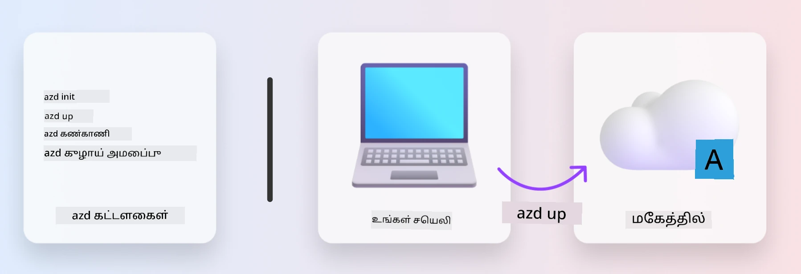
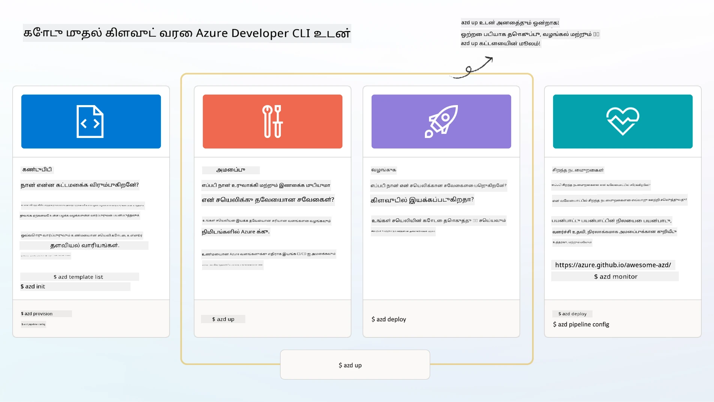

# 1. ஒரு மாதிரியை தேர்வு செய்யவும்

!!! tip "இந்த பயிற்சி தொகுதியின் முடிவில் நீங்கள் முடியும்:"

    - [ ] AZD மாதிரிகள் பற்றி விவரிக்கவும்
    - [ ] AI-க்கான AZD மாதிரிகளை கண்டுபிடித்து பயன்படுத்தவும்
    - [ ] AI ஏஜெண்ட்ஸ் மாதிரியை தொடங்கவும்
    - [ ] **Lab 1:** Codespaces அல்லது dev container-இல் AZD க்விக்‌ஸ்டார்ட்

---

## 1. ஒரு கட்டுமான ஒப்புமை

மூலமாக இருந்து ஒரு நவீன, நிறுவனத்திற்குத் தயாராக உள்ள AI செயலியை கட்டமைப்பது பயங்கரமாக இருக்கலாம். உங்கள் புதிய வீடுகளை தனக்கே, அடுக்கு அடுக்காகச் சுவரடிந்தோடு கட்டுவது போன்று அதுவும் கொஞ்சம் அதே மாதிரி. ஆம், அது செய்யக்கூடியது! ஆனால் அது விருப்பமான இறுதி விளைவைப் பெறுவதற்கு மிகவும் பயனுள்ள வழி இல்லை!

பதிலாக, நாம் பெரும்பாலும் ஏற்கெனவே உள்ள ஒரு _வடிவமைப்பு வரைபடம்_ கொண்டு தொடங்கி, அதை நமது தனிப்பட்ட தேவைகளுக்கு ஏற்ப மாற்றுவதற்கு ஒரு கட்டடக்காரருடன் (architect) வேலை செய்வோம். புத்திவாய்ந்த செயலிகள் உருவாக்கும்போது இதே அணுகுமுறை சரியானது. முதலில், உங்கள் பிரச்சினை இடத்திற்கு பொருத்தமான நல்ல வடிவமைப்பு சுருக்கத்தை கண்டறியுங்கள். பின்னர், உங்கள் குறிப்பிட்ட сценарிக்கு தீர்வை தனிப்பயனாக்கவும் உருவாக்கவும் ஒரு சலூஷன் ஆர்கிடெக்ட்டுடன் வேலை செய்யுங்கள்.

ஆனால் இந்த வடிவமைப்பு வரைபடங்களை எங்கு கண்டுபிடிக்கலாம்? மேலும், இந்த வரைபடங்களை எப்படி தனக்கே நமது முறையில் மாற்றி வெளியிடுவது என்று கற்பிக்க தயாராக இருக்கும் ஒரு ஆர்கிடெக்ட்டை எங்கே காணலாம்? இந்த workshop-இல், நாம் அந்த கேள்விகளுக்கு பதில் அளிக்கபோகிறோம் மற்றும் மூன்று தொழில்நுட்பங்களை அறிமுகப்படுத்துகிறோம்:

1. [Azure Developer CLI](https://aka.ms/azd) - உள்ளூரில் உருவாக்குதல் (build) முதல் மலைத்தளத்தில் வெளியீடு (ship) வரை டெவலப்பர் பாதையை விரைவுபடுத்தும் ஓபன்-சோர்ஸ் கருவி.
1. [Microsoft Foundry Templates](https://ai.azure.com/templates) - ஒரு AI தீர்வு கட்டமைப்பை despleய் செய்வதற்கு தேவையான மாதிரி குறியீடு, உள்சாய்வு மற்றும் கட்டமைப்பு கோப்புகளை உள்ளடக்கிய முறைமைபடுத்தப்பட்ட ஓபன்-சோர்ஸ் ரெப்போஸிடரிகள்.
1. [GitHub Copilot Agent Mode](https://code.visualstudio.com/docs/copilot/chat/chat-agent-mode) - Azure அறிவில் அடித்தளம்செய்யப்பட்ட, குறியீட்டு அடித்தளத்தை வழிசெய்யவும் மாற்றங்களைச் செய்ய வழிகாட்டும் இயல்பு மொழியை பயன்படுத்திய ஒரு கோடிங் ஏஜெண்ட்.

இந்த கருவிகள் கையிலிருந்தால், நாம் சரியான மாதிரியை _கண்டுபிடிக்க_, அது வேலை செய்கிறதா என்பதை உறுதிப்படுத்த _deploy_ செய்ய, மற்றும் நமது குறிப்பிட்ட сценарிகளுக்கு ஏற்ப _தனிப்பயனாக்க_ செய்ய முடியும். இதைப் பற்றி நம்மால் ஆராய்வோம் மற்றும் அவை எப்படி செயல்படுகின்றன என்பதை கற்றுக்கொள்ளுங்கள்.


---

## 2. Azure Developer CLI

[Azure Developer CLI](https://learn.microsoft.com/en-us/azure/developer/azure-developer-cli/) (அல்லது `azd`) என்பது உங்கள் குறியீட்டிலிருந்து கிளவுட் வரை பயணத்தை வேகப்படுத்தக்கூடிய, IDE (development) மற்றும் CI/CD (devops) சூழல்களில் ஒரே மாதிரியாக செயல்படும் டெவலப்பர்-বন্ধுச்செய்யும் கட்டளைகள் தொகுப்புள்ள ஓபன்-சோர்ஸ் கமாண்ட்-லைன் கருவி ஆகும்.

`azd` உடன், உங்கள் deployment பயணம் இதுபோல எளிமையாக இருக்கலாம்:

- `azd init` - ஏற்கெனவே உள்ள AZD மாதிரியிலிருந்து புதிய AI திட்டத்தை துவக்குகிறது.
- `azd up` - கட்டமைப்புகளை ஏற்படுத்தி உங்கள் செயலியை ஒரே படியில் deploy செய்கிறது.
- `azd monitor` - உங்கள் deploy செய்யப்பட்ட செயலிக்கான நேரடி கண்காணிப்பு மற்றும் டையக்னோஸ்டிக்ஸை பெறவும்.
- `azd pipeline config` - Azure-க்கு தானாக deploy செய்ய CI/CD பைப்லைன்களை அமைக்கவும்.

**🎯 | EXERCISE**: <br/> தங்கள் தற்போதைய workshop சூழலில் `azd` கமாண்ட்-லைன் கருவியை இப்போதே ஆராயுங்கள். இது GitHub Codespaces, ஒரு dev container, அல்லது தேவையான முன்நிபுணத்துடன் உள்ள ஒரு உள்ளூரி கிளோன் இருக்கலாம். கருவி என்ன செய்யும் என்பதை காணும் விதமாக இந்தக் கட்டளையை টাইப் செய்வதிலிருந்து துவங்குங்கள்:

```bash title="" linenums="0"
azd help
```



---

## 3. The AZD Template

`azd` இதனை இடைநிறுத்த உதவ, எந்த கட்டமைப்புகளை provision செய்ய வேண்டும், அமுல்படுத்தவேண்டிய கட்டமைப்பு அமைப்புகள் என்ன, மற்றும் deploy செய்ய வேண்டிய செயலி எது என்பதை அறிந்திருத்தல் அவசியம். இதுவே [AZD templates](https://learn.microsoft.com/en-us/azure/developer/azure-developer-cli/azd-templates?tabs=csharp) பயன்படும் இடம்.

AZD மாதிரிகள் மாதிரி குறியீடு மற்றும் தீர்வு கட்டமைப்பை deploy செய்ய தேவையான உள்கட்டமைப்பு மற்றும் கட்டமைப்பு கோப்புகளை ஒருங்கிணைக்கின்ற ஓபன்-சோர்ஸ் ரெப்போஸிடரிகளை ஆகும்.
_IaC_ (Infrastructure-as-Code) அணுகுமுறையைப் பயன்படுத்துவதன் மூலம், அவை டெம்ப்ளேட் வள வரையறைகள் மற்றும் கட்டமைப்பு அமைப்புகளை ஆவணப்படுத்தி (app source code போல) பதிப்புக்கட்டுப்பாட்டில் வைக்க அனுமதித்து, அந்த திட்டத்தின் பயனர்களுக்கு மீள்பயன்படக்கூடிய மற்றும் ஒரே மாதிரியான பணி முறைகளை உருவாக்குகின்றன.

உங்கள் பணிக்கு ஏற்ற AZD மாதிரியை உருவாக்க அல்லது மறுபயன்பாடு செய்யும்போது, இந்த கேள்விகளை பரிசீலியுங்கள்:

1. நீங்கள் 무엇을 கட்டுகிறீர்கள்? → அதற்கான தொடக்கக் குறியீடு உள்ள மாதிரி உள்ளதா?
1. உங்கள் தீர்வு எப்படி கட்டமைக்கப்பட்டுள்ளது? → தேவையான வளங்கள் உள்ள மாதிரி உள்ளதா?
1. உங்கள் தீர்வு எவ்வாறு deploy செய்யப்படுகிறது? → `azd deploy` உடன் முன்/பிறகு செயலாக்க ஹุก்ஸ் பற்றி நினைத்துக்கொள்ளுங்கள்!
1. இதை மேலும் எப்படி மேம்படுத்தலாம்? → கட்டமைக்கப்பட்ட கண்காணிப்பு மற்றும் தானியங்கி पाइப்லைன்களைப் பற்றி நினைத்துக் கொள்ளுங்கள்!

**🎯 | EXERCISE**: <br/> 
[Awesome AZD](https://azure.github.io/awesome-azd/) கலைவளத்தை பார்வையிடுங்கள் மற்றும் தற்போது கிடைக்கும் 250+ மாதிரிகளை ஆராயும் படி பில்டர்களைப் பயன்படுத்துங்கள். உங்கள் сценарிக்கு பொருத்தமானதை நீங்கள் கண்டுபிடிக்க முடிந்ததா என்பதை பார்க்கவும்.



---

## 4. AI App Templates

AI இயக்க இயங்குதள செயலிகளுக்காக, Microsoft **Microsoft Foundry** மற்றும் **Foundry Agents** ஆகியவற்றை உள்ளடக்கிய சிறப்பு மாதிரிகளை வழங்குகிறது. இந்த மாதிரிகள் புத்திவாய்ந்த, தயாரிப்பு-தரமான செயலிகள் கட்டுவதற்கு உங்கள் பாதையை வேகப்படுத்துகின்றன.

### Microsoft Foundry & Foundry Agents Templates

கீழே உள்ள மாதிரிகளில் ஒன்று தேர்வு செய்து deploy செய்யவும். ஒவ்வொரு மாதிரியும் [Awesome AZD](https://azure.github.io/awesome-azd/) இல் கிடைக்கின்றது மற்றும் ஒரு கட்டளையினால் ஆரம்பிக்க முடியும்.

| மாதிரி | விளக்கம் | செயல்படுத்தும் கட்டளை |
|----------|-------------|----------------|
| **[AI Chat with RAG](https://azure.github.io/awesome-azd/?tags=ai&tags=rag)** | Microsoft Foundry பயன்படுத்தி Retrieval Augmented Generation உடன் কথPatch செயலி | `azd init -t azure-samples/azure-search-openai-demo` |
| **[Foundry Agent Service Starter](https://azure.github.io/awesome-azd/?tags=ai&tags=agents)** | Foundry Agents கொண்டு சுய இயக்கிக்கூடிய பணி செயல்படுத்துவதற்கான AI ஏஜெண்ட்களை உருவாக்குதல் | `azd init -t azure-samples/foundry-agent-service-starter` |
| **[Multi-Agent Orchestration](https://azure.github.io/awesome-azd/?tags=ai&tags=agents)** | 복잡மான பணிசேர்க்கல்களுக்காக பல Foundry Agents-ஐ ஒருங்கிணைத்தல் | `azd init -t azure-samples/multi-agent-orchestration` |
| **[AI Document Intelligence](https://azure.github.io/awesome-azd/?tags=ai&tags=document)** | Microsoft Foundry மாடல்களுடன் ஆவணங்களை எடு்க மற்றும் பகுப்பாய்வு செய்யுதல் | `azd init -t azure-samples/ai-document-processing` |
| **[Conversational AI Bot](https://azure.github.io/awesome-azd/?tags=ai&tags=bot)** | Microsoft Foundry ஒருங்கிணைப்புடன் புத்திசாலி அரட்டைக் கருவிகள் (chatbots) கட்டமைத்தல் | `azd init -t azure-samples/ai-chat-protocol` |
| **[AI Image Generation](https://azure.github.io/awesome-azd/?tags=ai&tags=dalle)** | Microsoft Foundry மூலம் DALL-E பயன்படுத்தி படங்களை உருவாக்குதல் | `azd init -t azure-samples/ai-image-generation` |
| **[Semantic Kernel Agent](https://azure.github.io/awesome-azd/?tags=ai&tags=semantic-kernel)** | Foundry Agents உடன் Semantic Kernel பயன்படுத்தி AI ஏஜெண்ட்கள் | `azd init -t azure-samples/semantic-kernel-agent` |
| **[AutoGen Multi-Agent](https://azure.github.io/awesome-azd/?tags=ai&tags=autogen)** | AutoGen கட்டமைப்பைப் பயன்படுத்தி பல-ஏஜெண்ட் சிஸ்டம்கள் | `azd init -t azure-samples/autogen-multi-agent` |

### விரைவு தொடக்கம்

1. **மாதிரிகளை உலாவவும்**: [https://azure.github.io/awesome-azd/](https://azure.github.io/awesome-azd/) ஐ பார்வையிடுங்கள் மற்றும் `AI`, `Agents`, அல்லது `Microsoft Foundry` மூலம் பில்டர்கள் கொடுத்துப்பார்
2. **உங்கள் மாதிரியை தேர்வு செய்க**: உங்கள் பயன்பாட்டு வழக்கிற்கு பொருந்தும் ஒன்றை தேர்ந்தெடுக்கவும்
3. **துவக்கமாக அமைக்கவும்**: தேர்ந்தெடுத்த மாதிரிக்கு `azd init` கட்டளையை இயக்கவும்
4. **Deploy செய்க**: Provision செய்து deploy செய்ய `azd up` ஓட்டு

**🎯 | EXERCISE**: <br/>
உங்கள் сценарிக்கு ஏற்ப மேலே உள்ள மாதிரிகளில் ஒன்றை தேர்ந்தெடு:

- **சேட்‌பாட் கட்டுகிறீர்களா?** → **AI Chat with RAG** அல்லது **Conversational AI Bot**-இனால் துவங்குங்கள்
- **சுய இயக்க ஏஜெண்ட்கள் வேண்டும்?** → **Foundry Agent Service Starter** அல்லது **Multi-Agent Orchestration**-ஐ முயற்சி செய்யுங்கள்
- **ஆவணங்கள் செயலாக்கப்படுகிறதா?** → **AI Document Intelligence** ஐப் பயன்படுத்தவும்
- **AI கோடிங் உதவி வேண்டும்?** → **Semantic Kernel Agent** அல்லது **AutoGen Multi-Agent** ஐ கண்டு பாருங்கள்

```bash title="Example: Deploy the AI Chat with RAG template" linenums="0"
azd init -t azure-samples/azure-search-openai-demo
azd up
```

!!! info "மேலும் மாதிரிகளை ஆராய்க"
    The [Awesome AZD Gallery](https://azure.github.io/awesome-azd/) contains 250+ templates. Use the filters to find templates matching your specific requirements for language, framework, and Azure services.

---

<!-- CO-OP TRANSLATOR DISCLAIMER START -->
**மறுப்புரை**:
இந்த ஆவணம் AI மொழிபெயர்ப்பு சேவையான [Co-op Translator](https://github.com/Azure/co-op-translator) மூலம் மொழிபெயர்க்கப்பட்டுள்ளது. நாங்கள் துல்லியத்தன்மைக்காக முயலினாலும், தானியங்கி மொழிபெயர்ப்புகளில் தவறுகள் அல்லது துல்லியக்குறைவுகள் இருக்கக்கூடும் என்பதை தயவுசெய்து கவனிக்கவும். மூல ஆவணம் அதன் சொந்த மொழியிலேயே அதிகாரபூர்வ மூலமாக கருதப்பட வேண்டும். முக்கியமான தகவல்களுக்காக, தொழில்முறை மனித மொழிபெயர்ப்பு பரிந்துரைக்கப்படுகிறது. இந்த மொழிபெயர்ப்பின் பயன்பாட்டால் ஏற்பட்டுள்ள எந்த தவறான புரிதல்கள் அல்லது தவறான விளக்கங்களுக்கு நாங்கள் பொறுப்பேற்க மாட்டோம்.
<!-- CO-OP TRANSLATOR DISCLAIMER END -->