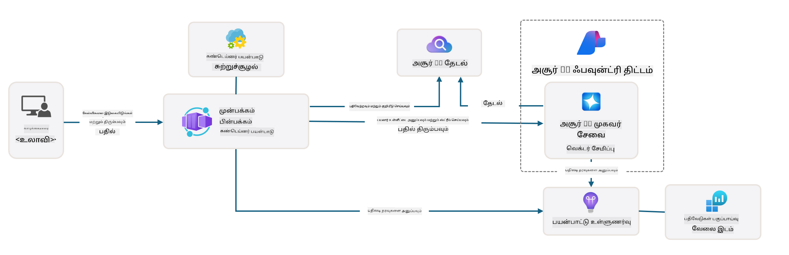
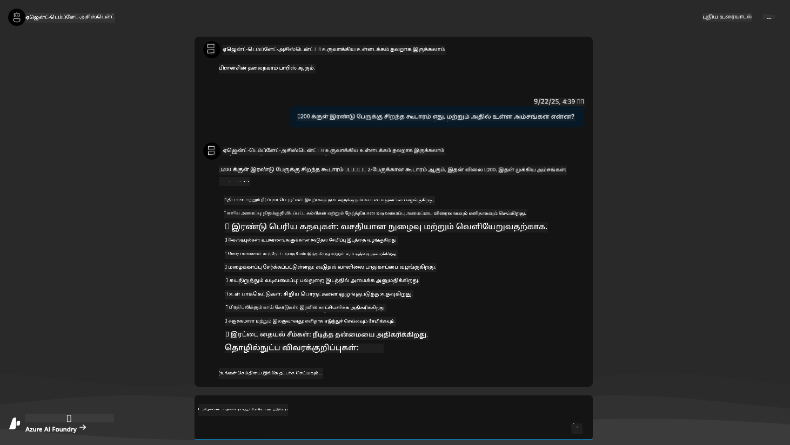
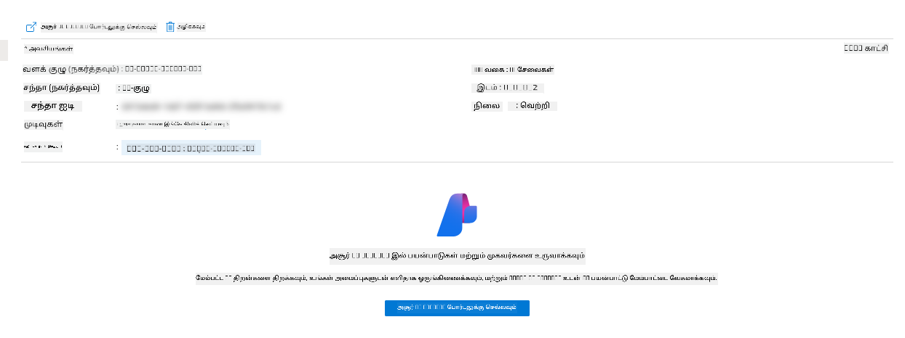
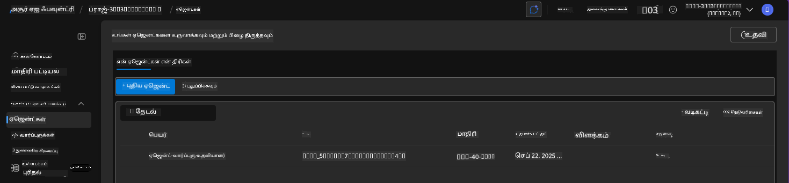
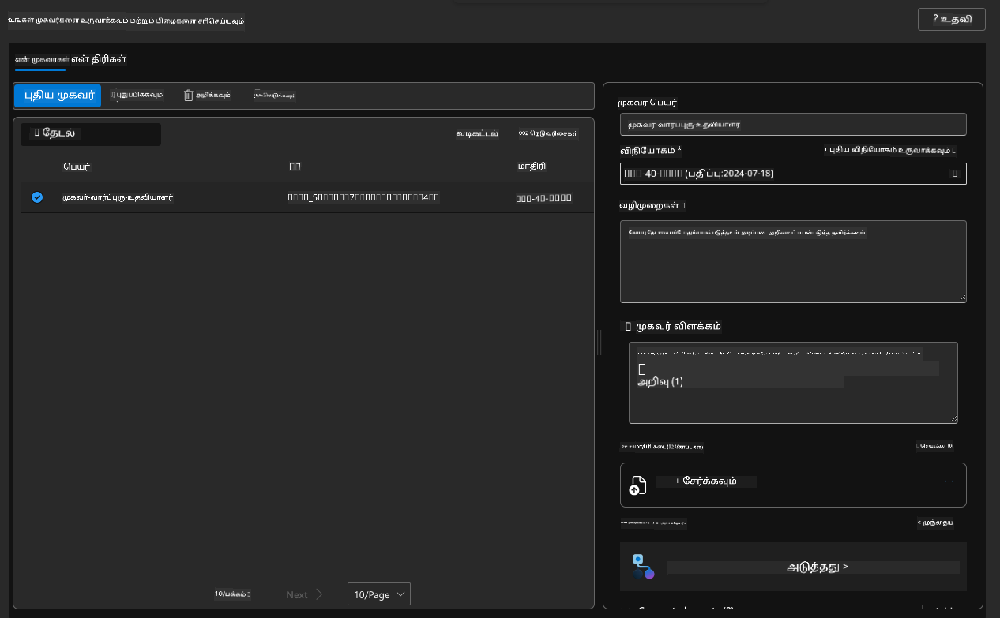
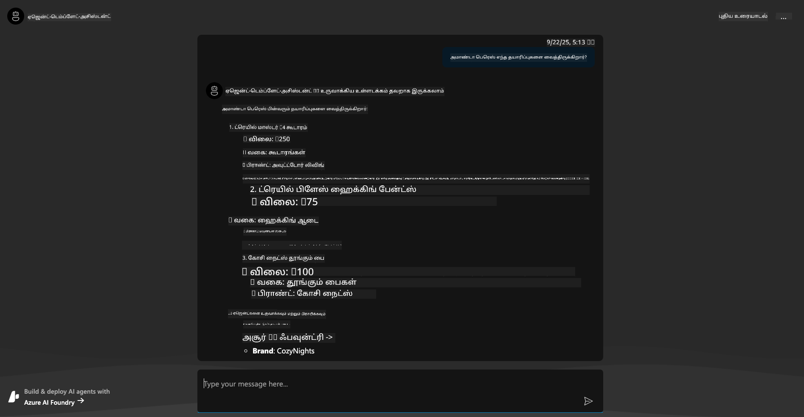
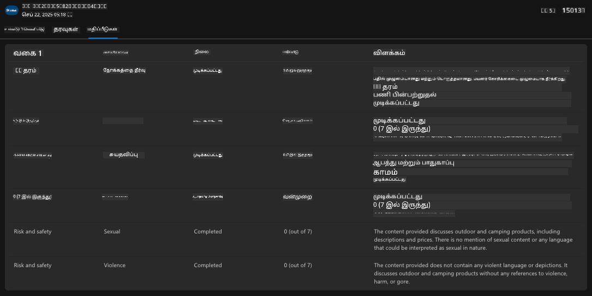

<!--
CO_OP_TRANSLATOR_METADATA:
{
  "original_hash": "7816c6ec50c694c331e7c6092371be4d",
  "translation_date": "2025-10-11T15:44:16+00:00",
  "source_file": "workshop/docs/instructions/2-Validate-AI-Template.md",
  "language_code": "ta"
}
-->
# 2. ஒரு டெம்ப்ளேட்டை சரிபார்க்கவும்

!!! tip "இந்த தொகுதியின் முடிவில் நீங்கள் செய்ய முடியும்"

    - [ ] AI தீர்வு கட்டமைப்பை பகுப்பாய்வு செய்யவும்
    - [ ] AZD பிரசுர வேலைப்போக்கை புரிந்து கொள்ளவும்
    - [ ] AZD பயன்பாட்டில் உதவ GitHub Copilot ஐப் பயன்படுத்தவும்
    - [ ] **Lab 2:** AI Agents டெம்ப்ளேட்டை பிரசுரித்து சரிபார்க்கவும்

---

## 1. அறிமுகம்

[Azure Developer CLI](https://learn.microsoft.com/en-us/azure/developer/azure-developer-cli/) அல்லது `azd` என்பது Azure-க்கு பயன்பாடுகளை உருவாக்கி பிரசுரிக்கும் போது டெவலப்பர் வேலைப்போக்கை எளிமையாக்கும் திறந்த மூலக் கட்டளைகள் கருவி ஆகும்.

[AZD Templates](https://learn.microsoft.com/azure/developer/azure-developer-cli/azd-templates) என்பது மாதிரிப் பயன்பாடுகளின் குறியீடு, _கோடாக உள்ளமைப்பு_ சொத்துக்கள் மற்றும் `azd` கட்டமைப்பு கோப்புகளை உள்ளடக்கிய தரநிலையான களஞ்சியங்கள் ஆகும். உள்கட்டமைப்பை உருவாக்குவது `azd provision` கட்டளையைப் பயன்படுத்துவது போல எளிமையாக இருக்கும் - அதே நேரத்தில் `azd up` பயன்படுத்துவதால் உள்கட்டமைப்பை உருவாக்கி **உங்கள் பயன்பாட்டை** ஒரே நேரத்தில் பிரசுரிக்க முடியும்!

இதன் விளைவாக, உங்கள் பயன்பாட்டை உருவாக்கும் செயல்முறையைத் தொடங்குவது உங்கள் பயன்பாடு மற்றும் உள்கட்டமைப்பு தேவைகளுக்கு மிக அருகில் இருக்கும் சரியான _AZD Starter Template_ ஐக் கண்டறிந்து, பின்னர் உங்கள் சூழ்நிலை தேவைகளுக்கு ஏற்ப களஞ்சியத்தை தனிப்பயனாக்குவது போல எளிமையாக இருக்கும்.

தொடங்குவதற்கு முன், Azure Developer CLI நிறுவப்பட்டுள்ளதா என்பதை உறுதிப்படுத்திக் கொள்ளுங்கள்.

1. VS Code டெர்மினலைத் திறந்து இந்தக் கட்டளையைத் தட்டச்சு செய்யவும்:

      ```bash title="" linenums="0"
      azd version
      ```

1. நீங்கள் இதைப் போன்றதைப் பார்க்க வேண்டும்!

      ```bash title="" linenums="0"
      azd version 1.19.0 (commit b3d68cea969b2bfbaa7b7fa289424428edb93e97)
      ```

**இப்போது நீங்கள் azd மூலம் ஒரு டெம்ப்ளேட்டைத் தேர்ந்தெடுத்து பிரசுரிக்க தயாராக உள்ளீர்கள்**

---

## 2. டெம்ப்ளேட் தேர்வு

Azure AI Foundry தளம் [சிறந்த AZD டெம்ப்ளேட்களின் தொகுப்புடன்](https://learn.microsoft.com/en-us/azure/ai-foundry/how-to/develop/ai-template-get-started) வருகிறது, இது _பல முகவர் வேலைப்போக்கின் தானியக்கமயமாக்கல்_ மற்றும் _பலவகை உள்ளடக்க செயலாக்கம்_ போன்ற பிரபலமான தீர்வு சூழல்களை உள்ளடக்கியது. இந்த டெம்ப்ளேட்களை Azure AI Foundry போர்டலைப் பார்வையிடுவதன் மூலம் கண்டறியவும் முடியும்.

1. [https://ai.azure.com/templates](https://ai.azure.com/templates) ஐப் பார்வையிடவும்
1. Azure AI Foundry போர்டலில் உள்நுழையும்போது உங்களைப் போன்ற பக்கம் தோன்றும்.


**அடிப்படை** விருப்பங்கள் உங்கள் தொடக்க டெம்ப்ளேட்கள்:

1. [ ] [AI Chat மூலம் தொடங்கவும்](https://github.com/Azure-Samples/get-started-with-ai-chat) இது உங்கள் தரவுடன் அடிப்படை உரையாடல் பயன்பாட்டை Azure Container Apps-க்கு பிரசுரிக்கிறது. அடிப்படை AI chatbot சூழலை ஆராய்வதற்கு இதைப் பயன்படுத்தவும்.
1. [X] [AI Agents மூலம் தொடங்கவும்](https://github.com/Azure-Samples/get-started-with-ai-agents) இது Azure AI Agent Service உடன் ஒரு நிலையான AI Agent ஐ பிரசுரிக்கிறது. கருவிகள் மற்றும் மாதிரிகளை உள்ளடக்கிய முகவரிய AI தீர்வுகளைப் பற்றிய அறிமுகத்திற்காக இதைப் பயன்படுத்தவும்.

இரண்டாவது இணைப்பை புதிய உலாவி தாவலில் பார்வையிடவும் (அல்லது தொடர்புடைய கார்டிற்கான `Open in GitHub` ஐ கிளிக் செய்யவும்). இந்த AZD டெம்ப்ளேட்டிற்கான களஞ்சியத்தை நீங்கள் காணலாம். README ஐ ஒரு நிமிடம் ஆராயவும். பயன்பாட்டு கட்டமைப்பு இதைப் போல இருக்கும்:



---

## 3. டெம்ப்ளேட் செயல்படுத்தல்

இந்த டெம்ப்ளேட்டை பிரசுரிக்க முயற்சித்து, இது செல்லுபடியாகும் என்பதை உறுதிப்படுத்துவோம். [Getting Started](https://github.com/Azure-Samples/get-started-with-ai-agents?tab=readme-ov-file#getting-started) பிரிவில் உள்ள வழிகாட்டுதல்களைப் பின்பற்றுவோம்.

1. [இந்த இணைப்பை](https://github.com/codespaces/new/Azure-Samples/get-started-with-ai-agents) கிளிக் செய்யவும் - `Create codespace` என்ற இயல்புநிலை செயல்பாட்டை உறுதிப்படுத்தவும்
1. இது புதிய உலாவி தாவலைத் திறக்கும் - GitHub Codespaces அமர்வு முழுமையாக ஏற்றப்படுவதற்காக காத்திருக்கவும்
1. Codespaces இல் VS Code டெர்மினலைத் திறக்கவும் - பின்வரும் கட்டளையைத் தட்டச்சு செய்யவும்:

   ```bash title="" linenums="0"
   azd up
   ```

இந்த வேலைப்போக்கு படிகளை முடிக்கவும்:

1. Azure இல் உள்நுழையுமாறு உங்களை கேட்டுக்கொள்ளப்படும் - அங்கீகரிக்க வழிகாட்டுதல்களைப் பின்பற்றவும்
1. உங்களுக்கு தனித்துவமான சூழல் பெயரை உள்ளிடவும் - உதாரணமாக, நான் `nitya-mshack-azd` ஐப் பயன்படுத்தினேன்
1. இது `.azure/` கோப்புறையை உருவாக்கும் - நீங்கள் சூழல் பெயருடன் ஒரு துணைக் கோப்புறையைப் பார்க்கலாம்
1. சந்தா பெயரைத் தேர்ந்தெடுக்க உங்களை கேட்டுக்கொள்ளப்படும் - இயல்புநிலையைத் தேர்ந்தெடுக்கவும்
1. இடத்திற்காக உங்களை கேட்டுக்கொள்ளப்படும் - `East US 2` ஐப் பயன்படுத்தவும்

இப்போது, நீங்கள் உருவாக்கம் முடிவடைவதற்காக காத்திருக்க வேண்டும். **இது 10-15 நிமிடங்கள் ஆகும்**

1. முடிந்தவுடன், உங்கள் கன்சோல் இதைப் போன்ற ஒரு வெற்றிச் செய்தியை காட்டும்:
      ```bash title="" linenums="0"
      SUCCESS: Your up workflow to provision and deploy to Azure completed in 10 minutes 17 seconds.
      ```
1. உங்கள் Azure Portal இல் அந்த சூழல் பெயருடன் ஒரு உருவாக்கப்பட்ட resource group இருக்கும்:

      

1. **இப்போது நீங்கள் உருவாக்கப்பட்ட உள்கட்டமைப்பு மற்றும் பயன்பாட்டைச் சரிபார்க்க தயாராக உள்ளீர்கள்**.

---

## 4. டெம்ப்ளேட் சரிபார்ப்பு

1. Azure Portal [Resource Groups](https://portal.azure.com/#browse/resourcegroups) பக்கம் பார்வையிடவும் - உள்நுழையும்போது உங்களை கேட்டுக்கொள்ளப்படும்
1. உங்கள் சூழல் பெயருக்கான RG ஐ கிளிக் செய்யவும் - நீங்கள் மேலே உள்ள பக்கத்தைப் பார்க்கலாம்

      - Azure Container Apps resource ஐ கிளிக் செய்யவும்
      - _Essentials_ பிரிவில் (மேலே வலது) Application Url ஐ கிளிக் செய்யவும்

1. நீங்கள் இதைப் போன்ற ஒரு ஹோஸ்ட் செய்யப்பட்ட பயன்பாட்டு முன்புற UI ஐப் பார்க்க வேண்டும்:

   

1. [மாதிரி கேள்விகள்](https://github.com/Azure-Samples/get-started-with-ai-agents/blob/main/docs/sample_questions.md) சிலவற்றை முயற்சிக்கவும்

      1. கேளுங்கள்: ```What is the capital of France?``` 
      1. கேளுங்கள்: ```What's the best tent under $200 for two people, and what features does it include?```

1. நீங்கள் கீழே காட்டப்பட்டதைப் போன்ற பதில்களைப் பெற வேண்டும். _ஆனால் இது எப்படி வேலை செய்கிறது?_ 

      

---

## 5. முகவர் சரிபார்ப்பு

Azure Container App ஒரு முடிவுக்கான இணைப்பை பிரசுரிக்கிறது, இது இந்த டெம்ப்ளேட்டிற்கான Azure AI Foundry திட்டத்தில் உருவாக்கப்பட்ட AI Agent ஐ இணைக்கிறது. அது என்ன பொருள் என்பதைக் காண்போம்.

1. உங்கள் resource group க்கான Azure Portal _Overview_ பக்கத்திற்கு திரும்பவும்

1. அந்த பட்டியலில் உள்ள `Azure AI Foundry` resource ஐ கிளிக் செய்யவும்

1. நீங்கள் இதைப் பார்க்க வேண்டும். `Go to Azure AI Foundry Portal` பொத்தானை கிளிக் செய்யவும். 
   

1. உங்கள் AI பயன்பாட்டிற்கான Foundry Project பக்கத்தை நீங்கள் பார்க்க வேண்டும்
   

1. `Agents` ஐ கிளிக் செய்யவும் - உங்கள் திட்டத்தில் உருவாக்கப்பட்ட இயல்புநிலை முகவரியை நீங்கள் பார்க்கலாம்
   

1. அதைத் தேர்ந்தெடுக்கவும் - மற்றும் நீங்கள் முகவர் விவரங்களைப் பார்க்கலாம். பின்வருவனவற்றை கவனிக்கவும்:

      - முகவர் இயல்புநிலையில் File Search ஐப் பயன்படுத்துகிறது (எப்போதும்)
      - முகவர் `Knowledge` 32 கோப்புகள் பதிவேற்றப்பட்டுள்ளதைக் குறிக்கிறது (கோப்பு தேடலுக்காக)
      

1. இடது மெனுவில் உள்ள `Data+indexes` விருப்பத்தைத் தேடி விவரங்களுக்கு கிளிக் செய்யவும். 

      - நீங்கள் அறிவுக்கான 32 தரவுக் கோப்புகளை பதிவேற்றியதைப் பார்க்க வேண்டும்.
      - இவை `src/files` கீழ் உள்ள 12 வாடிக்கையாளர் கோப்புகள் மற்றும் 20 தயாரிப்பு கோப்புகளுக்கு இணங்க இருக்கும் 
      

**நீங்கள் முகவர் செயல்பாட்டைச் சரிபார்த்தீர்கள்!** 

1. முகவர் பதில்கள் அந்த கோப்புகளில் உள்ள அறிவில் அடிப்படையாக உள்ளன. 
1. நீங்கள் அந்த தரவுடன் தொடர்புடைய கேள்விகளை இப்போது கேட்கலாம், மற்றும் அடிப்படையான பதில்களைப் பெறலாம்.
1. உதாரணம்: `customer_info_10.json` "Amanda Perez" செய்த 3 கொள்முதல்களை விவரிக்கிறது

Container App முடிவுக்கான உலாவி தாவலை மீண்டும் பார்வையிட்டு கேளுங்கள்: `What products does Amanda Perez own?`. நீங்கள் இதைப் போன்றதைப் பார்க்க வேண்டும்:



---

## 6. முகவர் விளையாட்டு மைதானம்

Azure AI Foundry இன் திறன்களுக்கு மேலும் ஒரு உணர்வை உருவாக்குவோம், முகவரியை Agents Playground இல் சோதனை செய்யும் மூலம். 

1. Azure AI Foundry இல் `Agents` பக்கத்திற்கு திரும்பவும் - இயல்புநிலை முகவரைத் தேர்ந்தெடுக்கவும்
1. `Try in Playground` விருப்பத்தை கிளிக் செய்யவும் - நீங்கள் இதைப் போன்ற ஒரு Playground UI ஐப் பெற வேண்டும்
1. அதே கேள்வியை கேளுங்கள்: `What products does Amanda Perez own?`

    

நீங்கள் அதே (அல்லது இதே போன்ற) பதிலைப் பெறுகிறீர்கள் - ஆனால் உங்கள் முகவரிய பயன்பாட்டின் தரம், செலவு மற்றும் செயல்திறனைப் புரிந்துகொள்ள உதவக்கூடிய கூடுதல் தகவல்களையும் பெறுகிறீர்கள். உதாரணமாக:

1. பதில் "அடிப்படையாக" பயன்படுத்திய தரவுக் கோப்புகளை குறிப்பிடுகிறது என்பதை கவனிக்கவும்
1. இந்த கோப்பு லேபிள்களில் ஏதேனும் ஒன்றின் மீது மிதக்கவும் - உங்கள் கேள்வி மற்றும் காட்டப்பட்ட பதிலுடன் தரவு பொருந்துகிறதா?

நீங்கள் பதிலின் கீழே ஒரு _stats_ வரிசையையும் பார்க்கிறீர்கள். 

1. ஏதேனும் அளவீட்டின் மீது மிதக்கவும் - உதாரணமாக, Safety. நீங்கள் இதைப் போன்றதைப் பார்க்கிறீர்கள்
1. பதிலின் Safety நிலைக்கு உங்கள் உணர்வுடன் மதிப்பீடு பொருந்துகிறதா?

      

---x

## 7. உள்ளமைக்கப்பட்ட கண்காணிப்பு

கண்காணிப்பு என்பது உங்கள் பயன்பாட்டை அதன் செயல்பாடுகளைப் புரிந்துகொள்ள, பிழைதிருத்தம் செய்ய, மற்றும் மேம்படுத்த பயன்படுத்தக்கூடிய தரவுகளை உருவாக்குவதற்காக கருவிகளைச் சேர்ப்பது ஆகும். இதற்கான உணர்வை பெற:

1. `View Run Info` பொத்தானை கிளிக் செய்யவும் - நீங்கள் இந்தக் காட்சியைப் பார்க்க வேண்டும். இது [Agent tracing](https://learn.microsoft.com/en-us/azure/ai-foundry/how-to/develop/trace-agents-sdk#view-trace-results-in-the-azure-ai-foundry-agents-playground) செயல்பாட்டின் ஒரு உதாரணம். _இந்தக் காட்சியை Thread Logs ஐ மேல் நிலை மெனுவில் கிளிக் செய்வதன் மூலம் பெறலாம்_.

   - முகவர் ஈடுபட்ட செயல்பாட்டு படிகள் மற்றும் கருவிகளைப் புரிந்துகொள்ளவும்
   - பதிலுக்கான மொத்த Token எண்ணிக்கை (vs. output tokens பயன்பாடு) ஐப் புரிந்துகொள்ளவும்
   - செயல்பாட்டில் நேரம் செலவிடும் இடத்தைப் புரிந்துகொள்ளவும்

      

1. `Metadata` தாவட்டத்தை கிளிக் செய்து, பிழைகளைத் தீர்க்க உதவக்கூடிய பயனுள்ள சூழ்நிலைக்கான கூடுதல் பண்புகளைப் பார்க்கவும்.   

      


1. `Evaluations` தாவட்டத்தை கிளிக் செய்து, முகவர் பதிலின் மீது செய்யப்பட்ட தானியக்க மதிப்பீடுகளைப் பார்க்கவும். இவை Safety மதிப்பீடுகளை (உதாரணமாக, Self-harm) மற்றும் முகவர்-சிறப்பு மதிப்பீடுகளை (உதாரணமாக, Intent resolution, Task adherence) உள்ளடக்கியவை.

      

1. கடைசியாக, பக்கப்பட்டி மெனுவில் `Monitoring` தாவட்டத்தை கிளிக் செய்யவும்.

      - காட்டப்பட்ட பக்கத்தில் `Resource usage` தாவட்டத்தைத் தேர்ந்தெடுக்கவும் - மற்றும் அளவீடுகளைப் பார்வையிடவும்.
      - செலவுகள் (tokens) மற்றும் சுமை (requests) அடிப்படையில் பயன்பாட்டைப் பின்தொடரவும்.
      - முதல் byte (input processing) மற்றும் கடைசி byte (output) அடிப்படையில் பயன்பாட்டு latency ஐப் பின்தொடரவும்.

      

---

## 8. சூழல் மாறிகள்

இப்போது வரை, உலாவியில் பிரசுரத்தைப் பார்வையிட்டோம் - மற்றும் எங்கள் உள்கட்டமைப்பு உருவாக்கப்பட்டு பயன்பாடு செயல்படுகிறது என்பதைச் சரிபார்த்தோம். ஆனால் பயன்பாட்டுடன் _code-first_ வேலை செய்ய, இந்த resources உடன் வேலை செய்ய தேவையான மாறிகளை உள்ளடக்கிய எங்கள் உள்ளூர் மேம்பாட்டு சூழலை அமைக்க வேண்டும். `azd` ஐப் பயன்படுத்துவது இதை எளிதாக்குகிறது.

1. Azure Developer CLI [சூழல் மாறிகளைப் பயன்படுத்துகிறது](https://learn.microsoft.com/en-us/azure/developer/azure-developer-cli/manage-environment-variables?tabs=bash) பயன்பாட்டு பிரசுரங்களுக்கான கட்டமைப்பு அமைப்புகளைச் சேமிக்க மற்றும் நிர்வகிக்க.

1. சூழல் மாறிகள் `.azure/<env-name>/.env` இல் சேமிக்கப்படுகின்றன - இது பிரசுரத்தின் போது பயன்படுத்தப்பட்ட `env-name` சூழலுக்கு அவற்றை வரையறுக்கிறது மற்றும் ஒரே களஞ்சியத்தில் வெவ்வேறு பிரசுர இலக்குகளை இடைநிறுத்த உதவுகிறது.

1. சூழல் மாறிகள் `azd` கட்டளை ஒரு குறிப்பிட்ட கட்டளையை (உதாரணமாக, `azd up`) செயல்படுத்தும் போது தானாகவே ஏற்றப்படும். `azd` _OS-நிலை_ சூழல் மாறிகளை (உதாரணமாக, shell இல் அமைக்கப்பட்டவை) தானாகவே படிக்காது என்பதை கவனிக்கவும் - அதற்கு பதிலாக `azd set env` மற்றும் `azd get env` ஐப் பயன்படுத்தி தகவலை ஸ்கிரிப்ட்களில் மாற்றவும்.


சில கட்டளைகளை முயற்சிப்போம்:

1. இந்த சூழலில் `azd` க்கான அனைத்து சூழல் மாறிகளையும் பெறவும்:

      ```bash title="" linenums="0"
      azd env get-values
      ```
      
      நீங்கள் இதைப் போன்றதைப் பார்க்கலாம்:

      ```bash title="" linenums="0"
      AZURE_AI_AGENT_DEPLOYMENT_NAME="gpt-4o-mini"
      AZURE_AI_AGENT_NAME="agent-template-assistant"
      AZURE_AI_EMBED_DEPLOYMENT_NAME="text-embedding-3-small"
      AZURE_AI_EMBED_DIMENSIONS=100
      ...
      ```

1. குறிப்பிட்ட மதிப்பை பெறவும் - உதாரணமாக, `AZURE_AI_AGENT_MODEL_NAME` மதிப்பு அமைக்கப்பட்டதா என்பதை நான் அறிய விரும்புகிறேன்

      ```bash title="" linenums="0"
      azd env get-value AZURE_AI_AGENT_MODEL_NAME 
      ```
      
      நீங்கள் இதைப் போன்றதைப் பார்க்கலாம் - இது இயல்புநிலையில் அமைக்கப்படவில்லை!

      ```bash title="" linenums="0"
      ERROR: key 'AZURE_AI_AGENT_MODEL_NAME' not found in the environment values
      ```

1. `azd` க்கான புதிய சூழல் மாறியை அமைக்கவும். இங்கே, நாம் முகவர் மாதிரி பெயரைப் புதுப்பிக்கிறோம். _குறிப்பு: செய்யப்பட்ட எந்த மாற்றங்களும் `.azure/<env-name>/.env` கோப்பில் உடனடியாக பிரதிபலிக்கப்படும்.

      ```bash title="" linenums="0"
      azd env set AZURE_AI_AGENT_MODEL_NAME gpt-4.1
      azd env set AZURE_AI_AGENT_MODEL_VERSION 2025-04-14
      azd env set AZURE_AI_AGENT_DEPLOYMENT_CAPACITY 150
      ```

      இப்போது, மதிப்பு அமைக்கப்பட்டதைக் காணலாம்:

      ```bash title="" linenums="0"
      azd env get-value AZURE_AI_AGENT_MODEL_NAME 
      ```

1. சில resources நிலையானவை (உதாரணமாக, மாதிரி பிரசுரங்கள்) மற்றும் மாற்றப்பட்ட சூழல் மாறிகளுடன் மீண்டும் பிரசுரத்தை கட்டாயமாக்க `azd up` ஐ விட அதிகம் தேவைப்படும். முதலில் பிரசுரத்தை அழித்து, மாற்றப்பட்ட சூழல் மாறிகளுடன் மீண்டும் பிரசுரிக்க முயற்சிப்போம்.

1. **Refresh** நீங்கள் ஏற்கனவே azd டெம்ப்ளேட்டை பயன்படுத்தி உள்கட்டமைப்பை பிரசுரித்திருந்தால் - Azure பிரசுரத்தின் தற்போதைய நிலை அடிப்படையில் உங்கள் உள்ளூர் சூழல் மாறிகளின் நிலையை _refresh_ செய்ய இந்தக்
      ```bash title="" linenums="0"
      azd env refresh
      ```

      இது பல்வேறு உள்ளூர் மேம்பாட்டு சூழல்களில் (எ.கா., பல்வேறு டெவலப்பர்களுடன் கூடிய குழு) சூழல் மாறிகளை _ஒத்திசைக்க_ ஒரு சக்திவாய்ந்த வழியாகும் - வெளியிடப்பட்ட உள்கட்டமைப்பு சூழல் மாறி நிலைக்கு அடிப்படையாக செயல்பட அனுமதிக்கிறது. குழு உறுப்பினர்கள் மாறிகளை _புதுப்பித்து_ மீண்டும் ஒத்திசைக்கலாம்.

---

## 9. வாழ்த்துக்கள் 🏆

நீங்கள் ஒரு முடிவுக்கு வந்த வேலைப்போக்கு முழுமையாக முடித்துவிட்டீர்கள், இதில்:

- [X] நீங்கள் பயன்படுத்த விரும்பும் AZD டெம்ப்ளேட்டை தேர்ந்தெடுத்தீர்கள்
- [X] GitHub Codespaces மூலம் டெம்ப்ளேட்டை தொடங்கினீர்கள்
- [X] டெம்ப்ளேட்டை வெளியிட்டீர்கள் மற்றும் அது செயல்படுகிறது என்பதை சரிபார்த்தீர்கள்

---

**அறிவிப்பு**:  
இந்த ஆவணம் [Co-op Translator](https://github.com/Azure/co-op-translator) என்ற AI மொழிபெயர்ப்பு சேவையை பயன்படுத்தி மொழிபெயர்க்கப்பட்டுள்ளது. நாங்கள் துல்லியத்திற்காக முயற்சிக்கிறோம், ஆனால் தானியங்கி மொழிபெயர்ப்புகளில் பிழைகள் அல்லது துல்லியக்குறைவுகள் இருக்கக்கூடும் என்பதை தயவுசெய்து கவனத்தில் கொள்ளவும். அதன் சொந்த மொழியில் உள்ள மூல ஆவணம் அதிகாரப்பூர்வ ஆதாரமாக கருதப்பட வேண்டும். முக்கியமான தகவல்களுக்கு, தொழில்முறை மனித மொழிபெயர்ப்பு பரிந்துரைக்கப்படுகிறது. இந்த மொழிபெயர்ப்பைப் பயன்படுத்துவதால் ஏற்படும் எந்த தவறான புரிதல்களுக்கும் அல்லது தவறான விளக்கங்களுக்கும் நாங்கள் பொறுப்பல்ல.