# 2. ஒரு டெம்ப்ளேட்டை சரிபார்க்கவும்

!!! tip "இந்த பாடநிரலின் முடிவில் நீங்கள் செய்யக் கூடியவை"

    - [ ] AI தீர்வு கட்டமைப்பை பகுப்பாய்வு செய்யும்
    - [ ] AZD வெளியீட்டு பணிநிரலைப் புரிந்துகொள்ளும்
    - [ ] AZD பயன்பாட்டில் உதவ GitHub Copilot ஐ பயன்படுத்தும்
    - [ ] **பயிற்சி 2:** AI முகவர்கள் வார்ப்புருவை desple & சரிபார்க்கவும்

---


## 1. அறிமுகம்

[Azure Developer CLI](https://learn.microsoft.com/en-us/azure/developer/azure-developer-cli/) அல்லது `azd` என்பது Azure க்கு பயன்பாடுகளை கட்டமைத்து வெளியிடும்போது டெவலப்பர் பணிநடையை எளிதாக்கும் ஒரு திறந்த மூல கட்டளை கருவி ஆகும். 

[AZD Templates](https://learn.microsoft.com/azure/developer/azure-developer-cli/azd-templates) என்பது மாதிரியாக உள்ள பயன்பாட்டு கோடு, _அமைப்புப் போன்ற-கோடுகள்_ சொத்துகளையும் மற்றும் `azd` विन்பட்டியல்களையும் கொண்ட ஒரு ஒரே தளமைக்கு ஏற்ற வகையில் ஒருங்கிணைக்கப்பட்ட தரவகங்கள் ஆகும். நிர்மாணத்தை ஏற்படுத்துவது `azd provision` கட்டளையை தொடுப்பதுபோல எளிது - மற்றும் `azd up` பயன்படுத்துவதால் ஒரே முறையில் அமைப்பையும் பயன்பாட்டையும் வெளியிடலாம்!

இதன் மூலம், உங்கள் பயன்பாட்டு வளர்ச்சி செயல்முறையை துவக்குவது உங்கள் பயன்பாடு மற்றும் அமைப்பு தேவைகளுக்கு அருகில oleva சரியான _AZD தொடக்க வார்ப்புருவை_ கண்டுபிடித்து, அந்த நிர்வாகத்திலையை உங்கள் சிக்கலுக்கே ஏற்ப ஒழுங்குபடுத்துவது போல் எளிதாக இருக்கலாம்.

தொடங்குவதற்கு முன்னர், உங்கள் கணினியில் Azure Developer CLI நிறுவப்பட்டுள்ளதா என்பதை உறுதிசெய்வோம்.

1. VS Code டெர்மினலைத் திறந்து இதுகாணும் கட்டளையை தட்டச்சு செய்யவும்:

      ```bash title="" linenums="0"
      azd version
      ```

1. நீங்கள் இதுபோன்ற ஒன்றைக் காண்பீர்கள்!

      ```bash title="" linenums="0"
      azd version 1.19.0 (commit b3d68cea969b2bfbaa7b7fa289424428edb93e97)
      ```

**இப்போது நீங்கள் azd மூலம் ஒரு டெம்ப்ளேட்டை தேர்வு செய்து வெளியிட தயாராக இருக்கிறீர்கள்**

---

## 2. டெம்ப்ளேட் தேர்வு

Microsoft Foundry தளம் [ஏற்கப்பட்ட AZD வார்ப்புருக்களின் தொகுப்பை](https://learn.microsoft.com/en-us/azure/ai-foundry/how-to/develop/ai-template-get-started) கொண்டுள்ளது, அவை பல பிரபல தீர்வு senarioகளை, உதாரணமாக _பல-முகவர் பணிநிலை தானியக்கமும்_ மற்றும் _பல-மாதிரி உள்ளடக்கம் செயலாக்கமும்_ போன்றவற்றை kaps செய்கின்றன. நீங்கள் இதனை Microsoft Foundry போர்டல் மூலம் காணவிடலாம்.

1. பார்வையிடவும் [https://ai.azure.com/templates](https://ai.azure.com/templates)
1. கேட்கப்பட்டபோது Microsoft Foundry போர்டலுக்கு உள்நுழைக - நீங்கள் இதுபோன்றதை காண்பீர்கள்.

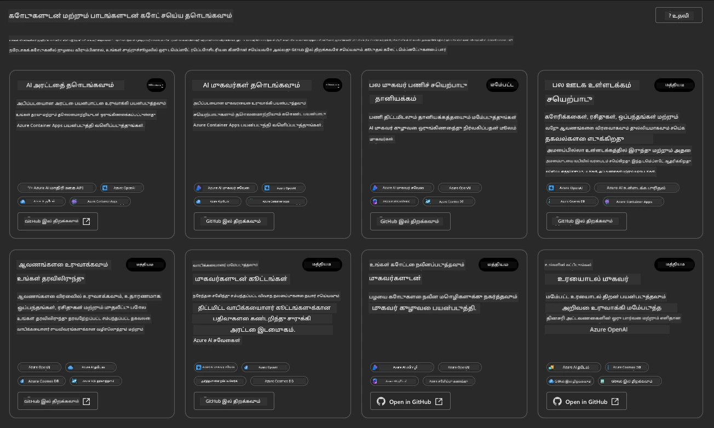


**Basic** விருப்பங்கள் உங்கள் தொடக்க வார்ப்புருகள் ஆகும்:

1. [ ] [Get Started with AI Chat](https://github.com/Azure-Samples/get-started-with-ai-chat) — இது அடிப்படை அரட்டையாடலின் பயன்பாட்டை _உங்கள் தரவுடன்_ Azure Container Apps க்கு deploy செய்கிறது. அடிப்படை AI chatbot senario யைப் பார்க்க இதைப் பயன்படுத்தவும்.
1. [X] [Get Started with AI Agents](https://github.com/Azure-Samples/get-started-with-ai-agents) — இது Foundry Agents ஐப் பயன்படுத்தி ஒரு ஸ்டாண்டர்ட் AI Agent ஐ deploy செய்கிறது. கருவிகள் மற்றும் மாதிரிகள் உடன் agentic AI தீர்வுகளை அறிய இதைப் பயன்படுத்தவும்.

இரண்டாம் இணைப்பை புதிய உலாவி தாவலைலில் திறக்கவும் (அல்லது தொடர்புடைய கார்டுக்கான `Open in GitHub` ஐ கிளிக் செய்யவும்). இந்த AZD வார்ப்புருவுக்கான நிர்வகிக்கப்படும் தொகுப்பை நீங்கள் பார்க்கலாம். README ஐ ஆராய ஒரு நிமிடம் எடுத்துக்கொள்ளுங்கள். பயன்பாட்டு கட்டமைப்பு இதுபோல உள்ளது:

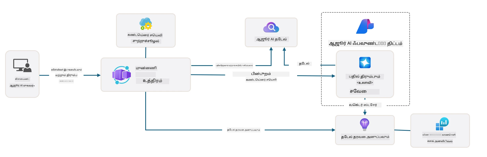

---

## 3. டெம்ப்ளேட் செயல்படுத்தல்

இப்போ நாம் இந்த வார்ப்புருவை deploy செய்து அது செல்லுபடியாகிறதா என்பதை சரிபார்ப்போம். [Getting Started](https://github.com/Azure-Samples/get-started-with-ai-agents?tab=readme-ov-file#getting-started) பகுதியின் வழிகாட்டுதல்களை நாம் பின்பற்றப்போகிறோம்.

1. இந்த [இணைப்பை](https://github.com/codespaces/new/Azure-Samples/get-started-with-ai-agents) கிளிக் செய்க - `Create codespace` என்ற முந்தைய செயலை உறுதிப்படுத்தவும்
1. இது ஒரு புதிய உலாவி தாவலை திறக்கும் - GitHub Codespaces அமர்வு முழுமையாக ஏற்றப்படும்வரை காத்திருங்கள்
1. Codespaces இல் VS Code டெர்மினலை திறக்கவும் - பின்வரும் கட்டளையை টাইப் செய்யவும்:

   ```bash title="" linenums="0"
   azd up
   ```

இதன் ஊக்குவிப்பில் trigger ஆகும் வேலைநிலைகளை முடிக்கவும்:

1. உங்களுக்கு Azure உள்நுழைவு கேட்கப்படும் - அங்கீகாரத்திற்கு வழிமுறைகளைப் பின்பற்றுங்கள்
1. உங்களுக்காக ஒரு தனித்துவமான environment பெயரை உள்ளீடு செய்யுங்கள் - உதாரணமாக, நான் `nitya-mshack-azd` என பயன்படுத்தினேன்
1. இது `.azure/` என்ற கோப்புறையை உருவாக்கும் - நீங்கள் அந்த env பெயருடன் துணை கோப்புறையை காண்பீர்கள்
1. சந்தா பெயரைத் தேர்ந்தெடுக்க உங்களிடம் கேட்கப்படும் - இயல்புநிலை துணைபிரிவைத் தேர்வு செய்யுங்கள்
1. இடத்தை கேட்டால் - `East US 2` ஐ பயன்படுத்தவும்

இப்போது, provisioning முடிந்தால் காத்திருக்க வேண்டும். **இது 10-15 நிமிடங்கள் எடுக்கும்**

1. முடிந்தபின், உங்கள் கன்சோலில் SUCCESS செய்தி இதுபோல காணப்படும்:
      ```bash title="" linenums="0"
      SUCCESS: Your up workflow to provision and deploy to Azure completed in 10 minutes 17 seconds.
      ```
1. உங்கள் Azure போர்டலில் இப்பொழுது அந்த env பெயருடன் ஒரு provision செய்யப்பட்ட resource group இருக்கும்:

      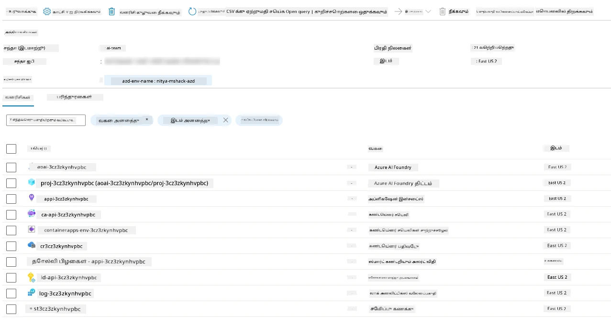

1. **நீங்கள் இப்போது provision செய்யப்பட்ட கட்டமைப்பையும் பயன்பாட்டையும் சரிபார்க்க தயாராக உள்ளீர்கள்**.

---

## 4. டெம்ப்ளேட் சரிபார்த்தல்

1. Azure போர்டல் [Resource Groups](https://portal.azure.com/#browse/resourcegroups) பக்கத்தை பார்வையிடவும் - கேட்கப்பட்டால் உள்நுழைக
1. உங்கள் environment பெயருக்கான RG ஐ கிளிக் செய்யவும் - நீங்கள் மேலுள்ள பக்கத்தைப் பார்க்கலாம்

      - Azure Container Apps resource ஐ சொடுக்குக
      - _Essentials_ பகுதியின் (மேல்நிலை வலது) Application Url ஐ சொடுக்குக

1. நீங்கள் இதுபோன்ற ஹோஸ்ட் செய்யப்பட்ட பயன்பாட்டு முன்-இணைய UI ஐப் பார்க்க வேண்டும்:

   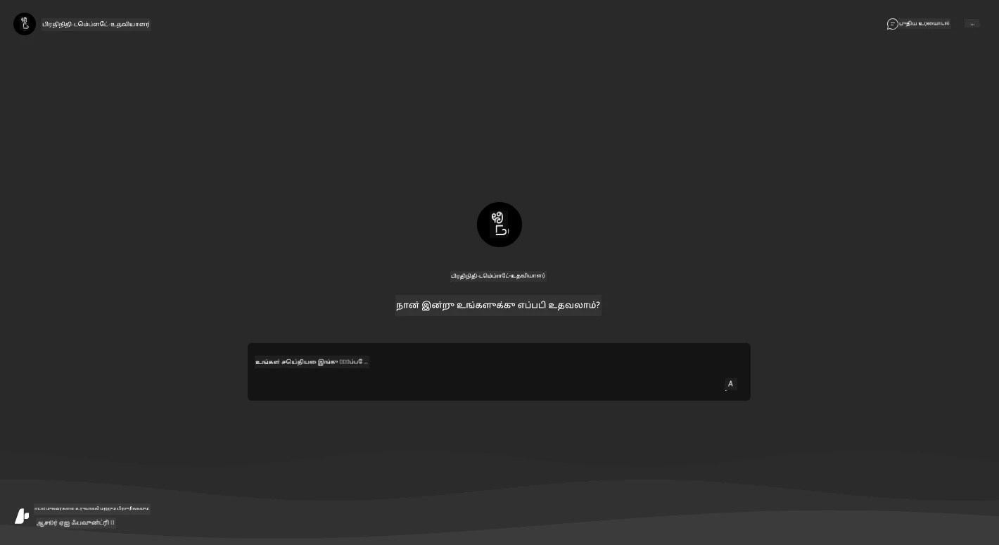

1. சில [டெஸ்ட் கேள்விகளை](https://github.com/Azure-Samples/get-started-with-ai-agents/blob/main/docs/sample_questions.md) கேட்க முயற்சிக்கவும்

      1. கேளுங்கள்: ```பிரான்ஸின் தலைநகரம் எது?``` 
      1. கேளுங்கள்: ```இரு நபர்களுக்கான $200 க்கும் குறைவான சிறந்த குடிசை எது, அது எந்த அம்சங்களை கொண்டுள்ளது?```

1. நீங்ககள் கீழே காட்டப்பட்டவைகளுக்கு ஒத்த பதில்களைப் பெறுவீர்கள். _ஆனால் இது எப்படி வேலை செய்கிறது?_

      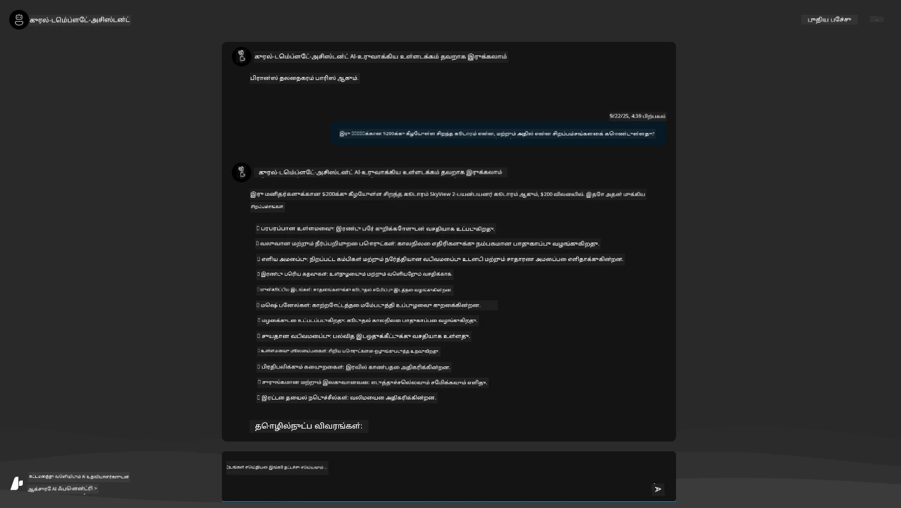

---

## 5. முகவர் (Agent) சரிபார்த்தல்

Azure Container App ஒரு endpoint ஐ deploy செய்து, இந்த வார்ப்புருவுக்காக Microsoft Foundry திட்டத்தில் provision செய்யப்பட்ட AI Agent உடன் இணைக்கிறது. இதன் பொருள் என்ன என்பதை பார்க்கலாம்.

1. உங்கள் resource group இன் Azure Portal _Overview_ பக்கத்துக்குத் திரும்புங்கள்

1. அந்த பட்டியலில் உள்ள `Microsoft Foundry` resource ஐ கிளிக் செய்க

1. நீங்கள் இதைப் பார்க்க வேண்டும். `Go to Microsoft Foundry Portal` பொத்தானை கிளிக் செய்க. 
   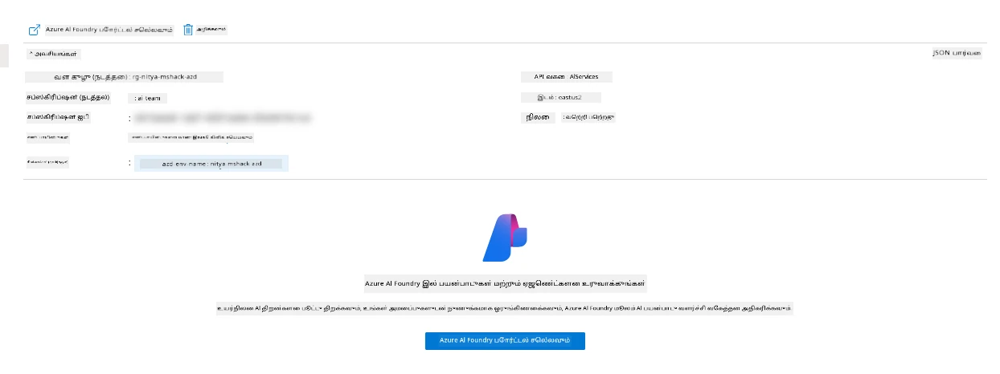

1. உங்கள் AI பயன்பாட்டிற்கான Foundry Project பக்கத்தை பார்க்க வேண்டும்
   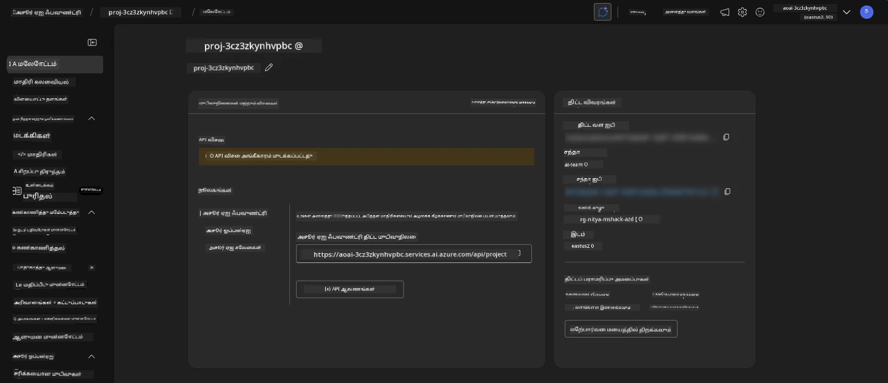

1. `Agents` ஐ கிளிக் செய்க - உங்கள் திட்டத்தில் provision செய்யப்பட்ட இயல்புநிலை Agent ஐ நீங்கள் காண்பீர்கள்
   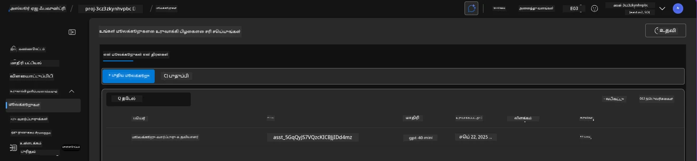

1. அதை தேர்வு செய்க - மேலும் Agent விபரங்களை நீங்கள் காண்பீர்கள். பின்வருவதை লক্ষ্যிக்கவும்:

      - அந்த agent பொதுவாக File Search ஐ பயன்படுத்துகிறது (எப்போதும்)
      - agent இன் `Knowledge` காட்டுகிறது அது 32 கோப்புகள் பதிவேற்றப்பட்டிருக்கின்றன (file search க்கு)
      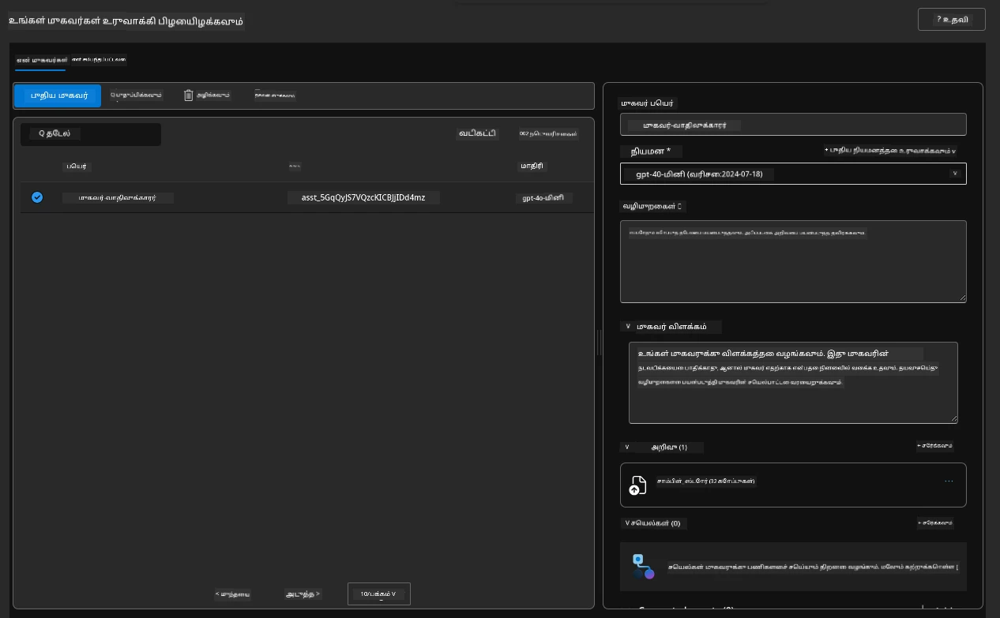

1. இடது மெனுவில் `Data+indexes` விருப்பத்தை முழுவதும் காணவும் மற்றும் விவரங்களுக்கு கிளிக் செய்க. 

      - நீங்கள் அறிவிற்கு பதிவேற்றப்பட்ட 32 தரவுக் கோப்புகளைப் பார்க்குவீர்கள்.
      - இவை `src/files` கீழ் உள்ள 12 வாடிக்கையாளர் கோப்புகள் மற்றும் 20 தயாரிப்பு கோப்புகளுக்கு தொடர்புடையவை
      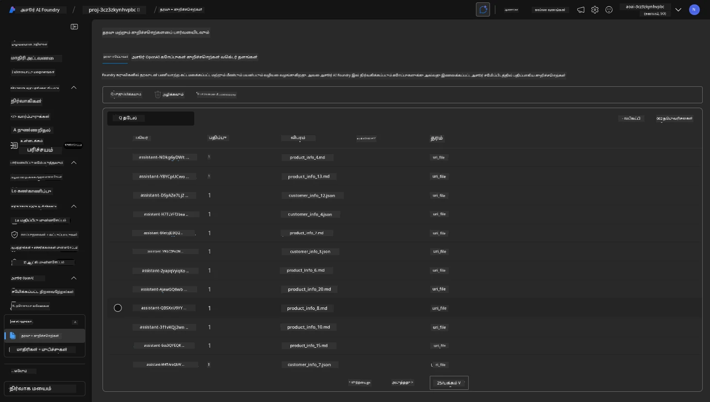

**நீங்கள் Agent செயல்பாட்டை சரிபார்த்தீர்கள்!**

1. agent பதில்கள் அந்தக் கோப்புகளில் உள்ள அறிவுக்கு அடிப்படைபடுத்தப்பட்டவை.
1. இந்நிறுவனத் தரவிற்கு சம்பந்தப்பட்ட கேள்விகளை நீங்களும் கேட்டு, அடிப்படைபடுத்தப்பட்ட பதில்களைப் பெறலாம்.
1. எடுத்துக்காட்டாக: `customer_info_10.json` என்பது "Amanda Perez" என்பவரால் செய்யப்பட்ட 3 கொள்முதல்களை விளக்குகிறது

Container App endpoint உடன் இருக்கும் உலாவி தாவலை மீண்டும் திறந்து கேளுங்கள்: `What products does Amanda Perez own?`. நீங்கள் இதுபோன்ற ஒன்றைக் காண்பீர்கள்:

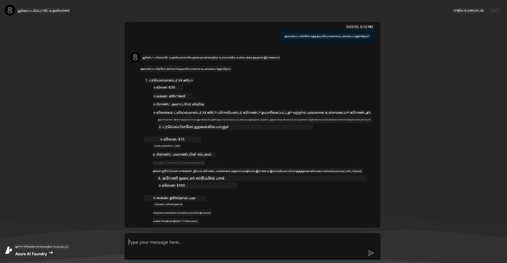

---

## 6. முகவர் பிளேகிரவுண்ட் (Agent Playground)

Microsoft Foundry இன் திறன்கள் பற்றி இன்னும் தெளிவாக அறிய, அந்த Agent ஐ Agents Playground இல் சோதனை செய்வோம். 

1. Microsoft Foundry இல் `Agents` பக்கத்துக்குத் திரும்புங்கள் - இயல்புநிலை agent ஐ தேர்வு செய்க
1. `Try in Playground` விருப்பத்தை கிளிக் செய்யவும் - இதைப் போன்ற Playground UI ஐப் பெறுவீர்கள்
1. அதே கேள்வியை கேளுங்கள்: `What products does Amanda Perez own?`

    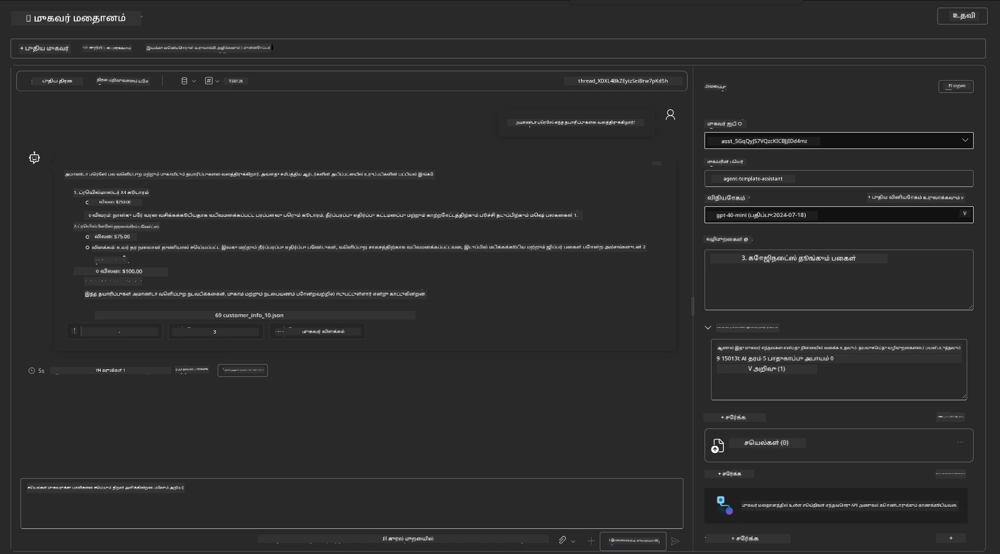

நீங்கள் அதே (அல்லது ஒத்த) பதிலை பெறுவீர்கள் - ஆனால் மேலும் சில கூடுதல் தகவல்களும் கிடைக்கும், அவை உங்கள் agentic பயன்பாட்டின் தரத்தை, செலவினத்தை மற்றும் செயல்திறனை புரிந்துகொள்ள உதவும். எடுத்துக்காட்டாக:

1. பதில் "மூலதான" வைக்க பயன்படுத்தப்பட்ட தரவு கோப்புகளை மேற்கோள் காட்டுகிறது
1. இந்த கோப்பு லேபிள்களில் மவுஸ் வைத்துப் பார்க்கவும் - தரவு உங்கள் கேள்வி மற்றும் காட்டப்பட்ட பதிலுக்கு பொருந்துகிறதா என்பதை பார்த்துக் கொள்ளுங்கள்

நீங்கள் பதிலின் கீழ் ஒரு _நடவடிக்கை புள்ளி_ வரிசையையும் (stats row) காண்பீர்கள். 

1. எந்த ஒரு அளவுருவையும் (metric) மேலே காட்ட வைக்கவும் - உதாரணமாக, Safety. நீங்கள் இதுபோன்ற ஒன்றைக் காண்கிறீர்கள்
1. மதிப்பீடு செய்யப்பட்ட மதிப்பெண் உங்கள் பதிலின் பாதுகாப்பு நிலைக்கு உங்கள் கருதுகோளுடன் பொருந்துகிறதா?

      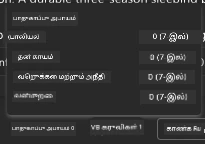

---

## 7. உட்பொதிக்கப்பட்ட கண்காணிப்பு (Built-in Observability)

Observability என்பது உங்கள் பயன்பாட்டில் டேட்டா உருவாக்குவதற்கான கருவிகள் இடைநிறுத்தப்படுதல் மற்றும் அதை பயன்படுத்தி செயல்பாடுகளை புரிந்துகொள்வது, பிழைகளை தீர்க்கும் மற்றும் செயல்திறனை மேம்படுத்துவது குறித்தது. இதன் உணர்வு பெற:

1. `View Run Info` பொத்தானை கிளிக் செய்க - நீங்கள் இதுபோல ஒரு பார்வையைப் பார்க்க வேண்டும். இது [Agent tracing](https://learn.microsoft.com/en-us/azure/ai-foundry/how-to/develop/trace-agents-sdk#view-trace-results-in-the-azure-ai-foundry-agents-playground) இன் செயல்பாட்டின் ஒரு எடுத்துக்காட்டு ஆகும். _இந்த பார்வையை Thread Logs ஐ மேல்நிலை மெனுவில் கிளிக் செய்வதன்மூலமும் பெறலாம்_.

   - agent செயல்முறையில் இடம்பெற்ற நிலைபாடுகள் மற்றும் பயன்படுத்தப்பட்ட கருவிகளைப் புரிந்துகொள்ளுங்கள்
   - பதிலுக்கான மொத்த Token எண்ணிக்கையையும் (vs. output tokens பயன்) புரிந்துகொள்ளுங்கள்
   - தாமதமும், செயல்பாட்டில் எங்கு நேரம் செலவாகிறது என்பதையும் புரிந்துகொள்ளுங்கள்

      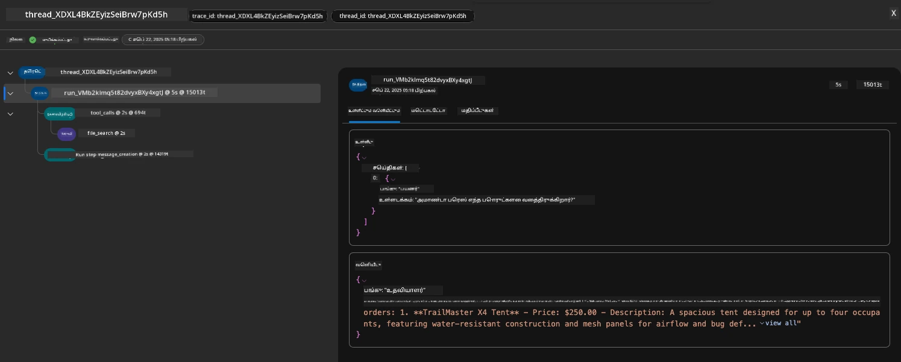

1. `Metadata` தாவலை கிளிக் செய்து ஓட்டத்திற்கான கூடுதல் பண்புகளை காணுங்கள், அவை பின்னர் பிழைகளை கட்டுப்படுத்த உதவக்கூடும்.   

      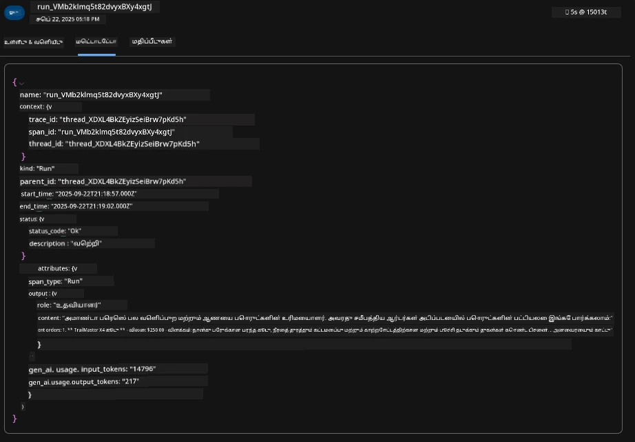


1. `Evaluations` தாவலை கிளிக் செய்து agent பதிலில் செய்யப்பட்ட தானாக் கணக்கீடுகளைப் பார்க்கவும். இதில் பாதுகாப்பு மதிப்பீடுகள் (உதாரணத்திற்கு, Self-harm) மற்றும் agent-சார்ந்த மதிப்பீடுகள் (உதாரணத்திற்கு, நோக்கம் தீர்மானம், Task கடைப்பிடிப்பு) உள்ளிட்டவை அடங்கும்.

      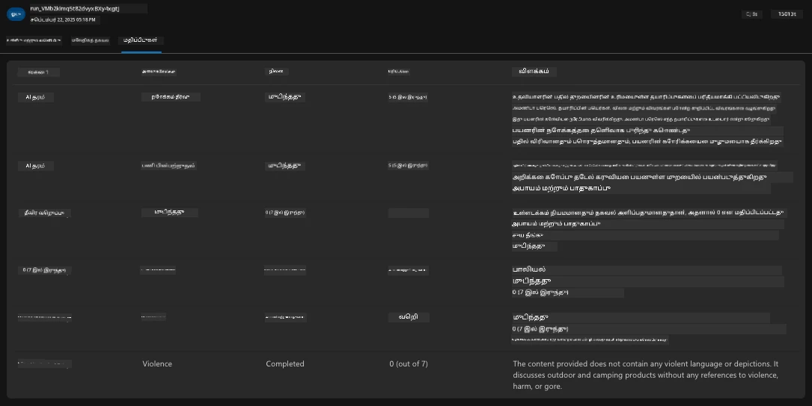

1. கடைசியாக, பக்கத்தெரியில் உள்ள `Monitoring` தாவலை கிளிக் செய்யவும்.

      - தோற்றப்பட்ட பக்கத்தில் `Resource usage` தாவலை தேர்வு செய்து, அளவுகோல்களை பார்.
      - செலவுகள் (tokens) மற்றும் லோடு (க் கோரிக்கைகள்) பொருட்டு பயன்பாட்டின் பயன்பாட்டை கண்காணி.
      - முதன்மை பைட் (இன்ஃபுட் செயலாக்கம்) முதல் கடைசி பைட் (அவுட்புட்) வரையிலான பயன்பாட்டின் தாமதத்தை பின்தொடர்.

      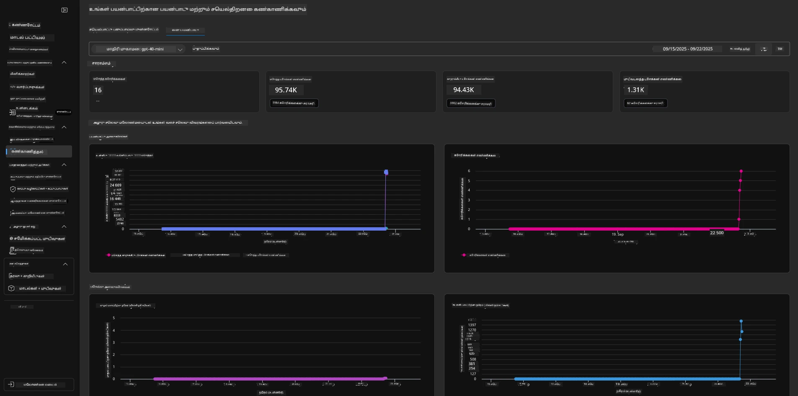

---

## 8. சூழல் மாறிகள் (Environment Variables)

நாம் இதுவரை உலாவியில் deployment வழியாகப் பயணித்து - நமது கட்டமைப்பு provision ஆகிவிட்டது மற்றும் பயன்பாடு செயல்படுகிறது என்பதை சரிபார்த்தோம். ஆனால் application ஐ _குறியீட்டு முதன்மையாக_ பணியாற்ற, இந்தச் சொத்துகளுடன் பணியாற்ற தேவையான சம்பந்தப்பட்ட மாறிகளை உங்கள் loka வளர்ச்சி சூழலுக்கு கட்டமைக்க வேண்டும். `azd` இதை எளிதாக்குகிறது.

1. Azure Developer CLI [environment variables ஐ பயன்படுத்துகிறது](https://learn.microsoft.com/en-us/azure/developer/azure-developer-cli/manage-environment-variables?tabs=bash) என்பது ಅಪ್ಲಿಕೇಶன் deploymentConfiguration அமைப்புகளை உள்நிறுத்தவும் நிர்வகிக்கவும்.

1. சூழல் மாறிகள் `.azure/<env-name>/.env` இல் சேமிக்கப்படுகின்றன - இது அவற்றை deployment இல் பயன்படுத்தப்பட்ட `env-name` சூழலுக்காக வரையறுக்கிறது மற்றும் ஒரே தளத்தில் வெவ்வேறு deployment இலக்கு மத்தியில் சூழல்களை தனித்தனியாக வைக்க உதவுகிறது.

1. சூழல் மாறிகள் `azd` கட்டளை எந்த ஒரு குறிப்பிட்ட கட்டளையை இயக்கும் போது தானாக ஏற்றப்படும் (உதாரணமாக, `azd up`). கவனிக்கவும் `azd` இயங்கும் போது _OS-மட்ட சூழல் மாறிகளை_ தானாக வாசிக்காது (உதாரணமாக, shell இல் அமைக்கப்பட்டவை) - பதிலாக `azd set env` மற்றும் `azd get env` ஐ ஸ்கிரிப்டுகளில் தகவலை பரிமாற பயன்படுத்தவும்.


சில கட்டளைகளை முயற்சிசெய்:

1. இந்த சூழலில் `azd` க்கான எல்லா சூழல் மாறிகளையும் பெற்று பார்க்க:

      ```bash title="" linenums="0"
      azd env get-values
      ```
      
      நீங்கள் இதுபோன்றதை காண்பீர்கள்:

      ```bash title="" linenums="0"
      AZURE_AI_AGENT_DEPLOYMENT_NAME="gpt-4o-mini"
      AZURE_AI_AGENT_NAME="agent-template-assistant"
      AZURE_AI_EMBED_DEPLOYMENT_NAME="text-embedding-3-small"
      AZURE_AI_EMBED_DIMENSIONS=100
      ...
      ```

1. ஒரு குறிப்பிட்ட மதிப்பைக் பெற்றுக் கொள்ள - உதாரணமாக, `AZURE_AI_AGENT_MODEL_NAME` மதிப்பை நாங்கள் அமைத்துள்ளோமா என்பதை பார்க்க விரும்புகிறேன்

      ```bash title="" linenums="0"
      azd env get-value AZURE_AI_AGENT_MODEL_NAME 
      ```
      
      நீங்கள் இதுபோன்ற ஒன்றைப் பார்த்தீர்கள் - ஏற்கனவே இயல்புநிலை மூலம் அமைக்கப்படவில்லை!

      ```bash title="" linenums="0"
      ERROR: key 'AZURE_AI_AGENT_MODEL_NAME' not found in the environment values
      ```

1. `azd` க்கான ஒரு புதிய சூழல் மாறியை அமைக்கவும். இங்கே, நாம் agent மாதிரி பெயரை புதுப்பிக்கின்றோம். _குறிப்பு: செய்யப்பட்ட எந்தத் திருத்தங்களும் உடனே `.azure/<env-name>/.env` கோப்பில் பிரதிபலிக்கப்படும்._

      ```bash title="" linenums="0"
      azd env set AZURE_AI_AGENT_MODEL_NAME gpt-4.1
      azd env set AZURE_AI_AGENT_MODEL_VERSION 2025-04-14
      azd env set AZURE_AI_AGENT_DEPLOYMENT_CAPACITY 150
      ```

      இப்போது, மதிப்பு அமைக்கப்பட்டுள்ளதாக நாம் காண வேண்டும்:

      ```bash title="" linenums="0"
      azd env get-value AZURE_AI_AGENT_MODEL_NAME 
      ```

1. சில சொத்துகள் நிலையானவையாக இருக்கும் (உதாரணமாக, மாதிரி deployments) மற்றும் மறுசெயலாக்கத்தை வலுப்படுத்த மேலும் ஒன்றிற்கும் `azd up` மட்டும் போதாது. பழைய deployment ஐ tear down செய்து மாற்றப்பட்ட env vars கொண்டு மறுபடியும் deploy செய்து பார்ப்போம்.

1. **Refresh** நீங்கள் முந்தைய முறையில் azd வார்ப்புரு பயன்படுத்தி அமைப்புகளை deploy செய்திருந்தால் - உங்கள் உள்ளக சூழல் மாறிகளின் நிலையை தற்போதைய Azure deployment இன் நிலையின் அடிப்படையில் புதுப்பிக்க நீங்கள் இந்த கட்டளையை பயன்படுத்தலாம்:

      ```bash title="" linenums="0"
      azd env refresh
      ```

      இது இரண்டு அல்லது அதற்கு மேற்பட்ட உள்ளூர் மேம்பாட்டு சூழல்கள் (உதா., பல மேம்பாட்டாளர்களைக் கொண்ட குழு) இடையே சுற்றுச்சூழல் மாறிலிகளை _sync_ செய்ய ஒரு சக்திவாய்ந்த வழி - பதிவேற்றப்பட்ட கட்டமைப்பு சுற்றுச்சூழல் மாறிலிகளின் நிலைக்கு நிலையான உண்மையான ஆதாரமாக செயல்பட அனுமதிக்கிறது. குழு உறுப்பினர்கள் மாறிலிகளை _refresh_ செய்து மீண்டும் ஒத்திசைவு அடையலாம்.

---

## 9. வாழ்த்துக்கள் 🏆

You just completed an end-to-end workflow where you:

- [X] நீங்கள் பயன்படுத்த விரும்பும் AZD Template-ஐ தேர்ந்தெடுத்தீர்கள்
- [X] GitHub Codespaces உடன் Template-ஐ துவக்கினீர்கள் 
- [X] Template-ஐ தளமிறக்கி அது வேலை செய்கிறதென சரிபார்த்தீர்கள்

---

<!-- CO-OP TRANSLATOR DISCLAIMER START -->
மறுப்பு அறிக்கை:
இந்த ஆவணம் AI மொழிபெயர்ப்பு சேவையான Co-op Translator (https://github.com/Azure/co-op-translator) மூலம் மொழிபெயர்க்கப்பட்டுள்ளது. நாங்கள் துல்லியத்திற்காக முயற்சித்தாலும், தானியங்கி மொழிபெயர்ப்புகளில் பிழைகள் அல்லது துல்லியமின்மைகள் இருக்கக்கூடும் என்பதை தயவுசெய்து கவனிக்கவும். மூல ஆவணம் அதன் சொந்த மொழியில் அதிகாரபூர்வமான ஆதாரம் என கருதப்பட வேண்டும். முக்கியமான தகவல்களுக்கு, தொழில்முறை மனித மொழிபெயர்ப்பு பரிந்துரைக்கப்படுகிறது. இந்த மொழிபெயர்ப்பின் பயன்பாட்டினால் ஏற்படும் எந்தவொரு தவறான புரிதலும் அல்லது தவறான விளக்கத்திற்கும் நாங்கள் பொறுப்பேற்கமாட்டோம்.
<!-- CO-OP TRANSLATOR DISCLAIMER END -->