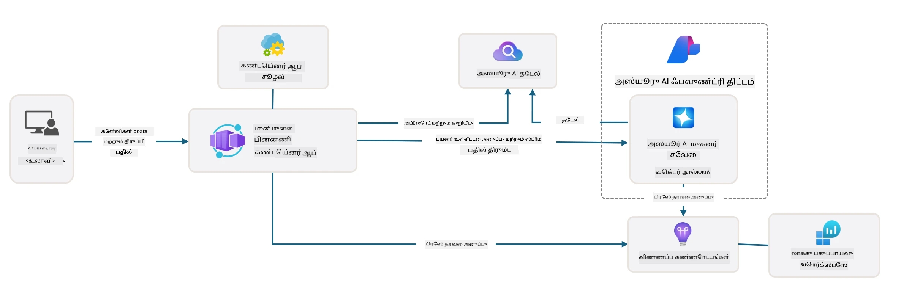

# 3. டெம்ப்ளேட்டை பிரித்தெடுக்கவும்

!!! tip "இந்த மாட்யூலை முடிக்கும்போது நீங்கள் செய்ய முடியும்"

    - [ ] உருப்படி
    - [ ] உருப்படி
    - [ ] உருப்படி
    - [ ] **லேப் 3:**

---

AZD டெம்ப்ளேட்கள் மற்றும் Azure Developer CLI (`azd`) மூலம், மாதிரிக் குறியீடு, உள்கட்டமைப்பு மற்றும் கட்டமைப்பு கோப்புகளை வழங்கும் தரநிலையான சேமிப்பகங்களுடன் - தயாராகப் பயன்படுத்தக்கூடிய _தொடக்க_ திட்டமாக - எங்கள் AI மேம்பாட்டு பயணத்தை விரைவாகத் தொடங்க முடியும்.

**ஆனால் இப்போது, திட்ட அமைப்பையும் குறியீட்டு அடிப்படையையும் புரிந்துகொண்டு - AZD டெம்ப்ளேட்டை தனிப்பயனாக்க முடியும் - AZD பற்றிய முந்தைய அனுபவம் அல்லது புரிதல் இல்லாமல்!**

---

## 1. GitHub Copilot ஐ செயல்படுத்தவும்

### 1.1 GitHub Copilot Chat ஐ நிறுவவும்

[Agent Mode உடன் GitHub Copilot](https://code.visualstudio.com/docs/copilot/chat/chat-agent-mode) ஐ ஆராயும் நேரம் வந்துவிட்டது. இப்போது, எங்கள் பணியை ஒரு உயர் நிலை விளக்கமாக இயற்கை மொழியில் விவரிக்க முடியும், மேலும் செயல்படுத்த உதவியைப் பெற முடியும். இந்த லேபுக்காக, [Copilot இலவச திட்டத்தை](https://github.com/github-copilot/signup) பயன்படுத்துவோம், இது முடிவுகள் மற்றும் உரையாடல் தொடர்புகளுக்கான மாதாந்திர வரம்பைக் கொண்டுள்ளது.

இந்த நீட்டிப்பு சந்தையில் இருந்து நிறுவப்படலாம், ஆனால் உங்கள் Codespaces சூழலில் ஏற்கனவே கிடைக்கக்கூடும். _Copilot ஐகான் டிராப்-டவுனிலிருந்து `Open Chat` ஐ கிளிக் செய்யவும் - மற்றும் `What can you do?` போன்ற ஒரு உந்துதலைத் தட்டச்சு செய்யவும்_ - உள்நுழையுமாறு உந்துதல் அளிக்கப்படலாம். **GitHub Copilot Chat தயாராக உள்ளது**.

### 1.2 MCP சர்வர்களை நிறுவவும்

Agent Mode பயனுள்ளதாக இருக்க, இது அறிவை மீட்டெடுக்க அல்லது நடவடிக்கை எடுக்க உதவும் சரியான கருவிகளுக்கான அணுகலை தேவைப்படுகிறது. MCP சர்வர்கள் இங்கு உதவ முடியும். நாம் பின்வரும் சர்வர்களை அமைப்போம்:

1. [Azure MCP Server](../../../../../workshop/docs/instructions)
1. [Microsoft Docs MCP Server](../../../../../workshop/docs/instructions)

இவற்றை செயல்படுத்த:

1. `.vscode/mcp.json` என்ற கோப்பை உருவாக்கவும், அது இல்லாவிட்டால்
1. அந்த கோப்பில் பின்வருவதை நகலெடுக்கவும் - மற்றும் சர்வர்களைத் தொடங்கவும்!
   ```json title=".vscode/mcp.json"
   {
      "servers": {
         "Azure MCP Server": {
            "command": "npx",
            "args": [
            "-y",
            "@azure/mcp@latest",
            "server",
            "start"
            ]
         },
         "microsoft.docs.mcp": {
            "type": "http",
            "url": "https://learn.microsoft.com/api/mcp"
         }
      }
   }
   ```

??? warning "`npx` நிறுவப்படவில்லை என்ற பிழை உங்களுக்கு கிடைக்கக்கூடும் (சரிசெய்வதற்கான விரிவாக்கத்தை கிளிக் செய்யவும்)"

      இதை சரிசெய்ய, `.devcontainer/devcontainer.json` கோப்பைத் திறந்து, அம்சங்கள் பிரிவில் இந்த வரியைச் சேர்க்கவும். பின்னர் கெண்டைனர் மீண்டும் கட்டமைக்கவும். இப்போது `npx` நிறுவப்பட்டிருக்கும்.

      ```title="" linenums="0"
         "features": {
            "ghcr.io/devcontainers/features/node:1": {},
            ...
         },
      ```

---

### 1.3 GitHub Copilot Chat ஐ சோதிக்கவும்

**முதலில் `az login` ஐ பயன்படுத்தி Azure உடன் VS Code கட்டளை வரியில் அங்கீகரிக்கவும்.**

இப்போது உங்கள் Azure சந்தாதார நிலையை விசாரிக்கவும், மற்றும் நிறுவப்பட்ட வளங்கள் அல்லது கட்டமைப்பைப் பற்றிய கேள்விகளை கேட்கவும் முடியும். இந்த உந்துதல்களை முயற்சிக்கவும்:

1. `List my Azure resource groups`
1. `#foundry list my current deployments`

Azure ஆவணங்களைப் பற்றிய கேள்விகளை கேட்கவும், Microsoft Docs MCP சர்வரில் அடிப்படையாகக் கொண்ட பதில்களைப் பெறவும் முடியும். இந்த உந்துதல்களை முயற்சிக்கவும்:

1. `#microsoft_docs_search What is Azure Developer CLI?`
1. `#microsoft_docs_search Show me a Python tutorial to chat with deployed model`

அல்லது ஒரு பணியை முடிக்க குறியீட்டு துணுக்குகளை கேட்கலாம். இந்த உந்துதலை முயற்சிக்கவும்.

1. `Give me a Python code example that uses AAD for an interactive chat client`

`Ask` முறையில், இது நீங்கள் நகலெடுத்து-ஒட்டவும் முயற்சிக்கவும் கூடிய குறியீட்டை வழங்கும். `Agent` முறையில், இது ஒரு படி மேலே சென்று, உங்கள் பணியைச் செயல்படுத்த உதவ, தொடர்புடைய வளங்கள் - அமைப்பு ஸ்கிரிப்ட்கள் மற்றும் ஆவணங்கள் உட்பட - உருவாக்கக்கூடும்.

**இப்போது நீங்கள் டெம்ப்ளேட் சேமிப்பகத்தை ஆராயத் தயாராக உள்ளீர்கள்**

---

## 2. கட்டமைப்பை பிரித்தெடுக்கவும்

??? prompt "ASK: docs/images/architecture.png உள்ள பயன்பாட்டு கட்டமைப்பை ஒரு பத்தியில் விளக்கவும்"

      இந்த பயன்பாடு Azure-ல் உருவாக்கப்பட்ட AI-ஆதாரமுள்ள உரையாடல் பயன்பாடாகும், இது ஒரு நவீன முகவர் அடிப்படையிலான கட்டமைப்பை வெளிப்படுத்துகிறது. தீர்வு, பயனர் உள்ளீட்டை செயலாக்கி, AI முகவரின் மூலம் புத்திசாலியான பதில்களை உருவாக்கும் முக்கிய பயன்பாட்டு குறியீட்டை ஹோஸ்ட் செய்யும் Azure Container App ஐ மையமாகக் கொண்டுள்ளது.
      
      இந்த கட்டமைப்பு Azure AI Foundry Project ஐ AI திறன்களுக்கான அடிப்படையாகக் கொண்டுள்ளது, அடிப்படை மொழி மாதிரிகள் (GPT-4o-mini போன்றவை) மற்றும் முகவர் செயல்பாடுகளை வழங்கும் Azure AI Services-க்கு இணைக்கிறது. பயனர் தொடர்புகள் React அடிப்படையிலான முன்புறத்திலிருந்து FastAPI பின்புறத்திற்குச் செல்கின்றன, இது சூழலியல் பதில்களை உருவாக்க AI முகவர் சேவையுடன் தொடர்பு கொள்ளுகிறது.
      
      இந்த அமைப்பு, பதிவேற்றப்பட்ட ஆவணங்களில் இருந்து தகவலை அணுகவும் மேற்கோள் காட்டவும் முகவருக்கு அனுமதிக்கும், கோப்பு தேடல் அல்லது Azure AI Search சேவையின் மூலம் அறிவு மீட்டெடுக்கும் திறன்களை உள்ளடக்கியது. செயல்பாட்டு சிறப்பிற்காக, இந்த கட்டமைப்பு, செயல்பாடு மேம்பாட்டிற்கான Application Insights மற்றும் Log Analytics Workspace மூலம் விரிவான கண்காணிப்பை உள்ளடக்கியது.
      
      Azure Storage பயன்பாட்டு தரவுகள் மற்றும் கோப்பு பதிவேற்றங்களுக்கு blob சேமிப்பகத்தை வழங்குகிறது, மேலும் Managed Identity Azure வளங்களுக்கு இடையில் நம்பகத்தன்மை சேமிக்காமல் பாதுகாப்பான அணுகலை உறுதிசெய்கிறது. முழு தீர்வு, Azure இன் மேலாண்மை சேவைகள் சூழலியலின் மூலம், தேவைக்கு ஏற்ப தானாக மாறும், ஆனால் உள்ளமைக்கப்பட்ட பாதுகாப்பு, கண்காணிப்பு மற்றும் CI/CD திறன்களை வழங்கும், அளவீட்டு மற்றும் பராமரிப்பு திறன்களுக்காக வடிவமைக்கப்பட்டுள்ளது.



---

## 3. சேமிப்பக அமைப்பு

!!! prompt "ASK: டெம்ப்ளேட் கோப்புறை அமைப்பை விளக்கவும். ஒரு காட்சித் தோராயமான வரைபடத்துடன் தொடங்கவும்."

??? info "ANSWER: காட்சித் தோராயமான வரைபடம்"

      ```bash title="" 
      get-started-with-ai-agents/
      ├── 📋 கட்டமைப்பு & அமைப்பு
      │   ├── azure.yaml                    # Azure Developer CLI கட்டமைப்பு
      │   ├── docker-compose.yaml           # உள்ளூர் மேம்பாட்டு கெண்டைனர்கள்
      │   ├── pyproject.toml                # Python திட்ட கட்டமைப்பு
      │   ├── requirements-dev.txt          # மேம்பாட்டு சார்புகள்
      │   └── .devcontainer/                # VS Code dev கெண்டைனர் அமைப்பு
      │
      ├── 🏗️ உள்கட்டமைப்பு (infra/)
      │   ├── main.bicep                    # முக்கிய உள்கட்டமைப்பு டெம்ப்ளேட்
      │   ├── api.bicep                     # API-க்கு குறிப்பிட்ட வளங்கள்
      │   ├── main.parameters.json          # உள்கட்டமைப்பு அளவுருக்கள்
      │   └── core/                         # தொகுதி உள்கட்டமைப்பு கூறுகள்
      │       ├── ai/                       # AI சேவை கட்டமைப்புகள்
      │       ├── host/                     # ஹோஸ்டிங் உள்கட்டமைப்பு
      │       ├── monitor/                  # கண்காணிப்பு மற்றும் பதிவு
      │       ├── search/                   # Azure AI Search அமைப்பு
      │       ├── security/                 # பாதுகாப்பு மற்றும் அடையாளம்
      │       └── storage/                  # சேமிப்பு கணக்கு கட்டமைப்புகள்
      │
      ├── 💻 பயன்பாட்டு மூலங்கள் (src/)
      │   ├── api/                          # பின்புற API
      │   │   ├── main.py                   # FastAPI பயன்பாட்டு நுழைவு
      │   │   ├── routes.py                 # API பாதை வரையறைகள்
      │   │   ├── search_index_manager.py   # தேடல் செயல்பாடு
      │   │   ├── data/                     # API தரவுகள் கையாளுதல்
      │   │   ├── static/                   # நிலையான வலை சொத்துக்கள்
      │   │   └── templates/                # HTML டெம்ப்ளேட்கள்
      │   ├── frontend/                     # React/TypeScript முன்புறம்
      │   │   ├── package.json              # Node.js சார்புகள்
      │   │   ├── vite.config.ts            # Vite கட்டமைப்பு கட்டமைப்பு
      │   │   └── src/                      # முன்புற மூல குறியீடு
      │   ├── data/                         # மாதிரி தரவுக் கோப்புகள்
      │   │   └── embeddings.csv            # முன்கணிக்கப்பட்ட எம்பெடிங்ஸ்
      │   ├── files/                        # அறிவு அடிப்படை கோப்புகள்
      │   │   ├── customer_info_*.json      # வாடிக்கையாளர் தரவின் மாதிரிகள்
      │   │   └── product_info_*.md         # தயாரிப்பு ஆவணங்கள்
      │   ├── Dockerfile                    # கெண்டைனர் கட்டமைப்பு
      │   └── requirements.txt              # Python சார்புகள்
      │
      ├── 🔧 தானியங்குதல் & ஸ்கிரிப்ட்கள் (scripts/)
      │   ├── postdeploy.sh/.ps1           # பதவிறக்கத்திற்குப் பின் அமைப்பு
      │   ├── setup_credential.sh/.ps1     # நம்பகத்தன்மை கட்டமைப்பு
      │   ├── validate_env_vars.sh/.ps1    # சூழல் சரிபார்ப்பு
      │   └── resolve_model_quota.sh/.ps1  # மாதிரி ஒதுக்கீடு மேலாண்மை
      │
      ├── 🧪 சோதனை & மதிப்பீடு
      │   ├── tests/                        # யூனிட் மற்றும் ஒருங்கிணைப்பு சோதனைகள்
      │   │   └── test_search_index_manager.py
      │   ├── evals/                        # முகவர் மதிப்பீட்டு கட்டமைப்பு
      │   │   ├── evaluate.py               # மதிப்பீட்டு இயக்கி
      │   │   ├── eval-queries.json         # சோதனை கேள்விகள்
      │   │   └── eval-action-data-path.json
      │   ├── sandbox/                      # மேம்பாட்டு விளையாட்டு மைதானம்
      │   │   ├── 1-quickstart.py           # தொடக்க உதாரணங்கள்
      │   │   └── aad-interactive-chat.py   # அங்கீகாரம் உதாரணங்கள்
      │   └── airedteaming/                 # AI பாதுகாப்பு மதிப்பீடு
      │       └── ai_redteaming.py          # ரெட் டீம் சோதனை
      │
      ├── 📚 ஆவணங்கள் (docs/)
      │   ├── deployment.md                 # பதவிறக்க வழிகாட்டி
      │   ├── local_development.md          # உள்ளூர் அமைப்பு வழிமுறைகள்
      │   ├── troubleshooting.md            # பொதுவான பிரச்சினைகள் & தீர்வுகள்
      │   ├── azure_account_setup.md        # Azure முன்னோட்டங்கள்
      │   └── images/                       # ஆவண சொத்துக்கள்
      │
      └── 📄 திட்ட மெட்டாடேட்டா
         ├── README.md                     # திட்ட மேம்பாட்டு கண்ணோட்டம்
         ├── CODE_OF_CONDUCT.md           # சமூக வழிகாட்டிகள்
         ├── CONTRIBUTING.md              # பங்களிப்பு வழிகாட்டி
         ├── LICENSE                      # உரிமம் விதிமுறைகள்
         └── next-steps.md                # பதவிறக்கத்திற்குப் பின் வழிகாட்டி
      ```

### 3.1. முக்கிய பயன்பாட்டு கட்டமைப்பு

இந்த டெம்ப்ளேட் **முழு-ஸ்டாக் வலை பயன்பாட்டு** முறைபாட்டைப் பின்பற்றுகிறது:

- **பின்புறம்**: Python FastAPI Azure AI ஒருங்கிணைப்புடன்
- **முன்புறம்**: TypeScript/React Vite கட்டமைப்பு அமைப்புடன்
- **உள்கட்டமைப்பு**: Azure Bicep டெம்ப்ளேட்கள் மேக வளங்களுக்கு
- **கெண்டைனர்மயமாக்கல்**: ஒரே மாதிரியான பதவிறக்கத்திற்கான Docker

### 3.2 Infra As Code (bicep)

உள்கட்டமைப்பு அடுக்கு **Azure Bicep** டெம்ப்ளேட்களை தொகுதியாக ஒழுங்குபடுத்துகிறது:

   - **`main.bicep`**: அனைத்து Azure வளங்களையும் ஒருங்கிணைக்கிறது
   - **`core/` modules**: பல்வேறு சேவைகளுக்கான மறுபயன்பாட்டு கூறுகள்
      - AI சேவைகள் (Azure OpenAI, AI Search)
      - கெண்டைனர் ஹோஸ்டிங் (Azure Container Apps)
      - கண்காணிப்பு (Application Insights, Log Analytics)
      - பாதுகாப்பு (Key Vault, Managed Identity)

### 3.3 பயன்பாட்டு மூலங்கள் (`src/`)

**பின்புற API (`src/api/`)**:

- FastAPI அடிப்படையிலான REST API
- Azure AI முகவர் சேவை ஒருங்கிணைப்பு
- அறிவு மீட்டெடுக்கும் தேடல் குறியீட்டு மேலாண்மை
- கோப்பு பதிவேற்றம் மற்றும் செயலாக்க திறன்கள்

**முன்புறம் (`src/frontend/`)**:

- நவீன React/TypeScript SPA
- விரைவான மேம்பாட்டிற்கும் மேம்படுத்தப்பட்ட கட்டமைப்பிற்கும் Vite
- முகவர் தொடர்புகளுக்கான உரையாடல் இடைமுகம்

**அறிவு அடிப்படை (`src/files/`)**:

- மாதிரி வாடிக்கையாளர் மற்றும் தயாரிப்பு தரவுகள்
- கோப்பு அடிப்படையிலான அறிவு மீட்டெடுப்பை வெளிப்படுத்துகிறது
- JSON மற்றும் Markdown வடிவ மாதிரிகள்

### 3.4 DevOps & தானியங்குதல்

**ஸ்கிரிப்ட்கள் (`scripts/`)**:

- குறுக்குவெளி PowerShell மற்றும் Bash ஸ்கிரிப்ட்கள்
- சூழல் சரிபார்ப்பு மற்றும் அமைப்பு
- பதவிறக்கத்திற்குப் பின் கட்டமைப்பு
- மாதிரி ஒதுக்கீடு மேலாண்மை

**Azure Developer CLI ஒருங்கிணைப்பு**:

- `azure.yaml` `azd` பணியிடப்பாடுகளுக்கான கட்டமைப்பு
- தானியங்கப்பட்ட வழங்கல் மற்றும் பதவிறக்க
- சூழல் மாறி மேலாண்மை

### 3.5 சோதனை & தர உறுதிப்பாடு

**மதிப்பீட்டு கட்டமைப்பு (`evals/`)**:

- முகவர் செயல்திறன் மதிப்பீடு
- கேள்வி-பதில் தர சோதனை
- தானியங்கப்பட்ட மதிப்பீட்டு குழாய்

**AI பாதுகாப்பு (`airedteaming/`)**:

- AI பாதுகாப்புக்கான ரெட் டீம் சோதனை
- பாதுகாப்பு பாதிப்பு ஸ்கேனிங்
- பொறுப்பான AI நடைமுறைகள்

---

## 4. வாழ்த்துக்கள் 🏆

நீங்கள் GitHub Copilot Chat MCP சர்வர்களுடன் பயன்படுத்தி, சேமிப்பகத்தை ஆராய வெற்றிகரமாக முடித்தீர்கள்.

- [X] Azure க்கான GitHub Copilot ஐ செயல்படுத்தியது
- [X] பயன்பாட்டு கட்டமைப்பை புரிந்துகொண்டது
- [X] AZD டெம்ப்ளேட் அமைப்பை ஆராய்ந்தது

இது இந்த டெம்ப்ளேட்டிற்கான _உள்கட்டமைப்பு குறியீடு_ சொத்துக்களின் உணர்வை உங்களுக்கு வழங்குகிறது. அடுத்ததாக, AZD க்கான கட்டமைப்பு கோப்பைப் பார்ப்போம்.

---

**குறிப்பு**:  
இந்த ஆவணம் [Co-op Translator](https://github.com/Azure/co-op-translator) என்ற AI மொழிபெயர்ப்பு சேவையைப் பயன்படுத்தி மொழிபெயர்க்கப்பட்டுள்ளது. நாங்கள் துல்லியத்திற்காக முயற்சிக்கின்றோம், ஆனால் தானியங்கி மொழிபெயர்ப்புகளில் பிழைகள் அல்லது தவறான தகவல்கள் இருக்கக்கூடும் என்பதை தயவுசெய்து கவனத்தில் கொள்ளுங்கள். அதன் தாய்மொழியில் உள்ள மூல ஆவணம் அதிகாரப்பூர்வ ஆதாரமாக கருதப்பட வேண்டும். முக்கியமான தகவல்களுக்கு, தொழில்முறை மனித மொழிபெயர்ப்பு பரிந்துரைக்கப்படுகிறது. இந்த மொழிபெயர்ப்பைப் பயன்படுத்துவதால் ஏற்படும் எந்த தவறான புரிதல்கள் அல்லது தவறான விளக்கங்களுக்கு நாங்கள் பொறுப்பல்ல.