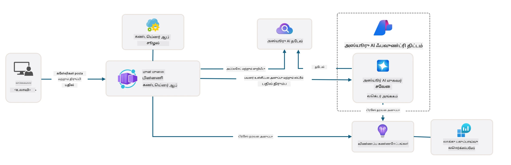

# 3. ஒரு டெம்ப்ளேட் பகுப்பாய்வு

!!! tip "இந்த மாட்யூலின் இறுதிக்குள் நீங்கள் இதைச் செய்யக் கூடியவனாக இருப்பீர்கள்"

    - [ ] GitHub Copilot-ஐ MCP சர்வர்களுடன் Azure உதவிக்காக இயக்கு
    - [ ] AZD டெம்ப்ளேட் கோப்பு அடுக்கமைப்பையும் கூறுகளையும் புரிந்து கொள்
    - [ ] infrastructure-as-code (Bicep) அமைப்பு மாதிரிகளை ஆராய்வு செய்
    - [ ] **லேப் 3:** GitHub Copilot-ஐ பயன்படுத்தி களஞ்சியக் கட்டமைப்பை ஆராய்ந்து புரிந்துகொள் 

---


AZD டெம்ப்ளேட்டுகள் மற்றும் Azure Developer CLI (`azd`) உதவியுடன், மாதிரி குறியீடு, அடித்தள மற்றும் கட்டமைப்பு கோப்புகளை வழங்கும் மாற்றுநிலை களஞ்சியங்களுடன் நாங்கள் எளிதாக எங்கள் AI அபிவிருத்தி பயணத்தை தொடங்கி வைக்க முடியும் - தயாராக நிறைவேற்றக்கூடிய _starter_ திட்டத்தின் வடிவில்.

**ஆனால் இப்போது, நாம் திட்டத்தின் கட்டமைப்பையும் குறியீட்டு அடிப்படையையும் புரிந்து கொண்டு AZD டெம்ப்ளேட்டை முந்தைய அனுபவமோ AZD பற்றிய முன்னறிவாடையோ இல்லாமல் தனிப்பயனாக்கக்கூடியதாக இருக்கும் வகையில் தெரிந்து கொள்ள வேண்டும்!**

---

## 1. GitHub Copilot-ஐ இயக்கு

### 1.1 GitHub Copilot Chat ஐ நிறுவுக

இப்பொழுது [GitHub Copilot with Agent Mode](https://code.visualstudio.com/docs/copilot/chat/chat-agent-mode)-ஐ ஆராய வேண்டிய நேரம். இப்போது, நாம் இயற்கை மொழியைப் பயன்படுத்தி உயர் மட்டத்தில் எNuestro task-ஐ விளக்கிக் கூறி, செயல்படுத்துதலுக்கு உதவி பெறலாம். இந்த லேபிற்காக, மாதாந்திர முடிவுகள் மற்றும் சந்தை உரையாடல்களுக்கு வரம்பு உள்ள [Copilot Free plan](https://github.com/github-copilot/signup)-ஐ பயன்படுத்துவோம்.

அணி மேம்பாட்டுத்தொகுப்பில் இருந்து நீக்ஸ்டென்ஷனை நிறுவலாம், ஆனால் உங்கள் Codespaces சூழலில் அது ஏற்கனவே கிடைக்கும். _Copilot ஐகான் ட்ராப்-டைவுனில் இருந்து `Open Chat`-ஐ கிளிக் செய்து - `What can you do?` போன்ற ஒரு ப்ராம்ப்டை টাইப் செய்யுங்கள்_ - உங்களை உள்நுழையுமாறு கேட்டுக் கொள்ளலாம். **GitHub Copilot Chat தயார் உள்ளது**.

### 1.2. MCP சர்வர்களை நிறுவுக

Agent மோடை பயனுள்ளதாக இருக்கச் செய்ய, அது அறிவினையும் செயல்களையும் பெற சரியான கருவிகளுக்கு அணுகலை தேவைப்படுகிறது. இதற்கு MCP சர்வர்கள் உதவும். நாங்கள் கீழ்க்கண்ட சர்வர்களை கான்பிகர் செய்வோம்:

1. [Azure MCP Server](../../../../../workshop/docs/instructions)
1. [Microsoft Docs MCP Server](../../../../../workshop/docs/instructions)

இந்தவற்றை செயல்படுத்த:

1. `.vscode/mcp.json` என்ற கோப்பை, அது இல்லையெனில் உருவாக்கவும்
1. அதில் கீழ்காணும் உள்ளடக்கத்தை நகலெடுத்து ஒட்டி - சர்வர்களை துவங்கவும்!
   ```json title=".vscode/mcp.json"
   {
      "servers": {
         "Azure MCP Server": {
            "command": "npx",
            "args": [
            "-y",
            "@azure/mcp@latest",
            "server",
            "start"
            ]
         },
         "microsoft.docs.mcp": {
            "type": "http",
            "url": "https://learn.microsoft.com/api/mcp"
         }
      }
   }
   ```

??? warning "npx நிறுவப்படவில்லை என்றால் ஒரு பிழை வரும் (பிழை சரி செய்ய விரிவாக்கத்துக்காக கிளிக் செய்யவும்)"

      இதை சரி செய்வதற்கு, `.devcontainer/devcontainer.json` கோப்பை திறந்து features பிரிவில் கீழ்காணும் வரியை சேர்க்கவும். பின்னர் கொண்டெய்னரை மறுசீரமைக்கவும். இப்பொழுது `npx` நிறுவப்பட்டிருப்பது கண்டு கொள்ளலாம்.

      ```title="" linenums="0"
         "features": {
            "ghcr.io/devcontainers/features/node:1": {},
            ...
         },
      ```

---

### 1.3. GitHub Copilot Chat ஐ பரிசோதனை செய்க

**முதலில் VS Code கமான்ட் லைனில் Azure உடன் அங்கீகரிக்க `az login` ஐ பயன்படுத்தவும்.**

நீங்கள் இப்போது உங்கள் Azure சந்தா நிலையை கேட்டு, நிலுவையில் உள்ள வளங்கள் அல்லது கட்டமைப்புகள் பற்றி கேள்விகள் கேட்க முடியும். இக்கீழ் உள்ள ப்ராம்ப்டுகளை முயற்சி செய்க:

1. `List my Azure resource groups`
1. `#foundry list my current deployments`

நீங்கள் Azure ஆவணங்களைப் பற்றியும் கேள்விகள் கேட்டு Microsoft Docs MCP சர்வர் அடிப்படையில் பதில்களைப் பெறலாம். இக்கீழ் உள்ள ப்ராம்ப்டுகளை முயற்சி செய்க:

1. `#microsoft_docs_search What is Azure Developer CLI?`
1. `#microsoft_docs_search Show me a Python tutorial to chat with deployed model`

அல்லது ஒரு பணியை நிறைவைப்பதற்கு குறியீட்டு மூலக்கூறுகளை கேட்கலாம். இந்த ப்ராம்ப்டை முயற்சி செய்யவும்.

1. `Give me a Python code example that uses AAD for an interactive chat client`

`Ask` மோடு இல், இது நீங்கள் நகலெடுத்து சோதிக்கக்கூடிய குறியீட்டை வழங்கும். `Agent` மோடு இல், இது தொடர்ந்து தொடர்புடைய வளங்களையும் உருவாக்கி கொடுக்கலாம் - உட்பட நிறுவல் ஸ்கிரிப்டுகள் மற்றும் ஆவணங்கள் - நீங்கள் அந்த பணியை நிறைவேற்ற உதவ.

**இப்பொழுது நீங்கள் களஞ்சியத்தை ஆராய தொடங்க தயாராக உள்ளீர்கள்**

---

## 2. கட்டமைப்பைப் பகுப்பாய்வு செய்

??? prompt "ASK: docs/images/architecture.png இல் உள்ள பயன்பாட்டு கட்டமைப்பை 1 பத்தியில் விளக்குங்கள்"

      இந்த பயன்பாடு Azure மேற்பரப்பில் கட்டாக்கப்பட்ட ஒரு AI-சக்தியூட்டப்பட்ட அரட்டையாடல் பயன்பாடு ஆகும், இது நவீன ஏஜென்ட் அடிப்படை கட்டமைப்பைக் காட்டுகிறது. தீர்வு முக்கியமாக முகப்பை பெருக்கி செயல்படுத்தும் Azure Container App-ஐச் சுற்றி அமைந்துள்ளது, இது பயனர் உள்ளீட்டை செயலாக்கி AI ஏஜென்டின் மூலம் அறிவார்ந்த பதில்களை உருவாக்குகின்றது. 
      
      இந்த கட்டமைப்பு Microsoft Foundry Project-ஐ AI திறன்களுக்கான அடித்தளமாக பயன்படுத்தி, மொழி மாதிரிகள் (உதாரணமாக gpt-4.1-mini) மற்றும் ஏஜென்ட் செயல்பாடுகளுக்கு Azure AI Services-ஐ இணைக்கின்றது. பயனர் தொடர்புகள் React அடிப்படை முனைப்பு மூலம் FastAPI பேக்எண்டு அடுக்கு வழியாக ஏஜென்ட் சேவையுடன் தொடர்பு கொண்டு பொருத்தமான பதில்களை உருவாக்குகின்றன. 
      
      அந்த அமைப்பு, பதிவேற்றப்பட்ட ஆவணங்களிலிருந்து தகவல்களை அணுக ஏஜென்டுக்குத் தேவையான அறிவு தேடலை கோப்பு தேடல் அல்லது Azure AI Search சேவையூடாக வழங்குவதன் மூலம் ஆதரிக்கின்றது. செயல்பாட்டு சிறந்த நிலைக்காக, கட்டமைப்பில் Application Insights மற்றும் Log Analytics Workspace போன்ற முழுமையான கண்காணிப்பு கருவிகள் உள்ளன, இது தொடர்ச்சி, பதிவேடு மற்றும் செயல்திறன் மேம்பாட்டிற்கு உதவுகிறது. 
      
      Azure Storage பயன்பாட்டு தரவுகள் மற்றும் கோப்பு பதிவேற்புகளுக்கு ப்ளாப் ஸ்டோரேஜை வழங்குகிறது, மேலும் Managed Identity மூலம் Azure வளங்களுக்கு பாதுகாப்பான அணுகலை உண்மையிலேயே நம்பிக்கையுடன் வழங்குகிறது. முழு தீர்வு தேர்வை உண்டாக்கக்கூடிய வகையில் வடிவமைக்கப்பட்டுள்ளது, கன்டெய்னரை அடிப்படையாகக் கொண்ட பயன்பாடு தேவைக்கேற்ப தன்னியக்கமாக ஸ்கேலை நிர்வகிக்கும்போது பாதுகாப்பு, கண்காணிப்பு மற்றும் CI/CD திறன்களைக் கொண்டுதான் Azure-ன் நிர்வகிக்கப்பட்ட சேவைகள் சூழலில் செயல்படுகிறது.



---

## 3. களஞ்சிய அமைப்பு

!!! prompt "ASK: டெம்ப்ளேட் கோப்புறை அமைப்பை விளக்கவும். முதலில் ஒரு காட்சி மர அடுக்கமைப்பை தொடங்குங்கள்."

??? info "பதில்: காட்சி மர அடுக்கமைப்பு"

      ```bash title="" 
      get-started-with-ai-agents/
      ├── 📋 Configuration & Setup
      │   ├── azure.yaml                    # Azure Developer CLI கட்டமைப்பு
      │   ├── docker-compose.yaml           # உள்ளூர் அபிவிருத்தி கன்டெய்னர்கள்
      │   ├── pyproject.toml                # Python திட்டக் கட்டமைப்பு
      │   ├── requirements-dev.txt          # அபிவிருத்தி சார்ந்த சார்புகள்
      │   └── .devcontainer/                # VS Code dev container அமைப்பு
      │
      ├── 🏗️ அடித்தளம் (infra/)
      │   ├── main.bicep                    # முக்கிய அடித்தள டெம்ப்ளேட்
      │   ├── api.bicep                     # API-க்கு தனித்துவமான வளங்கள்
      │   ├── main.parameters.json          # அடித்தள அளவுருக்கள்
      │   └── core/                         # மாட்யூலர் அடித்தள கூறுகள்
      │       ├── ai/                       # AI சேவை கட்டமைப்புகள்
      │       ├── host/                     # ஹோஸ்டிங் அடித்தளம்
      │       ├── monitor/                  # கண்காணிப்பு மற்றும் பதிவு
      │       ├── search/                   # Azure AI Search அமைப்பு
      │       ├── security/                 # பாதுகாப்பு மற்றும் அடையாளம்
      │       └── storage/                  # ஸ்டோரேஜ் அக்கவுண்ட் கட்டமைப்புகள்
      │
      ├── 💻 பயன்பாட்டு மூலக் கோப்புகள் (src/)
      │   ├── api/                          # பேக்எண்டு API
      │   │   ├── main.py                   # FastAPI செயலி நுழைவு
      │   │   ├── routes.py                 # API பாதை வரையறைகள்
      │   │   ├── search_index_manager.py   # தேடல் செயல்பாடு
      │   │   ├── data/                     # API தரவு செயலாக்கம்
      │   │   ├── static/                   # நிலையான வலை சொத்துகள்
      │   │   └── templates/                # HTML டெம்ப்ளேட்டுகள்
      │   ├── frontend/                     # React/TypeScript முனைப் பகுதி
      │   │   ├── package.json              # Node.js சார்புகள்
      │   │   ├── vite.config.ts            # Vite கட்டமைப்பு
      │   │   └── src/                      # முனைப் பகுதி மூலக் குறிகள்
      │   ├── data/                         # மாதிரி தரவு கோப்புகள்
      │   │   └── embeddings.csv            # முறையாகக் கணக்கிடப்பட்ட embeddings
      │   ├── files/                        # அறிவு ஆதார கோப்புகள்
      │   │   ├── customer_info_*.json      # வாடிக்கையாளர் தரவு மாதிரிகள்
      │   │   └── product_info_*.md         # தயாரிப்பு ஆவணங்கள்
      │   ├── Dockerfile                    # கன்டெய்னர் கட்டமைப்பு
      │   └── requirements.txt              # Python சார்புகள்
      │
      ├── 🔧 ஆட்டோமேஷன் & ஸ்கிரிப்டுகள் (scripts/)
      │   ├── postdeploy.sh/.ps1           # பதிப்பின்பின் அமைப்பு
      │   ├── setup_credential.sh/.ps1     # அங்கீகார அமைப்பு
      │   ├── validate_env_vars.sh/.ps1    # சூழ்நிலை மாறிலிகள் சரிபார்ப்பு
      │   └── resolve_model_quota.sh/.ps1  # மாதிரி கொட்டோ நிர்வாகம்
      │
      ├── 🧪 சோதனை & மதிப்பீடு
      │   ├── tests/                        # யூனிட் மற்றும் இன்டிக்ரேஷன் சோதனைகள்
      │   │   └── test_search_index_manager.py
      │   ├── evals/                        # ஏஜென்ட் மதிப்பீடு அமைப்பு
      │   │   ├── evaluate.py               # மதிப்பீடு இயக்கி
      │   │   ├── eval-queries.json         # சோதனை கேள்விகள்
      │   │   └── eval-action-data-path.json
      │   ├── sandbox/                      # அபிவிருத்தி விளையாட்டு
      │   │   ├── 1-quickstart.py           # துவக்க உதாரணங்கள்
      │   │   └── aad-interactive-chat.py   # அங்கீகாரம் உதாரணங்கள்
      │   └── airedteaming/                 # AI பாதுகாப்பு மதிப்பீடு
      │       └── ai_redteaming.py          # ரெட் டீம் சோதனை
      │
      ├── 📚 ஆவணம் (docs/)
      │   ├── deployment.md                 # பதிவேற்ற வழிகாட்டு
      │   ├── local_development.md          # உள்ளூர் அமைப்பு வழிமுறைகள்
      │   ├── troubleshooting.md            # பொதுவான பிரச்சினைகள் & தீர்வுகள்
      │   ├── azure_account_setup.md        # Azure முன்-தேவைகள்
      │   └── images/                       # ஆவண சொத்துகள்
      │
      └── 📄 திட்ட மெட்டாடேட்டா
         ├── README.md                     # திட்டம் பற்றி மேற்பார்வை
         ├── CODE_OF_CONDUCT.md           # சமூக வழிகாட்டுதல்கள்
         ├── CONTRIBUTING.md              # பங்களிப்பு வழிகாட்டி
         ├── LICENSE                      # உரிமம் விதிகள்
         └── next-steps.md                # பதிவேற்றம் பிறகு வழிகாட்டல்
      ```

### 3.1. கோர் செயலி கட்டமைப்பு

இந்த டெம்ப்ளேட் ஒரு **முழு ஸ்டாக் வலை பயன்பாட்டு** மாதிரியை பின்பற்றுகிறது, உட்பட:

- **பேக்எண்டு**: Python FastAPI மூலம் Azure AI ஒருங்கிணைப்புடன்
- **முனைப் பகுதி**: TypeScript/React மற்றும் Vite கட்டமைப்பு
- **அடித்தளம்**: மேக வளங்களுக்கு Azure Bicep டெம்ப்ளேட்டுகள்
- **கன்டெய்னரைசேஷன்**: ஒரே மாதிரி வழங்கற்காக Docker

### 3.2 Infra As Code (bicep)

அடித்தள அடுக்கு **Azure Bicep** டெம்ப்ளேட்டுகளை மாட்யூலாக ஒழுங்குபடுத்தி பயன்படுத்துகிறது:

   - **`main.bicep`**: அனைத்து Azure வளங்களையும் ஒருங்கிணைக்கிறது
   - **`core/` மாட்யூல்கள்**: வெவ்வேறு சேவைகளுக்கான மறுபயன்பாட்டுக்குரிய கூறுகள்
      - AI சேவைகள் (Microsoft Foundry Models, AI Search)
      - கன்டெய்னர் ஹோஸ்டிங் (Azure Container Apps)
      - கண்காணிப்பு (Application Insights, Log Analytics)
      - பாதுகாப்பு (Key Vault, Managed Identity)

### 3.3 பயன்பாட்டு மூலக் கோப்புகள் (`src/`)

**பேக்எண்டு API (`src/api/`)**:

- FastAPI-இல் அடிப்படை REST API
- Foundry Agents ஒருங்கிணைப்பு
- அறிவு மீட்பு हेतु Search index நிர்வாகம்
- கோப்பு பதிவேற்றம் மற்றும் செயலாக்க திறன்கள்

**முனைப் பகுதி (`src/frontend/`)**:

- நவீன React/TypeScript ஒரே பக்கப் பயன்பாடு
- விரைவு அபிவிருத்தி மற்றும் சரியான பில்ட்களுக்காக Vite
- ஏஜென்ட் தொடர்புகளுக்கான அரட்டைக் கூறியமைப்பு

**அறிவுநடைத் தளம் (`src/files/`)**:

- மாதிரி வாடிக்கையாளர் மற்றும் தயாரிப்பு தரவு
- கோப்பு அடிப்படையிலான அறிவு மீட்பை காண்பிக்கும்
- JSON மற்றும் Markdown வடிவில் எடுத்துக்காட்டுகள்


### 3.4 DevOps & ஆட்டோமேஷன்

**ஸ்கிரிப்டுகள் (`scripts/`)**:

- பல்வேறு தளங்களுக்கு பொருந்தக்கூடிய PowerShell மற்றும் Bash ஸ்கிரிப்டுகள்
- சூழ்நிலை சரிபார்ப்பு மற்றும் அமைவு
- பதிப்பின்பின் கட்டமைப்புகள்
- மாதிரி கொட்டோ நிர்வாகம்

**Azure Developer CLI ஒருங்கிணைப்பு**:

- `azure.yaml` மூலம் `azd` பணிமுறைகளுக்கான கட்டமைப்பு
- தானாகProvision மற்றும் deployment செயல்முறை
- சூழ்நிலை மாறிலி மேலாண்மை

### 3.5 சோதனை & தரநிலை உறுதி

**மதிப்பீட்டு அமைப்பு (`evals/`)**:

- ஏஜென்ட் செயல்திறன் மதிப்பீடு
- கேள்வி-பதில் தரநிலை சோதனைகள்
- தானாக மதிப்பீடு செய்யும் குழாய்

**AI பாதுகாப்பு (`airedteaming/`)**:

- AI பாதுகாப்புக்கான ரெட்-டீம் சோதனைகள்
- பாதுகாப்பு குறைபாடுகள் ஸ்கான்
- பொறுப்பான AI நடைமுறைகள்

---

## 4. வாழ்த்துக்கள் 🏆

நீங்கள் MCP சர்வர்களுடன் GitHub Copilot Chat-ஐ வெற்றிகரமாக பயன்படுத்தி, களஞ்சியத்தை ஆராய்ந்தீர்கள்.

- [X] GitHub Copilot-ஐ Azure க்காக இயக்கியது
- [X] பயன்பாட்டு கட்டமைப்பை புரிந்து கொண்டது
- [X] AZD டெம்ப்ளேட் அமைப்பை ஆராய்ந்தது

இது இந்த டெம்ப்ளேட்டிற்கான _infrastructure as code_ சொத்துகளின் உணர்வை தருகிறது. அடுத்ததாக, நாம் AZD-க்கான கட்டமைப்பு கோப்பைப் பார்க்கப் போகிறோம்.

---

<!-- CO-OP TRANSLATOR DISCLAIMER START -->
மறுப்பு அறிவிப்பு:
இந்த ஆவணம் AI மொழிபெயர்ப்பு சேவையான [Co-op Translator](https://github.com/Azure/co-op-translator) மூலம் மொழிபெயர்க்கப்பட்டது. நாங்கள் துல்லியத்திற்காக முயற்சிப்பினாலும், தானாக செய்யப்பட்ட மொழிபெயர்ப்புகளில் பிழைகள் அல்லது தவறுகள் இருக்கக்கூடும் என்பதை தயவுசெய்து நினைவில் கொள்ளவும். மூல மொழியில் உள்ள அசல் ஆவணம் அதிகாரபூர்வமான மூலமாகக் கருதப்பட வேண்டும். முக்கியமான தகவல்களுக்காக, தொழில்நுட்பபூர்வமான மனித மொழிபெயர்ப்பாளர்களின் சேவையைப் பயன்படுத்துவது பரிந்துரைக்கப்படுகிறது. இந்த மொழிபெயர்ப்பைப் பயன்படுத்துவதால் ஏற்படும் எந்தவொரு தவறான புரிதலுக்கோ அல்லது தவறான விளக்கத்திற்கோ நாங்கள் பொறுப்பேற்கமாட்டோம்.
<!-- CO-OP TRANSLATOR DISCLAIMER END -->