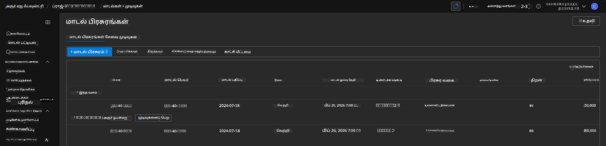
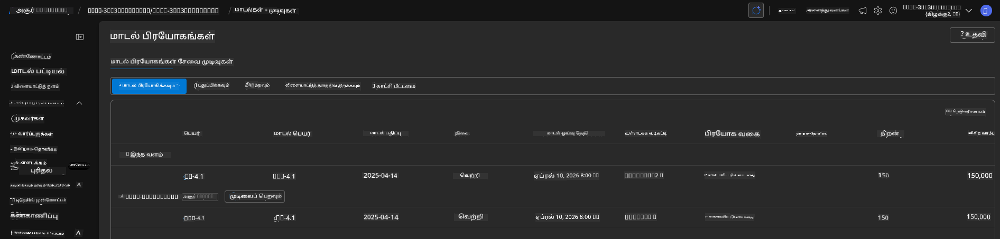

<!--
CO_OP_TRANSLATOR_METADATA:
{
  "original_hash": "6539a34c770f3ceff282370d72ee74dc",
  "translation_date": "2025-10-11T15:45:38+00:00",
  "source_file": "workshop/docs/instructions/6-Teardown-Infrastructure.md",
  "language_code": "ta"
}
-->
# 6. உள்கட்டமைப்பை அகற்றுதல்

!!! tip "இந்த பகுதியின் முடிவில் நீங்கள் செய்யக்கூடியவை"

    - [ ] உருப்படி
    - [ ] உருப்படி
    - [ ] உருப்படி

---

## கூடுதல் பயிற்சிகள்

திட்டத்தை அகற்றுவதற்கு முன், சில நிமிடங்கள் திறந்த முடிவற்ற ஆராய்ச்சிக்காக செலவிடுங்கள்.

!!! danger "NITYA-TODO: முயற்சிக்க சில உந்துதல்களை உருவாக்கவும்"

---

## உள்கட்டமைப்பை அகற்றுதல்

1. உள்கட்டமைப்பை அகற்றுவது எளிது:
      
      ```bash title="" linenums="0"
      azd down --purge
      ```
1. `--purge` கொடி மென்மையான முறையில் நீக்கப்பட்ட Cognitive Service வளங்களை கூட அகற்றுகிறது, இதனால் இந்த வளங்கள் பிடித்திருக்கும் ஒதுக்கீடு விடுவிக்கப்படும். முடிந்தவுடன், நீங்கள் இதைப் போன்றதை காண்பீர்கள்:
      
      ```bash title="" linenums="0"
      ? Total resources to delete: 11, are you sure you want to continue? Yes
      Deleting your resources can take some time.
      (✓) Done: Deleted resource group rg-nitya-mshack-azd
      (✓) Done: Purging Cognitive Account: aoai-3cz3zkynhvpbc

      SUCCESS: Your application was removed from Azure in 11 minutes 4 seconds.
      ```

1. (விருப்பத்தேர்வு) நீங்கள் இப்போது மீண்டும் `azd up` இயக்கினால், சுற்றுப்புற மாறி மாற்றப்பட்டு (மற்றும் சேமிக்கப்பட்டு) உள்ளூர் `.azure` கோப்பகத்தில் இருப்பதால் gpt-4.1 மாதிரி நிறுவப்படும் என்பதை கவனிக்கலாம்.

      மாதிரி நிறுவல்கள் **முன்** இங்கே உள்ளன:

      

      இது **பிறகு** இங்கே உள்ளது:
      

---

**குறிப்பு**:  
இந்த ஆவணம் [Co-op Translator](https://github.com/Azure/co-op-translator) என்ற AI மொழிபெயர்ப்பு சேவையைப் பயன்படுத்தி மொழிபெயர்க்கப்பட்டுள்ளது. நாங்கள் துல்லியத்திற்காக முயற்சிக்கிறோம், ஆனால் தானியங்கி மொழிபெயர்ப்புகளில் பிழைகள் அல்லது தவறான தகவல்கள் இருக்கக்கூடும் என்பதை தயவுசெய்து கவனத்தில் கொள்ளவும். அதன் தாய்மொழியில் உள்ள மூல ஆவணம் அதிகாரப்பூர்வ ஆதாரமாக கருதப்பட வேண்டும். முக்கியமான தகவல்களுக்கு, தொழில்முறை மனித மொழிபெயர்ப்பு பரிந்துரைக்கப்படுகிறது. இந்த மொழிபெயர்ப்பைப் பயன்படுத்துவதால் ஏற்படும் எந்த தவறான புரிதல்கள் அல்லது தவறான விளக்கங்களுக்கு நாங்கள் பொறுப்பல்ல.