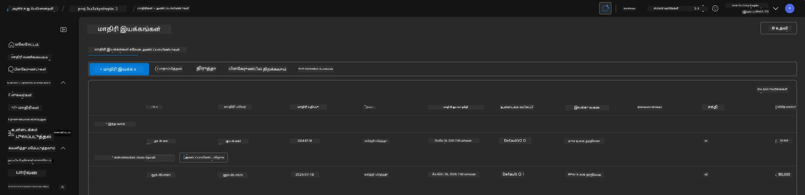
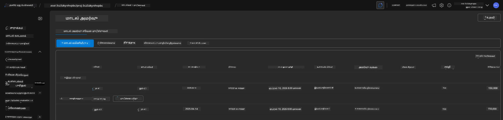

# 6. கட்டமைப்பை அகற்றுதல்

!!! tip "இந்த மாட்யூலின் முடிவில் நீங்கள் இதைச் செய்ய முடியும்"

    - [ ] வளங்களை சுத்தம் செய்தல் மற்றும் செலவுக் கட்டுப்பாட்டின் முக்கியத்துவத்தைப் புரிந்துகொள்ளவும்
    - [ ] பாதுகாப்பாக கட்டமைப்புகளை நீக்க `azd down` ஐ பயன்படுத்தவும்
    - [ ] தேவையானால் மென்மையாக அகற்றப்பட்ட cognitive services-ஐ மீட்டெடுக்கவும்
    - [ ] **Lab 6:** Azure வளங்களை சுத்தம் செய்து அகற்றலான்மையைச் சரிபார்க்கவும்

---

## கூடுதல் பயிற்சிகள்

ப்ராஜெக்டை அகற்றுவதற்கு முன், சில நிமிடங்கள் திறந்தவையான ஆராய்ச்சிக்காக செலவிடுங்கள்.

!!! info "இந்த ஆராய்ச்சி தூண்டுகோள்களை முயற்சிக்கவும்"

    **GitHub Copilot உடன் சோதனை செய்யவும்:**
    
    1. கேட்கவும்: `What other AZD templates could I try for multi-agent scenarios?`
    2. கேட்கவும்: `How can I customize the agent instructions for a healthcare use case?`
    3. கேட்கவும்: `What environment variables control cost optimization?`
    
    **Azure போர்டலை ஆராயுங்கள்:**
    
    1. உங்கள் deployment-க்கான Application Insights அளவுருக்களை (metrics) பரிசீலிக்கவும்
    2. Provision செய்யப்பட்ட வளங்களுக்கான செலவுப் பகுப்பாய்வை சரிபார்க்கவும்
    3. Microsoft Foundry போர்டல் agent playground-ஐ இன்னும் ஒரு முறை ஆராயுங்கள்

---

## கட்டமைப்பை நீக்குதல்

1. கட்டமைப்பை அகற்றுவது இதுபோல எளிது:
      
      ```bash title="" linenums="0"
      azd down --purge
      ```
1. The `--purge` flag ensures that it also purges soft-deleted Cognitive Service resources, thereby releasing quota held by these resources. Once complete you will see something like this:
      
      ```bash title="" linenums="0"
      ? Total resources to delete: 11, are you sure you want to continue? Yes
      Deleting your resources can take some time.
      (✓) Done: Deleted resource group rg-nitya-mshack-azd
      (✓) Done: Purging Cognitive Account: aoai-3cz3zkynhvpbc

      SUCCESS: Your application was removed from Azure in 11 minutes 4 seconds.
      ```

1. (Optional) இப்போது நீங்கள் மீண்டும் `azd up` இயக்கினால், சுற்றுச்சூழல் மாறி மாற்றப்பட்டு (மற்றும் local `.azure` கோப்பகத்தில் சேமிக்கப்பட்டதால்) gpt-4.1 மாதிரி deploy ஆகும் என்பதை நீங்கள் கவனிப்பீர்கள். 

      இங்கே மாதிரி டெபிளாய்மெண்டுகள் **முன்பு**:

      

      மற்றும் இங்கே அது **பின்னர்**:
      

---

<!-- CO-OP TRANSLATOR DISCLAIMER START -->
அறிவிப்பு:
இந்த ஆவணம் AI மொழிபெயர்ப்பு சேவை [Co-op Translator](https://github.com/Azure/co-op-translator) மூலம் மொழிபெயர்க்கப்பட்டுள்ளது. நாங்கள் துல்லியத்திற்காக முயற்சித்தாலும், தானியங்கி மொழிபெயர்ப்புகளில் பிழைகள் அல்லது தவறான தகவல்கள் கலந்து இருக்கக்கூடும் என்பதை தயவுசெய்து கவனத்தில் கொள்ளுங்கள். மூல மொழியில் உள்ள அசல் ஆவணத்தை அதிகாரப்பூர்வ ஆதாரமாக கருத வேண்டும். முக்கியமான தகவல்களுக்கு, தொழில்முறை மனித மொழிபெயர்ப்பரை பாரம்பரியமாகப் பயன்படுத்த அறிவுறுத்தப்படுகிறோம். இந்த மொழிபெயர்ப்பின் பயன்பாட்டினால் ஏற்படும் எந்த தவறான புரிதலும் அல்லது தவறான விளக்கத்திற்கும் நாங்கள் பொறுப்பல்லவராக இருக்கிறோம்.
<!-- CO-OP TRANSLATOR DISCLAIMER END -->