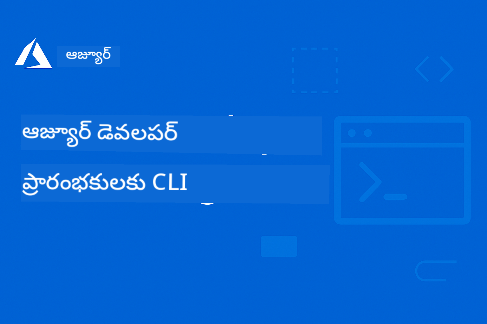

<!--
CO_OP_TRANSLATOR_METADATA:
{
  "original_hash": "b2e94dc30cab0675918a6ad34863b05d",
  "translation_date": "2025-11-25T06:41:21+00:00",
  "source_file": "README.md",
  "language_code": "te"
}
-->
# AZD ప్రారంభం: ఒక నిర్మితమైన అభ్యాస ప్రయాణం

 

[](https://GitHub.com/microsoft/azd-for-beginners/watchers/)
[](https://GitHub.com/microsoft/azd-for-beginners/network/)
[](https://GitHub.com/microsoft/azd-for-beginners/stargazers/)

[](https://discord.gg/microsoft-azure)
[](https://discord.gg/nTYy5BXMWG)

## ఈ కోర్సును ప్రారంభించడం

మీ AZD అభ్యాస ప్రయాణాన్ని ప్రారంభించడానికి ఈ దశలను అనుసరించండి:

1. **రిపోజిటరీని ఫోర్క్ చేయండి**: క్లిక్ చేయండి [](https://GitHub.com/microsoft/azd-for-beginners/fork)
2. **రిపోజిటరీని క్లోన్ చేయండి**: `git clone https://github.com/microsoft/azd-for-beginners.git`
3. **కమ్యూనిటీతో చేరండి**: [Azure Discord Communities](https://discord.com/invite/ByRwuEEgH4) నుండి నిపుణుల మద్దతు పొందండి
4. **మీ అభ్యాస మార్గాన్ని ఎంచుకోండి**: మీ అనుభవ స్థాయికి సరిపోయే చాప్టర్‌ను క్రింద ఎంచుకోండి

### బహుభాషా మద్దతు

#### ఆటోమేటెడ్ అనువాదాలు (ఎల్లప్పుడూ తాజా)

<!-- CO-OP TRANSLATOR LANGUAGES TABLE START -->
[Arabic](../ar/README.md) | [Bengali](../bn/README.md) | [Bulgarian](../bg/README.md) | [Burmese (Myanmar)](../my/README.md) | [Chinese (Simplified)](../zh/README.md) | [Chinese (Traditional, Hong Kong)](../hk/README.md) | [Chinese (Traditional, Macau)](../mo/README.md) | [Chinese (Traditional, Taiwan)](../tw/README.md) | [Croatian](../hr/README.md) | [Czech](../cs/README.md) | [Danish](../da/README.md) | [Dutch](../nl/README.md) | [Estonian](../et/README.md) | [Finnish](../fi/README.md) | [French](../fr/README.md) | [German](../de/README.md) | [Greek](../el/README.md) | [Hebrew](../he/README.md) | [Hindi](../hi/README.md) | [Hungarian](../hu/README.md) | [Indonesian](../id/README.md) | [Italian](../it/README.md) | [Japanese](../ja/README.md) | [Korean](../ko/README.md) | [Lithuanian](../lt/README.md) | [Malay](../ms/README.md) | [Marathi](../mr/README.md) | [Nepali](../ne/README.md) | [Norwegian](../no/README.md) | [Persian (Farsi)](../fa/README.md) | [Polish](../pl/README.md) | [Portuguese (Brazil)](../br/README.md) | [Portuguese (Portugal)](../pt/README.md) | [Punjabi (Gurmukhi)](../pa/README.md) | [Romanian](../ro/README.md) | [Russian](../ru/README.md) | [Serbian (Cyrillic)](../sr/README.md) | [Slovak](../sk/README.md) | [Slovenian](../sl/README.md) | [Spanish](../es/README.md) | [Swahili](../sw/README.md) | [Swedish](../sv/README.md) | [Tagalog (Filipino)](../tl/README.md) | [Tamil](../ta/README.md) | [Thai](../th/README.md) | [Turkish](../tr/README.md) | [Ukrainian](../uk/README.md) | [Urdu](../ur/README.md) | [Vietnamese](../vi/README.md)
<!-- CO-OP TRANSLATOR LANGUAGES TABLE END -->

## కోర్సు అవలోకనం

Azure Developer CLI (azd) ను క్రమబద్ధమైన అధ్యాయాల ద్వారా నేర్చుకోండి, ఇది అభ్యాసాన్ని మెరుగుపరచడానికి రూపొందించబడింది. **Microsoft Foundry ఇంటిగ్రేషన్‌తో AI అప్లికేషన్ డిప్లాయ్‌మెంట్‌పై ప్రత్యేక దృష్టి.**

### ఆధునిక డెవలపర్లకు ఈ కోర్సు ఎందుకు అవసరం

Microsoft Foundry Discord కమ్యూనిటీ నుండి పొందిన సమాచారం ప్రకారం, **45% డెవలపర్లు AI పనిలో AZD ఉపయోగించాలనుకుంటున్నారు**, కానీ ఈ సమస్యలను ఎదుర్కొంటున్నారు:
- క్లిష్టమైన బహు-సర్వీస్ AI ఆర్కిటెక్చర్లు
- ప్రొడక్షన్ AI డిప్లాయ్‌మెంట్ ఉత్తమ పద్ధతులు  
- Azure AI సేవల ఇంటిగ్రేషన్ మరియు కాన్ఫిగరేషన్
- AI పనిలో ఖర్చు ఆప్టిమైజేషన్
- AI-స్పెసిఫిక్ డిప్లాయ్‌మెంట్ సమస్యల పరిష్కారం

### అభ్యాస లక్ష్యాలు

ఈ నిర్మిత కోర్సును పూర్తి చేయడం ద్వారా, మీరు:
- **AZD ప్రాథమికాలను నేర్చుకోండి**: కోర్ కాన్సెప్ట్‌లు, ఇన్‌స్టాలేషన్, మరియు కాన్ఫిగరేషన్
- **AI అప్లికేషన్లను డిప్లాయ్ చేయండి**: Microsoft Foundry సేవలతో AZD ఉపయోగించండి
- **ఇన్‌ఫ్రాస్ట్రక్చర్ ఎస్ కోడ్‌ను అమలు చేయండి**: Bicep టెంప్లేట్‌లతో Azure వనరులను నిర్వహించండి
- **డిప్లాయ్‌మెంట్ సమస్యలను పరిష్కరించండి**: సాధారణ సమస్యలను పరిష్కరించండి మరియు డీబగ్ చేయండి
- **ప్రొడక్షన్ కోసం ఆప్టిమైజ్ చేయండి**: భద్రత, స్కేలింగ్, మానిటరింగ్, మరియు ఖర్చు నిర్వహణ
- **బహుళ ఏజెంట్ పరిష్కారాలను నిర్మించండి**: క్లిష్టమైన AI ఆర్కిటెక్చర్లను డిప్లాయ్ చేయండి

## 📚 అభ్యాస అధ్యాయాలు

*మీ అనుభవ స్థాయి మరియు లక్ష్యాల ఆధారంగా మీ అభ్యాస మార్గాన్ని ఎంచుకోండి*

### 🚀 అధ్యాయం 1: ఫౌండేషన్ & క్విక్ స్టార్ట్
**అవసరాలు**: Azure సబ్‌స్క్రిప్షన్, ప్రాథమిక కమాండ్ లైన్ పరిజ్ఞానం  
**వ్యవధి**: 30-45 నిమిషాలు  
**సంక్లిష్టత**: ⭐

#### మీరు నేర్చుకునేది
- Azure Developer CLI ప్రాథమికాలను అర్థం చేసుకోవడం
- మీ ప్లాట్‌ఫారమ్‌పై AZD ఇన్‌స్టాల్ చేయడం
- మీ మొదటి విజయవంతమైన డిప్లాయ్‌మెంట్

#### అభ్యాస వనరులు
- **🎯 ఇక్కడ ప్రారంభించండి**: [Azure Developer CLI అంటే ఏమిటి?](../..)
- **📖 సిద్ధాంతం**: [AZD ప్రాథమికాలు](docs/getting-started/azd-basics.md) - కోర్ కాన్సెప్ట్‌లు మరియు పదజాలం
- **⚙️ సెటప్**: [ఇన్‌స్టాలేషన్ & సెటప్](docs/getting-started/installation.md) - ప్లాట్‌ఫారమ్-స్పెసిఫిక్ గైడ్‌లు
- **🛠️ ప్రాక్టికల్**: [మీ మొదటి ప్రాజెక్ట్](docs/getting-started/first-project.md) - స్టెప్-బై-స్టెప్ ట్యుటోరియల్
- **📋 క్విక్ రిఫరెన్స్**: [కమాండ్ చీట్ షీట్](resources/cheat-sheet.md)

#### ప్రాక్టికల్ వ్యాయామాలు
```bash
# త్వరిత ఇన్‌స్టాలేషన్ తనిఖీ
azd version

# మీ మొదటి అప్లికేషన్‌ను మోహరించండి
azd init --template todo-nodejs-mongo
azd up
```

**💡 అధ్యాయం ఫలితం**: AZD ఉపయోగించి ఒక సాధారణ వెబ్ అప్లికేషన్‌ను Azureలో విజయవంతంగా డిప్లాయ్ చేయండి

**✅ విజయ ధృవీకరణ:**
```bash
# అధ్యాయం 1 పూర్తి చేసిన తర్వాత, మీరు చేయగలరు:
azd version              # ఇన్‌స్టాల్ చేసిన వెర్షన్‌ను చూపిస్తుంది
azd init --template todo-nodejs-mongo  # ప్రాజెక్ట్‌ను ప్రారంభిస్తుంది
azd up                  # Azureకి డిప్లాయ్ చేస్తుంది
azd show                # నడుస్తున్న యాప్ URLను చూపిస్తుంది
# అప్లికేషన్ బ్రౌజర్‌లో తెరుచుకుంటుంది మరియు పనిచేస్తుంది
azd down --force --purge  # వనరులను శుభ్రం చేస్తుంది
```

**📊 సమయ పెట్టుబడి:** 30-45 నిమిషాలు  
**📈 నైపుణ్య స్థాయి తర్వాత:** స్వతంత్రంగా ప్రాథమిక అప్లికేషన్లను డిప్లాయ్ చేయగలరు

**✅ విజయ ధృవీకరణ:**
```bash
# అధ్యాయం 1 పూర్తి చేసిన తర్వాత, మీరు చేయగలరు:
azd version              # ఇన్‌స్టాల్ చేసిన వెర్షన్‌ను చూపిస్తుంది
azd init --template todo-nodejs-mongo  # ప్రాజెక్ట్‌ను ప్రారంభిస్తుంది
azd up                  # Azureకి పంపిణీ చేస్తుంది
azd show                # నడుస్తున్న యాప్ URLను చూపిస్తుంది
# అప్లికేషన్ బ్రౌజర్‌లో తెరుచుకుంటుంది మరియు పనిచేస్తుంది
azd down --force --purge  # వనరులను శుభ్రం చేస్తుంది
```

**📊 సమయ పెట్టుబడి:** 30-45 నిమిషాలు  
**📈 నైపుణ్య స్థాయి తర్వాత:** స్వతంత్రంగా ప్రాథమిక అప్లికేషన్లను డిప్లాయ్ చేయగలరు

---

### 🤖 అధ్యాయం 2: AI-ఫస్ట్ డెవలప్మెంట్ (AI డెవలపర్లకు సిఫార్సు)
**అవసరాలు**: అధ్యాయం 1 పూర్తి చేయాలి  
**వ్యవధి**: 1-2 గంటలు  
**సంక్లిష్టత**: ⭐⭐

#### మీరు నేర్చుకునేది
- AZDతో Microsoft Foundry ఇంటిగ్రేషన్
- AI-పవర్డ్ అప్లికేషన్లను డిప్లాయ్ చేయడం
- AI సేవల కాన్ఫిగరేషన్‌ను అర్థం చేసుకోవడం

#### అభ్యాస వనరులు
- **🎯 ఇక్కడ ప్రారంభించండి**: [Microsoft Foundry ఇంటిగ్రేషన్](docs/microsoft-foundry/microsoft-foundry-integration.md)
- **📖 నమూనాలు**: [AI మోడల్ డిప్లాయ్‌మెంట్](docs/microsoft-foundry/ai-model-deployment.md) - AI మోడళ్లను డిప్లాయ్ చేయడం మరియు నిర్వహించడం
- **🛠️ వర్క్‌షాప్**: [AI వర్క్‌షాప్ ల్యాబ్](docs/microsoft-foundry/ai-workshop-lab.md) - మీ AI పరిష్కారాలను AZD-రెడీ చేయండి
- **🎥 ఇంటరాక్టివ్ గైడ్**: [వర్క్‌షాప్ మెటీరియల్స్](workshop/README.md) - MkDocs * DevContainer వాతావరణంతో బ్రౌజర్-ఆధారిత అభ్యాసం
- **📋 టెంప్లేట్‌లు**: [Microsoft Foundry టెంప్లేట్‌లు](../..)
- **📝 ఉదాహరణలు**: [AZD డిప్లాయ్‌మెంట్ ఉదాహరణలు](examples/README.md)

#### ప్రాక్టికల్ వ్యాయామాలు
```bash
# మీ మొదటి AI అప్లికేషన్‌ను మోహరించండి
azd init --template azure-search-openai-demo
azd up

# అదనపు AI టెంప్లేట్లను ప్రయత్నించండి
azd init --template openai-chat-app-quickstart
azd init --template agent-openai-python-prompty
```

**💡 అధ్యాయం ఫలితం**: RAG సామర్థ్యాలతో AI-పవర్డ్ చాట్ అప్లికేషన్‌ను డిప్లాయ్ చేయండి మరియు కాన్ఫిగర్ చేయండి

**✅ విజయ ధృవీకరణ:**
```bash
# అధ్యాయం 2 తర్వాత, మీరు చేయగలగాలి:
azd init --template azure-search-openai-demo
azd up
# AI చాట్ ఇంటర్ఫేస్‌ను పరీక్షించండి
# ప్రశ్నలు అడిగి, మూలాలతో AI ఆధారిత సమాధానాలను పొందండి
# శోధన సమీకరణ పనిచేస్తుందో లేదో ధృవీకరించండి
azd monitor  # అప్లికేషన్ ఇన్‌సైట్స్ టెలిమెట్రీని చూపుతుందో లేదో తనిఖీ చేయండి
azd down --force --purge
```

**📊 సమయ పెట్టుబడి:** 1-2 గంటలు  
**📈 నైపుణ్య స్థాయి తర్వాత:** ప్రొడక్షన్-రెడీ AI అప్లికేషన్లను డిప్లాయ్ చేయగలరు  
**💰 ఖర్చు అవగాహన:** $80-150/నెల అభివృద్ధి ఖర్చులు, $300-3500/నెల ప్రొడక్షన్ ఖర్చులు

#### 💰 AI డిప్లాయ్‌మెంట్‌లకు ఖర్చు పరిగణనలు

**అభివృద్ధి వాతావరణం (అంచనా $80-150/నెల):**
- Azure OpenAI (పే-అస్-యూ-గో): $0-50/నెల (టోకెన్ వినియోగంపై ఆధారపడి ఉంటుంది)
- AI సెర్చ్ (బేసిక్ టియర్): $75/నెల
- కంటైనర్ అప్లికేషన్లు (కన్సంప్షన్): $0-20/నెల
- స్టోరేజ్ (స్టాండర్డ్): $1-5/నెల

**ప్రొడక్షన్ వాతావరణం (అంచనా $300-3,500+/నెల):**
- Azure OpenAI (PTU కోసం స్థిరమైన పనితీరు): $3,000+/నెల లేదా అధిక వాల్యూమ్‌తో పే-అస్-గో
- AI సెర్చ్ (స్టాండర్డ్ టియర్): $250/నెల
- కంటైనర్ అప్లికేషన్లు (డెడికేటెడ్): $50-100/నెల
- అప్లికేషన్ ఇన్‌సైట్స్: $5-50/నెల
- స్టోరేజ్ (ప్రీమియం): $10-50/నెల

**💡 ఖర్చు ఆప్టిమైజేషన్ చిట్కాలు:**
- అభ్యాసం కోసం **ఫ్రీ టియర్** Azure OpenAI ఉపయోగించండి (50,000 టోకెన్లు/నెల ఉచితం)
- `azd down` ను అమలు చేసి అభివృద్ధి చేయని సమయంలో వనరులను డీఅలోకేట్ చేయండి
- కన్సంప్షన్-ఆధారిత బిల్లింగ్‌తో ప్రారంభించండి, ప్రొడక్షన్ కోసం మాత్రమే PTUకి అప్‌గ్రేడ్ చేయండి
- డిప్లాయ్‌మెంట్‌కు ముందు ఖర్చులను అంచనా వేయడానికి `azd provision --preview` ఉపయోగించండి
- ఆటో-స్కేలింగ్‌ను ప్రారంభించండి: వాస్తవ వినియోగానికి మాత్రమే చెల్లించండి

**ఖర్చు మానిటరింగ్:**
```bash
# అంచనా నెలవారీ ఖర్చులను తనిఖీ చేయండి
azd provision --preview

# Azure Portal లో నిజమైన ఖర్చులను పర్యవేక్షించండి
az consumption budget list --resource-group <your-rg>
```

---

### ⚙️ అధ్యాయం 3: కాన్ఫిగరేషన్ & ఆథెంటికేషన్
**అవసరాలు**: అధ్యాయం 1 పూర్తి చేయాలి  
**వ్యవధి**: 45-60 నిమిషాలు  
**సంక్లిష్టత**: ⭐⭐

#### మీరు నేర్చుకునేది
- వాతావరణ కాన్ఫిగరేషన్ మరియు నిర్వహణ
- ఆథెంటికేషన్ మరియు భద్రత ఉత్తమ పద్ధతులు
- వనరుల పేర్లు మరియు ఆర్గనైజేషన్

#### అభ్యాస వనరులు
- **📖 కాన్ఫిగరేషన్**: [కాన్ఫిగరేషన్ గైడ్](docs/getting-started/configuration.md) - వాతావరణ సెటప్
- **🔐 భద్రత**: [ఆథెంటికేషన్ నమూనాలు మరియు మేనేజ్‌డ్ ఐడెంటిటీ](docs/getting-started/authsecurity.md) - ఆథెంటికేషన్ నమూనాలు
- **📝 ఉదాహరణలు**: [డేటాబేస్ అప్లికేషన్ ఉదాహరణ](examples/database-app/README.md) - AZD డేటాబేస్ ఉదాహరణలు

#### ప్రాక్టికల్ వ్యాయామాలు
- బహుళ వాతావరణాలను కాన్ఫిగర్ చేయండి (డెవ్, స్టేజింగ్, ప్రొడ్)
- మేనేజ్‌డ్ ఐడెంటిటీ ఆథెంటికేషన్ సెటప్ చేయండి
- వాతావరణ-స్పెసిఫిక్ కాన్ఫిగరేషన్‌లను అమలు చేయండి

**💡 అధ్యాయం ఫలితం**: సరైన ఆథెంటికేషన్ మరియు భద్రతతో బహుళ వాతావరణాలను నిర్వహించండి

---

### 🏗️ అధ్యాయం 4: ఇన్‌ఫ్రాస్ట్రక్చర్ ఎస్ కోడ్ & డిప్లాయ్‌మెంట్
**అవసరాలు**: అధ్యాయాలు 1-3 పూర్తి చేయాలి  
**వ్యవధి**: 1-1.5 గంటలు  
**సంక్లిష్టత**: ⭐⭐⭐

#### మీరు నేర్చుకునేది
- అధునాతన డిప్లాయ్‌మెంట్ నమూనాలు
- Bicepతో ఇన్‌ఫ్రాస్ట్రక్చర్ ఎస్ కోడ్
- వనరుల ప్రొవిజనింగ్ వ్యూహాలు

#### అభ్యాస వనరులు
- **📖 డిప్లాయ్‌మెంట్**: [డిప్లాయ్‌మెంట్ గైడ్](docs/deployment/deployment-guide.md) - పూర్తి వర్క్‌ఫ్లోలు
- **🏗️ ప్రొవిజనింగ్**: [వనరుల ప్రొవిజనింగ్](docs/deployment/provisioning.md) - Azure వనరుల నిర్వహణ
- **📝 ఉదాహరణలు**: [కంటైనర్ అప్లికేషన్ ఉదాహరణ](../../examples/container-app) - కంటైనర్ డిప్లాయ్‌మెంట్‌లు

#### ప్రాక్టికల్ వ్యాయామాలు
- కస్టమ్ Bicep టెంప్లేట్‌లను సృష్టించండి
- బహు-సర్వీస్ అప్లికేషన్లను డిప్లాయ్ చేయండి
- బ్లూ
**💡 అధ్యాయ ఫలితం**: కస్టమర్ మరియు ఇన్వెంటరీ ఏజెంట్లతో ప్రొడక్షన్-రెడీ మల్టీ-ఏజెంట్ AI పరిష్కారాన్ని మోహరించి నిర్వహించండి

---

### 🔍 అధ్యాయం 6: మోహరించడానికి ముందు ధృవీకరణ & ప్రణాళిక
**అవసరాలు**: అధ్యాయం 4 పూర్తి  
**వ్యవధి**: 1 గంట  
**సంక్లిష్టత**: ⭐⭐

#### మీరు నేర్చుకునేది
- సామర్థ్య ప్రణాళిక మరియు వనరుల ధృవీకరణ
- SKU ఎంపిక వ్యూహాలు
- ప్రీ-ఫ్లైట్ చెక్లు మరియు ఆటోమేషన్

#### అభ్యాస వనరులు
- **📊 ప్రణాళిక**: [సామర్థ్య ప్రణాళిక](docs/pre-deployment/capacity-planning.md) - వనరుల ధృవీకరణ
- **💰 ఎంపిక**: [SKU ఎంపిక](docs/pre-deployment/sku-selection.md) - ఖర్చు-సమర్థమైన ఎంపికలు
- **✅ ధృవీకరణ**: [ప్రీ-ఫ్లైట్ చెక్లు](docs/pre-deployment/preflight-checks.md) - ఆటోమేటెడ్ స్క్రిప్టులు

#### ప్రాక్టికల్ వ్యాయామాలు
- సామర్థ్య ధృవీకరణ స్క్రిప్టులను అమలు చేయండి
- ఖర్చు కోసం SKU ఎంపికలను ఆప్టిమైజ్ చేయండి
- ఆటోమేటెడ్ ప్రీ-మోహరింపు చెక్లను అమలు చేయండి

**💡 అధ్యాయ ఫలితం**: మోహరింపుకు ముందు ధృవీకరించి ఆప్టిమైజ్ చేయండి

---

### 🚨 అధ్యాయం 7: సమస్యలు పరిష్కరించడం & డీబగ్ చేయడం
**అవసరాలు**: ఏదైనా మోహరింపు అధ్యాయం పూర్తి  
**వ్యవధి**: 1-1.5 గంటలు  
**సంక్లిష్టత**: ⭐⭐

#### మీరు నేర్చుకునేది
- వ్యవస్థబద్ధమైన డీబగ్ విధానాలు
- సాధారణ సమస్యలు మరియు పరిష్కారాలు
- AI-స్పెసిఫిక్ సమస్య పరిష్కారం

#### అభ్యాస వనరులు
- **🔧 సాధారణ సమస్యలు**: [సాధారణ సమస్యలు](docs/troubleshooting/common-issues.md) - FAQ మరియు పరిష్కారాలు
- **🕵️ డీబగ్ చేయడం**: [డీబగ్ గైడ్](docs/troubleshooting/debugging.md) - దశల వారీ వ్యూహాలు
- **🤖 AI సమస్యలు**: [AI-స్పెసిఫిక్ సమస్య పరిష్కారం](docs/troubleshooting/ai-troubleshooting.md) - AI సేవల సమస్యలు

#### ప్రాక్టికల్ వ్యాయామాలు
- మోహరింపు వైఫల్యాలను గుర్తించండి
- ఆథెంటికేషన్ సమస్యలను పరిష్కరించండి
- AI సేవ కనెక్టివిటీని డీబగ్ చేయండి

**💡 అధ్యాయ ఫలితం**: సాధారణ మోహరింపు సమస్యలను స్వతంత్రంగా గుర్తించి పరిష్కరించండి

---

### 🏢 అధ్యాయం 8: ప్రొడక్షన్ & ఎంటర్‌ప్రైజ్ ప్యాటర్న్స్
**అవసరాలు**: అధ్యాయాలు 1-4 పూర్తి  
**వ్యవధి**: 2-3 గంటలు  
**సంక్లిష్టత**: ⭐⭐⭐⭐

#### మీరు నేర్చుకునేది
- ప్రొడక్షన్ మోహరింపు వ్యూహాలు
- ఎంటర్‌ప్రైజ్ భద్రతా ప్యాటర్న్స్
- మానిటరింగ్ మరియు ఖర్చు ఆప్టిమైజేషన్

#### అభ్యాస వనరులు
- **🏭 ప్రొడక్షన్**: [ప్రొడక్షన్ AI ఉత్తమ పద్ధతులు](docs/microsoft-foundry/production-ai-practices.md) - ఎంటర్‌ప్రైజ్ ప్యాటర్న్స్
- **📝 ఉదాహరణలు**: [మైక్రోసర్వీసెస్ ఉదాహరణ](../../examples/microservices) - సంక్లిష్ట ఆర్కిటెక్చర్లు
- **📊 మానిటరింగ్**: [అప్లికేషన్ ఇన్‌సైట్స్ ఇంటిగ్రేషన్](docs/pre-deployment/application-insights.md) - మానిటరింగ్

#### ప్రాక్టికల్ వ్యాయామాలు
- ఎంటర్‌ప్రైజ్ భద్రతా ప్యాటర్న్స్ అమలు చేయండి
- సమగ్ర మానిటరింగ్ సెటప్ చేయండి
- సరైన పాలనతో ప్రొడక్షన్‌కు మోహరించండి

**💡 అధ్యాయ ఫలితం**: పూర్తి ప్రొడక్షన్ సామర్థ్యాలతో ఎంటర్‌ప్రైజ్-రెడీ అప్లికేషన్లను మోహరించండి

---

## 🎓 వర్క్‌షాప్ అవలోకనం: హ్యాండ్స్-ఆన్ లెర్నింగ్ అనుభవం

> **⚠️ వర్క్‌షాప్ స్థితి: యాక్టివ్ డెవలప్‌మెంట్**  
> వర్క్‌షాప్ మెటీరియల్స్ ప్రస్తుతం అభివృద్ధి చెందుతున్నాయి మరియు మెరుగుపరచబడుతున్నాయి. కోర్ మాడ్యూల్స్ ఫంక్షనల్‌గా ఉన్నాయి, కానీ కొన్ని అడ్వాన్స్‌డ్ సెక్షన్లు పూర్తి కాలేదు. మేము అన్ని కంటెంట్‌ను పూర్తి చేయడానికి యాక్టివ్‌గా పని చేస్తున్నాము. [ప్రగతి ట్రాక్ చేయండి →](workshop/README.md)

### ఇంటరాక్టివ్ వర్క్‌షాప్ మెటీరియల్స్
**బ్రౌజర్-ఆధారిత టూల్స్ మరియు గైడెడ్ వ్యాయామాలతో సమగ్ర హ్యాండ్స్-ఆన్ లెర్నింగ్**

మా వర్క్‌షాప్ మెటీరియల్స్ పై అధ్యాయ-ఆధారిత పాఠ్యాంశాన్ని పూర్తి చేసే నిర్మిత, ఇంటరాక్టివ్ లెర్నింగ్ అనుభవాన్ని అందిస్తాయి. వర్క్‌షాప్ స్వీయ-పేస్ లెర్నింగ్ మరియు ఇన్‌స్ట్రక్టర్-లెడ్ సెషన్లకు రూపొందించబడింది.

#### 🛠️ వర్క్‌షాప్ ఫీచర్లు
- **బ్రౌజర్-ఆధారిత ఇంటర్‌ఫేస్**: MkDocs-పవర్‌డ్ వర్క్‌షాప్, సెర్చ్, కాపీ, మరియు థీమ్ ఫీచర్లతో
- **GitHub Codespaces ఇంటిగ్రేషన్**: వన్-క్లిక్ డెవలప్‌మెంట్ ఎన్విరాన్‌మెంట్ సెటప్
- **నిర్వహిత లెర్నింగ్ పాత్**: 7-స్టెప్ గైడెడ్ వ్యాయామాలు (మొత్తం 3.5 గంటలు)
- **డిస్కవరీ → మోహరింపు → కస్టమైజేషన్**: ప్రోగ్రెసివ్ పద్ధతి
- **ఇంటరాక్టివ్ DevContainer ఎన్విరాన్‌మెంట్**: ప్రీ-కాన్ఫిగర్డ్ టూల్స్ మరియు డిపెండెన్సీలు

#### 📚 వర్క్‌షాప్ నిర్మాణం
వర్క్‌షాప్ **డిస్కవరీ → మోహరింపు → కస్టమైజేషన్** పద్ధతిని అనుసరిస్తుంది:

1. **డిస్కవరీ దశ** (45 నిమిషాలు)
   - Microsoft Foundry టెంప్లేట్లు మరియు సేవలను అన్వేషించండి
   - మల్టీ-ఏజెంట్ ఆర్కిటెక్చర్ ప్యాటర్న్లను అర్థం చేసుకోండి
   - మోహరింపు అవసరాలు మరియు అవసరాలను సమీక్షించండి

2. **మోహరింపు దశ** (2 గంటలు)
   - AZDతో AI అప్లికేషన్ల హ్యాండ్స్-ఆన్ మోహరింపు
   - Azure AI సేవలు మరియు ఎండ్‌పాయింట్లను కాన్ఫిగర్ చేయండి
   - భద్రత మరియు ఆథెంటికేషన్ ప్యాటర్న్లను అమలు చేయండి

3. **కస్టమైజేషన్ దశ** (45 నిమిషాలు)
   - నిర్దిష్ట ఉపయోగ కేసుల కోసం అప్లికేషన్లను మార్చండి
   - ప్రొడక్షన్ మోహరింపుకు ఆప్టిమైజ్ చేయండి
   - మానిటరింగ్ మరియు ఖర్చు నిర్వహణను అమలు చేయండి

#### 🚀 వర్క్‌షాప్ ప్రారంభం
```bash
# ఎంపిక 1: GitHub కోడ్‌స్పేస్‌లు (సిఫార్సు చేయబడింది)
# "Code" → "Create codespace on main" ను రిపోజిటరీలో క్లిక్ చేయండి

# ఎంపిక 2: స్థానిక అభివృద్ధి
git clone https://github.com/microsoft/azd-for-beginners.git
cd azd-for-beginners/workshop
# workshop/README.md లో సెటప్ సూచనలను అనుసరించండి
```

#### 🎯 వర్క్‌షాప్ లెర్నింగ్ ఫలితాలు
వర్క్‌షాప్‌ను పూర్తి చేయడం ద్వారా, పాల్గొనేవారు:
- **ప్రొడక్షన్ AI అప్లికేషన్లను మోహరించండి**: Microsoft Foundry సేవలతో AZD ఉపయోగించండి
- **మల్టీ-ఏజెంట్ ఆర్కిటెక్చర్లలో నైపుణ్యం పొందండి**: సమన్వయ AI ఏజెంట్ పరిష్కారాలను అమలు చేయండి
- **భద్రతా ఉత్తమ పద్ధతులను అమలు చేయండి**: ఆథెంటికేషన్ మరియు యాక్సెస్ కంట్రోల్‌ను కాన్ఫిగర్ చేయండి
- **స్కేల్ కోసం ఆప్టిమైజ్ చేయండి**: ఖర్చు-సమర్థమైన, పనితీరు గల మోహరింపులను డిజైన్ చేయండి
- **మోహరింపులను సమస్య పరిష్కరించండి**: సాధారణ సమస్యలను స్వతంత్రంగా పరిష్కరించండి

#### 📖 వర్క్‌షాప్ వనరులు
- **🎥 ఇంటరాక్టివ్ గైడ్**: [వర్క్‌షాప్ మెటీరియల్స్](workshop/README.md) - బ్రౌజర్-ఆధారిత లెర్నింగ్ ఎన్విరాన్‌మెంట్
- **📋 దశల వారీ సూచనలు**: [గైడెడ్ వ్యాయామాలు](../../workshop/docs/instructions) - వివరమైన వాక్ఫ్రూ
- **🛠️ AI వర్క్‌షాప్ ల్యాబ్**: [AI వర్క్‌షాప్ ల్యాబ్](docs/microsoft-foundry/ai-workshop-lab.md) - AI-కేంద్రీకృత వ్యాయామాలు
- **💡 క్విక్ స్టార్ట్**: [వర్క్‌షాప్ సెటప్ గైడ్](workshop/README.md#quick-start) - ఎన్విరాన్‌మెంట్ కాన్ఫిగరేషన్

**ఇది అనుకూలంగా ఉంటుంది**: కార్పొరేట్ శిక్షణ, విశ్వవిద్యాలయ కోర్సులు, స్వీయ-పేస్ లెర్నింగ్, మరియు డెవలపర్ బూట్‌క్యాంప్‌లు.

---

## 📖 Azure Developer CLI అంటే ఏమిటి?

Azure Developer CLI (azd) అనేది డెవలపర్-కేంద్రీకృత కమాండ్-లైన్ ఇంటర్‌ఫేస్, ఇది Azureలో అప్లికేషన్లను నిర్మించడం మరియు మోహరించడాన్ని వేగవంతం చేస్తుంది. ఇది అందిస్తుంది:

- **టెంప్లేట్-ఆధారిత మోహరింపులు** - సాధారణ అప్లికేషన్ ప్యాటర్న్ల కోసం ప్రీ-బిల్ట్ టెంప్లేట్లను ఉపయోగించండి
- **ఇన్‌ఫ్రాస్ట్రక్చర్ ఎస్ కోడ్** - Bicep లేదా Terraform ఉపయోగించి Azure వనరులను నిర్వహించండి  
- **ఇంటిగ్రేటెడ్ వర్క్‌ఫ్లోలు** - అప్లికేషన్లను సులభంగా ప్రొవిజన్, మోహరించి, మరియు మానిటర్ చేయండి
- **డెవలపర్-ఫ్రెండ్లీ** - డెవలపర్ ఉత్పాదకత మరియు అనుభవం కోసం ఆప్టిమైజ్ చేయబడింది

### **AZD + Microsoft Foundry: AI మోహరింపులకు సరైనది**

**AI పరిష్కారాల కోసం AZD ఎందుకు?** AZD AI డెవలపర్లు ఎదుర్కొనే ప్రధాన సవాళ్లను పరిష్కరిస్తుంది:

- **AI-రెడీ టెంప్లేట్లు** - Azure OpenAI, Cognitive Services, మరియు ML వర్క్‌లోడ్ల కోసం ప్రీ-కాన్ఫిగర్డ్ టెంప్లేట్లు
- **సురక్షిత AI మోహరింపులు** - AI సేవలు, API కీలు, మరియు మోడల్ ఎండ్‌పాయింట్ల కోసం బిల్ట్-ఇన్ భద్రతా ప్యాటర్న్లు  
- **ప్రొడక్షన్ AI ప్యాటర్న్లు** - స్కేలబుల్, ఖర్చు-సమర్థమైన AI అప్లికేషన్ మోహరింపుల కోసం ఉత్తమ పద్ధతులు
- **ఎండ్-టు-ఎండ్ AI వర్క్‌ఫ్లోలు** - మోడల్ అభివృద్ధి నుండి ప్రొడక్షన్ మోహరింపుకు సరైన మానిటరింగ్‌తో
- **ఖర్చు ఆప్టిమైజేషన్** - AI వర్క్‌లోడ్ల కోసం స్మార్ట్ వనరుల కేటాయింపు మరియు స్కేలింగ్ వ్యూహాలు
- **Microsoft Foundry ఇంటిగ్రేషన్** - Microsoft Foundry మోడల్ క్యాటలాగ్ మరియు ఎండ్‌పాయింట్లకు సులభమైన కనెక్షన్

---

## 🎯 టెంప్లేట్లు & ఉదాహరణల లైబ్రరీ

### ఫీచర్డ్: Microsoft Foundry టెంప్లేట్లు
**AI అప్లికేషన్లను మోహరించడాన్ని ప్రారంభించడానికి ఇక్కడ ప్రారంభించండి!**

> **గమనిక:** ఈ టెంప్లేట్లు వివిధ AI ప్యాటర్న్లను ప్రదర్శిస్తాయి. కొన్ని బాహ్య Azure నమూనాలు, మరికొన్ని లోకల్ అమలు.

| టెంప్లేట్ | అధ్యాయం | సంక్లిష్టత | సేవలు | రకం |
|----------|---------|------------|----------|------|
| [**AI చాట్‌తో ప్రారంభించండి**](https://github.com/Azure-Samples/get-started-with-ai-chat) | అధ్యాయం 2 | ⭐⭐ | AzureOpenAI + Azure AI Model Inference API + Azure AI Search + Azure Container Apps + Application Insights | బాహ్య |
| [**AI ఏజెంట్లతో ప్రారంభించండి**](https://github.com/Azure-Samples/get-started-with-ai-agents) | అధ్యాయం 2 | ⭐⭐ | Azure AI Agent Service + AzureOpenAI + Azure AI Search + Azure Container Apps + Application Insights| బాహ్య |
| [**Azure Search + OpenAI డెమో**](https://github.com/Azure-Samples/azure-search-openai-demo) | అధ్యాయం 2 | ⭐⭐ | AzureOpenAI + Azure AI Search + App Service + Storage | బాహ్య |
| [**OpenAI చాట్ యాప్ క్విక్‌స్టార్ట్**](https://github.com/Azure-Samples/openai-chat-app-quickstart) | అధ్యాయం 2 | ⭐ | AzureOpenAI + Container Apps + Application Insights | బాహ్య |
| [**Agent OpenAI Python Prompty**](https://github.com/Azure-Samples/agent-openai-python-prompty) | అధ్యాయం 5 | ⭐⭐⭐ | AzureOpenAI + Azure Functions + Prompty | బాహ్య |
| [**Contoso Chat RAG**](https://github.com/Azure-Samples/contoso-chat) | అధ్యాయం 8 | ⭐⭐⭐⭐ | AzureOpenAI + AI Search + Cosmos DB + Container Apps | బాహ్య |
| [**Retail Multi-Agent Solution**](examples/retail-scenario.md) | అధ్యాయం 5 | ⭐⭐⭐⭐ | AzureOpenAI + AI Search + Storage + Container Apps + Cosmos DB | **లోకల్** |

### ఫీచర్డ్: పూర్తి లెర్నింగ్ సన్నివేశాలు
**ప్రొడక్షన్-రెడీ అప్లికేషన్ టెంప్లేట్లు లెర్నింగ్ అధ్యాయాలకు మ్యాప్ చేయబడ్డాయి**

| టెంప్లేట్ | లెర్నింగ్ అధ్యాయం | సంక్లిష్టత | ముఖ్యమైన లెర్నింగ్ |
|----------|------------------|------------|--------------|
| [**openai-chat-app-quickstart**](https://github.com/Azure-Samples/openai-chat-app-quickstart) | అధ్యాయం 2 | ⭐ | ప్రాథమిక AI మోహరింపు ప్యాటర్న్లు |
| [**azure-search-openai-demo**](https://github.com/Azure-Samples/azure-search-openai-demo) | అధ్యాయం 2 | ⭐⭐ | RAG అమలు Azure AI Searchతో |
| [**ai-document-processing**](https://github.com/Azure-Samples/ai-document-processing) | అధ్యాయం 4 | ⭐⭐ | డాక్యుమెంట్ ఇంటెలిజెన్స్ ఇంటిగ్రేషన్ |
| [**agent-openai-python-prompty**](https://github.com/Azure-Samples/agent-openai-python-prompty) | అధ్యాయం 5 | ⭐⭐⭐ | ఏజెంట్ ఫ్రేమ్‌వర్క్ మరియు ఫంక్షన్ కాలింగ్ |
| [**contoso-chat**](https://github.com/Azure-Samples/contoso-chat) | అధ్యాయం 8 | ⭐⭐⭐ | ఎంటర్‌ప్రైజ్ AI ఆర్కెస్ట్రేషన్ |
| [**retail-multi-agent-solution**](examples/retail-scenario.md) | అధ్యాయం 5 | ⭐⭐⭐⭐ | కస్టమర్ మరియు ఇన్వెంటరీ ఏజెంట్లతో మల్టీ-ఏజెంట్ ఆర్కిటెక్చర్ |

### ఉదాహరణ రకం ద్వారా లెర్నింగ్

> **📌 లోకల్ vs. బాహ్య ఉదాహరణలు:**  
> **లోకల్ ఉదాహరణలు** (ఈ రిపోలో) = వెంటనే ఉపయోగించడానికి సిద్ధంగా ఉన్నాయి  
> **బాహ్య ఉదాహరణలు** (Azure నమూనాలు) = లింక్ చేసిన రిపోజిటరీల నుండి క్లోన్ చేయండి

#### లోకల్ ఉదాహరణలు (ఉపయోగించడానికి సిద్ధంగా ఉన్నాయి)
- [**Retail Multi-Agent Solution**
### ప్రాక్టికల్ వర్క్‌షాప్‌లు
- [**AI వర్క్‌షాప్ ల్యాబ్**](docs/microsoft-foundry/ai-workshop-lab.md) - మీ AI పరిష్కారాలను AZD-డిప్లాయబుల్‌గా మార్చండి (2-3 గంటలు)
- [**ఇంటరాక్టివ్ వర్క్‌షాప్ గైడ్**](workshop/README.md) - బ్రౌజర్ ఆధారిత వర్క్‌షాప్ MkDocs మరియు DevContainer వాతావరణంతో
- [**స్ట్రక్చర్డ్ లెర్నింగ్ పాథ్**](../../workshop/docs/instructions) - 7-దశల గైడ్ చేసిన వ్యాయామాలు (డిస్కవరీ → డిప్లాయ్‌మెంట్ → కస్టమైజేషన్)
- [**AZD ప్రారంభ వర్క్‌షాప్**](workshop/README.md) - GitHub Codespaces ఇంటిగ్రేషన్‌తో పూర్తి ప్రాక్టికల్ వర్క్‌షాప్ మెటీరియల్స్

### బాహ్య లెర్నింగ్ వనరులు
- [Azure డెవలపర్ CLI డాక్యుమెంటేషన్](https://learn.microsoft.com/en-us/azure/developer/azure-developer-cli/)
- [Azure ఆర్కిటెక్చర్ సెంటర్](https://learn.microsoft.com/en-us/azure/architecture/)
- [Azure ప్రైసింగ్ కాలిక్యులేటర్](https://azure.microsoft.com/pricing/calculator/)
- [Azure స్టేటస్](https://status.azure.com/)

---

## 🔧 త్వరిత సమస్య పరిష్కార గైడ్

**ప్రారంభకులు ఎదుర్కొనే సాధారణ సమస్యలు మరియు తక్షణ పరిష్కారాలు:**

### ❌ "azd: command not found"

```bash
# ముందుగా AZD ఇన్‌స్టాల్ చేయండి
# విండోస్ (పవర్‌షెల్):
winget install microsoft.azd

# మాక్‌ఓఎస్:
brew tap azure/azd && brew install azd

# లినక్స్:
curl -fsSL https://aka.ms/install-azd.sh | bash

# ఇన్‌స్టాలేషన్‌ను ధృవీకరించండి
azd version
```

### ❌ "No subscription found" లేదా "Subscription not set"

```bash
# అందుబాటులో ఉన్న సభ్యత్వాలను జాబితా చేయండి
az account list --output table

# డిఫాల్ట్ సభ్యత్వాన్ని సెట్ చేయండి
az account set --subscription "<subscription-id-or-name>"

# AZD వాతావరణానికి సెట్ చేయండి
azd env set AZURE_SUBSCRIPTION_ID "<subscription-id>"

# ధృవీకరించండి
az account show
```

### ❌ "InsufficientQuota" లేదా "Quota exceeded"

```bash
# వేర్వేరు Azure ప్రాంతాన్ని ప్రయత్నించండి
azd env set AZURE_LOCATION "westus2"
azd up

# లేదా అభివృద్ధిలో చిన్న SKUs ఉపయోగించండి
# infra/main.parameters.json ను సవరించండి:
{
  "sku": "B1"  // Instead of "P1V2"
}
```

### ❌ "azd up" మధ్యలో విఫలమవుతుంది

```bash
# ఎంపిక 1: శుభ్రం చేసి మళ్లీ ప్రయత్నించండి
azd down --force --purge
azd up

# ఎంపిక 2: కేవలం మౌలిక సదుపాయాలను సరిచేయండి
azd provision

# ఎంపిక 3: వివరమైన లాగ్‌లను తనిఖీ చేయండి
azd show
azd logs
```

### ❌ "Authentication failed" లేదా "Token expired"

```bash
# మళ్లీ ప్రామాణీకరించండి
az logout
az login

azd auth logout
azd auth login

# ప్రామాణీకరణను ధృవీకరించండి
az account show
```

### ❌ "Resource already exists" లేదా నేమింగ్ కాంక్లిక్ట్స్

```bash
# AZD ప్రత్యేకమైన పేర్లను సృష్టిస్తుంది, కానీ冲突 ఉంటే:
azd down --force --purge

# అప్పుడు కొత్త వాతావరణంతో మళ్లీ ప్రయత్నించండి
azd env new dev-v2
azd up
```

### ❌ టెంప్లేట్ డిప్లాయ్‌మెంట్ ఎక్కువ సమయం తీసుకుంటుంది

**సాధారణ వేచిచూడే సమయాలు:**
- సింపుల్ వెబ్ యాప్: 5-10 నిమిషాలు
- డేటాబేస్‌తో యాప్: 10-15 నిమిషాలు
- AI అప్లికేషన్లు: 15-25 నిమిషాలు (OpenAI ప్రొవిజనింగ్ నెమ్మదిగా ఉంటుంది)

```bash
# పురోగతిని తనిఖీ చేయండి
azd show

# 30 నిమిషాలకు పైగా నిలిచిపోయినట్లయితే, Azure Portal తనిఖీ చేయండి:
azd monitor
# విఫలమైన డిప్లాయ్‌మెంట్‌లను చూడండి
```

### ❌ "Permission denied" లేదా "Forbidden"

```bash
# మీ Azure పాత్రను తనిఖీ చేయండి
az role assignment list --assignee $(az account show --query user.name -o tsv)

# మీకు కనీసం "Contributor" పాత్ర అవసరం
# మీ Azure అడ్మిన్‌ను అడగండి:
# - Contributor (వనరుల కోసం)
# - User Access Administrator (పాత్ర నియమాల కోసం)
```

### ❌ డిప్లాయ్ చేసిన అప్లికేషన్ URL కనుగొనలేకపోతున్నారు

```bash
# అన్ని సేవ ఎండ్‌పాయింట్లను చూపించండి
azd show

# లేదా Azure పోర్టల్‌ను తెరవండి
azd monitor

# నిర్దిష్ట సేవను తనిఖీ చేయండి
azd env get-values
# *_URL వేరియబుల్స్ కోసం చూడండి
```

### 📚 పూర్తి సమస్య పరిష్కార వనరులు

- **సాధారణ సమస్యల గైడ్:** [వివరణాత్మక పరిష్కారాలు](docs/troubleshooting/common-issues.md)
- **AI-స్పెసిఫిక్ సమస్యలు:** [AI సమస్య పరిష్కారం](docs/troubleshooting/ai-troubleshooting.md)
- **డీబగింగ్ గైడ్:** [దశల వారీగా డీబగింగ్](docs/troubleshooting/debugging.md)
- **సహాయం పొందండి:** [Azure Discord](https://discord.gg/microsoft-azure) #azure-developer-cli

---

## 🔧 త్వరిత సమస్య పరిష్కార గైడ్

**ప్రారంభకులు ఎదుర్కొనే సాధారణ సమస్యలు మరియు తక్షణ పరిష్కారాలు:**

<details>
<summary><strong>❌ "azd: command not found"</strong></summary>

```bash
# ముందుగా AZD ఇన్స్టాల్ చేయండి
# విండోస్ (పవర్ షెల్):
winget install microsoft.azd

# మాక్ ఓఎస్:
brew tap azure/azd && brew install azd

# లినక్స్:
curl -fsSL https://aka.ms/install-azd.sh | bash

# ఇన్స్టాలేషన్‌ను ధృవీకరించండి
azd version
```
</details>

<details>
<summary><strong>❌ "No subscription found" లేదా "Subscription not set"</strong></summary>

```bash
# అందుబాటులో ఉన్న సభ్యత్వాలను జాబితా చేయండి
az account list --output table

# డిఫాల్ట్ సభ్యత్వాన్ని సెట్ చేయండి
az account set --subscription "<subscription-id-or-name>"

# AZD వాతావరణానికి సెట్ చేయండి
azd env set AZURE_SUBSCRIPTION_ID "<subscription-id>"

# ధృవీకరించండి
az account show
```
</details>

<details>
<summary><strong>❌ "InsufficientQuota" లేదా "Quota exceeded"</strong></summary>

```bash
# వేర్వేరు Azure ప్రాంతాన్ని ప్రయత్నించండి
azd env set AZURE_LOCATION "westus2"
azd up

# లేదా అభివృద్ధిలో చిన్న SKUs ఉపయోగించండి
# infra/main.parameters.json ను సవరించండి:
{
  "sku": "B1"  // Instead of "P1V2"
}
```
</details>

<details>
<summary><strong>❌ "azd up" మధ్యలో విఫలమవుతుంది</strong></summary>

```bash
# ఎంపిక 1: శుభ్రం చేసి మళ్లీ ప్రయత్నించండి
azd down --force --purge
azd up

# ఎంపిక 2: కేవలం మౌలిక సదుపాయాలను సరిచేయండి
azd provision

# ఎంపిక 3: వివరమైన లాగ్‌లను తనిఖీ చేయండి
azd show
azd logs
```
</details>

<details>
<summary><strong>❌ "Authentication failed" లేదా "Token expired"</strong></summary>

```bash
# మళ్లీ ప్రామాణీకరించండి
az logout
az login

azd auth logout
azd auth login

# ప్రామాణీకరణను ధృవీకరించండి
az account show
```
</details>

<details>
<summary><strong>❌ "Resource already exists" లేదా నేమింగ్ కాంక్లిక్ట్స్</strong></summary>

```bash
# AZD ప్రత్యేకమైన పేర్లను సృష్టిస్తుంది, కానీ冲突 ఉంటే:
azd down --force --purge

# అప్పుడు కొత్త వాతావరణంతో మళ్లీ ప్రయత్నించండి
azd env new dev-v2
azd up
```
</details>

<details>
<summary><strong>❌ టెంప్లేట్ డిప్లాయ్‌మెంట్ ఎక్కువ సమయం తీసుకుంటుంది</strong></summary>

**సాధారణ వేచిచూడే సమయాలు:**
- సింపుల్ వెబ్ యాప్: 5-10 నిమిషాలు
- డేటాబేస్‌తో యాప్: 10-15 నిమిషాలు
- AI అప్లికేషన్లు: 15-25 నిమిషాలు (OpenAI ప్రొవిజనింగ్ నెమ్మదిగా ఉంటుంది)

```bash
# పురోగతిని తనిఖీ చేయండి
azd show

# 30 నిమిషాలకు పైగా నిలిచిపోయినట్లయితే, Azure Portal తనిఖీ చేయండి:
azd monitor
# విఫలమైన డిప్లాయ్‌మెంట్‌లను చూడండి
```
</details>

<details>
<summary><strong>❌ "Permission denied" లేదా "Forbidden"</strong></summary>

```bash
# మీ Azure పాత్రను తనిఖీ చేయండి
az role assignment list --assignee $(az account show --query user.name -o tsv)

# మీకు కనీసం "Contributor" పాత్ర అవసరం
# మీ Azure అడ్మిన్‌ను అడగండి:
# - Contributor (వనరుల కోసం)
# - User Access Administrator (పాత్ర నియమాల కోసం)
```
</details>

<details>
<summary><strong>❌ డిప్లాయ్ చేసిన అప్లికేషన్ URL కనుగొనలేకపోతున్నారు</strong></summary>

```bash
# అన్ని సేవా ఎండ్‌పాయింట్లను చూపించండి
azd show

# లేదా Azure పోర్టల్‌ను తెరవండి
azd monitor

# నిర్దిష్ట సేవను తనిఖీ చేయండి
azd env get-values
# *_URL వేరియబుల్స్ కోసం చూడండి
```
</details>

### 📚 పూర్తి సమస్య పరిష్కార వనరులు

- **సాధారణ సమస్యల గైడ్:** [వివరణాత్మక పరిష్కారాలు](docs/troubleshooting/common-issues.md)
- **AI-స్పెసిఫిక్ సమస్యలు:** [AI సమస్య పరిష్కారం](docs/troubleshooting/ai-troubleshooting.md)
- **డీబగింగ్ గైడ్:** [దశల వారీగా డీబగింగ్](docs/troubleshooting/debugging.md)
- **సహాయం పొందండి:** [Azure Discord](https://discord.gg/microsoft-azure) #azure-developer-cli

---

## 🎓 కోర్సు పూర్తి చేయడం & సర్టిఫికేషన్

### ప్రోగ్రెస్ ట్రాకింగ్
ప్రతి అధ్యాయంలో మీ అభ్యాస పురోగతిని ట్రాక్ చేయండి:

- [ ] **అధ్యాయం 1**: ఫౌండేషన్ & క్విక్ స్టార్ట్ ✅
- [ ] **అధ్యాయం 2**: AI-ఫస్ట్ డెవలప్మెంట్ ✅  
- [ ] **అధ్యాయం 3**: కాన్ఫిగరేషన్ & ఆథెంటికేషన్ ✅
- [ ] **అధ్యాయం 4**: ఇన్‌ఫ్రాస్ట్రక్చర్ ఎస్ కోడ్ & డిప్లాయ్‌మెంట్ ✅
- [ ] **అధ్యాయం 5**: మల్టీ-ఏజెంట్ AI పరిష్కారాలు ✅
- [ ] **అధ్యాయం 6**: ప్రీ-డిప్లాయ్‌మెంట్ వాలిడేషన్ & ప్లానింగ్ ✅
- [ ] **అధ్యాయం 7**: సమస్య పరిష్కారం & డీబగింగ్ ✅
- [ ] **అధ్యాయం 8**: ప్రొడక్షన్ & ఎంటర్‌ప్రైజ్ ప్యాటర్న్స్ ✅

### అభ్యాస ధృవీకరణ
ప్రతి అధ్యాయం పూర్తిచేసిన తర్వాత, మీ జ్ఞానాన్ని ధృవీకరించండి:
1. **ప్రాక్టికల్ వ్యాయామం**: అధ్యాయం యొక్క ప్రాక్టికల్ డిప్లాయ్‌మెంట్ పూర్తి చేయండి
2. **జ్ఞాన తనిఖీ**: మీ అధ్యాయం కోసం FAQ విభాగాన్ని సమీక్షించండి
3. **కమ్యూనిటీ చర్చ**: Azure Discordలో మీ అనుభవాన్ని పంచుకోండి
4. **తదుపరి అధ్యాయం**: తదుపరి క్లిష్టత స్థాయికి వెళ్లండి

### కోర్సు పూర్తి చేయడం వల్ల లాభాలు
అన్ని అధ్యాయాలను పూర్తి చేసిన తర్వాత, మీరు పొందుతారు:
- **ప్రొడక్షన్ అనుభవం**: నిజమైన AI అప్లికేషన్లను Azureకి డిప్లాయ్ చేయడం
- **ప్రొఫెషనల్ నైపుణ్యాలు**: ఎంటర్‌ప్రైజ్-రెడీ డిప్లాయ్‌మెంట్ సామర్థ్యాలు  
- **కమ్యూనిటీ గుర్తింపు**: Azure డెవలపర్ కమ్యూనిటీలో క్రియాశీల సభ్యుడు
- **కెరీర్ పురోగతి**: డిమాండ్‌లో ఉన్న AZD మరియు AI డిప్లాయ్‌మెంట్ నైపుణ్యాలు

---

## 🤝 కమ్యూనిటీ & సపోర్ట్

### సహాయం & సపోర్ట్ పొందండి
- **టెక్నికల్ సమస్యలు**: [బగ్‌లను నివేదించండి మరియు ఫీచర్‌లను అభ్యర్థించండి](https://github.com/microsoft/azd-for-beginners/issues)
- **లెర్నింగ్ ప్రశ్నలు**: [Microsoft Azure Discord కమ్యూనిటీ](https://discord.gg/microsoft-azure) మరియు [](https://discord.gg/nTYy5BXMWG)
- **AI-స్పెసిఫిక్ సహాయం**: [](https://discord.gg/nTYy5BXMWG)
- **డాక్యుమెంటేషన్**: [ఆఫిషియల్ Azure డెవలపర్ CLI డాక్యుమెంటేషన్](https://learn.microsoft.com/en-us/azure/developer/azure-developer-cli/)

### Microsoft Foundry Discord నుండి కమ్యూనిటీ ఇన్‌సైట్స్

**#Azure ఛానెల్ నుండి తాజా పోల్స్ ఫలితాలు:**
- **45%** డెవలపర్లు AI వర్క్‌లోడ్‌ల కోసం AZD ఉపయోగించాలనుకుంటున్నారు
- **టాప్ సవాళ్లు**: మల్టీ-సర్వీస్ డిప్లాయ్‌మెంట్‌లు, క్రెడెన్షియల్ మేనేజ్‌మెంట్, ప్రొడక్షన్ రెడినెస్  
- **అత్యధికంగా అభ్యర్థించబడింది**: AI-స్పెసిఫిక్ టెంప్లేట్లు, సమస్య పరిష్కార గైడ్‌లు, ఉత్తమ పద్ధతులు

**మా కమ్యూనిటీతో చేరండి:**
- మీ AZD + AI అనుభవాలను పంచుకోండి మరియు సహాయం పొందండి
- కొత్త AI టెంప్లేట్ల యొక్క ప్రారంభ ప్రివ్యూలను యాక్సెస్ చేయండి
- AI డిప్లాయ్‌మెంట్ ఉత్తమ పద్ధతులకు సహకరించండి
- భవిష్య AI + AZD ఫీచర్ అభివృద్ధిని ప్రభావితం చేయండి

### కోర్సుకు కాంట్రిబ్యూట్ చేయడం
మేము కాంట్రిబ్యూషన్‌లను స్వాగతిస్తున్నాము! దయచేసి మా [కాంట్రిబ్యూటింగ్ గైడ్](CONTRIBUTING.md) చదవండి:
- **కంటెంట్ మెరుగుదలలు**: ఉన్న అధ్యాయాలు మరియు ఉదాహరణలను మెరుగుపరచండి
- **కొత్త ఉదాహరణలు**: నిజజీవిత పరిస్థితులు మరియు టెంప్లేట్లను జోడించండి  
- **అనువాదం**: బహుభాషా మద్దతును నిర్వహించడంలో సహాయం చేయండి
- **బగ్ నివేదికలు**: ఖచ్చితత్వం మరియు స్పష్టతను మెరుగుపరచండి
- **కమ్యూనిటీ ప్రమాణాలు**: మా సమగ్ర కమ్యూనిటీ మార్గదర్శకాలను అనుసరించండి

---

## 📄 కోర్సు సమాచారం

### లైసెన్స్
ఈ ప్రాజెక్ట్ MIT లైసెన్స్ కింద లైసెన్స్ చేయబడింది - వివరాల కోసం [LICENSE](../../LICENSE) ఫైల్ చూడండి.

### సంబంధిత Microsoft లెర్నింగ్ వనరులు

మా బృందం ఇతర సమగ్ర లెర్నింగ్ కోర్సులను ఉత్పత్తి చేస్తుంది:

### Azure / Edge / MCP / ఏజెంట్లు
[](https://github.com/microsoft/AZD-for-beginners?WT.mc_id=academic-105485-koreyst)
[](https://github.com/microsoft/edgeai-for-beginners?WT.mc_id=academic-105485-koreyst)
[](https://github.com/microsoft/mcp-for-beginners?WT.mc_id=academic-105485-koreyst)
[](https://github.com/microsoft/ai-agents-for-beginners?WT.mc_id=academic-105485-koreyst)

---

### జనరేటివ్ AI సిరీస్
[](https://github.com/microsoft/generative-ai-for-beginners?WT.mc_id=academic-105485-koreyst)
[-9333EA?style=for-the-badge&labelColor=E5E7EB&color=9333EA)](https://github.com/microsoft/Generative-AI-for-beginners-dotnet?WT.mc_id=academic-105485-koreyst)
[-C084FC?style=for-the-badge&labelColor=E5E7EB&color=C084FC)](https://github.com/microsoft/generative-ai-for-beginners-java?WT.mc_id=academic-105485-koreyst)
[-E879F9?style=for-the-badge&labelColor=E5E7EB&color=E879F9)](https://github.com/microsoft/generative-ai-with-javascript?WT.mc_id=academic-105485-koreyst)

---

### కోర్ లెర్నింగ్
[](https://aka.ms/ml-beginners?WT.mc_id=academic-105485-koreyst)
[](https://aka.ms/datascience-beginners?WT.mc_id=academic-105485-koreyst)
[](https://aka.ms/ai-beginners?WT.mc_id=academic-105485-koreyst)
[](https://github.com/microsoft/Security-101?WT.mc_id=academic-96948-sayoung)
[](https://aka.ms/webdev-beginners?WT.mc_id=academic-105485-koreyst)
[](https://aka.ms/iot-beginners?WT.mc_id=academic-105485-koreyst)  
[](https://github.com/microsoft/xr-development-for-beginners?WT.mc_id=academic-105485-koreyst)

---

### Copilot సిరీస్  
[](https://aka.ms/GitHubCopilotAI?WT.mc_id=academic-105485-koreyst)  
[](https://github.com/microsoft/mastering-github-copilot-for-dotnet-csharp-developers?WT.mc_id=academic-105485-koreyst)  
[](https://github.com/microsoft/CopilotAdventures?WT.mc_id=academic-105485-koreyst)  
<!-- CO-OP TRANSLATOR OTHER COURSES END -->

---

## 🗺️ కోర్సు నావిగేషన్  

**🚀 నేర్చుకోవడం ప్రారంభించడానికి సిద్ధంగా ఉన్నారా?**  

**ప్రారంభకులు**: [Chapter 1: Foundation & Quick Start](../..) తో ప్రారంభించండి  
**AI డెవలపర్లు**: [Chapter 2: AI-First Development](../..) కు వెళ్లండి  
**అనుభవం ఉన్న డెవలపర్లు**: [Chapter 3: Configuration & Authentication](../..) తో ప్రారంభించండి  

**తదుపరి దశలు**: [Chapter 1 - AZD Basics](docs/getting-started/azd-basics.md) ప్రారంభించండి →  

---

<!-- CO-OP TRANSLATOR DISCLAIMER START -->
**అస్వీకరణ**:  
ఈ పత్రం AI అనువాద సేవ [Co-op Translator](https://github.com/Azure/co-op-translator) ఉపయోగించి అనువదించబడింది. మేము ఖచ్చితత్వానికి ప్రయత్నిస్తున్నప్పటికీ, ఆటోమేటెడ్ అనువాదాలు తప్పులు లేదా అసమగ్రతలను కలిగి ఉండవచ్చు. దాని స్వస్థల భాషలో ఉన్న అసలు పత్రాన్ని అధికారం కలిగిన మూలంగా పరిగణించాలి. కీలకమైన సమాచారం కోసం, ప్రొఫెషనల్ మానవ అనువాదం సిఫారసు చేయబడుతుంది. ఈ అనువాదాన్ని ఉపయోగించడం వల్ల కలిగే ఏవైనా అపార్థాలు లేదా తప్పుదారులు కోసం మేము బాధ్యత వహించము.
<!-- CO-OP TRANSLATOR DISCLAIMER END -->