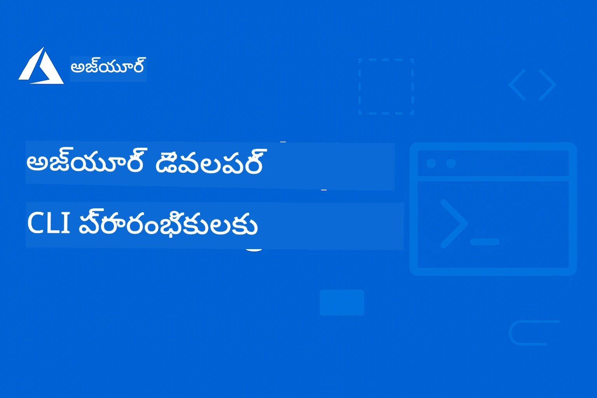

<!--
CO_OP_TRANSLATOR_METADATA:
{
  "original_hash": "068c87cc2641a81ca353ad7064ff326a",
  "translation_date": "2026-01-01T22:09:45+00:00",
  "source_file": "README.md",
  "language_code": "te"
}
-->
# AZD ప్రారంభికులకు: ఒక శ్రద్ధపూర్వక అధ్యయన ప్రయాణం

 

[](https://GitHub.com/microsoft/azd-for-beginners/watchers/)
[](https://GitHub.com/microsoft/azd-for-beginners/network/)
[](https://GitHub.com/microsoft/azd-for-beginners/stargazers/)

[](https://discord.gg/microsoft-azure)
[](https://discord.gg/nTYy5BXMWG)

## ఈ కోర్సుతో మొదలు పెట్టడం

ఈ AZD నేర్చుకునే ప్రయాణాన్ని ప్రారంభించడానికి ఈ స్టెప్స్‌ను అనుసరించండి:

1. **రిపోజిటరీని ఫోర్క్ చేయండి**: క్లిక్ చేయండి [](https://GitHub.com/microsoft/azd-for-beginners/fork)
2. **రిపోజిటరీను క్లోన్ చేయండి**: `git clone https://github.com/microsoft/azd-for-beginners.git`
3. **సమాజంలో చేరండి**: [Azure డిస్కార్డ్ సమూహాలు](https://discord.com/invite/ByRwuEEgH4) నిపుణుల మద్దతుకు
4. **మీ లెర్నింగ్ పథాన్ని ఎంచుకోండి**: మీ అనుభవ స్థాయికి సరిపోయే క్రిందిచ్చిన అధ్యాయాన్ని ఎంచుకోండి

### బహుభాషా మద్దతు

#### స్వయంచాలక అనువాదాలు (ఎప్పుడూ నవీకరించబడతాయి)

<!-- CO-OP TRANSLATOR LANGUAGES TABLE START -->
[అరబిక్](../ar/README.md) | [బెంగాలీ](../bn/README.md) | [బల్గేరియన్](../bg/README.md) | [బర్మీస్ (మ్యాన్మార్)](../my/README.md) | [చైనీస్ (సరళీకృత)](../zh/README.md) | [చైనీస్ (సాంప్రదాయ, హాంకాంగ్)](../hk/README.md) | [చైనీస్ (సాంప్రదాయ, మకావో)](../mo/README.md) | [చైనీస్ (సాంప్రదాయ, తైవాన్)](../tw/README.md) | [క్రొయాటియన్](../hr/README.md) | [చెక్](../cs/README.md) | [డేనిష్](../da/README.md) | [డచ్](../nl/README.md) | [ఎస్టోనియన్](../et/README.md) | [ఫిన్నిష్](../fi/README.md) | [ఫ్రెంచ్](../fr/README.md) | [జర్మన్](../de/README.md) | [గ్రీక్](../el/README.md) | [హేబ్రూ](../he/README.md) | [హిందీ](../hi/README.md) | [హంగేరియన్](../hu/README.md) | [ఇండోనేషియన్](../id/README.md) | [ఇటాలియన్](../it/README.md) | [జపనీస్](../ja/README.md) | [కన్నడ](../kn/README.md) | [కొరియన్](../ko/README.md) | [లిథువేనియన్](../lt/README.md) | [మలయ్](../ms/README.md) | [మలయాళం](../ml/README.md) | [మరాఠీ](../mr/README.md) | [నేపాలి](../ne/README.md) | [నైజీరియన్ పిడ్గిన్](../pcm/README.md) | [నార్వేజియన్](../no/README.md) | [పర్షియన్ (ఫార్సీ)](../fa/README.md) | [పోలిష్](../pl/README.md) | [పోర్చుగీసు (బ్రెజిల్)](../br/README.md) | [పోర్చుగీసు (పోర్టుగల్)](../pt/README.md) | [పంజాబీ (గుర్ముఖీ)](../pa/README.md) | [రొమేనియన్](../ro/README.md) | [రష్యన్](../ru/README.md) | [సెర్బియన్ (సిరిలిక్)](../sr/README.md) | [స్లోవాక్](../sk/README.md) | [స్లోవేనియన్](../sl/README.md) | [స్పానిష్](../es/README.md) | [స్వాహిలి](../sw/README.md) | [స్వీడిష్](../sv/README.md) | [టాగలాగ్ (ఫిలిపీనో)](../tl/README.md) | [తమిళ్](../ta/README.md) | [తెలుగు](./README.md) | [థాయ్](../th/README.md) | [టర్కిష్](../tr/README.md) | [ఉక్రెయినియన్](../uk/README.md) | [ఉర్దూ](../ur/README.md) | [వియత్నామీస్](../vi/README.md)
<!-- CO-OP TRANSLATOR LANGUAGES TABLE END -->

## కోర్స్ అవలోకనం

Azure Developer CLI (azd)ని శ్రేణీబద్ధమైన అధ్యాయాల ద్వారా నిలకడగా నేర్చుకోండి. **Microsoft Foundry ఇంటిగ్రేషన్‌తో AI అప్లికేషన్ అమకపై ప్రత్యేక దృష్టి.**

### ఎందుకు ఇదొక ఆధునిక డెవలపర్లకు అవసరమైన కోర్స్

Microsoft Foundry డిస్కార్డ్ కమ్యూనిటీ సూచనల ఆధారంగా, **అభివృద్ధికారులలో 45% మంది AZDని AI వర్క్లోడ్స్ కోసం ఉపయోగించాలనుకుంటున్నారు**, కాని క్రింది సవాళ్లను ఎదుర్కొంటున్నారు:
- సంకీర్ణ బహు-సర్వీస్ AI ఆర్కిటెక్చర్లు
- ప్రొడక్షన్ AI డిప్లాయ్‌మెంట్ ఉత్తమ పద్ధతులు  
- Azure AI సేవల ఇంటిగ్రేషన్ మరియు కాన్ఫిగరేషన్
- AI వర్క్లోడ్స్ కోసం ఖర్చు ఆప్టిమైజేషన్
- AI-స్పెసిఫిక్ డిప్లాయ్‌మెంట్ సమస్యల ట్రబుల్‌షూటింగ్

### నేర్చుకోవాల్సిన లక్ష్యాలు

ఈ నిర్మిత కోర్సును పూర్తి చేయగానే, మీరు:
- **AZD ప్రాథమికాలను నేర్చుకోండి**: ప్రధాన సిద్ధాంతాలు, ఇన్స్టాలేషన్, మరియు కాన్ఫిగరేషన్
- **AI అప్లికేషన్లు అమర్చండి**: Microsoft Foundry సేవలతో AZD ఉపయోగించడం
- **Infrastructure as Code అమలు చేయండి**: Bicep టెంప్లేట్స్‌తో Azure వనరులను నిర్వహించడం
- **డిప్లాయ్‌మెంట్స్‌ను ట్రబుల్‌షూట్ చేయండి**: సాధారణ సమస్యలు పరిష్కరించడం మరియు డీబగ్ చేయడం
- **ప్రొడక్షన్ కోసం ఆప్టిమైజ్ చేయండి**: భద్రత, స్కేలింగ్, మానిటరింగ్, మరియు ఖర్చు నిర్వహణ
- **బహు-ఏజెంట్ పరిష్కారాలు నిర్మించండి**: సంకీర్ణ AI ఆర్కిటెక్చర్లను అమలుపరచడం

## 📚 నేర్చుకునే అధ్యాయాలు

*మీ అనుభవ స్థాయి మరియు లక్ష్యాల ఆధారంగా మీ నేర్చుకునే మార్గాన్ని ఎంచుకోండి*

### 🚀 అధ్యాయం 1: పునాది & వెంటనే ప్రారంభం
**అవసరమైనవి**: Azure సబ్‌స్క్రిప్షన్, ప్రాథమిక క‌మాండ్‌లైన్ జ్ఞానం  
**వ్యవధి**: 30-45 నిమిషాలు  
**సంక్లిష్టత**: ⭐

#### మీరు నేర్చుకోబోతున్నవి
- Azure Developer CLI ప్రాథమికాలను అర్థం చేసుకోవడం
- మీ ప్లాట్‌ఫారమ్‌పై AZD ను ఇన్స్టాల్ చేయడం
- మీ మొదటి విజయవంతమైన డిప్లాయ్‌మెంట్

#### నేర్చుకునే వనరులు
- **🎯 ఇక్కడుండి ప్రారంభించండి**: [Azure Developer CLI అంటే ఏమిటి?](../..)
- **📖 సిద్ధాంతం**: [AZD ప్రాథమికాలు](docs/getting-started/azd-basics.md) - ప్రధాన భావనలు మరియు పదజాలం
- **⚙️ సెటప్**: [ఇన్‌స్టాలేషన్ & సెటప్](docs/getting-started/installation.md) - ప్లాట్‌ఫారమ్-స్పెసిఫిక్ గైడ్‌లు
- **🛠️ అనుభవాత్మక**: [మీ మొదటి ప్రాజెక్ట్](docs/getting-started/first-project.md) - దశలవారీ ట్యూటోరియల్
- **📋 త్వరిత సూచిక**: [క‌మాండ్ చీట్ షీట్](resources/cheat-sheet.md)

#### ప్రాక్టికల్ వ్యాయామాలు
```bash
# తక్షణ ఇన్‌స్టలేషన్ తనిఖీ
azd version

# మీ మొదటి అనువర్తనాన్ని అమలు చేయండి
azd init --template todo-nodejs-mongo
azd up
```

**💡 అధ్యాయ ఫలితం**: AZD ఉపయోగించి ఒక సరళమైన వెబ్ అప్లికేషన్‌ను విజయవంతంగా Azureలో డిప్లాయ్ చేయండి

**✅ విజయ నిర్ధారణ:**
```bash
# అధ్యాయం 1 పూర్తి చేసిన తర్వాత, మీరు ఈ క్రింది పనులు చేయగలుగుతారు:
azd version              # సంస్థాపించిన సంస్కరణను చూపిస్తుంది
azd init --template todo-nodejs-mongo  # ప్రాజెక్ట్‌ను ప్రారంభిస్తుంది
azd up                  # Azureకి అమర్చుతుంది
azd show                # పనిచేస్తున్న యాప్ యొక్క URLను చూపిస్తుంది
# అప్లికేషన్ బ్రౌజర్‌లో తెరవబడుతుంది మరియు పనిచేస్తుంది
azd down --force --purge  # వనరులను తొలగిస్తుంది
```

**📊 సమయ పెట్టుబడి:** 30-45 నిమిషాలు  
**📈 పూర్తయ్యాక నైపుణ్యం స్థాయి:** వ్యక్తిగతంగా ప్రాథమిక అప్లికేషన్లను డిప్లాయ్ చేయగలరు

**✅ విజయ నిర్ధారణ:**
```bash
# అధ్యాయం 1 పూర్తి చేసిన తర్వాత, మీరు వీటిని చేయగలగాలి:
azd version              # స్థాపించబడిన సంస్కరణను చూపిస్తుంది
azd init --template todo-nodejs-mongo  # ప్రాజెక్టును ప్రారంభిస్తుంది
azd up                  # Azureకి డిప్లాయ్ చేస్తుంది
azd show                # నడుస్తున్న అనువర్తనపు URLని చూపిస్తుంది
# అనువర్తనం బ్రౌజర్‌లో తెరుచుకుని పనిచేస్తుంది
azd down --force --purge  # వనరులను శుభ్రపరుస్తుంది
```

**📊 సమయ పెట్టుబడి:** 30-45 నిమిషాలు  
**📈 పూర్తయ్యాక నైపుణ్యం స్థాయి:** వ్యక్తిగతంగా ప్రాథమిక అప్లికేషన్లను డిప్లాయ్ చేయగలరు

---

### 🤖 అధ్యాయం 2: AI-ప్రథమ అభివృద్ధి (AI డెవలపర్లకు సిఫార్సు)
**అవసరమైనవి**: అధ్యాయం 1 పూర్తి  
**వ్యవధి**: 1-2 గంటలు  
**సంక్లిష్టత**: ⭐⭐

#### మీరు నేర్చుకోబోతున్నవి
- AZDతో Microsoft Foundry ఇంటిగ్రేషన్
- AI-సిద్ధమైన అప్లికేషన్లను డిప్లయ్ చేయడం
- AI సేవా కాన్ఫిగరేషన్లను అర్థం చేసుకోవడం

#### నేర్చుకునే వనరులు
- **🎯 ఇక్కడ ప్రారంభించండి**: [Microsoft Foundry ఇంటిగ్రేషన్](docs/microsoft-foundry/microsoft-foundry-integration.md)
- **📖 నమూనాలు**: [AI మోడల్ డిప్లాయ్‌మెంట్](docs/microsoft-foundry/ai-model-deployment.md) - AI మోడల్‌లను డిప్లయ్ చేసి నిర్వహించడం
- **🛠️ వర్క్షాప్**: [AI వర్క్షాప్ ల్యాబ్](docs/microsoft-foundry/ai-workshop-lab.md) - మీ AI పరిష్కారాలను AZD-సన్నద్ధం చేయండి
- **🎥 ఇంటరాక్టివ్ గైడ్**: [వర్క్షాప్ మెటీరియల్స్](workshop/README.md) - MkDocs తో బ్రౌజర్-ఆధారిత నేర్చుకోవడం * DevContainer వాతావరణం
- **📋 టెంప్లేట్స్**: [Microsoft Foundry టెంప్లెట్లు](../..)
- **📝 ఉదాహరణలు**: [AZD డిప్లాయ్‌మెంట్ ఉదాహరణలు](examples/README.md)

#### ప్రాక్టికల్ వ్యాయామాలు
```bash
# మీ మొదటి AI అనువర్తనాన్ని అమలు చేయండి
azd init --template azure-search-openai-demo
azd up

# అదనపు AI టెంప్లేట్లను ప్రయత్నించండి
azd init --template openai-chat-app-quickstart
azd init --template agent-openai-python-prompty
```

**💡 అధ్యాయ ఫలితం**: RAG సామర్థ్యాలుతో కూడిన AI-శక్తితో పనిచేసే చాట్ అప్లికేషన్‌ను డిప్లయ్ చేసి కాన్ఫిగర్ చేయడం

**✅ విజయ నిర్ధారణ:**
```bash
# చాప్టర్ 2 పూర్తయిన తర్వాత, మీరు ఈ పనులు చేయగలగాలి:
azd init --template azure-search-openai-demo
azd up
# ఏఐ చాట్ ఇంటర్‌ఫేస్‌ను పరీక్షించండి
# ప్రశ్నలు అడిగి, మూలాలతో సహా ఏఐ ఆధారిత ప్రత్యుత్తరాలు పొందండి
# శోధన ఇంటిగ్రేషన్ పని చేస్తున్నదని ధృవీకరించండి
azd monitor  # Application Insightsలో టెలిమేట్రీ చూపిస్తున్నదో లేదో తనిఖీ చేయండి
azd down --force --purge
```

**📊 సమయ పెట్టుబడి:** 1-2 గంటలు  
**📈 పూర్తయ్యాక నైపుణ్యం స్థాయి:** ప్రొడక్షన్-సిద్ధమైన AI అప్లికేషన్లను డిప్లయ్ చేసి కాన్ఫిగర్ చేయగలరు  
**💰 ఖర్చుల అవగాహన:** డెవ్ ఖర్చులు $80-150/నెల, ప్రొడక్షన్ ఖర్చులు $300-3500/నెల అని అవగాహన పెట్టుకోండి

#### 💰 AI డిప్లాయ్‌మెంట్‌ల కోసం ఖర్చు విషయాలు

**డెవలప్‌మెంట్ వాతావరణం (అంచనా $80-150/నెల):**
- Azure OpenAI (Pay-as-you-go): $0-50/నెల (టోకెన్ వినియోగంపై ఆధారపడి)
- AI Search (బేసిక్ టియర్): $75/నెల
- Container Apps (కన్సంప్షన్): $0-20/నెల
- స్టోరేజ్ (స్టాండర్డ్): $1-5/నెల

**ప్రొడక్షన్ వాతావరణం (అంచనా $300-3,500+/నెల):**
- Azure OpenAI (కన్సిస్టెంట్ పనితీవ్రత కోసం PTU): $3,000+/నెల లేదా అధిక వాల్యూమ్ కోసం Pay-as-you-go
- AI Search (స్టాండర్డ్ టియర్): $250/నెల
- Container Apps (డెడికేటెడ్): $50-100/నెల
- Application Insights: $5-50/నెల
- స్టోరేజ్ (ప్రీమియం): $10-50/నెల

**💡 ఖర్చు ఆప్టిమైజేషన్ సూచనలు:**
- అర్ధంపరంగా నేర్చుకోవడానికి **ఫ్రీ టియర్** Azure OpenAI ను ఉపయోగించండి (50,000 టోకెన్లు/నెల చేర్చబడి ఉంటాయి)
- పనిచేస్తుండకపోతే వనరులను డీఅలొకేట్ చేయడానికి `azd down`నడపండి
- కన్సంప్షన్ ఆధారిత బిల్లింగ్‌తో ప్రారంభించి, PTUని కేవలం ప్రొడక్షన్ కోసంనే అప్గ్రేడ్ చేయండి
- డిప్లాయ్‌మెంట్ ముందు ఖర్చులను అంచనా వేయడానికి `azd provision --preview` ఉపయోగించండి
- ఆటో-స్కేలింగ్‌ను ఎనేబుల్ చేయండి: వాస్తవ వినియోగమే మాత్రమే చెల్లించండి

**ఖర్చు మానిటరింగ్:**
```bash
# అంచనా వేసిన నెలవారీ ఖర్చులను తనిఖీ చేయండి
azd provision --preview

# Azure పోర్టల్‌లో వాస్తవ ఖర్చులను పర్యవేక్షించండి
az consumption budget list --resource-group <your-rg>
```

---

### ⚙️ అధ్యాయం 3: కాన్ఫిగరేషన్ & ప్రామాణీకరణ
**అవసరమైనవి**: అధ్యాయం 1 పూర్తి  
**వ్యవధి**: 45-60 నిమిషాలు  
**సంక్లిష్టత**: ⭐⭐

#### మీరు నేర్చుకోబోతున్నవి
- పర్యావరణం కాన్ఫిగరేషన్ మరియు నిర్వహణ
- ప్రామాణీకరణ మరియు భద్రతా ఉత్తమ అభ్యాసాలు
- వనరుల నామకరణ మరియు వ్యవస్థీకరణ

#### నేర్చుకునే వనరులు
- **📖 కాన్ఫిగరేషన్**: [కాన్ఫిగరేషన్ గైడ్](docs/getting-started/configuration.md) - పర్యావరణ సెటప్
- **🔐 భద్రత**: [ప్రామాణీకరణ నమూనాలు మరియు మేనేజ్ చేసిన ఐడెంటిటీ](docs/getting-started/authsecurity.md) - ప్రామాణీకరణ నమూనాలు
- **📝 ఉదాహరణలు**: [డేటాబేస్ యాప్ ఉదాహరణ](examples/database-app/README.md) - AZD డేటాబేస్ ఉదాహరణలు

#### ప్రాక్టికల్ వ్యాయామాలు
- బహు పర్యావరణాలను కాన్ఫిగర్ చేయండి (dev, staging, prod)
- మేనేజ్ చేయబడే ఐడెంటిటీ ప్రామాణీకరణను సెటప్ చేయండి
- పర్యావరణ-స్పెసిఫిక్ కాన్ఫిగరేషన్లను అమలు చేయండి

**💡 అధ్యాయ ఫలితం**: సరైన ప్రామాణీకరణ మరియు భద్రతతో బహు పర్యావరణాలను నిర్వహించండి

---

### 🏗️ అధ్యాయం 4: ఇన్ఫ్రాస్ట్రక్చర్‌ను కోడ్‌గా & డిప్లాయ్‌మెంట్
**అవసరమైనవి**: అధ్యాయాలు 1-3 పూర్తి  
**వ్యవధి**: 1-1.5 గంటలు  
**సంక్లిష్టత**: ⭐⭐⭐

#### మీరు నేర్చుకోబోతున్నవి
- అగ్రిగేట్ డిప్లాయ్‌మెంట్ నమూనాలు
- Bicep తో Infrastructure as Code
- వనరు ప్రోవిజనింగ్ వ్యూహాలు

#### నేర్చుకునే వనరులు
- **📖 డిప్లాయ్‌మెంట్**: [డిప్లాయ్‌మెంట్ గైడ్](docs/deployment/deployment-guide.md) - పూర్తి వర్క్ఫ్లోలు
- **🏗️ ప్రోవిజనింగ్**: [వనరుల ప్రోవిజనింగ్](docs/deployment/provisioning.md) - Azure వనరు నిర్వహణ
- **📝 ఉదాహరణలు**: [కంటైనర్ యాప్ ఉదాహరణ](../../examples/container-app) - కంటైనరైజ్డ్ డిప్లాయ్‌మెంట్లు

#### ప్రాక్టికల్ వ్యాయామాలు
- కస్టమ్ Bicep టెంప్లేట్స్ సృష్టించండి
- బహు-సేవ అప్లికేషన్లను డిప్లయ్ చేయండి
- బ్లూ-గ్రీన్ డిప్లాయ్‌మెంట్ వ్యూహాలను అమలు చేయండి

**💡 అధ్యాయ ఫలితం**: కస్టమ్ ఇన్ఫ్రాస్ట్రక్చర్ టెంప్లేట్స్ ఉపయోగించి సంకీర్ణ బహు-సేవ అప్లికేషన్లను డిప్లయ్ చేయండి

---

### 🎯 అధ్యాయం 5: బహుఏజెంట్ AI పరిష్కారాలు (అధికస్థాయి)
**అవసరమైనవి**: అధ్యాయాలు 1-2 పూర్తి  
**వ్యవధి**: 2-3 గంటలు  
**సంక్లిష్టత**: ⭐⭐⭐⭐

#### మీరు నేర్చుకోబోతున్నవి
- బహుఏజెంట్ ఆర్కిటెక్చర్ నమూనాలు
- ఏజెంట్ ఆర్కెస్ట్రేషన్ మరియు సమన్వయం
- ప్రొడక్షన్-సిద్ధమైన AI డిప్లాయ్‌మెంట్లు

#### నేర్చుకునే వనరులు
- **🤖 ఫీచర్డ్ ప్రాజెక్ట్**: [రిటెయిల్ బహుఏజెంట్ పరిష్కారం](examples/retail-scenario.md) - పూర్తి అమలు
- **🛠️ ARM Templates**: [ARM Template Package](../../examples/retail-multiagent-arm-template) - ఒక క్లిక్ డిప్లాయ్‌మెంట్
- **📖 ఆర్కిటెక్చర్**: [బహుళ-ఏజెంట్ సమన్వయ నమూనాలు](/docs/pre-deployment/coordination-patterns.md) - నమూనాలు

#### ప్రాయోగిక అభ్యాసాలు
```bash
# సంపూర్ణ రిటైల్ బహుళ-ఏజెంట్ పరిష్కారాన్ని అమలు చేయండి
cd examples/retail-multiagent-arm-template
./deploy.sh

# ఏజెంట్ ఆకృతీకరణలను అన్వేషించండి
az deployment group show --resource-group <rg-name> --name <deployment-name>
```

**💡 అధ్యాయం ఫలితం**: Customer మరియు Inventory ఏజెంట్లతో ప్రొడక్షన్-సిద్ధమైన బహుళ-ఏజెంట్ AI పరిష్కారాన్ని అమలు చేసి నిర్వహించడం

---

### 🔍 అధ్యాయం 6: ప్రీ-డిప్లాయ్‌మెంట్ ధృవీకరణ & ప్రణాళిక
**ఆవశ్యకతలు**: అధ్యాయం 4 పూర్తి అయ్యి ఉండాలి  
**కాలవ్యవధి**: 1 గంట  
**సంక్లిష్టత**: ⭐⭐

#### మీరు నేర్చుకునే విషయాలు
- సామర్థ్య ప్రణాళిక మరియు వనరుల ధృవీకరణ
- SKU ఎంపిక వ్యూహాలు
- పూర్వ-తనిఖీలు మరియు ఆటోమేషన్

#### అభ్యాస వనరులు
- **📊 ప్రణాళిక**: [Capacity Planning](docs/pre-deployment/capacity-planning.md) - వనరు ధృవీకరణ
- **💰 ఎంపిక**: [SKU Selection](docs/pre-deployment/sku-selection.md) - ఖర్చు-సమర్థ ఎంపికలు
- **✅ ధృవీకరణ**: [Pre-flight Checks](docs/pre-deployment/preflight-checks.md) - ఆటోమేటెడ్ స్క్రిప్టులు

#### ప్రాయోగిక అభ్యాసాలు
- సామర్థ్య ధృవీకరణ స్క్రిప్టులను నడపండి
- ఖర్చు కోసం SKU ఎంపికలను ఉత్తమీకరించండి
- డిప్లాయ్‌మెంట్‌కు ముందు ఆటోమేటెడ్ తనిఖీలను అమలు చేయండి

**💡 అధ్యాయం ఫలితం**: అమలు చేసేముందు డిప్లాయ్‌మెంట్లను ధృవీకరించి ఉత్తమీకరించడం

---

### 🚨 అధ్యాయం 7: సమస్యల పరిష్కారం & డీబగ్గింగ్
**ఆవశ్యకతలు**: ఏదైనా డిప్లాయ్‌మెంట్ అధ్యాయం పూర్తి అయి ఉండాలి  
**కాలవ్యవధి**: 1-1.5 గంటలు  
**సంక్లిష్టత**: ⭐⭐

#### మీరు నేర్చుకునే విషయాలు
- వ్యవస్థాత్మక డీబగ్గింగ్ పద్ధతులు
- సాధారణ సమస్యలు మరియు పరిష్కారాలు
- AI-స్పెసిఫిక్ సమస్యల పరిష్కారం

#### అభ్యాస వనరులు
- **🔧 సాధారణ సమస్యలు**: [Common Issues](docs/troubleshooting/common-issues.md) - FAQ మరియు పరిష్కారాలు
- **🕵️ డీబగ్గింగ్**: [Debugging Guide](docs/troubleshooting/debugging.md) - దశలవారీ వ్యూహాలు
- **🤖 AI సమస్యలు**: [AI-Specific Troubleshooting](docs/troubleshooting/ai-troubleshooting.md) - AI సేవల సమస్యలు

#### ప్రాయోగిక అభ్యాసాలు
- డిప్లాయ్‌మెంట్ విఫలతలను నిర్ధారణ చేయండి
- ఆథెంటికేషన్ సమస్యలను పరిష్కరించండి
- AI సేవల కనెక్టివిటీని డీబగ్ చేయండి

**💡 అధ్యాయం ఫలితం**: స్వతంత్రంగా సాధారణ డిప్లాయ్‌మెంట్ సమస్యలను నిర్ధారణ చేసి పరిష్కరించగలరు

---

### 🏢 అధ్యాయం 8: ప్రొడక్షన్ & ఎంటర్ప్రైజ్ నమూనాలు
**ఆవశ్యకతలు**: అధ్యాయాలు 1-4 పూర్తి అయి ఉండాలి  
**కాలవ్యవధి**: 2-3 గంటలు  
**సంక్లిష్టత**: ⭐⭐⭐⭐

#### మీరు నేర్చుకునే విషయాలు
- ప్రొడక్షన్ డిప్లాయ్‌మెంట్ వ్యూహాలు
- ఎంటర్ప్రైజ్ సెక్యూరిటీ నమూనాలు
- మానిటరింగ్ మరియు ఖర్చు ఆప్టిమైజేషన్

#### అభ్యాస వనరులు
- **🏭 ప్రొడక్షన్**: [Production AI Best Practices](docs/microsoft-foundry/production-ai-practices.md) - ఎంటర్ప్రైజ్ నమూనాలు
- **📝 ఉదాహరణలు**: [Microservices Example](../../examples/microservices) - సంక్లిష్ట ఆర్కిటెక్చర్లు
- **📊 మానిటరింగ్**: [Application Insights integration](docs/pre-deployment/application-insights.md) - మానిటరింగ్

#### ప్రాయోగిక అభ్యాసాలు
- ఎంటర్ప్రైజ్ సెక్యూరిటీ నమూనాలను అమలు చేయండి
- సమగ్ర మానిటరింగ్ ఏర్పాటుచేయండి
- సరైన గవర్నెన్స్‌తో ప్రొడక్షన్‌లో డిప్లాయ్ చేయండి

**💡 అధ్యాయం ఫలితం**: పూర్తి ప్రొడక్షన్ సామర్థ్యాలతో ఎంటర్ప్రైజ్-సిద్ధ అప్లికేషన్లను డిప్లాయ్ చేయగలగడం

---

## 🎓 వర్క్‌షాప్ అవలోకనం: హ్యాండ్స్-ఆన్ లెర్నింగ్ అనుభవం

> **⚠️ WORKSHOP STATUS: Active Development**  
> వర్క్‌షాప్ పదార్థాలు ప్రస్తుతం అభివృద్ధి మరియు మెరుగుదల పరిధిలో ఉన్నాయి. కోర్ మాడ్యూల్స్ పని చేస్తుంటాయి, కానీ కొన్ని ఉన్నత విభాగాలు పూర్తి కాలేకపోయాయి. మేము అన్ని విషయాలను పూర్తి చేయడానికి సక్రియంగా పని చేస్తున్నాం. [ప్రగతిని ట్రాక్ చేయండి →](workshop/README.md)

### ఇంటరాక్టివ్ వర్క్‌షాప్ పదార్థాలు
**బ్రౌజర్-ఆధారిత టూల్స్ మరియు మార్గదర్శక అభ్యాసాలతో సమగ్ర హ్యాండ్స్‑ఆన్లో లెర్నింగ్ అనుభవం**

మా వర్క్‌షాప్ పదార్థాలు పై అధ్యాయాల ఆధారిత పాఠ్యక్రమాన్ని పూర్తిగా ప్రారంభించి, బంధింపబడిన, ఇంటరాక్టివ్ లెర్నింగ్ అనుభవాన్ని అందిస్తాయి. ఈ వర్క్‌షాప్ స్వీయ-పేస్డ్ లెర్నింగ్ మరియు ఇన్‌స్ట్రక్టర్-నాయకత్వ ఒప్ధతలకు రెండింటికీ రూపకల్పన చేయబడింది.

#### 🛠️ వర్క్‌షాప్ ఫీచర్లు
- **బ్రౌజర్-ఆధారిత ఇంటర్‌ఫేస్**: సెర్చ్, కాపీ మరియు థీమ్ ఫీచర్లతో పూర్తి MkDocs-ఆధారిత వర్క్‌షాప్
- **GitHub Codespaces ఇంటిగ్రేషన్**: ఒక క్లిక్ డెవలప్‌మెంట్ ఎన్విరాన్‌మెంట్ సెటప్
- **రూపకల్పిత అభ్యాస మార్గం**: 7-స్టెప్ మార్గనిర్దేశిత వ్యాయామాలు (మొత్తం 3.5 గంటలు)
- **Discovery → Deployment → Customization**: ప్రోగ్రెసివ్ విధానం
- **ఇంటరాక్టివ్ DevContainer ఎన్విరాన్‌మెంట్**: ముందుగా కాన్ఫిగర్ చేయబడ్డ టూల్స్ మరియు డిపెండెన్సీలు

#### 📚 వర్క్‌షాప్ నిర్మాణం
వర్క్‌షాప్ "Discovery → Deployment → Customization" విధానాన్ని అనుసరిస్తుంది:

1. డిస్కవరీ దశ (45 నిమిషాలు)
   - Microsoft Foundry టెంప్లేట్లు మరియు సేవలను పరిశీలించడం
   - బహుళ-ఏజెంట్ ఆర్కిటెక్చర్ నమూనాలను అర్ధం చేసుకోవడం
   - డిప్లాయ్‌మెంట్ అవసరాలు మరియు ముందస్తు షరతులను సమీక్షించడం

2. డిప్లాయ్‌మెంట్ దశ (2 గంటలు)
   - AZD ఉపయోగించి AI అప్లికేషన్లను ప్రత్యక్షంగా డిప్లాయ్ చేయడం
   - Azure AI సేవలు మరియు ఎండ్పాయింట్లను కాన్ఫిగర్ చేయడం
   - సెక్యూరిటీ మరియు ఆథెంటికేషన్ నమూనాలను అమలు చేయడం

3. కస్టమైజేషన్ దశ (45 నిమిషాలు)
   - నిర్దిష్ట ఉపయోగాల కోసం అప్లికేషన్లను మార్చడం
   - ప్రొడక్షన్ డిప్లాయ్‌మెంట్‌కు ఉత్తమీకరించడం
   - మానిటరింగ్ మరియు ఖర్చు నిర్వహణను అమలు చేయడం

#### 🚀 వర్క్‌షాప్ ప్రారంభం
```bash
# ఎంపిక 1: GitHub Codespaces (సిఫార్సు చేయబడింది)
# రిపాజిటరీలో "Code" పై క్లిక్ చేసి → "Create codespace on main" ఎంచుకోండి

# ఎంపిక 2: స్థానిక అభివృద్ధి
git clone https://github.com/microsoft/azd-for-beginners.git
cd azd-for-beginners/workshop
# workshop/README.mdలోని సెట్‌అప్ సూచనలను అనుసరించండి
```

#### 🎯 వర్క్‌షాప్ నేర్చుకునే ఫలితాలు
వర్క్‌షాప్ పూర్తి చేసిన తర్వాత, పాల్గొనేవారు:
- **ప్రొడక్షన్ AI అప్లికేషన్లను డిప్లాయ్ చేయడం**: AZD ను Microsoft Foundry సేవలతో ఉపయోగించడం
- **బహుళ-ఏజెంట్ ఆర్కిటెక్చర్లు మాస్టర్ చేయడం**: సమన్వయించబడిన AI ఏజెంట్ పరిష్కారాలను అమలు చేయడం
- **సెక్యూరిటీ ఉత్తమ పద్ధతులను అమలు చేయడం**: ఆథెంటికేషన్ మరియు యాక్సెస్ కంట్రోల్ కాన్ఫిగర్ చేయడం
- **స్కేల్ కోసం ఆప్టిమైజ్ చేయడం**: ఖర్చు-సమర్థ, పనితీరు-ఆధారిత డిప్లాయ్‌మెంట్లను డిజైన్ చేయడం
- **డిప్లాయ్‌మెంట్‌లను ట్రబుల్‌షూట్ చేయడం**: సాధారణ సమస్యలను స్వతంత్రంగా పరిష్కరించడం

#### 📖 వర్క్‌షాప్ వనరులు
- **🎥 ఇంటరాక్టివ్ గైడ్**: [Workshop Materials](workshop/README.md) - బ్రౌజర్-ఆధారిత లెర్నింగ్ పరిసరము
- **📋 దశలవారీ సూచనలు**: [Guided Exercises](../../workshop/docs/instructions) - సవివరంగా గైడ్ చేసిన వాక్ఆల్క్స్
- **🛠️ AI వర్క్‌షాప్ ప్రయోగశాల**: [AI Workshop Lab](docs/microsoft-foundry/ai-workshop-lab.md) - AI-పైకాసెట్ వ్యాయామాలు
- **💡 త్వరిత ప్రారంభం**: [Workshop Setup Guide](workshop/README.md#quick-start) - ఎన్విరాన్‌మెంట్ కాన్ఫిగరేషన్

**సరైనది**: కార్పొరేట్ శిక్షణ, విశ్వవిద్యాలయ కోర్సులు, స్వీయ-పేస్డ్ లెర్నింగ్, మరియు డెవలపర్ బూట్‌క్యాంప్‌ల కోసం.

---

## 📖 Azure Developer CLI అంటే ఏమిటి?

Azure Developer CLI (azd) ఒక డెవలపర్-కేంద్రీకృత కమాండ్-లైన్ ఇంటర్‌ఫేస్, ఇది Azureలో అప్లికేషన్లు నిర్మించి డిప్లాయ్ చేయడాన్ని వేగవంతం చేస్తుంది. ఇది అందిస్తుంది:

- **టెంప్లేట్-ఆధారిత డిప్లాయ్‌మెంట్‌లు** - సాధారణ అప్లికేషన్ నమూనాల కోసం ముందుగా రూపొందించిన టెంప్లేట్లను ఉపయోగించండి
- **ఇన్ఫ్రాస్ట్రక్చర్ ఏజ్ కోడ్** - Bicep లేదా Terraform ఉపయోగించి Azure వనరులను నిర్వహించండి  
- **ఇంటిగ్రేటెడ్ వర్క్‌ఫ్లోస్** - అప్లికేషన్లను సజావుగా ప్రొవిజన్, డిప్లాయ్ మరియు మానిటర్ చేయండి
- **డెవలపర్-ఫ్రెండ్లీ** - డెవలపర్ ఉత్పాదకత్వం మరియు అనుభవం కోసం ఆప్టిమైజ్ చేయబడింది

### **AZD + Microsoft Foundry: AI డిప్లాయ్‌మెంట్స్‌కు ఉత్తమం**

**ఎందుకు AZD AI పరిష్కారాలకు?** AZD AI డెవలపర్లు ఎదుర్కొనే ప్రధాన సవాళ్లను పరిష్కరిస్తుంది:

- **AI-రెడీ టెంప్లేట్లు** - Azure OpenAI, Cognitive Services, మరియు ML వర్క్‌లోడ్స్ కోసం ముందుగా కాన్ఫిగర్ చేయబడ్డ టెంప్లేట్లు
- **సురక్షిత AI డిప్లాయ్‌మెంట్లు** - AI సేవలు, API కీలు మరియు మోడల్ ఎండ్పాయింట్ల కోసం బిల్ట్-ఇన్ సెక్యూరిటీ నమూనాలు  
- **ప్రొడక్షన్ AI నమూనాలు** - స్కేలబుల్, ఖర్చు-సమర్థ AI అప్లికేషన్ డిప్లాయ్‌మెంట్ కోసం ఉత్తమ పద్ధతులు
- **ఎండ్-టు-ఎండ్ AI వర్క్‌ఫ్లోస్** - మోడల్ డెవలప్‌మెంట్ నుండి ప్రొడక్షన్ డిప్లాయ్‌మెంట్ వరకు సరైన మానిటరింగ్‌తో
- **ఖర్చు ఆప్టిమైజేషన్** - AI వర్క్లోడ్స్ కోసం సమర్ధవంతమైన వనరు కేటాయింపు మరియు స్కేలింగ్ వ్యూహాలు
- **Microsoft Foundry ఇంటిగ్రేషన్** - Microsoft Foundry మోడల్ Katalogu మరియు ఎండ్పాయింట్‌లకు సజావుగా కనెక్ట్ అవ్వడం

---

## 🎯 టెంప్లేట్స్ & ఉదాహరణల లైబ్రరీ

### ఫీచర్డ్: Microsoft Foundry టెంప్లేట్లు
**AI అప్లికేషన్లను డిప్లాయ్ చేయబోతే ఇక్కడ నుండే మొదలు పెట్టండి!**

> **గమనిక:** ఈ టెంప్లేట్లు వివిధ AI నమూనాలను ప్రదర్శిస్తాయి. కొన్ని బాహ్య Azure సాంపుల్స్ నుండి వస్తాయి, మరికొన్ని స్థానిక అమలులుగా ఉన్నాయి.

| టెంప్లేట్ | అధ్యాయం | సంక్లిష్టత | సేవలు | రకం |
|----------|---------|------------|----------|------|
| [**Get started with AI chat**](https://github.com/Azure-Samples/get-started-with-ai-chat) | అధ్యాయం 2 | ⭐⭐ | AzureOpenAI + Azure AI Model Inference API + Azure AI Search + Azure Container Apps + Application Insights | బాహ్య |
| [**Get started with AI agents**](https://github.com/Azure-Samples/get-started-with-ai-agents) | అధ్యాయం 2 | ⭐⭐ | Azure AI Agent Service + AzureOpenAI + Azure AI Search + Azure Container Apps + Application Insights| బాహ్య |
| [**Azure Search + OpenAI Demo**](https://github.com/Azure-Samples/azure-search-openai-demo) | అధ్యాయం 2 | ⭐⭐ | AzureOpenAI + Azure AI Search + App Service + Storage | బాహ్య |
| [**OpenAI Chat App Quickstart**](https://github.com/Azure-Samples/openai-chat-app-quickstart) | అధ్యాయం 2 | ⭐ | AzureOpenAI + Container Apps + Application Insights | బాహ్య |
| [**Agent OpenAI Python Prompty**](https://github.com/Azure-Samples/agent-openai-python-prompty) | అధ్యాయం 5 | ⭐⭐⭐ | AzureOpenAI + Azure Functions + Prompty | బాహ్య |
| [**Contoso Chat RAG**](https://github.com/Azure-Samples/contoso-chat) | అధ్యాయం 8 | ⭐⭐⭐⭐ | AzureOpenAI + AI Search + Cosmos DB + Container Apps | బాహ్య |
| [**Retail Multi-Agent Solution**](examples/retail-scenario.md) | అధ్యాయం 5 | ⭐⭐⭐⭐ | AzureOpenAI + AI Search + Storage + Container Apps + Cosmos DB | **స్థానిక** |

### ఫీచర్డ్: పూర్తి అభ్యాస సన్నివేశాలు
**ప్రొడక్షన్-సిద్ధ అప్లికేషన్ టెంప్లేట్లు అభ్యాస అధ్యాయాలకు మ్యాప్ చేయబడ్డాయి**

| టెంప్లేట్ | అభ్యాస అధ్యాయం | సంక్లిష్టత | కీలక అభ్యాసం |
|----------|------------------|------------|--------------|
| [**openai-chat-app-quickstart**](https://github.com/Azure-Samples/openai-chat-app-quickstart) | అధ్యాయం 2 | ⭐ | ప్రాథమిక AI డిప్లాయ్‌మెంట్ నమూనాలు |
| [**azure-search-openai-demo**](https://github.com/Azure-Samples/azure-search-openai-demo) | అధ్యాయం 2 | ⭐⭐ | Azure AI Search తో RAG అమలు |
| [**ai-document-processing**](https://github.com/Azure-Samples/ai-document-processing) | అధ్యాయం 4 | ⭐⭐ | డాక్యుమెంట్ ఇంటెలిజెన్స్ ఇంటిగ్రేషన్ |
| [**agent-openai-python-prompty**](https://github.com/Azure-Samples/agent-openai-python-prompty) | అధ్యాయం 5 | ⭐⭐⭐ | ఏజెంట్ ఫ్రేమ్‌వర్క్ మరియు ఫంక్షన్ కాలింగ్ |
| [**contoso-chat**](https://github.com/Azure-Samples/contoso-chat) | అధ్యాయం 8 | ⭐⭐⭐ | ఎంటర్ప్రైజ్ AI ఆర్కెస్ట్రేషన్ |
| [**retail-multi-agent-solution**](examples/retail-scenario.md) | అధ్యాయం 5 | ⭐⭐⭐⭐ | Customer మరియు Inventory ఏజెంట్లతో బహుళ-ఏజెంట్ ఆర్కిటెక్చర్ |

### ఉదాహరణలు రకం ప్రకారం నేర్చుకోండి

> **📌 స్థానిక vs బాహ్య ఉదాహరణలు:**  
> **స్థానిక ఉదাহరణలు** (ఈ రిపోలో) = వెంటనే ఉపయోగించడానికి సిద్ధంగా ఉన్నాయి  
> **బాహ్య ఉదాహరణలు** (Azure Samples) = లింక్డ్ రిపోజిటరీల నుండి క్లోన్ చేయండి

#### స్థానిక ఉదాహరణలు (త్వరగా ఉపయోగించడానికి సిద్ధం)
- [**Retail Multi-Agent Solution**](examples/retail-scenario.md) - ARM టెంప్లేట్లతో పూర్తి ప్రొడక్షన్-సిద్ధ అమలు
  - బహుళ-ఏజెంట్ ఆర్కిటెక్చర్ (Customer + Inventory ఏజెంట్లు)
  - సమగ్ర మానిటరింగ్ మరియు మూల్యాంకనం
  - ARM టెంప్లెట్ ద్వారా ఒక క్లిక్ డిప్లాయ్‌మెంట్

#### స్థానిక ఉదాహరణలు - కంటైనర్ అప్లికేషన్లు (అధ్యాయాలు 2-5)
**ఈ రెపోలో సంపూర్ణ కంటైనరైజ్డ్ డిప్లాయ్‌మెంట్ ఉదాహరణలు:**
- [**Container App Examples**](examples/container-app/README.md) - కంటైనరైజ్డ్ డిప్లాయ్‌మెంట్లకు పూర్తి గైడ్
  - [Simple Flask API](../../examples/container-app/simple-flask-api) - స్కేల్-টু-జీరోతో బేసిక్ REST API
  - [Microservices Architecture](../../examples/container-app/microservices) - ప్రొడక్షన్-సిద్ధ బహుళ-సర్వీస్ డిప్లాయ్‌మెంట్
  - క్విక్ స్టార్ట్, ప్రొడక్షన్ మరియు అడ్వాన్స్డ్ డిప్లాయ్‌మెంట్ నమూనాలు
  - మానిటరింగ్, సెక్యూరిటీ, మరియు ఖర్చు ఆప్టిమైజేషన్ సూచనలు

#### బాహ్య ఉదాహరణలు - సాదా అప్లికేషన్లు (అధ్యాయాలు 1-2)
**ప్రారంభానికి ఈ Azure Samples రిపోజిటరీలను క్లోన్ చేయండి:**
- [Simple Web App - Node.js + MongoDB](https://github.com/Azure-Samples/todo-nodejs-mongo) - ప్రాథమిక డిప్లాయ్‌మెంట్ నమూనాలు
- [Static Website - React SPA](https://github.com/Azure-Samples/todo-csharp-sql-swa-func) - స్థిర కంటెంట్ డిప్లాయ్‌మెంట్
- [Container App - Python Flask](https://github.com/Azure-Samples/container-apps-store-api-microservice) - REST API డిప్లాయ్‌మెంట్

#### బాహ్య ఉదాహరణలు - డేటాబేస్ ఇంటిగ్రేషన్ (అధ్యాయాలు 3-4)  
- [Database App - C# + SQL](https://github.com/Azure-Samples/todo-csharp-sql) - డేటాబేస్ కనెక్టర్ నమూనాలు
- [Functions + Cosmos DB](https://github.com/Azure-Samples/todo-python-mongo-swa-func) - సర్వర్‌లెస్ డేటా వర్క్‌ఫ్లో

#### బాహ్య ఉదాహరణలు - ఆధునిక నమూనాలు (అధ్యాయాలు 4-8)
- [Java Microservices](https://github.com/Azure-Samples/java-microservices-aca-lab) - బహుళ-సర్వీస్ ఆర్కిటెక్చర్లు
- [Container Apps Jobs](https://github.com/Azure-Samples/container-apps-jobs) - బ్యాక్‌గ్రౌండ్ ప్రాసెసింగ్  
- [Enterprise ML Pipeline](https://github.com/Azure-Samples/mlops-v2) - ప్రొడక్షన్-సిద్ధ ML నమూనాలు

### బాహ్య టెంప్లేట్ సేకరణలు
- [**Official AZD Template Gallery**](https://azure.github.io/awesome-azd/) - అధికారిక మరియు కమ్యూనిటీ టెంప్లేట్ల క్యూయిరేషన్ చేసిన సేకరణ
- [**Azure Developer CLI Templates**](https://learn.microsoft.com/en-us/azure/developer/azure-developer-cli/azd-templates) - Microsoft Learn టెంప్లేట్ డాక్యుమెంటేషన్
- [**Examples Directory**](examples/README.md) - లోకల్ అభ్యాస ఉదాహరణలు వివరణలతో

---

## 📚 అభ్యాస వనరులు & సూచనలు

### త్వరిత సూచనలు
- [**Command Cheat Sheet**](resources/cheat-sheet.md) - అధ్యాయాలనుసారంగా అమర్చిన అవసరమైన azd కమాండ్లు
- [**Glossary**](resources/glossary.md) - Azure మరియు azd పదజాలం  
- [**FAQ**](resources/faq.md) - అధ్యాయం వారీగా వర్గీకరించిన సాధారణ ప్రశ్నలు
- [**Study Guide**](resources/study-guide.md) - సమగ్ర ప్రాక్టీస్ వ్యాయామాలు

### ప్రాయోగిక వర్క్‌షాప్స్
- [**AI Workshop Lab**](docs/microsoft-foundry/ai-workshop-lab.md) - మీ AI పరిష్కారాలను AZD-లో డిప్లాయ్ చేయదగినట్లు తయారుచేయండి (2-3 గంటలు)
- [**Interactive Workshop Guide**](workshop/README.md) - MkDocs మరియు DevContainer పరిసరంతో బ్రౌజర్-ఆధారిత వర్క్‌షాప్
- [**Structured Learning Path**](../../workshop/docs/instructions) -7-step మార్గదర్శక వ్యాయామాలు (అన్వేషణ → డిప్లాయ్‌మెంట్ → అనుకూలీకరణ)
- [**AZD For Beginners Workshop**](workshop/README.md) - GitHub Codespaces ఇన్టిగ్రేషన్‌తో పూర్తి హ్యాండ్స్-ఆన్ వర్క్‌షాప్ సామగ్రి

### బాహ్య శిక్షణ వనరులు
- [Azure Developer CLI Documentation](https://learn.microsoft.com/en-us/azure/developer/azure-developer-cli/)
- [Azure Architecture Center](https://learn.microsoft.com/en-us/azure/architecture/)
- [Azure Pricing Calculator](https://azure.microsoft.com/pricing/calculator/)
- [Azure Status](https://status.azure.com/)

---

## 🔧 శీఘ్ర సమస్య పరిష్కార గైడ్

**ప్రారంభికులు ఎదుర్కొనే సాధారణ సమస్యలు మరియు తక్షణ పరిష్కారాలు:**

### ❌ "azd: command not found"

```bash
# ముందుగా AZD ని ఇన్‌స్టాల్ చేయండి
# విండోస్ (PowerShell):
winget install microsoft.azd

# macOS:
brew tap azure/azd && brew install azd

# లినక్స్:
curl -fsSL https://aka.ms/install-azd.sh | bash

# ఇన్‌స్టాలేషన్‌ను ధృవీకరించండి
azd version
```

### ❌ "No subscription found" or "Subscription not set"

```bash
# అందుబాటులో ఉన్న సబ్‌స్క్రిప్షన్లను జాబితా చేయండి
az account list --output table

# డిఫాల్ట్ సబ్‌స్క్రిప్షన్‌ను సెట్ చేయండి
az account set --subscription "<subscription-id-or-name>"

# AZD పర్యావరణం కోసం సెట్ చేయండి
azd env set AZURE_SUBSCRIPTION_ID "<subscription-id>"

# నిర్ధారించండి
az account show
```

### ❌ "InsufficientQuota" or "Quota exceeded"

```bash
# వేరే Azure ప్రాంతాన్ని ప్రయత్నించండి
azd env set AZURE_LOCATION "westus2"
azd up

# లేదా అభివృద్ధి సమయంలో చిన్న SKUs ఉపయోగించండి
# infra/main.parameters.json ఫైల్‌ను సవరించండి:
{
  "sku": "B1"  // Instead of "P1V2"
}
```

### ❌ "azd up" fails halfway through

```bash
# ఎంపిక 1: శుభ్రపరచి మళ్లీ ప్రయత్నించండి
azd down --force --purge
azd up

# ఎంపిక 2: కేవలం ఇన్‌ఫ్రాస్ట్రక్చర్‌ను సరిచేయండి
azd provision

# ఎంపిక 3: వివరమైన లాగ్‌లను తనిఖీ చేయండి
azd show
azd logs
```

### ❌ "Authentication failed" or "Token expired"

```bash
# మళ్లీ ప్రామాణీకరించండి
az logout
az login

azd auth logout
azd auth login

# ప్రామాణీకరణను ధృవీకరించండి
az account show
```

### ❌ "Resource already exists" or naming conflicts

```bash
# AZD ప్రత్యేక పేర్లు రూపొందిస్తుంది, కానీ సంఘర్షణ జరిగితే:
azd down --force --purge

# తర్వాత తాజా పరిసరంతో మళ్లీ ప్రయత్నించండి
azd env new dev-v2
azd up
```

### ❌ Template deployment taking too long

**సాధారణ వేచి ఉండాల్సిన సమయాలు:**
- సాదారణ వెబ్ యాప్: 5-10 నిమిషాలు
- డేటాబేస్ కలిగిన యాప్: 10-15 నిమిషాలు
- AI అప్లికేషన్లు: 15-25 నిమిషాలు (OpenAI ప్రొవిజనింగ్ మందగిస్తుంది)

```bash
# ప్రగతిని తనిఖీ చేయండి
azd show

# 30 నిమిషాలకంటే ఎక్కువ కాలం చిక్కుకొని ఉంటే, Azure పోర్టల్‌ని తనిఖీ చేయండి:
azd monitor
# విఫలమైన డిప్లాయ్‌మెంట్లను వెతకండి
```

### ❌ "Permission denied" or "Forbidden"

```bash
# మీ Azure పాత్రను తనిఖీ చేయండి
az role assignment list --assignee $(az account show --query user.name -o tsv)

# మీకు కనీసం "Contributor" పాత్ర అవసరం
# మీ Azure అడ్మిన్‌కు మంజూరు చేయమని అడగండి:
# - Contributor (రిసోర్సుల కోసం)
# - User Access Administrator (పాత్ర నియామకాలకు)
```

### ❌ Can't find deployed application URL

```bash
# అన్ని సర్వీస్ ఎండ్‌పాయింట్‌లను చూపించండి
azd show

# లేదా Azure పోర్టల్‌ను తెరవండి
azd monitor

# నిర్దిష్ట సేవను తనిఖీ చేయండి
azd env get-values
# *_URL వేరియబుల్స్ కోసం వెతకండి
```

### 📚 పూర్తి సమస్య పరిష్కార వనరులు

- **సాధారణ సమస్యలు గైడ్:** [వివరమైన పరిష్కారాలు](docs/troubleshooting/common-issues.md)
- **AI-నిర్దిష్ట సమస్యలు:** [AI సమస్య పరిష్కారం](docs/troubleshooting/ai-troubleshooting.md)
- **డీబగ్గింగ్ గైడ్:** [దశల వారీ డీబగ్గింగ్](docs/troubleshooting/debugging.md)
- **సహాయం పొందండి:** [Azure Discord](https://discord.gg/microsoft-azure) #azure-developer-cli

---

## 🔧 శీఘ్ర సమస్య పరిష్కార గైడ్

**ప్రారంభికులు ఎదుర్కొనే సాధారణ సమస్యలు మరియు తక్షణ పరిష్కారాలు:**

<details>
<summary><strong>❌ "azd: command not found"</strong></summary>

```bash
# ముందుగా AZDని ఇన్‌స్టాల్ చేయండి
# Windows (పవర్‌షెల్):
winget install microsoft.azd

# macOS:
brew tap azure/azd && brew install azd

# లినక్స్:
curl -fsSL https://aka.ms/install-azd.sh | bash

# ఇన్‌స్టలేషన్‌ను నిర్ధారించండి
azd version
```
</details>

<details>
<summary><strong>❌ "No subscription found" or "Subscription not set"</strong></summary>

```bash
# ఉపలభ్యమైన సబ్‌స్క్రిప్షన్లను జాబితా చేయండి
az account list --output table

# డిఫాల్ట్ సబ్‌స్క్రిప్షన్‌ను అమర్చండి
az account set --subscription "<subscription-id-or-name>"

# AZD వాతావరణం కోసం సెట్ చేయండి
azd env set AZURE_SUBSCRIPTION_ID "<subscription-id>"

# నిర్ధారించండి
az account show
```
</details>

<details>
<summary><strong>❌ "InsufficientQuota" or "Quota exceeded"</strong></summary>

```bash
# వేరే Azure ప్రాంతాన్ని ప్రయత్నించండి
azd env set AZURE_LOCATION "westus2"
azd up

# లేదా డెవలప్‌మెంట్‌లో చిన్న SKUలు ఉపయోగించండి
# infra/main.parameters.jsonను సవరించండి:
{
  "sku": "B1"  // Instead of "P1V2"
}
```
</details>

<details>
<summary><strong>❌ "azd up" fails halfway through</strong></summary>

```bash
# ఐచ్ఛికం 1: శుభ్రం చేసి మళ్లీ ప్రయత్నించండి
azd down --force --purge
azd up

# ఐచ్ఛికం 2: కేవలం మౌలిక సదుపాయాలను సరిచేయండి
azd provision

# ఐచ్ఛికం 3: వివరాత్మక లాగ్‌లను తనిఖీ చేయండి
azd show
azd logs
```
</details>

<details>
<summary><strong>❌ "Authentication failed" or "Token expired"</strong></summary>

```bash
# మళ్లీ ప్రమాణీకరించండి
az logout
az login

azd auth logout
azd auth login

# ప్రమాణీకరణను నిర్ధారించండి
az account show
```
</details>

<details>
<summary><strong>❌ "Resource already exists" or naming conflicts</strong></summary>

```bash
# AZD ప్రత్యేకమైన పేర్లను ఉత్పత్తి చేస్తుంది, కానీ పేరుల ఘర్షణ జరిగితే:
azd down --force --purge

# అప్పుడు కొత్త పరిసరంతో మళ్లీ ప్రయత్నించండి
azd env new dev-v2
azd up
```
</details>

<details>
<summary><strong>❌ Template deployment taking too long</strong></summary>

**సాధారణ వేచి ఉండాల్సిన సమయాలు:**
- సాదారణ వెబ్ యాప్: 5-10 నిమిషాలు
- డేటాబేస్ కలిగిన యాప్: 10-15 నిమిషాలు
- AI అప్లికేషన్లు: 15-25 నిమిషాలు (OpenAI ప్రొవిజనింగ్ మందగిస్తుంది)

```bash
# ప్రగతిని తనిఖీ చేయండి
azd show

# 30 నిమిషాలకంటే ఎక్కువ సేపు నిలిచిపోతే, Azure పోర్టల్‌ను తనిఖీ చేయండి:
azd monitor
# విఫలమైన డిప్లాయ్‌మెంట్లను చూడండి
```
</details>

<details>
<summary><strong>❌ "Permission denied" or "Forbidden"</strong></summary>

```bash
# మీ Azure పాత్రను తనిఖీ చేయండి
az role assignment list --assignee $(az account show --query user.name -o tsv)

# మీకు కనీసం "Contributor" పాత్ర అవసరం
# మీ Azure నిర్వాహకుడిని ఇవి మంజూరు చేయమని అడగండి:
# - Contributor (వనరుల కోసం)
# - User Access Administrator (పాత్ర కేటాయింపుల కోసం)
```
</details>

<details>
<summary><strong>❌ Can't find deployed application URL</strong></summary>

```bash
# అన్ని సేవా ఎండ్‌పాయింట్లను చూపండి
azd show

# లేదా Azure పోర్టల్‌ను తెరవండి
azd monitor

# ఒక నిర్దిష్ట సేవను తనిఖీ చేయండి
azd env get-values
# *_URL వేరియబుల్స్ కోసం చూడండి
```
</details>

### 📚 పూర్తి సమస్య పరిష్కార వనరులు

- **సాధారణ సమస్యలు గైడ్:** [వివరమైన పరిష్కారాలు](docs/troubleshooting/common-issues.md)
- **AI-నిర్దిష్ట సమస్యలు:** [AI సమస్య పరిష్కారం](docs/troubleshooting/ai-troubleshooting.md)
- **డీబగ్గింగ్ గైడ్:** [దశల వారీ డీబగ్గింగ్](docs/troubleshooting/debugging.md)
- **సహాయం పొందండి:** [Azure Discord](https://discord.gg/microsoft-azure) #azure-developer-cli

---

## 🎓 కోర్సు పూర్తి & సర్టిఫికేషన్

### పురోగతి ట్రాకింగ్
ప్రతి అధ్యాయం ద్వారా మీ అభ్యాస పురోగతిని ట్రాక్ చేయండి:

- [ ] **Chapter 1**: పునాది & తక్షణ ప్రారంభం ✅
- [ ] **Chapter 2**: AI-ఫస్ట్ అభివృద్ధి ✅  
- [ ] **Chapter 3**: కాన్ఫిగరేషన్ & ప్రమాణీకరణ ✅
- [ ] **Chapter 4**: ఇన్‌ఫ్రాస్ట్రక్చర్‌ను కోడ్‌గా & డిప్లాయ్‌మెంట్ ✅
- [ ] **Chapter 5**: బహుళ-ఏజెంట్ AI పరిష్కారాలు ✅
- [ ] **Chapter 6**: ముందస్తు నిర్ధారణ & ప్రణాళిక ✅
- [ ] **Chapter 7**: సమస్య పరిష్కారం & డీబగ్గింగ్ ✅
- [ ] **Chapter 8**: ప్రొడక్షన్ & ఎంటర్ప్రైజ్ నమూనాలు ✅

### అభ్యాస ధృవీకరణ
ప్రతి అధ్యాయం పూర్తయిన తరువాత, మీ జ్ఞానాన్ని ఈ విధంగా ధృవీకరించండి:
1. **ప్రాయోగిక వ్యాయామం**: అధ్యాయపు హ్యాండ్స్-ఆన్ డిప్లాయ్‌మెంట్‌ను పూర్తి చేయండి
2. **జ్ఞాన పరీక్ష**: మీ అధ్యాయానికి సంబంధించిన FAQ విభాగాన్ని సమీక్షించండి
3. **కమ్యూనిటీ చర్చ**: Azure Discordలో మీ అనుభవాన్ని పంచుకోండి
4. **తరువాతి అధ్యాయం**: తదుపరి క్లిష్టత స్థాయికి మారండి

### కోర్సు పూర్తి లాభాలు
అన్ని అధ్యాయాలు పూర్తి చేసిన తర్వాత, మీకు ఇవి లభిస్తాయి:
- **ఉత్పత్తి అనుభవం**: Azureలో నిజమైన AI అప్లికేషన్లు డిప్లాయ్ చేయడం
- **వృత్తిపరమైన నైపుణ్యాలు**: ఎంటర్ప్రైజ్-రెడీ డిప్లాయ్‌మెంట్ సామర్థ్యాలు  
- **కమ్యూనిటీ గుర్తింపు**: Azure డెవలపర్ కమ్యూనిటీలో చురుకైన సభ్యుడు
- **వృత్తి పురోగతి**: డిమాండ్ ఉన్న AZD మరియు AI డిప్లాయ్‌మెంట్ నైపుణ్యాలు

---

## 🤝 కమ్యూనిటీ & సహాయం

### సహాయం & మద్దతు పొందండి
- **సాంకేతిక సమస్యలు**: [బగ్‌లను నివేదించండి మరియు ఫీచర్లు అభ్యర్థించండి](https://github.com/microsoft/azd-for-beginners/issues)
- **అభ్యాస ప్రశ్నలు**: [Microsoft Azure Discord Community](https://discord.gg/microsoft-azure) మరియు [](https://discord.gg/nTYy5BXMWG)
- **AI-నిర్దిష్ట సహాయం**: చేరండి [](https://discord.gg/nTYy5BXMWG)
- **డాక్యుమెంటేషన్**: [ఆధికారిక Azure Developer CLI డాక్యుమెంటేషన్](https://learn.microsoft.com/en-us/azure/developer/azure-developer-cli/)

### Microsoft Foundry Discord నుంచి కమ్యూనిటీ సూచనలు

**ఇటీవలదైన పోల్స్ ఫలితాలు #Azure ఛానల్ నుండి:**
- **45%** డెవలపర్లు AZD ను AI వర్క్‌లోడ్స్ కోసం ఉపయోగించాలనుకుంటున్నారు
- **ముఖ్య సవాళ్లు**: బహుసేవా డిప్లాయ్‌మెంట్లు, క్రెడెంచియల్ నిర్వహణ, ప్రొడక్షన్ సిద్ధత  
- **చాలా అభ్యర్థించినవి**: AI-నిర్దిష్ట టెంప్లేట్లు, సమస్య పరిష్కార గైడ్‌లు, ఉత్తమ సాధనాలు

**మా కమ్యూనిటీకి చేరండి మరియు:**
- మీ AZD + AI అనుభవాలను పంచుకోండి మరియు సహాయాన్ని పొందండి
- కొత్త AI టెంప్లేట్ల తొలి ప్రివ్యూలను పొందండి
- AI డిప్లాయ్‌మెంట్ ఉత్తమ పద్దతులకు తోడ్పడండి
- భవిష్యత్ AI + AZD ఫీచర్ అభివృద్ధిపై ప్రభావం చూపండి

### కోర్సుకు సహాయము
మేము దానాలను స్వాగతిస్తున్నాము! వివరాల కోసం దయచేసి మా [Contributing Guide](CONTRIBUTING.md) చదవండి:
- **కంటెంట్ మెరుగుదలలు**: ఉన్న అధ్యాయాలు మరియు ఉదాహరణలను మెరుగుపరచండి
- **కొత్త ఉదాహరణలు**: వాస్తవ ప్రపంచ సన్నివేశాలు మరియు టెంప్లేట్లు జోడించండి  
- **అనువాదం**: బహుభాషా సహాయాన్ని నిర్వహించడంలో సహాయపడండి
- **బగ్ రిపోర్ట్లు**: ఖచ్చితత్వం మరియు స్పష్టతను మెరుగుపరచండి
- **కమ్యూనిటీ ప్రమాణాలు**: మా సమగ్ర కమ్యూనిటీ మార్గదర్శకాలను అనుసరించండి

---

## 📄 కోర్సు సమాచారం

### లైసెన్స్
ఈ ప్రాజెక్టు MIT లైసెన్స్ కింద లైసెన్స్ చేయబడింది - వివరాల కోసం [LICENSE](../../LICENSE) ఫైల్ చూడండి.

### సంబంధిత Microsoft శిక్షణ వనరులు

మా టీమ్ ఇతర సమగ్ర శిక్షణ కోర్సులను రూపొందిస్తుంది:

<!-- CO-OP TRANSLATOR OTHER COURSES START -->
### LangChain
[](https://aka.ms/langchain4j-for-beginners)
[](https://aka.ms/langchainjs-for-beginners?WT.mc_id=m365-94501-dwahlin)

---

### Azure / Edge / MCP / Agents
[](https://github.com/microsoft/AZD-for-beginners?WT.mc_id=academic-105485-koreyst)
[](https://github.com/microsoft/edgeai-for-beginners?WT.mc_id=academic-105485-koreyst)
[](https://github.com/microsoft/mcp-for-beginners?WT.mc_id=academic-105485-koreyst)
[](https://github.com/microsoft/ai-agents-for-beginners?WT.mc_id=academic-105485-koreyst)

---
 
### Generative AI Series
[](https://github.com/microsoft/generative-ai-for-beginners?WT.mc_id=academic-105485-koreyst)
[-9333EA?style=for-the-badge&labelColor=E5E7EB&color=9333EA)](https://github.com/microsoft/Generative-AI-for-beginners-dotnet?WT.mc_id=academic-105485-koreyst)
[-C084FC?style=for-the-badge&labelColor=E5E7EB&color=C084FC)](https://github.com/microsoft/generative-ai-for-beginners-java?WT.mc_id=academic-105485-koreyst)
[-E879F9?style=for-the-badge&labelColor=E5E7EB&color=E879F9)](https://github.com/microsoft/generative-ai-with-javascript?WT.mc_id=academic-105485-koreyst)

---
 
### మౌలిక అభ్యాసం
[](https://aka.ms/ml-beginners?WT.mc_id=academic-105485-koreyst)
[](https://aka.ms/datascience-beginners?WT.mc_id=academic-105485-koreyst)
[](https://aka.ms/ai-beginners?WT.mc_id=academic-105485-koreyst)
[](https://github.com/microsoft/Security-101?WT.mc_id=academic-96948-sayoung)
[](https://aka.ms/webdev-beginners?WT.mc_id=academic-105485-koreyst)
[](https://aka.ms/iot-beginners?WT.mc_id=academic-105485-koreyst)
[](https://github.com/microsoft/xr-development-for-beginners?WT.mc_id=academic-105485-koreyst)

---
 
### Copilot సిరీస్
[](https://aka.ms/GitHubCopilotAI?WT.mc_id=academic-105485-koreyst)
[](https://github.com/microsoft/mastering-github-copilot-for-dotnet-csharp-developers?WT.mc_id=academic-105485-koreyst)
[](https://github.com/microsoft/CopilotAdventures?WT.mc_id=academic-105485-koreyst)
<!-- CO-OP TRANSLATOR OTHER COURSES END -->

---

## 🗺️ కోర్సు నావిగేషన్

**🚀 నేర్చుకోవడం ప్రారంభించడానికి సిద్ధంగా ఉన్నారా?**

**ప్రారంభికులు**: [అధ్యాయం 1: పునాది & త్వరిత ప్రారంభం](../..) తో ప్రారంభించండి  
**AI డెవలపర్లు**: [అధ్యాయం 2: AI-ఫస్ట్ అభివృద్ధి](../..) కు వెళ్లండి  
**అనుభవం గల డెవలపర్లు**: [అధ్యాయం 3: కాన్ఫిగరేషన్ & ధృవీకరణ](../..) తో ప్రారంభించండి

**తరువాతి దశలు**: [అధ్యాయం 1 ప్రారంభించండి - AZD ప్రాథమికాలు](docs/getting-started/azd-basics.md) →

---

<!-- CO-OP TRANSLATOR DISCLAIMER START -->
నిరాకరణ:
ఈ డాక్యుమెంట్‌ను AI అనువాద సేవ [Co-op Translator](https://github.com/Azure/co-op-translator) ఉపయోగించి అనువదించారు. మేము ఖచ్చితతకు ప్రయత్నించినప్పటికీ, దయచేసి గమనించండి — స్వయంచాలక అనువాదాల్లో తప్పులు లేదా అసమర్థతలు ఉండవచ్చు. అసలు డాక్యుమెంట్‌ను దాని స్వదేశ భాషలోని మూలాన్ని అధికారిక మూలంగా పరిగణించాలి. కీలకమైన సమాచారానికి, వృత్తిపరులైన మానవ అనువాదాన్ని సూచించబడుతుంది. ఈ అనువాదాన్ని ఉపయోగించడం వల్ల ఏర్పడిన ఏవైనా అపార్థాలు లేదా తప్పుగా అర్థం చేసుకోవడంపై మేము బాధ్యులు కాబోవడం గమనించండి.
<!-- CO-OP TRANSLATOR DISCLAIMER END -->