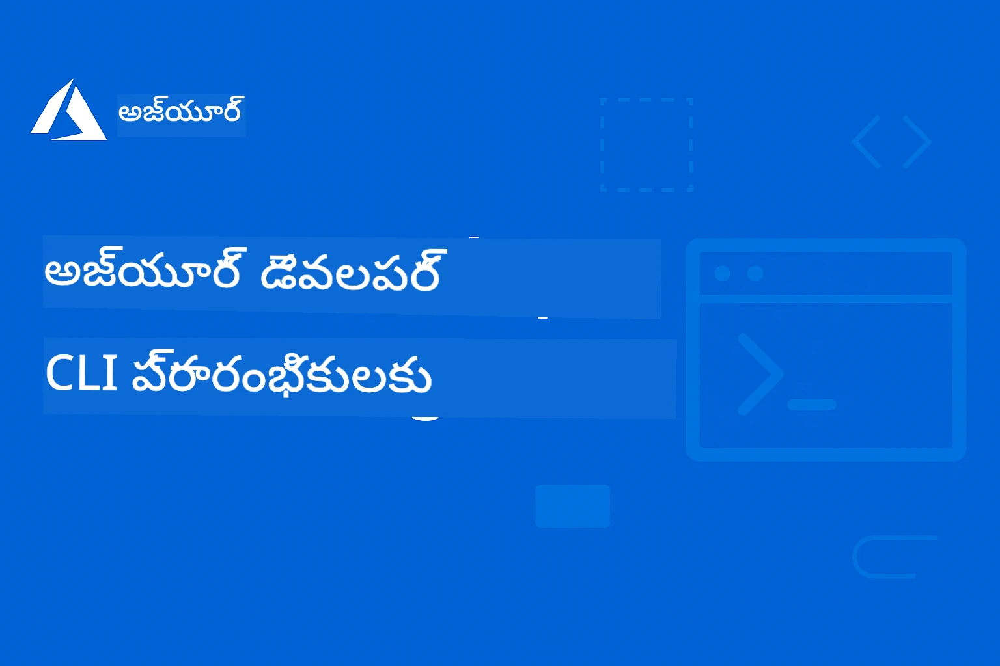

# AZD మొదలైనవారికి: ఒక నిర్మిత শেখన ప్రయాణం

 

[](https://GitHub.com/microsoft/azd-for-beginners/watchers/)
[](https://GitHub.com/microsoft/azd-for-beginners/network/)
[](https://GitHub.com/microsoft/azd-for-beginners/stargazers/)

[](https://discord.com/invite/nkVh3dp)
[](https://discord.gg/nTYy5BXMWG)

---

### ఆటోమేటెడ్ అనువాదాలు (ఎప్పుడూ అప్డేట్ అవుతూండును)

<!-- CO-OP TRANSLATOR LANGUAGES TABLE START -->
[అరబిక్](../ar/README.md) | [బెంగాలీ](../bn/README.md) | [బల్గేరియన్](../bg/README.md) | [బర్మీస్ (మియన్మార్)](../my/README.md) | [చైనీస్ (సరళీకృత)](../zh-CN/README.md) | [చైనీస్ (సాంప్రదాయము, హాంకాంగ్)](../zh-HK/README.md) | [చైనీస్ (సాంప్రదాయము, మకావో)](../zh-MO/README.md) | [చైనీస్ (సాంప్రదాయము, టైవాన్)](../zh-TW/README.md) | [క్రొయిషియన్](../hr/README.md) | [చెక్](../cs/README.md) | [డానిష్](../da/README.md) | [డచ్](../nl/README.md) | [ఎస్టోనియన్](../et/README.md) | [ఫిన్నిష్](../fi/README.md) | [ఫ్రెంచ్](../fr/README.md) | [జర్మన్](../de/README.md) | [గ్రీకు](../el/README.md) | [హీబ్రూ](../he/README.md) | [హిందీ](../hi/README.md) | [హంగేరియన్](../hu/README.md) | [ఇండోనేషియన్](../id/README.md) | [ఇటాలియన్](../it/README.md) | [జపనీస్](../ja/README.md) | [కన్నడ](../kn/README.md) | [ఖ్మేర్](../km/README.md) | [కొరియన్](../ko/README.md) | [లిథూయేనియన్](../lt/README.md) | [మలయ్](../ms/README.md) | [మలయాళం](../ml/README.md) | [మరాఠీ](../mr/README.md) | [నేపాలీ](../ne/README.md) | [నైజీరియన్ పిడ్గిన్](../pcm/README.md) | [నార్వీజియన్](../no/README.md) | [పర్శియన్ (ఫార్సీ)](../fa/README.md) | [పోలీష్](../pl/README.md) | [పోర్చుగీస్ (బ్రెజిల్)](../pt-BR/README.md) | [పోర్చుగీస్ (పార్తుగల్)](../pt-PT/README.md) | [పంజాబీ (గురుముఖీ)](../pa/README.md) | [రోమానియన్](../ro/README.md) | [రష్యన్](../ru/README.md) | [సెర్బియా (సిరిలిక్)](../sr/README.md) | [స్లోవాక్](../sk/README.md) | [స్లోవేనియన్](../sl/README.md) | [స్పానిష్](../es/README.md) | [స్వాహిలీ](../sw/README.md) | [స్వీడిష్](../sv/README.md) | [తగాలోగ్ (ఫిలిపీనో)](../tl/README.md) | [తమిళ్](../ta/README.md) | [తెలుగు](./README.md) | [థాయ్](../th/README.md) | [టర్కిష్](../tr/README.md) | [ఉక్రేనియన్](../uk/README.md) | [ఉర్దూ](../ur/README.md) | [వియత్నామీస్](../vi/README.md)

> **లోకల్‌గా క్లోన్ చేయాలనుకుంటున్నారా?**
>
> ఈ రిపాజిటరీలో 50+ భాషా అనువాదాలు ఉన్నాయి, ఇవి డౌన్‌లోడ్ పరిమాణాన్ని గణనీయంగా పెంచుతాయి. అనువాదాలు లేని కారణంగా క్లోన్ చేయడానికి sparse checkout ఉపయోగించండి:
>
> **Bash / macOS / Linux:**
> ```bash
> git clone --filter=blob:none --sparse https://github.com/microsoft/AZD-for-beginners.git
> cd AZD-for-beginners
> git sparse-checkout set --no-cone '/*' '!translations' '!translated_images'
> ```
>
> **CMD (Windows):**
> ```cmd
> git clone --filter=blob:none --sparse https://github.com/microsoft/AZD-for-beginners.git
> cd AZD-for-beginners
> git sparse-checkout set --no-cone "/*" "!translations" "!translated_images"
> ```
>
> ఇది కోర్సును పూర్తిచేసుకునేందుకు కావలసిన అన్ని దానిని చాలా తేలికైన డౌన్లోడ్‌తో అందిస్తుంది.
<!-- CO-OP TRANSLATOR LANGUAGES TABLE END -->

## 🆕 azd లో ఈరోజు ఏమి కొత్తది

Azure Developer CLI సంప్రదాయ వబ్ యాప్స్ మరియు APIs దాటి పెద్దదైంద. ఇప్పుడు, azd ఏదైనా అప్లికేషన్‌ను Azure కి డిప్లాయ్ చేయడానికి ఏకైక టూల్—దాంట్లో AI సామర్థ్యంతో కూడిన అప్లికేషన్స్ మరియు బుద్ధిశాలి ఏజెంట్లు కూడా ఉన్నాయి.

ఇది మీకు ఏమి అర్థం అవుతుందంటే:

- **AI ఏజెంట్లు ఇప్పుడు azd workloads యొక్క ప్రధాన భాగం.** మీరు అదే `azd init` → `azd up` వర్క్‌ఫ్లో ఉపయోగించి AI ఏజెంట్ ప్రాజెక్టులను ఆరంభించవచ్చు, డిప్లాయ్ చేయవచ్చు మరియు నిర్వహించవచ్చు.
- **Microsoft Foundry సమీకరణ** మా azd టెంప్లేట్ వ్యవస్థలో నేరుగా మోడల్ డిప్లాయ్మెంట్, ఏజెంట్ హోస్టింగ్ మరియు AI సర్వీస్ కాన్ఫిగరేషన్ తీసుకువస్తుంది.
- **మూల వర్క్‌ఫ్లో మార్చబడలేదు.** మీరు todo యాప్, మైక్రోసర్వీస్ లేదా బహుళ ఏజెంట్ AI సొల్యూషన్ డిప్లాయ్ చేస్తున్నా, ఆ కమాండ్‌లు అదే ఉంటాయి.

మీరు గతంలో azd ఉపయోగించిపోయినట్లయితే, AI మద్దతు సహజ విస్తారం—పేరుకే వేరే టూల్ లేదా ప్రత్యేక ట్రాక్ కాదు. మీరు కొత్తగా మొదలైతే, మీరు ఒకే వర్క్‌ఫ్లో నేర్చుకుంటారు, అది అన్నింటికీ పనిచేస్తుంది.

---

## 🚀 Azure Developer CLI (azd) అంటే 무엇?

**Azure Developer CLI (azd)** అనేది డెవలపర్-స్నేహపూర్వక కమాండ్-లైన్ టూల్, ఇది Azure పై అప్లికేషన్లు డిప్లాయ్ చేయడానికి సింపుల్‌గా చేస్తుంది. అనేక Azure రిసోర్సుల్ని మనually సృష్టించి కనెక్ట్ చేయడం కాకుండా, మీరు ఒక్క కమాండ్‌తో పూర్తి అప్లికేషన్లను డిప్లాయ్ చేయగలరు.

### `azd up` యొక్క మాయాజాలం

```bash
# ఈ ఒక్క ఆజ్ఞ అన్ని పనులు చేస్తుంది:
# ✅ అన్ని అజ్యూర్ వనరులను సృష్టిస్తుంది
# ✅ నెట్‌వర్కింగ్ మరియు భద్రతను కాన్ఫಿಗర్ చేస్తుంది
# ✅ మీ అప్లికేషన్ కోడ్‌ను నిర్మిస్తుంది
# ✅ అజ్యూర్‌కు పంపిణీ చేస్తుంది
# ✅ పనిచేసే URL‌ని అందిస్తుంది
azd up
```

**అది అంతే!** Azure పోర్టల్ చుడవసరం లేదు, క్లిష్టమైన ARM టెంప్లేట్స్ ను ముందుగా నేర్చుకోవాల్సిన అవసరం లేదు, మాన్యువల్ కాన్ఫిగరేషన్ లేదు - కేవలం Azure పై పనిచేస్తున్న అప్లికేషన్లు.

---

## ❓ Azure Developer CLI vs Azure CLI: వ్యత్యాసం ఏమిటి?

ఇది ప్రారంభికులు ఎక్కువగా అడిగే ప్రశ్న. సరళ సమాధానం ఇక్కడ ఉంది:

| Feature | **Azure CLI (`az`)** | **Azure Developer CLI (`azd`)** |
|---------|---------------------|--------------------------------|
| **ఉద్దేశ్యం** | వ్యక్తిగత Azure రిసోర్సులను నిర్వహించు | పూర్తి అప్లికేషన్లను డిప్లాయ్ చేయు |
| **మనోభావం** | ఇన్ఫ్రాస్ట్రక్చర్-కేంద్రితము | అప్లికేషన్-కేంద్రితము |
| **ఉదాహరణ** | `az webapp create --name myapp...` | `azd up` |
| **తెరచు నేర్చుకోవటం** | Azure సేవలను తెలుసుకోవాల్సి ఉంటుంది | మీ యాప్ గురించి మాత్రమే తెలుసుకోండి |
| **ఉత్తమంగా ఎవరికోసం** | DevOps, ఇన్ఫ్రాస్ట్రక్చర్ | డెవలపర్లు, ప్రోటోటైపింగ్ |

### సరళ తులనాత్మక ఉదాహరణ

- **Azure CLI** అనేది ఇల్లు నిర్మించడానికి అవసరమైన అన్ని పరికరాలు ఉన్నట్లుగానే - హ్యామర్లు, ఆరరులు, పనిముడ్డులు. మీరు ఏదైనా నిర్మించవచ్చు, కానీ నిర్మాణం గురించి తెలుసుకోవాలి.
- **Azure Developer CLI** అనేది ఒక కాంట్రాక్టర్‌ను నియమించడం లాంటిది - మీరు ఏమి కోరుతున్నారో వివరణగా చెప్పండి, వారు భవనం నిర్మాణాన్ని నిర్వహిస్తారు.

### ఎప్పుడు ఏదిని ఉపయోగించాలి

| దృశ్యం | ఈది ఉపయోగించండి |
|----------|----------|
| "నేను నా వెబ్ యాప్ త్వరగా డిప్లాయ్ చేయాలనుకుంటున్నాను" | `azd up` |
| "నేను కేవలం ఒక స్టోరేజ్ అకౌంట్ మాత్రమే సృష్టించాలి" | `az storage account create` |
| "నేను ఒక పూర్తి AI అప్లికేషన్ నిర్మిస్తున్నాను" | `azd init --template azure-search-openai-demo` |
| "నేను ప్రత్యేక Azure రిసోర్సును డీబగ్ చేయాలి" | `az resource show` |
| "నేను నిమిషాల్లో ప్రొడక్షన్-రెడీ డిప్లాయ్ చేయాలనుకుంటున్నాను" | `azd up --environment production` |

### వీటి కలిసి పని

AZD లోపు భాగంగా Azure CLI ను ఉపయోగిస్తుంది. మీరు రెండు టూల్స్‌ను ఉపయోగించవచ్చు:
```bash
# AZDతో మీ యాప్‌ను మోపండి
azd up

# తరువాత Azure CLI తో నిర్దిష్ట వనరులను సరిచూడండి
az webapp config set --name myapp --always-on true
```

---

## 🌟 Awesome AZD లో టెంప్లేట్స్‌ను కనుగొనండి

సకలంగా మొదలు పెట్టకండి! **Awesome AZD** అనేది కమ్యూనిటీ యొక్క రెడీ-టు-డిప్లాయ్ టెంప్లేట్స్ సేకరణ:

| రిసోర్సు | వివరణ |
|----------|-------------|
| 🔗 [**Awesome AZD గ్యాలరీ**](https://azure.github.io/awesome-azd/) | ఒక-క్లిక్ డిప్లాయ్‌తో 200+ టెంప్లేట్స్ ను బ్రౌజ్ చేయండి |
| 🔗 [**ఒక టెంప్లేట్ సమర్పించండి**](https://github.com/Azure/awesome-azd/issues) | మీ స్వంత టెంప్లేట్‌ను కమ్యూనిటీకి ఇవ్వండి |
| 🔗 [**GitHub రిపాజిటరీ**](https://github.com/Azure/awesome-azd) | సోర్స్‌ను స్టార్ చేసి అన్వేషించండి |

### Awesome AZD నుండి ప్రాచుర్యమైన AI టెంప్లేట్స్

```bash
# Microsoft Foundry మోడల్స్ + AI శోధనతో RAG చాట్
azd init --template azure-search-openai-demo

# త్వరిగా AI చాట్ అనువర్తనం
azd init --template openai-chat-app-quickstart

# Foundry ఏజెంట్‌లతో AI ఏజెంట్‌లు
azd init --template get-started-with-ai-agents
```

---

## 🎯 3 దశలలో ప్రారంభించడం

### దశ 1: AZD ఇన్‌స్టాల్ చేయండి (2 నిమిషాలు)

**Windows:**
```powershell
winget install microsoft.azd
```

**macOS:**
```bash
brew tap azure/azd && brew install azd
```

**Linux:**
```bash
curl -fsSL https://aka.ms/install-azd.sh | bash
```

### దశ 2: Azure లో లాగిన్ అవ్వండి

```bash
azd auth login
```

### దశ 3: మీ మొదటి యాప్ డిప్లాయ్ చేయండి

```bash
# టెంప్లేట్ నుండి ప్రారంభించండి
azd init --template todo-nodejs-mongo

# Azure కు పైఠాగం చేయండి (అన్నింటినీ సృష్టిస్తుంది!)
azd up
```

**🎉 అంతే!** మీ యాప్ ఇప్పుడు Azure పై లౖవ్ అయింది.

### క్లీన్ అప్ (మర్చిపోవద్దు!)

```bash
# Remove all resources when done experimenting
azd down --force --purge
```

---

## 📚 ఈ కోర్సును ఎలా ఉపయోగించాలి

ఈ కోర్సు **వ్యవస్థీకృత అభ్యాసం** కోసం రూపొందించబడింది - మీరు సౌకర్యంగా ఉన్న స్థానం నుంచి మొదలుపెట్టి పైకెళ్తారు:

| మీ అనుభవం | ఇక్కడే మొదలు పెట్టండి |
|-----------------|------------|
| **Azure కు బ完全 కొత్తవారు** | [అధ్యాయం 1: ఫౌండేషన్](#-chapter-1-foundation--quick-start) |
| **Azure తెలుసు, AZD కొత్తగా ఉన్నవారు** | [అధ్యాయం 1: ఫౌండేషన్](#-chapter-1-foundation--quick-start) |
| **AI యాప్స్ డిప్లాయ్ చేయాలనుకుంటున్నవారు** | [అధ్యాయం 2: AI-ఫర్స్ట్ డెవలప్మెంట్](#-chapter-2-ai-first-development-recommended-for-ai-developers) |
| **ప్రాక్టికల్ హ్యాండ్-ఆన్ కోసం** | [🎓 ఇంటరాక్టివ్ వర్క్‌షాప్](workshop/README.md) - 3-4 గంటల గైడెడ్ ప్రయోగశాల |
| **ప్రొడక్షన్ నమూనాలు కావాలనుకుంటే** | [అధ్యాయం 8: ప్రొడక్షన్ & ఎంటర్‌ప్రైజ్](#-chapter-8-production--enterprise-patterns) |

### వేగవంతమైన సెటప్

1. **ఈ రిపాజిటరీని ఫోర్క్ చేయండి**: [](https://GitHub.com/microsoft/azd-for-beginners/fork)
2. **క్లోన్ చేయండి**: `git clone https://github.com/YOUR-USERNAME/azd-for-beginners.git`
3. **సహాయం పొందండి**: [Azure Discord Community](https://discord.com/invite/ByRwuEEgH4)

> **లోకల్‌గా క్లోన్ చేయాలనుకుంటున్నారా?**

> ఈ రిపాజిటరీలో 50+ భాషా అనువాదాలు ఉన్నాయి, ఇవి డౌన్‌లోడ్ పరిమాణాన్ని గణనీయంగా పెంచుతాయి. అనువాదాలు లేని కారణంగా క్లోన్ చేయడానికి sparse checkout ఉపయోగించండి:
> ```bash
> git clone --filter=blob:none --sparse https://github.com/microsoft/AZD-for-beginners.git
> cd AZD-for-beginners
> git sparse-checkout set --no-cone '/*' '!translations' '!translated_images'
> ```
> ఇది కోర్సును పూర్తిచేసుకునేందుకు కావలసిన అన్ని దానిని చాలా తేలికైన డౌన్లోడ్‌తో అందిస్తుంది.


## కోర్సు అవలోకనం

నిర్మిత అధ్యాయాల ద్వారా Azure Developer CLI (azd) ను మాస్టర్ చేయండి, ప్రగతిశీల అభ్యాసానికి రూపకల్పన చేయబడినది. **Microsoft Foundry సమీకరణతో AI అప్లికేషన్ డిప్లాయ్‌మెంట్ పై ప్రత్యేక దృష్టి.**

### ఈ కోర్సు ఆధునిక డెవలపర్లు కోసం ఎందుకు అవసరం

Microsoft Foundry Discord కమ్యూనిటీ మతలపాటి ఆధారంగా, **45% డెవలపర్లు AZD ను AI వర్క్‌లోడ్‌ల కోసం ఉపయోగించాలనుకుంటున్నారు** కానీ దిగువ సమస్యలను ఎదుర్కొంటున్నారు:
- క్లిష్టమైన బహు-సేవ AI ఆర్కిటెక్చర్లు
- ప్రొడక్షన్ AI డిప్లాయ్‌మెంట్ బెస్ట్ ప్రాక్టీసెస్  
- Azure AI సర్వీస్ సమీకరణ మరియు కాన్ఫిగరేషన్
- AI వర్క్‌లోడ్‌ల కోసం ఖర్చు ఆప్టిమైజేషన్
- AI-స్పెసిఫిక్ డిప్లాయ్‌మెంట్ సమస్యల ట్రబుల్‌షూటింగ్

### నేర్చుకునే లక్ష్యాలు

ఈ నిర్మిత కోర్సును పూర్తి చేయడం ద్వారా, మీరు:
- **AZD మౌలిక సిద్ధాంతాలు మాస్టర్ చేయండి**: కోర్ కాన్సెప్ట్‌లు, ఇన్‌స్టాలేషన్ మరియు కాన్ఫిగరేషన్
- **AI అప్లికేషన్లను డిప్లాయ్ చేయండి**: AZD ను Microsoft Foundry సేవలతో ఉపయోగించండి
- **Infrastructure as Code అమలు చేయండి**: Bicep టెంప్లేట్స్‌తో Azure రిసోర్సులను నిర్వహించండి
- **డిప్లాయ్‌మెంట్‌లను ట్రబుల్‌షూట్ చేయండి**: సాధారణ సమస్యలను పరిష్కరించి డీబగ్ చేయండి
- **ప్రొడక్షన్‌కు ఆప్టిమైజ్ చేయండి**: సెక్యూరిటీ, స్కేలింగ్, మానిటరింగ్ మరియు ఖర్చు నిర్వహణ
- **బహుళ-ఏజెంట్ సొల్యూషన్లు నిర్మించండి**: క్లిష్ట AI ఆర్కిటెక్చర్లను డిప్లాయ్ చేయండి

## 🗺️ కోర్సు మ్యాప్: అధ్యాయం ద్వారా వేగవంతమైన నావిగేషన్

ప్రతి అధ్యాయానికి లక్ష్యాలు, వేగవంతమైన ప్రారంభాలు మరియు వ్యాయామాలుతో ప్రత్యేక README ఉంది:

| అధ్యాయం | విషయం | పాఠాలు | వ్యవధి | సంక్లిష్టత |
|---------|-------|---------|----------|------------|
| **[Ch 1: Foundation](docs/chapter-01-foundation/README.md)** | ప్రారంభం | [AZD మౌలికాలు](docs/chapter-01-foundation/azd-basics.md) &#124; [ఇన్‌స్టాలేషన్](docs/chapter-01-foundation/installation.md) &#124; [మొదటి ప్రాజెక్టు](docs/chapter-01-foundation/first-project.md) | 30-45 నిమిషాలు | ⭐ |
| **[అధ్యాయం 2: AI అభివృద్ధి](docs/chapter-02-ai-development/README.md)** | AI-ముఖ్య అప్లికేషన్లు | [Foundry సమీకరణ](docs/chapter-02-ai-development/microsoft-foundry-integration.md) &#124; [AI ఏజెంట్లు](docs/chapter-02-ai-development/agents.md) &#124; [మోడల్ అమర్పు](docs/chapter-02-ai-development/ai-model-deployment.md) &#124; [వర్క్‌షాప్](docs/chapter-02-ai-development/ai-workshop-lab.md) | 1-2 hrs | ⭐⭐ |
| **[అధ్యాయం 3: కాన్ఫిగరేషన్](docs/chapter-03-configuration/README.md)** | ప్రామాణికరణ & భద్రత | [కాన్ఫిగరేషన్](docs/chapter-03-configuration/configuration.md) &#124; [ప్రామాణికరణ & భద్రత](docs/chapter-03-configuration/authsecurity.md) | 45-60 min | ⭐⭐ |
| **[అధ్యాయం 4: ఇన్‌ఫ్రాస్ట్రక్చర్](docs/chapter-04-infrastructure/README.md)** | Infrastructure as Code & అమలు | [Deployment Guide](docs/chapter-04-infrastructure/deployment-guide.md) &#124; [Provisioning](docs/chapter-04-infrastructure/provisioning.md) | 1-1.5 hrs | ⭐⭐⭐ |
| **[అధ్యాయం 5: Multi-Agent](docs/chapter-05-multi-agent/README.md)** | AI ఏజెంట్ పరిష్కారాలు | [రిటైల్ సన్నివేశం](examples/retail-scenario.md) &#124; [సంయోజన నమూనాలు](docs/chapter-06-pre-deployment/coordination-patterns.md) | 2-3 hrs | ⭐⭐⭐⭐ |
| **[అధ్యాయం 6: ప్రీ-డిప్లాయ్‌మెంట్](docs/chapter-06-pre-deployment/README.md)** | ప్రణాళిక & ధృవీకరణ | [Preflight Checks](docs/chapter-06-pre-deployment/preflight-checks.md) &#124; [Capacity Planning](docs/chapter-06-pre-deployment/capacity-planning.md) &#124; [SKU Selection](docs/chapter-06-pre-deployment/sku-selection.md) &#124; [App Insights](docs/chapter-06-pre-deployment/application-insights.md) | 1 hr | ⭐⭐ |
| **[అధ్యాయం 7: సమస్య పరిష్కారం](docs/chapter-07-troubleshooting/README.md)** | డీబగ్ & పరిష్కారం | [సాధారణ సమస్యలు](docs/chapter-07-troubleshooting/common-issues.md) &#124; [డీబగ్గింగ్](docs/chapter-07-troubleshooting/debugging.md) &#124; [AI సమస్యలు](docs/chapter-07-troubleshooting/ai-troubleshooting.md) | 1-1.5 hrs | ⭐⭐ |
| **[అధ్యాయం 8: ఉత్పత్తి](docs/chapter-08-production/README.md)** | ఎంటర్ప్రైజ్ నమూనాలు | [ప్రొడక్షన్ పద్ధతులు](docs/chapter-08-production/production-ai-practices.md) | 2-3 hrs | ⭐⭐⭐⭐ |
| **[🎓 వర్క్‌షాప్](workshop/README.md)** | ప్రయోగశాల | [పరిచయం](workshop/docs/instructions/0-Introduction.md) &#124; [ఎంపిక](workshop/docs/instructions/1-Select-AI-Template.md) &#124; [ధృవీకరణ](workshop/docs/instructions/2-Validate-AI-Template.md) &#124; [విభజన](workshop/docs/instructions/3-Deconstruct-AI-Template.md) &#124; [కాన్ఫిగరేషన్](workshop/docs/instructions/4-Configure-AI-Template.md) &#124; [అనుకూలీకరణ](workshop/docs/instructions/5-Customize-AI-Template.md) &#124; [నిర్మూలన](workshop/docs/instructions/6-Teardown-Infrastructure.md) &#124; [సంక్షేపం](workshop/docs/instructions/7-Wrap-up.md) | 3-4 hrs | ⭐⭐ |

**మొత్తం కోర్సు వ్యవధి:** ~10-14 hours | **నైపుణ్య అభివృద్ధి:** Beginner → Production-Ready

---

## 📚 శిక్షణ అధ్యాయాలు

*మీ అనుభవ స్థాయి మరియు లక్ష్యాల ఆధారంగా మీ అభ్యాస మార్గాన్ని ఎంచుకోండి*

### 🚀 అధ్యాయం 1: ప్రాథమికం & త్వరిత ప్రారంభం
**అవసరాలు**: Azure subscription, ప్రాథమిక command line పరిజ్ఞానం  
**వ్యవధి**: 30-45 minutes  
**సంక్లిష్టత**: ⭐

#### మీరు నేర్చుకోబోయే అంశాలు
- Azure Developer CLI మూలాలు
- మీ ప్లాట్‌ఫారమ్‌లో AZD సంస్థాపన
- మీ మొదటి విజయవంతమైన డిప్లాయ్‌మెంట్

#### కోర్సు వనరులు
- **🎯 ఇక్కడి నుండి ప్రారంభించండి**: [Azure Developer CLI అంటే ఏమిటి?](#what-is-azure-developer-cli)
- **📖 సిద్ధాంతం**: [AZD ఆది సూత్రాలు](docs/chapter-01-foundation/azd-basics.md) - మూల భావనలు మరియు పదజాలం
- **⚙️ సెటప్**: [ఇన్‌స్టాలేషన్ & సెటప్](docs/chapter-01-foundation/installation.md) - ప్లాట్‌ఫారం-ప్రత్యేక మార్గదర్శకాలు
- **🛠️ ప్రాక్టికల్**: [మీ మొదటి ప్రాజెక్ట్](docs/chapter-01-foundation/first-project.md) - దశల వారీ ట్యుటోరియల్
- **📋 త్వరిత సూచిక**: [కమాండ్ చీట్ షీట్](resources/cheat-sheet.md)

#### ప్రాయోగిక వ్యాయామాలు
```bash
# త్వరిత సంస్థాపన తనిఖీ
azd version

# మీ మొదటి అప్లికేషన్‌ను అమలులో పెట్టండి
azd init --template todo-nodejs-mongo
azd up
```

**💡 అధ్యాయం ఫలితం**: AZD ఉపయోగించి ఒక సాదా వెబ్ అప్లికేషన్‌ను విజయవంతంగా Azureలో డిప్లాయ్ చేయడం

**✅ విజయ ధృవీకరణ:**
```bash
# అధ్యాయం 1 పూర్తి చేసిన తర్వాత, మీరు ఈ క్రింది పనులు చేయగలగాలి:
azd version              # ఇన్‌స్టాల్ చేయబడిన సంచికను చూపిస్తుంది
azd init --template todo-nodejs-mongo  # ప్రాజెక్టును ప్రారంభిస్తుంది
azd up                  # Azureకి డిప్లాయ్ చేస్తుంది
azd show                # పనిచేస్తున్న యాప్ యొక్క URL చూపిస్తుంది
# అప్లికేషన్ బ్రౌజర్లో తెరవబడుతుంది మరియు పనిచేస్తుంది
azd down --force --purge  # వనరులను శుభ్రపరుస్తుంది
```

**📊 సమయ పెట్టుబడి:** 30-45 minutes  
**📈 నైపుణ్య స్థాయి తర్వాత:** సాదా అప్లికేషన్లను స్వతంత్రంగా డిప్లాయ్ చేయగలరు  
**📈 నైపుణ్య స్థాయి తర్వాత:** సాదా అప్లికేషన్లను స్వతంత్రంగా డిప్లాయ్ చేయగలరు

---

### 🤖 అధ్యాయం 2: AI-ముఖ్య అభివృద్ధి (AI డెవలపర్లకు సిఫారసు చేయబడింది)
**అవసరాలు**: అధ్యాయం 1 పూర్తి అయి ఉండాలి  
**వ్యవధి**: 1-2 hours  
**సంక్లిష్టత**: ⭐⭐

#### మీరు నేర్చుకోబోయే అంశాలు
- AZD తో Microsoft Foundry సమీకరణం
- AI-శక్తితో నడిచే అప్లికేషన్లను డిప్లాయ్ చేయడం
- AI సేవ కాన్ఫిగరేషన్లను అర్థం చేసుకోవడం

#### కోర్సు వనరులు
- **🎯 ఇక్కడి నుండి ప్రారంభించండి**: [Microsoft Foundry సమీకరణ](docs/chapter-02-ai-development/microsoft-foundry-integration.md)
- **🤖 AI ఏజెంట్లు**: [AI ఏజెంట్ల గైడ్](docs/chapter-02-ai-development/agents.md) - AZDతో తెలివైన ఏజెంట్లను డిప్లాయ్ చేయండి
- **📖 నమూనాలు**: [AI మోడల్ అమర్పు](docs/chapter-02-ai-development/ai-model-deployment.md) - AI మోడల్స్‌ను అమర్చడం మరియు నిర్వహించడం
- **🛠️ వర్క్‌షాప్**: [AI వర్క్‌షాప్ ప్రయోగశాల](docs/chapter-02-ai-development/ai-workshop-lab.md) - మీ AI పరిష్కారాలను AZD-కు సిద్ధం చేయండి
- **🎥 ఇంటరాక్టివ్ గైడ్**: [వర్క్‌షాప్ మెటీరియల్స్](workshop/README.md) - MkDocs * DevContainer పరిసరంతో బ్రౌజర్ ఆధారిత అభ్యాసం
- **📋 టెంప్లేట్స్**: [Microsoft Foundry టెంప్లేట్స్](#workshop-resources)
- **📝 ఉదాహరణలు**: [AZD డిప్లాయ్‌మెంట్ ఉదాహరణలు](examples/README.md)

#### ప్రాయోగిక వ్యాయామాలు
```bash
# మీ మొదటి AI అప్లికేషన్‌ను అమలు చేయండి
azd init --template azure-search-openai-demo
azd up

# అదనపు AI టెంప్లేట్లను ప్రయత్నించండి
azd init --template openai-chat-app-quickstart
azd init --template agent-openai-python-prompty
```

**💡 అధ్యాయం ఫలితం**: RAG సామర్థ్యాలతో AI-శక్తి చాట్ అప్లికేషన్ను అమర్చడం మరియు కాన్ఫిగర్ చేయడం

**✅ విజయ ధృవీకరణ:**
```bash
# అధ్యాయం 2 తర్వాత, మీరు ఈ క్రింది పనులు చేయగలుగుతారు:
azd init --template azure-search-openai-demo
azd up
# AI చాట్ ఇంటర్‌ఫేస్‌ను పరీక్షించండి
# ప్రశ్నలు అడగండి మరియు మూలాలతో కూడిన AI-ప్రేరిత ప్రతిస్పందనలు పొందండి
# శోధన సమగ్రీకరణ పని చేస్తుందో నిర్ధారించండి
azd monitor  # Application Insights టెలిమెట్రీని చూపిస్తున్నదో తనిఖీ చేయండి
azd down --force --purge
```

**📊 సమయ పెట్టుబడి:** 1-2 hours  
**📈 నైపుణ్య స్థాయి తర్వాత:** ప్రొడక్షన్-సిద్ధ AI అప్లికేషన్లను డిప్లాయ్ చేసి కాన్ఫిగర్ చేయగలరు  
**💰 ఖర్చుల అవగాహన:** అభివృద్ధి ఖర్చులు $80-150/నెల, ప్రొడక్షన్ ఖర్చులు $300-3500/నెల ఉంటాయి

#### 💰 AI డిప్లాయ్‌మెంట్‌ల కోసం ఖర్చు పరామర్శలు

**అభివృద్ధి పరిసరాలు (అంచనా $80-150/నెల):**
- Microsoft Foundry Models (Pay-as-you-go): $0-50/నెల (టోకెన్ వినియోగానికి ఆధారపడి)
- AI Search (బేసిక్ స్థాయి): $75/నెల
- Container Apps (Consumption): $0-20/నెల
- Storage (స్టాండర్డ్): $1-5/నెల

**ప్రొడక్షన్ పరిసరాలు (అంచనా $300-3,500+/నెల):**
- Microsoft Foundry Models (స్థిర పనితీరు కోసం PTU): $3,000+/నెల లేదా ఎక్కువ వాల్యూమ్ ఉంటే Pay-as-you-go
- AI Search (స్టాండర్డ్ స్థాయి): $250/నెల
- Container Apps (ఙDedicated): $50-100/నెల
- Application Insights: $5-50/నెల
- Storage (ప్రీమియం): $10-50/నెల

**💡 ఖర్చు ఆప్టిమైజేషన్ సూచనలు:**
- అభ్యాసానికి Microsoft Foundry Models యొక్క **ఫ్రీ టియర్** ఉపయోగించండి (Azure OpenAI 50,000 టోకెన్లు/నెల చేర్చబడి ఉంటుంది)
- అభివృద్ధి కాకున్నప్పుడు వనరులను విడదీయడానికి `azd down` ను నడపండి
- ప్రారంభంలో consumption-based బిల్లింగ్ తో మొదలవ్వండి, ప్రొడక్షన్‌కు మాత్రమే PTU కి అప్గ్రేడ్ చేయండి
- డిప్లాయ్‌మెంట్ చేసే ముందు ఖర్చులను అంచనా వేయడానికి `azd provision --preview` ఉపయోగించండి
- ఆటో-స్కేలింగ్‌ను ఎనేబుల్ చేయండి: వాస్తవ వినియోగానికి మాత్రమే చెల్లించండి

**ఖర్చు మొనిటరింగ్:**
```bash
# అంచనా నెలవారీ ఖర్చులను తనిఖీ చేయండి
azd provision --preview

# Azure పోర్టల్‌లో వాస్తవ ఖర్చులను పర్యవేక్షించండి
az consumption budget list --resource-group <your-rg>
```

---

### ⚙️ అధ్యాయం 3: కాన్ఫిగరేషన్ & ప్రామాణీకరణ
**అవసరాలు**: అధ్యాయం 1 పూర్తి అయి ఉండాలి  
**వ్యవధి**: 45-60 minutes  
**సంక్లిష్టత**: ⭐⭐

#### మీరు నేర్చుకోబోయే అంశాలు
- ఎన్విరాన్‌మెంట్ కాన్ఫిగరేషన్ మరియు నిర్వహణ
- ఆటెంటికేషన్ మరియు భద్రత ఉత్తమ ప్రకటనలు
- వనరుల పేరుదలు మరియు సంస్థీకరణ

#### కోర్సు వనరులు
- **📖 కాన్ఫిగరేషన్**: [కాన్ఫిగరేషన్ గైడ్](docs/chapter-03-configuration/configuration.md) - ఎన్విరాన్‌మెంట్ సెటప్
- **🔐 భద్రత**: [ఆథెంటికేషన్ నమూనాలు మరియు మేనేజ్ చేసిన ఐడెంటిటీ](docs/chapter-03-configuration/authsecurity.md) - ఆటెంటికేషన్ నమూనాలు
- **📝 ఉదాహరణలు**: [డేటాబేస్ యాప్ ఉదాహరణ](examples/database-app/README.md) - AZD డేటాబేస్ ఉదాహరణలు

#### ప్రాయోగిక వ్యాయామాలు
- బహుళ ఎన్విరాన్‌మెంట్‌లు (dev, staging, prod) కాన్ఫిగర్ చేయండి
- మేనేజ్ చేసిన ఐడెంటిటీ ఆటెంటికేషన్ సెటప్ చేయండి
- ఎన్విరాన్‌మెంట్-నిర్దిష్ట కాన్ఫిగరేషన్లు అమలు చేయండి

**💡 అధ్యాయం ఫలితం**: సరిగ్గా ఆటెంటికేషన్ మరియు భద్రతతో బహుళ ఎన్విరాన్‌మెంట్‌లను నిర్వహించగలగడం

---

### 🏗️ అధ్యాయం 4: Infrastructure as Code & అమలు
**అవసరాలు**: అధ్యాయాలు 1-3 పూర్తి అయి ఉండాలి  
**వ్యవధి**: 1-1.5 hours  
**సంక్లిష్టత**: ⭐⭐⭐

#### మీరు నేర్చుకోబోయే అంశాలు
- అధునాతన డిప్లాయ్‌మెంట్ నమూనాలు
- Bicep తో Infrastructure as Code
- వనరు ప్రావిజనింగ్ వ్యూహాలు

#### కోర్సు వనరులు
- **📖 డిప్లాయ్‌మెంట్**: [Deployment Guide](docs/chapter-04-infrastructure/deployment-guide.md) - పూర్తి వర్క్‌ఫ్లోలు
- **🏗️ ప్రావిజనింగ్**: [Provisioning Resources](docs/chapter-04-infrastructure/provisioning.md) - Azure వనరు నిర్వహణ
- **📝 ఉదాహరణలు**: [Container App Example](../../examples/container-app) - కంటెయినరైజ్డ్ డిప్లాయ్‌మెంట్‌లు

#### ప్రాయోగిక వ్యాయామాలు
- అనుకూల Bicep టెంప్లేట్లను సృష్టించండి
- బహుళ సేవల అప్లికేషన్‌లను డిప్లాయ్ చేయండి
- బ్లూ-గ్రీన్ డిప్లాయ్‌మెంట్ వ్యూహాలను అమలు చేయండి

**💡 అధ్యాయం ఫలితం**: అనుకూల ఇన్ఫ్రాస్ట్రక్చర్ టెంప్లేట్స్ ఉపయోగించి సంక్లిష్ట బహుళ-సర్వీస్ అప్లికేషన్‌లను డిప్లాయ్ చేయడం

---

### 🎯 అధ్యాయం 5: Multi-Agent AI పరిష్కారాలు (అవనత)
**అవసరాలు**: అధ్యాయాలు 1-2 పూర్తి అయి ఉండాలి  
**వ్యవధి**: 2-3 hours  
**సంక్లిష్టత**: ⭐⭐⭐⭐

#### మీరు నేర్చుకోబోయే అంశాలు
- మల్టీ-ఏజెంట్ ఆర్కిటెక్చర్ నమూనాలు
- ఏజెంట్ ఆర్కెస్టేషన్ మరియు కోఆర్డినేషన్
- ప్రొడక్షన్-సిద్ధ AI డిప్లాయ్‌మెంట్‌లు

#### కోర్సు వనరులు
- **🤖 ఫీచర్సpectrum ప్రాజెక్ట్**: [రిటైల్ మల్టీ-ఏజెంట్ పరిష్కారం](examples/retail-scenario.md) - పూర్తి అమలు
- **🛠️ ARM టెంప్లేట్స్**: [ARM Template Package](../../examples/retail-multiagent-arm-template) - ఒక క్లిక్ డిప్లాయ్‌మెంట్
- **📖 ఆర్కిటెక్చర్**: [మల్టీ-ఏజెంట్ సంయోజన నమూనాలు](docs/chapter-06-pre-deployment/coordination-patterns.md) - నమూనాలు

#### ప్రాయోగిక వ్యాయామాలు
```bash
# సంపూర్ణ రిటైల్ బహుళ-ఏజెంట్ పరిష్కారాన్ని అమర్చండి
cd examples/retail-multiagent-arm-template
./deploy.sh

# ఏజెంట్ కాన్ఫిగరేషన్లను అన్వేషించండి
az deployment group show --resource-group <rg-name> --name <deployment-name>
```

**💡 అధ్యాయం ఫలితం**: కస్టమర్ మరియు ఇన్వెంటరీ ఏజెంట్లు కలిగిన ప్రొడక్షన్-సిద్ధ మల్టీ-ఏజెంట్ AI పరిష్కారాన్ని డిప్లాయ్ చేసి నిర్వహించడం

---

### 🔍 అధ్యాయం 6: ప్రీ-డిప్లాయ్‌మెంట్ ధృవీకరణ & ప్రణాళిక
**అవసరాలు**: అధ్యాయం 4 పూర్తి అయి ఉండాలి  
**వ్యవధి**: 1 hour  
**సంక్లిష్టత**: ⭐⭐

#### మీరు నేర్చుకోబోయే అంశాలు
- కేపాసిటీ ప్రణాళిక మరియు వనరు ధృవీకరణ
- SKU ఎంపిక వ్యూహాలు
- ప్రీ-ఫ్లైట్ చెక్లు మరియు ఆటోమేషన్

#### కోర్సు వనరులు
- **📊 ప్రణాళిక**: [Capacity Planning](docs/chapter-06-pre-deployment/capacity-planning.md) - వనరు ధృవీకరణ
- **💰 ఎంపిక**: [SKU Selection](docs/chapter-06-pre-deployment/sku-selection.md) - ఖర్చు-ప్రభావవంతమైన ఎంపికలు
- **✅ ధృవీకరణ**: [Pre-flight Checks](docs/chapter-06-pre-deployment/preflight-checks.md) - ఆటోమేటెడ్ స్క్రిప్ట్‌లు

#### ప్రాయోగిక వ్యాయామాలు
- కేపాసిటీ ధృవీకరణ స్క్రిప్ట్‌లను నడపండి
- ఖర్చు కోసం SKU ఎంపికలను ఆప్టిమైజ్ చేయండి
- ఆటోమేటెడ్ ప్రీ-డిప్లాయ్‌మెంట్ చెక్లును అమలు చేయండి

**💡 అధ్యాయం ఫలితం**: అమలు ముందు డిప్లాయ్‌మెంట్‌లను ధృవీకరించి ఆప్టిమైజ్ చేయగలగడం

---

### 🚨 అధ్యాయం 7: ట్రబుల్షూటింగ్ & డీబగ్గింగ్
**అవసరాలు**: ఏదైనా డిప్లాయ్‌మెంట్ అధ్యాయం పూర్తి చేసారా  
**వ్యవధి**: 1-1.5 hours  
**సంక్లిష్టత**: ⭐⭐

#### మీరు నేర్చుకోబోయే అంశాలు
- వ్యవస్థాత్మక డీబగ్గింగ్ విధానాలు
- సాధారణ సమస్యలు మరియు పరిష్కారాలు
- AI-స్పెసిఫిక్ ట్రబుల్షూటింగ్

#### కోర్సు వనరులు
- **🔧 సాధారణ సమస్యలు**: [సాధారణ సమస్యలు](docs/chapter-07-troubleshooting/common-issues.md) - FAQ మరియు పరిష్కారాలు
- **🕵️ డీబగ్గింగ్**: [డీబగ్గింగ్ గైడ్](docs/chapter-07-troubleshooting/debugging.md) - దశల వారీ వ్యూహాలు
- **🤖 AI సమస్యలు**: [AI-స్పెసిఫిక్ ట్రబుల్షూటింగ్](docs/chapter-07-troubleshooting/ai-troubleshooting.md) - AI సేవల సమస్యలు

#### ప్రాయోగిక వ్యాయామాలు
- డిప్లాయ్‌మెంట్ విఫలతలను నిర్ధారణ చేయండి
- ఆటెంటికేషన్ సమస్యలను పరిష్కరించండి
- AI సేవ కనెక్టివిటీని డీబగ్ చేయండి

**💡 అధ్యాయం ఫలితం**: సాధారణ డిప్లాయ్‌మెంట్ సమస్యలను స్వతంత్రంగా గుర్తించి పరిష్కరించగలగడం

---

### 🏢 అధ్యాయం 8: ప్రొడక్షన్ & ఎంటర్ప్రైజ్ నమూనాలు
**అవసరాలు**: అధ్యాయాలు 1-4 పూర్తి అయి ఉండాలి  
**వ్యవధి**: 2-3 hours  
**సంక్లిష్టత**: ⭐⭐⭐⭐

#### మీరు నేర్చుకోబోయే అంశాలు
- ప్రొడక్షన్ డిప్లాయ్‌మెంట్ వ్యూహాలు
- ఎంటర్ప్రైజ్ భద్రత నమూనాలు
- మానిటరింగ్ మరియు ఖర్చు ఆప్టిమైజేషన్

#### కోర్సు వనరులు
- **🏭 Production**: [Production AI Best Practices](docs/chapter-08-production/production-ai-practices.md) - ఎంటర్ప్రైజ్ నమూనాలు
- **📝 Examples**: [Microservices Example](../../examples/microservices) - సంక్లిష్ట ఆర్కిటెక్చర్లు
- **📊 Monitoring**: [Application Insights integration](docs/chapter-06-pre-deployment/application-insights.md) - మానిటరింగ్

#### Practical Exercises
- ఎంటర్ప్రైజ్ భద్రతా నమూనాలను అమలు చేయండి
- సమగ్ర మానిటరింగ్‌ని సెటప్ చేయండి
- సరైన పాలనతో ఉత్పత్తికి డిప్లాయ్ చేయండి

**💡 Chapter Outcome**: పూర్తి ప్రొడక్షన్ సామర్థ్యాలతో ఎంటర్ప్రైజ్-సిద్ధ అప్లికేషన్లను డిప్లాయ్ చేయండి

---

## 🎓 Workshop Overview: Hands-On Learning Experience

> **⚠️ WORKSHOP STATUS: Active Development**  
> వర్క్‌షాప్ మెటీరియల్స్ ప్రస్తుతం అభివృద్ధి మరియు మెరుగుదలలో ఉన్నాయి. కోర్ మాడ్యూల్స్ పని చేస్తున్నప్పటికీ కొన్ని అధునాతన విభాగాలు అసంపూర్ణంగా ఉండవచ్చు. మేము అన్ని కంటెంట్‌ను పూర్తి చేయడానికి శ్రమిస్తున్నారు. [ప్రగతిని ట్రాక్ చేయండి →](workshop/README.md)

### Interactive Workshop Materials
**బ్రౌజర్-ఆధారిత పరికరాలు మరియు మార్గదర్శక వ్యాయామాలతో సమగ్ర హ్యాండ్స్-ఆన్ నేర్పు**

మా వర్క్‌షాప్ మెటీరియల్స్ అధ్యాయాల ఆధ్యయనం పాఠ్యಕ್ರಮానికి అనుగుణంగా నిర్మితమైన, ఇంటరాక్టివ్ నేర్పు అనుభవాన్ని అందిస్తుంది. వర్క్‌షాప్ స్వీయ-గతిలో నేర్పు మరియు ఇన్స్ట్రక్టర్-నేరుగా సెషన్లకు రూపొందించబడింది.

#### 🛠️ Workshop Features
- **Browser-Based Interface**: MkDocs ఆధారిత వర్క్‌షాప్ పూర్తి శోధన, కాపీ మరియు థీమ్ ఫీచర్లతో
- **GitHub Codespaces Integration**: ఒక-క్లిక్ డెవలప్‌మెంట్ వాతావరణ సెటప్
- **Structured Learning Path**: 8-మాడ్యూల్ గైడెడ్ వ్యాయామాలు (మొత్తం 3-4 గంటలు)
- **Progressive Methodology**: పరిచయం → ఎంపిక → ధృవీకరణ → విభజన → కాన్ఫిగరేషన్ → అనుకూలీకరణ → రద్దు → సమాప్తి
- **Interactive DevContainer Environment**: ముందుగా కాన్ఫిగర్ చేయబడిన టూల్స్ మరియు డిపెండెన్సీలు

#### 📚 Workshop Module Structure
వర్క్‌షాప్ ఒక **8-మాడ్యూల్ ప్రోగ్రెసివ్ విధానాన్ని** అనుసరిస్తుంది, అది మీను కనుగొనுதல் నుండి డిప్లాయ్‌మెంట్ ప్రావీణ్యం వరకు తీసుకువెళుతుంది:

| Module | Topic | What You'll Do | Duration |
|--------|-------|----------------|----------|
| **0. Introduction** | వర్క్‌షాప్ అవలోకనం | శిక్షణ లక్ష్యాలు, ముందస్తు అవసరాలు మరియు వర్క్‌షాప్ నిర్మాణాన్ని అర్థం చేసుకోండి | 15 min |
| **1. Selection** | టెంప్లేట్ అన్వేషణ | AZD టెంప్లేట్లను పరిశీలించి మీ సందర్భానికి సరైన AI టెంప్లేట్‌ని ఎంచుకోండి | 20 min |
| **2. Validation** | డిప్లాయ్ & ధృవీకరించండి | `azd up` తో టెంప్లేట్‌ని డిప్లాయ్ చేసి ఇన్ఫ్రాస్ట్రక్చర్ సరైనదిగా పని చేస్తుందో ధృవీకరించండి | 30 min |
| **3. Deconstruction** | నిర్మాణం అర్థం చేసుకోండి | GitHub Copilot ఉపయోగించి టెంప్లేట్ ఆర్కిటెక్చర్, Bicep ఫైళ్లు మరియు కోడ్ సంస్థాపనను పరిశీలించండి | 30 min |
| **4. Configuration** | azure.yaml లో లోతైన అధ్యయనం | `azure.yaml` కాన్ఫిగరేషన్, లైఫ్‌సైకిల్ హుక్స్ మరియు ఎన్విరోన్మెంట్ వేరియబుల్స్ లో నైపుణ్యం పొందండి | 30 min |
| **5. Customization** | మీకు అనుగుణంగా చేయండి | AI Search, ట్రేసింగ్, మూల్యాంకనం ను ఎనేబుల్ చేసి మీ సందర్భానికి అనుగుణంగా మార్చండి | 45 min |
| **6. Teardown** | శుభ్రపరచడం | `azd down --purge` ద్వారా సురక్షితంగా రిసోర్సులను డీప్రోవిజన్ చేయండి | 15 min |
| **7. Wrap-up** | తదుపరి దశలు | సాధనలను, ప్రధాన అవగాహనల్ని సమీక్షించి మీ నేర్చుకునే ప్రయాణాన్ని కొనసాగించండి | 15 min |

**Workshop Flow:**
```
Introduction → Selection → Validation → Deconstruction → Configuration → Customization → Teardown → Wrap-up
     ↓            ↓           ↓              ↓               ↓              ↓            ↓           ↓
  Overview    Find the     Deploy &      Explore        Master         Customize     Clean up    Review &
             right        verify        code &        azure.yaml      for your      resources   next steps
             template                   structure                     scenario
```

#### 🚀 Getting Started with the Workshop
```bash
# ఎంపిక 1: GitHub Codespaces (సిఫార్సు చేయబడింది)
# రిపోజిటరీలో "Code" → "Create codespace on main" పై క్లిక్ చేయండి

# ఎంపిక 2: లోకల్ డెవలప్‌మెంట్
git clone https://github.com/microsoft/azd-for-beginners.git
cd azd-for-beginners/workshop
# workshop/README.md లోని సెటప్ సూచనలను అనుసరించండి
```

#### 🎯 Workshop Learning Outcomes
వర్క్‌షాప్ పూర్తి చేసిన తర్వాత పాల్గొనేవారివి:

- **ఉత్పత్తి AI అప్లికేషన్లను డిప్లాయ్ చేయగలగడం**: AZDని Microsoft Foundry సేవలతో ఉపయోగించండి
- **బහු-ఏజెంట్ ఆర్కిటెక్చర్లపై నైపుణ్యం**: సమన్వయంగా పనిచేసే AI ఏజెంట్ పరిష్కారాలను అమలు చేయండి
- **భద్రతా ఉత్తమ ఉనికులను అమలు చేయండి**: ప్రామాణీకరణ మరియు యాక్సెస్ కంట్రోల్‌ని కాన్ఫిగర్ చేయండి
- **స్కేల్ కోసం ఆప్టిమైజ్ చేయండి**: ఖర్చు-సమర్థవంతమైన, పనితీరు ప్రదర్శన డిప్లాయ్‌మెంట్‌లను డిజైన్ చేయండి
- **డిప్లాయ్‌మెంట్‌లలో లోపాలను పరిష్కరించండి**: సాధారణ సమస్యలను స్వతంత్రంగా పరిష్కరించగలగండి

#### 📖 Workshop Resources
- **🎥 ఇంటరాక్టివ్ గైడ్**: [Workshop Materials](workshop/README.md) - బ్రౌజర్-ఆధారిత నేర్చుకునే వాతావరణం
- **📋 ప్రతి మాడ్యూల్‌కు సూచనలు**:
  - [0. Introduction](workshop/docs/instructions/0-Introduction.md) - వర్క్‌షాప్ అవలోకనం మరియు లక్ష్యాలు
  - [1. Selection](workshop/docs/instructions/1-Select-AI-Template.md) - AI టెంప్లేట్లను కనుగొనడం మరియు ఎంచుకోండి
  - [2. Validation](workshop/docs/instructions/2-Validate-AI-Template.md) - టెంప్లేట్లను డిప్లాయ్ చేసి ధృవీకరించండి
  - [3. Deconstruction](workshop/docs/instructions/3-Deconstruct-AI-Template.md) - టెంప్లేట్ ఆర్కిటెక్చర్‌ను అన్వేషించండి
  - [4. Configuration](workshop/docs/instructions/4-Configure-AI-Template.md) - `azure.yaml` లో నైపుణ్యాన్ని పొందండి
  - [5. Customization](workshop/docs/instructions/5-Customize-AI-Template.md) - మీ సందర్భానికి అనుగుణంగా కస్టమైజ్ చేయండి
  - [6. Teardown](workshop/docs/instructions/6-Teardown-Infrastructure.md) - రిసోర్సుల్ని శుభ్రపరచండి
  - [7. Wrap-up](workshop/docs/instructions/7-Wrap-up.md) - సమీక్ష మరియు తదుపరి దశలు
- **🛠️ AI Workshop Lab**: [AI Workshop Lab](docs/chapter-02-ai-development/ai-workshop-lab.md) - AI-కేంద్రంగా ఉన్న వ్యాయామాలు
- **💡 క్విక్ స్టార్ట్**: [Workshop Setup Guide](workshop/README.md#quick-start) - వాతావరణ కాన్ఫిగరేషన్

**సరైనది కోసం**: కార్పొరేట్ శిక్షణ, విశ్వవిద్యాలయ కోర్సులు, స్వీయ-గతిలో నేర్చుకోవడం, మరియు డెవలపర్ బూట్‌కాంప్‌లు.

---

## 📖 Deep Dive: AZD Capabilities

మూల అంశాలకి తోడు, AZD ఉత్పత్తి డిప్లాయ్‌మెంట్‌లకు శక్తివంతమైన ఫీచర్లను అందిస్తుంది:

- **Template-based deployments** - సాధారణ అప్లికేషన్ నమూనాల కోసం ముందుగా తయారు చేసిన టెంప్లేట్లను ఉపయోగించండి
- **Infrastructure as Code** - Bicep లేదా Terraform ఉపయోగించి Azure రిసోర్సుల్ని నిర్వహించండి  
- **Integrated workflows** - అప్లికేషన్లను సజావుగా ప్రావిజన్, డిప్లాయ్ మరియు మానిటర్ చేయండి
- **Developer-friendly** - డెవలపర్ ఉత్పాదకత మరియు అనుభవానికి 최적

### **AZD + Microsoft Foundry: Perfect for AI Deployments**

**ఎందుకు AZD AI పరిష్కారాలకు సరైనది?** AZD AI డెవలపర్లు ఎదుర్కొనే ప్రధాన సవాళ్లను పరిష్కరిస్తుంది:

- **AI-Ready Templates** - Microsoft Foundry Models, Cognitive Services, మరియు ML వర్క్‌లోడ్స్ కోసం ముందుగా కాన్ఫిగర్ చేయబడిన టెంప్లేట్లు
- **Secure AI Deployments** - AI సేవలు, API కీలు, మరియు మోడల్ ఎండ్పాయింట్ల కోసం బిల్ట్-ఇన్ భద్రతా నమూనాలు  
- **Production AI Patterns** - స్కేలబుల్, ఖర్చు-సమర్థవంతమైన AI అప్లికేషన్ డిప్లాయ్‌మెంట్స్ కోసం ఉత్తమ అమలుకళలు
- **End-to-End AI Workflows** - మోడల్ అభివృద్ధి నుండి ఉత్పత్తి డిప్లాయ్‌మెంట్ వరకు సరైన మానిటరింగ్‌తో కూడిన పూర్తి పనిముట్లు
- **Cost Optimization** - AI వర్క్‌లోడ్స్ కోసం స్మార్ట్ రిసోర్స్ కేటాయింపు మరియు స్కేలింగ్ వ్యూహాలు
- **Microsoft Foundry Integration** - Microsoft Foundry మోడల్ క్యాటలాగ్ మరియు ఎండ్పాయింట్లతో సజావుగా కనెక్ట్ చేయడం

---

## 🎯 Templates & Examples Library

### Featured: Microsoft Foundry Templates
**మీరు AI అప్లికేషన్లు డిప్లాయ్ చేస్తుండకపోతే ఇక్కడ ప్రారంభించండి!**

> **గమనిక:** ఈ టెంప్లేట్లు వివిధ AI నమూనాలను ప్రదర్శిస్తాయి. కొన్ని బాహ్య Azure Samples ఉన్నాయి, మరికొందరు స్థానిక అమలు.

| Template | Chapter | Complexity | Services | Type |
|----------|---------|------------|----------|------|
| [**Get started with AI chat**](https://github.com/Azure-Samples/get-started-with-ai-chat) | అధ్యాయం 2 | ⭐⭐ | AzureOpenAI + Azure AI Model Inference API + Azure AI Search + Azure Container Apps + Application Insights | బాహ్య |
| [**Get started with AI agents**](https://github.com/Azure-Samples/get-started-with-ai-agents) | అధ్యాయం 2 | ⭐⭐ | Foundry Agents + AzureOpenAI + Azure AI Search + Azure Container Apps + Application Insights| బాహ్య |
| [**Azure Search + OpenAI Demo**](https://github.com/Azure-Samples/azure-search-openai-demo) | అధ్యాయం 2 | ⭐⭐ | AzureOpenAI + Azure AI Search + App Service + Storage | బాహ్య |
| [**OpenAI Chat App Quickstart**](https://github.com/Azure-Samples/openai-chat-app-quickstart) | అధ్యాయం 2 | ⭐ | AzureOpenAI + Container Apps + Application Insights | బాహ్య |
| [**Agent OpenAI Python Prompty**](https://github.com/Azure-Samples/agent-openai-python-prompty) | అధ్యాయం 5 | ⭐⭐⭐ | AzureOpenAI + Azure Functions + Prompty | బాహ్య |
| [**Contoso Chat RAG**](https://github.com/Azure-Samples/contoso-chat) | అధ్యాయం 8 | ⭐⭐⭐⭐ | AzureOpenAI + AI Search + Cosmos DB + Container Apps | బాహ్య |
| [**Retail Multi-Agent Solution**](examples/retail-scenario.md) | అధ్యాయం 5 | ⭐⭐⭐⭐ | AzureOpenAI + AI Search + Storage + Container Apps + Cosmos DB | **స్థానిక** |

### Featured: Complete Learning Scenarios
**ఉత్పత్తి-సిద్ధ అప్లికేషన్ టెంప్లేట్లు నేర్చుకునే అధ్యాయాలకు మ్యాప్డ్**

| Template | Learning Chapter | Complexity | Key Learning |
|----------|------------------|------------|--------------|
| [**openai-chat-app-quickstart**](https://github.com/Azure-Samples/openai-chat-app-quickstart) | అధ్యాయం 2 | ⭐ | ప్రాథమిక AI డిప్లాయ్‌మెంట్ నమూనాలు |
| [**azure-search-openai-demo**](https://github.com/Azure-Samples/azure-search-openai-demo) | అధ్యాయం 2 | ⭐⭐ | Azure AI Search తో RAG అమలు |
| [**ai-document-processing**](https://github.com/Azure-Samples/ai-document-processing) | అధ్యాయం 4 | ⭐⭐ | డాక్యుమెంట్ ఇన్టలిజెన్స్ ఇంటిగ్రేషన్ |
| [**agent-openai-python-prompty**](https://github.com/Azure-Samples/agent-openai-python-prompty) | అధ్యాయం 5 | ⭐⭐⭐ | ఏజెంట్ ఫ్రేమ్‌వర్క్ మరియు ఫంక్షన్ కాలింగ్ |
| [**contoso-chat**](https://github.com/Azure-Samples/contoso-chat) | అధ్యాయం 8 | ⭐⭐⭐ | ఎంటర్ప్రైజ్ AI ఆర్కెస్ట్రేషన్ |
| [**retail-multi-agent-solution**](examples/retail-scenario.md) | అధ్యాయం 5 | ⭐⭐⭐⭐ | కస్టమర్ మరియు ఇన్వెంటరీ ఏజెంట్లతో బహు-ఏజెంట్ ఆర్కిటెక్చర్ |

### Learning by Example Type

> **📌 స్థానిక vs. బాహ్య ఉదాహరణలు:**  
> **స్థానిక ఉదాహరణలు** (ఈ రిపొలో) = వెంటనే ఉపయోగించడానికి సిద్ధం  
> **బాహ్య ఉదాహరణలు** (Azure Samples) = లింక్ చేయబడిన రిపొలకు నుంచి క్లోన్ చేయండి

#### Local Examples (Ready to Use)
- [**Retail Multi-Agent Solution**](examples/retail-scenario.md) - ARM టెంప్లేట్లతో పూర్తి ఉత్పత్తి-సిద్ధ అమలును అందిస్తుంది
  - బహుఎజెంట్ ఆర్కిటెక్చర్ (Customer + Inventory ఏజెంట్లు)
  - సమగ్ర మానిటరింగ్ మరియు మూల్యాంకనం
  - ARM టెంప్లేట్ ద్వారా ఒక-క్లిక్ డిప్లాయ్

#### Local Examples - Container Applications (Chapters 2-5)
**ఈ రిపొలో సమగ్ర కంటెయినర్ డిప్లాయ్‌మెంట్ ఉదాహరణలు:**
- [**Container App Examples**](examples/container-app/README.md) - కంటెయినరైజ్డ్ డిప్లాయ్‌మెంట్‌లకు పూర్తి మార్గదర్శకం
  - [Simple Flask API](../../examples/container-app/simple-flask-api) - స్కేల్-టు-జీరోతో ప్రాథమిక REST API
  - [Microservices Architecture](../../examples/container-app/microservices) - ఉత్పత్తి-సిద్ధ బహుస్‌సర్వీస్ డిప్లాయ్‌మెంట్
  - త్వ‌రిత ప్రారంభం, ప్రొడక్షన్ మరియు అధునాతన డిప్లాయ్‌మెంట్ నమూనాలు
  - మానిటరింగ్, భద్రత, మరియు ఖర్చు ఆప్టిమైజేషన్ మార్గదర్శకత్వం

#### External Examples - Simple Applications (Chapters 1-2)
**ప్రారంభించడానికి ఈ Azure Samples రిపొలను క్లోన్ చేయండి:**
- [Simple Web App - Node.js + MongoDB](https://github.com/Azure-Samples/todo-nodejs-mongo) - ప్రాథమిక డిప్లాయ్‌మెంట్ నమూనాలు
- [Static Website - React SPA](https://github.com/Azure-Samples/todo-csharp-sql-swa-func) - స్థిర కంటెంట్ డిప్లాయ్‌మెంట్
- [Container App - Python Flask](https://github.com/Azure-Samples/container-apps-store-api-microservice) - REST API డిప్లాయ్‌మెంట్

#### External Examples - Database Integration (Chapter 3-4)  
- [Database App - C# + SQL](https://github.com/Azure-Samples/todo-csharp-sql) - డేటాబేస్ కనెక్టివిటీ నమూనాలు
- [Functions + Cosmos DB](https://github.com/Azure-Samples/todo-python-mongo-swa-func) - సర్వర్‌లెస్ డేటా వర్క్‌ఫ్లో

#### External Examples - Advanced Patterns (Chapters 4-8)
- [Java Microservices](https://github.com/Azure-Samples/java-microservices-aca-lab) - బహు-సర్వీస్ ఆర్కిటెక్చర్లు
- [Container Apps Jobs](https://github.com/Azure-Samples/container-apps-jobs) - బ్యాక్గ్రౌండ్ ప్రాసెసింగ్  
- [Enterprise ML Pipeline](https://github.com/Azure-Samples/mlops-v2) - ఉత్పత్తి-సిద్ధ ML నమూనాలు

### External Template Collections
- [**Official AZD Template Gallery**](https://azure.github.io/awesome-azd/) - అధికారిక మరియు కమ్యూనిటీ టెంప్లేట్ల క్యూయరేటెడ్ సేకరణ
- [**Azure Developer CLI Templates**](https://learn.microsoft.com/en-us/azure/developer/azure-developer-cli/azd-templates) - Microsoft Learn టెంప్లేట్ డాక్యుమెంటేషన్
- [**Examples Directory**](examples/README.md) - స్థానిక నేర్చుకునే ఉదాహరణలు వివరణలతో

---

## 📚 Learning Resources & References

### Quick References
- [**Command Cheat Sheet**](resources/cheat-sheet.md) - పాఠ్యాంశాల వారీగా ఉపయోగకరమైన azd కమాండ్లు
- [**Glossary**](resources/glossary.md) - Azure మరియు azd పదావళి  
- [**FAQ**](resources/faq.md) - సాధారణ ప్రశ్నలు అధ్యాయాల వారీగా
- [**Study Guide**](resources/study-guide.md) - సమగ్ర అభ్యాస వ్యాయామాలు

### Hands-On Workshops
- [**AI Workshop Lab**](docs/chapter-02-ai-development/ai-workshop-lab.md) - మీ AI పరిష్కారాలను AZD-డిప్లాయ్ చేయదగినవిగా మార్చండి (2-3 గంటలు)
- [**Interactive Workshop**](workshop/README.md) - MkDocs మరియు GitHub Codespaces తో 8-మాడ్యూల్ గైడెడ్ వ్యాయామాలు
  - అనుసరిస్తుంది: పరిచయం → ఎంపిక → ధృవీకరణ → విభజన → కాన్ఫిగరేషన్ → అనుకూలీకరణ → రద్దు → సమాప్తి

### External Learning Resources
- [Azure Developer CLI డాక్యుమెంటేషన్](https://learn.microsoft.com/en-us/azure/developer/azure-developer-cli/)
- [Azure ఆర్కిటెక్చర్ సెంటర్](https://learn.microsoft.com/en-us/azure/architecture/)
- [Azure ధరల క్యాల్క్యులేటర్](https://azure.microsoft.com/pricing/calculator/)
- [Azure స్థితి](https://status.azure.com/)

### మీ ఎడిటర్‌ కోసం AI ఏజెంట్ నైపుణ్యాలు
- [**skills.shలో Microsoft Azure స్కిల్స్**](https://skills.sh/microsoft/github-copilot-for-azure) - Azure AI, Foundry, డిప్లాయ్‌మెంట్, డయాగ్నోస్టిక్స్, ఖర్చు ఆప్టిమైజేషన్ మరియు మరిన్ని కోసం 37 ఓపెన్ ఏజెంట్ స్కిల్స్. ఇవి GitHub Copilot, Cursor, Claude Code, లేదా ఏమైనా మద్దతు ఇచ్చే ఏజెంట్‌లో ఇన్స్‌టాల్ చేయండి:
  ```bash
  npx skills add microsoft/github-copilot-for-azure
  ```

---

## 🔧 త్వరిత పరిష్కారం మార్గదర్శకము

**ఆరంభకులు ఎదుర్కొనే సాధారణ సమస్యలు మరియు తక్షణ పరిష్కారాలు:**

<details>
<summary><strong>❌ "azd: command not found"</strong></summary>

```bash
# మొదట AZDని ఇన్‌స్టాల్ చేయండి
# విండోస్ (పవర్‌షెల్):
winget install microsoft.azd

# macOS:
brew tap azure/azd && brew install azd

# లినక్స్:
curl -fsSL https://aka.ms/install-azd.sh | bash

# ఇన్‌స్టాలేషన్‌ను నిర్ధారించండి
azd version
```
</details>

<details>
<summary><strong>❌ "No subscription found" or "Subscription not set"</strong></summary>

```bash
# అందుబాటులో ఉన్న సబ్‌స్క్రిప్షన్లను జాబితా చేయండి
az account list --output table

# డిఫాల్ట్ సబ్‌స్క్రిప్షన్‌ను సెట్ చేయండి
az account set --subscription "<subscription-id-or-name>"

# AZD వాతావరణానికి సెట్ చేయండి
azd env set AZURE_SUBSCRIPTION_ID "<subscription-id>"

# నిర్ధారించండి
az account show
```
</details>

<details>
<summary><strong>❌ "InsufficientQuota" or "Quota exceeded"</strong></summary>

```bash
# వేరే Azure ప్రాంతాన్ని ప్రయత్నించండి
azd env set AZURE_LOCATION "westus2"
azd up

# లేదా అభివృద్ధిలో చిన్న SKUs ఉపయోగించండి
# infra/main.parameters.json ఫైల్‌ను సవరించండి:
{
  "sku": "B1"  // Instead of "P1V2"
}
```
</details>

<details>
<summary><strong>❌ "azd up" fails halfway through</strong></summary>

```bash
# ఒప్షన్ 1: శుభ్రం చేసి మళ్లీ ప్రయత్నించండి
azd down --force --purge
azd up

# ఒప్షన్ 2: కేవలం మౌలిక సదుపాయాలను సరిచేయండి
azd provision

# ఒప్షన్ 3: వివరమైన స్థితిని తనిఖీ చేయండి
azd show

# ఒప్షన్ 4: ఆజ్యూర్ మానిటర్‌లో లాగ్‌లను తనిఖీ చేయండి
azd monitor --logs
```
</details>

<details>
<summary><strong>❌ "Authentication failed" or "Token expired"</strong></summary>

```bash
# మళ్లీ ధృవీకరించండి
az logout
az login

azd auth logout
azd auth login

# ప్రామాణీకరణను నిర్ధారించండి
az account show
```
</details>

<details>
<summary><strong>❌ "Resource already exists" or naming conflicts</strong></summary>

```bash
# AZD ప్రత్యేకమైన పేర్లను ఉత్పత్తి చేస్తుంది, కానీ పేరుల ఘర్షణ ఉంటే:
azd down --force --purge

# అప్పుడు కొత్త వాతావరణంతో మళ్లీ ప్రయత్నించండి
azd env new dev-v2
azd up
```
</details>

<details>
<summary><strong>❌ టెంప్లేట్ డిప్లాయ్‌మెంట్ చాలా సేపు తీసుకుంటోంది</strong></summary>

**సాధారణ వేచి ఉండే సమయాలు:**
- సింపుల్ వెబ్ యాప్: 5-10 నిమిషాలు
- డేటాబేస్‌తో అప్లికేషన్: 10-15 నిమిషాలు
- AI అప్లికేషన్లు: 15-25 నిమిషాలు (OpenAI ప్రొవిజనింగ్ మందగిస్తుంది)

```bash
# ప్రగతిని తనిఖీ చేయండి
azd show

# 30 నిమిషాలకంటే ఎక్కువ సమయం ఆగిపోయినట్లయితే, Azure పోర్టల్‌ను తనిఖీ చేయండి:
azd monitor
# విఫలమైన డిప్లాయ్‌మెంట్లను వెతకండి
```
</details>

<details>
<summary><strong>❌ "Permission denied" or "Forbidden"</strong></summary>

```bash
# మీ Azure పాత్రను తనిఖీ చేయండి
az role assignment list --assignee $(az account show --query user.name -o tsv)

# మీకు కనీసం "Contributor" పాత్ర అవసరం
# మీ Azure అడ్మిన్‌కి కింది వాటిని ఇవ్వమని అడగండి:
# - Contributor (వనరుల కోసం)
# - User Access Administrator (పాత్ర కేటాయింపుల కోసం)
```
</details>

<details>
<summary><strong>❌ అమర్చిన అప్లికేషన్ URL కనుగొనబడలేదు</strong></summary>

```bash
# అన్ని సేవా ఎండ్‌పాయింట్‌లను చూపించండి
azd show

# లేదా Azure పోర్టల్‌ను తెరవండి
azd monitor

# నిర్దిష్ట సేవను తనిఖీ చేయండి
azd env get-values
# *_URL వేరియబుల్స్ కోసం చూడండి
```
</details>

### 📚 పూర్తి ట్రబుల్షూటింగ్ వనరులు

- **సాధారణ సమస్యల మార్గదర్శకము:** [వివరమైన పరిష్కారాలు](docs/chapter-07-troubleshooting/common-issues.md)
- **AI-సంబంధిత సమస్యలు:** [AI ట్రబుల్షూటింగ్](docs/chapter-07-troubleshooting/ai-troubleshooting.md)
- **డీబగ్గింగ్ గైడ్:** [దశల వారీ డీబగ్గింగ్](docs/chapter-07-troubleshooting/debugging.md)
- **సహాయం పొందండి:** [Azure Discord](https://discord.gg/microsoft-azure) #azure-developer-cli

---

## 🎓 కోర్సు పూర్తి & సర్టిఫికేషన్

### పురోగతి ట్రాకింగ్
ప్రతి అధ్యాయం ద్వారా మీ అభ్యాస పురోగతిని ట్రాక్ చేయండి:

- [ ] **అధ్యాయం 1**: మౌలికం & త్వరిత ప్రారంభం ✅
- [ ] **అధ్యాయం 2**: AI-ముఖ్య అభివృద్ధి ✅  
- [ ] **అధ్యాయం 3**: కాన్ఫిగరేషన్ & ప్రామాణీకరణ ✅
- [ ] **అధ్యాయం 4**: కోడ్‌గా ఇన్‌ఫ్రాస్ట్రక్చర్ & డిప్లాయ్‌మెంట్ ✅
- [ ] **అధ్యాయం 5**: బహుఏజెంట్ AI పరిష్కారాలు ✅
- [ ] **అధ్యాయం 6**: ముందస్తు-డిప్లొయ్‌మెంట్ ధృవీకరణ & ప్రణాళిక ✅
- [ ] **అధ్యాయం 7**: ట్రబుల్షూటింగ్ & డీబగ్గింగ్ ✅
- [ ] **అధ్యాయం 8**: ప్రొడక్షన్ & ఎంటర్ప్రైజ్ ప్యాటర్న్లు ✅

### అభ్యాస ధృవీకరణ
ఒక్కొక్క అధ్యాయాన్ని పూర్తి చేసిన తరువాత, మీ పరిజ్ఞానాన్ని నిర్ధారించండి:
1. **ప్రాక్టికల్ వ్యాయామం**: అధ్యాయానికి సంబంధించిన హ్యాండ్స్-ఆన్ డిప్లాయ్‌మెంట్ పూర్తి చేయండి
2. **జ్ఞాన పరీక్ష**: మీ అధ్యాయానికి సంబంధించిన FAQ భాగాన్ని సమీక్షించండి
3. **సముదాయ చర్చ**: మీ అనుభవాన్ని Azure Discordలో పంచుకోండి
4. **తదుపరి అధ్యాయం**: తదుపరి క్లిష్టత స్థాయికి ముందుకు వెళ్లండి

### కోర్సు పూర్తి చేసినప్పుడు పొందే ప్రయోజనాలు
కొన్ని అధ్యాయాలు పూర్తయిన తర్వాత, మీరు పొందుతారు:
- **ఉత్పత్తి అనుభవం**: నిజమైన AI అనువర్తనాలను Azureకి డిప్లాయ్ చేయడం
- **ప్రొఫెషనల్ నైపుణ్యాలు**: ఎంటర్ప్రైజ్-సిద్ధ డిప్లాయ్‌మెంట్ సామర్థ్యాలు  
- **సముదాయ గుర్తింపు**: Azure డెవలపర్ సముదాయంలో సక్రియ సభ్యుడు
- **వృత్తి పురోగతి**: డిమాండ్ ఉన్న AZD మరియు AI డిప్లాయ్‌మెంట్ నైపుణ్యాలు

---

## 🤝 సముదాయం & మద్దతు

### సహాయం & మద్దతు పొందుట
- **సాంకేతిక సమస్యలు**: [బగ్‌లు నివేదించండి మరియు ఫీచర్ అభ్యర్థనలు](https://github.com/microsoft/azd-for-beginners/issues)
- **అభ్యాస ప్రశ్నలు**: [Microsoft Azure Discord సముదాయం](https://discord.gg/microsoft-azure) మరియు [](https://discord.gg/nTYy5BXMWG)
- **AI-సంబంధిత సహాయం**: జతకండి [](https://discord.gg/nTYy5BXMWG)
- **డాక్యుమెంటేషన్**: [అధికారిక Azure Developer CLI డాక్యుమెంటేషన్](https://learn.microsoft.com/en-us/azure/developer/azure-developer-cli/)

### Microsoft Foundry Discord నుండి సముదాయ అవగాహనలు

**#Azure చానల్ నుండి తాజా సర్వె ఫలితాలు:**
- **45%** డెవలపర్లు AI పని భారాలకు AZD ఉపయోగించాలనుకుంటున్నారు
- **ప్రధాన ఛాలెంజ్‌లు**: బహు-సేవ డిప్లాయ్‌మెంట్లు, క్రెడెన్షియల్ నిర్వహణ, ప్రొడక్షన్ సిద్ధత  
- **అత్యధికంగా అభ్యర్థించబడినవి**: AI-స్పెసిఫిక్ టెంప్లేట్లు, ట్రబుల్షూటింగ్ గైడ్లు, ఉత్తమ ఆచరణలు

**మన సముదాయంలో చేరి:**
- మీ AZD + AI అనుభవాలను పంచుకోండి మరియు సహాయం పొందండి
- కొత్త AI టెంప్లేట్ల యొక్క ప్రారంభ ప్రివ్యూలను పొందండి
- AI డిప్లాయ్‌మెంట్ ఉత్తమ ఆచరణలకు తోడ్పడండి
- భవిష్యత్తు AI + AZD ఫీచర్ అభివృద్ధిని ప్రభావితం చేయండి

### కోర్సులో కాంట్రిబ్యూట్ చేయడం
మేము సహకారాలను స్వాగతిస్తాము! వివరాలకు దయచేసి మా [Contributing Guide](CONTRIBUTING.md) చదవండి:
- **విషయ అభివృద్ధులు**: ఉన్న అధ్యాయాలు మరియు ఉదాహరణలను మెరుగుపరచండి
- **నూతన ఉదాహరణలు**: వాస్తవ ప్రపంచ పరిస్థితులు మరియు టెంప్లేట్లు జోడించండి  
- **అనువాదం**: బహుభాషా మద్దతు నిర్వహించడంలో సహాయం చేయండి
- **బగ్ నివేదికలు**: ఖచ్చితత్వం మరియు స్పష్టతను మెరుగుపరచండి
- **సముదాయ ప్రమాణాలు**: మా సమగ్ర సముదాయ మార్గదర్శకాన్ని అనుసరించండి

---

## 📄 కోర్సు సమాచారం

### లైసెన్స్
ఈ ప్రాజెక్ట్ MIT లైసెన్స్ కింద లైసెన్స్ చేయబడి ఉంది - వివరాలకు [LICENSE](../../LICENSE) ఫైల్ చూడండి.

### సంబంధిత Microsoft అభ్యాస వనరులు

మన బృందం ఇతర సమగ్ర అభ్యాస కోర్సులను ఉత్పత్తి చేస్తుంది:

<!-- CO-OP TRANSLATOR OTHER COURSES START -->
### LangChain
[](https://aka.ms/langchain4j-for-beginners)
[](https://aka.ms/langchainjs-for-beginners?WT.mc_id=m365-94501-dwahlin)
[](https://github.com/microsoft/langchain-for-beginners?WT.mc_id=m365-94501-dwahlin)
---

### Azure / Edge / MCP / ఏజెంట్స్
[](https://github.com/microsoft/AZD-for-beginners?WT.mc_id=academic-105485-koreyst)
[](https://github.com/microsoft/edgeai-for-beginners?WT.mc_id=academic-105485-koreyst)
[](https://github.com/microsoft/mcp-for-beginners?WT.mc_id=academic-105485-koreyst)
[](https://github.com/microsoft/ai-agents-for-beginners?WT.mc_id=academic-105485-koreyst)

---
 
### Generative AI Series
[](https://github.com/microsoft/generative-ai-for-beginners?WT.mc_id=academic-105485-koreyst)
[-9333EA?style=for-the-badge&labelColor=E5E7EB&color=9333EA)](https://github.com/microsoft/Generative-AI-for-beginners-dotnet?WT.mc_id=academic-105485-koreyst)
[-C084FC?style=for-the-badge&labelColor=E5E7EB&color=C084FC)](https://github.com/microsoft/generative-ai-for-beginners-java?WT.mc_id=academic-105485-koreyst)
[-E879F9?style=for-the-badge&labelColor=E5E7EB&color=E879F9)](https://github.com/microsoft/generative-ai-with-javascript?WT.mc_id=academic-105485-koreyst)

---
 
### ప్రాథమిక అభ్యాసం
[](https://aka.ms/ml-beginners?WT.mc_id=academic-105485-koreyst)
[](https://aka.ms/datascience-beginners?WT.mc_id=academic-105485-koreyst)
[](https://aka.ms/ai-beginners?WT.mc_id=academic-105485-koreyst)
[](https://github.com/microsoft/Security-101?WT.mc_id=academic-96948-sayoung)
[](https://aka.ms/webdev-beginners?WT.mc_id=academic-105485-koreyst)
[](https://aka.ms/iot-beginners?WT.mc_id=academic-105485-koreyst)
[](https://github.com/microsoft/xr-development-for-beginners?WT.mc_id=academic-105485-koreyst)

---
 
### Copilot సిరీస్
[](https://aka.ms/GitHubCopilotAI?WT.mc_id=academic-105485-koreyst)
[](https://github.com/microsoft/mastering-github-copilot-for-dotnet-csharp-developers?WT.mc_id=academic-105485-koreyst)
[](https://github.com/microsoft/CopilotAdventures?WT.mc_id=academic-105485-koreyst)
<!-- CO-OP TRANSLATOR OTHER COURSES END -->

---

## 🗺️ కోర్సు నావిగేషన్

**🚀 నేర్చుకోవడం ప్రారంభించడానికి సిద్ధంగా ఉన్నారా?**

**ఆరంభకులు**: ప్రారంభించండి [అధ్యాయం 1: ప్రాథమికం & త్వరిత ప్రారంభం](#-chapter-1-foundation--quick-start)  
**AI డెవలపర్లు**: వెళ్లండి [అధ్యాయం 2: AI-ప్రథమ అభివృద్ధి](#-chapter-2-ai-first-development-recommended-for-ai-developers)  
**అనుభవజ్ఞుల డెవలపర్లు**: ప్రారంభించండి [అధ్యాయం 3: కాన్ఫిగరేషన్ & ఆథెంటికేషన్](#️-chapter-3-configuration--authentication)

**తరువాతి దశలు**: [అధ్యాయం 1 ప్రారంభించండి - AZD ప్రాథమికాలు](docs/chapter-01-foundation/azd-basics.md) →

---

<!-- CO-OP TRANSLATOR DISCLAIMER START -->
**Disclaimer**:
ఈ డాక్యుమెంట్‌ను AI అనువాద సేవ [Co-op Translator](https://github.com/Azure/co-op-translator) ఉపయోగించి అనువదించబడింది. మేము ఖచ్చితత్వానికి ప్రయత్నించినప్పటికీ, ఆటోమేటెడ్ అనువాదాల్లో తప్పులు లేదా లోపాలు ఉండే అవకాశం ఉందని దయచేసి గమనించండి. మూల భాషలోని డాక్యుమెంట్‌ను అధికారిక మూలంగా పరిగణించాలి. కీలకమైన సమాచారం కోసం, వృత్తిపరమైన మానవ అనువాదాన్ని సిఫార్సు చేయబడుతుంది. ఈ అనువాదాన్ని ఉపయోగించడం వల్ల ఏర్పడిన ఏవైనా అపార్థాలు లేదా తప్పుగా అర్థం చేసుకోవడాలకు మేము బాధ్యులు కాదు.
<!-- CO-OP TRANSLATOR DISCLAIMER END -->