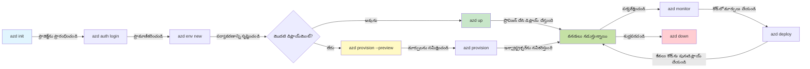
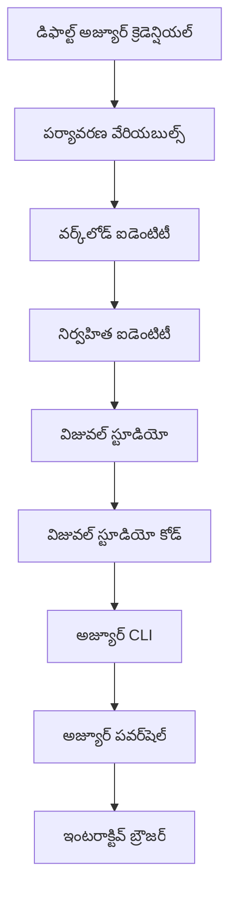

# AZD ప్రాథమికాలు - Azure Developer CLI (azd) అవగాహన

# AZD ప్రాథమికాలు - ప్రధాన భావనల మరియు యూనివర్సల్ అంశాలు

**చాప్టర్ నావిగేషన్:**
- **📚 కోర్సు హోమ్**: [AZD For Beginners](../../README.md)
- **📖 ప్రస్తుత చాప్టర్**: చాప్టర్ 1 - ఫౌండేషన్ & క్విక్ స్టార్ట్
- **⬅️ ముందుగా**: [Course Overview](../../README.md#-chapter-1-foundation--quick-start)
- **➡️ తర్వాత**: [Installation & Setup](installation.md)
- **🚀 తదుపరి చాప్టర్**: [Chapter 2: AI-First Development](../chapter-02-ai-development/microsoft-foundry-integration.md)

## పరిచయం

ఈ పాఠం మీను Azure Developer CLI (azd) కి పరిచయం చేస్తుంది — ఇది లోకల్ డెవలప్‌మెంట్ నుండి Azure డిప్లాయ్‌మెంట్ వరకు మీ ప్రయాణాన్ని వేగవంతం చేసే శక్తివంతమైన కమాండ్-లైన్ టూల్. మీరు మూలభూత భావనలను, ప్రధాన లక్షణాలను నేర్చుకుంటారు మరియు azd ఎలా క్లౌడ్-నేటివ్ అప్లికేషన్ డిప్లాయ్‌మెంట్‌ని సులభతరం చేస్తుందో అర్థం చేసుకుంటారు.

## నేర్చుకునే లక్ష్యాలు

ఈ పాఠం ముగిసిన తర్వాత, మీరు:
- Azure Developer CLI ఏమిటి మరియు దాని ప్రాథమిక లక్ష్యం ఏమిటో అర్థం చేసుకుంటారు
- టెంప్లేట్లు, ఎన్విరాన్మెంట్లు, మరియు సేవల ముఖ్య భావనలను నేర్చుకుంటారు
- టెంప్లేట్-ఆధారిత డెవలప్‌మెంట్ మరియు Infrastructure as Code సహిత కీలక లక్షణాలను పరిశీలిస్తారు
- azd ప్రాజెక్ట్ నిర్మాణం మరియు వర్క్‌ఫ్లోను అర్థం చేసుకుంటారు
- మీ డెవలప్‌మెంట్ ఎన్విరాన్మెంటుకి azd ని ఇన్‌స్టాల్ చేసి కాన్ఫిగర్ చేయడానికి సిద్ధంగా ఉంటారు

## నేర్చుకున్న ఫలితాలు

ఈ పాఠం పూర్తి చేసిన తర్వాత, మీరు చేయగలుగుతారు:
- ఆధునిక క్లౌడ్ డెవలప్‌మెంట్ వర్క్‌ఫ్లోలలో azd పాత్రను వివరించడం
- azd ప్రాజెక్ట్ నిర్మాణంలోని భాగాలను గుర్తించడం
- టెంప్లేట్లు, ఎన్విరాన్మెంట్లు, మరియు సేవలు ఎలా కలిసి పనిచేస్తాయో వర్ణించడం
- azd తో Infrastructure as Code లాభాలను అర్థం చేసుకోవడం
- వివిధ azd కమాండ్లను మరియు వాటి ఉద్దేశాలను గుర్తించడం

## Azure Developer CLI (azd) అంటే ఏమిటి?

Azure Developer CLI (azd) ఒక కమాండ్-లైన్ టూల్, ఇది లోకల్ డెవలప్‌మెంట్ నుండి Azure డిప్లాయ్‌మెంట్ వరకు మీ ప్రయాణాన్ని వేగవంతం చేయడానికి రూపొందించబడింది. ఇది Azureలో క్లౌడ్-నేటివ్ అప్లికేషన్లను బిల్డ్ చేయడం, డిప్లాయ్ చేయడం మరియు నిర్వహించడం ప్రక్రియను సరళతరం చేస్తుంది.

### azd తో మీరు ఏమి డిప్లాయ్ చేయగలరు?

azd విస్తృత శ్రేణి వర్క్‌లోడ్స్‌కు మద్దతు ఇస్తుంది — మరియు ఈ జాబితా కొనసాగుతుంది. ఈ రోజు, మీరు azd ఉపయోగించి డిప్లాయ్ చేయవచ్చు:

| Workload Type | Examples | Same Workflow? |
|---------------|----------|----------------|
| **సాంప్రదాయ అప్లికేషన్లు** | వెబ్ యాప్స్, REST APIs, స్థిర సైట్లు | ✅ `azd up` |
| **సేవలు మరియు మైక్రోసేవలు** | Container Apps, Function Apps, బహుళ సేవల బాక్‌ఎండ్లు | ✅ `azd up` |
| **AI ఆధారిత అప్లికేషన్లు** | Microsoft Foundry Models తో చాట్ యాప్స్, AI Search తో RAG పరిష్కారాలు | ✅ `azd up` |
| **స్మార్ట్ ఏజెంట్లు** | Foundry-లో హోస్ట్ చేయబడిన ఏజెంట్లు, బహుళ-ఏజెంట్ సమన్వయాలు | ✅ `azd up` |

ప్రధాన అవగాహన ఏమిటంటే **మీరు ఏదైనా డిప్లాయ్ చేసినా azd లైఫ్‌సైకిల్ ఒకేలా ఉంటుంది**. మీరు ప్రాజెక్ట్‌ను ప్రారంభిస్తారు, ఇన్ఫ్రాస్ట్రక్చర్‌ను ప్రావిజన్ చేస్తారు, మీ కోడ్‌ను డిప్లాయ్ చేస్తారు, మీ యాప్‌ను మానిటర్ చేస్తారు, మరియు క్లీన్ అప్ చేస్తారు — ఇది ఒక సామాన్య వెబ్‌సైట్ అయినా లేక సంకీర్నమైన AI ఏజెంట్ అయినా ఒకే ప్రక్రియ.

ఈ అనుక్రమణ డిజైన్ ప్రకారం ఉంది. azd AI సామర్థ్యాలను మీ అప్లికేషన్ ఉపయోగించగల మరో సేవగా చూస్తుంది, ఇది మూలదారం నుంచి వేరుగా ఏదీ కాదని. Microsoft Foundry Models తో బ్యాక్ చేయబడిన చాట్ ఎండ్పాయింట్ azd పరిప్రేక్ష్యంలో, కాన్ఫిగర్ చేసి డిప్లాయ్ చేయాల్సిన మరో సేవే.

### 🎯 ఎందుకు AZD ఉపయోగించాలి? ఒక వాస్తవ ప్రపంచ పోలిక

సింపుల్ వెబ్ యాప్‌ను డేటాబేస్‌తో కలిసి డిప్లాయ్ చేయడాన్ని పోల్చి చూద్దాం:

#### ❌ AZD లేకుండా: మాన్యువల్ Azure డిప్లాయ్‌మెంట్ (30+ నిమిషాలు)

```bash
# దశ 1: రిసోర్స్ గ్రూప్ సృష్టించండి
az group create --name myapp-rg --location eastus

# దశ 2: యాప్ సర్వీస్ ప్లాన్ సృష్టించండి
az appservice plan create --name myapp-plan \
  --resource-group myapp-rg \
  --sku B1 --is-linux

# దశ 3: వెబ్ యాప్ సృష్టించండి
az webapp create --name myapp-web-unique123 \
  --resource-group myapp-rg \
  --plan myapp-plan \
  --runtime "NODE:18-lts"

# దశ 4: కోస్మోస్ DB ఖాతాను సృష్టించండి (10-15 నిమిషాలు)
az cosmosdb create --name myapp-cosmos-unique123 \
  --resource-group myapp-rg \
  --kind MongoDB

# దశ 5: డేటాబేస్ సృష్టించండి
az cosmosdb mongodb database create \
  --account-name myapp-cosmos-unique123 \
  --resource-group myapp-rg \
  --name tododb

# దశ 6: కలెక్షన్ సృష్టించండి
az cosmosdb mongodb collection create \
  --account-name myapp-cosmos-unique123 \
  --resource-group myapp-rg \
  --database-name tododb \
  --name todos

# దశ 7: కనెక్షన్ స్ట్రింగ్ పొందండి
CONN_STR=$(az cosmosdb keys list \
  --name myapp-cosmos-unique123 \
  --resource-group myapp-rg \
  --type connection-strings \
  --query "connectionStrings[0].connectionString" -o tsv)

# దశ 8: యాప్ సెట్టింగ్స్ కాన్ఫిగర్ చేయండి
az webapp config appsettings set \
  --name myapp-web-unique123 \
  --resource-group myapp-rg \
  --settings MONGODB_URI="$CONN_STR"

# దశ 9: లాగింగ్ సక్రియం చేయండి
az webapp log config --name myapp-web-unique123 \
  --resource-group myapp-rg \
  --application-logging filesystem \
  --detailed-error-messages true

# దశ 10: అప్లికేషన్ ఇన్‌సైట్స్ ఏర్పాటు చేయండి
az monitor app-insights component create \
  --app myapp-insights \
  --location eastus \
  --resource-group myapp-rg

# దశ 11: App Insightsని వెబ్ యాప్‌కు లింక్ చేయండి
INSTRUMENTATION_KEY=$(az monitor app-insights component show \
  --app myapp-insights \
  --resource-group myapp-rg \
  --query "instrumentationKey" -o tsv)

az webapp config appsettings set \
  --name myapp-web-unique123 \
  --resource-group myapp-rg \
  --settings APPINSIGHTS_INSTRUMENTATIONKEY="$INSTRUMENTATION_KEY"

# దశ 12: స్థానికంగా అప్లికేషన్‌ను బిల్డ్ చేయండి
npm install
npm run build

# దశ 13: డిప్లాయ్‌మెంట్ ప్యాకేజ్ సృష్టించండి
zip -r app.zip . -x "*.git*" "node_modules/*"

# దశ 14: అప్లికేషన్‌ను డిప్లాయ్ చేయండి
az webapp deployment source config-zip \
  --resource-group myapp-rg \
  --name myapp-web-unique123 \
  --src app.zip

# దశ 15: వేచి ఉండండి మరియు అది పనిచేస్తుందని ప్రార్థించండి 🙏
# (స్వయంచాలిత ధృవీకరణ లేదు, మాన్యువల్ పరీక్ష అవసరం)
```

**సమస్యలు:**
- ❌ 15+ కమాండ్లు గుర్తుంచుకుని క్రమంగా అమలు చేయాల్సి ఉంటుంది
- ❌ 30-45 నిమిషాల మాన్యువల్ పని
- ❌ తప్పులకి సులభంగా అవకాశం (టైపోస్, తప్పు పారామీటర్లు)
- ❌ టర్మినల్ హిస్టరీలో కనెక్షన్ స్ట్రింగ్స్ బయటపడతాయి
- ❌ ఏదైనా తప్పినపుడు ఆటోమెటెడ్ రోల్బ్యాక్ ఉండదు
- ❌ టీమ్ సభ్యులకు పునరుత్పత్తి చేయడం కష్టం
- ❌ ప్రతి సారి వేరు ఉంటుంది (పునరుత్పత్తికి అనుకూలంగా లేదు)

#### ✅ AZD తో: ఆటోమెటెడ్ డిప్లాయ్‌మెంట్ (5 కమాండ్లు, 10-15 నిమిషాలు)

```bash
# దశ 1: టెంప్లేట్ నుండి ప్రారంభించండి
azd init --template todo-nodejs-mongo

# దశ 2: ప్రామాణీకరించండి
azd auth login

# దశ 3: పరిసరాన్ని సృష్టించండి
azd env new dev

# దశ 4: మార్పులను ముందుగా చూడండి (ఐచ్ఛికం అయినప్పటికీ సిఫార్సు చేయబడుతుంది)
azd provision --preview

# దశ 5: అన్నింటినీ అమలులో పెట్టండి
azd up

# ✨ పూర్తయింది! అన్నీ అమలులో పెట్టబడ్డాయి, కాన్ఫిగర్ చేయబడ్డాయి, మరియు పర్యవేక్షించబడుతున్నాయి
```

**ప్రయోజనాలు:**
- ✅ **5 కమాండ్లు** vs. 15+ మాన్యువల్ స్టెప్స్
- ✅ **10-15 నిమిషాలు** మొత్తం సమయం (ముఖ్యంగా Azure కోసం వేచిచూడటం)
- ✅ **జీరో ఎర్రర్స్** - ఆటోమేటెడ్ మరియు పరీక్షించబడినవి
- ✅ **సీక్రెట్లను సురక్షితంగా నిర్వహించటం** Key Vault ద్వారా
- ✅ **ఫెయిల్యూర్‌ల పైన ఆటోమేటిక్ రోల్బ్యాక్**
- ✅ **పూర్తిగా పునరుత్పత్తి చేయగలిగే** ఫలితం - ప్రతి సారి ఒకే ఫలితం
- ✅ **టీమ్-రెడీ** - ఎవ్వరైనా ఒకే కమాండ్లతో డిప్లాయ్ చేయవచ్చు
- ✅ **Infrastructure as Code** - వర్షన్ నియంత్రణలో Bicep టెంప్లేట్లు
- ✅ **ఇన్‌బిల్ట్ మానిటరింగ్** - Application Insights స్వయంచాలకంగా కాన్ఫిగర్ చేయబడుతుంది

### 📊 సమయం & లోపాల తగ్గింపు

| Metric | Manual Deployment | AZD Deployment | Improvement |
|:-------|:------------------|:---------------|:------------|
| **కమాండ్లు** | 15+ | 5 | 67% తక్కువ |
| **సమయం** | 30-45 నిమిషాలు | 10-15 నిమిషాలు | 60% వేగంగా |
| **లోపాల రేటు** | ~40% | <5% | 88% తగ్గింపు |
| **సమానత్వం** | తక్కువ (మాన్యువల్) | 100% (ఆటోమెటెడ్) | పరిపూర్ణం |
| **టీమ్ చేరిక** | 2-4 గంటలు | 30 నిమిషాలు | 75% వేగవంతం |
| **రോള్బ్యాక్ సమయం** | 30+ నిమిషాలు (మాన్యువల్) | 2 నిమిషాలు (ఆటోమెటెడ్) | 93% వేగవంతం |

## ప్రధాన భావనలు

### టెంప్లేట్లు
టెంప్లేట్లు azd యొక్క పునాది. వాటిలో ఉంటుంది:
- **అప్లికేషన్ కోడ్** - మీ సోర్స్ కోడ్ మరియు డిపెండెన్సీలు
- **ఇన్ఫ్రాస్ట్రక్చర్ నిర్వచనలు** - Bicep లేదా Terraform లో నిర్వచించిన Azure వనరులు
- **కాన్ఫిగరేషన్ ఫైళ్లు** - సెట్టింగ్లు మరియు ఎన్విరాన్మెంట్ వేరియబుల్స్
- **డిప్లాయ్‌మెంట్ స్క్రిప్ట్స్** - ఆటోమెటెడ్ డిప్లాయ్‌మెంట్ వర్క్‌ఫ్లోస్

### ఎన్విరాన్మెంట్లు
ఎన్విరాన్మెంట్లు విభిన్న డిప్లాయ్‌మెంట్ లక్ష్యాలను ప్రకటిస్తాయి:
- **డెవలప్‌మెంట్** - టెస్టింగ్ మరియు డెవలప్‌మెంట్ కోసం
- **స్టేజింగ్** - ప్రీ-ప్రొడక్షన్ ఎన్విరాన్‌మెంట్
- **ప్రొడక్షన్** - లైవ్ ప్రొడక్షన్ ఎన్విరాన్‌మెంట్

ప్రతి ఎన్విరాన్‌మెంట్ తమ స్వంతను నిర్వహిస్తుంది:
- Azure resource group
- కాన్ఫిగరేషన్ సెట్టింగ్స్
- డిప్లాయ్‌మెంట్ స్టేట్

### సేవలు
సేవలు మీ అప్లికేషన్ నిర్మాణ బ్లాక్స్:
- **ఫ్రంట్‌ఎండ్** - వెబ్ అప్లికేషన్లు, SPAలు
- **బ్యాక్‌ఎండ్** - APIs, మైక్రోసర్వీస్లు
- **డేటాబేస్** - డేటా నిల్వ పరిష్కారాలు
- **స్టోరేజ్** - ఫైల్ మరియు బ్లాబ్ స్టోరేజ్

## ముఖ్య లక్షణాలు

### 1. టెంప్లేట్-డ్రైవెన్ డెవలప్‌మెంట్
```bash
# అందుబాటులో ఉన్న టెంప్లేట్లను బ్రౌజ్ చేయండి
azd template list

# టెంప్లేట్ నుంచి ప్రారంభించండి
azd init --template <template-name>
```

### 2. Infrastructure as Code
- **Bicep** - Azure యొక్క డొమెయిన్-స్పెసిఫిక్ భాష
- **Terraform** - మల్టీ-క్లౌడ్ ఇన్ఫ్రాస్ట్రక్చర్ టూల్
- **ARM Templates** - Azure Resource Manager టెంప్లేట్లు

### 3.統గ్రేటెడ్ వర్క్‌ఫ్లోస్
```bash
# పూర్తి డిప్లాయ్‌మెంట్ వర్క్‌ఫ్లో
azd up            # Provision + Deploy ఇది మొదటి సారిగా సెటప్ కోసం హస్తరహితంగా ఉంటుంది

# 🧪 కొత్త: డిప్లాయ్‌మెంట్‌కు ముందు ఇన్‌ఫ్రాస్ట్రక్చర్ మార్పులను ముందుగా చూడండి (సురక్షితం)
azd provision --preview    # మార్చులు చేయకుండా ఇన్‌ఫ్రాస్ట్రక్చర్ డిప్లాయ్‌మెంట్‌ను అనుకరించండి

azd provision     # ఇన్‌ఫ్రాస్ట్రక్చర్‌ను నవీకరిస్తే Azure వనరులను సృష్టించడానికి దీనిని ఉపయోగించండి
azd deploy        # అప్లికేషన్ కోడ్‌ను డిప్లాయ్ చేయండి లేదా నవీకరణ తర్వాత అప్లికేషన్ కోడ్‌ను మళ్లీ డిప్లాయ్ చేయండి
azd down          # వనరులను తొలగించండి
```

#### 🛡️ ప్రివ్యూ ద్వారా సురక్షితం ఇన్ఫ్రాస్ట్రక్చర్ ప్లానింగ్
`azd provision --preview` కమాండ్ సేఫ్ డిప్లాయ్‌మెంట్స్ కోసం గేమ్-చేంజర్:
- **డ్రై-రన్ విశ్లేషణ** - ఏమి సృష్టించబడుతుంది, మార్పు అవుతుంది లేదా తొలగించబడుతుంది చూపిస్తుంది
- **జీరో రిస్క్** - మీ Azure ఎన్విరాన్మెంట్లో ఏమైనా వాస్తవ మార్పులు చేయబడవు
- **టీమ్ సహకారం** - డిప్లాయ్‌మెంట్ ముందు ప్రివ్యూ ఫలితాలు పంచుకోవచ్చు
- **ఖర్చుల అంచనా** - కట్టుబాటుకు ముందు వనరుల ఖర్చులను అర్థం చేసుకోవచ్చు

```bash
# ఉదాహరణ పూర్వదర్శన పని ప్రవాహం
azd provision --preview           # ఏం మారబోతుందో చూడండి
# ఫలితాన్ని సమీక్షించండి, జట్టుతో చర్చించండి
azd provision                     # నమ్మకంగా మార్పులను అమలు చేయండి
```

### 📊 విజువల్: AZD డెవలప్‌మెంట్ వర్క్‌ఫ్లో


**వర్క్‌ఫ్లో వివరణ:**
1. **Init** - టెంప్లేట్ లేదా కొత్త ప్రాజెక్ట్‌తో ప్రారంభించండి
2. **Auth** - Azure తో ప్రామాణీకరించండి
3. **Environment** - ప్రత్యేక డిప్లాయ్‌మెంట్ ఎన్విరాన్మెంట్ సృష్టించండి
4. **Preview** - 🆕 ముందుగా ఇన్ఫ్రాస్ట్రక్చర్ మార్పులను ఎప్పుడూ ప్రివ్యూ చేయండి (సురక్షిత అభ్యాసం)
5. **Provision** - Azure వనరులను సృష్టించండి/అప్డేట్ చేయండి
6. **Deploy** - మీ అప్లికేషన్ కోడ్ పుష్ చేయండి
7. **Monitor** - అప్లికేషన్ పనితీరు గమనించండి
8. **Iterate** - మార్పులు చేసి కోడ్‌ను మళ్ళీ డిప్లాయ్ చేయండి
9. **Cleanup** - అవసరం లేకపోవడంతో వనరులను తొలగించండి

### 4. ఎన్విరాన్మెంట్ నిర్వహణ
```bash
# పరిసరాలను సృష్టించడం మరియు నిర్వహించడం
azd env new <environment-name>
azd env select <environment-name>
azd env list
```

### 5. ఎక్స్‌టెన్షన్లు మరియు AI కమాండ్లు

azd కోర్ CLI కి మించి సామర్ధ్యాలను జోడించడానికి ఎక్స్‌టెన్షన్ సిస్టమ్‌ను ఉపయోగిస్తుంది. ఇది ప్రత్యేకంగా AI వర్క్‌లోడ్స్ కోసం ఉపయోగకరం:

```bash
# అందుబాటులో ఉన్న ఎక్స్‌టెన్షన్లను జాబితా చేయండి
azd extension list

# Foundry agents ఎక్స్‌టెన్షన్‌ను ఇన్‌స్టాల్ చేయండి
azd extension install azure.ai.agents

# ఒక మానిఫెస్ట్ నుండి AI ఏజెంట్ ప్రాజెక్ట్‌ను ప్రారంభించండి
azd ai agent init -m agent-manifest.yaml

# AI-సహాయంతో అభివృద్ధి కోసం MCP సర్వర్‌ను ప్రారంభించండి (ఆల్ఫా)
azd mcp start
```

> ఎక్స్‌టెన్షన్లు [Chapter 2: AI-First Development](../chapter-02-ai-development/agents.md) మరియు [AZD AI CLI Commands](../chapter-08-production/production-ai-practices.md#azd-ai-cli-commands-and-extensions) సూచనలో వివరంగా కవర్ చేయబడ్డాయి.

## 📁 ప్రాజెక్ట్ నిర్మాణం

ఒక సాధారణ azd ప్రాజెక్ట్ నిర్మాణం:
```
my-app/
├── .azd/                    # azd configuration
│   └── config.json
├── .azure/                  # Azure deployment artifacts
├── .devcontainer/          # Development container config
├── .github/workflows/      # GitHub Actions
├── .vscode/               # VS Code settings
├── infra/                 # Infrastructure code
│   ├── main.bicep        # Main infrastructure template
│   ├── main.parameters.json
│   └── modules/          # Reusable modules
├── src/                  # Application source code
│   ├── api/             # Backend services
│   └── web/             # Frontend application
├── azure.yaml           # azd project configuration
└── README.md
```

## 🔧 కాన్ఫిగరేషన్ ఫైళ్లు

### azure.yaml
ప్రాజెక్ట్ యొక్క ప్రధాన కాన్ఫిగరేషన్ ఫైల్:
```yaml
name: my-awesome-app
metadata:
  template: my-template@1.0.0

services:
  web:
    project: ./src/web
    language: js
    host: appservice
  api:
    project: ./src/api
    language: js
    host: appservice

hooks:
  preprovision:
    shell: pwsh
    run: echo "Preparing to provision..."
```

### .azure/config.json
ఎన్విరాన్మెంట్-నిర్దిష్ట కాన్ఫిగరేషన్:
```json
{
  "version": 1,
  "defaultEnvironment": "dev",
  "environments": {
    "dev": {
      "subscriptionId": "your-subscription-id",
      "location": "eastus"
    }
  }
}
```

## 🎪 సాధారణ వర్క్‌ఫ్లోస్ మరియు హ్యాండ్స్-ఆన్ ఎక్సర్సైజ్స్

> **💡 అధ్యయన సూచన:** మీ AZD నైపుణ్యాలను క్రమంగా నిర్మించడానికి ఈ వ్యాయామాలను వరుసగా అనుసరించండి.

### 🎯 వ్యాయామం 1: మీ మొదటి ప్రాజెక్ట్‌ను ప్రారంభించండి

**లక్ష్యం:** ఒక AZD ప్రాజెక్ట్ సృష్టించి దాని నిర్మాణాన్ని అన్వేషించండి

**దశలు:**
```bash
# నిరూపిత టెంప్లేట్‌ను ఉపయోగించండి
azd init --template todo-nodejs-mongo

# సృష్టించిన ఫైళ్లను అన్వేషించండి
ls -la  # దాచిన వాటి సహా అన్ని ఫైళ్లను వీక్షించండి

# సృష్టించబడ్డ కీలక ఫైళ్లు:
# - azure.yaml (ప్రధాన కాన్ఫిగరేషన్)
# - infra/ (ఇన్ఫ్రాస్ట్రక్చర్ కోడ్)
# - src/ (అప్లికేషన్ కోడ్)
```

**✅ విజయము:** మీ వద్ద azure.yaml, infra/, మరియు src/ డైరెక్టరీస్ ఉన్నాయి

---

### 🎯 వ్యాయామం 2: Azure కు డిప్లాయ్ చేయండి

**లక్ష్యం:** ఎండ్-టు-ఎండ్ డిప్లాయ్‌మెంట్‌ను పూర్తి చేయండి

**దశలు:**
```bash
# 1. ప్రామాణీకరించండి
az login && azd auth login

# 2. పర్యావరణాన్ని సృష్టించండి
azd env new dev
azd env set AZURE_LOCATION eastus

# 3. మార్పులను ముందుగా చూడండి (సిఫార్సు చేయబడింది)
azd provision --preview

# 4. అన్నింటినీ డిప్లాయ్ చేయండి
azd up

# 5. డిప్లాయ్‌మెంట్‌ను నిర్ధారించండి
azd show    # మీ యాప్ URLను చూడండి
```

**అంచనా సమయం:** 10-15 నిమిషాలు  
**✅ విజయము:** అప్లికేషన్ URL బ్రౌజర్లో తెరుచుకుంటుంది

---

### 🎯 వ్యాయామం 3: బహుళ ఎన్విరాన్మెంట్లు

**లక్ష్యం:** dev మరియు staging కు డిప్లాయ్ చేయండి

**దశలు:**
```bash
# ఇప్పటికే dev ఉంది, staging సృష్టించండి
azd env new staging
azd env set AZURE_LOCATION westus2
azd up

# వాటి మధ్య మారండి
azd env list
azd env select dev
```

**✅ విజయము:** Azure పోర్టల్‌లో వేర్వేరు రెండు రిసోర్స్ గ్రూపులు రూపొందించబడ్డాయి

---

### 🛡️ క్లీన Slate: `azd down --force --purge`

పూర్తిగా రీసెట్ చేయాల్సిన అవసరం ఉన్నప్పుడు:

```bash
azd down --force --purge
```

**ఇది ఏమి చేస్తుంది:**
- `--force`: నిర్ధారణ ప్రాంప్ట్‌లు ఉండవు
- `--purge`: స్థానిక స్టేట్ మరియు Azure వనరులను అన్ని తొలగిస్తుంది

**ఈ సందర్భాలలో ఉపయోగించండి:**
- డిప్లాయ్‌మెంట్ మధ్యలో విఫలమయితే
- ప్రాజెక్ట్స్ మారుస్తున్నప్పుడు
- కొత్త ప్రారంభం కావలసినప్పుడు

---

## 🎪 అసలు వర్క్‌ఫ్లో సూచన

### కొత్త ప్రాజెక్ట్ ప్రారంభించడం
```bash
# విధానం 1: ఉన్న మూసను ఉపయోగించండి
azd init --template todo-nodejs-mongo

# విధానం 2: శూన్యం నుంచి ప్రారంభించండి
azd init

# విధానం 3: ప్రస్తుత డైరెక్టరీను ఉపయోగించండి
azd init .
```

### డెవలప్‌మెంట్ సైకిల్
```bash
# అభివృద్ధి వాతావరణాన్ని సెటప్ చేయండి
azd auth login
azd env new dev
azd env select dev

# అన్నింటినీ అమర్చండి
azd up

# మార్పులు చేసి మళ్లీ అమర్చండి
azd deploy

# పనులు పూర్తయిన తర్వాత శుభ్రపరచండి
azd down --force --purge # Azure Developer CLIలోని ఈ కమాండ్ మీ వాతావరణానికి ఒక సంపూర్ణ రీసెట్ — ప్రత్యేకంగా విఫలమైన డిప్లాయ్‌మెంట్‌లను పరిష్కరిస్తున్నప్పుడు, విడిచిపెట్టబడిన వనరులను శుభ్రపరచేటప్పుడు లేదా కొత్తగా మళ్లీ డిప్లాయ్ చేయడానికి సిద్ధం చేస్తున్నప్పుడు చాలా ఉపయోగపడుతుంది
```

## `azd down --force --purge` ను అర్థం చేసుకోవడం
`azd down --force --purge` కమాండ్ మీ azd ఎన్విరాన్మెంట్ మరియు అన్ని సంబంధిత వనరులను పూర్తిగా తొలగించడానికి శక్తివంతమైన మార్గం. ప్రతి ఫ్లాగ్ ఏమి చేస్తుందో వివరణ ఇక్కడ ఉంది:
```
--force
```
- నిర్ధారణ ప్రాంప్ట్‌లను విడిచిపెడుతుంది.
- ఆటోమేషన్ లేదా స్క్రిప్టింగ్ కోసం ఉపయోగకరం, ఇక్కడ మానవ ఇన్‌పుట్ సాధ్యంకాలేదు.
- CLI అసమంజసతలను గుర్తించినా కూడా టియర్‌డౌన్ అంతరాయం లేకుండా కొనసాగుతుంది.

```
--purge
```
**కలిసిన అన్ని మెటాడేటాను** తొలగిస్తుంది, అందులో:
ఎన్విరాన్‌మెంట్ స్థితి
స్థానిక `.azure` ఫోల్డర్
క్యాష్ చేయబడిన డిప్లాయ్‌మెంట్ సమాచారం
azd కు గత డిప్లాయ్‌మెంట్లను "గుర్తుంచకుండా" చెయ్యిస్తుంది, ఇది mismatched resource groups లేదా stale registry references వంటి సమస్యలకు కారణమయ్యే పరిస్థితులను నివారిస్తుంది.

### ఎందుకు రెండింటినీ ఉపయోగించాలి?
`azd up` తో లింగరింగ్ స్టేట్ లేదా భాగీ డిప్లాయ్‌మెంట్‌ల కారణంగా మీరు గోడకు ఎదురైతే, ఈ కాంబో ఒక **శుభ్రమైన ప్రారంభం**ను నిర్ధారిస్తుంది.

ఇది ప్రత్యేకంగా Azure పోర్టల్‌లో మాన్యువల్ వనరుల తొలగింపులు చేసిన తర్వాత లేదా టెంప్లేట్లు, ఎన్విరాన్మెంట్లు, లేదా రిసోర్స్ గ్రూప్ నామకరణ కన్వెన్షన్లను మార్చినప్పుడు అత్యంత సహాయకరం.

### బహుళ ఎన్విరాన్మెంట్‌ల నిర్వహణ
```bash
# స్టేజింగ్ పర్యావరణాన్ని సృష్టించండి
azd env new staging
azd env select staging
azd up

# డెవ్‌కి తిరిగి మార్చండి
azd env select dev

# పర్యావరణాలను పోల్చండి
azd env list
```

## 🔐 ఆటెంటికేషన్ మరియు క్రెడెన్షియల్స్

ఆటెంటికేషన్‌ను అర్థం చేసుకోవడం విజయవంతమైన azd డిప్లాయ్‌మెంట్స్‌కు కీలకం. Azure అనేక ఆటెంటికేషన్ పద్ధతులను ఉపయోగిస్తుంది, మరియు azd ఇతర Azure టూల్స్ ఉపయోగించే అదే క్రెడెన్షియల్ ఛైన్‌ను ఉపయోగిస్తుంది.

### Azure CLI ఆటెంటికేషన్ (`az login`)

azd ను ఉపయోగించే ముందు, మీరు Azure లో ఆథెంటికేట్ కావాలి. సాధారణంగా ఉపయోగించే విధానం Azure CLI ఉపయోగించడం:

```bash
# ఇంటరాక్టివ్ లాగిన్ (బ్రౌజర్ తెరుస్తుంది)
az login

# నిర్దిష్ట టెనెంట్‌తో లాగిన్
az login --tenant <tenant-id>

# సర్వీస్ ప్రిన్సిపల్‌తో లాగిన్
az login --service-principal -u <app-id> -p <password> --tenant <tenant-id>

# ప్రస్తుత లాగిన్ స్థితిని తనిఖీ చేయండి
az account show

# అందుబాటులో ఉన్న సబ్‌స్క్రిప్షన్లను జాబితా చేయండి
az account list --output table

# డిఫాల్ట్ సబ్‌స్క్రిప్షన్‌ని సెట్ చేయండి
az account set --subscription <subscription-id>
```

### ఆటెంటికేషన్ ఫ్లో
1. **Interactive Login**: ఆథెంటికేషన్ కోసం మీ డిఫాల్ట్ బ్రౌజర్‌లో ఓపెన్ చేస్తుంది
2. **Device Code Flow**: బ్రౌజర్ యాక్సెస్ లేని ఎన్విరాన్మెంట్ల కోసం
3. **Service Principal**: ఆటోమేషన్ మరియు CI/CD సందర్భాల కోసం
4. **Managed Identity**: Azure-హోస్ట్ చేయబడిన అప్లికేషన్ల కోసం

### DefaultAzureCredential చైన్

`DefaultAzureCredential` ఒక క్రెడెన్షియల్ రకం, ఇది ప్రత్యేక క్రమంలో బహుళ క్రెడెన్షియల్ మూలాలను ఆటోమేటిక్ గా ప్రయత్నించడం ద్వారా సులభతర ఆథెంటికేషన్ అనుభవాన్ని అందిస్తుంది:

#### క్రెడెన్షియల్ చైన్ క్రమం

#### 1. ఎన్విరాన్‌మెంట్ వేర్ియబుల్స్
```bash
# సర్వీస్ ప్రిన్సిపాల్ కోసం పర్యావరణ చరాలను సెట్ చేయండి
export AZURE_CLIENT_ID="<app-id>"
export AZURE_CLIENT_SECRET="<password>"
export AZURE_TENANT_ID="<tenant-id>"
```

#### 2. Workload Identity (Kubernetes/GitHub Actions)
ఈ క్రింద ఆటోమేటిక్‌గా ఉపయోగించబడుతుంది:
- Azure Kubernetes Service (AKS) లో Workload Identity తో
- GitHub Actions లో OIDC సంయోజనంతో
- ఇతర ఫెడరేషన్ ఐడెంటిటీ కేసుల్లో

#### 3. Managed Identity
క్రింది Azure వనరుల కోసం:
- వర్చువల్ మెషీన్లు
- App Service
- Azure Functions
- Container Instances

```bash
# మేనేజ్డ్ ఐడెంటిటీ ఉన్న Azure వనరుపై నడుస్తున్నదో లేదో తనిఖీ చేయండి
az account show --query "user.type" --output tsv
# తిరిగి ఇస్తుంది: మేనేజ్డ్ ఐడెంటిటీ ఉపయోగిస్తుంటే "servicePrincipal"
```

#### 4. డెవలపర్ టూల్స్ ఇంటిగ్రేషన్
- **Visual Studio**: సైన్-ఇన్ అయ్యే అకౌంటును స్వయంచాలకంగా ఉపయోగిస్తుంది
- **VS Code**: Azure Account ఎక్స్‌టెన్షన్ క్రెడెన్షియల్స్ ఉపయోగిస్తుంది
- **Azure CLI**: `az login` క్రెడెన్షియల్స్ ఉపయోగిస్తుంది (లోకల్ డెవలప్‌మెంట్ కి అత్యంత సాధారణ)

### AZD ఆటెంటికేషన్ సెటప్

```bash
# విధానం 1: Azure CLI ఉపయోగించండి (డెవలప్‌మెంట్ కోసం సిఫార్సు చేయబడింది)
az login
azd auth login  # ప్రస్తుతం ఉన్న Azure CLI క్రెడెన్షియల్స్‌ను ఉపయోగిస్తుంది

# విధానం 2: నేరుగా azd ప్రామాణీకరణ
azd auth login --use-device-code  # హెడ్‌లెస్ పర్యావరణాల కోసం

# విధానం 3: ప్రామాణీకరణ స్థితిని తనిఖీ చేయండి
azd auth login --check-status

# విధానం 4: లాగ్ అవుట్ చేసి మళ్లీ ప్రామాణీకరించండి
azd auth logout
azd auth login
```

### ఆటెంటికేషన్ ఉత్తమ అభ్యాసాలు

#### లోకల్ డెవలప్‌మెంట్ కోసం
```bash
# 1. Azure CLI ఉపయోగించి లాగిన్ చేయండి
az login

# 2. సరైన సబ్‌స్క్రిప్షన్‌ను నిర్ధారించండి
az account show
az account set --subscription "Your Subscription Name"

# 3. ఉన్న క్రెడెన్షియల్స్‌తో azd ఉపయోగించండి
azd auth login
```

#### CI/CD పైప్లైన్స్ కోసం
```yaml
# GitHub Actions example
- name: Azure Login
  uses: azure/login@v1
  with:
    creds: ${{ secrets.AZURE_CREDENTIALS }}

- name: Deploy with azd
  run: |
    azd auth login --client-id ${{ secrets.AZURE_CLIENT_ID }} \
                    --client-secret ${{ secrets.AZURE_CLIENT_SECRET }} \
                    --tenant-id ${{ secrets.AZURE_TENANT_ID }}
    azd up --no-prompt
```

#### ప్రొడక్షన్ ఎన్విరాన్‌మెంట్‌ల కోసం
- Azure వనరులపై నడిచేటప్పుడు **Managed Identity** ఉపయోగించండి
- ఆటోమెషన్ సందర్భాల కోసం **Service Principal** ఉపయోగించండి
- కోడ్ లేదా కాన్ఫిగరేషన్ ఫైళ్లలో క్రెడెన్షియల్స్ నిల్వ చేయవద్దు
- గోప్యమైన కాన్ఫిగరేషన్ కోసం **Azure Key Vault** ఉపయోగించండి

### సాధారణ ఆటెంటికేషన్ సమస్యలు మరియు పరిష్కారాలు

#### సమస్య: "No subscription found"
```bash
# పరిష్కారం: డిఫాల్ట్ సబ్స్క్రిప్షన్‌ను సెట్ చేయండి
az account list --output table
az account set --subscription "<subscription-id>"
azd env set AZURE_SUBSCRIPTION_ID "<subscription-id>"
```

#### సమస్య: "Insufficient permissions"
```bash
# పరిష్కారం: అవసరమైన పాత్రలను తనిఖీ చేసి కేటాయించండి
az role assignment list --assignee $(az account show --query user.name --output tsv)

# సాధారణంగా అవసరమైన పాత్రలు:
# - కాంట్రిబ్యూటర్ (వనరుల నిర్వహణ కోసం)
# - యూజర్ యాక్సెస్ అడ్మినిస్ట్రేటర్ (పాత్రల కేటాయింపుల కోసం)
```

#### సమస్య: "Token expired"
```bash
# పరిష్కారం: మళ్లీ ప్రామాణీకరించండి
az logout
az login
azd auth logout
azd auth login
```

### వివిధ సందర్భాలలో ఆటెంటికేషన్

#### లోకల్ డెవలప్‌మెంట్
```bash
# వ్యక్తిగత అభివృద్ధి ఖాతా
az login
azd auth login
```

#### టీమ్ డెవలప్‌మెంట్
```bash
# సంస్థకు నిర్దిష్ట టెనెంట్‌ని ఉపయోగించండి
az login --tenant contoso.onmicrosoft.com
azd auth login
```

#### బహు-టెనెంట్ సందర్భాలు
```bash
# టెనెంట్ల మధ్య మారండి
az login --tenant tenant1.onmicrosoft.com
# టెనెంట్ 1కి డిప్లాయ్ చేయండి
azd up

az login --tenant tenant2.onmicrosoft.com  
# టెనెంట్ 2కి డిప్లాయ్ చేయండి
azd up
```

### భద్రత పరమైన పరిగణనలు
1. **ప్రామాణీకరణ సమాచారం నిల్వ**: సోర్స్ కోడ్‌లో ఎప్పుడూ ప్రామాణీకరణ సమాచారాన్ని నిల్వ చేయవద్దు
2. **పరిధి పరిమితి**: సేవ ప్రిన్సిపల్స్‌ కోసం కనిష్ట-అధికార సూత్రాన్ని ఉపయోగించండి
3. **టోకెన్ రొటేషన్**: సేవ ప్రిన్సిపల్ రహస్యాలను నియమితంగా మార్చుచూ ఉండండి
4. **ఆడిట్ ట్రైల్**: ప్రామాణీకరణ మరియు డిప్లాయ్‌మెంట్ కార్యకలాపాలను పర్యవేక్షించండి
5. **నెట్‌వర్క్ భద్రత**: సాధ్యమైనప్పుడు ప్రైవేట్ ఎండ్‌పాయింట్లను ఉపయోగించండి

### ప్రామాణీకరణ సంబంధమైన సమస్య పరిష్కరణ

```bash
# ప్రామాణీకరణ సమస్యలను డీబగ్ చేయండి
azd auth login --check-status
az account show
az account get-access-token

# సాధారణ నిర్ధారణ కమాండ్లు
whoami                          # ప్రస్తుత వినియోగదారు సందర్భం
az ad signed-in-user show      # Azure AD వినియోగదారు వివరాలు
az group list                  # వనరుల యాక్సెస్‌ను పరీక్షించండి
```

## అర్థం చేసుకోవడం `azd down --force --purge`

### కనుగొనడం
```bash
azd template list              # మూసలను బ్రౌజ్ చేయండి
azd template show <template>   # మూస వివరాలు
azd init --help               # ప్రారంభీకరణ ఎంపికలు
```

### ప్రాజెక్ట్ నిర్వహణ
```bash
azd show                     # ప్రాజెక్ట్ అవలోకనం
azd env show                 # ప్రస్తుత పర్యావరణం
azd config list             # కాన్ఫిగరేషన్ అమరికలు
```

### పర్యవేక్షణ
```bash
azd monitor                  # Azure పోర్టల్ మానిటరింగ్‌ను తెరవండి
azd monitor --logs           # అప్లికేషన్ లాగ్‌లు చూడండి
azd monitor --live           # లైవ్ మెట్రిక్స్ చూడండి
azd pipeline config          # CI/CD ఏర్పాటు చేయండి
```

## ఉత్తమ పద్ధతులు

### 1. అర్థవంతమైన పేర్లను ఉపయోగించండి
```bash
# మంచిది
azd env new production-east
azd init --template web-app-secure

# నివారించండి
azd env new env1
azd init --template template1
```

### 2. టెంప్లేట్లను వినియోగించుకోండి
- ఉన్న టెంప్లేట్లతో ప్రారంభించండి
- మీ అవసరాలకు అనుగుణంగా అనుకూలీకరించండి
- మీ సంస్థ కోసం మళ్లీ ఉపయోగించుకోగల టెంప్లేట్లను సృష్టించండి

### 3. ఎన్విరాన్మెంట్ వేరుచేయడం
- డెవ్/స్టేజింగ్/ప్రొడక్షన్ కోసం వేరే ఎన్విరాన్మెంట్లు ఉపయోగించండి
- లోకల్ మెషీనుండి నేరుగా ప్రొడక్షన్‌లో ఎప్పుడూ డిప్లాయ్ చేయవద్దు
- ప్రొడక్షన్ డిప్లాయ్‌మెంట్‌ల కోసం CI/CD పైప్లైన్లు ఉపయోగించండి

### 4. కాన్ఫిగరేషన్ నిర్వహణ
- సున్నితమైన డేటా కోసం ఎన్విరాన్మెంట్ వేరియబుల్స్ ఉపయోగించండి
- కాన్ఫిగరేషన్‌ను వెర్షన్ కంట్రోల్‌లో ఉంచండి
- వాతావరణ-ప్రత్యేక సెట్టింగులను డాక్యుమెంట్ చేయండి

## నేర్చుకునే పురోగతి

### ప్రారంభకుడు (వారం 1-2)
1. azd ఇన్స్టాల్ చేయండి మరియు ప్రామాణీకరించండి
2. సాధారణ టెంప్లేట్‌ను డిప్లాయ్ చేయండి
3. ప్రాజెక్ట్ నిర్మాణాన్ని అర్థం చేసుకోండి
4. బేసిక్ కమాండ్లను నేర్చుకోండి (up, down, deploy)

### మద్యస్థం (వారం 3-4)
1. టెంప్లేట్లను అనుకూలీకరించండి
2. ఒకाधिक ఎన్విరాన్మెంట్లను నిర్వహించండి
3. ఇన్‌ఫ్రాస్ట్రక్చర్ కోడ్‌ను అర్థం చేసుకోండి
4. CI/CD పైప్లైన్లను సెటప్ చేయండి

### అధునాతన (వారం 5+)
1. కస్టమ్ టెంప్లేట్లను సృష్టించండి
2. అధునాతన ఇన్‌ఫ్రాస్ట్రక్చర్ నమూనాలు
3. బహు-రీజియన్ డిప్లాయ్‌మెంట్లు
4. ఎంటర్ప్రైజ్-గ్రేడ్ కాన్ఫిగరేషన్లు

## తదుపరి దశలు

**📖 చాప్టర్ 1 నేర్చుకోవడం కొనసాగించండి:**
- [ఇన్‌స్టాలేషన్ & సెటప్](installation.md) - azd ను ఇన్స్టాల్ చేసి కాన్ఫిగర్ చేయండి
- [మీ మొదటి ప్రాజెక్ట్](first-project.md) - ప్రాక్టికల్ ట్యుటోరియల్ పూర్తి చేయండి
- [కాన్ఫిగరేషన్ గైడ్](configuration.md) - అధునాతన కాన్ఫిగరేషన్ ఎంపికలు

**🎯 మీకు తదుపరి అధ్యాయం కోసం సిద్ధమా?**
- [అధ్యాయం 2: AI-ఫస్ట్ డెవలప్‌మెంట్](../chapter-02-ai-development/microsoft-foundry-integration.md) - AI అప్లికేషన్లను తయారు చేయడం ప్రారంభించండి

## అదనపు వనరులు

- [Azure Developer CLI Overview](https://learn.microsoft.com/en-us/azure/developer/azure-developer-cli/)
- [Template Gallery](https://azure.github.io/awesome-azd/)
- [Community Samples](https://github.com/Azure-Samples)

---

## 🙋 తరచుగా అడిగే ప్రశ్నలు

### సాధారణ ప్రశ్నలు

**Q: AZD మరియు Azure CLI మధ్య తేడా ఏమిటి?**

A: Azure CLI (`az`) ప్రత్యేక Azure వనరులను నిర్వహించటానికి. AZD (`azd`) మొత్తం అప్లికేషన్‌లను నిర్వహించటానికి ఉంటుంది:

```bash
# Azure CLI - క్రిందస్థాయి వనరుల నిర్వహణ
az webapp create --name myapp --resource-group rg
az sql server create --name myserver --resource-group rg
# ...ఇంకా మరిన్ని కమాండ్లు అవసరం

# AZD - అప్లికేషన్-స్థాయి నిర్వహణ
azd up  # అన్ని వనరులతో సహా మొత్తం అప్లికేషన్‌ను అమర్చుతుంది
```

**ఇలా ఆలోచించండి:**
- `az` = వ్యక్తిగత లెగో ఇటుకలపై పని చేయడం
- `azd` = పూర్తి లెగో సెట్‌లతో పని చేయడం

---

**Q: AZD ఉపయోగించడానికి Bicep లేదా Terraform తెలుసుకోవలసిన అవసరమా?**

A: కాదు! టెంప్లేట్లతో ప్రారంభించండి:
```bash
# ఉన్న టెంప్లేట్‌ను ఉపయోగించండి - IaC పరిజ్ఞానం అవసరం లేదు
azd init --template todo-nodejs-mongo
azd up
```

మీరు తర్వాత ఇన్‌ఫ్రాస్ట్రక్చర్‌ను అనుకూలీకరించడానికి Bicep నేర్చుకోవచ్చు. టెంప్లేట్లు నేర్చుకోవడానికి పనిచేసే ఉదాహరణలను అందిస్తాయి.

---

**Q: AZD టెంప్లేట్స్ నడపడానికి ఖర్చు ఎంత?**

A: ఖర్చు టెంప్లేట్‌లపై ఆధారపడి మారుతుంది. ఎక్కువ భాగం డెవలప్‌మెంట్ టెంప్లేట్లు నెలకు $50-150 ఖర్చవుతాయి:

```bash
# డిప్లాయ్ చేసేముందు ఖర్చులను ముందుగా చూడండి
azd provision --preview

# వాడకంలో లేకపోతే ఎల్లప్పుడూ శుభ్రం చేయండి
azd down --force --purge  # అన్ని వనరులను తొలగిస్తుంది
```

**ప్రొ టిప్:** లభ్యమైన చోట్ల ఉచిత టియర్స్ ఉపయోగించండి:
- App Service: F1 (ఉచితం) టియర్
- Microsoft Foundry మోడల్స్: Azure OpenAI 50,000 టోకెన్స్/నెల ఉచితం
- Cosmos DB: 1000 RU/s ఉచిత టియర్

---

**Q: ఉన్న Azure వనరులతో AZD ఉపయోగించగలనా?**

A: అవును, కానీ కొత్తగా ప్రారంభించడం సులభం. AZD పూర్తి జీవచక్రాన్ని నిర్వహిస్తుండగా బెస్ట్‌గా పని చేస్తుంది. ఉన్న వనరుల కోసం:
```bash
# ఎంపిక 1: ఉన్న వనరులను దిగుమతి చేయండి (నిపుణుల కోసం)
azd init
# తర్వాత infra/ని ఉన్న వనరులను సూచించేలా సవరించండి

# ఎంపిక 2: కొత్తగా మొదలు పెట్టండి (సిఫార్సు చేయబడింది)
azd init --template matching-your-stack
azd up  # కొత్త వాతావరణాన్ని సృష్టిస్తుంది
```

---

**Q: నేను నా ప్రాజెక్ట్‌ను టీమ్‌మెట్లతో ఎలా పంచుకోవాలి?**

A: AZD ప్రాజెక్ట్‌ను Gitకు కమిట్ చేయండి (కానీ `.azure` ఫోల్డర్‌ను చేయవద్దు):
```bash
# డిఫాల్ట్‌గా ఇప్పటికే .gitignore లో ఉంది
.azure/        # రహస్యాలు మరియు పరిసర డేటాను కలిగి ఉంటుంది
*.env          # ఎన్విరాన్‌మెంట్ వేరియబుల్స్

# తర్వాత బృంద సభ్యులు:
git clone <your-repo>
azd auth login
azd env new <their-name>-dev
azd up
```

అందరికీ అదే టెంప్లేట్ల నుంచి ఒకే నిర్మాణం లభిస్తుంది.

---

### సమస్య పరిష్కరణ ప్రశ్నలు

**Q: "azd up" మధ్యలో విఫలమైంది. నేను ఏమి చేయాలి?**

A: ఎర్రర్‌ను తనిఖీ చేసి, దాన్ని సరి చేసి, మరలా ప్రయత్నించండి:
```bash
# వివరణాత్మక లాగ్‌లు చూడండి
azd show

# సాధారణ పరిష్కారాలు:

# 1. క్వోటా అధిగమించబడినట్లయితే:
azd env set AZURE_LOCATION "westus2"  # వేరే ప్రాంతాన్ని ప్రయత్నించండి

# 2. వనరు పేరుతో సంఘర్షణ ఉంటే:
azd down --force --purge  # శూన్య స్థితిలో మళ్లీ ప్రారంభించండి
azd up  # మళ్లీ ప్రయత్నించండి

# 3. ప్రామాణీకరణ గడువు ముగిసినట్లయితే:
az login
azd auth login
azd up
```

**సర్వసాధారణ సమస్య:** తప్పు Azure సబ్స్క్రిప్షన్ ఎంపిక చేయబడింది
```bash
az account list --output table
az account set --subscription "<correct-subscription>"
```

---

**Q: రిప్రోవిజనింగ్ లేకుండా కేవలం కోడ్ మార్పులను ఎలా డిప్లాయ్ చేయాలి?**

A: `azd up` బదులుగా `azd deploy` ఉపయోగించండి:
```bash
azd up          # మొదటిసారి: ప్రొవిజన్ చేయడం + డిప్లాయ్ చేయడం (నెమ్మదిగా)

# కోడ్‌లో మార్పులు చేయండి...

azd deploy      # తదుపరి సార్లు: కేవలం డిప్లాయ్ చేయడం (వేగంగా)
```

వేగం పోలిక:
- `azd up`: 10-15 నిమిషాలు (ఇన్‌ఫ్రాస్ట్రక్చర్‌ను ప్రావిజన్ చేస్తుంది)
- `azd deploy`: 2-5 నిమిషాలు (కోడ్ మాత్రమే)

---

**Q: నేను ఇన్‌ఫ్రాస్ట్రక్చర్ టెంప్లేట్లను అనుకూలీకరించగలనా?**

A: అవును! `infra/`లోని Bicep ఫైళ్లను ఎడిట్ చేయండి:
```bash
# azd init తర్వాత
cd infra/
code main.bicep  # VS Code లో సవరించండి

# మార్పులను ముందుగా చూడండి
azd provision --preview

# మార్పులను అమలు చేయండి
azd provision
```

**సూచన:** చిన్నదిగా ప్రారంభించండి - మొదట SKUs మార్చండి:
```bicep
// infra/main.bicep
sku: {
  name: 'B1'  // Change to 'P1V2' for production
}
```

---

**Q: AZD సృష్టించిందంతా నేను ఎలా తొలగించాలి?**

A: ఒకే కమాండ్ అన్ని వనరులను తొలగిస్తుంది:
```bash
azd down --force --purge

# ఇది తొలగిస్తుంది:
# - అన్ని Azure వనరులు
# - వనరు సమూహం
# - స్థానిక పర్యావరణ స్థితి
# - క్యాష్ చేయబడిన డిప్లాయ్‌మెంట్ డేటా
```

**ఇది ఎప్పుడూ అమలు చేయండి ఈ క్రింది సందర్భాల్లో:**
- టెంప్లేట్ పరీక్ష పూర్తయినపుడు
- వేరే ప్రాజెక్ట్‌కి మారేప్పుడు
- తిరిగి పేరు పెట్టి మొదలుపెట్టాలనుకునేటప్పుడు

**ఖర్చు ఆదా:** ఉపయోగించని వనరులను తొలగించడం = $0 ఛార్జీలు

---

**Q: నేను తప్పుగా Azure పోర్టల్‌లో వనరులను తొలగించుకుంటే ఏం జరుగుతుంది?**

A: AZD స్థితి సింక్ కాకపోవచ్చు. శుభ్రమైన ప్రారంభం విధానం:
```bash
# 1. స్థానిక స్థితిని తొలగించండి
azd down --force --purge

# 2. కొత్తగా ప్రారంభించండి
azd up

# వికల్పం: AZD గుర్తించి సరిచేయనివ్వండి
azd provision  # లేమి ఉన్న వనరులను సృష్టిస్తుంది
```

---

### అధునాతన ప్రశ్నలు

**Q: AZDని CI/CD పైప్లైన్లలో ఉపయోగించగలనా?**

A: అవును! GitHub Actions ఉదాహరణ:
```yaml
# .github/workflows/deploy.yml
name: Deploy with AZD

on:
  push:
    branches: [main]

jobs:
  deploy:
    runs-on: ubuntu-latest
    steps:
      - uses: actions/checkout@v2
      
      - name: Install azd
        run: curl -fsSL https://aka.ms/install-azd.sh | bash
      
      - name: Azure Login
        run: |
          azd auth login \
            --client-id ${{ secrets.AZURE_CLIENT_ID }} \
            --client-secret ${{ secrets.AZURE_CLIENT_SECRET }} \
            --tenant-id ${{ secrets.AZURE_TENANT_ID }}
      
      - name: Deploy
        run: azd up --no-prompt
```

---

**Q: నేను రహస్యాలు మరియు సున్నితమైన డేటాను ఎలా నిర్వహించాలి?**

A: AZD ఆటోమేటికుగా Azure Key Vaultతో ఇంటిగ్రేట్ అవుతుంది:
```bash
# రహస్యాలు కోడ్‌లో కాకుండా Key Vault‌లో నిల్వ చేయబడతాయి
azd env set DATABASE_PASSWORD "$(openssl rand -base64 32)"

# AZD స్వయంచాలకంగా:
# 1. Key Vault ను సృష్టిస్తుంది
# 2. రహస్యాన్ని నిల్వ చేస్తుంది
# 3. Managed Identity ద్వారా యాప్‌కు యాక్సెస్ ఇస్తుంది
# 4. రన్‌టైమ్‌లో ఇంజెక్ట్ చేస్తుంది
```

**ఎప్పుడూ కమిట్ చేయవద్దు:**
- `.azure/` ఫోల్డర్ (ఎన్విరాన్మెంట్ డాటాను కలిగి ఉంది)
- `.env` ఫైళ్లు (లోకల్ రహస్యాలు)
- కనెక్షన్ స్ట్రింగ్స్

---

**Q: నేను బహుళ-రీజియన్లకు డిప్లాయ్ చేయగలనా?**

A: అవును, ప్రతి రీజియన్‌కు ఎన్విరాన్మెంట్‌ను సృష్టించండి:
```bash
# తూర్పు US పర్యావరణం
azd env new prod-eastus
azd env set AZURE_LOCATION eastus
azd up

# పశ్చిమ యూరోప్ పర్యావరణం
azd env new prod-westeurope
azd env set AZURE_LOCATION westeurope
azd up

# ప్రతి పర్యావరణం స్వతంత్రంగా ఉంటుంది
azd env list
```

నిజమైన బహుళ-రీజియన్స్ అప్లికేషన్ల కోసం, Bicep టెంప్లేట్లను అనుకూలీకరించి ఒకేసారి బహుళ రీజియన్లకు డిప్లాయ్ చేయండి.

---

**Q: నేను చిక్కుకుపోతే సహాయం ఎక్కడ పొందాలి?**

1. **AZD డాక్యుమెంటేషన్:** https://learn.microsoft.com/azure/developer/azure-developer-cli/
2. **GitHub Issues:** https://github.com/Azure/azure-dev/issues
3. **Discord:** [Azure Discord](https://discord.gg/microsoft-azure) - #azure-developer-cli ఛానెల్
4. **Stack Overflow:** ట్యాగ్ `azure-developer-cli`
5. **ఈ కోర్సు:** [సమస్య పరిష్కరణ గైడ్](../chapter-07-troubleshooting/common-issues.md)

**ప్రో టిప్:** అడించే ముందు, అమలు చేయండి:
```bash
azd show       # ప్రస్తుత స్థితిని చూపిస్తుంది
azd version    # మీ వెర్షన్ చూపిస్తుంది
```

ఈ సమాచారాన్ని మీ ప్రశ్నలో చేర్చండి త్వరితమైన సహాయానికి.

---

## 🎓 తదుపరి ఏమిటి?

మీకు ఇప్పుడు AZD మౌలికాలు అర్థమయ్యాయి. మీ మార్గాన్ని ఎంచుకోండి:

### 🎯 ప్రారంభకుల కోసం:
1. **తదుపరి:** [ఇన్‌స్టాలేషన్ & సెటప్](installation.md) - మీ యంత్రంలో AZD ను ఇన్స్టాల్ చేయండి
2. **తర్వాత:** [మీ మొదటి ప్రాజెక్ట్](first-project.md) - మీ మొదటి యాప్‌ను డిప్లాయ్ చేయండి
3. **ప్రాక్టీస్:** ఈ పాఠంలో ఉన్న 3 వ్యాయామాలను పూర్తిచేయండి

### 🚀 AI డెవలపర్ల కోసం:
1. **స్కిప్ చేయండి:** [అధ్యాయం 2: AI-ఫస్ట్ డెవలప్‌మెంట్](../chapter-02-ai-development/microsoft-foundry-integration.md)
2. **డిప్లాయ్ చేయండి:** `azd init --template get-started-with-ai-chat` తో ప్రారంభించండి
3. **నెర్చుకోండి:** డిప్లాయ్ చేసేటప్పుడు నిర్మించండి

### 🏗️ అనుభవజ్ఞులైన డెవలపర్లకు:
1. **సమీక్షించండి:** [కాన్ఫిగరేషన్ గైడ్](configuration.md) - అధునాతన సెట్టింగులు
2. **అన్వేషించండి:** [Infrastructure as Code](../chapter-04-infrastructure/provisioning.md) - Bicep లో లోతైన అవగాహన
3. **నిర్మించండి:** మీ స్టాక్ కోసం కస్టమ్ టెంప్లేట్లను సృష్టించండి

---

**చాప్టర్ నావిగేషన్:**
- **📚 కోర్స్ హోమ్**: [AZD For Beginners](../../README.md)
- **📖 ప్రస్తుత అధ్యాయం**: Chapter 1 - Foundation & Quick Start  
- **⬅️ గతది**: [Course Overview](../../README.md#-chapter-1-foundation--quick-start)
- **➡️ తరువాత**: [ఇన్‌స్టాలేషన్ & సెటప్](installation.md)
- **🚀 తదుపరి అధ్యాయం**: [అధ్యాయం 2: AI-ఫస్ట్ డెవలప్‌మెంట్](../chapter-02-ai-development/microsoft-foundry-integration.md)

---

<!-- CO-OP TRANSLATOR DISCLAIMER START -->
**Disclaimer**:
ఈ పత్రాన్ని AI అనువాద సేవ [Co-op Translator](https://github.com/Azure/co-op-translator) ఉపయోగించి అనువదించబడింది. మేము ఖచ్చితత్వానికి ప్రయత్నించినప్పటికీ, స్వయంచాలిత (ఆటోమేటెడ్) అనువాదాలలో తప్పులు లేదా అస్పష్టతలు ఉండవచ్చు అని దయచేసి గమనించండి. మూల భాషలోని అసలైన పత్రాన్ని అధికారిక మూలంగా తీసుకోవాలి. కీలకమైన సమాచారానికి వృత్తిపరమైన మానవ అనువాదం సిఫార్సు చేయబడుతుంది. ఈ అనువాదాన్ని ఉపయోగించడం వలన ఏర్పడే ఏవైనా అపార్థాలు లేదా తప్పుగా అర్థం చేసుకోవడానికి మేము బాధ్యులు కాదని తెలియజేస్తున్నాము.
<!-- CO-OP TRANSLATOR DISCLAIMER END -->