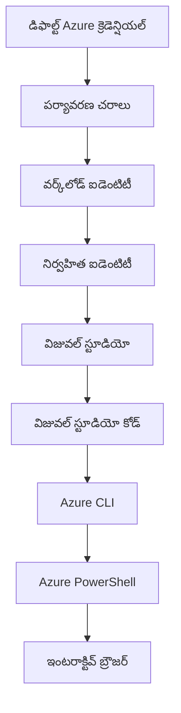

# AZD Basics - Understanding Azure Developer CLI

# AZD Basics - Core Concepts and Fundamentals

**Chapter Navigation:**
- **📚 Course Home**: [AZD For Beginners](../../README.md)
- **📖 Current Chapter**: Chapter 1 - Foundation & Quick Start
- **⬅️ Previous**: [Course Overview](../../README.md#-chapter-1-foundation--quick-start)
- **➡️ Next**: [Installation & Setup](installation.md)
- **🚀 Next Chapter**: [Chapter 2: AI-First Development](../chapter-02-ai-development/microsoft-foundry-integration.md)

## Introduction

ఈ పాఠ్యం మీకు Azure Developer CLI (azd) ను పరిచయం చేస్తుంది, ఇది లోకల్ అభివృద్ధి నుండి Azure డిప్లాయ్‌మెంట్ వరకు మీ ప్రయాణాన్ని వేగవంతం చేసే శక్తివంతమైన కమాండ్-లైన్ సాధనం. మీరు మౌలిక కాన్సెప్ట్‌లు, ప్రధాన ఫీచర్లు నేర్చుకొని azd క్లౌడ్-నేటివ్ ఆప్లికేషన్ డిప్లాయ్‌మెంట్‌ను ఎలా సాదా చేస్తుందో అర్థం చేసుకుంటారు.

## Learning Goals

ఈ పాఠ్యం పూర్తయ్యే ముందు, మీరు:
- Azure Developer CLI ఏమిటి మరియు దాని ప్రధాన ఉద్దేశ్యాన్ని అర్థం చేసుకుంటారు
- టెంప్లేట్లు, ఎన్విరాన్మెంట్లు మరియు సర్వీసుల ప్రధాన కాన్సెప్ట్‌లను నేర్చుకుంటారు
- టెంప్లేట్-డ్రైవెన్ డెవలప్మెంట్ మరియు Infrastructure as Code వంటివి సహా ముఖ్యమైన ఫీచర్లను అన్వేషిస్తారు
- azd ప్రాజెక్ట్ స్ట్రక్చర్ మరియు వర్క్‌ఫ్లో ఎలా ఉన్నదో అర్థం చేసుకుంటారు
- మీ డెవలప్‌మెంట్ ఎన్విరాన్మెంట్ కోసం azd ఇన్స్తాల్ చేసి కాన్ఫిగర్ చేయడానికి సిద్ధంగా ఉంటారు

## Learning Outcomes

ఈ పాఠ్యం ముగిశాక, మీరు చేయగలరు:
- ఆధునిక క్లౌడ్ డెవలప్‌మెంట్ వర్క్‌ఫ్లోలో azd పాత్రను వివరణ చేయండి
- azd ప్రాజెక్ట్ స్ట్రక్చర్ యొక్క భాగాలను గుర్తించండి
- టెంప్లేట్లు, ఎన్విరాన్మెంట్లు మరియు సర్వీసులు ఎలా కలిసి పని చేస్తాయో వివరించండి
- azdతో Infrastructure as Code ప్రయోజనాలను అర్థం చేసుకోండి
- వివిధ azd కమాండ్లను మరియు వాటి ఉద్దేశ్యాలను గుర్తించండి

## What is Azure Developer CLI (azd)?

Azure Developer CLI (azd) అనేది లోకల్ డెవలప్‌మెంట్ నుండి Azure డిప్లాయ్‌మెంట్ వరకు మీ ప్రయాణాన్ని వేగవంతం చేయడానికి రూపొందించిన కమాండ్-లైన్ సాధనం. ఇది Azureపై క్లౌడ్-నేటివ్ అప్లికేషన్లను బిల్డ్, డిప్లాయ్ మరియు నిర్వహించడాన్ని సులభతరం చేస్తుంది.

### What Can You Deploy with azd?

azd విస్తృతమైన వర్క్‌లోడ్లను మద్దతు చేస్తుంది — మరియు అందరి జాబితా పెరుగుతూ ఉంటుంది. ఈరోజు, మీరు azd ను ఉపయోగించి డిప్లాయ్ చేయగలరు:

| Workload Type | Examples | Same Workflow? |
|---------------|----------|----------------|
| **Traditional applications** | వెబ్ యాప్స్, REST APIs, స్థాటిక్ సైట్ల | ✅ `azd up` |
| **Services and microservices** | Container Apps, Function Apps, బహు-సర్వీస్ బ్యాకెండ్లు | ✅ `azd up` |
| **AI-powered applications** | చాట్ యాప్స్ with Microsoft Foundry Models, RAG పరిష్కారాలు with AI Search | ✅ `azd up` |
| **Intelligent agents** | Foundry-hosted agents, బహు-ఏజెంట్ ఒర్కేస్ట్రేషన్లు | ✅ `azd up` |

ముఖ్యమైన విషయం ఏమిటంటే **మీరు ఏది డిప్లాయ్ చేస్తున్నా azd లైఫ్సైకిల్ మారదు**. మీరు ప్రాజెక్ట్‌ను ప్రారంభిస్తారు, ఇన్ఫ్రాస్ట్రక్చర్‌ను ప్రొవిజన్ చేయజేసుకుంటారు, మీ కోడ్‌ను డిప్లాయ్ చేస్తారు, మీ యాప్‌ను మానిటర్ చేస్తారు, మరియు క్లీనప్ చేస్తారు — అది ఒక సరళ వెబ్‌సైట్ అయితేగాని లేక ఒక సంక్లిష్ట AI ఏజెంట్ అయితేగాని.

ఈ సామరస్యాన్ని ఉద్దేశపూర్వకంగా ఉంచారు. azd AI సామర్ధ్యాలను మీ అప్లికేషన్ ఉపయోగించే మరో రకమైన సర్వీస్‌గా చూసుకుంటుంది, మౌలికంగా వేరుగా అని కాదు. Microsoft Foundry Modelsతో బ్యాక్ చేసిన చాట్ ఎండ్‌పాయింట్ azd దృష్టిలో కేవలం ఇంకో సర్వీస్ మాత్రమే, కాన్ఫిగర్ చేసి డిప్లాయ్ చేయవలసినది.

### 🎯 Why Use AZD? A Real-World Comparison

నీవు ఒక సాధారణ వెబ్ యాప్ డేటాబేస్‌తో ఎలా డిప్లాయ్ చేయాలో పోల్చి చూద్దాం:

#### ❌ WITHOUT AZD: Manual Azure Deployment (30+ minutes)

```bash
# దశ 1: వనరు గ్రూప్ సృష్టించండి
az group create --name myapp-rg --location eastus

# దశ 2: App Service ప్లాన్ సృష్టించండి
az appservice plan create --name myapp-plan \
  --resource-group myapp-rg \
  --sku B1 --is-linux

# దశ 3: వెబ్ యాప్ సృష్టించండి
az webapp create --name myapp-web-unique123 \
  --resource-group myapp-rg \
  --plan myapp-plan \
  --runtime "NODE:18-lts"

# దశ 4: Cosmos DB ఖాతా సృష్టించండి (10-15 నిమిషాలు)
az cosmosdb create --name myapp-cosmos-unique123 \
  --resource-group myapp-rg \
  --kind MongoDB

# దశ 5: డేటాబేస్ సృష్టించండి
az cosmosdb mongodb database create \
  --account-name myapp-cosmos-unique123 \
  --resource-group myapp-rg \
  --name tododb

# దశ 6: కలెక్షన్ సృష్టించండి
az cosmosdb mongodb collection create \
  --account-name myapp-cosmos-unique123 \
  --resource-group myapp-rg \
  --database-name tododb \
  --name todos

# దశ 7: కనెక్షన్ స్ట్రింగ్ పొందండి
CONN_STR=$(az cosmosdb keys list \
  --name myapp-cosmos-unique123 \
  --resource-group myapp-rg \
  --type connection-strings \
  --query "connectionStrings[0].connectionString" -o tsv)

# దశ 8: యాప్ సెట్టింగ్స్‌ను కాన్ఫిగర్ చేయండి
az webapp config appsettings set \
  --name myapp-web-unique123 \
  --resource-group myapp-rg \
  --settings MONGODB_URI="$CONN_STR"

# దశ 9: లాగింగ్‌ను সক্ষম చేయండి
az webapp log config --name myapp-web-unique123 \
  --resource-group myapp-rg \
  --application-logging filesystem \
  --detailed-error-messages true

# దశ 10: Application Insights సెటప్ చేయండి
az monitor app-insights component create \
  --app myapp-insights \
  --location eastus \
  --resource-group myapp-rg

# దశ 11: App Insights ను వెబ్ యాప్‌కు లింక్ చేయండి
INSTRUMENTATION_KEY=$(az monitor app-insights component show \
  --app myapp-insights \
  --resource-group myapp-rg \
  --query "instrumentationKey" -o tsv)

az webapp config appsettings set \
  --name myapp-web-unique123 \
  --resource-group myapp-rg \
  --settings APPINSIGHTS_INSTRUMENTATIONKEY="$INSTRUMENTATION_KEY"

# దశ 12: అనువర్తనాన్ని స్థానికంగా బిల్డ్ చేయండి
npm install
npm run build

# దశ 13: డిప్లాయ్మెంట్ ప్యాకేజీ సృష్టించండి
zip -r app.zip . -x "*.git*" "node_modules/*"

# దశ 14: అనువర్తనాన్ని డిప్లాయ్ చేయండి
az webapp deployment source config-zip \
  --resource-group myapp-rg \
  --name myapp-web-unique123 \
  --src app.zip

# దశ 15: వేచి ఉండి ఇది పనిచేస్తుందని ప్రార్థించండి 🙏
# (స్వయంచాలక ధృవీకరణ yoxdur, మాన్యువల్ పరీక్ష అవసరం)
```

**Problems:**
- ❌ 15+ ఆదేశాలను గుర్తుంచుకుని నిర్దేశించాలి మరియు అమలు చేయాలి
- ❌ 30-45 నిమిషాల మాన్యువల్ పని
- ❌ తప్పులు చేయడం సులభం (టైపోస్, తప్పు పరామీటర్లు)
- ❌ కనెక్షన్ స్ట్రింగ్స్ టెర్మినల్ హిస్ట్రీలో వెలుగు పడతాయి
- ❌ ఏదైతే తప్పినట్లయితే ఆటోమేటెడ్ రోల్‌బ్యాక్ ఉండదు
- ❌ టీమ్ సభ్యులకు పునరుత్పాదకంగా చేయడం కష్టం
- ❌ ప్రతిసారీ వేరుగా ఉంటుంది (పునరుత్పాదకంగా లేను)

#### ✅ WITH AZD: Automated Deployment (5 commands, 10-15 minutes)

```bash
# దశ 1: టెంప్లేట్ నుండి ప్రారంభించండి
azd init --template todo-nodejs-mongo

# దశ 2: ధృవీకరించండి
azd auth login

# దశ 3: పర్యావరణాన్ని సృష్టించండి
azd env new dev

# దశ 4: మార్పులను ముందుగా చూడండి (ఐచ్ఛికం, కానీ సిఫార్సు చేయబడింది)
azd provision --preview

# దశ 5: అన్నింటినీ అమలు చేయండి
azd up

# ✨ పూర్తి! అన్నీ అమలు అయ్యాయి, కాన్ఫిగర్ చేయబడ్డాయి, మరియు పర్యవేక్షించబడుతున్నాయి
```

**Benefits:**
- ✅ **5 commands** vs. 15+ మాన్యువల్ స్టెప్పులు
- ✅ **10-15 నిమిషాలు** మొత్తం సమయం (చాలా భాగం Azure కోసం వేచి ఉండటం)
- ✅ **తప్పులు తక్కువ** - స్థిరమైన, టెంప్లేట్-డ్రైవెన్ వర్క్‌ఫ్లో
- ✅ **సురక్షిత సీక్రెట్ హ్యాండ్లింగ్** - అనేక టెంప్లేట్లు Azure-నిర్వహిత సీక్రెట్ స్టోరేజ్ ఉపయోగిస్తాయి
- ✅ **పునరావృత డిప్లాయ్‌మెంట్‌లు** - ప్రతిసారీ అదే వర్క్‌ఫ్లో
- ✅ **పూర్తిగా పునరుత్పాదకమైన ఫలితం** - ప్రతి సారి అదే ఫలితం
- ✅ **టీమ్-ప్రెడి** - ఎవరికైనా అదే కమాండ్లతో డిప్లాయ్ చేయగలరు
- ✅ **Infrastructure as Code** - వర్షన్ నియంత్రిత Bicep టెంప్లేట్లు
- ✅ **బిల్ట్-ఇన్ మానిటరింగ్** - Application Insights ఆటోమేటిగ్గా కాన్ఫిగర్ అవుతుంది

### 📊 Time & Error Reduction

| Metric | Manual Deployment | AZD Deployment | Improvement |
|:-------|:------------------|:---------------|:------------|
| **Commands** | 15+ | 5 | 67% کم |
| **Time** | 30-45 min | 10-15 min | 60% వేగవంతం |
| **Error Rate** | ~40% | <5% | 88% తగ్గుదల |
| **Consistency** | తక్కువ (manual) | 100% (automated) | పరిపూర్ణం |
| **Team Onboarding** | 2-4 hours | 30 minutes | 75% వేగవంతం |
| **Rollback Time** | 30+ min (manual) | 2 min (automated) | 93% వేగవంతం |

## Core Concepts

### Templates
టెంప్లేట్లు azd స్థంభాలు. అవి కలిగి ఉంటాయి:
- **Application code** - మీ సోర్స్ కోడ్ మరియు డిపెండెన్సీలు
- **Infrastructure definitions** - Bicep లేదా Terraformలో నిర్వచించిన Azure రిసోర్సులు
- **Configuration files** - సెట్టింగ్స్ మరియు ఎన్విరాన్మెంట్ వేరియబుల్స్
- **Deployment scripts** - ఆటోమేటెడ్ డిప్లాయ్‌మెంట్ వర్క్‌ఫ్లోలు

### Environments
ఎన్విరాన్మెంట్లు వేర్వేరు డిప్లాయ్‌మెంట్ లక్ష్యాలను సూచిస్తాయి:
- **Development** - పరీక్ష మరియు అభివృద్ధి కోసం
- **Staging** - ప్రీ-ప్రొడక్షన్ ఎన్విరాన్మెంట్
- **Production** - లైవ్ ప్రొడక్షన్ ఎన్విరాన్మెంట్

ప్రతి ఎన్విరాన్మెంట్ దాని స్వంత:
- Azure resource group
- configuration సెట్టింగ్స్
- deployment స్థితి

### Services
సర్వీసులు మీ అప్లికేషన్ నిర్మాణభాగాలు:
- **Frontend** - వెబ్ అప్లికేషన్లు, SPAs
- **Backend** - APIs, మైక్రోసర్వీసులు
- **Database** - డేటా నిల్వ పరిష్కారాలు
- **Storage** - ఫైల్ మరియు బ్లాబ్ స్టోరేజ్

## Key Features

### 1. Template-Driven Development
```bash
# అందుబాటులో ఉన్న టెంప్లేట్‌లను బ్రౌజ్ చేయండి
azd template list

# టెంప్లేట్ నుండి ప్రారంభించండి
azd init --template <template-name>
```

### 2. Infrastructure as Code
- **Bicep** - Azure యొక్క డొమైన్-స్పెసిఫిక్ భాష
- **Terraform** - బహు-క్లౌడ్ ఇన్ఫ్రాస్ట్రక్చర్ టూల్
- **ARM Templates** - Azure Resource Manager టెంప్లేట్లు

### 3. Integrated Workflows
```bash
# పూర్తి డిప్లాయ్‌మెంట్ పని ప్రవాహం
azd up            # Provision + Deploy ఇది మొదటి సెట్‌అప్ కోసం హస్తరహితం

# 🧪 కొత్త: డిప్లాయ్‌మెంట్‌కు ముందే ఇన్ఫ్రాస్ట్రక్చర్ మార్పులను ప్రివ్యూ చేయండి (సురక్షితం)
azd provision --preview    # మార్పులు చేయకుండా ఇన్ఫ్రాస్ట్రక్చర్ డిప్లాయ్‌మెంట్‌ను అనుకరించండి

azd provision     # ఇన్ఫ్రాస్ట్రక్చర్‌ను నవీకరిస్తే Azure వనరులను సృష్టించడానికి దీన్ని ఉపయోగించండి
azd deploy        # అప్లికేషన్ కోడ్‌ను డిప్లాయ్ చేయండి లేదా అప్‌డేట్ చేసిన తర్వాత పునఃడిప్లాయ్ చేయండి
azd down          # వనరులను తొలగించండి
```

#### 🛡️ Safe Infrastructure Planning with Preview
`azd provision --preview` కమాండ్ సురక్షిత డిప్లాయ్‌మెంట్‌లకు గేమ్-చేంజర్:
- **Dry-run analysis** - ఏమి సృష్టించబడుతుందో, మార్చబడుతుందో లేదా తొలగించబడుతుందో చూపిస్తుంది
- **Zero risk** - మీ Azure ఎన్విరాన్మెంట్లో ఎటువంటి నిజమైన మార్పులు చేయబడవు
- **Team collaboration** - డిప్లాయ్‌మెంట్ ముందు preview ఫలితాలను పంచుకోవచ్చు
- **Cost estimation** - కేటాయించే స్రవంతుల ఖర్చును ముందుగానే అర్థం చేసుకోండి

```bash
# ఉదాహరణ పూర్వదర్శన పనితీరు
azd provision --preview           # ఏం మారనున్నదో చూడండి
# ఫలితాన్ని సమీక్షించి, జట్టుతో చర్చించండి
azd provision                     # మార్పులను ఆత్మవిశ్వాసంతో అమలు చేయండి
```

### 📊 Visual: AZD Development Workflow


**Workflow Explanation:**
1. **Init** - టెంప్లెట్ లేదా కొత్త ప్రాజెక్ట్ తో ప్రారంభించండి
2. **Auth** - Azure తో ప్రామాణీకరించండి
3. **Environment** - ప్రత్యేకమైన డిప్లాయ్‌మెంట్ ఎన్విరాన్మెంట్ సృష్టించండి
4. **Preview** - 🆕 ఎప్పుడూ ముందుగా ఇన్ఫ్రాస్ట్రక్చర్ మార్పులను preview చేయండి (సురక్షిత అభ్యాసం)
5. **Provision** - Azure రిసోర్సులను సృష్టించండి/అప్‌డేట్ చేయండి
6. **Deploy** - మీ అప్లికేషన్ కోడ్‌ను పంపండి
7. **Monitor** - అప్లికేషన్ పనితీరును పరిశీలించండి
8. **Iterate** - మార్చులు చేసి కోడ్‌ను మళ్లీ డిప్లాయ్ చేయండి
9. **Cleanup** - అవసరం లేకుండా వనరులను తొలగించండి

### 4. Environment Management
```bash
# ఎన్విరాన్‌మెంట్‌లను సృష్టించండి మరియు నిర్వహించండి
azd env new <environment-name>
azd env select <environment-name>
azd env list
```

### 5. Extensions and AI Commands

azd మెయిన్ CLIకి దాటి సామర్ధ్యాలను జోడించడానికి ఒక ఎక్స్‌టెన్షన్ సిస్టమ్‌ను ఉపయోగిస్తుంది. ఇది ముఖ్యంగా AI వర్క్‌లోడ్స్ కోసం ఉపయోగకరం:

```bash
# లభ్యమయ్యే ఎక్స్‌టెన్షన్లను జాబితా చేయండి
azd extension list

# Foundry ఏజెంట్స్ ఎక్స్‌టెన్షన్‌ను ఇన్‌స్టాల్ చేయండి
azd extension install azure.ai.agents

# మానిఫెస్ట్ నుండి ఏఐ ఏజెంట్ ప్రాజెక్ట్‌ను ప్రారంభించండి
azd ai agent init -m agent-manifest.yaml

# ఏఐ సహాయంతో అభివృద్ధి కోసం MCP సర్వర్‌ను ప్రారంభించండి (ఆల్ఫా)
azd mcp start
```

> Extensions are covered in detail in [Chapter 2: AI-First Development](../chapter-02-ai-development/agents.md) and the [AZD AI CLI Commands](../chapter-08-production/production-ai-practices.md#azd-ai-cli-commands-and-extensions) reference.

## 📁 Project Structure

ఒక సాధారణ azd ప్రాజెక్ట్ నిర్మాణం:
```
my-app/
├── .azd/                    # azd configuration
│   └── config.json
├── .azure/                  # Azure deployment artifacts
├── .devcontainer/          # Development container config
├── .github/workflows/      # GitHub Actions
├── .vscode/               # VS Code settings
├── infra/                 # Infrastructure code
│   ├── main.bicep        # Main infrastructure template
│   ├── main.parameters.json
│   └── modules/          # Reusable modules
├── src/                  # Application source code
│   ├── api/             # Backend services
│   └── web/             # Frontend application
├── azure.yaml           # azd project configuration
└── README.md
```

## 🔧 Configuration Files

### azure.yaml
ప్రధాన ప్రాజెక్ట్ కాన్ఫిగరేషన్ ఫైల్:
```yaml
name: my-awesome-app
metadata:
  template: my-template@1.0.0

services:
  web:
    project: ./src/web
    language: js
    host: appservice
  api:
    project: ./src/api
    language: js
    host: appservice

hooks:
  preprovision:
    shell: pwsh
    run: echo "Preparing to provision..."
```

### .azure/config.json
ఎన్విరాన్మెంట్-నిర్ధారిత కాన్ఫిగరేషన్:
```json
{
  "version": 1,
  "defaultEnvironment": "dev",
  "environments": {
    "dev": {
      "subscriptionId": "your-subscription-id",
      "location": "eastus"
    }
  }
}
```

## 🎪 Common Workflows with Hands-On Exercises

> **💡 Learning Tip:** ఈ వ్యాయామాలను ఆర్డర్‌లో అనుసరించండి ताकि మీ AZD నైపుణ్యాలను క్రమంగా నిర్మించవచ్చు.

### 🎯 Exercise 1: Initialize Your First Project

**Goal:** ఒక AZD ప్రాజెక్ట్ సృష్టించి దాని స్ట్రక్చర్‌ను అన్వేషించండి

**Steps:**
```bash
# నిరూపిత టెంప్లేట్ ఉపయోగించండి
azd init --template todo-nodejs-mongo

# సృష్టించబడిన ఫైళ్లను అన్వేషించండి
ls -la  # దాచిన ఫైళ్లను కూడా సహా అన్ని ఫైళ్లను చూడండి

# సృష్టించబడిన కీలక ఫైళ్లు:
# - azure.yaml (ప్రధాన కాన్ఫిగరేషన్)
# - infra/ (ఇన్ఫ్రాస్ట్రక్చర్ కోడ్)
# - src/ (అప్లికేషన్ కోడ్)
```

**✅ Success:** మీకు azure.yaml, infra/, మరియు src/ డైరెక్టరీలు ఉన్నాయి

---

### 🎯 Exercise 2: Deploy to Azure

**Goal:** పూర్తి end-to-end డిప్లయ్‌మెంట్ చేయండి

**Steps:**
```bash
# ప్రామాణీకరించండి
az login && azd auth login

# పర్యావరణాన్ని సృష్టించండి
azd env new dev
azd env set AZURE_LOCATION eastus

# మార్పులను ముందుగా పరిశీలించండి (సిఫార్సు చేయబడింది)
azd provision --preview

# అన్నింటినీ అమలు చేయండి
azd up

# డిప్లాయ్‌మెంట్‌ను నిర్ధారించండి
azd show    # మీ యాప్ URL‌ను చూడండి
```

**Expected Time:** 10-15 minutes  
**✅ Success:** బ్రౌజర్‌లో అప్లికేషన్ URL తెరుచుకుంటుంది

---

### 🎯 Exercise 3: Multiple Environments

**Goal:** dev మరియు stagingకి డిప్లాయ్ చేయండి

**Steps:**
```bash
# ఇప్పటికే dev ఉంది, staging‌ను సృష్టించండి
azd env new staging
azd env set AZURE_LOCATION westus2
azd up

# వీటి మధ్య మారండి
azd env list
azd env select dev
```

**✅ Success:** Azure పోర్టల్‌లో రెండు విడివిడే resource groups కనిపిస్తాయి

---

### 🛡️ Clean Slate: `azd down --force --purge`

మీరు పూర్తిగా రీసెట్ చేయాలి అనుకున్నప్పుడు:

```bash
azd down --force --purge
```

**What it does:**
- `--force`: ఏ ధృవీకరణ ప్రాంప్ట్లూ ఉండవు
- `--purge`: అన్ని లోకల్ స్టేట్ మరియు Azure రిసోర్సులను తీసివేస్తుంది

**Use when:**
- డిప్లాయ్‌మెంట్ మధ్యలో విఫలమైతే
- ప్రాజెక్ట్‌లు మార్చేటప్పుడు
- కొత్తగా ప్రారంభించాలి అనుకొంటే

---

## 🎪 Original Workflow Reference

### Starting a New Project
```bash
# విధానం 1: ఉన్న నమూనాను ఉపయోగించండి
azd init --template todo-nodejs-mongo

# విధానం 2: శూన్యం నుండి ప్రారంభించండి
azd init

# విధానం 3: ప్రస్తుత డైరెక్టరీని ఉపయోగించండి
azd init .
```

### Development Cycle
```bash
# అభివృద్ధి వాతావరణాన్ని ఏర్పాటుచేయండి
azd auth login
azd env new dev
azd env select dev

# అన్నింటినీ అమర్చండి
azd up

# మార్పులు చేయండి మరియు తిరిగి అమర్చండి
azd deploy

# పూర్తయిన తర్వాత శుభ్రపరచండి
azd down --force --purge # Azure Developer CLIలోని ఈ ఆజ్ఞ మీ వాతావరణానికి ఒక పూర్తి రీసెట్—ప్రత్యేకంగా మీరు విఫలమైన డిప్లాయ్‌మెంట్లను సమస్య పరిష్కరించేటప్పుడు, అదుపులో లేని వనరులను శుభ్రం చేస్తున్నప్పుడు లేదా కొత్తగా తిరిగి డిప్లాయ్ చేయడానికి సిద్ధం చేసుకుంటున్నప్పుడు ఇది చాలా ఉపయోగపడుతుంది
```

## Understanding `azd down --force --purge`
`azd down --force --purge` కమాండ్ మీ azd ఎన్విరాన్మెంట్ మరియు సంబంధించిన అన్ని రిసోర్సులను పూర్తిగా తొలగించడానికి శక్తివంతమైన విధానము. ప్రతి ఫ్లాగ్ చేసే పనిని ఇక్కడ విభజనగా చూడండి:
```
--force
```
- ధృవీకరణ ప్రాంప్ట్లను దాటిపోతుంది.
- ఆటోమేషన్ లేదా స్క్రిప్టింగ్ కోసం ఉపయోగకరం, ఇక్కడ మానవ ఇన్‌పుట్ సాధ్యం కాదు.
- CLI అసమంజసతలను గుర్తించినా కూడా teardown కు నిరోధం ఉండకుండా చేస్తుంది.

```
--purge
```
Deletes **all associated metadata**, including:
Environment state
Local `.azure` folder
Cached deployment info
Prevents azd from "remembering" previous deployments, which can cause issues like mismatched resource groups or stale registry references.


### Why use both?
మీరు lingering state లేదా భాగంగా జరిగిన డిప్లాయ్‌మెంట్‌ల కారణంగా `azd up` తో సమస్యలు ఎదురయ్యేటప్పుడు, ఈ కలయిక ఒక **శుభ్ర స్థితం** నిర్ధారిస్తుంది.

ఇది ప్రత్యేకంగా ఉపయోగకరం కావచ్చు మాన్యువల్‌గా Azure పోర్టల్‌లో వనరులను తీసివేశాక లేదా టెంప్లేట్లు, ఎన్విరాన్మెంట్లు, లేదా resource group నామకరణ సంప్రదాయాలను మార్చుతున్నప్పుడు.

### Managing Multiple Environments
```bash
# స్టేజింగ్ పర్యావరణం సృష్టించండి
azd env new staging
azd env select staging
azd up

# డెవ్‌కు తిరిగి మారండి
azd env select dev

# పర్యావరణాలను పోల్చండి
azd env list
```

## 🔐 Authentication and Credentials

ప్రామాణీకరణను అర్థం చేసుకోవడం విజయవంతమైన azd డిప్లాయ్‌మెంట్లకు ముఖ్యమైనది. Azure అనేక ప్రామాణీకరణ పద్దతులను ఉపయోగిస్తుంది, మరియు azd ఇతర Azure టూల్స్ ఉపయోగించే అదే క్రెడెన్షియల్ చైన్‌ను వినియోగిస్తుంది.

### Azure CLI Authentication (`az login`)

azd ఉపయోగించే ముందు, మీరు Azureతో ప్రామాణీకరించాలి. అత్యంత సాధారణ పద్ధతి Azure CLI ఉపయోగించడం:

```bash
# ఇంటరాక్టివ్ లాగిన్ (బ్రౌజర్ తెరుస్తుంది)
az login

# నిర్దిష్ట టెనెంట్‌తో లాగిన్
az login --tenant <tenant-id>

# సర్వీస్ ప్రిన్సిపల్‌తో లాగిన్
az login --service-principal -u <app-id> -p <password> --tenant <tenant-id>

# ప్రస్తుత లాగిన్ స్థితిని తనిఖీ చేయండి
az account show

# అందుబాటులో ఉన్న సబ్‌స్క్రిప్షన్లను జాబితా చేయండి
az account list --output table

# డిఫాల్ట్ సబ్‌స్క్రిప్షన్‌ను సెట్ చేయండి
az account set --subscription <subscription-id>
```

### Authentication Flow
1. **Interactive Login**: ప్రామాణీకరణ కోసం మీ డిఫాల్ట్ బ్రౌజర్‌ను తెరిచి చూపిస్తుంది
2. **Device Code Flow**: బ్రౌజర్ యాక్సెస్ లేనివాటికీ
3. **Service Principal**: ఆటోమేషన్ మరియు CI/CD సన్నివేశాల కోసం
4. **Managed Identity**: Azure-hosted అప్లికేషన్ల కోసం

### DefaultAzureCredential Chain

`DefaultAzureCredential` ఒక క్రెడెన్షియల్ టైప్, ఇది నిర్దిష్ట ఆర్డర్‌లో బహు క్రెడెన్షియల్ సోర్సులను ఆటోమేటిగ్గా ప్రయత్నించి సరళీకృత ప్రామాణీకరణ అనుభవాన్ని అందిస్తుంది:

#### Credential Chain Order

#### 1. Environment Variables
```bash
# సర్వీస్ ప్రిన్సిపల్ కోసం పర్యావరణ చరాలను సెట్ చేయండి
export AZURE_CLIENT_ID="<app-id>"
export AZURE_CLIENT_SECRET="<password>"
export AZURE_TENANT_ID="<tenant-id>"
```

#### 2. Workload Identity (Kubernetes/GitHub Actions)
స్వయంచాలకంగా ఉపయోగింపబడుతుంది:
- Azure Kubernetes Service (AKS) లో Workload Identity తో
- GitHub Actions లో OIDC federationతో
- ఇతర ఫెడరేటెడ్ ఐడెంటిటీ సన్నివేశాల్లో

#### 3. Managed Identity
కింది Azure రిసోర్సుల కోసం:
- Virtual Machines
- App Service
- Azure Functions
- Container Instances

```bash
# మెనేజ్డ్ ఐడెంటిటీ ఉన్న Azure వనరుపై నడుస్తోందో లేదో తనిఖీ చేయండి
az account show --query "user.type" --output tsv
# మెనేజ్డ్ ఐడెంటిటీ ఉపయోగిస్తుంటే "servicePrincipal" ని తిరిగి ఇస్తుంది
```

#### 4. Developer Tools Integration
- **Visual Studio**: సైన్-ఇన్ ఖాతాను ఆటోమేటిగ్గా ఉపయోగిస్తుంది
- **VS Code**: Azure Account ఎక్స్‌టెన్షన్ క్రెడెన్షియల్స్ ఉపయోగిస్తుంది
- **Azure CLI**: `az login` క్రెడెన్షియల్స్ ఉపయోగిస్తుంది (లోకల్ డెవలప్‌మెంట్‌కు అత్యంత సాధారణం)

### AZD Authentication Setup

```bash
# విధానం 1: Azure CLI ఉపయోగించండి (అభివృద్ధికి సూచించబడింది)
az login
azd auth login  # ఉన్న Azure CLI క్రెడెన్షియల్స్‌ను ఉపయోగిస్తుంది

# విధానం 2: నేరుగా azd ప్రామాణీకరణ
azd auth login --use-device-code  # హెడ్‌లెస్ పర్యావరణాల కోసం

# విధానం 3: ప్రామాణీకరణ స్థితిని తనిఖీ చేయండి
azd auth login --check-status

# విధానం 4: లాగ్ అవుట్ చేసి మళ్లీ ప్రామాణీకరించండి
azd auth logout
azd auth login
```

### Authentication Best Practices

#### For Local Development
```bash
# 1. Azure CLI ద్వారా లాగిన్ చేయండి
az login

# 2. సరైన సబ్‌స్క్రిప్షన్ నిర్ధారించుకోండి
az account show
az account set --subscription "Your Subscription Name"

# 3. ఉన్న క్రెడెన్షియల్స్‌తో azd ఉపయోగించండి
azd auth login
```

#### For CI/CD Pipelines
```yaml
# GitHub Actions example
- name: Azure Login
  uses: azure/login@v1
  with:
    creds: ${{ secrets.AZURE_CREDENTIALS }}

- name: Deploy with azd
  run: |
    azd auth login --client-id ${{ secrets.AZURE_CLIENT_ID }} \
                    --client-secret ${{ secrets.AZURE_CLIENT_SECRET }} \
                    --tenant-id ${{ secrets.AZURE_TENANT_ID }}
    azd up --no-prompt
```

#### For Production Environments
- Azure రిసోర్సులపై నడుస్తున్నప్పుడు **Managed Identity** ఉపయోగించండి
- ఆటోమేషన్ పరిస్థితుల కోసం **Service Principal** ఉపయోగించండి
- క్రెడెన్షియల్స్‌ను కోడ్ లేదా కాన్ఫిగరేషన్ ఫైలుల్లో స్టోర్ చేయడం నివారించండి
- సెన్సిటివ్ కాన్ఫిగరేషన్ కోసం **Azure Key Vault** ఉపయోగించండి

### Common Authentication Issues and Solutions

#### Issue: "No subscription found"
```bash
# పరిష్కారం: డిఫాల్ట్ సబ్స్క్రిప్షన్‌ను సెట్ చేయండి
az account list --output table
az account set --subscription "<subscription-id>"
azd env set AZURE_SUBSCRIPTION_ID "<subscription-id>"
```

#### Issue: "Insufficient permissions"
```bash
# పరిష్కారం: అవసరమైన పాత్రలను తనిఖీ చేసి కేటాయించండి
az role assignment list --assignee $(az account show --query user.name --output tsv)

# సాధారణంగా అవసరమైన పాత్రలు:
# - Contributor (వనరుల నిర్వహణ కోసం)
# - User Access Administrator (పాత్ర కేటాయింపుల కోసం)
```

#### Issue: "Token expired"
```bash
# పరిష్కారం: మళ్లీ ధృవీకరించండి
az logout
az login
azd auth logout
azd auth login
```

### Authentication in Different Scenarios

#### Local Development
```bash
# వ్యక్తిగత అభివృద్ధి ఖాతా
az login
azd auth login
```

#### Team Development
```bash
# సంస్థకు నిర్దిష్ట టెనెంట్‌ను ఉపయోగించండి
az login --tenant contoso.onmicrosoft.com
azd auth login
```

#### Multi-tenant Scenarios
```bash
# టెనెంట్ల మధ్య మారండి
az login --tenant tenant1.onmicrosoft.com
# టెనెంట్ 1 కు డిప్లాయ్ చేయండి
azd up

az login --tenant tenant2.onmicrosoft.com  
# టెనెంట్ 2 కు డిప్లాయ్ చేయండి
azd up
```

### Security Considerations
1. **ప్రామాణీకరణ వివరాల నిల్వ**: మూల కోడులో ఎప్పుడూ ప్రామాణీకరణ వివరాలను నిల్వ చేయకండి
2. **పరిధి పరిమితి**: సర్వీస్ ప్రిన్సిపల్స్‌కు కనీస-అధికారం సిద్ధాంతాన్ని ఉపయోగించండి
3. **టోకెన్ రొటేషన్**: సర్వీస్ ప్రిన్సిపల్ రహస్యాలను నియమంగా మార్చండి
4. **ఆడిట్ ట్రైల్**: ప్రమాణీకరణ మరియు డిప్లాయ్‌మెంట్ కార్యకలాపాలను పర్యవేక్షించండి
5. **నెట్‌వర్క్ భద్రత**: సాధ్యమయితే ప్రైవేట్ ఎండ్‌పాయింట్లను ఉపయోగించండి

### ప్రామాణీకరణ సమస్యల పరిష్కారం

```bash
# ప్రామాణీకరణ సమస్యలను డీబగ్ చేయండి
azd auth login --check-status
az account show
az account get-access-token

# సాధారణ నిర్ధారణ కమాండ్లు
whoami                          # ప్రస్తుత వినియోగదారు సందర్భం
az ad signed-in-user show      # Azure AD వినియోగదారు వివరాలు
az group list                  # వనరుల యాక్సెస్‌ను పరీక్షించండి
```

## `azd down --force --purge` ను అర్థం చేసుకోవడం

### కనుగొనడం
```bash
azd template list              # టెంప్లేట్లను బ్రౌజ్ చేయండి
azd template show <template>   # టెంప్లేట్ వివరాలు
azd init --help               # ప్రారంభీకరణ ఎంపికలు
```

### ప్రాజెక్ట్ నిర్వహణ
```bash
azd show                     # ప్రాజెక్ట్ అవలోకనం
azd env list                # అందుబాటులో ఉన్న వాతావరణాలు మరియు ఎంచుకోబడిన డిఫాల్ట్
azd config show            # విన్యాస అమరికలు
```

### పర్యవేక్షణ
```bash
azd monitor                  # Azure పోర్టల్ పర్యవేక్షణను తెరవండి
azd monitor --logs           # అప్లికేషన్ లాగ్‌లను వీక్షించండి
azd monitor --live           # లైవ్ మెట్రిక్స్‌ను వీక్షించండి
azd pipeline config          # CI/CD సెటప్ చేయండి
```

## ఉత్తమ పద్ధతులు

### 1. అర్థవంతమైన పేర్లను ఉపయోగించండి
```bash
# మంచి
azd env new production-east
azd init --template web-app-secure

# వర్జించండి
azd env new env1
azd init --template template1
```

### 2. టెంప్లెట్లను ఉపయోగించండి
- ఉన్న టెంప్లెట్ల నుండి ప్రారంభించండి
- మీ అవసరాలకు అనుగుణంగా అనుకూలీకరించండి
- మీ సంస్థ కోసం పునరుపయోగమైన టెంప్లెట్లు సృష్టించండి

### 3. వాతావరణ విడదీయింపు
- dev/staging/prod కోసం వేరు వాతావరణాలను ఉపయోగించండి
- లోకల్ మెషీన్ నుండి నేరుగా ప్రొడక్షన్‌కు డిప్లాయ్ చేయవద్దు
- ప్రొడక్షన్ డిప్లాయ్‌మెంట్స్ కోసం CI/CD పైప్‌లైన్లను ఉపయోగించండి

### 4. కాన్ఫిగరేషన్ నిర్వహణ
- సున్నితమైన డేటా కోసం వాతావరణ వేరియబుల్స్ ఉపయోగించండి
- కాన్ఫిగరేషన్‌ను వెర్షన్ కంట్రోల్‌లో ఉంచండి
- వాతావరణ-సందర్భ ప్రత్యేక సెట్టింగ్స్‌ను డాక్యుమెంట్ చేయండి

## అభ్యాస పురోగతి

### ప్రారంభ స్థాయి (వారాలు 1-2)
1. azd ను ఇన్‌స్టాల్ చేసి ప్రామాణీకరణ చేయండి
2. ఒక సాధారణ టెంప్లేట్‌ను డిప్లాయ్ చేయండి
3. ప్రాజెక్ట్ నిర్మాణాన్ని అర్థం చేసుకోండి
4. ప్రాథమిక కమాండ్లను నేర్చుకోండి (up, down, deploy)

### మధ్య స్థాయి (వారాలు 3-4)
1. టెంప్లెట్లను అనుకూలీకరించండి
2. బహు వాతావరణాలను నిర్వహించండి
3. ఇన్‌ఫ్రాస్ట్రక్చర్ కోడ్‌ను అర్థం చేసుకోండి
4. CI/CD పైప్‌లైన్లను సెటప్ చేయండి

### అధునాతన (వారాలు 5+)
1. అనుకూల టెంప్లెట్లు సృష్టించండి
2. అధునాతన ఇన్‌ఫ్రాస్ట్రక్చర్ నమూనాలు
3. బహుళ-రీజియన్ డిప్లాయ్‌మెంట్స్
4. ఎంటర్ప్రైజ్-గ్రేడ్ కాన్ఫిగరేషన్స్

## తదుపరి చర్యలు

**📖 అధ్యాయం 1 నేర్చుకోవడం కొనసాగించండి:**
- [ఇన్స్టాలేషన్ & సెటప్](installation.md) - azd ను ఇన్‌స్టాల్ చేసి కాన్ఫిగర్ చేయండి
- [మీ తొలి ప్రాజెక్ట్](first-project.md) - ప్రాక్టికల్ ట్యుటోరియల్ పూర్తి చేయండి
- [కాంఫిగరేషన్ గైడ్](configuration.md) - అధునాతన కాన్ఫిగరేషన్ ఎంపికలు

**🎯 తదుపరి అధ్యాయం కోసం సిద్ధమా?**
- [అధ్యాయం 2: AI-ప్రధాన అభివృద్ధి](../chapter-02-ai-development/microsoft-foundry-integration.md) - AI అప్లికేషన్లు నిర్మించటం ప్రారంభించండి

## అదనపు వనరులు

- [Azure డెవలపర్ CLI అవలోకనం](https://learn.microsoft.com/en-us/azure/developer/azure-developer-cli/)
- [టెంప్లెట్ గ్యాలరీ](https://azure.github.io/awesome-azd/)
- [కమ్యూనిటీ నమూనాలు](https://github.com/Azure-Samples)

---

## 🙋 తరచైన అడిగే ప్రశ్నలు

### సాధారణ ప్రశ్నలు

**Q: AZD మరియు Azure CLI మధ్య తేడా ఏమిటి?**

A: Azure CLI (`az`) అనేది వ్యక్తిగత Azure రిసోర్సులను నిర్వహించడానికి. AZD (`azd`) అనేది పూర్తైన అప్లికేషన్లను నిర్వహించడానికి:

```bash
# Azure CLI - తక్కువ స్థాయి వనరుల నిర్వహణ
az webapp create --name myapp --resource-group rg
az sql server create --name myserver --resource-group rg
# ...ఇంకా మరిన్ని కమాండ్లు అవసరం

# AZD - అప్లికేషన్-స్థాయి నిర్వహణ
azd up  # అన్ని వనరులతో పాటు పూర్తి అప్లికేషన్‌ను డిప్లాయ్ చేస్తుంది
```

**ఇలా ఆలోచించండి:**
- `az` = వ్యక్తిగత లెగో బ్లాక్స్ మీద పని చేయడం
- `azd` = సంపూర్ణ లెగో సెట్‌లతో పని చేయడం

---

**Q: AZD ఉపయోగించడానికి నాకు Bicep లేదా Terraform తెలుసుకోవాల్సిన అవసరం ఉన్నదా?**

A: కావాల్సిన అవసరం లేదు! టెంప్లెట్లతో ప్రారంభించండి:
```bash
# ఉన్న టెంప్లేట్ ఉపయోగించండి - IaC పరిజ్ఞానం అవసరం లేదు
azd init --template todo-nodejs-mongo
azd up
```

మీరు ఇన్‌ఫ్రాస్ట్రక్చర్‌ను అనుకూలీకరించడానికి Bicep ను తరువాత నేర్చుకోవచ్చు. టెంప్లెట్లు నేర్చుకునే పనికొస్తున్న పనిచేసే ఉదాహరణలను అందిస్తాయి.

---

**Q: AZD టెంప్లెట్లు నడిపేందుకు ఎంత ఖర్చవుతుంది?**

A: ఖర్చు టెంప్లెట్‌కు అనుగుణంగా మారుతుంది. చాలా అభివృద్ధి టెంప్లెట్లు సాధారణంగా $50-150/నెల ఖర్చు అవుతాయి:

```bash
# డిప్లాయ్ చేయడానికి ముందు ఖర్చులను సమీక్షించండి
azd provision --preview

# వాడకంలో లేనప్పుడు ఎల్లప్పుడూ వనరులను తొలగించండి
azd down --force --purge  # అన్ని వనరులను తొలగిస్తుంది
```

**ప్రో చిట్కా:** లభ్యమైతే ఉచిత టియర్‌లు ఉపయోగించండి:
- App Service: F1 (ఉచితం) టియర్
- Microsoft Foundry Models: Azure OpenAI 50,000 tokens/నెల ఉచితం
- Cosmos DB: 1000 RU/s ఉచిత టియర్

---

**Q: ఉన్న Azure రిసోర్సులతో నేను AZD ఉపయోగించగలనా?**

A: అవును, కాని కొత్తగా ప్రారంభించడం సులభం. AZD పూర్తి జీవనచక్రాన్ని నిర్వహించినప్పుడు ఉత్తమంగా పనిచేస్తుంది. ఉన్న రిసోర్సులకు:
```bash
# వికల్పం 1: ఉన్న వనరులను దిగుమతి చేయండి (నిపుణుల కొరకు)
azd init
# తర్వాత infra/ ఫోల్డర్‌ను సవరించి ఉన్న వనరులను సూచించేలా చేయండి

# వికల్పం 2: కొత్తగా ప్రారంభించండి (సిఫార్సు చేయబడింది)
azd init --template matching-your-stack
azd up  # కొత్త వాతావరణాన్ని సృష్టిస్తుంది
```

---

**Q: నా ప్రాజెక్ట్‌ను టీం సభ్యులతో నేను ఎలా పంచుకోవచ్చు?**

A: AZD ప్రాజెక్ట్ను Git కు కమిట్ చేయండి (కానీ .azure ఫోల్డర్‌ను కమిట్ చేయకండి):
```bash
# డిఫాల్ట్‌గా ఇది ఇప్పటికే .gitignoreలో ఉంది
.azure/        # రహస్యాలు మరియు వాతావరణ సంబంధిత డేటాను కలిగి ఉంది
*.env          # ఎన్‌విరాన్‌మెంట్ వేరియబుల్స్

# అప్పుడప్పుడు టీమ్ సభ్యులు:
git clone <your-repo>
azd auth login
azd env new <their-name>-dev
azd up
```

అందరికీ అదే టెంప్లెట్ల నుండి సమాన ఇన్‌ఫ్రాస్ట్రక్చర్ లభిస్తుంది.

---

### సమస్య పరిష్కార ప్రశ్నలు

**Q: "azd up" పనిమధ్యలో విఫలమైతే నేను చేయేది ఏమిటి?**

A: తప్పు సందేశాన్ని పరిశీలించి, దాన్ని సరి చేసి, తర్వాత మళ్లీ ప్రయత్నించండి:
```bash
# వివరమైన లాగ్‌లను చూడండి
azd show

# సాధారణ పరిష్కారాలు:

# 1. క్వోటా అధిగమించబడితే:
azd env set AZURE_LOCATION "westus2"  # వేరే ప్రాంతాన్ని ప్రయత్నించండి

# 2. వనరు పేరులో సంఘర్షణ ఉంటే:
azd down --force --purge  # శుభ్రంగా మొదలుపెట్టండి
azd up  # మళ్లీ ప్రయత్నించండి

# 3. ప్రామాణీకరణ గడువు ముగిసినట్లయితే:
az login
azd auth login
azd up
```

**సాధారణ సమస్య:** తప్పు Azure సబ్‌స్క్రిప్షన్ ఎంచుకున్నది
```bash
az account list --output table
az account set --subscription "<correct-subscription>"
```

---

**Q: రీప్రోవిజనింగ్ చేయకుండా కేవలం కోడ్ మార్పులను ఎలా డిప్లాయ్ చేయాలి?**

A: `azd up` బదులు `azd deploy` ను ఉపయోగించండి:
```bash
azd up          # మొదటి సారి: ప్రావిజన్ + డిప్లాయ్ (మెల్లగా)

# కోడ్‌లో మార్పులు చేయండి...

azd deploy      # తదుపరి సార్లు: కేవలం డిప్లాయ్ (వేగంగా)
```

వేగం పోలిక:
- `azd up`: 10-15 నిమిషాలు (ఇన్‌ఫ్రాస్ట్రక్చర్‌ను ప్రావిజన్ చేస్తుంది)
- `azd deploy`: 2-5 నిమిషాలు (కేవలం కోడ్ మాత్రమే)

---

**Q: నేను ఇన్‌ఫ్రాస్ట్రక్చర్ టెంప్లెట్లను అనుకూలీకరించగలనా?**

A: అవును! `infra/` లోని Bicep ఫైళ్లను సవరించండి:
```bash
# azd init తర్వాత
cd infra/
code main.bicep  # VS Codeలో సవరించండి

# మార్పులను ముందుగా చూడండి
azd provision --preview

# మార్పులను వర్తింపజేయండి
azd provision
```

**సలహా:** చిన్నదిగా ప్రారంభించండి - ముందుగా SKU లను మార్చండి:
```bicep
// infra/main.bicep
sku: {
  name: 'B1'  // Change to 'P1V2' for production
}
```

---

**Q: AZD సృష్టించిన ప్రతీదాన్ని ఎలా తొలగించాలి?**

A: ఒకే కమాండ్ అన్ని రిసోర్సులను తొలగిస్తుంది:
```bash
azd down --force --purge

# ఇది తొలగిస్తుంది:
# - అన్ని Azure వనరులు
# - రిసోర్స్ గ్రూప్
# - స్థానిక పర్యావరణ స్థితి
# - క్యాష్ చేయబడిన డిప్లాయ్‌మెంట్ డేటా
```

**ఈ సందర్భాల్లో ఎప్పుడూ ఇది నడపండి:**
- టెంప్లేట్ పరీక్ష ముగిశినప్పుడు
- వేరే ప్రాజెక్ట్‌కు మారayotganప్పుడు
- కొత్తగా ప్రారంభించాలనుకుంటే

**ఖర్చు ఆదా:** ఉపయోగంలో లేని వనరులను తొలగించడం = $0 ఛార్జీలు

---

**Q: నేను అనుకోకుండా Azure పోర్టల్‌లో రిసోర్సులను తొలగిస్తే ఏమవుతుంది?**

A: AZD స్థితి సమన్వయం కోల్పోవచ్చు. శుభ్రమైన ప్రారంభానికి ఈ విధంగా చేయండి:
```bash
# 1. స్థానిక స్థితిని తొలగించండి
azd down --force --purge

# 2. కొత్తగా ప్రారంభించండి
azd up

# ప్రత్యామ్నాయం: AZD గుర్తించి సరిచేయనివ్వండి
azd provision  # కొరత ఉన్న వనరులను సృష్టిస్తుంది
```

---

### అధునాతన ప్రశ్నలు

**Q: నేను CI/CD పైప్‌లైన్లలో AZD ను ఉపయోగించగలనా?**

A: అవును! GitHub Actions ఉదాహరణ:
```yaml
# .github/workflows/deploy.yml
name: Deploy with AZD

on:
  push:
    branches: [main]

jobs:
  deploy:
    runs-on: ubuntu-latest
    steps:
      - uses: actions/checkout@v2
      
      - name: Install azd
        run: curl -fsSL https://aka.ms/install-azd.sh | bash
      
      - name: Azure Login
        run: |
          azd auth login \
            --client-id ${{ secrets.AZURE_CLIENT_ID }} \
            --client-secret ${{ secrets.AZURE_CLIENT_SECRET }} \
            --tenant-id ${{ secrets.AZURE_TENANT_ID }}
      
      - name: Deploy
        run: azd up --no-prompt
```

---

**Q: రహస్యాలు మరియు సున్నితమైన డేటాను ఎలా నిర్వహించాలి?**

A: AZD స్వయంచాలకంగా Azure Key Vaultతో ఇంటిగ్రేట్ అవుతుంది:
```bash
# రహస్యాలు కోడ్‌లో కాదు, కీ వాల్ట్‌లో నిల్వ చేయబడతాయి
azd env set DATABASE_PASSWORD "$(openssl rand -base64 32)"

# AZD స్వయంగా:
# 1. కీ వాల్ట్‌ను సృష్టిస్తుంది
# 2. రహస్యం నిల్వ చేస్తుంది
# 3. మేనేజ్‌డ్ ఐడెంటిటీ ద్వారా యాప్‌కు యాక్సెస్ ఇస్తుంది
# 4. రన్‌టైమ్‌లో ఇంజెక్ట్ చేస్తుంది
```

**ఎప్పుడూ కమిట్ చేయకండి:**
- `.azure/` ఫోల్డర్ (లోపలి వాతావరణ డేటాను కలిగి ఉంటుంది)
- `.env` ఫైళ్లు (లోకల్ రహస్యాలు)
- కనెక్షన్ స్ట్రింగ్స్

---

**Q: నేను బహు రీజియన్లకు డిప్లాయ్ చేయగలనా?**

A: అవును, ప్రతి రీజియన్‌కు వాతావరణాన్ని సృష్టించండి:
```bash
# యుఎస్ తూర్పు పర్యావరణం
azd env new prod-eastus
azd env set AZURE_LOCATION eastus
azd up

# పశ్చిమ యూరప్ పర్యావరణం
azd env new prod-westeurope
azd env set AZURE_LOCATION westeurope
azd up

# ప్రతి పర్యావరణం స్వతంత్రంగా ఉంటుంది
azd env list
```

నిజమైన బహుళ-రీజియన్ అప్లికేషన్ల కోసం, బహుళ రీజియన్లకు ఒకేసారి డిప్లాయ్ చేయడానికి Bicep టెంప్లెట్లను అనుకూలీకరించండి.

---

**Q: నేను చిక్కుకుంటే సహాయం ఎక్కడ పొందగలను?**

1. **AZD డాక్యుమెంటేషన్:** https://learn.microsoft.com/azure/developer/azure-developer-cli/
2. **GitHub Issues:** https://github.com/Azure/azure-dev/issues
3. **Discord:** [Azure Discord](https://discord.gg/microsoft-azure) - #azure-developer-cli ఛానెల్
4. **Stack Overflow:** `azure-developer-cli` ట్యాగ్
5. **ఈ కోర్సు:** [సమస్యల పరిష్కార గైడ్](../chapter-07-troubleshooting/common-issues.md)

**ప్రో చిట్కా:** అడగాలనుకునే ముందు, ఈ కమాండ్ నడపండి:
```bash
azd show       # ప్రస్తుత స్థితిని చూపిస్తుంది
azd version    # మీ సంస్కరణను చూపిస్తుంది
```

వేగంగా సహాయం కోసం మీ ప్రశ్నలో ఈ సమాచారాన్ని చేర్చండి.

---

## 🎓 తదుపరి ఏమిటి?

ఇప్పుడు మీరు AZD మౌలిక అంశాలను అర్థం చేసుకున్నారు. మీ మార్గాన్ని ఎంచుకోండి:

### 🎯 ప్రారంభస్థాయికి:
1. **తదుపరి:** [ఇన్స్టాలేషన్ & సెటప్](installation.md) - మీ మెషీన్‌పై AZD ను ఇన్‌స్టాల్ చేయండి
2. **తరువాత:** [మీ తొలి ప్రాజెక్ట్](first-project.md) - మీ మొదటి యాప్‌ను డిప్లాయ్ చేయండి
3. **అభ్యాసం:** ఈ పాఠంలో అన్ని 3 వ్యాయామాలను పూర్తి చేయండి

### 🚀 AI డెవలపర్లు కోసం:
1. **దిగువకు వెళ్లండి:** [అధ్యాయం 2: AI-ప్రధాన అభివృద్ధి](../chapter-02-ai-development/microsoft-foundry-integration.md)
2. **డిప్లాయ్:** `azd init --template get-started-with-ai-chat` తో ప్రారంభించండి
3. **నెర్చుకోండి:** డిప్లాయ్ చేస్తూ నిర్మించండి

### 🏗️ అనుభవజ్ఞులైన డెవలపర్ల కోసం:
1. **సమీక్షించండి:** [కాంఫిగరేషన్ గైడ్](configuration.md) - అధునాతన సెట్టింగ్స్
2. **అన్వేషించండి:** [Infrastructure as Code](../chapter-04-infrastructure/provisioning.md) - Bicep లో లోతైన అవగాహన
3. **నిర్మించండి:** మీ స్టాక్ కోసం అనుకూల టెంప్లెట్లను సృష్టించండి

---

**అధ్యాయం నావిగేషన్:**
- **📚 కోర్సు హోమ్**: [AZD For Beginners](../../README.md)
- **📖 ప్రస్తుత అధ్యాయం**: అధ్యాయం 1 - ఫౌండేషన్ & క్విక్ స్టార్ట్  
- **⬅️ Previous**: [Course Overview](../../README.md#-chapter-1-foundation--quick-start)
- **➡️ Next**: [Installation & Setup](installation.md)
- **🚀 Next Chapter**: [అధ్యాయం 2: AI-ప్రధాన అభివృద్ధి](../chapter-02-ai-development/microsoft-foundry-integration.md)

---

<!-- CO-OP TRANSLATOR DISCLAIMER START -->
**Disclaimer**:
ఈ పత్రం AI అనువాద సేవ [Co-op Translator](https://github.com/Azure/co-op-translator) ఉపయోగించి అనువదించబడింది. మేము ఖచ్చితత్వాన్ని సాధించడానికి ప్రయత్నించినప్పటికీ, ఆటోమేటెడ్ అనువాదాల్లో తప్పులు లేదా లోపాలు ఉండవచ్చును అని దయచేసి గమనించండి. దాని మూల భాషలోని ఒరిజినల్ డాక్యుమెంట్‌ను అధికారిక మూలంగా పరిగణించాలి. ముఖ్యం అయిన సమాచారానికి వృత్తిపరమైన మానవ అనువాదం సిఫార్సు చేయబడుతుంది. ఈ అనువాదాన్ని ఉపయోగించడం వల్ల జరిగే ఏవైనా అపార్థాలు లేదా తప్పుగా అర్థం చేసుకోవడాల కోసం మేము బాధ్యులు కాదని గమనిక.
<!-- CO-OP TRANSLATOR DISCLAIMER END -->