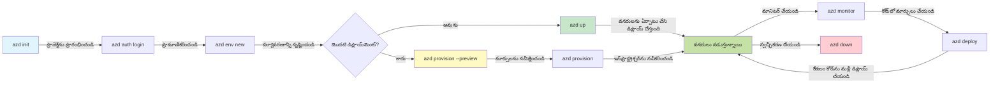
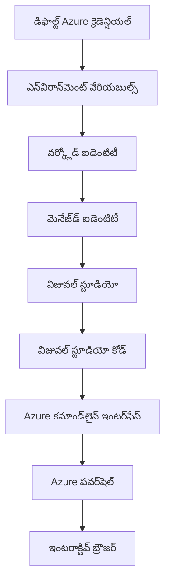

# AZD బేసిక్స్ - Azure Developer CLI ను అర్థం చేసుకోవడం

# AZD బేసిక్స్ - కోర్ కాన్సెప్ట్స్ మరియు ఫండమెంటల్స్

**అధ్యాయం నావిగేషన్:**
- **📚 కోర్సు హోమ్**: [AZD ప్రారంభికులకు](../../README.md)
- **📖 ప్రస్తుతం అధ్యాయం**: అధ్యాయం 1 - ప్రాతిపదిక మరియు త్వ‌రిత ప్రారంభం
- **⬅️ పూర్వం**: [కోర్సు అవలోకనం](../../README.md#-chapter-1-foundation--quick-start)
- **➡️ తదుపరి**: [ఇన్‌స్టాలేషన్ & సెటప్](installation.md)
- **🚀 తదుపరి అధ్యాయం**: [అధ్యాయం 2: AI-ఫస్ట్ అభివృద్ధి](../chapter-02-ai-development/microsoft-foundry-integration.md)

## పరిచయం

ఈ పాఠం మీను Azure Developer CLI (azd) తో పరిచయం చేస్తుంది, ఇది స్థానిక అభివృద్ధి నుండి Azure లో డిప్లాయ్‌మెంట్ వరకు మీ ప్రయాణాన్ని వేగవంతం చేసే శక్తివంతమైన కమాండ్-లైన్ టూల్. మీరు ప్రాథమిక భావనలు, కోర్ ఫీచర్స్ నేర్చుకుంటారు మరియు azd క్లౌడ్-నేటివ్ అప్లికేషన్ డిప్లాయ్‌మెంట్‌ను ఎలా సరళీకృతం చేస్తున్నదో అర్థం చేసుకుంటారు.

## నేర్చుకునే లక్ష్యాలు

ఈ పాఠం ముగిసిన తర్వాత, మీరు:
- Azure Developer CLI అంటే ఏమిటి మరియు దాని ప్రాథమిక ఉద్దేశ్యం ఏమిటి అర్థం చేసుకుంటారు
- టెంప్లేట్స్, ఎన్విరాన్మెంట్లు, మరియు సర్వీసులు అనే కోర్ కాన్సెప్ట్స్ నేర్చుకుంటారు
- టెంప్లేట్-చే నడిపే డెవలప్మెంట్ మరియు ఇన్ఫ్రాస్ట్రక్చర్ ఎస్ కోడ్ వంటి ముఖ్య ఫీచర్లను అన్వేషిస్తారు
- azd ప్రాజెక్ట్ నిర్మాణం మరియు వర్క్‌ఫ్లోని అర్థం చేసుకుంటారు
- మీ డెవలప్మెంట్ ఎన్విరాన్మెంట్ కోసం azd ను ఇన్‌స్టాల్ చేసి కాన్ఫిగర్ చేయడానికి సిద్ధంగా ఉంటారు

## నేర్చుకున్న ఫలితాలు

ఈ పాఠం పూర్తి చేసిన తర్వాత, మీరు చేయగలరు:
- ఆధునిక క్లౌడ్ డెవలప్మెంట్ వర్క్‌ఫ్లోల్లో azd పాత్రను వివరణ చేయండి
- azd ప్రాజెక్ట్ నిర్మాణం భాగాలను గుర్తించండి
- టెంప్లేట్స్, ఎన్విరాన్మెంట్లు, మరియు సర్వీసులు ఎలా కలిసి పనిచేస్తాయో వివరిం చేయండి
- azd తో Infrastructure as Code యొక్క లాభాలను అర్థం చేసుకోండి
- వివిధ azd కమాండ్లు మరియు వాటి ప్రయోజనాలను గుర్తించండి

## Azure Developer CLI (azd) అంటే ఏమిటి?

Azure Developer CLI (azd) ఒక కమాండ్-లైన్ టూల్, ఇది మీను స్థానిక అభివృద్ధి నుండి Azure డిప్లాయ్‌మెంట్ వరకు వేగవంతం చేస్తుంది. ఇది Azure పై క్లౌడ్-నేటివ్ అప్లికేషన్లను బిల్డ్ చేయడం, డిప్లాయ్ చేయడం మరియు నిర్వహించడం ప్రక్రియను సులభతరం చేస్తుంది.

### azd తో మీరు ఏమి డిప్లాయ్ చేయగలరు?

azd విస్తృత శ్రేణి వర్క్‌లోడ్లను మద్దతు చేస్తుంది—మరియు ఈ జాబితా పెరుగుతూ ఉంటుంది. నేడు, మీరు azd ఉపయోగించి ఈ క్రింది వాటిని డిప్లాయ్ చేయవచ్చు:

| Workload Type | Examples | Same Workflow? |
|---------------|----------|----------------|
| **Traditional applications** | Web apps, REST APIs, static sites | ✅ `azd up` |
| **Services and microservices** | Container Apps, Function Apps, multi-service backends | ✅ `azd up` |
| **AI-powered applications** | Chat apps with Microsoft Foundry Models, RAG solutions with AI Search | ✅ `azd up` |
| **Intelligent agents** | Foundry-hosted agents, multi-agent orchestrations | ✅ `azd up` |

కేంద్రীয় లోతైన విషయం ఏమిటంటే, **మీరు ఏమి డిప్లాయ్ చేస్తున్నా azd లైఫ్‌సైకిల్ అదే ఉంటుంది**. మీరు ఒక ప్రాజెక్ట్‌ను ఇనిషియలైజ్ చేస్తారు, ఇన్ఫ్రాస్ట్రక్చర్ ను ప్రొవిజన్ చేస్తారు, మీ కోడ్‌ను డిప్లాయ్ చేస్తారు, మీ యాప్‌ను మానిటర్ చేస్తారు, మరియు క్లిన్ అప్ చేస్తారు—అది ఒక సాదాసీదా వెబ్‌సైట్ అయినా లేదా ఒక సంక్లిష్ట AI ఏజెంట్ అయినా ఒకే విధంగా ఉంటుంది.

ఈ స్థిరత్వం డిజైన్ ప్రకారమే. azd AI సామర్థ్యాలను మీ అప్లికేషన్ ఉపయోగించగలిగే మరో సేవగా తరిగిస్తుంది, అది మూలంగా వేరుగా ఉండదు. Microsoft Foundry Models తో బ్యాక్ చేయబడిన చాట్ ఎండ్‌పాయింట్ azd దృష్ట్యా అటువంటి ఇతర సేవలలో ఒకటే.

### 🎯 ఎందుకు AZD ఉపయోగించాలి? వాస్తవ ప్రపంచ సరిపోలిక

మనము ఒక సాధారణ వెబ్ యాప్‌ను డేటాబేస్ తో డిప్లాయ్ చేయడాన్ని పోల్చుకుందాం:

#### ❌ AZD లేకుండా: మానువల్ Azure డిప్లాయ్‌మెంట్ (30+ నిమిషాలు)

```bash
# దశ 1: వనరుల సమూహం సృష్టించండి
az group create --name myapp-rg --location eastus

# దశ 2: App Service ప్లాన్ సృష్టించండి
az appservice plan create --name myapp-plan \
  --resource-group myapp-rg \
  --sku B1 --is-linux

# దశ 3: వెబ్ యాప్ సృష్టించండి
az webapp create --name myapp-web-unique123 \
  --resource-group myapp-rg \
  --plan myapp-plan \
  --runtime "NODE:18-lts"

# దశ 4: Cosmos DB ఖాతాను సృష్టించండి (10-15 నిమిషాలు)
az cosmosdb create --name myapp-cosmos-unique123 \
  --resource-group myapp-rg \
  --kind MongoDB

# దశ 5: డేటాబేస్ సృష్టించండి
az cosmosdb mongodb database create \
  --account-name myapp-cosmos-unique123 \
  --resource-group myapp-rg \
  --name tododb

# దశ 6: కలెక్షన్ సృష్టించండి
az cosmosdb mongodb collection create \
  --account-name myapp-cosmos-unique123 \
  --resource-group myapp-rg \
  --database-name tododb \
  --name todos

# దశ 7: కనెక్షన్ స్ట్రింగ్ పొందండి
CONN_STR=$(az cosmosdb keys list \
  --name myapp-cosmos-unique123 \
  --resource-group myapp-rg \
  --type connection-strings \
  --query "connectionStrings[0].connectionString" -o tsv)

# దశ 8: యాప్ సెట్టింగులను కాన్ఫిగర్ చేయండి
az webapp config appsettings set \
  --name myapp-web-unique123 \
  --resource-group myapp-rg \
  --settings MONGODB_URI="$CONN_STR"

# దశ 9: లాగింగ్ ను సక్రియం చేయండి
az webapp log config --name myapp-web-unique123 \
  --resource-group myapp-rg \
  --application-logging filesystem \
  --detailed-error-messages true

# దశ 10: Application Insights సెటప్ చేయండి
az monitor app-insights component create \
  --app myapp-insights \
  --location eastus \
  --resource-group myapp-rg

# దశ 11: App Insights ను వెబ్ యాప్‌కు లింక్ చేయండి
INSTRUMENTATION_KEY=$(az monitor app-insights component show \
  --app myapp-insights \
  --resource-group myapp-rg \
  --query "instrumentationKey" -o tsv)

az webapp config appsettings set \
  --name myapp-web-unique123 \
  --resource-group myapp-rg \
  --settings APPINSIGHTS_INSTRUMENTATIONKEY="$INSTRUMENTATION_KEY"

# దశ 12: అప్లికేషన్‌ను లోకల్‌గా బిల్డ్ చేయండి
npm install
npm run build

# దశ 13: డిప్లాయ్‌మెంట్ ప్యాకేజ్ సృష్టించండి
zip -r app.zip . -x "*.git*" "node_modules/*"

# దశ 14: అప్లికేషన్‌ను డిప్లాయ్ చేయండి
az webapp deployment source config-zip \
  --resource-group myapp-rg \
  --name myapp-web-unique123 \
  --src app.zip

# దశ 15: వేచి ఉండి, ఇది పని చేయాలనే ప్రార్థించండి 🙏
# (ఆటోమేటెడ్ ధృవీకరణ లేదు, మాన్యువల్ టెస్టింగ్ అవసరం)
```

**సమస్యలు:**
- ❌ 15+ కమాండ్లు గుర్తుంచుకుని క్ర‌మంలో అమలు చేయాల్సి ఉంటుంది
- ❌ 30-45 నిమిషాల మాన్యువల్ పని
- ❌ తప్పులు చేయడం సులభం (టైపోస్, తప్పు పారామీటర్లు)
- ❌ కనెక్షన్ స్ట్రింగ్స్ టెర్మినల్ హిస్టరీలో ప్రక్కబడతాయి
- ❌ ఏదైనా తప్పైతే ఆటోమేటెడ్ రోల్బ్యాక్ లేదు
- ❌ టీమ్ సభ్యులకు పునరుత్పాదకంగా చేయడం కష్టం
- ❌ ప్రతి సారీ వేరు ఉంటుంది (పునరుత్పాదకంగా లేదు)

#### ✅ AZD తో: ఆటోమేటెడ్ డిప్లాయ్‌మెంట్ (5 కమాండ్లు, 10-15 నిమిషాలు)

```bash
# దశ 1: టెంప్లేట్ నుండి ప్రారంభించండి
azd init --template todo-nodejs-mongo

# దశ 2: ప్రామాణీకరించండి
azd auth login

# దశ 3: పర్యావరణాన్ని సృష్టించండి
azd env new dev

# దశ 4: మార్పులను ముందుగా పరిశీలించండి (ఐచ్ఛికం అయినా సిఫార్సు చేయబడుతుంది)
azd provision --preview

# దశ 5: అన్నింటినీ అమలు చేయండి
azd up

# ✨ పూర్తయింది! అన్నింటినీ అమలు చేసి, కాన్ఫిగర్ చేయి, పర్యవేక్షణలో ఉంచాం
```

**లాభాలు:**
- ✅ **5 కమాండ్లు** vs. 15+ మాన్యువల్ స్టెప్స్
- ✅ **10-15 నిమిషాలు** మొత్తం సమయం (ప్రధానంగా Azure కోసం వేచివుండడం)
- ✅ **తగ్గిన మాన్యువల్ తప్పులు** - సుసంగత, టెంప్లేట్-నడిచే వర్క్‌ఫ్లో
- ✅ **సురక్షిత సీక్రెట్ హాండ్లింగ్** - బహୁతా టెంప్లేట్స్ Azure-చే నిర్వహిత సీక్రెట్ స్టోరేజ్‌ను ఉపయోగిస్తాయి
- ✅ **పునరావృతంగా డిప్లాయ్ చేయబడే** - ప్రతి సారీ ఒకే వర్క్‌ఫ్లో
- ✅ **పూర్తిగా పునరుత్పాదకమైన** - ప్రతి సారి ఒకే ఫలితం
- ✅ **టీమ్-రెడీ** - ఎవ్వరైనా ఒకే కమాండ్లతో డిప్లాయ్ చేయవచ్చు
- ✅ **Infrastructure as Code** - వెర్షన్ కంట్రోల్ చేయబడిన Bicep టెంప్లేట్స్
- ✅ **బిల్ట్-ఇన్ మానిటరింగ్** - Application Insights ఆటోమేటిగ్గా కాన్ఫిగర్ అవుతుంది

### 📊 సమయం & లోపాల తగ్గింపు

| Metric | Manual Deployment | AZD Deployment | Improvement |
|:-------|:------------------|:---------------|:------------|
| **Commands** | 15+ | 5 | 67% తక్కువ |
| **Time** | 30-45 min | 10-15 min | 60% వేగంగా |
| **Error Rate** | ~40% | <5% | 88% తగ్గుముఖం |
| **Consistency** | Low (manual) | 100% (automated) | పూర్తి స్థిరత్వం |
| **Team Onboarding** | 2-4 hours | 30 minutes | 75% వేగంగా |
| **Rollback Time** | 30+ min (manual) | 2 min (automated) | 93% వేగంగా |

## కోర్ కాన్సెప్ట్స్

### టెంప్లేట్స్
టెంప్లేట్స్ azd యొక్క పునాది. అవి కలిగి ఉంటాయి:
- **అప్లికేషన్ కోడ్** - మీ సోర్స్ కోడ్ మరియు డిపెండెన్సీలు
- **ఇన్ఫ్రాస్ట్రక్చర్ నిర్వచనాలు** - Bicep లేదా Terraform లో నిర్వచించిన Azure రిసోర్స్‌లు
- **కాన్ఫిగరేషన్ ఫైల్స్** - సెట్టింగులు మరియు ఎన్విరాన్మెంట్ వేరియబుల్స్
- **డిప్లాయ్‌మెంట్ స్క్రిప్ట్స్** - ఆటోమేటెడ్ డిప్లాయ్‌మెంట్ వర్క్‌ఫ్లోలు

### ఎన్విరాన్మెంట్లు
ఎన్విరాన్మెంట్లు వివిధ డిప్లాయ్‌మెంట్ లక్ష్యాలను ప్రతినిధ్యం చేస్తాయి:
- **డెవలప్మెంట్** - పరీక్ష మరియు అభివృద్ధికి
- **స్టేజింగ్** - ప్రీ-ప్రొడక్షన్ ఎన్విరాన్మెంట్
- **ప్రొడక్షన్** - లైవ్ ప్రొడక్షన్ ఎన్విరాన్మెంట్

ప్రతి ఎన్విరాన్మెంట్ తనదైన:
- Azure resource group
- కాన్ఫిగరేషన్ సెట్టింగులు
- డిప్లాయ్‌మెంట్ stát

### సర్వీసులు
సర్వీసులు మీ అప్లికేషన్ యొక్క నిర్మాణ రాతలు:
- **Frontend** - వెబ్ అప్లికేషన్లు, SPAలు
- **Backend** - APIs, మైక్రోసర్వీసులు
- **Database** - డేటా నిల్వ పరిష్కారాలు
- **Storage** - ఫైలు మరియు బ్లాబ్ స్టోరేజ్

## కీలక ఫీచర్లు

### 1. టెంప్లేట్-డ్రివ్‌న్ డెవలప్మెంట్
```bash
# అందుబాటులో ఉన్న టెంప్లేట్లను బ్రౌజ్ చేయండి
azd template list

# టెంప్లేట్ నుండి ప్రారంభించండి
azd init --template <template-name>
```

### 2. Infrastructure as Code
- **Bicep** - Azure యొక్క డొమైన్-స్పెసిఫిక్ భాష
- **Terraform** - మల్టీ-క్లౌడ్ ఇన్ఫ్రాస్ట్రక్చర్ టూల్
- **ARM Templates** - Azure Resource Manager టెంప్లేట్స్

### 3. ఇంటిగ్రేటెడ్ వర్క్‌ఫ్లోలు
```bash
# పూర్తి డిప్లాయ్‌మెంట్ వర్క్‌ఫ్లో
azd up            # Provision + Deploy ఇది మొదటి సెటప్ కోసం హ్యాండ్స్-ఆఫ్

# 🧪 కొత్త: పంపిణీకి ముందే ఇన్ఫ్రాస్ట్రక్చర్ మార్పులను చూడండి (సురక్షితం)
azd provision --preview    # మార్పులు చేయకుండా ఇన్ఫ్రాస్ట్రక్చర్ డిప్లాయ్‌మెంట్‌ను అనుకరించండి

azd provision     # ఇన్ఫ్రాస్ట్రక్చర్‌ను అప్‌డేట్ చేస్తే Azure వనరులను సృష్టించడం కోసం ఇది ఉపయోగించండి
azd deploy        # అప్లికేషన్ కోడ్‌ను డిప్లాయ్ చేయండి లేదా అప్‌డేట్ చేసిన తర్వాత అప్లికేషన్ కోడ్‌ను మళ్లీ డిప్లాయ్ చేయండి
azd down          # వనరులను శుభ్రపరచండి
```

#### 🛡️ ప్రివ్యూతో సురక్షిత ఇన్ఫ్రాస్ట్రక్చర్ ప్లానింగ్
`azd provision --preview` కమాండ్ సురక్షిత డిప్లాయ్‌మెంట్ కోసం గేమ్-చేంజర్:
- **డ్రై-రన్ విశ్లేషణ** - ఏమి క్రియేట్, మార్చు లేదా డిలీట్ అవుతుందో చూపిస్తుంది
- **షూన్య రిస్క్** - మీ Azure ఎన్విరాన్మెంట్ లో నిజంగా ఏ మార్పులూ జరగవు
- **టీమ్ సహకారం** - డిప్లాయ్‌మెంట్ ముందు ప్రివ్యూ ఫలితాలను షేర్ చేయండి
- **ఖర్చు అంచనాలు** - కమిట్ చేయకముందే రిసోర్స్ ఖర్చులను అర్థం చేసుకోండి

```bash
# ఉదాహరణ ముందుదర్శన పని ప్రవాహం
azd provision --preview           # ఏం మారబోతోందో చూడండి
# ఫలితాన్ని సమీక్షించండి, జట్టుతో చర్చించండి
azd provision                     # ఆ మార్పులను ఆత్మవిశ్వాసంతో వర్తింపజేయండి
```

### 📊 విజువల్: AZD డెవలప్మెంట్ వర్క్‌ఫ్లో



**వర్క్‌ఫ్లో వివరణ:**
1. **Init** - టెంప్లేట్ లేదా కొత్త ప్రాజెక్ట్ తో ప్రారంభించండి
2. **Auth** - Azure తో authenticate అవ్వండి
3. **Environment** - ఐసోలేటెడ్ డిప్లాయ్‌మెంట్ ఎన్విరాన్మెంట్ సృష్టించండి
4. **Preview** - 🆕 ఎప్పుడూ మొదట ఇన్ఫ్రాస్ట్రక్చర్ మార్పులను ప్రివ్యూ చేయండి (సురక్షిత ఆచరణ)
5. **Provision** - Azure రిసోర్సులను సృష్టించండి/అప్డేట్ చేయండి
6. **Deploy** - మీ అప్లికేషన్ కోడ్ పుష్ చేయండి
7. **Monitor** - అప్లికేషన్ పనితీరును గమనించండి
8. **Iterate** - మార్పులు చేయండి మరియు కోడ్‌ను మళ్ళీ డిప్లాయ్ చేయండి
9. **Cleanup** - పనిపడి దిన తర్వాత రిసోర్సులను తొలగించండి

### 4. ఎన్విరాన్మెంట్ నిర్వహణ
```bash
# పరిసరాలను సృష్టించండి మరియు నిర్వహించండి
azd env new <environment-name>
azd env select <environment-name>
azd env list
```

### 5. ఎక్స్‌టెన్షన్స్ మరియు AI కమాండ్స్

azd కోర్ CLI కు మించి సామర్థ్యాలు జోడించడానికి ఎక్స్‌టెన్షన్ సిస్టాన్ని ఉపయోగిస్తుంది. ఇది ప్రత్యేకంగా AI వర్క్‌లోడ్స్ కోసం ఉపయోగపడుతుంది:

```bash
# అందుబాటులో ఉన్న విస్తరణలను జాబితా చేయండి
azd extension list

# Foundry agents విస్తరణను ఇన్స్టాల్ చేయండి
azd extension install azure.ai.agents

# మానిఫెస్ట్ నుండి AI ఏజెంట్ ప్రాజెక్టును ప్రారంభించండి
azd ai agent init -m agent-manifest.yaml

# డిప్లాయ్ చేయబడిన ఏజెంట్‌ను పరీక్షించండి (లేటెన్సీ మరియు మొదటి బైట్‌ వచ్చేవరకు గడిచిన సమయం చూపిస్తుంది)
azd ai agent invoke

# AI-సహాయంతో అభివృద్ధికి MCP సర్వర్‌ను ప్రారంభించండి (ఆల్ఫా)
azd mcp start
```

**ఏజెంట్ లైఫ్‌సైకిల్, ఎండ్ టు ఎండ్.** మీరు `azure.ai.agents` ను ఇన్‌స్టాల్ చేసాక, ఒకే వర్క్‌ఫ్లోతో ఆలోచన నుండి పరుగులో ఉన్న, మానిటర్ చేయబడుతున్న ఏజెంట్ వరకు వెళ్ళవచ్చు. మీరు ఈ మొత్తం అవసరం కనిపించే అన్ని విషయాలను మొదటి రోజు అవసరం లేదు—ఇవి ఉన్నాయనే విషయం మాత్రమే గుర్తుంచుకోండి:

| Stage | Command | What it does |
|-------|---------|--------------|
| **Scaffold** | `azd ai agent init -m <manifest>` | Generate an agent project from a manifest |
| **Test** | `azd ai agent invoke` | Call the agent and view response timing |
| **Measure** | `azd ai agent eval generate` | Create an evaluation dataset for the agent |
| **Improve** | `azd ai agent optimize` | Optimize agent instructions against your data |
| **Inspect** | `azd ai agent endpoint show` | View the live endpoint configuration |
| **Clean up** | `azd ai agent delete` | Delete a hosted agent and all its versions |

> Extensions గురించి విస్తృతంగా వివరించబడింది [అధ్యాయం 2: AI-ఫస్ట్ అభివృద్ధి](../chapter-02-ai-development/agents.md) మరియు [AZD AI CLI కమాండ్‌లు](../chapter-08-production/production-ai-practices.md#azd-ai-cli-commands-and-extensions) సూచనలో.

## 📁 ప్రాజెక్ట్ నిర్మాణం

సాధారణ azd ప్రాజెక్ట్ నిర్మాణం:
```
my-app/
├── .azd/                    # azd configuration
│   └── config.json
├── .azure/                  # Azure deployment artifacts
├── .devcontainer/          # Development container config
├── .github/workflows/      # GitHub Actions
├── .vscode/               # VS Code settings
├── infra/                 # Infrastructure code
│   ├── main.bicep        # Main infrastructure template
│   ├── main.parameters.json
│   └── modules/          # Reusable modules
├── src/                  # Application source code
│   ├── api/             # Backend services
│   └── web/             # Frontend application
├── azure.yaml           # azd project configuration
└── README.md
```

## 🔧 కాన్ఫిగరేషన్ ఫైల్స్

### azure.yaml
ప్రధాన ప్రాజెక్ట్ కాన్ఫిగరేషన్ ఫైల్:
```yaml
name: my-awesome-app
metadata:
  template: my-template@1.0.0

services:
  web:
    project: ./src/web
    language: js
    host: appservice
  api:
    project: ./src/api
    language: js
    host: appservice

hooks:
  preprovision:
    shell: pwsh
    run: echo "Preparing to provision..."
```

### .azure/config.json
ఎన్విరాన్మెంట్-స్పెసిఫిక్ కాన్ఫిగరేషన్:
```json
{
  "version": 1,
  "defaultEnvironment": "dev",
  "environments": {
    "dev": {
      "subscriptionId": "your-subscription-id",
      "location": "eastus"
    }
  }
}
```

## 🎪 సాధారణ వర్క్‌ఫ్లోలు చేతిలో-చే వ్యవహారాలతో

> **💡 లెర్నింగ్ టిప్:** ఈ వ్యాయామాలను వరుసగా అనుసరించండి, తద్వారా మీరు AZD నైపుణ్యాలను దోరుకుంటూ పెంచుకోవచ్చు.

### 🎯 వ్యాయామం 1: మీ మొదటి ప్రాజెక్ట్‌ను ఇనిషియలైజ్ చేయండి

**లక్ష్యం:** ఒక AZD ప్రాజెక్ట్ సృష్టించి దాని నిర్మాణాన్ని అన్వేషించండి

**దశలు:**
```bash
# పరీక్షించిన టెంప్లేట్ ఉపయోగించండి
azd init --template todo-nodejs-mongo

# సృష్టించబడిన ఫైళ్లను అన్వేషించండి
ls -la  # దాచబడిన వాటినీ సహా అన్ని ఫైళ్లు చూడండి

# సృష్టించిన ముఖ్యమైన ఫైళ్లు:
# - azure.yaml (ప్రధాన కాన్ఫిగరేషన్)
# - infra/ (ఇన్ఫ్రాస్ట్రక్చర్ కోడ్)
# - src/ (అనువర్తన కోడ్)
```

**✅ విజయము:** మీ దగ్గర azure.yaml, infra/ మరియు src/ డైరెక్టరీలు ఉన్నాయి

---

### 🎯 వ్యాయామం 2: Azure కు డిప్లాయ్ చేయండి

**లక్ష్యం:** ఎండ్-టు-ఎండ్ డిప్లాయ్‌మెంట్ పూర్తి చేయండి

**దశలు:**
```bash
# 1. ధృవీకరించండి
az login && azd auth login

# 2. పరిసరాన్ని సృష్టించండి
azd env new dev
azd env set AZURE_LOCATION eastus

# 3. మార్పులను ముందుగా వీక్షించండి (సిఫార్సు చేయబడింది)
azd provision --preview

# 4. అన్నింటినీ అమలు చేయండి
azd up

# 5. అమర్పును ధృవీకరించండి
azd show    # మీ యాప్ URLను చూడండి
```

**అంచనా సమయం:** 10-15 నిమిషాలు  
**✅ విజయము:** బ్రౌజర్‌లో అప్లికేషన్ URL తెరుస్తుంది

---

### 🎯 వ్యాయామం 3: బహుళ ఎన్విరాన్మెంట్లు

**లక్ష్యం:** dev మరియు staging కు డిప్లాయ్ చేయండి

**దశలు:**
```bash
# ఇప్పటికే dev ఉంది, stagingని సృష్టించండి
azd env new staging
azd env set AZURE_LOCATION westus2
azd up

# వాటిలో మార్పిడి చేయండి
azd env list
azd env select dev
```

**✅ విజయము:** Azure పోర్టల్‌లో రెండు వేరే resource groupలుంటాయి

---

### 🛡️ క్లియర్ స్టేట్: `azd down --force --purge`

మీరు పూర్తిగా రీసెట్ కావాలనుకుంటున్నప్పుడు:

```bash
azd down --force --purge
```

**ఇది ఏమి చేస్తుంది:**
- `--force`: నిర్ధారణ ప్రాంప్ట్‌లు ఉండవు
- `--purge`: అన్ని స్థానిక స్టేట్ మరియు Azure రిసోర్సులను డిలీట్ చేస్తుంది

**ఎప్పుడు ఉపయోగించాలి:**
- డిప్లాయ్‌మెంట్ మార్గంలో విఫలమయ్యింది
- ప్రాజెక్ట్స్ మార్చుతున్నప్పుడు
- తాజా ప్రారంభం కావాలనిపించినప్పుడు

---

## 🎪 ఒరిజినల్ వర్క్‌ఫ్లో రిఫరెన్స్

### కొత్త ప్రాజెక్ట్ ప్రారంభించడం
```bash
# విధానం 1: ఇప్పటికే ఉన్న టెంప్లేట్‌ను ఉపయోగించండి
azd init --template todo-nodejs-mongo

# విధానం 2: మొదటి నుంచి ప్రారంభించండి
azd init

# విధానం 3: ప్రస్తుత డైరెక్టరీను ఉపయోగించండి
azd init .
```

### డెవలప్మెంట్ సైకిల్
```bash
# అభివృద్ధి వాతావరణాన్ని ఏర్పాటు చేయండి
azd auth login
azd env new dev
azd env select dev

# అన్నింటినీ డిప్లాయ్ చేయండి
azd up

# మార్పులు చేయండి మరియు మళ్లీ డిప్లాయ్ చేయండి
azd deploy

# పూర్తయిన తర్వాత శుభ్రపరచండి
azd down --force --purge # Azure Developer CLIలోని కమాండ్ మీ పరిసరానికి **కఠిన రీసెట్** — ఇది ప్రత్యేకంగా ఉపయోగపడుతుంది, ముఖ్యంగా మీరు విఫలమైన డిప్లాయ్‌మెంట్‌లను పరిష్కరిస్తున్నప్పుడు, అనాధ వనరులను శుభ్రపరచుతున్నప్పుడు, లేదా కొత్తగా మళ్లీ డిప్లాయ్ చేయడానికి సిద్ధం చేసుకుంటున్నప్పుడు.
```

## `azd down --force --purge` ను అర్థం చేసుకోవడం
`azd down --force --purge` కమాండ్ మీ azd ఎన్విరాన్మెంట్ మరియు అన్ని సంబంధించిన రిసోర్సులను పూర్తిగా తాకనే సత్తా కలిగిన పద్ధతి. ప్రతి ఫ్లాగ్ ఏం చేస్తుందో వివరణ ఇక్కడ ఉంది:
```
--force
```
- నిర్ధారణ ప్రాంప్ట్‌లను స్కిప్ చేస్తుంది.
- ఆటోమేషన్ లేదా స్క్రిప్టింగ్ కోసం ఉపయోగకరం, ఇక్కడ మానవ ఇన్‌పుట్ సాధ్యం కాకపోవచ్చు.
- CLI అనుసంధానాల్లో అసమంజసం కనబడితే కూడా teardown నిరవధిగా జరుగుతుంది.

```
--purge
```
డిలీట్ చేస్తుంది **అన్ని సంబంధిత మెటాడేటా**, ఇందులో:
- Environment state
- స్థానిక `.azure` ఫోల్డర్
- Cached deployment info
Prevents azd from "remembering" previous deployments, which can cause issues like mismatched resource groups or stale registry references.


### ఎందుకు రెండింటినీ ఉపయోగించాలి?
`azd up` తో పాటు నిలిచిపోయిన స్టేట్ లేదా భాగంగా ఉన్న డిప్లాయ్‌మెంట్ సమస్యలతో మీరు ఎదురైనపుడు, ఈ కాంబో ఒక **క్లీన్ స్లేట్** ను నిర్ధారిస్తుంది.

ఇది ప్రత్యేకంగా సహాయపడుతుంది మానవీయంగా Azure పోర్టల్‌లో రిసోర్సులను తొలగించిన తర్వాత లేదా టెంప్లేట్స్, ఎన్విరాన్మెంట్లు లేదా resource group పేరింగ్ కన్వెన్షన్లు మార్చినప్పుడు.

### బహుళ ఎన్విరాన్మెంట్ల నిర్వహణ
```bash
# స్టేజింగ్ వాతావరణాన్ని సృష్టించండి
azd env new staging
azd env select staging
azd up

# తిరిగి dev కు మారండి
azd env select dev

# పరిసరాలను పోల్చండి
azd env list
```

## 🔐 authentication మరియు క్రెడెన్షియల్స్

authentication ను అర్థం చేసుకోవడం విజయవంతమైన azd డిప్లాయ్‌మెంట్‌లకు అత్యంత ముఖ్యం. Azure అనేక authentication పద్ధతులను ఉపయోగిస్తుంది, మరియు azd ఇతర Azure టూల్స్ ఉపయోగించే అదే క్రెడెన్షియల్ చైన్‌ను ఉపయోగిస్తుంది.

### Azure CLI authentication (`az login`)

azd ఉపయోగించడానికి ముందు, మీరు Azure తో authenticate కావాలి. సాధారణంగా ఉపయోగించే పద్ధతి Azure CLI ఉపయోగించడం:

```bash
# ఇంటరాక్టివ్ లాగిన్ (బ్రౌజర్‌ను తెరుస్తుంది)
az login

# నిర్దిష్ట టెనెంట్‌తో లాగిన్
az login --tenant <tenant-id>

# సర్వీస్ ప్రిన్సిపల్‌తో లాగిన్
az login --service-principal -u <app-id> -p <password> --tenant <tenant-id>

# ప్రస్తుత లాగిన్ స్థితిని తనిఖీ చేయండి
az account show

# అందుబాటులో ఉన్న సబ్స్క్రిప్షన్లను జాబితా చేయండి
az account list --output table

# డిఫాల్ట్ సబ్స్క్రిప్షన్‌ను సెట్ చేయండి
az account set --subscription <subscription-id>
```

### Authentication ఫ్లో
1. **ఇంటరాక్టివ్ లాగిన్**: authenticate కోసం మీ డిఫాల్ట్ బ్రౌజర్‌ను ఓపెన్ చేస్తుంది
2. **డివైస్ కోడ్ ఫ్లో**: బ్రౌజర్ యాక్సెస్ లేని ఎన్విరాన్మెంట్ల కొరకు
3. **సర్వీస్ ప్రిన్సిపల్**: ఆటోమేషన్ మరియు CI/CD సందర్భాల కోసం
4. **మ్యానేజ్డ్ ఐడెంటిటీ**: Azure హోస్ట్ చేయబడిన అప్లికేషన్ల కోసం

### DefaultAzureCredential చైన్

`DefaultAzureCredential` ఒక క్రెడెన్షియల్ తరం, ఇది వివిధ క్రెడెన్షియల్ సోర్సులను ఒక నిర్దిష్ట క్రమంలో ఆటోమేటిగ్గా పరీక్షించడం ద్వారా సరళీకృత authentication అనుభవాన్ని అందిస్తుంది:

#### Credential చైన్ ఆర్డర్


#### 1. Environment Variables
```bash
# సర్వీస్ ప్రిన్సిపల్ కోసం పర్యావరణ వేరియబుల్స్‌ను సెట్ చేయండి
export AZURE_CLIENT_ID="<app-id>"
export AZURE_CLIENT_SECRET="<password>"
export AZURE_TENANT_ID="<tenant-id>"
```

#### 2. Workload Identity (Kubernetes/GitHub Actions)
ఆటోమేటిగ్గా ఉపయోగిస్తారు:
- Azure Kubernetes Service (AKS) లో Workload Identity తో
- GitHub Actions లో OIDC ఫెడరేషన్ తో
- ఇతర ఫెడరేటెడ్ ఐడెంటిటీ సందర్భాల్లో

#### 3. Managed Identity
Azure రిసోర్సులకు ఉపయోగించబడుతుంది, ఉదాహరణకు:
- Virtual Machines
- App Service
- Azure Functions
- Container Instances

```bash
# మేనేజ్ చేయబడిన ఐడెంటిటీతో Azure వనరులో నడుస్తోందో లేదో తనిఖీ చేయండి
az account show --query "user.type" --output tsv
# మేనేజ్ చేయబడిన ఐడెంటిటీ ఉపయోగిస్తుంటే "servicePrincipal" ను తిరిగి ఇస్తుంది
```

#### 4. Developer Tools Integration
- **Visual Studio**: సైన్-ఇన్ అయిన ఖాతా ఆటోమేటిగ్గా ఉపయోగిస్తుంది
- **VS Code**: Azure Account ఎక్స్‌టెన్షన్ క్రెడెన్షియల్స్ ఉపయోగిస్తుంది
- **Azure CLI**: స్థానిక అభివృద్ధికి సాధారణంగా ఉపయోగించే `az login` క్రెడెన్షియల్స్ ఉపయోగిస్తుంది

### AZD Authentication సెటప్

```bash
# పద్ధతి 1: Azure CLI ఉపయోగించండి (వికాసం కోసం సిఫార్సు చేయబడింది)
az login
azd auth login  # ఇదివరకు ఉన్న Azure CLI ప్రమాణపత్రాలను ఉపయోగిస్తుంది

# పద్ధతి 2: azd ద్వారా ప్రత్యక్ష ప్రామాణీకరణ
azd auth login --use-device-code  # హెడ్‌లెస్ పరిసరాల కోసం

# పద్ధతి 3: ప్రామాణీకరణ స్థితిని తనిఖీ చేయండి
azd auth login --check-status

# పద్ధతి 4: లాగ్ అవుట్ చేసి మళ్ళీ ప్రామాణీకరించండి
azd auth logout
azd auth login
```

### Authentication కోసం ఉత్తమ అభ్యాసాలు

#### స్థానిక అభివృద్ధి కోసం
```bash
# 1. Azure CLI తో లాగిన్ చేయండి
az login

# 2. సరైన సబ్‌స్క్రిప్షన్‌ను నిర్ధారించండి
az account show
az account set --subscription "Your Subscription Name"

# 3. ఉన్న క్రెడెన్షియల్స్‌తో azd ఉపయోగించండి
azd auth login
```

#### CI/CD పైప్లైన్ల కోసం
```yaml
# GitHub Actions example
- name: Azure Login
  uses: azure/login@v1
  with:
    creds: ${{ secrets.AZURE_CREDENTIALS }}

- name: Deploy with azd
  run: |
    azd auth login --client-id ${{ secrets.AZURE_CLIENT_ID }} \
                    --client-secret ${{ secrets.AZURE_CLIENT_SECRET }} \
                    --tenant-id ${{ secrets.AZURE_TENANT_ID }}
    azd up --no-prompt
```

#### ఉత్పత్తి పరిసరాల కోసం
- Azure వనరులపై నడిచేటప్పుడు **Managed Identity** ఉపయోగించండి
- ఆటోమేషన్ సందర్భాల కోసం **Service Principal** ఉపయోగించండి
- కోడ్ లేదా కాన్ఫిగరేషన్ ఫైళ్లలో ప్రామాణీకరణ వివరాలను నిల్వ చేయకుండా ఉండండి
- సున్నితమైన కాన్ఫిగరేషన్ కోసం **Azure Key Vault** ఉపయోగించండి

### సాధారణ ప్రామాణీకరణ సమస్యలు మరియు పరిష్కారాలు

#### సమస్య: "No subscription found"
```bash
# పరిష్కారం: డిఫాల్ట్ సబ్‌స్క్రిప్షన్‌ను సెట్ చేయండి
az account list --output table
az account set --subscription "<subscription-id>"
azd env set AZURE_SUBSCRIPTION_ID "<subscription-id>"
```

#### సమస్య: "Insufficient permissions"
```bash
# పరిష్కారం: అవసరమైన పాత్రలను తనిఖీ చేసి కేటాయించండి
az role assignment list --assignee $(az account show --query user.name --output tsv)

# సాధారణంగా అవసరమైన పాత్రలు:
# - కాంట్రిబ్యూటర్ (వనరుల నిర్వహణ కోసం)
# - యూజర్ యాక్సెస్ అడ్మినిస్ట్రేటర్ (పాత్రల కేటాయింపుల కోసం)
```

#### సమస్య: "Token expired"
```bash
# పరిష్కారం: మళ్లీ ప్రామాణీకరించండి
az logout
az login
azd auth logout
azd auth login
```

### వివిధ సందర్భాలలో ప్రామాణీకరణ

#### స్థానిక అభివృద్ధి
```bash
# వ్యక్తిగత అభివృద్ధి ఖాతా
az login
azd auth login
```

#### బృంద అభివృద్ధి
```bash
# సంస్థ కోసం ప్రత్యేక టెనెంట్‌ను ఉపయోగించండి
az login --tenant contoso.onmicrosoft.com
azd auth login
```

#### బహుళ-టెనెంట్ సందర్భాలు
```bash
# టెనెంట్‌ల మధ్య మారండి
az login --tenant tenant1.onmicrosoft.com
# టెనెంట్ 1కి డిప్లాయ్ చేయండి
azd up

az login --tenant tenant2.onmicrosoft.com  
# టెనెంట్ 2కి డిప్లాయ్ చేయండి
azd up
```

### భద్రత పరిగణనలు

1. **Credential Storage**: మూల కోడ్‌లో ఎప్పుడూ ప్రామాణీకరణ వివరాలను నిల్వ చేయవద్దు
2. **Scope Limitation**: Service Principal లకు కనిష్ట హక్కుల సూత్రాన్ని వర్తింపజేయండి
3. **Token Rotation**: Service Principal సీక్రెట్లను నియమితంగా మార్చండి
4. **Audit Trail**: ప్రామాణీకరణ మరియు అమర్పు కార్యకలాపాలను పర్యవేక్షించండి
5. **Network Security**: సాధ్యమైతే ప్రైవేట్ ఎండ్పాయింట్లను ఉపయోగించండి

### ప్రామాణీకరణ సమస్యల పరిష్కారం

```bash
# ప్రామాణీకరణ సమస్యలను డీబగ్ చేయండి
azd auth login --check-status
az account show
az account get-access-token

# సాధారణ నిర్ధారణ కమాండ్లు
whoami                          # ప్రస్తుత వినియోగదారు సందర్భం
az ad signed-in-user show      # Microsoft Entra ID వినియోగదారు వివరాలు
az group list                  # వనరు యాక్సెస్‌ను పరీక్షించండి
```

## అర్థం చేసుకోవడం `azd down --force --purge`

### కనుగొనడం
```bash
azd template list              # మూసలను వీక్షించండి
azd template show <template>   # మూస వివరాలు
azd init --help               # ప్రారంభ ఎంపికలు
```

### ప్రాజెక్ట్ నిర్వహణ
```bash
azd show                     # ప్రాజెక్ట్ అవలోకనం
azd env list                # అందుబాటులో ఉన్న ఎన్విరాన్‌మెంట్లు మరియు ఎంచుకున్న డిఫాల్ట్
azd config show            # కాన్ఫిగరేషన్ అమరికలు
```

### పర్యవేక్షణ
```bash
azd monitor                  # Azure పోర్టల్ మానిటరింగ్‌ను తెరవండి
azd monitor --logs           # అప్లికేషన్ లాగ్‌లు చూడండి
azd monitor --live           # లైవ్ మెట్రిక్స్‌ను చూడండి
azd pipeline config          # CI/CD సెటప్ చేయండి
```

## ఉత్తమ ఆచరణలు

### 1. అర్థవంతమైన పేర్లను ఉపయోగించండి
```bash
# మంచి
azd env new production-east
azd init --template web-app-secure

# తప్పించండి
azd env new env1
azd init --template template1
```

### 2. టెంప్లేట్లను వినియోగించండి
- అందుబాటులో ఉన్న టెంప్లేట్లతో ప్రారంభించండి
- మీ అవసరాలకు అనుగుణంగా అనుకూలీకరించండి
- మీ సంస్థ కోసం పునర్వినియోగించే టెంప్లేట్లను సృష్టించండి

### 3. వాతావరణ వేరుచేయడం
- dev/staging/prod కోసం వేరు వాతావరణాలను ఉపయోగించండి
- లోకల్ మెషిన్నుంచి నేరుగా ప్రొడక్షన్‌కు డిప్లాయ్ చేయవద్దు
- ప్రొడక్షన్ డిప్లాయ్‌మెంట్స్ కోసం CI/CD పైప్లైన్‌లను ఉపయోగించండి

### 4. కాన్ఫిగరేషన్ నిర్వహణ
- సున్నితమైన డేటా కోసం ఎన్విరాన్‌మెంట్ వేరియబుల్స్ ఉపయోగించండి
- కాన్ఫిగరేషన్‌ను వెర్షన్ కంట్రోల్‌లో ఉంచండి
- వాతావరణ-specific సెట్టింగ్స్ ను డాక్యుమెంట్ చేయండి

## నేర్చుకునే పురోగతి

### ప్రారంభ స్థాయి (వారాలు 1-2)
1. azd ఇన్స్టాల్ చేసి ప్రామాణీకరించండి
2. ఒక సరళమైన టెంప్లేట్‌ను డిప్లాయ్ చేయండి
3. ప్రాజెక్ట్ నిర్మాణాన్ని అర్థం చేసుకోండి
4. ప్రాథమిక కమాండ్స్ నేర్చుకోండి (up, down, deploy)

### మధ్యస్థాయి (వారాలు 3-4)
1. టెంప్లేట్లను అనుకూలీకరించండి
2. బహుళ వాతావరణాలను నిర్వహించండి
3. ఇన్‌ఫ్రాస్ట్రక్చర్ కోడ్‌ను అర్థం చేసుకోండి
4. CI/CD పైప్లైన్‌లు సెటప్ చేయండి

### అధునాతన (వారాలు 5+)
1. కస్టమ్ టెంప్లేట్లను సృష్టించండి
2. అధునాతన ఇన్‌ఫ్రాస్ట్రక్చర్ ప్యాటర్న్స్
3. బహుళ ప్రాంతాలలో డిప్లాయ్‌మెంట్లు
4. ఎంటర్ప్రైజ్-గ్రేడ్ కాన్ఫిగరేషన్లు

## తదుపరి చర్యలు

**📖 అధ్యాయం 1 నేర్చుకోవడం కొనసాగించండి:**
- [ఇన్స్టాలేషన్ & సెటప్](installation.md) - azd ని ఇన్‌స్టాల్ చేసి కాన్ఫిగర్ చేయండి
- [మీ మొదటి ప్రాజెక్ట్](first-project.md) - హ్యాండ్స్-ఆన్ ట్యుటోరియల్ పూర్తి చేయండి
- [కాన్ఫిగరేషన్ గైడ్](configuration.md) - అధునాతన కాన్ఫిగరేషన్ ఎంపికలు

**🎯 తదుపరి అధ్యాయానికి సిద్ధమా?**
- [అధ్యాయం 2: AI-ఫస్ట్ డెవలప్‌మెంట్](../chapter-02-ai-development/microsoft-foundry-integration.md) - AI అప్లికేషన్లను నిర్మించడం ప్రారంభించండి

## అదనపు వనరులు

- [Azure Developer CLI అవలోకనం](https://learn.microsoft.com/en-us/azure/developer/azure-developer-cli/)
- [టెంప్లేట్ గ్యాలరీ](https://azure.github.io/awesome-azd/)
- [కమ్యూనిటీ నమూనాలు](https://github.com/Azure-Samples)

---

## 🙋 తరచుగా అడిగే ప్రశ్నలు

### సాధారణ ప్రశ్నలు

**Q: AZD మరియు Azure CLI మధ్య ఏమి తేడా ఉంది?**

A: Azure CLI (`az`) వ్యక్తిగత Azure వనరులను నిర్వహించడానికి అనుకూలంగా ఉంది. AZD (`azd`) మొత్తం అప్లికేషన్లను నిర్వహించడానికి ఉపయోగపడుతుంది:

```bash
# Azure CLI - తక్కువ స్థాయి వనరుల నిర్వహణ
az webapp create --name myapp --resource-group rg
az sql server create --name myserver --resource-group rg
# ...ఇంకా చాలా కమాండ్లు అవసరం

# AZD - అప్లికేషన్ స్థాయి నిర్వహణ
azd up  # అన్ని వనరులతో సహా పూర్తి అనువర్తనాన్ని అమలు చేస్తుంది
```

**ఇలా ఆలోచించండి:**
- `az` = వ్యక్తిగత లెగో బ్లాక్స్‌పై పని చేయడం
- `azd` = పూర్తి లెగో సెట్‌లతో పని చేయడం

---

**Q: AZD ఉపయోగించడానికి నాకు Bicep లేదా Terraform తెలుసుకోవాల్సిందా?**

A: అవసరం లేదు! టెంప్లేట్లతో ప్రారంభించండి:
```bash
# ఉన్న టెంప్లేట్‌ను ఉపయోగించండి - IaC గురించి జ్ఞానం అవసరం లేదు
azd init --template todo-nodejs-mongo
azd up
```

తదుపరి సమయంలో ఇన్‌ఫ్రాస్ట్రక్చర్ అనుకూలీకరించడానికి Bicep నేర్చుకోవచ్చు. టెంప్లేట్లు నేర్చుకోవడానికి పనికొనే ఉదాహరణలను అందిస్తాయి.

---

**Q: AZD టెంప్లేట్లను నడిపించడానికి ఖర్చు ఎంత?**

A: ఖర్చులు టెంప్లేటుపై ఆధారపడి మారతాయి. బహుళ డెవలప్‌మెంట్ టెంప్లేట్లు సాధారణంగా $50-150/నెల ఖర్చవుతాయి:

```bash
# డిప్లాయ్ చేయకముందు ఖర్చులను చూడండి
azd provision --preview

# వాడకంలో లేనప్పుడు ఎల్లప్పుడూ శుభ్రపరచండి
azd down --force --purge  # అన్ని వనరులను తొలగిస్తుంది
```

**ప్రో చిట్కా:** అందుబాటులో ఉన్న ఫ్రీ టియర్‌లను ఉపయోగించండి:
- App Service: F1 (Free) tier
- Microsoft Foundry Models: Azure OpenAI 50,000 tokens/month free
- Cosmos DB: 1000 RU/s free tier

---

**Q: నేను ఉన్న Azure వనరులతో AZD ఉపయోగించగలనా?**

A: అవును, గానీ కొత్తగా ప్రారంభించడం సులభం. AZD పూర్తి జీవిత చక్రాన్ని నిర్వహిస్తే ఉత్తమంగా పనిచేస్తుంది. ఉన్న వనరులకు సంబంధించి:

```bash
# వికల్పం 1: ఉన్న వనరులను దిగుమతి చేయండి (అధిక స్థాయి)
azd init
# తర్వాత infra/ ఫోల్డర్‌ను ఇప్పటికే ఉన్న వనరులను సూచించేలా సవరించండి

# వికల్పం 2: కొత్త నుంచి ప్రారంభించండి (సిఫార్సు చేయబడింది)
azd init --template matching-your-stack
azd up  # కొత్త పరిసరాన్ని సృష్టిస్తుంది
```

---

**Q: నా ప్రాజెక్ట్ని నేను నా టీమ్‌తో ఎలా పంచుకుంటాను?**

A: AZD ప్రాజెక్ట్‌ను Git‌లో కమిట్ చేయండి (కానీ .azure ఫోల్డర్ కమిట్ చేయకండి):

```bash
# డిఫాల్ట్‌గా ఇప్పటికే .gitignore లో ఉంది
.azure/        # రహద్యాలు మరియు పర్యావరణ సమాచారం కలిగి ఉంటుంది
*.env          # పర్యావరణ చరాలు

# తర్వాత బృంద సభ్యులు:
git clone <your-repo>
azd auth login
azd env new <their-name>-dev
azd up
```

అంటే ఎవరికీ అదే టెంప్లేట్ల నుంచి సమానమైన ఇన్‌ఫ్రాస్ట్రక్చర్ అందుతుంది.

---

### సమస్యల పరిష్కార ప్రశ్నలు

**Q: "azd up" మధ్యలో విఫలమైపోతే నేను ఏమి చేయాలి?**

A: తప్పు సందేశాన్ని పరిశీలించి, దానిని సరిదిద్ది, తిరిగి ప్రయత్నించండి:

```bash
# వివరణాత్మక లాగ్‌లను వీక్షించండి
azd show

# సాధారణ పరిష్కారాలు:

# 1. క్వోటా మించిపోయినట్లయితే:
azd env set AZURE_LOCATION "westus2"  # వేరే ప్రాంతాన్ని ప్రయత్నించండి

# 2. వనరు పేరుతో ఘర్షణ ఉంటే:
azd down --force --purge  # కొత్త ప్రారంభం
azd up  # మళ్లీ ప్రయత్నించండి

# 3. ప్రామాణీకరణ గడువు ముగిసినట్లయితే:
az login
azd auth login
azd up
```

**అత్యంత సాధారణ సమస్య:** తప్పైన Azure subscription ఎంపిక చేయబడింది
```bash
az account list --output table
az account set --subscription "<correct-subscription>"
```

---

**Q: రీప్రోవిజనింగ్ లేకుండా కేవలం కోడ్ మార్పులను ఎలా డిప్లాయ్ చేయాలి?**

A: `azd deploy` ను `azd up` స్థానంలో ఉపయోగించండి:

```bash
azd up          # మొదటి సారి: సిద్ధీకరణ + అమలు (నెమ్మది)

# కోడ్‌లో మార్పులు చేయండి...

azd deploy      # తర్వాతి సార్లు: కేవలం అమలు (వేగంగా)
```

వేగం పోలిక:
- `azd up`: 10-15 నిమిషాలు (ఇన్‌ఫ్రాస్ట్రక్చర్ ప్రావిజనింగ్)
- `azd deploy`: 2-5 నిమిషాలు (కేవలం కోడ్)

---

**Q: ఇన్‌ఫ్రాస్ట్రక్చర్ టెంప్లేట్లను అనుకూలీకరించుకోవచ్చా?**

A: అవును! `infra/`లోని Bicep ఫైళ్లు ఎడిట్ చేయండి:

```bash
# azd init తర్వాత
cd infra/
code main.bicep  # VS Codeలో సవరించండి

# మార్పులను ముందుగా చూడండి
azd provision --preview

# మార్పులను అమలు చేయండి
azd provision
```

**సూచన:** చిన్నదిగా ప్రారంభించండి - ముందు SKUs మార్చండి:
```bicep
// infra/main.bicep
sku: {
  name: 'B1'  // Change to 'P1V2' for production
}
```

---

**Q: AZD సృష్టించిన అన్నింటినీ ఎలా తొలగించాలి?**

A: ఒక కమాండ్ అన్ని వనరులను తీసివేయగలదు:

```bash
azd down --force --purge

# ఇది తొలగిస్తుంది:
# - అన్ని Azure వనరులు
# - వనరు సమూహం
# - స్థానిక పర్యావరణ స్థితి
# - క్యాష్‌లో ఉన్న డిప్లాయ్‌మెంట్ డేటా
```

**ఇది ఎప్పుడూ చేయి:** 
- ఒక టెంప్లేట్ పరీక్షలు పూర్తయినప్పుడు
- వేరే ప్రాజెక్ట్ కు మారుతున్నప్పుడు
- కొత్తగా ప్రారంభించాలనుకుంటే

**ఖర్చు ఆదా:** ఉపయోగించని వనరులను తొలిగించటం = $0 ఛార్జీలు

---

**Q: నేను తప్పుగా Azure పోర్టల్‌లో వనరులను చివరగా తొలగిస్తే ఏమవుతుంది?**

A: AZD స్థితి సమకూరకానికి బయలుదేరి ఉండవచ్చు. శుభ్రమైన స్థితినిచ్చే దృష్టికోణం:

```bash
# 1. స్థానిక స్థితిని తొలగించండి
azd down --force --purge

# 2. కొత్తగా ప్రారంభించండి
azd up

# వికల్పం: AZD గుర్తించి మరియు సరిచేయనివ్వండి
azd provision  # లేకపోయిన వనరులను సృష్టిస్తుంది
```

---

### అధునాతన ప్రశ్నలు

**Q: CI/CD పైప్లైన్‌లలో AZD ఉపయోగించగలనా?**

A: అవును! GitHub Actions ఉదాహరణ:

```yaml
# .github/workflows/deploy.yml
name: Deploy with AZD

on:
  push:
    branches: [main]

jobs:
  deploy:
    runs-on: ubuntu-latest
    steps:
      - uses: actions/checkout@v2
      
      - name: Install azd
        run: curl -fsSL https://aka.ms/install-azd.sh | bash
      
      - name: Azure Login
        run: |
          azd auth login \
            --client-id ${{ secrets.AZURE_CLIENT_ID }} \
            --client-secret ${{ secrets.AZURE_CLIENT_SECRET }} \
            --tenant-id ${{ secrets.AZURE_TENANT_ID }}
      
      - name: Deploy
        run: azd up --no-prompt
```

---

**Q: రహస్యాలు మరియు సున్నితమైన డేటాను ఎలా నిర్వహించాలి?**

A: AZD స్వయంచాలకంగా Azure Key Vault తో సంకలనం అవుతుంది:

```bash
# రహస్యాలు కోడ్‌లో కాకుండా Key Vaultలో నిల్వ చేయబడతాయి
azd env set DATABASE_PASSWORD "$(openssl rand -base64 32)"

# AZD స్వయంచాలకంగా:
# 1. Key Vault‌ను సృష్టిస్తుంది
# 2. రహస్యాన్ని నిల్వ చేస్తుంది
# 3. Managed Identity ద్వారా యాప్‌కు యాక్సెస్ అనుమతిస్తుంది
# 4. రన్‌టైమ్‌లో ఇంజెక్ట్ చేస్తుంది
```

**ఎప్పుడూ కమిట్ చేయకండి:**
- `.azure/` ఫోల్డర్ (వాతావరణ డేటా కలిగి ఉంటుంది)
- `.env` ఫైళ్లు (లోకల్ రహస్యాలు)
- కనెక్షన్ స్ట్రింగ్స్

---

**Q: నేను బహుళ ప్రాంతాలకు డిప్లాయ్ చేయగలనా?**

A: అవును, ప్రతి ప్రాంతానికి వాతావరణాన్ని సృష్టించండి:

```bash
# యూఎస్ తూర్పు వాతావరణం
azd env new prod-eastus
azd env set AZURE_LOCATION eastus
azd up

# పశ్చిమ యూరోప్ వాతావరణం
azd env new prod-westeurope
azd env set AZURE_LOCATION westeurope
azd up

# ప్రతి వాతావరణం స్వతంత్రంగా ఉంటుంది
azd env list
```

సత్యమైన బహుళ-ప్రాంత అప్లికేషన్ల కోసం, బహుళ ప్రాంతాలకు ఒకేసారి డిప్లాయ్ చేయడానికి Bicep టెంప్లేట్లను అనుకూలీకరించండి.

---

**Q: ఇబ్బంది పడితే సహాయం ఎక్కడ పొందాలి?**

1. **AZD డాక్యుమెంటేషన్:** https://learn.microsoft.com/azure/developer/azure-developer-cli/
2. **GitHub Issues:** https://github.com/Azure/azure-dev/issues
3. **Discord:** [Azure Discord](https://discord.gg/microsoft-azure) - #azure-developer-cli చానల్
4. **Stack Overflow:** Tag `azure-developer-cli`
5. **ఈ కోर्सు:** [Troubleshooting Guide](../chapter-07-troubleshooting/common-issues.md)

**ప్రో చిట్కా:** అడగడానికి ముందు, ఈ క్రింది ఆజ్ఞను నడపండి:
```bash
azd show       # ప్రస్తుత స్థితిని చూపిస్తుంది
azd version    # మీ సంచికను చూపిస్తుంది
```
ఈ సమాచారాన్ని మీ ప్రశ్నలో చేర్చండి تاکہ వేగంగా సహాయం పొందవచ్చు.

---

## 🎓 తర్వాత ఏమి?

ఇప్పుడు మీరు AZD ప్రాథమికాంశాలను అర్థం చేసుకున్నారు. మీ మార్గాన్ని ఎన్నుకోండి:

### 🎯 ప్రారంభస్థాయివారికి:
1. **తర్వాత:** [ఇన్స్టాలేషన్ & సెటప్](installation.md) - మీ మెషిన్‌లో AZD ఇన్స్టాల్ చేయండి
2. **తదుపరి:** [మీ మొదటి ప్రాజెక్ట్](first-project.md) - మీ మొదటి యాప్‌ను డిప్లాయ్ చేయండి
3. **అభ్యాసం:** ఈ పాఠంలోని అన్ని 3 వ్యాయామాలను పూర్తి చేయండి

### 🚀 AI డెవలపర్ల కోసం:
1. **దాటవేయండి:** [అధ్యాయం 2: AI-ఫస్ట్ డెవలప్‌మెంట్](../chapter-02-ai-development/microsoft-foundry-integration.md)
2. **డిప్లాయ్:** `azd init --template get-started-with-ai-chat` తో ప్రారంభించండి
3. **నెర్చుకోండి:** డిప్లాయ్ చేస్తుండగా నిర్మిస్తూ నేర్చుకోండి

### 🏗️ అనుభవజ్ఞులైన డెవలపర్ల కోసం:
1. **సమీక్షించండి:** [కాన్ఫిగరేషన్ గైడ్](configuration.md) - అధునాతన సెట్టింగ్స్
2. **అన్వేషించండి:** [Infrastructure as Code](../chapter-04-infrastructure/provisioning.md) - Bicep లో లోతైన అధ్యయనం
3. **నిర్మించండి:** మీ స్టాక్ కోసం కస్టమ్ టెంప్లేట్లు సృష్టించండి

---

**అధ్యాయం నావిగేషన్:**
- **📚 కోర్సు హోమ్**: [AZD For Beginners](../../README.md)
- **📖 ప్రస్తుత అధ్యాయం**: అధ్యాయం 1 - పునాది & క్విక్ స్టార్ట్  
- **⬅️ గతది**: [కోర్స్ అవలోకనం](../../README.md#-chapter-1-foundation--quick-start)
- **➡️ తదుపరి**: [ఇన్స్టాలేషన్ & సెటప్](installation.md)
- **🚀 తదుపరి అధ్యాయం**: [అధ్యాయం 2: AI-ఫస్ట్ డెవలప్‌మెంట్](../chapter-02-ai-development/microsoft-foundry-integration.md)

---

<!-- CO-OP TRANSLATOR DISCLAIMER START -->
**అస్వీకరణ**:
ఈ పత్రం AI అనువాద సేవ [Co-op Translator](https://github.com/Azure/co-op-translator) ఉపయోగించి అనువదించబడింది. మేము ఖచ్చితత్వానికి ప్రయత్నిస్తున్నప్పటికీ, ఆటోమేటెడ్ అనువాదాలు తప్పులు లేదా అసమగ్రతలను కలిగి ఉండవచ్చు. దాని స్వదేశ భాషలో ఉన్న అసలు పత్రాన్ని అధికారం కలిగిన మూలంగా పరిగణించాలి. కీలకమైన సమాచారం కోసం, ప్రొఫెషనల్ మానవ అనువాదాన్ని సిఫారసు చేస్తాము. ఈ అనువాదం ఉపయోగం వల్ల కలిగే ఏవైనా అపార్థాలు లేదా తప్పుదారులు కోసం మేము బాధ్యత వహించము.
<!-- CO-OP TRANSLATOR DISCLAIMER END -->