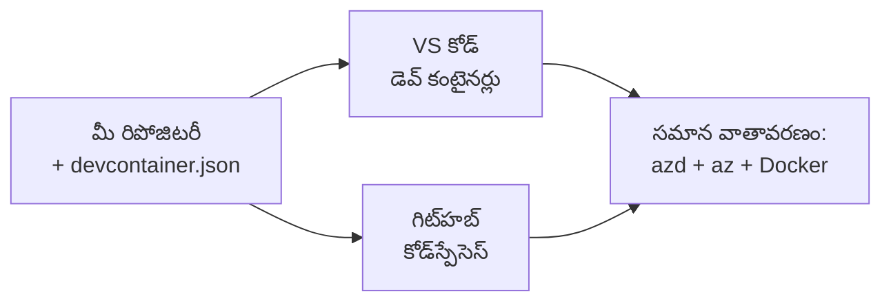

# Dev Containers & GitHub Codespaces azd కోసం

**Chapter Navigation:**
- **📚 Course Home**: [AZD ప్రారంభికులకు](../../README.md)
- **📖 Current Chapter**: అధ్యాయం 1 - మౌలికం & త్వరిత ప్రారంభం
- **⬅️ Previous**: [మీ స్వంత యాప్ తీసుకురావండి](bring-your-own-app.md)
- **🚀 Next Chapter**: [అధ్యాయం 2: AI-ముందస్తు అభివృద్ధి](../chapter-02-ai-development/README.md)

> జూన్ 2026లో `azd 1.25.6` తో ధృవీకరించబడింది.

## పరిచయం

ప్రతి యంత్రంపై azd, సరైన భాషా రన్‌టైమ్, Docker, మరియు Azure CLI ను ఇన్‌స్టాల్ చేయడం ఒక శ్రమాస్పద పని—and ఇది "నా మెషీన్‌లో పనిచేస్తుంది" అనడం వలన మరొకరికీ ట్యుటోరియల్ ఎందుకు పని చేయదు అనే ప్రధాన కారణం. ఒక **డెవ్ కంటైనర్** మీ మొత్తం టూల్‌చైన్‌ను ఒక ఫైల్‌లో వివరించడం ద్వారా దీనిని పరిష్కరిస్తుంది. ఎవరు ప్రాజెక్ట్‌ను VS Code లేదా GitHub Codespacesలో ఓపెన్ చేసినా వారికి ఒకదానితో ఒకటి సరిపోయే వాతావరణం లభిస్తుంది, azd ఇప్పటికే ఇన్స్టాల్ చేయబడి ఉంటుంది. ఈ పాఠం మీరు ఒక డెవ్ కంటైనర్ ఎలా జోడించాలో చూపిస్తుంది.

## నేర్చుకునే లక్ష్యాలు

ఈ పాఠం ముగిసినప్పుడు, మీరు:
- డెవ్ కంటైనర్ అంటే ఏమిటి మరియు అది azdకి ఎలా సహాయపడుతుందో అర్థం చేసుకుంటారు
- ప్రాజెక్ట్‌కు కనిష్ట `.devcontainer/devcontainer.json`‌ను జోడిస్తారు
- Dev Container *features* ద్వారా azd, Azure CLI, మరియు Docker ను చేర్చారు
- ప్రాజెక్ట్‌ను GitHub Codespaces లేదా VS Codeలో తెరిచి పరిస్థితిని ప్రారంభిస్తారు

## నేర్చిన తర్వాత మీరు చేయగలవు:

- azd ప్రాజెక్ట్ కోసం `devcontainer.json` ని రచించగలరు
- చేతితో ఇన్స్టాల్ చేయాల్సిన అవసరం లేకుండా azd మరియు Azure టూలింగ్‌ను జోడించగలరు
- కంటైనర్ లేదా Codespace లోనుండి `azd up` నడిపించగలరు

---

## డెవ్ కంటైనర్ అంటే ఏమిటి?

డెవ్ కంటైనర్ అనేది మీ రిపోలోని `.devcontainer/devcontainer.json` ఫైల్ ద్వారా నిర్వచించబడే Docker-ఆధారిత డెవలప్‌‌మెంట్ వాతావరణం. మీరు ప్రాజెక్ట్‌ను తెరవగానే:

- **VS Code** (Dev Containers ఎక్స్‌టెన్షన్‌తో) కంటైనర్‌ను బిల్డ్ చేసి దానికి అనుసంధానిస్తుంది.
- **GitHub Codespaces** అదే కంటైనర్‌ను క్లౌడ్‌లో బిల్డ్ చేసి మీకు బ్రౌజర్-ఆధారిత ఎడిటర్‌ను ఇస్తుంది.

ఏ మార్గమైనా, ప్రతి కాంట్రిబ్యూటర్‌కు ఒకే టూల్స్ లభిస్తాయి—"మీరు azd ఇన్స్టాల్ చేశారా?" వంటి ట్రబుల్షూటింగ్ అవసరం ఉండదు.



---

## దశ 1: devcontainer ఫైల్‌ను సృష్టించడం

మీ ప్రాజెక్ట్ యొక్క రూట్‌లో `.devcontainer/devcontainer.json` సృష్టించండి:

```json
{
  "name": "azd-project",
  "image": "mcr.microsoft.com/devcontainers/base:bookworm",
  "features": {
    "ghcr.io/devcontainers/features/azure-cli:1": {},
    "ghcr.io/azure/azure-dev/azd:latest": {},
    "ghcr.io/devcontainers/features/docker-in-docker:2": {},
    "ghcr.io/devcontainers/features/node:1": {}
  },
  "customizations": {
    "vscode": {
      "extensions": [
        "ms-azuretools.azure-dev",
        "ms-azuretools.vscode-bicep"
      ]
    }
  },
  "forwardPorts": [3000],
  "postCreateCommand": "azd version"
}
```

What each part does:

| Key | Purpose |
|-----|---------|
| `image` | కంటైనర్‌కు బేస్ OS |
| `features` | ప్రీబిల్ట్ ఇన్‌స్టాలర్లు—ఇక్కడ: Azure CLI, **azd**, Docker, మరియు Node.js |
| `customizations.vscode.extensions` | azd మరియు Bicep VS Code ఎక్స్‌టెన్షનલను ఆటోగా ఇన్స్టాల్ చేస్తుంది |
| `forwardPorts` | మీ యాప్ పోర్ట్‌ను బ్రౌజర్‌కు ప్రదర్శిస్తుంది |
| `postCreateCommand` | కంటైనర్ బిల్డ్ అయిన తర్వాత ఒకసారి నడుస్తుంది (ఇక్కడ, సాధారణ తనిఖీ) |

> `ghcr.io/azure/azure-dev/azd:latest` ఫీచర్ కంటైనర్‌లో azd పొందడానికి అధికారిక మార్గం. పునరావృతత్వం అవసరమైతే ఒక నిర్దిష్ట వెర్షన్‌ను పిన్ చేయండి (ఉదాహరణకు `azd:1.25.6`).

---

## దశ 2: ఫీచర్‌ను మీ యాప్ భాషకు సరిపడేటలా మార్చండి

మీ యాప్ ఉపయోగించే దానికి అనుగుణంగా `node` ఫీచర్‌ను మార్చండి:

```jsonc
// Python project
"ghcr.io/devcontainers/features/python:1": {},

// .NET project
"ghcr.io/devcontainers/features/dotnet:2": {},

// Java project
"ghcr.io/devcontainers/features/java:1": {},

// Go project
"ghcr.io/devcontainers/features/go:1": {}
```

మీ `host` `containerapp`, `aks`, లేదా కంటైనర్ ఇమేజ్‌ను బిల్డ్ చేసే ఏదైనా అయితే `docker-in-docker` ను ఉంచండి—azd కు ఇమేజ్‌లను బిల్డ్ చేసి పుష్ చేయడానికి Docker అవసరం.

---

## దశ 3: దీన్ని తెరవండి

**VS Code లో:**
1. **Dev Containers** ఎక్స్‌టెన్షన్‌ను ఇన్స్టాల్ చేయండి.
2. ప్రాజెక్ట్ ఫోల్డర్‌ను తెరవండి.
3. ప్రశ్న వచ్చినప్పుడు **Reopen in Container** క్లిక్ చేయండి (లేదా *Dev Containers: Reopen in Container* నడపండి).

**GitHub Codespaces లో:**
1. రిపోను GitHub‌కు పుష్ చేయండి.
2. **Code → Codespaces → Create codespace on main** క్లిక్ చేయండి.
3. కంటైనర్ బిల్డ్ అయ్యే వరకు వేచి ఉండండి—azd టెర్మినల్‌లో సిద్ధంగా ఉంటుంది.

---

## దశ 4: కంటైనర్ లోనుండి డిప్లాయ్ చేయండి

కంటైనర్‌లో azd ముందే ఇన్స్టాల్ చేయబడి ఉంటుంది, కాబట్టి సాధారణ వర్క్‌ఫ్లో సాధారణంగా పనిచేస్తుంది:

```bash
azd auth login --use-device-code   # Codespacesలో డివైస్ కోడ్ చాలా ఉపయోగకరంగా ఉంటుంది
azd up
```

> **ఎందుకు `--use-device-code`?** రిమోట్ కంటైనర్ లేదా Codespace లో స్థానిక బ్రౌజర్ లేకపోవడం వల్ల రీడైరెక్ట్ చేయలేవు, అందుకే device-code లాగిన్ విశ్వసనీయ మార్గం. సైన్-ఇన్ పూర్తి చేయడానికి మీరు ఒక కోడ్‌ను బ్రౌజర్ టాబ్‌లో పేస్ట్ చేయవచ్చు.

---

## సాధారణ సమస్యలు

| సమస్య | పరిష్కారం |
|---------|-----|
| `azd up` ఇమేజ్ బిల్డ్ చేయలేకపోతుంది | `docker-in-docker` ఫీచర్‌ను జోడించండి |
| Codespacesలో బ్రౌజర్ లాగిన్ నిలిచిపోవడం | `azd auth login --use-device-code` ను ఉపయోగించండి |
| టీమ్ సభ్యుల మధ్య టూల్స్ తేడా | ఫీచర్ వెర్షన్లను పిన్ చేయండి (ఉదా. `azd:1.25.6`) |
| యాప్ బ్రౌజర్‌లో అందుబాటులో లేదు | `forwardPorts`లో పోర్ట్‌ను జోడించండి |

---

## సారాంశం

- ఒక డెవ్ కంటైనర్ మీ azd టూల్‌చైన్‌ను ప్రతి ఒక్కరి కోసం పునరుత్పాదకంగా చేస్తుంది.
- Dev Container *features* ద్వారా azd, Azure CLI, మరియు Docker ను జోడించండి.
- మీ యాప్‌కు భాషా ఫీచర్‌ను సరిపడేలా ఎంచుకోండి మరియు container హోస్ట్స్ కోసం `docker-in-docker` ఉంచండి.
- Codespaces లో నడుపుతున్నప్పుడు device-code లాగిన్‌ను ఉపయోగించండి.

---

## 🔗 నావిగేషన్

| దిశ | వనరు |
|-----------|----------|
| **మునుపటి** | [మీ స్వంత యాప్ తీసుకురావండి](bring-your-own-app.md) |
| **Chapter Home** | [అధ్యాయం 1: మౌలికం & త్వరిత ప్రారంభం](README.md) |
| **Next Chapter** | [అధ్యాయం 2: AI-ముందస్తు అభివృద్ధి](../chapter-02-ai-development/README.md) |

## 📖 సంబంధిత వనరులు

- [ఇన్‌స్టాలేషన్ & సెటప్](installation.md)
- [కమాండ్ చీట్ షీట్](../../resources/cheat-sheet.md)
- [అధికారిక Dev Containers స్పెసిఫికేషన్](https://containers.dev/)
- [azd Dev Container ఫీచర్](https://github.com/Azure/azure-dev/tree/main/ext/devcontainer)

---

<!-- CO-OP TRANSLATOR DISCLAIMER START -->
**అస్వీకరణ**:
ఈ పత్రం AI అనువాద సేవ [Co-op Translator](https://github.com/Azure/co-op-translator) ఉపయోగించి అనువదించబడింది. మేము ఖచ్చితత్వానికి ప్రయత్నిస్తున్నప్పటికీ, ఆటోమేటెడ్ అనువాదాలు తప్పులు లేదా అసమగ్రతలను కలిగి ఉండవచ్చు. దాని స్వదేశ భాషలో ఉన్న అసలు పత్రాన్ని అధికారం కలిగిన మూలంగా పరిగణించాలి. కీలకమైన సమాచారం కోసం, ప్రొఫెషనల్ మానవ అనువాదాన్ని సిఫారసు చేస్తాము. ఈ అనువాదం ఉపయోగం వల్ల కలిగే ఏవైనా అపార్థాలు లేదా తప్పుదారులు కోసం మేము బాధ్యత వహించము.
<!-- CO-OP TRANSLATOR DISCLAIMER END -->