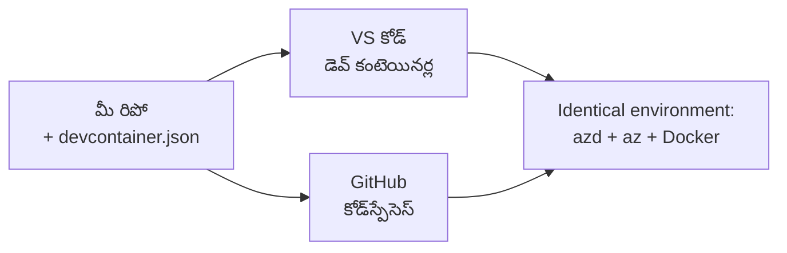

# azd కోసం Dev Containers & GitHub Codespaces

**అధ్యాయ నావిగేషన్:**
- **📚 కోర్సు హోమ్**: [AZD For Beginners](../../README.md)
- **📖 ప్రస్తుత అధ్యాయం**: అధ్యాయం 1 - ఫౌండేషన్ & త్వరిత ప్రారంభం
- **⬅️ קודם**: [మీ స్వంత యాప్ తీసుకెళ్లండి](bring-your-own-app.md)
- **🚀 తదుపరి అధ్యాయం**: [అధ్యాయం 2: AI-ఫస్ట్ అభివృద్ధి](../chapter-02-ai-development/README.md)

> `azd 1.27.1` తో జులై 2026 లో ధృవీకరించబడింది.

## పరిచయం

ప్రతి మెషీన్‌లో azd, సరైన భాషా రన్‌టైమ్, Docker, మరియు Azure CLIని ఇన్స్టాల్ చేయడం ఓ జాప్యం మరియు "నా మెషీన్‌లో పని చేస్తుంది" అనే ట్యుటోరియల్ మరలా ఇంకోరి కోసం పనిచేయకపోవడానికి అత్యంత ముఖ్య కారణం. ఒక **dev container** దీన్ని మీ మొత్తం టూల్‌చైన్‌ను ఒక ఫైల్లో వివరించడం ద్వారా సరళం చేస్తుంది. ప్రాజెక్ట్‌ను VS Code లేదా GitHub Codespacesలో ఎవరు ఓపెన్ చేయవచ్చో వారు కేవలం అదే వాతావరణాన్ని పొందుతారు, ఇందులో azd ఇప్పటికే ఇన్స్టాల్ అయి ఉంటుంది. ఈ పాఠం మీరు ఎలా ఒక dev container జోడించాలో చూపిస్తుంది.

## నేర్చుకునే లక్ష్యాలు

ఈ పాఠం ముగింపు నాటికి, మీరు:
- dev container అంటే ఏమిటి మరియు azdతో ఎందుకు సహాయపడుతుందో అర్థం చేసుకుంటారు
- ప్రాజెక్ట్‌కు కనీస `.devcontainer/devcontainer.json` ను జోడిస్తారు
- Dev Container *ఫీచర్స్* ద్వారా azd, Azure CLI, మరియు Dockerని కలుపుకుంటారు
- ప్రాజెక్ట్‌ను GitHub Codespaces లేదా VS Codeలో తెరిచేందుకు ప్రభావవంతంగా పనిచేస్తారు

## నేర్చుకున్న ఫలితాలు

ఈ పాఠం పూర్తి చేసిన తరువాత, మీరు చేయగలరు:
- azd ప్రాజెక్ట్ కోసం `devcontainer.json` రచించడం
- మాన్యువల్ ఇన్స్టాల్లు లేకుండా azd మరియు Azure టూలింగ్ జోడించగలగడం
- కంటైనర్ లేదా Codespace నుండి `azd up` ని నడపడం

---

## Dev Container అంటే ఏమిటి?

dev container అనేది Docker ఆధారిత అభివృద్ధి వాతావరణం, ఇది మీ రిపాజిటరీలో ఉన్న `.devcontainer/devcontainer.json` ఫైల్ ద్వారా నిర్వచించబడుతుంది. మీరు ప్రాజెక్ట్‌ ని తెరిచినప్పుడు:

- **VS Code** (Dev Containers ఎక్స్‌టెన్షన్‌తో) కంటైనర్‌ని నిర్మించి దానికి అనుసంధానమవుతుంది.
- **GitHub Codespaces** అదే కంటైనర్‌ను క్లౌడ్‌లో నిర్మించి బ్రౌజర్ ఆధారిత ఎడిటర్‌ను ఇస్తుంది.

ఏ విధంగా అయినా, ప్రతి కాంట్రిబ్యూటర్‌కి అదే టూల్స్ అందుతాయి—"మీరు azd ఇన్స్టాల్ చేసినారా?" అనే ట్రబుల్షూటింగ్ అవసరం లేదు.



---

## దశ 1: devcontainer ఫైల్ సృష్టించండి

మీ ప్రాజెక్ట్ రూట్‌లో `.devcontainer/devcontainer.json`ని సృష్టించండి:

```json
{
  "name": "azd-project",
  "image": "mcr.microsoft.com/devcontainers/base:bookworm",
  "features": {
    "ghcr.io/devcontainers/features/azure-cli:1": {},
    "ghcr.io/azure/azure-dev/azd:latest": {},
    "ghcr.io/devcontainers/features/docker-in-docker:2": {},
    "ghcr.io/devcontainers/features/node:1": {}
  },
  "customizations": {
    "vscode": {
      "extensions": [
        "ms-azuretools.azure-dev",
        "ms-azuretools.vscode-bicep"
      ]
    }
  },
  "forwardPorts": [3000],
  "postCreateCommand": "azd version"
}
```

ఒక్కొ భాగం ఏమి చేస్తుందో:

| కీలకం | ప్రయోజనం |
|-----|---------|
| `image` | కంటైనర్‌కి బేస్ OS |
| `features` | ముందుగా నిర్మించిన ఇన్‌స్టాలర్లు—ఇక్కడ: Azure CLI, **azd**, Docker, మరియు Node.js |
| `customizations.vscode.extensions` | azd మరియు Bicep VS Code ఎక్స్‌టెన్షన్స్ ఆటో ఇన్స్టాల్ చేస్తుంది |
| `forwardPorts` | మీ యాప్ యొక్క పోర్ట్ను బ్రౌజర్‌కి ఎక్స్‌పోజ్ చేస్తుంది |
| `postCreateCommand` | కంటైనర్ నిర్మాణం తర్వాత ఒకసారి నడిపించే కమాండ్ (ఇక్కడ, sanity చెక్) |

> `ghcr.io/azure/azure-dev/azd:latest` ఫీచర్ మెరుగైన విధానం ద్వారా కంటైనర్‌లో azd పొందడం. మీరు పునరుత్పత్తి అవసరం అయితే ఒక ప్రత్యేక వెర్షన్ (ఉదాహరణకు `azd:1.27.1`) ని పిన్ చేయండి.

---

## దశ 2: మీ యాప్ భాషకు సరిపోయే ఫీచర్‌ని ఎంచుకోండి

మీ యాప్ ఉపయోగించే భాష కోసం `node` ఫీచర్‌ను మార్చండి:

```jsonc
// Python project
"ghcr.io/devcontainers/features/python:1": {},

// .NET project
"ghcr.io/devcontainers/features/dotnet:2": {},

// Java project
"ghcr.io/devcontainers/features/java:1": {},

// Go project
"ghcr.io/devcontainers/features/go:1": {}
```

మీ `host` `containerapp`, `aks`, లేదా కంటైనర్ ఇమేజ్ నిర్మించేందుకు ఏదైనా అయితే `docker-in-docker` వినియోగం కొనసాగించండి—azd కు Docker అవసరం ఇమేజ్‌లను బిల్డ్ చేసి పుష్ చేయడానికి.

---

## దశ 3: దాన్ని ఓపెన్ చేయండి

**VS Codeలో:**
1. **Dev Containers** ఎక్స్‌టెన్షన్‌ను ఇన్స్టాల్ చేసుకోండి.
2. ప్రాజెక్ట్ ఫోల్డర్‌ని ఓపెన్ చేయండి.
3. అడిగినప్పుడు **Reopen in Container** పై క్లిక్ చేయండి (లేదా *Dev Containers: Reopen in Container* కమాండ్‌ను నడపండి).

**GitHub Codespacesలో:**
1. మీ రిపోని GitHubకి పుష్ చేయండి.
2. క్లిక్ చేయండి **Code → Codespaces → Create codespace on main**.
3. కంటైనర్ కట్టవ్వాలని వేచి ఉండండి—azd టర్మినల్‌లో రెడీ అయింది.

---

## దశ 4: కంటైనర్‌లో నుండి డిప్లాయ్ చేయండి

కంటైనర్‌లో azd ముందుగానే ఇన్స్టాల్ అయిఉన్నందున, సాధారణ వర్క్ఫ్లో పనిచేస్తుంది:

```bash
azd auth login --use-device-code   # డివైస్ కోడ్ కోడ్స్‌పేసెస్‌లో ఉపయోగకరంగా ఉంటుంది
azd up
```

> **--use-device-code ఎందుకు?** రిమోట్ కంటైనర్ లేదా Codespaceలో స్థానిక బ్రౌజర్ లేరు కనుక device-code లాగిన్ నమ్మదగ్గ మార్గం. మీరు సైన్-ఇన్ పూర్తి చేయడానికి ఒక కోడ్‌ను బ్రౌజర్ ట్యాబ్‌లో పేస్ట్ చేస్తారు.

---

## సాధారణ జాగ్రత్తలు

| జాగ్రత్త | పరిష్కారం |
|---------|-----|
| `azd up` ఇమేజ్ కట్టలేకపోవడం | `docker-in-docker` ఫీచర్‌ను జత చేయండి |
| బ్రౌజర్ లాగిన్ Codespacesలో ఆగిపోవడం | `azd auth login --use-device-code` ఉపయోగించండి |
| టూల్స్ టీమ్ సభ్యుల మధ్య తేడా | ఫీచర్ వెర్షన్లు (ఉదా. `azd:1.27.1`) పిన్ చేయండి |
| యాప్ బ్రౌజర్‌లో చేరుకోలేకపోవడం | `forwardPorts`లో పోర్ట్‌ను జోడించండి |

---

## సారాంశం

- dev container మీ azd టూల్‌చైన్‌ను అందరికీ పునరుత్పత్తి చేయదగిన విధంగా చేస్తుంది.
- Dev Container *ఫీచర్స్* ద్వారా azd, Azure CLI, మరియు Dockerని జోడించండి.
- మీ యాప్ భాష ఫీచర్‌కు సరిపోతే మరియు కంటైనర్ హోస్ట్‌ల కోసం `docker-in-docker`ను ఉంచండి.
- Codespacesలో నడిచేప్పుడు device-code లాగిన్ ఉపయోగించండి.

---

## 🔗 నావిగేషన్

| దిశ | వనరు |
|-----------|----------|
| **עבר** | [మీ స్వంత యాప్ తీసుకెళ్లండి](bring-your-own-app.md) |
| **అధ్యాయం హోమ్** | [అధ్యాయం 1: ఫౌండేషన్ & త్వరిత ప్రారంభం](README.md) |
| **తదుపరి అధ్యాయం** | [అధ్యాయం 2: AI-ఫస్ట్ అభివృద్ధి](../chapter-02-ai-development/README.md) |

## 📖 సంబంధించి వనరులు

- [ఇన్స్టాలేషన్ & సెటప్](installation.md)
- [కమాండ్ చీట్ షీట్](../../resources/cheat-sheet.md)
- [అధికార Dev Containers స్పెసిఫికేషన్](https://containers.dev/)
- [azd Dev Container ఫీచర్](https://github.com/Azure/azure-dev/tree/main/ext/devcontainer)

---

<!-- CO-OP TRANSLATOR DISCLAIMER START -->
**అస్వీకరణ**:
ఈ పత్రం AI అనువాద సేవ [Co-op Translator](https://github.com/Azure/co-op-translator) ఉపయోగించి అనువదించబడింది. మేము ఖచ్చితత్వానికి ప్రయత్నిస్తున్నప్పటికీ, ఆటోమేటెడ్ అనువాదాలు తప్పులు లేదా అసమగ్రతలను కలిగి ఉండవచ్చు. దాని స్వదేశ భాషలో ఉన్న అసలు పత్రాన్ని అధికారం కలిగిన మూలంగా పరిగణించాలి. కీలకమైన సమాచారం కోసం, ప్రొఫెషనల్ మానవ అనువాదాన్ని సిఫారసు చేస్తాము. ఈ అనువాదం ఉపయోగం వల్ల కలిగే ఏవైనా అపార్థాలు లేదా తప్పుదారులు కోసం మేము బాధ్యత వహించము.
<!-- CO-OP TRANSLATOR DISCLAIMER END -->