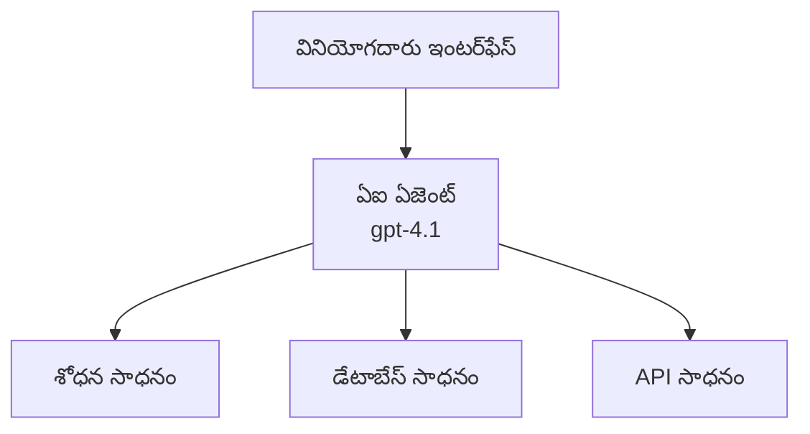
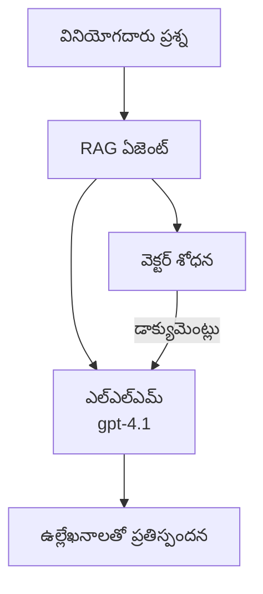
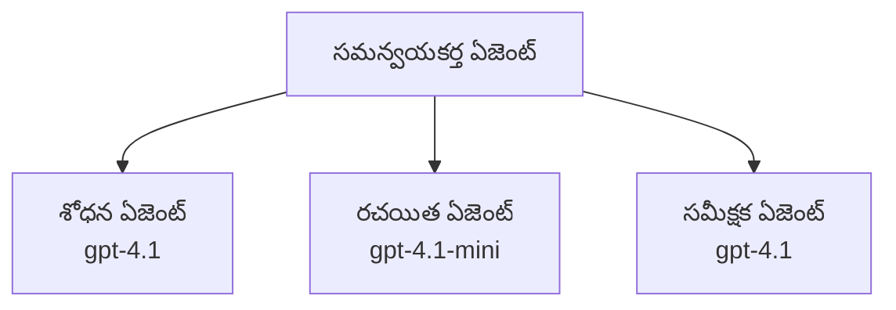

# Azure Developer CLI తో AI ఏజెంట్లు

**అధ్యాయం నావిగేషన్:**
- **📚 కోర్సు హోమ్**: [AZD ప్రారంభకులకు](../../README.md)
- **📖 ప్రస్తుత అధ్యాయం**: అధ్యాయం 2 - AI-ఫస్ట్ అభివృద్ధి
- **⬅️ మునుపటి**: [Microsoft Foundry సమన్వయం](microsoft-foundry-integration.md)
- **➡️ తర్వాత**: [AI మోడల్ డిప్లయ్‌మెంట్](ai-model-deployment.md)
- **🚀 అధునాతన**: [బహుఏజెంట్ పరిష్కారాలు](../../examples/retail-scenario.md)

---

## పరిచయం

AI ఏజెంట్లు తాము చుట్టుపక్కల ఉన్న వాతావరణాన్ని గ్రహించగల, నిర్ణయాలు తీసుకోవగల, మరియు నిర్దిష్ట లక్ష్యాలను సాధించడానికి చర్యలు చేపట్టగల స్వతంత్ర ప్రోగ్రాములు. ప్రాంప్ట్‌లకు మాత్రమే స్పందించే సాదారణ చాట్‌బాట్లతో పోలిస్తే, ఏజెంట్లు చేయగలవు:

- **ఉపకరణాలు ఉపయోగించగలవు** - APIs కాల్ చేయడం, డేటాబేస్‌లను శోధించడం, కోడ్‌ను అమలు చేయడం
- **నిర్ణయాలు మరియు యోజన సమర్థత** - కఠిన పనులను దశలుగా విభజించడం
- **సందర్భం నుండి నేర్చుకోవడం** - మెమరీ నిల్వచేసుకొని ప్రవర్తనను అనుకూలీకరించడం
- **సహకారం** - ఇతర ఏజెంట్లతో (బహుఏజెంట్ సిస్టమ్స్) కలిసి పని చేయడం

ఈ గైడ్ Azure Developer CLI (azd) ఉపయోగించి Azure పై AI ఏజెంట్లను ఎలా డిప్లాయ్ చేయాలో చూపిస్తుంది.

> **సత్యాపన నోటు (2026-03-25):** ఈ గైడ్‌ను `azd` `1.23.12` మరియు `azure.ai.agents` `0.1.18-preview` తో సమీక్షించారు. `azd ai` అనుభవం ఇంకా ప్రివ్యూ-ఆధారితంగా ఉంది, కాబట్టి మీ ఇన్‌స్టాల్ చేసిన ఫ్లాగ్స్ భిన్నంగా ఉంటే ఎక్స్‌టెన్షన్ సహాయం తనిఖీ చేయండి.

## నేర్చుకునే లక్ష్యాలు

ఈ గైడ్ పూర్తిచేశాక, మీరు చేయగలుగుతారు:
- AI ఏజెంట్లు ఏమిటి మరియు అవి చాట్‌బాట్లతో ఎలా భిన్నంగా ఉంటాయో అర్ధం చేసుకోవడం
- AZD ఉపయోగించి ముందుగా తయారుచేసిన AI ఏజెంట్ టెంప్లేట్స్‌ను డిప్లాయ్ చేయడం
- కస్టమ్ ఏజెంట్ల కోసం Foundry ఏజెంట్లను కాన్ఫిగర్ చేయడం
- ప్రాథమిక ఏజెంట్ పద్ధతులను అమలు చేయడం (టూల్ వాడకం, RAG, బహుఏజెంట్)
- డిప్లాయ్ చేసిన ఏజెంట్లను మానిటర్ చేయడం మరియు డీబగ్ చేయడం

## నేర్చుకున్న ఫలితాలు

పూర్తి చేసిన తరువాత, మీరు చేయగలుగుతారు:
- ఒక ఆదేశంతో Azureకి AI ఏజెంట్ అప్లికేషన్లను డిప్లాయ్ చేయగలుగుతారు
- ఏజెంట్ టూల్స్ మరియు సామర్థ్యాల్ని కాన్ఫిగర్ చేయగలుగుతారు
- ఏజెంట్లతో రిట్రీవల్-ఆగ్మెంటెడ్ జనరేషన్ (RAG) అమలు చేయగలుగుతారు
- కాంప్లెక్స్ వర్క్‌ఫ్లోల కోసం బహుఏజెంట్ ఆర్కిటెక్చర్లను డిజైన్ చేయగలుగుతారు
- సాధారణ ఏజెంట్ డిప్లాయ్‌మెంట్ సమస్యలను పరిష్కరించగలుగుతారు

---

## 🤖 ఏజెంట్ మరియు చాట్‌బాట్‌కు మధ్య తేడా ఏమిటి?

| ఫీచర్ | చాట్‌బాట్ | AI ఏజెంట్ |
|---------|---------|----------|
| **ప్రవర్తన** | ప్రాంప్ట్‌లకు స్పందిస్తుంది | స్వతంత్ర చర్యలు తీసుకుంటుంది |
| **ఉపకరణాలు** | లేవు | APIలు కాల్ చేయగలదు, శోధించగలదు, కోడ్ అమలు చేయగదు |
| **మెమరీ** | కేవలం సెషన్ ఆధారితము | సెషన్లకు పైన స్థిరమైన మెమరీ |
| **యోజన** | ఒక్కటి ప్రత్యుత్తరము | బహుళ-దశ తర్కన |
| **సహకారం** | ఒకే ఎంటిటీ | ఇతర ఏజెంట్లతో కలిసి పని చేయగలదు |

### సరళమైన ఉపమానం

- **చాట్‌బాట్** = ఒక సమాచార డెస్క్‌లో ప్రశ్నలకు సమాధానమిచ్చే సహాయకుడు
- **AI ఏజెంట్** = మీ కోసం ఫోన్లు చేయగలిగే, అపాయింట్‌మెంట్‌లను బుక్ చేయగలిగే మరియు పనులను పూర్తిచేయగల వ్యక్తిగత సహాయకుడు

---

## 🚀 త్వరిత ప్రారంభం: మీ మొదటి ఏజెంట్‌ను డిప్లాయ్ చేయండి

### ఎంపిక 1: Foundry Agents టెంప్లేట్ (సిఫార్సు చేయబడింది)

```bash
# AI ఏజెంట్స్ టెంప్లేట్‌ను ప్రారంభించండి
azd init --template get-started-with-ai-agents

# Azureలో అమలు చేయండి
azd up
```

**ఏవికీ డిప్లాయ్ అవుతాయి:**
- ✅ Foundry Agents
- ✅ Microsoft Foundry Models (gpt-4.1)
- ✅ Azure AI Search (RAG కోసం)
- ✅ Azure Container Apps (వెబ్ ఇంటర్ఫేస్)
- ✅ Application Insights (మానిటరింగ్)

**సమయం:** ~15-20 నిమిషాలు
**ఖర్చు:** ~ $100-150/నెల (డెవలప్‌మెంట్)

### ఎంపిక 2: Prompty తో OpenAI ఏజెంట్

```bash
# Prompty ఆధారిత ఏజెంట్ టెంప్లేట్‌ను ప్రారంభించండి
azd init --template agent-openai-python-prompty

# Azureలో అమలు చేయండి
azd up
```

**ఏవికీ డిప్లాయ్ అవుతాయి:**
- ✅ Azure Functions (సర్వర్‌లెస్ ఏజెంట్ అమలు)
- ✅ Microsoft Foundry Models
- ✅ Prompty కాన్ఫిగరేషన్ ఫైళ్లు
- ✅ నమూనా ఏజెంట్ అమలు

**సమయం:** ~10-15 నిమిషాలు
**ఖర్చు:** ~ $50-100/నెల (డెవలప్‌మెంట్)

### ఎంపిక 3: RAG చాట్ ఏజెంట్

```bash
# RAG చాట్ టెంప్లేట్‌ను ప్రారంభించండి
azd init --template azure-search-openai-demo

# Azureకి డిప్లాయ్ చేయండి
azd up
```

**ఏవికీ డిప్లాయ్ అవుతాయి:**
- ✅ Microsoft Foundry Models
- ✅ Azure AI Search నమూనా డేటాతో
- ✅ డాక్యుమెంట్ ప్రాసెస్సింగ్ పైప్‌లైన్
- ✅ ఉల్లేఖనాలతో చాట్ ఇంటర్ఫేస్

**సమయం:** ~15-25 నిమిషాలు
**ఖర్చు:** ~ $80-150/నెల (డెవలప్‌మెంట్)

### ఎంపిక 4: AZD AI Agent Init (మానిఫెస్ట్ లేదా టెంప్లేట్-ఆధారిత ప్రివ్యూ)

మీ దగ్గర ఏజెంట్ మానిఫెస్ట్ ఫైల్ ఉంటే, మీరు `azd ai` కమాండ్ ఉపయోగించి Foundry Agent Service ప్రాజెక్ట్‌ను నేరుగా స్కాల్లోఫ్ చేయవచ్చు. తాజా ప్రివ్యూ విడుదలలు టెంప్లెట్-ఆధారిత ప్రారంభ మద్దతును కూడా కలపడం వల్ల, మీ ఇన్‌స్టాల్ చేసిన ఎక్స్‌టెన్షన్ వర్షన్ ఆధారంగా నిర్దిష్ట ప్రాంప్ట్ ఫ్లో కొంత భిన్నంగా ఉండవచ్చు.

```bash
# AI ఏజెంట్స్ విస్తరణను ఇన్స్టాల్ చేయండి
azd extension install azure.ai.agents

# ఐచ్ఛికం: ఇన్‌స్టాల్ చేసిన ప్రివ్యూ వెర్షన్‌ను నిర్ధారించండి
azd extension show azure.ai.agents

# ఏజెంట్ మానిఫెస్ట్ నుండి ప్రారంభించండి
azd ai agent init -m agent-manifest.yaml

# Azure కు డిప్లాయ్ చేయండి
azd up
```

**ఎప్పుడు `azd ai agent init` వాడాలి vs `azd init --template`:**

| రీతీ | ఉత్తమ వాడుక | ఇది ఎలా పని చేస్తుంది |
|----------|----------|------|
| `azd init --template` | పని చేస్తున్న నమూనా యాప్ నుండి ప్రారంభించడానికి | కోడ్ + ఇన్ఫ్రా కలిగిన పూర్తి టెంప్లేట్ రిపోను క్లోన్ చేస్తుంది |
| `azd ai agent init -m` | మీ స్వంత ఏజెంట్ మానిఫెస్ట్ నుంచి నిర్మించడానికి | మీ ఏజెంట్ నిర్వచనం ఆధారంగా ప్రాజెక్టు నిర్మాణాన్ని స్కాఫోల్డ్ చేస్తుంది |

> **సూచన:** నేర్చుకునేటప్పుడు `azd init --template` ను వాడండి (పైన Options 1-3). మీ స్వంత మానిఫెస్ట్లతో ప్రొడక్షన్ ఏజెంట్లను నిర్మిస్తున్నప్పుడు `azd ai agent init` ను వాడండి. పూర్తి సూచనకు [AZD AI CLI ఆదేశాలు](../chapter-08-production/production-ai-practices.md#azd-ai-cli-commands-and-extensions) చూడండి.

---

## 🏗️ ఏజెంట్ ఆర్కిటెక్చర్ ప్యాటర్న్స్

### ప్యాటర్న్ 1: టూల్స్ ఉన్న ఒకే ఏజెంట్

అత్యంత సరళమైన ఏజెంట్ ప్యాటర్న్ - ఒకే ఏజెంట్, ఇది బహుళ టూల్స్ ఉపయోగించగలదు.


**ఉత్తమంగా:**
- కస్టమర్ సపోర్ట్ బాట్స్
- పరిశోధనా అసిస్టెంట్లు
- డేటా విశ్లేషణ ఏజెంట్లు

**AZD టెంప్లేట్:** `azure-search-openai-demo`

### ప్యాటర్న్ 2: RAG ఏజెంట్ (Retrieval-Augmented Generation)

స్పందనలు రూపొందించే ముందు సంబంధిత డాక్యుమెంట్లను రిట్రీవ్ చేసే ఏజెంట్.


**ఉత్తమంగా:**
- ఎంటర్‌ప్రైజ్ జ్ఞాన బేస్‌లు
- డాక్యుమెంట్ Q&A సిస్టమ్స్
- కంప్లయన్స్ మరియు లీగల్ రీసెర్చ్

**AZD టెంప్లేట్:** `azure-search-openai-demo`

### ప్యాటర్న్ 3: బహుఏజెంట్ సిస్టమ్

కంప్లెక్స్ పనులపై కలిసి పని చేసే నిశ్చిత నిపుణులతో ఎన్నో ఏజెంట్లు.


**ఉత్తమంగా:**
- సంక్లిష్ట కంటెంట్ జనరేషన్
- బహుళ-దశ వర్క్‌ఫ్లోలు
- వేర్వేరు నైపుణ్యాలను అవసరమయ్యే పనులు

**ఇంకా తెలుసుకోండి:** [బహుఏజెంట్ సమన్వయ ప్యాటర్న్లు](../chapter-06-pre-deployment/coordination-patterns.md)

---

## ⚙️ ఏజెంట్ టూల్‌లని కాన్ఫిగర్ చేయడం

ఏజెంట్లు టూల్స్ ఉపయోగించగలిగితే శక్తివంతంగా ఉంటాయి. ఇక్కడ సాధారణ టూల్స్‌ను ఎలా కాన్ఫిగర్ చేయాలో ఉంది:

### Foundry Agents లో టూల్ కాన్ఫిగరేషన్

```python
# agent_config.py
from azure.ai.projects import AIProjectClient
from azure.ai.projects.models import FunctionTool, CodeInterpreterTool

# అనుకూల పరికరాలను నిర్వచించండి
search_tool = FunctionTool(
    name="search_knowledge_base",
    description="Search the company knowledge base for relevant documents",
    parameters={
        "type": "object",
        "properties": {
            "query": {
                "type": "string",
                "description": "The search query"
            }
        },
        "required": ["query"]
    }
)

# పరికరాలతో ఏజెంట్‌ను సృష్టించండి
agent = project_client.agents.create_agent(
    model="gpt-4.1",
    name="Support Agent",
    instructions="You are a helpful support agent. Use the search tool to find relevant information.",
    tools=[search_tool, CodeInterpreterTool()]
)
```

### ఎన్విరాన్‌మెంట్ కాన్ఫిగరేషన్

```bash
# ఏజెంట్‌కు ప్రత్యేకమైన పర్యావరణ వేరియబుల్స్‌ను సెటప్ చేయండి
azd env set AZURE_OPENAI_MODEL "gpt-4.1"
azd env set AGENT_INSTRUCTIONS "You are a helpful assistant..."
azd env set ENABLE_CODE_INTERPRETER "true"
azd env set ENABLE_FILE_SEARCH "true"

# నవీకరించిన కాన్ఫిగరేషన్‌తో అమర్చండి
azd deploy
```

---

## 📊 ఏజెంట్ల మానిటరింగ్

### Application Insights సమగ్రత

అన్ని AZD ఏజెంట్ టెంప్లేట్లు మానిటరింగ్ కోసం Application Insights ను కలిగి ఉంటాయి:

```bash
# మానిటరింగ్ డాష్‌బోర్డు తెరవండి
azd monitor --overview

# సజీవ లాగ్‌లను వీక్షించండి
azd monitor --logs

# సజీవ మెట్రిక్స్‌ను వీక్షించండి
azd monitor --live
```

### ట్రాక్ చేయాల్సిన కీలక మెట్రిక్స్

| మెట్రిక్ | వివరణ | లక్ష్యం |
|--------|-------------|--------|
| Response Latency | ప్రతిస్పందన రూపొందించడానికి సమయం | < 5 సెకన్లు |
| Token Usage | ప్రతి అభ్యర్థనకు టోకెన్లు | ఖర్చు కోసం పర్యవేక్షించండి |
| Tool Call Success Rate | విజయవంతమైన టూల్ అమలుల శాతం | > 95% |
| Error Rate | విఫలమైన ఏజెంట్ అభ్యర్థనలు | < 1% |
| User Satisfaction | ఫీడ్బ్యాక్ స్కోర్లు | > 4.0/5.0 |

### ఏజెంట్‌ల కోసం కస్టమ్ లాగ్‌లింగ్

```python
import os
from azure.monitor.opentelemetry import configure_azure_monitor
from opentelemetry import trace

# OpenTelemetry తో Azure Monitor‌ని కాన్ఫిగర్ చేయండి
configure_azure_monitor(
    connection_string=os.environ["APPLICATIONINSIGHTS_CONNECTION_STRING"]
)

tracer = trace.get_tracer(__name__)

def log_agent_interaction(user_query, agent_response, tools_used, latency_ms):
    with tracer.start_as_current_span("agent_interaction") as span:
        span.set_attributes({
            "user_query": user_query,
            "response_length": len(agent_response),
            "tools_used": tools_used,
            "latency_ms": latency_ms
        })
```

> **గమనిక:** కావలసిన ప్యాకేజీలు ఇన్‌స్టాల్ చేయండి: `pip install azure-monitor-opentelemetry opentelemetry`

---

## 💰 ఖర్చు పరగణనలు

### ప్యాటర్న్ వారీగా అంచనా నెలవారీ ఖర్చులు

| ప్యాటర్న్ | డెవ్ ఎన్విరాన్‌మెంట్ | ప్రొడక్షన్ |
|---------|-----------------|------------|
| Single Agent | $50-100 | $200-500 |
| RAG Agent | $80-150 | $300-800 |
| Multi-Agent (2-3 agents) | $150-300 | $500-1,500 |
| Enterprise Multi-Agent | $300-500 | $1,500-5,000+ |

### ఖర్చు ఆప్టిమైజేషన్ సూచనలు

1. **సాధారణ పనుల కోసం gpt-4.1-mini వాడండి**
   ```bash
   azd env set AZURE_OPENAI_MODEL "gpt-4.1-mini"
   ```

2. **పునరావృత ప్రశ్నల కోసం క్యాషింగ్ అమలు చేయండి**
   ```python
   from functools import lru_cache
   
   @lru_cache(maxsize=1000)
   def get_cached_response(query_hash):
       return agent.run(query_hash)
   ```

3. **ప్రతి రన్‌కు టోకెన్ పరిమితులు సెట్ చేయండి**
   ```python
   # ఏజెంట్‌ను నడిపేటప్పుడు max_completion_tokens ను సెట్ చేయండి, సృష్టిస్తున్నప్పుడు కాదు
   run = project_client.agents.create_run(
       thread_id=thread.id,
       agent_id=agent.id,
       max_completion_tokens=1000  # స్పందన పొడవును పరిమితం చేయండి
   )
   ```

4. **వాడకంలో లేకపోయే సమయంలో స్కేల్-టు-జీరో అనుసంధానం చేయండి**
   ```bash
   # Container Apps స్వయంచాలకంగా శూన్యానికి స్కేల్ అవుతాయి
   azd env set MIN_REPLICAS "0"
   ```

---

## 🔧 ఏజెంట్ల ట్రబుల్‌షూటింగ్

### సాధారణ సమస్యలు మరియు పరిష్కారాలు

<details>
<summary><strong>❌ ఏజెంట్ టూల్ కాల్స్‌కు స్పందించడం లేదు</strong></summary>

```bash
# సాధనాలు సరిగ్గా నమోదు అయ్యాయా అని తనిఖీ చేయండి
azd show

# OpenAI డిప్లాయ్‌మెంట్‌ను ధృవీకరించండి
az cognitiveservices account deployment list \
  --name $AZURE_OPENAI_NAME \
  --resource-group $RG_NAME

# ఏజెంట్ లాగ్‌లను తనిఖీ చేయండి
azd monitor --logs
```

**సాధారణ కారణాలు:**
- టూల్ ఫంక్షన్ సిగ్నేచర్ విభేదం
- కావాల్సిన అనుమతులు లేవు
- API ఎండ్‌పాయింట్ యాక్సెస్ అయ్యే విధంగా లేదు
</details>

<details>
<summary><strong>❌ ఏజెంట్ స్పందనల్లో అధిక లేటెన్సీ</strong></summary>

```bash
# బాటిల్‌నెక్‌ల కోసం Application Insightsని తనిఖీ చేయండి
azd monitor --live

# వేగవంతమైన మోడల్ ఉపయోగించడాన్ని పరిగణించండి
azd env set AZURE_OPENAI_MODEL "gpt-4.1-mini"
azd deploy
```

**ఆప్టిమైజేషన్ సూచనలు:**
- స్ట్రీమింగ్ స్పందనలు ఉపయోగించండి
- ప్రతిస్పందన క్యాషింగ్ అమలు చేయండి
- కాంటెక్స్ట్ విండో పరిమాణాన్ని తగ్గించండి
</details>

<details>
<summary><strong>❌ ఏజెంట్ తప్పైన లేదా హాల్యూసినేటెడ్ సమాచారం ఇవ్వడం</strong></summary>

```python
# మంచి సిస్టమ్ సూచనలతో మెరుగుపరచండి
instructions = """
You are a helpful assistant. IMPORTANT:
- Only answer based on provided context
- If you don't know, say "I don't know"
- Always cite your sources
- Never make up information
"""

# గ్రౌండింగ్ కోసం రిట్రీవల్ జోడించండి
agent = project_client.agents.create_agent(
    model="gpt-4.1",
    instructions=instructions,
    tools=[FileSearchTool()]  # సమాధానాలను డాక్యుమెంట్లలో ఆధారపరచండి
)
```
</details>

<details>
<summary><strong>❌ టోకెన్ పరిమితి అధిగమించిన లోపాలు</strong></summary>

```python
# సందర్భ విండో నిర్వహణను అమలు చేయండి
def truncate_context(messages, max_tokens=8000, model="gpt-4.1"):
    """Keep only recent messages within token limit."""
    import tiktoken
    encoding = tiktoken.encoding_for_model(model)
    total_tokens = 0
    truncated = []
    
    for msg in reversed(messages):
        msg_tokens = len(encoding.encode(msg.content))
        if total_tokens + msg_tokens > max_tokens:
            break
        truncated.insert(0, msg)
        total_tokens += msg_tokens
    
    return truncated
```
</details>

---

## 🎓 హ్యాండ్స్-ఆన్ ఎక్సర్సైజ్‌లు

### ఎక్సర్సైజ్ 1: ఒక బేసిక్ ఏజెంట్ డిప్లాయ్ చేయండి (20 నిమిషాలు)

**లక్ష్యం:** AZD ఉపయోగించి మీ మొదటి AI ఏజెంట్‌ను డిప్లాయ్ చేయండి

```bash
# దశ 1: టెంప్లేటును ప్రారంభించండి
azd init --template get-started-with-ai-agents

# దశ 2: Azureలో లాగిన్ అవ్వండి
azd auth login
# మీరు టెనెంట్ల మధ్య పని చేస్తే, --tenant-id <tenant-id> జత చేయండి

# దశ 3: డిప్లాయ్ చేయండి
azd up

# దశ 4: ఏజెంట్‌ను పరీక్షించండి
# డిప్లాయ్‌మెంట్ తర్వాత ఆశించిన అవుట్‌పుట్:
#   డిప్లాయ్‌మెంట్ పూర్తయింది!
#   ఎండ్‌పాయింట్: https://<app-name>.<region>.azurecontainerapps.io
# అవుట్‌పుట్‌లో చూపబడిన URL ను తెరిచి ప్రశ్న అడిగి చూడండి

# దశ 5: మానిటరింగ్‌ను వీక్షించండి
azd monitor --overview

# దశ 6: వనరులను శుభ్రపరచండి
azd down --force --purge
```

**విజయం ప్రమాణాలు:**
- [ ] ఏజెంట్ ప్రశ్నలకు స్పందిస్తుంది
- [ ] `azd monitor` ద్వారా మానిటరింగ్ డాష్‌బోర్డ్ను యాక్సెస్ చేయగలదు
- [ ] రిసోర్సులు సఫలంగా క్లిన్-అప్ అయ్యాయి

### ఎక్సర్సైజ్ 2: ఒక కస్టమ్ టూల్ జోడించండి (30 నిమిషాలు)

**లక్ష్యం:** ఒక ఏజెంట్‌ను కస్టమ్ టూల్‌తో విస్తరించండి

1. ఏజెంట్ టెంప్లేట్‌ను డిప్లాయ్ చేయండి:
   ```bash
   azd init --template get-started-with-ai-agents
   azd up
   ```
2. మీ ఏజెంట్ కోడ్‌లో కొత్త టూల్ ఫంక్షన్ సృష్టించండి:
   ```python
   def get_weather(location: str) -> str:
       """Get current weather for a location."""
       # వాతావరణ సేవకు API కాల్
       return f"Weather in {location}: Sunny, 72°F"
   ```
3. ఆ టూల్‌ను ఏజెంట్‌లో రిజిస్టర్ చేయండి:
   ```python
   from azure.ai.projects.models import FunctionTool

   weather_tool = FunctionTool(
       name="get_weather",
       description="Get current weather for a location",
       parameters={
           "type": "object",
           "properties": {
               "location": {"type": "string", "description": "City name"}
           },
           "required": ["location"]
       }
   )

   agent = project_client.agents.create_agent(
       model="gpt-4.1",
       name="Weather Agent",
       tools=[weather_tool]
   )
   ```
4. రీడిప్లాయ్ చేసి పరీక్షించండి:
   ```bash
   azd deploy
   # ప్రశ్న: "సియాటిల్‌లో వాతావరణం ఎలా ఉంది?"
   # అనుకున్నది: ఏజెంట్ get_weather("Seattle") ను పిలిచి వాతావరణ సమాచారాన్ని తిరిగి ఇస్తుంది
   ```

**విజయం ప్రమాణాలు:**
- [ ] ఏజెంట్ వాతావరణ సంబంధమైన ప్రశ్నలను గుర్తిస్తుంది
- [ ] టూల్ సరిగా కాల్ అయ్యింది
- [ ] ప్రతిస్పందనలో వాతావరణ సమాచారముంది

### ఎక్సర్సైజ్ 3: RAG ఏజెంట్ నిర్మించండి (45 నిమిషాలు)

**లక్ష్యం:** మీ డాక్యుమెంట్ల నుంచి ప్రశ్నలకు సమాధానం ఇచ్చే ఏజెంట్ సృష్టించండి

```bash
# దశ 1: RAG టెంప్లేట్‌ను అమలు చేయండి
azd init --template azure-search-openai-demo
azd up

# దశ 2: మీ డాక్యుమెంట్లను అప్‌లోడ్ చేయండి
# PDF/TXT ఫైళ్లను data/ డైరెక్టరీలో ఉంచండి, తర్వాత రన్ చేయండి:
python scripts/prepdocs.py

# దశ 3: డొమైన్-స్పెసిఫిక్ ప్రశ్నలతో పరీక్షించండి
# azd up అవుట్‌పుట్‌లోని వెబ్ యాప్ URLని తెరవండి
# మీ అప్‌లోడ్ చేసిన డాక్యుమెంట్ల గురించి ప్రశ్నలు అడగండి
# స్పందనల్లో [doc.pdf] వంటి ఉల్లేఖన సూచనలు ఉండాలి
```

**విజయం ప్రమాణాలు:**
- [ ] ఏజెంట్ అప్‌లోడ్ చేసిన డాక్యుమెంట్ల నుంచి సమాధానం ఇస్తుంది
- [ ] స్పందనలు ఉల్లేఖనాలను కలిగి ఉంటాయి
- [ ] అవిధేయ ప్రశ్నలపైన హాల్యూసినేషన్ లేదు

---

## 📚 తదుపరి మెట్లు

ఇప్పుడు మీరు AI ఏజెంట్లు గురించి అర్థం చేసుకున్నారు, ఈ అధునాతన అంశాలను అన్వేషించండి:

| అంశం | వివరణ | లింక్ |
|-------|-------------|------|
| **బహుఏజెంట్ సిస్టమ్స్** | బహుళ సహకార ఏజెంట్లతో సిస్టమ్స్ నిర్మించండి | [Retail Multi-Agent Example](../../examples/retail-scenario.md) |
| **సమన్వయ ప్యాటర్న్లు** | ఆর্কెస్ట్రేషన్ మరియు కమ్యూనికేషన్ ప్యాటర్న్లు నేర్చుకోండి | [Coordination Patterns](../chapter-06-pre-deployment/coordination-patterns.md) |
| **ప్రొడక్షన్ డిప్లాయ్‌మెంట్** | ఎంటర్ప్రైజ్-రెడ్డి ఏజెంట్ డిప్లాయ్‌మెంట్ | [Production AI Practices](../chapter-08-production/production-ai-practices.md) |
| **ఏజెంట్ మూల్యాంకనం** | ఏజెంట్ పనితీరును పరీక్షించండి మరియు మూల్యాంకనం చేయండి | [AI Troubleshooting](../chapter-07-troubleshooting/ai-troubleshooting.md) |
| **AI వర్క్షాప్ లాబ్** | హ్యాండ్స్-ఆన్: మీ AI పరిష్కారాన్ని AZD-సిద్ధం చేయండి | [AI Workshop Lab](ai-workshop-lab.md) |

---

## 📖 అదనపు వనరులు

### అధికారిక డాక్యుమెంటేషన్
- [Azure AI Agent Service](https://learn.microsoft.com/azure/ai-services/agents/)
- [Azure AI Foundry Agent Service Quickstart](https://learn.microsoft.com/azure/ai-services/agents/quickstart)
- [Semantic Kernel Agent Framework](https://learn.microsoft.com/semantic-kernel/)

### ఏజెంట్ల కోసం AZD టెంప్లేట్లు
- [Get Started with AI Agents](https://github.com/Azure-Samples/get-started-with-ai-agents)
- [Agent OpenAI Python Prompty](https://github.com/Azure-Samples/agent-openai-python-prompty)
- [Azure Search OpenAI Demo](https://github.com/Azure-Samples/azure-search-openai-demo)

### కమ్యూనిటీ వనరులు
- [Awesome AZD - Agent Templates](https://azure.github.io/awesome-azd/?tags=ai-agents)
- [Azure AI Discord](https://discord.gg/microsoft-azure)
- [Microsoft Foundry Discord](https://discord.gg/nTYy5BXMWG)

### మీ ఎడిటర్ కోసం ఏజెంట్ స్కిల్స్
- [**Microsoft Azure Agent Skills**](https://skills.sh/microsoft/github-copilot-for-azure) - GitHub Copilot, Cursor, లేదా ఏదైనా మద్దతు కలిగిన ఏజెంట్ కోసం Azure అభివృద్ధికి పునర్వినియోగించగల AI ఏజెంట్ స్కిల్స్ ఇన్‌స్టాల్ చేయండి. ఇందులో [Azure AI](https://skills.sh/microsoft/github-copilot-for-azure/azure-ai), [Microsoft Foundry](https://skills.sh/microsoft/github-copilot-for-azure/microsoft-foundry), [deployment](https://skills.sh/microsoft/github-copilot-for-azure/azure-deploy), మరియు [diagnostics](https://skills.sh/microsoft/github-copilot-for-azure/azure-diagnostics) కోసం స్కిల్స్ ఉన్నాయి:
  ```bash
  npx skills add microsoft/github-copilot-for-azure
  ```

---

**నావిగేషన్**
- **మునుపటి పాఠం**: [Microsoft Foundry సమన్వయం](microsoft-foundry-integration.md)
- **తరువాత పాఠం**: [AI మోడల్ డిప్లయ్‌మెంట్](ai-model-deployment.md)

---

<!-- CO-OP TRANSLATOR DISCLAIMER START -->
**Disclaimer**:
ఈ డాక్యుమెంట్‌ను AI అనువాద సేవ [Co-op Translator](https://github.com/Azure/co-op-translator) ఉపయోగించి అనువదించబడింది. మేము ఖచ్చితత్వానికి ప్రయత్నించినప్పటికీ, ఆటోమేటిక్ అనువాదాల్లో తప్పులు లేదా లోపాలు ఉండే అవకాశం ఉంది అని దయచేసి గమనించండి. మూల డాక్యుమెంట్‌ను దాని స్వదేశ భాషలో ఉన్నది అధికారిక మూలంగా పరిగణించడం ఉత్తమం. కీలక సమాచారం కోసం ప్రొఫెషనల్ మానవ అనువాదాన్ని సూచిస్తాం. ఈ అనువాదం వాడటంతో ఏర్పడిన ఏవైనా అపార్థాలు లేదా తప్పుగా అర్థం చేసుకోవడాల కోసం మేము బాధ్యులు కావు.
<!-- CO-OP TRANSLATOR DISCLAIMER END -->