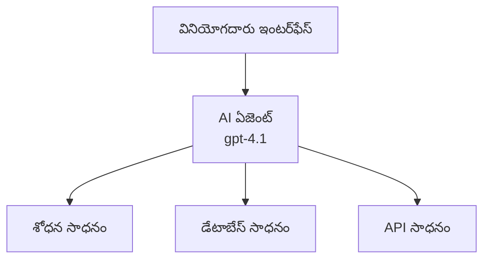
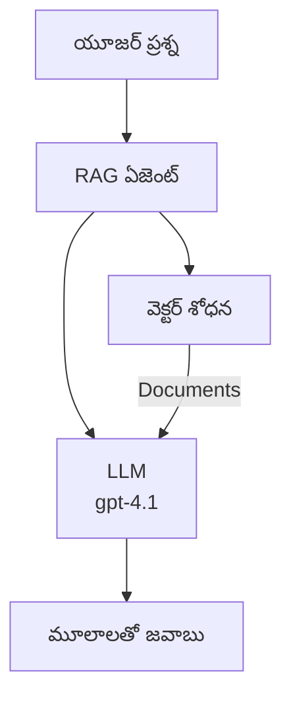
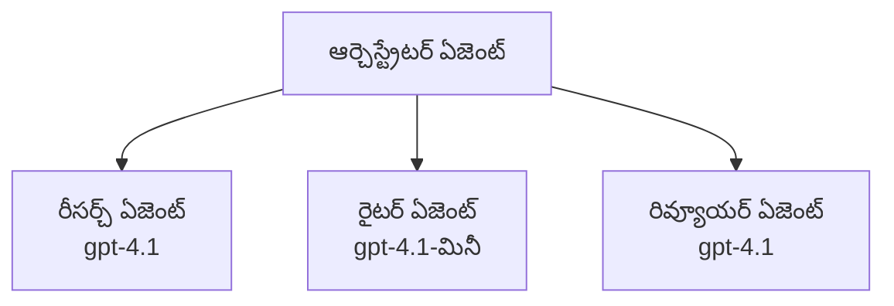

# Azure Developer CLI తో AI ఏజెంట్లు

**అధ్యాయం నావిగేషన్:**
- **📚 కోర్సు హోమ్**: [AZD మొదటిదారులకు](../../README.md)
- **📖 ప్రస్తుత అధ్యాయం**: అధ్యాయం 2 - AI-ఫస్ట్ డెవలప్‌మెంట్
- **⬅️ మునుపటి**: [Microsoft Foundry ఇంటిగ్రేషన్](microsoft-foundry-integration.md)
- **➡️ తదుపరి**: [AI మోడల్ డిప్లాయ్‌మెంట్](ai-model-deployment.md)
- **🚀 అధునాతన**: [మల్టీ-ఏజెంట్ సొల్యూషన్స్](../../examples/retail-scenario.md)

---

## పరిచయం

AI ఏజెంట్లు స్వతంత్ర ప్రోగ్రామ్లు, ఇవి తమ పరిసరాలను గ్రహించి, నిర్ణయాలు తీసుకుని, నిర్దిష్ట లక్ష్యాలను సాధించడానికి చర్యలు తీసగలవు. ప్రాంప్ట్‌లకు ప్రతిస్పందించే సాధారణ చాట్‌బాట్లకు భిన్నంగా, ఏజెంట్లు:

- **పరికరాలను ఉపయోగించగలవు** - APIs కాల్ చేయడం, డేటాబేస్‌లను శోధించడం, కో드를 అమలు చేయడం
- **పథకాలు తయారు చేసి, తర్కం చేయగలవు** - సంక్లిష్ట పనులను దశలుగా విభజించడం
- **పరిస్థితుల నుండి నేర్చుకోగలవు** - స్మృతి నిలుపుతూ ప్రవర్తనను అనుకూలపరచడం
- **సహకారం చేయగలవు** - ఇతర ఏజెంట్లతో కలిసి పని చేయడం (మల్టీ-ఏజెంట్ వ్యవస్థలు)

ఈ మార్గదర్శకము Azure Developer CLI (azd) ఉపయోగించి AI ఏజెంట్లను Azureలో ఎలా డిప్లాయ్ చేయాలనే చూపిస్తుంది.

> **నిర్ధారణ గమనిక (2026-07-13):** ఈ మార్గదర్శకము `azd` `1.27.1` మరియు `azure.ai.agents` `1.0.0-beta.5` ఆధారంగా సమీక్షించబడింది. `azd ai` అనుభవం ఇంకా ప్రివ్యూ ఆధారితంగా ఉంది కాబట్టి, మీ ఇన్‌స్టాల్ చేసిన ఫ్లాగ్లు వేరుగా ఉంటే ఎక్స్‌టెన్షన్ సహాయం చూడండి.

## నేర్చుకునే లక్ష్యాలు

ఈ మార్గదర్శకము పూర్తి చేసి మీరు:
- AI ఏజెంట్లు ఏమిటి మరియు అవి చాట్‌బాట్లతో ఎలా భిన్నంగా ఉంటాయో అర్థం చేసుకుంటారు
- AZD ఉపయోగించి ముందుగానే తయారైన AI ఏజెంట్ టెంప్లేట్లను డిప్లాయ్ చేస్తారు
- Foundry ఏజెంట్లను అనుకూల ఏజెంట్లకు ఎలా కాన్ఫిగర్ చేయాలో తెలుసుకుంటారు
- ప్రాథమిక ఏజెంట్ నమూనాలను అమలుచేస్తారు (పరికర వినియోగం, RAG, మల్టీ-ఏజెంట్)
- డిప్లాయ్ చేసిన ఏజెంట్లని పర్యవేక్షించి డీబగ్ చేయగలుగుతారు

## నేర్చిన ఫలితాలు

పూర్తి చేసిన తరువాత, మీరు చేయగలుగుతారు:
- ఒకే కమాండ్‌తో Azureకు AI ఏజెంట్ అప్లికేషన్లను డిప్లాయ్ చేయడం
- ఏజెంట్ పరికరాలు మరియు సామర్థ్యాలను కాన్ఫిగర్ చేయడం
- ఏజెంట్లతో Retrieval-Augmented Generation (RAG) అమలు
- సంక్లిష్ట వర్క్‌ఫ్లోల కోసం మల్టీ-ఏజెంట్ ఆర్కిటెక్చర్ల రూపకల్పన
- సాధారణ ఏజెంట్ డిప్లాయ్‌మెంట్ ఇబ్బందులను పరిష్కరించడం

---

## 🤖 ఏజెంట్‌ను చాట్‌బాట్ నుండి ప్రత్యేకం చేసే లక్షణాలు ఏమిటి?

| లక్షణం | చాట్‌బాట్ | AI ఏజెంట్ |
|---------|----------|----------|
| **ప్రవర్తన** | ప్రాంప్ట్‌లకు ప్రతిస్పందిస్తుంది | స్వతంత్ర చర్యలు తీసుకుంటుంది |
| **పరికరాలు** | ఏవీ లేవు | APIs కాల్ చేయగలదు, శోధించగలదు, కోడ్ అమలు చేయగలదు |
| **స్మృతి** | సెషన్-ఆధారితమే | సెషన్ల వారీగా స్థిరమైన స్మృతి ఉంది |
| **పథకం** | ఒక్కసారిగా ప్రతిస్పందన | బహుళ దశల తర్కం |
| **సహకారం** | ఒక్క వ్యక్తి | ఇతర ఏజెంట్లతో పని చేయగలదు |

### సాదాసీదా రూపకం

- **చాట్‌బాట్** = సమాచార డెస్క్‌లో ప్రశ్నలకు సమాధానం చెప్పే సహాయక వ్యక్తి
- **AI ఏజెంట్** = మీ కోసం కాల్స్ చేయగల, అపాయింట్‌మెంట్లు బుక్ చేసే, పనులు పూర్తి చేసే వ్యక్తిగత సహాయకుడు

---

## 🚀 త్వరిత ప్రారంభం: మీ మొదటి ఏజెంట్‌ను డిప్లాయ్ చేయండి

### ఎంపిక 1: Foundry ఏజెంట్లు టెంప్లెట్ (సిఫార్సు చేయబడింది)

```bash
# AI ఏజెంట్ల టెంప్లేట్ ప్రారంభించండి
azd init --template get-started-with-ai-agents

# Azure కు పంపండి
azd up
```

**ఏంటి డిప్లాయ్ అవుతుంది:**
- ✅ Foundry ఏజెంట్లు
- ✅ Microsoft Foundry మోడల్స్ (gpt-4.1)
- ✅ Azure AI Search (RAG కోసం)
- ✅ Azure కంటైనర్ అప్స్ (వెబ్ ఇంటర్‌ఫేస్)
- ✅ అప్లికేషన్ ఇన్‌సైట్స్ (పర్యవేక్షణ)

**సమయం:** సుమారు 15-20 నిమిషాలు
**ఖర్చు:** నెలకు సుమారు $100-150 (డెవలప్‌మెంట్)

### ఎంపిక 2: OpenAI ఏజెంట్ Prompty తో

```bash
# Prompty ఆధారిత ఏజెంట్ టెంప్లేట్‌ను ప్రారంభించండి
azd init --template agent-openai-python-prompty

# Azure కి నియోజకవర్గం చేయండి
azd up
```

**ఏంటి డిప్లాయ్ అవుతుంది:**
- ✅ Azure Functions (సర్వర్లెస్ ఏజెంట్ అమలు)
- ✅ Microsoft Foundry మోడల్స్
- ✅ Prompty కాన్ఫిగరేషన్ ఫైళ్ళు
- ✅ నమూనా ఏజెంట్ అమలు

**సమయం:** సుమారు 10-15 నిమిషాలు
**ఖర్చు:** నెలకు సుమారు $50-100 (డెవలప్‌మెంట్)

### ఎంపిక 3: RAG చాట్ ఏజెంట్

```bash
# RAG చాట్ టెంప్లేట్ ప్రారంభించండి
azd init --template azure-search-openai-demo

# అజ్యూయర్‌కు నియంత్రణ అమర్చండి
azd up
```

**ఏంటి డిప్లాయ్ అవుతుంది:**
- ✅ Microsoft Foundry మోడల్స్
- ✅ Azure AI Search లో నమూనా డేటా తో
- ✅ డాక్యుమెంట్ ప్రాసెసింగ్ పైప్లైన్
- ✅ సూచనలతో చాట్ ఇంటర్‌ఫేస్

**సమయం:** సుమారు 15-25 నిమిషాలు
**ఖర్చు:** నెలకు సుమారు $80-150 (డెవలప్‌మెంట్)

### ఎంపిక 4: AZD AI ఏజెంట్ ఇనిట్ (మానిఫెస్ట్ లేదా టెంప్లేట్ ఆధారిత ప్రివ్యూ)

మీకు ఏజెంట్ మానిఫెస్ట్ ఫైల్ ఉంటే, మీరు `azd ai` కమాండ్ ఉపయోగించి నేరుగా Foundry ఏజెంట్ సర్వీస్ ప్రాజెక్ట్ రూపొందించవచ్చు. తాజా ప్రివ్యూ విడుదలలు టెంప్లేట్ ఆధారిత ఆరంభాన్ని కూడా జోడించాయి అందుచేత మీ ఇన్‌స్టాల్డ్ ఎక్స్‌టెన్షన్ వెర్షన్‌ను బట్టి సరిగ్గా ప్రాంప్ట్ ప్రవాహం కొంచెం తేడా ఉండొచ్చు.

```bash
# AI ఏజెంట్లు ఎక్స్‌టెన్షన్‌ని ఇన్‌స్టాల్ చేయండి
azd extension install azure.ai.agents

# ఐచ్ఛికం: ఇన్‌స్టాల్ చేయబడిన ప్రివ్యూ వెర్షన్‌ను ధృవీకరించండి
azd extension show azure.ai.agents

# ఒక ఏజెంట్ మానిఫెస్ట్ నుండి ప్రారంభించండి
azd ai agent init -m agent-manifest.yaml

# Azure కు అమర్చండి
azd up

# అమర్చిన ఏజెంట్‌ను పరీక్షించండి (లేటెన్సీ + మొదటి బైట్‌కు సమయం చూపుతుంది)
azd ai agent invoke
```

**`azd ai agent init` మరియు `azd init --template` ఎప్పుడు ఉపయోగించాలి:**

| విధానం | ఉత్తమం ఎవరికీ | ఇది ఎలా పనిచేస్తుంది |
|----------|--------------|-------------|
| `azd init --template` | పని చేసే నమూనా యాప్ నుండి ప్రారంభించేటప్పుడు | కోడ్ మరియు ఇన్‌ఫ్రాతో పూర్తి టెంప్లేట్ రిపోని క్లోన్ చేస్తుంది |
| `azd ai agent init -m` | మీ స్వంత ఏజెంట్ మానిఫెస్ట్‌తో నిర్మించేటప్పుడు | ఏజెంట్ నిర్వచనం నుండి ప్రాజెక్ట్ నిర్మాణాన్ని రూపొందిస్తుంది |

> **సూచన:** నేర్చుకునేటప్పుడు (పైన 1-3 ఎంపికలు) `azd init --template` ఉపయోగించండి. ఉత్పత్తి ఏజెంట్లు మీ స్వంత మానిఫెస్ట్‌లతో తయారుచేసేటప్పుడు `azd ai agent init` ఉపయోగించండి.

`azd up` అనంతరం, అదే ఎక్స్‌టెన్షన్ ఏజెంట్ జీవితచక్రం యొక్క మిగిలిన భాగాలను నిర్వహిస్తుంది: పరీక్షించేందుకు `azd ai agent invoke`, నాణ్యత కొలిచేందుకు మరియు మెరుగుచేసేందుకు `azd ai agent eval generate` మరియు `azd ai agent optimize`, మరియు శుభ్రపరచడానికి `azd ai agent delete`. పూర్తి సూచన కోసం చూడండి [AZD AI CLI Commands](../chapter-08-production/production-ai-practices.md#azd-ai-cli-commands-and-extensions).

---

## 🏗️ ఏజెంట్ ఆర్కిటెక్చర్ నమూనాలు

### నమూనా 1: పరికరాలతో ఒంటి ఏజెంట్

పిల్లగా సులభమైన ఏజెంట్ నమూనా - ఒక ఏజెంట్ ఒకటి కంటే ఎక్కువ పరికరాలను ఉపయోగించగలదు.



**ఉత్తమంగా ఉపయోగించడానికి:**
- కస్టమర్ సపోర్ట్ బోట్లు
- పరిశోధన సహాయకులు
- డేటా విశ్లేషణ ఏజెంట్లు

**AZD టెంప్లేట్:** `azure-search-openai-demo`

### నమూనా 2: RAG ఏజెంట్ (రిట్రీవల్-ఆగ్మెంటెడ్ జనరేషన్)

సంబంధిత డాక్యుమెంట్లను తీసుకొని ప్రతిస్పందనలు రూపొందించే ఏజెంట్.



**ఉత్తమంగా ఉపయోగించడానికి:**
- ఎంటర్‌ప్రైజ్ జ్ఞాన కేంద్రాలు
- డాక్యుమెంట్ ప్రశ్న-సమాధాన వ్యవస్థలు
- కంప్లయిన్స్ మరియు చట్ట పరిశోధన

**AZD టెంప్లేట్:** `azure-search-openai-demo`

### నమూనా 3: మల్టీ-ఏజెంట్ సిస్టమ్

సాంక్లిష్ట పనులపై కలిసి పని చేసే ఎన్నికిలోనో ప్రత్యేక ఏజెంట్లు.



**ఉత్తమంగా ఉపయోగించడానికి:**
- సంక్లిష్ట కంటెంట్ జనరేషన్
- బహుళ దశల వర్క్‌ఫ్లోలు
- వివిధ నైపుణ్యాలు అవసరమైన పనులు

**మరింత తెలుసుకోండి:** [మల్టీ-ఏజెంట్ సహకార నమూనాలు](../chapter-06-pre-deployment/coordination-patterns.md)

---

## ⚙️ ఏజెంట్ పరికరాల కాన్ఫిగరేషన్

ఏజెంట్లు పరికరాలను ఉపయోగించగలగడం వారి శక్తి. సాధారణ పరికరాలను ఎలా కాన్ఫిగర్ చేయాలో ఇది చూపిస్తుంది:

### Foundry ఏజెంట్లలో పరికరాల కాన్ఫిగరేషన్

```python
# agent_config.py
from azure.ai.projects import AIProjectClient
from azure.ai.projects.models import FunctionTool, CodeInterpreterTool

# కస్టమ్ టూల్స్‌ను నిర్వచించండి
search_tool = FunctionTool(
    name="search_knowledge_base",
    description="Search the company knowledge base for relevant documents",
    parameters={
        "type": "object",
        "properties": {
            "query": {
                "type": "string",
                "description": "The search query"
            }
        },
        "required": ["query"]
    }
)

# టూల్స్‌తో ఏజెంట్‌ని సృష్టించండి
agent = project_client.agents.create_agent(
    model="gpt-4.1",
    name="Support Agent",
    instructions="You are a helpful support agent. Use the search tool to find relevant information.",
    tools=[search_tool, CodeInterpreterTool()]
)
```

### పర్యావరణ కాన్ఫిగరేషన్

```bash
# ఏజెంట్-నిర్దిష్ట పరిసర మార్పిడులను సెట్ చేయండి
azd env set AZURE_OPENAI_MODEL "gpt-4.1"
azd env set AGENT_INSTRUCTIONS "You are a helpful assistant..."
azd env set ENABLE_CODE_INTERPRETER "true"
azd env set ENABLE_FILE_SEARCH "true"

# నవీకరించబడిన కాన్ఫిగరేషన్‌తో పంపిణీ చేయండి
azd deploy
```

---

## 📊 ఏజెంట్ల పర్యవేక్షణ

### అప్లికేషన్ ఇన్‌సైట్స్ ఇంటిగ్రేషన్

అన్ని AZD ఏజెంట్ టెంప్లేట్లు అప్లికేషన్ ఇన్‌సైట్స్ ద్వారా పర్యవేక్షణను కలిగి ఉంటాయి:

```bash
# మానిటరింగ్ డాష్‌బోర్డ్ తెరవండి
azd monitor --overview

# లైవ్ లాగ్స్ చూడండి
azd monitor --logs

# లైవ్ మెట్రిక్స్ చూడండి
azd monitor --live
```

### ట్రాక్ చేయాల్సిన ముఖ్యమైన మెట్రిక్స్

| మెట్రిక్ | వివరణ | లక్ష్యం |
|--------|---------|---------|
| ప్రతిస్పందన ఆలస్యం | ప్రతిస్పందన సృష్టించడానికి సమయం | 5 సెకన్లలో తక్కువ |
| టోకెన్ వినియోగం | ప్రతి అభ్యర్ధనకు టోకెన్లు | ఖర్చు కోసం పర్యవేక్షించండి |
| పరికరం కాల్ విజయం రేట్ | విజయవంతమైన పరికరం అమలుల % | > 95% |
| లోపాల రేట్ | వైఫల్యమైన ఏజెంట్ అభ్యర్థనలు | < 1% |
| వినియోగదారు సంతృప్తి | ఫీడ్బ్యాక్ స్కోర్లు | > 4.0/5.0 |

### ఏజెంట్ల కోసం అనుకూల లాగింగ్

```python
import os
from azure.monitor.opentelemetry import configure_azure_monitor
from opentelemetry import trace

# OpenTelemetry తో Azure Monitor ని అమర్చండి
configure_azure_monitor(
    connection_string=os.environ["APPLICATIONINSIGHTS_CONNECTION_STRING"]
)

tracer = trace.get_tracer(__name__)

def log_agent_interaction(user_query, agent_response, tools_used, latency_ms):
    with tracer.start_as_current_span("agent_interaction") as span:
        span.set_attributes({
            "user_query": user_query,
            "response_length": len(agent_response),
            "tools_used": tools_used,
            "latency_ms": latency_ms
        })
```

> **గమనిక:** అవసరమైన ప్యాకేజీలను ఇన్‌స్టాల్ చేయండి: `pip install azure-monitor-opentelemetry opentelemetry`

---

## 💰 ఖర్చు గమనికలు

### నమూనా వారీ వార్షిక ఖర్చుల అంచనా

| నమూనా | అభివృద్ధి వాతావరణం | ఉత్పత్తి |
|---------|---------------------|----------|
| ఒంటి ఏజెంట్ | $50-100 | $200-500 |
| RAG ఏజెంట్ | $80-150 | $300-800 |
| మల్టీ-ఏజెంట్ (2-3 ఏజెంట్లు) | $150-300 | $500-1,500 |
| ఎంటర్‌ప్రైజ్ మల్టీ-ఏజెంట్ | $300-500 | $1,500-5,000+ |

### ఖర్చు ఆప్టిమైజేషన్ సూచనలు

1. **సాధారణ పనుల కోసం gpt-4.1-mini ఉపయోగించండి**
   ```bash
   azd env set AZURE_OPENAI_MODEL "gpt-4.1-mini"
   ```

2. **పునరావృత ప్రశ్నల కోసం క్యాష్ అమలు చేయండి**
   ```python
   from functools import lru_cache
   
   @lru_cache(maxsize=1000)
   def get_cached_response(query_hash):
       return agent.run(query_hash)
   ```

3. **ప్రతి రన్‌కు టోకెన్ పరిమితులు పెట్టండి**
   ```python
   # ఏజెంట్‌ను నడిపేటప్పుడు max_completion_tokens ను సెట్ చేయండి, సృష్టి సమయంలో కాదు
   run = project_client.agents.create_run(
       thread_id=thread.id,
       agent_id=agent.id,
       max_completion_tokens=1000  # ప్రతిస్పందన పొడవును పరిమితం చేయండి
   )
   ```

4. **వాడకంలో లేనప్పుడు జీరోకు స్కేలింగ్ చేయండి**
   ```bash
   # కంటైనర్ యాప్స్ స్వయంచాలకంగా జీరోకు పెరుగుతాయి
   azd env set MIN_REPLICAS "0"
   ```

---

## 🔧 ఏజెంట్ల సమస్యలు పరిష్కరించడం

### సాధారణ ఇబ్బందులు మరియు పరిష్కారాలు

<details>
<summary><strong>❌ ఏజెంట్ పరికరం కాల్స్‌కు స్పందించడం లేద</strong></summary>

```bash
# టూల్స్ సరిగ్గా నమోదు అయాయా చూడు
azd show

# OpenAI డిప్లాయ్‌మెంట్‌ని ధృవీకరించండి
az cognitiveservices account deployment list \
  --name $AZURE_OPENAI_NAME \
  --resource-group $RG_NAME

# ఏజెంట్ లాగ్స్‌ని తనిఖీ చేయండి
azd monitor --logs
```

**సాధారణ కారణాలు:**
- పరికరం ఫంక్షన్ సంతకం పొరపాటు
- అవసరమైన అనుమతులు లేవు
- API ఎండ్‌పాయింట్ ప్రాప్యం లేదు
</details>

<details>
<summary><strong>❌ ఏజెంట్ ప్రతిస్పందనల్లో పెరిగిన ఆలస్యం</strong></summary>

```bash
# బాటిల్‌నెక్స్ కోసం అప్లికేషన్ ఇన్‌సైట్స్‌ను తనిఖీ చేయండి
azd monitor --live

# వేగవంతమైన మోడల్ ఉపయోగించడానికి పరిగణించండి
azd env set AZURE_OPENAI_MODEL "gpt-4.1-mini"
azd deploy
```

**ఆప్టిమైజేషన్ సూచనలు:**
- స్ట్రీమింగ్ ప్రతిస్పందనలు ఉపయోగించండి
- ప్రతిస్పందన క్యాషింగ్ అమలు చేయండి
- సందర్భ విండో పరిమాణాన్ని తగ్గించండి
</details>

<details>
<summary><strong>❌ ఏజెంట్ తప్పు లేదా కల్పిత సమాచారం ఇస్తుంది</strong></summary>

```python
# మెరుగైన సిస్టం ప్రాంప్ట్‌లతో మెరుగుపరచండి
instructions = """
You are a helpful assistant. IMPORTANT:
- Only answer based on provided context
- If you don't know, say "I don't know"
- Always cite your sources
- Never make up information
"""

# గ్రౌండింగ్ కోసం రిట్రీవల్‌ను జోడించండి
agent = project_client.agents.create_agent(
    model="gpt-4.1",
    instructions=instructions,
    tools=[FileSearchTool()]  # ప్రత్యుత్తరాలను డాక్యుమెంట్లలో గ్రౌండ్ చేయండి
)
```
</details>

<details>
<summary><strong>❌ టోకెన్ పరిమితి దాటిన లోపాలు</strong></summary>

```python
# సన్నివేశ విండో నిర్వహణను అమలు చేయండి
def truncate_context(messages, max_tokens=8000, model="gpt-4.1"):
    """Keep only recent messages within token limit."""
    import tiktoken
    encoding = tiktoken.encoding_for_model(model)
    total_tokens = 0
    truncated = []
    
    for msg in reversed(messages):
        msg_tokens = len(encoding.encode(msg.content))
        if total_tokens + msg_tokens > max_tokens:
            break
        truncated.insert(0, msg)
        total_tokens += msg_tokens
    
    return truncated
```
</details>

---

## 🎓 హ్యాండ్స్-ఆన్ వ్యాయామాలు

### వ్యాయామం 1: ప్రాథమిక ఏజెంట్‌ను డిప్లాయ్ చేయండి (20 నిమిషాలు)

**లక్ష్యం:** AZD ఉపయోగించి మీ మొదటి AI ఏజెంట్ డిప్లాయ్ చేయడం

```bash
# దశ 1: టెంప్లేట్‌ను ప్రారంభించండి
azd init --template get-started-with-ai-agents

# దశ 2: Azureలో లాగిన్ చేయండి
azd auth login
# మీరు టెనెంట్ల మధ్య పని చేస్తుంటే, --tenant-id <tenant-id> ను జోడించండి

# దశ 3: డిప్లాయ్ చేయండి
azd up

# దశ 4: ఏజెంట్‌ను పరీక్షించండి
# డిప్లాయ్‌మెంట్ తర్వాత అంచనా తీసుకున్న అవుట్పుట్:
#   డిప్లాయ్‌మెంట్ పూర్తైంది!
#   ఎండ్పాయింట్: https://<app-name>.<region>.azurecontainerapps.io
# అవుట్పుట్లో చూపించిన URLని తెరవండి మరియు ఒక ప్రశ్న అడగడానికి ప్రయత్నించండి

# దశ 5: మానిటరింగ్ చూడండి
azd monitor --overview

# దశ 6: శుభ్రపరచండి
azd down --force --purge
```

**విజయ ప్రమాణాలు:**
- [ ] ఏజెంట్ ప్రశ్నలకు స్పందిస్తుంది
- [ ] `azd monitor` ద్వారా పర్యవేక్షణ డాష్‌బోర్డును పొందగలుగుతుంది
- [ ] వనరులు సఫలంగా శుభ్రం చేయబడ్డాయి

### వ్యాయామం 2: అనుకూల పరికరం జోడించండి (30 నిమిషాలు)

**లక్ష్యం:** ఏజెంట్‌ను ఒక అనుకూల పరికరంతో విస్తరించండి

1. ఏజెంట్ టెంప్లేట్‌ను డిప్లాయ్ చేయండి:
   ```bash
   azd init --template get-started-with-ai-agents
   azd up
   ```
2. మీ ఏజెంట్ కోడ్‌లో కొత్త పరికరం ఫంక్షన్ క్రొత్తగా సృష్టించండి:
   ```python
   def get_weather(location: str) -> str:
       """Get current weather for a location."""
       # వాతావరణ సేవకు API కాల్
       return f"Weather in {location}: Sunny, 72°F"
   ```
3. ఏజెంట్‌తో పరికరాన్ని నమోదు చేయండి:
   ```python
   from azure.ai.projects.models import FunctionTool

   weather_tool = FunctionTool(
       name="get_weather",
       description="Get current weather for a location",
       parameters={
           "type": "object",
           "properties": {
               "location": {"type": "string", "description": "City name"}
           },
           "required": ["location"]
       }
   )

   agent = project_client.agents.create_agent(
       model="gpt-4.1",
       name="Weather Agent",
       tools=[weather_tool]
   )
   ```
4. మళ్లీ డిప్లాయ్ చేసి పరీక్షించండి:
   ```bash
   azd deploy
   # అడగండి: "సియాటిల్ లో వాతావరణం ఎలా ఉంది?"
   # ఊహించబడింది: ఏజెంట్ get_weather("సియాటిల్")ను పిలిచి వాతావరణ సమాచారాన్ని అందిస్తుంది
   ```

**విజయ ప్రమాణాలు:**
- [ ] ఏజెంట్ వాతావరణ సంబంధిత ప్రశ్నలను గుర్తిస్తుంది
- [ ] పరికరం సరిగా పిలవబడుతుంది
- [ ] ప్రతిస్పందన వాతావరణ సమాచారాన్ని కలిగి ఉంటుంది

### వ్యాయామం 3: RAG ఏజెంట్ సృష్టించండి (45 నిమిషాలు)

**లక్ష్యం:** మీ డాక్యుమెంట్ల నుండి ప్రశ్నలకు సమాధానాలను ఇచ్చే ఏஜెంట్‌ను సృష్టించండి

```bash
# దశ 1: RAG టెంప్లేట్‌ను విస్తరించండి
azd init --template azure-search-openai-demo
azd up

# దశ 2: మీ డాక్యూమెంట్స్‌ను అప్‌లోడ్ చేసుకోండి
# PDF/TXT ఫైళ్లను data/ డిరెక్టరీలో ఉంచి, తర్వాత ఈ కమాండ్ నడపండి:
python scripts/prepdocs.py

# దశ 3: డొమైన్-స్పెసిఫిక్ ప్రశ్నలతో పరీక్షించండి
# azd up అవుట్పుట్ నుండి వెబ్ యాప్ URL ని తెరవండి
# మీ అప్‌లోడ్ చేసిన డాక్యూమెంట్స్ గురించి ప్రశ్నలని అడగండి
# ప్రతిస్పందనలు [doc.pdf] వంటి సిటేషన్ రిఫరెన్సులను కలిగి ఉండాలి
```

**విజయ ప్రమాణాలు:**
- [ ] ఏజెంట్ అప్లోడ్ చేసిన డాక్యుమెంట్ల నుండి సమాధానాలు ఇస్తుంది
- [ ] ప్రతిస్పందనలు సూచనలతో ఉంటాయి
- [ ] పరిధి వెలుపల ప్రశ్నలపై కల్పిత సమాచారం లేదు

---

## 📚 తదుపరి చర్యలు

మీరు AI ఏజెంట్లను అర్థం చేసుకున్న తరువాత, ఈ అధునాతన విషయాలను పరిశీలించండి:

| విషయం | వివరణ | లింక్ |
|---------|---------|-------|
| **మల్టీ-ఏజెంట్ సిస్టమ్స్** | పలు సహకార ఏజెంట్లతో వ్యవస్థలను నిర్మించండి | [రిటైల్ మల్టీ-ఏజెంట్ ఉదాహరణ](../../examples/retail-scenario.md) |
| **సహకార నమూనాలు** | ఆర్కెస్ట్రేషన్ మరియు కమ్యూనికేషన్ నమూనాలను నేర్చుకోండి | [సహకార నమూనాలు](../chapter-06-pre-deployment/coordination-patterns.md) |
| **ఉత్పత్తి డిప్లాయ్‌మెంట్** | ఎంటర్‌ప్రైజ్-తయారైన ఏజెంట్ డిప్లాయ్‌మెంట్ | [ఉత్పత్తి AI ఆచరణలు](../chapter-08-production/production-ai-practices.md) |
| **ఏజెంట్ మూల్యాంకనం** | ఏజెంట్ పనితీరు పరీక్షించి మూల్యాంకనం చేయండి | [AI సమస్య పరిష్కారం](../chapter-07-troubleshooting/ai-troubleshooting.md) |
| **AI వర్క్‌షాప్ ల్యాబ్** | ప్రాక్టికల్: మీ AI పరిష్కారాన్ని AZD-కుటుంబం చేయండి | [AI వర్క్‌షాప్ ల్యాబ్](ai-workshop-lab.md) |

---

## 📖 అదనపు వనరులు

### అధికారిక డాక్యుమెంటేషన్
- [Microsoft Foundry Agent Service](https://learn.microsoft.com/azure/ai-services/agents/)
- [Microsoft Foundry Agent Service Quickstart](https://learn.microsoft.com/azure/ai-services/agents/quickstart)
- [Semantic Kernel Agent Framework](https://learn.microsoft.com/semantic-kernel/)

### ఏజెంట్ల కోసం AZD టెంప్లేట్లు
- [AI ఏజెంట్లతో ప్రారంభించండి](https://github.com/Azure-Samples/get-started-with-ai-agents)
- [Agent OpenAI Python Prompty](https://github.com/Azure-Samples/agent-openai-python-prompty)
- [Azure Search OpenAI డెమో](https://github.com/Azure-Samples/azure-search-openai-demo)

### కమ్యూనిటీ వనరులు
- [Awesome AZD - Agent Templates](https://azure.github.io/awesome-azd/?tags=ai-agents)
- [Azure AI Discord](https://discord.gg/microsoft-azure)
- [Microsoft Foundry Discord](https://discord.gg/nTYy5BXMWG)

### మీ ఎడిటర్ కోసం ఏజెంట్ నైపుణ్యాలు
- [**Microsoft Azure ఏజెంట్ నైపుణ్యాలు**](https://skills.sh/microsoft/github-copilot-for-azure) - GitHub Copilot, కర్సర్ లేదా ఏదైనా మద్దతు ఉన్న ఏజెంట్ కోసం Azure డెవలప్‌మెంట్ కోసం పునర్వినియోగించదగిన AI ఏజెంట్ నైపుణ్యాలను ఇన్‌స్టాల్ చేయండి. ఇందులో [Azure AI](https://skills.sh/microsoft/github-copilot-for-azure/azure-ai), [Microsoft Foundry](https://skills.sh/microsoft/github-copilot-for-azure/microsoft-foundry), [డిప్లాయ్‌మెంట్](https://skills.sh/microsoft/github-copilot-for-azure/azure-deploy), మరియు [డయాగ్నోస్టిక్స్](https://skills.sh/microsoft/github-copilot-for-azure/azure-diagnostics) నైపుణ్యాలు ఉన్నాయి:
  ```bash
  npx skills add microsoft/github-copilot-for-azure
  ```

---

**నావిగేషన్**
- **మునుపటి పాఠం**: [Microsoft Foundry ఇంటిగ్రేషన్](microsoft-foundry-integration.md)
- **తదుపరి పాఠం**: [AI మోడల్ డిప్లాయ్‌మెంట్](ai-model-deployment.md)

---

<!-- CO-OP TRANSLATOR DISCLAIMER START -->
**అస్వీకరణ**:
ఈ పత్రం AI అనువాద సేవ [Co-op Translator](https://github.com/Azure/co-op-translator) ఉపయోగించి అనువదించబడింది. మేము ఖచ్చితత్వానికి ప్రయత్నిస్తున్నప్పటికీ, ఆటోమేటెడ్ అనువాదాలు తప్పులు లేదా అసమగ్రతలను కలిగి ఉండవచ్చు. దాని స్వదేశ భాషలో ఉన్న అసలు పత్రాన్ని అధికారం కలిగిన మూలంగా పరిగణించాలి. కీలకమైన సమాచారం కోసం, ప్రొఫెషనల్ మానవ అనువాదాన్ని సిఫారసు చేస్తాము. ఈ అనువాదం ఉపయోగం వల్ల కలిగే ఏవైనా అపార్థాలు లేదా తప్పుదారులు కోసం మేము బాధ్యత వహించము.
<!-- CO-OP TRANSLATOR DISCLAIMER END -->