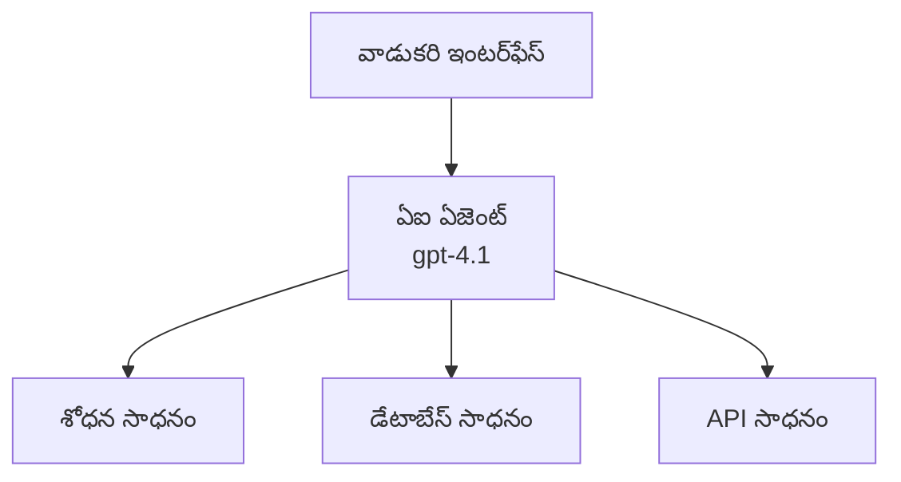
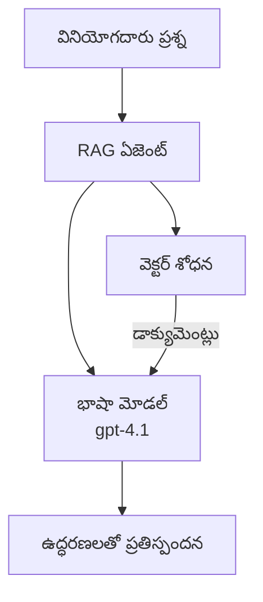
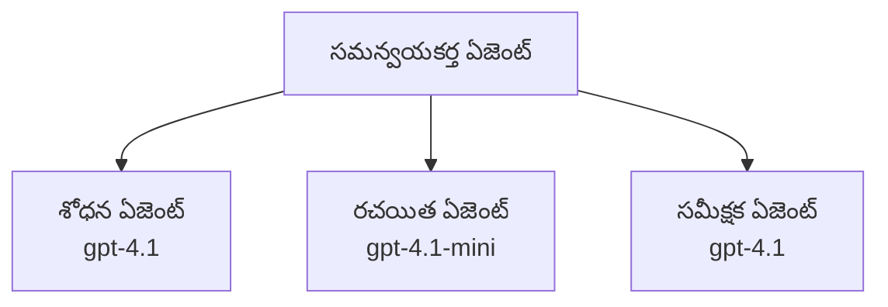

# Azure Developer CLIతో AI ఏజెంట్లు

**అధ్యాయం నావిగేషన్:**
- **📚 కోర్సు హోమ్**: [AZD For Beginners](../../README.md)
- **📖 ప్రస్తుత అధ్యాయం**: అధ్యాయం 2 - AI-ఫస్ట్ అభివృద్ధి
- **⬅️ మునుపటి**: [Microsoft Foundry ఇంటిగ్రేషన్](microsoft-foundry-integration.md)
- **➡️ తరువాతి**: [AI మోడల్ డిప్లాయ్‌మెంట్](ai-model-deployment.md)
- **🚀 అధునాతన**: [బహుఏజెంట్ పరిష్కారాలు](../../examples/retail-scenario.md)

---

## పరిచయం

AI ఏజెంట్లు స్వావలంభിയായ ప్రోగ్రామ్‌లు, వాటి పరిసరాలను గ్రహించగలవు, నిర్ణయాలు తీసుకోగలవు, మరియు నిర్దిష్ట లక్ష్యాలను సాధించడానికి చర్యలు తీసుకుంటాయి. ప్రాంప్ట్‌లకు ప్రతిచర్య only ఇచ్చే సాధారణ చాట్‌బాట్లతో భిన్నంగా, ఏజెంట్లు చేయగలవు:

- **పరికరాలను ఉపయోగించు** - APIs కాల్ చేయడం, డేటాబేసులను శోధించడం, కోడ్‌ను అమలు చేయడం
- **ప్లాన్ చేయడం మరియు తార్కికంగా ఆలోచించడం** - సంక్లిష్ట పనులను స్థాయిలుగా విభజించడం
- **సందర్భం నుండి నేర్చుకోవడం** - మెమరీని నిర్వహించడం మరియు ప్రవర్తనను అనుకూలం చేయడం
- **సహకారించడం** - ఇతర ఏజెంట్లతో పని చేయడం (బహుఏజెంట్ సిస్టమ్స్)

ఈ గైడ్ Azure Developer CLI (azd) ఉపయోగించి AI ఏజెంట్లను Azureకి ఎలా డిప్లాయ్ చేయాలో చూపిస్తుంది.

> **సమగ్రత గమనిక (2026-03-25):** ఈ గైడ్‌ను `azd` `1.23.12` మరియు `azure.ai.agents` `0.1.18-preview` ఆధారంగా సమీక్షించబడింది. `azd ai` అనుభవం ఇంకా ప్రివ్యూ-ఆధారితంగా ఉంది, కాబట్టి మీ ఇన్స్‌టాల్ చేసిన ఫ్లాగ్స్ వేరే ఉంటే ఎక్స్‌టెన్షన్ హెల్ప్‌ను తనిఖీ చేయండి.

## నేర్చుకునే లక్ష్యాలు

ఈ గైడ్ పూర్తి చేసిన తరువాత, మీరు:
- AI ఏజెంట్లు ఏమిటి మరియు అవి చాట్‌బాట్లతో ఎలా భిన్నమో అర్థం చేసుకోవడం
- AZD ఉపయోగించి ప్రీ-బిల్ట్ AI ఏజెంట్ టెంప్లేట్లను డిప్లాయ్ చేయడం
- కస్టమ్ ఏజెంట్ల కోసం Foundry Agents ను కాన్ఫిగర్ చేయడం
- బేసిక్ ఏజెంట్ ప్యాటర్న్‌లు (టూల్ ఉపయోగం, RAG, బహుఏజెంట్) అమలు చేయడం
- డిప్లాయ్ చేసిన ఏజెంట్లను మానిటర్ చేయడం మరియు డీబగ్ చేయడం

## నేర్చుకున్న ఫలితాలు

పూర్తి చేసిన తర్వాత, మీరు చేయగలుగుతారు:
- ఒకే ఒక కమాండ్‌తో AI ఏజెంట్ అప్లికేషన్‌లను Azureకు డిప్లాయ్ చేయడం
- ఏజెంట్ టూల్స్ మరియు సామర్ధ్యాల్ని కాన్ఫిగర్ చేయడం
- ఏజెంట్లతో retrieval-augmented generation (RAG) అమలు చేయడం
- సంక్లిష్ట వర్క్‌ఫ్లోల కోసం బహుఏజెంట్ ఆర్కిటెక్చర్లు డిజైన్ చేయడం
- సాధారణ ఏజెంట్ డిప్లాయ్‌మెంట్ సమస్యలను పరిష్కరించడం

---

## 🤖 ఏజెంట్‌ను చాట్‌బాట్‌తోనుంటి ఎలా విభిన్నంగా చేస్తుంది?

| లక్షణం | చాట్‌బాట్ | AI ఏజెంట్ |
|---------|---------|----------|
| **ప్రవర్తన** | ప్రాంప్ట్‌లకు స్పందిస్తుంది | స్వావలంభిగా చర్యలు తీసుకుంటుంది |
| **పరికరాలు** | లేదు | APIsను కాల్ చేయగలదు, శోధించగలదు, కోడ్ అమలు చేయగలదు |
| **మెమరీ** | కేవలం సెషన్-ఆధారితమే | సెషన్‌లుగా పర్వనమైన స్థాయిలో నిరంతర మెమరీ |
| **ప్లానింగ్** | ఏకైక స్పందన | బహు-దశ తార్కికత |
| **సహకారం** | ఒక ఏకైక తత్వం | ఇతర ఏజెంట్లతో కలిసి పని చేయగలదు |

### సాదా ఉపమానం

- **చాట్‌బాట్** = ఒక సమాచార డెస్క్ వద్ద ప్రశ్నలకు జవాబిచ్చే సహాయకుడు
- **AI ఏజెంట్** = మీ కోసం కాల్స్ చేయగలిగే, అపాయింట్‌మెంట్లను బుక్కు చేయగలిగే, పనులను పూర్తి చేయగల వ్యక్తిగత అసిస్టెంట్

---

## 🚀 త్వరిత ప్రారంభం: మీ మొదటి ఏజెంట్ను డిప్లాయ్ చేయండి

### ఎంపిక 1: Foundry Agents టెంప్లేట్ (సిఫార్సు)

```bash
# AI ఏజెంట్ల టెంప్లేట్‌ను ప్రారంభించండి
azd init --template get-started-with-ai-agents

# Azureలో అమలు చేయండి
azd up
```

**డిప్లాయ్ అయ్యేది:**
- ✅ Foundry Agents
- ✅ Microsoft Foundry Models (gpt-4.1)
- ✅ Azure AI Search (RAG కోసం)
- ✅ Azure Container Apps (వెబ్ ఇంటర్ఫేస్)
- ✅ Application Insights (మానిటరింగ్)

**సమయం:** ~15-20 నిమిషాలు
**ఖర్చు:** ~$100-150/నెల (డెవలప్‌మెంట్)

### ఎంపిక 2: OpenAI Agent with Prompty

```bash
# Prompty-ఆధారిత ఏజెంట్ టెంప్లేట్‌ను ప్రారంభించండి
azd init --template agent-openai-python-prompty

# Azureకి డిప్లాయ్ చేయండి
azd up
```

**డిప్లాయ్ అయ్యేది:**
- ✅ Azure Functions (సర్వర్‌లెస్ ఏజెంట్ ఎక్సిక్యూషన్)
- ✅ Microsoft Foundry Models
- ✅ Prompty కాన్ఫిగరేషన్ ఫైల్స్
- ✅ సాంపుల్ ఏజెంట్ అమలు

**సమయం:** ~10-15 నిమిషాలు
**ఖర్చు:** ~$50-100/నెల (డెవలప్‌మెంట్)

### ఎంపిక 3: RAG చాట్ ఏజెంట్

```bash
# RAG చాట్ టెంప్లేట్‌ను ప్రారంభించండి
azd init --template azure-search-openai-demo

# Azureకు అమలు చేయండి
azd up
```

**డిప్లాయ్ అయ్యేది:**
- ✅ Microsoft Foundry Models
- ✅ నమూనా డేటాతో Azure AI Search
- ✅ డాక్యుమెంటు ప్రాసెసింగ్ పైప్‌లైన్
- ✅ సిటేషన్లతో చాట్ ఇంటర్ఫేస్

**సమయం:** ~15-25 నిమిషాలు
**ఖర్చు:** ~$80-150/నెల (డెవలప్‌మెంట్)

### ఎంపిక 4: AZD AI Agent Init (మానిఫెస్ట్- లేదా టెంప్లెట్-ఆధారిత ప్రివ్యూ)

మీ వద్ద ఏజెంట్ మానిఫెస్ట్ ఫైల్ ఉంటే, మీరు `azd ai` కమాండ్ ఉపయోగించి Foundry Agent Service ప్రాజెక్ట్‌ను నేరుగా స్కాఫోల్డ్ చేయవచ్చు. తాజా ప్రివ్యూ విడుదలలు టెంప్లేట్-ఆధారిత ఇనిషియలైజేషన్ మద్దతును కూడా జోడించాయి, కాబట్టి మీ ఇన్‌స్టాల్ల్డ్ ఎక్స్‌టెన్షన్ వెర్షన్ ఆధారంగా ఖచ్చితమైన ప్రాంప్ట్ ఫ్లో కొంచెం భిన్నమై ఉండవచ్చు.

```bash
# AI ఏజెంట్స్ ఎక్స్‌టెన్షన్‌ను ఇన్‌స్టాల్ చేయండి
azd extension install azure.ai.agents

# ఐచ్చికం: ఇన్‌స్టాల్ చేసిన ప్రివ్యూ వెర్షన్‌ను ధృవీకరించండి
azd extension show azure.ai.agents

# ఏజెంట్ మానిఫెస్ట్ నుండి ప్రారంభించండి
azd ai agent init -m agent-manifest.yaml

# Azureకి అమర్చండి
azd up

# డిప్లాయ్ చేసిన ఏజెంట్‌ను పరీక్షించండి (విలంబత మరియు తొలి బైట్ రావడానికి తీసుకునే సమయాన్ని చూపిస్తుంది)
azd ai agent invoke
```

**ఎప్పుడు `azd ai agent init` వాడాలి vs `azd init --template`:**

| దృష్టికోణం | శ్రేష్ఠం కోసం | ఇది ఎలా పనిచేస్తుంది |
|----------|----------|------|
| `azd init --template` | పని చేస్తున్న సాంపుల్ యాప్ నుండి ప్రారంభం కావడానికీ | కోడ్ + ఇన్ఫ్రా ఉన్న పూర్తి టెంప్లేట్ రెపోను క్లోన్ చేస్తుంది |
| `azd ai agent init -m` | మీ స్వంత ఏజెంట్ మానిఫెస్ట్ నుండి నిర్మించడం | మీ ఏజెంట్ నిర్వచనం నుండి ప్రాజెక్ట్ స్ట్రక్చర్‌ను స్కాఫోల్డ్ చేస్తుంది |

> **సూక్తి:** అభ్యాసానికి `azd init --template` (పై ఎంపికలు 1-3) ఉపయోగించండి. మీ స్వంత మానిఫెస్ట్స్‌తో ప్రొడక్షన్ ఏజెంట్లను నిర్మించేటప్పుడు `azd ai agent init` ఉపయోగించండి.

`azd up` తరువాత, అదే ఎక్స్‌టెన్షన్ ఏజెంట్ లైఫ్‌సైకిల్‌లో మీకు సహాయపడుతుంది: పరీక్ష కోసం `azd ai agent invoke`, నాణ్యత కొలవడానికి మరియు మెరుగుపరచడానికి `azd ai agent eval generate` మరియు `azd ai agent optimize`, మరియు రీసోర్సులను శుభ్రం చేయడానికి `azd ai agent delete`. పూర్తి సూచన కోసం చూడండి [AZD AI CLI Commands](../chapter-08-production/production-ai-practices.md#azd-ai-cli-commands-and-extensions).

---

## 🏗️ ఏజెంట్ ఆర్కిటెక్చర్ ప్యాటర్న్లు

### ప్యాటర్న్ 1: టూల్స్ కలిగిన సింగిల్ ఏజెంట్

అత్యంత సులభమైన ఏజెంట్ ప్యాటర్న్ - ఒక్క ఏజెంట్ ఒకటి కంటే ఎక్కువ టూల్స్ ఉపయోగించగలదు.



**శ్రేష్ఠం కోసం:**
- కస్టమర్ సపోర్ట్ బాట్స్
- రీసెర్చ్ అసిస్టెంట్లు
- డేటా విశ్లేషణ ఏజెంట్లు

**AZD టెంప్లేట్:** `azure-search-openai-demo`

### ప్యాటర్న్ 2: RAG ఏజెంట్ (Retrieval-Augmented Generation)

స్పందనలు రూపొందించే ముందు సంబంధిత డాక్యుమెంట్స్‌ను రిట్రీవ్ చేసే ఏజెంట్.



**శ్రేష్ఠం కోసం:**
- ఎంటర్‌ప్రైజ్ జ్ఞానపు బేస్‌లు
- డాక్యుమెంట్ Q&A సిస్టమ్స్
- కంప్లయన్సీ మరియు లీగల్ రీసెర్చ్

**AZD టెంప్లేట్:** `azure-search-openai-demo`

### ప్యాటర్న్ 3: బహుఏజెంట్ సిస్టమ్

సంక్లిష్ట పనులపై కలిసి పని చేసే బహు ప్రత్యేక ఏజెంట్లు.



**శ్రేష్ఠం కోసం:**
- సంక్లిష్ట కంటెంట్ జనరేషన్
- బహు-దశ వర్క్‌ఫ్లోలు
- వివిధ నైపుణ్యాలను అవసరపడే పనులు

**మరింత తెలుసుకోండి:** [Multi-Agent Coordination Patterns](../chapter-06-pre-deployment/coordination-patterns.md)

---

## ⚙️ ఏజెంట్ టూల్‌లను కాన్ఫిగర్ చేయడం

ఏజెంట్లు టూల్స్‌ను ఉపయోగించగలిగితే శక్తివంతంగా ఉంటాయి. సాధారణ టూల్స్‌ను ఎలా కాన్ఫిగర్ చేయాలో ఇక్కడ ఉంది:

### Foundry Agentsలో టూల్ కాన్ఫిగరేషన్

```python
# agent_config.py
from azure.ai.projects import AIProjectClient
from azure.ai.projects.models import FunctionTool, CodeInterpreterTool

# కస్టమ్ టూల్స్‌ను నిర్వచించండి
search_tool = FunctionTool(
    name="search_knowledge_base",
    description="Search the company knowledge base for relevant documents",
    parameters={
        "type": "object",
        "properties": {
            "query": {
                "type": "string",
                "description": "The search query"
            }
        },
        "required": ["query"]
    }
)

# టూల్స్‌తో ఏజెంట్‌ను సృష్టించండి
agent = project_client.agents.create_agent(
    model="gpt-4.1",
    name="Support Agent",
    instructions="You are a helpful support agent. Use the search tool to find relevant information.",
    tools=[search_tool, CodeInterpreterTool()]
)
```

### ఎన్విరాన్‌మెంట్ కాన్ఫిగరేషన్

```bash
# ఏజెంట్‌కు సంబంధించిన పర్యావరణ చరాలను సెట్ చేయండి
azd env set AZURE_OPENAI_MODEL "gpt-4.1"
azd env set AGENT_INSTRUCTIONS "You are a helpful assistant..."
azd env set ENABLE_CODE_INTERPRETER "true"
azd env set ENABLE_FILE_SEARCH "true"

# నవీకరించిన కాన్ఫిగరేషన్‌తో డిప్లాయ్ చేయండి
azd deploy
```

---

## 📊 ఏజెంట్ల మానిటరింగ్

### Application Insights ఇన్టిగ్రేషన్

అన్నీ AZD ఏజెంట్ టెంప్లేట్స్ మానిటరింగ్ కోసం Application Insightsని పొందుపరుస్తాయి:

```bash
# మానిటరింగ్ డ్యాష్‌బోర్డ్ తెరవండి
azd monitor --overview

# లైవ్ లాగ్లను వీక్షించండి
azd monitor --logs

# లైవ్ మెట్రిక్‌లను వీక్షించండి
azd monitor --live
```

### ట్రాక్ చేయవలసిన ముఖ్య మెట్రిక్స్

| మెట్రిక్ | వివరణ | లక్ష్యం |
|--------|-------------|--------|
| సమాధాన ఆలస్యం | సమాధానం జనరేట్ చేయడానికి తీసుకునే సమయం | < 5 seconds |
| టోకెన్ వినియోగం | ప్రతి అభ్యర్థనకు టోకెన్లు | ఖర్చు కోసం పర్యవేక్షించండి |
| టూల్ కాల్ విజయ రేటు | విజయవంతమైన టూల్ అమలీల శాతం | > 95% |
| లోపాల రేటు | విఫలమైన ఏజెంట్ అభ్యర్థనలు | < 1% |
| వాడుకరి సంతృప్తి | అభిప్రాయ స్కోర్లు | > 4.0/5.0 |

### ఏజెంట్ల కోసం కస్టమ్ లాగింగ్

```python
import os
from azure.monitor.opentelemetry import configure_azure_monitor
from opentelemetry import trace

# OpenTelemetryతో Azure Monitor‌ను కాన్ఫిగర్ చేయండి
configure_azure_monitor(
    connection_string=os.environ["APPLICATIONINSIGHTS_CONNECTION_STRING"]
)

tracer = trace.get_tracer(__name__)

def log_agent_interaction(user_query, agent_response, tools_used, latency_ms):
    with tracer.start_as_current_span("agent_interaction") as span:
        span.set_attributes({
            "user_query": user_query,
            "response_length": len(agent_response),
            "tools_used": tools_used,
            "latency_ms": latency_ms
        })
```

> **గమనిక:** అవసరమైన ప్యాకేజీలు ఇన్‌స్టాల్ చేయండి: `pip install azure-monitor-opentelemetry opentelemetry`

---

## 💰 ఖర్చు అంశాలు

### ప్యాటర్న్ ప్రకారం అంచనా నెలవారీ ఖర్చులు

| ప్యాటర్న్ | డెవ్ ఎన్విరాన్‌మెంట్ | ప్రొడక్షన్ |
|---------|-----------------|------------|
| సింగిల్ ఏజెంట్ | $50-100 | $200-500 |
| RAG ఏజెంట్ | $80-150 | $300-800 |
| బహుఏజెంట్ (2-3 ఏజెంట్లు) | $150-300 | $500-1,500 |
| ఎంటర్‌ప్రైజ్ బహుఏజెంట్ | $300-500 | $1,500-5,000+ |

### ఖర్చు ఆప్టిమైజేషన్ చిట్కాలు

1. **సాధారణ పనుల కోసం gpt-4.1-mini వినియోగించండి**
   ```bash
   azd env set AZURE_OPENAI_MODEL "gpt-4.1-mini"
   ```

2. **పునరావృత ప్రశ్నల కోసం క్యాచింగ్ అమలు చేయండి**
   ```python
   from functools import lru_cache
   
   @lru_cache(maxsize=1000)
   def get_cached_response(query_hash):
       return agent.run(query_hash)
   ```

3. **ప్రతి రన్‌కు టోకెన్ పరిమితులను సెట్ చేయండి**
   ```python
   # ఏజెంట్‌ను నడిపేటప్పుడు max_completion_tokens ను సెట్ చేయండి, సృష్టించేటప్పుడు కాదు
   run = project_client.agents.create_run(
       thread_id=thread.id,
       agent_id=agent.id,
       max_completion_tokens=1000  # ప్రతిస్పందన పొడవును పరిమితం చేయండి
   )
   ```

4. **ఉపయోగంలో లేనప్పుడు స్కేల్ టు జీరో చేయండి**
   ```bash
   # Container Apps స్వయంచాలకంగా శూన్యానికి స్కేలు అవుతాయి
   azd env set MIN_REPLICAS "0"
   ```

---

## 🔧 ఏజెంట్ సమస్య పరిష్కారం

### సాధారణ సమస్యలు మరియు పరిష్కారాలు

<details>
<summary><strong>❌ టూల్ కాల్స్‌కు ఏజెంట్ స్పందించడం లేదు</strong></summary>

```bash
# ఉపకరణాలు సరైన రీతిలో నమోదు చేయబడ్డాయా అని తనిఖీ చేయండి
azd show

# OpenAI డిప్లాయ్‌మెంట్‌ను ధృవీకరించండి
az cognitiveservices account deployment list \
  --name $AZURE_OPENAI_NAME \
  --resource-group $RG_NAME

# ఏజెంట్ లాగ్‌లను తనిఖీ చేయండి
azd monitor --logs
```

**సాధారణ కారణాలు:**
- టూల్ ఫంక్షన్ సిగ్నేచర్ మ్యాచ్ కాకపోవడం
- అవసరమైన అనుమతులు లేవు
- API ఎండ్‌పాయింట్ కు యాక్సెస్ లేదు
</details>

<details>
<summary><strong>❌ ఏజెంట్ స్పందనల్లో అధిక ఆలస్యం</strong></summary>

```bash
# అడ్డంకుల కోసం Application Insights ను తనిఖీ చేయండి
azd monitor --live

# వేగవంతమైన మోడల్ ఉపయోగించడం పరిగణించండి
azd env set AZURE_OPENAI_MODEL "gpt-4.1-mini"
azd deploy
```

**ఆప్టిమైజేషన్ చిట్కాలు:**
- స్ట్రీమింగ్ స్పందనలను ఉపయోగించండి
- స్పందన క్యాచింగ్ అమలు చేయండి
- కాంటెక్ట్స్ విండో పరిమాణాన్ని తగ్గించండి
</details>

<details>
<summary><strong>❌ ఏజెంట్ తప్పుగా లేదా హల్యూలినేషన్ సమాచారం తిరిగి ఇస్తోంది</strong></summary>

```python
# మెరుగైన సిస్టమ్ ప్రాంప్ట్‌లతో మెరుగుపరచండి
instructions = """
You are a helpful assistant. IMPORTANT:
- Only answer based on provided context
- If you don't know, say "I don't know"
- Always cite your sources
- Never make up information
"""

# గ్రౌండింగ్ కోసం సమాచారం పొందే విధానం జోడించండి
agent = project_client.agents.create_agent(
    model="gpt-4.1",
    instructions=instructions,
    tools=[FileSearchTool()]  # సమాధానాలను డాక్యుమెంట్లలో ఆధారపరచండి
)
```
</details>

<details>
<summary><strong>❌ టోకెన్ పరిమితి అధిగమించిన తారతమ్యాలు</strong></summary>

```python
# సందర్భ విండో నిర్వహణను అమలు చేయండి
def truncate_context(messages, max_tokens=8000, model="gpt-4.1"):
    """Keep only recent messages within token limit."""
    import tiktoken
    encoding = tiktoken.encoding_for_model(model)
    total_tokens = 0
    truncated = []
    
    for msg in reversed(messages):
        msg_tokens = len(encoding.encode(msg.content))
        if total_tokens + msg_tokens > max_tokens:
            break
        truncated.insert(0, msg)
        total_tokens += msg_tokens
    
    return truncated
```
</details>

---

## 🎓 హ్యాండ్స్-ఆన్ వ్యాయామాలు

### వ్యాయామం 1: ఒక బేసిక్ ఏజెంట్ డిప్లాయ్ చేయండి (20 నిమిషాలు)

**లక్ష్యం:** AZD ఉపయోగించి మీ మొదటి AI ఏజెంట్‌ను డిప్లాయ్ చేయడం

```bash
# దశ 1: టెంప్లేట్‌ను ప్రారంభించండి
azd init --template get-started-with-ai-agents

# దశ 2: Azure లో లాగిన్ అవ్వండి
azd auth login
# మీరు టెనెంట్‌ల మధ్య పనిచేస్తున్నట్లయితే, --tenant-id <tenant-id> ను జోడించండి

# దశ 3: డిప్లాయ్ చేయండి
azd up

# దశ 4: ఏజెంట్‌ను పరీక్షించండి
# డిప్లాయ్ చేసిన తర్వాత ఆశించిన అవుట్‌పుట్:
#   డిప్లాయ్ పూర్తయింది!
#   ఎండ్పాయింట్: https://<app-name>.<region>.azurecontainerapps.io
# అవుట్‌పుట్‌లో చూపించిన URL ను తెరవండి మరియు ఒక ప్రశ్న అడగడానికి ప్రయత్నించండి

# దశ 5: మానిటరింగ్‌ను చూడండి
azd monitor --overview

# దశ 6: శుభ్రపరచండి
azd down --force --purge
```

**సక్సెస్ చిట్రేరియా:**
- [ ] ఏజెంట్ ప్రశ్నలను స్పందిస్తుంది
- [ ] `azd monitor` ద్వారా మానిటరింగ్ డాష్‌బోర్డ్‌ను యాక్సెస్ చేయగలదు
- [ ] రీసోర్సులు విజయవంతంగా శుభ్రం చేయబడ్డాయి

### వ్యాయామం 2: ఒక కస్టమ్ టూల్ జోడించండి (30 నిమిషాలు)

**లక్ష్యం:** ఏజెంట్‌ను ఒక కస్టమ్ టూల్‌తో విస్తరించడం

1. డిప్లాయ్ చేయండి ఏజెంట్ టెంప్లేట్:
   ```bash
   azd init --template get-started-with-ai-agents
   azd up
   ```
2. మీ ఏజెంట్ కోడ్‌లో కొత్త టూల్ ఫంక్షన్ సృష్టించండి:
   ```python
   def get_weather(location: str) -> str:
       """Get current weather for a location."""
       # వాతావరణ సేవకు API కాల్
       return f"Weather in {location}: Sunny, 72°F"
   ```
3. టూల్‌ని ఏజెంట్‌తో రిజిస్టర్ చేయండి:
   ```python
   from azure.ai.projects.models import FunctionTool

   weather_tool = FunctionTool(
       name="get_weather",
       description="Get current weather for a location",
       parameters={
           "type": "object",
           "properties": {
               "location": {"type": "string", "description": "City name"}
           },
           "required": ["location"]
       }
   )

   agent = project_client.agents.create_agent(
       model="gpt-4.1",
       name="Weather Agent",
       tools=[weather_tool]
   )
   ```
4. మళ్ళీ డిప్లాయ్ చేసి పరీక్షించండి:
   ```bash
   azd deploy
   # అడగండి: "సియాటిల్‌లో వాతావరణం ఏమిటి?"
   # అంచనా: ఏజెంట్ get_weather("Seattle")ని పిలిచి వాతావరణ సమాచారాన్ని తిరిగి అందిస్తుంది
   ```

**సక్సెస్ చిట్రేరియా:**
- [ ] ఏజెంట్ వాతావరణ సంబంధిత ప్రశ్నలను గుర్తిస్తుంది
- [ ] టూల్ సరిగా కాల్ అవుతుంది
- [ ] స్పందనలో వాతావరణ సమాచారం ఉంటుంది

### వ్యాయామం 3: RAG ఏజెంట్ నిర్మించండి (45 నిమిషాలు)

**లక్ష్యం:** మీ డాక్యుమెంట్స్ నుండి ప్రశ్నలకు జవాబిచ్చే ఏజెంట్ సృష్టించడం

```bash
# దశ 1: RAG టెంప్లేట్‌ను అమలు చేయండి
azd init --template azure-search-openai-demo
azd up

# దశ 2: మీ డాక్యుమెంట్లను అప్‌లోడ్ చేయండి
# PDF/TXT ఫైళ్లను data/ డైరెక్టరీలో ఉంచి, తర్వాత నడపండి:
python scripts/prepdocs.py

# దశ 3: విశిష్ట డొమైన్ ప్రశ్నలతో పరీక్షించండి
# azd up అవుట్‌పుట్‌లోని వెబ్ యాప్ URLని తెరవండి
# మీరు అప్లోడ్ చేసిన డాక్యుమెంట్ల గురించి ప్రశ్నలు అడగండి
# స్పందనలు [doc.pdf] వంటి మూల సూచనల్ని చూపించాలి
```

**సక్సెస్ చిట్రేరియా:**
- [ ] ఏజెంట్ అప్‌లోడ్ చేసిన డాక్యుమెంట్స్ నుంచి జవాబులిస్తుంది
- [ ] స్పందనలు సిటేషన్లను కలిగివుంటాయి
- [ ] డోమైన్ బాహ్య ప్రశ్నలపై హల్యూలినేషన్ లేదని నిర్ధారించండి

---

## 📚 తదుపరి దశలు

ఇప్పుడు మీరు AI ఏజెంట్లను అర్థం చేసుకున్నారన్న విషయం తో ఈ అధునాతన అంశాలను అన్వేషించండి:

| అంశం | వివరణ | లింక్ |
|-------|-------------|------|
| **బహుఏజెంట్ సిస్టమ్స్** | బహు సహకార ఏజెంట్లతో సిస్టమ్స్‌ను నిర్మించండి | [Retail Multi-Agent Example](../../examples/retail-scenario.md) |
| **కోఆర్డినేషన్ ప్యాటర్న్లు** | ఆర్కెస్ట్రేషన్ మరియు కమ్యూనికేషన్ ప్యాటర్న్లు నేర్చుకోండి | [Coordination Patterns](../chapter-06-pre-deployment/coordination-patterns.md) |
| **ప్రొడక్షన్ డిప్లాయ్‌మెంట్** | ఎంటర్‌ప్రైజ్-ప్రసత్తి ఏజెంట్ డిప్లాయ్‌మెంట్ | [Production AI Practices](../chapter-08-production/production-ai-practices.md) |
| **ఏజెంట్ ఎవాల్యుయేషన్** | ఏజెంట్ పనితీరును పరీక్షించి అంచనా వేయండి | [AI Troubleshooting](../chapter-07-troubleshooting/ai-troubleshooting.md) |
| **AI వర్క్‌షాప్ ల్యాబ్** | హ్యాండ్స్-ఆన్: మీ AI పరిష్కారాన్ని AZD-కి సిద్ధం చేయండి | [AI Workshop Lab](ai-workshop-lab.md) |

---

## 📖 అదనపు వనరులు

### అధికారిక డాక్యుమెంటేషన్
- [Microsoft Foundry Agent Service](https://learn.microsoft.com/azure/ai-services/agents/)
- [Microsoft Foundry Agent Service Quickstart](https://learn.microsoft.com/azure/ai-services/agents/quickstart)
- [Semantic Kernel Agent Framework](https://learn.microsoft.com/semantic-kernel/)

### AZD టెంప్లేట్స్ ఫర్ ఏజెంట్స్
- [Get Started with AI Agents](https://github.com/Azure-Samples/get-started-with-ai-agents)
- [Agent OpenAI Python Prompty](https://github.com/Azure-Samples/agent-openai-python-prompty)
- [Azure Search OpenAI Demo](https://github.com/Azure-Samples/azure-search-openai-demo)

### కమ్యూనిటీ వనరులు
- [Awesome AZD - Agent Templates](https://azure.github.io/awesome-azd/?tags=ai-agents)
- [Azure AI Discord](https://discord.gg/microsoft-azure)
- [Microsoft Foundry Discord](https://discord.gg/nTYy5BXMWG)

### మీ ఎడిటర్‌కు ఏజెంట్ స్కిల్స్
- [**Microsoft Azure Agent Skills**](https://skills.sh/microsoft/github-copilot-for-azure) - GitHub Copilot, Cursor, లేదా ఏదైనా మద్దతు పొందిన ఏజెంట్‌లో Azure అభివృద్ధికి పునఃప్రయోజనీయ AI ఏజెంట్ స్కిల్స్ ఇన్‌స్టాల్ చేయండి. దీంట్లో [Azure AI](https://skills.sh/microsoft/github-copilot-for-azure/azure-ai), [Microsoft Foundry](https://skills.sh/microsoft/github-copilot-for-azure/microsoft-foundry), [deployment](https://skills.sh/microsoft/github-copilot-for-azure/azure-deploy), మరియు [diagnostics](https://skills.sh/microsoft/github-copilot-for-azure/azure-diagnostics) కోసం స్కిల్స్ ఉన్నాయి:
  ```bash
  npx skills add microsoft/github-copilot-for-azure
  ```

---

**నావిగేషన్**
- **మునుపటి పాఠం**: [Microsoft Foundry ఇంటిగ్రేషన్](microsoft-foundry-integration.md)
- **తరువాత పాఠం**: [AI మోడల్ డిప్లాయ్‌మెంట్](ai-model-deployment.md)

---

<!-- CO-OP TRANSLATOR DISCLAIMER START -->
**అస్వీకరణ**:
ఈ పత్రం AI అనువాద సేవ [Co-op Translator](https://github.com/Azure/co-op-translator) ఉపయోగించి అనువదించబడింది. మేము ఖచ్చితత్వానికి ప్రయత్నిస్తున్నప్పటికీ, ఆటోమేటెడ్ అనువాదాలు తప్పులు లేదా అసమగ్రతలను కలిగి ఉండవచ్చు. దాని స్వదేశ భాషలో ఉన్న అసలు పత్రాన్ని అధికారం కలిగిన మూలంగా పరిగణించాలి. కీలకమైన సమాచారం కోసం, ప్రొఫెషనల్ మానవ అనువాదాన్ని సిఫారసు చేస్తాము. ఈ అనువాదం ఉపయోగం వల్ల కలిగే ఏవైనా అపార్థాలు లేదా తప్పుదారులు కోసం మేము బాధ్యత వహించము.
<!-- CO-OP TRANSLATOR DISCLAIMER END -->