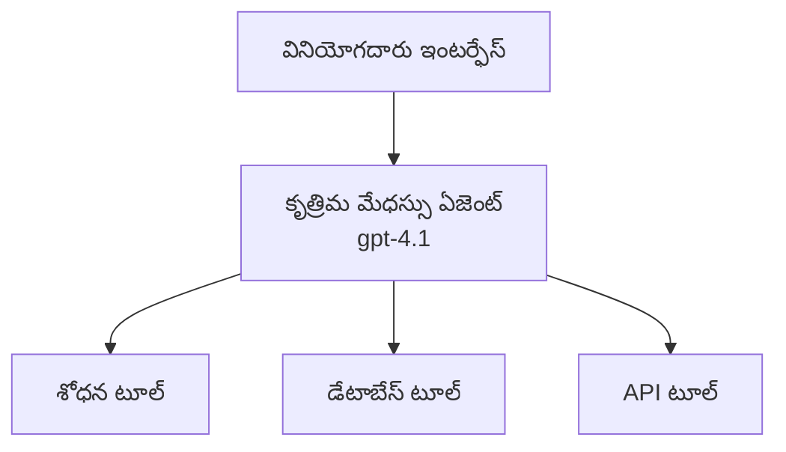
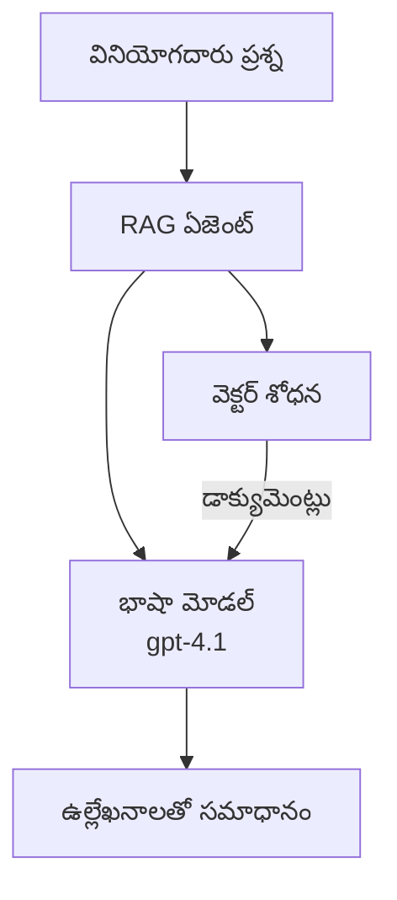
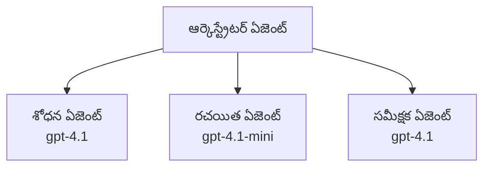

# Azure Developer CLI తో AI ఏజెంట్లు

**అధ్యాయం నావిగేషన్:**
- **📚 కోర్స్ హోమ్**: [AZD ప్రారంభికులకు](../../README.md)
- **📖 ప్రస్తుత అధ్యాయం**: అధ్యాయం 2 - AI-ఫస్ట్ డెవలప్మెంట్
- **⬅️ ముందు**: [Microsoft Foundry సమీకరణ](microsoft-foundry-integration.md)
- **➡️ తర్వాత**: [AI మోడల్ అమలు](ai-model-deployment.md)
- **🚀 అభివృద్ధి కోసం**: [బహు-ఏజెంట్ పరిష్కారాలు](../../examples/retail-scenario.md)

---

## పరిచయం

AI ఏజెంట్లు తమ పర్యావరణాన్ని గ్రహించి, నిర్ణయాలు తీసుకుని, ప్రత్యేక లక్ష్యాలను సాధించడానికి చర్యలు చేపట్టగల స్వతంత్ర ప్రోగ్రామ్‌లు. ప్రాంప్ట్‌లకు మాత్రమే స్పందించే సాదాసీదా చాట్‌బాట్‌లతో నేపధ్యంగా, ఏజెంట్లు చేయగలవు:

- **పరికరాలు ఉపయోగించడం** - APIs పిలవడం, డేటాబేస్‌లను సెర్చ్ చేయడం, కోడ్ అమలు చేయడం
- **యోజనాపరంగా తర్కం చేయడం** - సంక్లిష్ట పనులను దశలుగా విభజించడం
- **సందర్భం నుండి నేర్చుకోవడం** - మెమోరీని నిలుపుకోవడంతో ప్రవర్తను అనుకూఛించడం
- **సహకారం చేయడం** - ఇతర ఏజెంట్లతో కలిసి పనిచేయడం (బహుళ-ఏజెంట్ వ్యవస్థలు)

ఈ మార్గదర్శి Azure Developer CLI (azd) ఉపయోగించి Azure లో AI ఏజెంట్లను ఎలా డిప్లాయ్ చేయాలో చూపిస్తుంది.

## అధ్యయన లక్ష్యాలు

ఈ మార్గదర్శిని పూర్తి చేస్తే, మీరు:
- ఏవిలో AI ఏజెంట్లు ఏమిటి మరియు అవి చాట్‌బాట్‌ల నుండి ఎలా భిన్నంగా ఉంటాయో అర్థం చేసుకోగలరు
- AZD ఉపయోగించి ముందుగా నిర్మించిన AI ఏజెంట్ టెంప్లెట్లను డిప్లాయ్ చేయగలరు
- కస్టమ్ ఏజెంట్‌ల కోసం Foundry ఏజెంట్లను కాంఫిగర్ చేయగలరు
- ప్రాథమిక ఏజెంట్ నమూనాలను (పరికరాల వినియోగం, RAG, బహుళ-ఏజెంట్) అమలు చేయగలరు
- డిప్లాయ్ చేయబడిన ఏజెంట్లను మానిటర్ చేసి డీబగ్ చేయగలరు

## అధ్యయన ఫలితాలు

పూర్తి చేయగానే, మీరు చేయగలుగుతారు:
- ఒకే ఆజ్ఞతో Azure కు AI ఏజెంట్ అప్లికేషన్లను డిప్లాయ్ చేయడం
- ఏజెంట్ పరికరాలు మరియు సామర్థ్యాల్ని కాంఫిగర్ చేయడం
- ఏజెంట్లతో రిట్రీవల్-ఆగ్మెంటెడ్ జనరేషన్ (RAG) ని అమలు చేయడం
- సంక్లిష్ట వర్క్‌ఫ్లోల కోసం బహుళ-ఏజెంట్ శిల్పకళలు రూపొందించడం
- సాధారణ ఏజెంట్ డిప్లాయ్‌మెంట్ సమస్యలను ట్రబుల్‌షూట్ చేయడం

---

## 🤖 ఏజెంట్‌ను చాట్‌బాట్‌కి భిన్నంగా చేసే అంశాలు?

| లక్షణం | చాట్‌బాట్ | AI ఏజెంట్ |
|---------|---------|----------|
| **ప్రవర్తన** | ప్రాంప్ట్‌లకు స్పందిస్తుంది | స్వాయత్త చర్యలు తీసుకుంటుంది |
| **పరికరాలు** | లేదు | API లను పిలవగలదు, శోధించగలదు, కోడ్ అమలు చేయగలదు |
| **జ్ఞాపకం** | కేవలం సెషన్-ఆధారితం | సెషన్‌ల మధ్య శాశ్వత జ్ఞాపకం |
| **ప్రణాళిక** | ఒకే స్పందన | బహుళ దశల తర్కం |
| **సహకారం** | ఒక్క ఏకైక సయం | ఇతర ఏజెంట్లతో కలిసి పనిచేయగలదు |

### సాదా ఉపమానం

- **చాట్‌బాట్** = ఒక సమాచార డెస్క్ వద్ద ప్రశ్నలకు సహాయపడే వ్యక్తి
- **AI ఏజెంట్** = మీ కోసం కాల్స్ చేయగలిగే, అపాయింట్‌మెంట్స్ బుక్ చేయగలిగే, పనులు పూర్తి చేసేవారు వ్యక్తిగత సహాయకుడు

---

## 🚀 త్వరిత ప్రారంభం: మీ మొదటి ఏజెంట్‌ను డిప్లాయ్ చేయండి

### ఎంపిక 1: Foundry Agents టెంప్లేట్ (సిఫార్సు చేయబడింది)

```bash
# AI ఏజెంట్ల టెంప్లేట్‌ను ప్రారంభించండి
azd init --template get-started-with-ai-agents

# Azureకి అమలు చేయండి
azd up
```

**ఏవి డిప్లాయ్ అవుతాయి:**
- ✅ Foundry Agents
- ✅ Microsoft Foundry Models (gpt-4.1)
- ✅ Azure AI Search (RAG కొరకు)
- ✅ Azure Container Apps (వెబ్ ఇంటర్ఫేస్)
- ✅ Application Insights (మానిటరింగ్)

**సమయం:** ~15-20 నిమిషాలు
**ఖర్చు:** ~$100-150/మాసం (డెవలప్మెంట్)

### ఎంపిక 2: Prompty తో OpenAI ఏజెంట్

```bash
# Prompty ఆధారిత ఏజెంట్ టెంప్లేట్‌ను ప్రారంభించండి
azd init --template agent-openai-python-prompty

# Azureలో అమలు చేయండి
azd up
```

**ఏవి డిప్లాయ్ అవుతాయి:**
- ✅ Azure Functions (సర్వర్‌లెస్ ఏజెంట్ ఎగ్జిక్యూషన్)
- ✅ Microsoft Foundry Models
- ✅ Prompty కాన్ఫిగరేషన్ ఫైళ్ల
- ✅ శాంపుల్ ఏజెంట్ అమలు

**సమయం:** ~10-15 నిమిషాలు
**ఖర్చు:** ~$50-100/మాసం (డెవలప్మెంట్)

### ఎంపిక 3: RAG చాట్ ఏజెంట్

```bash
# RAG చాట్ నమూనాను ప్రారంభించండి
azd init --template azure-search-openai-demo

# Azureలో అమర్చండి
azd up
```

**ఏవి డిప్లాయ్ అవుతాయి:**
- ✅ Microsoft Foundry Models
- ✅ నమూనా డేటాతో Azure AI Search
- ✅ డాక్యుమెంట్ ప్రాసెసింగ్ పైప్‌లైన్
- ✅ సిటేషన్‌లతో చాట్ ఇంటర్ఫేస్

**సమయం:** ~15-25 నిమిషాలు
**ఖర్చు:** ~$80-150/మాసం (డెవలప్మెంట్)

### ఎంపిక 4: AZD AI Agent Init (మానిఫెస్ట్ ఆధారిత)

మీ దగ్గర ఏజెంట్ మానిఫెస్ట్ ఫైల్ ఉంటే, మీరు `azd ai` ఆజ్ఞను ఉపయోగించి Foundry Agent Service ప్రాజెక్ట్‌ను నేరుగా స్కాఫోల్డ్ చేయవచ్చు:

```bash
# AI ఏజెంట్ల ఎక్స్‌టెన్షన్‌ను ఇన్‌స్టాల్ చేయండి
azd extension install azure.ai.agents

# ఒక ఏజెంట్ మేనిఫెస్ట్ ఆధారంగా ప్రారంభించండి
azd ai agent init -m agent-manifest.yaml

# Azureకు డిప్లాయ్ చేయండి
azd up
```

**ఎప్పుడు `azd ai agent init` వాడాలి vs `azd init --template`:**

| విధానం | ఉత్తమం కోసం | ఇది ఎలా పనిచేస్తుంది |
|----------|----------|------|
| `azd init --template` | పని చేస్తున్న శాంపిల్ యాప్ నుంచి ప్రారంభించడం | కోడ్ + ఇన్‌ఫ్రాతో పూర్తి టెంప్లేట్ రెపోను క్లోన్ చేయును |
| `azd ai agent init -m` | మీ స్వంత ఏజెంట్ మానిఫెస్ట్ నుండి నిర్మించడం | మీ ఏజెంట్ నిర్వచనం నుంచి ప్రాజెక్ట్ నిర్మాణాన్ని స్కాఫోల్డ్ చేయును |

> **సూచన:** నేర్చుకోగా `azd init --template` ఉపయోగించండి (పై ఎంపికలు 1-3). మీ స్వంత మానిఫెస్ట్లతో ప్రొడక్షన్ ఏజెంట్లను నిర్మిస్తునప్పుడు `azd ai agent init` ఉపయోగించండి. పూర్తి సూచన కోసం చూడండి [AZD AI CLI Commands](../chapter-08-production/production-ai-practices.md#azd-ai-cli-commands-and-extensions)។

---

## 🏗️ ఏజెంట్ శిల్ప నిర్మాణ నమూనాలు

### నమూనా 1: పరికరాలతో ఒకే ఏజెంట్

సరళమైన ఏజెంట్ నమూనా - ఇది ఒకే ఏజెంట్ అనేక పరికరాలను ఉపయోగించగలదు.


**ఉత్తమం కోసం:**
- కస్టమర్ సపోర్ట్ బోట్లు
- రీసెర్చ్ అసిస్టెంట్లు
- డేటా విశ్లేషణ ఏజెంట్లు

**AZD టెంప్లేట్:** `azure-search-openai-demo`

### నమూనా 2: RAG ఏజెంట్ (Retrieval-Augmented Generation)

స్పందనలు రూపొందించే ముందు సంబంధిత డాక్యుమెంట్లను తిరిగి తెచ్చుకునే ఏజెంట్.


**ఉత్తమం కోసం:**
- ఎంటర్ప్రైజ్ నాలెడ్జ్‌బేస్‌లు
- డాక్యుమెంట్ Q&A వ్యవస్థలు
- కంప్లయెన్స్ మరియు లీగల్ రీసెర్చ్

**AZD టెంప్లేట్:** `azure-search-openai-demo`

### నమూనా 3: బహుళ-ఏజెంట్ వ్యవస్థ

సంక్లిష్ట పనుల కోసం కలిసి పనిచేస్తున్న ప్రత్యేక ఏజెంట్ల సముదాయం.


**ఉత్తమం కోసం:**
- సంక్లిష్ట కంటెంట్ జనరేషన్
- బహుళ దశల వర్క్‌ఫ్లోలు
- వేర్వేరు నైపుణ్యాలను అవసరమయ్యే పనులు

**ఇంకి తెలుసుకోండి:** [Multi-Agent Coordination Patterns](../chapter-06-pre-deployment/coordination-patterns.md)

---

## ⚙️ ఏజెంట్ పరికరాల కాన్ఫిగరేషన్

ఏజెంట్లు పరికరాలను ఉపయోగించగలిగినప్పుడు శక్తివంతంగా మారతాయి. ఇక్కడ సాధారణ పరికరాలను ఎలా కాంఫిగర్ చేయాలో ఉంది:

### Foundry Agents లో పరికరాల కాన్ఫిగరేషన్

```python
# agent_config.py
from azure.ai.projects import AIProjectClient
from azure.ai.projects.models import FunctionTool, CodeInterpreterTool

# కస్టమ్ టూల్స్‌ను నిర్వచించండి
search_tool = FunctionTool(
    name="search_knowledge_base",
    description="Search the company knowledge base for relevant documents",
    parameters={
        "type": "object",
        "properties": {
            "query": {
                "type": "string",
                "description": "The search query"
            }
        },
        "required": ["query"]
    }
)

# టూల్స్‌తో ఏజెంట్‌ను సృష్టించండి
agent = project_client.agents.create_agent(
    model="gpt-4.1",
    name="Support Agent",
    instructions="You are a helpful support agent. Use the search tool to find relevant information.",
    tools=[search_tool, CodeInterpreterTool()]
)
```

### పర్యావరణ కాన్ఫిగరేషన్

```bash
# ఏజెంట్-సంబంధిత పర్యావరణ చరాలను అమర్చండి
azd env set AZURE_OPENAI_MODEL "gpt-4.1"
azd env set AGENT_INSTRUCTIONS "You are a helpful assistant..."
azd env set ENABLE_CODE_INTERPRETER "true"
azd env set ENABLE_FILE_SEARCH "true"

# అప్డేట్ చేసిన కాన్ఫిగరేషన్‌తో అమలు చేయండి
azd deploy
```

---

## 📊 ఏజెంట్లను మానిటర్ చేయడం

### Application Insights ఇంటిగ్రేషన్

అన్ని AZD ఏజెంట్ టెంప్లెట్లు మానిటరింగ్ కోసం Application Insights ని కలిగి ఉంటాయి:

```bash
# మానిటరింగ్ డ్యాష్‌బోర్డు తెరవండి
azd monitor --overview

# ప్రస్తుత లాగ్‌లను చూడండి
azd monitor --logs

# ప్రస్తుత మెట్రిక్‌లను చూడండి
azd monitor --live
```

### ట్రాక్ చేయవలసిన కీలక మెట్రిక్స్

| మెట్రిక్ | వివరణ | లక్ష్యం |
|--------|-------------|--------|
| స్పందన ఆలస్యం | స్పందనను రూపొందించడానికి తీసుకునే సమయం | < 5 seconds |
| టోకెన్ వినియోగం | ప్రతి అభ్యర్థనకు టోకెన్లు | ఖర్చును పర్యవేక్షించండి |
| పరికర పిలుపు విజయ రేటు | విజయవంతమైన పరికర అమలుల శాతం | > 95% |
| లోపాల రేటు | వైఫల్యమైన ఏజెంట్ అభ్యర్థనలు | < 1% |
| వినియోగదారు సంతృప్తి | ఫీడ్‌బ్యాక్ స్కోర్లు | > 4.0/5.0 |

### ఏజెంట్ల కోసం కస్టమ్ లాగింగ్

```python
import os
from azure.monitor.opentelemetry import configure_azure_monitor
from opentelemetry import trace

# OpenTelemetry తో Azure Monitor ను కాన్ఫిగర్ చేయండి
configure_azure_monitor(
    connection_string=os.environ["APPLICATIONINSIGHTS_CONNECTION_STRING"]
)

tracer = trace.get_tracer(__name__)

def log_agent_interaction(user_query, agent_response, tools_used, latency_ms):
    with tracer.start_as_current_span("agent_interaction") as span:
        span.set_attributes({
            "user_query": user_query,
            "response_length": len(agent_response),
            "tools_used": tools_used,
            "latency_ms": latency_ms
        })
```

> **గమనిక:** అవసరమైన ప్యాకేజీలను ఇన్‌స్టాల్ చేయండి: `pip install azure-monitor-opentelemetry opentelemetry`

---

## 💰 ఖర్చు పరిగణనలు

### నమూనా ప్రకారం అంచనా నెలవారీ ఖర్చులు

| నమూనా | డెవ్ పరిసరాలు | ప్రొడక్షన్ |
|---------|-----------------|------------|
| ఒకే ఏజెంట్ | $50-100 | $200-500 |
| RAG ఏజెంట్ | $80-150 | $300-800 |
| బహుళ-ఏజెంట్ (2-3 ఏజెంట్లు) | $150-300 | $500-1,500 |
| ఎంటర్ప్రైజ్ బహుళ-ఏజెంట్ | $300-500 | $1,500-5,000+ |

### ఖర్చు తగ్గింపు సూచనలు

1. **సాధారణ పనుల కోసం gpt-4.1-mini ఉపయోగించండి**
   ```bash
   azd env set AZURE_OPENAI_MODEL "gpt-4.1-mini"
   ```

2. **పునరావృత ప్రశ్నల కోసం క్యాషింగ్ అమలు చేయండి**
   ```python
   from functools import lru_cache
   
   @lru_cache(maxsize=1000)
   def get_cached_response(query_hash):
       return agent.run(query_hash)
   ```

3. **ప్రతి రన్‌కు టోకెన్ పరిమితులు సెట్ చేయండి**
   ```python
   # ఏజెంట్‌ను నడిపేటప్పుడు max_completion_tokens ను సెట్ చేయండి, సృష్టించేటప్పుడు కాదు
   run = project_client.agents.create_run(
       thread_id=thread.id,
       agent_id=agent.id,
       max_completion_tokens=1000  # స్పందన పొడవును పరిమితం చేయండి
   )
   ```

4. **వాడకంలో లేకపోతే స్కేల్-టు-జీరో చేయండి**
   ```bash
   # Container Apps స్వయంచాలకంగా సున్నాకు వరకూ స్కేల్ అవుతాయి
   azd env set MIN_REPLICAS "0"
   ```

---

## 🔧 ఏజెంట్ సమస్యల పరిష్కారం

### సాధారణ సమస్యలు మరియు పరిష్కారాలు

<details>
<summary><strong>❌ పరికర పిలుపులకు ఏజెంట్ స్పందించడం లేదు</strong></summary>

```bash
# పరికరాలు సక్రమంగా నమోదు అయ్యాయా అని తనిఖీ చేయండి
azd show

# OpenAI అమరికను ధృవీకరించండి
az cognitiveservices account deployment list \
  --name $AZURE_OPENAI_NAME \
  --resource-group $RG_NAME

# ఏజెంట్ లాగ్‌లను తనిఖీ చేయండి
azd monitor --logs
```

**సాధారణ కారణాలు:**
- పరికరం ఫంక్షన్ సిగ్నేచర్ సరిపోలకపోవడం
- అవసరమైన అనుమతులు లేవు
- API ఎండ్‌పాయింట్ 접근ించలేనవడం
</details>

<details>
<summary><strong>❌ ఏజెంట్ స్పందనల్లో అధిక ఆలస్యం</strong></summary>

```bash
# Application Insightsలో బాటిల్‌నెక్‌లను తనిఖీ చేయండి
azd monitor --live

# వేగవంతమైన మోడల్ ఉపయోగించాలని పరిగణించండి
azd env set AZURE_OPENAI_MODEL "gpt-4.1-mini"
azd deploy
```

**ఆప్టిమైజేషన్ సూచనలు:**
- స్ట్రీమింగ్ స్పందనలను ఉపయోగించండి
- స్పందన క్యాషింగ్ అమలు చేయండి
- కాంటెక్స్ట్ విన్డో పరిమాణాన్ని తగ్గించండి
</details>

<details>
<summary><strong>❌ ఏజెంట్ తప్పు లేదా హాలుసినేట్ చేసిన సమాచారం ఇవ్వడం</strong></summary>

```python
# మెరుగైన సిస్టమ్ ప్రాంప్టులతో మెరుగుపరచండి
instructions = """
You are a helpful assistant. IMPORTANT:
- Only answer based on provided context
- If you don't know, say "I don't know"
- Always cite your sources
- Never make up information
"""

# గ్రౌండింగ్ కోసం రిట్రీవల్ జోడించండి
agent = project_client.agents.create_agent(
    model="gpt-4.1",
    instructions=instructions,
    tools=[FileSearchTool()]  # ప్రతిస్పందనలను డాక్యుమెంట్లలో ఆధారపెట్టండి
)
```
</details>

<details>
<summary><strong>❌ టోకెన్ పరిమితి మించిపోయిన లోపాలు</strong></summary>

```python
# సందర్భ విండో నిర్వహణను అమలు చేయండి
def truncate_context(messages, max_tokens=8000, model="gpt-4.1"):
    """Keep only recent messages within token limit."""
    import tiktoken
    encoding = tiktoken.encoding_for_model(model)
    total_tokens = 0
    truncated = []
    
    for msg in reversed(messages):
        msg_tokens = len(encoding.encode(msg.content))
        if total_tokens + msg_tokens > max_tokens:
            break
        truncated.insert(0, msg)
        total_tokens += msg_tokens
    
    return truncated
```
</details>

---

## 🎓 ప్రాక్టికల్ అభ్యాసాలు

### వ్యాయామం 1: ఒక బేసిక్ ఏజెంట్‌ను డిప్లాయ్ చేయండి (20 నిమిషాలు)

**లక్ష్యం:** AZD ఉపయోగించి మీ మొదటి AI ఏజెంట్‌ను డిప్లాయ్ చేయండి

```bash
# దశ 1: టెంప్లేట్‌ను ప్రారంభించండి
azd init --template get-started-with-ai-agents

# దశ 2: Azureలో లాగిన్ చేయండి
azd auth login

# దశ 3: డిప్లాయ్ చేయండి
azd up

# దశ 4: ఏజంట్‌ను పరీక్షించండి
# డిప్లాయ్‌మెంట్ తర్వాత ఎదురుచూడాల్సిన అవుట్‌పుట్:
#   డిప్లాయ్‌మెంట్ పూర్తి!
#   ఎండ్‌పాయింట్: https://<app-name>.<region>.azurecontainerapps.io
# అవుట్‌పుట్‌లో చూపించిన URLని తెరవండి మరియు ఒక ప్రశ్న అడగడానికి ప్రయత్నించండి

# దశ 5: మానిటరింగ్‌ను చూడండి
azd monitor --overview

# దశ 6: శుభ్రపరచండి
azd down --force --purge
```

**విజయ ప్రమాణాలు:**
- [ ] ఏజెంట్ ప్రశ్నలకు స్పందిస్తుంది
- [ ] `azd monitor` ద్వారా మానిటరింగ్ డ్యాష్‌బోర్డ్కి యాక్సెస్ చేయగలదు
- [ ] వనరులు విజయవంతంగా శుభ్రం చేయబడ్డాయి

### వ్యాయామం 2: ఒక కస్టమ్ పరికరాన్ని చేర్చండి (30 నిమిషాలు)

**లక్ష్యం:** ఏజెంట్ను ఒక కస్టమ్ పరికరంతో విస్తరించండి

1. డిప్లాయ్ చేయండి ఏజెంట్ టెంప్లేట్‌ను:
   ```bash
   azd init --template get-started-with-ai-agents
   azd up
   ```
2. మీ ఏజెంట్ కోడ్‌లో ఒక కొత్త పరికర ఫంక్షన్ సృష్టించండి:
   ```python
   def get_weather(location: str) -> str:
       """Get current weather for a location."""
       # వాతావరణ సేవకు API కాల్
       return f"Weather in {location}: Sunny, 72°F"
   ```
3. ఆ పరికరాన్ని ఏజెంట్‌లో నమోదు చేయండి:
   ```python
   from azure.ai.projects.models import FunctionTool

   weather_tool = FunctionTool(
       name="get_weather",
       description="Get current weather for a location",
       parameters={
           "type": "object",
           "properties": {
               "location": {"type": "string", "description": "City name"}
           },
           "required": ["location"]
       }
   )

   agent = project_client.agents.create_agent(
       model="gpt-4.1",
       name="Weather Agent",
       tools=[weather_tool]
   )
   ```
4. మళ్లీ డిప్లాయ్ చేసి పరీక్షించండి:
   ```bash
   azd deploy
   # అడగండి: "సీయాటిల్‌లో వాతావరణం ఎలా ఉంది?"
   # అంచనా: ఏజెంట్ get_weather("Seattle") ను పిలిచి వాతావరణ సమాచారాన్ని తిరిగి ఇస్తుంది
   ```

**విజయ ప్రమాణాలు:**
- [ ] ఏజెంట్ వాతావరణ సంబంధిత ప్రశ్నలకు గుర్తించగలదు
- [ ] పరికరం సరిగా పిలవబడుతుంది
- [ ] స్పందనలో వాతావరణ సమాచారం ఉంటుంది

### వ్యాయామం 3: RAG ఏజెంట్ నిర్మించండి (45 నిమిషాలు)

**లక్ష్యం:** మీ డాక్యుమెంట్ల থেকে ప్రశ్నలకు సమాధానాలు చెప్పగల ఏజెంట్ తయారు చేయండి

```bash
# దశ 1: RAG టెంప్లేట్‌ను అమర్చండి
azd init --template azure-search-openai-demo
azd up

# దశ 2: మీ డాక్యుమెంట్లను అప్లోడ్ చేయండి
# PDF/TXT ఫైళ్లను data/ డైరెక్టరీలో ఉంచి, తర్వాత నడపండి:
python scripts/prepdocs.py

# దశ 3: డొమెయిన్-విశిష్ట ప్రశ్నలతో పరీక్షించండి
# azd up అవుట్‌పుట్‌లోని వెబ్ యాప్ URL ను తెరవండి
# మీరు అప్లోడ్ చేసిన డాక్యుమెంట్ల గురించి ప్రశ్నలు అడగండి
# స్పందనల్లో [doc.pdf] వంటి సైటేషన్ సూచనలు ఉండాలి
```

**విజయ ప్రమాణాలు:**
- [ ] ఏజెంట్ అప్లోడ్ చేసిన డాక్యుమెంట్ల నుండి సమాధానాలు ఇస్తుంది
- [ ] స్పందనలలో మూలాలు (సిటేషన్లు) ఉంటాయి
- [ ] అవసం దాటిన ప్రశ్నలపై హాలుసినేషన్ ఉండదు

---

## 📚 తదుపరిట్లు

ఇప్పుడు మీరు AI ఏజెంట్లను అర్థం చేసుకున్నందున, ఈ అభివృద్ధి అంశాలను అన్వేషించండి:

| అంశం | వివరణ | లింక్ |
|-------|-------------|------|
| **బహుళ-ఏజెంట్ వ్యవస్థలు** | బహుళ సహకార ఏజెంట్లతో వ్యవస్థలు నిర్మించండి | [Retail Multi-Agent Example](../../examples/retail-scenario.md) |
| **కోఆర్డినేషన్ నమూనాలు** | ఆర్కెస్ట్రేషన్ మరియు కమ్యూనికేషన్ నమూనాలు నేర్చుకోండి | [Coordination Patterns](../chapter-06-pre-deployment/coordination-patterns.md) |
| **ప్రొడక్షన్ డిప్లాయ్‌మెంట్** | ఎంటర్ప్రైజ్-సిద్ధం అయ్యే ఏజెంట్ డిప్లాయ్‌మెంట్ | [Production AI Practices](../chapter-08-production/production-ai-practices.md) |
| **ఏజెంట్ ఎవాల్యూయేషన్** | ఏజెంట్ పనితీరును పరీక్షించండి మరియు అంచనా వేయండి | [AI Troubleshooting](../chapter-07-troubleshooting/ai-troubleshooting.md) |
| **AI వర్క్షాప్ ల్యాబ్** | ప్రాక్టికల్: మీ AI పరిష్కారాన్ని AZD-కు సిద్ధం చేయండి | [AI Workshop Lab](ai-workshop-lab.md) |

---

## 📖 అదనపు వనరులు

### అధికారిక డాక్యుమెంటేషన్
- [Azure AI Agent Service](https://learn.microsoft.com/azure/ai-services/agents/)
- [Azure AI Foundry Agent Service Quickstart](https://learn.microsoft.com/azure/ai-services/agents/quickstart)
- [Semantic Kernel Agent Framework](https://learn.microsoft.com/semantic-kernel/)

### ఏజెంట్ల కోసం AZD టెంప్లేట్లు
- [Get Started with AI Agents](https://github.com/Azure-Samples/get-started-with-ai-agents)
- [Agent OpenAI Python Prompty](https://github.com/Azure-Samples/agent-openai-python-prompty)
- [Azure Search OpenAI Demo](https://github.com/Azure-Samples/azure-search-openai-demo)

### కమ్యూనిటీ వనరులు
- [Awesome AZD - Agent Templates](https://azure.github.io/awesome-azd/?tags=ai-agents)
- [Azure AI Discord](https://discord.gg/microsoft-azure)
- [Microsoft Foundry Discord](https://discord.gg/nTYy5BXMWG)

### మీ ఎడిటర్ కోసం ఏజెంట్ స్కిల్స్
- [**Microsoft Azure Agent Skills**](https://skills.sh/microsoft/github-copilot-for-azure) - GitHub Copilot, Cursor లేదా మద్దతు పొందే ఏ క్యూ ఏజెంట్‌లలో Azure డెవలప్మెంట్ కోసం రీయూసబుల్ AI ఏజెంట్ స్కిల్స్ ను ఇన్‌స్టాల్ చేయండి. ఇందులో [Azure AI](https://skills.sh/microsoft/github-copilot-for-azure/azure-ai), [Microsoft Foundry](https://skills.sh/microsoft/github-copilot-for-azure/microsoft-foundry), [deployment](https://skills.sh/microsoft/github-copilot-for-azure/azure-deploy), మరియు [diagnostics](https://skills.sh/microsoft/github-copilot-for-azure/azure-diagnostics) కోసం స్కిల్స్ ఉన్నాయి:
  ```bash
  npx skills add microsoft/github-copilot-for-azure
  ```

---

**నావిగేషన్**
- **ముందటి పాఠం**: [Microsoft Foundry సమీకరణ](microsoft-foundry-integration.md)
- **తరమరి పాఠం**: [AI మోడల్ అమలు](ai-model-deployment.md)

---

<!-- CO-OP TRANSLATOR DISCLAIMER START -->
**Disclaimer**:
ఈ పత్రాన్ని AI అనువాద సేవ [Co-op Translator](https://github.com/Azure/co-op-translator) ఉపయోగించి అనువదించబడింది. మేము ఖచ్చితత్వాన్ని ఆశించినప్పటికీ, ఆటోమేటెడ్ అనువాదాల్లో పొరపాట్లు లేదా లోపాలు ఉండవచ్చు. మూల పత్రాన్ని దాని స్థానిక భాషలో అధికారం కలిగిన మూలంగా పరిగణించాలి. కీలకమైన సమాచారం కోసం వృత్తిపరమైన మానవ అనువాదం సిఫార్సు చేయబడుతుంది. ఈ అనువాదం ఉపయోగం వల్ల ఏర్పడిన ఏవైనా అపార్థాలు లేదా తప్పుగా అర్థం చేసుకోవడాల కోసం మేము బాధ్యత వహించము.
<!-- CO-OP TRANSLATOR DISCLAIMER END -->