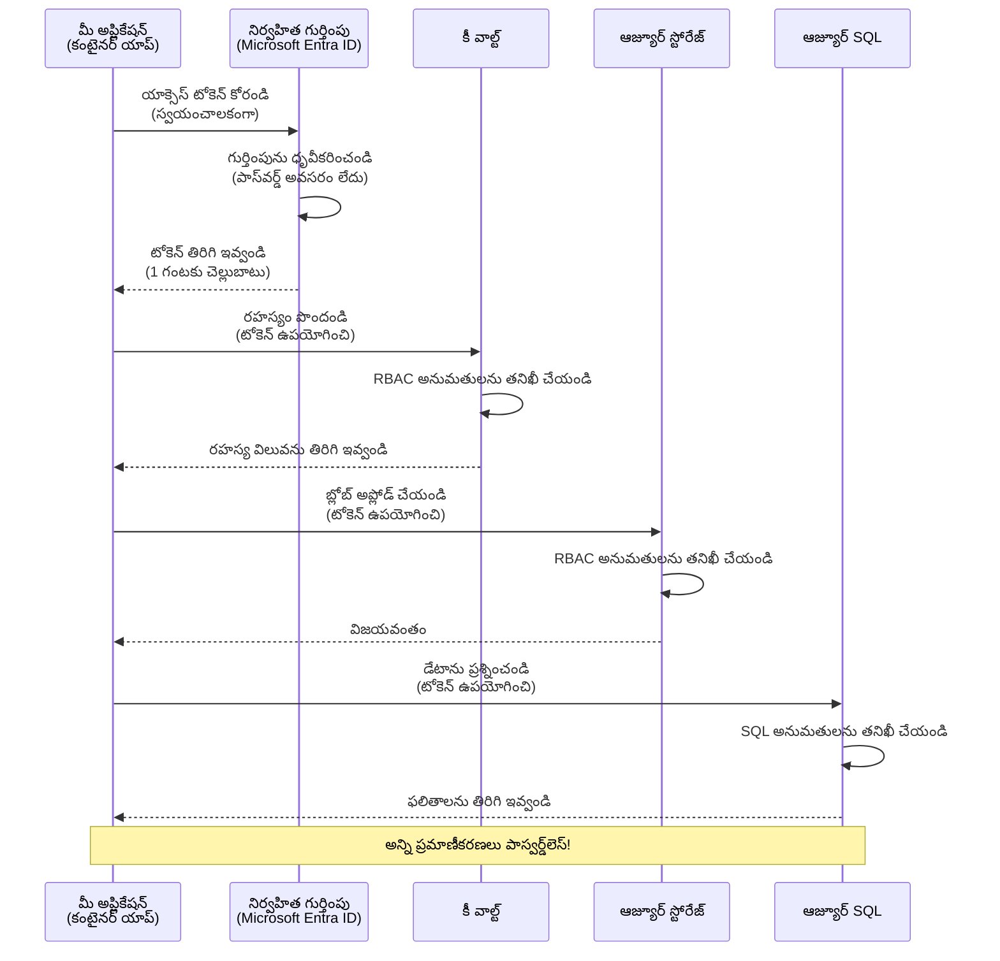
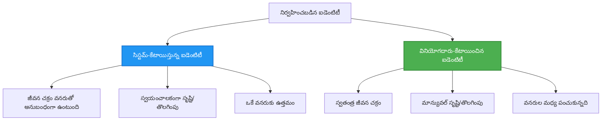

# ప్రామాణీకరణ నమూనాలు మరియు నిర్వహించబడిన ఐడెంటిటీ

⏱️ **అంచనావారీ సమయం**: 45-60 minutes | 💰 **ఖర్చు ప్రభావం**: ఉచితం (no additional charges) | ⭐ **సంక్లిష్టత**: Intermediate

**📚 పాఠ్య మార్గం:**
- ← మునుపటి: [కాన్ఫిగరేషన్ నిర్వహణ](configuration.md) - పరిసర వేరియబుల్స్ మరియు రహస్యాలను నిర్వహించడం
- 🎯 **మీరు ఇక్కడ ఉన్నారు**: ప్రామాణీకరణ & భద్రత (నిర్వహించబడిన ఐడెంటిటీ, Key Vault, భద్రతా నమూనాలు)
- → తదుపరి: [మొదటి ప్రాజెక్ట్](first-project.md) - మీ తొలి AZD అప్లికేషన్ నిర్మించండి
- 🏠 [కోర్సు హోమ్](../../README.md)

---

## మీరు ఏమి నేర్చుకుంటారు

ఈ పాఠం పూర్తి చేసిన తరువాత మీరు:
- Azure ప్రామాణీకరణ నమూనాలను అర్థం చేసుకుంటారు (keys, connection strings, నిర్వహించబడిన ఐడెంటిటీ)
- పాస్వర్డ్‌లెస్ ప్రామాణీకరణ కోసం **నిర్వహించబడిన ఐడెంటిటీ** అమలు చేయడం
- **Azure Key Vault** ఇంటిగ్రేషన్ ద్వారా రహస్యాలను సురక్షితంగా ఉంచడం
- AZD డిప్లాయ్‌మెంట్స్ కోసం **పాత్ర-ఆధారిత యాక్సెస్ కంట్రోల్ (RBAC)** ను కాన్ఫిగర్ చేయడం
- Container Apps మరియు Azure సేవలలో భద్రతా ఉత్తమ అలవాట్లను వర్తింపజేయడం
- కీ-ఆధారిత నుంచి ఐడెంటిటీ-ఆధారిత ప్రామాణీకరణకు మైగ్రేట్ చేయడం

## నిర్వహించబడిన ఐడెంటిటీ ఎందుకు ముఖ్యం

### సమస్య: సాంప్రదాయ ప్రామాణీకరణ

**నిర్వహించబడిన ఐడెంటిటీకి ముందు:**
```javascript
// ❌ భద్రతా ప్రమాదం: కోడ్‌లో హార్డ్‌కోడ్ చేయబడిన రహస్యాలు
const connectionString = "Server=mydb.database.windows.net;User=admin;Password=P@ssw0rd123";
const storageKey = "xK7mN9pQ2wR5tY8uI0oP3aS6dF1gH4jK...";
const cosmosKey = "C2x7B9n4M1p8Q5w3E6r0T2y5U8i1O4p7...";
```

**సమస్యలు:**
- 🔴 **రహస్యాలు బహిర్గతమయ్యాయి** కోడ్, కాన్ఫిగరేషన్ ఫైళ్లలో, పరిసర వేరియబుల్స్‌లో
- 🔴 **ప్రామాణపత్రాల రొటేషన్**కి కోడ్ మార్పులు మరియు మళ్ళీ డిప్లాయ్ చేయడం అవసరం
- 🔴 **ఆడిట్ సమస్యలు** - ఎవరు ఎప్పుడు ఏమిని యాక్సెస్ చేశారో?
- 🔴 **విసృతి** - రహస్యాలు అనేక సిస్టములపై వ్యాపించాయి
- 🔴 **కంప్లయెన్స్ ప్రమాదాలు** - భద్రతా ఆడిట్‌లలో విఫలం

### పరిష్కారం: నిర్వహించబడిన ఐడెంటిటీ

**నిర్వహించబడిన ఐడెంటిటీ తర్వాత:**
```javascript
// ✅ సురక్షితం: కోడులో రహస్యాలు లేవు
const credential = new DefaultAzureCredential();
const client = new BlobServiceClient(
  "https://mystorageaccount.blob.core.windows.net",
  credential  // Azure స్వయంచాలకంగా ప్రమాణీకరణను నిర్వహిస్తుంది
);
```

**లాభాలు:**
- ✅ **కోడ్లో లేదా కాన్ఫిగరేషన్‌లో రహస్యాలు లేవు**
- ✅ **ఆటోమేటిక్ రొటేషన్** - Azure దీనిని నిర్వహిస్తుంది
- ✅ **పూర్తి ఆడిట్ ట్రెయిల్** Microsoft Entra ID లాగ్‌లలో
- ✅ **కೇಂದ್ರీకృత భద్రత** - Azure పోర్టల్‌లో నిర్వహించండి
- ✅ **కంప్లయన్స్ సిద్ధంగా ఉంటుంది** - భద్రతా ప్రమాణాలు తీర్చుతుంది

**ఉదాహరణ**: సాంప్రదాయ ప్రామాణీకరణ అనేది వివిధ తలుపుల కోసం అనేక భౌతిక తాళాలను తీసుకుని తిరిగేలా ఉంటుంది. నిర్వహించబడిన ఐడెంటిటీ అనేది మీరు ఎవరో ఆధారంగా ఆటోమేటిగ్గా యాక్సెస్ ఇవ్వగల ఒక సెక్యూరిటీ బ్యాడ్జ్ వలె ఉంటుంది — తాళాలు కోల్పోవడానికి, కాపీ చేయడానికి లేదా రొటేట్ చేయడానికి అవసరం లేదు.

---

## ఆర్కిటెక్చర్ అవలోకనం

### నిర్వహించబడిన ఐడెంటిటీతో ప్రామాణీకరణ ప్రవాహం



### నిర్వహించబడిన ఐడెంటిటీల రకాలు



| వైశిష్ట్యం | సిస్టమ్-అసైన్ చేయబడిన | యూజర్-అసైన్ చేయబడిన |
|---------|----------------|---------------|
| **జీవన చక్రం** | రీసోర్సుకు బంధించబడింది | స్వతంత్రం |
| **సృష్టి** | రీసోర్స్‌తో స్వయంచాలకంగా | మాన్యువల్ సృష్టి |
| **తొలగింపు** | రీసోర్స్‌తో పాటు తొలగించబడుతుంది | రీసోర్స్ తొలగించిన తర్వాత నిలుస్తుంది |
| **పంచుకోవడం** | ఒకే రీసోర్స్ మాత్రమే | అనేక రీసోర్సులు |
| **ఉపయోగం** | సరళ సందర్భాలకి | క్లిష్ట బహు-రీసోర్స్ సందర్భాలకు |
| **AZD డిఫాల్ట్** | ✅ సిఫార్సు చేయబడింది | ఐచ్ఛికం |

---

## ముందస్తు అవసరాలు

### అవసరమైన టూల్స్

మునుపటి పాఠాల నుంచి ఇవి ఇప్పటికే ఇన్స్టాల్ చేసినట్లుండాలి:

```bash
# Azure Developer CLIని తనిఖీ చేయండి
azd version
# ✅ అంచనా: azd సంచిక 1.0.0 లేదా పైగా

# Azure CLIని తనిఖీ చేయండి
az --version
# ✅ అంచనా: azure-cli సంచిక 2.50.0 లేదా పైగా
```

### Azure అవసరాలు

- సక్రియమైన Azure subscription
- అనుమతులు:
  - నిర్వహించబడిన ఐడెంటిటీలను సృష్టించడానికి
  - RBAC పాత్రలను కేటాయించడానికి
  - Key Vault రీసోర్సులను సృష్టించడానికి
  - Container Apps ను డిప్లాయ్ చేయడానికి

### జ్ఞానానికి సంబంధించిన ముందస్తు అవసరాలు

మీరు పూర్తి చేసినట్లుండాలి:
- [Installation Guide](installation.md) - AZD setup
- [AZD Basics](azd-basics.md) - Core concepts
- [Configuration Management](configuration.md) - Environment variables

---

## పాఠం 1: ప్రామాణీకరణ నమూనాలను అర్థం చేసుకోవడం

### నమూనా 1: కనెక్షన్ స్ట్రింగ్లు (పాతవైన - తప్పించుకోవాలి)

**విధంగా పనిచేస్తుంది:**  
```bash
# కనెక్షన్ స్ట్రింగ్‌లో ప్రామాణీకరణ వివరాలు ఉన్నాయి
STORAGE_CONNECTION_STRING="DefaultEndpointsProtocol=https;AccountName=myaccount;AccountKey=xK7mN9pQ2wR5..."
COSMOS_CONNECTION_STRING="AccountEndpoint=https://myaccount.documents.azure.com:443/;AccountKey=C2x7..."
SQL_CONNECTION_STRING="Server=myserver.database.windows.net;User=admin;Password=P@ssw0rd..."
```

**సమస్యలు:**
- ❌ రహస్యాలు పరిసర వేరియబుల్స్‌లో కనిపిస్తాయి
- ❌ డిప్లాయ్‌మెంట్ సిస్టమ్స్‌లో లాగ్ అవుతాయి
- ❌ రొటేట్ చేయటం కష్టం
- ❌ యాక్సెస్‌కు సంబంధించిన ఆడిట్ ట్రెయిల్ లేదు

**ఎప్పుడు ఉపయోగించాలి:** స్థానిక డెవలప్‌మెంట్ కోసం మాత్రమే, ఉత్పత్తిలో ఎప్పుడూ కాదు.

---

### నమూనా 2: Key Vault రిఫరెన్సులు (ఉత్తమం)

**ఇది ఎలా పనిచేస్తుంది:**  
```bicep
// Store secret in Key Vault
resource keyVault 'Microsoft.KeyVault/vaults@2023-02-01' = {
  name: 'mykv'
  properties: {
    enableRbacAuthorization: true
  }
}

// Reference in Container App
env: [
  {
    name: 'STORAGE_KEY'
    secretRef: 'storage-key'  // References Key Vault
  }
]
```

**లాభాలు:**
- ✅ రహస్యాలు Key Vault లో భద్రంగా నిల్వ చేయబడతాయి
- ✅ కేంద్రీకృత రహస్య నిర్వహణ
- ✅ కోడ్ మార్పుల లేకుండా రొటేషన్

**పరిమితులు:**
- ⚠️ ఇంకా కీలు/పాస్వర్డ్స్ ఉపయోగిస్తున్నారు
- ⚠️ Key Vault యాక్సెస్‌ను నిర్వహించాల్సి ఉంటుంది

**ఎప్పుడు ఉపయోగించాలి:** కనెక్షన్ స్ట్రింగ్స్ నుండి నిర్వహించబడిన ఐడెంటిటీకి మారుతున్న స్థానాంతర దశగా ఉపయోగించండి.

---

### నమూనా 3: నిర్వహించబడిన ఐడెంటిటీ (ఉత్తమ పద్ధతి)

**ఇది ఎలా పని చేస్తుంది:**  
```bicep
// Enable managed identity
resource containerApp 'Microsoft.App/containerApps@2023-05-01' = {
  name: 'myapp'
  identity: {
    type: 'SystemAssigned'  // Automatically creates identity
  }
}

// Grant permissions
resource roleAssignment 'Microsoft.Authorization/roleAssignments@2022-04-01' = {
  scope: storageAccount
  properties: {
    roleDefinitionId: storageBlobDataContributorRole
    principalId: containerApp.identity.principalId
  }
}
```

**అప్లికేషన్ కోడ్:**
```javascript
// రహస్యాలు అవసరం లేదు!
const { DefaultAzureCredential } = require('@azure/identity');
const { BlobServiceClient } = require('@azure/storage-blob');

const credential = new DefaultAzureCredential();
const blobServiceClient = new BlobServiceClient(
  'https://mystorageaccount.blob.core.windows.net',
  credential
);
```

**లాభాలు:**
- ✅ కోడ్/కాన్ఫిగరేషన్‌లో రహస్యాలు లేవు
- ✅ ఆటోమేటిక్ క్రెడెంజియల్ రొటేషన్
- ✅ పూర్తిగా ఆడిట్ ట్రెయిల్
- ✅ RBAC ఆధారిత అనుమతులు
- ✅ కంప్లయెన్స్ సిద్ధం

**ఎప్పుడు ఉపయోగించాలి:** ఎప్పుడూ, ఉత్పత్తి అప్లికేషన్ల కోసం.

---

### నమూనా 4: సర్వీస్ ప్రిన్సిపల్స్ (CI/CD & ఆటోమేషన్)

నిర్వహించబడిన ఐడెంటిటీ Azureలో నడుచుకుంటున్న రీసోర్సుల కోసం గోల్డ్ స్టాండర్డ్. కానీ Azureకి **బయట** నడుస్తున్న వాటి గురించి ఎలా? ఉదాహరణకి బిల్డ్ ఏజెంట్‌పై ఉన్న CI/CD పైప్లైన్, లేదా మీ ల్యాప్‌టాప్‌పై ఉన్న ఒక స్క్రిప్ట్ ఇది మీ ఇంటరాక్టివ్ లాగిన్ ఉపయోగించలేకపోతే? ఇక్కడే ఒక **సర్వీస్ ప్రిన్సిపల్** అవసరం అవుతుంది: స్వంత క్రెడెంజియల్స్ కలిగిన ఒక అ-మానవ (non-human) ఐడెంటిటీ, ఒక ఆటోమెటెడ్ ప్రాసెస్ దీనితో సైన్ ఇన్ అవుతూ పని చేస్తుంది.

ఇది ఎలా పని చేస్తుంది:

Create a service principal scoped to a resource group (least privilege):

```bash
az ad sp create-for-rbac \
  --name "myapp-cicd" \
  --role contributor \
  --scopes /subscriptions/<sub-id>/resourceGroups/<rg-name>
```

This prints a client ID, client secret, and tenant ID. azd can sign in with them non-interactively:

```bash
azd auth login \
  --client-id "<appId>" \
  --client-secret "<password>" \
  --tenant-id "<tenant>"
```

**సీక్రెట్ల కంటే ఫెడరేటెడ్ క్రెడెన్షియల్స్ (OIDC) ను ఆదరించండి.** దీర్ఘకాలిక క్లయింట్ సీక్రెట్ బదులుగా, ఒక ఫెడరేటెడ్ క్రెడెన్షియల్‌ను కాన్ఫిగర్ చేయండి తద్వారా పైప్లైన్ ఒక చక్కటి-కాలిక టోకెన్ మార్పిడి చేస్తుంది—లీక్ చేయగల సీక్రెట్ లేకపోతుంది లేదా రొటేట్ చేయాల్సిన అవసరం లేదు:

```bash
azd auth login \
  --client-id "<appId>" \
  --federated-credential-provider "github" \
  --tenant-id "<tenant>"
```


> `azd pipeline config` మీ కోసం దీన్ని ఆటోమేటిగ్గా సెటప్ చేస్తుంది. CI/CD వాక్‌త్రూస్ కోసం [అధ్యాయం 8](../chapter-08-production/production-ai-practices.md) చూడండి.

**లాభాలు:**
- ✅ Azure వెలుపల కూడా పనిచేస్తుంది (బిల్డ్ ఏజెంట్లు, ఆన్-ప్రెమైస్, ఇతర క్లౌడ్లు)
- ✅ ఒకే పాత్రతో ఒక రీసోర్స్ గ్రూపుకు స్కోప్ చేయగలదు
- ✅ ఫెడరేటెడ్ (OIDC) వేరియంట్ ఏ నిల్వ చేయబడిన సీక్రెట్ ఉపయోగించదు

**ట్రేడ్-ఆఫ్స్:**
- ⚠️ సీక్రెట్-ఆధారిత వేరియంట్ జాగ్రత్తగా నిల్వ చేయడం మరియు రొటేట్ చేయడం అవసరం
- ⚠️ ఒక లీక్ అయిన సీక్రెట్ SPకి ఉన్న అన్ని అనుమతులను ఇస్తుంది—స్కోపులను కఠినంగా ఉంచండి

**ఎప్పుడు ఉపయోగించాలి:** నిర్వహించబడిన ఐడెంటిటీ ఉపయోగించలేని CI/CD పైప్లైన్లు మరియు ఆటోమేషన్ కోసం. క్లయింట్ సీక్రెట్ కంటే ఎప్పుడైనా **ఫెడరేటెడ్/OIDC** వేరియంట్‌నే ప్రాధాన్యం ఇవ్వండి, మరియు వర్క్లోడ్ Azureలో నడిచినప్పుడు ఎప్పుడైనా నిర్వహించబడిన ఐడెంటిటీని కోరండి.

**క్రెడెంజియల్స్‌ను సురక్షితంగా నిల్వ చేయడం:**
- ఎప్పుడూ సీక్రెట్స్‌ను కమిట్ చేయకండి—మీ పైప్లైన్ యొక్క సీక్రెట్ స్టోర్ ఉపయోగించండి (GitHub Actions secrets, Azure DevOps variable groups / Key Vault).
- SPని అవసరమైన కనిష్ట పాత్ర మరియు రీసోర్స్ గ్రూపుకు మాత్రమే స్కోప్ చేయండి.
- గడువు సెట్ చేయండి మరియు రొటేట్ చేయండి, లేదా OIDC ద్వారా సీక్రెట్‌ను పూర్తిగా తొలగించండి.

---

## పాఠం 2: AZD తో నిర్వహించబడిన ఐడెంటిటీ అమలు చేయడం

### దశల వారీ అమలు

నిర్వహించబడిన ఐడెంటిటీ ఉపయోగించి Azure Storage మరియు Key Vaultకి యాక్సెస్ చేసే ఒక సురక్షిత Container App ను నిర్మしましょう.

### ప్రాజెక్ట్ నిర్మాణం

```
secure-app/
├── azure.yaml                 # AZD configuration
├── infra/
│   ├── main.bicep            # Main infrastructure
│   ├── core/
│   │   ├── identity.bicep    # Managed identity setup
│   │   ├── keyvault.bicep    # Key Vault configuration
│   │   └── storage.bicep     # Storage with RBAC
│   └── app/
│       └── container-app.bicep
└── src/
    ├── app.js                # Application code
    ├── package.json
    └── Dockerfile
```

### 1. AZD కాన్ఫిగర్ చేయండి (azure.yaml)

```yaml
name: secure-app
metadata:
  template: secure-app@1.0.0

services:
  api:
    project: ./src
    language: js
    host: containerapp

# Enable managed identity (AZD handles this automatically)
```

### 2. ఇన్ఫ్రాస్ట్రక్చర్: నిర్వహించబడిన ఐడెంటిటీను ఎనేబుల్ చేయండి

**File: `infra/main.bicep`**

```bicep
targetScope = 'subscription'

param environmentName string
param location string = 'eastus'

var tags = { 'azd-env-name': environmentName }

// Resource group
resource rg 'Microsoft.Resources/resourceGroups@2021-04-01' = {
  name: 'rg-${environmentName}'
  location: location
  tags: tags
}

// Storage Account
module storage './core/storage.bicep' = {
  name: 'storage'
  scope: rg
  params: {
    name: 'st${uniqueString(rg.id)}'
    location: location
    tags: tags
  }
}

// Key Vault
module keyVault './core/keyvault.bicep' = {
  name: 'keyvault'
  scope: rg
  params: {
    name: 'kv-${uniqueString(rg.id)}'
    location: location
    tags: tags
  }
}

// Container App with Managed Identity
module containerApp './app/container-app.bicep' = {
  name: 'container-app'
  scope: rg
  params: {
    name: 'ca-${environmentName}'
    location: location
    tags: tags
    storageAccountName: storage.outputs.name
    keyVaultName: keyVault.outputs.name
  }
}

// Grant Container App access to Storage
module storageRoleAssignment './core/role-assignment.bicep' = {
  name: 'storage-role'
  scope: rg
  params: {
    principalId: containerApp.outputs.identityPrincipalId
    roleDefinitionId: 'ba92f5b4-2d11-453d-a403-e96b0029c9fe'  // Storage Blob Data Contributor
    targetResourceId: storage.outputs.id
  }
}

// Grant Container App access to Key Vault
module kvRoleAssignment './core/role-assignment.bicep' = {
  name: 'kv-role'
  scope: rg
  params: {
    principalId: containerApp.outputs.identityPrincipalId
    roleDefinitionId: '4633458b-17de-408a-b874-0445c86b69e6'  // Key Vault Secrets User
    targetResourceId: keyVault.outputs.id
  }
}

// Outputs
output AZURE_STORAGE_ACCOUNT_NAME string = storage.outputs.name
output AZURE_KEY_VAULT_NAME string = keyVault.outputs.name
output APP_URL string = containerApp.outputs.url
```

### 3. సిస్టమ్-అసైన్ చేయబడిన ఐడెంటిటీతో Container App

**File: `infra/app/container-app.bicep`**

```bicep
param name string
param location string
param tags object = {}
param storageAccountName string
param keyVaultName string

resource containerApp 'Microsoft.App/containerApps@2023-05-01' = {
  name: name
  location: location
  tags: tags
  identity: {
    type: 'SystemAssigned'  // 🔑 Enable managed identity
  }
  properties: {
    configuration: {
      ingress: {
        external: true
        targetPort: 3000
      }
    }
    template: {
      containers: [
        {
          name: 'api'
          image: 'myregistry.azurecr.io/api:latest'
          resources: {
            cpu: json('0.5')
            memory: '1Gi'
          }
          env: [
            {
              name: 'AZURE_STORAGE_ACCOUNT_NAME'
              value: storageAccountName
            }
            {
              name: 'AZURE_KEY_VAULT_NAME'
              value: keyVaultName
            }
            // 🔑 No secrets - managed identity handles authentication!
          ]
        }
      ]
    }
  }
}

// Output the identity for RBAC assignments
output identityPrincipalId string = containerApp.identity.principalId
output id string = containerApp.id
output url string = 'https://${containerApp.properties.configuration.ingress.fqdn}'
```

### 4. RBAC పాత్ర కేటాయింపు మాడ్యూల్

**File: `infra/core/role-assignment.bicep`**

```bicep
param principalId string
param roleDefinitionId string  // Azure built-in role ID
param targetResourceId string

resource roleAssignment 'Microsoft.Authorization/roleAssignments@2022-04-01' = {
  name: guid(principalId, roleDefinitionId, targetResourceId)
  scope: resourceId('Microsoft.Resources/resourceGroups', resourceGroup().name)
  properties: {
    roleDefinitionId: subscriptionResourceId('Microsoft.Authorization/roleDefinitions', roleDefinitionId)
    principalId: principalId
    principalType: 'ServicePrincipal'
  }
}

output id string = roleAssignment.id
```

### 5. నిర్వహించబడిన ఐడెంటిటీతో అప్లికేషన్ కోడ్

**File: `src/app.js`**

```javascript
const express = require('express');
const { DefaultAzureCredential } = require('@azure/identity');
const { BlobServiceClient } = require('@azure/storage-blob');
const { SecretClient } = require('@azure/keyvault-secrets');

const app = express();
const PORT = process.env.PORT || 3000;

// 🔑 క్రెడెన్షియల్ను ప్రారంభించండి (Managed Identityతో స్వయంచాలకంగా పనిచేస్తుంది)
const credential = new DefaultAzureCredential();

// Azure స్టోరేజ్ ఏర్పాటు
const storageAccountName = process.env.AZURE_STORAGE_ACCOUNT_NAME;
const blobServiceClient = new BlobServiceClient(
  `https://${storageAccountName}.blob.core.windows.net`,
  credential  // ఎలాంటి కీలు అవసరం లేదు!
);

// కీ వాల్ట్ ఏర్పాటు
const keyVaultName = process.env.AZURE_KEY_VAULT_NAME;
const secretClient = new SecretClient(
  `https://${keyVaultName}.vault.azure.net`,
  credential  // ఎలాంటి కీలు అవసరం లేదు!
);

// ఆరోగ్య తనిఖీ
app.get('/health', (req, res) => {
  res.json({ status: 'healthy', authentication: 'managed-identity' });
});

// ఫైల్‌ను బ్లోబ్ స్టోరేజ్‌కు అప్లోడ్ చేయండి
app.post('/upload', async (req, res) => {
  try {
    const containerClient = blobServiceClient.getContainerClient('uploads');
    await containerClient.createIfNotExists();
    
    const blobName = `file-${Date.now()}.txt`;
    const blockBlobClient = containerClient.getBlockBlobClient(blobName);
    
    await blockBlobClient.upload('Hello from managed identity!', 30);
    
    res.json({
      success: true,
      blobName: blobName,
      message: 'File uploaded using managed identity!'
    });
  } catch (error) {
    console.error('Upload error:', error);
    res.status(500).json({ error: error.message });
  }
});

// కీ వాల్ట్ నుండి రహస్యాన్ని పొందండి
app.get('/secret/:name', async (req, res) => {
  try {
    const secretName = req.params.name;
    const secret = await secretClient.getSecret(secretName);
    
    res.json({
      name: secretName,
      value: secret.value,
      message: 'Secret retrieved using managed identity!'
    });
  } catch (error) {
    console.error('Secret error:', error);
    res.status(500).json({ error: error.message });
  }
});

// బ్లోబ్ కంటెయినర్లను జాబితా చేయండి (పఠన అనుమతిని ప్రదర్శిస్తుంది)
app.get('/containers', async (req, res) => {
  try {
    const containers = [];
    for await (const container of blobServiceClient.listContainers()) {
      containers.push(container.name);
    }
    
    res.json({
      containers: containers,
      count: containers.length,
      message: 'Containers listed using managed identity!'
    });
  } catch (error) {
    console.error('List error:', error);
    res.status(500).json({ error: error.message });
  }
});

app.listen(PORT, () => {
  console.log(`Secure API listening on port ${PORT}`);
  console.log('Authentication: Managed Identity (passwordless)');
});
```

**File: `src/package.json`**

```json
{
  "name": "secure-app",
  "version": "1.0.0",
  "dependencies": {
    "express": "^4.18.2",
    "@azure/identity": "^4.0.0",
    "@azure/storage-blob": "^12.17.0",
    "@azure/keyvault-secrets": "^4.7.0"
  },
  "scripts": {
    "start": "node app.js"
  }
}
```

### 6. డిప్లాయ్ చేసి పరీక్షించండి

```bash
# AZD పర్యావరణాన్ని ప్రారంభించండి
azd init

# ఇన్ఫ్రాస్ట్రక్చర్ మరియు అప్లికేషన్‌ను అమలు చేయండి
azd up

# యాప్ URL పొందండి
APP_URL=$(azd env get-values | grep APP_URL | cut -d '=' -f2 | tr -d '"')

# హెల్త్ చెక్‌ను పరీక్షించండి
curl $APP_URL/health
```

**✅ ఆశించబడే అవుట్‌పుట్:**
```json
{
  "status": "healthy",
  "authentication": "managed-identity"
}
```

**బ్లాబ్ అప్లోడ్ పరీక్ష:**
```bash
curl -X POST $APP_URL/upload
```

**✅ ఆశించబడే అవుట్‌పుట్:**
```json
{
  "success": true,
  "blobName": "file-1700404800000.txt",
  "message": "File uploaded using managed identity!"
}
```

**కంటెయినర్ లిస్టింగ్ పరీక్ష:**
```bash
curl $APP_URL/containers
```

**✅ ఆశించబడే అవుట్‌పుట్:**
```json
{
  "containers": ["uploads"],
  "count": 1,
  "message": "Containers listed using managed identity!"
}
```

---

## సాధారణ Azure RBAC పాత్రలు

### నిర్వహించబడిన ఐడెంటిటీ కోసం బిల్ట్-ఇన్ పాత్ర IDలు

| సేవ | పాత్ర పేరు | పాత్ర ID | అనుమతులు |
|---------|-----------|---------|-------------|
| **Storage** | Storage Blob Data Reader | `2a2b9908-6b94-4a3d-8e5a-a7d8f8cc8a12` | బ్లాబ్‌లు మరియు కంటెయినర్లు చదవడం |
| **Storage** | Storage Blob Data Contributor | `ba92f5b4-2d11-453d-a403-e96b0029c9fe` | బ్లాబ్‌లను చదవడం, రాయడం, తొలగించడం |
| **Storage** | Storage Queue Data Contributor | `974c5e8b-45b9-4653-ba55-5f855dd0fb88` | క్యూకు సందేశాలను చదవడం, రాయడం, తొలగించడం |
| **Key Vault** | Key Vault Secrets User | `4633458b-17de-408a-b874-0445c86b69e6` | సీక్రెట్స్ చదవడం |
| **Key Vault** | Key Vault Secrets Officer | `b86a8fe4-44ce-4948-aee5-eccb2c155cd7` | సీక్రెట్స్ చదవడం, రాయడం, తొలగించడం |
| **Cosmos DB** | Cosmos DB Built-in Data Reader | `00000000-0000-0000-0000-000000000001` | Cosmos DB డేటా చదవడం |
| **Cosmos DB** | Cosmos DB Built-in Data Contributor | `00000000-0000-0000-0000-000000000002` | Cosmos DB డేటాను చదవడం, రాయడం |
| **SQL Database** | SQL DB Contributor | `9b7fa17d-e63e-47b0-bb0a-15c516ac86ec` | SQL డేటాబేస్‌లను నిర్వహించడం |
| **Service Bus** | Azure Service Bus Data Owner | `090c5cfd-751d-490a-894a-3ce6f1109419` | సందేశాలను పంపడం, స్వీకరించడం, నిర్వహించడం |

### పాత్ర IDలను ఎలా కనుగొనగలరు

```bash
# అన్ని నిర్మిత పాత్రలను జాబితా చేయండి
az role definition list --query "[].{Name:roleName, ID:name}" --output table

# నిర్దిష్ట పాత్ర కోసం శోధించండి
az role definition list --query "[?contains(roleName, 'Storage Blob')].{Name:roleName, ID:name}" --output table

# పాత్ర వివరాలు పొందండి
az role definition list --name "Storage Blob Data Contributor"
```

---

## ప్రాక్టికల్ వ్యాయామాలు

### వ్యాయామం 1: ఉన్న అప్లోకు నిర్వహించబడిన ఐడెంటిటీ ఎనేబుల్ చేయండి ⭐⭐ (మధ్యస్థ)

**లక్ష్యం**: ఇప్పటికే ఉన్న Container App డిప్లాయ్‌మెంట్‌కి నిర్వహించబడిన ఐడెంటిటీని జోడించండి

**సన్నివేశం**: మీకు కనెక్షన్ స్ట్రింగ్స్ ఉపయోగించే ఒక Container App ఉంది. దీన్ని నిర్వహించబడిన ఐడెంటిటీకి మార్చండి.

**ప్రారంభ స్థానము**: ఈ కాన్ఫిగరేషన్ ఉన్న Container App:

```bicep
// ❌ Current: Using connection string
env: [
  {
    name: 'STORAGE_CONNECTION_STRING'
    secretRef: 'storage-connection'
  }
]
```

**స్టెప్స్**:

1. **Bicepలో నిర్వహించబడిన ఐడెంటిటీని ఎనేబుల్ చేయండి:**

```bicep
resource containerApp 'Microsoft.App/containerApps@2023-05-01' = {
  name: 'myapp'
  identity: {
    type: 'SystemAssigned'  // Add this
  }
  // ... rest of configuration
}
```

2. **Storage యాక్సెస్‌ని ఇవ్వండి:**

```bicep
// Get storage account reference
resource storageAccount 'Microsoft.Storage/storageAccounts@2023-01-01' existing = {
  name: storageAccountName
}

// Assign role
resource roleAssignment 'Microsoft.Authorization/roleAssignments@2022-04-01' = {
  name: guid(containerApp.id, 'ba92f5b4-2d11-453d-a403-e96b0029c9fe', storageAccount.id)
  scope: storageAccount
  properties: {
    roleDefinitionId: subscriptionResourceId('Microsoft.Authorization/roleDefinitions', 'ba92f5b4-2d11-453d-a403-e96b0029c9fe')
    principalId: containerApp.identity.principalId
    principalType: 'ServicePrincipal'
  }
}
```

3. **అప్లికేషన్ కోడ్‌ను నవీకరించండి:**

**ముందుగా (కనెక్షన్ స్ట్రింగ్):**
```javascript
const { BlobServiceClient } = require('@azure/storage-blob');

const blobServiceClient = BlobServiceClient.fromConnectionString(
  process.env.STORAGE_CONNECTION_STRING
);
```

**తర్వాత (నిర్వహించబడిన ఐడెంటిటీ):**
```javascript
const { DefaultAzureCredential } = require('@azure/identity');
const { BlobServiceClient } = require('@azure/storage-blob');

const credential = new DefaultAzureCredential();
const blobServiceClient = new BlobServiceClient(
  `https://${process.env.STORAGE_ACCOUNT_NAME}.blob.core.windows.net`,
  credential
);
```

4. **పరిసర వేరియబుల్స్‌ను నవీకరించండి:**

```bicep
env: [
  {
    name: 'STORAGE_ACCOUNT_NAME'
    value: storageAccountName  // Just the name, no secrets!
  }
  // Remove STORAGE_CONNECTION_STRING
]
```

5. **డిప్లాయ్ చేసి పరీక్షించండి:**

```bash
# మళ్లీ అమలు చేయండి
azd up

# ఇది ఇంకా పనిచేస్తుందో పరీక్షించండి
curl https://myapp.azurecontainerapps.io/upload
```

**✅ విజయం ప్రమాణాలు:**
- ✅ అప్లికేషన్ ఎర్రర్లు లేకుండా డిప్లాయ్ అవుతుంది
- ✅ Storage ఆపరేషన్స్ పనిచేస్తాయి (అప్లోడ్, లిస్ట్, డౌన్లోడ్)
- ✅ పరిసర వేరియబుల్స్‌లో కనెక్షన్ స్ట్రింగ్స్ ఉండవు
- ✅ Azure పోర్టల్‌లో "Identity" బ్లేడ్ కింద ఐడెంటిటీ కనిపిస్తుంది

**నిర్ధారణ:**

```bash
# Managed identity ఎనేబుల్ ఉందో నిర్ధారించండి
az containerapp show \
  --name myapp \
  --resource-group rg-myapp \
  --query "identity.type"
# ✅ అంచనా: "SystemAssigned"

# పాత్ర కేటాయింపును తనిఖీ చేయండి
az role assignment list \
  --assignee $(az containerapp show --name myapp --resource-group rg-myapp --query "identity.principalId" -o tsv) \
  --scope /subscriptions/{sub-id}/resourceGroups/rg-myapp/providers/Microsoft.Storage/storageAccounts/mystorageaccount
# ✅ అంచనా: "Storage Blob Data Contributor" పాత్ర చూపించాలి
```

**సమయం**: 20-30 minutes

---

### వ్యాయామం 2: యూజర్-అసైన్ చేయబడిన ఐడెంటిటీతో బహు-సేవ యాక్సెస్ ⭐⭐⭐ (అడ్వాన్స్డ్)

**లక్ష్యం**: అనేక Container Apps మధ్య పంచుకునే యూజర్-అసైన్ చేయబడిన ఐడెంటిటీ సృష్టించండి

**సన్నివేశం**: ఒకే Storage ఖాతా మరియు Key Vaultకి యాక్సెస్ కావలసిన 3 మైక్రోసర్వీసులు ఉన్నాయి.

**దశలు**:

1. **యూజర్-అసైన్ చేయబడిన ఐడెంటిటీని సృష్టించండి:**

**File: `infra/core/identity.bicep`**

```bicep
param name string
param location string
param tags object = {}

resource userAssignedIdentity 'Microsoft.ManagedIdentity/userAssignedIdentities@2023-01-31' = {
  name: name
  location: location
  tags: tags
}

output id string = userAssignedIdentity.id
output principalId string = userAssignedIdentity.properties.principalId
output clientId string = userAssignedIdentity.properties.clientId
```

2. **యూజర్-అసైన్ ఐడెంటిటీకి పాత్రలు కేటాయించండి:**

```bicep
// In main.bicep
module userIdentity './core/identity.bicep' = {
  name: 'user-identity'
  scope: rg
  params: {
    name: 'id-${environmentName}'
    location: location
    tags: tags
  }
}

// Grant Storage access
resource storageRoleAssignment 'Microsoft.Authorization/roleAssignments@2022-04-01' = {
  name: guid(userIdentity.outputs.principalId, 'storage-contributor')
  scope: storageAccount
  properties: {
    roleDefinitionId: subscriptionResourceId('Microsoft.Authorization/roleDefinitions', 'ba92f5b4-2d11-453d-a403-e96b0029c9fe')
    principalId: userIdentity.outputs.principalId
    principalType: 'ServicePrincipal'
  }
}

// Grant Key Vault access
resource kvRoleAssignment 'Microsoft.Authorization/roleAssignments@2022-04-01' = {
  name: guid(userIdentity.outputs.principalId, 'kv-secrets-user')
  scope: keyVault
  properties: {
    roleDefinitionId: subscriptionResourceId('Microsoft.Authorization/roleDefinitions', '4633458b-17de-408a-b874-0445c86b69e6')
    principalId: userIdentity.outputs.principalId
    principalType: 'ServicePrincipal'
  }
}
```

3. **పలు Container Apps కు ఐడెంటిటిని కేటాయించండి:**

```bicep
resource apiGateway 'Microsoft.App/containerApps@2023-05-01' = {
  name: 'api-gateway'
  identity: {
    type: 'UserAssigned'
    userAssignedIdentities: {
      '${userIdentity.outputs.id}': {}
    }
  }
  // ... rest of config
}

resource productService 'Microsoft.App/containerApps@2023-05-01' = {
  name: 'product-service'
  identity: {
    type: 'UserAssigned'
    userAssignedIdentities: {
      '${userIdentity.outputs.id}': {}
    }
  }
  // ... rest of config
}

resource orderService 'Microsoft.App/containerApps@2023-05-01' = {
  name: 'order-service'
  identity: {
    type: 'UserAssigned'
    userAssignedIdentities: {
      '${userIdentity.outputs.id}': {}
    }
  }
  // ... rest of config
}
```

4. **అప్లికేషన్ కోడ్ (అన్ని సేవలు అదే నమూనాను ఉపయోగిస్తాయి):**

```javascript
const { DefaultAzureCredential, ManagedIdentityCredential } = require('@azure/identity');

// వాడుకరి కేటాయించిన గుర్తింపు కోసం, క్లయింట్ ID ను నిర్దేశించండి
const credential = new ManagedIdentityCredential(
  process.env.AZURE_CLIENT_ID  // వాడుకరి కేటాయించిన గుర్తింపు క్లయింట్ ID
);

// లేదా DefaultAzureCredential ఉపయోగించండి (స్వయంగా గుర్తిస్తుంది)
const credential = new DefaultAzureCredential();

const blobServiceClient = new BlobServiceClient(
  `https://${process.env.STORAGE_ACCOUNT_NAME}.blob.core.windows.net`,
  credential
);
```

5. **డిప్లాయ్ చేసి నిర్ధారించండి:**

```bash
azd up

# అన్ని సేవలు స్టోరేజ్‌ను యాక్సెస్ చేయగలవో పరీక్షించండి
curl https://api-gateway.azurecontainerapps.io/upload
curl https://product-service.azurecontainerapps.io/upload
curl https://order-service.azurecontainerapps.io/upload
```

**✅ విజయం ప్రమాణాలు:**
- ✅ ఒకే ఐడెంటిటీ 3 సేవల మధ్య పంచబడింది
- ✅ అన్ని సేవలు Storage మరియు Key Vaultకి యాక్సెస్ చేయగలవు
- ✅ ఒక సేవను తొలగించినా ఐడెంటిటీ నిలుస్తుంది
- ✅ కేంద్రీకృత అనుమతి నిర్వహణ

**యూజర్-అసైన్ ఐడెంటిటీ లాభాలు:**
- ఒకే ఐడెంటిటీని నిర్వహించండి
- సేవల మధ్య స్థిర అనుమతులు
- ఒక సేవను తొలగించినా నిలుపుతుంది
- క్లిష్ట ఆర్కిటెక్చర్ల కోసం బెటర్

**సమయం**: 30-40 minutes

---

### వ్యాయామం 3: Key Vault సీక్రెట్ రొటేషన్ అమలు చేయండి ⭐⭐⭐ (అడ్వాన్స్డ్)

**లక్ష్యం**: తృతీయ-పక్ష API కీలు Key Vault లో నిల్వ చేసి నిర్వహించబడిన ఐడెంటిటీ ద్వారా వాటిని యాక్సెస్ చేయండి

**సన్నివేశం**: మీ అప్లికేషన్‌కు API కీలు అవసరమయ్యే బాహ్య API (OpenAI, Stripe, SendGrid)ని పిలవాలి.

**దశలు**:

1. **RBAC కలిగిన Key Vault సృష్టించండి:**

**File: `infra/core/keyvault.bicep`**

```bicep
param name string
param location string
param tags object = {}

resource keyVault 'Microsoft.KeyVault/vaults@2023-02-01' = {
  name: name
  location: location
  tags: tags
  properties: {
    enableRbacAuthorization: true  // Use RBAC instead of access policies
    sku: {
      family: 'A'
      name: 'standard'
    }
    tenantId: subscription().tenantId
    enableSoftDelete: true
    softDeleteRetentionInDays: 90
  }
}

// Allow Container App to read secrets
output id string = keyVault.id
output name string = keyVault.name
output uri string = keyVault.properties.vaultUri
```

2. **Key Vault లో రహస్యాలను నిల్వ చేయండి:**

```bash
# Key Vault పేరును పొందండి
KV_NAME=$(azd env get-values | grep AZURE_KEY_VAULT_NAME | cut -d '=' -f2 | tr -d '"')

# తృతీయ పక్షపు API కీలు నిల్వ చేయండి
az keyvault secret set \
  --vault-name $KV_NAME \
  --name "OpenAI-ApiKey" \
  --value "sk-proj-xxxxxxxxxxxxx"

az keyvault secret set \
  --vault-name $KV_NAME \
  --name "Stripe-ApiKey" \
  --value "sk_live_xxxxxxxxxxxxx"

az keyvault secret set \
  --vault-name $KV_NAME \
  --name "SendGrid-ApiKey" \
  --value "SG.xxxxxxxxxxxxx"
```

3. **సీక్రెట్లను పొందడానికి అప్లికేషన్ కోడ్:**

**File: `src/config.js`**

```javascript
const { DefaultAzureCredential } = require('@azure/identity');
const { SecretClient } = require('@azure/keyvault-secrets');

class Config {
  constructor() {
    this.credential = new DefaultAzureCredential();
    this.secretClient = new SecretClient(
      `https://${process.env.AZURE_KEY_VAULT_NAME}.vault.azure.net`,
      this.credential
    );
    this.cache = {};
  }

  async getSecret(secretName) {
    // ముందుగా క్యాష్‌ను తనిఖీ చేయండి
    if (this.cache[secretName]) {
      return this.cache[secretName];
    }

    try {
      const secret = await this.secretClient.getSecret(secretName);
      this.cache[secretName] = secret.value;
      console.log(`✅ Retrieved secret: ${secretName}`);
      return secret.value;
    } catch (error) {
      console.error(`❌ Failed to get secret ${secretName}:`, error.message);
      throw error;
    }
  }

  async getOpenAIKey() {
    return this.getSecret('OpenAI-ApiKey');
  }

  async getStripeKey() {
    return this.getSecret('Stripe-ApiKey');
  }

  async getSendGridKey() {
    return this.getSecret('SendGrid-ApiKey');
  }
}

module.exports = new Config();
```

4. **అప్లికేషన్‌లో రహస్యాలను ఉపయోగించండి:**

**File: `src/app.js`**

```javascript
const express = require('express');
const config = require('./config');
const { OpenAI } = require('openai');

const app = express();

// కీ వాల్ట్ నుండి కీతో OpenAI ని ప్రారంభించండి
let openaiClient;

async function initializeServices() {
  const openaiKey = await config.getOpenAIKey();
  openaiClient = new OpenAI({ apiKey: openaiKey });
  console.log('✅ Services initialized with secrets from Key Vault');
}

// స్టార్ట్‌అప్ సమయంలో పిలవండి
initializeServices().catch(console.error);

app.post('/chat', async (req, res) => {
  try {
    const completion = await openaiClient.chat.completions.create({
      model: 'gpt-4.1',
      messages: [{ role: 'user', content: 'Hello!' }]
    });
    
    res.json({
      response: completion.choices[0].message.content,
      authentication: 'Key from Key Vault via Managed Identity'
    });
  } catch (error) {
    res.status(500).json({ error: error.message });
  }
});

app.listen(3000, () => {
  console.log('Secure API with Key Vault integration running');
});
```

5. **డిప్లాయ్ చేసి పరీక్షించండి:**

```bash
azd up

# API కీలు పనిచేస్తున్నాయో పరీక్షించండి
curl -X POST https://myapp.azurecontainerapps.io/chat \
  -H "Content-Type: application/json" \
  -d '{"message":"Hello AI"}'
```

**✅ విజయం ప్రమాణాలు:**
- ✅ కోడ్ లేదా ఎన్విరన్మెంట్ వేరియబుల్స్‌లో API కీలు లేవు
- ✅ అప్లికేషన్ Key Vault నుండి కీలు తీసుకుంటుంది
- ✅ థర్డ్-పార్టీ APIs సరిగ్గా పని చేస్తాయి
- ✅ కోడ్ మార్పుల გარეშე కీలు రొటేట్ చేయగలదు

**సీక్రెట్‌ను రొటేట్ చేయండి:**

```bash
# కీ వాల్ట్‌లో సీక్రెట్‌ను నవీకరించండి
az keyvault secret set \
  --vault-name $KV_NAME \
  --name "OpenAI-ApiKey" \
  --value "sk-proj-NEW_KEY_HERE"

# కొత్త కీని ఉపయోగించడానికి యాప్‌ను రీస్టార్ట్ చేయండి
az containerapp revision restart \
  --name myapp \
  --resource-group rg-myapp
```

**సమయం**: 25-35 నిమిషాలు

---

## జ్ఞాన పరీక్ష

### 1. ప్రామాణీకరణ నమూనాలు ✓

మీ అవగాహనను పరీక్షించండి:

- [ ] **Q1**: మూడు ప్రధాన ప్రామాణీకరణ నమూనాలు ఏమిటి? 
  - **A**: Connection strings (legacy), Key Vault references (transition), Managed Identity (best)

- [ ] **Q2**: Managed identity ఎందుకు connection strings కంటే ఉత్తమం?
  - **A**: కోడ్‌లో రహస్యాలు ఉండవు, ఆటోమేటిక్ రొటేషన్, పూర్తి ఆడిట్ ట్రైల్, RBAC అనుమతులు

- [ ] **Q3**: System-assigned బదులు user-assigned identity ఎప్పుడు ఉపయోగిస్తారు?
  - **A**: ఒకাধিক రిసోర్సులలో identityని పంచుకోవాలనిపోతే లేదా identity యొక్క జీవనచక్రం రిసోర్స్ జీవనచక్రం నుండి స్వతంత్రంగా ఉన్నప్పుడు

**హ్యాండ్స్-ఆన్ ధృవీకరణ:**
```bash
# మీ యాప్ ఎలాంటి గుర్తింపు ఉపయోగిస్తోంది అనేది తనిఖీ చేయండి
az containerapp show \
  --name myapp \
  --resource-group rg-myapp \
  --query "identity.type"

# గుర్తింపుకు సంబంధించిన అన్ని పాత్ర కేటాయింపులను జాబితా చేయండి
az role assignment list \
  --assignee $(az containerapp show --name myapp --resource-group rg-myapp --query "identity.principalId" -o tsv)
```

---

### 2. RBAC మరియు అనుమతులు ✓

మీ అవగాహనను పరీక్షించండి:

- [ ] **Q1**: "Storage Blob Data Contributor"కి రోల్ ID ఏది?
  - **A**: `ba92f5b4-2d11-453d-a403-e96b0029c9fe`

- [ ] **Q2**: "Key Vault Secrets User" ఏ అనుమతులను ఇస్తుంది?
  - **A**: సీక్రెట్లపై చదివే అనుమతి మాత్రమే (సృష్టించడం, నవీకరించడం లేదా తొలగించడం చేయలేరు)

- [ ] **Q3**: Container App కి Azure SQL యాక్సెస్ ఇవ్వడానికి మీరు ఏమి చేస్తారు?
  - **A**: "SQL DB Contributor" రోల్ సంతకించండి లేదా SQL కోసం Microsoft Entra ID ప్రామాణీకరణను కాన్ఫిగర్ చేయండి

**హ్యాండ్స్-ఆన్ ధృవీకరణ:**
```bash
# నిర్దిష్ట పాత్రను కనుగొనండి
az role definition list --name "Storage Blob Data Contributor"

# మీ గుర్తింపుకు ఏ పాత్రలు కేటాయించబడ్డాయో తనిఖీ చేయండి
PRINCIPAL_ID=$(az containerapp show --name myapp --resource-group rg-myapp --query "identity.principalId" -o tsv)
az role assignment list --assignee $PRINCIPAL_ID --output table
```

---

### 3. Key Vault సమీకరణ ✓

మీ అవగాహనను పరీక్షించండి:

- [ ] **Q1**: access policies బదులుగా Key Vault కోసం RBAC ను ఎలా ఎనేబుల్ చేయాలి?
  - **A**: Set `enableRbacAuthorization: true` in Bicep

- [ ] **Q2**: managed identity ప్రామాణీకరణను ఎవరు హ్యాండిల్ చేస్తారు?
  - **A**: `@azure/identity` with `DefaultAzureCredential` class

- [ ] **Q3**: Key Vault సీక్రెట్లు cacheలో ఎంతకాలం ఉంటాయి?
  - **A**: అప్లికేషన్‌పై ఆధారపడి ఉంటుంది; మీ స్వంత క్యాచింగ్ వ్యూహాన్ని అమలు చేయండి

**హ్యాండ్స్-ఆన్ ధృవీకరణ:**
```bash
# కీ వాల్ట్ యాక్సెస్‌ను పరీక్షించండి
az keyvault secret show \
  --vault-name $KV_NAME \
  --name "OpenAI-ApiKey" \
  --query "value"

# RBAC సక్రియంగా ఉందో తనిఖీ చేయండి
az keyvault show \
  --name $KV_NAME \
  --query "properties.enableRbacAuthorization"
# ✅ అంచనా: true
```

---

## సెక్యూరిటీ ఉత్తమ పద్ధతులు

### ✅ చేయండి:

1. **ఉత్పత్తిలో ఎల్లప్పుడూ Managed Identityని ఉపయోగించండి**
   ```bicep
   identity: {
     type: 'SystemAssigned'
   }
   ```

2. **అల్ప-ప్రివిలేజ్ RBAC పాత్రలను ఉపయోగించండి**
   - సాధ్యమైతే "Reader" పాత్రలను ఉపయోగించండి
   - అవసరమైతే కాకపోతే "Owner" లేదా "Contributor"ని నివారించండి

3. **థర్డ్-పార్టీ కీలు Key Vaultలో నిల్వ చేయండి**
   ```javascript
   const apiKey = await secretClient.getSecret('ThirdPartyApiKey');
   ```

4. **ఆడిట్ లాగింగ్‌ను ఎనేబుల్ చేయండి**
   ```bicep
   diagnosticSettings: {
     logs: [{ category: 'AuditEvent', enabled: true }]
   }
   ```

5. **dev/staging/prod కోసం వేరే آئడెంటిటీలను ఉపయోగించండి**
   ```bash
   azd env new dev
   azd env new staging
   azd env new prod
   ```

6. **రహస్యాలను స్థిరంగా రొటేట్ చేయండి**
   - Key Vault రహస్యాలపై గడువు తేదీలను సెట్ చేయండి
   - Azure Functions తో రొటేషన్‌ను ఆటోమేట్ చేయండి

### ❌ చేయవద్దు:

1. **రహస్యాలను ఎప్పుడూ హార్డ్‌కోడ్ చేయవద్దు**
   ```javascript
   // ❌ చెడు
   const apiKey = "sk-proj-xxxxxxxxxxxxx";
   ```

2. **ప్రొడక్షన్‌లో connection strings ఉపయోగించవద్దు**
   ```javascript
   // ❌ చెడు
   BlobServiceClient.fromConnectionString(process.env.STORAGE_CONNECTION_STRING)
   ```

3. **అత్యధిక అనుమతులు ఇవ్వకండి**
   ```bicep
   // ❌ BAD - too much access
   roleDefinitionId: 'Owner'
   
   // ✅ GOOD - least privilege
   roleDefinitionId: 'Storage Blob Data Reader'
   ```

4. **రహస్యాలను లాగ్ చేయవద్దు**
   ```javascript
   // ❌ చెడు
   console.log('API Key:', apiKey);
   
   // ✅ మంచిది
   console.log('API Key retrieved successfully');
   ```

5. **ప్రొడక్షన్ ఐడెంటిటీలను పర్యావరణాల మధ్య పంచుకోవద్దు**
   ```bicep
   // ❌ BAD - same identity for dev and prod
   // ✅ GOOD - separate identities per environment
   ```

---

## ట్రబుల్‌షూటింగ్ గైడ్

### సమస్య: Azure Storage యాక్సెస్ చేస్తున్నప్పుడు "Unauthorized"

**లక్షణాలు:**
```
Error: Unauthorized (403)
AuthorizationPermissionMismatch: This request is not authorized to perform this operation
```

**నిర్ధారణ:**

```bash
# మేనేజ్డ్ ఐడెంటిటీ ఎనేబుల్ చేయబడిందో లేదో తనిఖీ చేయండి
az containerapp show \
  --name myapp \
  --resource-group rg-myapp \
  --query "identity.type"
# ✅ అంచనా: "SystemAssigned" లేదా "UserAssigned"

# రోల్ నియామకాలను తనిఖీ చేయండి
PRINCIPAL_ID=$(az containerapp show --name myapp --resource-group rg-myapp --query "identity.principalId" -o tsv)
az role assignment list --assignee $PRINCIPAL_ID

# అంచనా: మీరు "Storage Blob Data Contributor" లేదా అదే తరహా పాత్రను చూడాలి
```

**పరిష్కారాలు:**

1. **సరైన RBAC పాత్రను ఇవ్వండి:**
```bash
STORAGE_ID=$(az storage account show --name mystorageaccount --resource-group rg-myapp --query "id" -o tsv)
az role assignment create \
  --assignee $PRINCIPAL_ID \
  --role "Storage Blob Data Contributor" \
  --scope $STORAGE_ID
```

2. **ప్రచారం కోసం వేచి ఉండండి (5-10 నిమిషాలు పట్టవచ్చు):**
```bash
# పాత్ర కేటాయింపు స్థితిని తనిఖీ చేయండి
az role assignment list --assignee $PRINCIPAL_ID --scope $STORAGE_ID
```

3. **అప్లికేషన్ కోడ్ సరైన క్రెడెన్షియల్ ఉపయోగిస్తున్నదో ధృవీకరించండి:**
```javascript
// మీరు DefaultAzureCredential ఉపయోగిస్తున్నదని నిర్ధారించుకోండి
const credential = new DefaultAzureCredential();
```

---

### సమస్య: Key Vault యాక్సెస్ నిరాకరించబడినప్పుడు

**లక్షణాలు:**
```
Error: Forbidden (403)
The user, group or application does not have secrets get permission
```

**నిర్ధారణ:**

```bash
# Check Key Vault RBAC సక్రియమై ఉందా తనిఖీ చేయండి
az keyvault show \
  --name $KV_NAME \
  --query "properties.enableRbacAuthorization"
# ✅ ఆశించినది: true

# పాత్ర అప్పగింపులను తనిఖీ చేయండి
az role assignment list \
  --assignee $PRINCIPAL_ID \
  --scope /subscriptions/{sub-id}/resourceGroups/rg-myapp/providers/Microsoft.KeyVault/vaults/$KV_NAME
```

**పరిష్కారాలు:**

1. **Key Vault పై RBACని ఎనేబుల్ చేయండి:**
```bash
az keyvault update \
  --name $KV_NAME \
  --enable-rbac-authorization true
```

2. **Key Vault Secrets User రోల్ ఇవ్వండి:**
```bash
KV_ID=$(az keyvault show --name $KV_NAME --query "id" -o tsv)
az role assignment create \
  --assignee $PRINCIPAL_ID \
  --role "Key Vault Secrets User" \
  --scope $KV_ID
```

---

### సమస్య: DefaultAzureCredential స్థానికంగా విఫలమవుతుంది

**లక్షణాలు:**
```
Error: DefaultAzureCredential failed to retrieve a token
CredentialUnavailableError: No credential available
```

**నిర్ధారణ:**

```bash
# మీరు లాగిన్ అయ్యారా అని తనిఖీ చేయండి
az account show

# Azure CLI యొక్క ప్రామాణీకరణను తనిఖీ చేయండి
az ad signed-in-user show
```

**పరిష్కారాలు:**

1. **Azure CLIలో లాగిన్ చేయండి:**
```bash
az login
```

2. **Azure subscription సెట్ చేయండి:**
```bash
az account set --subscription "Your Subscription Name"
```

3. **స్థానిక అభివృద్ధికి environment variables ఉపయోగించండి:**
```bash
export AZURE_TENANT_ID="your-tenant-id"
export AZURE_CLIENT_ID="your-client-id"
export AZURE_CLIENT_SECRET="your-client-secret"
```

4. **లేదా స్థానికంగా వేరే credential ఉపయోగించండి:**
```javascript
const { DefaultAzureCredential, AzureCliCredential } = require('@azure/identity');

// లోకల్ డెవలప్‌మెంట్ కోసం AzureCliCredential ఉపయోగించండి
const credential = process.env.NODE_ENV === 'production' 
  ? new DefaultAzureCredential()
  : new AzureCliCredential();
```

---

### సమస్య: రోల్ అసైన్‌మెంట్ ప్రచారం ఎక్కువసేపు పట్టడం

**లక్షణాలు:**
- రోల్ విజయవంతంగా అసైన్ అయింది
- ఇంకా 403 ఎర్రర్లు వస్తున్నాయి
- ఎప్పుడో పని చేస్తుంది, ఎప్పుడో చేయదు (అంతర్యంత్రం)

**వ్యాఖ్యానం:**
Azure RBAC మార్పులను గ్లోబల్‌గా ప్రచారం చేయడం కోసం 5-10 నిమిషాలు పట్టవచ్చు.

**పరిష్కారం:**

```bash
# వేచి మళ్లీ ప్రయత్నించండి
echo "Waiting for RBAC propagation..."
sleep 300  # 5 నిమిషాలు వేచి ఉండండి

# ప్రవేశాన్ని పరీక్షించండి
curl https://myapp.azurecontainerapps.io/upload

# ఇంకా విఫలమైతే, యాప్‌ను మళ్లీ ప్రారంభించండి
az containerapp revision restart \
  --name myapp \
  --resource-group rg-myapp
```

---

## ఖర్చుల పరిగణనలు

### Managed Identity ఖర్చులు

| Resource | Cost |
|----------|------|
| **మేనేజ్డ్ ఐడెంటిటీ** | 🆓 **ఉచితం** - ఛార్జీ లేదు |
| **RBAC Role Assignments** | 🆓 **ఉచితం** - ఛార్జీ లేదు |
| **Microsoft Entra ID Token Requests** | 🆓 **ఉచితం** - లోపంగా ఉన్నాయి |
| **Key Vault Operations** | $0.03 per 10,000 operations |
| **Key Vault Storage** | $0.024 per secret per month |

**Managed Identity ద్వారా డబ్బు ఎలా సేవ్ అవుతుంది:**
- ✅ సర్వీస్-టు-సర్వీస్ ప్రామాణీకరణ కోసం Key Vault ఆపరేషన్లను తొలిగించడం
- ✅ సెక్యూరిటీ ఘటనలు తగ్గించడం (లీక్ అయిన క్రెడెన్షియల్స్ ఉండవు)
- ✅ ఆపరేషనల్ ఓవర్హెడ్ తగ్గించడం (మాన్యువల్ రొటేషన్ అవసరం లేదు)

**ఉదాహరణ ఖర్చుల తులనాత్మకం (నెలవారీ):**

| సన్నివేశం | Connection Strings | Managed Identity | ఆదా |
|----------|-------------------|-----------------|---------|
| చిన్న యాప్ (1M requests) | ~$50 (Key Vault + ops) | ~$0 | $50/month |
| మధ్యంతర యాప్ (10M requests) | ~$200 | ~$0 | $200/month |
| పెద్ద యాప్ (100M requests) | ~$1,500 | ~$0 | $1,500/month |

---

## మరింత తెలుసుకోండి

### అధికారిక డాక్యుమెంటేషన్
- [Azure Managed Identity](https://learn.microsoft.com/entra/identity/managed-identities-azure-resources/overview)
- [Azure RBAC](https://learn.microsoft.com/azure/role-based-access-control/overview)
- [Azure Key Vault](https://learn.microsoft.com/azure/key-vault/general/overview)
- [DefaultAzureCredential](https://learn.microsoft.com/dotnet/api/azure.identity.defaultazurecredential)

### SDK డాక్యుమెంటేషన్
- [@azure/identity (Node.js)](https://www.npmjs.com/package/@azure/identity)
- [Azure.Identity (C#)](https://www.nuget.org/packages/Azure.Identity/)
- [azure-identity (Python)](https://pypi.org/project/azure-identity/)

### కోర్సులో వచ్చే తరువాతి దశలు
- ← మునుపటి: [కాన్ఫిగరేషన్ నిర్వహణ](configuration.md)
- → తదుపరి: [ప్రధమ ప్రాజెక్ట్](first-project.md)
- 🏠 [కోర్సు హోం](../../README.md)

### సంబంధిత ఉదాహరణలు
- [Microsoft Foundry Models Chat Example](../../../../examples/azure-openai-chat) - Microsoft Foundry Models కోసం managed identity ఉపయోగిస్తుంది
- [Microservices Example](../../../../examples/microservices) - బహుముఖ సేవా ప్రామాణీకరణ నమూనాలు

---

## సంక్షేపం

**మీరు నేర్చుకున్నారు:**
- ✅ మూడు ప్రామాణీకరణ నమూనాలు (connection strings, Key Vault, managed identity)
- ✅ AZDలో managed identityని ఎనేబుల్ చేయడం మరియు కాన్ఫిగర్ చేయడం ఎలా
- ✅ Azure సర్వీస్‌ల కోసం RBAC పాత్ర అసైన్‌మెంట్‌లు
- ✅ థర్డ్-పార్టీ సీక్రెట్ల కోసం Key Vault సమీకరణ
- ✅ User-assigned vs system-assigned ఐడెంటిటీల తేడా
- ✅ సెక్యూరిటీ ఉత్తమ పద్ధతులు మరియు ట్రబుల్‌షూటింగ్

**ముఖ్యమైన పాఠాలు:**
1. **ఉత్పత్తిలో ఎల్లప్పుడూ Managed Identity ఉపయోగించండి** - జీరో రహస్యాలు, ఆటోమేటిక్ రొటేషన్
2. **అల్ప-ప్రివిలేజ్ RBAC పాత్రలను ఉపయోగించండి** - అవసరమైన అనుమతులే ఇవ్వండి
3. **థర్డ్-పార్టీ కీలు Key Vaultలో నిల్వ చేయండి** - కేంద్రాపాయంగా సీక్రెట్ నిర్వహణ
4. **పర్యావరణాల కోసం ఐడెంటిటీల్ని వేరు చేయండి** - dev, staging, prod విభజన
5. **ఆడిట్ లాగింగ్ ఎనేబుల్ చేయండి** - ఎవరు ఏమి యాక్సెస్ చేశారో ట్రాక్ చేయండి

**తరువాత చేయవలసినవి:**
1. పై ప్రాయోగిక వ్యాయామాలను పూర్తి చేయండి
2. కొత్త కూడిగాని ఉన్న యాప్‌ను connection strings నుండి managed identityకు మైగ్రేట్ చేయండి
3. ప్రారంభం నుండే సెక్యూరిటీతో మీ మొదటి AZD ప్రాజెక్టు నిర్మించండి: [ప్రధమ ప్రాజెక్ట్](first-project.md)

---

<!-- CO-OP TRANSLATOR DISCLAIMER START -->
**అస్వీకరణ**:
ఈ పత్రం AI అనువాద సేవ [Co-op Translator](https://github.com/Azure/co-op-translator) ఉపయోగించి అనువదించబడింది. మేము ఖచ్చితత్వానికి ప్రయత్నిస్తున్నప్పటికీ, ఆటోమేటెడ్ అనువాదాలు తప్పులు లేదా అసమగ్రతలను కలిగి ఉండవచ్చు. దాని స్వదేశ భాషలో ఉన్న అసలు పత్రాన్ని అధికారం కలిగిన మూలంగా పరిగణించాలి. కీలకమైన సమాచారం కోసం, ప్రొఫెషనల్ మానవ అనువాదాన్ని సిఫారసు చేస్తాము. ఈ అనువాదం ఉపయోగం వల్ల కలిగే ఏవైనా అపార్థాలు లేదా తప్పుదారులు కోసం మేము బాధ్యత వహించము.
<!-- CO-OP TRANSLATOR DISCLAIMER END -->