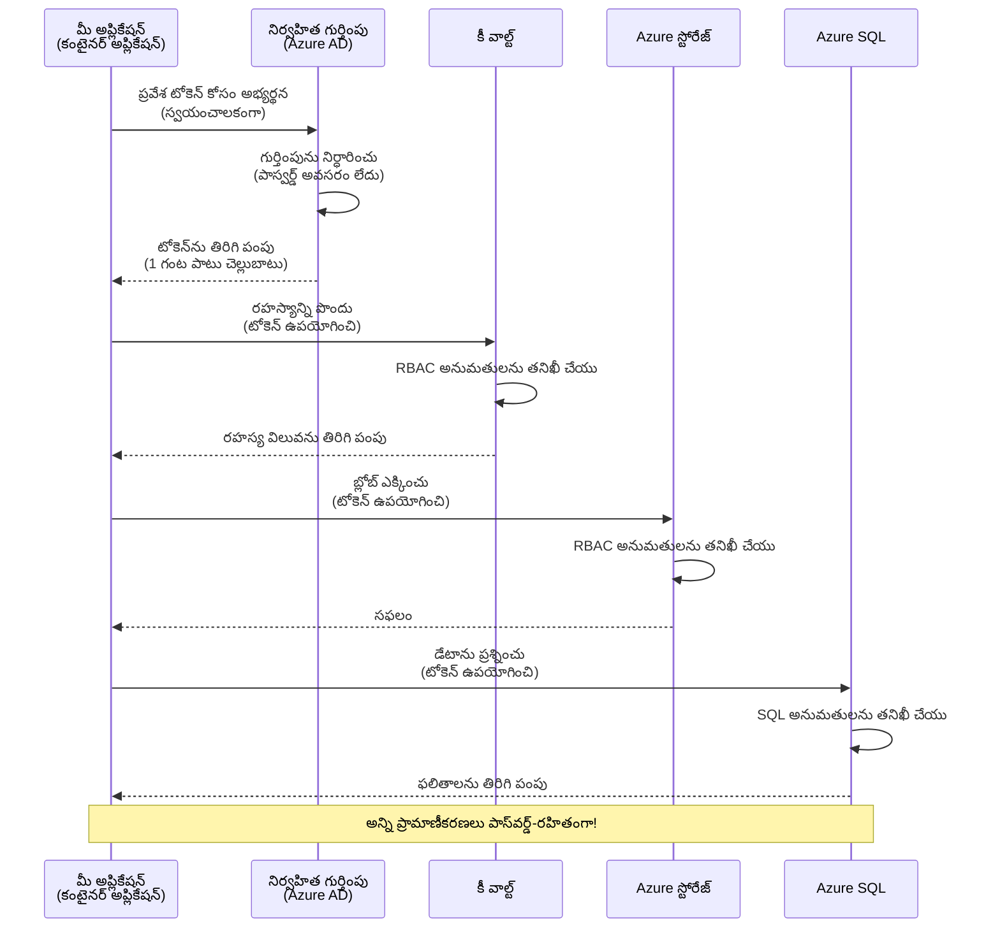
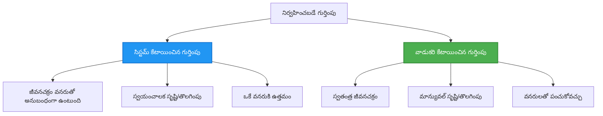

# ప్రమాణీకరణ నమూనాలు మరియు Managed Identity

⏱️ **అంచనా సమయంలో**: 45-60 నిమిషాలు | 💰 **ఖర్చుల ప్రభావం**: ఉచితం (అదనపు శุล్కాలు లేవు) | ⭐ **సంక్లిష్టత**: మధ్యస్థ

**📚 అడుగు పథం:**
- ← గతము: [కాన్ఫిగరేషన్ నిర్వహణ](configuration.md) - పర్యావరణ వేరియబుల్స్ మరియు రహస్యాలను నిర్వహించడం
- 🎯 **మీరు ఇక్కడ ఉన్నారు**: ప్రమాణీకరణ & భద్రత (Managed Identity, Key Vault, సురక్షిత నమూనాలు)
- → తదుపరి: [First Project](first-project.md) - మీ మొదటి AZD అప్లికేషన్ నిర్మించండి
- 🏠 [Course Home](../../README.md)

---

## మీరు ఏమి నేర్చుకుంటారు

ఈ పాఠాన్ని పూర్తిచేసีందువల్ల మీరు:
- Azure ప్రమాణీకరణ నమూనాలను అర్థం చేసుకుంటారు (కీలు, కనెక్షన్ స్ట్రింగ్స్, managed identity)
- పాస్వర్డ్‌లేని ప్రమాణీకరణ కోసం **Managed Identity**ని అమలు చేస్తారు
- **Azure Key Vault** సమగ్రతతో రహస్యాలను రక్షిస్తారు
- AZD deployments కోసం **role-based access control (RBAC)**ని కాన్ఫిగర్ చేస్తారు
- Container Apps మరియు Azure సేవలలో భద్రత ఉత్తమ ఆచారాలను వర్తింపజేస్తారు
- కీ ఆధారిత ప్రమాణీకరణ నుండి ఐడెంటిటీ ఆధారిత ప్రమాణీకరణకు మైగ్రేట్ అవుతారు

## Managed Identity ఎందుకు ముఖ్యం

### సమస్య: సంప్రదాయ ప్రమాణీకరణ

**Managed Identityకి ముందు:**
```javascript
// ❌ భద్రతా ప్రమాదం: కోడ్‌లో హార్డ్‌కోడెడ్ రహస్యాలు
const connectionString = "Server=mydb.database.windows.net;User=admin;Password=P@ssw0rd123";
const storageKey = "xK7mN9pQ2wR5tY8uI0oP3aS6dF1gH4jK...";
const cosmosKey = "C2x7B9n4M1p8Q5w3E6r0T2y5U8i1O4p7...";
```

**సమస్యలు:**
- 🔴 కోడ్, కాన్ఫిగ్ ఫైళ్లు, పర్యావరణ వేరియబుల్స్‌లో **ప్రజాపద రహస్యాలు**
- 🔴 **క్రెడెన్షియల్ రొటేషన్** కు కోడ్ మార్పులు మరియు రీడిప్లాయ్ అవసరం
- 🔴 **ఆడిట్ సమస్యలు** - ఎవరు ఏమి, ఎప్పుడు యాక్సెస్ చేసారో ట్రేస్ చేయడం కష్టమవుతుంది
- 🔴 **పిస్తాపు** - రహస్యాలు బహుళ సిస్టమ్స్‌లో చిలికిపోయి ఉంటాయి
- 🔴 **అనుకూల్యత ప్రమాదాలు** - భద్రతా ఆడిట్లలో విఫలమవుతుంది

### పరిష్కారం: Managed Identity

**Managed Identity తర్వాత:**
```javascript
// ✅ సురక్షితం: కోడ్‌లో రహస్యాలు లేవు
const credential = new DefaultAzureCredential();
const client = new BlobServiceClient(
  "https://mystorageaccount.blob.core.windows.net",
  credential  // Azure స్వయంచాలకంగా ప్రామాణీకరణను నిర్వహిస్తుంది
);
```

**లాభాలు:**
- ✅ కోడ్ లేదా కాన్ఫిగరేషన్‌లో **బృహతరహస్యాలు లేవు**
- ✅ **ఆటోమేటిక్ రొటేషన్** - Azure దీన్ని నిర్వహిస్తుంది
- ✅ Azure AD లాగ్‌లలో **పూర్తి ఆడిట్ ట్రెయిల్**
- ✅ **కేంద్రికృత భద్రత** - Azure పోర్టల్‌లో నిర్వహించండి
- ✅ **కంప్లయన్స్‌కు సిద్ధంగా** - భద్రతా ప్రమాణాలను కలిగివుంది

**ఉపమా**: సంప్రదాయ ప్రమాణీకరణ అనేది విభిన్న ద్వారాలకు అనేక భౌతిక తాళాలు తీసుకువెళ్ళడం లాంటిది. Managed Identity అనేది మీరు ఎవరో అనే ఆధారంగా ఆటోమేటిగ్గా యాక్సెస్ ఇస్తుందనే సెక్యూరిటీ బాడ్జ్ లాంటిది—తాళాలు పోగొట్టుకోవడం, నకిలీ చేయడం లేదా రొటేట్ చేయాల్సిన అవసరం లేదు.

---

## ఆర్కిటెక్చర్ అవలోకనం

### Managed Identityతో ప్రమాణీకరణ ఫ్లో


### Managed Identities రకాలు


| లక్షణం | System-Assigned | User-Assigned |
|---------|----------------|---------------|
| **జీవన చక్రం (Lifecycle)** | రిసోర్స్‌కు బంధింపబడుతుంది | స్వతంత్రం |
| **సృష్టి (Creation)** | రిసోర్స్‌తో ఆటోమేటిక్ | చేతితో సృష్టి |
| **తొలగింపు (Deletion)** | రిసోర్స్‌తో కలిసి తొలగించబడుతుంది | రిసోర్స్ తొలగించినప్పటికీ నిలుస్తుంది |
| **షేరింగ్ (Sharing)** | ఒక్క రిసోర్స్ మాత్రమే | బహుళ రిసోర్సులకు పంచుకోవచ్చు |
| **ఉపయోగం (Use Case)** | సాధారణ సందర్భాలు | సంక్లిష్ట బహుళ-రిసోర్స్ సందర్భాలు |
| **AZD డిఫాల్ట్ (AZD Default)** | ✅ సిఫార్సు చేయబడింది | ఐచ్ఛికం |

---

## ముందు అవసరాలు

### అవసరమైన సాధనాలు

మీరు προηγούμενους పాఠాల నుండి ఇవి ఇప్పటికే ఇన్‌స్టాల్ చేసుకున్నట్లు ఉండాలి:

```bash
# Azure Developer CLIని తనిఖీ చేయండి
azd version
# ✅ అనుకున్నది: azd వెర్షన్ 1.0.0 లేదా పైగా

# Azure CLIని తనిఖీ చేయండి
az --version
# ✅ అనుకున్నది: azure-cli 2.50.0 లేదా పైగా
```

### Azure అవసరాలు

- సక్రియ Azure subscription
- ఈ అనుమతులు ఉండాలి:
  - managed identities సృష్టించడానికి
  - RBAC పాత్రలను అప్పగించడానికి
  - Key Vault వనరులను సృష్టించడానికి
  - Container Apps ను డిప్లాయ్ చేయడానికి

### జ్ఞానానికి అవసరమైన ముందస్తు విషయాలు

మీరు పూర్తి చేసినట్లుండాలి:
- [Installation Guide](installation.md) - AZD సెటప్
- [AZD Basics](azd-basics.md) - కోర్ కాన్సెప్ట్స్
- [Configuration Management](configuration.md) - పర్యావరణ వేరియబుల్స్

---

## పాఠం 1: ప్రమాణీకరణ నమూనాలను అర్థం చేసుకోవడం

### నమూనా 1: Connection Strings (పాతవిభాగం - నివారించండి)

**ఇలా పనిచేస్తుంది:**
```bash
# కనెక్షన్ స్ట్రింగ్‌లో ప్రామాణికత వివరాలు ఉన్నాయి
STORAGE_CONNECTION_STRING="DefaultEndpointsProtocol=https;AccountName=myaccount;AccountKey=xK7mN9pQ2wR5..."
COSMOS_CONNECTION_STRING="AccountEndpoint=https://myaccount.documents.azure.com:443/;AccountKey=C2x7..."
SQL_CONNECTION_STRING="Server=myserver.database.windows.net;User=admin;Password=P@ssw0rd..."
```

**సమస్యలు:**
- ❌ రహస్యాలు పర్యావరణ వేరియబుల్స్‌లో కనిపిస్తాయి
- ❌ డిప్లాయ్‌మెంట్ సిస్టమ్స్‌లో లాగ్ అవుతాయి
- ❌ రొటేట్ చేయడం కష్టంగా ఉంటుంది
- ❌ యాక్సెస్‌కు ఆడిట్ ట్రెయిల్ లేదు

**ఎప్పుడు ఉపయోగించాలి:** లోకల్ డెవలప్మెంట్ కోసం మాత్రమే, ప్రొడక్షన్‌లో ఎప్పుడూ కాదు.

---

### నమూనా 2: Key Vault References (మంచిదిగా)

**ఇలా పనిచేస్తుంది:**
```bicep
// Store secret in Key Vault
resource keyVault 'Microsoft.KeyVault/vaults@2023-02-01' = {
  name: 'mykv'
  properties: {
    enableRbacAuthorization: true
  }
}

// Reference in Container App
env: [
  {
    name: 'STORAGE_KEY'
    secretRef: 'storage-key'  // References Key Vault
  }
]
```

**లాభాలు:**
- ✅ రహస్యాలు Key Vaultలో భద్రంగా నిల్వ ఉంటాయి
- ✅ కేంద్రికృత రహస్య నిర్వహణ
- ✅ కోడ్ మార్పులేకుండానే రొటేషన్

**పరిమితులు:**
- ⚠️ ఇంకా కీలు/పాస్వర్డ్స్ వినియోగిస్తున్నది
- ⚠️ Key Vault యాక్సెస్‌ను నిర్వహించాల్సి ఉంటుంది

**ఎప్పుడు ఉపయోగించాలి:** కనెక్షన్ స్ట్రింగ్స్ నుండి managed identityకి మారడానికి మధ్యస్థ దశగా.

---

### నమూనా 3: Managed Identity (ఉత్తమ ఆచారం)

**ఇలా పనిచేస్తుంది:**
```bicep
// Enable managed identity
resource containerApp 'Microsoft.App/containerApps@2023-05-01' = {
  name: 'myapp'
  identity: {
    type: 'SystemAssigned'  // Automatically creates identity
  }
}

// Grant permissions
resource roleAssignment 'Microsoft.Authorization/roleAssignments@2022-04-01' = {
  scope: storageAccount
  properties: {
    roleDefinitionId: storageBlobDataContributorRole
    principalId: containerApp.identity.principalId
  }
}
```

**అప్లికేషన్ కోడ్:**
```javascript
// రహస్యాలు అవసరం లేదు!
const { DefaultAzureCredential } = require('@azure/identity');
const { BlobServiceClient } = require('@azure/storage-blob');

const credential = new DefaultAzureCredential();
const blobServiceClient = new BlobServiceClient(
  'https://mystorageaccount.blob.core.windows.net',
  credential
);
```

**లాభాలు:**
- ✅ కోడ్/కాన్ఫిగ్‌లో రహస్యాలు రాదు
- ✅ ఆటోమేటిక్ క్రెడెన్షియల్ రొటేషన్
- ✅ పూర్తి ఆడిట్ ట్రెయిల్
- ✅ RBAC ఆధారిత అనుమతులు
- ✅ కంప్లయన్స్‌కు సిద్ధంగా ఉంది

**ఎప్పుడు ఉపయోగించాలి:** ప్రొడక్షన్ అప్లికేషన్ల కోసం ఎప్పుడూ.

---

## పాఠం 2: AZDతో Managed Identity అమలు

### దశలవారీ అమలు

Managed identity ఉపయోగించి Azure Storage మరియు Key Vault కు యాక్సెస్ చేసే సెక్యూర్ Container App ని నిర్మిద్దాం.

### ప్రాజెక్ట్ నిర్మాణం

```
secure-app/
├── azure.yaml                 # AZD configuration
├── infra/
│   ├── main.bicep            # Main infrastructure
│   ├── core/
│   │   ├── identity.bicep    # Managed identity setup
│   │   ├── keyvault.bicep    # Key Vault configuration
│   │   └── storage.bicep     # Storage with RBAC
│   └── app/
│       └── container-app.bicep
└── src/
    ├── app.js                # Application code
    ├── package.json
    └── Dockerfile
```

### 1. AZD ను కాన్ఫిగర్ చేయండి (azure.yaml)

```yaml
name: secure-app
metadata:
  template: secure-app@1.0.0

services:
  api:
    project: ./src
    language: js
    host: containerapp

# Enable managed identity (AZD handles this automatically)
```

### 2. ఇన్‌ఫ్రాస్ట్రక్చర్: Managed Identityను ఎనేబుల్ చేయండి

**ఫైల్: `infra/main.bicep`**

```bicep
targetScope = 'subscription'

param environmentName string
param location string = 'eastus'

var tags = { 'azd-env-name': environmentName }

// Resource group
resource rg 'Microsoft.Resources/resourceGroups@2021-04-01' = {
  name: 'rg-${environmentName}'
  location: location
  tags: tags
}

// Storage Account
module storage './core/storage.bicep' = {
  name: 'storage'
  scope: rg
  params: {
    name: 'st${uniqueString(rg.id)}'
    location: location
    tags: tags
  }
}

// Key Vault
module keyVault './core/keyvault.bicep' = {
  name: 'keyvault'
  scope: rg
  params: {
    name: 'kv-${uniqueString(rg.id)}'
    location: location
    tags: tags
  }
}

// Container App with Managed Identity
module containerApp './app/container-app.bicep' = {
  name: 'container-app'
  scope: rg
  params: {
    name: 'ca-${environmentName}'
    location: location
    tags: tags
    storageAccountName: storage.outputs.name
    keyVaultName: keyVault.outputs.name
  }
}

// Grant Container App access to Storage
module storageRoleAssignment './core/role-assignment.bicep' = {
  name: 'storage-role'
  scope: rg
  params: {
    principalId: containerApp.outputs.identityPrincipalId
    roleDefinitionId: 'ba92f5b4-2d11-453d-a403-e96b0029c9fe'  // Storage Blob Data Contributor
    targetResourceId: storage.outputs.id
  }
}

// Grant Container App access to Key Vault
module kvRoleAssignment './core/role-assignment.bicep' = {
  name: 'kv-role'
  scope: rg
  params: {
    principalId: containerApp.outputs.identityPrincipalId
    roleDefinitionId: '4633458b-17de-408a-b874-0445c86b69e6'  // Key Vault Secrets User
    targetResourceId: keyVault.outputs.id
  }
}

// Outputs
output AZURE_STORAGE_ACCOUNT_NAME string = storage.outputs.name
output AZURE_KEY_VAULT_NAME string = keyVault.outputs.name
output APP_URL string = containerApp.outputs.url
```

### 3. System-Assigned Identity కలిగిన Container App

**ఫైల్: `infra/app/container-app.bicep`**

```bicep
param name string
param location string
param tags object = {}
param storageAccountName string
param keyVaultName string

resource containerApp 'Microsoft.App/containerApps@2023-05-01' = {
  name: name
  location: location
  tags: tags
  identity: {
    type: 'SystemAssigned'  // 🔑 Enable managed identity
  }
  properties: {
    configuration: {
      ingress: {
        external: true
        targetPort: 3000
      }
    }
    template: {
      containers: [
        {
          name: 'api'
          image: 'myregistry.azurecr.io/api:latest'
          resources: {
            cpu: json('0.5')
            memory: '1Gi'
          }
          env: [
            {
              name: 'AZURE_STORAGE_ACCOUNT_NAME'
              value: storageAccountName
            }
            {
              name: 'AZURE_KEY_VAULT_NAME'
              value: keyVaultName
            }
            // 🔑 No secrets - managed identity handles authentication!
          ]
        }
      ]
    }
  }
}

// Output the identity for RBAC assignments
output identityPrincipalId string = containerApp.identity.principalId
output id string = containerApp.id
output url string = 'https://${containerApp.properties.configuration.ingress.fqdn}'
```

### 4. RBAC పాత్ర అప్పగింపు మాడ్యూల్

**ఫైల్: `infra/core/role-assignment.bicep`**

```bicep
param principalId string
param roleDefinitionId string  // Azure built-in role ID
param targetResourceId string

resource roleAssignment 'Microsoft.Authorization/roleAssignments@2022-04-01' = {
  name: guid(principalId, roleDefinitionId, targetResourceId)
  scope: resourceId('Microsoft.Resources/resourceGroups', resourceGroup().name)
  properties: {
    roleDefinitionId: subscriptionResourceId('Microsoft.Authorization/roleDefinitions', roleDefinitionId)
    principalId: principalId
    principalType: 'ServicePrincipal'
  }
}

output id string = roleAssignment.id
```

### 5. Managed Identity తో అప్లికేషన్ కోడ్

**ఫైల్: `src/app.js`**

```javascript
const express = require('express');
const { DefaultAzureCredential } = require('@azure/identity');
const { BlobServiceClient } = require('@azure/storage-blob');
const { SecretClient } = require('@azure/keyvault-secrets');

const app = express();
const PORT = process.env.PORT || 3000;

// 🔑 క్రెడెన్షియల్ ప్రారంభించండి (మెనేజ్డ్ ఐడెంటిటీతో ఆటోమేటిగ్గా పనిచేస్తుంది)
const credential = new DefaultAzureCredential();

// Azure స్టోరేజ్ సెటప్
const storageAccountName = process.env.AZURE_STORAGE_ACCOUNT_NAME;
const blobServiceClient = new BlobServiceClient(
  `https://${storageAccountName}.blob.core.windows.net`,
  credential  // ఏ కీలు అవసరం లేదు!
);

// Key Vault సెటప్
const keyVaultName = process.env.AZURE_KEY_VAULT_NAME;
const secretClient = new SecretClient(
  `https://${keyVaultName}.vault.azure.net`,
  credential  // ఏ కీలు అవసరం లేదు!
);

// ఆరోగ్య తనిఖీ
app.get('/health', (req, res) => {
  res.json({ status: 'healthy', authentication: 'managed-identity' });
});

// ఫైల్‌ను బ్లాబ్ స్టోరేజ్‌లోకి అప్లోడ్ చేయండి
app.post('/upload', async (req, res) => {
  try {
    const containerClient = blobServiceClient.getContainerClient('uploads');
    await containerClient.createIfNotExists();
    
    const blobName = `file-${Date.now()}.txt`;
    const blockBlobClient = containerClient.getBlockBlobClient(blobName);
    
    await blockBlobClient.upload('Hello from managed identity!', 30);
    
    res.json({
      success: true,
      blobName: blobName,
      message: 'File uploaded using managed identity!'
    });
  } catch (error) {
    console.error('Upload error:', error);
    res.status(500).json({ error: error.message });
  }
});

// Key Vault నుండి సీక్రెట్ పొందండి
app.get('/secret/:name', async (req, res) => {
  try {
    const secretName = req.params.name;
    const secret = await secretClient.getSecret(secretName);
    
    res.json({
      name: secretName,
      value: secret.value,
      message: 'Secret retrieved using managed identity!'
    });
  } catch (error) {
    console.error('Secret error:', error);
    res.status(500).json({ error: error.message });
  }
});

// బ్లాబ్ కంటైనర్లను జాబితా చేయండి (పఠన అనుమతిని చూపిస్తుంది)
app.get('/containers', async (req, res) => {
  try {
    const containers = [];
    for await (const container of blobServiceClient.listContainers()) {
      containers.push(container.name);
    }
    
    res.json({
      containers: containers,
      count: containers.length,
      message: 'Containers listed using managed identity!'
    });
  } catch (error) {
    console.error('List error:', error);
    res.status(500).json({ error: error.message });
  }
});

app.listen(PORT, () => {
  console.log(`Secure API listening on port ${PORT}`);
  console.log('Authentication: Managed Identity (passwordless)');
});
```

**ఫైల్: `src/package.json`**

```json
{
  "name": "secure-app",
  "version": "1.0.0",
  "dependencies": {
    "express": "^4.18.2",
    "@azure/identity": "^4.0.0",
    "@azure/storage-blob": "^12.17.0",
    "@azure/keyvault-secrets": "^4.7.0"
  },
  "scripts": {
    "start": "node app.js"
  }
}
```

### 6. డిప్లాయ్ చేసి పరీక్షించండి

```bash
# AZD పర్యావరణాన్ని ప్రారంభించండి
azd init

# ఇన్ఫ్రాస్ట్రక్చర్ మరియు అప్లికేషన్‌ను అమలు చేయండి
azd up

# యాప్ URL పొందండి
APP_URL=$(azd env get-values | grep APP_URL | cut -d '=' -f2 | tr -d '"')

# ఆరోగ్య తనిఖీని పరీక్షించండి
curl $APP_URL/health
```

**✅ అంచనాల ఫలితం:**
```json
{
  "status": "healthy",
  "authentication": "managed-identity"
}
```

**బ్లాబ్ అప్‌లోడ్ పరీక్ష:**
```bash
curl -X POST $APP_URL/upload
```

**✅ అంచనాల ఫలితం:**
```json
{
  "success": true,
  "blobName": "file-1700404800000.txt",
  "message": "File uploaded using managed identity!"
}
```

**కంటెయినర్ లిస్టింగ్ పరీక్ష:**
```bash
curl $APP_URL/containers
```

**✅ అంచనాల ఫలితం:**
```json
{
  "containers": ["uploads"],
  "count": 1,
  "message": "Containers listed using managed identity!"
}
```

---

## సాధారణ Azure RBAC పాత్రలు

### Managed Identity కోసం బిల్ట్-ఇన్ పాత్ర IDs

| సర్వీస్ | Role Name | Role ID | అనుమతులు |
|---------|-----------|---------|-----------|
| **Storage** | Storage Blob Data Reader | `2a2b9908-6b94-4a3d-8e5a-a7d8f8cc8a12` | బ్లాబ్లు మరియు కంటెయినర్లను చదవగలడు |
| **Storage** | Storage Blob Data Contributor | `ba92f5b4-2d11-453d-a403-e96b0029c9fe` | బ్లాబ్స్‌ని చదవడం, వ్రాయడం, తొలగించడం |
| **Storage** | Storage Queue Data Contributor | `974c5e8b-45b9-4653-ba55-5f855dd0fb88` | క్యూలో సందేశాలను చదవడం, వ్రాయడం, తొలగించడం |
| **Key Vault** | Key Vault Secrets User | `4633458b-17de-408a-b874-0445c86b69e6` | రహస్యాలను చదవగలడు |
| **Key Vault** | Key Vault Secrets Officer | `b86a8fe4-44ce-4948-aee5-eccb2c155cd7` | రహస్యాలను చదవటం, వ్రాయటం, తొలగించడం |
| **Cosmos DB** | Cosmos DB Built-in Data Reader | `00000000-0000-0000-0000-000000000001` | Cosmos DB డేటాను చదవడం |
| **Cosmos DB** | Cosmos DB Built-in Data Contributor | `00000000-0000-0000-0000-000000000002` | Cosmos DB డేటాను చదవడం, వ్రాయడం |
| **SQL Database** | SQL DB Contributor | `9b7fa17d-e63e-47b0-bb0a-15c516ac86ec` | SQL డేటాబేస్‌లను నిర్వహించడం |
| **Service Bus** | Azure Service Bus Data Owner | `090c5cfd-751d-490a-894a-3ce6f1109419` | సందేశాలను పంపడం, పొందడం, నిర్వహించడం |

### Role IDs‌ను ఎలా కనుగొనాలి

```bash
# అంతర్గతంగా ఉన్న అన్ని పాత్రలను జాబితా చేయండి
az role definition list --query "[].{Name:roleName, ID:name}" --output table

# నిర్దిష్ట పాత్రను శోధించండి
az role definition list --query "[?contains(roleName, 'Storage Blob')].{Name:roleName, ID:name}" --output table

# పాత్ర వివరాలను పొందండి
az role definition list --name "Storage Blob Data Contributor"
```

---

## ప్రయోగాత్మక వ్యాయామాలు

### వ్యాయామం 1: ఎగ్జిస్టింగ్ అప్స్ కోసం Managed Identity ఎనేబుల్ చేయండి ⭐⭐ (మధ్యస్థ)

**లక్ష్యం**: ఇప్పటికే ఉన్న Container App డిప్లాయ్‌మెంట్‌కు managed identityని జోడించండి

**దృశ్యం**: మీకు కనెక్షన్ స్ట్రింగ్స్ ఉపయోగించే Container App ఉంది. దీన్ని managed identityకి మార్చండి.

**ప్రారంభ బిందువు**: ఈ కాన్ఫిగరేషన్ ఉన్న Container App:

```bicep
// ❌ Current: Using connection string
env: [
  {
    name: 'STORAGE_CONNECTION_STRING'
    secretRef: 'storage-connection'
  }
]
```

**దశలు**:

1. **Bicepలో managed identityను ఎనేబుల్ చేయండి:**

```bicep
resource containerApp 'Microsoft.App/containerApps@2023-05-01' = {
  name: 'myapp'
  identity: {
    type: 'SystemAssigned'  // Add this
  }
  // ... rest of configuration
}
```

2. **Storage యాక్సెస్‌కు అనుమతి ఇవ్వండి:**

```bicep
// Get storage account reference
resource storageAccount 'Microsoft.Storage/storageAccounts@2023-01-01' existing = {
  name: storageAccountName
}

// Assign role
resource roleAssignment 'Microsoft.Authorization/roleAssignments@2022-04-01' = {
  name: guid(containerApp.id, 'ba92f5b4-2d11-453d-a403-e96b0029c9fe', storageAccount.id)
  scope: storageAccount
  properties: {
    roleDefinitionId: subscriptionResourceId('Microsoft.Authorization/roleDefinitions', 'ba92f5b4-2d11-453d-a403-e96b0029c9fe')
    principalId: containerApp.identity.principalId
    principalType: 'ServicePrincipal'
  }
}
```

3. **అప్లికేషన్ కోడ్‌ను అప్డేట్ చేయండి:**

**ముందు (connection string):**
```javascript
const { BlobServiceClient } = require('@azure/storage-blob');

const blobServiceClient = BlobServiceClient.fromConnectionString(
  process.env.STORAGE_CONNECTION_STRING
);
```

** తర్వాత (managed identity):**
```javascript
const { DefaultAzureCredential } = require('@azure/identity');
const { BlobServiceClient } = require('@azure/storage-blob');

const credential = new DefaultAzureCredential();
const blobServiceClient = new BlobServiceClient(
  `https://${process.env.STORAGE_ACCOUNT_NAME}.blob.core.windows.net`,
  credential
);
```

4. **పర్యావరణ వేరియబుల్స్‌ను అప్డేట్ చేయండి:**

```bicep
env: [
  {
    name: 'STORAGE_ACCOUNT_NAME'
    value: storageAccountName  // Just the name, no secrets!
  }
  // Remove STORAGE_CONNECTION_STRING
]
```

5. **డిప్లాయ్ చేసి పరీక్షించండి:**

```bash
# మళ్లీ అమర్చండి
azd up

# ఇది ఇంకా పనిచేస్తుందో పరీక్షించండి
curl https://myapp.azurecontainerapps.io/upload
```

**✅ విజయ ప్రమాణాలు:**
- ✅ అప్లికేషన్ ఎర్రర్స్ లేకుండా డిప్లాయ్ అవుతుంది
- ✅ స్టోరేజ్ ఆపరేషన్లు పనిచేస్తాయి (అప్‌లోడ్, లిస్ట్, డౌన్లోడ్)
- ✅ పర్యావరణ వేరియబుల్స్‌లో కనెక్షన్ స్ట్రింగ్స్ ఉండవు
- ✅ Azure పోర్టల్‌లో "Identity" బ్లేడ్‌లో ఐడెంటిటీ కనిపిస్తుంది

**సమీక్షణ:**

```bash
# మేనేజ్డ్ ఐడెంటిటీ సక్రియమై ఉందో తనిఖీ చేయండి
az containerapp show \
  --name myapp \
  --resource-group rg-myapp \
  --query "identity.type"
# ✅ అంచనా: "SystemAssigned"

# రోల్ కేటాయింపును తనిఖీ చేయండి
az role assignment list \
  --assignee $(az containerapp show --name myapp --resource-group rg-myapp --query "identity.principalId" -o tsv) \
  --scope /subscriptions/{sub-id}/resourceGroups/rg-myapp/providers/Microsoft.Storage/storageAccounts/mystorageaccount
# ✅ అంచనా: "Storage Blob Data Contributor" రోల్ చూపిస్తుంది
```

**సమయం**: 20-30 నిమిషాలు

---

### వ్యాయామం 2: బహుళ-సేవల యాక్సెస్ కోసం User-Assigned Identity ⭐⭐⭐ (అత్యాధునిక)

**లక్ష్యం**: ఒక user-assigned identityని సృష్టించి అది బహుళ Container Apps మధ్య పంచుకోండి

**దృశ్యం**: మీకు 3 మైక్రోసర్వీసులు ఉన్నాయి, అవన్నీ అదే Storage ఖాతా మరియు Key Vault కు యాక్సెస్ కావాలి.

**దశలు**:

1. **user-assigned identity సృష్టించండి:**

**ఫైల్: `infra/core/identity.bicep`**

```bicep
param name string
param location string
param tags object = {}

resource userAssignedIdentity 'Microsoft.ManagedIdentity/userAssignedIdentities@2023-01-31' = {
  name: name
  location: location
  tags: tags
}

output id string = userAssignedIdentity.id
output principalId string = userAssignedIdentity.properties.principalId
output clientId string = userAssignedIdentity.properties.clientId
```

2. **user-assigned identityకు పాత్రలు అప్పగించండి:**

```bicep
// In main.bicep
module userIdentity './core/identity.bicep' = {
  name: 'user-identity'
  scope: rg
  params: {
    name: 'id-${environmentName}'
    location: location
    tags: tags
  }
}

// Grant Storage access
resource storageRoleAssignment 'Microsoft.Authorization/roleAssignments@2022-04-01' = {
  name: guid(userIdentity.outputs.principalId, 'storage-contributor')
  scope: storageAccount
  properties: {
    roleDefinitionId: subscriptionResourceId('Microsoft.Authorization/roleDefinitions', 'ba92f5b4-2d11-453d-a403-e96b0029c9fe')
    principalId: userIdentity.outputs.principalId
    principalType: 'ServicePrincipal'
  }
}

// Grant Key Vault access
resource kvRoleAssignment 'Microsoft.Authorization/roleAssignments@2022-04-01' = {
  name: guid(userIdentity.outputs.principalId, 'kv-secrets-user')
  scope: keyVault
  properties: {
    roleDefinitionId: subscriptionResourceId('Microsoft.Authorization/roleDefinitions', '4633458b-17de-408a-b874-0445c86b69e6')
    principalId: userIdentity.outputs.principalId
    principalType: 'ServicePrincipal'
  }
}
```

3. **ఐడెంటిటిని బహుళ Container Apps కు అప్పగించండి:**

```bicep
resource apiGateway 'Microsoft.App/containerApps@2023-05-01' = {
  name: 'api-gateway'
  identity: {
    type: 'UserAssigned'
    userAssignedIdentities: {
      '${userIdentity.outputs.id}': {}
    }
  }
  // ... rest of config
}

resource productService 'Microsoft.App/containerApps@2023-05-01' = {
  name: 'product-service'
  identity: {
    type: 'UserAssigned'
    userAssignedIdentities: {
      '${userIdentity.outputs.id}': {}
    }
  }
  // ... rest of config
}

resource orderService 'Microsoft.App/containerApps@2023-05-01' = {
  name: 'order-service'
  identity: {
    type: 'UserAssigned'
    userAssignedIdentities: {
      '${userIdentity.outputs.id}': {}
    }
  }
  // ... rest of config
}
```

4. **అప్లికేషన్ కోడ్ (అన్ని సేవలు అదే నమూనాను ఉపయోగిస్తాయి):**

```javascript
const { DefaultAzureCredential, ManagedIdentityCredential } = require('@azure/identity');

// వినియోగదారు-అసైన్ చేయబడిన గుర్తింపు కోసం, క్లయెంట్ ID ను పేర్కొనండి
const credential = new ManagedIdentityCredential(
  process.env.AZURE_CLIENT_ID  // వినియోగదారు-అసైన్ చేయబడిన గుర్తింపు క్లయెంట్ ID
);

// లేదా DefaultAzureCredential ఉపయోగించండి (స్వయంగా గుర్తిస్తుంది)
const credential = new DefaultAzureCredential();

const blobServiceClient = new BlobServiceClient(
  `https://${process.env.STORAGE_ACCOUNT_NAME}.blob.core.windows.net`,
  credential
);
```

5. **డిప్లాయ్ చేసి నిర్ధారించండి:**

```bash
azd up

# అన్ని సర్వీసులు స్టోరేజ్‌ను యాక్సెస్ చేయగలవో పరీక్షించండి
curl https://api-gateway.azurecontainerapps.io/upload
curl https://product-service.azurecontainerapps.io/upload
curl https://order-service.azurecontainerapps.io/upload
```

**✅ విజయ ప్రమాణాలు:**
- ✅ ఒకే ఐడెంటిటీ 3 సేవల మధ్య పంచబడింది
- ✅ అన్ని సేవలు స్టోరేజ్ మరియు Key Vault ను యాక్సెస్ చేయగలవు
- ✅ ఒక సేవను తొలగించినా ఐడెంటిటీ నిలుస్తుంది
- ✅ అనుమతుల కేంద్రికృత నిర్వహణ

**User-Assigned Identity ల ప్రయోజనాలు:**
- ఒకే ఐడెంటిటీ నిర్వహణకి
- సేవల మధ్య సुसంపన్న అనుమతులు
- సేవ తొలగించినా నిలిచే స్థితి
- సంక్లిష్ట ఆర్కిటెక్చర్లకి మంచిది

**సమయం**: 30-40 నిమిషాలు

---

### వ్యాయామం 3: Key Vault రహస్య రొటేషన్ అమలు చేయండి ⭐⭐⭐ (అత్యాధునిక)

**లక్ష్యం**: మూడవ-పార్టీ API కీలు Key Vaultలో నిల్వ చేసి managed identity ద్వారా వాటిని యాక్సెస్ చేయండి

**దృశ్యం**: మీ అప్లికేషన్ ఒక బాహ్య API (OpenAI, Stripe, SendGrid) పిలవాలి, ఇది API కీలు అవసరం.

**దశలు**:

1. **RBACతో Key Vault సృష్టించండి:**

**ఫైల్: `infra/core/keyvault.bicep`**

```bicep
param name string
param location string
param tags object = {}

resource keyVault 'Microsoft.KeyVault/vaults@2023-02-01' = {
  name: name
  location: location
  tags: tags
  properties: {
    enableRbacAuthorization: true  // Use RBAC instead of access policies
    sku: {
      family: 'A'
      name: 'standard'
    }
    tenantId: subscription().tenantId
    enableSoftDelete: true
    softDeleteRetentionInDays: 90
  }
}

// Allow Container App to read secrets
output id string = keyVault.id
output name string = keyVault.name
output uri string = keyVault.properties.vaultUri
```

2. **Key Vaultలో రహస్యాలను నిల్వ చేయండి:**

```bash
# కీ వాల్ట్ పేరు పొందండి
KV_NAME=$(azd env get-values | grep AZURE_KEY_VAULT_NAME | cut -d '=' -f2 | tr -d '"')

# తృతీయ పక్ష API కీలు నిల్వ చేయండి
az keyvault secret set \
  --vault-name $KV_NAME \
  --name "OpenAI-ApiKey" \
  --value "sk-proj-xxxxxxxxxxxxx"

az keyvault secret set \
  --vault-name $KV_NAME \
  --name "Stripe-ApiKey" \
  --value "sk_live_xxxxxxxxxxxxx"

az keyvault secret set \
  --vault-name $KV_NAME \
  --name "SendGrid-ApiKey" \
  --value "SG.xxxxxxxxxxxxx"
```

3. **అప్లికేషన్ కోడ్ రహస్యాలు పొందడానికి:**

**ఫైల్: `src/config.js`**

```javascript
const { DefaultAzureCredential } = require('@azure/identity');
const { SecretClient } = require('@azure/keyvault-secrets');

class Config {
  constructor() {
    this.credential = new DefaultAzureCredential();
    this.secretClient = new SecretClient(
      `https://${process.env.AZURE_KEY_VAULT_NAME}.vault.azure.net`,
      this.credential
    );
    this.cache = {};
  }

  async getSecret(secretName) {
    // ముందుగా క్యాష్‌ను తనిఖీ చేయండి
    if (this.cache[secretName]) {
      return this.cache[secretName];
    }

    try {
      const secret = await this.secretClient.getSecret(secretName);
      this.cache[secretName] = secret.value;
      console.log(`✅ Retrieved secret: ${secretName}`);
      return secret.value;
    } catch (error) {
      console.error(`❌ Failed to get secret ${secretName}:`, error.message);
      throw error;
    }
  }

  async getOpenAIKey() {
    return this.getSecret('OpenAI-ApiKey');
  }

  async getStripeKey() {
    return this.getSecret('Stripe-ApiKey');
  }

  async getSendGridKey() {
    return this.getSecret('SendGrid-ApiKey');
  }
}

module.exports = new Config();
```

4. **అప్లికేషన్‌లో రహస్యాలను ఉపయోగించండి:**

**ఫైల్: `src/app.js`**

```javascript
const express = require('express');
const config = require('./config');
const { OpenAI } = require('openai');

const app = express();

// OpenAIని Key Vault నుంచి తీసుకున్న కీతో ప్రారంభించండి
let openaiClient;

async function initializeServices() {
  const openaiKey = await config.getOpenAIKey();
  openaiClient = new OpenAI({ apiKey: openaiKey });
  console.log('✅ Services initialized with secrets from Key Vault');
}

// స్టార్ట్‌ప్ సమయంలో పిలవండి
initializeServices().catch(console.error);

app.post('/chat', async (req, res) => {
  try {
    const completion = await openaiClient.chat.completions.create({
      model: 'gpt-4',
      messages: [{ role: 'user', content: 'Hello!' }]
    });
    
    res.json({
      response: completion.choices[0].message.content,
      authentication: 'Key from Key Vault via Managed Identity'
    });
  } catch (error) {
    res.status(500).json({ error: error.message });
  }
});

app.listen(3000, () => {
  console.log('Secure API with Key Vault integration running');
});
```

5. **డిప్లాయ్ చేసి పరీక్షించండి:**

```bash
azd up

# API కీలు పనిచేస్తాయో పరీక్షించండి
curl -X POST https://myapp.azurecontainerapps.io/chat \
  -H "Content-Type: application/json" \
  -d '{"message":"Hello AI"}'
```

**✅ విజయం ప్రమాణాలు:**
- ✅ కోడ్ లేదా పర్యావరణ వేరియబుల్స్‌లో API కీలు లేవు
- ✅ అప్లికేషన్ Key Vault నుండి కీలు పొందుతుంది
- ✅ మూడవ-పక్ష APIలు సరిగా పనిచేస్తాయి
- ✅ కోడ్ మార్పులின்றే కీలు రొటేట్ చేయవచ్చు

**రొటేట్ చేయడానికి ఒక రహస్యం:**

```bash
# కీ వాల్ట్‌లో సీక్రెట్‌ను నవీకరించండి
az keyvault secret set \
  --vault-name $KV_NAME \
  --name "OpenAI-ApiKey" \
  --value "sk-proj-NEW_KEY_HERE"

# కొత్త కీని పొందడానికి యాప్‌ను మళ్లీ ప్రారంభించండి
az containerapp revision restart \
  --name myapp \
  --resource-group rg-myapp
```

**సమయం**: 25-35 నిమిషాలు

---

## జ్ఞాన తపాలిక (Knowledge Checkpoint)

### 1. ప్రమాణీకరణ నమూనాలు ✓

మీ అర్ధగతిని పరీక్షించండి:

- [ ] **Q1**: ప్రధాన మూడు ప్రమాణీకరణ నమూనాలు ఏమిటి? 
  - **A**: Connection strings (legacy), Key Vault references (transition), Managed Identity (best)

- [ ] **Q2**: Managed Identity ఎందుకు connection strings కంటే మెరుగ్గా ఉంటుంది?
  - **A**: కోడ్‌లో రహస్యాలు ఉండవు, ఆటోమేటిక్ రొటేషన్, పూర్తి ఆడిట్ ట్రెయిల్, RBAC అనుమతులు

- [ ] **Q3**: System-assigned కన్నా user-assigned identity ఎప్పుడు ఉపయోగిస్తారు?
  - **A**: ఒకే ఐడెంట్‌ను బహుళ రిసోర్సులకు పంచుకోవాల్సినప్పుడు లేదా ఐడెంటిటీ జీవన చక్రం రిసోర్స్‌లపై ఆధారపడి ఉండకూడదని ఉన్నప్పుడు

**Hands-On Verification:**
```bash
# మీ యాప్ ఏ రకమైన గుర్తింపును ఉపయోగిస్తున్నదో తనిఖీ చేయండి
az containerapp show \
  --name myapp \
  --resource-group rg-myapp \
  --query "identity.type"

# ఆ గుర్తింపుకు సంబంధించిన అన్ని పాత్ర నియామకాలను జాబితా చేయండి
az role assignment list \
  --assignee $(az containerapp show --name myapp --resource-group rg-myapp --query "identity.principalId" -o tsv)
```

---

### 2. RBAC మరియు అనుమతులు ✓

మీ అర్ధగతిని పరీక్షించండి:

- [ ] **Q1**: "Storage Blob Data Contributor"కి role ID ఏమిటి?
  - **A**: `ba92f5b4-2d11-453d-a403-e96b0029c9fe`

- [ ] **Q2**: "Key Vault Secrets User" ఎలాంటి అనుమతులు ఇస్తుంది?
  - **A**: రహస్యం చదవగలిగే అనుమతి మాత్రమే (సృష్టించటం, నవీకరించడం లేదా తొలగించడం చేయలేడు)

- [ ] **Q3**: Container Appకి Azure SQL యాక్సెస్ ఎలా ఇస్తారు?
  - **A**: "SQL DB Contributor" పాత్రను అప్పగించడం లేదా SQL కోసం Azure AD ప్రమాణీకరణను కాన్ఫిగర్ చేయడం

**Hands-On Verification:**
```bash
# నిర్దిష్ట పాత్రను కనుగొనండి
az role definition list --name "Storage Blob Data Contributor"

# మీ ఐడెంటిటీకు ఏ పాత్రలు కేటాయించబడ్డాయో తనిఖీ చేయండి
PRINCIPAL_ID=$(az containerapp show --name myapp --resource-group rg-myapp --query "identity.principalId" -o tsv)
az role assignment list --assignee $PRINCIPAL_ID --output table
```

---

### 3. Key Vault సమగ్రత ✓

Test your understanding and proceed with the exercises to reinforce Managed Identity and Key Vault usage.
- [ ] **Q1**: Key Vault కోసం access policies కాకుండా RBAC ను ఎలా ఎనేబుల్ చేస్తారు?
  - **A**: `enableRbacAuthorization: true` ను Bicep లో సెట్ చేయండి

- [ ] **Q2**: Managed identity authentication ను ఏ Azure SDK లైబ్రరీ నిర్వర్తిస్తుంది?
  - **A**: `@azure/identity` తో `DefaultAzureCredential` క్లాస్

- [ ] **Q3**: Key Vault రహస్యాలు క్యాష్‌లో ఎంతకాలం ఉంటాయి?
  - **A**: అప్లికేషన్-ఆధారంగా ఉంటుంది; మీ స్వంత క్యాచింగ్ వ్యూహాన్ని అమలు చేయండి

**ప్రయోగాత్మక నిర్ధారణ:**
```bash
# కీ వాల్ట్ యాక్సెస్‌ను పరీక్షించండి
az keyvault secret show \
  --vault-name $KV_NAME \
  --name "OpenAI-ApiKey" \
  --query "value"

# RBAC సక్రియంగా ఉందో తనిఖీ చేయండి
az keyvault show \
  --name $KV_NAME \
  --query "properties.enableRbacAuthorization"
# ✅ ఆశించినది: true
```

---

## భద్రతా ఉత్తమ పద్ధతులు

### ✅ చేయండి:

1. **ప్రొడక్షన్‌లో ఎల్లప్పుడూ మేనేజ్డ్ ఐడెంటిటీ ఉపయోగించండి**
   ```bicep
   identity: {
     type: 'SystemAssigned'
   }
   ```

2. **కనిష్ట హక్కుల RBAC పాత్రలు ఉపయోగించండి**
   - సాధ్యమైనప్పుడు "Reader" పాత్రలను ఉపయోగించండి
   - అవసరంలేనిపై "Owner" లేదా "Contributor" ఇవ్వవద్దు

3. **తృతీయ పక్ష కీలు Key Vault లో నిల్వ చేయండి**
   ```javascript
   const apiKey = await secretClient.getSecret('ThirdPartyApiKey');
   ```

4. **ఆడిట్ లాగింగ్‌ను ఎనేబుల్ చేయండి**
   ```bicep
   diagnosticSettings: {
     logs: [{ category: 'AuditEvent', enabled: true }]
   }
   ```

5. **dev/staging/prod కోసం వేర్వేరు ఐడెంటిటీలను ఉపయోగించండి**
   ```bash
   azd env new dev
   azd env new staging
   azd env new prod
   ```

6. **సీక్రెట్స్‌ను నియమితంగా రొటేట్ చేయండి**
   - Key Vault సీక్రెట్స్‌పై గడువు తేదీలను సెట్ చేయండి
   - Azure Functions తో రొటేషన్‌ను ఆటోమెట్ చేయండి

### ❌ చేయవద్దు:

1. **రహస్యాలను ఎప్పుడూ హార్డ్కోడ్ చేయకండి**
   ```javascript
   // ❌ చెడు
   const apiKey = "sk-proj-xxxxxxxxxxxxx";
   ```

2. **ప్రొడక్షన్‌లో కనెక్షన్ స్ట్రింగ్‌లను ఉపయోగించకండి**
   ```javascript
   // ❌ చెడు
   BlobServiceClient.fromConnectionString(process.env.STORAGE_CONNECTION_STRING)
   ```

3. **అత్యంత ఎక్కువ అనుమతులు ఇవ్వకండి**
   ```bicep
   // ❌ BAD - too much access
   roleDefinitionId: 'Owner'
   
   // ✅ GOOD - least privilege
   roleDefinitionId: 'Storage Blob Data Reader'
   ```

4. **రహస్యాలను లాగ్ చేయకండి**
   ```javascript
   // ❌ చెడు
   console.log('API Key:', apiKey);
   
   // ✅ మంచి
   console.log('API Key retrieved successfully');
   ```

5. **ప్రొడక్షన్ ఐడెంటిటీలను వాతావరణాల మధ్య పంచుకోకండి**
   ```bicep
   // ❌ BAD - same identity for dev and prod
   // ✅ GOOD - separate identities per environment
   ```

---

## సమస్య పరిష్కరణ మార్గదర్శి

### సమస్య: Azure Storage ను యాక్సెస్ చేస్తున్నప్పుడు "Unauthorized"

**లక్షణాలు:**
```
Error: Unauthorized (403)
AuthorizationPermissionMismatch: This request is not authorized to perform this operation
```

**నిర్ధారణ:**

```bash
# మేనేజ్డ్ ఐడెంటిటీ ఎనేబుల్ అయిందా తనిఖీ చేయండి
az containerapp show \
  --name myapp \
  --resource-group rg-myapp \
  --query "identity.type"
# ✅ అంచనా: "SystemAssigned" లేదా "UserAssigned"

# రోల్ కేటాయింపులను తనిఖీ చేయండి
PRINCIPAL_ID=$(az containerapp show --name myapp --resource-group rg-myapp --query "identity.principalId" -o tsv)
az role assignment list --assignee $PRINCIPAL_ID

# అంచనా: మీరు "Storage Blob Data Contributor" లేదా ఇలాంటి రోల్‌ని చూడాలి
```

**పరిష్కారాలు:**

1. **సరైన RBAC పాత్రను ఇవ్వండి:**
```bash
STORAGE_ID=$(az storage account show --name mystorageaccount --resource-group rg-myapp --query "id" -o tsv)
az role assignment create \
  --assignee $PRINCIPAL_ID \
  --role "Storage Blob Data Contributor" \
  --scope $STORAGE_ID
```

2. **ప్రసరణ కోసం వేచి ఉండండి (5-10 నిమిషాలు పట్టవచ్చు):**
```bash
# పాత్ర కేటాయింపు స్థితిని తనిఖీ చేయండి
az role assignment list --assignee $PRINCIPAL_ID --scope $STORAGE_ID
```

3. **అప్లికేషన్ కోడ్ సరైన క్రెడెన్షియల్ ఉపయోగిస్తున్నదో నిర్ధారించండి:**
```javascript
// మీరు DefaultAzureCredentialను ఉపయోగిస్తున్నారని నిర్ధారించుకోండి
const credential = new DefaultAzureCredential();
```

---

### సమస్య: Key Vault యాక్సెస్ నిరాకరించబడింది

**లక్షణాలు:**
```
Error: Forbidden (403)
The user, group or application does not have secrets get permission
```

**నిర్ధారణ:**

```bash
# Key Vault RBAC సక్రియంగా ఉందో లేదో తనిఖీ చేయండి
az keyvault show \
  --name $KV_NAME \
  --query "properties.enableRbacAuthorization"
# ✅ అనుకున్నది: నిజం

# పాత్ర నియామకాలను తనిఖీ చేయండి
az role assignment list \
  --assignee $PRINCIPAL_ID \
  --scope /subscriptions/{sub-id}/resourceGroups/rg-myapp/providers/Microsoft.KeyVault/vaults/$KV_NAME
```

**పరిష్కారాలు:**

1. **Key Vault పై RBAC ను ఎనేబుల్ చేయండి:**
```bash
az keyvault update \
  --name $KV_NAME \
  --enable-rbac-authorization true
```

2. **Key Vault Secrets User పాత్రను ఇవ్వండి:**
```bash
KV_ID=$(az keyvault show --name $KV_NAME --query "id" -o tsv)
az role assignment create \
  --assignee $PRINCIPAL_ID \
  --role "Key Vault Secrets User" \
  --scope $KV_ID
```

---

### సమస్య: DefaultAzureCredential స్థానికంగా విఫలమవుతుంది

**లక్షణాలు:**
```
Error: DefaultAzureCredential failed to retrieve a token
CredentialUnavailableError: No credential available
```

**నిర్ధారణ:**

```bash
# మీరు లాగిన్ అయ్యారా అని తనిఖీ చేయండి
az account show

# Azure CLI ప్రామాణీకరణను తనిఖీ చేయండి
az ad signed-in-user show
```

**పరిష్కారాలు:**

1. **Azure CLI కు లాగిన్ చేయండి:**
```bash
az login
```

2. **Azure subscription ను సెట్ చేయండి:**
```bash
az account set --subscription "Your Subscription Name"
```

3. **స్థానిక డెవలప్‌మెంట్ కోసం, environment variables ఉపయోగించండి:**
```bash
export AZURE_TENANT_ID="your-tenant-id"
export AZURE_CLIENT_ID="your-client-id"
export AZURE_CLIENT_SECRET="your-client-secret"
```

4. **లొకల్‌లో వేరే క్రెడెన్షియల్ ఉపయోగించండి:**
```javascript
const { DefaultAzureCredential, AzureCliCredential } = require('@azure/identity');

// స్థానిక డెవలప్‌మెంట్ కోసం AzureCliCredential ఉపయోగించండి
const credential = process.env.NODE_ENV === 'production' 
  ? new DefaultAzureCredential()
  : new AzureCliCredential();
```

---

### సమస్య: పాత్ర కేటాయింపు వ్యాప్తికి చాలా సమయం తీసుకుంటుంది

**లక్షణాలు:**
- పాత్ర విజయవంతంగా కేటాయించబడింది
- ఇంకా 403 లోపాలు వస్తున్నాయి
- అంతరాయపూర్వక యాక్సెస్ (కొన్నిసార్లు పని చేస్తుంది, కొన్నిసార్లు కాదు)

**వివరణ:**
Azure RBAC మార్పులు ప్రపంచవ్యాప్తంగా వ్యాప్తికి 5-10 నిమిషాలు పట్టవచ్చు.

**పరిష్కారం:**

```bash
# వేచి మళ్లీ ప్రయత్నించండి
echo "Waiting for RBAC propagation..."
sleep 300  # 5 నిమిషాలు వేచి ఉండండి

# ప్రవేశాన్ని పరీక్షించండి
curl https://myapp.azurecontainerapps.io/upload

# ఇంకా విఫలమైతే, యాప్‌ను మళ్లీ ప్రారంభించండి
az containerapp revision restart \
  --name myapp \
  --resource-group rg-myapp
```

---

## ఖర్చు పరిగణనలు

### మేనేజ్డ్ ఐడెంటిటీ ఖర్చులు

| వనరు | ఖర్చు |
|----------|------|
| **మేనేజ్డ్ ఐడెంటిటీ** | 🆓 **FREE** - చెల్లింపు లేదు |
| **RBAC Role Assignments** | 🆓 **FREE** - చెల్లింపు లేదు |
| **Azure AD Token Requests** | 🆓 **FREE** - చేర్చబడింది |
| **Key Vault Operations** | $0.03 per 10,000 operations |
| **Key Vault Storage** | $0.024 per secret per month |

**మేనేజ్డ్ ఐడెంటిటీ ద్వారా డబ్బు ఎలా ఆదా అవుతుంది:**
- ✅ సర్వీస్-టు-సర్వీస్ ధ్రువీకరణ కోసం Key Vault ఆపరేషన్ల అవసరాన్ని తొలగించడం
- ✅ సెక్యూరిటీ ఘటనలను తగ్గించడం (లీక్ అయిన క్రెడెన్షియల్స్ ఉండవు)
- ✅ ఆపరేషనల్ ఓవర్‌హెడ్ను తగ్గించడం (మాన్యువల్ రొటేషన్ అవసరం లేదు)

**ఉదాహరణ ఖర్చు తులన (నెలవారీ):**

| పరిస్థితి | Connection Strings | మేనేజ్డ్ ఐడెంటిటీ | ఆదా |
|----------|-------------------|-----------------|---------|
| చిన్న యాప్ (1M requests) | ~$50 (Key Vault + ops) | ~$0 | $50/month |
| మధ్య స్థాయి యాప్ (10M requests) | ~$200 | ~$0 | $200/month |
| పెద్ద యాప్ (100M requests) | ~$1,500 | ~$0 | $1,500/month |

---

## మరింత తెలుసుకోండి

### అధికారిక డాక్యుమెంటేషన్
- [Azure మేనేజ్డ్ ఐడెంటిటీ](https://learn.microsoft.com/entra/identity/managed-identities-azure-resources/overview)
- [Azure RBAC](https://learn.microsoft.com/azure/role-based-access-control/overview)
- [Azure Key Vault](https://learn.microsoft.com/azure/key-vault/general/overview)
- [DefaultAzureCredential](https://learn.microsoft.com/dotnet/api/azure.identity.defaultazurecredential)

### SDK డాక్యుమెంటేషన్
- [@azure/identity (Node.js)](https://www.npmjs.com/package/@azure/identity)
- [Azure.Identity (C#)](https://www.nuget.org/packages/Azure.Identity/)
- [azure-identity (Python)](https://pypi.org/project/azure-identity/)

### ఈ కోర్సులో తరువాతి దశలు
- ← మునుపటి: [కాన్ఫిగరేషన్ నిర్వహణ](configuration.md)
- → తదుపరి: [మొదటి ప్రాజెక్ట్](first-project.md)
- 🏠 [కోర్స్ హోమ్](../../README.md)

### సంబంధిత ఉదాహరణలు
- [Azure OpenAI Chat Example](../../../../examples/azure-openai-chat) - Azure OpenAI కోసం మేనేజ్డ్ ఐడెంటిటీ ఉపయోగిస్తుంది
- [Microservices Example](../../../../examples/microservices) - బహు-సర్వీస్ ప్రమాణీకరణ నమూనాలు

---

## సారాంశం

**మీరు నేర్చుకున్నది:**
- ✅ మూడు ప్రమాణీకరణ నమూనాలు (connection strings, Key Vault, managed identity)
- ✅ AZD లో మేనేజ్డ్ ఐడెంటిటీని ఎలా ఎనేబుల్ మరియు కాన్ఫిగర్ చేయాలో
- ✅ Azure సేవలకు RBAC పాత్ర కేటాయింపులు
- ✅ తృతీయ-పక్ష రహస్యాల కోసం Key Vault ఇంటిగ్రేషన్
- ✅ వాడుకరి-అసైన్ చేసిన vs సిస్టమ్-అసైన్ చేసిన ఐడెంటిటీల మధ్య తేడా
- ✅ భద్రతా ఉత్తమ పద్ధతులు మరియు సమస్య పరిష్కరణ

**ప్రధానాంశాలు:**
1. **ప్రొడక్షన్‌లో ఎల్లప్పుడూ మేనేజ్డ్ ఐడెంటిటీ ఉపయోగించండి** - రహస్యాలు లేవు, స్వయంచాలక రొటేషన్
2. **కనిష్ట హక్కుల RBAC పాత్రలు వినియోగించండి** - అవసరమైన అనుమతులు మాత్రమే ఇవ్వండి
3. **తృతీయ పక్ష కీలు Key Vault లో నిల్వ చేయండి** - కేంద్రీకృత రహస్యాల నిర్వహణ
4. **ప్రతి వాతావరణానికి వేర్వేరు ఐడెంటిటీలను వేరు చేయండి** - Dev, staging, prod విడదీయడం
5. **ఆడిట్ లాగింగ్‌ను ఎనేబుల్ చేయండి** - ఎవరు ఏమి యాక్సెస్ చేసారో ట్రాక్ చేయండి

**తదుపరి దశలు:**
1. పై ప్రాక్టికల్ వ్యాయామాలను పూర్తిచేయండి
2. ఒక ఉన్న యాప్‌ను connection strings నుండి managed identityకి మైగ్రేట్ చేయండి
3. మొదటి AZD ప్రాజెక్ట్‌ను మొదటినుండి భద్రతతో నిర్మించండి: [మొదటి ప్రాజెక్ట్](first-project.md)

---

<!-- CO-OP TRANSLATOR DISCLAIMER START -->
బాధ్యత విముక్తి:
ఈ పత్రాన్ని AI అనువాద సేవ [Co-op Translator](https://github.com/Azure/co-op-translator) ఉపయోగించి అనువదించబడింది. మేము ఖచ్చితత్వాన్ని సాధించడానికి ప్రయత్నించినప్పటికీ, ఆటోమేటెడ్ అనువాదాల్లో లోపాలు లేదా పొరపాట్లు ఉండే అవకాశం ఉందని దయచేసి గమనించండి. మూల భాషలో ఉన్న అసలు పత్రాన్ని అధికారిక మూలంగా పరిగణించవలెను. కీలకమైన సమాచారానికి, నిపుణులైన మానవ అనువాదాన్ని సలహా ఇస్తాము. ఈ అనువాదాన్ని ఉపయోగించడంతో ఏర్పడిన ఏవైనా అపార్థాలు లేదా తప్పుగా అర్థం చేసుకున్న విషయాల కోసం మేము బాధ్యులం కాదం.
<!-- CO-OP TRANSLATOR DISCLAIMER END -->