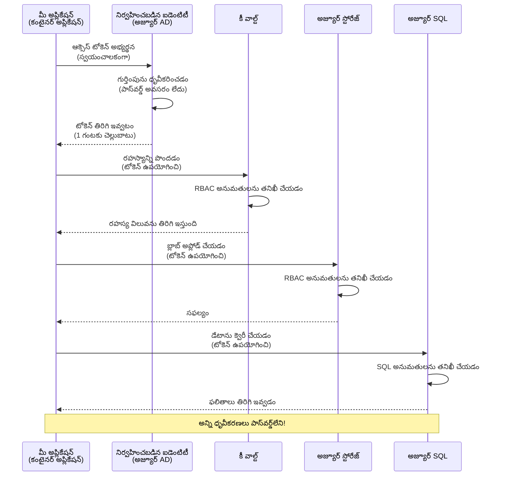
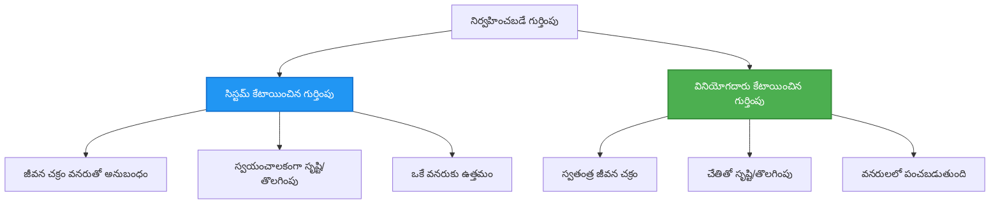

# ప్రామాణీకరణ నమూనాలు మరియు మేనేజ్ చేయబడిన ఐడెంటిటీ

⏱️ **అంచనా సమయం**: 45-60 నిమిషాలు | 💰 **ఖర్చు ప్రభావం**: ఉచితం (ఏ అదనపు చార్జీలు లేవు) | ⭐ **సంపీడ్యత**: మధ్యస్థ

**📚 అభ్యసన మార్గం:**
- ← మునుపటి: [కాన్ఫిగరేషన్ మేనేజ్‌మెంట్](configuration.md) - వాతావరణ నియమాలు మరియు రహస్యాల నిర్వహణ
- 🎯 **మీరు ఇక్కడ ఉన్నారు**: ఆథెంటికేషన్ & సెక్యూరిటీ (మేనేజ్ చేయబడిన ఐడెంటిటీ, Key Vault, సురక్షిత నమూనాలు)
- → తదుపరి: [మొదటి ప్రాజెక్ట్](first-project.md) - మీ తొలి AZD అప్లికేషన్ రూపొందించండి
- 🏠 [కోర్సు హోమ్](../../README.md)

---

## మీరు ఏమి నేర్చుకుంటారో

ఈ పాఠాన్ని పూర్తి చేస్తే, మీరు:
- Azure ఆథెంటికేషన్ నమూనాలను అర్థం చేసుకుంటారు (keys, connection strings, managed identity)
- పాస్‌వర్డ్‌లేని ఆథెంటికేషన్ కోసం **మేనేజ్ చేయబడిన ఐడెంటిటీ** అమలు చేస్తారు
- **Azure Key Vault** ఇంటిగ్రేషన్‌తో రహస్యాలను సురక్షితం చేస్తారు
- AZD డిప్లాయ్‌మెంట్‌ల కోసం **రోల్-ఆధారిత యాక్సెస్ కంట్రోల్ (RBAC)** నియమించటం కన్ఫిగర్ చేసుకుంటారు
- Container Apps మరియు Azure సేవలలో సెక్యూరిటీ బెస్ట్ ప్రాక్టీసులను వర్తింపజేస్తారు
- కీ-ఆధారిత నుండి ఐడెంటిటీ-ఆధారిత ఆథెంటికేషన్‌కు మార్పిడీ చేస్తారు

## మేనేజ్ చేయబడిన ఐడెంటిటీ ఎందుకు ముఖ్యం

### సమస్య: సాంప్రదాయ ఆథెంటికేషన్

**మేనేజ్ చేయబడిన ఐడెంటిటీకి ముందు:**
```javascript
// ❌ భద్రతా ప్రమాదం: కోడ్‌లో హార్డ్‌కోడెడ్ రహస్యాలు
const connectionString = "Server=mydb.database.windows.net;User=admin;Password=P@ssw0rd123";
const storageKey = "xK7mN9pQ2wR5tY8uI0oP3aS6dF1gH4jK...";
const cosmosKey = "C2x7B9n4M1p8Q5w3E6r0T2y5U8i1O4p7...";
```

**సమస్యలు:**
- 🔴 **కోడ్, కాన్ఫిగరేషన్ ఫైళ్లు, వాతావరణ వేరియబుల్లలో** రహస్యాలు బయటపడతాయి
- 🔴 **క్రెడెన్షియల్ రోటేషన్**కు కోడ్ మార్పులు మరియు పునఃడిప్లాయ్ అవసరం
- 🔴 **ఆడిట్ సమస్యలు** - ఎవరు ఏమన్నది, ఎప్పుడు అందుకున్నారు?
- 🔴 **వ్యతిరేక పరికరాలు** - రహస్యాలు అనేక సిస్టమ్స్‌లో విస్తరించినవిగా ఉంటాయి
- 🔴 **అనుకూలత సంబంధిత ռిస్‌కులు** - సెక్యూరిటీ ఆడిట్లలో బదులివ్వదు

### పరిష్కారం: మేనేజ్ చేయబడిన ఐడెంటిటీ

**మేనేజ్ చేయబడిన ఐడెంటిటీ తర్వాత:**
```javascript
// ✅ భద్రత: కోడ్‌లో రహస్యాలు లేవు
const credential = new DefaultAzureCredential();
const client = new BlobServiceClient(
  "https://mystorageaccount.blob.core.windows.net",
  credential  // Azure స్వయంచాలకంగా ప్రామాణీకరణను నిర్వహిస్తుంది
);
```

**లాభాలు:**
- ✅ **కోడ్ లేదా కాన్ఫిగరేషన్‌లో ఏ రహస్యాలూ లేరు**
- ✅ **ఆటోమేటిక్ రోటేషన్** - Azure అది నిర్వహిస్తుంది
- ✅ **Azure AD లాగ్స్‌లో పూర్తి ఆడిట్ ట్రైల్**
- ✅ **కేంద్రీకృత సెక్యూరిటీ** - Azure పోర్టల్‌లో నిర్వహించండి
- ✅ **అనుకూలత సిద్ధంగా ఉంది** - సెక్యూరిటీ ప్రమాణాలకి అనుగుణంగా ఉంటుంది

**ఉదాహరణ**: సాంప్రదాయ ఆథెంటికేషన్ అనేది వివిధ తలుపుల కోసం అనేక ఫిజికల్ కీలు తీసుకెళ్లినట్టే ఉంటుంది. మేనేజ్ చేయబడిన ఐడెంటిటీ అనేది మీరు ఎవరో ఆ ఆధారంగా ఆటోమేటిగ్గా ప్రాప్తి ఇస్తున్న సెక్యూరిటీ బాడ్జ్ లాగా ఉంటుంది—కీలను కోల్పోకుండా, నకలు వేయకుండా లేదా రోటేట్ చేయాల్సిన అవసరం లేదు.

---

## వ్యూహాత్మక అవలోకనం

### మేనేజ్ చేయబడిన ఐడెంటిటితో ఆథెంటికేషన్ ఫ్లో


### మేనేజ్ చేయబడిన ఐడెంటిటీల రకాలు


| ఫీచర్ | సిస్టమ్-అసైన్ చేసినది | యూజర్-అసైన్ చేసినది |
|---------|----------------|---------------|
| **లైఫ్‌సైకిల్** | వనరుతో బంధించబడింది | స్వతంత్రంగా ఉంటుంది |
| **సృష్టి** | వనరుతో ఆటోమాటిక్‌గా | మాన్యువల్ సృష్టి |
| **తొలగింపు** | వనరు తొలగించినప్పుడు తొలగించబడుతుంది | వనరు తొలగించిన తరువాత కూడా నిలుస్తుంది |
| **షేరింగ్** | ఒక్క వనరుకే | అనేక వనరులకు పంచుకోగలదు |
| **వినియోగ ముట్టడి** | సరళ సన్నివేశాలు | సంక్లిష్ట బహు-వనరు సన్నివేశాలు |
| **AZD డిఫాల్ట్** | ✅ సిఫర్తగా సూచించబడింది | ఐచ్ఛికం |

---

## ముందస్తు అవసరాలు

### కావాల్సిన టూల్స్

మీకు ఇప్పటికే ఈ పాఠాల నుంచి దిగువ టూల్స్ ఇన్‌స్టాల్ చేయబడివుండాలి:

```bash
# Azure Developer CLIని నిర్ధారించండి
azd version
# ✅ అపేక్షించబడింది: azd వెర్షన్ 1.0.0 లేదా అంతకంటే పైగా

# Azure CLIని నిర్ధారించండి
az --version
# ✅ అపేక్షించబడింది: azure-cli 2.50.0 లేదా అంతకంటే పైగా
```

### Azure అవసరాలు

- క్రియాశీల Azure సబ్‌స్క్రిప్షన్
- ఈ అనుమతులుండాలి:
  - మేనేజ్ చెల్లే ఐడెంటిటీలను సృష్టించడానికి
  - RBAC పాత్రలు నియమించడానికి
  - Key Vault వనరులను సృష్టించడానికి
  - Container Apps ని డిప్లాయ్ చేయడానికి

### జ్ఞానానికి అవసరమైన ముందస్తులు

మీరు పూర్తి చేశారంటూ ఉండాలి:
- [ఇన్స్టాలేషన్ గైడ్](installation.md) - AZD సెటప్
- [AZD బేసిక్స్](azd-basics.md) - కోర్ కాన్సెప్ట్స్
- [కాన్ఫిగరేషన్ మేనేజ్‌మెంట్](configuration.md) - వాతావరణ వేరియబుల్స్

---

## పాఠం 1: ఆథెంటికేషన్ నమూనాలను అర్థం చేసుకోవడం

### నమూనా 1: కనెక్షన్ స్ట్రింగ్‌లు (పారంపరికం - దూరంగా ఉండండి)

**ఇది ఎలా పనిచేస్తుంది:**
```bash
# కనెక్షన్ స్ట్రింగ్‌లో ప్రమాణీకరణ వివరాలు ఉన్నాయి
STORAGE_CONNECTION_STRING="DefaultEndpointsProtocol=https;AccountName=myaccount;AccountKey=xK7mN9pQ2wR5..."
COSMOS_CONNECTION_STRING="AccountEndpoint=https://myaccount.documents.azure.com:443/;AccountKey=C2x7..."
SQL_CONNECTION_STRING="Server=myserver.database.windows.net;User=admin;Password=P@ssw0rd..."
```

**సమస్యలు:**
- ❌ వాతావరణ వేరియబుల్లలో రహస్యాలు కనిపిస్తాయి
- ❌ డిప్లాయ్‌మెంట్ సిస్టమ్స్‌లో లాగ్ కావచ్చు
- ❌ రోటేట్ చేయడం కష్టమైనది
- ❌ యాక్సెస్ యొక్క ఆడిట్ ట్రైల్ లేదు

**ఎప్పుడు ఉపయోగించాలి:** స్థానిక అభివృద్ధి కోసం మాత్రమే, ποτέ ప్రొడక్షన్‌లో కాదు.

---

### నమూనా 2: Key Vault సూచనలు (మర్చిన దశ - మంచిది)

**ఇది ఎలా పనిచేస్తుంది:**
```bicep
// Store secret in Key Vault
resource keyVault 'Microsoft.KeyVault/vaults@2023-02-01' = {
  name: 'mykv'
  properties: {
    enableRbacAuthorization: true
  }
}

// Reference in Container App
env: [
  {
    name: 'STORAGE_KEY'
    secretRef: 'storage-key'  // References Key Vault
  }
]
```

**లాభాలు:**
- ✅ రహస్యాలు Key Vaultలో సురక్షితంగా స్టోర్ చేయబడతాయి
- ✅ కేంద్రీకృత రహస్య నిర్వహణ
- ✅ కోడ్ మార్పుల ضرورت లేకుండా రోటేషన్

** పరిమితులు:**
- ⚠️ ఇంకా కీలు/పాస్వర్డ్లను ఉపయోగిస్తున్నది
- ⚠️ Key Vault యాక్సెస్‌ను నిర్వహించాల్సి ఉంటుంది

**ఎప్పుడు ఉపయోగించాలి:** కనెక్షన్ స్ట్రింగ్‌ల నుంచి మేనేజ్ చేయబడిన ఐడెంటిటీకి మార్పు చేసే దశలో.

---

### నమూనా 3: మేనేజ్ చేయబడిన ఐడెంటిటీ (ఉత్తమ ప్రాక్టీస్)

**ఇది ఎలా పనిచేస్తుంది:**
```bicep
// Enable managed identity
resource containerApp 'Microsoft.App/containerApps@2023-05-01' = {
  name: 'myapp'
  identity: {
    type: 'SystemAssigned'  // Automatically creates identity
  }
}

// Grant permissions
resource roleAssignment 'Microsoft.Authorization/roleAssignments@2022-04-01' = {
  scope: storageAccount
  properties: {
    roleDefinitionId: storageBlobDataContributorRole
    principalId: containerApp.identity.principalId
  }
}
```

**అప్లికేషన్ కోడ్:**
```javascript
// రహస్యాలు అవసరం లేదు!
const { DefaultAzureCredential } = require('@azure/identity');
const { BlobServiceClient } = require('@azure/storage-blob');

const credential = new DefaultAzureCredential();
const blobServiceClient = new BlobServiceClient(
  'https://mystorageaccount.blob.core.windows.net',
  credential
);
```

**లాభాలు:**
- ✅ కోడ్/కాన్ఫిగరేషన్‌లో ఏ రహస్యాలూ లేవు
- ✅ ఆటోమేటిక్ క్రెడెన్షియల్ రోటేషన్
- ✅ పూర్తి ఆడిట్ ట్రైల్
- ✅ RBAC-ఆధారిత అనుమతులు
- ✅ అనుకూలత సిద్ధంగా ఉంది

**ఎప్పుడు ఉపయోగించాలి:** ఎప్పుడైతే—ప్రొడక్షన్ అప్లికేషన్ల కోసం ఎల్లప్పుడూ.

---

## పాఠం 2: AZD తో మేనేజ్ చేయబడిన ఐడెంటిటీ అమలు

### దశల వారీ అమలు

మనం ఒక సురక్షిత Container App ను నిర్మిద్దాం, ఇది Azure Storage మరియు Key Vault కి యాక్సెస్ కోసం మేనేజ్ చేయబడిన ఐడెంటిటిని ఉపయోగిస్తుంది.

### ప్రాజెక్ట్ నిర్మాణం

```
secure-app/
├── azure.yaml                 # AZD configuration
├── infra/
│   ├── main.bicep            # Main infrastructure
│   ├── core/
│   │   ├── identity.bicep    # Managed identity setup
│   │   ├── keyvault.bicep    # Key Vault configuration
│   │   └── storage.bicep     # Storage with RBAC
│   └── app/
│       └── container-app.bicep
└── src/
    ├── app.js                # Application code
    ├── package.json
    └── Dockerfile
```

### 1. AZD (azure.yaml) ను కాన్ఫిగర్ చేయండి

```yaml
name: secure-app
metadata:
  template: secure-app@1.0.0

services:
  api:
    project: ./src
    language: js
    host: containerapp

# Enable managed identity (AZD handles this automatically)
```

### 2. ఇన్‌ఫ్రాస్ట్రక్చర్: మేనేజ్ చేయబడిన ఐడెంటిటీని యాక్టివేట్ చేయండి

**ఫైల్: `infra/main.bicep`**

```bicep
targetScope = 'subscription'

param environmentName string
param location string = 'eastus'

var tags = { 'azd-env-name': environmentName }

// Resource group
resource rg 'Microsoft.Resources/resourceGroups@2021-04-01' = {
  name: 'rg-${environmentName}'
  location: location
  tags: tags
}

// Storage Account
module storage './core/storage.bicep' = {
  name: 'storage'
  scope: rg
  params: {
    name: 'st${uniqueString(rg.id)}'
    location: location
    tags: tags
  }
}

// Key Vault
module keyVault './core/keyvault.bicep' = {
  name: 'keyvault'
  scope: rg
  params: {
    name: 'kv-${uniqueString(rg.id)}'
    location: location
    tags: tags
  }
}

// Container App with Managed Identity
module containerApp './app/container-app.bicep' = {
  name: 'container-app'
  scope: rg
  params: {
    name: 'ca-${environmentName}'
    location: location
    tags: tags
    storageAccountName: storage.outputs.name
    keyVaultName: keyVault.outputs.name
  }
}

// Grant Container App access to Storage
module storageRoleAssignment './core/role-assignment.bicep' = {
  name: 'storage-role'
  scope: rg
  params: {
    principalId: containerApp.outputs.identityPrincipalId
    roleDefinitionId: 'ba92f5b4-2d11-453d-a403-e96b0029c9fe'  // Storage Blob Data Contributor
    targetResourceId: storage.outputs.id
  }
}

// Grant Container App access to Key Vault
module kvRoleAssignment './core/role-assignment.bicep' = {
  name: 'kv-role'
  scope: rg
  params: {
    principalId: containerApp.outputs.identityPrincipalId
    roleDefinitionId: '4633458b-17de-408a-b874-0445c86b69e6'  // Key Vault Secrets User
    targetResourceId: keyVault.outputs.id
  }
}

// Outputs
output AZURE_STORAGE_ACCOUNT_NAME string = storage.outputs.name
output AZURE_KEY_VAULT_NAME string = keyVault.outputs.name
output APP_URL string = containerApp.outputs.url
```

### 3. సిస్టమ్-అసైన్ ఐడెంటిటీతో కూడిన Container App

**ఫైల్: `infra/app/container-app.bicep`**

```bicep
param name string
param location string
param tags object = {}
param storageAccountName string
param keyVaultName string

resource containerApp 'Microsoft.App/containerApps@2023-05-01' = {
  name: name
  location: location
  tags: tags
  identity: {
    type: 'SystemAssigned'  // 🔑 Enable managed identity
  }
  properties: {
    configuration: {
      ingress: {
        external: true
        targetPort: 3000
      }
    }
    template: {
      containers: [
        {
          name: 'api'
          image: 'myregistry.azurecr.io/api:latest'
          resources: {
            cpu: json('0.5')
            memory: '1Gi'
          }
          env: [
            {
              name: 'AZURE_STORAGE_ACCOUNT_NAME'
              value: storageAccountName
            }
            {
              name: 'AZURE_KEY_VAULT_NAME'
              value: keyVaultName
            }
            // 🔑 No secrets - managed identity handles authentication!
          ]
        }
      ]
    }
  }
}

// Output the identity for RBAC assignments
output identityPrincipalId string = containerApp.identity.principalId
output id string = containerApp.id
output url string = 'https://${containerApp.properties.configuration.ingress.fqdn}'
```

### 4. RBAC పాత్ర నియామక మాడ్యూల్

**ఫైల్: `infra/core/role-assignment.bicep`**

```bicep
param principalId string
param roleDefinitionId string  // Azure built-in role ID
param targetResourceId string

resource roleAssignment 'Microsoft.Authorization/roleAssignments@2022-04-01' = {
  name: guid(principalId, roleDefinitionId, targetResourceId)
  scope: resourceId('Microsoft.Resources/resourceGroups', resourceGroup().name)
  properties: {
    roleDefinitionId: subscriptionResourceId('Microsoft.Authorization/roleDefinitions', roleDefinitionId)
    principalId: principalId
    principalType: 'ServicePrincipal'
  }
}

output id string = roleAssignment.id
```

### 5. మేనేజ్ చేయబడిన ఐడెంటిటీతో అప్లికేషన్ కోడ్

**ఫైల్: `src/app.js`**

```javascript
const express = require('express');
const { DefaultAzureCredential } = require('@azure/identity');
const { BlobServiceClient } = require('@azure/storage-blob');
const { SecretClient } = require('@azure/keyvault-secrets');

const app = express();
const PORT = process.env.PORT || 3000;

// 🔑 క్రెడెన్షియల్‌ను ప్రారంభించండి (Managed Identityతో స్వయంచాలకంగా పని చేస్తుంది)
const credential = new DefaultAzureCredential();

// Azure స్టోరేజ్ అమరిక
const storageAccountName = process.env.AZURE_STORAGE_ACCOUNT_NAME;
const blobServiceClient = new BlobServiceClient(
  `https://${storageAccountName}.blob.core.windows.net`,
  credential  // ఏ కీలు అవసరం లేదు!
);

// Key Vault అమరిక
const keyVaultName = process.env.AZURE_KEY_VAULT_NAME;
const secretClient = new SecretClient(
  `https://${keyVaultName}.vault.azure.net`,
  credential  // ఏ కీలు అవసరం లేదు!
);

// ఆరోగ్య తనిఖీ
app.get('/health', (req, res) => {
  res.json({ status: 'healthy', authentication: 'managed-identity' });
});

// ఫైల్‌ను బ్లాబ్ స్టోరేజ్‌కు అప్లోడ్ చేయండి
app.post('/upload', async (req, res) => {
  try {
    const containerClient = blobServiceClient.getContainerClient('uploads');
    await containerClient.createIfNotExists();
    
    const blobName = `file-${Date.now()}.txt`;
    const blockBlobClient = containerClient.getBlockBlobClient(blobName);
    
    await blockBlobClient.upload('Hello from managed identity!', 30);
    
    res.json({
      success: true,
      blobName: blobName,
      message: 'File uploaded using managed identity!'
    });
  } catch (error) {
    console.error('Upload error:', error);
    res.status(500).json({ error: error.message });
  }
});

// Key Vault నుండి రహస్యం పొందండి
app.get('/secret/:name', async (req, res) => {
  try {
    const secretName = req.params.name;
    const secret = await secretClient.getSecret(secretName);
    
    res.json({
      name: secretName,
      value: secret.value,
      message: 'Secret retrieved using managed identity!'
    });
  } catch (error) {
    console.error('Secret error:', error);
    res.status(500).json({ error: error.message });
  }
});

// బ్లాబ్ కంటైనర్లను జాబితా చేయండి (రీడ్ యాక్సెస్‌ను ప్రదర్శిస్తుంది)
app.get('/containers', async (req, res) => {
  try {
    const containers = [];
    for await (const container of blobServiceClient.listContainers()) {
      containers.push(container.name);
    }
    
    res.json({
      containers: containers,
      count: containers.length,
      message: 'Containers listed using managed identity!'
    });
  } catch (error) {
    console.error('List error:', error);
    res.status(500).json({ error: error.message });
  }
});

app.listen(PORT, () => {
  console.log(`Secure API listening on port ${PORT}`);
  console.log('Authentication: Managed Identity (passwordless)');
});
```

**ఫైల్: `src/package.json`**

```json
{
  "name": "secure-app",
  "version": "1.0.0",
  "dependencies": {
    "express": "^4.18.2",
    "@azure/identity": "^4.0.0",
    "@azure/storage-blob": "^12.17.0",
    "@azure/keyvault-secrets": "^4.7.0"
  },
  "scripts": {
    "start": "node app.js"
  }
}
```

### 6. డిప్లాయ్ చేసి పరీక్షించండి

```bash
# AZD పర్యావరణాన్ని ప్రారంభించండి
azd init

# ఇన్ఫ్రాస్ట్రక్చర్ మరియు అప్లికేషన్‌ను అమర్చండి
azd up

# అప్లికేషన్ URL‌ను పొందండి
APP_URL=$(azd env get-values | grep APP_URL | cut -d '=' -f2 | tr -d '"')

# హెల్త్ చెక్‌ను పరీక్షించండి
curl $APP_URL/health
```

**✅ ఆశించిన అవుట్‌పుట్:**
```json
{
  "status": "healthy",
  "authentication": "managed-identity"
}
```

**బ్లాబ్ అప్‌లోడ్ పరీక్షించండి:**
```bash
curl -X POST $APP_URL/upload
```

**✅ ఆశించిన అవుట్‌పుట్:**
```json
{
  "success": true,
  "blobName": "file-1700404800000.txt",
  "message": "File uploaded using managed identity!"
}
```

**కంటైనర్ లిస్టింగ్ పరీక్షించండి:**
```bash
curl $APP_URL/containers
```

**✅ ఆశించిన అవుట్‌పుట్:**
```json
{
  "containers": ["uploads"],
  "count": 1,
  "message": "Containers listed using managed identity!"
}
```

---

## సాధారణ Azure RBAC పాత్రలు

### మేనేజ్ చేయబడిన ఐడెంటిటీ కోసం బిల్ట్-ఇన్ రోల్ ID లు

| సేవ | పాత్ర పేరు | పాత్ర ID | అనుమతులు |
|---------|-----------|---------|-------------|
| **Storage** | Storage Blob Data Reader | `2a2b9908-6b94-4a3d-8e5a-a7d8f8cc8a12` | బ్లాబ్స్ మరియు కంటెయినర్లను చదవగలదు |
| **Storage** | Storage Blob Data Contributor | `ba92f5b4-2d11-453d-a403-e96b0029c9fe` | బ్లాబ్స్ చదవడం, రాయడం, తొలగించడం |
| **Storage** | Storage Queue Data Contributor | `974c5e8b-45b9-4653-ba55-5f855dd0fb88` | క్యూయూ సందేశాలు చదవడం, రాయడం, తొలగించడం |
| **Key Vault** | Key Vault Secrets User | `4633458b-17de-408a-b874-0445c86b69e6` | సీక్రెట్స్ చదవగలదు |
| **Key Vault** | Key Vault Secrets Officer | `b86a8fe4-44ce-4948-aee5-eccb2c155cd7` | సీక్రెట్స్ చదవడం, రాయడం, తొలగించడం |
| **Cosmos DB** | Cosmos DB Built-in Data Reader | `00000000-0000-0000-0000-000000000001` | Cosmos DB డాటాను చదవడం |
| **Cosmos DB** | Cosmos DB Built-in Data Contributor | `00000000-0000-0000-0000-000000000002` | Cosmos DB డాటాను చదవడం, రాయడం |
| **SQL Database** | SQL DB Contributor | `9b7fa17d-e63e-47b0-bb0a-15c516ac86ec` | SQL డాటాబేస్లను నిర్వహించండి |
| **Service Bus** | Azure Service Bus Data Owner | `090c5cfd-751d-490a-894a-3ce6f1109419` | సందేశాలను పంపడం, స్వీకరించడం, నిర్వహించడం |

### పాత్ర IDలను ఎలా కనుగొనాలి

```bash
# అన్ని అంతర్గత పాత్రలను జాబితా చేయండి
az role definition list --query "[].{Name:roleName, ID:name}" --output table

# నిర్దిష్ట పాత్ర కోసం శోధించండి
az role definition list --query "[?contains(roleName, 'Storage Blob')].{Name:roleName, ID:name}" --output table

# పాత్ర వివరాలు పొందండి
az role definition list --name "Storage Blob Data Contributor"
```

---

## ప్రయోగాత్మక వ్యాయామాలు

### వ్యాయామం 1: ఉన్న అప్లికేషన్ కోసం మేనేజ్ చేయబడిన ఐడెంటిటీను యాక్టివేట్ చేయండి ⭐⭐ (మధ్యస్థ)

**లక్ష్యం**: ఉన్న Container App డిప్లాయ్‌మెంట్‌లో మేనేజ్ చేయబడిన ఐడెంటిటీని చేర్చడం

**దృశ్యం**: మీకు కనెక్షన్ స్ట్రింగ్‌లను ఉపయోగించే Container App ఉంది. దాన్ని మేనేజ్ చేయబడిన ఐడెంటిటీకి మార్చండి.

**ప్రారంభిక స్థితి**: ఈ కాన్ఫిగరేషన్ ఉన్న Container App:

```bicep
// ❌ Current: Using connection string
env: [
  {
    name: 'STORAGE_CONNECTION_STRING'
    secretRef: 'storage-connection'
  }
]
```

**దశలు**:

1. **Bicepలో మేనేజ్ చేయబడిన ఐడెంటిటీని ప్రారంభించండి:**

```bicep
resource containerApp 'Microsoft.App/containerApps@2023-05-01' = {
  name: 'myapp'
  identity: {
    type: 'SystemAssigned'  // Add this
  }
  // ... rest of configuration
}
```

2. **Storage యాక్సెస్ ఇవ్వండి:**

```bicep
// Get storage account reference
resource storageAccount 'Microsoft.Storage/storageAccounts@2023-01-01' existing = {
  name: storageAccountName
}

// Assign role
resource roleAssignment 'Microsoft.Authorization/roleAssignments@2022-04-01' = {
  name: guid(containerApp.id, 'ba92f5b4-2d11-453d-a403-e96b0029c9fe', storageAccount.id)
  scope: storageAccount
  properties: {
    roleDefinitionId: subscriptionResourceId('Microsoft.Authorization/roleDefinitions', 'ba92f5b4-2d11-453d-a403-e96b0029c9fe')
    principalId: containerApp.identity.principalId
    principalType: 'ServicePrincipal'
  }
}
```

3. **అప్లికేషన్ కోడ్ ను నవీకరించండి:**

**ముందు (కనెక్షన్ స్ట్రింగ్):**
```javascript
const { BlobServiceClient } = require('@azure/storage-blob');

const blobServiceClient = BlobServiceClient.fromConnectionString(
  process.env.STORAGE_CONNECTION_STRING
);
```

**తరువాత (మేనేజ్ చేయబడిన ఐడెంటిటీ):**
```javascript
const { DefaultAzureCredential } = require('@azure/identity');
const { BlobServiceClient } = require('@azure/storage-blob');

const credential = new DefaultAzureCredential();
const blobServiceClient = new BlobServiceClient(
  `https://${process.env.STORAGE_ACCOUNT_NAME}.blob.core.windows.net`,
  credential
);
```

4. **వాతావరణ వేరియబుల్స్ ను అప్డేట్ చేయండి:**

```bicep
env: [
  {
    name: 'STORAGE_ACCOUNT_NAME'
    value: storageAccountName  // Just the name, no secrets!
  }
  // Remove STORAGE_CONNECTION_STRING
]
```

5. **డిప్లాయ్ చేసి పరీక్షించండి:**

```bash
# మళ్లీ అమలు చేయండి
azd up

# ఇది ఇంకా పనిచేస్తుందో పరీక్షించండి
curl https://myapp.azurecontainerapps.io/upload
```

**✅ విజయం ప్రమాణాలు:**
- ✅ అప్లికేషన్ ఎర్రర్లు లేకుండా డిప్లాయ్ అవుతుంది
- ✅ స్టోరేజ్ ఆపరేషన్లు పనిచేస్తాయి (అప్‌లోడ్, లిస్ట్, డౌన్లోడ్)
- ✅ వాతావరణ వేరియబుల్స్‌లో కనెక్షన్ స్ట్రింగ్‌లు లేవు
- ✅ Azure పోర్టల్‌లో "Identity" బ్లేడ్ కింద ఐడెంటిటీ కనిపిస్తుంది

**పరిశీలన:**

```bash
# మెనేజ్డ్ ఐడెంటిటీ సక్రియంగా ఉందో తనిఖీ చేయండి
az containerapp show \
  --name myapp \
  --resource-group rg-myapp \
  --query "identity.type"
# ✅ ఆశించినది: "SystemAssigned"

# పాత్ర కేటాయింపును తనిఖీ చేయండి
az role assignment list \
  --assignee $(az containerapp show --name myapp --resource-group rg-myapp --query "identity.principalId" -o tsv) \
  --scope /subscriptions/{sub-id}/resourceGroups/rg-myapp/providers/Microsoft.Storage/storageAccounts/mystorageaccount
# ✅ ఆశించినది: "Storage Blob Data Contributor" పాత్రను చూపిస్తుంది
```

**సమయం**: 20-30 నిమిషాలు

---

### వ్యాయామం 2: యూజర్-అసైన్ ఐడెంటిటీతో బహు-సేవ యాక్సెస్ ⭐⭐⭐ (అధిక)

**లక్ష్యం**: అనేక Container Apps మధ్య పంచుకునే యూజర్-అసైన్ ఐడెంటిటీని సృష్టించండి

**దృశ్యం**: మీకు 3 మైక్రోసర్వీసులు ఉన్నాయి, అవి ఒకే Storage ఖాతా మరియు Key Vault కి యాక్సెస్ చేయాలి.

**దశలు**:

1. **యూజర్-అసైన్ ఐడెంటిటీ సృష్టించండి:**

**ఫైల్: `infra/core/identity.bicep`**

```bicep
param name string
param location string
param tags object = {}

resource userAssignedIdentity 'Microsoft.ManagedIdentity/userAssignedIdentities@2023-01-31' = {
  name: name
  location: location
  tags: tags
}

output id string = userAssignedIdentity.id
output principalId string = userAssignedIdentity.properties.principalId
output clientId string = userAssignedIdentity.properties.clientId
```

2. **యూజర్-అసైన్ ఐడెంటిటీకి పాత్రలు అప్పగించండి:**

```bicep
// In main.bicep
module userIdentity './core/identity.bicep' = {
  name: 'user-identity'
  scope: rg
  params: {
    name: 'id-${environmentName}'
    location: location
    tags: tags
  }
}

// Grant Storage access
resource storageRoleAssignment 'Microsoft.Authorization/roleAssignments@2022-04-01' = {
  name: guid(userIdentity.outputs.principalId, 'storage-contributor')
  scope: storageAccount
  properties: {
    roleDefinitionId: subscriptionResourceId('Microsoft.Authorization/roleDefinitions', 'ba92f5b4-2d11-453d-a403-e96b0029c9fe')
    principalId: userIdentity.outputs.principalId
    principalType: 'ServicePrincipal'
  }
}

// Grant Key Vault access
resource kvRoleAssignment 'Microsoft.Authorization/roleAssignments@2022-04-01' = {
  name: guid(userIdentity.outputs.principalId, 'kv-secrets-user')
  scope: keyVault
  properties: {
    roleDefinitionId: subscriptionResourceId('Microsoft.Authorization/roleDefinitions', '4633458b-17de-408a-b874-0445c86b69e6')
    principalId: userIdentity.outputs.principalId
    principalType: 'ServicePrincipal'
  }
}
```

3. **ఐడెంటిటీని అనేక Container Apps కి అప్పగించండి:**

```bicep
resource apiGateway 'Microsoft.App/containerApps@2023-05-01' = {
  name: 'api-gateway'
  identity: {
    type: 'UserAssigned'
    userAssignedIdentities: {
      '${userIdentity.outputs.id}': {}
    }
  }
  // ... rest of config
}

resource productService 'Microsoft.App/containerApps@2023-05-01' = {
  name: 'product-service'
  identity: {
    type: 'UserAssigned'
    userAssignedIdentities: {
      '${userIdentity.outputs.id}': {}
    }
  }
  // ... rest of config
}

resource orderService 'Microsoft.App/containerApps@2023-05-01' = {
  name: 'order-service'
  identity: {
    type: 'UserAssigned'
    userAssignedIdentities: {
      '${userIdentity.outputs.id}': {}
    }
  }
  // ... rest of config
}
```

4. **అప్లికేషన్ కోడ్ (అన్ని సేవలు అదే నమూనాను ఉపయోగిస్తాయి):**

```javascript
const { DefaultAzureCredential, ManagedIdentityCredential } = require('@azure/identity');

// వాడుకరి కేటాయించిన గుర్తింపుకు క్లయింట్ IDని పేర్కొనండి
const credential = new ManagedIdentityCredential(
  process.env.AZURE_CLIENT_ID  // వాడుకరి కేటాయించిన గుర్తింపు క్లయింట్ ID
);

// లేదా DefaultAzureCredential ఉపయోగించండి (ఆటోగా గుర్తిస్తుంది)
const credential = new DefaultAzureCredential();

const blobServiceClient = new BlobServiceClient(
  `https://${process.env.STORAGE_ACCOUNT_NAME}.blob.core.windows.net`,
  credential
);
```

5. **డిప్లాయ్ చేసి ధృవీకరించండి:**

```bash
azd up

# అన్ని సేవలు స్టోరేజ్‌ను యాక్సెస్ చేయగలవో పరీక్షించండి
curl https://api-gateway.azurecontainerapps.io/upload
curl https://product-service.azurecontainerapps.io/upload
curl https://order-service.azurecontainerapps.io/upload
```

**✅ విజయం ప్రమాణాలు:**
- ✅ ఒకే ఐడెంటిటీ 3 సేవల మధ్య పంచబడింది
- ✅ అన్ని సేవలు Storage మరియు Key Vault ని యాక్సెస్ చేయగలవు
- ✅ ఒక సేవను తొలగించినా ఐడెంటిటీ నిలుస్తుంది
- ✅ కేంద్రీకృత అనుమతి నిర్వహణ

యూజర్-అసైన్ ఐడెంటిటీ లాభాలు:
- నిర్వహించడానికి ఒకే ఐడెంటిటీ
- సేవల మధ్య స్థిరమైన అనుమతులు
- సేవ తొలగింపున తర్వాత కూడా నిలుపుకుందీ
- సంక్లిష్ట ఆర్కిటెక్చర్ల కోసం బెటర్

**సమయం**: 30-40 నిమిషాలు

---

### వ్యాయామం 3: Key Vault సీక్రెట్ రోటేషన్ అమలు చేయండి ⭐⭐⭐ (అధిక)

**లక్ష్యం**: మేనేజ్ చేయబడిన ఐడెంటిటీ ఉపయోగించి తృతీయ-పక్ష API కీలు Key Vaultలో నిల్వ చేయండి మరియు యాక్సెస్ చేయండి

**దృశ్యం**: మీ అప్లికేషన్ బాహ్య API (OpenAI, Stripe, SendGrid) కాల్ చేయాల్సి ఉంటుంది, అవి API కీలు అవసరం.

**దశలు**:

1. **RBAC తో Key Vault సృష్టించండి:**

**ఫైల్: `infra/core/keyvault.bicep`**

```bicep
param name string
param location string
param tags object = {}

resource keyVault 'Microsoft.KeyVault/vaults@2023-02-01' = {
  name: name
  location: location
  tags: tags
  properties: {
    enableRbacAuthorization: true  // Use RBAC instead of access policies
    sku: {
      family: 'A'
      name: 'standard'
    }
    tenantId: subscription().tenantId
    enableSoftDelete: true
    softDeleteRetentionInDays: 90
  }
}

// Allow Container App to read secrets
output id string = keyVault.id
output name string = keyVault.name
output uri string = keyVault.properties.vaultUri
```

2. **Key Vaultలో సీక్రెట్‌లు నిల్వ చెయ్యండి:**

```bash
# Key Vault పేరు పొందండి
KV_NAME=$(azd env get-values | grep AZURE_KEY_VAULT_NAME | cut -d '=' -f2 | tr -d '"')

# తృతీయ పక్షాల API కీలు నిల్వ చేయండి
az keyvault secret set \
  --vault-name $KV_NAME \
  --name "OpenAI-ApiKey" \
  --value "sk-proj-xxxxxxxxxxxxx"

az keyvault secret set \
  --vault-name $KV_NAME \
  --name "Stripe-ApiKey" \
  --value "sk_live_xxxxxxxxxxxxx"

az keyvault secret set \
  --vault-name $KV_NAME \
  --name "SendGrid-ApiKey" \
  --value "SG.xxxxxxxxxxxxx"
```

3. **సీక్రెట్‌లను పొందడానికి అప్లికేషన్ కోడ్:**

**ఫైల్: `src/config.js`**

```javascript
const { DefaultAzureCredential } = require('@azure/identity');
const { SecretClient } = require('@azure/keyvault-secrets');

class Config {
  constructor() {
    this.credential = new DefaultAzureCredential();
    this.secretClient = new SecretClient(
      `https://${process.env.AZURE_KEY_VAULT_NAME}.vault.azure.net`,
      this.credential
    );
    this.cache = {};
  }

  async getSecret(secretName) {
    // ముందుగా క్యాష్‌ను తనిఖీ చేయండి
    if (this.cache[secretName]) {
      return this.cache[secretName];
    }

    try {
      const secret = await this.secretClient.getSecret(secretName);
      this.cache[secretName] = secret.value;
      console.log(`✅ Retrieved secret: ${secretName}`);
      return secret.value;
    } catch (error) {
      console.error(`❌ Failed to get secret ${secretName}:`, error.message);
      throw error;
    }
  }

  async getOpenAIKey() {
    return this.getSecret('OpenAI-ApiKey');
  }

  async getStripeKey() {
    return this.getSecret('Stripe-ApiKey');
  }

  async getSendGridKey() {
    return this.getSecret('SendGrid-ApiKey');
  }
}

module.exports = new Config();
```

4. **అప్లికేషన్‌లో సీక్రెట్‌లు ఉపయోగించండి:**

**ఫైల్: `src/app.js`**

```javascript
const express = require('express');
const config = require('./config');
const { OpenAI } = require('openai');

const app = express();

// Key Vault నుండి కీని ఉపయోగించి OpenAIని ప్రారంభించండి
let openaiClient;

async function initializeServices() {
  const openaiKey = await config.getOpenAIKey();
  openaiClient = new OpenAI({ apiKey: openaiKey });
  console.log('✅ Services initialized with secrets from Key Vault');
}

// స్టార్ట్‌అప్ సమయంలో పిలవండి
initializeServices().catch(console.error);

app.post('/chat', async (req, res) => {
  try {
    const completion = await openaiClient.chat.completions.create({
      model: 'gpt-4.1',
      messages: [{ role: 'user', content: 'Hello!' }]
    });
    
    res.json({
      response: completion.choices[0].message.content,
      authentication: 'Key from Key Vault via Managed Identity'
    });
  } catch (error) {
    res.status(500).json({ error: error.message });
  }
});

app.listen(3000, () => {
  console.log('Secure API with Key Vault integration running');
});
```

5. **డిప్లాయ్ చేసి పరీక్షించండి:**

```bash
azd up

# API కీలు పనిచేస్తున్నాయో పరీక్షించండి
curl -X POST https://myapp.azurecontainerapps.io/chat \
  -H "Content-Type: application/json" \
  -d '{"message":"Hello AI"}'
```

**✅ విజయం ప్రమాణాలు:**
- ✅ కోడ్ లేదా వాతావరణ వేరియబుల్స్‌లో API కీలు లేవు
- ✅ అప్లికేషన్ Key Vault నుంచి కీలు తెచ్చుకుంటుంది
- ✅ తృతీయ-పక్ష APIలు సరిగ్గా పనిచేస్తున్నాయి
- ✅ కోడ్ మార్పుల అవసరం లేకుండా కీలు రోటేట్ చేయగలరు

సీక్రెట్ రోటేట్ చేయండి:

```bash
# కీ వాల్ట్‌లో రహస్యాన్ని నవీకరించండి
az keyvault secret set \
  --vault-name $KV_NAME \
  --name "OpenAI-ApiKey" \
  --value "sk-proj-NEW_KEY_HERE"

# కొత్త కీని లోడ్ చేయడానికి యాప్‌ను పునఃప్రారంభించండి
az containerapp revision restart \
  --name myapp \
  --resource-group rg-myapp
```

**సమయం**: 25-35 నిమిషాలు

---

## జ్ఞాన పరీక్ష స్థలం

### 1. ఆథెంటికేషన్ నమూనాలు ✓

మీ అర్థాన్ని పరీక్షించుకోండి:

- [ ] **Q1**: మూడు ప్రధాన ఆథెంటికేషన్ నమూనాలు ఏమిటి?
  - **A**: కనెక్షన్ స్ట్రింగ్‌లు (పారంపరికం), Key Vault సూచనలు (మార్పిడి దశ), మేనేజ్ చేయబడిన ఐడెంటిటీ (ఉత్తమం)

- [ ] **Q2**: మేనేజ్ చేయబడిన ఐడెంటిటీ కనెక్షన్ స్ట్రింగ్‌ల కంటే ఎందుకు మెరుగ్గా ఉంటుంది?
  - **A**: కోడ్‌లో రహస్యాలు లేవు, ఆటోమేటిక్ రోటేషన్, పూర్తి ఆడిట్ ట్రైల్, RBAC అనుమతులు

- [ ] **Q3**: వ్యవస్థ-అసైన్ చేసినది స్థానంలో యూజర్-అసైన్ ఐడెంటిటీని ఎప్పుడు ఉపయోగిస్తారు?
  - **A**: ఐడెంటిటీని అనేక వనరుల మధ్య పంచుకోవాల్సినప్పుడు లేదా ఐడెంటిటీ లైఫ్‌సైకిల్ వనరు లైఫ్‌సైకిల్ నుంచి స్వతంత్రంగా ఉండాలి అనిపిస్తే

**హ్యాండ్స్-ఆన్ ధృవీకరణ:**
```bash
# మీ యాప్ ఉపయోగించే గుర్తింపు రకం ఏదో తనిఖీ చేయండి
az containerapp show \
  --name myapp \
  --resource-group rg-myapp \
  --query "identity.type"

# ఆ గుర్తింపుకు సంబంధించిన అన్ని పాత్ర నియామకాలను జాబితా చేయండి
az role assignment list \
  --assignee $(az containerapp show --name myapp --resource-group rg-myapp --query "identity.principalId" -o tsv)
```

---

### 2. RBAC మరియు అనుమతులు ✓

మీ అర్థాన్ని పరీక్షించుకోండి:

- [ ] **Q1**: "Storage Blob Data Contributor" కోసం పాత్ర ID ఏమిటి?
  - **A**: `ba92f5b4-2d11-453d-a403-e96b0029c9fe`

- [ ] **Q2**: "Key Vault Secrets User" ఏ అనుమతులు ఇస్తుంది?
  - **A**: సీక్రెట్స్ కు పఠన-అధికారము (సృష్టించడం, నవీకరించడం లేదా తొలగించడం చేయలేరు)

- [ ] **Q3**: Container Appకి Azure SQL యాక్సెస్ ఇవ్వడానికి ఎలా చేస్తారు?
  - **A**: "SQL DB Contributor" పాత్రను అప్పగించండి లేదా SQL కోసం Azure AD ఆథెంటికేషన్‌ను కాన్ఫిగర్ చేయండి

**హ్యాండ్స్-ఆన్ ధృవీకరణ:**
```bash
# నిర్దిష్ట పాత్రను కనుగొనండి
az role definition list --name "Storage Blob Data Contributor"

# మీ గుర్తింపుకు ఏ పాత్రలు కేటాయించబడ్డాయో తనిఖీ చేయండి
PRINCIPAL_ID=$(az containerapp show --name myapp --resource-group rg-myapp --query "identity.principalId" -o tsv)
az role assignment list --assignee $PRINCIPAL_ID --output table
```

---

### 3. Key Vault ఇంటిగ్రేషన్ ✓
- [ ] **Q1**: Key Vault కోసం యాక్సెస్ పాలసీల బదులుగా RBAC ను ఎలా ఎనేబుల్ చేయాలి?
  - **A**: Bicep లో `enableRbacAuthorization: true` సెట్ చేయండి

- [ ] **Q2**: Managed identity authentication ను ఏ Azure SDK లైబ్రరీ నిర్వహిస్తుంది?
  - **A**: `@azure/identity` తో `DefaultAzureCredential` క్లాస్

- [ ] **Q3**: Key Vault సీక్రెట్లు cache లో ఎంత కాలం ఉంటాయి?
  - **A**: అప్లికేషన్‌పై ఆధారపడి ఉంటుంది; మీ స్వంత caching వ్యూహాన్ని అమలు చేయండి

**Hands-On Verification:**
```bash
# Key Vault యాక్సెస్‌ను పరీక్షించండి
az keyvault secret show \
  --vault-name $KV_NAME \
  --name "OpenAI-ApiKey" \
  --query "value"

# RBAC అమలులో ఉందా అని తనిఖీ చేయండి
az keyvault show \
  --name $KV_NAME \
  --query "properties.enableRbacAuthorization"
# ✅ అంచనా: true
```

---

## భద్రత ఉత్తమ ఆచరణలు

### ✅ చేయండి:

1. **ప్రొడక్షన్‌లో ఎల్లప్పుడూ మ్యానేజ్డ్ ఐడెంటిటీను ఉపయోగించండి**
   ```bicep
   identity: {
     type: 'SystemAssigned'
   }
   ```

2. **కనిష్ట-హక్కుల RBAC పాత్రలను ఉపయోగించండి**
   - సాధ్యమైతే "Reader" పాత్రలను ఉపయోగించండి
   - అవసరమైతే మాత్రమే "Owner" లేదా "Contributor" సేవించండి

3. **తృతీయ పక్ష కీలు Key Vault లో నిల్వ చేయండి**
   ```javascript
   const apiKey = await secretClient.getSecret('ThirdPartyApiKey');
   ```

4. **ఆడిట్ లాగింగ్‌ను సక్రియం చేయండి**
   ```bicep
   diagnosticSettings: {
     logs: [{ category: 'AuditEvent', enabled: true }]
   }
   ```

5. **dev/staging/prod కోసం వేర్వేరు ఐడెంటిటీలను ఉపయోగించండి**
   ```bash
   azd env new dev
   azd env new staging
   azd env new prod
   ```

6. **సీక్రెట్లను నియమితంగా రొటేట్ చేయండి**
   - Key Vault సీక్రెట్లపై గడువు తేదీలను సెట్ చేయండి
   - Azure Functions ద్వారా రొటేషన్‌ను ఆటోమేట్ చేయండి

### ❌ చేయొద్దు:

1. **ఎప్పుడూ సీక్రెట్లను హార్డ్‌కోడ్ చేయవద్దు**
   ```javascript
   // ❌ చెడు
   const apiKey = "sk-proj-xxxxxxxxxxxxx";
   ```

2. **ప్రొడక్షన్‌లో కనెక్షన్ స్ట్రింగ్స్ ఉపయోగించకండి**
   ```javascript
   // ❌ చెడు
   BlobServiceClient.fromConnectionString(process.env.STORAGE_CONNECTION_STRING)
   ```

3. **అతి అనుమతులు ఇవ్వొద్దు**
   ```bicep
   // ❌ BAD - too much access
   roleDefinitionId: 'Owner'
   
   // ✅ GOOD - least privilege
   roleDefinitionId: 'Storage Blob Data Reader'
   ```

4. **సీక్రెట్లను లాగ్ చేయకండి**
   ```javascript
   // ❌ చెడు
   console.log('API Key:', apiKey);
   
   // ✅ మంచి
   console.log('API Key retrieved successfully');
   ```

5. **ప్రొడక్షన్ ఐడెంటిటీలను పర్యావరణాల మధ్య పంచుకోకండి**
   ```bicep
   // ❌ BAD - same identity for dev and prod
   // ✅ GOOD - separate identities per environment
   ```

---

## సమస్య పరిష్కార మార్గదర్శకం

### సమస్య: Azure Storage ను యాక్సెస్ చేయముందు "Unauthorized"

**లక్షణాలు:**
```
Error: Unauthorized (403)
AuthorizationPermissionMismatch: This request is not authorized to perform this operation
```

**నిర్ధారణ:**

```bash
# నిర్వహిత గుర్తింపు సక్రియమై ఉందా అని తనిఖీ చేయండి
az containerapp show \
  --name myapp \
  --resource-group rg-myapp \
  --query "identity.type"
# ✅ అనుకున్నది: "SystemAssigned" లేదా "UserAssigned"

# పాత్ర కేటాయింపులను తనిఖీ చేయండి
PRINCIPAL_ID=$(az containerapp show --name myapp --resource-group rg-myapp --query "identity.principalId" -o tsv)
az role assignment list --assignee $PRINCIPAL_ID

# అనుకున్నది: "Storage Blob Data Contributor" లేదా సమానమైన పాత్ర కనిపించాలి
```

**పరిష్కారాలు:**

1. **సరియైన RBAC పాత్ర ఇవ్వండి:**
```bash
STORAGE_ID=$(az storage account show --name mystorageaccount --resource-group rg-myapp --query "id" -o tsv)
az role assignment create \
  --assignee $PRINCIPAL_ID \
  --role "Storage Blob Data Contributor" \
  --scope $STORAGE_ID
```

2. **ప్రసారం కోసం వేచి ఉండండి (5-10 నిమిషాలు పట్టొచ్చు):**
```bash
# పాత్ర కేటాయింపు స్థితి తనిఖీ చేయండి
az role assignment list --assignee $PRINCIPAL_ID --scope $STORAGE_ID
```

3. **అప్లికేషన్ కోడ్ సరైన క్రెడెన్షియల్ ఉపయోగిస్తున్నదని నిర్ధారించండి:**
```javascript
// మీరు DefaultAzureCredential ఉపయోగిస్తున్నారని నిర్ధారించుకోండి
const credential = new DefaultAzureCredential();
```

---

### సమస్య: Key Vault యాక్సెస్ నిరాకరించబడింది

**లక్షణాలు:**
```
Error: Forbidden (403)
The user, group or application does not have secrets get permission
```

**నిర్ధారణ:**

```bash
# Key Vault RBAC సక్రియంగా ఉందో తనిఖీ చేయండి
az keyvault show \
  --name $KV_NAME \
  --query "properties.enableRbacAuthorization"
# ✅ ఆశించబడింది: నిజం

# పాత్ర నియామకాలను తనిఖీ చేయండి
az role assignment list \
  --assignee $PRINCIPAL_ID \
  --scope /subscriptions/{sub-id}/resourceGroups/rg-myapp/providers/Microsoft.KeyVault/vaults/$KV_NAME
```

**పరిష్కారాలు:**

1. **Key Vault లో RBAC ని సక్రియం చేయండి:**
```bash
az keyvault update \
  --name $KV_NAME \
  --enable-rbac-authorization true
```

2. **Key Vault Secrets User పాత్రను ఇవ్వండి:**
```bash
KV_ID=$(az keyvault show --name $KV_NAME --query "id" -o tsv)
az role assignment create \
  --assignee $PRINCIPAL_ID \
  --role "Key Vault Secrets User" \
  --scope $KV_ID
```

---

### సమస్య: DefaultAzureCredential స్థానికంగా విఫలమవుతుంది

**లక్షణాలు:**
```
Error: DefaultAzureCredential failed to retrieve a token
CredentialUnavailableError: No credential available
```

**నిర్ధారణ:**

```bash
# మీరు లాగిన్ అయ్యారా అని తనిఖీ చేయండి
az account show

# Azure CLI ప్రామాణీకరణను తనిఖీ చేయండి
az ad signed-in-user show
```

**పరిష్కారాలు:**

1. **Azure CLI లో లాగిన్ అవ్వండి:**
```bash
az login
```

2. **Azure subscription ను సెటప్ చేయండి:**
```bash
az account set --subscription "Your Subscription Name"
```

3. **స్థానిక అభివృద్ధికి, పర్యావరణ వేరియబుల్స్ ఉపయోగించండి:**
```bash
export AZURE_TENANT_ID="your-tenant-id"
export AZURE_CLIENT_ID="your-client-id"
export AZURE_CLIENT_SECRET="your-client-secret"
```

4. **లొకల్‌లో వేరే క్రెడెన్షియల్ ఉపయోగించండి:**
```javascript
const { DefaultAzureCredential, AzureCliCredential } = require('@azure/identity');

// లోకల్ డెవలప్‌మెంట్ కోసం AzureCliCredential ఉపయోగించండి
const credential = process.env.NODE_ENV === 'production' 
  ? new DefaultAzureCredential()
  : new AzureCliCredential();
```

---

### సమస్య: పాత్ర కేటాయింపుకు ప్రసారం అయ్యేందుకు చాలా కాలం పడుతుంది

**లక్షణాలు:**
- పాత్ర విజయవంతంగా కేటాయించబడింది
- ఇంకా 403 లోపాలు వస్తున్నాయి
- అంతర్వ్యవధి యాక్సెస్ (కొన్నిసార్లు పని చేస్తుంది, కొన్నిసార్లు కాదు)

**వివరణ:**
Azure RBAC మార్పులు గ్లోబల్‌గా ప్రసారం అవ్వడానికి 5-10 నిమిషాలు పడవచ్చు.

**పరిష్కారం:**

```bash
# ఆగి మళ్లీ ప్రయత్నించండి
echo "Waiting for RBAC propagation..."
sleep 300  # 5 నిమిషాలు వేచి ఉండండి

# ప్రవేశాన్ని పరీక్షించండి
curl https://myapp.azurecontainerapps.io/upload

# ఇంకా విఫలమైతే, యాప్‌ను పునఃప్రారంభించండి
az containerapp revision restart \
  --name myapp \
  --resource-group rg-myapp
```

---

## ఖర్చుల పరిగణనలు

### Managed Identity ఖర్చులు

| Resource | Cost |
|----------|------|
| **Managed Identity** | 🆓 **FREE** - ఛార్జ్ లేదు |
| **RBAC Role Assignments** | 🆓 **FREE** - ఛార్జ్ లేదు |
| **Azure AD Token Requests** | 🆓 **FREE** - చేర్చబడింది |
| **Key Vault Operations** | $0.03 per 10,000 operations |
| **Key Vault Storage** | $0.024 per secret per month |

**Managed identity వలన డబ్బు ఆదా అవుతుంది:**
- ✅ సర్వీస్-టు-సర్వీస్ ఆథ్ కోసం Key Vault ఆపరేషన్ల అవసరాన్ని తొలగించడం
- ✅ భద్రత సంబంధిత సంఘటనలు తగ్గడం (లీక్ అయిన క్రెడెన్షియల్స్ ఉండవు)
- ✅ నిర్వహణ భారం తగ్గించడం (మాన్యువల్ రొటేషన్ అవసరం లేదు)

**ఉదాహరణ ఖర్చు సరాసరి (నెలకు):**

| Scenario | Connection Strings | Managed Identity | Savings |
|----------|-------------------|-----------------|---------|
| Small app (1M requests) | ~$50 (Key Vault + ops) | ~$0 | $50/month |
| Medium app (10M requests) | ~$200 | ~$0 | $200/month |
| Large app (100M requests) | ~$1,500 | ~$0 | $1,500/month |

---

## మరింత తెలుసుకోండి

### అధికారిక డాక్యుమెంటేషన్
- [Azure Managed Identity](https://learn.microsoft.com/entra/identity/managed-identities-azure-resources/overview)
- [Azure RBAC](https://learn.microsoft.com/azure/role-based-access-control/overview)
- [Azure Key Vault](https://learn.microsoft.com/azure/key-vault/general/overview)
- [DefaultAzureCredential](https://learn.microsoft.com/dotnet/api/azure.identity.defaultazurecredential)

### SDK డాక్యుమెంటేషన్
- [@azure/identity (Node.js)](https://www.npmjs.com/package/@azure/identity)
- [Azure.Identity (C#)](https://www.nuget.org/packages/Azure.Identity/)
- [azure-identity (Python)](https://pypi.org/project/azure-identity/)

### ఈ కోర్సులో తదుపరి దశలు
- ← మునుపటి: [కాన్ఫిగరేషన్ నిర్వహణ](configuration.md)
- → తదుపరి: [మొదటి ప్రాజెక్ట్](first-project.md)
- 🏠 [కోర్సు హోమ్](../../README.md)

### సంబంధిత ఉదాహరణలు
- [Microsoft Foundry Models Chat Example](../../../../examples/azure-openai-chat) - Microsoft Foundry Models కోసం managed identity ఉపయోగిస్తుంది
- [Microservices Example](../../../../examples/microservices) - బహుళ-సర్వీస్ ఆథెంటికేషన్ నమూనాలు

---

## సారాంశం

**మీరు నేర్చుకున్నవి:**
- ✅ మూడు ప్రామాణీకరణ నమూనాలు (connection strings, Key Vault, managed identity)
- ✅ AZD లో managed identity ను ఎలా ఎనేబుల్ చేసి కాన్ఫిగర్ చేయాలో
- ✅ Azure సేవల కోసం RBAC పాత్ర కేటాయింపులు
- ✅ తృతీయ-పక్ష సీక్రెట్ల కోసం Key Vault ఏకీకరణ
- ✅ యూజర్-అసైన్డ్ మరియు సిస్టమ్-అసైన్డ్ ఐడెంటిటీల మధ్య గర్భిత వ్యత్యాసం
- ✅ భద్రత ఉత్తమ ఆచరణలు మరియు ట్రబుల్షూటింగ్

**ముఖ్యమైన విషయాలు:**
1. **ప్రొడక్షన్‌లో ఎల్లప్పుడూ మ్యానేజ్డ్ ఐడెంటిటీను ఉపయోగించండి** - సీక్రెట్లు లేకుండా, స్వయంచాలక రొటేషన్
2. **కనిష్ట-హక్కుల RBAC పాత్రలను ఉపయోగించండి** - అవసరమైన అనుమతులే ఇవ్వండి
3. **తృతీయ పక్ష కీలు Key Vault లో నిల్వ చేయండి** - కేంద్రీకృత గుప్తత నిర్వహణ
4. **ప్రతి పరిసరానికి వేర్వేరు ఐడెంటిటీలను ఉంచండి** - Dev, staging, prod వేరు భేదం
5. **ఆడిట్ లాగింగ్‌ను సక్రియం చేయండి** - ఎవరు ఏమి యాక్సెస్ చేశారో ట్రాక్ చేయండి

**తదుపరి దశలు:**
1. పై ప్రాక్టికల్ వ్యాయామాలను పూర్తి చేయండి
2. ఒక मौजूद యాప్ ను connection strings నుండి managed identity కి మైగ్రేట్ చేయండి
3. మొదటి రోజు నుంచే భద్రతతో మీ మొదటి AZD ప్రాజెక్ట్‌ను నిర్మించండి: [మొదటి ప్రాజెక్ట్](first-project.md)

---

<!-- CO-OP TRANSLATOR DISCLAIMER START -->
**Disclaimer**:
ఈ డాక్యుమెంట్‌ను AI అనువాద సేవ [Co-op Translator](https://github.com/Azure/co-op-translator) ఉపయోగించి అనువదించబడింది. మేము ఖచ్చితత్వానికి ప్రయత్నించినప్పటికీ, స్వయంచాలక (ఆటోమేటెడ్) అనువాదాల్లో పొరపాట్లు లేదా అసమగ్రతలు ఉండవచ్చును అని దయచేసి గమనించండి. స్థానిక భాషలో ఉన్న అసలు డాక్యుమెంట్‌ను అధికారిక మూలంగా పరిగణించాలి. కీలకమైన సమాచారానికి వృత్తిపరమైన మానవ అనువాదం చేయించుకోవాలని సూచిస్తున్నాము. ఈ అనువాదాన్ని ఉపయోగించడంవల్ల ఏర్పడే ఏవైనా అవగాహనా లోపాలు లేదా తప్పుగా అర్థం చేసుకోవడంపై మాకు బాధ్యత ఉండదు.
<!-- CO-OP TRANSLATOR DISCLAIMER END -->