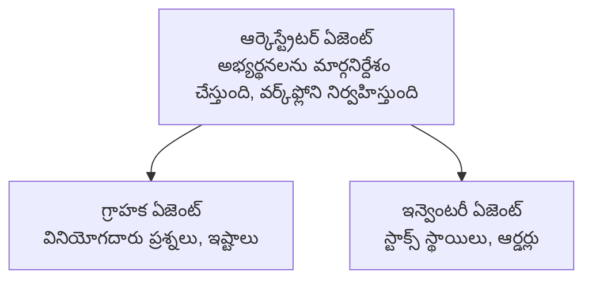

# అధ్యాయం 5: బహుళ-ఏజెంట్ AI పరిష్కారాలు

**📚 కోర్సు**: [AZD For Beginners](../../README.md) | **⏱️ Duration**: 2-3 hours | **⭐ జటిలత**: అధునాతన

---

## అవలోకనం

ఈ అధ్యాయం సుదీర్ఘ బహుళ-ఏజెంట్ ఆర్కిటెక్చర్ నమూనాలు, ఏజెంట్ సమన్వయం, మరియు సంక్లిష్ట సందర్భాలకు ఉత్పత్తి-సిద్ధ AI అమలులను కవర్ చేస్తుంది.

> జూన్ 2026లో `azd 1.25.6` తో ధృవీకరించబడింది.

## నేర్చుకునే లక్ష్యాలు

ఈ అధ్యాయాన్ని పూర్తి చేసిన తర్వాత, మీరు:
- బహుళ-ఏజెంట్ ఆర్కిటెక్చర్ నమూనాలను అర్థం చేసుకోగలరు
- సమన్వయిత AI ఏజెంట్ వ్యవస్థలను డిప్లాయ్ చేయగలరు
- ఏజెంట్-టు-ఏజెంట్ కమ్యూనికేషన్ అమలు చేయగలరు
- ఉత్పత్తి-సిద్ధ బహుళ-ఏజెంట్ పరిష్కారాలను నిర్మించగలరు

---

## 📚 పాఠాలు

| # | పాఠం | వివరణ | సమయం |
|---|--------|-------------|------|
| 1 | [Multi-Agent Basics](multi-agent-basics.md) | ప్రాక్టికల్: `azd up` తో పని చేసే బహుళ-ఏజెంట్ యాప్ను డిప్లాయ్ చేయండి | 45 min |
| 2 | [Coordination Patterns](../chapter-06-pre-deployment/coordination-patterns.md) | ఏజెంట్ సమన్వయ వ్యూహాలు (చాప్టర్ 6 లో కొనసాగుతుంది) | 30 min |
| 3 | [ARM Template Deployment](../../examples/retail-multiagent-arm-template/README.md) | ఒక్క క్లిక్ డిప్లాయ్ ఉదాహరణ | 30 min |

> **పాఠం 1 తో ప్రారంభించండి.** ఇది ఈ అధ్యాయంలో ఒక్కటే పూర్తిగా ప్రాక్టికల్, డిప్లాయ్ చేయగల పాఠం. పాఠం 2 ఛాప్టర్ 6లో ఉంది (ప్రీ-డిప్లాయ్ ప్లానింగ్ తో పంచబడింది), మరియు [Retail Multi-Agent Solution](../../examples/retail-scenario.md) ఆర్కిటెక్చర్ బ్లూప్రింట్—ఒక డిజైన్ రిఫరెన్స్, ఒక-కమాండ్ టెంప్లేట్ కాదు.

---

## 🚀 త్వరితప్రారంభం

```bash
# ఆప్షన్ 1: టెంప్లేట్ నుండి డిప్లాయ్ చేయండి
azd init --template agent-openai-python-prompty
azd up

# ఆప్షన్ 2: ఏజెంట్ మానిఫెస్ట్ నుండి డిప్లాయ్ చేయండి (azure.ai.agents ఎక్స్‌టెన్షన్ అవసరం)
azd extension install azure.ai.agents
azd ai agent init -m agent-manifest.yaml
azd up
```

> **ఏ విధానం?** పని చేసే నమూనా నుండి ప్రారంభించడానికి `azd init --template` ను ఉపయోగించండి. మీకు స్వంత ఏజెంట్ మేనిఫెస్ట్ ఉన్నప్పుడు `azd ai agent init` ను ఉపయోగించండి. పూర్తి వివరాలకు [AZD AI CLI సూచిక](../chapter-08-production/production-ai-practices.md#azd-ai-cli-commands-and-extensions) చూడండి.

---

## 🤖 బహుళ-ఏజెంట్ ఆర్కిటెక్చర్



---

## 🎯 ముఖ్య పరిష్కారం: రిటైల్ బహుళ-ఏజెంట్

[రిటైల్ బహుళ-ఏజెంట్ పరిష్కారం](../../examples/retail-scenario.md) ప్రదర్శిస్తుంది:

- **Customer Agent**: వినియోగదారుల పరస్పర చర్యలు మరియు ప్రాధాన్యతలను నిర్వహిస్తుంది
- **Inventory Agent**: స్టాక్ మరియు ఆర్డర్ ప్రాసెసింగ్‌ను నిర్వహిస్తుంది
- **Orchestrator**: ఏజెంట్ల మధ్య సమన్వయాన్ని నిర్వహిస్తుంది
- **Shared Memory**: ఏజెంట్ల మధ్య సందర్భాన్ని నిర్వహిస్తుంది

### ఉపయోగించిన సేవలు

| Service | Purpose |
|---------|---------|
| Microsoft Foundry Models | భాషా అవగాహన |
| Azure AI Search | ఉత్పత్తి క్యాటలాగ్ |
| Cosmos DB | ఏజెంట్ స్థితి మరియు మెమరీ |
| Container Apps | ఏజెంట్ హోస్టింగ్ |
| Application Insights | మానిటరింగ్ |

---

## 🔗 నావిగేషన్

| దిశ | అధ్యాయం |
|-----------|---------|
| **మునుపటి** | [అధ్యాయం 4: మౌలిక నిర్మాణం](../chapter-04-infrastructure/README.md) |
| **తరువాత** | [అధ్యాయం 6: ప్రీ-డిప్లాయ్‌మెంట్](../chapter-06-pre-deployment/README.md) |

---

## 📖 సంబంధిత వనరులు

- [ఏఐ ఏజెంట్ల గైడ్](../chapter-02-ai-development/agents.md)
- [ఉత్పత్తి ఏఐ ఆచరణలు](../chapter-08-production/production-ai-practices.md)
- [ఏఐ సమస్యల పరిష్కారం](../chapter-07-troubleshooting/ai-troubleshooting.md)

---

<!-- CO-OP TRANSLATOR DISCLAIMER START -->
**అస్వీకరణ**:
ఈ పత్రం AI అనువాద సేవ [Co-op Translator](https://github.com/Azure/co-op-translator) ఉపయోగించి అనువదించబడింది. మేము ఖచ్చితత్వానికి ప్రయత్నిస్తున్నప్పటికీ, ఆటోమేటెడ్ అనువాదాలు తప్పులు లేదా అసమగ్రతలను కలిగి ఉండవచ్చు. దాని స్వదేశ భాషలో ఉన్న అసలు పత్రాన్ని అధికారం కలిగిన మూలంగా పరిగణించాలి. కీలకమైన సమాచారం కోసం, ప్రొఫెషనల్ మానవ అనువాదాన్ని సిఫారసు చేస్తాము. ఈ అనువాదం ఉపయోగం వల్ల కలిగే ఏవైనా అపార్థాలు లేదా తప్పుదారులు కోసం మేము బాధ్యత వహించము.
<!-- CO-OP TRANSLATOR DISCLAIMER END -->