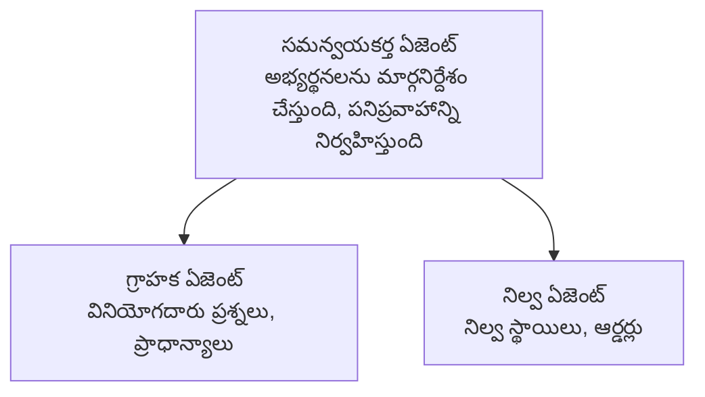

# అధ్యాయం 5: బహుళ-ఏజెంట్ AI పరిష్కారాలు

**📚 కోర్సు**: [AZD For Beginners](../../README.md) | **⏱️ వ్యవధి**: 2-3 గంటలు | **⭐ కష్టం**: అధునాతన

---

## అవలోకనం

ఈ అధ్యాయం ఆధునిక బహుళ-ఏజెంట్ ఆర్కిటెక్చర్ నమూనాలు, ఏజెంట్ సమన్వయం మరియు క్లిష్ట పరిస్థితుల కోసం ప్రొడక్షన్-సిద్ధ AI డిప్లాయ్‌మెంట్లను కవర్ చేస్తుంది.

## అభ్యసన లక్ష్యాలు

ఈ అధ్యాయాన్ని పూర్తిచేసిన తర్వాత, మీరు:
- బహుళ-ఏజెంట్ ఆర్కిటెక్చర్ నమూనాలను అర్థం చేసుకుంటారు
- సమన్వయిత AI ఏజెంట్ వ్యవస్థలను అమలు చేయగలరు
- ఏజెంట్-టు-ఏజెంట్ కమ్యూనికేషన్‌ను అమలు చేయగలరు
- ప్రొడక్షన్-సిద్ధ బహుళ-ఏజెంట్ పరిష్కారాలను నిర్మించగలరు

---

## 📚 Lessons

| # | పాఠం | వివరణ | సమయం |
|---|--------|-------------|------|
| 1 | [రిటైల్ బహుళ-ఏజెంట్ పరిష్కారం](../../examples/retail-scenario.md) | పూర్తి అమలు పరిచయం | 90 నిమిషాలు |
| 2 | [సమన్వయ నమూనాలు](../chapter-06-pre-deployment/coordination-patterns.md) | ఏజెంట్ ఒర్కెస్ట్రేషన్ వ్యూహాలు | 30 నిమిషాలు |
| 3 | [ARM Template Deployment](../../examples/retail-multiagent-arm-template/README.md) | ఒకే క్లిక్ ద్వారా డిప్లాయ్ చేయడం | 30 నిమిషాలు |

---

## 🚀 త్వరిత ప్రారంభం

```bash
# ఎంపిక 1: టెంప్లేట్ నుండి అమలు చేయండి
azd init --template agent-openai-python-prompty
azd up

# ఎంపిక 2: ఏజెంట్ మానిఫెస్ట్ నుండి అమలు చేయండి (azure.ai.agents విస్తరణ అవసరం)
azd extension install azure.ai.agents
azd ai agent init -m agent-manifest.yaml
azd up
```

> **ఏ విధానం?** Use `azd init --template` to start from a working sample. Use `azd ai agent init` when you have your own agent manifest. See the [AZD AI CLI సూచిక](../chapter-08-production/production-ai-practices.md#azd-ai-cli-commands-and-extensions) for full details.

---

## 🤖 బహుళ-ఏజెంట్ ఆర్కిటెక్చర్


---

## 🎯 విశేష పరిష్కారం: రిటైల్ బహుళ-ఏజెంట్

ఈ [రిటైల్ బహుళ-ఏజెంట్ పరిష్కారం](../../examples/retail-scenario.md) చూపిస్తుంది:

- **కస్టమర్ ఏజెంట్**: వినియోగదారుల పరస్పర చర్యలు మరియు ఇష్టాలను నిర్వహిస్తుంది
- **ఇన్వెంటరీ ఏజెంట్**: స్టాక్ మరియు ఆర్డర్ ప్రాసెసింగ్‌ను నిర్వహిస్తుంది
- **ఒర్కెస్ట్రేటర్**: ఏజెంట్ల మధ్య సమన్వయం చేస్తుంది
- **షేర్డ్ మెమరీ**: ఏజెంట్ల మధ్య కాంటెక్స్ట్ నిర్వహణ

### ఉపయోగించిన సేవలు

| సేవ | ఉద్దేశ్యం |
|---------|---------|
| Microsoft Foundry Models | భాషా అవగాహన |
| Azure AI Search | ఉత్పత్తి క్యాటలాగ్ |
| Cosmos DB | ఏజెంట్ స్థితి మరియు మెమరీ |
| Container Apps | ఏజెంట్ హోస్టింగ్ |
| Application Insights | మానిటరింగ్ |

---

## 🔗 నావిగేషన్

| దిశ | అధ్యాయం |
|-----------|---------|
| **మునుపటి** | [అధ్యాయం 4: ఇన్ఫ్రాస్ట్రక్చర్](../chapter-04-infrastructure/README.md) |
| **తరువాత** | [అధ్యాయం 6: ప్రీ-డిప్లాయ్‌మెంట్](../chapter-06-pre-deployment/README.md) |

---

## 📖 సంబంధిత వనరులు

- [AI ఏజెంట్స్ గైడ్](../chapter-02-ai-development/agents.md)
- [ప్రొడక్షన్ AI ఆచరణలు](../chapter-08-production/production-ai-practices.md)
- [AI సమస్యల పరిష్కారం](../chapter-07-troubleshooting/ai-troubleshooting.md)

---

<!-- CO-OP TRANSLATOR DISCLAIMER START -->
**Disclaimer**:
ఈ పత్రం AI అనువాద సేవ [Co-op Translator](https://github.com/Azure/co-op-translator) ఉపయోగించి అనువదించబడి ఉంది. మనము ఖచ్చితత్వానికి ప్రయత్నించినప్పటికీ, ఆటోమేటెడ్ అనువాదాలలో పొరపాట్లు లేదా లోపాలు ఉండవచ్చని దయచేసి గమనించండి. మూల పత్రాన్ని దాని స్వదేశ భాషలోని המקורי (authoritative) మూలంగా పరిగణించాలి. కీలక సమాచారానికి వృత్తిపరమైన మానవ అనువాదాన్ని సూచిస్తాము. ఈ అనువాదం ఉపయోగించడం వల్ల ఏర్పడే ఏవైనా అపార్థాలు లేదా తప్పు అర్థకల్పనల కోసం మేము బాధ్యత వహించము.
<!-- CO-OP TRANSLATOR DISCLAIMER END -->