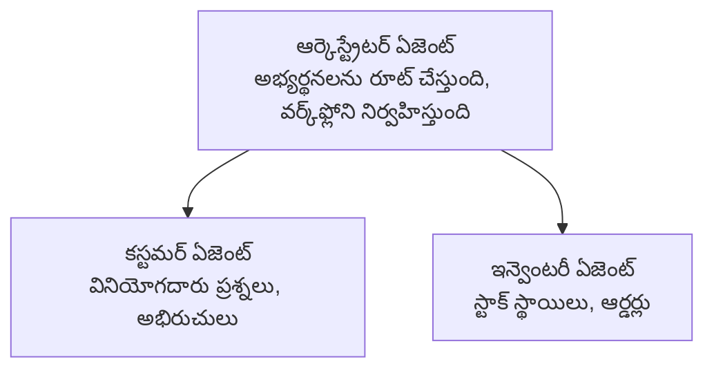

# అధ్యాయం 5: బహుళ-ఏజెంట్ AI పరిష్కారాలు

**📚 కోర్స్**: [మొదలుకొని AZD](../../README.md) | **⏱️ వ్యవధి**: 2-3 గంటలు | **⭐ కష్టం**: ఆరుగుగుణమైనది

---

## అవలోకనం

ఈ అధ్యాయం కాంప్లెక్స్ సన్నివేశాల కోసం బహుళ-ఏజెంట్ ఆర్కిటెక్చర్ నమూనాలు, ఏజెంట్ సమన్వయం మరియు ఉత్పత్తి-సిద్ధ AI విధానాలను కవర్ చేస్తుంది.

> `azd 1.27.1` తో 2026 జూలైలో ధృవీకరించబడింది.

## అభ్యసన లక్ష్యాలు

ఈ అధ్యాయం పూర్తి చేసిన తర్వాత మీరు:
- బహుళ-ఏజెంట్ ఆర్కిటెక్చర్ నమూనాలను అర్థం చేసుకుంటారు
- సమన్వయపూర్వక AI ఏజెంట్ సిస్టమ్స్‌ను పంపిణీ చేస్తారు
- ఏజెంట్-టు-ఏజెంట్ కమ్యూనికేషన్ అమలు చేస్తారు
- ఉత్పత్తులకు వీలుగా బహుళ-ఏజెంట్ పరిష్కారాలను నిర్మిస్తారు

---

## 📚 పాఠాలు

| # | పాఠం | వివరణ | సమయం |
|---|--------|-------------|------|
| 1 | [బహుళ-ఏజెంట్ మౌళికాలు](multi-agent-basics.md) | హ్యాండ్స్-ఆన్: `azd up` తో పనిచేయగల బహుళ-ఏజెంట్ యాప్‌ను పంపిణీ చేయండి | 45 నిమి |
| 2 | [సమన్వయ నమూనాలు](../chapter-06-pre-deployment/coordination-patterns.md) | ఏజెంట్ సమన్వయ నిఖిలతా వ్యూహాలు (అధ్యాయం 6 లో కొనసాగుతుంది) | 30 నిమి |
| 3 | [ARM టెంప్లేట్ పంపిణీ](../../examples/retail-multiagent-arm-template/README.md) | ఒకే క్లిక్‌తో పంపిణీ ఉదాహరణ | 30 నిమి |

> **పాఠం 1 తో ప్రారంభించండి.** ఇది ఈ అధ్యాయంలో ఉన్న పూర్తిగా హ్యాండ్స్-ఆన్, పంపిణీ చేయదగిన ఏకైక పాఠం. పాఠం 2 అధ్యాయం 6 లో ఉంటుంది (ఇది ప్రీ-డిప్లాయ్‌మెంట్ ప్లానింగ్‌తో పంచుకోబడింది), మరియు [రిటెయిల్ బహుళ-ఏజెంట్ పరిష్కారం](../../examples/retail-scenario.md) ఒక ఆర్కిటెక్చర్ బ్లూప్రింట్ — ఒక డిజైన్ సూచిక, ఒక కమాండ్ ఆదేశం టెంప్లేట్ కాదు.

---

## 🚀 త్వరిత ప్రారంభం

```bash
# ఆప్షన్ 1: ఒక టెంప్లేట్ నుండి నిబంధన చేయండి
azd init --template agent-openai-python-prompty
azd up

# ఆప్షన్ 2: ఒక ఏజెంట్ మ్యానిఫెస్ట్ నుండి నిబంధన చేయండి (azure.ai.agents విస్తరణ అవసరం)
azd extension install azure.ai.agents
azd ai agent init -m agent-manifest.yaml
azd up
```

> **ఏ విధానాన్ని?** పని చేసే నమూనా నుండి ప్రారంభించడానికి `azd init --template` ఉపయోగించండి. మీ మానిఫెస్ట్ ఉన్నప్పుడు `azd ai agent init` ఉపయోగించండి. పూర్తి వివరాలకు [AZD AI CLI సూచిక](../chapter-08-production/production-ai-practices.md#azd-ai-cli-commands-and-extensions) చూడండి.

---

## 🤖 బహుళ-ఏజెంట్ ఆర్కిటెక్చర్



---

## 🎯 ముఖ్య పరిష్కారం: రిటెయిల్ బహుళ-ఏజెంట్

[రిటెయిల్ బహుళ-ఏజెంట్ పరిష్కారం](../../examples/retail-scenario.md) ఈ క్రింది వాటిని చూపిస్తుంది:

- **వినియోగదారుడు ఏజెంట్**: యూజర్ సహకారం మరియు అభిరుచులను నిర్వర్తిస్తుంటుంది
- **ఇన్వెంటరీ ఏజెంట్**: స్టాక్ మరియు ఆర్డర్ ప్రాసెసింగ్ నిర్వహిస్తుంటుంది
- **ఆర్కెస్ట్రేటర్**: ఏజెంట్స్ మధ్య సమన్వయం చేస్తుంది
- **షared మెమరీ**: ఏజెంట్ల మధ్య సందర్భం నిర్వహణ

### ఉపయోగించిన సేవలు

| డొమైన్ | ఉద్దేశ్యం |
|---------|---------|
| Microsoft Foundry Models | భాష అర్థం చేసుకోవడం |
| Azure AI Search | ఉత్పత్తి జాబితా |
| Cosmos DB | ఏజెంట్ స్థితి మరియు మెమరీ |
| కంటైనర్ యాప్స్ | ఏజెంట్ హోస్టింగ్ |
| అప్లికేషన్ ఇన్స్‌పెక్స్ట్‌ | మానిటరింగ్ |

---

## 🔗 నావిగేషన్

| దిశ | అధ్యాయం |
|-----------|---------|
| **గతవారీ** | [అధ్యాయం 4: ఇన్‌ఫ్రాస్ట్రక్చర్](../chapter-04-infrastructure/README.md) |
| **తరువాత** | [అధ్యాయం 6: ప్రీ-డిప్లాయ్‌మెంట్](../chapter-06-pre-deployment/README.md) |

---

## 📖 సంబంధించిన వనరులు

- [AI ఏజెంట్స్ గైడ్](../chapter-02-ai-development/agents.md)
- [ఉత్పత్తి AI వ్యావహారికత](../chapter-08-production/production-ai-practices.md)
- [AI సమస్య పరిష్కారం](../chapter-07-troubleshooting/ai-troubleshooting.md)

---

<!-- CO-OP TRANSLATOR DISCLAIMER START -->
**అస్వీకరణ**:
ఈ పత్రం AI అనువాద సేవ [Co-op Translator](https://github.com/Azure/co-op-translator) ఉపయోగించి అనువదించబడింది. మేము ఖచ్చితత్వానికి ప్రయత్నిస్తున్నప్పటికీ, ఆటోమేటెడ్ అనువాదాలు తప్పులు లేదా అసమగ్రతలను కలిగి ఉండవచ్చు. దాని స్వదేశ భాషలో ఉన్న అసలు పత్రాన్ని అధికారం కలిగిన మూలంగా పరిగణించాలి. కీలకమైన సమాచారం కోసం, ప్రొఫెషనల్ మానవ అనువాదాన్ని సిఫారసు చేస్తాము. ఈ అనువాదం ఉపయోగం వల్ల కలిగే ఏవైనా అపార్థాలు లేదా తప్పుదారులు కోసం మేము బాధ్యత వహించము.
<!-- CO-OP TRANSLATOR DISCLAIMER END -->