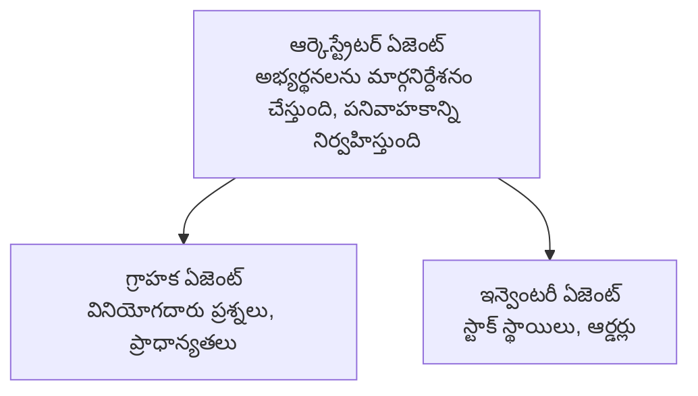

# Chapter 5: బహు-ఏజెంట్ AI పరిష్కారాలు

**📚 Course**: [AZD For Beginners](../../README.md) | **⏱️ Duration**: 2-3 గంటలు | **⭐ Complexity**: సంక్లిష్టత: అధిక స్థాయి

---

## Overview

ఈ అధ్యాయం అధునాతన బహు-ఏజెంట్ ఆర్కిటెక్చర్ నమూనాలు, ఏజెంట్ ఆర్కెస్ట్రేషన్, మరియు సంక్లిష్ట సన్నివేశాల కోసం ప్రొడక్షన్-సిద్ధమైన AI డిప్లాయ్‌మెంట్లను కవర్ చేస్తుంది.

> ధృవీకరించబడింది `azd 1.23.12` కోసం మార్చి 2026 లో.

## Learning Objectives

ఈ అధ్యాయం పూర్తి చేసిన తర్వాత, మీరు:
- బహు-ఏజెంట్ ఆర్కిటెక్చర్ నమూనాలను అర్థం చేసుకుంటారు
- సమన్వయమైన AI ఏజెంట్ సిస్టమ్స్‌ను డిప్లాయ్ చేయగలరు
- ఏజెంట్-టు-ఏజెంట్ కమ్యూనికేషన్‌ను అమలు చేయగలరు
- ప్రొడక్షన్-సిద్ధ బహు-ఏజెంట్ పరిష్కారాలను నిర్మించగలరు

---

## 📚 Lessons

| # | Lesson | Description | Time |
|---|--------|-------------|------|
| 1 | [Retail Multi-Agent Solution](../../examples/retail-scenario.md) | పూర్తి అమలు పరిచయం | 90 నిమిషాలు |
| 2 | [Coordination Patterns](../chapter-06-pre-deployment/coordination-patterns.md) | ఏజెంట్ ఆర్కెస్ట్రేషన్ వ్యూహాలు | 30 నిమిషాలు |
| 3 | [ARM Template Deployment](../../examples/retail-multiagent-arm-template/README.md) | ఒక క్లిక్ డిప్లాయ్‌మెంట్ | 30 నిమిషాలు |

---

## 🚀 వేగవంతమైన ప్రారంభం

```bash
# ఒప్షన్ 1: టెంప్లేట్ నుండి డిప్లాయ్ చేయండి
azd init --template agent-openai-python-prompty
azd up

# ఒప్షన్ 2: ఏజెంట్ మానిఫెస్ట్ నుండి డిప్లాయ్ చేయండి (azure.ai.agents ఎక్స్‌టెన్షన్ అవసరం)
azd extension install azure.ai.agents
azd ai agent init -m agent-manifest.yaml
azd up
```

> **ఏ విధానం?** పనిచేస్తున్న నమూనా నుండి ప్రారంభించడానికి `azd init --template` ను ఉపయోగించండి. మీకు మీ స్వంత ఏజెంట్ మానిఫెస్ట్ ఉన్నప్పుడు `azd ai agent init` ను ఉపయోగించండి. పూర్తి వివరాలకోసం [AZD AI CLI సూచిక](../chapter-08-production/production-ai-practices.md#azd-ai-cli-commands-and-extensions) ని చూడండి.

---

## 🤖 బహు-ఏజెంట్ ఆర్కిటెక్చర్


---

## 🎯 ఫీచర్ చేయబడిన పరిష్కారం: రిటైల్ బహు-ఏజెంట్

The [Retail Multi-Agent Solution](../../examples/retail-scenario.md) demonstrations:

- **గ్రాహక ఏజెంట్**: వినియోగదారుల పరస్పర చర్యలు మరియు ప్రాధాన్యతలను నిర్వహిస్తుంది
- **ఇన్వెంటరీ ఏజెంట్**: స్టాక్ మరియు ఆర్డర్ ప్రాసెసింగ్‌ను నిర్వహిస్తుంది
- **ఆర్కెస్ట్‌రేటర్**: ఏజెంట్ల మధ్య సమన్వయాన్ని నిర్వహిస్తుంది
- **షేర్డ్ మెమరీ**: ఏజెంట్‌ల మధ్య కాంటెక్స్ట్ నిర్వహణ

### ఉపయోగించిన సేవలు

| Service | Purpose |
|---------|---------|
| Microsoft Foundry Models | భాషా అర్ధం చేయడం |
| Azure AI Search | ఉత్పత్తి క్యాటలాగ్ |
| Cosmos DB | ఏజెంట్ స్థితి మరియు మెమరీ |
| Container Apps | ఏజెంట్ హోస్టింగ్ |
| Application Insights | పర్యవేక్షణ |

---

## 🔗 నావిగేషన్

| Direction | Chapter |
|-----------|---------|
| **Previous** | [Chapter 4: Infrastructure](../chapter-04-infrastructure/README.md) |
| **Next** | [Chapter 6: Pre-Deployment](../chapter-06-pre-deployment/README.md) |

---

## 📖 సంబంధిత వనరులు

- [AI Agents Guide](../chapter-02-ai-development/agents.md)
- [Production AI Practices](../chapter-08-production/production-ai-practices.md)
- [AI Troubleshooting](../chapter-07-troubleshooting/ai-troubleshooting.md)

---

<!-- CO-OP TRANSLATOR DISCLAIMER START -->
**Disclaimer**:
ఈ పత్రాన్ని AI అనువాద సేవ [Co-op Translator](https://github.com/Azure/co-op-translator) ఉపయోగించి అనువదించారు. సరైనత కోసం మనం ప్రయత్నించినప్పటికీ, ఆటోమెటెడ్ అనువాదాలలో లోపాలు లేదా తప్పులు ఉండవచ్చని దయచేసి గమనించండి. మూల పత్రాన్ని దాని స్థానిక భాషలోనే అధికారిక మూలంగా పరిగణించాలి. కీలక సమాచారం కోసం వృత్తిపరమైన మానవ అనువాదాన్ని సూచిస్తాము. ఈ అనువాదం ఉపయోగం వల్ల ఉత్పన్నమయ్యే ఏదైనా అపార్థాలు లేదా తప్పుగా అర్థం చేసుకోవడంపై మేము బాధ్యత వహించము.
<!-- CO-OP TRANSLATOR DISCLAIMER END -->