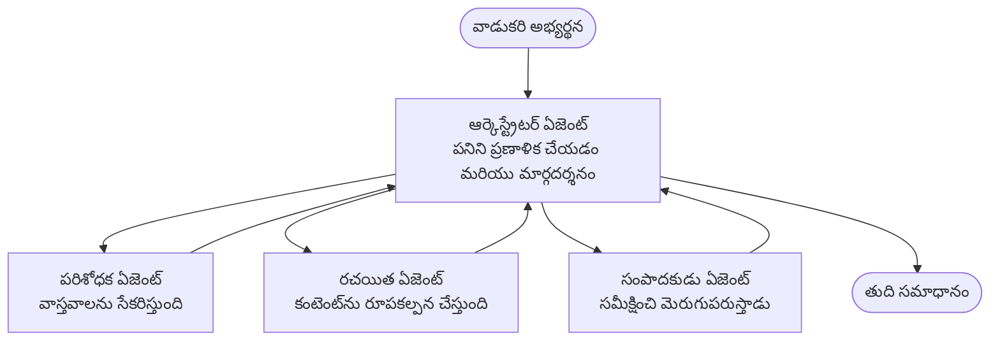

# మల్టీ-ఏజెంట్ బేసిక్స్ - మీ మొదటి సమన్వయ AI సిస్టమ్‌ను డిప్లాయ్ చేయండి

**అధ్యాయం దిశానిర్దేశం:**
- **📚 కోర్సు హోమ్**: [AZD For Beginners](../../README.md)
- **📖 ప్రస్తుత అధ్యాయం**: అధ్యాయం 5 - మల్టీ-ఏజెంట్ AI పరిష్కారాలు
- **⬅️ పూర్వాపర**: [అధ్యాయం 4: మౌలికసదుపాయాలు](../chapter-04-infrastructure/README.md)
- **➡️ తదుపరి**: [సమన్వయ నమూనాలు](../chapter-06-pre-deployment/coordination-patterns.md)

> జూలై 2026 లో `azd 1.27.1` ప్రకారం ధృవీకరించబడింది.

## పరిచయం

ముందస్తు అధ్యాయాలలో మీరు ఒకే ఒక అప్లికేషన్‌ను డిప్లాయ్ చేసారు—మరియు అధ్యాయం 2లో మీరు ఒకే ఒక AI ఏజెంట్‌ను డిప్లాయ్ చేసారు. ఈ పాఠం తదుపరి దశను తీసుకుంటుంది: ఒక **మల్టీ-ఏజెంట్ సిస్టమ్** ను, అక్కడ పలు ప్రత్యేక ఏజెంట్లు కలిసి పని చేయించి ఇంతకన్నా ఒంటరి ఏజెంట్ బాగా చేయలేకపోయే సమస్యను పరిష్కరిస్తారు.

ప్రారంభకుల కోసం మంచి వార్త: **మీకు కొత్త కమాండ్లు అవసరం లేదు.** మల్టీ-ఏజెంట్ పరిష్కారం ఇంకా ఒక azd ప్రాజెక్టు. మీరు `azd init`, `azd up`, పరీక్షించండి, మరియు `azd down` చేస్తారు—మీకు ఇప్పటికే తెలిసిన వర్క్‌ఫ్లో ఇదే. మార్పు అవేది యాప్ లోపల *ఆకారం*.

## అభ్యసన లక్ష్యాలు

ఈ పాఠం ముగింపు నాటికి, మీరు:
- "మల్టీ-ఏజెంట్" అంటే ఏమిటి మరియు అదనపు సంక్లిష్టత విలువైనప్పుడు అర్థం చేసుకోవాలి
- మల్టీ-ఏజెంట్ సిస్టమ్ లో సాధారణ పాత్రలను గుర్తించగలరు (ఆరోస్త్రేటర్ + స్పెషలిస్ట్లు)
- `azd up` తో ఒక ప్రత్యక్ష, పని చేసే మల్టీ-ఏజెంట్ టెంప్లేట్‌ను డిప్లాయ్ చేయగలరు
- మల్టీ-ఏజెంట్ యాప్‌కు మద్దతు ఇస్తున్న Azure వనరులను అర్థం చేసుకోగలరు
- పరిష్కారాన్ని సురక్షితంగా ధృవీకరించగలరు, అనుకూలపరచగలరు, మరియు తీసివేయగలరు

## అభ్యసన ఫలితాలు

ఈ పాఠం పూర్తయ్యాక, మీరు చేయగలరు:
- ఒకే ఏజెంట్ మరియు మల్టీ-ఏజెంట్ సిస్టమ్ మధ్య తేడాను వివరించగలరు
- ఒకే ఏజెంట్ టూల్స్ తో లేదా నిజమైన మల్టీ-ఏజెంట్ డిజైన్ మధ్య ఎంపిక చేసుకోగలరు
- azd తో మల్టీ-ఏజెంట్ టెంప్లేట్ ను ఎండ్-టు-ఎండ్ డిప్లాయ్ చేసి పరీక్షించగలరు
- ప్రతి ఏజెంట్ ఎక్కడ నడుస్తుందో మరియు వారు ఎలా కమ్యూనికేట్ చేస్తున్నారో గుర్తించగలరు
- కొనసాగుతున్న చార్జీలను నివారించేందుకు అన్ని వనరులను శుభ్రపరచగలరు

---

## మల్టీ-ఏజెంట్ సిస్టమ్ అంటే ఏమిటి?

ఒకే AI ఏజెంట్ అనేది ఒక మోడల్ మరియు కొన్ని సూచనలతో (ఐచ్ఛికంగా) కొన్ని టూల్స్ కలిగి ఉంటుంది. ఇది కేంద్రీకృత పనుల కోసం బాగా పని చేస్తుంది. కానీ పని పెరిగినప్పుడు—అన్ని పరిశోధన, తరువాత రచన, తరువాత ఎడిటింగ్, తరువాత ఫ్యాక్ట్-చెకింగ్—అన్ని ఒకే ప్రాంప్ట్‌లో చేర్చడం ఏజెంట్‌ను మెల్లగా, నమ్మకం తగ్గిపోయేటట్లు, మరియు డీబగ్ చేయడం కష్టం చేస్తుంది.

ఒక **మల్టీ-ఏజెంట్ సిస్టమ్** పని ను ప్రత్యేక స్పెషలిస్టులుగా విడగొట్టి, ఆరోస్త్రేటర్ ద్వారా సమన్వయ చేస్తుంది:



### మీరు ఎప్పుడూ చూడగల రెండు పాత్రలు

| పాత్ర | పని | ఉదాహరణ |
|------|-----|---------|
| **ఆరోస్త్రేటర్** | *తర్వాత ఏమి జరుగుతుందో* నిర్ణయిస్తుంది మరియు ఏజెంట్ల మధ్య పనిని పంపిణీ చేస్తుంది | "మొదట పరిశోధన, తరువాత రచన, తరువాత సవరణ" |
| **స్పెషలిస్ట్** | ఒకే ఒక నిర్దిష్ట పని చేసి ఫలితాన్ని ఇస్తుంది | కేవలం నిజాలు సేకరించే "పరిశోధకుడు" |

### మీరు నిజానికి బహుళ ఏజెంట్లు అవసరమా?

సులభంగా ప్రారంభించండి. ఈ పరిస్థితుల్లో మాత్రమే బహుళ ఏజెంట్లను ఉపయోగించండి:

- ✅ పని **విభిన్న దశలు** కలిగి ఉంది, మరియు దశలకి వేర్వేరు సూచనలు అవసరం (పరిశోధన vs. రచన vs. సమీక్ష)
- ✅ సమయాన్ని పొదుపు చేసేందుకు స్పెషలిస్టులు **సమాంతరంగా** నడవాలి
- ✅ వేర్వేరు దశలకు **వేర్వేరు సాధనాలు లేదా డేటా మూలాలు** అవసరం
- ✅ ప్రతి దశను **స్వతంత్రంగా పరీక్షించగలిగే మరియు డీబగ్ చేయగలిగేలా** కావాలి

మీ పని ఒకే ప్రశ్న-జవాబు లేదా సులభమైన సాధన కాల్ అయితే, ఒక **సింగిల్ ఏజెంట్ టూల్స్ తో** (అధ్యాయం 2) సులభం, చౌకగా, మరియు ఆపరేట్ చేయడం సులభం.

> **ప్రారంభకులకు సూచన:** "ఇంకొన్ని ఏజెంట్లు" అంటే "మంచి" కాదు. ప్రతి ఏజెంట్ లోటు, ఖర్చు మరియు పరిక్షణ వస్తుంది. సమస్య భాగాలుగా స్పష్టంగా విభజించినప్పుడు మాత్రమే ఏజెంట్లు జోడించండి.

---

## Azureపై మల్టీ-ఏజెంట్ నిర్మించడానికి రెండు మార్గాలు

| విధానం | ఇది ఏమిటి | ఉత్తమమైనది |
|----------|-----------|----------|
| **ఒకే ఏజెంట్ + టూల్స్** | ఒక Foundry ఏజెంట్ ఫంక్షన్స్/టూల్స్‌ను కాల్ చేస్తుంది | సులభ వర్క్‌ఫ్లో, ప్రారంభం కోసం |
| **ఎన్నో సమన్వయ ఏజెంట్లు** | పలు ఏజెంట్లు మరియు ఒక ఆరోస్త్రేటర్ కలుగినది | వివిధ దశలు, సమాంతర పని, ప్రత్యేకత |

ఈ పాఠం రెండవ విధానంపై దృష్టి సారిస్తుంది, **ప్రాంతీయంగా తయారైన టెంప్లేట్** ఉపయోగించి, మీరు మీ స్వంతది నిర్మించే ముందు నిజమైన మల్టీ-ఏజెంట్ సిస్టమ్ నడుస్తున్నదని చూడవచ్చు.

---

## ప్రాక్టికల్: పని చేసే మల్టీ-ఏజెంట్ యాప్ ను డిప్లాయ్ చేయండి

మేము డిప్లాయ్ చేయబోయేది **కాంటోసో క్రియేటివ్ రైటర్**, ఒక అధికారిక Azure నమూనా, ఇది అనేక ఏజెంట్లను ఉపయోగిస్తుంది (పరిశోధకుడు, రచయిత, సంపాదకుడు) సామగ్రిని ఉత్పత్తి చేయడానికి సమన్వయిస్తూ ఉంటుంది. ఇది మొదటి మల్టీ-ఏజెంట్ యాప్ కోసం చాలా మంచి ఉదాహరణ, ఎందుకంటే పాత్రలు సులభంగా అర్థం చేసుకోవచ్చు.

### దశ 1: టెంప్లేట్ ప్రారంభించండి

```bash
# ఒక పని ఫోల్డర్ సృష్టించండి
mkdir creative-writer && cd creative-writer

# అధికారిక బహుళ-ఏజెంట్ టెంప్లేట్ నుండి ప్రారంభించండి
azd init --template contoso-creative-writer
```

> ఎప్పుడైనా [అద్భుత AZD AI గ్యాలరీ](https://azure.github.io/awesome-azd/?tags=ai)లో మరిన్ని మల్టీ-ఏజెంట్ టెంప్లేట్లు బ్రౌజ్ చేయవచ్చు. మరొక ప్రారంభకులకు స్నేహపూర్వక ఎంపికల్లో `get-started-with-ai-agents` మరియు `azure-ai-travel-agents` ఉన్నాయి.

### దశ 2: సరిఅయినత తప్పనిసరి

```bash
# azd పని ప్రవాహాల కోసం అవసరం
azd auth login
```

### దశ 3: వాతావరణం సృష్టించండి

```bash
azd env new dev
```

### దశ 4: ముందుగా చూడండి, తర్వాత డిప్లాయ్

```bash
# ఏదైనా ఖర్చు చేయకముందు ఏమి సృష్టించబడుతుందో చూడండి (సిఫార్సు చేయబడింది)
azd provision --preview

# ఒక దశలో మౌలీక సదుపాయాలను సిద్ధం చేసి అన్ని ఏజెంట్లను అమర్చండి
azd up
```

`azd up` మీరు ఒక సబ్‌స్క్రిప్షన్ మరియు ప్రాంతాన్ని అడుగుతుంది, తరువాత Azure వనరులను అవ్యవస్థితం చేస్తుంది మరియు అప్లికేషన్ ని డిప్లాయ్ చేస్తుంది. AI డిప్లాయ్‌మెంట్లు సాధారణ వెబ్ యాప్ కన్నా ఎక్కువ సమయం పడవచ్చు—మీరు పెద్ద మోడల్స్‌ను డిప్లాయ్ చేస్తుంటే, డిప్లాయ్ టైమౌట్ పొడగించవచ్చు:

```bash
azd deploy --timeout 1800
```

> **ఖర్చు మరియు సామర్థ్యంపై హెచ్చరిక:** మల్టీ-ఏజెంట్ యాప్స్ AI మోడల్స్‌ను డిప్లాయ్ చేస్తాయని ఇది క్వోటాను వాడుతుంది మరియు ఖర్చు వస్తుంది. మీరు `azd up`లో మోడల్ క్వోటా తప్పిపోతే [AI Troubleshooting](../chapter-07-troubleshooting/ai-troubleshooting.md) చూడండి ప్రాంతం మరియు క్వోటా సర్దుబాటు కోసం, మరియు అధ్యాయం 6 [Capacity Planning](../chapter-06-pre-deployment/capacity-planning.md).

---

## మీరు డిప్లాయ్ చేసినదాన్ని అర్థం చేసుకోండి

ఇలాంటి సాధారణ మల్టీ-ఏజెంట్ యాప్ Azure వనరుల సెట్‌ను తయారు చేస్తుంది, ఇది పై చిత్రంలో బాధ్యతలకు నేరుగా సరిపడుతుంది:

| వనరు | ఎందుకు ఉంది |
|----------|----------------|
| **Microsoft Foundry / మోడల్స్** | ప్రతీ ఏజెంట్ ఉపయోగించే భాషా మోడల్స్ ను హోస్ట్ చేస్తుంది |
| **Azure AI Search** | పరిశోధక ఏజెంట్‌కి అనుగుణమైన డేటా ని అందిస్తుంది పరిశోధన కోసం |
| **కంటైనర్ యాప్స్** (లేదా యాప్ సర్వీస్) | ఆరోస్త్రేటర్ మరియు ఏజెంట్ కోడ్‌ను హోస్ట్ చేస్తుంది |
| **కాస్మాస్ డీబీ** (కొన్ని నమూనాల్లో) | ఏజెంట్ల మధ్య పంచుకున్న స్థితి/మెమరీని నిల్వ చేస్తుంది |
| **అప్లికేషన్ ఇన్‌సైట్స్** | ఏజెంట్ల *ఆరుగోళ* అభ్యర్థనలను ట్రేస్ చేస్తుంది, తద్వారా మీరు ఫ్లోని డీబగ్ చేయవచ్చు |

### ఏజెంట్లు ఒకరితో ఒకరు ఎలా మాట్లాడతాయి

ఎక్కువ azd మల్టీ-ఏజెంట్ నమూనాల్లో, **ఆరోస్త్రేటర్ మీ యాప్ కోడ్‌లో నడుస్తుంది** (ఉదాహరణకి, Semantic Kernel లేదా Microsoft Agent Framework లాంటి ఫ్రేమ్‌వర్క్ ఉపయోగించి). వారీగా ఆరోస్త్రేటర్ ప్రతి స్పెషలిస్ట్ ఏజెంట్‌ను కాల్ చేస్తుంది, ఫలితాలనూ పాస్ చేస్తుంది, మరియు తుది సమాధానాన్ని తయారు చేస్తుంది. ఏజెంట్లు కాంటెక్స్ట్‌ను ఈ విధంగా పంచుకుంటారు:

- **ఫంక్షన్/టూల్ కాల్స్** — ఆరోస్త్రేటర్ ఒక స్పెషలిస్ట్‌ను పిలిచి ఫలితాన్ని పొందుతుంది
- **పంచుకున్న మెమరీ** — ఒక డేటాబేస్ (ఫ్రీక్వెన్స్ కాస్మాస్ డీబీ) ఏజెంట్లు చదివే స్థితిని కలిగి ఉంటుంది
- **సందేశాలు/ఈవెంట్లు** — సడలించిన కపళన కోసం, ఏజెంట్లు క్యూయూ లేదా సర్వీస్ బస్ ద్వారా కమ్యూనికేట్ చేస్తారు

> **డీబగింగ్ కోసం ఇది ఎందుకు ముఖ్యం:** ప్రతి దశ వేరు కావడంతో, అప్లికేషన్ ఇన్‌సైట్స్ మీకు *ఏ* ఏజెంట్ మందగించిందో లేదా విఫలమయ్యిందో చూపిస్తుంది. అది మొదట్లో పని విభజించే ప్రధాన కారణం.

---

## డిప్లాయ్‌మెంట్‌ను ధృవీకరించండి

సిస్టమ్ నిజంగా పని చేస్తున్నదని నిర్ధారించుకోండి ముందుకు పోతూ ముందు:

```bash
# అమర్చిన ఎండ్పాయింట్లను చూపించండి
azd show

# అనువర్తనపు మానిటరింగ్ డ్యాష్‌బోర్డ్‌ని తెరవండి
azd monitor

# ఏదైనా సమస్య కనిపిస్తే లాగ్‌లను ఆరడండి
azd monitor --logs
```

తరువాత `azd show` నుండి యాప్ URL తెరవండి మరియు అన్ని ఏజెంట్లు భాగమయ్యే అభ్యర్థనను ప్రయత్నించండి (కాంటోసో క్రియేటివ్ రైటర్ కోసం, ఒక చిన్న వ్యాసం యొక్క రచన అడగండి). అప్లికేషన్ ఇన్‌సైట్స్ **ట్రాన్సాక్షన్ సర్చ్**లో, మీరు అభ్యర్థన పరిశోధక, రచయిత, మరియు సంపాదకుడు దశలవారీగా విస్తరించబడినట్టు చూడాలి.

**విజయం ప్రమాణాలు:**
- ✅ `azd show` ఒక చేరుకునే ఎండ్‌పాయింట్‌ను జాబితా చేస్తుంది
- ✅ ఒక అభ్యర్థన ఫలితం ఉత్పత్తి చేస్తుంది, ఇది బహుళ దశల ద్వారా స్పష్టంగా వెళ్లింది
- ✅ అప్లికేషన్ ఇన్‌సైట్స్ ఒక కంటే ఎక్కువ ఏజెంట్ దశలకు ట్రేస్ చూపిస్తుంది

---

## అనుకూలీకరించండి: ఏజెంట్ జోడించండి లేదా సవరించండి

ప్రతీ ఏజెంట్ కేవలం సూచనలు మరియు టూల్స్ మాత్రమే కాబట్టి, అనుకూలీకరణ సులభం:

1. **టెంప్లేట్‌లో ఏజెంట్ నిర్వచనాలు కనుగొనండి** (అధికంగా `prompts/`, `agents/` లేదా `*.prompty` ఫైళ్ల సెట్‌లో).
2. **ఏజెంట్ సూచనలను సవరించండి** — ఉదాహరణకి, సంపాదకుడికి నిర్దిష్ట శైలి లేదా పద సంఖ్యను అమలు చేయమని చెప్పండి.
3. **కోడ్‌ను మాత్రమే మళ్లీ డిప్లాయ్ చేయండి** (మౌలిక సదుపాయాలు మారవు):

   ```bash
   azd deploy
   ```

మీరు మరింత ముందుకు వెళ్లి మీ స్వంత మానిఫెస్ట్ నుండి ఏజెంట్లను నిర్మించాలనుకుంటే, ఏజెంట్ ఎక్స్‌టెన్షన్ మరియు దాని పూర్తి జీవన చక్రం ఉపయోగించండి:

```bash
azd extension install azure.ai.agents
azd ai agent init -m agent-manifest.yaml
azd up
azd ai agent invoke      # పరీక్ష, స్పందన సమయంతో
```

పూర్తి ఏజెంట్ జీవన చక్రం (`invoke`, `eval generate`, `optimize`, `delete`) గురించి తెలుసుకోవడానికి [అధ్యాయం 2: ఏజెంట్లు](../chapter-02-ai-development/agents.md) మరియు [AZD AI CLI సూచిక](../chapter-08-production/production-ai-practices.md#azd-ai-cli-commands-and-extensions) చూడండి.

---

## శుభ్రపరుచుకోండి

మల్టీ-ఏజెంట్ యాప్‌లు అనేక బిల్లబుల్ సర్వీసులు నడుపుతాయి. మీరు పనిని ముగిస్తే అన్ని తీసివేయండి:

```bash
azd down --force --purge
```

`--purge` ఫ్లాగ్ కూడా సాఫ్ట్-తొలగించిన AI వనరులను (Foundry/Azure AI సర్వీసెస్ ఖాతాలు లాంటి) తీసివేస్తుంది, అందువల్ల అవి భవిష్యత్తులో డిప్లాయ్‌మెంట్‌ను బూధించవు లేదా ఖర్చు కలిగించవు.

---

## ప్రొడక్షన్ మల్టీ-ఏజెంట్ సిస్టమ్స్ గురించి ఒక గమనిక

ఈ రిపోలో [రిటైల్ మల్టీ-ఏజెంట్ పరిష్కారం](../../examples/retail-scenario.md) ఒక **ఆర్కిటెక్చర్ బ్లూప్రింట్**, ఒక ఒకే కమాండ్ టెంప్లేట్ కాదు—ఇది ప్రదర్శిస్తుంది ఒక ప్రొడక్షన్ రిటైల్ సిస్టమ్ *ఎలాగైనా* నిర్మించబడుతుందో (మరియు పూర్తి నిర్మాణం చాలా పెద్ద కష్టం అనేది స్పష్టం). మీరు ఇక్కడ పని చేసే నమూనాను డిప్లాయ్ చేసిన తరువాత దీన్ని డిజైన్ సూచనగా ఉపయోగించండి. ప్రొడక్షన్ సంబంధిత అంశాల కోసం (నిర్మాణ తట్టుకునే శక్తి, ఖర్చు, మాన్иторింగ్, పాలన), కొనసాగండి [అధ్యాయం 8: ప్రొడక్షన్ AI పద్ధతులు](../chapter-08-production/production-ai-practices.md).

---

## సారాంశం

- ఒక మల్టీ-ఏజెంట్ సిస్టమ్ పని ను ప్రత్యేక నిపుణులుగా విభజించి ఆరోస్త్రేటర్ ద్వారా సమన్వయిస్తుంది.
- పని విభిన్న దశలు, సమాంతర పని, లేదా దశ అనుసారంగా వేర్వేరు సాధనాలు ఉన్నప్పుడు మాత్రమే దీన్ని ఉపయోగించండి—తద్వారా ఒంటరి ఏజెంట్ ఉపయోగించండి.
- azd వర్క్‌ఫ్లో మారదు: `azd init` → `azd up` → పరీక్ష → `azd down`.
- ఒక నిజమైన టెంప్లేట్ `contoso-creative-writer` మీకు పని చేసే మల్టీ-ఏజెంట్ యాప్ ను ఈ రోజు అర్థం చేసుకుని అనుకూలీకరించగలిగే అవకాశం ఇస్తుంది.
- ఏజెంట్ల మధ్య అప్లికేషన్ ఇన్‌సైట్స్ ట్రేసింగ్ మల్టీ-ఏజెంట్ డిజైన్ ఒక పెద్ద ప్రత్యక్ష ప్రయోజనం.

---

## 🔗 దిశానిర్దేశం

| దిశ | పాఠం |
|-----------|--------|
| **పూర్వాపర** | [అధ్యాయం 4: మౌలికసదుపాయాలు](../chapter-04-infrastructure/README.md) |
| **తదుపరి** | [సమన్వయ నమూనాలు](../chapter-06-pre-deployment/coordination-patterns.md) |

## 📖 సంబంధిత వనరులు

- [AI ఏజెంట్ల గైడ్](../chapter-02-ai-development/agents.md)
- [సమన్వయ నమూనాలు](../chapter-06-pre-deployment/coordination-patterns.md)
- [ప్రొడక్షన్ AI పద్ధతులు](../chapter-08-production/production-ai-practices.md)
- [AI సమస్య పరిష్కారం](../chapter-07-troubleshooting/ai-troubleshooting.md)

---

<!-- CO-OP TRANSLATOR DISCLAIMER START -->
**అస్వీకరణ**:
ఈ పత్రం AI అనువాద సేవ [Co-op Translator](https://github.com/Azure/co-op-translator) ఉపయోగించి అనువదించబడింది. మేము ఖచ్చితత్వానికి ప్రయత్నిస్తున్నప్పటికీ, ఆటోమేటెడ్ అనువాదాలు తప్పులు లేదా అసమగ్రతలను కలిగి ఉండవచ్చు. దాని స్వదేశ భాషలో ఉన్న అసలు పత్రాన్ని అధికారం కలిగిన మూలంగా పరిగణించాలి. కీలకమైన సమాచారం కోసం, ప్రొఫెషనల్ మానవ అనువాదాన్ని సిఫారసు చేస్తాము. ఈ అనువాదం ఉపయోగం వల్ల కలిగే ఏవైనా అపార్థాలు లేదా తప్పుదారులు కోసం మేము బాధ్యత వహించము.
<!-- CO-OP TRANSLATOR DISCLAIMER END -->