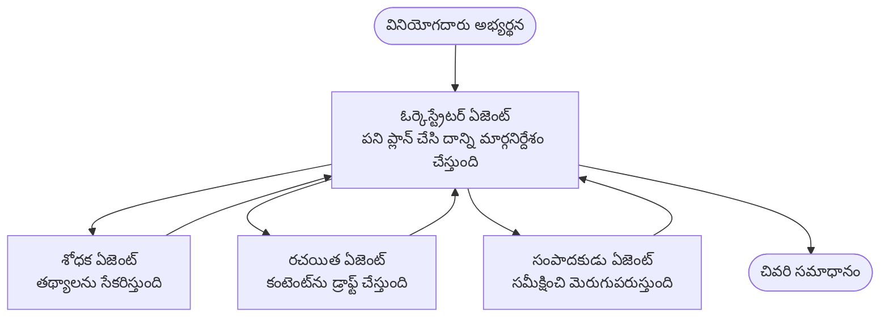

# బహుళ-ఏజెంట్ మౌలికాలు - మీ తొలి సమన్వయిత AI సిస్టమ్‌ను డిప్లాయ్ చేయండి

**అధ్యాయం నావిగేషన్:**
- **📚 కోర్సు హోమ్**: [AZD ప్రారంభికుల కోసం](../../README.md)
- **📖 ప్రస్తుత అధ్యాయం**: అధ్యాయం 5 - బహుళ-ఏజెంట్ AI పరిష్కారాలు
- **⬅️ మునుపటి**: [అధ్యాయం 4: ఇన్‌ఫ్రాస్ట్రక్చర్](../chapter-04-infrastructure/README.md)
- **➡️ తరువాత**: [సమన్వయ నమూనాలు](../chapter-06-pre-deployment/coordination-patterns.md)

> జూన్ 2026లో `azd 1.25.6` తో ధృవీకరించబడింది.

## పరిచయం

మునుపటి అధ్యాయాల్లో మీరు ఒకే అప్లికేషన్‌ను డిప్లాయ్ చేశారు—మరియు అధ్యాయం 2లో మీరు ఒకే AI ఏజెంట్‌ను డిప్లాయ్ చేసారు. ఈ పాఠం తదుపరి దశ తీసుకుంటుంది: ఒక **బహుళ-ఏజెంట్ సిస్టమ్**ను డిప్లాయ్ చేయడం, ఇక్కడ ఒకటి కంటే ఎక్కువ నిపుణ ఏజెంట్లు కలిసి పనిచేస్తారు ఒకే ఏజెంట్ బాగా చేయలేని సమస్యను పరిష్కరించడానికి.

శున్యాధికారి వారికి మంచిది: **మీకు కొత్త కమాండ్స్ అవసరం లేదు.** ఒక బహుళ-ఏజెంట్ పరిష్కారం ఇప్పటికీ ఒక azd ప్రాజెక్ట్. మీరు `azd init`, `azd up`, పరీక్ష, మరియు `azd down` చేయగలరు—ఇప్పటికే మీరు తెలుసుకున్న అదే వర్క్‌ఫ్లో. మారుతున్నది యాప్ లోపల యొక్క ఆకారం మాత్రమే.

## నేర్చుకునే లక్ష్యాలు

ఈ పాఠాన్ని ముగించిన తర్వాత, మీరు:
- "బహుళ-ఏజెంట్" అంటే ఏమిటి మరియు అది ఎప్పుడికి అదనపు సంక్లిష్టతకి తగినదో అర్థం చేసుకోవడం
- బహుళ-ఏజెంట్ సిస్టమ్‌లో సాధారణ పాత్రలను (ఒర్కెస్ట్రేటర్ + నిపుణులు) గుర్తించగలగటం
- `azd up` తో ఒక వాస్తవ, పనిచేసే బహుళ-ఏజెంట్ టెంప్లేట్‌ను డిప్లాయ్ చేయగలగటం
- బహుళ-ఏజెంట్ యాప్‌ను బ్యాక్ చేయడానికి అవసరమైన Azure వనరులను అర్థం చేసుకోవడం
- పరిష్కారాన్ని సురక్షితంగా ధృవీకరించడం, అనుకూలీకరించడం మరియు తొలగించడం చేయగలగటం

## నేర్చుకున్న ఫలితాలు

ఈ పాఠాన్ని పూర్తి చేసిన తర్వాత, మీరు చేయగలుగుతారు:
- ఒకే ఏజెంట్ మరియు బహుళ-ఏజెంట్ సిస్టమ్ మధ్య తేడాను వివరించగలగటం
- టూల్స్‌తో ఒకే ఏజెంట్ మరియు నిజమైన బహుళ-ఏజెంట్ డిజైన్ మధ్య ఎంచుకోవడం
- azd తో ఎండ్ టు ఎండ్ ఒక బహుళ-ఏజెంట్ టెంప్లేట్‌ను డిప్లాయ్ చేసి పరీక్షించడం
- ప్రతి ఏజెంట్ ఎక్కడ चलता మరియు అవి ఎలా సంభాషిస్తాయో గుర్తించడం
- స్థిరంగా ప్రయోజనం రాని ఖర్చులను నివారించడానికి అన్ని వనరులను శుభ్రం చేయడం

---

## బహుళ-ఏజెంట్ సిస్టమ్ అంటే ఏమిటి?

ఒకే AI ఏజెంట్ అనేది ఒక మోడల్ మరియు ఒక సెట్ సూచనలతో (ఐచ్ఛికంగా) కొన్ని టూల్స్ కలిగి ఉంటుంది. ఇది కేంద్రీకృత పనుల కోసం బాగుంటుంది. కానీ పని పెరిగినప్పుడు—ముందుగా పరిశోధన, తరువాత రాసుకోవడం, తరువాత సవరణ, తరువాత ఫ్యాక్ట్-చెక్ చేయడం—అన్నింటినీ ఒకే ప్రాంప్ట్‌లో కలపడం ఏజెంట్‌ను మెల్లగా, తక్కువ నమ్మకంతో మరియు డీబగ్గింగ్‌కు కఠినంగా చేస్తుంది.

ఒక **బహుళ-ఏజెంట్ సిస్టమ్** పనిని ప్రత్యేక నైపుణ్యులుగా విభజిస్తుంది, ప్రతి ఒక్కరూ ఒక పనిని బాగా చేస్తారు, మరియు ఒక ఒర్కెస్ట్రేటర్ દ્વારા సమన్వయం చేయబడతారు:



### మీరు ఎల్లప్పుడూ చూడబోయే రెండు పాత్రలు

| Role | Job | Example |
|------|-----|---------|
| **Orchestrator** | నిర్ణయం తీసుకుంటుంది *తదుపరి ఏమి జరుగుతుందో* మరియు ఏజెంట్ల మధ్య పనిని మార్గనిర్దేశం చేస్తుంది | "ముందుగా పరిశోధన, తరువాత రాయడం, తరువాత సవరణ" |
| **Specialist** | ఒకే దృష్టి పనిని చేస్తుంది మరియు ఫలితాన్ని ఇచ్చి తిరిగి వస్తుంది | ఒకే పని చేసిన "శోధకుడు" కేవలం వాస్తవాలను సేకరిస్తాడు |

### మీకు నిజంగా బహుళ ఏజెంట్లు అవసరమా?

సరళంగా ప్రారంభించండి. ఈ క్రింద్లో ఒకటి సత్యం అయితే మాత్రమే బహుళ-ఏజంట్ వద్దకు వెళ్ళండి:

- ✅ పనికి **విభిన్న దశలు** ఉంటాయి మరియు వేర్వేరు సూచనల నుండి లాభం వస్తుంది (పరిశోధన vs. రాయడం vs. సమీక్ష)
- ✅ మీరు సమయం సేవ్ చేయడానికి నిపుణులు **సమాంతరంగా** పరుగెత్తించాలని కోరుకుంటారు
- ✅ వేర్వేరు దశలకు **వేర్వేరు టూల్స్ లేదా డేటా సోర్సులు** అవసరం
- ✅ మీరు ప్రతి దశను **స్వతంత్రంగా పరీక్షించగలగాలి మరియు డీబగ్ చేయగలగాలి**

మీ పని ఒకే ప్రశ్న-జవాబు లేదా ఒక సాదా టూల్ కాల్ అయితే, ఒక **టూల్స్‌తో కూడిన ఒకే ఏజెంట్** (అధ్యాయం 2) ఉపయోగించడం సులభం, చౌకగా మరియు నిర్వహించడానికి సులభం.

> **ప్రారంభికుడు సూచన:** "ఇంకా ఏజెంట్లు" అనేది "లాభవంతం" అని కాదు. ప్రతి ఏజెంట్ ఆలస్యం, ఖర్చు మరియు కొత్తగా గమనించమని అంశాన్ని చేర్చుతుంది. సమస్య స్పష్టంగా భాగాలుగా విభజించబడినప్పుడు మాత్రమే ఏజెంట్లు జోడించండి.

---

## Azureలో బహుళ-ఏజెంట్ నిర్మించే రెండు విధానాలు

| Approach | అది ఏమిటి | ఉత్తమ ప్రయోజనం |
|----------|-----------|----------------|
| **Single agent + tools** | ఒక Foundry ఏజెంట్ ఫంక్షన్స్/టూల్స్‌ను పిలవడం | సరళమైన వర్క్‌ఫ్లోలు, ప్రారంభం కోసం |
| **Multiple coordinated agents** | ఒక ఒర్కెస్ట్రేటర్‌తో అనేక ఏజెంట్లు | స్పష్టమైన దశలు, సమాంతర పని, ప్రత్యేకత |

ఈ పాఠం రెండవ విధానంపై, ఒక **తయారైన టెంప్లేట్**ను ఉపయోగించి దృష్టి సారిస్తుంది, అందువల్ల మీరు మీ స్వంతది నిర్మించాక ముందు ఒక వాస్తవ బహుళ-ఏజెంట్ సిస్టమ్ రన్ అయ్యే దాన్ని చూడవచ్చు.

---

## ప్రాక్టికల్: పని చేసే బహుళ-ఏజెంట్ యాప్‌ను డిప్లాయ్ చేయండి

మనం **Contoso Creative Writer** ను డిప్లాయ్ చేస్తాం, ఇది అధికారిక Azure శాంపుల్ మరియు ఇది అనేక ఏజెంట్లను (శోధకుడు, రచయిత, ఎడిటర్) ఉపయోగించి ఆర్టికల్ ఉత్పత్తి చేయడానికి సమన్వయం చేయబడినది. పాత్రలు అర్థం చేసుకోవడానికి సులభంగా ఉండడంతో ఇది మంచి తొలి బహుళ-ఏజెంట్ యాప్.

### దశ 1: టెంప్లేట్‌ను ఆరంభించండి

```bash
# ఒక పని ఫోల్డర్‌ను సృష్టించండి
mkdir creative-writer && cd creative-writer

# అధికారిక బహుళ-ఏజెంట్ టెంప్లేట్ నుండి ప్రారంభించండి
azd init --template contoso-creative-writer
```

> మీరు ఎప్పుడైనా [Awesome AZD AI gallery](https://azure.github.io/awesome-azd/?tags=ai) లోకి వెళ్ళి మరిన్ని బహుళ-ఏజెంట్ టెంప్లేట్లను బ్రౌజ్ చేయండి. ఇతర ప్రారంభికులకు అనుకూలమైన ఎంపికలలో `get-started-with-ai-agents` మరియు `azure-ai-travel-agents` ఉంటాయి.

### దశ 2: ప్రామాణీకరణ

```bash
# azd వర్క్‌ఫ్లోల కోసం అవసరం
azd auth login
```

### దశ 3: ఒక పరిసరాన్ని సృష్టించండి

```bash
azd env new dev
```

### దశ 4: ముందుగా చూడండి, తరువాత డిప్లాయ్ చేయండి

```bash
# ఏమీ ఖర్చు చేయకముందు ఏం సృష్టించబడబోతోందో చూడండి (సిఫార్సు చేయబడింది)
azd provision --preview

# ఇన్‌ఫ్రాస్ట్రక్చర్‌ను ఏర్పాటు చేసి అన్ని ఏజెంట్లను ఒకే దశలో అమర్చండి
azd up
```

`azd up` ఒక సబ్స్క్రిప్షన్ మరియు రీజియన్ కోసం ప్రాంప్ట్ చేస్తుంది, తరువాత Azure వనరులను ప్రొవిజన్ చేసి అప్లికేషన్‌ను డిప్లాయ్ చేస్తుంది. AI డిప్లాయ్‌మెంట్లు ఒక సాదా వెబ్ యాప్ కంటే ఎక్కువ సమయం తీసుకోవచ్చు—మీరు పెద్ద మోడళ్లను డిప్లాయ్ చేస్తుంటే, మీరు డిప్లాయ్ టైమ్‌ఔట్‌ని పొడిగించవచ్చు:

```bash
azd deploy --timeout 1800
```

> **ఖర్చు మరియు సామర్థ్యంపై హెడ్‌సప్:** బహుళ-ఏజెంట్ యాప్స్ AI మోడళ్లను డిప్లాయ్ చేస్తాయి, ఇవి కోటాను వినియోగించి ఖర్చు కలిగిస్తాయి. `azd up` మోడల్ కోటా కారణంగా విఫలమైతే, రీజియన్ మరియు కోటా పరిష్కారాల కోసం [AI సమస్యల పరిష్కారం](../chapter-07-troubleshooting/ai-troubleshooting.md) చూడండి, మరియు అధ్యాయం 6 [సామర్థ్య ప్లానింగ్](../chapter-06-pre-deployment/capacity-planning.md).

---

## మీరు డిప్లాయ్ చేసినది ఎలా అర్థం చేసుకోవాలి

ఇలాంటి సాధారణ బహుళ-ఏజెంట్ యాప్ సాధారణంగా ఒక ప్రత్యక్ష మ్యాపింగ్ కలిగిన Azure వనరుల సమాహారం ప్రొవైడ్ చేస్తుంది:

| Resource | ఎందుకందించబడింది |
|----------|--------------------|
| **Microsoft Foundry / Models** | ప్రతి ఏజెంట్ ఉపయోగించే భాషా మోడళ్లను హోస్ట్ చేస్తుంది |
| **Azure AI Search** | శోధన ఏజెంట్‌కు అన్వేషించడానికి ఆధారమైన డేటాను అందిస్తుంది |
| **Container Apps** (or App Service) | ఒర్కెస్ట్రేటర్ మరియు ఏజెంట్ కోడ్‌ని హోస్ట్ చేస్తుంది |
| **Cosmos DB** (in some samples) | ఏజెంట్ల మధ్య పంచుకునే స్థితి/మెమరీని నిల్వ చేస్తుంది |
| **Application Insights** | ఫ్లోను డీబగ్ చేయడానికి అభ్యర్థనలను ఏజెంట్ల *అంతటా* ట్రేస్ చేస్తుంది |

### ఏజెంట్లు ఒకరితో ఒకరు ఎలా మాట్లాడతాయో

బహుళ-ఏజెంట్ azd శాంపిళ్లలో, **ఒర్కెస్ట్రేటర్ మీ అప్లికేషన్ కోడ్‌లో నడుస్తుంది** (ఉదాహరణకు, Semantic Kernel లేదా Microsoft Agent Framework వంటి ఫ్రేమ్‌వర్క్‌ను ఉపయోగించి). ఒర్కెస్ట్రేటర్ ప్రతి నిపుణ ఏజెంట్ను వరసగా పిలుస్తుంది, ఫలితాలను పంపిస్తుంది, మరియు తుది సమాధానాన్ని కూడగట్టి రూపొందిస్తుంది. ఏజెంట్లు సానుభూతి పంచుకునే విధానం:

- **Function/tool calls** — ఒర్కెస్ట్రేటర్ ఒక నిపుణుని ఆహ్వానించి ఫలితాన్ని తిరిగి పొందుతుంది
- **Shared memory** — ఒక డేటాబేస్ (బహుళంగా Cosmos DB) రెండు ఏజెంట్లు చదవగలిగే స్థితిని ఉంచుతుంది
- **Messages/events** — తక్కువ కఠోర అనుసంధానానికి, ఏజెంట్లు క్యూలు లేదా Service Bus ద్వారా కమ్యూనికేట్ చేస్తాయి

> **డీబగ్గింగ్‌కు ఇది ఎందుకు ముఖ్యమో:** ప్రతి దశ విభిన్నంగా ఉండటంతో, Application Insights మీరు ఏ ఏజెంట్ మెల్లగా లేదా విఫలమైందో చూపిస్తుంది. ఇదే కారణం పనిని ఏజెంట్లుగా విభజించే ప్రధాన ప్రయోజనాల్లో ఒకటి.

---

## డిప్లాయ్‌మెంట్‌ను ధృవీకరించండి

మరే ముందు మీరు సిస్టమ్ నిజంగా పనిచేస్తుందో తెలియజేయండి:

```bash
# డిప్లాయ్ చేయబడిన ఎండ్‌పాయింట్లను చూపించండి
azd show

# యాప్ యొక్క మానిటరింగ్ డాష్‌బోర్డ్ను తెరవండి
azd monitor

# ఏదైనా సరిగా కనిపించకపోతే లాగ్‌లను టెయిల్ చేయండి
azd monitor --logs
```

తరువాత `azd show` నుండి యాప్ URL ను తెరిచి అన్ని ఏజెంట్లను పరిరక్షించే ఒక అభ్యర్థనను ప్రయత్నించండి (Creative Writer కోసం, ఒక విషయం పై చిన్న ఆర్టికల్ రాయమని అడగండి). Application Insights లోని **transaction search** లో, మీరు అభ్యర్థన పరిశోధకుడు, రచయిత మరియు ఎడిటర్ దశలుగా విస్తరించినట్లు చూడాలి.

**సక్సెస్ ప్రమాణాలు:**
- ✅ `azd show` ఒక చేరుకోదగ్గ ఎండ్‌పాయింట్ ని జాబితా చేస్తుంది
- ✅ ఒక అభ్యర్థన స్పష్టంగా బహుళ దశల ద్వారా గుండా ఫలితం ఉత్పత్తి చేస్తుంది
- ✅ Application Insights ఒకటి కంటే ఎక్కువ ఏజెంట్ దశల కోసం ట్రేస్‌లను చూపిస్తుంది

---

## అనుకూలీకరించండి: ఒక ఏజెంట్‌ను జోడించండి లేదా సర్దుబాటు చేయండి

ప్రతి ఏజెంట్ కేవలం సూచనలు మరియు టూల్స్ మాత్రమే కాబట్టి, అనుకూలీకరించడం సులభం:

1. టెంప్లేట్‌లో ఏజెంట్ నిర్వచనాలను కనుగొనండి (సాధారణంగా `prompts/`, `agents/`, లేదా `*.prompty` ఫైళ్ల సమూహం).
2. ఏజెంట్ సూచనలను సర్దుబాటు చేయండి — ఉదాహరణకు, ఎడిటర్ ఏజెంట్‌కు నిర్దిష్ట టోన్ లేదా పద సంఖ్యను పాటించమని చెప్పండి.
3. కేవలం కోడ్‌ను మళ్లీ డిప్లాయ్ చేయండి (ఇన్ఫ్రాస్ట్రక్చర్ మార్చబడలేదు):

   ```bash
   azd deploy
   ```

మరింతగా వెళ్లి మీ *సొంత* మానిఫెస్ట్ నుండి ఏజెంట్లను నిర్మించాలనుకుంటే, ఏజెంట్ ఎక్స్‌టెన్షన్‌ని మరియు దాని పూర్తి లైఫ్‌సైకిల్‌ను ఉపయోగించండి:

```bash
azd extension install azure.ai.agents
azd ai agent init -m agent-manifest.yaml
azd up
azd ai agent invoke      # పరీక్ష, ప్రతిస్పందన సమయంతో
```

సంపూర్ణ ఏజెంట్ లైఫ్‌సైకిల్ కోసం [అధ్యాయం 2: ఏజెంట్లు](../chapter-02-ai-development/agents.md) మరియు [AZD AI CLI రిఫరెన్స్](../chapter-08-production/production-ai-practices.md#azd-ai-cli-commands-and-extensions) చూడండి (`invoke`, `eval generate`, `optimize`, `delete`).

---

## శుభ్రపరచండి

బహుళ-ఏజెంట్ యాప్స్ బహుళ బిల్లబుల్ సర్వీసులను నడిపిస్తాయి. మీరు పనిని పూర్తిచేసిన తర్వాత అన్నింటినీ తొలగించండి:

```bash
azd down --force --purge
```

`--purge` ఫ్లాగ్ సాఫ్ట్-డిలీట్ అయిన AI వనరులను (ఉదాహరణకు Foundry/Azure AI Services అకౌంట్లు) కూడా తొలగిస్తుంది, తద్వారా అవి భవిష్యత్ రీడిప్లాయ్‌కి అనుకూలంగా ఉండవు లేదా ఖర్చు కొనసాగించవు.

---

## ప్రొడక్షన్ బహుళ-ఏజెంట్ సిస్టమ్స్ గురించి ఒక గమనిక

ఈ రిపోలోని [Retail Multi-Agent Solution](../../examples/retail-scenario.md) ఒక **ఆర్కిటెక్చర్ బ్లూప్రింట్**, ఒక-కమాండ్ టెంప్లేట్ కాదు—ఇది ప్రొడక్షన్ రిటైల్ సిస్టమ్ ఎలా నిర్మించబడతుందో డాక్యుమెంట్ చేస్తుంది (మరియు పూర్తి నిర్మాణం ఎంత విస్తృతమైనదో స్పష్టంగా చెప్తుంది). మీరు ఇక్కడ పని చేసే శాంపుల్‌ను డిప్లాయ్ చేసిన తర్వాత దీన్ని డిజైన్ సూచనగా ఉపయోగించండి. ప్రొడక్షన్ సంబంధిత అంశాల (మెరుపు, ఖర్చు, మానిటరింగ్, గవర్నెన్స్) కోసం, [అధ్యాయం 8: ప్రొడక్షన్ AI ఆచారాలు](../chapter-08-production/production-ai-practices.md) ను కొనసాగించండి.

---

## సారాంశం

- ఒక బహుళ-ఏజెంట్ సిస్టమ్ ఓర్కెస్ట్రేటర్ ద్వారా సమన్వయింపబడే నిపుణులుగా పనిని విభజిస్తుంది.
- పని స్పష్టమైన దశలు, సమాంతరత లేదా దశలకు వేర్వేరు టూల్స్ ఉన్నపుడు మాత్రమే దీన్ని ఉపయోగించండి—ఇతరथा ఒకే ఏజెంట్‌ను ప్రాధాన్యం ఇవ్వండి.
- azd వర్క్‌ఫ్లో మారలేదు: `azd init` → `azd up` → పరీక్ష → `azd down`.
- `contoso-creative-writer` వంటి వాస్తవ టెంప్లేట్ మీకు పని చేసే బహుళ-ఏజెంట్ యాప్‌ను ఇక్కడికి తెస్తుంది మరియు అనుకూలీకరించగలుగుతుంది.
- ఏజెంట్ల మధ్య Application Insights ట్రేసింగ్ బహుళ-ఏజెంట్ డిజైన్ యొక్క ఒక ప్రధాన ప్రాక్టికల్ లాభం.

---

## 🔗 నావిగేషన్

| Direction | Lesson |
|-----------|--------|
| **Previous** | [అధ్యాయం 4: ఇన్‌ఫ్రాస్ట్రక్చర్](../chapter-04-infrastructure/README.md) |
| **Next** | [సమన్వయ నమూనాలు](../chapter-06-pre-deployment/coordination-patterns.md) |

## 📖 సంబంధిత వనరులు

- [AI Agents Guide](../chapter-02-ai-development/agents.md)
- [సమన్వయ నమూనాలు](../chapter-06-pre-deployment/coordination-patterns.md)
- [ప్రొడక్షన్ AI ఆచారాలు](../chapter-08-production/production-ai-practices.md)
- [AI సమస్యల పరిష్కారం](../chapter-07-troubleshooting/ai-troubleshooting.md)

---

<!-- CO-OP TRANSLATOR DISCLAIMER START -->
**అస్వీకరణ**:
ఈ పత్రం AI అనువాద సేవ [Co-op Translator](https://github.com/Azure/co-op-translator) ఉపయోగించి అనువదించబడింది. మేము ఖచ్చితత్వానికి ప్రయత్నిస్తున్నప్పటికీ, ఆటోమేటెడ్ అనువాదాలు తప్పులు లేదా అసమగ్రతలను కలిగి ఉండవచ్చు. దాని స్వదేశ భాషలో ఉన్న అసలు పత్రాన్ని అధికారం కలిగిన మూలంగా పరిగణించాలి. కీలకమైన సమాచారం కోసం, ప్రొఫెషనల్ మానవ అనువాదాన్ని సిఫారసు చేస్తాము. ఈ అనువాదం ఉపయోగం వల్ల కలిగే ఏవైనా అపార్థాలు లేదా తప్పుదారులు కోసం మేము బాధ్యత వహించము.
<!-- CO-OP TRANSLATOR DISCLAIMER END -->