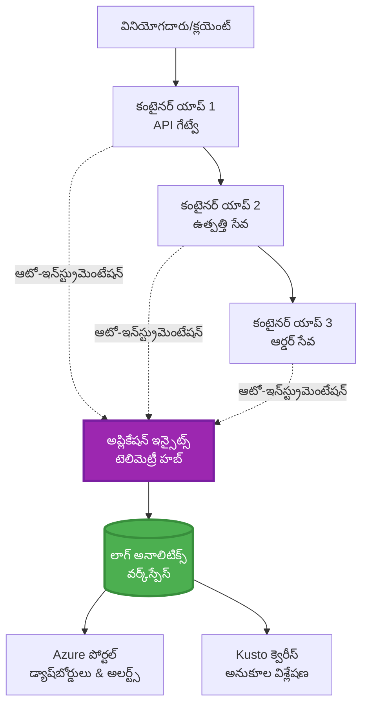
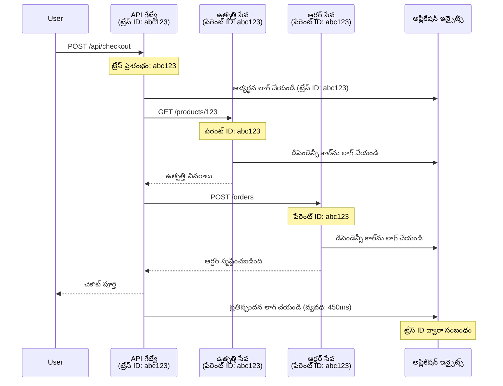

# AZD తో Application Insights ఇంటిగ్రేషన్

⏱️ **అంచనా సమయం**: 40-50 నిమిషాలు | 💰 **ఖర్చు ప్రభావం**: ~$5-15/నెల | ⭐ **సంక్లిష్టత**: Intermediate

**📚 అభ్యసన మార్గం:**
- ← Previous: [ప్రీఫ్లైట్ చెక్స్](preflight-checks.md) - ముందస్తు పంపిణీ కోసం ధృవీకరణ
- 🎯 **You Are Here**: Application Insights Integration (నిరీక్షణ, టెలిమెట్రీ, డీబగ్గింగ్)
- → Next: [Deployment Guide](../chapter-04-infrastructure/deployment-guide.md) - Deploy to Azure
- 🏠 [Course Home](../../README.md)

---

## మీరు నేర్చుకోవాల్సిన విషయం

By completing this lesson, you will:
- AZD ప్రాజెక్టులలో ఆటోమేటిక్‌గా **Application Insights**ని ఇంటిగ్రేట్ చేయటం
- మైక్రోసర్వీసులకు **డిస్ట్రిబ్యూటెడ్ ట్రేసింగ్**ను కాన్ఫిగర్ చేయటం
- **కస్టమ్ టెలిమెట్రీ** (మీట్రిక్స్, ఈవెంట్స్, డిపెండెన్సీస్) అమలు చేయటం
- రియల్-టైమ్ మానిటరింగ్ కోసం **లైవ్ మీట్రిక్స్** సెటప్ చేయటం
- AZD డిప్లాయ్‌మెంట్‌ల నుండి **అలెర్ట్స్ మరియు డాష్‌బోర్డ్స్** తయారు చేయటం
- **టెలిమెట్రీ క్వెరీలు**తో ప్రొడక్షన్ సమస్యలను డీబగ్ చేయటం
- ఖర్చులు మరియు సాంప్లింగ్ వ్యూహాలను ఉపయోగించి **ఖర్చు ఆప్టిమైజేషన్**
- **AI/LLM అప్లికేషన్ల**ను పర్యవేక్షించడం (టోకెన్లు, లేటెన్సీ, ఖర్చులు)

## AZD తో Application Insights ఎందుకు ముఖ్యం

### సవాలు: ప్రొడక్షన్ పర్యవేక్షణ

**Application Insights లేకుండా:**
```
❌ No visibility into production behavior
❌ Manual log aggregation across services
❌ Reactive debugging (wait for customer complaints)
❌ No performance metrics
❌ Cannot trace requests across services
❌ Unknown failure rates and bottlenecks
```

**Application Insights + AZD తో:**
```
✅ Automatic telemetry collection
✅ Centralized logs from all services
✅ Proactive issue detection
✅ End-to-end request tracing
✅ Performance metrics and insights
✅ Real-time dashboards
✅ AZD provisions everything automatically
```

**ఉదాహరణ**: Application Insights అనేది మీ అప్లికేషన్ కోసం ఒక "బ్లాక్ బాక్స్" ఫ్లైట్ రికార్డర్ + కాక్‌పిట్ డాష్‌బోర్డ్ లాంటిదే. మీరు రియల్-టైమ్‌లో జరుగుతున్న ప్రతి విషయాన్ని చూడగలుగుతారు మరియు ఏదైనా ఘటనను తిరిగి ప్లే చేయవచ్చు.

---

## ఆర్కిటెక్చర్ అవలోకనం

### AZD ఆర్కిటెక్చర్‌లో Application Insights


### ఆటోమేటిగ్గా ఏం పర్యవేక్షించబడుతుంది

| టెలిమెట్రీ రకం | ఇది ఏది రికార్డ్ చేస్తుంది | ఉపయోగ సందర్భం |
|----------------|---------------------------|-----------------|
| **అభ్యర్థనలు** | HTTP అభ్యర్థనలు, స్థితి కోడ్లు, వ్యవధి | API పనితీరు పర్యవేక్షణ |
| **డిపెండెన్సీలు** | బాహ్య కాల్స్ (DB, APIs, storage) | బాటిల్‌నెక్‌ల గుర్తింపు |
| **ఎక్సెప్షన్లు** | స్టాక్ ట్రేస్‌లతో హ్యాండల్ కాని లోపాలు | వైఫల్యాల డీబగ్గింగ్ |
| **కస్టమ్ ఈవెంట్లు** | వ్యాపార సంఘటనలు (signup, purchase) | అనలిటిక్స్ మరియు ఫన్నెల్స్ |
| **మీట్రిక్స్** | పనితీరు కౌంటర్లు, కస్టమ్ మీట్రిక్స్ | కెపాసిటీ ప్లానింగ్ |
| **ట్రేస్‌లు** | తీవ్రతతో లాగ్ సందేశాలు | డీబగ్గింగ్ మరియు ఆడిటింగ్ |
| **అవైలబిలిటీ** | అప్టైమ్ మరియు రెస్పాన్స్ సమయ పరీక్షలు | SLA పర్యవేక్షణ |

---

## ముందు కావలసినవి

### అవసరమైన టూల్స్

```bash
# Azure Developer CLIని ధృవీకరించండి
azd version
# ✅ అవశ్యకమయినది: azd సంస్కరణ 1.0.0 లేదా అంతకంటే ఎక్కువ

# Azure CLIని ధృవీకరించండి
az --version
# ✅ అవశ్యకమయినది: azure-cli సంస్కరణ 2.50.0 లేదా అంతకంటే ఎక్కువ
```

### Azure అవసరాలు

- సక్రియమైన Azure subscription
- సృష్టించడానికి అనుమతులు:
  - Application Insights resources
  - Log Analytics workspaces
  - Container Apps
  - Resource groups

### అవగాహన కోసం ముందస్తు జ్ఞానం

మీరు పూర్తి చేసి ఉండాలి:
- [AZD ప్రాథమికాలు](../chapter-01-foundation/azd-basics.md) - కోర్ AZD కాన్సెప్ట్‌లు
- [కాన్ఫిగరేషన్](../chapter-03-configuration/configuration.md) - ఎన్‌విరాన్‌మెంట్ సెటప్
- [మొదటి ప్రాజెక్ట్](../chapter-01-foundation/first-project.md) - ప్రాథమిక డిప్లాయ్‌మెంట్

---

## లెస్సన్ 1: AZD తో ఆటోమేటిక్ Application Insights

### AZD ఎలా Application Insights ను ప్రావిజన్ చేస్తుంది

AZD మీరు డిప్లాయ్ చేసినప్పుడు ఆటోమేటిగ్గా Application Insights ను సృష్టించి కాన్ఫిగర్ చేస్తుంది. ఇది ఎలా పని చేస్తుందో చూద్దాం.

### ప్రాజెక్ట్ నిర్మాణం

```
monitored-app/
├── azure.yaml                     # AZD configuration
├── infra/
│   ├── main.bicep                # Main infrastructure
│   ├── core/
│   │   └── monitoring.bicep      # Application Insights + Log Analytics
│   └── app/
│       └── api.bicep             # Container App with monitoring
└── src/
    ├── app.py                    # Application with telemetry
    ├── requirements.txt
    └── Dockerfile
```

---

### దశ 1: AZD ను కాన్ఫిగర్ చేయండి (azure.yaml)

**ఫైల్: `azure.yaml`**

```yaml
name: monitored-app
metadata:
  template: monitored-app@1.0.0

services:
  api:
    project: ./src
    language: python
    host: containerapp

# AZD automatically provisions monitoring!
```

**అంతే!** AZD డిఫాల్ట్‌గా Application Insights ను సృష్టిస్తుంది. ప్రాథమిక మానిటరింగ్ కోసం అదనపు కాన్ఫిగరేషన్ అవసరం లేదు.

---

### దశ 2: మానిటరింగ్ ఇన్‌ఫ్రాస్ట్రక్చర్ (Bicep)

**ఫైల్: `infra/core/monitoring.bicep`**

```bicep
param logAnalyticsName string
param applicationInsightsName string
param location string = resourceGroup().location
param tags object = {}

// Log Analytics Workspace (required for Application Insights)
resource logAnalytics 'Microsoft.OperationalInsights/workspaces@2022-10-01' = {
  name: logAnalyticsName
  location: location
  tags: tags
  properties: {
    sku: {
      name: 'PerGB2018'  // Pay-as-you-go pricing
    }
    retentionInDays: 30  // Keep logs for 30 days
    features: {
      enableLogAccessUsingOnlyResourcePermissions: true
    }
  }
}

// Application Insights
resource applicationInsights 'Microsoft.Insights/components@2020-02-02' = {
  name: applicationInsightsName
  location: location
  tags: tags
  kind: 'web'
  properties: {
    Application_Type: 'web'
    WorkspaceResourceId: logAnalytics.id
    IngestionMode: 'LogAnalytics'
    publicNetworkAccessForIngestion: 'Enabled'
    publicNetworkAccessForQuery: 'Enabled'
  }
}

// Outputs for Container Apps
output logAnalyticsWorkspaceId string = logAnalytics.id
output logAnalyticsWorkspaceName string = logAnalytics.name
output applicationInsightsConnectionString string = applicationInsights.properties.ConnectionString
output applicationInsightsInstrumentationKey string = applicationInsights.properties.InstrumentationKey
output applicationInsightsName string = applicationInsights.name
```

---

### దశ 3: కంటెయినర్ యాప్‌ను Application Insights కు కనెక్ట్ చేయండి

**ఫైల్: `infra/app/api.bicep`**

```bicep
param name string
param location string
param tags object = {}
param containerAppsEnvironmentName string
param applicationInsightsConnectionString string

resource containerApp 'Microsoft.App/containerApps@2023-05-01' = {
  name: name
  location: location
  tags: tags
  properties: {
    configuration: {
      ingress: {
        external: true
        targetPort: 8000
      }
      secrets: [
        {
          name: 'appinsights-connection-string'
          value: applicationInsightsConnectionString
        }
      ]
    }
    template: {
      containers: [
        {
          name: 'api'
          image: 'myregistry.azurecr.io/api:latest'
          resources: {
            cpu: json('0.5')
            memory: '1Gi'
          }
          env: [
            {
              name: 'APPLICATIONINSIGHTS_CONNECTION_STRING'
              secretRef: 'appinsights-connection-string'
            }
            {
              name: 'APPLICATIONINSIGHTS_ENABLED'
              value: 'true'
            }
          ]
        }
      ]
    }
  }
}

output uri string = 'https://${containerApp.properties.configuration.ingress.fqdn}'
```

---

### దశ 4: టెలిమెట్రీతో అప్లికేషన్ కోడ్

**ఫైల్: `src/app.py`**

```python
from flask import Flask, request, jsonify
from opencensus.ext.azure.log_exporter import AzureLogHandler
from opencensus.ext.azure.trace_exporter import AzureExporter
from opencensus.ext.flask.flask_middleware import FlaskMiddleware
from opencensus.trace.samplers import ProbabilitySampler
import logging
import os

app = Flask(__name__)

# Application Insights కనెక్షన్ స్ట్రింగ్‌ను పొందండి
connection_string = os.environ.get('APPLICATIONINSIGHTS_CONNECTION_STRING')

if connection_string:
    # డిస్ట్రిబ్యూటెడ్ ట్రేసింగ్‌ను కాన్ఫిగర్ చేయండి
    middleware = FlaskMiddleware(
        app,
        exporter=AzureExporter(connection_string=connection_string),
        sampler=ProbabilitySampler(rate=1.0)  # డెవ్ కోసం 100% శాంప్లింగ్
    )
    
    # లాగింగ్‌ను కాన్ఫిగర్ చేయండి
    logger = logging.getLogger(__name__)
    logger.addHandler(AzureLogHandler(connection_string=connection_string))
    logger.setLevel(logging.INFO)
    
    print("✅ Application Insights enabled")
else:
    logger = logging.getLogger(__name__)
    logger.setLevel(logging.INFO)
    print("⚠️ Application Insights not configured")

@app.route('/health')
def health():
    logger.info('Health check endpoint called')
    return jsonify({'status': 'healthy', 'monitoring': 'enabled'})

@app.route('/api/products')
def get_products():
    logger.info('Fetching products')
    
    # డేటాబేస్ కాల్‌ను సిమ్యులేట్ చేయండి (స్వయంచాలకంగా డిపెండెన్సీగా ట్రాక్ చేయబడుతుంది)
    products = [
        {'id': 1, 'name': 'Laptop', 'price': 999.99},
        {'id': 2, 'name': 'Mouse', 'price': 29.99},
        {'id': 3, 'name': 'Keyboard', 'price': 79.99}
    ]
    
    logger.info(f'Returned {len(products)} products')
    return jsonify(products)

@app.route('/api/error-test')
def error_test():
    """Test error tracking"""
    logger.error('Testing error tracking')
    try:
        raise ValueError('This is a test exception')
    except Exception as e:
        logger.exception('Exception occurred in error-test endpoint')
        return jsonify({'error': str(e)}), 500

@app.route('/api/slow')
def slow_endpoint():
    """Test performance tracking"""
    import time
    logger.info('Slow endpoint called')
    time.sleep(3)  # నెమ్మదైన ఆపరేషన్‌ను సిమ్యులేట్ చేయండి
    logger.warning('Endpoint took 3 seconds to respond')
    return jsonify({'message': 'Slow operation completed'})

if __name__ == '__main__':
    app.run(host='0.0.0.0', port=8000)
```

**ఫైల్: `src/requirements.txt`**

```txt
Flask==3.0.0
opencensus-ext-azure==1.1.13
opencensus-ext-flask==0.8.1
gunicorn==21.2.0
```

---

### దశ 5: డిప్లాయ్ చేసి ధృవీకరించండి

```bash
# AZD ను ప్రారంభించండి
azd init

# డిప్లాయ్ చేయండి (Application Insights ను స్వయంచాలకంగా ఏర్పాటు చేస్తుంది)
azd up

# యాప్ URL పొందండి
APP_URL=$(azd env get-values | grep API_URL | cut -d '=' -f2 | tr -d '"')

# టెలిమెట్రీ ఉత్పత్తి చేయండి
curl $APP_URL/health
curl $APP_URL/api/products
curl $APP_URL/api/error-test
curl $APP_URL/api/slow
```

**✅ ఆశించిన అవుట్‌పుట్:**
```json
{
  "status": "healthy",
  "monitoring": "enabled"
}
```

---

### దశ 6: Azure పోర్టల్‌లో టెలిమెట్రీని వీక్షించండి

```bash
# Application Insights వివరాలు పొందండి
azd env get-values | grep APPLICATIONINSIGHTS

# Azure పోర్టల్‌లో తెరవండి
az monitor app-insights component show \
  --app $(azd env get-values | grep APPLICATIONINSIGHTS_NAME | cut -d '=' -f2 | tr -d '"') \
  --resource-group $(azd env get-values | grep AZURE_RESOURCE_GROUP | cut -d '=' -f2 | tr -d '"') \
  --query "appId" -o tsv
```

Azure పోర్టల్ → Application Insights → Transaction Search కి నావిగేట్ చేయండి

మీకు ఈవి కనిపించాలి:
- ✅ స్థితి కోడ్లు గల HTTP అభ్యర్థనలు
- ✅ అభ్యర్థన వ్యవధి (ఉదా: `/api/slow` కోసం 3+ సెకన్లు)
- ✅ `/api/error-test` నుండి ఎక్సెప్షన్ వివరాలు
- ✅ కస్టమ్ లాగ్ సందేశాలు

---

## లెస్సన్ 2: కస్టమ్ టెలిమెట్రీ మరియు ఈవెంట్స్

### వ్యాపార సంఘటనలను ట్రాక్ చేయండి

**ఫైల్: `src/telemetry.py`**

```python
from opencensus.ext.azure import metrics_exporter
from opencensus.stats import aggregation as aggregation_module
from opencensus.stats import measure as measure_module
from opencensus.stats import stats as stats_module
from opencensus.stats import view as view_module
from opencensus.tags import tag_map as tag_map_module
from opencensus.ext.azure.log_exporter import AzureLogHandler
from opencensus.ext.azure.trace_exporter import AzureExporter
from opencensus.trace import tracer as tracer_module
import logging
import os

class TelemetryClient:
    """Custom telemetry client for Application Insights"""
    
    def __init__(self, connection_string=None):
        self.connection_string = connection_string or os.environ.get('APPLICATIONINSIGHTS_CONNECTION_STRING')
        
        if not self.connection_string:
            print("⚠️ Application Insights connection string not found")
            return
        
        # లాగర్ సెటప్ చేయండి
        self.logger = logging.getLogger(__name__)
        self.logger.addHandler(AzureLogHandler(connection_string=self.connection_string))
        self.logger.setLevel(logging.INFO)
        
        # మెట్రిక్స్ ఎక్స్‌పోర్టర్ సెటప్ చేయండి
        self.stats = stats_module.stats
        self.view_manager = self.stats.view_manager
        self.stats_recorder = self.stats.stats_recorder
        
        exporter = metrics_exporter.new_metrics_exporter(
            connection_string=self.connection_string
        )
        self.view_manager.register_exporter(exporter)
        
        # ట్రేసర్ సెటప్ చేయండి
        self.tracer = tracer_module.Tracer(
            exporter=AzureExporter(connection_string=self.connection_string)
        )
        
        print("✅ Custom telemetry client initialized")
    
    def track_event(self, event_name: str, properties: dict = None):
        """Track custom business event"""
        properties = properties or {}
        self.logger.info(
            f"CustomEvent: {event_name}",
            extra={
                'custom_dimensions': {
                    'event_name': event_name,
                    **properties
                }
            }
        )
    
    def track_metric(self, metric_name: str, value: float, properties: dict = None):
        """Track custom metric"""
        properties = properties or {}
        self.logger.info(
            f"CustomMetric: {metric_name} = {value}",
            extra={
                'custom_dimensions': {
                    'metric_name': metric_name,
                    'value': value,
                    **properties
                }
            }
        )
    
    def track_dependency(self, name: str, dependency_type: str, duration: float, success: bool):
        """Track external dependency call"""
        with self.tracer.span(name=name) as span:
            span.add_attribute('dependency.type', dependency_type)
            span.add_attribute('duration', duration)
            span.add_attribute('success', success)

# గ్లోబల్ టెలిమెట్రీ క్లైయెంట్
telemetry = TelemetryClient()
```

### కస్టమ్ ఈవెంట్స్‌తో అప్లికేషన్‌ను నవీకరించండి

**ఫైల్: `src/app.py` (వృద్ధి చేయబడింది)**

```python
from flask import Flask, request, jsonify
from telemetry import telemetry
import time
import random

app = Flask(__name__)

@app.route('/api/purchase', methods=['POST'])
def purchase():
    """Track purchase event with custom telemetry"""
    data = request.json
    product_id = data.get('product_id')
    quantity = data.get('quantity', 1)
    price = data.get('price', 0)
    
    # వ్యాపార సంఘటనను ట్రాక్ చేయండి
    telemetry.track_event('Purchase', {
        'product_id': product_id,
        'quantity': quantity,
        'total_amount': price * quantity,
        'user_id': request.headers.get('X-User-Id', 'anonymous')
    })
    
    # ఆదాయ ప్రమాణాన్ని ట్రాక్ చేయండి
    telemetry.track_metric('Revenue', price * quantity, {
        'product_id': product_id,
        'currency': 'USD'
    })
    
    return jsonify({
        'order_id': f'ORD-{random.randint(1000, 9999)}',
        'status': 'confirmed',
        'total': price * quantity
    })

@app.route('/api/search')
def search():
    """Track search queries"""
    query = request.args.get('q', '')
    
    start_time = time.time()
    
    # శోధనను అనుకరించండి (ఇది నిజమైన డేటాబేస్ క్వెరీ అయ్యే ఉండేది)
    results = [{'id': 1, 'name': f'Result for {query}'}]
    
    duration = (time.time() - start_time) * 1000  # మిల్లిసెకన్లుగా మార్చండి
    
    # శోధనా సంఘటనను ట్రాక్ చేయండి
    telemetry.track_event('Search', {
        'query': query,
        'results_count': len(results),
        'duration_ms': duration
    })
    
    # శోధన పనితీరు ప్రమాణాన్ని ట్రాక్ చేయండి
    telemetry.track_metric('SearchDuration', duration, {
        'query_length': len(query)
    })
    
    return jsonify({'results': results, 'count': len(results)})

@app.route('/api/external-call')
def external_call():
    """Track external API dependency"""
    import requests
    
    start_time = time.time()
    success = True
    
    try:
        # బాహ్య API కాల్‌ను అనుకరించండి
        response = requests.get('https://api.example.com/data', timeout=5)
        result = response.json()
    except Exception as e:
        success = False
        result = {'error': str(e)}
    
    duration = (time.time() - start_time) * 1000
    
    # డిపెండెన్సీని ట్రాక్ చేయండి
    telemetry.track_dependency(
        name='ExternalAPI',
        dependency_type='HTTP',
        duration=duration,
        success=success
    )
    
    return jsonify(result)

if __name__ == '__main__':
    app.run(host='0.0.0.0', port=8000)
```

### కస్టమ్ టెలిమెట్రీని పరీక్షించండి

```bash
# కొనుగోలు ఈవెంట్‌ను ట్రాక్ చేయండి
curl -X POST $APP_URL/api/purchase \
  -H "Content-Type: application/json" \
  -H "X-User-Id: user123" \
  -d '{"product_id": 1, "quantity": 2, "price": 29.99}'

# శోధన ఈవెంట్‌ను ట్రాక్ చేయండి
curl "$APP_URL/api/search?q=laptop"

# బాహ్య ఆధారాన్ని ట్రాక్ చేయండి
curl $APP_URL/api/external-call
```

**Azure పోర్టల్‌లో చూడండి:**

Application Insights → Logs కి వెళ్ళి, తరువాత నడపండి:

```kusto
// View purchase events
traces
| where customDimensions.event_name == "Purchase"
| project 
    timestamp,
    product_id = tostring(customDimensions.product_id),
    total_amount = todouble(customDimensions.total_amount),
    user_id = tostring(customDimensions.user_id)
| order by timestamp desc

// View revenue metrics
traces
| where customDimensions.metric_name == "Revenue"
| summarize TotalRevenue = sum(todouble(customDimensions.value)) by bin(timestamp, 1h)
| render timechart

// View search performance
traces
| where customDimensions.event_name == "Search"
| summarize 
    AvgDuration = avg(todouble(customDimensions.duration_ms)),
    SearchCount = count()
  by bin(timestamp, 5m)
| render timechart
```

---

## లెస్సన్ 3: మైక్రోసర్వీసుల కోసం డిస్ట్రిబ్యూటెడ్ ట్రేసింగ్

### క్రాస్-సర్వీస్ ట్రేసింగ్ ఎనేబుల్ చేయండి

మైక్రోసర్వీస్‌లు కోసం, Application Insights ఆటోమేటిగ్గా సర్వీసుల మధ్య అభ్యర్థనలను కోరిలేట్ చేస్తుంది.

**ఫైల్: `infra/main.bicep`**

```bicep
targetScope = 'subscription'

param environmentName string
param location string = 'eastus'

var tags = { 'azd-env-name': environmentName }

resource rg 'Microsoft.Resources/resourceGroups@2021-04-01' = {
  name: 'rg-${environmentName}'
  location: location
  tags: tags
}

// Monitoring (shared by all services)
module monitoring './core/monitoring.bicep' = {
  name: 'monitoring'
  scope: rg
  params: {
    logAnalyticsName: 'log-${environmentName}'
    applicationInsightsName: 'appi-${environmentName}'
    location: location
    tags: tags
  }
}

// API Gateway
module apiGateway './app/api-gateway.bicep' = {
  name: 'api-gateway'
  scope: rg
  params: {
    name: 'ca-gateway-${environmentName}'
    location: location
    tags: union(tags, { 'azd-service-name': 'gateway' })
    applicationInsightsConnectionString: monitoring.outputs.applicationInsightsConnectionString
  }
}

// Product Service
module productService './app/product-service.bicep' = {
  name: 'product-service'
  scope: rg
  params: {
    name: 'ca-products-${environmentName}'
    location: location
    tags: union(tags, { 'azd-service-name': 'products' })
    applicationInsightsConnectionString: monitoring.outputs.applicationInsightsConnectionString
  }
}

// Order Service
module orderService './app/order-service.bicep' = {
  name: 'order-service'
  scope: rg
  params: {
    name: 'ca-orders-${environmentName}'
    location: location
    tags: union(tags, { 'azd-service-name': 'orders' })
    applicationInsightsConnectionString: monitoring.outputs.applicationInsightsConnectionString
  }
}

output APPLICATIONINSIGHTS_CONNECTION_STRING string = monitoring.outputs.applicationInsightsConnectionString
output GATEWAY_URL string = apiGateway.outputs.uri
```

### ఎండ్-టు-ఎండ్ ట్రాన్సాక్షన్ చూడండి


**ఎండ్-టు-ఎండ్ ట్రేస్ కోసం క్వెరీ చేయండి:**

```kusto
// Find complete request flow
let traceId = "abc123...";  // Get from response header
dependencies
| union requests
| where operation_Id == traceId
| project 
    timestamp,
    type = itemType,
    name,
    duration,
    success,
    cloud_RoleName
| order by timestamp asc
```

---

## లెస్సన్ 4: లైవ్ మీట్రిక్స్ మరియు రియల్-టైమ్ మానిటరింగ్

### లైవ్ మీట్రిక్స్ స్ట్రీమ్ ఎనేబుల్ చేయండి

లైవ్ మీట్రిక్స్ <1 సెకను లేటెన్సీ తో రియల్-టైమ్ టెలిమెట్రీని అందిస్తుంది.

**లైవ్ మీట్రిక్స్‌కి యాక్సెస్:**

```bash
# Application Insights వనరును పొందండి
APPI_NAME=$(azd env get-values | grep APPLICATIONINSIGHTS_NAME | cut -d '=' -f2 | tr -d '"')

# వనరుల గుంపును పొందండి
RG_NAME=$(azd env get-values | grep AZURE_RESOURCE_GROUP | cut -d '=' -f2 | tr -d '"')

echo "Navigate to: Azure Portal → Resource Groups → $RG_NAME → $APPI_NAME → Live Metrics"
```

**రియల్-టైమ్‌లో మీరు చూడేది:**
- ✅ చెదరే అభ్యర్థన రేటు (అభ్యర్థనలు/సెకనుకు)
- ✅ బయటికి వెళ్లే డిపెండెన్సీ కాల్స్
- ✅ ఎక్సెప్షన్ సంఖ్య
- ✅ CPU మరియు మెమొరీ వినియోగం
- ✅ సక్రియ సర్వర్‌ల సంఖ్య
- ✅ సాంపిల్ టెలిమెట్రీ

### పరీక్ష కోసం లోడ్ రూపొందించండి

```bash
# లైవ్ మెట్రిక్స్‌ను చూడటానికి లోడ్ ఉత్పత్తి చేయండి
for i in {1..100}; do
  curl $APP_URL/api/products &
  curl $APP_URL/api/search?q=test$i &
done

# Azure పోర్టల్‌లో లైవ్ మెట్రిక్స్‌ను చూడండి
# మీరు రిక్వెస్ట్ రేట్‌లో స్పైక్ చూడగలరు
```

---

## ప్రాయోగిక వ్యాయామాలు

### వ్యాయామం 1: అలెర్ట్స్ సెట్ చేయండి ⭐⭐ (మధ్యంతర)

**లక్ష్యం**: అధిక లోప రేట్లు మరియు మందగమన షరతుల కోసం అలెర్ట్స్ సృష్టించండి.

**దశలు:**

1. **లోప రేట్కు అలెర్ట్ సృష్టించండి:**

```bash
# Application Insights వనరు ID ను పొందండి
APPI_ID=$(az monitor app-insights component show \
  --app $APPI_NAME \
  --resource-group $RG_NAME \
  --query "id" -o tsv)

# అసफलమైన అభ్యర్థనల కోసం మెట్రిక్ అలర్ట్ సృష్టించండి
az monitor metrics alert create \
  --name "High-Error-Rate" \
  --resource-group $RG_NAME \
  --scopes $APPI_ID \
  --condition "count requests/failed > 10" \
  --window-size 5m \
  --evaluation-frequency 1m \
  --description "Alert when error rate exceeds 10 per 5 minutes"
```

2. **మందగమన ప్రతిస్పందనల కోసం అలెర్ట్ సృష్టించండి:**

```bash
az monitor metrics alert create \
  --name "Slow-Responses" \
  --resource-group $RG_NAME \
  --scopes $APPI_ID \
  --condition "avg requests/duration > 3000" \
  --window-size 5m \
  --evaluation-frequency 1m \
  --description "Alert when average response time exceeds 3 seconds"
```

3. **Bicep ద్వారా అలెర్ట్ సృష్టించండి (AZD కోసం శ్రేష్టమైనది):**

**ఫైల్: `infra/core/alerts.bicep`**

```bicep
param applicationInsightsId string
param actionGroupId string = ''
param location string = resourceGroup().location

// High error rate alert
resource errorRateAlert 'Microsoft.Insights/metricAlerts@2018-03-01' = {
  name: 'high-error-rate'
  location: 'global'
  properties: {
    description: 'Alert when error rate exceeds threshold'
    severity: 2
    enabled: true
    scopes: [
      applicationInsightsId
    ]
    evaluationFrequency: 'PT1M'
    windowSize: 'PT5M'
    criteria: {
      'odata.type': 'Microsoft.Azure.Monitor.SingleResourceMultipleMetricCriteria'
      allOf: [
        {
          name: 'Error rate'
          metricName: 'requests/failed'
          operator: 'GreaterThan'
          threshold: 10
          timeAggregation: 'Count'
        }
      ]
    }
    actions: actionGroupId != '' ? [
      {
        actionGroupId: actionGroupId
      }
    ] : []
  }
}

// Slow response alert
resource slowResponseAlert 'Microsoft.Insights/metricAlerts@2018-03-01' = {
  name: 'slow-responses'
  location: 'global'
  properties: {
    description: 'Alert when response time is too high'
    severity: 3
    enabled: true
    scopes: [
      applicationInsightsId
    ]
    evaluationFrequency: 'PT1M'
    windowSize: 'PT5M'
    criteria: {
      'odata.type': 'Microsoft.Azure.Monitor.SingleResourceMultipleMetricCriteria'
      allOf: [
        {
          name: 'Response duration'
          metricName: 'requests/duration'
          operator: 'GreaterThan'
          threshold: 3000
          timeAggregation: 'Average'
        }
      ]
    }
  }
}

output errorAlertId string = errorRateAlert.id
output slowResponseAlertId string = slowResponseAlert.id
```

4. **అలెర్ట్స్ టెస్టు చేయండి:**

```bash
# లోపాలు సృష్టించండి
for i in {1..20}; do
  curl $APP_URL/api/error-test
done

# నెమ్మదిగా ప్రతిస్పందనలు సృష్టించండి
for i in {1..10}; do
  curl $APP_URL/api/slow
done

# అలర్ట్ స్థితిని తనిఖీ చేయండి (5-10 నిమిషాలు వేచి ఉండండి)
az monitor metrics alert list \
  --resource-group $RG_NAME \
  --query "[].{Name:name, Enabled:enabled, State:properties.enabled}" \
  --output table
```

**✅ విజయం ప్రమాణాలు:**
- ✅ అలెర్ట్స్ విజయవంతంగా సృష్టించబడ్డాయి
- ✅ తీర్లు దాటినప్పుడు అలెర్ట్స్ ట్రిగ్గర్ అవుతాయి
- ✅ Azure పోర్టల్‌లో అలెర్ట్ చరిత్రను చూడగలవు
- ✅ AZD డిప్లాయ్‌మెంట్‌తో సమగ్రీకరించింది

**సమయం**: 20-25 నిమిషాలు

---

### వ్యాయామం 2: కస్టమ్ డాష్‌బోర్డ్ సృష్టించండి ⭐⭐ (మధ్యంతర)

**లక్ష్యం**: కీలక అప్లికేషన్ మీట్రిక్స్ చూపించే డాష్‌బోర్డ్ రూపొందించండి.

**దశలు:**

1. **Azure పోర్టల్ ద్వారా డాష్‌బోర్డ్ సృష్టించండి:**

నావిగేట్ చేయండి: Azure పోర్టల్ → Dashboards → New Dashboard

2. **కీలక మీట్రిక్స్ కోసం టైల్స్ జోడించండి:**

- గత 24 గంటలలో అభ్యర్థనల సంఖ్య
- సగటు ప్రతిస్పందన సమయం
- లోపాల రేటు
- అత్యంత మెల్లగ శ్రేణి టాప్ 5 ఆపరేషన్లు
- వినియోగదారుల భౌగోళిక పంపిణీ

3. **Bicep ద్వారా డాష్‌బోర్డ్ సృష్టించండి:**

**ఫైల్: `infra/core/dashboard.bicep`**

```bicep
param dashboardName string
param applicationInsightsId string
param location string = resourceGroup().location

resource dashboard 'Microsoft.Portal/dashboards@2020-09-01-preview' = {
  name: dashboardName
  location: location
  properties: {
    lenses: [
      {
        order: 0
        parts: [
          // Request count
          {
            position: { x: 0, y: 0, rowSpan: 4, colSpan: 6 }
            metadata: {
              type: 'Extension/Microsoft_OperationsManagementSuite_Workspace/PartType/LogsDashboardPart'
              inputs: [
                {
                  name: 'resourceId'
                  value: applicationInsightsId
                }
                {
                  name: 'query'
                  value: '''
                    requests
                    | summarize RequestCount = count() by bin(timestamp, 1h)
                    | render timechart
                  '''
                }
              ]
            }
          }
          // Error rate
          {
            position: { x: 6, y: 0, rowSpan: 4, colSpan: 6 }
            metadata: {
              type: 'Extension/Microsoft_OperationsManagementSuite_Workspace/PartType/LogsDashboardPart'
              inputs: [
                {
                  name: 'resourceId'
                  value: applicationInsightsId
                }
                {
                  name: 'query'
                  value: '''
                    requests
                    | summarize 
                        Total = count(),
                        Failed = countif(success == false)
                    | extend ErrorRate = (Failed * 100.0) / Total
                    | project ErrorRate
                  '''
                }
              ]
            }
          }
        ]
      }
    ]
  }
}

output dashboardId string = dashboard.id
```

4. **డిప్లాయ్ చేయండి:**

```bash
# main.bicepకి చేర్చండి
module dashboard './core/dashboard.bicep' = {
  name: 'dashboard'
  scope: rg
  params: {
    dashboardName: 'dashboard-${environmentName}'
    applicationInsightsId: monitoring.outputs.applicationInsightsId
    location: location
  }
}

# డిప్లాయ్ చేయండి
azd up
```

**✅ విజయం ప్రమాణాలు:**
- ✅ డాష్‌బోర్డ్ కీలక మీట్రిక్స్‌ను చూపుతుంది
- ✅ Azure పోర్టల్ హోమ్‌కు పిన్ చేయవచ్చు
- ✅ రియల్-టైమ్‌లో అప్‌డేట్ అవుతుంది
- ✅ AZD ద్వారా డిప్లాయ్ చేయగలదు

**సమయం**: 25-30 నిమిషాలు

---

### వ్యాయామం 3: AI/LLM అప్లికేషన్‌ను మానిటర్ చేయండి ⭐⭐⭐ (అధిక స్థాయి)

**లక్ష్యం**: Azure OpenAI వినియోగం (టోకెన్లు, ఖర్చులు, లేటెన్సీ) ట్రాక్ చేయండి.

**దశలు:**

1. **AI మానిటరింగ్ ర్యాపర్ సృష్టించండి:**

**ఫైల్: `src/ai_telemetry.py`**

```python
from telemetry import telemetry
from openai import AzureOpenAI
import time

class MonitoredAzureOpenAI:
    """Azure OpenAI client with automatic telemetry"""
    
    def __init__(self, api_key, endpoint, api_version="2024-02-01"):
        self.client = AzureOpenAI(
            api_key=api_key,
            api_version=api_version,
            azure_endpoint=endpoint
        )
    
    def chat_completion(self, model: str, messages: list, **kwargs):
        """Track chat completion with telemetry"""
        start_time = time.time()
        
        try:
            # Azure OpenAIని కాల్ చేయండి
            response = self.client.chat.completions.create(
                model=model,
                messages=messages,
                **kwargs
            )
            
            duration = (time.time() - start_time) * 1000  # మిల్లీసెకన్లు
            
            # వాడకాన్ని సేకరించండి
            usage = response.usage
            prompt_tokens = usage.prompt_tokens
            completion_tokens = usage.completion_tokens
            total_tokens = usage.total_tokens
            
            # ఖర్చును లెక్కించండి (GPT-4 ధరలు)
            prompt_cost = (prompt_tokens / 1000) * 0.03  # ప్రతి 1K టోకెన్స్‌కు $0.03
            completion_cost = (completion_tokens / 1000) * 0.06  # ప్రతి 1K టోకెన్స్‌కు $0.06
            total_cost = prompt_cost + completion_cost
            
            # కస్టమ్ ఈవెంట్‌ను ట్రాక్ చేయండి
            telemetry.track_event('OpenAI_Request', {
                'model': model,
                'prompt_tokens': prompt_tokens,
                'completion_tokens': completion_tokens,
                'total_tokens': total_tokens,
                'duration_ms': duration,
                'cost_usd': total_cost,
                'success': True
            })
            
            # మెట్రిక్స్‌ను ట్రాక్ చేయండి
            telemetry.track_metric('OpenAI_Tokens', total_tokens, {
                'model': model,
                'type': 'total'
            })
            
            telemetry.track_metric('OpenAI_Cost', total_cost, {
                'model': model,
                'currency': 'USD'
            })
            
            telemetry.track_metric('OpenAI_Duration', duration, {
                'model': model
            })
            
            return response
            
        except Exception as e:
            duration = (time.time() - start_time) * 1000
            
            telemetry.track_event('OpenAI_Request', {
                'model': model,
                'duration_ms': duration,
                'success': False,
                'error': str(e)
            })
            
            raise
```

2. **మానిటర్డ్ క్లయింట్ ఉపయోగించండి:**

```python
from flask import Flask, request, jsonify
from ai_telemetry import MonitoredAzureOpenAI
import os

app = Flask(__name__)

# మానిటరింగ్ చేయబడిన OpenAI క్లయింట్‌ను ప్రారంభించండి
openai_client = MonitoredAzureOpenAI(
    api_key=os.environ['AZURE_OPENAI_API_KEY'],
    endpoint=os.environ['AZURE_OPENAI_ENDPOINT']
)

@app.route('/api/chat', methods=['POST'])
def chat():
    data = request.json
    user_message = data.get('message')
    
    # స్వయంచాలిత మానిటరింగ్‌తో కాల్ చేయండి
    response = openai_client.chat_completion(
        model='gpt-4',
        messages=[
            {'role': 'user', 'content': user_message}
        ]
    )
    
    return jsonify({
        'response': response.choices[0].message.content,
        'tokens': response.usage.total_tokens
    })
```

3. **AI మీట్రిక్స్‌ను క్వెరీ చేయండి:**

```kusto
// Total AI spend over time
traces
| where customDimensions.event_name == "OpenAI_Request"
| where customDimensions.success == "True"
| summarize TotalCost = sum(todouble(customDimensions.cost_usd)) by bin(timestamp, 1h)
| render timechart

// Token usage by model
traces
| where customDimensions.event_name == "OpenAI_Request"
| summarize 
    TotalTokens = sum(toint(customDimensions.total_tokens)),
    RequestCount = count()
  by Model = tostring(customDimensions.model)

// Average latency
traces
| where customDimensions.event_name == "OpenAI_Request"
| summarize AvgDuration = avg(todouble(customDimensions.duration_ms))
| project AvgDurationSeconds = AvgDuration / 1000

// Cost per request
traces
| where customDimensions.event_name == "OpenAI_Request"
| extend Cost = todouble(customDimensions.cost_usd)
| summarize 
    TotalCost = sum(Cost),
    RequestCount = count(),
    AvgCostPerRequest = avg(Cost)
```

**✅ విజయం ప్రమాణాలు:**
- ✅ ప్రతి OpenAI కాల్ ఆటోమేటిగ్గా ట్రాక్ అవుతుంది
- ✅ టోకెన్ వినియోగం మరియు ఖర్చులు కనబడతాయి
- ✅ లేటెన్సీ పర్యవేక్షించబడుతుంది
- ✅ బడ్జెట్ అలెర్ట్‌లను సెట్ చేయగలుగుతారు

**సమయం**: 35-45 నిమిషాలు

---

## ఖర్చు ఆప్టిమైజేషన్

### సాంప్లింగ్ వ్యూహాలు

టెలిమెట్రీ సాంప్లింగ్ ద్వారా ఖర్చును నియంత్రించండి:

```python
from opencensus.trace.samplers import ProbabilitySampler

# అభివృద్ధి: 100% శాంప్లింగ్
sampler = ProbabilitySampler(rate=1.0)

# ఉత్పత్తి: 10% శాంప్లింగ్ (ఖర్చులను 90% తగ్గిస్తుంది)
sampler = ProbabilitySampler(rate=0.1)

# అనుకూల శాంప్లింగ్ (స్వయంగా సర్దుబాటు అవుతుంది)
from opencensus.trace.samplers import AdaptiveSampler
sampler = AdaptiveSampler()
```

**In Bicep:**

```bicep
resource applicationInsights 'Microsoft.Insights/components@2020-02-02' = {
  name: applicationInsightsName
  properties: {
    SamplingPercentage: 10  // 10% sampling
  }
}
```

### డేటా సంరక్షణ

```bicep
resource logAnalytics 'Microsoft.OperationalInsights/workspaces@2022-10-01' = {
  name: logAnalyticsName
  properties: {
    retentionInDays: 30  // Minimum (cheapest)
    // Options: 30, 31, 60, 90, 120, 180, 270, 365, 550, 730
  }
}
```

### మాసిక ఖర్చు అంచనాలు

| డేటా వాల్యూమ్ | నిల్వ వ్యవధి | మాసిక ఖర్చు |
|-------------|-----------|--------------|
| 1 GB/నెల | 30 రోజులు | ~$2-5 |
| 5 GB/నెల | 30 రోజులు | ~$10-15 |
| 10 GB/నెల | 90 రోజులు | ~$25-40 |
| 50 GB/నెల | 90 రోజులు | ~$100-150 |

**ఉచిత టియర్**: 5 GB/నెల చేర్చబడినది

---

## జ్ఞాన పరీక్ష

### 1. బేసిక్ ఇంటిగ్రేషన్ ✓

మీ అవగాహనను పరీక్షించండి:

- [ ] **Q1**: AZD ఎలా Application Insights ను ప్రావిజన్ చేస్తుంది?
  - **A**: ఆటోమేటిక్గా `infra/core/monitoring.bicep` లోని Bicep టెంప్లేట్స్ ద్వారా

- [ ] **Q2**: ఏ వాతావరణ వేరియబుల్ Application Insights ను ఎనేబుల్ చేస్తుంది?
  - **A**: `APPLICATIONINSIGHTS_CONNECTION_STRING`

- [ ] **Q3**: ముఖ్యమైన మూడు టెలిమెట్రీ రకాలు ఏమిటి?
  - **A**: అభ్యర్థనలు (HTTP కాల్స్), డిపెండెన్సీలు (బాహ్య కాల్స్), ఎక్సెప్షన్లు (లోపాలు)

**Hands-On Verification:**
```bash
# Application Insights కాన్ఫిగర్ చేయబడిందో లేదో తనిఖీ చేయండి
azd env get-values | grep APPLICATIONINSIGHTS

# టెలిమేట్రీ ప్రవహిస్తున్నదో నిర్ధారించండి
az monitor app-insights metrics show \
  --app $APPI_NAME \
  --resource-group $RG_NAME \
  --metric "requests/count"
```

---

### 2. కస్టమ్ టెలిమేట్రీ ✓

మీ అవగాహనను పరీక్షించండి:

- [ ] **Q1**: మీరు ప్రత్యేక వ్యాపార సంఘటనలను ఎలా ట్రాక్ చేస్తారు?
  - **A**: లాగర్‌ను `custom_dimensions` తో ఉపయోగించండి లేదా `TelemetryClient.track_event()` వాడండి

- [ ] **Q2**: ఈవెంట్లు మరియు మీట్రిక్స్ మధ్య ఏ తేడా?
  - **A**: ఈవెంట్లు విడివిడిగా జరుగే సంఘటనలు, మీట్రిక్స్ సంఖ్యలుగా కొలిచే కొలమానాలు

- [ ] **Q3**: సర్వీసుల మధ్య టెలిమెట్రీని ఎలా కొరెలేట్ చేస్తారు?
  - **A**: Application Insights ఆటోమేటిగ్గా కొరెలేషన్ కోసం `operation_Id` ను ఉపయోగిస్తుంది

**Hands-On Verification:**
```kusto
// Verify custom events
traces
| where customDimensions.event_name != ""
| summarize count() by tostring(customDimensions.event_name)
```

---

### 3. ప్రొడక్షన్ మానిటరింగ్ ✓

మీ అవగాహనను పరీక్షించండి:

- [ ] **Q1**: సాంప్లింగ్ అంటే ఏమిటి మరియు దాన్ని ఎందుకు ఉపయోగిస్తారు?
  - **A**: సాంప్లింగ్ టెలిమెట్రీ పరిమాణాన్ని (మరియు ఖర్చును) తగ్గిస్తుంది, టెలిమెట్రీలోని ఒక శాతం మాత్రమే క్యాప్చర్ చేస్తుంది

- [ ] **Q2**: మీరు అలెర్ట్స్‌ను ఎలా సెటప్ చేస్తారు?
  - **A**: Application Insights మీట్రిక్స్ ఆధారంగా Bicep లేదా Azure పోర్టల్ లో మెట్రిక్ అలెర్ట్స్ ఉపయోగించండి

- [ ] **Q3**: Log Analytics మరియు Application Insights మధ్య తేడా ఏమిటి?
  - **A**: Application Insights డేటాను Log Analytics వర్క్‌స్పేస్‌లో స్టోర్ చేస్తుంది; App Insights అప్లికేషన్-కేంద్రీకృత వీక్షణలను అందిస్తుంది

**Hands-On Verification:**
```bash
# శాంప్లింగ్ కాన్ఫిగరేషన్‌ను తనిఖీ చేయండి
az monitor app-insights component show \
  --app $APPI_NAME \
  --resource-group $RG_NAME \
  --query "properties.SamplingPercentage"
```

---

## శ్రేష్ఠ ప్రాక్టీసులు

### ✅ చేయండి:

1. **కోరిలేషన్ IDలను ఉపయోగించండి**
   ```python
   logger.info('Processing order', extra={
       'custom_dimensions': {
           'order_id': order_id,
           'user_id': user_id
       }
   })
   ```

2. **క్రిటికల్ మీట్రిక్స్ కోసం అలెర్ట్స్ సెటప్ చేయండి**
   ```bicep
   // Error rate, slow responses, availability
   ```

3. **స్ట్రక్చర్డ్ లాగింగ్ ఉపయోగించండి**
   ```python
   # ✅ మంచిది: క్రమబద్ధమైన
   logger.info('User signup', extra={'custom_dimensions': {'user_id': 123}})
   
   # ❌ చెడు: అవ్యవస్థిత
   logger.info(f'User 123 signed up')
   ```

4. **డిపెండెన్సీలను పర్యవేక్షించండి**
   ```python
   # స్వయంచాలకంగా డేటాబేస్ కాల్స్, HTTP అభ్యర్థనలు మొదలైన వాటిని ట్రాక్ చేయండి.
   ```

5. **డిప్లాయ్‌మెంట్‌ల సమయంలో లైవ్ మీట్రిక్స్ ఉపయోగించండి**

### ❌ చేయొద్దు:

1. **సున్నితమైన డేటాను లాగ్ చేయొద్దు**
   ```python
   # ❌ చెడు
   logger.info(f'Login: {username}:{password}')
   
   # ✅ మంచి
   logger.info('Login attempt', extra={'custom_dimensions': {'username': username}})
   ```

2. **ప్రొడక్షన్‌లో 100% సాంప్లింగ్ ఉపయోగించొద్దు**
   ```python
   # ❌ ఖరీదైన
   sampler = ProbabilitySampler(rate=1.0)
   
   # ✅ ఖర్చు సమర్థవంతమైన
   sampler = ProbabilitySampler(rate=0.1)
   ```

3. **డెడ్ లెటర్ క్యూ‌లను నిర్లక్ష్యం చేయొద్దు**

4. **డేటా నిల్వ పరిమితులను సెట్ చేయడం మర్చిపోకండి**

---

## సమస్య పరిష్కరింపు

### సమస్య: టెలిమెట్రీ కనిపించటం లేదు

**నిర్ధారణ:**
```bash
# కనెక్షన్ స్ట్రింగ్ సెట్ అయిందో తనిఖీ చేయండి
azd env get-values | grep APPLICATIONINSIGHTS

# Azure Monitor ద్వారా అప్లికేషన్ లాగ్‌లను తనిఖీ చేయండి
azd monitor --logs

# లేదా Container Apps కోసం Azure CLI ఉపయోగించండి:
az containerapp logs show --name $APP_NAME --resource-group $RG_NAME --tail 50
```

**పరిష్కారం:**
```bash
# కంటెయినర్ యాప్‌లో కనెక్షన్ స్ట్రింగ్‌ను నిర్ధారించండి
az containerapp show \
  --name $APP_NAME \
  --resource-group $RG_NAME \
  --query "properties.template.containers[0].env" \
  | grep -i applicationinsights
```

---

### సమస్య: అధిక ఖర్చులు

**నిర్ధారణ:**
```bash
# డేటా దిగుమతిని తనిఖీ చేయండి
az monitor app-insights metrics show \
  --app $APPI_NAME \
  --resource-group $RG_NAME \
  --metric "availabilityResults/count"
```

**పరిష్కారం:**
- సాంప్లింగ్ రేటు తగ్గించండి
- రిటెన్షన్ పీరియడ్ తగ్గించండి
- విస్తృత లాగింగ్ తీసివేయండి

---

## మరింత తెలుసుకోండి

### అధికారిక డాక్యుమెంటేషన్
- [Application Insights Overview](https://learn.microsoft.com/azure/azure-monitor/app/app-insights-overview)
- [Application Insights for Python](https://learn.microsoft.com/azure/azure-monitor/app/opencensus-python)
- [Kusto Query Language](https://learn.microsoft.com/azure/data-explorer/kusto/query/)
- [AZD Monitoring](https://learn.microsoft.com/azure/developer/azure-developer-cli/monitor-your-app)

### ఈ కోర్సులో తదుపరి దశలు
- ← Previous: [ప్రీఫ్లైట్ చెక్స్](preflight-checks.md)
- → Next: [Deployment Guide](../chapter-04-infrastructure/deployment-guide.md)
- 🏠 [Course Home](../../README.md)

### సంబంధిత ఉదాహరణలు
- [Azure OpenAI Example](../../../../examples/azure-openai-chat) - AI టెలిమెట్రీ
- [Microservices Example](../../../../examples/microservices) - డిస్ట్రిబ్యూటెడ్ ట్రేసింగ్

---

## సారాంశం

**మీరు నేర్చుకున్నారు:**
- ✅ AZD ద్వారా ఆటోమాటిక్ Application Insights ప్రావిజనింగ్
- ✅ కస్టమ్ టెలిమెట్రీ (ఈవెంట్లు, మీట్రిక్స్, డిపెండెన్సీలు)
- ✅ మైక్రోసర్వీసుల మధ్య డిస్ట్రిబ్యూటెడ్ ట్రేసింగ్
- ✅ లైవ్ మెట్రిక్స్ మరియు రియల్-టైమ్ పర్యవేక్షణ
- ✅ అలర్ట్స్ మరియు డాష్‌బోర్డ్స్
- ✅ AI/LLM అనువర్తనాల పర్యవేక్షణ
- ✅ ఖర్చుల ఆప్టిమైజేషన్ వ్యూహాలు

**ప్రధాన విషయాలు:**
1. **AZD స్వయంచాలకంగా పర్యవേക്ഷణను ఏర్పాటు చేస్తుంది** - మాన్యువల్ సెటప్ అవసరం లేదు
2. **సంరచిత లాగింగ్ ఉపయోగించండి** - క్వెరీలు చేయడం సులభమవుతుంది
3. **వ్యాపార సంఘటనలను ట్రాక్ చేయండి** - కేవలం సాంకేతిక మెట్రిక్స్ మాత్రమే కాదు
4. **AI ఖర్చులను పర్యవేక్షించండి** - టోకెన్లు మరియు ఖర్చులను ట్రాక్ చేయండి
5. **అలర్ట్స్‌ను సెటప్ చేయండి** - ముందుగా చర్యలు తీసుకోండి, ప్రతిస్పందకంగా కాదు
6. **ఖర్చులను ఆప్టిమైజ్ చేయండి** - శాంప్లింగ్ మరియు రిటెన్షన్ పరిమితులను ఉపయోగించండి

**తదుపరి చర్యలు:**
1. ప్రాక్టికల్ వ్యాయామాలను పూర్తి చేయండి
2. మీ AZD ప్రాజెక్టులకు Application Insights జత చేయండి
3. మీ టీమ్ కోసం కస్టమ్ డ్యాష్‌బోర్డ్లు రూపొందించండి
4. మరింత తెలుసుకోండి [డిప్లాయ్‌మెంట్ గైడ్](../chapter-04-infrastructure/deployment-guide.md)

---

<!-- CO-OP TRANSLATOR DISCLAIMER START -->
గమనిక:
ఈ పత్రం AI అనువాద సేవ [Co-op Translator](https://github.com/Azure/co-op-translator) ద్వారా అనువదించబడింది. మేము ఖచ్చితత్వానికి శ్రద్ధ వహించినప్పటికీ, ఆటోమెటెడ్ అనువాదాల్లో తప్పులు లేదా అస్పష్టతలు ఉండే అవకాశం ఉందని దయచేసి గమనించండి. మూల పత్రాన్ని దాని స్వదేశీ భాషలో ఉన్నదే అధికారిక మూలంగా పరిగణించాలి. ముఖ్యమైన సమాచారానికి వృత్తిపరమైన మానవ అనువాదాన్ని సూచిస్తాము. ఈ అనువాదం ఉపయోగంతో ఏర్పడిన ఏవైనా అపార్థాలు లేదా తప్పుగా అర్థం చేసుకోవడాల విషయంలో మేము బాధ్యత వహించము.
<!-- CO-OP TRANSLATOR DISCLAIMER END -->