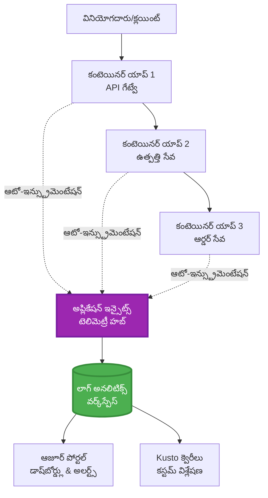
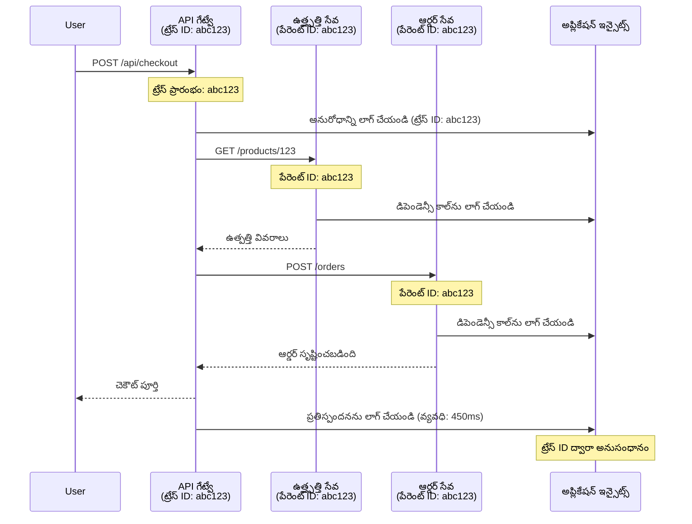

# Application Insights Integration with AZD

⏱️ **Estimated Time**: 40-50 minutes | 💰 **Cost Impact**: ~$5-15/month | ⭐ **Complexity**: Intermediate

**📚 Learning Path:**
- ← Previous: [ప్రీఫ్లైట్ తనిఖీలు](preflight-checks.md) - ముందస్తు-డిప్లాయ్ ధృవీకరణ
- 🎯 **You Are Here**: Application Insights Integration (మానిటరింగ్, టెలీమేట్రీ, డీబగ్గింగ్)
- → Next: [Deployment Guide](../chapter-04-infrastructure/deployment-guide.md) - Azureలో despley చేయడం
- 🏠 [Course Home](../../README.md)

---

## What You'll Learn

By completing this lesson, you will:
- AZD ప్రాజెక్టుల్లో **Application Insights** స్వయంచాలకంగా統కరించటం
- మైక్రోసర్వీసుల కోసం **distributed tracing** కాన్ఫిగర్ చేయడం
- **custom telemetry** (మెట్రిక్స్, ఈవెంట్స్, డిపెండెన్సీస్) అమలు చేయడం
- రియల్-టైమ్ మానిటరింగ్ కోసం **live metrics** సెట్ చేయడం
- AZD డిప్లాయ్‌మెంట్లుచే **alerts మరియు dashboards** సృష్టించడం
- **telemetry queries** తో ప్రొడక్షన్ సమస్యలను డీబగ్ చేయడం
- ఖర్చు మరియు శాంప్లింగ్ వ్యూహాలను ఆప్టిమైజ్ చేయడం
- **AI/LLM అప్లికేషన్స్** (టోకెన్లు, ఆలస్యం, ఖర్చులు) ని మానిటర్ చేయడం

## Why Application Insights with AZD Matters

### The Challenge: Production Observability

**Without Application Insights:**
```
❌ No visibility into production behavior
❌ Manual log aggregation across services
❌ Reactive debugging (wait for customer complaints)
❌ No performance metrics
❌ Cannot trace requests across services
❌ Unknown failure rates and bottlenecks
```

**With Application Insights + AZD:**
```
✅ Automatic telemetry collection
✅ Centralized logs from all services
✅ Proactive issue detection
✅ End-to-end request tracing
✅ Performance metrics and insights
✅ Real-time dashboards
✅ AZD provisions everything automatically
```

**Analogy**: Application Insights మీ అప్లికేషన్ కోసం "బ్లాక్ బాక్స్" ఫ్లైట్ రికార్డర్ + కాక్‌పిట్ డాష్‌బోర్డ్ లాంటిదే. మీరు రియల్-టైమ్‌లో జరుగుతున్న అన్ని విషయాలను చూడగలరు మరియు ఏ ఇన్సిడెంట్ అయినా రీప్లే చేయగలరు.

---

## Architecture Overview

### Application Insights in AZD Architecture


### What Gets Monitored Automatically

| Telemetry Type | What It Captures | Use Case |
|----------------|------------------|----------|
| **Requests** | HTTP requests, status codes, duration | API పనితీరు మానిటరింగ్ |
| **Dependencies** | External calls (DB, APIs, storage) | బాటల్నెక్స్ గుర్తించడం |
| **Exceptions** | Unhandled errors with stack traces | ఫెయిల్యూర్‌లను డీబగ్ చేయడం |
| **Custom Events** | Business events (signup, purchase) | అనలిటిక్స్ మరియు ఫనల్స్ |
| **Metrics** | Performance counters, custom metrics | కెపాసిటీ ప్లానింగ్ |
| **Traces** | Log messages with severity | డీబగింగ్ మరియు ఆడిటింగ్ |
| **Availability** | Uptime and response time tests | SLA మానిటరింగ్ |

---

## Prerequisites

### Required Tools

```bash
# Azure Developer CLIని తనిఖీ చేయండి
azd version
# ✅ ఆశించబడింది: azd వెర్షన్ 1.0.0 లేదా అంతకన్నా పైగా

# Azure CLIని తనిఖీ చేయండి
az --version
# ✅ ఆశించబడింది: azure-cli 2.50.0 లేదా అంతకన్నా పైగా
```

### Azure Requirements

- Active Azure subscription
- Permissions to create:
  - Application Insights resources
  - Log Analytics workspaces
  - Container Apps
  - Resource groups

### Knowledge Prerequisites

You should have completed:
- [AZD Basics](../chapter-01-foundation/azd-basics.md) - AZD ప్రధాన ధోరణులు
- [Configuration](../chapter-03-configuration/configuration.md) - ఎన్విరోన్మెంట్ సెటప్
- [First Project](../chapter-01-foundation/first-project.md) - బేసిక్ డిప్లాయ్‌మెంట్

---

## Lesson 1: Automatic Application Insights with AZD

### How AZD Provisions Application Insights

AZD డిప్లాయ్ చేసినప్పుడు Application Insights ను స్వయంచాలకంగా సృష్టించి కాన్ఫిగర్ చేస్తుంది. ఇది ఎలా పనిచేస్తుందో చూద్దాం.

### Project Structure

```
monitored-app/
├── azure.yaml                     # AZD configuration
├── infra/
│   ├── main.bicep                # Main infrastructure
│   ├── core/
│   │   └── monitoring.bicep      # Application Insights + Log Analytics
│   └── app/
│       └── api.bicep             # Container App with monitoring
└── src/
    ├── app.py                    # Application with telemetry
    ├── requirements.txt
    └── Dockerfile
```

---

### Step 1: Configure AZD (azure.yaml)

**File: `azure.yaml`**

```yaml
name: monitored-app
metadata:
  template: monitored-app@1.0.0

services:
  api:
    project: ./src
    language: python
    host: containerapp

# AZD automatically provisions monitoring!
```

**అంతేనటు!** ప్రాథమిక మానిటరింగ్ కోసం అదనపు కాన్ఫిగరేషన్ అవసరం లేకుండా AZD డిఫాల్ట్‌గా Application Insightsని సృష్టిస్తుంది.

---

### Step 2: Monitoring Infrastructure (Bicep)

**File: `infra/core/monitoring.bicep`**

```bicep
param logAnalyticsName string
param applicationInsightsName string
param location string = resourceGroup().location
param tags object = {}

// Log Analytics Workspace (required for Application Insights)
resource logAnalytics 'Microsoft.OperationalInsights/workspaces@2022-10-01' = {
  name: logAnalyticsName
  location: location
  tags: tags
  properties: {
    sku: {
      name: 'PerGB2018'  // Pay-as-you-go pricing
    }
    retentionInDays: 30  // Keep logs for 30 days
    features: {
      enableLogAccessUsingOnlyResourcePermissions: true
    }
  }
}

// Application Insights
resource applicationInsights 'Microsoft.Insights/components@2020-02-02' = {
  name: applicationInsightsName
  location: location
  tags: tags
  kind: 'web'
  properties: {
    Application_Type: 'web'
    WorkspaceResourceId: logAnalytics.id
    IngestionMode: 'LogAnalytics'
    publicNetworkAccessForIngestion: 'Enabled'
    publicNetworkAccessForQuery: 'Enabled'
  }
}

// Outputs for Container Apps
output logAnalyticsWorkspaceId string = logAnalytics.id
output logAnalyticsWorkspaceName string = logAnalytics.name
output applicationInsightsConnectionString string = applicationInsights.properties.ConnectionString
output applicationInsightsInstrumentationKey string = applicationInsights.properties.InstrumentationKey
output applicationInsightsName string = applicationInsights.name
```

---

### Step 3: Connect Container App to Application Insights

**File: `infra/app/api.bicep`**

```bicep
param name string
param location string
param tags object = {}
param containerAppsEnvironmentName string
param applicationInsightsConnectionString string

resource containerApp 'Microsoft.App/containerApps@2023-05-01' = {
  name: name
  location: location
  tags: tags
  properties: {
    configuration: {
      ingress: {
        external: true
        targetPort: 8000
      }
      secrets: [
        {
          name: 'appinsights-connection-string'
          value: applicationInsightsConnectionString
        }
      ]
    }
    template: {
      containers: [
        {
          name: 'api'
          image: 'myregistry.azurecr.io/api:latest'
          resources: {
            cpu: json('0.5')
            memory: '1Gi'
          }
          env: [
            {
              name: 'APPLICATIONINSIGHTS_CONNECTION_STRING'
              secretRef: 'appinsights-connection-string'
            }
            {
              name: 'APPLICATIONINSIGHTS_ENABLED'
              value: 'true'
            }
          ]
        }
      ]
    }
  }
}

output uri string = 'https://${containerApp.properties.configuration.ingress.fqdn}'
```

---

### Step 4: Application Code with Telemetry

**File: `src/app.py`**

```python
from flask import Flask, request, jsonify
from opencensus.ext.azure.log_exporter import AzureLogHandler
from opencensus.ext.azure.trace_exporter import AzureExporter
from opencensus.ext.flask.flask_middleware import FlaskMiddleware
from opencensus.trace.samplers import ProbabilitySampler
import logging
import os

app = Flask(__name__)

# Application Insights కనెక్షన్ స్ట్రింగ్ పొందండి
connection_string = os.environ.get('APPLICATIONINSIGHTS_CONNECTION_STRING')

if connection_string:
    # డిస్ట్రిబ్యూటెడ్ ట్రేసింగ్‌ను కాన్ఫిగర్ చేయండి
    middleware = FlaskMiddleware(
        app,
        exporter=AzureExporter(connection_string=connection_string),
        sampler=ProbabilitySampler(rate=1.0)  # డెవ్ కోసం 100% సాంప్లింగ్
    )
    
    # లాగింగ్‌ను కాన్ఫిగర్ చేయండి
    logger = logging.getLogger(__name__)
    logger.addHandler(AzureLogHandler(connection_string=connection_string))
    logger.setLevel(logging.INFO)
    
    print("✅ Application Insights enabled")
else:
    logger = logging.getLogger(__name__)
    logger.setLevel(logging.INFO)
    print("⚠️ Application Insights not configured")

@app.route('/health')
def health():
    logger.info('Health check endpoint called')
    return jsonify({'status': 'healthy', 'monitoring': 'enabled'})

@app.route('/api/products')
def get_products():
    logger.info('Fetching products')
    
    # డేటాబేస్ కాల్‌ను అనుకరించండి (ఆటోమేటిగ్గా డిపెండెన్సీగా ట్రాక్ చేయబడుతుంది)
    products = [
        {'id': 1, 'name': 'Laptop', 'price': 999.99},
        {'id': 2, 'name': 'Mouse', 'price': 29.99},
        {'id': 3, 'name': 'Keyboard', 'price': 79.99}
    ]
    
    logger.info(f'Returned {len(products)} products')
    return jsonify(products)

@app.route('/api/error-test')
def error_test():
    """Test error tracking"""
    logger.error('Testing error tracking')
    try:
        raise ValueError('This is a test exception')
    except Exception as e:
        logger.exception('Exception occurred in error-test endpoint')
        return jsonify({'error': str(e)}), 500

@app.route('/api/slow')
def slow_endpoint():
    """Test performance tracking"""
    import time
    logger.info('Slow endpoint called')
    time.sleep(3)  # నెమ్మదైన ఆపరేషన్‌ను అనుకరించండి
    logger.warning('Endpoint took 3 seconds to respond')
    return jsonify({'message': 'Slow operation completed'})

if __name__ == '__main__':
    app.run(host='0.0.0.0', port=8000)
```

**File: `src/requirements.txt`**

```txt
Flask==3.0.0
opencensus-ext-azure==1.1.13
opencensus-ext-flask==0.8.1
gunicorn==21.2.0
```

---

### Step 5: Deploy and Verify

```bash
# AZDని ప్రారంభించండి
azd init

# డిప్లాయ్ చేయండి (Application Insightsను స్వయంచాలకంగా ఏర్పాటు చేస్తుంది)
azd up

# యాప్ URLని పొందండి
APP_URL=$(azd env get-values | grep API_URL | cut -d '=' -f2 | tr -d '"')

# టెలిమెట్రీని ఉత్పత్తి చేయండి
curl $APP_URL/health
curl $APP_URL/api/products
curl $APP_URL/api/error-test
curl $APP_URL/api/slow
```

**✅ Expected output:**
```json
{
  "status": "healthy",
  "monitoring": "enabled"
}
```

---

### Step 6: View Telemetry in Azure Portal

```bash
# Application Insights వివరాలు పొందండి
azd env get-values | grep APPLICATIONINSIGHTS

# Azure పోర్టల్‌లో తెరవండి
az monitor app-insights component show \
  --app $(azd env get-values | grep APPLICATIONINSIGHTS_NAME | cut -d '=' -f2 | tr -d '"') \
  --resource-group $(azd env get-values | grep AZURE_RESOURCE_GROUP | cut -d '=' -f2 | tr -d '"') \
  --query "appId" -o tsv
```

**Navigate to Azure Portal → Application Insights → Transaction Search**

You should see:
- ✅ HTTP requests with status codes
- ✅ Request duration (3+ seconds for `/api/slow`)
- ✅ Exception details from `/api/error-test`
- ✅ Custom log messages

---

## Lesson 2: Custom Telemetry and Events

### Track Business Events

Let's add custom telemetry for business-critical events.

**File: `src/telemetry.py`**

```python
from opencensus.ext.azure import metrics_exporter
from opencensus.stats import aggregation as aggregation_module
from opencensus.stats import measure as measure_module
from opencensus.stats import stats as stats_module
from opencensus.stats import view as view_module
from opencensus.tags import tag_map as tag_map_module
from opencensus.ext.azure.log_exporter import AzureLogHandler
from opencensus.ext.azure.trace_exporter import AzureExporter
from opencensus.trace import tracer as tracer_module
import logging
import os

class TelemetryClient:
    """Custom telemetry client for Application Insights"""
    
    def __init__(self, connection_string=None):
        self.connection_string = connection_string or os.environ.get('APPLICATIONINSIGHTS_CONNECTION_STRING')
        
        if not self.connection_string:
            print("⚠️ Application Insights connection string not found")
            return
        
        # లాగర్ సెట్ చేయండి
        self.logger = logging.getLogger(__name__)
        self.logger.addHandler(AzureLogHandler(connection_string=self.connection_string))
        self.logger.setLevel(logging.INFO)
        
        # మెట్రిక్స్ ఎక్స్‌పోర్టర్ సెట్ చేయండి
        self.stats = stats_module.stats
        self.view_manager = self.stats.view_manager
        self.stats_recorder = self.stats.stats_recorder
        
        exporter = metrics_exporter.new_metrics_exporter(
            connection_string=self.connection_string
        )
        self.view_manager.register_exporter(exporter)
        
        # ట్రేసర్ సెట్ చేయండి
        self.tracer = tracer_module.Tracer(
            exporter=AzureExporter(connection_string=self.connection_string)
        )
        
        print("✅ Custom telemetry client initialized")
    
    def track_event(self, event_name: str, properties: dict = None):
        """Track custom business event"""
        properties = properties or {}
        self.logger.info(
            f"CustomEvent: {event_name}",
            extra={
                'custom_dimensions': {
                    'event_name': event_name,
                    **properties
                }
            }
        )
    
    def track_metric(self, metric_name: str, value: float, properties: dict = None):
        """Track custom metric"""
        properties = properties or {}
        self.logger.info(
            f"CustomMetric: {metric_name} = {value}",
            extra={
                'custom_dimensions': {
                    'metric_name': metric_name,
                    'value': value,
                    **properties
                }
            }
        )
    
    def track_dependency(self, name: str, dependency_type: str, duration: float, success: bool):
        """Track external dependency call"""
        with self.tracer.span(name=name) as span:
            span.add_attribute('dependency.type', dependency_type)
            span.add_attribute('duration', duration)
            span.add_attribute('success', success)

# గ్లోబల్ టెలిమేట్రీ క్లయింట్
telemetry = TelemetryClient()
```

### Update Application with Custom Events

**File: `src/app.py` (enhanced)**

```python
from flask import Flask, request, jsonify
from telemetry import telemetry
import time
import random

app = Flask(__name__)

@app.route('/api/purchase', methods=['POST'])
def purchase():
    """Track purchase event with custom telemetry"""
    data = request.json
    product_id = data.get('product_id')
    quantity = data.get('quantity', 1)
    price = data.get('price', 0)
    
    # వ్యాపార సంఘటనను ట్రాక్ చేయండి
    telemetry.track_event('Purchase', {
        'product_id': product_id,
        'quantity': quantity,
        'total_amount': price * quantity,
        'user_id': request.headers.get('X-User-Id', 'anonymous')
    })
    
    # ఆదాయ ప్రమాణాన్ని ట్రాక్ చేయండి
    telemetry.track_metric('Revenue', price * quantity, {
        'product_id': product_id,
        'currency': 'USD'
    })
    
    return jsonify({
        'order_id': f'ORD-{random.randint(1000, 9999)}',
        'status': 'confirmed',
        'total': price * quantity
    })

@app.route('/api/search')
def search():
    """Track search queries"""
    query = request.args.get('q', '')
    
    start_time = time.time()
    
    # శోధనను అనుకరించండి (ఇది నిజమైన డేటాబేస్ క్వెరీగా ఉండేది)
    results = [{'id': 1, 'name': f'Result for {query}'}]
    
    duration = (time.time() - start_time) * 1000  # ms కు మార్చండి
    
    # శోధన సంఘటనను ట్రాక్ చేయండి
    telemetry.track_event('Search', {
        'query': query,
        'results_count': len(results),
        'duration_ms': duration
    })
    
    # శోధన పనితీరు ప్రమాణాన్ని ట్రాక్ చేయండి
    telemetry.track_metric('SearchDuration', duration, {
        'query_length': len(query)
    })
    
    return jsonify({'results': results, 'count': len(results)})

@app.route('/api/external-call')
def external_call():
    """Track external API dependency"""
    import requests
    
    start_time = time.time()
    success = True
    
    try:
        # బాహ్య API కాల్‌ను అనుకరించండి
        response = requests.get('https://api.example.com/data', timeout=5)
        result = response.json()
    except Exception as e:
        success = False
        result = {'error': str(e)}
    
    duration = (time.time() - start_time) * 1000
    
    # డిపెండెన్సీని ట్రాక్ చేయండి
    telemetry.track_dependency(
        name='ExternalAPI',
        dependency_type='HTTP',
        duration=duration,
        success=success
    )
    
    return jsonify(result)

if __name__ == '__main__':
    app.run(host='0.0.0.0', port=8000)
```

### Test Custom Telemetry

```bash
# కొనుగోలు ఈవెంట్‌ను ట్రాక్ చేయండి
curl -X POST $APP_URL/api/purchase \
  -H "Content-Type: application/json" \
  -H "X-User-Id: user123" \
  -d '{"product_id": 1, "quantity": 2, "price": 29.99}'

# శోధన ఈవెంట్‌ను ట్రాక్ చేయండి
curl "$APP_URL/api/search?q=laptop"

# బాహ్య ఆధారాన్ని ట్రాక్ చేయండి
curl $APP_URL/api/external-call
```

**View in Azure Portal:**

Navigate to Application Insights → Logs, then run:

```kusto
// View purchase events
traces
| where customDimensions.event_name == "Purchase"
| project 
    timestamp,
    product_id = tostring(customDimensions.product_id),
    total_amount = todouble(customDimensions.total_amount),
    user_id = tostring(customDimensions.user_id)
| order by timestamp desc

// View revenue metrics
traces
| where customDimensions.metric_name == "Revenue"
| summarize TotalRevenue = sum(todouble(customDimensions.value)) by bin(timestamp, 1h)
| render timechart

// View search performance
traces
| where customDimensions.event_name == "Search"
| summarize 
    AvgDuration = avg(todouble(customDimensions.duration_ms)),
    SearchCount = count()
  by bin(timestamp, 5m)
| render timechart
```

---

## Lesson 3: Distributed Tracing for Microservices

### Enable Cross-Service Tracing

For microservices, Application Insights automatically correlates requests across services.

**File: `infra/main.bicep`**

```bicep
targetScope = 'subscription'

param environmentName string
param location string = 'eastus'

var tags = { 'azd-env-name': environmentName }

resource rg 'Microsoft.Resources/resourceGroups@2021-04-01' = {
  name: 'rg-${environmentName}'
  location: location
  tags: tags
}

// Monitoring (shared by all services)
module monitoring './core/monitoring.bicep' = {
  name: 'monitoring'
  scope: rg
  params: {
    logAnalyticsName: 'log-${environmentName}'
    applicationInsightsName: 'appi-${environmentName}'
    location: location
    tags: tags
  }
}

// API Gateway
module apiGateway './app/api-gateway.bicep' = {
  name: 'api-gateway'
  scope: rg
  params: {
    name: 'ca-gateway-${environmentName}'
    location: location
    tags: union(tags, { 'azd-service-name': 'gateway' })
    applicationInsightsConnectionString: monitoring.outputs.applicationInsightsConnectionString
  }
}

// Product Service
module productService './app/product-service.bicep' = {
  name: 'product-service'
  scope: rg
  params: {
    name: 'ca-products-${environmentName}'
    location: location
    tags: union(tags, { 'azd-service-name': 'products' })
    applicationInsightsConnectionString: monitoring.outputs.applicationInsightsConnectionString
  }
}

// Order Service
module orderService './app/order-service.bicep' = {
  name: 'order-service'
  scope: rg
  params: {
    name: 'ca-orders-${environmentName}'
    location: location
    tags: union(tags, { 'azd-service-name': 'orders' })
    applicationInsightsConnectionString: monitoring.outputs.applicationInsightsConnectionString
  }
}

output APPLICATIONINSIGHTS_CONNECTION_STRING string = monitoring.outputs.applicationInsightsConnectionString
output GATEWAY_URL string = apiGateway.outputs.uri
```

### View End-to-End Transaction


**Query end-to-end trace:**

```kusto
// Find complete request flow
let traceId = "abc123...";  // Get from response header
dependencies
| union requests
| where operation_Id == traceId
| project 
    timestamp,
    type = itemType,
    name,
    duration,
    success,
    cloud_RoleName
| order by timestamp asc
```

---

## Lesson 4: Live Metrics and Real-Time Monitoring

### Enable Live Metrics Stream

Live Metrics provides real-time telemetry with <1 second latency.

**Access Live Metrics:**

```bash
# Application Insights వనరును పొందండి
APPI_NAME=$(azd env get-values | grep APPLICATIONINSIGHTS_NAME | cut -d '=' -f2 | tr -d '"')

# వనరుల సమూహాన్ని పొందండి
RG_NAME=$(azd env get-values | grep AZURE_RESOURCE_GROUP | cut -d '=' -f2 | tr -d '"')

echo "Navigate to: Azure Portal → Resource Groups → $RG_NAME → $APPI_NAME → Live Metrics"
```

**What you see in real-time:**
- ✅ Incoming request rate (requests/sec)
- ✅ Outgoing dependency calls
- ✅ Exception count
- ✅ CPU and memory usage
- ✅ Active server count
- ✅ Sample telemetry

### Generate Load for Testing

```bash
# సజీవ మెట్రిక్స్ చూడటానికి లోడ్ సృష్టించండి
for i in {1..100}; do
  curl $APP_URL/api/products &
  curl $APP_URL/api/search?q=test$i &
done

# Azure పోర్టల్‌లో సజీవ మెట్రిక్స్ చూడండి
# మీరు అభ్యర్థన రేటు అకస్మాత్తుగా పెరిగినట్లు చూడాలి
```

---

## Practical Exercises

### Exercise 1: Set Up Alerts ⭐⭐ (Medium)

**Goal**: Create alerts for high error rates and slow responses.

**Steps:**

1. **Create alert for error rate:**

```bash
# Application Insights రీసోర్స్ ID పొందండి
APPI_ID=$(az monitor app-insights component show \
  --app $APPI_NAME \
  --resource-group $RG_NAME \
  --query "id" -o tsv)

# విఫలమైన అభ్యర్థనల కోసం మెట్రిక్ అలర్ట్ సృష్టించండి
az monitor metrics alert create \
  --name "High-Error-Rate" \
  --resource-group $RG_NAME \
  --scopes $APPI_ID \
  --condition "count requests/failed > 10" \
  --window-size 5m \
  --evaluation-frequency 1m \
  --description "Alert when error rate exceeds 10 per 5 minutes"
```

2. **Create alert for slow responses:**

```bash
az monitor metrics alert create \
  --name "Slow-Responses" \
  --resource-group $RG_NAME \
  --scopes $APPI_ID \
  --condition "avg requests/duration > 3000" \
  --window-size 5m \
  --evaluation-frequency 1m \
  --description "Alert when average response time exceeds 3 seconds"
```

3. **Create alert via Bicep (preferred for AZD):**

**File: `infra/core/alerts.bicep`**

```bicep
param applicationInsightsId string
param actionGroupId string = ''
param location string = resourceGroup().location

// High error rate alert
resource errorRateAlert 'Microsoft.Insights/metricAlerts@2018-03-01' = {
  name: 'high-error-rate'
  location: 'global'
  properties: {
    description: 'Alert when error rate exceeds threshold'
    severity: 2
    enabled: true
    scopes: [
      applicationInsightsId
    ]
    evaluationFrequency: 'PT1M'
    windowSize: 'PT5M'
    criteria: {
      'odata.type': 'Microsoft.Azure.Monitor.SingleResourceMultipleMetricCriteria'
      allOf: [
        {
          name: 'Error rate'
          metricName: 'requests/failed'
          operator: 'GreaterThan'
          threshold: 10
          timeAggregation: 'Count'
        }
      ]
    }
    actions: actionGroupId != '' ? [
      {
        actionGroupId: actionGroupId
      }
    ] : []
  }
}

// Slow response alert
resource slowResponseAlert 'Microsoft.Insights/metricAlerts@2018-03-01' = {
  name: 'slow-responses'
  location: 'global'
  properties: {
    description: 'Alert when response time is too high'
    severity: 3
    enabled: true
    scopes: [
      applicationInsightsId
    ]
    evaluationFrequency: 'PT1M'
    windowSize: 'PT5M'
    criteria: {
      'odata.type': 'Microsoft.Azure.Monitor.SingleResourceMultipleMetricCriteria'
      allOf: [
        {
          name: 'Response duration'
          metricName: 'requests/duration'
          operator: 'GreaterThan'
          threshold: 3000
          timeAggregation: 'Average'
        }
      ]
    }
  }
}

output errorAlertId string = errorRateAlert.id
output slowResponseAlertId string = slowResponseAlert.id
```

4. **Test alerts:**

```bash
# లోపాలను సృష్టించండి
for i in {1..20}; do
  curl $APP_URL/api/error-test
done

# మందమైన ప్రతిస్పందనలను సృష్టించండి
for i in {1..10}; do
  curl $APP_URL/api/slow
done

# అలర్ట్ స్థితిని తనిఖీ చేయండి (5-10 నిమిషాలు వేచి ఉండండి)
az monitor metrics alert list \
  --resource-group $RG_NAME \
  --query "[].{Name:name, Enabled:enabled, State:properties.enabled}" \
  --output table
```

**✅ Success Criteria:**
- ✅Alerts విజయవంతంగా సృష్టించబడ్డాయి
- ✅Thresholds అధిగమించినప్పుడు alerts ట్రిగర్ అవుతాయి
- ✅Azure Portalలో alert చరిత్ర చూడగలరు
- ✅AZD డిప్లాయ్‌మెంట్‌తో సమగ్రంగా సంబంధించినవి

**Time**: 20-25 minutes

---

### Exercise 2: Create Custom Dashboard ⭐⭐ (Medium)

**Goal**: Build a dashboard showing key application metrics.

**Steps:**

1. **Create dashboard via Azure Portal:**

Navigate to: Azure Portal → Dashboards → New Dashboard

2. **Add tiles for key metrics:**

- Request count (last 24 hours)
- Average response time
- Error rate
- Top 5 slowest operations
- Geographic distribution of users

3. **Create dashboard via Bicep:**

**File: `infra/core/dashboard.bicep`**

```bicep
param dashboardName string
param applicationInsightsId string
param location string = resourceGroup().location

resource dashboard 'Microsoft.Portal/dashboards@2020-09-01-preview' = {
  name: dashboardName
  location: location
  properties: {
    lenses: [
      {
        order: 0
        parts: [
          // Request count
          {
            position: { x: 0, y: 0, rowSpan: 4, colSpan: 6 }
            metadata: {
              type: 'Extension/Microsoft_OperationsManagementSuite_Workspace/PartType/LogsDashboardPart'
              inputs: [
                {
                  name: 'resourceId'
                  value: applicationInsightsId
                }
                {
                  name: 'query'
                  value: '''
                    requests
                    | summarize RequestCount = count() by bin(timestamp, 1h)
                    | render timechart
                  '''
                }
              ]
            }
          }
          // Error rate
          {
            position: { x: 6, y: 0, rowSpan: 4, colSpan: 6 }
            metadata: {
              type: 'Extension/Microsoft_OperationsManagementSuite_Workspace/PartType/LogsDashboardPart'
              inputs: [
                {
                  name: 'resourceId'
                  value: applicationInsightsId
                }
                {
                  name: 'query'
                  value: '''
                    requests
                    | summarize 
                        Total = count(),
                        Failed = countif(success == false)
                    | extend ErrorRate = (Failed * 100.0) / Total
                    | project ErrorRate
                  '''
                }
              ]
            }
          }
        ]
      }
    ]
  }
}

output dashboardId string = dashboard.id
```

4. **Deploy dashboard:**

```bash
# main.bicep లో జోడించండి
module dashboard './core/dashboard.bicep' = {
  name: 'dashboard'
  scope: rg
  params: {
    dashboardName: 'dashboard-${environmentName}'
    applicationInsightsId: monitoring.outputs.applicationInsightsId
    location: location
  }
}

# డిప్లాయ్ చేయండి
azd up
```

**✅ Success Criteria:**
- ✅ Dashboard ప్రధాన మెట్రిక్స్ చూపిస్తుంది
- ✅Azure Portal హోమ్‌కు పిన్ చేయగలరు
- ✅రియల్-టైమ్‌లో అప్‌డేట్ అవుతుంది
- ✅AZD ద్వారా డిప్లాయ్ చేయదగినది

**Time**: 25-30 minutes

---

### Exercise 3: Monitor AI/LLM Application ⭐⭐⭐ (Advanced)

**Goal**: Track Microsoft Foundry Models usage (tokens, costs, latency).

**Steps:**

1. **Create AI monitoring wrapper:**

**File: `src/ai_telemetry.py`**

```python
from telemetry import telemetry
from openai import AzureOpenAI
import time

class MonitoredAzureOpenAI:
    """Microsoft Foundry Models client with automatic telemetry"""
    
    def __init__(self, api_key, endpoint, api_version="2024-02-01"):
        self.client = AzureOpenAI(
            api_key=api_key,
            api_version=api_version,
            azure_endpoint=endpoint
        )
    
    def chat_completion(self, model: str, messages: list, **kwargs):
        """Track chat completion with telemetry"""
        start_time = time.time()
        
        try:
            # Microsoft Foundry మోడల్స్‌ను పిలవండి
            response = self.client.chat.completions.create(
                model=model,
                messages=messages,
                **kwargs
            )
            
            duration = (time.time() - start_time) * 1000  # ms
            
            # వినియోగాన్ని సేకరించండి
            usage = response.usage
            prompt_tokens = usage.prompt_tokens
            completion_tokens = usage.completion_tokens
            total_tokens = usage.total_tokens
            
            # ఖర్చు లెక్కించండి (gpt-4.1 ధరల ప్రకారం)
            prompt_cost = (prompt_tokens / 1000) * 0.03  # $0.03 ప్రతి 1K టోకెన్లకు
            completion_cost = (completion_tokens / 1000) * 0.06  # $0.06 ప్రతి 1K టోకెన్లకు
            total_cost = prompt_cost + completion_cost
            
            # కస్టమ్ ఈవెంట్‌ను ట్రాక్ చేయండి
            telemetry.track_event('OpenAI_Request', {
                'model': model,
                'prompt_tokens': prompt_tokens,
                'completion_tokens': completion_tokens,
                'total_tokens': total_tokens,
                'duration_ms': duration,
                'cost_usd': total_cost,
                'success': True
            })
            
            # మెట్రిక్స్‌ను ట్రాక్ చేయండి
            telemetry.track_metric('OpenAI_Tokens', total_tokens, {
                'model': model,
                'type': 'total'
            })
            
            telemetry.track_metric('OpenAI_Cost', total_cost, {
                'model': model,
                'currency': 'USD'
            })
            
            telemetry.track_metric('OpenAI_Duration', duration, {
                'model': model
            })
            
            return response
            
        except Exception as e:
            duration = (time.time() - start_time) * 1000
            
            telemetry.track_event('OpenAI_Request', {
                'model': model,
                'duration_ms': duration,
                'success': False,
                'error': str(e)
            })
            
            raise
```

2. **Use monitored client:**

```python
from flask import Flask, request, jsonify
from ai_telemetry import MonitoredAzureOpenAI
import os

app = Flask(__name__)

# పర్యవేక్షించబడుతున్న OpenAI క్లయెంట్‌ను ప్రారంభించండి
openai_client = MonitoredAzureOpenAI(
    api_key=os.environ['AZURE_OPENAI_API_KEY'],
    endpoint=os.environ['AZURE_OPENAI_ENDPOINT']
)

@app.route('/api/chat', methods=['POST'])
def chat():
    data = request.json
    user_message = data.get('message')
    
    # స్వయంచాలిత పర్యవేక్షణతో పిలవండి
    response = openai_client.chat_completion(
        model='gpt-4.1',
        messages=[
            {'role': 'user', 'content': user_message}
        ]
    )
    
    return jsonify({
        'response': response.choices[0].message.content,
        'tokens': response.usage.total_tokens
    })
```

3. **Query AI metrics:**

```kusto
// Total AI spend over time
traces
| where customDimensions.event_name == "OpenAI_Request"
| where customDimensions.success == "True"
| summarize TotalCost = sum(todouble(customDimensions.cost_usd)) by bin(timestamp, 1h)
| render timechart

// Token usage by model
traces
| where customDimensions.event_name == "OpenAI_Request"
| summarize 
    TotalTokens = sum(toint(customDimensions.total_tokens)),
    RequestCount = count()
  by Model = tostring(customDimensions.model)

// Average latency
traces
| where customDimensions.event_name == "OpenAI_Request"
| summarize AvgDuration = avg(todouble(customDimensions.duration_ms))
| project AvgDurationSeconds = AvgDuration / 1000

// Cost per request
traces
| where customDimensions.event_name == "OpenAI_Request"
| extend Cost = todouble(customDimensions.cost_usd)
| summarize 
    TotalCost = sum(Cost),
    RequestCount = count(),
    AvgCostPerRequest = avg(Cost)
```

**✅ Success Criteria:**
- ✅ ప్రతి OpenAI కాల్ ఆటోమేటిక్‌గా ట్రాక్ అవుతుంది
- ✅ టోకెన్ వినియోగం మరియు ఖర్చులు దర్శనమవుతాయి
- ✅ ఆలస్యం మానిటర్ చేయబడుతుంది
- ✅ బడ్జెట్ అలర్ట్స్ సెట్ చేయగలరు

**Time**: 35-45 minutes

---

## Cost Optimization

### Sampling Strategies

Control costs by sampling telemetry:

```python
from opencensus.trace.samplers import ProbabilitySampler

# అభివృద్ధి: 100% శాంప్లింగ్
sampler = ProbabilitySampler(rate=1.0)

# ఉత్పత్తి: 10% శాంప్లింగ్ (ఖర్చులను 90% వరకు తగ్గిస్తుంది)
sampler = ProbabilitySampler(rate=0.1)

# అనుకూల శాంప్లింగ్ (స్వయంచాలకంగా సర్దుబాటు అవుతుంది)
from opencensus.trace.samplers import AdaptiveSampler
sampler = AdaptiveSampler()
```

**In Bicep:**

```bicep
resource applicationInsights 'Microsoft.Insights/components@2020-02-02' = {
  name: applicationInsightsName
  properties: {
    SamplingPercentage: 10  // 10% sampling
  }
}
```

### Data Retention

```bicep
resource logAnalytics 'Microsoft.OperationalInsights/workspaces@2022-10-01' = {
  name: logAnalyticsName
  properties: {
    retentionInDays: 30  // Minimum (cheapest)
    // Options: 30, 31, 60, 90, 120, 180, 270, 365, 550, 730
  }
}
```

### Monthly Cost Estimates

| Data Volume | Retention | Monthly Cost |
|-------------|-----------|--------------|
| 1 GB/month | 30 days | ~$2-5 |
| 5 GB/month | 30 days | ~$10-15 |
| 10 GB/month | 90 days | ~$25-40 |
| 50 GB/month | 90 days | ~$100-150 |

**Free tier**: 5 GB/month included

---

## Knowledge Checkpoint

### 1. Basic Integration ✓

Test your understanding:

- [ ] **Q1**: How does AZD provision Application Insights?
  - **A**: Automatically via Bicep templates in `infra/core/monitoring.bicep`

- [ ] **Q2**: What environment variable enables Application Insights?
  - **A**: `APPLICATIONINSIGHTS_CONNECTION_STRING`

- [ ] **Q3**: What are the three main telemetry types?
  - **A**: Requests (HTTP calls), Dependencies (external calls), Exceptions (errors)

**Hands-On Verification:**
```bash
# Application Insights కాన్ఫిగర్ చేయబడిందో లేదో తనిఖీ చేయండి
azd env get-values | grep APPLICATIONINSIGHTS

# టెలిమెట్రీ ప్రవహిస్తున్నదో లేదో తనిఖీ చేయండి
az monitor app-insights metrics show \
  --app $APPI_NAME \
  --resource-group $RG_NAME \
  --metric "requests/count"
```

---

### 2. Custom Telemetry ✓

Test your understanding:

- [ ] **Q1**: How do you track custom business events?
  - **A**: Use logger with `custom_dimensions` or `TelemetryClient.track_event()`

- [ ] **Q2**: What's the difference between events and metrics?
  - **A**: Events discrete సంఘటనలు, metrics సంఖ్యాత్మక కొలతలు

- [ ] **Q3**: How do you correlate telemetry across services?
  - **A**: Application Insights ఆటోమేటిక్‌గా correlation కోసం `operation_Id` ఉపయోగిస్తుంది

**Hands-On Verification:**
```kusto
// Verify custom events
traces
| where customDimensions.event_name != ""
| summarize count() by tostring(customDimensions.event_name)
```

---

### 3. Production Monitoring ✓

Test your understanding:

- [ ] **Q1**: What is sampling and why use it?
  - **A**: Sampling డేటా పరిమాణం (మరియు ఖర్చు) తగ్గించడానికి టెలీమేట్రీ యొక్క ఒక శాతం మాత్రమే క్యాప్చర్ చేయడం

- [ ] **Q2**: How do you set up alerts?
  - **A**: Application Insights మెట్రిక్స్ ఆధారంగా Bicep లేదా Azure Portalలో మెట్రిక్ అలర్ట్స్ ఉపయోగించవచ్చు

- [ ] **Q3**: What's the difference between Log Analytics and Application Insights?
  - **A**: Application Insights డేటాను Log Analytics workspaceలో స్టోర్ చేస్తుంది; App Insights అప్లికేషన్-స్పెసిఫిక్ వీక్షణల్ని అందిస్తుంది

**Hands-On Verification:**
```bash
# సాంప్లింగ్ కాన్ఫిగరేషన్‌ను తనిఖీ చేయండి
az monitor app-insights component show \
  --app $APPI_NAME \
  --resource-group $RG_NAME \
  --query "properties.SamplingPercentage"
```

---

## Best Practices

### ✅ DO:

1. **Use correlation IDs**
   ```python
   logger.info('Processing order', extra={
       'custom_dimensions': {
           'order_id': order_id,
           'user_id': user_id
       }
   })
   ```

2. **Set up alerts for critical metrics**
   ```bicep
   // Error rate, slow responses, availability
   ```

3. **Use structured logging**
   ```python
   # ✅ మంచి: సంఘటిత
   logger.info('User signup', extra={'custom_dimensions': {'user_id': 123}})
   
   # ❌ చెడు: అసంఘటిత
   logger.info(f'User 123 signed up')
   ```

4. **Monitor dependencies**
   ```python
   # డేటాబేస్ کال్స్, HTTP అభ్యర్థనలు మొదలైన వాటిని స్వయంచాలకంగా ట్రాక్ చేయండి.
   ```

5. **Use Live Metrics during deployments**

### ❌ DON'T:

1. **Don't log sensitive data**
   ```python
   # ❌ చెడు
   logger.info(f'Login: {username}:{password}')
   
   # ✅ మంచి
   logger.info('Login attempt', extra={'custom_dimensions': {'username': username}})
   ```

2. **Don't use 100% sampling in production**
   ```python
   # ❌ ఖరీదైన
   sampler = ProbabilitySampler(rate=1.0)
   
   # ✅ ఖర్చు-ప్రయోజనకరమైన
   sampler = ProbabilitySampler(rate=0.1)
   ```

3. **Don't ignore dead letter queues**

4. **Don't forget to set data retention limits**

---

## Troubleshooting

### Problem: No telemetry appearing

**Diagnosis:**
```bash
# కనెక్షన్ స్ట్రింగ్ సెట్ చేయబడిందో తనిఖీ చేయండి
azd env get-values | grep APPLICATIONINSIGHTS

# Azure Monitor ద్వారా అప్లికేషన్ లాగ్‌లను తనిఖీ చేయండి
azd monitor --logs

# లేదా Container Apps కోసం Azure CLIని ఉపయోగించండి:
az containerapp logs show --name $APP_NAME --resource-group $RG_NAME --tail 50
```

**Solution:**
```bash
# కంటైనర్ యాప్‌లో కనెక్షన్ స్ట్రింగ్‌ను ధృవీకరించండి
az containerapp show \
  --name $APP_NAME \
  --resource-group $RG_NAME \
  --query "properties.template.containers[0].env" \
  | grep -i applicationinsights
```

---

### Problem: High costs

**Diagnosis:**
```bash
# డేటా ఇన్‌జెషన్‌ను తనిఖీ చేయండి
az monitor app-insights metrics show \
  --app $APPI_NAME \
  --resource-group $RG_NAME \
  --metric "availabilityResults/count"
```

**Solution:**
- Reduce sampling rate
- Decrease retention period
- Remove verbose logging

---

## Learn More

### Official Documentation
- [Application Insights Overview](https://learn.microsoft.com/azure/azure-monitor/app/app-insights-overview)
- [Application Insights for Python](https://learn.microsoft.com/azure/azure-monitor/app/opencensus-python)
- [Kusto Query Language](https://learn.microsoft.com/azure/data-explorer/kusto/query/)
- [AZD Monitoring](https://learn.microsoft.com/azure/developer/azure-developer-cli/monitor-your-app)

### Next Steps in This Course
- ← Previous: [ప్రీఫ్లైట్ తనిఖీలు](preflight-checks.md)
- → Next: [Deployment Guide](../chapter-04-infrastructure/deployment-guide.md)
- 🏠 [Course Home](../../README.md)

### Related Examples
- [Microsoft Foundry Models Example](../../../../examples/azure-openai-chat) - AI telemetry
- [Microservices Example](../../../../examples/microservices) - Distributed tracing

---

## Summary

**You've learned:**
- ✅ AZD తో Automatic Application Insights provisioning
- ✅ Custom telemetry (ఈవెంట్స్, మెట్రిక్స్, డిపెండెన్సీస్)
- ✅ మైక్రోసర్వీసుల మధ్య Distributed tracing
- ✅ Live metrics మరియు రియల్-టైమ్ మానిటరింగ్
- ✅ Alerts మరియు dashboards
- ✅ AI/LLM అప్లికేషన్ మానిటరింగ్
- ✅ ఖర్చు ఆప్టిమైజేషన్ వ్యూహాలు

**Key Takeaways:**
1. **AZD మానిటరింగ్‌ను స్వయంచాలకంగా ఏర్పాటు చేస్తుంది** - మాన్యువల్ సెటప్ అవసరం లేదు
2. **క్రమబద్ధమైన లాగింగ్‌ను ఉపయోగించండి** - క్వెరీ చేయడం సులభం అవుతుంది
3. **వ్యాపార సంఘటనలను ట్రాక్ చేయండి** - కేవలం సాంకేతిక మీట్రిక్స్ మాత్రమే కాదు
4. **AI ఖర్చులను పర్యవేక్షించండి** - టోకెన్లు మరియు ఖర్చులను ట్రాక్ చేయండి
5. **అలర్ట్‌లను ఏర్పాటు చేయండి** - ప్రతిక్రియాత్మకంగా కాకుండా ముందస్తుగా చర్య తీసుకోండి
6. **ఖర్చులను ఉత్తమీకరించండి** - సాంప్లింగ్ మరియు నిల్వ పరిమితులను ఉపయోగించండి

**తదుపరి దశలు:**
1. ప్రాయోగిక వ్యాయామాలను పూర్తి చేయండి
2. మీ AZD ప్రాజెక్టులకు Application Insights జోడించండి
3. మీ బృందం కోసం కస్టమ్ డాష్‌బోర్డులను సృష్టించండి
4. తెలుసుకోండి [డిప్లాయ్‌మెంట్ గైడ్](../chapter-04-infrastructure/deployment-guide.md)

---

<!-- CO-OP TRANSLATOR DISCLAIMER START -->
**నిరాకరణ**:
ఈ పత్రాన్ని AI అనువాద సేవ [Co-op Translator](https://github.com/Azure/co-op-translator) ఉపయోగించి అనువదించబడింది. మేము ఖచ్చితత్వానికి ప్రయత్నించినప్పటికీ, ఆటోమేటెడ్ అనువాదాల్లో తప్పులు లేదా లోపాలు ఉండే అవకాశం ఉన్నదని దయచేసి గమనించండి. దాని స్థానిక భాషలోని అసలైన పత్రాన్ని అధికారిక మూలంగా పరిగణించాలి. కీలక సమాచారం కోసం, వృత్తిపరమైన మానవ అనువాదాన్ని సిఫార్సు చేస్తాము. ఈ అనువాదాన్ని ఉపయోగించడంవల్ల ఉత్పన్నమయ్యే ఏవైనా అపార్థాలు లేదా తప్పుగా అర్థం చేసుకోవడంపై మేము బాధ్యత వహించము.
<!-- CO-OP TRANSLATOR DISCLAIMER END -->