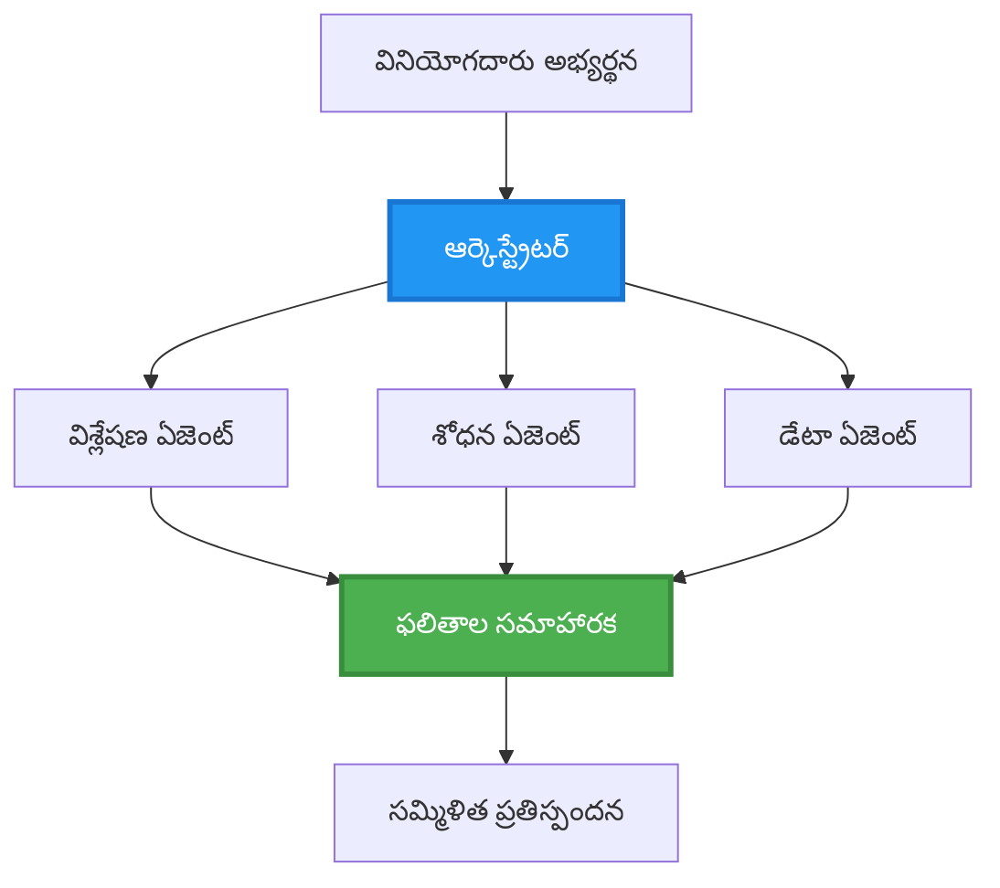
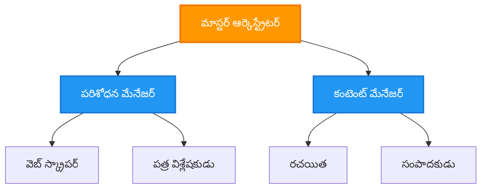
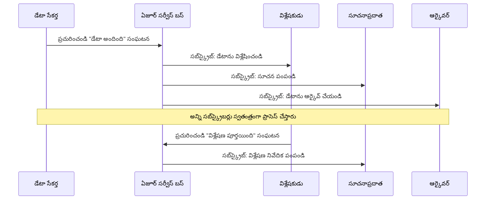
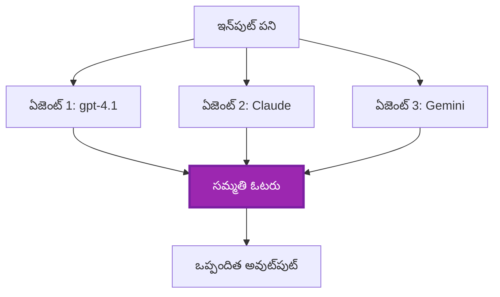
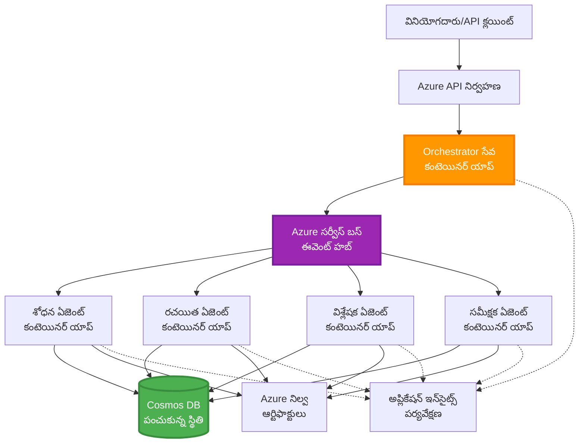

# బహుఏజెంట్ సమన్వయ నమూనాలు

⏱️ **అంచనా కాలం**: 60-75 నిమిషాలు | 💰 **అంచనా ఖర్చు**: ~$100-300/నెల | ⭐ **సంకీర్ణత**: అధునాతన

**📚 అభ్యసన మార్గం:**
- ← గతము: [సామర్థ్య ప్రణాళిక](capacity-planning.md) - వనరు పరిమాణం మరియు స్కేలింగ్ వ్యూహాలు
- 🎯 **మీరు ఇక్కడ ఉన్నారు**: బహుఏజెంట్ సమన్వయ నమూనాలు (ఆర్కెస్ట్రేషన్, సంభాషణ, స్థితి నిర్వహణ)
- → తదుపరి: [SKU ఎంపిక](sku-selection.md) - సరైన Azure సేవలను ఎంచుకోవడం
- 🏠 [కోర్సు హోమ్](../../README.md)

---

## మీరు నేర్చుకునే విషయాలు

ఈ పాఠం పూర్తి చేయడంతో, మీరు:
- బహుఏజెంట్ ఆర్కిటెక్చర్ నమూనాలు మరియు వాటిని ఎప్పుడు ఉపయోగించాలో అర్థం చేసుకుంటారు
- ఆర్కెస్ట్రేషన్ నమూనాలను అమలు చేయడం (కేంద్రీకృత, వికేంద్రీకృత, స్థాయిగత)
- ఏజెంట్ సంభాషణ వ్యూహాలను రూపకల్పన చేయడం (సింక్రోనస్, అసింక్రోనస్, ఈవెంట్‑డ్రివెన్)
- పంపిణీ చేయబడిన ఏజెంట్లలో పంచుకున్న స్థితిని నిర్వహించడం
- AZD తో Azure పై బహుఏజెంట్ వ్యవస్థలను desple చేయడం
- వాస్తవ ప్రపంచ AI సందర్భాలలో సమన్వయ నమూనాలను వర్తింపచేయడం
- పంపిణీ చేయబడిన ఏజెంట్ వ్యవస్థలను మానిటర్ చేయడం మరియు డీబగ్గింగ్ చేయడం

## ఎందుకు బహుఏజెంట్ సమన్వయం ముఖ్యం

### పరిణతి: ఏక ఏజెంట్ నుండి బహుఏజెంట్ వరకు

**ఏక ఏజెంట్ (సరళం):**
```
User → Agent → Response
```
- ✅ అర్థమయ్యేలా మరియు అమలు చేయడానికి సులభం
- ✅ సాదారణ పనులకు వేగంగా ఉంటుంది
- ❌ ఒకే మోడల్ సామర్థ్యాల వల్ల పరిమితం
- ❌ సంక్లిష్ట పనులను పారలలైజ్ చేయలేను
- ❌ ప్రత్యేకీకరణ లేదు

**బహుఏజెంట్ వ్యవస్థ (అధునాతన):**
```mermaid
graph TD
    Orchestrator[ఆర్కెస్ట్రేటర్] --> Agent1[ఏజెంట్1<br/>ప్రణాళిక]
    Orchestrator --> Agent2[ఏజెంట్2<br/>కోడ్]
    Orchestrator --> Agent3[ఏజెంట్3<br/>సమీక్ష]
```- ✅ నిర్దిష్ట పనుల కోసం ప్రత్యేక ఏజెంట్లు
- ✅ వేగం కోసం సమాంతర అమలు
- ✅ మాడ్యులర్ మరియు నిర్వహణ సాధ్యమే
- ✅ క్లిష్ట వర్క్‌ఫ్లోలలో మెరుగైన సామర్థ్య్యం
- ⚠️ సమన్వయ తర్కం అవసరం

**ఉపమా**: ఏక ఏజెంట్ అంటే ఒక వ్యక్తి అన్ని పనులను చేయడం లాంటిది. బహుఏజెంట్ అనేది ప్రతి సభ్యుడు ప్రత్యేక నైపుణ్యాలతో (పరిశోధకుడు, కోడర్, సమీక్షకుడు, రచయిత) కలిసి పనిచేసే ఒక బృందం లాంటిది.

---

## ప్రధాన సమన్వయ నమూనాలు

### నమూనా 1: అనుక్రమిక సమన్వయం (బాధ్యత గొలుసు)

**ఎప్పుడు ఉపయోగించాలి**: పనులు నిర్దిష్ట క్రమంలో పూర్తి కావాలి, ప్రతి ఏజెంట్ ముందు పదార్థంపై ఆధారపడి నిర్మిస్తుంది.

```mermaid
sequenceDiagram
    participant User
    participant Orchestrator
    participant Agent1 as శోధన ఏజెంట్
    participant Agent2 as రచయిత ఏజెంట్
    participant Agent3 as సంపాదక ఏజెంట్
    
    User->>Orchestrator: "AI గురించి వ్యాసం రాయండి"
    Orchestrator->>Agent1: విషయాన్ని పరిశోధించండి
    Agent1-->>Orchestrator: పరిశోధన ఫలితాలు
    Orchestrator->>Agent2: ముసాయిదా రాయండి (పరిశోధన ఉపయోగించి)
    Agent2-->>Orchestrator: వ్యాస ముసాయిదా
    Orchestrator->>Agent3: సవరించండి మరియు మెరుగుపరచండి
    Agent3-->>Orchestrator: చివరి వ్యాసం
    Orchestrator-->>User: చక్కదిద్దిన వ్యాసం
    
    Note over User,Agent3: క్రమంగా: ప్రతి దశకు ముందు ఉన్న దశ పూర్తయ్యే వరకు వేచి ఉంటుంది
```
**లాభాలు:**
- ✅ స్పష్టం చేసిన డేటా ఫ్లో
- ✅ డీబగ్ చేయడం సులభం
- ✅ అమలు క్రమం ముందస్తుగా ఊహించగలిగేలా ఉంటుంది

**పరిమితులు:**
- ❌ నెమ్మది (సమాంతరత లేదు)
- ❌ ఒక విఫలం మొత్తం గొలుసును బ్లాక్ చేస్తుంది
- ❌ పరస్పర ఆధారిత పనులను నిర్వహించలేరు

**ఉదాహరణ ఉపయోగ సందర్భాలు:**
- కంటెంట్ సృష్టి పైప్‌లైన్ (పరిశోధన → రాయడం → సవరించడం → ప్రచురించు)
- కోడ్ జనరేషన్ (ప్లాన్ → అమలు → టెస్ట్ → డిప్లాయ్)
- నివేదిక సంకలనం (డేటా సేకరణ → విశ్లేషణ → విజువలైజేషన్ → సారాంశం)

---

### నమూనా 2: పారలల్ సమన్వయం (ఫ్యాన్-అవుట్/ఫ్యాన్-ఇన్)

**ఎప్పుడు ఉపయోగించాలి**: స్వతంత్ర పనులు ఒకేసారి నడవగలవు, ఫలితాలు చివరలో కంబైన్ చేయబడతాయి.


**లాభాలు:**
- ✅ వేగంగా (సమాంతర అమలు)
- ✅ లోప సహనశీలత (ఆংশిక ఫలితాలు చెల్లవచ్చు)
- ✅ ఆడిట్ హరిజాంటల్‌గా పెరుగుతుంది

**పరిమితులు:**
- ⚠️ ఫలితాలు క్రమమే కాని రావచ్చు
- ⚠️ సమాహరణ తర్కం అవసరం
- ⚠️ సంక్లిష్ట స్థితి నిర్వహణ

**ఉదాహరణ ఉపయోగ సందర్భాలు:**
- బహు-మూలాల డేటా సేకరణ (APIs + డేటాబేస్‌లు + వెబ్ స్క్రాపింగ్)
- పోటీ విశ్లేషణ (బహుళ మోడల్‌లు పరిష్కారాలను ఉత్పత్తి చేస్తాయి, అత్యుత్తమాన్ని ఎంచుకుంటారు)
- అనువాద సేవలు (బహుభాషలలో ఒకేసారి అనువదించడం)

---

### నమూనా 3: స్థాయిగత సమన్వయం (మేనేజర్-వర్కర్)

**ఎప్పుడు ఉపయోగించాలి**: ఉప‑పనులతో కూడిన క్లిష్ట వర్క్‌ఫ్లోలు ఉన్నప్పుడు, делెగేషన్ అవసరం.


**లాభాలు:**
- ✅ క్లిష్ట వర్క్‌ఫ్లోలను నిర్వహిస్తుంది
- ✅ మాడ్యులర్ మరియు నిర్వహించదగినది
- ✅ బాధ్యత సరిహద్దులు స్పష్టంగా ఉంటాయి

**పరిమితులు:**
- ⚠️ ఆర్కిటెక్చర్ మరింత క్లిష్టం
- ⚠️ ఎక్కువ లేటెన్సీ (బහු సమన్వయ నిలువలు)
- ⚠️ సుడిగట్టిన ఆర్కెస్ట్రేషన్ అవసరం

**ఉదాహరణ ఉపయోగ సందర్భాలు:**
- ఎంటర్ప్రైజ్ డాక్యుమెంట్ ప్రాసెసింగ్ (వర్గీకరణ → రూట్ చేయు → ప్రాసెస్ → ఆర్కైవ్)
- బహుళ-దశ డేటా పైప్‌లైన్‌లు (ఇన్‌జెస్ట్ → శుభ్రపరచు → ట్రాన్స్‌ఫార్మ్ → విశ్లేషి → నివేదిక)
- క్లిష్ట ఆటోమేషన్ వర్క్‌ఫ్లోలు (యోజన → వనరు కేటాయింపు → అమలు → మానిటరింగ్)

---

### నమూనా 4: ఈవెంట్-డ్రివెన్ సమన్వయం (పబ్లిష్-సబ్‌స్క్రైబ్)

**ఎప్పుడు ఉపయోగించాలి**: ఏజెంట్లు ఈవెంట్లకు స్పందించాల్సిన అవసరం ఉంటుంది, లొస్ కప్లింగ్ కోరుకుంటారు.


**లాభాలు:**
- ✅ ఏజెంట్స్ మధ్య సడలిన కప్లింగ్
- ✅ కొత్త ఏజెంట్లను సులభంగా చేర్చుకోవచ్చు (కేవలం సబ్‌స్క్రైబ్ చేయాలి)
- ✅ అసింక్రోనస్ ప్రాసెసింగ్
- ✅ దీర్ఘకాలికత (మెసేజ్ నిల్వ)

**పరిమితులు:**
- ⚠️ తుది సారూప్యత (eventual consistency)
- ⚠️ డీబగ్గింగ్ క్లిష్టం
- ⚠️ మెసేజ్ ఆర్డరింగ్ సమస్యలు

**ఉదాహరణ ఉపయోగ సందర్భాలు:**
- రియల్‑టైమ్ మానిటరింగ్ సిస్టమ్స్ (అలర్ట్‌లు, డాష్‌బోర్డ్లు, లాగ్‌లు)
- బహుచానల్ నోటిఫికేషన్లు (ఈ‑మెయిల్, SMS, పుష్, Slack)
- డేటా ప్రాసెసింగ్ పైప్‌లైన్‌లు (ఒకే డేటాపై బహుళ కంస్యూమర్లు)

---

### నమూనా 5: కన్సెన్సస్‑ఆధారిత సమన్వయం (ఓటింగ్/క్వోరం)

**ఎప్పుడు ఉపయోగించాలి**: ముందుకూడా ముందుకు పోవడానికి బహుళ ఏజెంట్ల నుంచి ఒప్పందం అవసరం ఉన్నప్పుడు.


**లాభాలు:**
- ✅ అధిక ఖచ్చితత్వం (బహుళ అభిప్రాయాలు)
- ✅ లోప అనుకూలత (సూక్ష్మ విఫలాలు అంగీకరించదగినవి)
- ✅ నాణ్యత హామీ సహజంగానే ఉంటుంది

**పరిమితులు:**
- ❌ ఖరీది ఎక్కువ (బహుళ మోడల్ కాల్స్)
- ❌ నెమ్మది (అన్ని ఏజెంట్లను కోసం వేచి ఉండాలి)
- ⚠️ ఘర్షణ పరిష్కారం అవసరం

**ఉదాహరణ ఉపయోగ సందర్భాలు:**
- కంటెంట్ మోడరేషన్ (బహుళ మోడళ్ల ద్వారా సమీక్ష)
- కోడ్ సమీక్ష (బహుళ లింటర్లు/అనలైజర్లు)
- వైద్య నిర్ధారణ (బహుళ AI మోడళ్లతో, నిపుణుల ధృవీకరణ)

---

## ఆర్కిటెక్చర్ అవలోకనం

### Azure పై పూర్తి బహుఏజెంట్ వ్యవస్థ


**ప్రధాన భాగాలు:**

| భాగం | ప్రయోజనం | Azure Service |
|-----------|---------|---------------|
| **API Gateway** | ప్రవేశ బిందువు, రేట్ పరిమితి, ప్రామాణీకరణ | API Management |
| **Orchestrator** | ఏజెంట్ వర్క్‌ఫ్లోలు సమన్వయించు | Container Apps |
| **Message Queue** | అసింక్రనస్ కమ్యూనికేషన్ | Service Bus / Event Hubs |
| **Agents** | ప్రత్యేకీకరించిన AI వర్కర్లు | Container Apps / Functions |
| **State Store** | పంచుకున్న స్థితి, టాస్క్ ట్రాకింగ్ | Cosmos DB |
| **Artifact Storage** | డాక్యుమెంట్లు, ఫలితాలు, లాగులు | Blob Storage |
| **Monitoring** | పంపిణీ ట్రేసింగ్, లాగులు | Application Insights |

---

## పూర్వాపరాలు

### అవసరమైన టూల్స్

```bash
# Azure Developer CLI ని నిర్ధారించండి
azd version
# ✅ అపేక్షితం: azd సంస్కరణ 1.0.0 లేదా అంతకంటే కొత్తది

# Azure CLI ని నిర్ధారించండి
az --version
# ✅ అపేక్షితం: azure-cli సంస్కరణ 2.50.0 లేదా అంతకంటే కొత్తది

# Docker ని నిర్ధారించండి (స్థానిక పరీక్షల కోసం)
docker --version
# ✅ అపేక్షితం: Docker సంస్కరణ 20.10 లేదా అంతకంటే కొత్తది
```

### Azure అవసరాలు

- సక్రియ Azure subscription
- సృష్టించడానికి అనుమతులు:
  - Container Apps
  - Service Bus namespaces
  - Cosmos DB accounts
  - Storage accounts
  - Application Insights

### జ్ఞాన పూర్వాపరాలు

మీకు దనినిమ్న విషయాలు పూర్తి చేసి ఉండాలి:
- [కాన్ఫిగరేషన్ నిర్వహణ](../chapter-03-configuration/configuration.md)
- [ప్రామాణీకరణ & భద్రత](../chapter-03-configuration/authsecurity.md)
- [మైక్రోసర్వీసుల ఉదాహరణ](../../../../examples/microservices)

---

## అమలు మార్గదర్శి

### ప్రాజెక్ట్ నిర్మాణం

```
multi-agent-system/
├── azure.yaml                    # AZD configuration
├── infra/
│   ├── main.bicep               # Main infrastructure
│   ├── core/
│   │   ├── servicebus.bicep     # Message queue
│   │   ├── cosmos.bicep         # State store
│   │   ├── storage.bicep        # Artifact storage
│   │   └── monitoring.bicep     # Application Insights
│   └── app/
│       ├── orchestrator.bicep   # Orchestrator service
│       └── agent.bicep          # Agent template
└── src/
    ├── orchestrator/            # Orchestration logic
    │   ├── app.py
    │   ├── workflows.py
    │   └── Dockerfile
    ├── agents/
    │   ├── research/            # Research agent
    │   ├── writer/              # Writer agent
    │   ├── analyst/             # Analyst agent
    │   └── reviewer/            # Reviewer agent
    └── shared/
        ├── state_manager.py     # Shared state logic
        └── message_handler.py   # Message handling
```

---

## పాఠం 1: అనుక్రమిక సమన్వయం నమూనా

### అమలు: కంటెంట్ సృష్టి పైప్‌లైన్

ఒక అనుక్రమిక పైప్‌లైన్‌ను నిర్మిద్దాం: పరిశోధన → రాయడం → సవరించడం → ప్రచురించడం

### 1. AZD కాన్ఫిగరేషన్

**ఫైల్: `azure.yaml`**

```yaml
name: content-pipeline
metadata:
  template: multi-agent-sequential@1.0.0

services:
  orchestrator:
    project: ./src/orchestrator
    language: python
    host: containerapp
  
  research-agent:
    project: ./src/agents/research
    language: python
    host: containerapp
  
  writer-agent:
    project: ./src/agents/writer
    language: python
    host: containerapp
  
  editor-agent:
    project: ./src/agents/editor
    language: python
    host: containerapp
```

### 2. ఇన్‌ఫ్రాస్ట్రక్చర్: సమన్వయానికి Service Bus

**ఫైల్: `infra/core/servicebus.bicep`**

```bicep
param name string
param location string
param tags object = {}

resource serviceBusNamespace 'Microsoft.ServiceBus/namespaces@2022-10-01-preview' = {
  name: name
  location: location
  tags: tags
  sku: {
    name: 'Standard'
    tier: 'Standard'
  }
  properties: {
    minimumTlsVersion: '1.2'
  }
}

// Queue for orchestrator → research agent
resource researchQueue 'Microsoft.ServiceBus/namespaces/queues@2022-10-01-preview' = {
  parent: serviceBusNamespace
  name: 'research-tasks'
  properties: {
    maxDeliveryCount: 3
    lockDuration: 'PT5M'
    deadLetteringOnMessageExpiration: true
  }
}

// Queue for research agent → writer agent
resource writerQueue 'Microsoft.ServiceBus/namespaces/queues@2022-10-01-preview' = {
  parent: serviceBusNamespace
  name: 'writer-tasks'
  properties: {
    maxDeliveryCount: 3
    lockDuration: 'PT5M'
  }
}

// Queue for writer agent → editor agent
resource editorQueue 'Microsoft.ServiceBus/namespaces/queues@2022-10-01-preview' = {
  parent: serviceBusNamespace
  name: 'editor-tasks'
  properties: {
    maxDeliveryCount: 3
    lockDuration: 'PT5M'
  }
}

output namespace string = serviceBusNamespace.name
output connectionString string = listKeys('${serviceBusNamespace.id}/AuthorizationRules/RootManageSharedAccessKey', serviceBusNamespace.apiVersion).primaryConnectionString
```

### 3. పంచుకున్న స్థితి మేనేజర్

**ఫైల్: `src/shared/state_manager.py`**

```python
from azure.cosmos import CosmosClient, PartitionKey
from datetime import datetime
import os

class StateManager:
    """Manages shared state across agents using Cosmos DB"""
    
    def __init__(self):
        endpoint = os.environ['COSMOS_ENDPOINT']
        key = os.environ['COSMOS_KEY']
        
        self.client = CosmosClient(endpoint, key)
        self.database = self.client.get_database_client('agent-state')
        self.container = self.database.get_container_client('tasks')
    
    def create_task(self, task_id: str, task_type: str, input_data: dict):
        """Create a new task"""
        task = {
            'id': task_id,
            'type': task_type,
            'status': 'pending',
            'input': input_data,
            'created_at': datetime.utcnow().isoformat(),
            'steps': []
        }
        self.container.create_item(task)
        return task
    
    def update_task_step(self, task_id: str, step_name: str, result: dict):
        """Update task with completed step"""
        task = self.container.read_item(task_id, partition_key=task_id)
        
        task['steps'].append({
            'name': step_name,
            'completed_at': datetime.utcnow().isoformat(),
            'result': result
        })
        
        self.container.replace_item(task_id, task)
        return task
    
    def complete_task(self, task_id: str, final_result: dict):
        """Mark task as complete"""
        task = self.container.read_item(task_id, partition_key=task_id)
        task['status'] = 'completed'
        task['result'] = final_result
        task['completed_at'] = datetime.utcnow().isoformat()
        self.container.replace_item(task_id, task)
        return task
    
    def get_task(self, task_id: str):
        """Retrieve task state"""
        return self.container.read_item(task_id, partition_key=task_id)
```

### 4. ఆర్కెస్ట్రేటర్ సేవ

**ఫైల్: `src/orchestrator/app.py`**

```python
from flask import Flask, request, jsonify
from azure.servicebus import ServiceBusClient, ServiceBusMessage
import json
import uuid
import os
from shared.state_manager import StateManager

app = Flask(__name__)
state_manager = StateManager()

# సర్వీస్ బస్ కనెక్షన్
servicebus_connection_str = os.environ['SERVICEBUS_CONNECTION_STRING']
servicebus_client = ServiceBusClient.from_connection_string(servicebus_connection_str)

@app.route('/health', methods=['GET'])
def health():
    return jsonify({'status': 'healthy', 'service': 'orchestrator'})

@app.route('/create-content', methods=['POST'])
def create_content():
    """
    Sequential workflow: Research → Write → Edit → Publish
    """
    data = request.json
    topic = data.get('topic')
    
    if not topic:
        return jsonify({'error': 'Topic required'}), 400
    
    # స్టేట్ స్టోర్‌లో టాస్క్ సృష్టించండి
    task_id = str(uuid.uuid4())
    task = state_manager.create_task(
        task_id=task_id,
        task_type='content_creation',
        input_data={'topic': topic}
    )
    
    # రిసెర్చ్ ఏజెంట్‌కు సందేశం పంపండి (మొదటి దశ)
    sender = servicebus_client.get_queue_sender('research-tasks')
    message = ServiceBusMessage(
        body=json.dumps({
            'task_id': task_id,
            'topic': topic,
            'next_queue': 'writer-tasks'  # ఫలితాలను ఎక్కడ పంపాలి
        }),
        content_type='application/json'
    )
    
    with sender:
        sender.send_messages(message)
    
    return jsonify({
        'task_id': task_id,
        'status': 'started',
        'workflow': 'sequential',
        'steps': ['research', 'write', 'edit', 'publish'],
        'message': 'Content creation pipeline initiated'
    }), 202

@app.route('/task/<task_id>', methods=['GET'])
def get_task_status(task_id):
    """Check task status"""
    try:
        task = state_manager.get_task(task_id)
        return jsonify(task)
    except Exception as e:
        return jsonify({'error': str(e)}), 404

if __name__ == '__main__':
    app.run(host='0.0.0.0', port=8080)
```

### 5. పరిశోధనా ఏజెంట్

**ఫైల్: `src/agents/research/app.py`**

```python
from azure.servicebus import ServiceBusClient, ServiceBusMessage
from openai import AzureOpenAI
import json
import os
import time
from shared.state_manager import StateManager

# క్లయింట్లను ప్రారంభించండి
state_manager = StateManager()
servicebus_client = ServiceBusClient.from_connection_string(
    os.environ['SERVICEBUS_CONNECTION_STRING']
)

openai_client = AzureOpenAI(
    api_key=os.environ['AZURE_OPENAI_API_KEY'],
    api_version="2024-02-01",
    azure_endpoint=os.environ['AZURE_OPENAI_ENDPOINT']
)

def process_research_task(message_data):
    """Process research request and pass to writer"""
    task_id = message_data['task_id']
    topic = message_data['topic']
    next_queue = message_data['next_queue']
    
    print(f"🔬 Researching: {topic}")
    
    # పరిశోధన కోసం Microsoft Foundry మోడళ్లను పిలవండి
    response = openai_client.chat.completions.create(
        model="gpt-4.1",
        messages=[
            {"role": "system", "content": "You are a research assistant. Provide comprehensive research on the given topic."},
            {"role": "user", "content": f"Research this topic thoroughly: {topic}"}
        ],
        max_tokens=1500
    )
    
    research_results = response.choices[0].message.content
    
    # స్థితిని నవీకరించండి
    state_manager.update_task_step(
        task_id=task_id,
        step_name='research',
        result={'research': research_results}
    )
    
    # తదుపరి ఏజెంట్ (రచయిత)కు పంపండి
    sender = servicebus_client.get_queue_sender(next_queue)
    message = ServiceBusMessage(
        body=json.dumps({
            'task_id': task_id,
            'topic': topic,
            'research': research_results,
            'next_queue': 'editor-tasks'
        }),
        content_type='application/json'
    )
    
    with sender:
        sender.send_messages(message)
    
    print(f"✅ Research complete for task {task_id}")

def main():
    """Listen to research queue"""
    receiver = servicebus_client.get_queue_receiver('research-tasks')
    
    print("🔬 Research Agent started, listening for tasks...")
    
    with receiver:
        while True:
            messages = receiver.receive_messages(max_wait_time=5)
            for message in messages:
                try:
                    message_data = json.loads(str(message))
                    process_research_task(message_data)
                    receiver.complete_message(message)
                except Exception as e:
                    print(f"❌ Error processing message: {e}")
                    receiver.abandon_message(message)

if __name__ == '__main__':
    main()
```

### 6. రచయిత ఏజెంట్

**ఫైల్: `src/agents/writer/app.py`**

```python
from azure.servicebus import ServiceBusClient, ServiceBusMessage
from openai import AzureOpenAI
import json
import os
from shared.state_manager import StateManager

state_manager = StateManager()
servicebus_client = ServiceBusClient.from_connection_string(
    os.environ['SERVICEBUS_CONNECTION_STRING']
)

openai_client = AzureOpenAI(
    api_key=os.environ['AZURE_OPENAI_API_KEY'],
    api_version="2024-02-01",
    azure_endpoint=os.environ['AZURE_OPENAI_ENDPOINT']
)

def process_writing_task(message_data):
    """Write article based on research"""
    task_id = message_data['task_id']
    topic = message_data['topic']
    research = message_data['research']
    next_queue = message_data['next_queue']
    
    print(f"✍️ Writing article: {topic}")
    
    # ఆర్టికల్ రాయడానికి Microsoft Foundry మోడల్స్‌ను పిలవండి
    response = openai_client.chat.completions.create(
        model="gpt-4.1",
        messages=[
            {"role": "system", "content": "You are a professional writer. Write engaging, well-structured articles."},
            {"role": "user", "content": f"Based on this research:\n\n{research}\n\nWrite a comprehensive article about: {topic}"}
        ],
        max_tokens=2000
    )
    
    article_draft = response.choices[0].message.content
    
    # స్థితిని నవీకరించండి
    state_manager.update_task_step(
        task_id=task_id,
        step_name='writing',
        result={'draft': article_draft}
    )
    
    # ఎడిటర్‌కు పంపండి
    sender = servicebus_client.get_queue_sender(next_queue)
    message = ServiceBusMessage(
        body=json.dumps({
            'task_id': task_id,
            'topic': topic,
            'draft': article_draft
        }),
        content_type='application/json'
    )
    
    with sender:
        sender.send_messages(message)
    
    print(f"✅ Article draft complete for task {task_id}")

def main():
    """Listen to writer queue"""
    receiver = servicebus_client.get_queue_receiver('writer-tasks')
    
    print("✍️ Writer Agent started, listening for tasks...")
    
    with receiver:
        while True:
            messages = receiver.receive_messages(max_wait_time=5)
            for message in messages:
                try:
                    message_data = json.loads(str(message))
                    process_writing_task(message_data)
                    receiver.complete_message(message)
                except Exception as e:
                    print(f"❌ Error: {e}")
                    receiver.abandon_message(message)

if __name__ == '__main__':
    main()
```

### 7. ఎడిటర్ ఏజెంట్

**ఫైల్: `src/agents/editor/app.py`**

```python
from azure.servicebus import ServiceBusClient
from openai import AzureOpenAI
import json
import os
from shared.state_manager import StateManager

state_manager = StateManager()
servicebus_client = ServiceBusClient.from_connection_string(
    os.environ['SERVICEBUS_CONNECTION_STRING']
)

openai_client = AzureOpenAI(
    api_key=os.environ['AZURE_OPENAI_API_KEY'],
    api_version="2024-02-01",
    azure_endpoint=os.environ['AZURE_OPENAI_ENDPOINT']
)

def process_editing_task(message_data):
    """Edit and finalize article"""
    task_id = message_data['task_id']
    topic = message_data['topic']
    draft = message_data['draft']
    
    print(f"📝 Editing article: {topic}")
    
    # సవరించడానికి Microsoft Foundry మోడల్స్‌ను పిలవండి
    response = openai_client.chat.completions.create(
        model="gpt-4.1",
        messages=[
            {"role": "system", "content": "You are an expert editor. Improve grammar, clarity, and structure."},
            {"role": "user", "content": f"Edit and improve this article:\n\n{draft}"}
        ],
        max_tokens=2000
    )
    
    final_article = response.choices[0].message.content
    
    # టాస్క్‌ను పూర్తి‌గా గుర్తించండి
    state_manager.complete_task(
        task_id=task_id,
        final_result={
            'topic': topic,
            'final_article': final_article,
            'word_count': len(final_article.split())
        }
    )
    
    print(f"✅ Article finalized for task {task_id}")

def main():
    """Listen to editor queue"""
    receiver = servicebus_client.get_queue_receiver('editor-tasks')
    
    print("📝 Editor Agent started, listening for tasks...")
    
    with receiver:
        while True:
            messages = receiver.receive_messages(max_wait_time=5)
            for message in messages:
                try:
                    message_data = json.loads(str(message))
                    process_editing_task(message_data)
                    receiver.complete_message(message)
                except Exception as e:
                    print(f"❌ Error: {e}")
                    receiver.abandon_message(message)

if __name__ == '__main__':
    main()
```

### 8. డిప్లాయ్ చేయి మరియు పరీక్షించు

```bash
# ఎంపిక A: టెంప్లేట్ ఆధారిత అమరిక
azd init
azd up

# ఎంపిక B: ఏజెంట్ మానిఫెస్ట్ ఆధారిత అమరిక (విస్తరణ అవసరం)
azd extension install azure.ai.agents
azd ai agent init -m agent-manifest.yaml
azd up
```

> చూడండి [AZD AI CLI ఆదేశాలు](../chapter-08-production/production-ai-practices.md#azd-ai-cli-commands-and-extensions) అన్ని `azd ai` ఫ్లాగ్‌లు మరియు ఎంపికల కోసం.

```bash
# ఆర్కెస్ట్రేటర్ URL పొందండి
ORCHESTRATOR_URL=$(azd env get-values | grep ORCHESTRATOR_URL | cut -d '=' -f2 | tr -d '"')

# కంటెంట్ సృష్టించండి
curl -X POST $ORCHESTRATOR_URL/create-content \
  -H "Content-Type: application/json" \
  -d '{"topic": "The Future of AI in Healthcare"}'
```

**✅ అంచనా ఫలితం:**
```json
{
  "task_id": "a1b2c3d4-e5f6-7890-abcd-ef1234567890",
  "status": "started",
  "workflow": "sequential",
  "steps": ["research", "write", "edit", "publish"],
  "message": "Content creation pipeline initiated"
}
```

**టాస్క్ పురోగతిని తనిఖీ చేయండి:**
```bash
TASK_ID="a1b2c3d4-e5f6-7890-abcd-ef1234567890"
curl $ORCHESTRATOR_URL/task/$TASK_ID
```

**✅ అంచనా ఫలితం (పూర్తయిన):**
```json
{
  "id": "a1b2c3d4-e5f6-7890-abcd-ef1234567890",
  "type": "content_creation",
  "status": "completed",
  "steps": [
    {
      "name": "research",
      "completed_at": "2025-11-19T10:30:00Z",
      "result": {"research": "..."}
    },
    {
      "name": "writing",
      "completed_at": "2025-11-19T10:32:00Z",
      "result": {"draft": "..."}
    }
  ],
  "result": {
    "topic": "The Future of AI in Healthcare",
    "final_article": "...",
    "word_count": 1500
  }
}
```

---

## పాఠం 2: పారలల్ సమన్వయం నమూనా

### అమలు: బహుళ మూలాల పరిశోధన సమాహిక

మనం బహుళ మూలాల నుంచి ఒకేసారి సమాచారం సేకరణ చేసే పారలల్ సిస్టమ్ను నిర్మిద్దాం.

### పారలల్ ఆర్కెస్ట్రేటర్

**ఫైలు: `src/orchestrator/parallel_workflow.py`**

```python
from flask import Flask, request, jsonify
from azure.servicebus import ServiceBusClient, ServiceBusMessage
import json
import uuid
import os
from shared.state_manager import StateManager

app = Flask(__name__)
state_manager = StateManager()

servicebus_client = ServiceBusClient.from_connection_string(
    os.environ['SERVICEBUS_CONNECTION_STRING']
)

@app.route('/research-parallel', methods=['POST'])
def research_parallel():
    """
    Parallel workflow: Multiple agents work simultaneously
    """
    data = request.json
    query = data.get('query')
    
    task_id = str(uuid.uuid4())
    task = state_manager.create_task(
        task_id=task_id,
        task_type='parallel_research',
        input_data={
            'query': query,
            'agents': ['web', 'academic', 'news', 'social']
        }
    )
    
    # ఫ్యాన్-ఔట్: అన్ని ఏజెంట్లకు ఒకేసారి పంపండి
    agents = [
        ('web-research-queue', 'web'),
        ('academic-research-queue', 'academic'),
        ('news-research-queue', 'news'),
        ('social-research-queue', 'social')
    ]
    
    for queue_name, agent_type in agents:
        sender = servicebus_client.get_queue_sender(queue_name)
        message = ServiceBusMessage(
            body=json.dumps({
                'task_id': task_id,
                'query': query,
                'agent_type': agent_type,
                'result_queue': 'aggregation-queue'
            }),
            content_type='application/json'
        )
        
        with sender:
            sender.send_messages(message)
    
    return jsonify({
        'task_id': task_id,
        'status': 'started',
        'workflow': 'parallel',
        'agents_dispatched': 4,
        'message': 'Parallel research initiated'
    }), 202

if __name__ == '__main__':
    app.run(host='0.0.0.0', port=8080)
```

### సమాహరణ తర్కం

**ఫైల్: `src/agents/aggregator/app.py`**

```python
from azure.servicebus import ServiceBusClient
import json
import os
from collections import defaultdict
from shared.state_manager import StateManager

state_manager = StateManager()
servicebus_client = ServiceBusClient.from_connection_string(
    os.environ['SERVICEBUS_CONNECTION_STRING']
)

# ప్రతి టాస్క్ కోసం ఫలితాలను ట్రాక్ చేయండి
task_results = defaultdict(list)
expected_agents = 4  # వెబ్, అకాడెమిక్, వార్తలు, సోషల్

def process_result(message_data):
    """Aggregate results from parallel agents"""
    task_id = message_data['task_id']
    agent_type = message_data['agent_type']
    result = message_data['result']
    
    # ఫలితాన్ని నిల్వ చేయండి
    task_results[task_id].append({
        'agent': agent_type,
        'data': result
    })
    
    print(f"📊 Received result from {agent_type} agent ({len(task_results[task_id])}/{expected_agents})")
    
    # అన్ని ఏజెంట్లు పూర్తయాయా అని తనిఖీ చేయండి (ఫ్యాన్-ఇన్)
    if len(task_results[task_id]) == expected_agents:
        print(f"✅ All agents completed for task {task_id}. Aggregating...")
        
        # ఫలితాలను కలపండి
        aggregated = {
            'query': message_data['query'],
            'sources': task_results[task_id],
            'summary': generate_summary(task_results[task_id])
        }
        
        # పూర్తయినట్లు గుర్తించండి
        state_manager.complete_task(task_id, aggregated)
        
        # శుభ్రం చేయండి
        del task_results[task_id]
        
        print(f"✅ Aggregation complete for task {task_id}")

def generate_summary(results):
    """Generate summary from all sources"""
    summaries = [r['data'].get('summary', '') for r in results]
    return '\n\n'.join(summaries)

def main():
    """Listen to aggregation queue"""
    receiver = servicebus_client.get_queue_receiver('aggregation-queue')
    
    print("📊 Aggregator started, listening for results...")
    
    with receiver:
        while True:
            messages = receiver.receive_messages(max_wait_time=5)
            for message in messages:
                try:
                    message_data = json.loads(str(message))
                    process_result(message_data)
                    receiver.complete_message(message)
                except Exception as e:
                    print(f"❌ Error: {e}")
                    receiver.abandon_message(message)

if __name__ == '__main__':
    main()
```

**పారలల్ నమూనా లాభాలు:**
- ⚡ **4x వేగంగా** (ఏజెంట్లు సమాంతరంగా నడుస్తారు)
- 🔄 **లోప సహనశీలత** (ఆংশిక ఫలితాలు చెల్లవచ్చు)
- 📈 **దిగువగా పెరిగే సామర్థ్యం** (చాలా ఏజెంట్లను సులభంగా జోడించవచ్చు)

---

## ప్రాక్టికల్ వ్యాయామాలు

### వ్యాయామం 1: టైమ్‌అవుట్ హ్యాండ్లింగ్ జోడించండి ⭐⭐ (మధ్యస్థ)

**లక్ష్యం**: అగ్రెగేటర్ నెమ్మదిగా ఉన్న ఏజెంట్ల కోసం ఎల్లప్పుడూ వేచి ఉండకుండా టైమ్‌అవుట్ లాజిక్ అమలు చేయండి.

**దశలు**:

1. **అగ్రెగేటర్‌కు టైమ్‌అవుట్ ట్రాకింగ్ జోడించండి:**

```python
from datetime import datetime, timedelta

task_timeouts = {}  # task_id -> expiration_time

def process_result(message_data):
    task_id = message_data['task_id']
    
    # మొదటి ఫలితానికి టైమౌట్ సెట్ చేయండి
    if task_id not in task_timeouts:
        task_timeouts[task_id] = datetime.utcnow() + timedelta(seconds=30)
    
    task_results[task_id].append({
        'agent': message_data['agent_type'],
        'data': message_data['result']
    })
    
    # పూర్తయిందా లేదా టైమౌట్ అయ్యిందా తనిఖీ చేయండి
    if len(task_results[task_id]) == expected_agents or \
       datetime.utcnow() > task_timeouts[task_id]:
        
        print(f"📊 Aggregating with {len(task_results[task_id])}/{expected_agents} results")
        
        aggregated = {
            'query': message_data['query'],
            'sources': task_results[task_id],
            'completed_agents': len(task_results[task_id]),
            'timed_out': len(task_results[task_id]) < expected_agents
        }
        
        state_manager.complete_task(task_id, aggregated)
        
        # శుభ్రపరచడం
        del task_results[task_id]
        del task_timeouts[task_id]
```

2. **కృత్రిమ ఆలస్యం ఉన్నప్పుడు పరీక్షించండి:**

```python
# ఒక ఏజెంట్‌లో నెమ్మదిగా ప్రాసెసింగ్‌ను అనుకరించడానికి ఆలస్యం జోడించండి
import time
time.sleep(35)  # 30 సెకన్ల టైమ్‌ఔట్‌ను మించిపోయింది
```

3. **డిప్లాయ్ చేసి ధృవీకరించండి:**

```bash
azd deploy aggregator

# పనిని సమర్పించండి
curl -X POST $ORCHESTRATOR_URL/research-parallel \
  -H "Content-Type: application/json" \
  -d '{"query": "AI safety research"}'

# 30 సెకన్ల తర్వాత ఫలితాలను తనిఖీ చేయండి
curl $ORCHESTRATOR_URL/task/$TASK_ID
```

**✅ విజయం ప్రమాణాలు:**
- ✅ ఏజెంట్లు పూర్తి కాకపోయినా 30 సెకన్లలో టాస్క్ పూర్తవాలి
- ✅ స్పందనలో భాగస్వామ్య ఫలితంగా (`"timed_out": true`) సూచించాలి
- ✅ అందుబాటులో ఉన్న ఫలితాలు తిరిగి ఇవ్వబడతాయి (4లో 3 ఏజెంట్లు)

**సమయం**: 20-25 నిమిషాలు

---

### వ్యాయామం 2: రీట్రై లాజిక్ అమలు చేయండి ⭐⭐⭐ (అధునాతన)

**లక్ష్యం**: విఫలమైన ఏజెంట్ టాస్క్‌లను ఇచ్చిపుచ్చుకోవటానికి ముందు ఆటోమేటిక్‌గా రీట్రై చేయండి.

**దశలు**:

1. **ఆర్కెస్ట్రేటర్‌కు రీట్రై ట్రాకింగ్ జోడించండి:**

```python
from dataclasses import dataclass
from typing import Dict

@dataclass
class RetryConfig:
    max_retries: int = 3
    backoff_seconds: int = 5

retry_counts: Dict[str, int] = {}  # సందేశం_ఐడీ -> పునఃప్రయత్నాల_సంఖ్య

def send_with_retry(queue_name: str, message_data: dict, retry_config: RetryConfig):
    """Send message with retry metadata"""
    message_id = message_data.get('message_id', str(uuid.uuid4()))
    message_data['message_id'] = message_id
    message_data['retry_count'] = retry_counts.get(message_id, 0)
    message_data['max_retries'] = retry_config.max_retries
    
    sender = servicebus_client.get_queue_sender(queue_name)
    message = ServiceBusMessage(
        body=json.dumps(message_data),
        content_type='application/json',
        message_id=message_id
    )
    
    with sender:
        sender.send_messages(message)
```

2. **ఏజెంట్లకు రీట్రై హ్యాండ్లర్ జోడించండి:**

```python
def process_with_retry(message, receiver, process_func):
    """Process message with automatic retry on failure"""
    try:
        message_data = json.loads(str(message))
        
        # సందేశాన్ని ప్రాసెస్ చేయండి
        process_func(message_data)
        
        # విజయం - పూర్తి
        receiver.complete_message(message)
        
    except Exception as e:
        message_id = message.message_id
        retry_count = message_data.get('retry_count', 0)
        max_retries = message_data.get('max_retries', 3)
        
        if retry_count < max_retries:
            # మళ్లీ ప్రయత్నించండి: వదిలివేసి పెరిగిన లెక్కతో తిరిగి క్యూలో ఉంచండి
            print(f"⚠️ Retry {retry_count + 1}/{max_retries} for message {message_id}")
            
            message_data['retry_count'] = retry_count + 1
            
            # దీనిని అదే క్యూకి ఆలస్యంతో తిరిగి పంపండి
            time.sleep(5 * (retry_count + 1))  # ఎక్స్పోనెన్షియల్ బ్యాక్ ఆఫ్
            send_with_retry(queue_name, message_data, RetryConfig())
            
            receiver.complete_message(message)  # మూలాన్ని తొలగించండి
        else:
            # గరిష్ఠ పునఃప్రయత్నాలు అధిగమించబడ్డాయి - డెడ్ లెటర్ క్యూ కి తరలించండి
            print(f"❌ Max retries exceeded for message {message_id}")
            receiver.dead_letter_message(
                message,
                reason="MaxRetriesExceeded",
                error_description=str(e)
            )
```

3. **డెడ్ లెటర్ క్యూను మానిటర్ చేయండి:**

```python
def monitor_dead_letters():
    """Check dead letter queue for failed messages"""
    receiver = servicebus_client.get_queue_receiver(
        'research-queue',
        sub_queue='deadletter'
    )
    
    with receiver:
        messages = receiver.receive_messages(max_wait_time=5)
        for message in messages:
            print(f"☠️ Dead letter: {message.message_id}")
            print(f"Reason: {message.dead_letter_reason}")
            print(f"Description: {message.dead_letter_error_description}")
```

**✅ విజయం ప్రమాణాలు:**
- ✅ విఫలమైన టాస్క్‌లు ఆటోమేటిక్‌గా రీట్రై అవుతాయి (గరిష్టంగా 3 సార్లు)
- ✅ రీట్రైల మధ్య ఎక్స్‌పొనెన్షియల్ బ్యాక్‌ఆఫ్ ఉంటుంది (5s, 10s, 15s)
- ✅ గరిష్ట రీట్రైల తర్వాత మెసేజ్‌లు డెడ్ లెటర్ క్యూకు వెళ్తాయి
- ✅ డెడ్ లెటర్ క్యూను మానిటర్ చేసి రీప్లే చేయవచ్చు

**సమయం**: 30-40 నిమిషాలు

---

### వ్యాయామం 3: సర్క్యూట్ బ్రేకర్ అమలు చేయండి ⭐⭐⭐ (అధునాతన)

**లక్ష్యం**: విఫలమవుతున్న ఏజెంట్లకు అభ్యర్థనలను నిలిపివేసి కాస్కేడింగ్ తప్పించండి.

**దశలు**:

1. **సర్క్యూట్ బ్రేకర్ క్లాస్ సృష్టించండి:**

```python
from enum import Enum
from datetime import datetime, timedelta

class CircuitState(Enum):
    CLOSED = "closed"      # సాధారణ పని
    OPEN = "open"          # విఫలమవుతోంది, అభ్యర్థనలను తిరస్కరించండి
    HALF_OPEN = "half_open"  # పునరుద్ధరింపబడి ఉందో లేదో పరీక్షించడం

class CircuitBreaker:
    def __init__(self, failure_threshold=5, timeout_seconds=60):
        self.failure_threshold = failure_threshold
        self.timeout_seconds = timeout_seconds
        self.failure_count = 0
        self.last_failure_time = None
        self.state = CircuitState.CLOSED
    
    def call(self, func):
        """Execute function with circuit breaker protection"""
        if self.state == CircuitState.OPEN:
            # టైమౌట్ గడువు ముగిసిందో లేదో తనిఖీ చేయండి
            if datetime.utcnow() - self.last_failure_time > timedelta(seconds=self.timeout_seconds):
                self.state = CircuitState.HALF_OPEN
                print("🔄 Circuit breaker: HALF_OPEN (testing)")
            else:
                raise Exception(f"Circuit breaker OPEN for agent. Try again in {self.timeout_seconds}s")
        
        try:
            result = func()
            
            # విజయం
            if self.state == CircuitState.HALF_OPEN:
                self.state = CircuitState.CLOSED
                self.failure_count = 0
                print("✅ Circuit breaker: CLOSED (recovered)")
            
            return result
            
        except Exception as e:
            self.failure_count += 1
            self.last_failure_time = datetime.utcnow()
            
            if self.failure_count >= self.failure_threshold:
                self.state = CircuitState.OPEN
                print(f"🔴 Circuit breaker: OPEN (too many failures)")
            
            raise e
```

2. **ఏజెంట్ కాల్స్‌కు వర్తింపచేయండి:**

```python
# ఆర్కెస్ట్రేటర్‌లో
agent_circuits = {
    'web': CircuitBreaker(failure_threshold=5, timeout_seconds=60),
    'academic': CircuitBreaker(failure_threshold=5, timeout_seconds=60),
    'news': CircuitBreaker(failure_threshold=5, timeout_seconds=60),
    'social': CircuitBreaker(failure_threshold=5, timeout_seconds=60)
}

def send_to_agent(agent_type, message_data):
    """Send with circuit breaker protection"""
    circuit = agent_circuits[agent_type]
    
    try:
        circuit.call(lambda: send_message(agent_type, message_data))
    except Exception as e:
        print(f"⚠️ Skipping {agent_type} agent: {e}")
        # ఇతర ఏజెంట్లతో కొనసాగించండి
```

3. **సర్క్యూట్ బ్రేకర్ ని పరీక్షించండి:**

```bash
# పునరావృత వైఫల్యాలను అనుకరించండి (ఒక ఏజెంట్‌ను నిలిపేయండి)
az containerapp stop --name web-research-agent --resource-group rg-agents

# బహుళ అభ్యర్థనలు పంపండి
for i in {1..10}; do
  curl -X POST $ORCHESTRATOR_URL/research-parallel \
    -H "Content-Type: application/json" \
    -d '{"query": "test query '$i'"}'
  sleep 2
done

# లాగ్‌లను తనిఖీ చేయండి - 5 విఫలతల తర్వాత సర్క్యూట్ తెరిచి ఉన్నట్లే కనిపించాలి
# కంటైనర్ యాప్ లాగ్‌ల కోసం Azure CLI ను ఉపయోగించండి:
az containerapp logs show --name orchestrator --resource-group $RG_NAME --tail 50
```

**✅ విజయం ప్రమాణాలు:**
- ✅ 5 విఫలతల తర్వాత సర్క్యూట్ ఓపెన్ అవుతుంది (అభ్యర్థనలను తిరస్కరిస్తుంది)
- ✅ 60 సెకన్ల తర్వాత సర్క్యూట్ హాఫ్‑ఓపెన్ అవుతుంది (చేర్చిన పరీక్ష)
- ✅ ఇతర ఏజెంట్లు సాధారణంగా ప‌నిచేస్తూనే ఉంటాయి
- ✅ ఏజెంట్ కోలుకోవడంపై సర్క్యూట్ ఆటోమాటిక్‌గా క్లోజ్ అవుతుంది

**సమయం**: 40-50 నిమిషాలు

---

## మానిటరింగ్ మరియు డీబగ్గింగ్

### Application Insights ద్వారా పంపిణీ ట్రేసింగ్

**ఫైల్: `src/shared/tracing.py`**

```python
from opencensus.ext.azure.log_exporter import AzureLogHandler
from opencensus.ext.azure.trace_exporter import AzureExporter
from opencensus.trace import config_integration
from opencensus.trace.tracer import Tracer
from opencensus.trace.samplers import AlwaysOnSampler
import logging
import os

# ట్రేసింగ్‌ను కాన్ఫిగర్ చేయండి
config_integration.trace_integrations(['requests', 'logging'])

connection_string = os.environ.get('APPLICATIONINSIGHTS_CONNECTION_STRING')

# ట్రేసర్‌ను సృష్టించండి
tracer = Tracer(
    exporter=AzureExporter(connection_string=connection_string),
    sampler=AlwaysOnSampler()
)

# లాగింగ్‌ను కాన్ఫిగర్ చేయండి
logger = logging.getLogger(__name__)
logger.addHandler(AzureLogHandler(connection_string=connection_string))
logger.setLevel(logging.INFO)

def trace_agent_call(agent_name, task_id, operation):
    """Trace agent operations"""
    with tracer.span(name=f'{agent_name}.{operation}') as span:
        span.add_attribute('agent', agent_name)
        span.add_attribute('task_id', task_id)
        span.add_attribute('operation', operation)
        
        try:
            result = operation()
            span.add_attribute('status', 'success')
            return result
        except Exception as e:
            span.add_attribute('status', 'error')
            span.add_attribute('error', str(e))
            raise
```

### Application Insights ప్రశ్నలు

**బహుఏజెంట్ వర్క్‌ఫ్లోలను ట్రాక్ చేయండి:**

```kusto
// Trace complete workflow for a task
traces
| where customDimensions.task_id == "a1b2c3d4-..."
| project timestamp, message, customDimensions.agent, customDimensions.operation
| order by timestamp asc
```

**ఏజెంట్ పనితీరు సరిపోలింపు:**

```kusto
// Compare agent execution times
dependencies
| where name contains "agent"
| summarize 
    avg_duration = avg(duration),
    p95_duration = percentile(duration, 95),
    count = count()
  by agent = tostring(customDimensions.agent)
| order by avg_duration desc
```

**విఫలత విశ్లేషణ:**

```kusto
// Find which agents fail most
exceptions
| where customDimensions.agent != ""
| summarize 
    failure_count = count(),
    unique_errors = dcount(outerMessage)
  by agent = tostring(customDimensions.agent)
| order by failure_count desc
```

---

## ఖర్చుల విశ్లేషణ

### బహుఏజెంట్ వ్యవస్థ ఖర్చులు (మাসం ఆధారంగా అంచనాలు)

| భాగం | కాన్ఫిగరేషన్ | ఖర్చు |
|-----------|--------------|------|
| **Orchestrator** | 1 Container App (1 vCPU, 2GB) | $30-50 |
| **4 Agents** | 4 Container Apps (0.5 vCPU, 1GB each) | $60-120 |
| **Service Bus** | Standard tier, 10M messages | $10-20 |
| **Cosmos DB** | Serverless, 5GB storage, 1M RUs | $25-50 |
| **Blob Storage** | 10GB storage, 100K operations | $5-10 |
| **Application Insights** | 5GB ingestion | $10-15 |
| **Microsoft Foundry Models** | gpt-4.1, 10M tokens | $100-300 |
| **మొత్తం** | | **$240-565/నెల** |

### ఖర్చు ఆప్టిమైజేషన్ వ్యూహాలు

1. **సాధ్యమైనంత వరకు సర్వర్‌లెస్ ఉపయోగించండి:**
   ```bicep
   // Cosmos DB serverless (no minimum cost)
   properties: {
     databaseAccountOfferType: 'Standard'
     capabilities: [{ name: 'EnableServerless' }]
   }
   ```

2. **అవకాశం ఉన్నప్పుడు ఏజెంట్లను idle సమయంలో సున్నాలోకి స్కేల్ చేయండి:**
   ```bicep
   scale: {
     minReplicas: 0  // Scale to zero when no messages
     maxReplicas: 10
   }
   ```

3. **Service Bus కోసం బ్యాచింగ్ ఉపయోగించండి:**
   ```python
   # సందేశాలను బ్యాచ్‌లలో పంపండి (తక్కువ ఖర్చుతో)
   sender.send_messages([message1, message2, message3])
   ```

4. **ప్రముఖంగా ఉపయోగించే ఫలితాలను క్యాష్ చేయండి:**
   ```python
   # Azure Cache for Redisను ఉపయోగించండి
   if cache.exists(query_hash):
       return cache.get(query_hash)
   ```

---

## ఉత్తమ ఆచరణలు

### ✅ చేయండి:

1. **ఇడంపొటెంట్ ఆపరేషన్లు ఉపయోగించండి**
   ```python
   # ఏజెంట్ అదే సందేశాన్ని అనేక సార్లు సురక్షితంగా ప్రాసెస్ చేయగలదు
   def process_task(task_id):
       if state_manager.task_exists(task_id):
           print(f"Task {task_id} already processed, skipping")
           return
       # టాస్క్‌ను ప్రాసెస్ చేస్తున్నారు...
   ```

2. **సమగ్ర లాగింగ్ అమలు చేయండి**
   ```python
   logger.info(f"Agent: {agent_name}, Task: {task_id}, Action: {action}")
   ```

3. **కర్రెలేషన్ IDల్ని ఉపయోగించండి**
   ```python
   # task_idను మొత్తం పని ప్రవాహం అంతటా పంపండి
   message_data = {
       'task_id': task_id,  # సంబంధం ID
       'timestamp': datetime.utcnow().isoformat()
   }
   ```

4. **మెసేజ్ TTL (time-to-live) సెట్ చేయండి**
   ```bicep
   properties: {
     defaultMessageTimeToLive: 'PT1H'  // 1 hour max
   }
   ```

5. **డెడ్ లెటర్ క్యూలను మానిటర్ చేయండి**
   ```python
   # అసफलమైన సందేశాల నియమిత పర్యవేక్షణ
   monitor_dead_letters()
   ```

### ❌ చేయకండి:

1. **సర్క్యులర్ డిపెండెన్సీలు సృష్టించకండి**
   ```python
   # ❌ చెడు: ఏజెంట్ A → ఏజెంట్ B → ఏజెంట్ A (అనంత లూప్)
   # ✅ మంచిది: స్పష్టమైన దిశాబద్ధ చక్రరహిత గ్రాఫ్ (DAG) నిర్వచించండి
   ```

2. **ఏజెంట్ థ్రెడ్‌లను బ్లాక్ చేయకండి**
   ```python
   # ❌ చెడు: సమకాలికంగా వేచి ఉండటం
   while not task_complete:
       time.sleep(1)
   
   # ✅ మంచిది: సందేశ వరుస కాల్‌బ్యాక్‌లను ఉపయోగించండి
   ```

3. **పాక్షిక విఫలతలను విస్మరించకండి**
   ```python
   # ❌ చెడు: ఒక ఏజెంట్ విఫలమైతే మొత్తం వర్క్‌ఫ్లోను విఫలంగా చేయండి
   # ✅ మంచి: లోప సూచనలతో భాగ ఫలితాలను తిరిగి ఇవ్వండి
   ```

4. **అనంత రిట్రైలు ఉపయోగించవద్దు**
   ```python
   # ❌ చెడు: ఎప్పుడూ పునఃప్రయత్నించు
   # ✅ మంచిది: max_retries = 3, ఆ తర్వాత డెడ్-లెటర్‌కు పంపండి
   ```

---

## సమస్య పరిష్కార గైడ్

### సమస్య: సందేశాలు క్యూలో ఆగిపోవడం

**లక్షణాలు:**
- సందేశాలు క్యూలో నిల్వ అవుతున్నాయి
- ఏజెంట్లు ప్రాసెస్ చేయడం లేదు
- టాస్క్ స్థితి "pending" వద్ద ఆగిపోతోంది

**నిర్ధారణ:**
```bash
# క్యూల్లో ఉన్న అంశాల సంఖ్యను తనిఖీ చేయండి
az servicebus queue show \
  --namespace-name mybus \
  --name research-tasks \
  --query "countDetails"

# Azure CLI ఉపయోగించి ఏజెంట్ లాగ్స్‌ను తనిఖీ చేయండి
az containerapp logs show --name research-agent --resource-group $RG_NAME --tail 50
```

**పరిష్కారాలు:**

1. **ఏజెంట్ రిప్లికాలను పెంచండి:**
   ```bash
   az containerapp update \
     --name research-agent \
     --min-replicas 3 \
     --max-replicas 10
   ```

2. **డెడ్ లెటర్ క్యూను తనిఖీ చేయండి:**
   ```bash
   az servicebus queue show \
     --namespace-name mybus \
     --name research-tasks \
     --query "countDetails.deadLetterMessageCount"
   ```

---

### సమస్య: టాస్క్ టైమౌట్/ఎప్పుడూ పూర్తి కాలేదు

**లక్షణాలు:**
- టాస్క్ స్థితి "in_progress"గా ఉంటుంది
- కొన్ని ఏజెంట్లు పూర్తి అవుతాయి, మరికొన్ని కాదు
- ఎర్రర్ సందేశాలు లేవు

**నిర్ధారణ:**
```bash
# టాస్క్ స్థితిని తనిఖీ చేయండి
curl $ORCHESTRATOR_URL/task/$TASK_ID

# Application Insightsని తనిఖీ చేయండి
# క్వెరీ నడపండి: traces | where customDimensions.task_id == "..."
```

**పరిష్కారాలు:**

1. **అగ్రిగేటర్లో టైమౌట్‌ను అమలు చేయండి (వ్యాయామం 1)**

2. **Azure Monitor ఉపయోగించి ఏజెంట్ వైఫల్యాలను తనిఖీ చేయండి:**
   ```bash
   # azd monitor ద్వారా లాగ్‌లను చూడండి
   azd monitor --logs
   
   # లేదా Azure CLI ఉపయోగించి నిర్దిష్ట container app లాగ్‌లను తనిఖీ చేయండి
   az containerapp logs show --name <agent-name> --resource-group $RG_NAME --follow | grep "ERROR\|FAIL"
   ```

3. **అన్ని ఏజెంట్లు పనిచేస్తున్నాయో దృవీకరించండి:**
   ```bash
   az containerapp list \
     --resource-group rg-agents \
     --query "[].{name:name, status:properties.runningStatus}"
   ```

---

## మరింత తెలుసుకోండి

### అధికారిక డాక్యుమెంటేషన్
- [Azure Service Bus](https://learn.microsoft.com/azure/service-bus-messaging/service-bus-messaging-overview)
- [Cosmos DB](https://learn.microsoft.com/azure/cosmos-db/introduction)
- [Container Apps DAPR](https://learn.microsoft.com/azure/container-apps/dapr-overview)
- [Multi-Agent Design Patterns](https://learn.microsoft.com/azure/architecture/guide/ai/multi-agent-systems)

### ఈ కోర్సులో కాబోయే దశలు
- ← మునుపటి: [సామర్థ్య ప్రణాళిక](capacity-planning.md)
- → తరువాత: [SKU ఎంపిక](sku-selection.md)
- 🏠 [కోర్సు హోమ్](../../README.md)

### సంబంధిత ఉదాహరణలు
- [మైక్రోసర్వీసెస్ ఉదాహరణ](../../../../examples/microservices) - సేవా కమ్యూనికేషన్ నమూనాలు
- [Microsoft Foundry Models Example](../../../../examples/azure-openai-chat) - AI ఇంటిగ్రేషన్

---

## సారాంశం

**మీరు నేర్చుకున్నారు:**
- ✅ ఐదు సమన్వయ ప్యాటర్న్లు (sequential, parallel, hierarchical, event-driven, consensus)
- ✅ Azureపై బహుళ ఏజెంట్ ఆర్కిటెక్చర్ (Service Bus, Cosmos DB, Container Apps)
- ✅ పంపిణీ చేయబడిన ఏజెంట్ల మధ్య స్థితి నిర్వహణ
- ✅ టైమౌట్ నిర్వహణ, రిట్రైలు, మరియు సర్క్యూట్ బ్రేకర్లు
- ✅ పంపిణీ వ్యవస్థల మానిటరింగ్ మరియు డీబగ్గింగ్
- ✅ ఖర్చు ఆప్టిమైజేషన్ వ్యూహాలు

**ముఖ్యాంశాలు:**
1. **సరైన నమూనా ఎంచుకోండి** - క్రమబద్ధమైన వర్క్‌ఫ్లోలకి sequential, వేగం కోసం parallel, ఫ్లెక్సిబిలిటీకి event-driven
2. **స్థితిని జాగ్రత్తగా నిర్వహించండి** - భాగస్వామ్య స్థితికి Cosmos DB లేదా ఇలాంటి సేవలు ఉపయోగించండి
3. **వైఫల్యాలను సుక్ష్మంగా నిర్వహించండి** - టైమౌట్లు, రిట్రైలు, సర్క్యూట్ బ్రేకర్లు, డెడ్ లెటర్ క్యూలు
4. **ప్రతి దానినీ పర్యవేక్షించండి** - డీబగ్గింగ్ కోసం పంపిణీ ట్రేసింగ్ అనివార్యం
5. **ఖర్చులను ఆప్టిమైజ్ చేయండి** - Scale to zero, serverless ఉపయోగించండి, caching అమలు చేయండి

**తరువాతి దశలు:**
1. వాస్తవ వ్యాయామాలు పూర్తి చేయండి
2. మీ ఉపయోగకర కేసుకు బహుళ ఏజెంట్ వ్యవస్థను నిర్మించండి
3. పనితీరు మరియు ఖర్చు ఆప్టిమైజ్ చేయడానికి [SKU ఎంపిక](sku-selection.md) ను అధ్యయనం చేయండి

---

<!-- CO-OP TRANSLATOR DISCLAIMER START -->
**Disclaimer**:
ఈ పత్రాన్ని AI అనువాద సేవ [Co-op Translator](https://github.com/Azure/co-op-translator) ఉపయోగించి అనువదించబడింది. మేము ఖచ్చితత్వానికి ప్రయత్నిస్తున్నప్పటికీ, ఆటోమేటెడ్ అనువాదాల్లో పొరపాట్లు లేదా అపరాధాలు ఉండవచ్చును. స్థానిక భాషలోని అసలైన పత్రాన్ని అధికారిక మూలంగా పరిగణించాలి. కీలకమైన సమాచారానికి వృత్తిపరమైన మానవ అనువాదం చేయించుకోవాలని సూచిస్తాము. ఈ అనువాదాన్ని ఉపయోగించడంవల్ల కలిగే ఏవైనా అవగాహనా లోపాలు లేదా తప్పుగా అర్థం చేసుకోవడాలకై మేము బాధ్యులు కాదు.
<!-- CO-OP TRANSLATOR DISCLAIMER END -->