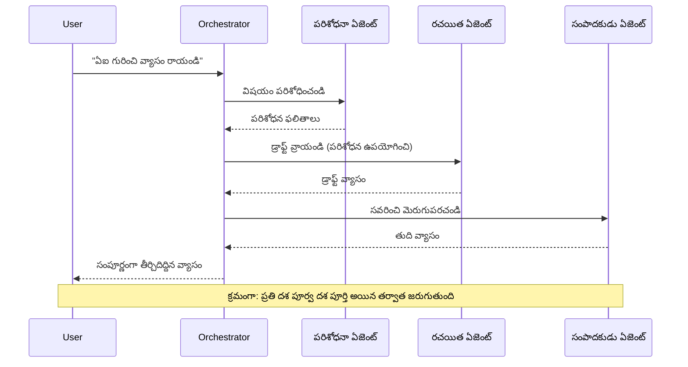
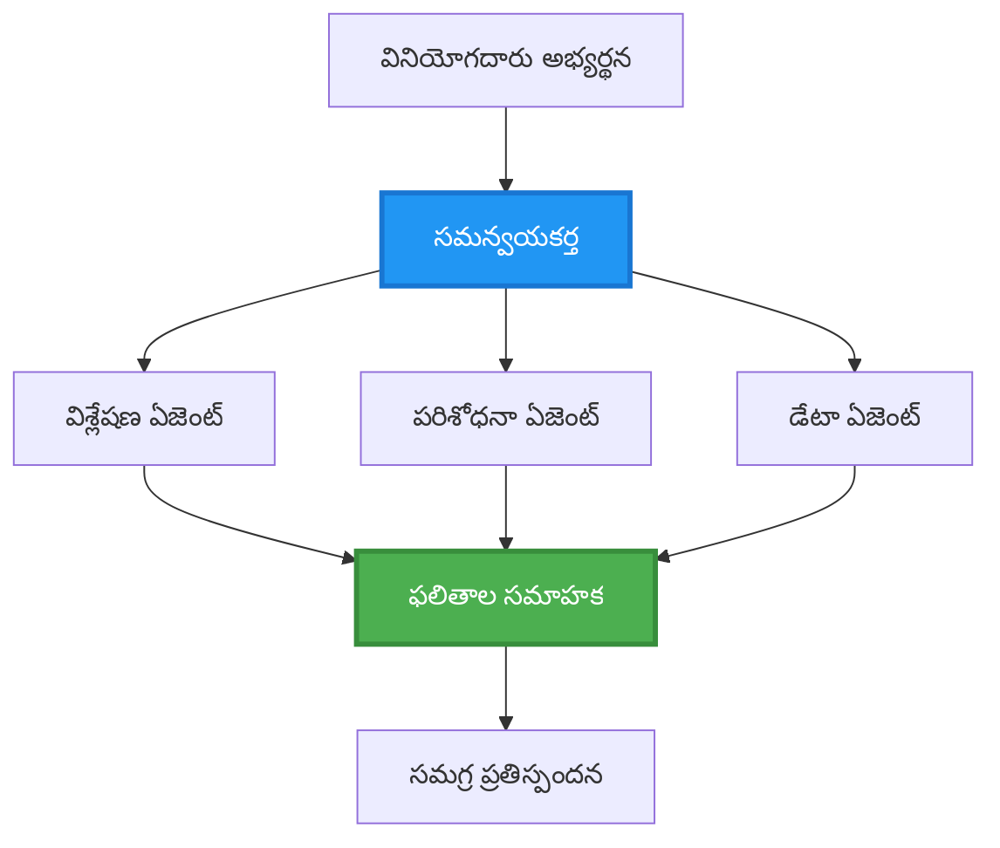
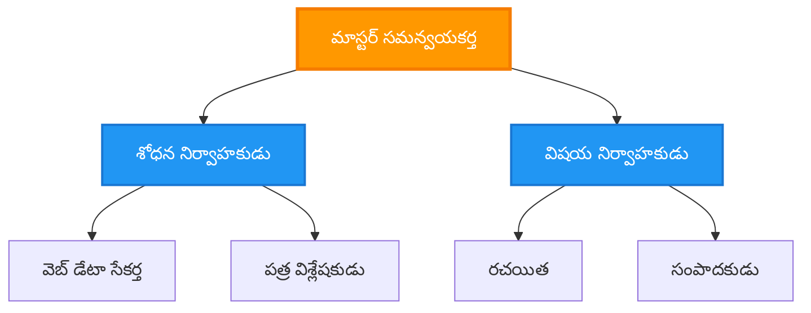
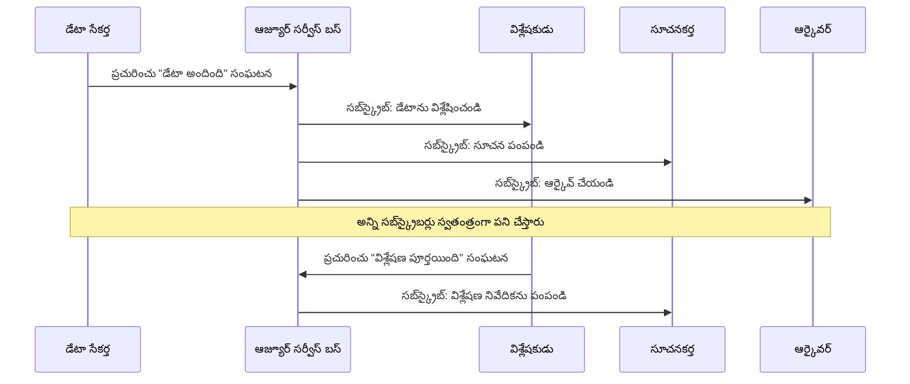

# బహుళ-ఏజెంట్ సమన్వయ నమూనాలు

⏱️ **అంచనా సమయం**: 60-75 నిమిషాలు | 💰 **అంచనా ఖర్చు**: ~$100-300/month | ⭐ **సంక్లిష్టత**: అధిక

**📚 శిక్షణ మార్గం:**
- ← మునుపటి: [సామర్థ్య ప్రణాళిక](capacity-planning.md) - స منابع పరిమాణ నిర్ణయం మరియు స్కేలింగ్ వ్యూహాలు
- 🎯 **మీరు ఇక్కడ ఉన్నారు**: బహుళ-ఏజెంట్ సమన్వయ నమూనాలు (ఆర్కెస్ట్రేషన్, కమ్యూనికేషన్, స్థితి నిర్వహణ)
- → తర్వాత: [SKU ఎంపిక](sku-selection.md) - సరైన Azure సేవలను ఎన్నుకోవడం
- 🏠 [కోర్సు హోమ్](../../README.md)

---

## మీరు ఏమి నేర్చుకుంటారు

By completing this lesson, you will:
- Understand **బహుళ-ఏజెంట్ ఆర్కిటెక్చర్** నమూనాలు మరియు వాటిని ఎప్పుడు ఉపయోగించాలో
- Implement **ఆర్కెస్ట్రేషన్ నమూనాలు** (కేంద్రిత, వికేంద్రీకృత, హైరార్కికల్)
- Design **ఏజెంట్ కమ్యూనికేషన్** వ్యూహాలు (సింక్రోనస్, అసింక్రోనస్, ఈవెంట్-డ్రైవెన్)
- Manage **షేర్ చేయబడిన స్థితి** across distributed agents
- Deploy **బహుళ-ఏజెంట్ వ్యవస్థలు** on Azure with AZD
- Apply **సమన్వయ నమూనాలు** వాస్తవ ప్రపంచ AI సన్నివేశాల్లో
- Monitor మరియు debug చేయండి distributed agent systems

## బహుళ-ఏజెంట్ సమన్వయం ఎందుకు ముఖ్యం

### పరిణామం: ఒకే ఏజెంట్ నుండి బహుళ-ఏజెంట్ కు

**ఒకే ఏజెంట్ (సాదారణ):**
```
User → Agent → Response
```
- ✅ అర్థం చేసుకోవడానికి మరియు అమలు చేయడానికి సులభం
- ✅ సరళమైన పనులతో వేగంగా ఉంటుంది
- ❌ ఒకే మోడల్ సామర్థ్యాల వల్ల పరిమితమవుతుంది
- ❌ సంక్లిష్ట పనులను సమాంతరంగా చేయలేరు
- ❌ ప్రత్యేకతా సామర్థ్యం లేదు

**బహుళ-ఏజెంట్ వ్యవస్థ (అధునాతన):**
```
           ┌─────────────┐
           │ Orchestrator│
           └──────┬──────┘
        ┌─────────┼─────────┐
        │         │         │
    ┌───▼──┐  ┌──▼───┐  ┌──▼────┐
    │Agent1│  │Agent2│  │Agent3 │
    │(Plan)│  │(Code)│  │(Review)│
    └──────┘  └──────┘  └───────┘
```
- ✅ నిర్దిష్ట పనుల కోసం ప్రత్యేక ఏజెంట్లు
- ✅ వేగం కోసం సమాంతర అమలు
- ✅ మాడ్యూలర్ మరియు నిర్వహించదగినది
- ✅ సంక్లిష్ట వర్క్‌ఫ్లోలలో మెరుగైన పనితనం
- ⚠️ సమన్వయ లాజిక్ అవసరం

**ఉదాహరణ**: ఒకే ఏజెంట్ అన్నది ఒక వ్యక్తి అన్ని పనులు చేయటానికి పోలి ఉంటుంది. బహుళ-ఏజెంట్ అంటే ప్రతి సభ్యుడు ప్రత్యేక నైపుణ్యాలు (శోధకుడు, కోడర్, సమీక్షకుడు, రచయిత) కలిగి కలిసి పనిచేసే జట్టు లాంటిది.

---

## ప్రాధమిక సమన్వయ నమూనాలు

### నమూనా 1: వరుస సమన్వయం (బాధ్యత గొలుసు)

**ఎప్పుడు ఉపయోగించాలి**: పనులు నిర్దిష్ట క్రమంలో పూర్తవాలి, ప్రతి ఏజెంట్ ముందు ఉత్పత్తిపై నిర్మించుకుంటుంది.


**లాభాలు:**
- ✅ స్పష్టమైన డేటా ప్రవాహం
- ✅ డీబగ్ చేయడం సులభం
- ✅ అంచనా వేయగల అమలు క్రమం

**పరిమితులు:**
- ❌ మందగింపు (సమాంతరత లేదు)
- ❌ ఒక వైఫల్యం మొత్తం గొలుసును ఆపొచ్చు
- ❌ అంతఃపరస్పర ఆధారపడే పనులను నిర్వహించలేరు

**ఉదాహరణ వినియోగ కేసులు:**
- కంటెంట్ సృష్టి పైప్‌లైన్ (శోధన → రచన → సంపాదన → ప్రచురణ)
- కోడ్ ఉత్పత్తి (ప్రణాళిక → అమలు → పరీక్ష → డిప్లాయ్)
- నివేదిక సృష్టి (డేటా సేకరణ → విశ్లేషణ → విజువలైజేషన్ → సారాంశం)

---

### నమూనా 2: సమాంతర సమన్వయం (Fan-Out/Fan-In)

**ఎప్పుడు ఉపయోగించాలి**: స్వతంత్ర పనులు ఒకే సమయంలో నడవవచ్చు, ఫలితాలు చివరలో కలపబడతాయి.


**లాభాలు:**
- ✅ వేగంగా (సమాంతర అమలు)
- ✅ ఫాల్ట్-టోలరెంట్ (అంశఫలితాలు ఆమోదయోగ్యం)
- ✅ హారిజాంటల్‌గా స్కేల్ అవుతుంది

**పరిమితులు:**
- ⚠️ ఫలితాలు క్రమం తప్పకుండా రావచ్చు
- ⚠️ సంగ్రహణ లాజిక్ అవసరం
- ⚠️ స్టేట్ నిర్వహణ క్లిష్టత

**ఉదాహరణ వినియోగ కేసులు:**
- బహుళ-మూలాల డేటా సేకరణ (APIs + డేటాబేస్‌లు + వెబ్ స్క్రాపింగ్)
- ప్రాతిపదిక విశ్లేషణ (పలు మోడళ్ల నుండి పరిష్కారాలు రూపొందించి ఉత్తమాన్ని ఎంచుకోవడం)
- అనువాద సేవలు (అనేక భాషలకు ఒకేసారి అనువదించడం)

---

### నమూనా 3: శ్రేణి సమన్వయం (మేనేజర్-వర్కర్)

**ఎప్పుడు ఉపయోగించాలి**: ఉప-పనులతో కూడిన సంక్లిష్ట వర్క్‌ఫ్లోలు, డెలిగేషన్ అవసరం.


**లాభాలు:**
- ✅ సంక్లిష్ట వర్క్‌ఫ్లోలను నిర్వహిస్తుంది
- ✅ మాడ్యూలర్ మరియు నిర్వహించదగినది
- ✅ బాధ్యతా సరిహద్దులు క్లారిటీగా ఉంటాయి

**పరిమితులు:**
- ⚠️ ఆర్కిటెక్చర్ మరింత క్లిష్టం అవుతుంది
- ⚠️ అధిక లేటెన్సీ (బహుళ సమన్వయ పొరలు)
- ⚠️ సృష్టిశీల ఆర్కెస్ట్రేషన్ అవసరం

**ఉదాహరణ వినియోగ కేసులు:**
- ఎంటర్ప్రైజ్ డాక్యుమెంట్ ప్రాసెసింగ్ (వర్గీకరణ → రూట్ చేయడం → ప్రాసెస్ → ఆర్కైవ్)
- బహుళ-దశ డేటా పైప్‌లైన్లు (ఇంజెస్ట్ → శుభ్రపరచు → మార్చు → విశ్లేషణ → నివేదిక)
- సంక్లిష్ట ఆటోమేషన్ వర్క్‌ఫ్లోలు (ప్రణాళిక → రిసోర్స్ కేటాయింపు → అమలు → మానిటరింగ్)

---

### నమూనా 4: ఈవెంట్-డ్రైవెన్ సమన్వయం (పబ్లిష్-సబ్స్క్రైబ్)

**ఎప్పుడు ఉపయోగించాలి**: ఏజెంట్లు ఈవెంట్స్ కు ప్రతిస్పందించవలసినప్పుడు, సడలించిన కప్లింగ్ కోరినప్పుడు.


**లాభాలు:**
- ✅ ఏజెంట్ల మధ్య సడలించిన కప్లింగ్
- ✅ కొత్త ఏజెంట్లను జోడించడం సులభం (కేవలం సబ్స్క్రైబ్ చేయండి)
- ✅ అసింక్రోనస్ ప్రాసెసింగ్
- ✅ మESSAGES నిల్వ ద్వారా దృఢత్వం

**పరిమితులు:**
- ⚠️ ఉత్తమ గత స్థితి (eventual consistency)
- ⚠️ డీబగ్ చేయడం క్లిష్టం
- ⚠️ సందేశం ఆర్డరింగ్ సవాళ్లు

**ఉదాహరణ వినియోగ కేసులు:**
- రియల్-టైమ్ మానిటరింగ్ సిస్టమ్స్ (అలర్ట్స్, డాష్‌బోర్డ్స్, లాగ్‌లు)
- బహు-చానల్ నోటిఫికేషన్లు (ఇమెయిల్, SMS, పుష్, Slack)
- డేటా ప్రాసెసింగ్ పైప్‌లైన్లు (ఒకేసి డేటా యొక్క బహు కంస్యూమర్‌లు)

---

### నమూనా 5: కన్సెన్సస్-ఆధారిత సమన్వయం (వోటింగ్/క్వారమ్)

**ఎప్పుడు ఉపయోగించాలి**: ముందుకు సాగేముందుగా బహుళ ఏజెంట్ల నుంచి ఒప్పందం అవసరమైనప్పుడు.

```mermaid
graph TB
    Input[ఇన్పుట్ పని]
    Agent1[ఏజెంట్ 1: GPT-4]
    Agent2[ఏజెంట్ 2: Claude]
    Agent3[ఏజెంట్ 3: Gemini]
    Voter[సమ్మతి ఓటరు]
    Output[అంగీకరించిన అవుట్పుట్]
    
    Input --> Agent1
    Input --> Agent2
    Input --> Agent3
    Agent1 --> Voter
    Agent2 --> Voter
    Agent3 --> Voter
    Voter --> Output
    
    style Voter fill:#9C27B0,stroke:#7B1FA2,stroke-width:3px,color:#fff
```}
**లాభాలు:**
- ✅ ఎక్కువ ఖచ్చితత్వం (బహుళ అభిప్రాయాలు)
- ✅ ఫాల్ట్-టోలరెంట్ (లగ్న విఫలాల tolerated)
- ✅ క్వాలిటీ అస్యూరెన్స్ ingebouwd

**పరిమితులు:**
- ❌ ఖరీదైనది (బహుళ మోడల్ కాల్స్)
- ❌ మందగింపును కలిగిస్తుంది (అన్ని ఏజెంట్లను వేచి ఉండటం)
- ⚠️ సంఘర్షణ పరిష్కారం అవసరం

**ఉదాహరణ వినియోగ కేసులు:**
- కంటెంట్ మోడరేషన్ (బహుళ మోడల్స్ కంటెంట్ సమీక్ష)
- కోడ్ సమీక్ష (బహుళ లింటర్లు/విశ్లేషణకర్తలు)
- వైద్య నిర్ధారణ (బహుళ AI మోడల్స్, నిపుణుల ధృవీకరణ)

---

## ఆర్కిటెక్చర్ సమీక్ష

### Azure పై పూర్తి బహుళ-ఏజెంట్ వ్యవస్థ

```mermaid
graph TB
    User[వినియోగదారు/API క్లయింట్]
    APIM[Azure API నిర్వహణ]
    Orchestrator[ఆర్కెస్ట్రేటర్ సేవ<br/>కంటైనర్ యాప్]
    ServiceBus[Azure సర్వీస్ బస్<br/>ఈవెంట్ హబ్]
    
    Agent1[శోధన ఏజెంట్<br/>కంటైనర్ యాప్]
    Agent2[రచయిత ఏజెంట్<br/>కంటైనర్ యాప్]
    Agent3[విశ్లేషక ఏజెంట్<br/>కంటైనర్ యాప్]
    Agent4[సమీక్షక ఏజెంట్<br/>కంటైనర్ యాప్]
    
    CosmosDB[(Cosmos DB<br/>సంయుక్త స్థితి)]
    Storage[Azure స్టోరేజ్<br/>ఆర్టిఫాక్ట్స్]
    AppInsights[అప్లికేషన్ ఇన్సైట్స్<br/>మానిటరింగ్]
    
    User --> APIM
    APIM --> Orchestrator
    
    Orchestrator --> ServiceBus
    ServiceBus --> Agent1
    ServiceBus --> Agent2
    ServiceBus --> Agent3
    ServiceBus --> Agent4
    
    Agent1 --> CosmosDB
    Agent2 --> CosmosDB
    Agent3 --> CosmosDB
    Agent4 --> CosmosDB
    
    Agent1 --> Storage
    Agent2 --> Storage
    Agent3 --> Storage
    Agent4 --> Storage
    
    Orchestrator -.-> AppInsights
    Agent1 -.-> AppInsights
    Agent2 -.-> AppInsights
    Agent3 -.-> AppInsights
    Agent4 -.-> AppInsights
    
    style Orchestrator fill:#FF9800,stroke:#F57C00,stroke-width:3px,color:#fff
    style ServiceBus fill:#9C27B0,stroke:#7B1FA2,stroke-width:3px,color:#fff
    style CosmosDB fill:#4CAF50,stroke:#388E3C,stroke-width:3px,color:#fff
```
**ప్రధాన భాగాలు:**

| భాగం | ఉద్దేశ్యం | Azure సేవ |
|-----------|---------|---------------|
| **API Gateway** | ప్రవేశ బిందువు, రేట్ పరిమితి, ప్రామాణీకరణ | API Management |
| **Orchestrator** | ఏజెంట్ వర్క్‌ఫ్లోలను సమన్వయిస్తుంది | Container Apps |
| **Message Queue** | అసింక్రోనస్ కమ్యూనికేషన్ | Service Bus / Event Hubs |
| **Agents** | ప్రత్యేకమైన AI వర్కర్లు | Container Apps / Functions |
| **State Store** | భాగస్వామ్య స్థితి, టాస్క్ ట్రాకింగ్ | Cosmos DB |
| **Artifact Storage** | డాక్యుమెంట్లు, ఫలితాలు, లాగ్‌లు | Blob Storage |
| **Monitoring** | డిస్ట్రిబ్యూటెడ్ ట్రేసింగ్, లాగ్‌లు | Application Insights |

---

## ముందస్తు అవసరాలు

### అవసరమైన టూల్స్

```bash
# Azure Developer CLI ని ధృవీకరించండి
azd version
# ✅ ఆశించబడింది: azd వెర్షన్ 1.0.0 లేదా ఎక్కువ

# Azure CLI ని ధృవీకరించండి
az --version
# ✅ ఆశించబడింది: azure-cli 2.50.0 లేదా ఎక్కువ

# లోకల్ పరీక్ష కోసం Docker ని ధృవీకరించండి
docker --version
# ✅ ఆశించబడింది: Docker వెర్షన్ 20.10 లేదా ఎక్కువ
```

### Azure అవసరాలు

- సక్రియ Azure subscription
- క్రియేట్ చేయడానికి అనుమతులు:
  - Container Apps
  - Service Bus namespaces
  - Cosmos DB accounts
  - Storage accounts
  - Application Insights

### జ్ఞానానికి సంబంధించిన ముందస్తు ప్రాభవాలు

మీరు పూర్తి చేసివుండాలి:
- [కన్ఫిగరేషన్ నిర్వహణ](../chapter-03-configuration/configuration.md)
- [ప్రామాణీకరణ & భద్రత](../chapter-03-configuration/authsecurity.md)
- [Microservices ఉదాహరణ](../../../../examples/microservices)

---

## అమలుపరచడం గైడ్

### ప్రాజెక్ట్ నిర్మాణం

```
multi-agent-system/
├── azure.yaml                    # AZD configuration
├── infra/
│   ├── main.bicep               # Main infrastructure
│   ├── core/
│   │   ├── servicebus.bicep     # Message queue
│   │   ├── cosmos.bicep         # State store
│   │   ├── storage.bicep        # Artifact storage
│   │   └── monitoring.bicep     # Application Insights
│   └── app/
│       ├── orchestrator.bicep   # Orchestrator service
│       └── agent.bicep          # Agent template
└── src/
    ├── orchestrator/            # Orchestration logic
    │   ├── app.py
    │   ├── workflows.py
    │   └── Dockerfile
    ├── agents/
    │   ├── research/            # Research agent
    │   ├── writer/              # Writer agent
    │   ├── analyst/             # Analyst agent
    │   └── reviewer/            # Reviewer agent
    └── shared/
        ├── state_manager.py     # Shared state logic
        └── message_handler.py   # Message handling
```

---

## పాఠం 1: వరుస సమన్వయం నమూనా

### అమలు: కంటెంట్ సృష్టి పైప్‌లైన్

ఓ వరుస పైప్‌లైన్ నిర్మしましょう: శోధన → రచన → సంపాదన → ప్రచురణ

### 1. AZD కాన్ఫిగరేషన్

**ఫైల్: `azure.yaml`**

```yaml
name: content-pipeline
metadata:
  template: multi-agent-sequential@1.0.0

services:
  orchestrator:
    project: ./src/orchestrator
    language: python
    host: containerapp
  
  research-agent:
    project: ./src/agents/research
    language: python
    host: containerapp
  
  writer-agent:
    project: ./src/agents/writer
    language: python
    host: containerapp
  
  editor-agent:
    project: ./src/agents/editor
    language: python
    host: containerapp
```

### 2. ఇన్ఫ్రాస్ట్రక్చర్: సమన్వయానికి Service Bus

**ఫైల్: `infra/core/servicebus.bicep`**

```bicep
param name string
param location string
param tags object = {}

resource serviceBusNamespace 'Microsoft.ServiceBus/namespaces@2022-10-01-preview' = {
  name: name
  location: location
  tags: tags
  sku: {
    name: 'Standard'
    tier: 'Standard'
  }
  properties: {
    minimumTlsVersion: '1.2'
  }
}

// Queue for orchestrator → research agent
resource researchQueue 'Microsoft.ServiceBus/namespaces/queues@2022-10-01-preview' = {
  parent: serviceBusNamespace
  name: 'research-tasks'
  properties: {
    maxDeliveryCount: 3
    lockDuration: 'PT5M'
    deadLetteringOnMessageExpiration: true
  }
}

// Queue for research agent → writer agent
resource writerQueue 'Microsoft.ServiceBus/namespaces/queues@2022-10-01-preview' = {
  parent: serviceBusNamespace
  name: 'writer-tasks'
  properties: {
    maxDeliveryCount: 3
    lockDuration: 'PT5M'
  }
}

// Queue for writer agent → editor agent
resource editorQueue 'Microsoft.ServiceBus/namespaces/queues@2022-10-01-preview' = {
  parent: serviceBusNamespace
  name: 'editor-tasks'
  properties: {
    maxDeliveryCount: 3
    lockDuration: 'PT5M'
  }
}

output namespace string = serviceBusNamespace.name
output connectionString string = listKeys('${serviceBusNamespace.id}/AuthorizationRules/RootManageSharedAccessKey', serviceBusNamespace.apiVersion).primaryConnectionString
```

### 3. షేర్డ్ స్టేట్ మేనేజర్

**ఫైల్: `src/shared/state_manager.py`**

```python
from azure.cosmos import CosmosClient, PartitionKey
from datetime import datetime
import os

class StateManager:
    """Manages shared state across agents using Cosmos DB"""
    
    def __init__(self):
        endpoint = os.environ['COSMOS_ENDPOINT']
        key = os.environ['COSMOS_KEY']
        
        self.client = CosmosClient(endpoint, key)
        self.database = self.client.get_database_client('agent-state')
        self.container = self.database.get_container_client('tasks')
    
    def create_task(self, task_id: str, task_type: str, input_data: dict):
        """Create a new task"""
        task = {
            'id': task_id,
            'type': task_type,
            'status': 'pending',
            'input': input_data,
            'created_at': datetime.utcnow().isoformat(),
            'steps': []
        }
        self.container.create_item(task)
        return task
    
    def update_task_step(self, task_id: str, step_name: str, result: dict):
        """Update task with completed step"""
        task = self.container.read_item(task_id, partition_key=task_id)
        
        task['steps'].append({
            'name': step_name,
            'completed_at': datetime.utcnow().isoformat(),
            'result': result
        })
        
        self.container.replace_item(task_id, task)
        return task
    
    def complete_task(self, task_id: str, final_result: dict):
        """Mark task as complete"""
        task = self.container.read_item(task_id, partition_key=task_id)
        task['status'] = 'completed'
        task['result'] = final_result
        task['completed_at'] = datetime.utcnow().isoformat()
        self.container.replace_item(task_id, task)
        return task
    
    def get_task(self, task_id: str):
        """Retrieve task state"""
        return self.container.read_item(task_id, partition_key=task_id)
```

### 4. ఆర్కెస్ట్రేటర్ సేవ

**ఫైల్: `src/orchestrator/app.py`**

```python
from flask import Flask, request, jsonify
from azure.servicebus import ServiceBusClient, ServiceBusMessage
import json
import uuid
import os
from shared.state_manager import StateManager

app = Flask(__name__)
state_manager = StateManager()

# సర్వీస్ బస్ కనెక్షన్
servicebus_connection_str = os.environ['SERVICEBUS_CONNECTION_STRING']
servicebus_client = ServiceBusClient.from_connection_string(servicebus_connection_str)

@app.route('/health', methods=['GET'])
def health():
    return jsonify({'status': 'healthy', 'service': 'orchestrator'})

@app.route('/create-content', methods=['POST'])
def create_content():
    """
    Sequential workflow: Research → Write → Edit → Publish
    """
    data = request.json
    topic = data.get('topic')
    
    if not topic:
        return jsonify({'error': 'Topic required'}), 400
    
    # స్టేట్ స్టోర్‌లో టాస్క్ సృష్టించండి
    task_id = str(uuid.uuid4())
    task = state_manager.create_task(
        task_id=task_id,
        task_type='content_creation',
        input_data={'topic': topic}
    )
    
    # రిసెర్చ్ ఏజెంట్‌కి సందేశం పంపండి (మొదటి దశ)
    sender = servicebus_client.get_queue_sender('research-tasks')
    message = ServiceBusMessage(
        body=json.dumps({
            'task_id': task_id,
            'topic': topic,
            'next_queue': 'writer-tasks'  # ఫలితాలను ఎక్కడ పంపాలి
        }),
        content_type='application/json'
    )
    
    with sender:
        sender.send_messages(message)
    
    return jsonify({
        'task_id': task_id,
        'status': 'started',
        'workflow': 'sequential',
        'steps': ['research', 'write', 'edit', 'publish'],
        'message': 'Content creation pipeline initiated'
    }), 202

@app.route('/task/<task_id>', methods=['GET'])
def get_task_status(task_id):
    """Check task status"""
    try:
        task = state_manager.get_task(task_id)
        return jsonify(task)
    except Exception as e:
        return jsonify({'error': str(e)}), 404

if __name__ == '__main__':
    app.run(host='0.0.0.0', port=8080)
```

### 5. శోధన ఏజెంట్

**ఫైల్: `src/agents/research/app.py`**

```python
from azure.servicebus import ServiceBusClient, ServiceBusMessage
from openai import AzureOpenAI
import json
import os
import time
from shared.state_manager import StateManager

# క్లయింట్లను ప్రారంభించండి
state_manager = StateManager()
servicebus_client = ServiceBusClient.from_connection_string(
    os.environ['SERVICEBUS_CONNECTION_STRING']
)

openai_client = AzureOpenAI(
    api_key=os.environ['AZURE_OPENAI_API_KEY'],
    api_version="2024-02-01",
    azure_endpoint=os.environ['AZURE_OPENAI_ENDPOINT']
)

def process_research_task(message_data):
    """Process research request and pass to writer"""
    task_id = message_data['task_id']
    topic = message_data['topic']
    next_queue = message_data['next_queue']
    
    print(f"🔬 Researching: {topic}")
    
    # పరిశోధన కోసం Azure OpenAIని పిలవండి
    response = openai_client.chat.completions.create(
        model="gpt-4",
        messages=[
            {"role": "system", "content": "You are a research assistant. Provide comprehensive research on the given topic."},
            {"role": "user", "content": f"Research this topic thoroughly: {topic}"}
        ],
        max_tokens=1500
    )
    
    research_results = response.choices[0].message.content
    
    # స్థితిని నవీకరించండి
    state_manager.update_task_step(
        task_id=task_id,
        step_name='research',
        result={'research': research_results}
    )
    
    # తదుపరి ఏజెంట్ (రచయిత)కు పంపండి
    sender = servicebus_client.get_queue_sender(next_queue)
    message = ServiceBusMessage(
        body=json.dumps({
            'task_id': task_id,
            'topic': topic,
            'research': research_results,
            'next_queue': 'editor-tasks'
        }),
        content_type='application/json'
    )
    
    with sender:
        sender.send_messages(message)
    
    print(f"✅ Research complete for task {task_id}")

def main():
    """Listen to research queue"""
    receiver = servicebus_client.get_queue_receiver('research-tasks')
    
    print("🔬 Research Agent started, listening for tasks...")
    
    with receiver:
        while True:
            messages = receiver.receive_messages(max_wait_time=5)
            for message in messages:
                try:
                    message_data = json.loads(str(message))
                    process_research_task(message_data)
                    receiver.complete_message(message)
                except Exception as e:
                    print(f"❌ Error processing message: {e}")
                    receiver.abandon_message(message)

if __name__ == '__main__':
    main()
```

### 6. రచయిత ఏజెంట్

**ఫైల్: `src/agents/writer/app.py`**

```python
from azure.servicebus import ServiceBusClient, ServiceBusMessage
from openai import AzureOpenAI
import json
import os
from shared.state_manager import StateManager

state_manager = StateManager()
servicebus_client = ServiceBusClient.from_connection_string(
    os.environ['SERVICEBUS_CONNECTION_STRING']
)

openai_client = AzureOpenAI(
    api_key=os.environ['AZURE_OPENAI_API_KEY'],
    api_version="2024-02-01",
    azure_endpoint=os.environ['AZURE_OPENAI_ENDPOINT']
)

def process_writing_task(message_data):
    """Write article based on research"""
    task_id = message_data['task_id']
    topic = message_data['topic']
    research = message_data['research']
    next_queue = message_data['next_queue']
    
    print(f"✍️ Writing article: {topic}")
    
    # ఆర్టికల్ రాయడానికి Azure OpenAIని పిలవండి
    response = openai_client.chat.completions.create(
        model="gpt-4",
        messages=[
            {"role": "system", "content": "You are a professional writer. Write engaging, well-structured articles."},
            {"role": "user", "content": f"Based on this research:\n\n{research}\n\nWrite a comprehensive article about: {topic}"}
        ],
        max_tokens=2000
    )
    
    article_draft = response.choices[0].message.content
    
    # స్థితిని నవీకరించండి
    state_manager.update_task_step(
        task_id=task_id,
        step_name='writing',
        result={'draft': article_draft}
    )
    
    # ఎడిటర్‌కు పంపండి
    sender = servicebus_client.get_queue_sender(next_queue)
    message = ServiceBusMessage(
        body=json.dumps({
            'task_id': task_id,
            'topic': topic,
            'draft': article_draft
        }),
        content_type='application/json'
    )
    
    with sender:
        sender.send_messages(message)
    
    print(f"✅ Article draft complete for task {task_id}")

def main():
    """Listen to writer queue"""
    receiver = servicebus_client.get_queue_receiver('writer-tasks')
    
    print("✍️ Writer Agent started, listening for tasks...")
    
    with receiver:
        while True:
            messages = receiver.receive_messages(max_wait_time=5)
            for message in messages:
                try:
                    message_data = json.loads(str(message))
                    process_writing_task(message_data)
                    receiver.complete_message(message)
                except Exception as e:
                    print(f"❌ Error: {e}")
                    receiver.abandon_message(message)

if __name__ == '__main__':
    main()
```

### 7. ఎడిటర్ ఏజెంట్

**ఫైల్: `src/agents/editor/app.py`**

```python
from azure.servicebus import ServiceBusClient
from openai import AzureOpenAI
import json
import os
from shared.state_manager import StateManager

state_manager = StateManager()
servicebus_client = ServiceBusClient.from_connection_string(
    os.environ['SERVICEBUS_CONNECTION_STRING']
)

openai_client = AzureOpenAI(
    api_key=os.environ['AZURE_OPENAI_API_KEY'],
    api_version="2024-02-01",
    azure_endpoint=os.environ['AZURE_OPENAI_ENDPOINT']
)

def process_editing_task(message_data):
    """Edit and finalize article"""
    task_id = message_data['task_id']
    topic = message_data['topic']
    draft = message_data['draft']
    
    print(f"📝 Editing article: {topic}")
    
    # సవరించడానికి Azure OpenAIని పిలవండి
    response = openai_client.chat.completions.create(
        model="gpt-4",
        messages=[
            {"role": "system", "content": "You are an expert editor. Improve grammar, clarity, and structure."},
            {"role": "user", "content": f"Edit and improve this article:\n\n{draft}"}
        ],
        max_tokens=2000
    )
    
    final_article = response.choices[0].message.content
    
    # టాస్క్‌ను పూర్తిగా గుర్తించండి
    state_manager.complete_task(
        task_id=task_id,
        final_result={
            'topic': topic,
            'final_article': final_article,
            'word_count': len(final_article.split())
        }
    )
    
    print(f"✅ Article finalized for task {task_id}")

def main():
    """Listen to editor queue"""
    receiver = servicebus_client.get_queue_receiver('editor-tasks')
    
    print("📝 Editor Agent started, listening for tasks...")
    
    with receiver:
        while True:
            messages = receiver.receive_messages(max_wait_time=5)
            for message in messages:
                try:
                    message_data = json.loads(str(message))
                    process_editing_task(message_data)
                    receiver.complete_message(message)
                except Exception as e:
                    print(f"❌ Error: {e}")
                    receiver.abandon_message(message)

if __name__ == '__main__':
    main()
```

### 8. డిప్లాయ్ మరియు పరీక్ష

```bash
# ప్రారంభించండి మరియు అమలు చేయండి
azd init
azd up

# ఆర్కెస్ట్రేటర్ URL పొందండి
ORCHESTRATOR_URL=$(azd env get-values | grep ORCHESTRATOR_URL | cut -d '=' -f2 | tr -d '"')

# కంటెంట్ సృష్టించండి
curl -X POST $ORCHESTRATOR_URL/create-content \
  -H "Content-Type: application/json" \
  -d '{"topic": "The Future of AI in Healthcare"}'
```

**✅ ఆశించే అవుట్‌పుట్:**
```json
{
  "task_id": "a1b2c3d4-e5f6-7890-abcd-ef1234567890",
  "status": "started",
  "workflow": "sequential",
  "steps": ["research", "write", "edit", "publish"],
  "message": "Content creation pipeline initiated"
}
```

**టాస్క్ పురోగతిని తనిఖీ చేయండి:**
```bash
TASK_ID="a1b2c3d4-e5f6-7890-abcd-ef1234567890"
curl $ORCHESTRATOR_URL/task/$TASK_ID
```

**✅ ఆశించే అవుట్‌పుట్ (పూర్తయింది):**
```json
{
  "id": "a1b2c3d4-e5f6-7890-abcd-ef1234567890",
  "type": "content_creation",
  "status": "completed",
  "steps": [
    {
      "name": "research",
      "completed_at": "2025-11-19T10:30:00Z",
      "result": {"research": "..."}
    },
    {
      "name": "writing",
      "completed_at": "2025-11-19T10:32:00Z",
      "result": {"draft": "..."}
    }
  ],
  "result": {
    "topic": "The Future of AI in Healthcare",
    "final_article": "...",
    "word_count": 1500
  }
}
```

---

## పాఠం 2: సమాంతర సమన్వయం నమూనా

### అమలు: బహుళ-మూల శోధనా సమాహకర్త

ఒక సమాంతర వ్యవస్థ నిర్మしましょう ఇది అనేక మూలాల నుండి ఒకేసారి సమాచారం సేకరిస్తుంది.

### సమాంతర ఆర్కెస్ట్రేటర్

**ఫైల్: `src/orchestrator/parallel_workflow.py`**

```python
from flask import Flask, request, jsonify
from azure.servicebus import ServiceBusClient, ServiceBusMessage
import json
import uuid
import os
from shared.state_manager import StateManager

app = Flask(__name__)
state_manager = StateManager()

servicebus_client = ServiceBusClient.from_connection_string(
    os.environ['SERVICEBUS_CONNECTION_STRING']
)

@app.route('/research-parallel', methods=['POST'])
def research_parallel():
    """
    Parallel workflow: Multiple agents work simultaneously
    """
    data = request.json
    query = data.get('query')
    
    task_id = str(uuid.uuid4())
    task = state_manager.create_task(
        task_id=task_id,
        task_type='parallel_research',
        input_data={
            'query': query,
            'agents': ['web', 'academic', 'news', 'social']
        }
    )
    
    # ఫ్యాన్-అవుట్: అన్ని ఏజెంట్లకు ఒకేసారి పంపండి
    agents = [
        ('web-research-queue', 'web'),
        ('academic-research-queue', 'academic'),
        ('news-research-queue', 'news'),
        ('social-research-queue', 'social')
    ]
    
    for queue_name, agent_type in agents:
        sender = servicebus_client.get_queue_sender(queue_name)
        message = ServiceBusMessage(
            body=json.dumps({
                'task_id': task_id,
                'query': query,
                'agent_type': agent_type,
                'result_queue': 'aggregation-queue'
            }),
            content_type='application/json'
        )
        
        with sender:
            sender.send_messages(message)
    
    return jsonify({
        'task_id': task_id,
        'status': 'started',
        'workflow': 'parallel',
        'agents_dispatched': 4,
        'message': 'Parallel research initiated'
    }), 202

if __name__ == '__main__':
    app.run(host='0.0.0.0', port=8080)
```

### సమగ్రత లాజిక్

**ఫైల్: `src/agents/aggregator/app.py`**

```python
from azure.servicebus import ServiceBusClient
import json
import os
from collections import defaultdict
from shared.state_manager import StateManager

state_manager = StateManager()
servicebus_client = ServiceBusClient.from_connection_string(
    os.environ['SERVICEBUS_CONNECTION_STRING']
)

# ప్రతి పనికి ఫలితాలను ట్రాక్ చేయండి
task_results = defaultdict(list)
expected_agents = 4  # వెబ్, అకాడెమిక్, వార్తలు, సోషల్

def process_result(message_data):
    """Aggregate results from parallel agents"""
    task_id = message_data['task_id']
    agent_type = message_data['agent_type']
    result = message_data['result']
    
    # ఫలితాన్ని నిల్వ చేయండి
    task_results[task_id].append({
        'agent': agent_type,
        'data': result
    })
    
    print(f"📊 Received result from {agent_type} agent ({len(task_results[task_id])}/{expected_agents})")
    
    # అన్ని ఏజెంట్లు పూర్తి అయ్యాయా అని తనిఖీ చేయండి (ఫ్యాన్-ఇన్)
    if len(task_results[task_id]) == expected_agents:
        print(f"✅ All agents completed for task {task_id}. Aggregating...")
        
        # ఫలితాలను కలపండి
        aggregated = {
            'query': message_data['query'],
            'sources': task_results[task_id],
            'summary': generate_summary(task_results[task_id])
        }
        
        # పూర్తయినట్లు గుర్తించండి
        state_manager.complete_task(task_id, aggregated)
        
        # శుభ్రం చేయండి
        del task_results[task_id]
        
        print(f"✅ Aggregation complete for task {task_id}")

def generate_summary(results):
    """Generate summary from all sources"""
    summaries = [r['data'].get('summary', '') for r in results]
    return '\n\n'.join(summaries)

def main():
    """Listen to aggregation queue"""
    receiver = servicebus_client.get_queue_receiver('aggregation-queue')
    
    print("📊 Aggregator started, listening for results...")
    
    with receiver:
        while True:
            messages = receiver.receive_messages(max_wait_time=5)
            for message in messages:
                try:
                    message_data = json.loads(str(message))
                    process_result(message_data)
                    receiver.complete_message(message)
                except Exception as e:
                    print(f"❌ Error: {e}")
                    receiver.abandon_message(message)

if __name__ == '__main__':
    main()
```

**సమాంతర నమూనా లాభాలు:**
- ⚡ **4x వేగం** (ఏజెంట్లు ఒకేసారి నడుస్తాయి)
- 🔄 **ఫాల్ట్-టోలరెంట్** (భాగఫలితాలు ఆమోదయోగ్యం)
- 📈 **స్కేలబుల్** (ఇంకెన్ని ఏజెంట్లను సులభంగా జోడించవచ్చు)

---

## ప్రాక్టికల్ వ్యాయామాలు

### వ్యాయామం 1: టైమౌట్ హ్యాండ్లింగ్ జోడించండి ⭐⭐ (మధ్యస్థ)

**లక్ష్యం**: అగ్రిగేటర్ నెమ్మది ఏజెంట్ల కోసం ఎప్పుడూ వేచి ఉండకుండా టైమౌట్ లాజిక్ అమలు చేయండి.

**దశలు**:

1. **అగ్రిగేటర్‌కు టైమౌట్ ట్రాకింగ్ జోడించండి:**

```python
from datetime import datetime, timedelta

task_timeouts = {}  # task_id -> గడువు_సమయం

def process_result(message_data):
    task_id = message_data['task_id']
    
    # మొదటి ఫలితంపై టైమ్‌అవుట్ సెట్ చేయండి
    if task_id not in task_timeouts:
        task_timeouts[task_id] = datetime.utcnow() + timedelta(seconds=30)
    
    task_results[task_id].append({
        'agent': message_data['agent_type'],
        'data': message_data['result']
    })
    
    # పూర్తయిందో లేదా టైమ్‌అవుట్ అయిందో తనిఖీ చేయండి
    if len(task_results[task_id]) == expected_agents or \
       datetime.utcnow() > task_timeouts[task_id]:
        
        print(f"📊 Aggregating with {len(task_results[task_id])}/{expected_agents} results")
        
        aggregated = {
            'query': message_data['query'],
            'sources': task_results[task_id],
            'completed_agents': len(task_results[task_id]),
            'timed_out': len(task_results[task_id]) < expected_agents
        }
        
        state_manager.complete_task(task_id, aggregated)
        
        # శుభ్రపరచడం
        del task_results[task_id]
        del task_timeouts[task_id]
```

2. **కళ్పనాత్మక ఆలస్యం గల చర్యలతో పరీక్షించండి:**

```python
# ఒక ఏజెంట్‌లో, నెమ్మదైన ప్రాసెసింగ్‌ను అనుకరించడానికి ఆలస్యం జోడించండి
import time
time.sleep(35)  # 30 సెకన్ల టైమౌట్‌ను అధిగమిస్తుంది
```

3. **డిప్లాయ్ చేసి నిర్ధారించండి:**

```bash
azd deploy aggregator

# పని సమర్పించండి
curl -X POST $ORCHESTRATOR_URL/research-parallel \
  -H "Content-Type: application/json" \
  -d '{"query": "AI safety research"}'

# 30 సెకన్ల తర్వాత ఫలితాలను తనిఖీ చేయండి
curl $ORCHESTRATOR_URL/task/$TASK_ID
```

**✅ విజయం ప్రమాణాలు:**
- ✅ ఏజెంట్లు అసంపూర్ణ అయినా టాస్క్ 30 సెకన్లలో పూర్తి అవుతుంది
- ✅ ప్రతిస్పందన భాగఫలితాల విషయంలో `"timed_out": true` సూచిస్తుంది
- ✅ అందుబాటులో ఉన్న ఫలితాలు తిరిగి ఇవ్వబడతాయి (4 లోనుండి 3 ఏజెంట్లు)

**సమయం**: 20-25 నిమిషాలు

---

### వ్యాయామం 2: రీట్రై లాజిక్ అమలు చేయండి ⭐⭐⭐ (అధిక)

**లక్ష్యం**: ఓవైఫల్యమైన ఏజెంట్ టాస్క్‌లను అప్పటికి ఇచ్చే ముందు ఆటోమాటిక్‌గా రీట్రై చేయండి.

**దశలు**:

1. **ఆర్కెస్ట్రేటర్‌లో రీట్రై ట్రాకింగ్ జోడించండి:**

```python
from dataclasses import dataclass
from typing import Dict

@dataclass
class RetryConfig:
    max_retries: int = 3
    backoff_seconds: int = 5

retry_counts: Dict[str, int] = {}  # సందేశం_ఐడి -> పునఃప్రయత్నాల_సంఖ్య

def send_with_retry(queue_name: str, message_data: dict, retry_config: RetryConfig):
    """Send message with retry metadata"""
    message_id = message_data.get('message_id', str(uuid.uuid4()))
    message_data['message_id'] = message_id
    message_data['retry_count'] = retry_counts.get(message_id, 0)
    message_data['max_retries'] = retry_config.max_retries
    
    sender = servicebus_client.get_queue_sender(queue_name)
    message = ServiceBusMessage(
        body=json.dumps(message_data),
        content_type='application/json',
        message_id=message_id
    )
    
    with sender:
        sender.send_messages(message)
```

2. **ఏజెంట్లకు రీట్రై హ్యాండ్లర్ జోడించండి:**

```python
def process_with_retry(message, receiver, process_func):
    """Process message with automatic retry on failure"""
    try:
        message_data = json.loads(str(message))
        
        # సందేశాన్ని ప్రాసెస్ చేయండి
        process_func(message_data)
        
        # సఫలం - పూర్తి
        receiver.complete_message(message)
        
    except Exception as e:
        message_id = message.message_id
        retry_count = message_data.get('retry_count', 0)
        max_retries = message_data.get('max_retries', 3)
        
        if retry_count < max_retries:
            # మళ్లీ ప్రయత్నించండి: వదిలి పెరిగిన లెక్కతో మళ్లీ క్యూలో ఉంచండి
            print(f"⚠️ Retry {retry_count + 1}/{max_retries} for message {message_id}")
            
            message_data['retry_count'] = retry_count + 1
            
            # అదే క్యూకు ఆలస్యంతో తిరిగి పంపండి
            time.sleep(5 * (retry_count + 1))  # గుణాత్మక వెనితగ్గింపు
            send_with_retry(queue_name, message_data, RetryConfig())
            
            receiver.complete_message(message)  # మూలాన్ని తొలగించండి
        else:
            # గరిష్ట మళ్లీ ప్రయత్నాల సంఖ్య దాటిపోయింది - డెడ్ లెటర్ క్యూకు తరలించండి
            print(f"❌ Max retries exceeded for message {message_id}")
            receiver.dead_letter_message(
                message,
                reason="MaxRetriesExceeded",
                error_description=str(e)
            )
```

3. **డెడ్ లెటర్ క్యూ ని మానిటర్ చేయండి:**

```python
def monitor_dead_letters():
    """Check dead letter queue for failed messages"""
    receiver = servicebus_client.get_queue_receiver(
        'research-queue',
        sub_queue='deadletter'
    )
    
    with receiver:
        messages = receiver.receive_messages(max_wait_time=5)
        for message in messages:
            print(f"☠️ Dead letter: {message.message_id}")
            print(f"Reason: {message.dead_letter_reason}")
            print(f"Description: {message.dead_letter_error_description}")
```

**✅ విజయం ప్రమాణాలు:**
- ✅ విఫలమైన టాస్కులు ఆటోమేటిక్‌గా రీట్రై అవుతాయి (గరిష్టం 3 సార్లు)
- ✅ రీట్రైల మధ్య ఎక్స్పోనెన్షియల్ బ్యాక్‌ఆఫ్ ఉంది (5s, 10s, 15s)
- ✅ గరిష్ట రీట్రైల తర్వాత, సందేశాలు డెడ్ లెటర్ క్యూ కు వెళ్తాయి
- ✅ డెడ్ లెటర్ క్యూ ను మానిటర్ చేసి రీప్లే చేయవచ్చును

**సమయం**: 30-40 నిమిషాలు

---

### వ్యాయామం 3: సర్క్యూట్ బ్రేకర్ అమలుచేయండి ⭐⭐⭐ (అధిక)

**లక్ష్యం**: పతనాల శ్రేణిని నివారించడానికి వైఫల్యమవుతున్న ఏజెంట్లకు అభ్యర్థనలు నిలిపివేయండి.

**దశలు**:

1. **సర్క్యూట్ బ్రేకర్ క్లాస్ సృష్టించండి:**

```python
from enum import Enum
from datetime import datetime, timedelta

class CircuitState(Enum):
    CLOSED = "closed"      # సాధారణ కార్యాచరణ
    OPEN = "open"          # విఫలమవుతోంది, అభ్యర్థనలను తిరస్కరిస్తుంది
    HALF_OPEN = "half_open"  # పునరుద్ధరించిందా అని పరీక్షిస్తోంది

class CircuitBreaker:
    def __init__(self, failure_threshold=5, timeout_seconds=60):
        self.failure_threshold = failure_threshold
        self.timeout_seconds = timeout_seconds
        self.failure_count = 0
        self.last_failure_time = None
        self.state = CircuitState.CLOSED
    
    def call(self, func):
        """Execute function with circuit breaker protection"""
        if self.state == CircuitState.OPEN:
            # టైమౌట్ ముగిసిందో లేదో తనిఖీ చేయండి
            if datetime.utcnow() - self.last_failure_time > timedelta(seconds=self.timeout_seconds):
                self.state = CircuitState.HALF_OPEN
                print("🔄 Circuit breaker: HALF_OPEN (testing)")
            else:
                raise Exception(f"Circuit breaker OPEN for agent. Try again in {self.timeout_seconds}s")
        
        try:
            result = func()
            
            # సఫల్యం
            if self.state == CircuitState.HALF_OPEN:
                self.state = CircuitState.CLOSED
                self.failure_count = 0
                print("✅ Circuit breaker: CLOSED (recovered)")
            
            return result
            
        except Exception as e:
            self.failure_count += 1
            self.last_failure_time = datetime.utcnow()
            
            if self.failure_count >= self.failure_threshold:
                self.state = CircuitState.OPEN
                print(f"🔴 Circuit breaker: OPEN (too many failures)")
            
            raise e
```

2. **ఏజెంట్ కాల్స్‌కి వర్తింపజేయండి:**

```python
# ఆర్కెస్ట్రేటరులో
agent_circuits = {
    'web': CircuitBreaker(failure_threshold=5, timeout_seconds=60),
    'academic': CircuitBreaker(failure_threshold=5, timeout_seconds=60),
    'news': CircuitBreaker(failure_threshold=5, timeout_seconds=60),
    'social': CircuitBreaker(failure_threshold=5, timeout_seconds=60)
}

def send_to_agent(agent_type, message_data):
    """Send with circuit breaker protection"""
    circuit = agent_circuits[agent_type]
    
    try:
        circuit.call(lambda: send_message(agent_type, message_data))
    except Exception as e:
        print(f"⚠️ Skipping {agent_type} agent: {e}")
        # ఇతర ఏజెంట్లతో కొనసాగించండి
```

3. **సర్క్యూట్ బ్రేకర్ ను పరీక్షించండి:**

```bash
# పునరావృత వైఫల్యాలను అనుకరించండి (ఒక ఏజెంట్‌ను ఆపండి)
az containerapp stop --name web-research-agent --resource-group rg-agents

# బహుళ అభ్యర్థనలు పంపండి
for i in {1..10}; do
  curl -X POST $ORCHESTRATOR_URL/research-parallel \
    -H "Content-Type: application/json" \
    -d '{"query": "test query '$i'"}'
  sleep 2
done

# లాగ్‌లను తనిఖీ చేయండి - 5 వైఫల్యాల తర్వాత సర్క్యూట్ తెరిచి ఉందని చూడాలి
# కంటైనర్ యాప్ లాగ్‌ల కోసం Azure CLI ఉపయోగించండి:
az containerapp logs show --name orchestrator --resource-group $RG_NAME --tail 50
```

**✅ విజయం ప్రమాణాలు:**
- ✅ 5 వైఫల్యాల తర్వాత, సర్క్యూట్ తెరచబడుతుంది (అభ్యర్థనలను నిరాకరిస్తుంది)
- ✅ 60 సెకన్ల తర్వాత, సర్క్యూట్ హాఫ్-ఓపెన్ అవుతుంది (పునఃప్రారంభాన్ని పరీక్షిస్తుంది)
- ✅ ఇతర ఏజెంట్లు సాదారణంగా పని చేయడం కొనసాగిస్తారు
- ✅ ఏజెంట్ పునరుద్ధరించినప్పుడు సర్క్యూట్ ఆటోమేటిక్‌గా మూసివేస్తుంది

**సమయం**: 40-50 నిమిషాలు

---

## మానిటరింగ్ మరియు డీబగ్గింగ్

### Application Insights తో డిస్ట్రిబ్యూటెడ్ ట్రేసింగ్

**ఫైల్: `src/shared/tracing.py`**

```python
from opencensus.ext.azure.log_exporter import AzureLogHandler
from opencensus.ext.azure.trace_exporter import AzureExporter
from opencensus.trace import config_integration
from opencensus.trace.tracer import Tracer
from opencensus.trace.samplers import AlwaysOnSampler
import logging
import os

# ట్రేసింగ్‌ను కాన్ఫిగర్ చేయండి
config_integration.trace_integrations(['requests', 'logging'])

connection_string = os.environ.get('APPLICATIONINSIGHTS_CONNECTION_STRING')

# ట్రేసర్‌ను సృష్టించండి
tracer = Tracer(
    exporter=AzureExporter(connection_string=connection_string),
    sampler=AlwaysOnSampler()
)

# లాగింగ్‌ను కాన్ఫిగర్ చేయండి
logger = logging.getLogger(__name__)
logger.addHandler(AzureLogHandler(connection_string=connection_string))
logger.setLevel(logging.INFO)

def trace_agent_call(agent_name, task_id, operation):
    """Trace agent operations"""
    with tracer.span(name=f'{agent_name}.{operation}') as span:
        span.add_attribute('agent', agent_name)
        span.add_attribute('task_id', task_id)
        span.add_attribute('operation', operation)
        
        try:
            result = operation()
            span.add_attribute('status', 'success')
            return result
        except Exception as e:
            span.add_attribute('status', 'error')
            span.add_attribute('error', str(e))
            raise
```

### Application Insights క్వెరీస్

**బహుళ-ఏజెంట్ వర్క్‌ఫ్లోలను ట్రాక్ చేయండి:**

```kusto
// Trace complete workflow for a task
traces
| where customDimensions.task_id == "a1b2c3d4-..."
| project timestamp, message, customDimensions.agent, customDimensions.operation
| order by timestamp asc
```

**ఏజెంట్ పనితన సరిపోలిక:**

```kusto
// Compare agent execution times
dependencies
| where name contains "agent"
| summarize 
    avg_duration = avg(duration),
    p95_duration = percentile(duration, 95),
    count = count()
  by agent = tostring(customDimensions.agent)
| order by avg_duration desc
```

**వైఫల్య విశ్లేషణ:**

```kusto
// Find which agents fail most
exceptions
| where customDimensions.agent != ""
| summarize 
    failure_count = count(),
    unique_errors = dcount(outerMessage)
  by agent = tostring(customDimensions.agent)
| order by failure_count desc
```

---

## ఖర్చుల విశ్లేషణ

### బహుళ-ఏజెంట్ వ్యవస్థ ఖర్చులు (మాసిక అంచనాలు)

| భాగం | కాన్ఫిగరేషన్ | ఖర్చు |
|-----------|--------------|------|
| **Orchestrator** | 1 Container App (1 vCPU, 2GB) | $30-50 |
| **4 Agents** | 4 Container Apps (0.5 vCPU, 1GB each) | $60-120 |
| **Service Bus** | Standard tier, 10M messages | $10-20 |
| **Cosmos DB** | Serverless, 5GB storage, 1M RUs | $25-50 |
| **Blob Storage** | 10GB storage, 100K operations | $5-10 |
| **Application Insights** | 5GB ingestion | $10-15 |
| **Azure OpenAI** | GPT-4, 10M tokens | $100-300 |
| **మొత్తం** | | **$240-565/month** |

### ఖర్చు ఆప్టిమైజేషన్ వ్యూహాలు

1. **సాధ్యమైన చోట్ల సర్వర్‌లెస్ ఉపయోగించండి:**
   ```bicep
   // Cosmos DB serverless (no minimum cost)
   properties: {
     databaseAccountOfferType: 'Standard'
     capabilities: [{ name: 'EnableServerless' }]
   }
   ```

2. **ఏజెంట్లను నిర్జీవంగా ఉన్నప్పుడు జీరో కు స్కేల్ చేయండి:**
   ```bicep
   scale: {
     minReplicas: 0  // Scale to zero when no messages
     maxReplicas: 10
   }
   ```

3. **Service Bus కోసం బ్యాచింగ్ ఉపయోగించండి:**
   ```python
   # సందేశాలను బ్యాచ్‌లుగా పంపండి (తక్కువ ఖర్చు)
   sender.send_messages([message1, message2, message3])
   ```

4. **దాచుకొని తరచుగా ఉపయోగించే ఫలితాలను క్యాష్ చేయండి:**
   ```python
   # Redis కోసం Azure Cache ను ఉపయోగించండి
   if cache.exists(query_hash):
       return cache.get(query_hash)
   ```

---

## ఉత్తమ ఆచరణలు

### ✅ చేయవలసినవి:

1. **ఇడెంపొటెంట్ కార్యకలాపాలను ఉపయోగించండి**
   ```python
   # ఏజెంట్ ఒకే సందేశాన్ని బహుళ సార్లు సురక్షితంగా ప్రాసెస్ చేయగలడు
   def process_task(task_id):
       if state_manager.task_exists(task_id):
           print(f"Task {task_id} already processed, skipping")
           return
       # పని ప్రాసెస్ చేయండి...
   ```

2. **విస్తృత లాగింగ్ అమలు చేయండి**
   ```python
   logger.info(f"Agent: {agent_name}, Task: {task_id}, Action: {action}")
   ```

3. **కోరిలేషన్ IDs ఉపయోగించండి**
   ```python
   # task_id ను పూర్తి వర్క్‌ఫ్లోలోకి పంపండి
   message_data = {
       'task_id': task_id,  # సంబంధ గుర్తింపు
       'timestamp': datetime.utcnow().isoformat()
   }
   ```

4. **సందేశం TTL (time-to-live) సెట్ చేయండి**
   ```bicep
   properties: {
     defaultMessageTimeToLive: 'PT1H'  // 1 hour max
   }
   ```

5. **డెడ్ లెటర్ క్యూలను మానిటర్ చేయండి**
   ```python
   # విఫలమైన సందేశాల నియమిత పర్యవేక్షణ
   monitor_dead_letters()
   ```

### ❌ చేయకూడదు:

1. **చక్రాకార ఆధారిత సంబంధాలను సృష్టించకండి**
   ```python
   # ❌ చెడు: ఏజెంట్ A → ఏజెంట్ B → ఏజెంట్ A (అనంత లూప్)
   # ✅ మంచిది: స్పష్టమైన దిశానిర్దిష్ట చక్రరహిత గ్రాఫ్ (DAG) నిర్వచించండి
   ```

2. **ఏజెంట్ థ్రెడ్స్‌ను బ్లాక్ చేయకండి**
   ```python
   # ❌ చెడు: సమకాలిక వేచి ఉండటం
   while not task_complete:
       time.sleep(1)
   
   # ✅ మంచిది: మెసేజ్ క్యూ కాల్‌బ్యాక్‌లను ఉపయోగించండి
   ```

3. **భాగస్వామ్య విఫలాల‌ను అవగాహన చేయకండి**
   ```python
   # ❌ చెడు: ఒక ఏజెంట్ విఫలమైతే మొత్తం వర్క్‌ఫ్లోను విఫలంగా చేయండి
   # ✅ మంచిది: లోప సూచికలతో ఆంశిక ఫలితాలను తిరిగి ఇవ్వండి
   ```

4. **అనంత రీట్రైలను వాడవద్దు**
   ```python
   # ❌ చెడు: శాశ్వతంగా మళ్లీ ప్రయత్నించడం
   # ✅ మంచిది: max_retries = 3, తర్వాత డెడ్ లెటర్
   ```

---
## సమస్య పరిష్కార గైడ్

### సమస్య: సందేశాలు క్యూ లో చిక్కుకున్నాయి

**లక్షణాలు:**
- సందేశాలు క్యూ లో సేకరమవుతున్నాయి
- ఏజెంట్లు ప్రాసెస్ చేయడం లేదు
- టాస్క్ స్థితి "pending" వద్ద నిలిచిఉంది

**నిర్ధారణ:**
```bash
# క్యూలోని లోతు తనిఖీ చేయండి
az servicebus queue show \
  --namespace-name mybus \
  --name research-tasks \
  --query "countDetails"

# Azure CLI ఉపయోగించి ఏజెంట్ లాగ్‌లను తనిఖీ చేయండి
az containerapp logs show --name research-agent --resource-group $RG_NAME --tail 50
```

**పరిష్కారాలు:**

1. **ఏజెంట్ రిప్లికాలను పెంచండి:**
   ```bash
   az containerapp update \
     --name research-agent \
     --min-replicas 3 \
     --max-replicas 10
   ```

2. **డెడ్ లెటర్ క్యూ తనిఖీ చేయండి:**
   ```bash
   az servicebus queue show \
     --namespace-name mybus \
     --name research-tasks \
     --query "countDetails.deadLetterMessageCount"
   ```

---

### సమస్య: టాస్క్ టైమౌట్/ఎప్పుడూ పూర్తి అవడంలేదు

**లక్షణాలు:**
- టాస్క్ స్థితి "in_progress"గా ఉంటుంది
- కొన్ని ఏజెంట్లు పూర్తి చేస్తాయి, కొన్ని చేయవు
- ఎర్రర్ సందేశాలు లేవు

**నిర్ధారణ:**
```bash
# టాస్క్ స్థితిని తనిఖీ చేయండి
curl $ORCHESTRATOR_URL/task/$TASK_ID

# Application Insights ను తనిఖీ చేయండి
# క్వెరీను నడపండి: traces | where customDimensions.task_id == "..."
```

**పరిష్కారాలు:**

1. **అగ్రిగేటర్‌లో టైమౌట్ అమలు చేయండి (వ్యాయామం 1)**

2. **Azure Monitor ఉపయోగించి ఏజెంట్ విఫలతలను తనిఖీ చేయండి:**
   ```bash
   # azd monitor ద్వారా లాగ్‌లను వీక్షించండి
   azd monitor --logs
   
   # లేదా నిర్దిష్ట కంటైనర్ యాప్ లాగ్‌లను తనిఖీ చేయడానికి Azure CLI ఉపయోగించండి
   az containerapp logs show --name <agent-name> --resource-group $RG_NAME --follow | grep "ERROR\|FAIL"
   ```

3. **అన్ని ఏజెంట్లు పనిచేస్తున్నాయా నిర్ధారించండి:**
   ```bash
   az containerapp list \
     --resource-group rg-agents \
     --query "[].{name:name, status:properties.runningStatus}"
   ```

---

## మరింత తెలుసుకోండి

### అధికారిక డాక్యుమెంటేషన్
- [Azure Service Bus](https://learn.microsoft.com/azure/service-bus-messaging/service-bus-messaging-overview)
- [Cosmos DB](https://learn.microsoft.com/azure/cosmos-db/introduction)
- [Container Apps DAPR](https://learn.microsoft.com/azure/container-apps/dapr-overview)
- [Multi-Agent Design Patterns](https://learn.microsoft.com/azure/architecture/guide/ai/multi-agent-systems)

### ఈ కోర్సులో తదుపరి దశలు
- ← పూర్వం: [సామర్థ్య ప్రణాళిక](capacity-planning.md)
- → తదుపరి: [SKU ఎంపిక](sku-selection.md)
- 🏠 [కోర్స్ హోమ్](../../README.md)

### సంబంధిత ఉదాహరణలు
- [Microservices ఉదాహరణ](../../../../examples/microservices) - సర్వీస్ కమ్యూనికేషన్ నమూనాలు
- [Azure OpenAI ఉదాహరణ](../../../../examples/azure-openai-chat) - AI ఇంటిగ్రేషన్

---

## సారాంశం

**మీరు నేర్చుకున్నవి:**
- ✅ ఐదు సమన్వయ నమూనాలు (క్రమబద్ధం, సమాంతర, హైరార్కికల్, ఈవెంట్-డ్రివెన్, కన్సెన్సస్)
- ✅ Azure పై బహుళ-ఏజెంట్ ఆర్కిటెక్చర్ (Service Bus, Cosmos DB, Container Apps)
- ✅ విభజిత ఏజెంట్లలో స్థితి నిర్వహణ
- ✅ టైమౌట్ నిర్వహణ, పునఃప్రయత్నాలు, మరియు సర్క్యూట్ బ్రేకర్లు
- ✅ పంపిణీ వ్యవస్థల మానిటరింగ్ మరియు డీబగ్గింగ్
- ✅ వ్యయానుకూలీకరణ వ్యూహాలు

**ప్రధాన విషయాలు:**
1. **సరైన నమూనాను ఎంచుకోండి** - ఆదేశించిన పనిమెట్ల కోసం క్రమబద్ధం, వేగానికి సమాంతర, సరళత్వానికి ఈవెంట్-డ్రివెన్
2. **స్థితిని జాగ్రత్తగా నిర్వహించండి** - పంచుకున్న స్థితికి Cosmos DB లేదా సమానమైనదాన్ని ఉపయోగించండి
3. **విఫలతలను శాంతంగా నిర్వహించండి** - టైమౌట్లు, పునఃప్రయత్నాలు, సర్క్యూట్ బ్రేకర్లు, డెడ్ లెటర్ క్యూ
4. **ఎన్నింటినీ పర్యవేక్షించండి** - డీబగ్గింగ్ కోసం విభజిత ట్రేసింగ్ అనివార్యం
5. **ఖర్చులను అనుకూలీకరించండి** - జీరో వరకు స్కేలు చేయండి, సర్వర్‌లెస్ ఉపయోగించండి, క్యాషింగ్ అమలు చేయండి

**తదుపరి దశలు:**
1. ప్రాక్టికల్ వ్యాయామాలను పూర్తిచేయండి
2. మీ ఉపయోగపరిస్థితికి బహుళ-ఏజెంట్ సిస్టమ్ నిర్మించండి
3. ప్రదర్శన మరియు ఖర్చులను మెరుగుపరచడానికి [SKU ఎంపిక](sku-selection.md) అధ్యయనం చేయండి

---

<!-- CO-OP TRANSLATOR DISCLAIMER START -->
నిరాకరణ:
ఈ పత్రాన్ని AI అనువాద సేవ [Co-op Translator](https://github.com/Azure/co-op-translator) ఉపయోగించి అనువదించబడింది. మేము ఖచ్చితత్వానికి యత్నించినప్పటికీ, ఆటోమెటెడ్ అనువాదాల్లో తప్పులు లేదా లోపాలు ఉండే అవకాశముందని దయచేసి గమనించండి. మూల పత్రాన్ని దాని స్థానిక భాషలోని వెర్షన్‌ను అధికారిక మూలంగా పరిగణించాలి. కీలకమైన సమాచారం కోసం వృత్తిపరమైన మానవ అనువాదం సిఫార్సు చేయబడుతుంది. ఈ అనువాదాన్ని ఉపయోగించుకోవడం వల్ల కలిగే ఏవైనా అపార్థాలు లేదా తప్పుగా అర్థం చేసుకున్నదానికి మేము బాధ్యత వహించలేము.
<!-- CO-OP TRANSLATOR DISCLAIMER END -->