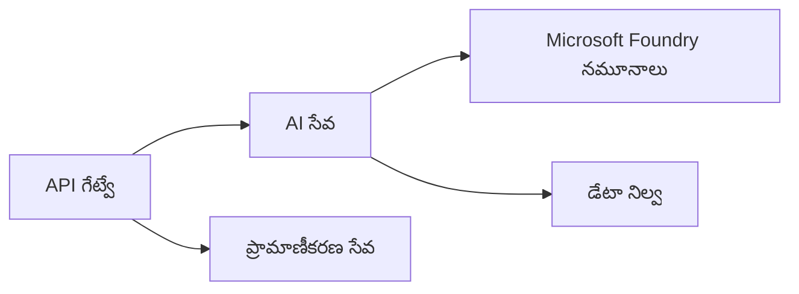
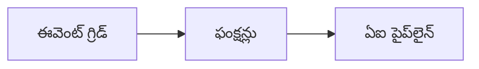

# అధ్యాయం 8: ఉత్పత్తి & ఎంటర్‌ప్రైజ్ నమూనాలు

**📚 కోర్సు**: [AZD ప్రారంభికులకు](../../README.md) | **⏱️ కాల వ్యవధి**: 2-3 hours | **⭐ సంక్లిష్టత**: అధిక స్థాయి

---

## అవలోకనం

ఈ అధ్యాయం ఉత్పత్తి AI వర్క్‌లోడ్‌ల కోసం ఎంటర్‌ప్రైజ్-సిద్ధమైన డిప్లాయ్‌మెంట్ నమూనాలు, భద్రత గట్టీకరణ, మానిటరింగ్ మరియు ఖర్చు ఆప్టిమైజేషన్‌ను కవర్ చేస్తుంది।

> జూన్ 2026లో `azd 1.25.6` తో ధృవీకరించబడింది.

## అభ్యాస లక్ష్యాలు

ఈ అధ్యాయాన్ని పూర్తి చేస్తే మీరు:
- బహు-రిజియన్ స్థాయిలో ప్రతిరోధక అప్లికేషన్లను డిప్లాయ్ చేయగలుగుతారు
- ఎంటర్‌ప్రైజ్ భద్రత నమూనాలను అమలు చేయగలుగుతారు
- విస్తృతంగా మానిటరింగ్‌ను కాన్ఫిగర్ చేయగలుగుతారు
- విస్తృత స్థాయిలో ఖర్చులను ఆప్టిమైజ్ చేయగలుగుతారు
- AZD తో CI/CD పైప్‌లైన్లను సెటప్ చేయగలుగుతారు

---

## 📚 పాఠాలు

| # | పాఠం | వివరణ | సమయం |
|---|--------|-------------|------|
| 1 | [ఉత్పత్తి AI ఆచరణలు](production-ai-practices.md) | ఎంటర్‌ప్రైజ్ డిప్లాయ్‌మెంట్ నమూనాలు | 90 నిమిషాలు |

---

## 🚀 ఉత్పత్తి చెక్‌లిస్ట్

- [ ] ప్రతిరోధకత్వం కోసం బహు-రిజియన్ డిప్లాయ్‌మెంట్
- [ ] ప్రామాణీకరణకు మేనేజ్డ్ ఐడెంటిటీ (కీలు అవసరం లేదు)
- [ ] మానిటరింగ్ కోసం Application Insights
- [ ] ఖర్చు బడ్జెట్లు మరియు అలర్ట్‌లు సెటప్ చేయబడినవి
- [ ] సెక్యూరిటీ స్కానింగ్ సక్రియం
- [ ] CI/CD పైప్‌లైన్ ఇంటిగ్రేషన్
- [ ] దుర్ఘటన పునరుద్ధరణ ప్రణాళిక

---

## 🏗️ ఆర్కిటెక్చర్ నమూనాలు

### నమూనా 1: మైక్రోసర్వీసెస్ AI



### నమూనా 2: ఈవెంట్-డ్రివెన్ AI



---

## 🔐 భద్రత ఉత్తమ పద్ధతులు

```bicep
// Use managed identity
identity: {
  type: 'SystemAssigned'
}

// Private endpoints for AI services
properties: {
  publicNetworkAccess: 'Disabled'
  networkAcls: {
    defaultAction: 'Deny'
  }
}
```

---

## 💰 ఖర్చు ఆప్టిమైజేషన్

| వ్యూహం | ఆదా |
|----------|---------|
| జీరోకు స్కేల్ చేయడం (Container Apps) | 60-80% |
| డెవలప్‌మెంట్ కోసం కన్సంప్షన్ టియర్‌లు ఉపయోగించండి | 50-70% |
| షెడ్యూల్డ్ స్కేలింగ్ | 30-50% |
| రిజర్వ్ చేయబడిన సామర్థ్యం | 20-40% |

```bash
# బడ్జెట్ అలర్ట్‌లను సెట్ చేయండి
az consumption budget create \
  --budget-name "AI-Budget" \
  --amount 500 \
  --category Cost \
  --time-grain Monthly
```

---

## 📊 మానిటరింగ్ సెటప్

```bash
# లాగ్‌లను స్ట్రీమ్ చేయండి
azd monitor --logs

# Application Insightsని తనిఖీ చేయండి
azd monitor --overview

# మెట్రిక్స్‌ను వీక్షించండి
az monitor metrics list --resource <resource-id>
```

---

## 🔗 నావిగేషన్

| దిశ | అధ్యాయం |
|-----------|---------|
| **మునుపటి** | [అధ్యాయం 7: సమస్య పరిష్కారం](../chapter-07-troubleshooting/README.md) |
| **కోర్సు పూర్తి** | [Course Home](../../README.md) |

---

## 📖 సంబంధిత వనరులు

- [AI Agents Guide](../chapter-02-ai-development/agents.md)
- [Application Insights](../chapter-06-pre-deployment/application-insights.md)
- [బహుళ-ఏజెంట్ పరిష్కారాలు](../chapter-05-multi-agent/README.md)
- [మైక్రోసర్వీసెస్ ఉదాహరణ](../../examples/microservices/README.md)

---

<!-- CO-OP TRANSLATOR DISCLAIMER START -->
**అస్వీకరణ**:
ఈ పత్రం AI అనువాద సేవ [Co-op Translator](https://github.com/Azure/co-op-translator) ఉపయోగించి అనువదించబడింది. మేము ఖచ్చితత్వానికి ప్రయత్నిస్తున్నప్పటికీ, ఆటోమేటెడ్ అనువాదాలు తప్పులు లేదా అసమగ్రతలను కలిగి ఉండవచ్చు. దాని స్వదేశ భాషలో ఉన్న అసలు పత్రాన్ని అధికారం కలిగిన మూలంగా పరిగణించాలి. కీలకమైన సమాచారం కోసం, ప్రొఫెషనల్ మానవ అనువాదాన్ని సిఫారసు చేస్తాము. ఈ అనువాదం ఉపయోగం వల్ల కలిగే ఏవైనా అపార్థాలు లేదా తప్పుదారులు కోసం మేము బాధ్యత వహించము.
<!-- CO-OP TRANSLATOR DISCLAIMER END -->