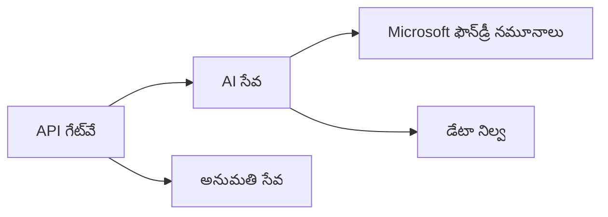

# అధ్యాయం 8: ఉత్పత్తి & ఎంటర్‌ప్రైజ్ నమూనాలు

**📚 కోర్స్**: [AZD ప్రారంభకుల కోసం](../../README.md) | **⏱️ వ్యవధి**: 2-3 గంటలు | **⭐ సంక్లిష్టత**: అధునాతన

---

## అవలోకనం

ఈ అధ్యాయం ఎంటర్‌ప్రైజ్-సిద్ధ డిప్లాయ్‌మెంట్ నమూనాలు, భద్రతా బలం పెంపు, పరిశీలన మరియు ఉత్పత్తి AI పనిబట్టల కోసం ఖర్చు ఆప్టిమైజేషన్‌ను కవర్ చేస్తుంది.

> `azd 1.27.1` లో 2026 జూలైలో ధృవీకరించబడింది.

## అభ్యసన లక్ష్యాలు

ఈ అధ్యాయం పూర్తయిన తర్వాత, మీరు:
- బహుళ-ప్రాంత స్థిరమైన అప్లికేషన్లను డిప్లాయ్ చేయగలుగుతారు
- ఎంటర్‌ప్రైజ్ భద్రతా నమూనాలను అమలు చేయండి
- సమగ్ర పరిశీలన సెట్టింగ్ చేయండి
- పెద్ద స్థాయిలో ఖర్చులను ఆప్టిమైజ్ చేయండి
- AZD తో CI/CD పైప్లైన్లను సెట్ చేయండి

---

## 📚 పాఠాలు

| # | పాఠం | వివరణ | సమయం |
|---|--------|-------------|------|
| 1 | [ఉత్పత్తి AI అనుభవాలు](production-ai-practices.md) | ఎంటర్‌ప్రైజ్ డిప్లాయ్‌మెంట్ నమూనాలు | 90 నిమిషాలు |

---

## 🚀 ఉత్పత్తి చెక్లిస్ట్

- [ ] ప్రతికూలత కోసం బహుళ-ప్రాంత డిప్లాయ్‌మెంట్
- [ ] గుర్తింపునికోసం మేనేజ్ చేయబడిన ఐడెంటిటీ (కీలేమీ లేవు)
- [ ] పరిశీలన కోసం అప్లికేషన్ ఇన్సైట్స్
- [ ] ఖర్చు బడ్జెట్‌లు మరియు అలర్ట్లు సెట్టింగ్
- [ ] భద్రతా స్కానింగ్ సక్రియం
- [ ] CI/CD పైప్లైన్ ఇంటిగ్రేషన్
- [ ] విపత్తు పునరుద్ధరణ ప్రణాళిక

---

## 🏗️ ఆర్కిటెక్చర్ నమూనాలు

### నమూనా 1: మైక్రోసర్వీసెస్ AI



### నమూనా 2: ఈవెంట్-డ్రైవన్ AI


---

## 🔐 భద్రతా ఉత్తమ అభ్యాసాలు

```bicep
// Use managed identity
identity: {
  type: 'SystemAssigned'
}

// Private endpoints for AI services
properties: {
  publicNetworkAccess: 'Disabled'
  networkAcls: {
    defaultAction: 'Deny'
  }
}
```

---

## 💰 ఖర్చు ఆప్టిమైజేషన్

| వ్యూహం | ఆదా |
|----------|---------|
| జీరోకు స్కేల్ చేయడం (కంటైనర్ యాప్స్) | 60-80% |
| అభివృద్ధి కోసం వినియోగ స్థాయిలను ఉపయోగించడం | 50-70% |
| షెడ్యూల్ చేసుకున్న స్కేలింగ్ | 30-50% |
| రిజర్వ్డ్ సామర్థ్యం | 20-40% |

```bash
# బడ్జెట్ అలర్ట్స్ సెట్ చేయండి
az consumption budget create \
  --budget-name "AI-Budget" \
  --amount 500 \
  --category Cost \
  --time-grain Monthly
```

---

## 📊 పరిశీలన సెట్టింగ్

```bash
# స్ట్రీమ్ లాగ్స్
azd monitor --logs

# అప్లికేషన్ ఇన్‌సైట్స్‌ని తనిఖీ చేయండి
azd monitor --overview

# మెట్రిక్స్ చూడండి
az monitor metrics list --resource <resource-id>
```

---

## 🔗 నావిగేషన్

| దిశ | అధ్యాయం |
|-----------|---------|
| **మునుపటి** | [అధ్యాయం 7: సమస్య పరిష్కారం](../chapter-07-troubleshooting/README.md) |
| **కోర్స్ పూర్తయింది** | [కోర్స్ హోమ్](../../README.md) |

---

## 📖 సంబంధిత వనరులు

- [AI ఏజెంట్ల గైడ్](../chapter-02-ai-development/agents.md)
- [అప్లికేషన్ ఇన్సైట్స్](../chapter-06-pre-deployment/application-insights.md)
- [బహుళ ఏజెంట్ పరిష్కారాలు](../chapter-05-multi-agent/README.md)
- [మైక్రోసర్వీసెస్ ఉదాహరణ](../../examples/microservices/README.md)

---

<!-- CO-OP TRANSLATOR DISCLAIMER START -->
**అస్వీకరణ**:
ఈ పత్రం AI అనువాద సేవ [Co-op Translator](https://github.com/Azure/co-op-translator) ఉపయోగించి అనువదించబడింది. మేము ఖచ్చితత్వానికి ప్రయత్నిస్తున్నప్పటికీ, ఆటోమేటెడ్ అనువాదాలు తప్పులు లేదా అసమగ్రతలను కలిగి ఉండవచ్చు. దాని స్వదేశ భాషలో ఉన్న అసలు పత్రాన్ని అధికారం కలిగిన మూలంగా పరిగణించాలి. కీలకమైన సమాచారం కోసం, ప్రొఫెషనల్ మానవ అనువాదాన్ని సిఫారసు చేస్తాము. ఈ అనువాదం ఉపయోగం వల్ల కలిగే ఏవైనా అపార్థాలు లేదా తప్పుదారులు కోసం మేము బాధ్యత వహించము.
<!-- CO-OP TRANSLATOR DISCLAIMER END -->