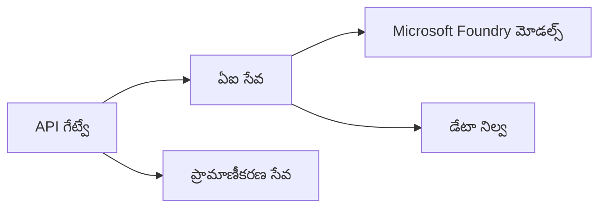
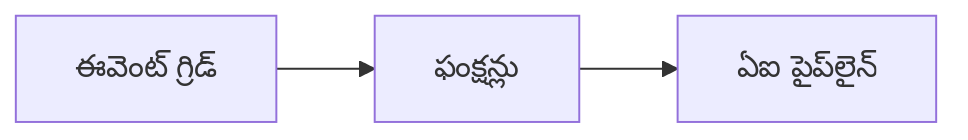

# Chapter 8: ఉత్పత్తి & ఎంటర్ప్రైజ్ నమూనాలు

**📚 కోర్సు**: [AZD For Beginners](../../README.md) | **⏱️ వ్యవధి**: 2-3 hours | **⭐ సంక్లిష్టత**: అధిక స్థాయి

---

## అవలోకనం

ఈ అధ్యాయం ప్రొడక్షన్ AI పనిభారాల కోసం ఎంటర్ప్రైజ్-సిద్ధ డిప్లాయ్‌మెంట్ నమూనాలు, భద్రత బలపరిచడం, మానిటరింగ్ మరియు ఖర్చు ఆప్టిమైజేషన్‌ను కవర్ చేస్తుంది.

## నేర్చుకోవడం లక్ష్యాలు

ఈ అధ్యాయం పూర్తి చేయడంతో, మీరు:
- బహు-రిజియన్ మన్నించగల అప్లికేషన్లను డిప్లాయ్ చేయండి
- ఎంటర్ప్రైజ్ భద్రతా నమూనాలను అమలు చేయండి
- సమగ్ర మానిటరింగ్‌ను కాన్ఫిగర్ చేయండి
- పరిమాణంలో ఖర్చులను ఆప్టిమైజ్ చేయండి
- AZD తో CI/CD పైప్‌లైన్లను ఏర్పాటు చేయండి

---

## 📚 పాఠాలు

| # | పాఠం | వివరణ | సమయం |
|---|--------|-------------|------|
| 1 | [ప్రొడక్షన్ AI ఆచరణలు](production-ai-practices.md) | ఎంటర్‌ప్రైజ్ డిప్లాయ్‌మెంట్ నమూనాలు | 90 నిమిషాలు |

---

## 🚀 ఉత్పత్తి చెక్లిస్ట్

- [ ] బహు-రిజియన్ డిప్లాయ్‌మెంట్ ద్వారా ప్రతిరోధకత్వాన్ని నిర్ధారించండి
- [ ] ప్రామాణీకరణ కోసం మెనేజ్‌డ్ ఐడెంటిటీ (కీలు లేవు)
- [ ] మానిటరింగ్ కోసం Application Insights
- [ ] ఖర్చు బడ్జెట్లు మరియు అలర్ట్‌లు కాన్ఫిగర్ చేయండి
- [ ] భద్రతా స్కానింగ్‌ను ఎనేబుల్ చేయండి
- [ ] CI/CD పైప్‌లైన్ ఇంటిగ్రేషన్
- [ ] డిజాస్టర్ రికవరీ ప్రణాళిక

---

## 🏗️ ఆర్కిటెక్చర్ నమూనాలు

### నమూనా 1: మైక్రోసర్వీసెస్ AI


### నమూనా 2: ఈవెంట్-డ్రివన్ AI


---

## 🔐 భద్రత ఉత్తమ ఆచరణలు

```bicep
// Use managed identity
identity: {
  type: 'SystemAssigned'
}

// Private endpoints for AI services
properties: {
  publicNetworkAccess: 'Disabled'
  networkAcls: {
    defaultAction: 'Deny'
  }
}
```

---

## 💰 ఖర్చు ఆప్టిమైజేషన్

| వ్యూహం | ఆదా |
|----------|---------|
| శూన్యానికి స్కేల్ చేయడం (Container Apps) | 60-80% |
| డెవ్ కోసం కన్‌సంప్షన్ టియర్లు ఉపయోగించండి | 50-70% |
| షెడ్యూల్డ్ స్కేలింగ్ | 30-50% |
| రిజర్వ్డ్ కెపాసిటీ | 20-40% |

```bash
# బడ్జెట్ అలర్ట్‌లను సెట్ చేయండి
az consumption budget create \
  --budget-name "AI-Budget" \
  --amount 500 \
  --category Cost \
  --time-grain Monthly
```

---

## 📊 మానిటరింగ్ సెటప్

```bash
# లాగ్‌లను స్ట్రీమ్ చేయండి
azd monitor --logs

# Application Insightsని తనిఖీ చేయండి
azd monitor

# మెట్రిక్‌లు చూడండి
az monitor metrics list --resource <resource-id>
```

---

## 🔗 నావిగేషన్

| దిశ | అధ్యాయం |
|-----------|---------|
| **మునుపటి** | [అధ్యాయం 7: ట్రబుల్‌షూటింగ్](../chapter-07-troubleshooting/README.md) |
| **కోర్సు పూర్తి** | [కోర్సు హోమ్](../../README.md) |

---

## 📖 సంబంధిత వనరులు

- [AI Agents Guide](../chapter-02-ai-development/agents.md)
- [Application Insights](../chapter-06-pre-deployment/application-insights.md)
- [Multi-Agent Solutions](../chapter-05-multi-agent/README.md)
- [Microservices Example](../../examples/microservices/README.md)

---

<!-- CO-OP TRANSLATOR DISCLAIMER START -->
**నిరాకరణ**:
ఈ పత్రాన్ని AI అనువాద సేవ [Co-op Translator](https://github.com/Azure/co-op-translator) ఉపయోగించి అనువదించారు. మేము ఖచ్చితత్వానికి ప్రయత్నించినప్పటికీ, స్వయంచాలక అనువాదాల్లో తప్పులు లేదా పొరపాట్లు ఉండవచ్చు అని దయచేసి గమనించండి. మూల భాషలోని అసలు పత్రాన్ని ప్రామాణిక మూలంగా పరిగణించాలి. కీలకమైన సమాచారానికి, వృత్తిపరమైన మానవ అనువాదాన్ని సిఫార్సు చేస్తాము. ఈ అనువాదాన్ని ఉపయోగించడం వల్ల ఏర్పడే ఏవైనా అపార్థాలు లేదా తప్పుగా అర్థం చేసుకోవడాల కోసం మేము బాధ్యులు కాదు.
<!-- CO-OP TRANSLATOR DISCLAIMER END -->